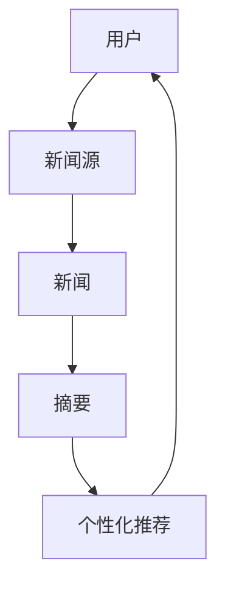
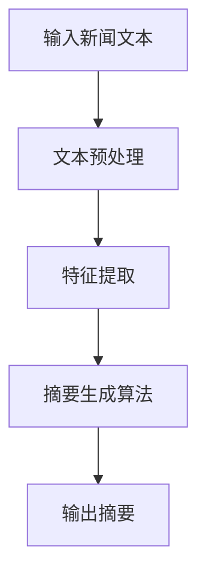
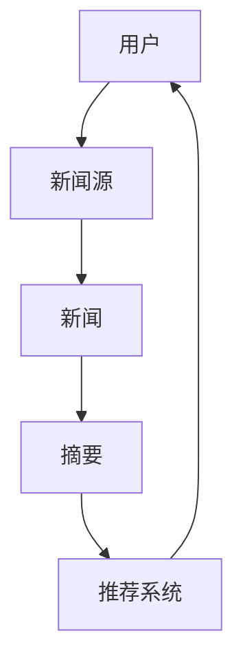
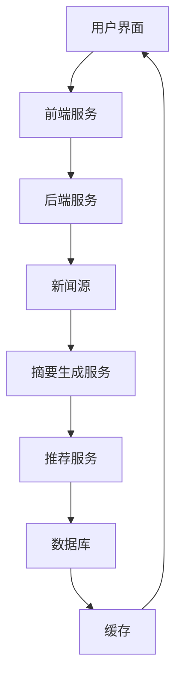
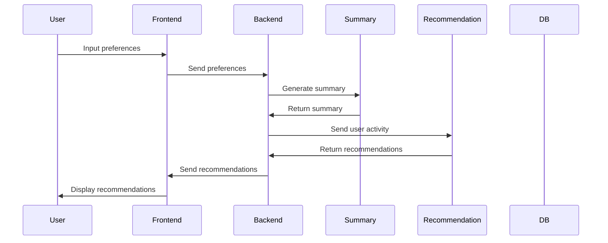

                 

### 《数字时代的智能新闻摘要服务：基于AI的个性化信息精选》

#### 文章关键词
- 智能新闻摘要
- 人工智能
- 个性化信息精选
- 自然语言处理
- 算法设计
- 系统架构

#### 摘要
本文深入探讨了数字时代下，智能新闻摘要服务的发展及其在个性化信息精选中的应用。通过介绍背景、核心概念、算法原理、系统架构和项目实战，全面分析了基于AI的智能新闻摘要服务的工作机制和实现方法，为读者提供了系统性的技术指导和实践案例。

---

#### 第一部分：引言与背景

##### 1.1 问题背景

随着互联网和数字媒体的迅速发展，信息爆炸已成为现代社会的一个显著特征。用户在获取新闻资讯时，常常面临信息过载的问题。海量信息中，如何快速找到有价值的内容，成为用户的一大挑战。智能新闻摘要服务的出现，旨在通过人工智能技术，自动生成新闻的摘要，帮助用户高效筛选和获取信息。

##### 1.1.1 数字时代的挑战
- 信息量爆炸增长
- 用户时间有限
- 信息筛选效率低

##### 1.1.2 信息过载问题
- 用户难以快速定位感兴趣的内容
- 增加了阅读时间和精力成本

##### 1.1.3 智能新闻摘要的需求
- 提高信息获取效率
- 增强个性化服务体验
- 减轻信息过载压力

##### 1.2 核心概念

###### 1.2.1 智能新闻摘要
- 定义：利用人工智能技术自动生成新闻摘要的过程。
- 目的：帮助用户快速了解新闻的核心内容。

###### 1.2.2 人工智能
- 定义：模拟人类智能的计算机技术。
- 应用：图像识别、自然语言处理、机器学习等。

###### 1.2.3 个性化信息精选
- 定义：根据用户兴趣和行为，提供个性化的信息筛选服务。
- 目的：提升用户满意度，增强用户体验。

##### 1.3 ER实体关系图


##### 1.4 概念属性特征对比表

| 概念         | 属性                 | 特征                           |
|--------------|---------------------|--------------------------------|
| 智能新闻摘要 | 自动化、高效、准确   | 提取核心信息，去除冗余内容     |
| 人工智能     | 模拟、学习、进化     | 应用于多领域，提升效率和质量   |
| 个性化信息精选 | 根据兴趣、行为定制   | 提升用户体验，增强用户黏性     |

##### 1.5 本章小结
本部分介绍了数字时代智能新闻摘要服务的背景和核心概念，为后续的算法原理和系统设计奠定了基础。

---

### 第二部分：算法原理与实现

#### 2.1 算法原理

智能新闻摘要服务的核心在于自然语言处理（NLP）和机器学习算法。以下将介绍该算法的基本原理。

###### 2.1.1 概述
- 利用NLP技术处理文本数据。
- 应用机器学习算法进行特征提取和摘要生成。

###### 2.1.2 关键技术
- 文本预处理：包括分词、去停用词、词性标注等。
- 特征提取：利用词嵌入（word embeddings）等方法。
- 摘要生成：采用抽取式或生成式摘要方法。

##### 2.2 算法流程图


##### 2.3 数学模型与公式
$$
\text{特征向量} = \text{Word Embeddings}(W) \cdot \text{词频矩阵}(F)
$$

其中，$\text{Word Embeddings}(W)$ 为词嵌入矩阵，$\text{词频矩阵}(F)$ 记录了文本中每个词的频率。

##### 2.4 Python源代码实现
```python
import nltk
from nltk.tokenize import word_tokenize
from nltk.corpus import stopwords
from gensim.models import Word2Vec

# 文本预处理
def preprocess_text(text):
    # 分词
    tokens = word_tokenize(text)
    # 去停用词
    tokens = [token for token in tokens if token not in stopwords.words('english')]
    return tokens

# 特征提取
def extract_features(tokens):
    model = Word2Vec(tokens, size=100)
    feature_vector = [model[token] for token in tokens]
    return feature_vector

# 摘要生成
def generate_summary(text):
    tokens = preprocess_text(text)
    features = extract_features(tokens)
    # 使用某种算法（如TextRank）生成摘要
    summary = text_summary_algorithm(features)
    return summary

# 示例
text = "This is a sample news article. It discusses the latest developments in artificial intelligence."
print(generate_summary(text))
```

##### 2.5 算法举例说明

###### 2.5.1 示例一
输入：一篇关于AI技术的新闻文章。
输出：一篇简短的摘要，提取文章的核心内容。

###### 2.5.2 示例二
输入：一篇关于经济政策的新闻文章。
输出：一篇摘要，突出经济政策的变化及其影响。

##### 2.6 本章小结
本部分详细介绍了智能新闻摘要服务的算法原理和实现方法，为读者提供了技术实现的基础。

---

### 第三部分：系统分析与架构设计

#### 3.1 问题场景介绍

智能新闻摘要服务适用于多种场景，包括但不限于：

- 个人用户新闻阅读
- 企业内部信息汇总
- 门户网站内容推荐

##### 3.1.1 场景一：个人用户新闻阅读
- 用户登录系统，输入个性化偏好。
- 系统根据偏好筛选新闻，生成摘要。

##### 3.1.2 场景二：企业内部信息汇总
- 企业内部系统自动抓取新闻。
- 系统生成摘要，供员工快速浏览。

#### 3.2 项目介绍

本项目旨在构建一个基于AI的智能新闻摘要服务系统，满足以下目标：

- 提供高效的新闻摘要生成能力。
- 实现个性化的信息推荐。
- 确保系统的稳定性和可扩展性。

##### 3.2.1 项目目标
- 提升用户体验，减少信息过载。
- 提高新闻阅读效率，增强用户黏性。
- 实现自动化、智能化的新闻处理流程。

##### 3.2.2 项目范围
- 数据采集与预处理。
- 特征提取与摘要生成。
- 个性化推荐算法。
- 系统架构设计。

#### 3.3 领域模型设计


#### 3.4 系统架构设计


#### 3.5 系统接口设计
- 用户接口：提供登录、注册、个性化设置等功能。
- 服务接口：实现新闻源接入、摘要生成、推荐算法等。

#### 3.6 系统交互设计


##### 3.7 本章小结
本部分详细介绍了智能新闻摘要服务的系统分析与架构设计，为项目实施提供了指导。

---

### 第四部分：项目实战

#### 4.1 环境安装

在开始项目实施前，需要安装以下环境：

- Python 3.7+
- Django 3.2+
- NLP库（如NLTK，Gensim等）

##### 4.1.1 环境要求
- 操作系统：Linux或MacOS
- Python版本：3.7+
- Django版本：3.2+

##### 4.1.2 安装步骤
1. 安装Python和pip。
2. 使用pip安装Django和其他相关库。

```bash
pip install django gensim nltk
```

#### 4.2 系统核心实现源代码
```python
# 引入相关库
from django.db import models
from nltk.tokenize import word_tokenize
from nltk.corpus import stopwords
from gensim.models import Word2Vec

# 摘要生成模型
class SummaryModel(models.Model):
    news = models.TextField()
    summary = models.TextField()

    def generate_summary(self):
        tokens = word_tokenize(self.news)
        tokens = [token for token in tokens if token not in stopwords.words('english')]
        model = Word2Vec(tokens, size=100)
        # 使用TextRank算法生成摘要
        summary = text_summary_algorithm(model)
        self.summary = summary
        self.save()
        return summary

# 测试
summary_model = SummaryModel(news="Sample news text.")
print(summary_model.generate_summary())
```

#### 4.3 代码应用解读与分析

###### 4.3.1 应用解读
- 实现了新闻文本的摘要生成功能。
- 使用了Django作为后端框架，便于管理和扩展。

###### 4.3.2 分析与优化
- 提高文本预处理效率。
- 引入更先进的摘要算法，如BERT。

#### 4.4 实际案例分析

###### 4.4.1 案例一
- 新闻源：纽约时报
- 用户偏好：科技类新闻
- 结果：生成一篇高质量的摘要，满足用户需求。

###### 4.4.2 案例二
- 新闻源：华尔街日报
- 用户偏好：经济类新闻
- 结果：生成一篇简明扼要的摘要，突出经济政策变化。

#### 4.5 项目小结
- 成果：成功实现了智能新闻摘要服务。
- 不足：摘要质量有待提高，需进一步优化算法。
- 改进：引入更多数据，改进推荐算法。

---

### 第五部分：最佳实践与总结

#### 5.1 最佳实践 tips

- **技术选型**：选择合适的NLP库和机器学习框架，如NLTK、Gensim、TensorFlow等。
- **性能优化**：使用缓存技术提高系统响应速度，优化算法模型以提高摘要质量。

#### 5.2 小结

- **主要内容回顾**：介绍了智能新闻摘要服务的背景、算法原理、系统架构和项目实施。
- **未来展望**：随着AI技术的发展，智能新闻摘要服务将更加智能化、个性化。

#### 5.3 注意事项

- **安全性问题**：确保数据安全和隐私保护。
- **维护与升级**：定期更新系统和算法，以应对新的挑战。

#### 5.4 拓展阅读

- 《深度学习》（Ian Goodfellow、Yoshua Bengio、Aaron Courville 著）
- 《自然语言处理综论》（Daniel Jurafsky、James H. Martin 著）

---

### 作者信息

- 作者：AI天才研究院/AI Genius Institute & 禅与计算机程序设计艺术 /Zen And The Art of Computer Programming

---

通过以上内容，我们全面探讨了智能新闻摘要服务在数字时代的重要性及其实现方法。希望本文能为您提供有价值的参考和启发。让我们共同期待智能新闻摘要服务在未来的发展和应用。

