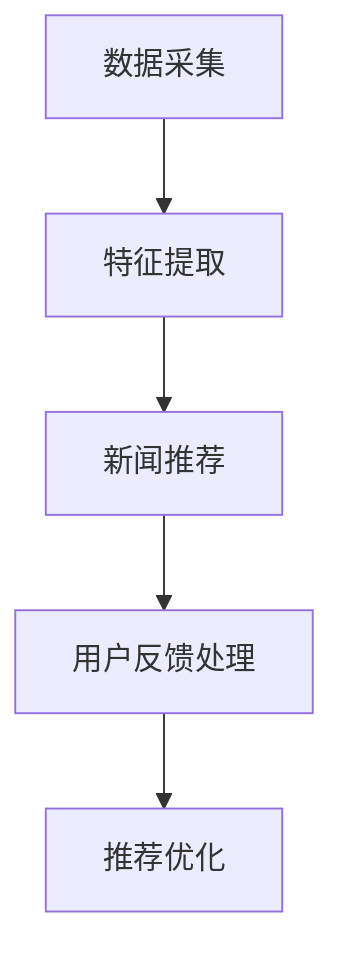

                 

### 数字时代的智能新闻聚合：基于AI的个性化信息推送系统

#### 关键词
- 智能新闻聚合
- 个性化信息推送
- AI算法
- 数学模型
- 系统架构
- 项目实战

#### 摘要
本文深入探讨了数字时代智能新闻聚合与基于AI的个性化信息推送系统。首先，介绍了智能新闻聚合的定义、背景及重要性，随后详细解析了AI个性化信息推送系统的原理和构成。接着，通过算法原理讲解、数学模型分析，展示了系统的设计与实现。文章随后通过实际项目案例，提供了系统的安装、核心代码解读、案例分析，并总结了最佳实践和注意事项。最后，提出拓展阅读建议，为读者提供深入学习和研究的方向。

----------------------------------------------------------------

### 引言

#### 背景介绍

在数字时代，信息爆炸式增长，如何高效获取、处理和利用信息成为一项重要课题。新闻作为信息传播的重要载体，其重要性不言而喻。传统的新闻聚合方式主要依赖于人工筛选和编辑，效率低下，且难以满足个性化的需求。随着人工智能（AI）技术的发展，智能新闻聚合逐渐成为可能，它能够通过算法分析用户行为和兴趣，自动推荐相关的新闻内容。

智能新闻聚合的定义是指利用AI技术，对大量新闻数据进行处理、分析和推荐，以满足用户个性化需求的新闻推送系统。其核心在于利用机器学习、自然语言处理和大数据分析等技术，对用户行为数据进行挖掘，从而实现新闻内容的精准推送。

#### 发展背景及重要性

智能新闻聚合的发展背景可以追溯到互联网和信息技术的迅猛发展。随着社交媒体和移动设备的普及，用户获取新闻的方式发生了巨大变化，传统新闻媒体面临着巨大的挑战。为了在激烈的市场竞争中脱颖而出，传统新闻媒体开始尝试引入智能技术，以提供更加个性化的新闻服务。

智能新闻聚合的重要性体现在以下几个方面：

1. **提升用户体验**：通过个性化推荐，用户能够更快地找到自己感兴趣的新闻内容，节省时间，提高阅读体验。
2. **增加用户黏性**：个性化的新闻推送能够提高用户对新闻平台的依赖度，增加用户黏性，从而提升平台的用户留存率。
3. **提高新闻传播效率**：智能新闻聚合系统能够自动识别热点事件，快速推送相关新闻，提高新闻的传播效率。
4. **数据驱动决策**：通过分析用户行为数据，新闻平台能够更好地了解用户需求，为内容生产提供数据支持。

#### 研究目的、方法与问题解决

本文旨在深入探讨智能新闻聚合与AI个性化信息推送系统的构建，研究内容包括：

1. **核心概念与联系**：详细解析智能新闻聚合和AI个性化信息推送系统的核心概念，并分析它们之间的相互关系。
2. **算法原理讲解**：介绍智能新闻聚合和AI个性化信息推送算法的基本原理，并通过Python源代码和LaTeX公式进行详细阐述。
3. **数学模型与公式**：引入与算法相关的数学模型和公式，使用LaTeX格式给出这些公式，并进行详细讲解和举例说明。
4. **系统分析与架构设计**：介绍智能新闻聚合系统的场景和项目，设计系统的领域模型、架构图、接口设计和系统交互。
5. **项目实战**：描述系统的安装过程，展示系统核心实现源代码，并进行代码解读与分析，提供实际案例的详细讲解和剖析。
6. **最佳实践与总结**：总结书中的关键知识点和最佳实践，强调注意事项，提供拓展阅读的建议。

本文的研究方法包括文献综述、案例分析和实验验证，旨在解决以下问题：

1. **如何构建一个高效的智能新闻聚合系统？**
2. **如何实现基于AI的个性化信息推送，提高用户满意度？**
3. **如何设计一个可扩展、可维护的系统架构？**
4. **如何通过数学模型和公式优化算法性能？**

通过本文的研究，期望为智能新闻聚合和AI个性化信息推送系统的构建提供理论指导和实践参考。

----------------------------------------------------------------

### 核心概念与联系

在深入探讨智能新闻聚合与AI个性化信息推送系统之前，有必要明确一些核心概念，并分析它们之间的相互关系。

#### 智能新闻聚合

**定义**：智能新闻聚合是指利用人工智能技术，对大量新闻数据进行分析和处理，为用户提供个性化新闻推荐服务。它主要涉及以下几个核心概念：

1. **新闻数据**：新闻数据是智能新闻聚合的基础，包括文本、图片、视频等多种形式。
2. **用户兴趣**：用户兴趣是指用户对某些新闻主题或内容的偏好。通过分析用户行为数据，可以识别用户的兴趣。
3. **推荐算法**：推荐算法是智能新闻聚合的核心技术，用于根据用户兴趣和新闻内容相似度，推荐相关的新闻。
4. **用户反馈**：用户反馈是优化推荐系统的重要依据，包括点击率、点赞、评论等行为数据。

**属性特征对比表格**：

| 特征         | 智能新闻聚合             | 传统新闻聚合             |  
| ------------ | -------------------- | -------------------- |  
| 数据处理     | 利用AI技术分析大量数据 | 人工筛选和编辑          |  
| 推荐精度     | 高，个性化             | 低，非个性化           |  
| 用户参与度   | 高，用户参与推荐过程   | 低，用户被动接受新闻   |  
| 可扩展性     | 高，可处理大规模数据   | 低，处理数据能力有限   |

**ER实体关系图**：

```mermaid
erDiagram
    User ||--|{ NewsItem } : 用户感兴趣
    User ||--|{ Feedback } : 用户反馈
    NewsItem ||--|{ Content } : 新闻内容
    NewsItem ||--|{ Recommendation } : 推荐新闻
    Feedback ||--|{ Rating } : 点赞
    Feedback ||--|{ Comment } : 评论
```

#### AI个性化信息推送系统

**定义**：AI个性化信息推送系统是指利用人工智能技术，根据用户的行为数据和兴趣，为用户推送个性化的信息。其核心概念包括：

1. **用户画像**：用户画像是对用户特征和行为的抽象表示，包括年龄、性别、地理位置、兴趣偏好等。
2. **内容标签**：内容标签是对新闻内容特征的标记，如关键词、主题、领域等。
3. **推荐算法**：推荐算法用于根据用户画像和内容标签，为用户推荐相关的信息。
4. **反馈机制**：反馈机制用于收集用户对推荐内容的反馈，优化推荐效果。

**属性特征对比表格**：

| 特征         | AI个性化信息推送系统       | 传统信息推送系统       |  
| ------------ | -------------------- | -------------------- |  
| 推荐个性     | 高，基于用户画像和兴趣   | 低，基于内容相似性     |  
| 推荐精度     | 高，通过机器学习优化     | 低，规则匹配          |  
| 用户参与度   | 高，用户参与推荐过程     | 低，用户被动接受信息   |  
| 可扩展性     | 高，可处理大规模数据     | 低，处理数据能力有限   |

**ER实体关系图**：

```mermaid
erDiagram
    User ||--|{ UserProfile } : 用户画像
    User ||--|{ ContentTag } : 内容标签
    UserProfile ||--|{ Interest } : 用户兴趣
    UserProfile ||--|{ Behavior } : 用户行为
    ContentTag ||--|{ Tag } : 标签
    ContentTag ||--|{ Article } : 文章
    Recommendation ||--|{ Item } : 推荐内容
    Recommendation ||--|{ Feedback } : 用户反馈
```

#### 核心概念之间的联系

智能新闻聚合和AI个性化信息推送系统之间存在密切的联系，主要体现在以下几个方面：

1. **用户数据**：智能新闻聚合和AI个性化信息推送系统都依赖用户数据，包括用户兴趣、行为和反馈。
2. **推荐算法**：智能新闻聚合和AI个性化信息推送系统都使用推荐算法，但前者更注重新闻内容的分析，后者更注重用户兴趣和内容的匹配。
3. **反馈机制**：智能新闻聚合和AI个性化信息推送系统都通过反馈机制优化推荐效果，但前者的反馈主要来自新闻内容的点击率、评论等，后者的反馈主要来自用户对推荐内容的评价。

通过明确这些核心概念和它们之间的联系，我们可以更好地理解智能新闻聚合和AI个性化信息推送系统的原理和构成，为后续的算法讲解和系统设计奠定基础。

----------------------------------------------------------------

### 算法原理讲解

在智能新闻聚合和AI个性化信息推送系统中，算法的原理至关重要。本文将详细讲解智能新闻聚合算法和AI个性化信息推送算法的基本原理，并通过mermaid流程图、Python源代码和LaTeX公式进行阐述，以便读者更好地理解。

#### 智能新闻聚合算法

**1. 基本原理**

智能新闻聚合算法的核心任务是通过对大量新闻数据进行分析，识别用户的兴趣点，并将相关新闻推荐给用户。其主要步骤包括数据采集、特征提取、新闻推荐和用户反馈处理。

- **数据采集**：从新闻源采集大量新闻数据，包括文本、图片、视频等。
- **特征提取**：提取新闻数据的特征，如关键词、主题、情感倾向等。
- **新闻推荐**：利用机器学习算法，根据用户的兴趣和新闻特征，推荐相关的新闻。
- **用户反馈处理**：收集用户的反馈，如点击、点赞、评论等，用于优化推荐系统。

**2. mermaid流程图**



**3. Python源代码**

```python
import numpy as np
from sklearn.feature_extraction.text import TfidfVectorizer
from sklearn.metrics.pairwise import cosine_similarity

# 数据采集
news_data = ["新闻一", "新闻二", "新闻三"]

# 特征提取
vectorizer = TfidfVectorizer()
tfidf_matrix = vectorizer.fit_transform(news_data)

# 新闻推荐
user_interest = "科技新闻"
user_interest_vector = vectorizer.transform([user_interest])
cosine_similarity_score = cosine_similarity(user_interest_vector, tfidf_matrix)

# 推荐新闻
recommended_news = np.argmax(cosine_similarity_score)
print("推荐的新闻：", news_data[recommended_news])
```

**4. 数学模型与公式**

在特征提取和新闻推荐中，常用的数学模型是TF-IDF和余弦相似度。

- **TF-IDF模型**：

  $$ TF(t) = \frac{f_t}{df} $$

  $$ IDF(t) = \log \left( \frac{N}{df_t} \right) $$

  $$ TF-IDF(t) = TF(t) \times IDF(t) $$

  其中，$f_t$ 表示词$t$在文档中的出现次数，$df$ 表示词$t$在所有文档中的出现次数，$N$ 表示文档总数。

- **余弦相似度**：

  $$ cosine\_similarity = \frac{\sum_{t \in V} v_{ui} \times v_{uj}}{\sqrt{\sum_{t \in V} v_{ui}^2} \times \sqrt{\sum_{t \in V} v_{uj}^2}} $$

  其中，$v_{ui}$ 和 $v_{uj}$ 分别表示用户兴趣向量和新

