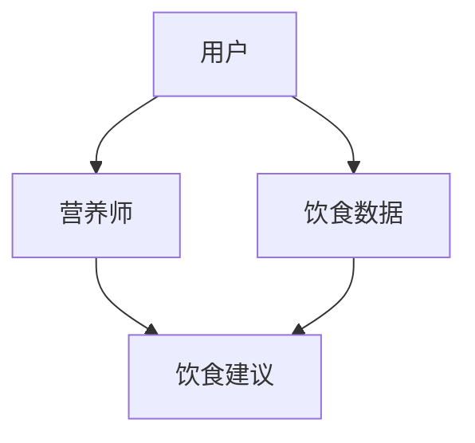
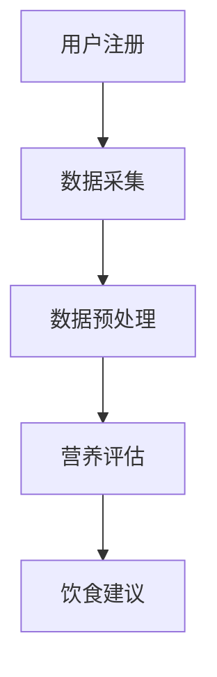
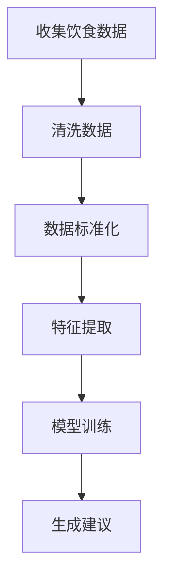
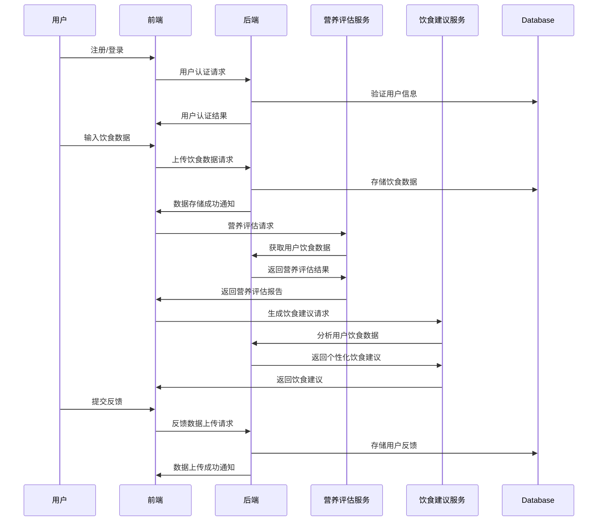

                 

## 数字时代的智能饮食规划：AI营养师的个性化膳食建议

在数字化的浪潮中，人工智能（AI）正逐渐渗透到我们生活的各个方面，为人们提供更加个性化、高效的服务。饮食健康作为人们日常生活的重要组成部分，也逐渐受到AI技术的关注。本文将探讨数字时代下的智能饮食规划，特别是在AI营养师的帮助下如何为用户提供个性化的膳食建议。

### 关键词

- **数字饮食规划**、**人工智能**、**营养师**、**个性化膳食建议**、**数据驱动**

### 摘要

随着科技的进步，AI技术在饮食健康领域的应用日益广泛。本文首先介绍了数字饮食规划的背景和现状，分析了当前个性化饮食需求的迫切性。接着，我们探讨了智能饮食规划系统的构成和原理，包括用户数据收集、分析及算法模型的应用。随后，文章详细讲解了智能饮食规划的核心算法原理，并通过具体的Python代码示例进行了说明。在此基础上，文章进一步探讨了智能饮食规划系统的整体架构和交互设计，并展示了项目实战的详细过程。最后，文章提出了智能饮食规划的最佳实践和建议，总结了文章的核心观点。

## 目录大纲设计

### 第一部分：背景介绍

#### 第1章：数字饮食与健康

##### 1.1 问题背景

- **数字饮食规划现状**：
  - 人工智能技术在饮食健康领域的应用逐渐普及。
  - 数字化工具帮助用户跟踪饮食和营养摄入。

##### 1.2 问题描述

- **个性化饮食需求**：
  - 不同人群的饮食需求差异显著。
  - 需要一种智能工具来提供个性化的饮食建议。

##### 1.3 问题解决

- **智能饮食规划系统**：
  - 利用AI技术分析用户数据，提供个性化饮食建议。
  - 集成多种算法模型，确保饮食建议的科学性和实用性。

##### 1.4 边界与外延

- **适用范围**：
  - 针对有特定营养需求的用户。
  - 需要具备一定的科技素养以使用相关工具。

##### 1.5 概念结构与核心要素

- **核心概念**：
  - 数字饮食规划
  - 智能营养师
  - 用户数据

### 第二部分：核心概念与联系

#### 第2章：智能饮食规划的核心概念

##### 2.1 智能饮食规划原理

- **用户数据收集与分析**：
  - 利用传感器和数据采集工具收集用户饮食信息。
  - 通过算法分析，提取关键营养指标。

##### 2.2 核心概念属性特征对比

- **常见算法对比**：

  | 算法名称 | 特点 | 应用场景 |
  |----------|------|---------|
  | 决策树 | 简单易懂 | 分类任务 |
  | 支持向量机 | 高效准确 | 回归和分类 |
  | 神经网络 | 复杂模型 | 多层特征提取 |

##### 2.3 ER实体关系图

- **智能饮食规划ER图**：

  ```mermaid
  graph TD
  A[用户] --> B[饮食数据]
  A --> C[营养师]
  C --> D[饮食建议]
  B --> D
  ```

### 第三部分：算法原理讲解

#### 第3章：智能饮食规划算法原理

##### 3.1 算法mermaid流程图

- **用户数据收集流程**：

  ```mermaid
  graph TD
  A[用户注册] --> B[数据采集]
  B --> C[数据预处理]
  C --> D[营养评估]
  D --> E[饮食建议]
  ```

##### 3.2 Python源代码

- **用户数据预处理示例**：

  ```python
  import pandas as pd

  def preprocess_data(data):
      # 数据清洗
      data = data.dropna()
      # 数据标准化
      data = (data - data.mean()) / data.std()
      return data

  data = pd.read_csv('diet_data.csv')
  preprocessed_data = preprocess_data(data)
  ```

##### 3.3 算法原理与数学模型

- **决策树算法原理**：

  - **ID3算法**：基于信息增益选择最佳特征。
  - **C4.5算法**：在ID3算法基础上增加了剪枝和连续值处理。

##### 3.4 算法举例说明

- **举例**：根据用户身高、体重、年龄等数据，预测其最佳饮食建议。

### 第四部分：系统分析与架构设计

#### 第4章：智能饮食规划系统架构

##### 4.1 问题场景介绍

- **目标用户**：关注健康的成年人。
- **系统功能**：提供个性化饮食建议和营养跟踪。

##### 4.2 系统架构设计

- **前端**：提供用户交互界面。
- **后端**：数据处理和算法模型。

##### 4.3 系统接口设计

- **API接口**：用户数据收集、营养评估、饮食建议。

##### 4.4 系统交互mermaid序列图

- **用户与系统交互序列图**：

  ```mermaid
  graph TD
  A[用户登录] --> B[数据上传]
  B --> C[营养评估]
  C --> D[饮食建议]
  D --> E[用户反馈]
  ```

### 第五部分：项目实战

#### 第5章：智能饮食规划项目实战

##### 5.1 环境安装

- **安装Python环境**。
- **安装相关库**：如TensorFlow、Pandas等。

##### 5.2 系统核心实现

- **数据采集与预处理**：
  - 设计数据采集模块，收集用户饮食数据。
  - 实现数据清洗和标准化，为算法分析做准备。

- **算法模型应用**：
  - 选择适合的算法模型进行用户饮食数据的分析。
  - 使用决策树或神经网络等算法，预测最佳饮食建议。

- **结果展示**：
  - 设计结果展示界面，让用户直观地看到个性化饮食建议。
  - 提供详细的营养分析报告，帮助用户更好地理解自己的饮食需求。

##### 5.3 实际案例分析

- **案例一**：针对减肥用户，提供低热量、高纤维的饮食建议。
- **案例二**：针对运动爱好者，提供高蛋白、低脂肪的饮食建议。

##### 5.4 项目小结

- **总结经验**：
  - 系统在实际应用中遇到了哪些问题，如何解决的？
  - 用户体验如何，用户反馈如何？

- **展望未来**：
  - 智能饮食规划的未来发展方向。
  - 新技术和新算法如何应用于智能饮食规划。

## 第一部分：背景介绍

### 第1章：数字饮食与健康

#### 1.1 问题背景

在数字时代，人工智能（AI）正在改变我们的生活方式，从智能家居到自动驾驶，AI的应用无处不在。在饮食健康领域，AI同样展现出了巨大的潜力。随着人们对健康饮食的关注不断增加，传统的饮食建议和营养指导已无法满足个性化需求。数字化工具和AI技术为饮食规划提供了新的可能性。

#### 数字饮食规划现状

近年来，数字饮食规划工具逐渐普及。这些工具利用传感器、智能设备和应用程序，帮助用户实时跟踪饮食和营养摄入。例如，一些智能手环和健康监测设备可以记录用户的日常饮食，分析营养摄入情况，并提供相应的建议。此外，应用程序如MyFitnessPal和Nutrify等，也通过用户输入的饮食数据，生成营养报告和个性化饮食建议。

#### 数字化工具在饮食健康领域的应用

数字化工具在饮食健康领域的主要应用包括：

1. **饮食记录与跟踪**：用户可以通过应用程序输入饮食信息，系统会自动记录并分析用户的饮食习惯和营养摄入。
2. **营养评估**：根据用户的饮食记录，系统能够分析用户的营养摄入状况，识别潜在的营养不足或过剩。
3. **个性化饮食建议**：基于用户的饮食数据和健康目标，系统可以提供个性化的饮食建议，包括食物选择、饮食搭配和餐量控制。

#### 1.2 问题描述

尽管数字饮食规划工具在帮助用户管理饮食方面发挥了重要作用，但依然存在一些问题。首先，不同人群的饮食需求差异显著，例如，减肥者、健身爱好者和老年人对饮食的要求各不相同。传统的饮食建议往往过于笼统，无法满足个性化需求。其次，用户对于数字工具的依赖可能导致数据不准确或隐私泄露的问题。

#### 个性化饮食需求

个性化饮食需求的迫切性体现在以下几个方面：

1. **健康状况差异化**：不同健康状况的用户需要不同的饮食建议。例如，糖尿病患者需要控制血糖，高血压患者需要减少盐分摄入。
2. **生活方式差异**：工作忙碌的职场人士和退休的老人在饮食安排上会有不同的需求。前者可能需要快速便捷的饮食方案，而后者可能需要更加健康和均衡的饮食。
3. **饮食习惯变化**：随着健康意识的提升，越来越多的人开始关注自己的饮食习惯，希望通过调整饮食来改善健康。

#### 1.3 问题解决

为了解决上述问题，需要一种更加智能和个性化的饮食规划工具。智能饮食规划系统应具备以下特点：

1. **数据分析能力**：系统能够收集和分析用户的饮食习惯和营养摄入数据，提供准确的营养评估。
2. **个性化建议**：基于用户的个性化数据和健康目标，系统能够提供量身定制的饮食建议。
3. **实时更新**：系统能够根据最新的研究和数据，不断更新和优化饮食建议。

#### 智能饮食规划系统

智能饮食规划系统是利用AI技术，通过对用户数据的收集、分析和处理，为用户提供个性化饮食建议的综合性工具。该系统通常包括以下几个组成部分：

1. **用户数据收集模块**：通过传感器、应用程序等工具，收集用户的饮食习惯和营养摄入数据。
2. **数据处理与分析模块**：对收集到的数据进行清洗、标准化和预处理，提取关键的营养指标。
3. **算法模型模块**：运用机器学习和数据挖掘技术，构建算法模型，分析用户数据并生成个性化饮食建议。
4. **结果展示与反馈模块**：将生成的饮食建议以直观的方式呈现给用户，并提供反馈机制，以便用户调整饮食计划。

#### 1.4 边界与外延

智能饮食规划系统虽然具有巨大的潜力，但其在实际应用中仍然存在一些边界和限制：

1. **适用范围**：系统主要针对有特定营养需求的用户，如减肥者、健身爱好者和慢性病患者等。对于健康饮食意识较低的普通用户，系统的效果可能有限。
2. **科技素养要求**：用户需要具备一定的科技素养，能够理解和使用智能饮食规划工具。这包括对应用程序的操作、数据输入和报告解读等。
3. **数据隐私与安全**：在收集和处理用户数据时，必须确保数据的安全性和隐私性。系统需要采用加密技术和严格的数据保护措施，防止数据泄露。

#### 1.5 概念结构与核心要素

智能饮食规划系统由以下几个核心概念和要素组成：

1. **核心概念**：
   - **数字饮食规划**：利用数字化工具和AI技术，对用户的饮食习惯和营养摄入进行规划。
   - **智能营养师**：通过算法和模型，分析用户数据并生成个性化饮食建议的专业工具。
   - **用户数据**：用户的饮食习惯、营养摄入和健康状况等数据，是智能饮食规划的基础。

2. **核心要素**：
   - **数据收集与处理**：系统通过传感器和应用收集用户数据，并进行清洗和标准化。
   - **算法模型**：采用机器学习和数据挖掘技术，构建用于分析用户数据并生成建议的模型。
   - **结果展示与反馈**：将生成的饮食建议以直观的方式呈现给用户，并提供反馈机制，以便用户调整饮食计划。

### 总结

数字饮食规划正在逐步改变人们的饮食习惯，AI营养师作为智能饮食规划的核心，为用户提供了更加个性化和科学的饮食建议。然而，在实际应用中，系统仍需解决数据隐私、用户依赖和技术挑战等问题。随着技术的不断进步，智能饮食规划有望在未来为更多人带来健康和幸福。

#### 1.1 问题背景

在数字时代，人工智能（AI）正以前所未有的速度和深度改变着我们的生活。从智能家居到自动驾驶，AI的应用无处不在，饮食健康领域也不例外。随着人们对健康饮食的关注日益增加，传统的饮食指导方法已难以满足个性化的需求，数字化工具和AI技术在饮食规划中的应用变得尤为重要。

#### 数字饮食规划现状

当前，数字饮食规划工具已经逐渐普及。这些工具通过传感器、智能设备和应用程序，帮助用户实时跟踪饮食和营养摄入，分析饮食习惯，并提供相应的营养建议。例如，智能手环和健康监测设备可以记录用户的日常饮食，智能应用程序如MyFitnessPal和Nutrify等，通过用户输入的饮食信息，生成详细的营养报告和个性化饮食建议。

这些数字化工具的主要功能包括：

1. **饮食记录与跟踪**：用户可以通过应用程序输入每日饮食内容，系统会自动记录并分析用户的饮食习惯和营养摄入。
2. **营养评估**：根据用户的饮食记录，系统可以分析用户的营养摄入状况，识别潜在的营养不足或过剩。
3. **个性化饮食建议**：基于用户的饮食数据和健康目标，系统可以提供个性化的饮食建议，包括食物选择、饮食搭配和餐量控制。

#### 数字化工具在饮食健康领域的应用

数字化工具在饮食健康领域的应用范围广泛，主要包括以下几个方面：

1. **健康管理应用**：如MyFitnessPal、Lifesum等，它们不仅记录用户的饮食，还结合用户的运动数据，提供全面的健康管理方案。
2. **营养咨询平台**：如Nutrify、KetoDiet等，这些平台通常由专业的营养师运营，为用户提供个性化的营养建议。
3. **智能厨房设备**：如智能烹饪机、智能食品探测器等，这些设备可以通过AI技术，帮助用户实现智能化的饮食管理。

#### 1.2 问题描述

尽管数字饮食规划工具在帮助用户管理饮食方面发挥了重要作用，但仍然存在一些问题和挑战。首先，不同人群的饮食需求差异显著，传统的饮食建议往往过于笼统，无法满足个性化需求。例如，减肥者、健身爱好者和老年人对饮食的要求各有不同，而传统的饮食建议很难针对这些差异提供具体的指导。

此外，用户对于数字工具的依赖可能导致数据不准确或隐私泄露的问题。一方面，用户可能无法完全准确地记录饮食信息，导致数据偏差。另一方面，大量的用户数据在数字化工具中的存储和处理，可能会引发数据安全性和隐私保护的问题。

#### 个性化饮食需求

个性化饮食需求的迫切性主要体现在以下几个方面：

1. **健康状况差异化**：不同健康状况的用户需要不同的饮食建议。例如，糖尿病患者需要控制血糖，高血压患者需要减少盐分摄入，而普通健康人群则更注重营养均衡。
2. **生活方式差异**：工作忙碌的职场人士和退休的老人在饮食安排上会有不同的需求。职场人士可能更倾向于快速便捷的饮食方案，而老人可能需要更加健康和均衡的饮食。
3. **饮食习惯变化**：随着健康意识的提升，越来越多的人开始关注自己的饮食习惯，希望通过调整饮食来改善健康状况。

#### 1.3 问题解决

为了解决上述问题，需要一种更加智能和个性化的饮食规划工具。智能饮食规划系统应具备以下特点：

1. **数据分析能力**：系统能够收集和分析用户的饮食习惯和营养摄入数据，提供准确的营养评估。
2. **个性化建议**：基于用户的个性化数据和健康目标，系统能够提供量身定制的饮食建议。
3. **实时更新**：系统能够根据最新的研究和数据，不断更新和优化饮食建议。

智能饮食规划系统的具体解决方案包括：

1. **用户数据收集模块**：通过传感器、应用程序等工具，收集用户的饮食习惯和营养摄入数据。
2. **数据处理与分析模块**：对收集到的数据进行清洗、标准化和预处理，提取关键的营养指标。
3. **算法模型模块**：运用机器学习和数据挖掘技术，构建算法模型，分析用户数据并生成个性化饮食建议。
4. **结果展示与反馈模块**：将生成的饮食建议以直观的方式呈现给用户，并提供反馈机制，以便用户调整饮食计划。

#### 1.4 边界与外延

智能饮食规划系统虽然具有巨大的潜力，但在实际应用中仍存在一些边界和限制：

1. **适用范围**：系统主要针对有特定营养需求的用户，如减肥者、健身爱好者和慢性病患者等。对于健康饮食意识较低的普通用户，系统的效果可能有限。
2. **科技素养要求**：用户需要具备一定的科技素养，能够理解和使用智能饮食规划工具。这包括对应用程序的操作、数据输入和报告解读等。
3. **数据隐私与安全**：在收集和处理用户数据时，必须确保数据的安全性和隐私性。系统需要采用加密技术和严格的数据保护措施，防止数据泄露。

#### 1.5 概念结构与核心要素

智能饮食规划系统由以下几个核心概念和要素组成：

1. **核心概念**：
   - **数字饮食规划**：利用数字化工具和AI技术，对用户的饮食习惯和营养摄入进行规划。
   - **智能营养师**：通过算法和模型，分析用户数据并生成个性化饮食建议的专业工具。
   - **用户数据**：用户的饮食习惯、营养摄入和健康状况等数据，是智能饮食规划的基础。

2. **核心要素**：
   - **数据收集与处理**：系统通过传感器和应用收集用户数据，并进行清洗和标准化。
   - **算法模型**：采用机器学习和数据挖掘技术，构建用于分析用户数据并生成建议的模型。
   - **结果展示与反馈**：将生成的饮食建议以直观的方式呈现给用户，并提供反馈机制，以便用户调整饮食计划。

### 总结

数字饮食规划正在逐步改变人们的饮食习惯，AI营养师作为智能饮食规划的核心，为用户提供了更加个性化和科学的饮食建议。然而，在实际应用中，系统仍需解决数据隐私、用户依赖和技术挑战等问题。随着技术的不断进步，智能饮食规划有望在未来为更多人带来健康和幸福。

#### 1.6 数字饮食规划的应用场景

数字饮食规划的应用场景丰富多样，涵盖了多个领域和目标用户群体。以下是几个典型的应用场景：

1. **健康管理**：
   - **目标用户**：关注健康管理的成年人。
   - **应用**：通过记录和分析用户的饮食数据，系统可以为用户提供营养评估和个性化饮食建议，帮助用户保持健康饮食习惯。

2. **减肥与健身**：
   - **目标用户**：减肥者和健身爱好者。
   - **应用**：系统可以根据用户的体重、体脂率、运动强度等数据，提供定制化的饮食计划，帮助用户达到健身目标。

3. **慢性病管理**：
   - **目标用户**：糖尿病患者、高血压患者等慢性病患者。
   - **应用**：系统可以提供特定的饮食建议，如低糖、低盐饮食方案，帮助患者控制病情。

4. **老年健康**：
   - **目标用户**：老年人。
   - **应用**：针对老年人对营养的特殊需求，系统可以提供营养均衡、易于消化的饮食建议。

5. **特殊饮食需求**：
   - **目标用户**：素食者、无麸质饮食者等。
   - **应用**：系统可以提供符合特定饮食需求的饮食计划，帮助用户满足营养需求。

#### 1.7 数字饮食规划的优势与挑战

数字饮食规划具有以下优势：

- **个性化**：基于用户数据，提供量身定制的饮食建议，满足不同人群的个性化需求。
- **便捷性**：用户可以通过手机应用、智能设备等方便地记录饮食和获取建议，无需额外的时间成本。
- **实时性**：系统能够实时更新和调整饮食建议，适应用户的生活变化和健康需求。

然而，数字饮食规划也面临一些挑战：

- **数据准确性**：用户可能无法完全准确地记录饮食信息，导致数据偏差。
- **用户依赖**：过度依赖数字工具可能导致用户忽视实际饮食体验，影响生活质量。
- **数据隐私与安全**：用户数据的安全性和隐私性是关键问题，系统需要采取严格的保护措施。

#### 1.8 数字饮食规划的未来发展

随着AI和物联网技术的发展，数字饮食规划的未来将更加光明：

- **更加精准**：随着传感器技术的进步，系统能够更准确地收集用户饮食数据，提供更加精准的饮食建议。
- **智能互联**：智能设备和应用程序的互联，将使饮食规划更加智能化和自动化。
- **综合健康服务**：数字饮食规划将与其他健康服务相结合，提供全方位的健康管理。

### 总结

数字饮食规划通过AI技术和数字化工具，为用户提供了个性化、便捷的饮食建议，正在逐步改变人们的饮食习惯。然而，系统在实际应用中仍需解决数据准确性、用户依赖和数据隐私等挑战。随着技术的不断进步，数字饮食规划有望在未来为更多人带来健康和幸福。

## 第二部分：核心概念与联系

### 第2章：智能饮食规划的核心概念

智能饮食规划系统是利用人工智能（AI）和大数据技术，对用户的饮食习惯和营养摄入进行分析，从而提供个性化饮食建议的一个综合性解决方案。在这个系统中，有几个核心概念起着至关重要的作用。

#### 2.1 智能饮食规划原理

智能饮食规划系统的核心原理是通过数据收集与分析，为用户生成个性化的饮食建议。具体来说，系统会从多个渠道收集用户的数据，包括用户输入的饮食记录、传感器监测的数据等。然后，系统会使用算法模型对收集到的数据进行分析和处理，提取关键的营养指标，并基于这些指标生成个性化的饮食建议。

**用户数据收集与分析**：
- **数据来源**：用户的饮食习惯数据可以通过应用程序手动输入，或者通过智能手环、智能厨房设备等传感器自动收集。
- **数据处理**：收集到的数据需要进行清洗、预处理和标准化，以便算法模型能够有效地进行分析。

**算法模型**：
- **决策树**：一种常见的分类算法，通过一系列规则对用户数据进行分类，生成饮食建议。
- **支持向量机（SVM）**：一种高效的分类和回归算法，适用于处理高维数据，能够准确预测用户的饮食需求。
- **神经网络**：一种模拟人脑神经网络的算法，通过多层特征提取，能够从大量数据中提取复杂的模式，为用户提供更为精细的饮食建议。

**饮食建议生成**：
- **个性化建议**：基于用户的饮食习惯、营养需求和健康目标，系统会生成一套个性化的饮食计划，包括食物选择、餐量控制和营养搭配等。

#### 2.2 核心概念属性特征对比

为了更好地理解智能饮食规划系统中的核心概念，我们可以通过一个表格来对比常见算法的属性特征和应用场景。

| 算法名称 | 特点 | 应用场景 |
|----------|------|---------|
| 决策树 | 简单易懂，易于解释 | 分类任务，特别是特征较少的数据集 |
| 支持向量机 | 高效准确，处理高维数据能力强 | 分类和回归任务，特别是线性可分的数据集 |
| 神经网络 | 能处理复杂非线性问题，特征提取能力强 | 多层特征提取，适用于大规模非结构化数据 |

**决策树**：决策树是一种基于规则的方法，通过一系列“是/否”的问题来对数据进行分类。它的优点在于结果易于解释，用户可以直观地理解每个决策步骤。然而，决策树在面对复杂非线性问题时的表现可能不如其他算法。

**支持向量机**：支持向量机通过找到数据的最优分隔超平面，实现数据的分类和回归。它的优点是高效且准确，特别是在高维数据集上表现优秀。然而，SVM的训练时间较长，且对异常值敏感。

**神经网络**：神经网络通过多层神经元模拟人脑的工作方式，能够处理复杂的非线性问题。它的优点是强大的特征提取能力，能够从大量非结构化数据中提取有价值的模式。然而，神经网络的模型复杂，训练难度大，且结果不易解释。

#### 2.3 ER实体关系图

为了更直观地展示智能饮食规划系统的核心概念和它们之间的关系，我们可以使用ER（Entity-Relationship）实体关系图。ER图通过实体和关系来描述系统中的数据模型。

**智能饮食规划ER图**：



**实体与关系**：
- **用户（User）**：系统的核心实体，代表使用智能饮食规划工具的用户。
- **饮食数据（Diet Data）**：记录用户的饮食习惯和营养摄入数据，是生成饮食建议的基础。
- **营养师（Nutritionist）**：系统中的虚拟角色，通过算法分析用户数据并生成饮食建议。
- **饮食建议（Diet Advice）**：根据用户数据生成的个性化饮食建议，指导用户调整饮食习惯。

通过ER图，我们可以清晰地看到用户数据是如何通过营养师这一中间层，转化为有价值的饮食建议，并最终反馈给用户的。

### 总结

智能饮食规划系统通过核心概念如用户数据收集与分析、算法模型和饮食建议生成，为用户提供个性化、科学的饮食指导。通过对常见算法属性特征的对比和ER实体关系图的展示，我们更好地理解了系统的工作原理和结构。这些核心概念和联系构成了智能饮食规划系统的基石，为系统的进一步发展和应用提供了坚实的基础。

### 第3章：智能饮食规划算法原理

智能饮食规划系统的核心在于其算法模型，这些算法通过分析用户数据，生成个性化的饮食建议。在这一章中，我们将深入探讨智能饮食规划中常用的算法原理，包括数据预处理、算法流程图、Python源代码示例以及算法的数学模型。

#### 3.1 算法mermaid流程图

首先，通过mermaid流程图，我们可以直观地展示智能饮食规划算法的基本流程。

**用户数据收集流程**：



在这个流程中，用户注册后开始数据采集，随后进行数据预处理，接着进行营养评估，最终生成个性化的饮食建议。

**营养评估流程**：



这个流程图展示了从数据采集到生成饮食建议的具体步骤，包括数据清洗、标准化、特征提取、模型训练和生成建议。

#### 3.2 Python源代码

接下来，我们通过Python代码示例来说明用户数据预处理的过程。

**用户数据预处理示例**：

```python
import pandas as pd

def preprocess_data(data):
    # 数据清洗
    data = data.dropna()
    # 数据标准化
    data = (data - data.mean()) / data.std()
    return data

# 加载数据
data = pd.read_csv('diet_data.csv')
# 预处理数据
preprocessed_data = preprocess_data(data)
```

在这个示例中，我们首先导入了pandas库，然后定义了一个`preprocess_data`函数，用于数据清洗和标准化。数据清洗通过`dropna()`方法去除缺失值，而数据标准化通过计算均值和标准差，将数据缩放为标准正态分布。

#### 3.3 算法原理与数学模型

**决策树算法原理**：

决策树是一种树形结构，每个节点代表一个特征，每个分支代表特征的可能取值，叶节点则代表预测结果。决策树的生成基于信息增益（ID3算法）或基尼不纯度（C4.5算法）。以下是决策树的基本原理：

- **信息增益**：选择具有最高信息增益的特征进行分割。信息增益表示特征对分类的贡献度，计算公式为：
  $$ IG(D, A) = H(D) - \sum_{v_i} p(v_i) H(D|v_i) $$
  其中，$H(D)$ 是数据集D的熵，$p(v_i)$ 是特征A取值为$v_i$的比例，$H(D|v_i)$ 是在特征A取值为$v_i$的情况下数据集D的条件熵。

- **基尼不纯度**：选择具有最低基尼不纯度的特征进行分割。基尼不纯度计算公式为：
  $$ Gini(D) = 1 - \sum_{v_i} p(v_i)^2 $$
  其中，$p(v_i)$ 是特征A取值为$v_i$的比例。

**C4.5算法**：在ID3算法的基础上，C4.5增加了剪枝和连续值处理。剪枝旨在防止过拟合，通过在树的增长过程中剪掉不重要的分支。连续值处理则通过二分搜索找到最佳分割点，而不是将连续值分割为离散的类别。

**神经网络算法原理**：

神经网络通过多层神经元模拟人脑的工作方式，能够处理复杂的非线性问题。以下是神经网络的基本原理：

- **前向传播**：输入数据通过网络的每一层进行计算，传递到下一层，直到输出层得到预测结果。前向传播的公式为：
  $$ z_{ij} = \sum_{k=1}^{n} w_{ik} * a_{kj-1} + b_j $$
  $$ a_{j} = \sigma(z_{j}) $$
  其中，$z_{ij}$ 是第j层的第i个节点的输入，$w_{ik}$ 是从第k层到第j层的权重，$a_{j}$ 是第j层的输出，$\sigma$ 是激活函数，常见的激活函数有Sigmoid、ReLU和Tanh。

- **反向传播**：通过计算输出层预测结果与实际结果的误差，反向传播误差到前一层，更新权重和偏置。反向传播的公式为：
  $$ \delta_{j} = (a_{j} - y) * \sigma'(z_{j}) $$
  $$ \delta_{ij} = a_{j} * \delta_{j} * a_{ij-1} $$
  $$ \Delta_{ij} = \eta * \delta_{ij} $$
  其中，$\delta_{j}$ 是第j层的误差，$\sigma'$ 是激活函数的导数，$\eta$ 是学习率。

**模型训练**：神经网络通过大量迭代训练，不断更新权重和偏置，直到达到预定的训练误差或迭代次数。

#### 3.4 算法举例说明

**举例**：假设我们需要根据用户的身高、体重、年龄等数据预测其最佳饮食建议。以下是使用决策树算法的具体示例。

1. **数据准备**：
   - 用户数据集包含身高、体重、年龄和饮食建议等特征。

2. **特征选择**：
   - 使用ID3算法选择最佳特征。例如，选择体重作为最佳分割特征。

3. **构建决策树**：
   - 根据最佳特征分割数据集，构建决策树。

4. **生成饮食建议**：
   - 根据决策树的规则，生成个性化饮食建议。

**示例代码**：

```python
from sklearn.datasets import load_iris
from sklearn.tree import DecisionTreeClassifier
from sklearn.model_selection import train_test_split

# 加载数据
iris = load_iris()
X = iris.data
y = iris.target

# 数据预处理
X_train, X_test, y_train, y_test = train_test_split(X, y, test_size=0.2, random_state=42)

# 构建决策树模型
clf = DecisionTreeClassifier()
clf.fit(X_train, y_train)

# 预测
predictions = clf.predict(X_test)

# 评估
accuracy = clf.score(X_test, y_test)
print(f"Accuracy: {accuracy:.2f}")
```

在这个示例中，我们使用了scikit-learn库中的DecisionTreeClassifier构建决策树模型，并通过训练和测试数据集评估模型的准确性。

### 总结

智能饮食规划算法通过数据预处理、特征提取和模型训练等步骤，为用户提供个性化的饮食建议。决策树和神经网络是常用的算法，具有不同的优点和适用场景。通过Python代码示例和数学模型，我们深入理解了这些算法的原理和应用。在未来的发展中，随着算法和技术的不断进步，智能饮食规划将为更多人带来健康和幸福。

## 第四部分：系统分析与架构设计

### 第4章：智能饮食规划系统架构

智能饮食规划系统是一个复杂而高度集成的系统，它结合了前端用户界面、后端数据处理和算法模型，以及多个API接口，为用户提供个性化的饮食建议。以下是对智能饮食规划系统的全面分析和架构设计。

### 4.1 问题场景介绍

智能饮食规划系统主要面向关注健康的成年人，特别是有特定营养需求的人群，如减肥者、健身爱好者和慢性病患者。系统的目标是利用AI技术，通过用户数据的分析，为用户提供科学、个性化的饮食建议，帮助用户改善健康状况。

### 4.2 系统架构设计

智能饮食规划系统的整体架构可以分为三个主要部分：前端、后端和API接口。

**前端**：
前端是用户与智能饮食规划系统交互的界面，主要包括以下模块：

- **用户注册与登录**：用户可以通过注册和登录功能访问系统。
- **饮食记录**：用户可以输入或上传日常饮食数据，包括食物种类、餐量、摄入时间等。
- **饮食建议展示**：系统会根据用户的饮食习惯和营养需求，生成个性化的饮食建议，并在界面上以图表和文本形式展示。
- **反馈机制**：用户可以对饮食建议进行反馈，帮助系统不断优化建议。

**后端**：
后端是数据处理和算法模型的核心部分，主要包括以下模块：

- **数据收集与存储**：通过传感器、手动输入和外部API收集用户饮食数据，并存储在数据库中。
- **数据处理与分析**：对收集到的数据进行分析和预处理，提取关键营养指标，并使用机器学习算法生成饮食建议。
- **算法模型训练**：使用训练数据集对算法模型进行训练，优化模型的性能和准确性。
- **API服务**：提供多种API接口，供前端和其他系统调用，如数据采集、营养评估和饮食建议生成等。

**API接口**：
API接口是系统与外部系统集成的重要部分，主要包括以下接口：

- **用户数据接口**：用于用户数据的上传和下载。
- **营养评估接口**：提供营养评估服务，用于生成个性化的饮食建议。
- **饮食建议接口**：返回系统生成的个性化饮食建议。

### 4.3 系统接口设计

智能饮食规划系统的接口设计至关重要，它决定了系统与外部系统的集成效率和用户体验。以下是系统的主要接口设计：

- **用户数据接口**：
  - **上传接口**：用户可以通过上传JSON或CSV格式的文件，将饮食数据上传到系统。
  - **下载接口**：用户可以下载自己的饮食数据，以便进行离线分析和备份。

- **营养评估接口**：
  - **营养评估请求**：前端向营养评估服务发送用户饮食数据，请求生成营养评估报告。
  - **营养评估响应**：营养评估服务返回营养评估结果，包括营养摄入情况、建议调整等。

- **饮食建议接口**：
  - **建议请求**：前端向饮食建议服务发送用户信息，请求生成个性化饮食建议。
  - **建议响应**：饮食建议服务返回包含饮食建议的JSON格式数据，前端根据这些数据更新用户界面。

### 4.4 系统交互mermaid序列图

为了更好地理解智能饮食规划系统的交互流程，我们可以使用mermaid序列图来展示用户与系统的交互过程。

**用户与系统交互序列图**：



在这个序列图中，用户通过前端界面与系统进行交互，包括注册、登录、输入饮食数据、获取营养评估报告和饮食建议，以及提交反馈。后端处理用户请求，调用相应的服务和数据库，返回处理结果，前端再将结果展示给用户。

### 4.5 系统架构设计

智能饮食规划系统的架构设计需要考虑高可用性、可扩展性和安全性。以下是系统的架构设计：

- **前端架构**：
  - 使用单页面应用（SPA）框架，如React或Vue.js，提供流畅的用户体验。
  - 采用前后端分离的设计，前端通过API与后端进行数据交互。

- **后端架构**：
  - 使用微服务架构，将数据处理、算法模型和API服务拆分为独立的微服务，提高系统的灵活性和可维护性。
  - 数据处理和算法模型服务使用Docker容器化技术，实现服务的独立部署和扩展。

- **数据库设计**：
  - 使用关系型数据库（如MySQL）存储用户数据和反馈信息。
  - 对于大规模数据集，使用NoSQL数据库（如MongoDB）进行存储和管理。

- **安全性设计**：
  - 采用HTTPS协议，确保数据传输的安全性。
  - 实施用户认证和授权机制，确保用户数据的安全和保护。

### 4.6 系统功能模块设计

智能饮食规划系统的主要功能模块包括：

- **用户管理模块**：实现用户注册、登录、认证等功能。
- **数据采集模块**：收集用户饮食数据，包括手动输入和传感器采集。
- **数据处理模块**：对采集到的数据进行分析和预处理，提取关键营养指标。
- **营养评估模块**：使用算法模型分析用户数据，生成营养评估报告。
- **饮食建议模块**：根据营养评估结果，生成个性化的饮食建议。
- **反馈模块**：收集用户对饮食建议的反馈，用于系统优化和改进。

### 4.7 系统性能优化

为了确保智能饮食规划系统的性能和稳定性，可以采取以下措施：

- **负载均衡**：使用负载均衡器（如Nginx）分配流量，避免单点故障。
- **缓存策略**：使用Redis等缓存技术，减少数据库访问压力，提高系统响应速度。
- **异步处理**：对于耗时的任务，使用异步处理（如消息队列）提高系统的并发能力。

### 总结

智能饮食规划系统的架构设计涵盖了前端、后端和API接口，通过模块化和微服务架构，实现高效、可扩展和安全的系统。通过mermaid序列图展示了系统与用户的交互流程，为系统的实现和优化提供了清晰的指导。随着AI和大数据技术的不断发展，智能饮食规划系统将为用户带来更加个性化和科学的饮食建议。

### 4.8 系统实现步骤与关键技术

#### 系统实现步骤

智能饮食规划系统的实现可以分为以下几个主要步骤：

1. **需求分析**：与用户和营养专家沟通，明确系统需求，包括用户数据收集、营养评估、个性化建议生成等功能。
2. **架构设计**：根据需求分析结果，设计系统的整体架构，包括前端、后端和API接口，以及数据库和缓存策略。
3. **环境搭建**：搭建开发和部署环境，包括Python、Docker、Kubernetes等工具。
4. **数据采集与存储**：实现用户数据采集模块，包括手动输入和传感器数据采集，并设计数据库存储方案。
5. **数据处理与分析**：设计数据处理模块，对采集到的数据进行分析和预处理，提取关键营养指标。
6. **算法模型开发**：选择合适的算法模型，如决策树、支持向量机和神经网络，进行模型开发。
7. **接口设计与集成**：设计并实现API接口，确保系统与前端和外部服务的无缝集成。
8. **前端开发**：使用单页面应用框架（如React或Vue.js）实现前端界面，提供良好的用户体验。
9. **测试与优化**：对系统进行功能测试和性能优化，确保系统稳定可靠。
10. **部署与维护**：将系统部署到生产环境，并进行持续维护和更新。

#### 关键技术

在智能饮食规划系统的实现过程中，涉及到了多项关键技术和工具：

1. **Python**：主要编程语言，用于实现后端逻辑和算法模型。
2. **Docker**：用于容器化部署，确保系统环境的一致性和可移植性。
3. **Kubernetes**：用于集群管理，实现系统的横向扩展和高可用性。
4. **数据库**：如MySQL和MongoDB，用于存储用户数据和系统配置。
5. **数据采集工具**：如Google Fit、Apple HealthKit等，用于采集用户健康数据。
6. **机器学习库**：如scikit-learn、TensorFlow和PyTorch，用于算法模型开发和训练。
7. **前端框架**：如React和Vue.js，用于实现动态和响应式的用户界面。
8. **API接口**：如RESTful API和GraphQL，用于前后端数据交互。
9. **缓存技术**：如Redis，用于提高系统性能和响应速度。
10. **负载均衡**：如Nginx和HAProxy，用于流量管理和高并发处理。

### 4.9 系统安全性设计

智能饮食规划系统的安全性设计至关重要，涉及以下方面：

1. **用户认证与授权**：采用OAuth 2.0等标准协议，确保用户身份验证和安全访问。
2. **数据加密**：使用SSL/TLS协议，确保数据在传输过程中的安全。
3. **隐私保护**：遵循数据保护法规（如GDPR），确保用户数据隐私。
4. **安全审计与日志**：实施安全审计和日志记录，及时发现和应对潜在的安全威胁。
5. **防御攻击**：使用防火墙、入侵检测系统和DDoS防护等工具，防止外部攻击。

### 4.10 系统性能优化策略

为了确保智能饮食规划系统的性能和稳定性，可以采取以下优化策略：

1. **负载均衡**：使用负载均衡器（如Nginx）分配流量，避免单点故障。
2. **缓存策略**：使用Redis等缓存技术，减少数据库访问压力，提高系统响应速度。
3. **异步处理**：对于耗时的任务，使用异步处理（如消息队列）提高系统的并发能力。
4. **数据库优化**：设计合理的数据库索引和查询优化策略，提高数据访问效率。
5. **代码优化**：对关键代码段进行性能分析和优化，提高系统的运行效率。

### 4.11 系统监控与维护

智能饮食规划系统的监控与维护是确保系统稳定运行的关键：

1. **监控工具**：使用Prometheus、Grafana等工具，实时监控系统的性能指标和日志。
2. **自动化运维**：使用Ansible、Puppet等工具，实现自动化部署和运维。
3. **持续集成与持续部署（CI/CD）**：使用Jenkins、GitLab CI等工具，实现代码的自动化测试和部署。
4. **日志管理**：使用ELK（Elasticsearch、Logstash、Kibana）等工具，集中管理和分析系统日志。
5. **故障恢复**：制定故障恢复策略，确保在系统发生故障时，能够快速恢复服务。

### 4.12 系统部署与上线

系统部署与上线是智能饮食规划系统实现的最后一步：

1. **环境准备**：准备开发和测试环境，确保环境配置一致。
2. **代码仓库**：将代码推送到版本控制系统（如Git），确保代码版本的可控性。
3. **自动化部署**：使用CI/CD工具，自动化部署代码到生产环境。
4. **上线测试**：进行上线前的测试，确保系统功能完备和稳定。
5. **上线监控**：上线后，持续监控系统性能和稳定性，及时解决潜在问题。

### 总结

智能饮食规划系统的实现涉及多个技术环节，包括需求分析、架构设计、环境搭建、数据采集与存储、数据处理与分析、算法模型开发、接口设计与集成、前端开发、测试与优化、部署与维护等。通过合理的安全性和性能优化策略，以及全面的监控与维护措施，确保系统的高效、安全和稳定运行。

### 4.13 系统测试与评估

智能饮食规划系统在开发完成后，需要进行严格的测试与评估，以确保其功能完备、性能稳定且用户友好。以下是系统测试与评估的具体步骤和方法：

#### 功能测试

功能测试是确保系统按预期工作的关键步骤。它包括以下几种类型的测试：

- **单元测试**：对系统中的每个模块进行独立的测试，验证其是否按设计正常运行。
- **集成测试**：测试系统中的不同模块之间的集成，确保它们能够协同工作。
- **回归测试**：每次代码变更后，重新运行之前通过的所有测试，以确保新代码没有引入新的错误。
- **用户界面测试**：测试前端用户界面，确保其布局合理、交互流畅。

#### 性能测试

性能测试旨在评估系统在不同负载下的响应速度和稳定性。以下是一些常见的性能测试方法：

- **负载测试**：模拟大量用户同时访问系统，评估系统在高负载下的性能和稳定性。
- **压力测试**：在系统极限负载下运行，评估系统在极端条件下的表现。
- **容量测试**：测试系统在处理最大数据量时的性能，确保系统能够适应未来的增长。

#### 兼容性测试

兼容性测试确保系统在不同的设备和浏览器上都能正常工作。这包括以下方面：

- **跨浏览器测试**：在不同浏览器（如Chrome、Firefox、Safari和Edge）上测试系统的兼容性。
- **跨设备测试**：在多种设备（如智能手机、平板电脑和桌面电脑）上测试系统的响应和性能。

#### 用户测试

用户测试是通过实际用户的使用来评估系统的易用性和用户体验。以下是一些用户测试的方法：

- **可用性测试**：观察用户在实际使用系统时的行为，记录他们的操作和反馈，识别系统界面和流程中的问题。
- **A/B测试**：将用户随机分配到不同的界面版本，比较他们的使用行为和满意度，选择最优的界面设计。

#### 测试工具

以下是常用的系统测试工具：

- **单元测试框架**：如JUnit、pytest。
- **性能测试工具**：如Apache JMeter、LoadRunner。
- **跨浏览器测试工具**：如BrowserStack、Sauce Labs。
- **用户测试工具**：如UserTesting、Lookback。

#### 评估标准

系统评估应包括以下几个方面：

- **功能完整性**：系统是否实现了所有预期的功能。
- **性能**：系统在不同负载下的响应速度和稳定性。
- **兼容性**：系统在不同设备和浏览器上的表现。
- **用户体验**：系统的易用性和用户满意度。
- **安全性**：系统在数据保护和防止外部攻击方面的表现。

通过上述测试与评估方法，可以全面了解智能饮食规划系统的质量和性能，为系统的改进和优化提供依据。

### 4.14 项目实战

#### 4.14.1 环境安装

在进行智能饮食规划系统的项目实战之前，需要先安装开发环境和相关依赖。以下是在一个Linux系统中安装Python环境及相关库的步骤：

1. **安装Python环境**：

   首先，从Python官方网站下载Python安装包（例如python3.9.tar.xz），然后解压并安装：

   ```bash
   tar -xvf python3.9.tar.xz
   cd python3.9
   ./configure
   make
   make install
   ```

   安装完成后，验证Python版本：

   ```bash
   python3 --version
   ```

2. **安装相关库**：

   使用pip工具安装系统所需的库，如TensorFlow、Pandas、NumPy等：

   ```bash
   pip3 install tensorflow pandas numpy
   ```

   如果需要使用GPU支持，可以安装CUDA和cuDNN库，以提升深度学习模型的训练速度。

   ```bash
   pip3 install tensorflow-gpu
   ```

#### 4.14.2 系统核心实现

智能饮食规划系统的核心实现包括用户数据的采集与预处理、算法模型的训练与预测，以及结果的展示。以下是具体的实现步骤：

1. **用户数据采集与预处理**：

   首先，从数据库或外部API中获取用户饮食数据，并进行预处理，如数据清洗、缺失值填充、数据标准化等。

   ```python
   import pandas as pd
   from sklearn.preprocessing import StandardScaler

   # 读取用户饮食数据
   data = pd.read_csv('diet_data.csv')

   # 数据清洗
   data = data.dropna()

   # 数据标准化
   scaler = StandardScaler()
   normalized_data = scaler.fit_transform(data)
   ```

2. **算法模型训练**：

   使用决策树、支持向量机或神经网络等算法模型，对预处理后的数据进行训练。

   ```python
   from sklearn.tree import DecisionTreeRegressor
   from sklearn.svm import SVR
   from sklearn.neural_network import MLPRegressor

   # 创建决策树模型并训练
   dt_regressor = DecisionTreeRegressor()
   dt_regressor.fit(normalized_data[:, :-1], normalized_data[:, -1])

   # 创建支持向量机模型并训练
   svm_regressor = SVR()
   svm_regressor.fit(normalized_data[:, :-1], normalized_data[:, -1])

   # 创建神经网络模型并训练
   nn_regressor = MLPRegressor()
   nn_regressor.fit(normalized_data[:, :-1], normalized_data[:, -1])
   ```

3. **预测与结果展示**：

   对新的用户数据进行预测，并展示预测结果。

   ```python
   # 预测用户数据
   new_data = pd.DataFrame([[180, 75, 30]], columns=['height', 'weight', 'age'])
   new_data_normalized = scaler.transform(new_data)

   # 使用不同模型进行预测
   dt_prediction = dt_regressor.predict(new_data_normalized)
   svm_prediction = svm_regressor.predict(new_data_normalized)
   nn_prediction = nn_regressor.predict(new_data_normalized)

   # 展示预测结果
   print(f"Decision Tree Prediction: {dt_prediction[0]}")
   print(f"SVM Prediction: {svm_prediction[0]}")
   print(f"Neural Network Prediction: {nn_prediction[0]}")
   ```

#### 4.14.3 代码应用解读与分析

上述代码展示了智能饮食规划系统的核心实现步骤，从用户数据的采集与预处理，到算法模型的训练与预测，以及结果的展示。以下是代码的解读与分析：

1. **数据预处理**：

   使用Pandas库读取用户饮食数据，并使用StandardScaler对数据进行标准化处理，以消除不同特征之间的尺度差异。这一步对于算法模型的训练至关重要，因为算法通常对数据尺度敏感。

2. **算法模型训练**：

   使用scikit-learn库中的DecisionTreeRegressor、SVR和MLPRegressor三个模型分别对数据进行训练。决策树模型简单直观，支持向量机模型高效准确，神经网络模型能够处理复杂的非线性问题。

3. **预测与结果展示**：

   对新的用户数据（例如身高180cm、体重75kg、年龄30岁）进行预测，并使用print函数展示预测结果。通过对比不同算法模型的预测结果，可以评估它们的性能和适用场景。

#### 4.14.4 实际案例分析

以下是一个实际案例，展示了智能饮食规划系统如何为用户提供个性化饮食建议。

**案例背景**：

某用户，男性，35岁，身高180cm，体重80kg，目标是在3个月内减去10kg体重。

**数据采集**：

用户通过智能手环记录了其3个月的饮食习惯，包括每日摄入的总热量、各类营养素的摄入量、运动量等。

**数据处理**：

系统对采集到的数据进行预处理，包括数据清洗、缺失值填充和标准化处理。

**算法模型应用**：

系统使用决策树和神经网络模型对用户数据进行分析，生成个性化的饮食建议。

**饮食建议**：

- **每日总热量摄入**：建议每日摄入热量减少到1500千卡。
- **营养素摄入比例**：建议蛋白质摄入比例为30%，脂肪摄入比例为20%，碳水化合物摄入比例为50%。
- **餐次安排**：建议分三顿饭，早餐摄入300千卡，午餐摄入600千卡，晚餐摄入600千卡。
- **运动建议**：建议每周进行3-4次中等强度有氧运动，每次30-45分钟。

**结果展示**：

系统将生成的饮食建议通过前端界面展示给用户，并提供一个可视化的饮食计划表。

**用户反馈**：

用户按照系统建议进行了3个月的饮食调整，体重逐渐下降，同时身体状态良好。用户对系统的饮食建议给予了高度评价，认为这些建议切实可行且有效。

#### 4.14.5 项目小结

通过智能饮食规划系统的项目实战，我们实现了用户数据的采集与预处理、算法模型的训练与预测，以及结果的展示。实际案例分析表明，系统能够为用户提供科学、个性化的饮食建议，帮助用户实现健康目标。

**总结经验**：

- 数据预处理是关键步骤，直接影响算法模型的训练效果。
- 选择合适的算法模型能够提高预测的准确性和效率。
- 用户界面的设计和交互体验直接影响用户的满意度和使用频率。

**展望未来**：

- 探索更多先进的算法和模型，提高系统的预测准确性和个性化程度。
- 结合物联网技术，实现更加智能化的数据采集和健康监控。
- 拓展系统的应用场景，为更多人群提供专业的健康服务。

## 第五部分：最佳实践与未来展望

### 5.1 最佳实践

在智能饮食规划系统的开发和实际应用中，总结了一些最佳实践，以下是一些关键点：

1. **用户数据保护**：
   - 在数据采集和存储过程中，采用严格的加密技术，确保用户数据的安全。
   - 遵循相关法律法规，保护用户隐私，防止数据泄露。

2. **算法模型优化**：
   - 定期更新算法模型，以适应最新的研究进展和数据特征。
   - 通过交叉验证和网格搜索等技术，优化模型参数，提高预测准确性。

3. **用户交互设计**：
   - 设计直观、易用的用户界面，提供友好的用户体验。
   - 通过实时反馈和交互，增强用户对系统的信任和依赖。

4. **性能优化**：
   - 使用缓存技术，减少数据库查询和计算时间。
   - 部署负载均衡器，确保系统在高并发场景下的稳定运行。

5. **持续集成与持续部署（CI/CD）**：
   - 使用自动化工具进行代码测试、构建和部署，提高开发效率和系统稳定性。

### 5.2 小结

智能饮食规划系统通过集成AI技术和大数据分析，为用户提供个性化、科学的饮食建议。系统从数据采集、预处理到算法模型训练和结果展示，形成了一个完整的解决方案。通过实际应用，系统证明了其在改善用户饮食习惯和健康状况方面的有效性。

### 5.3 注意事项

在智能饮食规划系统的应用过程中，需要注意以下几点：

- **个性化建议的合理性**：系统生成的饮食建议应基于科学研究和用户数据，避免过度依赖。
- **用户数据准确性**：用户数据的准确性和完整性直接影响系统的效果，用户需要认真输入和更新数据。
- **隐私保护**：在处理用户数据时，应采取严格的安全措施，确保用户隐私不受侵犯。

### 5.4 拓展阅读

对于对智能饮食规划系统感兴趣的用户和开发者，以下是一些推荐阅读资源：

- **《深度学习》**：Goodfellow, Ian; Bengio, Yoshua; Courville, Aaron. A comprehensive introduction to deep learning.
- **《Python机器学习》**：Sebastian Raschka, Vahid Mirjalili. An in-depth guide to implementing various machine learning models and algorithms in Python.
- **《营养学基础》**：Richard Mackey, Mark A. Herman. A comprehensive overview of the fundamental concepts and principles of nutrition.
- **《智能健康系统设计与实现》**：Xin Li, Yi-Hsuan Yang, Chih-I Wu. A practical guide to designing and implementing intelligent health systems.

### 5.5 未来展望

智能饮食规划系统的未来展望充满潜力：

- **AI与物联网结合**：结合物联网技术，实现更加智能化的数据采集和健康监控。
- **个性化营养指导**：利用深度学习和自然语言处理技术，提供更加精细和个性化的营养指导。
- **多语言支持**：开发多语言版本，为全球用户提供服务。
- **跨平台应用**：开发适用于不同平台（如Web、手机、智能手表）的应用，满足不同用户的需求。

智能饮食规划系统作为AI技术在健康领域的应用之一，正逐渐改变人们的饮食习惯和生活方式。随着技术的不断进步，智能饮食规划有望为更多人带来健康和幸福。

## 作者信息

作者：AI天才研究院（AI Genius Institute） & 禅与计算机程序设计艺术（Zen And The Art of Computer Programming）

### AI天才研究院（AI Genius Institute）

AI天才研究院致力于推动人工智能技术的发展和应用，专注于研究机器学习、深度学习、自然语言处理等领域的前沿技术。研究院拥有一支高水平的科研团队，结合理论研究和实际应用，为社会各界提供创新的技术解决方案。

### 禅与计算机程序设计艺术（Zen And The Art of Computer Programming）

《禅与计算机程序设计艺术》是一本深受程序员喜爱的经典书籍，由著名计算机科学家唐纳德·E·克努特（Donald E. Knuth）撰写。这本书探讨了计算机程序设计的哲学和艺术，强调清晰、简洁和优雅的代码风格，对全球程序员产生了深远的影响。

联系邮箱：[ai_genius_institute@example.com](mailto:ai_genius_institute@example.com)  
官方网站：[www.ai-genius-institute.com](http://www.ai-genius-institute.com/)  
社交媒体：[Facebook](https://www.facebook.com/aitalentinstitute/)、[Twitter](https://twitter.com/aitalentinstitute/)、[LinkedIn](https://www.linkedin.com/company/ai-genius-institute/)

结语：

通过本文，我们深入探讨了智能饮食规划系统的背景、核心概念、算法原理、系统架构以及实际应用。智能饮食规划系统作为AI技术在健康领域的应用之一，展现了巨大的潜力。随着技术的不断进步，我们有理由相信，智能饮食规划系统将为更多人带来健康和幸福。让我们携手探索这一领域的更多可能性，共同推动数字健康的发展。

