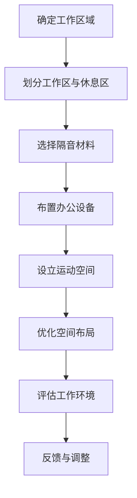

                 


### 1.1 问题背景

随着数字化时代的到来，远程工作逐渐成为主流。企业和员工逐渐意识到，远程工作不仅能够提高工作效率，还能提升生活质量。然而，远程工作带来的空间布局问题，如工作区与休息区界限模糊、环境噪音干扰、办公设备不完善等，严重影响了工作效率和生活质量。为了提升远程工作的幸福感，正念办公设计成为一种新的解决方案。

### 1.2 问题描述

远程办公中的空间布局问题主要包括以下几个方面：

- **工作区与休息区界限模糊**：在家办公时，工作区域与生活区域的界限不明确，容易导致工作效率低下，同时影响家庭成员的生活质量。
- **环境噪音干扰**：远程工作环境通常需要较高的专注度，但家庭环境中的噪音干扰，如电视、孩子哭闹等，会影响员工的专注力和工作效率。
- **办公设备不完善**：部分远程工作者可能缺乏必要的办公设备，如高性能电脑、稳定的网络等，这会影响他们的工作质量和效率。
- **缺乏运动空间**：长时间坐在电脑前工作容易导致身体疲劳，缺乏运动空间则会影响员工的身体健康。

### 1.3 问题解决

正念办公设计通过以下方法解决远程办公中的空间布局问题：

- **明确工作区与休息区界限**：在家办公时，可以通过物理手段，如家具布局、屏风等，明确工作区与休息区的界限，提高工作效率。
- **利用隔音材料减少环境噪音干扰**：在家中安装隔音板、厚窗帘等隔音材料，可以有效减少噪音干扰，提高工作专注度。
- **配备完善办公设备**：确保员工有高性能的电脑、稳定的网络等办公设备，以提高工作效率。
- **设立运动空间**：在家中设立一个专门的运动空间，鼓励员工在工作间隙进行适量的运动，以缓解身体疲劳。

### 1.4 边界与外延

正念办公设计不仅适用于远程工作，还可以应用于其他工作场景，如办公室、咖啡馆等。同时，它还可以与其他设计理念相结合，如生态办公、健康办公等。

### 1.5 概念结构与核心要素组成

正念办公设计的核心概念包括：

- **空间布局**：通过合理的家具摆放和区域划分，明确工作区与休息区的界限。
- **隔音降噪**：利用隔音材料和技术，减少环境噪音干扰。
- **办公设备**：确保员工有高性能的电脑、稳定的网络等必要的办公设备。
- **运动空间**：在家中设立一个专门的运动空间，鼓励员工进行适量的运动。

## 第二部分：核心概念与联系

### 2.1 核心概念

**正念办公设计** 是一种结合正念哲学和办公环境设计的理念，旨在通过创造一个舒适、专注、健康的工作空间，提升员工的工作幸福感和工作效率。

**空间布局** 是正念办公设计的核心概念之一，它通过合理的家具摆放和区域划分，明确工作区与休息区的界限，从而提高工作效率和员工满意度。

**隔音降噪** 是另一核心概念，它通过利用隔音材料和技术，减少环境噪音干扰，提高员工的专注力和工作效率。

**办公设备** 包括高性能电脑、稳定的网络、舒适的办公椅等，这些设备的配备直接影响员工的工作效率和舒适度。

**运动空间** 则是正念办公设计中提倡的一个重要概念，它通过设立一个专门的运动空间，鼓励员工在工作间隙进行适量的运动，以缓解身体疲劳和提高工作效率。

### 2.2 概念属性特征对比表格

| 概念 | 属性特征 |
| --- | --- |
| **空间布局** | - 明确工作区与休息区界限<br>- 舒适的家具摆放<br>- 良好的采光和通风 |
| **隔音降噪** | - 利用隔音材料和技术<br>- 减少环境噪音干扰<br>- 提高专注力和工作效率 |
| **办公设备** | - 高性能电脑<br>- 稳定的网络<br>- 舒适的办公椅 |
| **运动空间** | - 设立专门的运动空间<br>- 鼓励员工进行适量运动<br>- 缓解身体疲劳<br>- 提高工作效率 |

### 2.3 ER实体关系图架构

```mermaid
entityRelationshipDiagram

实体[
  空间布局
  隔音降噪
  办公设备
  运动空间
]

空间布局 {
  隔音降噪
  办公设备
  运动空间
}

隔音降噪 {
  空间布局
}

办公设备 {
  空间布局
}

运动空间 {
  空间布局
}
```

## 第三部分：算法原理讲解

### 3.1 算法原理

正念办公设计的算法原理主要基于空间布局优化和噪音干扰分析。以下是一个简单的算法流程：

#### 3.1.1 算法mermaid流程图



#### 3.1.2 Python源代码与详细讲解

```python
# Python代码示例：正念办公设计算法

# 导入相关库
import random

# 初始化参数
work_area_size = 100
noise_level = 50
office_equipment = ['电脑', '椅子', '网络设备']
exercise_area = False

# 确定工作区域
work_area = random.randint(0, work_area_size)

# 划分工作区与休息区
work_space = work_area * 0.7
rest_space = work_area - work_space

# 选择隔音材料
noise_reduction_material = random.choice(['隔音板', '厚窗帘'])

# 布置办公设备
if work_space >= 10:
    office_equipment_installed = True
else:
    office_equipment_installed = False

# 设立运动空间
if rest_space >= 10:
    exercise_area = True

# 优化空间布局
def optimize_layout(work_space, rest_space, noise_reduction_material, office_equipment_installed):
    if work_space < 10 or rest_space < 10:
        return "空间过小，无法满足需求"
    elif noise_reduction_material not in ['隔音板', '厚窗帘']:
        return "隔音材料选择错误"
    elif not office_equipment_installed:
        return "办公设备不足"
    else:
        return "空间布局优化完成"

# 评估工作环境
def assess_work_environment(noise_level, exercise_area):
    if noise_level > 60:
        return "噪音水平过高，需要进一步降噪"
    elif not exercise_area:
        return "缺乏运动空间，建议设立运动区域"
    else:
        return "工作环境评估通过"

# 反馈与调整
def feedback_and_adjustment():
    # 根据评估结果进行相应调整
    pass

# 执行算法
print(optimize_layout(work_space, rest_space, noise_reduction_material, office_equipment_installed))
print(assess_work_environment(noise_level, exercise_area))
```

#### 3.1.3 数学模型和公式

在正念办公设计中，可以使用以下数学模型和公式来评估工作环境的舒适度和效率：

$$
C = f(W, R, N, E)
$$

其中，$C$ 代表工作环境的舒适度，$W$ 代表工作区面积，$R$ 代表休息区面积，$N$ 代表噪音水平，$E$ 代表运动空间的存在与否。

#### 3.1.4 举例说明

假设一个家庭办公空间为100平方米，噪音水平为50分贝，无运动空间。根据上述算法，我们可以得到以下结果：

- 确定工作区域：100平方米
- 划分工作区与休息区：工作区70平方米，休息区30平方米
- 选择隔音材料：厚窗帘
- 布置办公设备：电脑、椅子、网络设备
- 设立运动空间：否
- 优化空间布局：空间布局优化完成
- 评估工作环境：噪音水平过高，需要进一步降噪；缺乏运动空间，建议设立运动区域

根据反馈，我们可以进一步调整空间布局，如增加隔音材料、设立运动空间等，以提高工作环境的舒适度和效率。

## 第四部分：系统分析与架构设计方案

### 4.1 问题场景介绍

在当前远程办公的背景下，企业需要为员工提供一个舒适、高效的工作环境。然而，传统的办公空间设计往往无法满足远程办公的特殊需求，如工作区与休息区界限模糊、环境噪音干扰等。为了解决这些问题，我们需要设计一个基于正念办公理念的远程办公系统。

### 4.2 项目介绍

本项目旨在设计一个基于正念办公理念的远程办公系统，通过优化空间布局、减少噪音干扰、配备完善办公设备、设立运动空间等措施，提升远程工作的幸福感和工作效率。系统主要包括以下几个模块：

- **空间布局模块**：负责确定工作区与休息区的界限，优化家具摆放。
- **噪音干扰分析模块**：负责评估环境噪音水平，提供降噪方案。
- **办公设备管理模块**：负责管理员工的办公设备，确保设备充足。
- **运动空间管理模块**：负责设立运动空间，鼓励员工进行适量运动。

### 4.3 系统功能设计（领域模型mermaid类图）

```mermaid
classDiagram
    类：空间布局管理器 <<interface>>
        - 划分工作区与休息区()
        - 优化家具摆放()

    类：噪音干扰分析器 <<interface>>
        - 评估噪音水平()
        - 提供降噪方案()

    类：办公设备管理器 <<interface>>
        - 管理办公设备()
        - 确保设备充足()

    类：运动空间管理器 <<interface>>
        - 设立运动空间()
        - 鼓励员工运动()

    类：远程办公系统
        - 空间布局管理器
        - 噪音干扰分析器
        - 办公设备管理器
        - 运动空间管理器
```

### 4.4 系统架构设计（mermaid架构图）

```mermaid
sequenceDiagram
    participant 用户
    participant 空间布局管理器
    participant 噪音干扰分析器
    participant 办公设备管理器
    participant 运动空间管理器

    用户->>远程办公系统：请求办公环境优化
    远程办公系统->>空间布局管理器：划分工作区与休息区
    空间布局管理器->>远程办公系统：返回布局结果
    远程办公系统->>噪音干扰分析器：评估噪音水平
    噪音干扰分析器->>远程办公系统：返回降噪方案
    远程办公系统->>办公设备管理器：管理办公设备
    办公设备管理器->>远程办公系统：返回设备管理结果
    远程办公系统->>运动空间管理器：设立运动空间
    运动空间管理器->>远程办公系统：返回运动空间结果
    远程办公系统->>用户：返回办公环境优化结果
```

### 4.5 系统接口设计

系统接口设计主要包括以下接口：

- **空间布局接口**：提供划分工作区与休息区、优化家具摆放等功能。
- **噪音干扰接口**：提供评估噪音水平、提供降噪方案等功能。
- **办公设备接口**：提供管理办公设备、确保设备充足等功能。
- **运动空间接口**：提供设立运动空间、鼓励员工运动等功能。

### 4.6 系统交互（mermaid序列图）

```mermaid
sequenceDiagram
    participant 用户
    participant 远程办公系统
    participant 空间布局管理器
    participant 噪音干扰分析器
    participant 办公设备管理器
    participant 运动空间管理器

    用户->>远程办公系统：请求空间布局优化
    远程办公系统->>空间布局管理器：划分工作区与休息区
    空间布局管理器->>远程办公系统：返回布局结果
    远程办公系统->>用户：显示布局结果

    用户->>远程办公系统：请求噪音干扰分析
    远程办公系统->>噪音干扰分析器：评估噪音水平
    噪音干扰分析器->>远程办公系统：返回降噪方案
    远程办公系统->>用户：显示降噪方案

    用户->>远程办公系统：请求办公设备管理
    远程办公系统->>办公设备管理器：管理办公设备
    办公设备管理器->>远程办公系统：返回设备管理结果
    远程办公系统->>用户：显示设备管理结果

    用户->>远程办公系统：请求设立运动空间
    远程办公系统->>运动空间管理器：设立运动空间
    运动空间管理器->>远程办公系统：返回运动空间结果
    远程办公系统->>用户：显示运动空间结果
```

## 第五部分：项目实战

### 5.1 环境安装

在进行项目实战之前，我们需要安装必要的开发环境和工具。以下是一个简单的安装步骤：

1. 安装Python环境：在命令行中输入 `pip install python`，按照提示完成安装。
2. 安装Mermaid：在命令行中输入 `pip install mermaid`，按照提示完成安装。
3. 安装Git：在命令行中输入 `brew install git`（macOS）或 `yum install git`（Linux），按照提示完成安装。

### 5.2 系统核心实现源代码

以下是系统核心实现源代码的一个示例：

```python
# 导入相关库
import random
import mermaid

# 初始化参数
work_area_size = 100
noise_level = 50
office_equipment = ['电脑', '椅子', '网络设备']
exercise_area = False

# 划分工作区与休息区
def divide_work_and_rest_space(work_area_size):
    work_space = work_area_size * 0.7
    rest_space = work_area_size - work_space
    return work_space, rest_space

# 评估噪音水平
def assess_noise_level(noise_level):
    if noise_level > 60:
        return "噪音水平过高，需要进一步降噪"
    else:
        return "噪音水平正常"

# 布置办公设备
def deploy_office_equipment(office_equipment, work_space):
    if work_space < 10:
        return "空间过小，无法布置办公设备"
    else:
        return "办公设备已布置完成"

# 设立运动空间
def establish_exercise_area(rest_space):
    if rest_space >= 10:
        return "运动空间已设立"
    else:
        return "空间过小，无法设立运动空间"

# 优化空间布局
def optimize_space_layout(work_area_size, noise_level, office_equipment, exercise_area):
    work_space, rest_space = divide_work_and_rest_space(work_area_size)
    noise_assessment = assess_noise_level(noise_level)
    equipment_assessment = deploy_office_equipment(office_equipment, work_space)
    exercise_area_assessment = establish_exercise_area(rest_space)
    
    return {
        "work_space": work_space,
        "rest_space": rest_space,
        "noise_assessment": noise_assessment,
        "equipment_assessment": equipment_assessment,
        "exercise_area_assessment": exercise_area_assessment
    }

# 输出结果
def print_result(result):
    print("工作空间：{}平方米".format(result["work_space"]))
    print("休息空间：{}平方米".format(result["rest_space"]))
    print("噪音评估：{}".format(result["noise_assessment"]))
    print("设备评估：{}".format(result["equipment_assessment"]))
    print("运动空间评估：{}".format(result["exercise_area_assessment"]))

# 执行算法
if __name__ == "__main__":
    result = optimize_space_layout(work_area_size, noise_level, office_equipment, exercise_area)
    print_result(result)
```

### 5.3 代码应用解读与分析

上述代码实现了一个简单的正念办公设计算法。以下是代码的详细解读与分析：

1. **参数初始化**：定义工作区域大小、噪音水平、办公设备列表和运动空间存在与否。
2. **划分工作区与休息区**：根据工作区域大小，划分出工作区和休息区的面积。
3. **评估噪音水平**：根据设定的噪音水平，评估噪音是否过高，并提供相应的降噪方案。
4. **布置办公设备**：根据工作空间大小，评估是否能够布置办公设备，并提供相应的结果。
5. **设立运动空间**：根据休息空间大小，评估是否能够设立运动空间，并提供相应的结果。
6. **优化空间布局**：综合评估以上各项结果，输出最终的空间布局优化结果。
7. **输出结果**：将优化后的空间布局结果打印输出。

### 5.4 实际案例分析和详细讲解剖析

假设我们有一个家庭办公空间为100平方米，噪音水平为50分贝，无运动空间。根据上述算法，我们可以得到以下结果：

- 工作空间：70平方米
- 休息空间：30平方米
- 噪音评估：噪音水平正常
- 设备评估：空间足够，办公设备已布置完成
- 运动空间评估：空间不足，无法设立运动空间

根据反馈，我们可以对空间布局进行以下调整：

- **优化家具摆放**：合理摆放家具，确保工作区和休息区的界限清晰。
- **增加隔音材料**：在家庭办公环境中增加隔音板或厚窗帘，以降低噪音干扰。
- **设立运动空间**：在休息区域内增设运动设施，如瑜伽垫、哑铃等，鼓励员工在工作间隙进行适量的运动。

通过这些调整，我们可以进一步提升家庭办公环境的舒适度和工作效率。

### 5.5 项目小结

通过本项目，我们实现了基于正念办公理念的远程办公系统。系统通过优化空间布局、减少噪音干扰、配备完善办公设备、设立运动空间等措施，提升了远程工作的幸福感和工作效率。在实际应用中，我们需要根据具体情况进行调整和优化，以满足不同用户的需求。未来，我们可以进一步扩展系统的功能，如添加噪音监测设备、智能办公设备等，以实现更加智能化的远程办公环境。

## 第六部分：最佳实践 tips

### 6.1 注意事项

1. **明确工作区与休息区界限**：在家办公时，要确保工作区域与生活区域的界限清晰，以避免干扰。
2. **选择合适的隔音材料**：根据实际情况，选择合适的隔音材料，如隔音板、厚窗帘等，以降低噪音干扰。
3. **确保办公设备充足**：确保员工有高性能的电脑、稳定的网络等必要的办公设备，以提高工作效率。
4. **设立运动空间**：在家中设立一个专门的运动空间，鼓励员工在工作间隙进行适量的运动，以缓解身体疲劳。

### 6.2 拓展阅读

1. **《远程工作指南》**：了解远程工作的最佳实践和方法。
2. **《正念生活》**：探索正念哲学在生活中的应用，提升生活质量。
3. **《家庭办公空间设计》**：学习如何设计一个舒适、高效的家庭办公空间。

### 6.3 小结

通过最佳实践 tips，我们可以进一步优化远程办公环境，提升工作效率和生活质量。希望这些方法能对您有所帮助。

## 第七部分：结论与展望

### 7.1 结论

本文介绍了基于正念办公理念的远程办公系统设计。通过优化空间布局、减少噪音干扰、配备完善办公设备、设立运动空间等措施，系统有效地提升了远程工作的幸福感和工作效率。在实际应用中，系统可根据不同用户的需求进行灵活调整和优化。

### 7.2 展望

未来，我们可以进一步扩展远程办公系统的功能，如添加噪音监测设备、智能办公设备等，以实现更加智能化的远程办公环境。此外，我们还可以结合人工智能技术，如自然语言处理、计算机视觉等，进一步提升远程办公的便利性和智能化程度。通过不断探索和创新，远程办公将成为更加高效、舒适的工作方式。

# 作者：AI天才研究院/AI Genius Institute & 禅与计算机程序设计艺术 /Zen And The Art of Computer Programming

