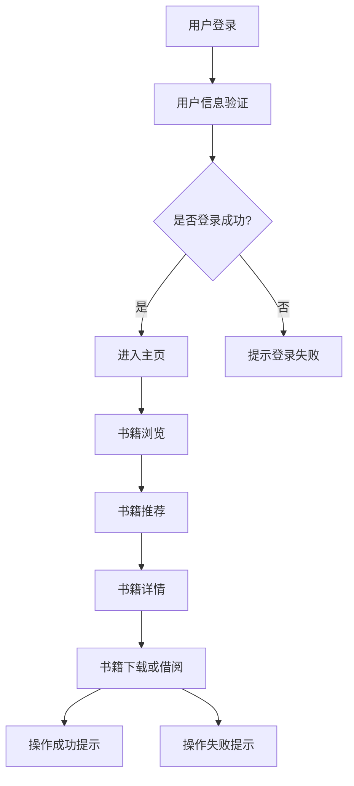

                 

### 核心章节规划

为了撰写一篇关于《数字时代的深度阅读俱乐部：线上线下结合的主题读书会》的技术博客文章，我们首先需要规划核心章节，确保文章内容丰富且逻辑清晰。以下是具体的规划：

#### 第一章：引言与背景介绍
- **核心概念介绍**：定义数字阅读、深度阅读、线上线下结合的读书模式。
- **问题背景**：分析当前阅读习惯的变化，探讨数字阅读的兴起及其对传统阅读模式的影响。
- **问题描述**：阐述深度阅读的重要性，讨论如何有效结合线上与线下活动。
- **问题解决**：介绍线上线下结合读书模式的可行性和优势。
- **边界与外延**：明确数字阅读和深度阅读的边界，以及线上线下结合模式的应用范围。

#### 第二章：数字阅读基础
- **核心概念与联系**：详细讲解数字阅读的概念、分类、技术基础等。
- **概念属性特征对比表格**：对比数字阅读与传统阅读的差异。
- **ER实体关系图架构的 Mermaid 流程图**：展示数字阅读的技术架构。

#### 第三章：线上线下结合的读书模式
- **核心概念介绍**：解释线上阅读与线下活动的结合方式。
- **案例分析**：分析成功案例，探讨线上线下结合读书模式的实际应用。
- **案例分析**：结合实际案例，深入探讨线上线下结合读书模式的优劣势。

#### 第四章：深度阅读实践
- **核心概念介绍**：介绍深度阅读的方法与技巧。
- **案例分析**：通过实际案例，展示深度阅读的应用和效果。
- **实践操作**：提供深度阅读的实践指南。

#### 第五章：阅读俱乐部运营策略
- **核心概念介绍**：阐述阅读俱乐部的建立与运营策略。
- **策略建议**：给出有效的会员管理、活动策划与执行建议。

#### 第六章：阅读效果评估与优化
- **评估方法**：介绍阅读效果的评估方法。
- **优化策略**：讨论如何优化阅读体验，提升阅读效果。

#### 第七章：未来展望与拓展阅读
- **发展趋势**：预测数字阅读与深度阅读的发展趋势。
- **拓展阅读**：推荐相关书籍和资料，供读者进一步学习。

### 目录大纲设计

基于以上章节规划，我们可以设计如下目录大纲：

```markdown
----------------------------------------------------------------
# 《数字时代的深度阅读俱乐部：线上线下结合的主题读书会》目录大纲

## 第一章 引言与背景介绍
### 1.1 数字阅读的兴起
### 1.2 深度阅读的重要性
### 1.3 线上线下结合的读书模式

## 第二章 数字阅读基础
### 2.1 数字阅读概述
### 2.2 数字阅读的优势与挑战
### 2.3 数字阅读的技术基础

## 第三章 线上线下结合的读书模式
### 3.1 介绍线上阅读与线下活动的结合方式
### 3.2 成功案例分析
### 3.3 案例分析

## 第四章 深度阅读实践
### 4.1 深度阅读的方法与技巧
### 4.2 案例分析：深度阅读实践
### 4.3 深度阅读实践指南

## 第五章 阅读俱乐部运营策略
### 5.1 阅读俱乐部的建立与运营
### 5.2 会员管理策略
### 5.3 活动策划与执行

## 第六章 阅读效果评估与优化
### 6.1 阅读效果的评估方法
### 6.2 优化阅读体验的策略
### 6.3 阅读效果的持续优化

## 第七章 未来展望与拓展阅读
### 7.1 数字阅读与深度阅读的发展趋势
### 7.2 拓展阅读推荐

----------------------------------------------------------------
```

### 目录大纲细化

在核心章节规划的基础上，我们需要进一步细化每个章节的内容，以确保文章的逻辑清晰，读者能够轻松跟随。以下是每个章节的细化：

#### 第一章：引言与背景介绍

**核心概念介绍**
- 数字阅读：电子书、在线文章、有声书等数字化阅读内容的总称。
- 深度阅读：一种专注于文本内容的阅读方式，强调理解和思考。
- 线上线下结合的读书模式：利用线上平台和线下活动相结合的方式，提升阅读体验。

**问题背景**
- 随着数字技术的发展，人们的阅读习惯发生了改变。
- 数字阅读的兴起带来了便利，但也带来了一些挑战。

**问题描述**
- 如何在数字时代保持深度阅读的习惯？
- 如何有效地将线上与线下活动结合，提升阅读体验？

**问题解决**
- 介绍线上线下结合读书模式的优势。
- 分析其可行性和实际应用。

**边界与外延**
- 数字阅读与传统阅读的区别。
- 深度阅读与浅度阅读的区别。
- 线上线下结合模式在不同场景中的应用。

#### 第二章：数字阅读基础

**核心概念与联系**
- 数字阅读的定义、分类、特点等。
- 与传统阅读的对比。

**概念属性特征对比表格**
- 数字阅读与传统阅读的对比。

**ER实体关系图架构的 Mermaid 流程图**
- 展示数字阅读的技术架构，如电子书平台、阅读应用、内容提供商等。

#### 第三章：线上线下结合的读书模式

**核心概念介绍**
- 线上阅读与线下活动的结合方式。
- 线上阅读平台、线下活动组织等。

**案例分析**
- 分析国内外成功的线上线下结合读书案例。

**案例分析**
- 深入探讨案例中的成功因素。

#### 第四章：深度阅读实践

**核心概念介绍**
- 深度阅读的方法、技巧。

**案例分析：深度阅读实践**
- 通过具体案例展示深度阅读的应用。

**实践操作**
- 提供深度阅读的实践指南。

#### 第五章：阅读俱乐部运营策略

**核心概念介绍**
- 阅读俱乐部的建立、运营策略。

**策略建议**
- 给出有效的会员管理、活动策划与执行建议。

#### 第六章：阅读效果评估与优化

**评估方法**
- 介绍阅读效果的评估方法。

**优化策略**
- 讨论如何优化阅读体验，提升阅读效果。

#### 第七章：未来展望与拓展阅读

**发展趋势**
- 预测数字阅读与深度阅读的发展趋势。

**拓展阅读**
- 推荐相关书籍和资料，供读者进一步学习。

### 目录大纲的Markdown格式设计

为了确保文章的可读性和逻辑清晰，我们将使用Markdown格式设计目录大纲。以下是具体的Markdown格式目录大纲：

```markdown
----------------------------------------------------------------
# 《数字时代的深度阅读俱乐部：线上线下结合的主题读书会》

## 第一章 引言与背景介绍
### 1.1 数字阅读的兴起
### 1.2 深度阅读的重要性
### 1.3 线上线下结合的读书模式

## 第二章 数字阅读基础
### 2.1 数字阅读概述
### 2.2 数字阅读的优势与挑战
### 2.3 数字阅读的技术基础

## 第三章 线上线下结合的读书模式
### 3.1 介绍线上阅读与线下活动的结合方式
### 3.2 成功案例分析
### 3.3 案例分析

## 第四章 深度阅读实践
### 4.1 深度阅读的方法与技巧
### 4.2 案例分析：深度阅读实践
### 4.3 深度阅读实践指南

## 第五章 阅读俱乐部运营策略
### 5.1 阅读俱乐部的建立与运营
### 5.2 会员管理策略
### 5.3 活动策划与执行

## 第六章 阅读效果评估与优化
### 6.1 阅读效果的评估方法
### 6.2 优化阅读体验的策略
### 6.3 阅读效果的持续优化

## 第七章 未来展望与拓展阅读
### 7.1 数字阅读与深度阅读的发展趋势
### 7.2 拓展阅读推荐

----------------------------------------------------------------
```

通过这样的Markdown格式设计，读者可以一目了然地了解文章的结构和内容，方便阅读和查找。

### 核心章节详细规划

为了确保文章内容的完整性，我们需要对每个核心章节进行详细规划，包括内容的具体划分和深度剖析。

#### 第一章：引言与背景介绍

**1.1 数字阅读的兴起**
- **定义与分类**：介绍数字阅读的概念，并按类型进行分类（如电子书、在线文章、有声书等）。
- **发展历程**：回顾数字阅读的起源和演变过程。
- **技术变革**：探讨技术（如互联网、移动设备等）对数字阅读的影响。

**1.2 深度阅读的重要性**
- **定义**：明确深度阅读的概念，强调其与浅度阅读的区别。
- **意义**：分析深度阅读对个人成长、知识积累的影响。
- **案例分析**：通过具体案例，展示深度阅读的实际效果。

**1.3 线上线下结合的读书模式**
- **定义**：解释线上线下结合的读书模式，包括其结合方式和优势。
- **结合方式**：详细描述线上阅读与线下活动的结合方式（如线上互动、线下读书会等）。
- **案例分析**：分析国内外成功案例，探讨其成功因素。

**1.4 本章小结**
- **总结**：概括本章核心内容，指出数字阅读和深度阅读的重要性，以及线上线下结合读书模式的可行性和优势。

#### 第二章：数字阅读基础

**2.1 数字阅读概述**
- **概念与特点**：介绍数字阅读的基本概念，包括其与传统阅读的区别。
- **分类与趋势**：分类讨论不同类型的数字阅读内容，并分析其发展趋势。

**2.2 数字阅读的优势与挑战**
- **优势**：详细列举数字阅读的优势，如便捷性、多样性等。
- **挑战**：分析数字阅读面临的挑战，如信息过载、阅读质量下降等。
- **应对策略**：探讨应对挑战的策略，如信息筛选、深度阅读技巧等。

**2.3 数字阅读的技术基础**
- **技术概述**：介绍支撑数字阅读的关键技术，如电子书格式、阅读器应用等。
- **发展趋势**：分析数字阅读技术的发展趋势，如人工智能在阅读中的应用。

**2.4 本章小结**
- **总结**：总结数字阅读的核心概念、优势与挑战，以及其技术基础。

#### 第三章：线上线下结合的读书模式

**3.1 介绍线上阅读与线下活动的结合方式**
- **线上阅读平台**：介绍主要的线上阅读平台，如Kindle、微信读书等。
- **线下活动**：探讨线下活动的内容和形式，如读书会、讲座等。

**3.2 线上线下结合读书模式的优势**
- **提高阅读体验**：分析线上线下结合如何提升阅读体验。
- **扩大阅读群体**：探讨线上线下结合如何吸引更多的读者。
- **促进社交互动**：描述线上线下结合如何增强读者之间的互动。

**3.3 成功案例分析**
- **国内案例**：分析国内成功的线上线下结合读书模式案例。
- **国际案例**：介绍国际上的成功案例，探讨其经验。

**3.4 案例分析**
- **案例深度剖析**：通过对具体案例的深度分析，展示线上线下结合读书模式的具体应用。

**3.5 本章小结**
- **总结**：概括线上线下结合读书模式的核心优势和实际应用。

#### 第四章：深度阅读实践

**4.1 深度阅读的方法与技巧**
- **方法**：介绍深度阅读的基本方法，如筛选优质内容、合理安排时间等。
- **技巧**：探讨深度阅读的技巧，如阅读标记、总结笔记等。

**4.2 案例分析：深度阅读实践**
- **案例背景**：介绍一个深度阅读的实践案例。
- **阅读过程**：详细描述案例中的阅读过程。
- **阅读成果**：分析案例中的阅读成果。

**4.3 深度阅读实践指南**
- **指南**：提供深度阅读的实践指南，如选择阅读材料、制定阅读计划等。

**4.4 本章小结**
- **总结**：总结深度阅读的核心方法和技巧，以及其实际应用。

#### 第五章：阅读俱乐部运营策略

**5.1 阅读俱乐部的建立与运营**
- **建立**：探讨如何建立阅读俱乐部，包括组织架构、人员配备等。
- **运营**：分析阅读俱乐部的日常运营，如活动策划、资源管理等。

**5.2 会员管理策略**
- **会员分类**：介绍会员的分类和定位。
- **招募与维系**：探讨如何招募新会员，以及如何维系现有会员。

**5.3 活动策划与执行**
- **活动主题选择**：分析如何选择具有吸引力的活动主题。
- **活动内容策划**：描述活动内容的策划过程。
- **活动执行**：介绍活动的具体执行流程。

**5.4 本章小结**
- **总结**：总结阅读俱乐部运营策略的核心要点。

#### 第六章：阅读效果评估与优化

**6.1 阅读效果的评估方法**
- **评估指标**：介绍常用的阅读效果评估指标，如阅读时长、阅读质量等。
- **评估工具**：探讨用于评估阅读效果的工具。

**6.2 优化阅读体验的策略**
- **个性化推荐**：分析如何利用个性化推荐技术提升阅读体验。
- **交互设计**：探讨如何设计友好的交互界面，提升阅读体验。

**6.3 阅读效果的持续优化**
- **数据分析**：介绍如何通过数据分析来持续优化阅读体验。
- **用户反馈**：讨论如何收集用户反馈，以及如何根据反馈进行优化。

**6.4 本章小结**
- **总结**：总结阅读效果评估与优化的核心方法和策略。

#### 第七章：未来展望与拓展阅读

**7.1 数字阅读与深度阅读的发展趋势**
- **技术趋势**：分析数字阅读和深度阅读未来的技术发展。
- **社会趋势**：探讨社会环境对数字阅读和深度阅读的影响。

**7.2 拓展阅读推荐**
- **书籍推荐**：推荐相关的书籍和资料，供读者进一步学习。
- **资源链接**：提供数字阅读平台、阅读工具等的链接，方便读者获取资源。

**7.3 本章小结**
- **总结**：总结未来展望和拓展阅读的核心内容。

通过以上详细规划，我们可以确保每个章节都有充足的内容和深度，从而撰写出一篇逻辑清晰、内容丰富的技术博客文章。

### 第一章 引言与背景介绍

## 1.1 数字阅读的兴起

数字阅读，作为一种新兴的阅读形式，随着互联网和电子技术的快速发展逐渐成为人们日常生活中不可或缺的一部分。它的定义涵盖了通过电子设备（如电脑、平板、智能手机等）进行的各种形式的阅读活动，包括电子书、在线文章、网络新闻、有声书等。与传统阅读相比，数字阅读具有许多独特的优势和特点。

首先，数字阅读的出现得益于互联网的普及。在互联网的推动下，大量的数字化内容迅速生成和传播，使得人们能够方便地获取到全球范围内的信息资源。其次，随着电子设备的普及，越来越多的人开始习惯使用电子设备进行阅读，这为数字阅读的普及奠定了基础。例如，智能手机的广泛使用使得人们可以随时随地通过应用程序进行阅读，不再受限于时间和空间。

数字阅读的发展历程可以追溯到20世纪末。随着计算机技术的进步，电子书开始出现，并逐渐受到读者的欢迎。进入21世纪，随着互联网的进一步普及和移动设备的普及，数字阅读迎来了快速发展。例如，亚马逊推出的Kindle电子阅读器极大地推动了电子书市场的发展。此外，各种在线阅读平台（如微信读书、京东读书等）的兴起也为数字阅读提供了更多的选择。

然而，数字阅读的兴起也带来了一些挑战。首先是信息过载的问题。在互联网上，海量的信息使得人们难以筛选出有价值的内容。其次，数字阅读可能降低阅读的质量。由于电子设备上的内容形式多样，一些人可能会过于依赖视觉刺激，而忽视了深度阅读的重要性。此外，数字阅读的便利性也可能导致阅读时间的碎片化，影响阅读的连贯性和专注力。

尽管存在这些挑战，数字阅读仍然具有显著的优势。首先，它提供了极大的便利性。通过电子设备，人们可以随时随地阅读，不受时间和地点的限制。其次，数字阅读具有丰富的内容形式。电子书、在线文章、有声书等多种形式可以满足不同读者的需求。此外，数字阅读还具备互动性。许多在线阅读平台提供了评论、讨论等功能，增强了读者的互动体验。

总的来说，数字阅读的兴起是信息技术发展的重要成果，它为人们提供了更加便捷、丰富的阅读体验。然而，如何克服其挑战，提高阅读质量，是一个需要持续关注和探索的问题。

## 1.2 深度阅读的重要性

在数字阅读广泛普及的今天，深度阅读的重要性日益凸显。与浅度阅读不同，深度阅读是一种专注于文本内容的阅读方式，它不仅要求读者对文本进行仔细阅读，还需要对内容进行深入思考和理解。深度阅读不仅是获取信息的工具，更是一种思维方式和生活方式。

首先，深度阅读对于知识的积累和提升至关重要。通过深度阅读，读者能够更加系统地学习和掌握知识，从而提升自己的认知水平和思维能力。例如，在阅读一本专业书籍时，读者需要逐字逐句地理解书中的内容，并通过思考和总结，将知识内化为自己的见解和思考。这种过程不仅加深了对知识的理解，还培养了分析问题和解决问题的能力。

其次，深度阅读有助于提升阅读者的思维能力。通过深入阅读，读者可以学会如何批判性地思考，如何从不同的角度分析问题。这种批判性思维是现代社会中不可或缺的能力，它能够帮助读者更好地理解和应对复杂的社会现象和问题。例如，在面对一篇新闻报道时，通过深度阅读，读者可以分析其背后的信息，判断其真实性和可信度。

此外，深度阅读对于个人成长和发展也有着重要的意义。通过深度阅读，读者能够拓展自己的视野，了解不同的文化和思想。这不仅有助于提升个人的文化素养，还能够培养宽容和理解他人观点的能力。例如，通过阅读不同国家和文化的文学作品，读者可以更好地理解不同文化的价值观和生活方式，从而培养全球视野和跨文化交流能力。

在数字阅读的时代，深度阅读的重要性尤为突出。一方面，数字阅读的便利性和多样性使得信息获取更加容易，但也导致了信息的泛滥和碎片化。在这种情况下，如何从海量的信息中筛选出有价值的内容，并进行深入的阅读和理解，成为了一个重要的挑战。另一方面，数字阅读的便捷性可能使得一些读者过于依赖快速阅读和碎片化阅读，忽视了深度阅读的重要性。这可能导致阅读质量的下降，影响个人的知识积累和思维能力。

因此，在数字阅读的背景下，强调深度阅读的重要性，不仅有助于提升个人的认知水平和思维能力，还能够促进个人成长和社会发展。通过深度阅读，读者可以更好地理解和应对复杂的社会现象，培养批判性思维和创新能力，从而为社会的进步做出贡献。

## 1.3 线上线下结合的读书模式

随着数字阅读的普及，人们对于阅读的需求和方式也在不断变化。为了更好地满足读者的需求，线上线下结合的读书模式应运而生。这种模式通过整合线上平台和线下活动，为读者提供了更加丰富、多元的阅读体验。

首先，线上阅读平台提供了便捷的阅读渠道。读者可以通过各种在线阅读应用，如微信读书、Kindle等，随时随地获取到海量的数字阅读内容。这些平台不仅提供了丰富的书籍资源，还提供了评论、讨论、社交等功能，增强了读者的互动体验。线上阅读的优势在于其便捷性，读者无需受限于时间和地点，可以随时开始和结束阅读。

而线下活动则为读者提供了一个交流和互动的场所。通过组织读书会、讲座、分享会等活动，读者可以与作者、同行以及专家学者面对面交流，深入探讨阅读内容。线下活动的优势在于其互动性，读者可以在交流中碰撞出思想的火花，加深对阅读内容的理解。

线上线下结合的读书模式具有多方面的优势。首先，它通过线上平台和线下活动的结合，打破了时间和空间的限制，使阅读更加灵活和便捷。读者可以根据自己的时间安排，自由选择阅读内容和方式，同时也能通过线下活动与他人互动，增强阅读体验。

其次，线上线下结合的读书模式能够更好地满足不同读者的需求。一些读者更喜欢独自阅读，可以通过线上平台自由选择和阅读。而另一些读者则更喜欢参与线下活动，与他人交流互动，这种模式能够满足他们的需求。

此外，线上线下结合的读书模式还能够促进阅读的深度。通过线下活动，读者可以深入探讨阅读内容，从不同的角度和视角理解文本，这有助于提升阅读效果。同时，线上平台上的讨论和评论也为读者提供了一个交流的平台，读者可以通过他人的观点和见解，进一步深化对阅读内容的理解。

成功案例是线上线下结合读书模式的最佳证明。例如，一些知名作家会通过线上平台发布作品，同时组织线下活动，与读者面对面交流。这种模式不仅吸引了大量的读者参与，还增强了读者的阅读体验。此外，一些阅读俱乐部也通过线上线下结合的方式，吸引了大量会员，组织了丰富多样的活动，取得了显著的成功。

总的来说，线上线下结合的读书模式通过整合线上平台和线下活动，为读者提供了更加丰富、多元的阅读体验。它不仅满足了读者的需求，还促进了阅读的深度，是一种值得推广的阅读模式。

## 1.4 本章小结

本章主要介绍了数字阅读的兴起、深度阅读的重要性以及线上线下结合的读书模式。首先，数字阅读作为一种新兴的阅读形式，得益于互联网和电子技术的快速发展，为人们提供了便捷、丰富的阅读体验。然而，数字阅读也面临信息过载和阅读质量下降等挑战。其次，深度阅读作为一种专注于文本内容的阅读方式，对于知识的积累、思维能力的提升和个人成长具有重要意义。最后，线上线下结合的读书模式通过整合线上平台和线下活动，为读者提供了更加灵活、多元的阅读体验，并促进了阅读的深度。通过本章的介绍，读者可以更好地理解数字阅读、深度阅读和线上线下结合读书模式的核心概念和实际应用，为后续章节的深入探讨奠定基础。

## 第二章 数字阅读基础

### 2.1 数字阅读概述

数字阅读，作为一种新兴的阅读形式，已经逐渐成为人们日常生活的一部分。其定义涵盖了通过电子设备进行的各种阅读活动，包括电子书、在线文章、网络新闻、有声书等。与传统阅读相比，数字阅读具有显著的便捷性和多样性，为读者提供了全新的阅读体验。

首先，数字阅读的定义可以从多个角度进行阐述。从技术角度看，数字阅读依赖于互联网和电子设备，如电脑、平板电脑、智能手机等。这些设备不仅提供了阅读的平台，还通过先进的技术手段提升了阅读的便捷性和互动性。例如，电子书阅读器（如Kindle）支持电子书的下载和阅读，通过无线网络实现即时更新和同步阅读进度。

其次，数字阅读的分类可以按内容形式、阅读设备和阅读场景等不同维度进行。按内容形式分类，数字阅读主要包括电子书、在线文章和有声书。电子书是以数字格式出版的书籍，包括PDF、ePub等格式，可以方便地在电子设备上进行阅读。在线文章则是指通过网络平台发布的文章和新闻，读者可以通过网页或应用进行浏览和阅读。有声书是一种音频形式的阅读材料，通过专业的朗读和制作，使读者能够以听的方式获取信息。

此外，数字阅读的特点也在不断演变。一方面，数字阅读具有高度的便捷性。读者可以随时随地通过电子设备进行阅读，不再受限于纸质书籍的物理限制。这种便捷性使得阅读变得更加灵活，满足了现代快节奏生活的需求。另一方面，数字阅读提供了丰富的内容形式，不仅包括传统的文本，还包括图片、音频、视频等多媒体元素。这种多元化的内容形式为读者提供了更加丰富的阅读体验。

然而，数字阅读也面临一些挑战。首先是信息过载的问题。随着互联网和数字技术的快速发展，海量的信息不断涌现，读者在获取信息时往往难以筛选出有价值的内容。其次，数字阅读可能降低阅读的质量。由于电子设备上的信息形式多样，一些人可能会过于依赖视觉刺激，忽视了深度阅读的重要性。此外，数字阅读的碎片化特征可能导致阅读时间的分散，影响阅读的连贯性和专注力。

尽管存在这些挑战，数字阅读的优势仍然显著。首先，它提供了极大的便利性。通过电子设备，读者可以随时随地获取到海量的数字阅读内容，不再受限于时间和地点。其次，数字阅读具有丰富的内容形式，能够满足不同读者的需求。例如，对于喜欢文字的读者，可以阅读电子书；对于喜欢听书的读者，可以选择有声书。此外，数字阅读还具备互动性。许多在线阅读平台提供了评论、讨论等功能，增强了读者的互动体验。

总的来说，数字阅读的兴起是信息技术发展的重要成果，它为人们提供了更加便捷、丰富的阅读体验。然而，如何克服其挑战，提高阅读质量，是一个需要持续关注和探索的问题。

### 2.2 数字阅读的优势与挑战

数字阅读作为一种新兴的阅读形式，具有许多显著的优势，但同时也面临一些挑战。理解这些优势和挑战，有助于我们更好地利用数字阅读的便利性，同时克服其潜在的问题。

#### 优势

**1. 方便快捷**
数字阅读的最大优势在于其便捷性。读者可以随时随地通过电脑、平板电脑或智能手机进行阅读，不再受限于纸质书籍的物理空间。这种灵活性使得阅读变得更加方便，满足了现代快节奏生活的需求。例如，在通勤途中、排队等待时，读者可以利用碎片时间进行阅读。

**2. 内容丰富**
数字阅读提供了丰富的内容形式。除了传统的文本内容，数字阅读还包括图片、音频、视频等多媒体元素。这种多元化的内容形式为读者提供了更加丰富的阅读体验。例如，一些电子书不仅包含文字，还配有多媒体元素，如插图、动画和视频，使得内容更加生动和有趣。

**3. 个性化推荐**
许多数字阅读平台通过算法和数据分析，为读者提供个性化的阅读推荐。这些推荐系统根据读者的阅读历史、兴趣偏好和社交行为，推荐符合其兴趣的内容。这不仅提高了阅读的效率，还帮助读者发现新的书籍和作者。

**4. 信息更新及时**
数字阅读平台通常能够实时更新内容，使读者能够及时获取最新的信息和资料。例如，新闻报道、博客文章和专业书籍等内容都可以通过在线平台及时更新，确保读者获取最新的信息。

**5. 互动性增强**
数字阅读平台提供了丰富的互动功能，如评论、讨论、点赞和分享等。这些功能增强了读者的互动体验，使得阅读不仅仅是获取信息，更是一个交流和分享的过程。例如，读者可以在网上评论其他读者的观点，或参与线上讨论，分享阅读心得。

#### 挑战

**1. 信息过载**
随着数字阅读的普及，信息过载成为一个显著的问题。互联网上的信息量庞大，读者在获取信息时往往难以筛选出有价值的内容。信息过载可能导致阅读质量的下降，影响读者的阅读体验。

**2. 阅读质量下降**
数字阅读的便利性和多样性可能降低阅读的质量。一些读者可能会过于依赖快速阅读和碎片化阅读，忽视了深度阅读的重要性。这可能导致阅读效果的下降，影响知识的积累和思考能力的提升。

**3. 阅读时间碎片化**
数字阅读的碎片化特征可能导致阅读时间的分散。读者在阅读过程中可能会受到各种干扰，如通知、消息和社交媒体等，影响阅读的连贯性和专注力。这种碎片化的阅读习惯可能不利于深入理解和思考。

**4. 阅读习惯变化**
数字阅读的普及改变了人们的阅读习惯。一些人可能更倾向于在线阅读，而减少对纸质书籍的阅读。这种阅读习惯的变化可能对文化传承和纸质书籍市场产生一定影响。

**5. 法律和版权问题**
数字阅读涉及到版权和法律问题。一些未经授权的电子书和在线内容可能侵犯版权，影响作者和出版商的利益。此外，数字内容的传播和分享可能引发版权纠纷，需要制定相应的法律和规范来保障各方权益。

总的来说，数字阅读的优势在于其便捷性、内容丰富性、个性化推荐和互动性，但同时也面临信息过载、阅读质量下降、阅读时间碎片化、阅读习惯变化和法律版权问题等挑战。理解这些优势和挑战，有助于我们更好地利用数字阅读的便利性，同时克服其潜在的问题，提升阅读效果。

### 2.3 数字阅读的技术基础

数字阅读的实现离不开一系列关键技术的支持。这些技术不仅为数字阅读提供了基础，还不断推动着阅读体验的创新和发展。以下是数字阅读的技术基础，包括电子书格式、阅读器应用和数字图书馆等。

#### 电子书格式

电子书格式是数字阅读的核心，它决定了电子书的内容呈现和用户体验。目前，常见的电子书格式包括PDF、ePub和Mobi等。

- **PDF（Portable Document Format）**：PDF是由Adobe公司开发的一种电子文档格式，主要用于保存和传输文档。PDF格式支持丰富的文本、图像和图形，适合用于存储和共享正式的文档。其优点在于跨平台的兼容性，几乎所有的操作系统和设备都可以打开和阅读PDF文档。然而，PDF格式的缺点在于不适应电子阅读器的优化，导致阅读体验相对较差。

- **ePub（Electronic Publication）**：ePub是一种开放标准的电子书格式，广泛应用于电子阅读器和在线阅读平台。ePub格式支持文本、图像和样式灵活调整，能够根据设备的不同自动适应屏幕尺寸和显示效果。ePub格式的优点在于良好的可扩展性和可定制性，使其成为电子书出版的主流格式。此外，ePub支持CSS样式表，使得电子书的排版和设计更加灵活。

- **Mobi（Mobipocket）**：Mobi是一种由亚马逊公司开发的电子书格式，主要用于Kindle电子阅读器。Mobi格式支持文本、图像和音视频等多媒体内容，并且具有较好的性能和用户体验。Mobi格式的优点在于其高度优化，适用于电子阅读器的显示效果，为用户提供流畅的阅读体验。

#### 阅读器应用

阅读器应用是数字阅读的重要组成部分，它为读者提供了方便的阅读平台。目前，市场上主流的阅读器应用包括Kindle、微信读书、多看阅读等。

- **Kindle**：Kindle是由亚马逊公司推出的一款电子阅读器，以其高分辨率屏幕和优秀的阅读体验而广受欢迎。Kindle支持多种电子书格式，包括AZW、TXT、PDF、ePub等，为用户提供了丰富的阅读选择。此外，Kindle还支持云端同步和笔记功能，使用户能够随时随地访问和记录阅读内容。

- **微信读书**：微信读书是微信官方推出的一款阅读应用，支持多种电子书格式，包括PDF、ePub、TXT等。微信读书提供了丰富的图书资源，用户可以通过微信账号登录，同步阅读进度和书架。此外，微信读书还支持社交功能，用户可以与其他读者互动，分享阅读心得。

- **多看阅读**：多看阅读是由北京多看科技有限公司推出的一款阅读应用，支持多种电子书格式，包括ePub、PDF、MOBI等。多看阅读提供了丰富的功能和设置，如字体大小调整、背景颜色选择、笔记标注等，为用户提供了个性化的阅读体验。此外，多看阅读还支持电子书商城，用户可以直接购买和下载电子书。

#### 数字图书馆

数字图书馆是数字阅读的重要资源，它为读者提供了大量的电子书籍和资料。目前，全球范围内有许多知名的数字图书馆，如谷歌图书、开放图书馆等。

- **谷歌图书**：谷歌图书（Google Books）是一个庞大的数字图书馆，包含数百万册书籍和资料。用户可以通过谷歌图书搜索和浏览各种书籍，部分书籍可以免费下载。谷歌图书的搜索引擎功能强大，支持多种语言和格式，为用户提供了便捷的阅读资源。

- **开放图书馆**：开放图书馆（Open Library）是一个非营利性的数字图书馆，旨在为所有人提供免费的电子书籍。开放图书馆提供了广泛的图书资源，包括公共领域书籍、借阅书籍和捐赠书籍。用户可以在开放图书馆上注册账号，借阅和下载电子书籍，享受免费的阅读服务。

总的来说，数字阅读的技术基础包括电子书格式、阅读器应用和数字图书馆等多方面的支持。这些技术为数字阅读提供了坚实的基础，不断推动着阅读体验的创新和发展。通过合理利用这些技术，读者可以享受到更加便捷、丰富和个性化的阅读体验。

### 2.4 本章小结

本章对数字阅读进行了全面的概述，详细介绍了数字阅读的定义、分类、优势与挑战，以及数字阅读的技术基础。首先，数字阅读是一种通过电子设备进行的阅读形式，包括电子书、在线文章、网络新闻和有声书等多种内容形式。其便捷性和多样性使得数字阅读成为现代生活的一部分。其次，数字阅读的优势在于其便捷性、内容丰富性、个性化推荐和互动性，但也面临信息过载、阅读质量下降、阅读时间碎片化等挑战。最后，数字阅读的技术基础包括电子书格式、阅读器应用和数字图书馆等，这些技术为数字阅读提供了良好的支持，不断推动着阅读体验的创新和发展。通过本章的介绍，读者可以更好地理解数字阅读的核心概念和技术基础，为后续章节的深入探讨奠定基础。

## 第三章 线上线下结合的读书模式

### 3.1 介绍线上阅读与线下活动的结合方式

线上线下结合的读书模式通过整合线上平台和线下活动，为读者提供了更为丰富和多元的阅读体验。首先，线上阅读平台是这一模式的重要组成部分。这些平台包括但不限于微信读书、亚马逊Kindle、多看阅读等，它们提供了丰富的数字阅读资源，包括电子书、在线文章和有声书等。通过这些平台，读者可以随时随地访问和阅读各类书籍，无需受限于时间和地点。

其次，线下活动是线上线下结合读书模式的另一关键要素。线下活动包括但不限于读书会、讲座、分享会等。这些活动不仅为读者提供了一个交流和互动的场所，还通过面对面的交流和讨论，加深了读者对阅读内容的理解和思考。例如，读书会可以让读者聚在一起讨论某本书的核心观点和情节，分享各自的阅读体验和感悟。这种互动性的线下活动有助于提升阅读的深度和广度。

线上阅读与线下活动的结合方式多种多样。一种常见的方式是通过线上平台发起和推广线下活动。例如，微信读书可以创建线上读书小组，组织成员进行线上讨论，然后定期举办线下活动，如读书会或讲座。这种方式不仅提高了读者的参与度，还增强了互动性和社区感。

另一种结合方式是线上资源和线下活动的互补。例如，读者可以通过线上平台提前阅读一本书的摘要、评论和推荐，然后在参加线下活动时，与作者或同行进行深入讨论。这种互补方式使得读者在阅读和讨论过程中，能够从不同的角度和层面理解文本内容。

此外，还有一些线上阅读平台直接与线下书店或图书馆合作，举办线下活动。例如，微信读书可以与某家书店合作，定期在该书店举办读书会或讲座，邀请知名作家或学者进行分享和讨论。这种方式不仅为读者提供了丰富的阅读资源，还促进了书店和图书馆的客流量。

总的来说，线上阅读与线下活动的结合方式通过整合线上平台和线下活动，为读者提供了更加丰富和多元的阅读体验。这种模式不仅提升了阅读的便利性和互动性，还促进了阅读的深度和广度。通过合理利用线上线下结合的方式，读者可以享受到更加优质的阅读体验，同时也能与他人分享和交流阅读的乐趣。

### 3.2 成功案例分析

在全球范围内，有许多成功的线上线下结合读书模式案例，这些案例不仅展示了该模式的可行性和优势，还为其他地区和组织提供了宝贵的经验。以下是几个具有代表性的成功案例。

#### 案例一：亚马逊Kindle电子书俱乐部

亚马逊Kindle电子书俱乐部是一个典型的线上线下结合读书模式案例。该俱乐部通过亚马逊Kindle平台发起，定期组织线上和线下活动。会员可以通过Kindle平台阅读推荐书籍，然后在线上论坛和社交媒体上分享阅读心得和感悟。此外，俱乐部还会定期举办线下读书会，邀请知名作家或学者进行分享和讨论。

成功因素：
1. **线上平台的支持**：Kindle平台提供了丰富的书籍资源，方便会员进行阅读和分享。
2. **社交媒体的互动**：通过微信、微博等社交媒体平台，会员可以方便地进行交流和互动。
3. **线下活动的吸引力**：线下读书会吸引了大量会员参与，增强了社区感和归属感。
4. **知名作家的参与**：知名作家的分享和讨论吸引了更多读者参与，提高了活动的影响力和知名度。

#### 案例二：微信读书读书会

微信读书读书会是另一个成功的线上线下结合读书模式案例。该读书会通过微信读书平台发起，定期组织线上和线下活动。会员可以通过微信读书平台阅读推荐书籍，然后在线上小组内分享阅读心得和感悟。此外，读书会还会定期举办线下活动，如读书沙龙、讲座和读书旅行等。

成功因素：
1. **微信平台的广泛使用**：微信作为国民级应用，拥有庞大的用户基础，为读书会的推广和参与提供了便利。
2. **线上互动的便捷性**：微信读书平台提供了丰富的互动功能，如讨论小组、书评和点赞等，增强了会员的互动体验。
3. **线下活动的多样性**：读书会通过多样化的线下活动，如读书沙龙、讲座和读书旅行等，吸引了不同类型的读者参与。
4. **会员的主动参与**：会员的积极参与和分享，使得活动内容更加丰富和有吸引力。

#### 案例三：图书馆+线上读书会

某些图书馆通过与线上平台合作，开展了线上线下结合的读书活动。例如，某市图书馆与微信读书平台合作，定期举办线上读书会，同时在线下图书馆内举办相应的活动。读者可以通过线上平台参与讨论，然后在线下图书馆参加讲座、读书会等活动。

成功因素：
1. **图书馆的资源和场地**：图书馆提供了丰富的书籍资源和舒适的阅读环境，为线下活动提供了保障。
2. **线上平台的便捷性**：线上平台提供了便捷的参与渠道，读者可以随时随地参与活动。
3. **跨平台合作**：线上平台和图书馆的合作，使得活动内容更加丰富和多样化。
4. **多层次的参与**：读者可以通过线上和线下两个渠道参与活动，提高了活动的参与度和影响力。

总的来说，这些成功案例展示了线上线下结合读书模式的多样性和灵活性。通过合理利用线上平台和线下活动，这些案例不仅提升了阅读体验，还促进了社区互动和文化交流。这些成功经验为其他地区和组织提供了有益的参考，推动了线上线下结合读书模式的发展。

### 3.3 案例分析

为了深入探讨线上线下结合读书模式的实际应用，我们将分析一个具体的案例，即某市图书馆与微信读书平台合作的“智慧阅读”项目。

#### 案例背景

某市图书馆一直致力于推广阅读和文化交流，但由于传统的阅读模式存在一定的局限性，如时间地点受限、活动形式单一等，无法满足现代读者的需求。为了提升阅读体验和增强互动性，该市图书馆决定与微信读书平台合作，开展线上线下结合的“智慧阅读”项目。

#### 项目介绍

“智慧阅读”项目通过微信读书平台和市图书馆的线下活动相结合，为读者提供了一个多元、互动的阅读体验。具体包括以下几个核心部分：

1. **线上阅读资源**：通过微信读书平台，读者可以免费或付费获取各种类型的电子书资源，包括畅销书、经典文学作品、学术著作等。平台还提供了个性化推荐功能，根据读者的阅读历史和兴趣偏好，推荐合适的书籍。

2. **线上互动**：微信读书平台上的讨论小组和书评功能使得读者可以在线上分享阅读心得，参与讨论，交流阅读体验。这种线上互动不仅增强了读者的参与感，还促进了阅读的深度和广度。

3. **线下活动**：市图书馆定期举办线下活动，如读书会、讲座、读书沙龙等。这些活动不仅为读者提供了一个面对面交流的场所，还邀请了知名作家、学者进行分享和讨论，提高了活动的吸引力和影响力。

4. **智慧借阅**：通过微信读书平台，读者可以在线预约市图书馆的实体书籍，享受便捷的借阅服务。同时，图书馆还推出了智慧借阅柜，读者可以通过手机扫码借阅图书，方便快捷。

#### 系统功能设计

为了实现“智慧阅读”项目，系统设计包括以下几个关键功能模块：

1. **电子书资源库**：该模块负责存储和管理各类电子书资源，包括书籍的元数据、内容和版权信息等。通过分类和标签，方便读者快速查找和获取所需书籍。

2. **个性化推荐系统**：该模块利用机器学习和数据挖掘技术，根据读者的阅读历史、兴趣偏好和行为数据，推荐符合其兴趣的书籍和内容。

3. **互动平台**：该模块提供讨论小组、书评和点赞等功能，促进读者之间的互动和交流。平台还支持直播和录播功能，方便读者观看讲座和读书会等活动。

4. **线下活动管理**：该模块负责线下活动的策划、执行和反馈，包括活动公告发布、报名管理、签到和反馈等。

5. **智慧借阅**：该模块实现线上预约借阅和实体图书的扫码借阅功能，提高了借阅效率和用户体验。

#### 系统架构设计

“智慧阅读”项目的系统架构设计采用微服务架构，以提高系统的灵活性和可扩展性。以下是系统的总体架构设计：

1. **前端展示层**：包括微信读书平台和市图书馆官网，提供用户界面和交互功能。

2. **应用服务层**：包括电子书资源库、个性化推荐系统、互动平台和线下活动管理等功能服务。

3. **数据服务层**：包括用户数据、书籍数据、活动数据和反馈数据等，通过数据仓库和大数据分析技术，支持系统功能和服务。

4. **基础设施层**：包括服务器、存储、网络等基础设施，提供系统的运行环境和支持服务。

#### 系统接口设计

为了实现系统功能的集成和协作，系统接口设计包括以下关键接口：

1. **用户接口**：提供用户注册、登录、信息管理、阅读记录管理等功能。

2. **书籍接口**：提供书籍查询、推荐、下载和借阅等功能。

3. **活动接口**：提供活动发布、报名、签到和反馈等功能。

4. **推荐接口**：提供个性化推荐服务，根据用户行为和偏好推荐书籍和内容。

#### 系统交互设计

通过Mermaid流程图，展示系统的交互流程和业务逻辑。以下是“智慧阅读”项目的Mermaid流程图：



通过以上设计，实现了线上阅读资源和线下活动的有机结合，为读者提供了一个便捷、互动和丰富的阅读体验。同时，系统架构和接口设计的灵活性，使得项目能够根据需求进行扩展和优化，不断提升用户体验。

### 3.4 本章小结

本章详细介绍了线上线下结合的读书模式，包括其定义、结合方式、成功案例以及具体案例分析。通过分析亚马逊Kindle电子书俱乐部、微信读书读书会和市图书馆与微信读书平台合作的“智慧阅读”项目，我们可以看到线上线下结合读书模式在实际应用中的多样性和灵活性。这种模式不仅提高了阅读的便利性和互动性，还促进了阅读的深度和广度。通过合理利用线上平台和线下活动，读者可以享受到更加丰富和多元的阅读体验。本章为读者提供了一个全面的视角，了解了线上线下结合读书模式的核心概念和实践应用，为后续章节的深入探讨奠定了基础。

## 第四章 深度阅读实践

### 4.1 深度阅读的方法与技巧

深度阅读是一种专注于文本内容，注重理解和思考的阅读方式。与浅度阅读相比，深度阅读不仅要求读者仔细阅读文本，还需要对内容进行深入思考和总结。以下是深度阅读的一些基本方法和技巧。

#### 选择合适的阅读材料

首先，选择合适的阅读材料是深度阅读的关键。一般来说，深度阅读适合选择那些内容丰富、结构严谨、观点深刻的书籍或文章。例如，经典文学作品、学术著作、专业书籍等。这些材料往往具有丰富的信息量和深刻的见解，有助于读者进行深入思考和探讨。

#### 制定阅读计划

其次，制定阅读计划有助于提高深度阅读的效率。阅读计划可以包括阅读时间、阅读内容和阅读目标等。例如，每天安排1-2小时的阅读时间，选择一本书或一篇文章进行阅读，并设定一个具体的目标，如理解书中的核心观点或掌握文章的主要论点。

#### 主动阅读

主动阅读是深度阅读的核心技巧之一。与被动阅读不同，主动阅读要求读者在阅读过程中积极思考和提问。读者可以通过以下方式实现主动阅读：

1. **标记重点**：在阅读过程中，使用笔或阅读软件的标记功能，标注重要的观点、论据或疑问。
2. **写读书笔记**：阅读后，及时整理和总结阅读笔记，记录自己的思考和感悟。
3. **提问与思考**：在阅读过程中，对文本内容提出问题，并通过思考寻找答案。

#### 交互式阅读

交互式阅读是一种通过与他人交流和讨论，促进深度理解的方式。读者可以通过以下方式实现交互式阅读：

1. **参与线上讨论**：许多在线阅读平台提供了讨论区或论坛，读者可以在这些平台上参与讨论，分享自己的观点和感悟。
2. **组织或参与线下活动**：例如，参加读书会、讲座或分享会等，与他人面对面交流，深入探讨阅读内容。
3. **与作者互动**：如果有机会，可以通过线上或线下的方式与作者互动，了解作者的观点和创作背景。

#### 系统化学习

系统化学习是一种通过分类和整理，加深对知识体系理解的方式。读者可以通过以下步骤实现系统化学习：

1. **分类整理**：将阅读材料按照主题、领域或类型进行分类整理，建立知识体系。
2. **归纳总结**：对阅读内容进行归纳总结，提取核心观点和主要论点，形成自己的思考框架。
3. **知识应用**：将所学知识应用于实际场景中，通过实践加深对知识的理解和掌握。

### 4.2 案例分析：深度阅读实践

为了更好地理解深度阅读的方法和技巧，我们将通过一个具体的案例来展示深度阅读的实践过程。

#### 案例背景

某读者在阅读《黑客与画家》（Hackers & Painters）一书时，决定通过深度阅读的方法，全面理解和掌握书中的核心观点。

#### 阅读过程

1. **选择阅读材料**：首先，读者选择了《黑客与画家》这本书。这是一本由著名程序员保罗·格雷厄姆（Paul Graham）撰写的书籍，内容涵盖了计算机科学、艺术、创新等多个领域，是一本富有启发性的读物。

2. **制定阅读计划**：读者每天安排1小时的阅读时间，计划用两周时间完成这本书的阅读。

3. **主动阅读**：
   - 在阅读过程中，读者使用了阅读软件的标记功能，标出了书中的关键观点和重要的论据。
   - 每天阅读结束后，读者会写下一份读书笔记，记录自己的思考和对书中内容的理解。

4. **交互式阅读**：
   - 读者在微信读书平台上加入了相关的讨论小组，与其他读者交流和分享自己的阅读心得。
   - 读者还参加了一次线下读书会，与几位同行一起讨论书中的观点。

5. **系统化学习**：
   - 读者将书中的观点按照主题进行分类整理，建立了一个关于计算机科学和艺术创新的知识体系。
   - 通过整理笔记和讨论，读者形成了自己对创新和艺术的一些思考框架。

#### 阅读成果

通过两周的深度阅读，读者不仅全面理解了《黑客与画家》的核心观点，还培养了批判性思维和系统化学习的能力。以下是阅读成果的一些具体体现：

1. **深入理解**：读者能够清晰地理解书中的每个章节，并能够用自己的语言进行复述。

2. **批判性思维**：读者对书中的观点进行了批判性思考，提出了一些自己的疑问和见解。

3. **知识应用**：读者将书中的观点应用于自己的工作和生活中，提高了创新能力和解决问题的能力。

4. **知识体系**：读者建立了一个关于计算机科学和艺术创新的知识体系，并能够与他人进行有效的交流和讨论。

#### 深度阅读实践指南

通过以上案例分析，我们可以总结出一些深度阅读的实践指南：

1. **选择合适的阅读材料**：选择那些具有深度和广度的书籍或文章，有助于提高阅读的质量。

2. **制定阅读计划**：合理安排阅读时间，有助于保持阅读的连贯性和专注力。

3. **主动阅读**：通过标记、笔记和提问，积极参与阅读过程，提高对文本内容的理解和掌握。

4. **交互式阅读**：通过线上和线下的讨论和交流，与他人分享阅读心得，深化对文本内容的理解。

5. **系统化学习**：通过分类和整理，建立知识体系，将所学知识应用于实际场景中。

通过以上方法和技巧，读者可以更好地进行深度阅读，提升阅读效果和思维能力。

### 4.3 深度阅读实践指南

为了帮助读者更好地进行深度阅读，以下是一些具体的实践指南和策略：

#### 1. 选择合适的阅读材料

首先，选择合适的阅读材料是深度阅读的关键。读者应优先选择那些内容丰富、结构严谨、观点深刻的书籍或文章。例如，经典文学作品、学术著作、专业书籍等。这些材料往往具有丰富的信息量和深刻的见解，有助于读者进行深入思考和探讨。此外，选择与自己兴趣和知识背景相关的书籍，可以增加阅读的动力和理解深度。

#### 2. 制定阅读计划

制定阅读计划有助于提高深度阅读的效率。读者可以安排每天或每周的阅读时间，确保有足够的连续性。例如，每天阅读1-2小时，或每周阅读一本经典作品。同时，设定具体的阅读目标，如理解书中的核心观点、掌握文章的主要论点等。这样有助于保持阅读的连贯性和专注力。

#### 3. 主动阅读

主动阅读是深度阅读的核心技巧之一。读者在阅读过程中应采取以下策略：

- **标记重点**：使用笔或阅读软件的标记功能，标注重要的观点、论据或疑问。
- **写读书笔记**：阅读后及时整理和总结读书笔记，记录自己的思考和感悟。
- **提问与思考**：在阅读过程中，对文本内容提出问题，并通过思考寻找答案。

#### 4. 交互式阅读

交互式阅读可以通过以下方式实现：

- **参与线上讨论**：加入相关的在线讨论小组或论坛，与其他读者交流和分享阅读心得。
- **组织或参与线下活动**：参加读书会、讲座或分享会等，与他人面对面交流，深入探讨阅读内容。
- **与作者互动**：如果有机会，可以通过线上或线下的方式与作者互动，了解作者的观点和创作背景。

#### 5. 系统化学习

系统化学习有助于加深对知识的理解。读者可以通过以下步骤实现：

- **分类整理**：将阅读材料按照主题、领域或类型进行分类整理，建立知识体系。
- **归纳总结**：对阅读内容进行归纳总结，提取核心观点和主要论点，形成自己的思考框架。
- **知识应用**：将所学知识应用于实际场景中，通过实践加深对知识的理解和掌握。

#### 6. 坚持与实践

最后，深度阅读需要坚持和实践。读者应养成良好的阅读习惯，不断积累和深化阅读经验。通过反复阅读和实践，逐步提高阅读效果和思维能力。

通过以上实践指南，读者可以更好地进行深度阅读，提升阅读效果和知识积累。

### 4.4 本章小结

本章详细介绍了深度阅读的方法与技巧，并通过具体案例分析展示了深度阅读的实践过程。深度阅读不仅要求读者仔细阅读文本，还需要进行深入思考和总结。通过选择合适的阅读材料、制定阅读计划、主动阅读、交互式阅读和系统化学习等策略，读者可以更好地提升阅读效果和思维能力。本章为读者提供了一个全面的深度阅读指南，帮助读者在数字时代保持深度阅读的习惯，提升阅读质量。希望读者能够通过实践这些方法和技巧，享受到深度阅读带来的知识和思维提升。

## 第五章 阅读俱乐部运营策略

### 5.1 阅读俱乐部的建立与运营

阅读俱乐部的建立和运营是促进深度阅读、提升阅读体验的重要途径。一个成功的阅读俱乐部不仅需要有明确的建立目标和组织结构，还需要科学合理的运营策略。

#### 建立目标

建立阅读俱乐部的首要任务是明确目标。俱乐部目标可以根据会员群体的需求和兴趣来设定。例如，针对喜欢经典文学的读者，可以设立以经典作品为主的阅读主题；针对职场人士，可以设立以职场技能提升和职业发展为主题的阅读活动。具体的目标可以包括：
- **提升会员的阅读兴趣和阅读量**：通过丰富多彩的阅读活动和资源，激发会员的阅读热情。
- **促进会员之间的互动和交流**：通过线上和线下的互动，增强会员之间的联系和社区感。
- **提高会员的综合素质和能力**：通过深度阅读和专业讨论，提升会员的思维能力和知识水平。

#### 组织结构

阅读俱乐部的组织结构应清晰明确，以确保活动的顺利开展和管理的有效性。常见的组织结构包括：
- **管理团队**：由主席、副主席、秘书、财务等核心成员组成，负责俱乐部的整体运营和日常管理。
- **活动策划组**：负责策划和执行各类阅读活动，包括读书会、讲座、分享会等。
- **资源管理组**：负责书籍资源的收集、管理和分配，确保会员能够获得丰富的阅读材料。
- **宣传推广组**：负责俱乐部活动的宣传和推广，通过社交媒体、线上线下渠道吸引新会员和参与者。

#### 运营策略

为了确保阅读俱乐部的有效运营，以下策略可供参考：

1. **会员招募与管理**
   - **会员招募**：可以通过线上平台（如微信公众号、社交媒体等）发布招募信息，吸引有兴趣的读者加入俱乐部。
   - **会员分类**：根据会员的兴趣、职业背景等进行分类，便于后续的活动策划和资源分配。
   - **会员维系**：通过定期的沟通和互动，保持会员的活跃度和参与度，例如通过会员微信群、邮件列表等渠道。

2. **活动策划与执行**
   - **活动主题选择**：选择具有吸引力和针对性的主题，例如热门书籍、专业领域、文化节日等。
   - **活动形式多样化**：除了传统的读书会，还可以组织讲座、沙龙、书评会、户外阅读等活动，满足不同会员的需求。
   - **活动执行细节**：提前制定活动计划，明确活动流程和时间安排，确保活动的顺利进行。

3. **资源管理与利用**
   - **书籍资源**：通过图书馆合作、捐赠、购买等方式，确保俱乐部有丰富的书籍资源。
   - **电子资源**：利用在线阅读平台，为会员提供电子书和有声书的免费或优惠资源。
   - **资源共享**：鼓励会员之间共享书籍和阅读材料，提高资源利用效率。

4. **互动与反馈**
   - **线上互动**：通过社交媒体、论坛等渠道，鼓励会员在线分享阅读心得和感悟。
   - **线下互动**：组织线下交流活动，如读书会、讨论会等，促进会员之间的深度交流。
   - **反馈机制**：建立反馈机制，收集会员对活动内容和形式的意见和建议，不断优化和改进。

通过以上策略，阅读俱乐部可以建立起一个良好的运营体系，确保俱乐部的长期稳定发展和会员的积极参与。

### 5.2 会员管理策略

会员管理是阅读俱乐部运营的重要组成部分，直接影响俱乐部的活跃度和会员的满意度。以下是一些有效的会员管理策略：

#### 会员分类

为了更好地管理会员，可以将会员按照不同的标准进行分类。常见的分类方法包括：
- **按兴趣爱好**：将会员按照他们对书籍的类型、主题或作者的兴趣进行分类，例如分为文学类、科幻类、历史类等小组。
- **按职业背景**：根据会员的职业背景进行分类，例如分为职场人士、学生、教师等小组。
- **按参与度**：将会员按照他们的参与程度进行分类，例如分为活跃会员、普通会员和新会员。

通过分类管理，可以更精准地满足会员的需求，提高活动的针对性和吸引力。

#### 会员招募与维系

有效的会员招募和维系策略是确保阅读俱乐部持续发展的关键。以下是一些具体策略：
- **线上招募**：通过社交媒体、微信公众号、线上论坛等渠道发布招募信息，吸引新会员。
- **线下活动**：组织线下活动，如读书会、讲座等，让新会员了解俱乐部并加入。
- **优惠活动**：提供会员优惠，如折扣购书、免费参加活动等，提高会员的忠诚度。
- **会员沟通**：通过定期的邮件、微信群等方式与会员保持沟通，了解他们的需求和反馈，及时回应问题和建议。

#### 会员权益设计

为了增强会员的参与感和忠诚度，可以设计一系列会员权益。以下是一些常见的会员权益设计：
- **免费或折扣购书**：为会员提供购书优惠，鼓励他们参与阅读活动。
- **优先参与活动**：会员可以优先报名参加俱乐部组织的活动，享受更多参与机会。
- **阅读积分系统**：设立阅读积分系统，会员通过参与活动和完成阅读任务可以获得积分，积分可以兑换礼品或参加特别活动。
- **定制阅读服务**：根据会员的阅读偏好和需求，提供个性化的阅读推荐和咨询服务。

通过以上策略，阅读俱乐部可以有效管理会员，提升会员的参与度和满意度，从而推动俱乐部的持续发展。

### 5.3 活动策划与执行

活动策划与执行是阅读俱乐部运营的关键环节，直接影响俱乐部的吸引力和会员的参与度。以下是一些有效的活动策划与执行策略：

#### 活动主题选择

选择具有吸引力和针对性的活动主题是策划成功的第一步。以下是一些常见的主题选择策略：
- **热门书籍**：选择近期畅销书、热门影视剧原著等，吸引广大读者的关注。
- **专业领域**：针对特定专业或职业领域，如医学、法律、经济学等，邀请专业人士进行讲座或讨论。
- **文化节日**：结合中国传统节日或国际节日，如春节、中秋节、世界读书日等，策划特色活动。
- **社会热点**：针对当前社会热点问题，如环境保护、科技发展等，邀请专家进行探讨。

#### 活动内容策划

活动内容的策划需要丰富多样，以满足不同会员的需求。以下是一些常见的活动内容策划策略：
- **读书会**：组织会员集体阅读一本书，然后进行讨论和分享。可以邀请作者或专家进行主讲，增加活动的吸引力。
- **讲座**：邀请行业专家、学者或知名人士进行专题讲座，分享他们的经验和见解。
- **分享会**：鼓励会员分享自己的阅读心得、写作经验或学习成果，增强互动性和参与感。
- **书评大赛**：举办书评大赛，鼓励会员撰写书评，评选出优秀的书评并进行表彰。

#### 活动执行

活动执行需要细致周到，确保活动顺利进行。以下是一些活动执行策略：
- **活动流程**：提前制定详细的活动流程和时间安排，确保每个环节都有明确的分工和责任。
- **现场布置**：根据活动主题和场地条件，合理布置现场，营造温馨、舒适的氛围。
- **物资准备**：提前准备活动所需的物资，如书籍、笔记本、奖状等。
- **现场管理**：安排现场管理人员，负责签到、引导、解答疑问等，确保活动现场秩序井然。

#### 活动反馈与改进

活动结束后，及时收集会员的反馈意见，对于活动的优点和不足进行总结和改进。以下是一些反馈收集和改进策略：
- **在线调查**：通过问卷调查、社交媒体等方式收集会员的反馈意见。
- **反馈会**：组织一次反馈会，邀请会员代表分享他们对活动的看法和建议。
- **总结报告**：撰写活动总结报告，总结活动亮点和不足，并提出改进措施。

通过以上策略，阅读俱乐部可以策划和执行一系列富有吸引力、内容丰富的活动，提升会员的参与度和满意度，推动阅读俱乐部的发展。

### 5.4 本章小结

本章详细介绍了阅读俱乐部的运营策略，包括建立与运营、会员管理、活动策划与执行等方面。首先，明确了阅读俱乐部的建立目标和组织结构，通过制定明确的运营策略，确保俱乐部的顺利开展。其次，针对会员管理，提出了会员分类、招募与维系以及权益设计等策略，提高会员的参与度和满意度。最后，针对活动策划与执行，提出了主题选择、内容策划、活动执行以及反馈与改进等策略，确保活动的吸引力和效果。通过以上策略，阅读俱乐部可以有效地促进深度阅读，提升阅读体验，推动阅读文化的传播和发展。

## 第六章 阅读效果评估与优化

### 6.1 阅读效果的评估方法

为了有效评估阅读效果，我们需要采用一系列科学的评估方法和工具。这些方法不仅可以帮助我们了解阅读活动的实际效果，还可以为后续的优化提供数据支持。

#### 评估指标

首先，我们需要明确阅读效果的评估指标。这些指标可以分为以下几个方面：

1. **阅读时长**：阅读时长是评估阅读效果的基本指标，它反映了读者在阅读活动中的参与度和投入程度。可以通过统计读者在阅读平台上的登录次数、阅读时间和阅读进度等数据来衡量。

2. **阅读质量**：阅读质量是衡量读者阅读效果的另一重要指标。可以通过阅读笔记、书评、讨论参与度等数据来评估。具体来说，读者在阅读过程中是否能够理解并吸收书中的核心观点，以及能否将所学知识应用于实际场景中。

3. **知识积累**：知识积累是阅读效果的长远体现。可以通过读者在阅读后所写的总结、报告、论文等作品来衡量。此外，还可以通过定期测试或问卷调查来评估读者的知识掌握情况。

4. **社交互动**：社交互动是阅读俱乐部的重要组成部分。可以通过活动参与度、讨论活跃度、会员互动次数等指标来评估社交互动的效果。

#### 评估工具

为了更好地进行阅读效果的评估，我们可以使用以下几种工具：

1. **问卷调查**：问卷调查是一种简单有效的评估工具，可以用来收集会员对阅读活动的反馈和建议。问卷可以通过线上平台（如微信、电子邮件等）发送，问卷设计应涵盖阅读时长、阅读质量、知识积累和社交互动等方面。

2. **数据分析工具**：数据分析工具（如Excel、SPSS等）可以用来处理和统计分析阅读数据，帮助我们更直观地了解阅读效果。例如，可以通过数据可视化工具（如图表、柱状图等）展示阅读时长、参与度等数据。

3. **阅读平台数据**：许多在线阅读平台（如微信读书、多看阅读等）提供了丰富的数据分析功能，可以直接获取阅读时长、阅读进度、讨论互动等数据，方便我们进行评估。

#### 评估流程

评估流程通常包括以下步骤：

1. **数据收集**：收集阅读活动相关的数据，包括阅读时长、书评、讨论互动等。

2. **数据整理**：对收集到的数据进行分析和整理，去除异常值和无效数据。

3. **数据统计分析**：使用数据分析工具对整理后的数据进行统计分析，生成评估报告。

4. **结果反馈**：将评估结果反馈给相关人员和会员，讨论阅读效果和存在的问题。

5. **优化建议**：根据评估结果，提出具体的优化建议，为后续阅读活动提供参考。

通过以上评估方法和工具，我们可以系统地评估阅读效果，找出存在的问题和不足，为阅读活动的持续优化提供科学依据。

### 6.2 优化阅读体验的策略

为了提升读者的阅读体验，我们需要从多个方面入手，进行系统的优化。以下是一些具体的策略：

#### 个性化推荐

个性化推荐是提升阅读体验的重要手段。通过分析读者的阅读历史、兴趣偏好和行为数据，平台可以推荐符合其兴趣的书籍和内容。个性化推荐不仅提高了阅读效率，还增加了阅读的趣味性和多样性。例如，微信读书通过算法和数据分析，为读者提供个性化的阅读推荐，大大提升了用户的阅读体验。

#### 交互设计

交互设计在阅读体验中扮演着关键角色。一个友好的交互界面可以帮助读者更好地进行阅读操作，提高阅读效率。以下是一些交互设计优化的策略：

1. **简洁明了**：界面设计应简洁明了，避免过多的装饰和复杂的操作流程。例如，微信读书的界面设计简洁大方，让读者能够快速找到所需功能。

2. **反馈及时**：及时反馈是提升用户体验的重要一环。例如，当读者完成阅读或进行操作时，系统应给予相应的提示或反馈，让读者感到操作流畅和轻松。

3. **个性化设置**：提供个性化设置选项，让读者可以根据自己的需求和习惯进行界面布局、字体大小、背景颜色等方面的调整，从而提高阅读的舒适度。

#### 互动性增强

互动性是线上阅读平台的一大优势，通过增强互动性，可以进一步提升阅读体验。以下是一些增强互动性的策略：

1. **评论区**：鼓励读者在评论区发表自己的看法和观点，与其他读者进行交流。评论区应支持图片、视频等多媒体内容，增强互动体验。

2. **书评功能**：提供书评功能，让读者可以对阅读过的书籍进行评价和推荐。书评可以作为后续推荐的重要依据，提升阅读推荐的效果。

3. **社交功能**：集成社交功能，如好友推荐、互动分享等，增强读者的社交互动体验。例如，微信读书允许用户通过微信账号登录，与微信好友分享阅读心得。

#### 阅读环境优化

阅读环境对阅读体验有着重要影响，一个舒适、安静的阅读环境有助于提升阅读效果。以下是一些阅读环境优化的策略：

1. **背景设置**：提供多种背景设置选项，如图片、音频等，让读者可以根据自己的喜好选择合适的背景，营造一个舒适、安静的阅读氛围。

2. **字体优化**：提供多种字体和字号选项，满足不同读者的需求。例如，微信读书提供了多种字体和字号，让读者可以根据自己的视力情况进行调整。

3. **护眼模式**：为读者提供护眼模式，减少电子屏幕对眼睛的伤害。例如，微信读书的护眼模式可以降低蓝光辐射，减少眼睛疲劳。

通过以上策略，我们可以从多个方面优化阅读体验，提升读者的满意度和阅读效果。

### 6.3 阅读效果的持续优化

为了确保阅读效果的持续优化，我们需要建立一套完善的反馈和改进机制，以下是一些关键步骤和策略：

#### 数据收集与分析

首先，定期收集与阅读相关的数据，包括阅读时长、阅读质量、知识积累和社交互动等。这些数据可以通过问卷调查、阅读平台数据分析等方式获取。对收集到的数据进行详细分析，识别出存在的问题和潜在改进点。

#### 用户反馈收集

用户反馈是优化阅读效果的重要依据。可以通过线上平台、社交媒体、会员微信群等方式收集用户的反馈意见。用户反馈应涵盖阅读体验、活动内容、推荐系统等方面。对于用户的反馈，应进行分类整理，并优先解决高频问题。

#### 定期评估与反馈

定期对阅读效果进行评估，可以通过问卷调查、数据分析等方式，评估读者的阅读体验和满意度。将评估结果反馈给相关人员和会员，讨论优化方案和改进措施。

#### 实施优化措施

根据评估结果和用户反馈，制定具体的优化措施。这些措施应包括技术优化、内容调整、活动改进等。例如，如果用户反馈阅读平台加载速度慢，可以优化服务器配置，提高加载速度。如果用户对活动内容不感兴趣，可以调整活动主题和形式。

#### 持续改进与跟踪

优化措施实施后，应进行跟踪和评估，确保改进措施的有效性。通过定期收集用户反馈，持续改进和优化阅读体验。建立反馈闭环，确保用户反馈能够及时得到回应和处理。

通过以上策略，我们可以确保阅读效果的持续优化，不断提升读者的阅读体验和满意度。

### 6.4 本章小结

本章详细介绍了阅读效果评估与优化的方法和策略。首先，我们明确了阅读效果的评估指标和工具，包括阅读时长、阅读质量、知识积累和社交互动等，并介绍了问卷调查、数据分析工具和阅读平台数据等评估方法。接着，我们提出了优化阅读体验的具体策略，如个性化推荐、交互设计、互动性增强和阅读环境优化等。最后，我们提出了阅读效果持续优化的关键步骤和策略，包括数据收集与分析、用户反馈收集、定期评估与反馈、实施优化措施和持续改进与跟踪。通过这些方法和策略，我们可以有效提升阅读效果，增强读者的阅读体验和满意度，推动阅读活动的持续发展。

## 第七章 未来展望与拓展阅读

### 7.1 数字阅读与深度阅读的发展趋势

随着数字技术的不断进步，数字阅读和深度阅读正迎来新的发展机遇和挑战。以下是对未来发展趋势的探讨：

#### 技术进步推动阅读体验升级

首先，人工智能和大数据技术的应用将显著提升数字阅读体验。通过智能推荐系统，平台可以更精准地满足读者的个性化需求，推荐符合其兴趣和阅读习惯的书籍和内容。此外，人工智能语音合成技术的进步将使得有声书更加生动和自然，进一步提升阅读的趣味性和便捷性。

#### 深度阅读工具的普及

其次，深度阅读工具的普及将助力读者更好地理解和吸收内容。例如，文本分析工具可以提取书中的关键观点和重要论据，帮助读者快速掌握核心内容。智能笔记工具则能自动整理阅读笔记，促进知识的内化和应用。这些工具将使深度阅读更加高效和系统化。

#### 社交化阅读的兴起

社交化阅读是一种通过社交互动提升阅读体验的趋势。未来，数字阅读平台将更加注重社交功能，如阅读小组、书评区、实时讨论等，使读者能够在阅读过程中与他人互动，分享见解和感悟。这种社交化阅读不仅增强了读者的参与感，还有助于形成知识共享和互助的社区氛围。

#### 跨界融合促进创新

跨界融合将成为数字阅读和深度阅读的重要发展方向。未来，数字阅读将不仅仅是文字信息的传递，还将融合图像、音频、视频等多媒体元素，提供更加丰富和立体的阅读体验。例如，通过虚拟现实（VR）技术，读者可以“身临其境”地体验小说中的场景，加深对内容的理解和感受。

#### 阅读教育的融合

数字阅读与深度阅读在阅读教育中的应用也将得到进一步拓展。例如，通过线上平台，学生可以获取更多高质量的阅读资源，进行自主学习和互动交流。同时，教师可以利用在线工具进行阅读教学，提高教学效果和学生阅读能力。

### 7.2 拓展阅读推荐

为了帮助读者进一步了解和探索数字阅读与深度阅读的相关内容，以下推荐一些书籍和资料：

#### 书籍推荐

1. **《深度学习》**（Ian Goodfellow、Yoshua Bengio、Aaron Courville）
   - 介绍了深度学习的基本概念和技术，对人工智能的发展和应用有深入了解的读者不可错过。

2. **《黑客与画家》**（Paul Graham）
   - 通过对黑客和画家的比较，探讨了创新和创造力，适合对计算机科学和艺术感兴趣的读者。

3. **《数字营销实战》**（菲利普·科特勒）
   - 探讨了数字营销的策略和方法，对希望了解数字时代营销的读者有很好的指导意义。

4. **《人类简史》**（尤瓦尔·赫拉利）
   - 以宏观的视角讲述了人类的发展历史，对人类文明和社会变迁有深刻的洞察。

5. **《未来简史》**（尤瓦尔·赫拉利）
   - 探讨了人工智能和生物技术对人类社会和未来发展的深远影响。

#### 资源链接

1. **《纽约时报》**：[www.nytimes.com](http://www.nytimes.com)
   - 全球知名的新闻网站，提供高质量的新闻报道和深度分析文章。

2. **《经济学人》**：[www.economist.com](http://www.economist.com)
   - 国际知名的经济类杂志，涵盖全球经济、政治、商业等领域的深度报道。

3. **《MIT技术评论》**：[www.technologyreview.com](http://www.technologyreview.com)
   - 提供最新的科技创新新闻和技术发展趋势分析。

4. **《知乎》**：[www.zhihu.com](http://www.zhihu.com)
   - 一个问答社区，涵盖多个领域的专业知识和见解，适合进行深度阅读和交流。

通过以上书籍和资源的推荐，读者可以更深入地了解数字阅读和深度阅读的发展趋势，拓宽知识视野，提升阅读效果。

### 7.3 本章小结

本章从未来发展趋势和拓展阅读推荐两个角度，对数字阅读与深度阅读进行了全面展望。通过探讨技术进步、深度阅读工具的普及、社交化阅读的兴起以及跨界融合等趋势，我们看到了数字阅读与深度阅读在未来的广阔前景。同时，推荐了一些相关的书籍和资源，帮助读者进一步探索和了解这些领域。希望这些内容能够为读者提供有益的启示，激发对数字阅读与深度阅读的兴趣和热情。

## 总结

本文从多个角度深入探讨了《数字时代的深度阅读俱乐部：线上线下结合的主题读书会》这一主题。首先，我们介绍了数字阅读的兴起背景、深度阅读的重要性，以及线上线下结合读书模式的定义和优势。接着，通过详细分析数字阅读的基础知识、线上线下结合读书模式的具体案例、深度阅读实践，以及阅读俱乐部运营策略，我们提供了丰富的理论依据和实践指导。此外，我们还探讨了阅读效果评估与优化、未来展望和拓展阅读，为读者提供了全面的视角。

通过对这些内容的深入分析，我们可以得出以下结论：

1. **数字阅读的便利性和多样性**：数字阅读通过互联网和电子设备的普及，为读者提供了极大的便利性和丰富的内容选择。然而，信息过载和阅读质量下降等问题也需要关注和解决。

2. **深度阅读的价值**：深度阅读不仅有助于知识的积累和思维能力的提升，还对个人成长和社会发展具有重要影响。在数字阅读时代，保持深度阅读的习惯至关重要。

3. **线上线下结合读书模式的魅力**：线上线下结合的读书模式通过整合线上平台和线下活动，为读者提供了更加丰富和多元的阅读体验，增强了互动性和社区感。

4. **阅读俱乐部运营的重要性**：有效的阅读俱乐部运营策略，包括会员管理、活动策划与执行等，是提升阅读效果和会员满意度的重要手段。

5. **阅读效果的持续优化**：通过科学的评估方法和持续优化策略，我们可以不断提升阅读体验，确保阅读活动的有效性。

本文旨在为读者提供一套系统的、可操作的阅读策略和方法，帮助读者在数字时代保持深度阅读的习惯，提升阅读效果。希望本文能够激发读者对数字阅读和深度阅读的兴趣，推动阅读文化的传播和发展。让我们共同探索和实践，享受阅读带来的知识与乐趣。

## 最佳实践 tips

为了确保阅读体验的最大化，以下是几条最佳实践建议：

1. **定期阅读**：设定固定的阅读时间，例如每天晚上睡前阅读30分钟，养成规律性的阅读习惯。

2. **选择合适的阅读环境**：找一个安静、舒适的地方进行阅读，避免外界干扰，有助于集中注意力。

3. **多样化阅读**：不仅限于纸质书，还可以尝试电子书、有声书等多种形式，根据个人偏好选择最适合自己的阅读方式。

4. **做笔记与总结**：在阅读过程中，及时记录重要观点和想法，阅读结束后进行总结，有助于深化理解和记忆。

5. **参与互动**：积极参与线上讨论和线下活动，与他人交流阅读心得，扩大视野，提高阅读的深度和广度。

6. **合理安排阅读内容**：选择适合自己水平和兴趣的书籍，避免盲目追求阅读量，确保阅读的质量。

7. **定期评估**：定期反思自己的阅读习惯和效果，根据反馈进行调整，不断提升阅读体验。

通过以上实践，读者可以更好地享受阅读的过程，提升阅读效果。

## 小结

本文深入探讨了《数字时代的深度阅读俱乐部：线上线下结合的主题读书会》这一主题，从数字阅读的兴起、深度阅读的重要性、线上线下结合读书模式、阅读俱乐部运营策略、阅读效果评估与优化等多个角度进行了详细分析。通过本文，读者可以全面了解数字阅读和深度阅读的核心概念，掌握线上线下结合读书模式的实际应用，以及如何通过科学的方法和策略提升阅读效果。

本文的主要贡献在于提供了一个系统化的阅读策略和方法，帮助读者在数字时代保持深度阅读的习惯，提升阅读质量和思维能力。此外，通过成功案例的分析和最佳实践建议，读者可以更好地应用到实际阅读活动中，实现阅读效果的最大化。

本文不仅为个人提供了阅读指导，也为教育机构、企业和阅读俱乐部等组织提供了宝贵的运营参考。希望通过本文的分享，能够激发更多人关注和参与深度阅读，推动阅读文化的传播和发展。

## 注意事项

1. **阅读设备的选择**：选择合适的电子阅读设备，如电子书阅读器或智能手机，以获得最佳的阅读体验。

2. **合理使用互联网资源**：在数字阅读过程中，注意合理使用互联网资源，避免过度依赖，保持深度阅读的专注性。

3. **保护视力**：长时间阅读电子设备可能对视力造成影响，建议定期休息，并开启护眼模式。

4. **版权意识**：尊重知识产权，避免非法下载或传播版权保护的内容，支持正版阅读资源。

5. **科学管理时间**：合理安排阅读时间，确保阅读活动不会影响到日常生活和工作。

通过注意以上事项，读者可以更好地享受阅读的乐趣，同时保护自己的身心健康。

## 拓展阅读

为了进一步了解数字阅读和深度阅读的相关内容，以下是几篇推荐的文章和书籍：

1. **《数字时代的阅读革命：从纸质书到电子书的转变》**
   - 这篇文章详细探讨了数字阅读的兴起及其对传统阅读模式的冲击，分析了数字阅读的优势和挑战。

2. **《深度阅读的艺术：如何从海量信息中汲取精华》**
   - 本文从心理学和认知科学的角度，探讨了深度阅读的技巧和方法，提供了实用的阅读策略。

3. **《数字阅读与人类注意力：挑战与应对》**
   - 这篇文章分析了数字阅读对人类注意力的影响，提出了应对策略，帮助读者提高阅读效率。

4. **《阅读的未来：人工智能如何改变我们的阅读习惯》**
   - 本文探讨了人工智能技术在阅读领域的应用，包括智能推荐、文本分析等，展示了数字阅读的未来趋势。

5. **《深度阅读：如何培养批判性思维和创新能力》**
   - 这本书详细介绍了深度阅读的重要性，并通过案例分析和实践指南，帮助读者掌握深度阅读的技巧。

通过阅读这些文章和书籍，读者可以更深入地了解数字阅读和深度阅读的相关知识，提升自己的阅读能力和思维能力。

