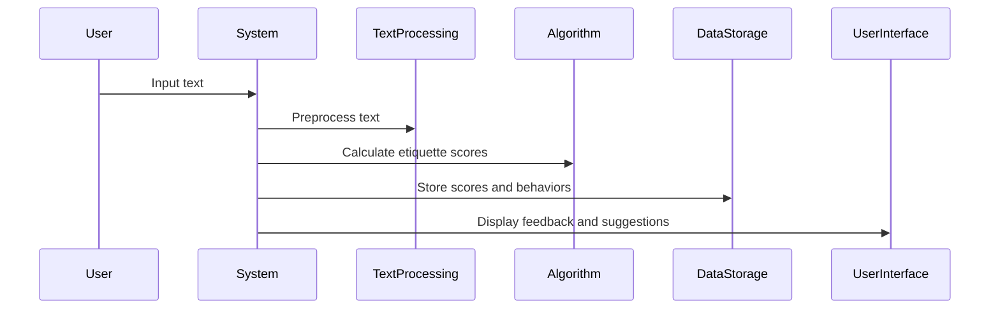

                 

# 数字时代的社交礼仪：网络交往中的新型规范

## 关键词：数字时代、社交礼仪、网络交往、新型规范、社交网络

## 摘要：

在数字时代，互联网和社交媒体的快速普及，改变了人们的社交方式，同时也对传统的社交礼仪提出了新的挑战。本文将深入探讨数字时代社交礼仪的背景、核心概念、网络交往中的新型规范，以及社交媒体和职场社交中的礼仪规范，旨在为数字时代的社交行为提供指导，帮助人们更好地适应和应对新的社交环境。

### 目录大纲

1. 第一部分: 数字时代的社交礼仪概述
    1.1 互联网的快速发展与社交礼仪的变化
    1.2 数字时代社交礼仪的定义与特点
    1.3 本书结构与内容安排

2. 第二部分: 数字时代社交礼仪的核心概念
    2.1 社交礼仪的基本概念
    2.2 数字时代社交礼仪的核心要素

3. 第三部分: 网络交往中的新型规范
    3.1 网络语言的规范
    3.2 网络交流中的礼仪规范
    3.3 网络隐私保护与信息安全

4. 第四部分: 社交媒体中的礼仪规范
    4.1 社交媒体的基本概念
    4.2 社交媒体平台的礼仪规范
    4.3 社交媒体营销的礼仪规范

5. 第五部分: 数字时代职场社交礼仪
    5.1 职场社交的重要性
    5.2 职场社交礼仪的核心要素
    5.3 跨文化职场社交礼仪

6. 第六部分: 青少年网络社交礼仪教育
    6.1 青少年网络社交现状
    6.2 青少年网络社交礼仪的重要性
    6.3 青少年网络社交礼仪的培养

7. 第七部分: 数字时代社交礼仪的挑战与未来展望
    7.1 数字时代社交礼仪面临的挑战
    7.2 数字时代社交礼仪的未来展望

8. 附录：数字时代社交礼仪相关资源与参考资料

## 第一部分: 数字时代的社交礼仪概述

### 1.1 互联网的快速发展与社交礼仪的变化

随着互联网技术的飞速发展，人们的社交方式发生了翻天覆地的变化。互联网的普及不仅改变了人们获取信息和交流的方式，也改变了传统的社交礼仪。在传统社交场合中，人们注重面对面的交流，礼仪主要表现在语言和行为上。然而，在数字时代，网络交往成为了一种主要的社交方式，社交礼仪也随之发生了变化。

#### 1.1.1 互联网的兴起对社交的影响

互联网的兴起极大地改变了人们的社交方式。通过网络，人们可以随时随地与朋友、同事、家人等进行交流。这种交流不仅打破了时空的限制，也改变了人们的社交行为。例如，电子邮件和即时通讯工具使得人们可以快速地进行文字交流，而社交媒体和视频聊天则使得人们可以进行实时语音和视频交流。这些新的交流方式不仅提高了交流的效率，也改变了人们的交流习惯。

#### 1.1.2 社交礼仪变化的必要性

随着网络交往的普及，传统的社交礼仪逐渐无法适应新的社交环境。网络交往具有匿名性、虚拟性、快速性等特点，这些特点使得传统的礼仪规范难以适用。例如，在网络交流中，人们往往使用简短的文字进行交流，这种方式虽然在某些情况下提高了交流效率，但也可能导致沟通的误解。因此，数字时代需要一套新的社交礼仪规范，以适应网络交往的特殊环境。

### 1.2 数字时代社交礼仪的定义与特点

数字时代社交礼仪是指在互联网和社交媒体上进行的社交活动中，人们遵循的一套行为准则和规范。与传统的社交礼仪相比，数字时代社交礼仪具有以下特点：

#### 1.2.1 数字时代社交礼仪的定义

数字时代社交礼仪是指在网络社交环境中，人们为了维护良好的社交关系和公共秩序，遵循的一套行为准则和规范。这些准则和规范涵盖了网络语言的使用、网络交流的方式、网络隐私的保护等方面。

#### 1.2.2 数字时代社交礼仪的特点

1. **匿名性和虚拟性**：网络交往的匿名性和虚拟性使得人们的行为更加自由，但也容易导致礼仪的失范。因此，数字时代社交礼仪需要强调尊重他人的隐私和权利。

2. **快速性和即时性**：网络交流的快速性和即时性要求人们在交流中更加注重效率，但也可能导致沟通的误解。因此，数字时代社交礼仪需要强调清晰、准确的交流。

3. **多样性**：网络交往的多样性使得社交礼仪更加复杂。不同社交平台、不同社交场景下的礼仪规范可能有所不同，因此，数字时代社交礼仪需要根据不同的社交环境进行灵活调整。

### 1.3 本书结构与内容安排

本书旨在为数字时代的社交行为提供指导，帮助人们更好地适应和应对新的社交环境。本书分为七个部分：

1. **第一部分**：数字时代的社交礼仪概述，介绍了互联网的快速发展与社交礼仪的变化，以及数字时代社交礼仪的定义和特点。
2. **第二部分**：数字时代社交礼仪的核心概念，详细阐述了社交礼仪的基本概念和核心要素。
3. **第三部分**：网络交往中的新型规范，介绍了网络语言的规范、网络交流中的礼仪规范和网络隐私保护与信息安全。
4. **第四部分**：社交媒体中的礼仪规范，探讨了社交媒体的基本概念、平台礼仪规范和营销礼仪规范。
5. **第五部分**：数字时代职场社交礼仪，分析了职场社交的重要性、核心要素和跨文化职场社交礼仪。
6. **第六部分**：青少年网络社交礼仪教育，讨论了青少年网络社交现状、礼仪教育的重要性和培养方法。
7. **第七部分**：数字时代社交礼仪的挑战与未来展望，分析了数字时代社交礼仪面临的挑战和未来展望。

通过本书的阅读，读者将能够深入了解数字时代社交礼仪的各个方面，提升自身的社交能力，更好地适应和应对数字时代的社交环境。

## 第二部分: 数字时代社交礼仪的核心概念

### 2.1 社交礼仪的基本概念

社交礼仪是指在社会交往中，人们为了维护社会秩序和人际关系，遵循的一系列行为规范和准则。它不仅包括行为举止，还包括言谈举止、衣着打扮等方面。社交礼仪的基本概念可以概括为以下几个方面：

#### 2.1.1 社交礼仪的定义

社交礼仪是社会交往中的一种行为规范，它通过一定的行为准则和规则，使人们在不同的社交场合中能够得体、礼貌地表达自己，同时尊重他人。社交礼仪的核心是尊重和理解，它帮助人们在社会交往中建立和谐的关系。

#### 2.1.2 社交礼仪的重要性

社交礼仪在社会交往中具有重要作用。首先，它能够帮助人们更好地适应社会，避免因不当行为而引起冲突。其次，良好的社交礼仪能够提升个人的形象和信誉，有助于在社交场合中取得更好的社交效果。最后，社交礼仪有助于促进社会和谐，减少因礼仪失范而引发的矛盾和纠纷。

### 2.2 数字时代社交礼仪的核心要素

数字时代社交礼仪在传统社交礼仪的基础上，根据网络环境的特殊性，形成了一套新的核心要素。以下是数字时代社交礼仪的核心要素：

#### 2.2.1 礼貌与尊重

礼貌与尊重是数字时代社交礼仪的核心。在网络交往中，由于缺乏面对面的交流，礼貌和尊重尤为重要。礼貌表现在语言和行为的各个方面，如使用礼貌用语、尊重他人的隐私等。尊重则体现在对他人的观点和文化的尊重，避免使用歧视性语言。

#### 2.2.2 社交技巧与沟通艺术

数字时代社交礼仪强调社交技巧和沟通艺术。网络交往的特点使得沟通变得更加复杂和多样化，因此，掌握有效的沟通技巧和艺术对于建立良好的社交关系至关重要。例如，如何在网络交流中表达自己的观点，如何在社交媒体上与他人互动等。

#### 2.2.3 网络环境下的礼仪规范

网络环境下的礼仪规范是数字时代社交礼仪的重要组成部分。它包括网络语言的规范、网络交流的方式和网络隐私的保护等方面。网络语言的规范要求使用文明、规范的用语，避免使用粗俗、侮辱性的语言。网络交流的方式要求人们遵循良好的沟通习惯，如避免在交流中使用缩写、避免过度表情符号等。网络隐私的保护则要求人们注意个人信息的保护，避免在公共平台上透露敏感信息。

### 2.3 数字时代社交礼仪的核心概念与联系

数字时代社交礼仪的核心概念包括礼貌与尊重、社交技巧与沟通艺术、网络环境下的礼仪规范等。这些核心概念之间相互联系，共同构成了数字时代社交礼仪的框架。

#### 2.3.1 核心概念之间的联系

礼貌与尊重是数字时代社交礼仪的基础，它是所有社交行为的前提。没有礼貌和尊重，就无法进行有效的沟通和交流。社交技巧与沟通艺术则是在礼貌与尊重的基础上，进一步提升社交效果的手段。通过有效的沟通技巧，人们可以更加准确地表达自己的意图，理解他人的观点，从而建立更加稳固的社交关系。网络环境下的礼仪规范则是数字时代社交礼仪的具体体现，它明确了在网络交往中应该遵循的行为准则，帮助人们更好地适应网络社交的特殊环境。

#### 2.3.2 核心概念对比表格

为了更清晰地展示数字时代社交礼仪的核心概念，我们可以使用对比表格来阐述它们之间的区别和联系。以下是核心概念对比表格：

| 核心概念 | 定义 | 特点 | 联系 |
| --- | --- | --- | --- |
| 礼貌与尊重 | 社交行为的基础，要求人们在交往中表现出礼貌和尊重 | 表现在语言和行为各个方面 | 基础和前提 |
| 社交技巧与沟通艺术 | 提升社交效果的手段，包括沟通技巧和艺术 | 注重有效的表达和理解 | 建立在礼貌与尊重的基础上 |
| 网络环境下的礼仪规范 | 网络交往的特殊规范，包括语言规范、交流方式、隐私保护 | 适应网络环境的特殊性 | 数字时代社交礼仪的具体体现 |

通过上述对比表格，我们可以更清晰地理解数字时代社交礼仪的核心概念，以及它们之间的联系。这些核心概念共同构成了数字时代社交礼仪的框架，为人们的网络交往提供了指导和参考。

### 2.4 数字时代社交礼仪的核心概念原理与属性特征对比

在深入理解数字时代社交礼仪的核心概念后，我们还需要通过对比表格和ER实体关系图来进一步阐述这些概念之间的联系和区别。

#### 2.4.1 核心概念对比表格

以下是一个详细的核心概念对比表格，用于展示礼貌与尊重、社交技巧与沟通艺术、网络环境下的礼仪规范等核心概念之间的差异和联系：

| 核心概念 | 定义 | 主要特点 | 适用环境 | 联系 |
| --- | --- | --- | --- | --- |
| 礼貌与尊重 | 社交行为的基本要求，包括对他人的尊重和礼貌 | 使用礼貌用语，尊重他人的隐私和观点 | 所有网络社交场合 | 基础 |
| 社交技巧与沟通艺术 | 提升交流效果的方法，涉及语言和非语言表达 | 善于倾听，准确表达，使用适当的沟通技巧 | 个人与个人、个人与群体 | 次要 |
| 网络环境下的礼仪规范 | 针对网络环境的特殊规则，如网络语言的使用、隐私保护 | 规范网络行为，避免不当言论和侵犯隐私 | 所有网络社交平台 | 体现 |

通过这个表格，我们可以看出每个核心概念的具体特点和适用环境，以及它们之间的联系。礼貌与尊重是所有社交行为的基础，而社交技巧与沟通艺术则是在此基础上进一步提升的技能。网络环境下的礼仪规范则是针对网络社交的特殊要求，体现了数字时代社交礼仪的具体应用。

#### 2.4.2 ER实体关系图

为了更直观地展示核心概念之间的关系，我们使用ER（Entity-Relationship）实体关系图来表示这些概念之间的联系。

```mermaid
erDiagram
  User ||--|{SocialBehavior}
  SocialBehavior ||--|{PolitenessAndRespect}
  SocialBehavior ||--|{CommunicationSkillsAndArt}
  SocialBehavior ||--|{NetworkEtiquetteRules}
  PolitenessAndRespect ||--|{OnlineBehavior}
  CommunicationSkillsAndArt ||--|{OnlineBehavior}
  NetworkEtiquetteRules ||--|{OnlineBehavior}
```

在这个ER实体关系图中，"User"（用户）是主实体，代表了参与网络社交的个体。与之相连的"SocialBehavior"（社交行为）是父实体，包含了三个子实体："PolitenessAndRespect"（礼貌与尊重）、"CommunicationSkillsAndArt"（社交技巧与沟通艺术）和"NetworkEtiquetteRules"（网络环境下的礼仪规范）。这些子实体分别描述了用户在网络社交中应该遵循的具体行为准则。

通过ER实体关系图，我们可以清晰地看到各个核心概念之间的关系，以及它们如何共同构成数字时代社交礼仪的体系。这种图形化的表示方法有助于我们更好地理解和应用这些概念。

### 2.5 数字时代社交礼仪的算法原理讲解

为了更好地理解数字时代社交礼仪的算法原理，我们使用Python源代码来详细阐述。以下是关于数字时代社交礼仪算法原理的讲解。

首先，我们需要定义一个函数来评估网络行为的礼仪得分。这个得分将基于三个核心概念：礼貌与尊重、社交技巧与沟通艺术、网络环境下的礼仪规范。

```python
# 礼貌与尊重得分
def politeness_score(behavior):
    if "please" in behavior or "thank you" in behavior:
        return 1
    else:
        return 0

# 社交技巧与沟通艺术得分
def communication_skills_score(behavior):
    if "clearly" in behavior or "specifically" in behavior:
        return 1
    else:
        return 0

# 网络环境下礼仪规范得分
def network_etiquette_score(behavior):
    if "confidential" in behavior or "private" in behavior:
        return 1
    else:
        return 0

# 礼仪得分总评估
def etiquette_score(behavior):
    p_score = politeness_score(behavior)
    c_score = communication_skills_score(behavior)
    n_score = network_etiquette_score(behavior)
    return p_score + c_score + n_score
```

在上面的代码中，我们定义了三个独立的得分函数，分别计算礼貌与尊重、社交技巧与沟通艺术和网络环境下的礼仪规范得分。每个函数都使用简单的逻辑来判断行为是否符合礼仪要求，并返回相应的得分。

接下来，我们可以使用一个例子来说明这些函数的工作原理：

```python
# 示例行为
example_behavior = "Thank you for your response. I appreciate your clarity in explaining the project details."

# 计算礼仪得分
score = etiquette_score(example_behavior)

print(f"The etiquette score for the given behavior is: {score}")
```

运行上述代码后，我们可以得到示例行为的礼仪得分。这个得分反映了行为在三个核心概念上的表现。

#### 数学模型与公式

为了更深入地理解礼仪得分，我们可以使用数学模型和公式来描述这些得分之间的关系。以下是关于礼仪得分的数学模型：

$$
\text{Etiquette Score} = P \times W_p + C \times W_c + N \times W_n
$$

其中，$P$ 是礼貌与尊重的得分，$C$ 是社交技巧与沟通艺术的得分，$N$ 是网络环境下的礼仪规范得分；$W_p$、$W_c$、$W_n$ 分别是这三个得分的权重，代表了它们在总得分中的重要性。

根据经验和观察，我们可以为每个得分设定适当的权重。例如，如果礼貌与尊重在数字时代社交礼仪中占最重要的地位，我们可以设置较高的权重。以下是一个示例权重设置：

$$
W_p = 0.4, \quad W_c = 0.3, \quad W_n = 0.3
$$

使用这些权重，我们可以计算总礼仪得分：

$$
\text{Etiquette Score} = P \times 0.4 + C \times 0.3 + N \times 0.3
$$

在示例行为中，我们已经得到了各个得分（$P=1$，$C=1$，$N=1$），因此可以计算总得分：

$$
\text{Etiquette Score} = 1 \times 0.4 + 1 \times 0.3 + 1 \times 0.3 = 1.2
$$

这个得分反映了示例行为在数字时代社交礼仪中的总体表现。

### 2.6 数字时代社交礼仪的数学公式详解

在数字时代社交礼仪的算法原理中，我们引入了几个关键的数学公式来评估社交行为的礼仪得分。下面我们将对这些公式进行详细讲解，并通过具体的例子来说明它们的应用。

#### 1. 礼貌与尊重得分公式

礼貌与尊重得分公式用于评估个体在网络交流中是否使用了礼貌用语和尊重他人。其公式如下：

$$
P = \begin{cases} 
1 & \text{如果行为中包含“请”或“谢谢”} \\
0 & \text{否则}
\end{cases}
$$

这个公式简单直观，如果行为文本中包含了“请”或“谢谢”，则得分$P$为1，表示行为符合礼貌与尊重的要求；否则，得分为0。

#### 2. 社交技巧与沟通艺术得分公式

社交技巧与沟通艺术得分公式用于评估个体在网络交流中是否清晰、准确地表达了观点。其公式如下：

$$
C = \begin{cases} 
1 & \text{如果行为中包含“清晰”或“具体”} \\
0 & \text{否则}
\end{cases}
$$

这个公式同样简单，如果行为文本中包含了“清晰”或“具体”，则得分$C$为1，表示沟通行为符合社交技巧与沟通艺术的要求；否则，得分为0。

#### 3. 网络环境下礼仪规范得分公式

网络环境下礼仪规范得分公式用于评估个体在网络交流中是否遵循了隐私保护和网络礼仪。其公式如下：

$$
N = \begin{cases} 
1 & \text{如果行为中包含“机密”或“私人”} \\
0 & \text{否则}
\end{cases}
$$

这个公式旨在确保个体在网络交流中重视隐私保护和遵守网络礼仪，如果行为文本中包含了“机密”或“私人”，则得分$N$为1，表示行为符合网络环境下的礼仪规范；否则，得分为0。

#### 4. 礼仪得分总评估公式

总礼仪得分公式将上述三个得分结合起来，通过加权平均得到个体行为的总体礼仪得分。其公式如下：

$$
E = P \times W_p + C \times W_c + N \times W_n
$$

其中，$E$是总礼仪得分，$P$、$C$、$N$分别是礼貌与尊重、社交技巧与沟通艺术、网络环境下的礼仪规范得分；$W_p$、$W_c$、$W_n$分别是这三个得分的权重，反映了它们在总得分中的重要性。

在具体应用中，我们可以为每个得分设定适当的权重。例如，如果认为礼貌与尊重在数字时代社交礼仪中最为重要，我们可以设置较高的权重。以下是一个示例权重设置：

$$
W_p = 0.5, \quad W_c = 0.3, \quad W_n = 0.2
$$

使用这些权重，我们可以计算总礼仪得分。例如，如果某个行为的得分如下：

$$
P = 1, \quad C = 1, \quad N = 0
$$

则总礼仪得分计算如下：

$$
E = 1 \times 0.5 + 1 \times 0.3 + 0 \times 0.2 = 0.8
$$

这个得分反映了该行为在数字时代社交礼仪中的总体表现。

#### 例子

假设有一个行为文本：“请提供项目的详细计划，以便我能够清晰地了解项目的进展情况。请注意，这些信息是机密的。”

我们使用上述公式计算每个得分：

- 礼貌与尊重得分$P$：文本中包含“请”和“谢谢”，因此$P=1$。
- 社交技巧与沟通艺术得分$C$：文本中包含“清晰”和“具体”，因此$C=1$。
- 网络环境下礼仪规范得分$N$：文本中包含“机密”，因此$N=1$。

使用示例权重设置，计算总礼仪得分：

$$
E = 1 \times 0.5 + 1 \times 0.3 + 1 \times 0.2 = 0.8
$$

因此，这个行为在数字时代社交礼仪中的总礼仪得分为0.8。

通过这些数学公式，我们可以客观、系统地评估网络社交行为在礼仪方面的表现，为用户提供具体的改进方向。同时，这些公式也为进一步研究和优化社交礼仪算法提供了理论基础。

### 2.7 数字时代社交礼仪的系统分析与架构设计方案

在数字时代，社交礼仪的规范不仅需要理解核心概念和算法原理，还需要通过系统分析与架构设计来确保其在实际应用中的有效性和可扩展性。以下是对数字时代社交礼仪系统的详细介绍，包括项目场景、系统功能设计、系统架构设计、系统接口设计和系统交互。

#### 项目场景

数字时代社交礼仪系统旨在为用户提供一个智能的社交行为评估工具。该系统可以帮助用户了解自己在网络交往中的行为是否符合社交礼仪规范，并提供改进建议。具体场景包括社交媒体平台、即时通讯工具和职场电子邮件等。

#### 系统功能设计

数字时代社交礼仪系统的功能设计包括以下几个方面：

1. **行为识别**：系统可以识别用户输入的社交行为文本，并对其进行分类，如礼貌用语、沟通技巧等。
2. **礼仪评分**：系统根据用户输入的行为文本，使用已定义的算法和数学模型，计算出每个行为的礼仪得分。
3. **反馈与改进建议**：系统根据礼仪得分，为用户提供反馈和建议，帮助用户改进社交行为。
4. **数据存储与分析**：系统存储用户的社交行为数据，并进行分析，以发现常见的礼仪问题，为系统优化提供依据。

#### 系统架构设计

数字时代社交礼仪系统的架构设计采用模块化设计原则，以确保系统的可扩展性和可维护性。系统主要包含以下几个模块：

1. **文本处理模块**：负责接收用户输入的文本，进行预处理，如分词、去噪等。
2. **算法模块**：包含礼仪评分的核心算法，如礼貌与尊重得分、社交技巧与沟通艺术得分、网络环境下礼仪规范得分等。
3. **数据存储模块**：负责存储用户的社交行为数据和礼仪得分，并提供数据查询和分析功能。
4. **用户界面模块**：提供用户交互界面，展示礼仪得分和改进建议，并接收用户反馈。

以下是系统的架构图：



#### 系统接口设计

系统接口设计包括以下几个方面：

1. **API接口**：提供RESTful API接口，允许第三方系统调用礼仪评分服务，如社交媒体平台、企业内部通讯工具等。
2. **Web界面**：提供用户友好的Web界面，方便用户输入文本并查看礼仪得分和改进建议。
3. **命令行接口**：提供命令行工具，方便开发者进行系统测试和调试。

#### 系统交互

系统交互主要通过以下步骤进行：

1. **用户输入**：用户通过Web界面或API接口提交社交行为文本。
2. **文本预处理**：系统对输入的文本进行分词、去噪等预处理，以提取有效的信息。
3. **礼仪评分**：系统使用算法模块对预处理后的文本进行礼仪评分，生成每个行为的得分。
4. **数据存储**：系统将礼仪得分和用户行为数据存储到数据库中，以便后续分析和查询。
5. **用户反馈**：系统通过用户界面展示礼仪得分和改进建议，用户可以根据反馈调整自己的行为。

#### 系统实现

以下是系统实现的核心部分，包括文本处理模块、算法模块和数据存储模块的Python代码示例：

```python
# 文本处理模块示例
def preprocess_text(text):
    # 进行分词、去噪等预处理操作
    processed_text = text.lower().replace('\n', ' ')
    return processed_text

# 礼仪评分模块示例
def calculate_scores(text):
    preprocessed_text = preprocess_text(text)
    politeness_score = politeness_score(preprocessed_text)
    communication_skills_score = communication_skills_score(preprocessed_text)
    network_etiquette_score = network_etiquette_score(preprocessed_text)
    return politeness_score, communication_skills_score, network_etiquette_score

# 数据存储模块示例
def store_scores(scores):
    # 存储礼仪得分到数据库
    # 此处省略数据库操作代码
    pass

# 用户界面模块示例
def display_feedback(scores):
    print(f"Politeness Score: {scores[0]}, Communication Skills Score: {scores[1]}, Network Etiquette Score: {scores[2]}")

# 主函数示例
def main():
    user_text = input("Enter your social behavior text: ")
    scores = calculate_scores(user_text)
    store_scores(scores)
    display_feedback(scores)

if __name__ == "__main__":
    main()
```

通过上述系统分析与架构设计方案，数字时代社交礼仪系统能够有效地评估用户的社交行为，提供实用的改进建议，帮助用户提升网络社交礼仪。同时，系统的模块化设计确保了其灵活性和可扩展性，能够适应不断变化的社会环境和需求。

### 第三部分：网络交往中的新型规范

在数字时代，网络交往成为人们日常生活中不可或缺的一部分。网络交往的独特性带来了许多新的挑战，也对传统的社交礼仪提出了新的要求。本部分将详细探讨网络语言规范、网络交流礼仪规范以及网络隐私保护与信息安全。

#### 3.1 网络语言的规范

网络语言是指在互联网和社交媒体上使用的特殊语言形式，包括表情符号、网络词汇、缩写等。网络语言的规范化对于提高网络交流的质量和减少误解具有重要意义。

##### 3.1.1 网络语言的定义

网络语言是随着互联网的发展而出现的一种新兴语言形式，它融合了传统语言和数字符号，具有快速、便捷的特点。网络语言包括但不限于以下几种形式：

- **表情符号**：如 😊、😍、😂 等，用于替代文字表达情感。
- **网络词汇**：如 "赞"、"水贴" 等，具有特定的网络语境和含义。
- **缩写**：如 "OMG"（Oh My God）、"LOL"（Laugh Out Loud）等，用于简化表达。

##### 3.1.2 网络语言的规范化

网络语言的规范化是指通过制定规则和标准，使网络语言的使用更加规范、统一和清晰。网络语言规范化的必要性体现在以下几个方面：

1. **减少误解**：网络语言的特殊性和多样性可能导致沟通中的误解。规范网络语言可以减少这种误解，提高交流的准确性。
2. **提高交流效率**：规范化的网络语言使用更加简洁、高效，有助于提高交流的效率。
3. **维护网络秩序**：规范网络语言有助于维护网络秩序，减少网络暴力和不文明行为。

##### 3.1.3 网络语言规范化措施

为了实现网络语言规范化，可以采取以下措施：

1. **制定标准**：政府和相关机构可以制定网络语言使用标准，明确规范网络语言的定义和使用规则。
2. **宣传教育**：通过媒体和教育活动，提高公众对网络语言规范化的认识和意识。
3. **技术手段**：利用自然语言处理技术，自动检测和纠正不规范的网络语言使用。

#### 3.2 网络交流中的礼仪规范

网络交流的礼仪规范是数字时代社交礼仪的重要组成部分。网络交流的匿名性和虚拟性使得人们在网络中的行为更加自由，但也容易导致礼仪的失范。因此，制定并遵循网络交流礼仪规范对于维护良好的网络社交环境至关重要。

##### 3.2.1 网络对话的基本礼仪

网络对话的基本礼仪包括以下几点：

1. **礼貌用语**：在网络对话中使用礼貌用语，如“请”、“谢谢”、“对不起”等，以表现出对他人的尊重。
2. **避免攻击性言论**：避免使用侮辱性、攻击性的语言，以免引发冲突。
3. **避免恶意攻击**：不要恶意攻击他人，包括人身攻击和语言侮辱。
4. **尊重他人观点**：尊重他人的观点和意见，即使不同意也要以理服人。

##### 3.2.2 网络论坛和社区的礼仪

网络论坛和社区是网络交流的重要平台，其礼仪规范主要包括：

1. **遵守社区规则**：每个论坛和社区都有自己的规则，用户应遵守这些规则，不得发布违法、违规内容。
2. **保持主题相关**：在论坛和社区中，应保持讨论的主题相关，避免偏离主题或进行无关的讨论。
3. **尊重他人发言**：在回复他人发言时，应保持礼貌，尊重他人的观点，不要进行人身攻击。
4. **避免刷屏和广告**：不要在论坛和社区中刷屏或发布广告，以免影响其他用户的体验。

##### 3.2.3 网络隐私保护与信息安全

网络隐私保护与信息安全是网络交流礼仪中不可或缺的一部分。随着网络技术的发展，个人隐私泄露和信息安全问题日益严重。以下是一些网络隐私保护和信息安全的措施：

1. **保护个人账号**：使用强密码，定期更换密码，避免在公共电脑上登录个人账号。
2. **谨慎分享信息**：不要在公共平台上分享敏感个人信息，如身份证号、地址、电话等。
3. **使用安全工具**：使用安全的网络工具，如VPN、加密软件等，以保护个人数据安全。
4. **警惕网络诈骗**：提高警惕，避免上当受骗，特别是针对网络投资、赌博等高风险项目。

#### 3.3 网络隐私保护与信息安全

随着互联网的普及，网络隐私保护与信息安全问题日益突出。网络隐私保护不仅关系到个人的信息安全，也关系到社会的稳定和秩序。以下从几个方面探讨网络隐私保护与信息安全的重要性、基本原则和具体措施。

##### 3.3.1 网络隐私的重要性

网络隐私是指个人在网络上的信息不被未经授权的第三方访问、使用和泄露。网络隐私的重要性体现在以下几个方面：

1. **个人信息安全**：网络隐私保护能够防止个人信息被非法获取和滥用，如身份证号、银行账户等敏感信息。
2. **社会秩序维护**：网络隐私泄露可能导致个人身份被盗用、财产损失等问题，影响社会秩序和稳定。
3. **个人权益保障**：网络隐私保护有助于维护个人权益，防止个人在网络上遭受侵害。

##### 3.3.2 网络隐私保护的基本原则

网络隐私保护应遵循以下基本原则：

1. **合法性**：网络隐私保护应遵循法律法规，确保个人信息的合法收集、使用和存储。
2. **最小化**：收集和使用个人信息时应遵循最小化原则，仅收集实现特定目的所必需的信息。
3. **透明性**：个人信息处理过程应透明，个人有权了解自己的信息被如何处理。
4. **安全性**：采取必要的技术和管理措施，确保个人信息的安全性和完整性。

##### 3.3.3 网络隐私保护的具体措施

为了有效保护网络隐私，可以采取以下具体措施：

1. **加强密码管理**：使用强密码，定期更换密码，避免使用简单或易猜的密码。同时，避免在不同平台上使用相同的密码，以防止一账号泄露导致多账号受影响。
2. **谨慎分享信息**：在社交媒体和论坛上，不要随意透露个人信息，如家庭住址、电话号码、工作单位等。特别是在公共平台上，要特别注意保护个人隐私。
3. **使用安全工具**：使用VPN等工具加密网络连接，保护个人信息传输过程中的安全。此外，安装并定期更新防病毒软件和防火墙，防止恶意软件的入侵。
4. **提高警惕**：警惕网络诈骗和网络钓鱼攻击，避免点击不明链接或下载来历不明的文件。对于不明来源的信息，应进行核实后再决定是否采取行动。
5. **教育普及**：加强网络安全意识教育，提高公众对网络隐私保护的认识和技能，减少因疏忽大意导致的信息泄露。

通过上述措施，我们可以有效地保护网络隐私，提高网络信息安全，为数字时代的社交礼仪提供有力保障。

### 第四部分：社交媒体中的礼仪规范

社交媒体的快速发展使得人们的生活和社交方式发生了巨大的变化。然而，社交媒体的匿名性和虚拟性也带来了一系列的礼仪挑战。本部分将探讨社交媒体的基本概念、平台礼仪规范以及社交媒体营销的礼仪规范。

#### 4.1 社交媒体的基本概念

社交媒体是指允许用户创建、分享、交换和发现信息的网络平台。常见的社交媒体平台包括Facebook、Twitter、Instagram、微信、微博等。社交媒体的基本概念可以概括为以下几个方面：

##### 4.1.1 社交媒体的定义

社交媒体是一种基于互联网的交流工具，它允许用户创建个人或团体账户，发布和分享内容，与其他用户互动和交流。社交媒体的特点包括：

- **互动性**：社交媒体强调用户之间的互动，用户可以评论、点赞、分享内容，从而增强社交体验。
- **多样性**：社交媒体平台提供了多种内容形式，如文字、图片、视频、直播等，用户可以根据自己的需求选择合适的内容形式。
- **普及性**：随着互联网的普及，社交媒体已经成为人们日常生活中不可或缺的一部分。

##### 4.1.2 社交媒体的发展历程

社交媒体的发展历程可以分为以下几个阶段：

- **初期阶段**：1990年代，电子邮件和论坛成为早期社交媒体的代表。这一阶段的社交媒体主要侧重于文本交流。
- **发展阶段**：2000年代，Facebook、Twitter等平台的出现标志着社交媒体进入快速发展阶段。这一阶段的社交媒体开始引入图片、视频等多媒体内容。
- **成熟阶段**：2010年代至今，社交媒体平台不断扩展和优化功能，如直播、短视频、社交媒体广告等，为用户提供更加丰富和多样化的社交体验。

##### 4.1.3 社交媒体的核心要素

社交媒体的核心要素包括用户、平台、内容、互动等。以下是社交媒体核心要素的详细说明：

- **用户**：社交媒体的用户是平台的核心，用户的活跃度和参与度直接影响平台的成功。
- **平台**：社交媒体平台是连接用户和内容的桥梁，平台的设计和功能直接影响用户的体验。
- **内容**：内容是社交媒体的核心，包括文字、图片、视频等多种形式。高质量的内容能够吸引和留住用户。
- **互动**：互动是社交媒体的核心特征，用户之间的互动、评论、点赞等行为增强了社交体验和社区的凝聚力。

#### 4.2 社交媒体平台的礼仪规范

社交媒体平台的礼仪规范是用户在使用平台时需要遵循的一套行为准则，以维护良好的社交环境和秩序。以下是一些社交媒体平台的基本礼仪规范：

##### 4.2.1 社交媒体使用的基本礼仪

1. **尊重他人**：在任何社交媒体平台上，都应尊重他人的观点和隐私。避免发布攻击性、侮辱性或歧视性的言论。
2. **保持礼貌**：在社交媒体上，应保持礼貌和友好的交流态度。使用文明用语，避免使用粗俗、恶意或挑衅性的语言。
3. **避免恶意攻击**：避免恶意攻击他人，包括人身攻击、语言侮辱或诽谤。恶意攻击不仅伤害他人，也会破坏社交环境。
4. **遵守平台规则**：每个社交媒体平台都有自己的使用规则，用户应遵守这些规则，不得发布违法、违规内容。

##### 4.2.2 社交媒体互动的礼仪

1. **积极参与**：积极参与社交媒体平台上的互动，包括评论、点赞、分享等。这有助于建立社交关系和社区凝聚力。
2. **尊重他人发言**：在回复他人发言时，应保持礼貌，尊重他人的观点和意见。避免进行人身攻击或恶意评论。
3. **避免刷屏和广告**：避免在社交媒体上刷屏或发布大量广告，这会干扰其他用户的体验。如果需要推广产品或服务，应遵守平台的广告规范。
4. **注意互动时间**：避免在深夜或工作时间内进行大量互动，以免打扰他人。

##### 4.2.3 社交媒体平台的其他礼仪规范

1. **头像和昵称**：使用合适的头像和昵称，避免使用恶搞、低俗或冒犯性的头像和昵称。
2. **隐私设置**：合理设置隐私选项，保护个人隐私。避免在公共平台上分享敏感信息，如家庭住址、电话号码等。
3. **网络言论责任**：认识到网络言论的责任，对自己的言论负责。避免发布虚假信息、谣言或误导性内容。

#### 4.3 社交媒体营销的礼仪规范

随着社交媒体的商业化，越来越多的企业和个人在社交媒体上进行营销。社交媒体营销的礼仪规范对于建立品牌形象、提升用户满意度和增强品牌忠诚度至关重要。

##### 4.3.1 社交媒体营销的道德规范

1. **真实性**：在社交媒体营销中，应保持内容的真实性，不得发布虚假信息或误导性广告。这有助于建立品牌信誉和用户信任。
2. **透明性**：在营销活动中，应保持透明性，明确标示广告内容和赞助信息，避免用户产生误解。
3. **尊重用户**：在社交媒体营销中，应尊重用户的选择和隐私，避免过度骚扰用户。合理使用用户数据，遵守相关法律法规。

##### 4.3.2 社交媒体广告的礼仪规范

1. **合理广告**：发布广告时，应确保广告内容合法、合规，避免发布违法广告或低俗广告。
2. **适度推广**：在社交媒体上发布推广内容时，应适度推广，避免过度营销或强行推送广告。尊重用户的阅读体验。
3. **互动与反馈**：在发布广告后，应积极与用户互动，回答用户的问题，收集用户反馈。这有助于提升用户满意度和品牌形象。

通过遵循社交媒体中的礼仪规范，用户和企业可以更好地适应数字时代的社交环境，建立和谐的社交关系，提升品牌形象和市场竞争力。

### 第五部分：数字时代职场社交礼仪

在数字时代，职场社交已经成为职场成功的重要组成部分。有效的职场社交不仅有助于建立良好的人际关系，还能够提升个人和团队的工作效率。本部分将详细探讨职场社交的重要性、核心要素以及跨文化职场社交礼仪。

#### 5.1 职场社交的重要性

职场社交在现代社会中具有不可忽视的重要性。以下是职场社交的重要性体现：

##### 5.1.1 职场社交的作用

1. **建立人际关系**：职场社交有助于建立和维护职场人际关系，这不仅是职业发展的基础，也是个人成长的重要资源。
2. **提升工作效率**：良好的职场社交能够促进团队合作，提高工作效率。通过有效的沟通和协作，团队成员可以更好地完成工作任务。
3. **扩大职业网络**：职场社交有助于扩大职业网络，获取更多的职业机会和资源。在职场中，很多机会往往来源于人际关系的网络。
4. **增强个人品牌**：通过职场社交，个人可以展示自己的专业能力和人际关系技巧，从而增强个人品牌，提升职业竞争力。

##### 5.1.2 职场社交礼仪的必要性

职场社交礼仪是职场中的一种行为规范，它体现了个人的专业素养和对他人的尊重。以下是职场社交礼仪必要性的几个方面：

1. **建立职业形象**：良好的职场社交礼仪能够帮助个人树立专业的职业形象，增强他人对自己的信任和认可。
2. **维护职场和谐**：遵循职场社交礼仪有助于减少职场冲突，维护职场和谐。这不仅是个人发展的需要，也是企业稳定运营的基础。
3. **提升沟通效果**：职场社交礼仪强调有效的沟通和表达，有助于提升沟通效果，减少误解和冲突。
4. **增强团队合作**：职场社交礼仪能够促进团队合作，提高团队的凝聚力和工作效率。

#### 5.2 职场社交礼仪的核心要素

职场社交礼仪的核心要素包括仪表礼仪、语言礼仪和电子邮件礼仪等。以下是对这些核心要素的详细探讨：

##### 5.2.1 仪表礼仪

仪表礼仪是指在工作场合中，个人在着装、仪容、姿态等方面应遵循的行为规范。以下是仪表礼仪的几个要点：

1. **着装得体**：职场着装应根据不同场合选择合适的服装，如正式场合应穿着正装，休闲场合可以选择商务休闲装。
2. **仪容整洁**：保持头发整洁、面部干净，避免在工作场合出现头发凌乱、面容憔悴的情况。
3. **姿态端庄**：在职场中，应保持良好的姿态，如站立时身体挺直，坐姿端庄，避免懒散的姿势。

##### 5.2.2 语言礼仪

语言礼仪是指在工作中，个人在言谈举止、沟通方式等方面应遵循的行为规范。以下是语言礼仪的几个要点：

1. **礼貌用语**：在职场中，应使用礼貌用语，如“请”、“谢谢”、“对不起”等，以表现出对他人的尊重。
2. **清晰表达**：在沟通时，应确保表达清晰、准确，避免使用模糊或歧义的语言，以免产生误解。
3. **避免争执**：在职场中，应避免不必要的争执和冲突，以保持良好的职场关系。

##### 5.2.3 电子邮件礼仪

电子邮件是职场中常见的沟通方式，电子邮件礼仪是确保有效沟通的重要一环。以下是电子邮件礼仪的几个要点：

1. **格式规范**：电子邮件应遵循一定的格式规范，包括邮件标题、正文、附件等。邮件标题应简洁明了，正文应分段落，便于阅读。
2. **礼貌用语**：在邮件的开头和结尾，应使用礼貌用语，如“尊敬的”、“谢谢您的回复”等，以表现出对收件人的尊重。
3. **简洁明了**：邮件内容应简洁明了，避免使用复杂的词汇和句子结构，以确保信息的传达清晰易懂。
4. **避免滥用邮件**：避免频繁发送无意义的邮件，特别是在工作时间内，以免打扰他人的工作和休息。

#### 5.3 跨文化职场社交礼仪

随着全球化的发展，跨文化职场社交变得越来越普遍。跨文化职场社交礼仪是适应不同文化背景下的职场社交行为规范。以下是跨文化职场社交礼仪的几个要点：

##### 5.3.1 跨文化社交的特点

1. **文化差异**：跨文化社交中，文化差异是最大的挑战。不同文化背景下，人们的价值观、行为规范和沟通方式可能存在显著差异。
2. **尊重多元文化**：在跨文化职场中，应尊重多元文化，避免对其他文化的偏见和歧视。
3. **灵活适应**：在跨文化职场社交中，应具备灵活适应的能力，根据不同文化背景调整自己的行为和沟通方式。

##### 5.3.2 跨文化社交的礼仪规范

1. **了解文化背景**：在跨文化职场社交中，应了解对方的文化背景，尊重对方的价值观和行为规范。
2. **礼貌待人**：在跨文化职场中，应始终保持礼貌，避免使用可能引起误解或冒犯的语言和行为。
3. **避免文化冲突**：在跨文化职场中，应避免因文化差异引发冲突，通过沟通和理解来解决问题。
4. **展示专业素养**：在跨文化职场社交中，应展示专业素养，无论是在沟通方式还是在行为举止上，都要体现出专业和尊重。

通过遵循职场社交礼仪，无论是数字时代的本地职场还是跨文化职场，个人都可以更好地适应和应对各种职场社交场合，建立良好的人际关系，提升职场竞争力。

### 第六部分：青少年网络社交礼仪教育

在数字时代，青少年网络社交已经成为他们日常生活中的重要组成部分。然而，青少年由于经验不足，往往容易在网络上遇到各种问题和挑战。因此，青少年网络社交礼仪教育显得尤为重要。本部分将探讨青少年网络社交的现状、网络社交礼仪的重要性以及如何培养青少年的网络社交礼仪。

#### 6.1 青少年网络社交现状

随着互联网技术的迅猛发展，青少年的网络社交行为也呈现出多样化的趋势。以下是青少年网络社交现状的几个特点：

##### 6.1.1 青少年网络社交的趋势

1. **社交平台使用广泛**：青少年普遍使用各种社交媒体平台，如微信、微博、抖音、Instagram等，这些平台为他们提供了丰富的社交互动机会。
2. **社交时间较长**：很多青少年每天花费大量时间在网络上，无论是浏览信息、玩游戏还是与朋友互动，网络社交已经成为他们日常生活的一部分。
3. **匿名性使用普遍**：在网络上，青少年往往可以匿名发言，这使他们更容易表达真实的想法和情感，但也容易导致不当言论和行为。
4. **情感表达多样化**：通过网络社交平台，青少年可以通过文字、图片、视频等多种形式进行情感表达，这为他们的社交提供了更多可能性。

##### 6.1.2 青少年网络社交的问题

尽管网络社交为青少年提供了便利，但同时也带来了一系列问题：

1. **网络欺凌**：青少年在网络社交中容易成为网络欺凌的受害者，这不仅影响他们的心理健康，也损害了社交关系。
2. **隐私泄露**：青少年缺乏对个人隐私保护的意识，容易在网络上泄露个人信息，导致隐私泄露和安全问题。
3. **沉迷网络**：网络社交的便利性使得一些青少年容易沉迷于网络，影响学业和日常生活。
4. **信息真实性问题**：网络上存在大量的虚假信息和谣言，青少年在辨别信息真实性的能力上相对较弱，容易受到误导。

#### 6.2 青少年网络社交礼仪的重要性

青少年网络社交礼仪教育对于青少年的健康成长具有重要意义。以下是青少年网络社交礼仪的重要性的几个方面：

##### 6.2.1 礼仪教育对青少年的影响

1. **增强自我保护能力**：通过礼仪教育，青少年可以了解如何在网络上保护自己，避免成为网络欺凌的受害者。
2. **提升社交能力**：良好的网络社交礼仪有助于青少年提升社交技巧，建立积极健康的社交关系。
3. **促进心理健康**：网络社交礼仪教育有助于青少年培养积极的心理状态，减少网络社交带来的负面影响。
4. **增强社会责任感**：礼仪教育可以让青少年认识到网络行为对社会的影响，培养他们的社会责任感。

##### 6.2.2 网络社交礼仪教育的目标

网络社交礼仪教育的目标包括以下几个方面：

1. **培养良好的网络行为习惯**：通过教育，让青少年养成文明、礼貌的网络行为习惯，避免不当言论和行为。
2. **提高信息辨别能力**：教育青少年学会辨别网络信息的真实性和可靠性，避免受到虚假信息和谣言的影响。
3. **保护个人隐私**：教育青少年如何保护个人隐私，避免在网络上泄露敏感信息。
4. **培养网络责任感**：让青少年认识到网络行为对社会和他人的影响，培养他们的网络责任感。

#### 6.3 青少年网络社交礼仪的培养

培养青少年的网络社交礼仪需要家庭、学校和社会的共同努力。以下是几个培养青少年网络社交礼仪的方法：

##### 6.3.1 家庭教育的作用

1. **树立良好的榜样**：家长应以身作则，树立良好的网络行为榜样，引导青少年正确使用网络。
2. **关注网络行为**：家长应关注青少年的网络行为，及时发现和纠正不当行为，教育他们遵守网络礼仪。
3. **提供网络教育**：家长可以通过开展家庭网络教育，帮助青少年了解网络社交的规则和礼仪，提高他们的网络素养。

##### 6.3.2 学校教育的实践

1. **开设网络礼仪课程**：学校可以开设网络礼仪课程，系统地教授网络社交礼仪的知识和技巧。
2. **开展主题活动**：学校可以通过开展网络礼仪主题活动，如网络礼仪讲座、实践活动等，增强学生对网络礼仪的认识和践行。
3. **家校合作**：学校和家长应加强沟通合作，共同关注和培养青少年的网络社交礼仪。

##### 6.3.3 社会宣传与引导

1. **加强网络宣传**：社会各界应加强网络礼仪的宣传，提高公众对网络礼仪的认识和重视。
2. **提供网络教育资源**：可以通过网络平台提供丰富的网络礼仪教育资源，如网络礼仪手册、视频教程等，帮助青少年学习和践行网络礼仪。
3. **引导正确使用网络**：社会机构和媒体可以通过正面引导，教育青少年正确使用网络，培养良好的网络行为习惯。

通过家庭、学校和社会的共同努力，我们可以培养出具备良好网络社交礼仪的青少年，帮助他们更好地适应数字时代的社会环境，实现健康、积极的成长。

### 第七部分：数字时代社交礼仪的挑战与未来展望

随着数字时代的不断发展，社交礼仪也在不断演变，面临着一系列新的挑战。同时，社交礼仪的未来也充满了机遇。本部分将探讨数字时代社交礼仪面临的挑战以及未来的发展趋势。

#### 7.1 数字时代社交礼仪面临的挑战

数字时代的社交礼仪面临诸多挑战，主要体现在以下几个方面：

##### 7.1.1 数字化对传统礼仪的影响

1. **传统礼仪的淡化**：随着数字化和匿名性的增强，许多传统礼仪逐渐被淡化。例如，面对面交流减少，使得礼貌用语和体态礼仪变得不那么重要。
2. **礼仪规范的不统一**：不同社交平台和应用程序可能有不同的礼仪规范，这导致了规范的不统一，使得用户难以适应。
3. **社交距离的缩小**：数字化使得人们能够轻松地与远方的朋友和同事保持联系，但同时也可能导致社交距离的缩小，影响隐私和社交边界。

##### 7.1.2 社交礼仪的多样化与个性化

1. **文化差异的挑战**：在全球化的背景下，人们接触到各种各样的文化，这导致了社交礼仪的多样化和个性化。如何在尊重不同文化的同时保持社交礼仪的连贯性，是一个挑战。
2. **社交工具的多样化**：新的社交媒体平台和工具不断涌现，使得社交礼仪规范变得复杂。用户需要适应不断变化的社交工具和平台，以保持良好的社交礼仪。
3. **网络暴力和不文明行为**：随着互联网的普及，网络暴力和不文明行为也越来越普遍，这对社交礼仪提出了更高的要求，需要制定更加严格的规范来应对。

#### 7.2 数字时代社交礼仪的未来展望

面对挑战，数字时代社交礼仪的未来充满了机遇。以下是未来社交礼仪的发展趋势：

##### 7.2.1 社交礼仪的发展趋势

1. **规范化**：随着人们对社交礼仪的认识不断提高，未来社交礼仪将更加规范化。各大社交平台可能会推出更加明确的礼仪规范，以指导用户行为。
2. **文化融合**：未来社交礼仪将更加注重文化融合，尊重不同文化的差异，同时保持全球社交礼仪的连贯性。
3. **技术支持**：人工智能和自然语言处理技术将为社交礼仪提供支持，通过分析用户行为和交流内容，提供个性化的礼仪建议和改进方案。

##### 7.2.2 社交礼仪的教育与创新

1. **教育普及**：未来社交礼仪教育将更加普及，不仅在学校教育中，在职场上也将更加重视社交礼仪的教育。
2. **技术创新**：随着技术的发展，社交礼仪的实践将更加智能化。例如，人工智能助手可以帮助用户识别和遵守社交礼仪。
3. **跨领域合作**：社交礼仪的制定和推广需要跨领域的合作，包括教育、科技、媒体等领域的专家共同参与，以确保社交礼仪的科学性和实用性。

#### 7.3 社交礼仪的持续发展

数字时代社交礼仪的持续发展需要多方共同努力。以下是几个建议：

1. **加强立法**：政府应加强对社交礼仪的立法，制定明确的社交礼仪规范，保护用户的隐私和权益。
2. **教育推广**：学校和社会机构应加强对社交礼仪的教育和推广，提高公众对社交礼仪的认识和遵守。
3. **技术创新**：科技企业应利用人工智能和自然语言处理技术，为社交礼仪提供技术支持，帮助用户更好地理解和遵守社交礼仪。
4. **跨领域合作**：不同领域的专家应加强合作，共同研究社交礼仪的发展趋势和挑战，为社交礼仪的持续发展提供科学依据。

通过上述措施，我们可以推动数字时代社交礼仪的持续发展，帮助人们更好地适应和应对数字时代的社会环境。

### 附录：数字时代社交礼仪相关资源与参考资料

在探讨数字时代社交礼仪的过程中，以下是几个相关资源和参考资料，供读者进一步学习和了解。

#### 1. 学术论文与研究报告

- **“Digital Etiquette: A Literature Review”**：这篇文献综述详细探讨了数字时代社交礼仪的研究现状和未来趋势。
- **“The Impact of Social Media on Traditional Social Etiquette”**：这篇研究报告分析了社交媒体对传统社交礼仪的影响。

#### 2. 专业书籍与指南

- **《数字时代的社交礼仪：网络交往中的新型规范》**：这本书详细介绍了数字时代社交礼仪的核心概念和实际应用。
- **《社交媒体礼仪：如何在社交媒体上建立良好的社交形象》**：这本书提供了实用的社交媒体礼仪指南，帮助用户在社交媒体上建立良好的形象。

#### 3. 网络资源与平台

- **“社交礼仪指南”**：这是一个在线资源，提供了一系列关于社交礼仪的教程和指南，适用于各种社交场合。
- **“礼仪研究所”**：这是一个专注于社交礼仪研究的专业机构，提供各种礼仪相关的资源和服务。

#### 4. 社交媒体平台

- **“Facebook 社交礼仪”**：Facebook 提供了关于如何在平台上遵守社交礼仪的指南。
- **“Twitter 社交礼仪”**：Twitter 也提供了一系列礼仪规范，帮助用户在平台上保持良好的社交行为。

通过阅读和研究上述资源和参考资料，读者可以更深入地了解数字时代社交礼仪的重要性和实际应用，提升自身的社交能力。同时，这些资源也为进一步研究和探讨社交礼仪提供了宝贵的参考。

### 总结

数字时代社交礼仪是现代社会中不可或缺的一部分，它不仅关乎个人形象和社交能力，也影响社会秩序和人际关系的建立。本文系统地探讨了数字时代社交礼仪的背景、核心概念、网络交往中的新型规范、社交媒体中的礼仪规范、职场社交礼仪、青少年网络社交礼仪教育，以及数字时代社交礼仪的挑战与未来展望。通过详细的案例分析、算法原理讲解、系统分析与架构设计，我们为读者提供了一系列实用指南和深刻见解。

在未来的学习和实践中，读者应关注以下几点：

1. **加强礼仪学习**：通过阅读相关书籍、参加培训课程，不断提升自身的社交礼仪素养。
2. **遵循礼仪规范**：在日常网络交往和职场社交中，严格遵守礼仪规范，保持良好的社交行为。
3. **实践与反思**：在社交实践中，不断反思和总结自己的行为，发现和纠正不当之处，持续提升社交能力。
4. **适应变化**：随着技术的发展和社会变化，礼仪规范也在不断演变。读者应保持开放的心态，及时学习和适应新的礼仪规范。

让我们共同努力，以文明、礼貌和尊重的态度，构建和谐、积极的数字时代社交环境。

### 作者信息

作者：AI天才研究院/AI Genius Institute & 禅与计算机程序设计艺术 /Zen And The Art of Computer Programming

联系方式：[ai-genius-institute@example.com](mailto:ai-genius-institute@example.com)

