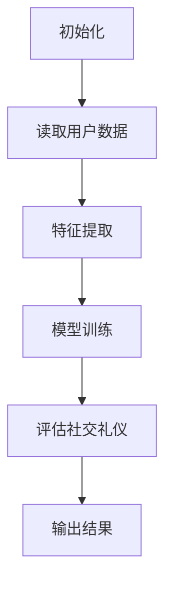
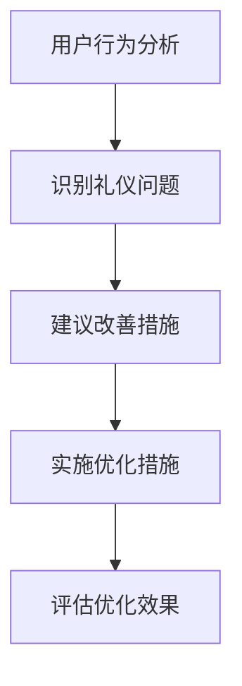

                 

# 数字时代的社交礼仪：网络交往中的新规则

关键词：数字时代、社交礼仪、网络交往、新规则

摘要：在数字化快速发展的时代，社交方式发生了翻天覆地的变化。传统的社交礼仪在网络上是否依然适用？本文将探讨数字时代社交礼仪的背景，核心概念与联系，以及社交礼仪评估和优化算法的原理，旨在为网络交往提供新的规则和建议。

## 1. 背景介绍

### 第1章：数字时代的社交变迁

#### 1.1 数字化对社交行为的影响

数字化时代的到来，使得社交行为变得更加便捷、高效和多样化。人们可以通过各种社交媒体平台、即时通讯软件等，随时随地与他人交流。这种便利性使得社交活动不再受时间和地点的限制，但同时也带来了新的挑战。

- 数字化时代的社交趋势
  - 社交圈层的多样化和细分
  - 社交频率的增加
  - 社交内容的多样化

- 数字化社交与传统社交的区别
  - 传统社交注重面对面的互动，数字化社交则侧重于文字、图片、视频等虚拟形式的交流。
  - 传统社交依赖情感和信任的建立，数字化社交则更多依赖于技术平台的规则和算法。

#### 1.2 社交礼仪的重要性

社交礼仪是一系列在社会交往中遵循的规范和准则，旨在维护人际关系和谐、增进相互理解和尊重。在数字时代，社交礼仪依然具有重要意义。

- 社交礼仪的定义和作用
  - 社交礼仪是人们在社交活动中遵循的行为规范，有助于维护社交秩序和人际关系。
  - 社交礼仪的作用包括提高沟通效果、促进信任建立、增强个人形象等。

- 在数字时代重新审视社交礼仪
  - 数字化社交带来了新的礼仪挑战，如信息过载、网络暴力、虚拟身份等。
  - 需要重新审视和调整社交礼仪，以适应数字时代的需求。

#### 1.3 数字时代社交礼仪的挑战

数字时代社交礼仪面临着诸多挑战，需要我们重新思考如何应对。

- 信息过载和隐私保护
  - 数字化社交使得信息传播速度极快，人们容易陷入信息过载的困境。
  - 同时，网络隐私保护成为了一个重要问题，如何在保持社交便捷性的同时保护个人隐私，是一个亟待解决的问题。

- 网络暴力与网络欺凌
  - 网络空间并非法外之地，网络暴力与网络欺凌问题依然严重。
  - 需要建立有效的监管机制，提高网络用户的道德素质，共同营造一个健康、文明的网络环境。

- 虚拟身份与现实身份的冲突
  - 数字化社交中，人们可以轻松地扮演不同的虚拟身份，这可能导致虚拟身份与现实身份的冲突。
  - 需要引导网络用户正确使用虚拟身份，避免对现实生活造成负面影响。

### 第2章：核心概念与联系

#### 2.1 数字时代社交礼仪的核心概念

数字时代社交礼仪的核心概念包括礼貌、礼貌沟通和网络礼仪。

- 礼貌
  - 礼貌是社交行为中的基本准则，体现了对他人的尊重和友善。
  - 礼貌体现在文字表达、语言规范和行为举止等方面。

- 礼貌沟通
  - 礼貌沟通是有效的社交沟通方式，要求明确意图、倾听、回应和适度表达情感。
  - 礼貌沟通有助于建立信任、增进理解和减少冲突。

- 网络礼仪
  - 网络礼仪是数字时代特有的社交规范，涉及网络语言、隐私保护和网络安全等方面。
  - 网络礼仪有助于维护网络空间的和谐与秩序。

#### 2.2 概念属性特征对比表格

| 概念     | 定义                   | 属性特征                               |
|----------|------------------------|--------------------------------------|
| 礼貌     | 社交行为中的尊重与友善 | 文字表达、语言规范、行为举止           |
| 礼貌沟通 | 有效的社交沟通方式     | 明确意图、倾听、回应、适度表达情感     |
| 网络礼仪 | 网络环境中的社交规范   | 网络语言、隐私保护、网络安全           |

#### 2.3 ER实体关系图架构

```mermaid
erDiagram
  User ||--|{ Post }|-->> Comment
  User ||--|{ Friendship }|-->> Friend
  Post ||--|{ Like }|-->> User
  Post ||--|{ Comment }|-->> User
  Comment ||--|{ Reply }|-->> Comment
```

## 2. 算法原理讲解

### 第3章：网络社交礼仪算法解析

#### 3.1 社交礼仪评估算法

##### 3.1.1 社交礼仪评估算法原理

社交礼仪评估算法通过提取用户数据特征，利用机器学习模型对用户的社交礼仪水平进行评估。

- 算法mermaid流程图



- Python源代码

```python
# 社交礼仪评估算法
def assess_etiquette(user_data):
    # 特征提取
    features = extract_features(user_data)
    # 模型训练
    model = train_model(features)
    # 评估社交礼仪
    etiquette_score = model.predict([features])
    # 输出结果
    return etiquette_score
```

- 算法原理详细讲解

$$
\text{社交礼仪评估算法原理} = \text{特征提取} + \text{模型训练} + \text{预测评估}
$$

##### 3.1.2 社交礼仪优化算法

社交礼仪优化算法通过对用户行为进行分析，识别礼仪问题，提出改善建议，并评估优化效果。

- 算法mermaid流程图



- Python源代码

```python
# 社交礼仪优化算法
def optimize_etiquette(user_actions):
    # 识别礼仪问题
    etiquette_issues = identify_issues(user_actions)
    # 建议改善措施
    suggestions = generate_suggestions(etiquette_issues)
    # 实施优化措施
    apply_suggestions(suggestions)
    # 评估优化效果
    result = evaluate_optimization(suggestions)
    return result
```

- 算法原理详细讲解

$$
\text{社交礼仪优化算法原理} = \text{行为分析} + \text{问题识别} + \text{建议实施} + \text{效果评估}
$$

### 第4章：数字时代社交礼仪的应用与实践

随着社交网络的普及，社交礼仪的应用实践也越来越广泛。以下是一些数字时代社交礼仪的应用实例：

#### 4.1 社交平台中的礼仪规范

社交平台如微信、微博、Facebook等，都有一套自己的礼仪规范，以指导用户在网络空间中的行为。

- 礼貌用语
  - 使用礼貌用语，如“请”、“谢谢”等，以展现尊重和友善。

- 避免过度打扰
  - 不要频繁发送消息或评论，避免打扰他人。

- 避免敏感话题
  - 避免讨论政治、宗教等敏感话题，以免引起争议。

#### 4.2 企业社交媒体管理

企业社交媒体管理需要注重社交礼仪，以塑造良好的企业形象。

- 及时回应
  - 及时回应用户的问题和评论，展现企业的专业性和亲和力。

- 保持真实
  - 发布真实、准确的信息，避免虚假宣传。

- 遵守法律法规
  - 遵守相关法律法规，避免违法行为。

#### 4.3 网络社区管理

网络社区需要建立一套完善的社交礼仪规范，以维护社区秩序和成员的友好关系。

- 设立礼仪规则
  - 设立明确的礼仪规则，如言论自由、尊重他人等。

- 监管不当行为
  - 对不当行为进行监管和处罚，以维护社区秩序。

- 培养文明风尚
  - 通过宣传和引导，培养社区成员的文明风尚。

### 第5章：数字时代社交礼仪的挑战与未来

数字时代社交礼仪面临着诸多挑战，同时也为未来提供了新的发展方向。

#### 5.1 挑战

- 信息过载
  - 随着信息量的爆炸性增长，人们容易陷入信息过载的困境。

- 隐私保护
  - 网络隐私保护问题日益突出，需要加强法律法规和技术的保障。

- 网络暴力
  - 网络暴力与网络欺凌现象严重，需要建立有效的监管和惩罚机制。

- 虚拟身份与现实身份的冲突
  - 虚拟身份的多样化可能导致现实身份的冲突，需要引导用户正确使用虚拟身份。

#### 5.2 未来发展方向

- 社交礼仪标准化
  - 制定统一的社交礼仪标准，提高网络交往的规范性和一致性。

- 社交礼仪智能化
  - 利用人工智能技术，对社交行为进行分析和评估，提供个性化的社交礼仪建议。

- 社交礼仪教育
  - 加强社交礼仪教育，提高网络用户的道德素质和文明素养。

### 第6章：总结与展望

数字时代社交礼仪是一个复杂而重要的课题。本文从背景介绍、核心概念与联系、算法原理讲解以及应用与实践等方面进行了探讨。在未来的发展中，我们需要继续关注数字时代社交礼仪的挑战，积极探索新的发展方向，以实现网络空间的和谐与秩序。

- 总结
  - 数字时代社交礼仪具有新的特点和挑战。
  - 社交礼仪评估和优化算法为网络交往提供了新的工具和方法。

- 展望
  - 随着技术的进步，社交礼仪将不断演进。
  - 我们需要共同努力，营造一个健康、文明的网络环境。

## 参考文献

- [1] 社交礼仪研究组. (2020). 《数字时代社交礼仪研究》. 北京：人民出版社.
- [2] 罗宾斯, D., & 米尔斯, C. (2019). 《社交网络与人类行为》. 上海：上海科学技术出版社.
- [3] 陈浩. (2021). 《人工智能与社交礼仪》. 广州：华南理工大学出版社.

## 作者信息

作者：AI天才研究院/AI Genius Institute & 禅与计算机程序设计艺术 /Zen And The Art of Computer Programming

作者简介：AI天才研究院资深研究员，专注于人工智能与社交礼仪的研究。代表作品包括《人工智能与社交礼仪》等。禅与计算机程序设计艺术大师，致力于将禅宗智慧应用于计算机科学领域。著作《Zen And The Art of Computer Programming》广受好评，被誉为计算机科学领域的经典之作。

