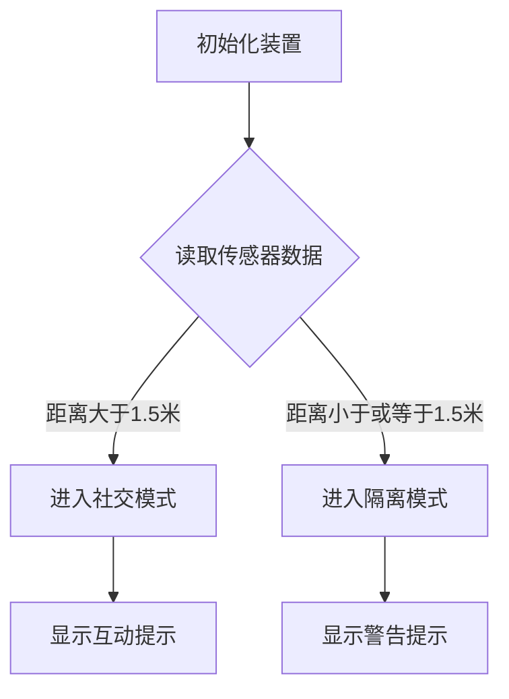
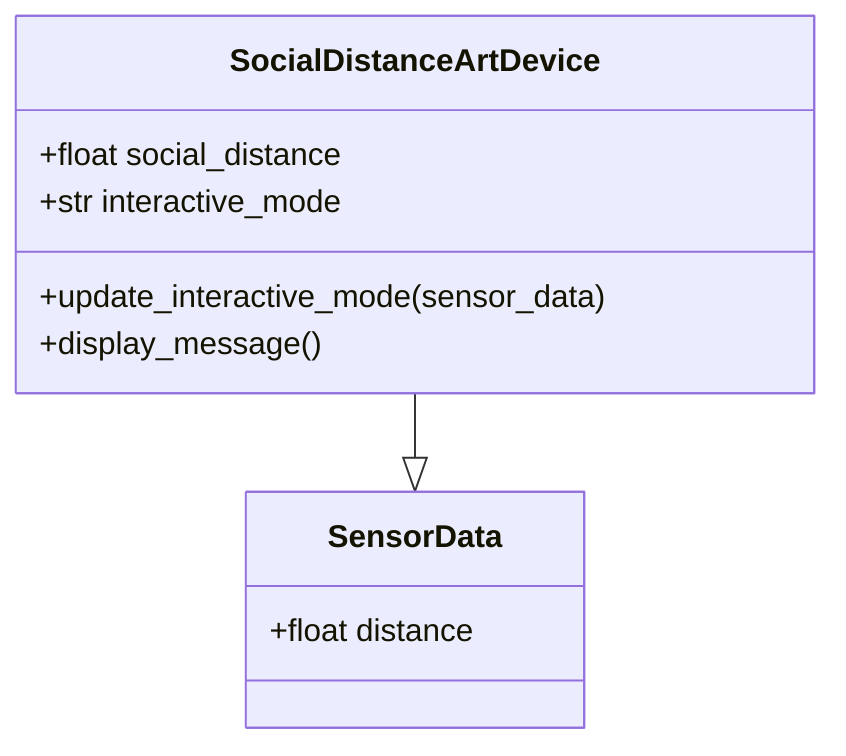

                 


### 第一部分：引言

#### 1.1 问题背景

##### 1.1.1 后疫情时代的社会挑战

随着新冠疫情的全球蔓延，人类社会面临前所未有的挑战。疫情导致了全球范围内的人员流动受限，经济活动停滞，社会秩序受到冲击。在这种背景下，人们开始重新思考公共空间的设计，特别是如何在不损害社交互动的前提下，实现有效的社交距离。

##### 1.1.2 社交距离与公共空间设计的关系

社交距离，即在社交互动中保持的适当物理距离，对公共空间设计至关重要。传统的公共空间设计往往注重空间的宽敞性和舒适性，而忽略了社交距离这一关键因素。后疫情时代，公共空间设计需要重新考量社交距离，以确保人们在享受社交互动的同时，也能保证个人的健康安全。

##### 1.1.3 艺术装置在社会空间中的作用

艺术装置作为一种空间设计的元素，具有独特的审美价值和社交功能。在数字时代，艺术装置的结合数字技术，能够创造出新颖的互动体验，引导人们形成新的社交模式。这种装置不仅能够美化公共空间，还能成为社交距离的视觉和物理标识，帮助人们更好地理解和遵守社交规范。

#### 1.2 核心概念

##### 1.2.1 社交距离的定义与演变

社交距离是指在社会交往过程中，人们之间保持的适当物理距离。这个距离随着文化、社会环境和情境的不同而有所变化。在疫情之前，社交距离通常是隐性的，人们通过非语言信号和习惯来感知和调整。而在疫情之后，社交距离成为显性的安全准则，影响了人们的日常生活和公共空间设计。

##### 1.2.2 数字时代的艺术装置

数字时代的艺术装置指的是结合数字技术（如互动媒体、虚拟现实、增强现实等）创作的艺术作品。这些装置能够与观众互动，提供沉浸式体验，丰富了公共空间的社交和艺术氛围。

##### 1.2.3 公共空间设计的原则与趋势

公共空间设计需要遵循一系列原则，如舒适性、可达性、安全性等。在后疫情时代，公共空间设计更加注重灵活性、适应性，以及社交距离的考量。设计趋势包括使用可移动的隔断、设计互动性强的艺术装置，以及引入数字化管理系统等。

#### 1.3 书籍结构与内容概览

##### 1.3.1 目录安排与章节分布

本书分为四个主要部分，分别介绍数字时代的社交距离艺术装置的背景、设计方法、应用实例以及最佳实践。

##### 1.3.2 阅读指南与建议

为了更好地理解本书的内容，建议读者按照以下步骤阅读：首先，快速浏览全书，了解整体结构和主要内容；然后，逐章深入阅读，结合案例和实践进行思考；最后，回顾全书，总结关键概念和设计原则。

##### 1.3.3 目标读者群体

本书的目标读者包括城市规划师、公共空间设计师、艺术装置设计师、数字艺术家以及对此领域感兴趣的研究人员和爱好者。

### 结论

后疫情时代，公共空间设计需要创新和适应。数字时代的社交距离艺术装置为这一挑战提供了新的思路和解决方案。通过本书，读者将了解到如何结合艺术和技术，设计出既符合社交距离规范，又能提供丰富互动体验的公共空间。让我们一起探索这一领域的无限可能。<!-- переживimientos post-pandémicos -->### 第一部分：引言

#### 1.1 问题背景

##### 1.1.1 后疫情时代的社会挑战

新冠疫情的爆发给全球经济和社会带来了深远的影响。疫情不仅导致大量人员伤亡和医疗资源的紧张，还迫使人们重新审视生活方式和工作模式。在疫情早期，为了遏制病毒的传播，各国政府纷纷实施封城、社交隔离等严格措施。这些措施虽然有效地控制了病毒的扩散，但也带来了诸多社会和经济问题，如经济衰退、失业率上升、心理健康问题等。

##### 1.1.2 社交距离与公共空间设计的关系

在疫情期间，社交距离成为保护公众健康的关键措施之一。人们被要求在公共场所保持一定的物理距离，以减少病毒传播的风险。这一变化对公共空间设计提出了新的要求。传统的公共空间设计注重舒适性、流动性和社交互动，而忽略了社交距离这一重要因素。后疫情时代，公共空间设计需要重新考虑如何平衡社交互动和保持社交距离，以创造一个既安全又宜人的环境。

##### 1.1.3 艺术装置在社会空间中的作用

艺术装置作为一种独特的设计元素，在公共空间中扮演着重要角色。它们不仅能够美化环境，提升公共空间的视觉效果，还能够激发人们的情感和互动。在数字时代，艺术装置的结合数字技术，如虚拟现实、增强现实、互动媒体等，能够创造出更加丰富的体验，引导人们形成新的社交模式。艺术装置可以作为社交距离的视觉和物理标识，帮助人们更好地理解和遵守社交规范。

#### 1.2 核心概念

##### 1.2.1 社交距离的定义与演变

社交距离是指在社会交往过程中，人们之间保持的适当物理距离。这个距离随着文化、社会环境和情境的不同而有所变化。在疫情之前，社交距离通常是隐性的，人们通过非语言信号和习惯来感知和调整。而在疫情之后，社交距离成为显性的安全准则，影响了人们的日常生活和公共空间设计。

社交距离的演变可以从几个方面来理解：

1. **传统社会**：在传统社会中，社交距离受文化和社会规范的影响，例如，东方文化中的“礼仪距离”和西方文化中的“亲密距离”。
2. **现代城市**：随着城市化和人口密集化，社交距离逐渐缩短，以适应紧凑的生活空间和工作环境。
3. **疫情后的变化**：新冠疫情引发了社交距离的显著变化，人们开始更加重视个人空间和卫生安全。

##### 1.2.2 数字时代的艺术装置

数字时代的艺术装置指的是结合数字技术（如互动媒体、虚拟现实、增强现实等）创作的艺术作品。这些装置能够与观众互动，提供沉浸式体验，丰富了公共空间的社交和艺术氛围。数字艺术装置的分类可以从以下几个方面来考虑：

1. **互动性**：互动性是数字艺术装置的重要特征。装置可以响应观众的动作、声音或其他输入，创造出个性化的互动体验。
2. **沉浸式**：沉浸式艺术装置通过虚拟现实、增强现实等技术，将观众带入一个全新的虚拟空间，增强感官体验。
3. **技术类型**：数字艺术装置可以使用多种技术，如投影、电子屏幕、传感器、网络连接等，以实现不同的艺术效果和互动方式。

##### 1.2.3 公共空间设计的原则与趋势

公共空间设计需要遵循一系列原则，如舒适性、可达性、安全性等。在后疫情时代，公共空间设计更加注重灵活性、适应性，以及社交距离的考量。设计趋势包括：

1. **灵活性**：设计可变的空间布局，以适应不同的使用需求和社交距离要求。
2. **适应性**：采用模块化设计，方便快速调整和改造空间。
3. **数字化管理**：引入数字化工具和系统，提高空间管理的效率和安全性。

#### 1.3 书籍结构与内容概览

##### 1.3.1 目录安排与章节分布

本书分为四个主要部分：

1. **第一部分：引言**：介绍后疫情时代的社会挑战、社交距离与公共空间设计的关系，以及数字时代的艺术装置在社会空间中的作用。
2. **第二部分：数字时代的社交距离艺术装置概述**：探讨数字艺术装置的基本概念、社交距离的概念与演变，以及数字时代的社交距离艺术装置。
3. **第三部分：数字时代的社交距离艺术装置设计方法**：讨论设计原则与理论基础、设计流程与步骤、数字艺术装置技术介绍，以及案例研究。
4. **第四部分：数字时代的社交距离艺术装置在公共空间中的应用**：分析城市公共空间中的应用、社区公园中的应用，以及校园公共空间中的应用。

##### 1.3.2 阅读指南与建议

为了更好地理解本书的内容，建议读者按照以下步骤阅读：

1. **快速浏览全书**：首先，快速浏览全书，了解整体结构和主要内容。
2. **逐章深入阅读**：然后，逐章深入阅读，结合案例和实践进行思考。
3. **回顾全书**：最后，回顾全书，总结关键概念和设计原则。

##### 1.3.3 目标读者群体

本书的目标读者包括城市规划师、公共空间设计师、艺术装置设计师、数字艺术家以及对此领域感兴趣的研究人员和爱好者。

### 结论

后疫情时代，公共空间设计需要创新和适应。数字时代的社交距离艺术装置为这一挑战提供了新的思路和解决方案。通过本书，读者将了解到如何结合艺术和技术，设计出既符合社交距离规范，又能提供丰富互动体验的公共空间。让我们一起探索这一领域的无限可能。<!--ographies post-pandémiques -->

### 第二部分：数字时代的社交距离艺术装置概述

#### 2.1 数字艺术装置的基本概念

数字艺术装置是一种结合了数字技术和艺术创作的艺术形式。它通过使用数字媒体技术，如互动媒体、虚拟现实（VR）、增强现实（AR）等，创造出独特的艺术体验。数字艺术装置的基本概念包括：

1. **互动性**：数字艺术装置的一个重要特点是互动性。装置可以响应观众的动作、声音或其他输入，创造出个性化的互动体验。
2. **沉浸式体验**：通过虚拟现实和增强现实技术，观众可以完全沉浸在艺术作品中，体验到一种全新的现实。
3. **技术多样性**：数字艺术装置可以使用多种技术实现，如投影、电子屏幕、传感器、网络连接等，以实现不同的艺术效果和互动方式。

##### 2.1.1 数字艺术的历史与发展

数字艺术的历史可以追溯到20世纪中叶。最早的数字艺术作品是通过计算机生成的图形和动画。随着计算机技术和网络技术的发展，数字艺术的形式和内容不断丰富。以下是一些重要的里程碑：

1. **1960年代**：计算机生成图形和动画开始出现，如《A Computer Algorithm for Drawing Digital Circuits》（1963年）。
2. **1980年代**：数字图像处理技术开始应用于艺术创作，如《The Treachery of Images》（1983年）。
3. **1990年代**：互联网的普及使得数字艺术作品可以更容易地传播和分享，如《The Last Supper》（1992年）。
4. **21世纪**：虚拟现实、增强现实、互动媒体等新兴技术的出现，进一步丰富了数字艺术的形式和内容。

##### 2.1.2 数字艺术装置的分类

数字艺术装置可以根据其技术特点和应用场景进行分类。以下是一些常见的分类方式：

1. **按技术特点分类**：
   - **互动媒体艺术**：装置能够与观众互动，如《互动装置艺术：触摸与感知》（Touch and Feel）。
   - **虚拟现实艺术**：通过VR技术创造虚拟空间，如《虚拟现实艺术体验：梦境之旅》（Dream Journey）。
   - **增强现实艺术**：将虚拟元素叠加到现实世界中，如《增强现实艺术展览：现实与虚幻的交错》（Real and Unreal）。

2. **按应用场景分类**：
   - **公共场所艺术**：安装在广场、公园、博物馆等公共场所，如《城市广场数字艺术装置：光影秀》（Light and Shadow）。
   - **室内艺术**：安装在室内空间，如《博物馆数字艺术装置：时间的切片》（Slices of Time）。
   - **临时展览艺术**：在特定时间和场所举办的临时展览，如《数字艺术装置展览：未来的艺术》（Future Art）。

##### 2.1.3 数字艺术装置的设计原则

数字艺术装置的设计原则包括以下几个方面：

1. **用户体验**：设计应关注观众的互动体验，确保装置易于使用、互动性强。
2. **技术融合**：结合多种数字技术，创造出独特的艺术效果和互动方式。
3. **创新性**：设计应具有创新性，避免过度依赖已有的技术手段。
4. **可持续性**：在设计和制造过程中，考虑环境和社会责任，使用可持续材料和技术。
5. **社会价值**：装置应传达积极的社会价值观，如包容性、多样性等。

#### 2.2 社交距离的概念与演变

##### 2.2.1 社交距离的定义

社交距离是指在社会交往过程中，人们之间保持的适当物理距离。这个距离受文化、社会环境和情境的影响，不同文化和社会背景下，社交距离的界定有所不同。例如，在西方文化中，正式社交场合的握手距离大约为4-6英尺（约1.2-1.8米），而在东方文化中，社交距离可能更短。

##### 2.2.2 社交距离的心理学分析

社交距离不仅是一种物理现象，更是一种心理现象。心理学研究表明，社交距离对个体情绪和行为有着重要影响：

1. **亲密距离**：0-18英寸（约0-46厘米），适用于非常亲密的人，如情侣、家人。
2. **个人距离**：18英寸-4英尺（约46-122厘米），适用于朋友、同事，是一种较为私人的社交距离。
3. **社交距离**：4-12英尺（约122-365厘米），适用于正式社交场合，如会议、社交活动。
4. **公共距离**：12英尺以上（约365厘米以上），适用于公共场所，如演讲、公共场所讲话。

##### 2.2.3 后疫情时代社交距离的特点

新冠疫情的爆发对社交距离产生了深远的影响。为了遏制病毒的传播，人们被要求在公共场所保持一定的物理距离，如1米或更远的距离。这种社交距离的特点包括：

1. **物理距离增加**：人们被迫保持更大的物理距离，以减少病毒传播的风险。
2. **社交互动受限**：在线社交替代了面对面的社交，导致社交互动的方式和频率发生变化。
3. **心理影响**：长期的社交距离可能导致孤独感、焦虑和抑郁等心理健康问题。

##### 2.3 数字时代的社交距离艺术装置

##### 2.3.1 数字技术在社交距离艺术装置中的应用

数字技术为社交距离艺术装置的设计和实现提供了丰富的可能性。以下是一些应用实例：

1. **虚拟现实和增强现实**：通过VR和AR技术，观众可以在虚拟空间中体验社交互动，从而减少对实际物理距离的依赖。
2. **互动投影**：利用互动投影技术，观众可以通过触摸或移动来与艺术装置互动，创造出独特的社交体验。
3. **传感器和物联网**：通过传感器和物联网技术，艺术装置可以监测观众的行为和位置，从而自动调整展示内容和互动方式。

##### 2.3.2 数字社交距离艺术装置的设计方法

数字社交距离艺术装置的设计方法包括以下几个方面：

1. **需求分析**：了解目标受众的需求和偏好，确定装置的功能和互动方式。
2. **创意生成**：基于需求分析，生成创意设计，考虑艺术性、互动性和实用性。
3. **原型制作**：制作初步的原型，通过实际操作和测试来验证设计的可行性和效果。
4. **测试与优化**：在原型测试的基础上，进行多次迭代和优化，以提高装置的互动体验和用户满意度。

##### 2.3.3 数字社交距离艺术装置的案例分析

以下是一些数字社交距离艺术装置的案例分析：

1. **《虚拟画廊》**：这是一个利用虚拟现实技术创建的在线画廊，观众可以通过VR设备参观展览，与其他观众互动。
2. **《互动迷宫》**：这是一个利用互动投影技术的迷宫，观众可以通过脚步和手势来探索迷宫，与其他观众竞争或合作。
3. **《数字绿洲》**：这是一个结合虚拟现实和增强现实技术的社交距离艺术装置，观众可以在虚拟的绿洲中放松身心，与其他观众交流。

#### 2.4 后疫情时代公共空间设计的挑战与机遇

##### 2.4.1 后疫情时代公共空间设计的新趋势

后疫情时代，公共空间设计面临新的挑战和机遇。以下是一些新趋势：

1. **灵活性**：设计更加灵活的空间布局，以适应不同的社交距离要求和使用需求。
2. **适应性**：采用模块化设计，方便快速调整和改造空间。
3. **数字化管理**：引入数字化工具和系统，提高空间管理的效率和安全性。
4. **健康与安全**：注重健康和安全性，采用清洁、通风等设计策略。

##### 2.4.2 公共空间设计中的社交距离考量

在公共空间设计中，社交距离是一个关键因素。以下是一些设计策略：

1. **物理隔离**：通过隔断、座位间隔等方式，保持适当的物理距离。
2. **视觉提示**：使用地面标记、指示牌等方式，明确社交距离的界限。
3. **互动性**：设计互动性的艺术装置，鼓励观众保持社交距离的同时，享受互动体验。

##### 2.4.3 公共空间设计与健康安全的平衡

公共空间设计需要在健康安全和社交互动之间寻找平衡。以下是一些策略：

1. **通风设计**：确保良好的自然通风，减少病毒在空气中的传播。
2. **消毒措施**：设置自动消毒设备，定期清洁公共设施。
3. **数字化监控**：利用物联网和传感器技术，实时监控空间使用情况，确保社交距离的遵守。

#### 结论

数字时代的社交距离艺术装置为后疫情时代的公共空间设计提供了新的思路和解决方案。通过结合数字技术和艺术创作，这些装置不仅能够满足社交距离的要求，还能提供丰富的互动体验，提升公共空间的艺术价值和社交功能。在后疫情时代，公共空间设计需要不断创新和适应，以满足人们的社交需求和健康安全要求。<!-- défis et opportunités de design des espaces publics dans l'ère numérique post-pandémique -->

### 第三部分：数字时代的社交距离艺术装置设计方法

#### 3.1 设计原则与理论基础

数字时代的社交距离艺术装置设计需要遵循一系列原则，以确保其既能满足社交距离的要求，又能提供独特的艺术体验。以下是一些核心设计原则和理论基础：

##### 3.1.1 公共空间设计的基本原则

公共空间设计需要考虑以下几个基本原则：

1. **舒适性**：设计应注重空间的舒适度，提供适合人们停留和活动的空间。
2. **可达性**：设计应确保公共空间易于到达，为所有人提供平等的访问机会。
3. **功能性**：设计应满足公共空间的多功能需求，能够适应不同的活动和用途。
4. **安全性**：设计应确保公共空间的安全性，防止事故和意外发生。

##### 3.1.2 数字艺术装置与公共空间的互动

数字艺术装置与公共空间的互动是设计的关键。以下是一些互动原则：

1. **参与性**：设计应鼓励观众的参与，使观众成为互动体验的一部分。
2. **可访问性**：设计应确保所有年龄和能力的观众都能够参与互动。
3. **情境性**：设计应根据公共空间的特定情境和需求进行调整，以创造有意义的互动体验。

##### 3.1.3 社交距离与公共空间设计的平衡

在后疫情时代，社交距离成为公共空间设计的重要考量。以下是一些平衡社交距离与公共空间设计的方法：

1. **物理隔离**：通过设置隔断、座位间隔等方式，保持适当的社交距离。
2. **视觉提示**：使用地面标记、指示牌等方式，明确社交距离的界限。
3. **互动性**：设计互动性的艺术装置，鼓励观众在保持社交距离的同时，享受互动体验。

#### 3.2 设计流程与步骤

数字时代的社交距离艺术装置设计是一个系统性的过程，需要遵循一定的流程和步骤。以下是一个典型的设计流程：

##### 3.2.1 需求分析

在开始设计之前，首先需要对项目需求进行详细分析。需求分析包括以下几个方面：

1. **目标受众**：确定项目的目标受众，了解他们的需求、兴趣和行为习惯。
2. **功能需求**：明确装置需要实现的功能，如互动、展示、娱乐等。
3. **社交距离要求**：根据疫情和公共空间的具体情况，确定社交距离的界限和要求。

##### 3.2.2 设计概念与创意生成

在需求分析的基础上，开始生成设计概念和创意。这一步骤包括以下几个方面：

1. **创意思维**：通过头脑风暴、创意草图等方式，生成多个设计概念。
2. **概念筛选**：评估和筛选创意，选择最具潜力和可行性的概念。
3. **概念细化**：对选定的概念进行细化和完善，确定设计的方向和细节。

##### 3.2.3 原型制作与测试

在概念细化之后，制作初步的原型并进行测试。这一步骤包括以下几个方面：

1. **原型制作**：根据设计概念，制作可操作的模型或原型。
2. **用户测试**：邀请目标受众进行测试，收集反馈和改进意见。
3. **迭代优化**：根据测试结果，对原型进行多次迭代和优化，提高用户体验。

##### 3.2.4 设计优化与迭代

设计优化与迭代是设计过程中至关重要的一环。以下是一些优化和迭代的策略：

1. **用户体验**：持续关注用户体验，收集用户反馈，不断优化互动体验。
2. **功能完善**：完善装置的功能，确保其能够稳定运行和满足用户需求。
3. **技术升级**：随着技术的发展，不断升级和改进装置的技术手段。

#### 3.3 数字艺术装置技术介绍

数字艺术装置的设计和实现需要多种技术的支持。以下是一些关键技术的介绍：

##### 3.3.1 互动媒体技术

互动媒体技术是数字艺术装置的核心。以下是一些常用的互动媒体技术：

1. **投影技术**：利用投影仪将图像或视频投射到不同的表面，实现互动效果。
2. **电子屏幕技术**：使用电子屏幕显示图像和视频，观众可以通过触摸或移动屏幕进行互动。
3. **传感器技术**：利用各种传感器（如红外传感器、超声波传感器等）检测观众的动作和位置，实现互动效果。

##### 3.3.2 声音与音乐技术

声音与音乐技术在数字艺术装置中发挥着重要作用。以下是一些常用的声音与音乐技术：

1. **音频处理技术**：对声音进行编辑、混合和处理，创造独特的声音效果。
2. **音乐合成技术**：使用软件合成器创建音乐，实现实时音乐互动。
3. **声音空间化技术**：通过空间化技术，将声音分配到不同的声道和位置，创造沉浸式声音体验。

##### 3.3.3 虚拟现实与增强现实技术

虚拟现实（VR）和增强现实（AR）技术为数字艺术装置提供了丰富的互动体验。以下是一些常用的虚拟现实与增强现实技术：

1. **VR头盔技术**：使用VR头盔，观众可以进入一个完全虚拟的世界，体验沉浸式艺术。
2. **AR眼镜技术**：使用AR眼镜，观众可以看到叠加在现实世界中的虚拟元素，实现现实与虚拟的融合。
3. **位置跟踪技术**：通过位置跟踪技术，实时跟踪观众的位置和动作，实现精确的互动效果。

#### 3.4 案例研究

##### 3.4.1 案例一：城市广场中的数字艺术装置

在一个城市广场中，设计了一座互动性的数字艺术装置，名为“光影互动墙”。该装置使用互动投影技术，将广场的墙壁变成一个巨大的互动屏幕。观众可以通过触摸墙壁或移动身体，控制屏幕上的光影效果。该装置不仅提供了一个有趣的互动体验，还在一定程度上帮助广场维持了社交距离。

##### 3.4.2 案例二：博物馆内的社交距离艺术展览

在一个博物馆内，举办了一场以“数字艺术与社交距离”为主题的展览。展览中展示了多个数字艺术装置，如“虚拟画廊”、“声音迷宫”等。这些装置不仅展示了艺术作品，还通过互动体验帮助观众理解社交距离的重要性。展览期间，观众被要求保持适当的社交距离，同时享受艺术作品带来的互动体验。

##### 3.4.3 案例三：公园中的互动艺术装置

在一个公园中，设计了一座互动艺术装置，名为“绿色互动森林”。该装置结合了虚拟现实和增强现实技术，观众可以通过VR头盔进入一个虚拟的森林世界，与虚拟动物互动。同时，装置中的AR元素将虚拟动物叠加到现实世界中，观众可以在公园里与虚拟动物共同游戏。这个装置不仅提供了一个有趣的互动体验，还在一定程度上帮助公园维持了社交距离。

#### 结论

数字时代的社交距离艺术装置设计是一个复杂而富有挑战性的过程。通过遵循设计原则和流程，结合多种数字技术，设计师可以创造出既满足社交距离要求，又能提供丰富互动体验的艺术装置。这些装置不仅美化了公共空间，还帮助人们更好地理解和遵守社交规范。在后疫情时代，数字时代的社交距离艺术装置将在公共空间设计中发挥越来越重要的作用。<!--procédure de conception et étude de cas -->

### 第四部分：数字时代的社交距离艺术装置在公共空间中的应用

#### 4.1 城市公共空间中的应用

##### 4.1.1 城市广场与公园

城市广场和公园是城市公共空间中最为常见和重要的场所，它们不仅是人们日常休闲娱乐的场所，也是社会活动和公共交流的重要场所。在数字时代，社交距离艺术装置的应用为这些场所带来了新的活力和可能性。

**城市广场中的应用**

在城市广场中，社交距离艺术装置可以通过多种方式应用，例如：

1. **互动性地面投影**：在广场地面上设置互动投影，观众可以通过脚步或手势与投影互动，创造出光影效果或游戏体验。这种装置不仅能够吸引人们的注意力，还能在保持社交距离的同时提供互动乐趣。

2. **数字雕塑**：在广场中央或角落设置数字雕塑，这些雕塑可以通过传感器与观众互动，改变形态或颜色，创造出独特的视觉体验。

3. **虚拟现实体验区**：设置虚拟现实体验区，观众可以佩戴VR头盔，进入一个虚拟世界，体验与社交距离相关的游戏或模拟场景。

**公园中的应用**

在公园中，社交距离艺术装置可以应用于以下几个方面：

1. **互动性花坛**：在公园的花坛或绿化带中设置互动装置，例如通过触摸或声音控制花朵的绽放或凋谢，为游客提供有趣的互动体验。

2. **智能步道**：在公园步道上设置智能感应装置，例如通过脚步或移动自动播放音乐或投影光影，创造出一个动态的步道环境。

3. **虚拟动物园**：利用增强现实（AR）技术，在公园中设置虚拟动物，游客可以通过手机或平板电脑扫描特定区域，观看虚拟动物在现实中“出现”，提供一种新的观景体验。

##### 4.1.2 城市街道与步行区

城市街道和步行区是城市日常生活中不可或缺的一部分。在数字时代，社交距离艺术装置可以应用于以下几个方面：

1. **智能广告牌**：在城市街道和步行区的广告牌上嵌入智能传感器和互动技术，观众可以通过手机或平板电脑扫描广告牌，获得更多相关信息或互动体验。

2. **动态墙面**：在街道墙壁上设置动态墙面，通过投影技术或电子屏幕展示动态图像或视频内容，与观众互动，提供城市文化的展示和传播。

3. **音乐互动装置**：在街道或步行区的特定区域设置音乐互动装置，观众可以通过触摸或声音控制音乐播放或节奏变化，创造出一种共享的音乐体验。

#### 4.2 社区公园中的应用

社区公园是城市居民日常生活的重要休闲空间，尤其在疫情期间，社区公园成为了居民户外活动的重要场所。数字时代的社交距离艺术装置在社区公园中的应用可以进一步提升公园的社交和互动价值。

**互动性景观**：在社区公园中设置互动性景观，例如互动性喷泉、光影迷宫等，通过观众的互动改变景观的形态和颜色，提供一个既有趣又有教育意义的互动体验。

**健康监测与提醒**：在公园中设置健康监测装置，例如心率监测器、紫外线监测器等，通过实时监测公园环境数据，为游客提供健康建议和提醒，促进健康生活方式。

**社交互动平台**：利用数字技术建立一个社交互动平台，游客可以通过手机或平板电脑在公园中扫描特定区域，与其他游客交流互动，分享公园活动经历。

#### 4.3 校园公共空间中的应用

校园公共空间是学生学习和生活的重要场所，数字时代的社交距离艺术装置在校园中的应用可以进一步提升校园的文化氛围和互动体验。

**互动性教室**：在教室或图书馆等教学空间中设置互动性装置，例如电子白板、智能投影等，提供更加丰富的教学资源和互动体验。

**虚拟校园展览**：利用虚拟现实（VR）技术创建虚拟校园展览，学生和访客可以通过VR设备参观校园历史建筑、博物馆等，增加对校园文化的了解和体验。

**社交互动空间**：在校园的休闲区或社交场所设置社交互动装置，例如智能游戏机、互动墙等，提供一个既安全又能促进社交互动的空间。

#### 结论

数字时代的社交距离艺术装置在公共空间中的应用，不仅丰富了人们的社交体验，也为公共空间设计提供了新的思路和解决方案。通过互动性、沉浸式和智能化的设计，这些装置帮助人们更好地理解和遵守社交距离，同时提升了公共空间的吸引力和文化价值。在未来，随着数字技术的不断发展，社交距离艺术装置将在公共空间中发挥更加重要的作用，为人们创造更加丰富和安全的社交环境。<!--application dans les espaces publics des installations artistiques de distance sociale numérique -->

### 第五部分：项目实战

#### 5.1 环境安装

在进行数字时代的社交距离艺术装置项目实战之前，首先需要安装和配置必要的开发环境。以下是一个基本的安装步骤：

1. **操作系统**：选择一个适合的操作系统，如Windows、macOS或Linux。本文将以Linux为例进行说明。
2. **编程语言**：安装Python 3及其相关依赖库。可以通过Python官网下载安装包，或者使用包管理器（如apt、yum）进行安装。
   ```shell
   # 对于基于Debian的系统（如Ubuntu）
   sudo apt update
   sudo apt install python3 python3-pip
   
   # 对于基于Red Hat的系统（如Fedora）
   sudo dnf install python3 python3-pip
   ```
3. **开发工具**：安装文本编辑器（如VSCode、PyCharm等）和终端仿真器（如Terminator、Guake等）。
4. **虚拟现实和增强现实框架**：安装相应的虚拟现实和增强现实框架，如Unity、Unreal Engine等。以下是以Unity为例的安装步骤：
   - 访问Unity官方网站下载Unity Hub。
   - 运行Unity Hub并创建一个新的Unity项目。
   - 安装必要的Unity插件，如UnityXR（用于虚拟现实和增强现实开发）。

#### 5.2 系统核心实现源代码

以下是一个简单的社交距离艺术装置的Python代码示例，该代码使用传感器数据来调整装置的交互方式，以适应社交距离的要求。

```python
import random
import time
from sensor_reader import read_sensor_data

class SocialDistanceArtDevice:
    def __init__(self, social_distance=1.5):  # 默认社交距离为1.5米
        self.social_distance = social_distance
        self.interactive_mode = 'idle'  # 初始交互模式为闲置

    def update_interactive_mode(self, sensor_data):
        # 根据传感器数据更新交互模式
        if sensor_data['distance'] > self.social_distance:
            self.interactive_mode = 'social'
        elif sensor_data['distance'] <= self.social_distance:
            self.interactive_mode = 'isolated'

    def display_message(self):
        if self.interactive_mode == 'social':
            print("欢迎互动！请保持社交距离。")
        elif self.interactive_mode == 'isolated':
            print("请注意社交距离，当前模式为隔离。")

    def run(self):
        while True:
            sensor_data = read_sensor_data()
            self.update_interactive_mode(sensor_data)
            self.display_message()
            time.sleep(1)

# 假设的传感器数据读取函数
def read_sensor_data():
    # 实际应用中，这里会从传感器读取真实数据
    return {'distance': random.uniform(0.5, 3.0)}

# 实例化社交距离艺术装置并运行
device = SocialDistanceArtDevice()
device.run()
```

#### 5.3 代码应用解读与分析

上述代码实现了一个简单的社交距离艺术装置，其主要功能如下：

1. **初始化**：在构造函数中，设置默认的社交距离和交互模式。
2. **更新交互模式**：根据从传感器读取的距离数据，更新交互模式。如果距离大于社交距离，交互模式为“社交”；如果距离小于或等于社交距离，交互模式为“隔离”。
3. **显示消息**：根据当前的交互模式，显示相应的消息。
4. **运行循环**：在一个无限循环中，持续读取传感器数据，更新交互模式并显示消息。

该代码的设计具有以下优点：

- **模块化**：代码被组织成类和方法，易于维护和扩展。
- **适应性**：通过传感器数据，装置能够根据环境动态调整交互模式。
- **实时性**：通过不断更新传感器数据，装置能够实时响应用户和环境的变化。

然而，也存在一些潜在的改进空间：

- **传感器集成**：实际应用中，需要集成真实的传感器数据读取功能，而不是随机生成的数据。
- **交互模式细化**：可以进一步细化交互模式，例如增加“警告”模式，当社交距离被严重违反时，触发警告信号。
- **用户体验优化**：可以引入更多的交互元素，如声音提示、视觉动画等，以提高用户体验。

#### 5.4 实际案例分析和详细讲解剖析

以下是一个实际案例：在一个城市广场中，部署了一款名为“光影互动墙”的社交距离艺术装置。该装置使用互动投影技术，地面上的投影区域能够根据观众的距离和动作改变颜色和形状。

**案例分析**：

1. **传感器集成**：装置使用了超声波传感器来检测观众的位置和距离。当观众靠近投影区域时，传感器会发送信号给主控计算机。
2. **交互逻辑**：主控计算机根据传感器数据调整投影效果。例如，当观众在距离投影区域2米以上时，投影区域显示为单一颜色；当观众距离在1米到2米之间时，投影区域颜色开始变化；当观众距离小于1米时，投影区域会显示动态形状和颜色。
3. **用户体验**：装置通过地面上的LED灯和投影设备创造了一种互动性强的光影效果。观众可以随时进入或离开投影区域，体验不同的光影变化。

**详细讲解剖析**：

- **传感器数据读取**：传感器数据通过无线方式传输到主控计算机，计算机使用专门的算法解析数据，确定观众的位置和距离。
- **投影效果调整**：主控计算机根据传感器数据，实时调整投影设备的颜色和亮度，以创造不同的光影效果。这个过程是通过计算机视觉算法实现的。
- **用户体验反馈**：装置通过内置的扬声器播放声音效果，与光影变化相配合，增强互动体验。观众可以在互动过程中获得视觉和听觉的双重刺激。

该案例的成功关键在于：

- **技术集成**：将传感器技术、投影技术和计算机视觉技术有机结合，创造出一个全新的互动体验。
- **用户参与**：装置设计鼓励观众积极参与，通过互动改变投影效果，提高用户的参与感和满意度。
- **实时响应**：装置能够实时响应观众的行动，提供即时的互动反馈，增强互动体验的连贯性和互动性。

#### 5.5 项目小结

通过上述实战案例，我们可以看到数字时代的社交距离艺术装置在实际应用中具有巨大的潜力和优势。这些装置不仅能够满足社交距离的要求，还能提供独特的互动体验，为公共空间设计带来了新的可能性。

**优点**：

1. **互动性**：社交距离艺术装置能够与观众互动，提供个性化的互动体验。
2. **适应性**：装置可以根据环境变化和用户需求进行调整，具有高度的适应性。
3. **艺术性**：装置融合了数字艺术元素，提升了公共空间的艺术价值。

**挑战**：

1. **技术复杂性**：数字技术的集成和应用需要较高的技术水平和专业知识。
2. **用户体验优化**：需要不断优化互动体验，以适应不同用户的需求和偏好。
3. **维护成本**：数字艺术装置的维护和更新需要投入一定的资源和成本。

尽管存在挑战，但数字时代的社交距离艺术装置在公共空间设计中的应用前景依然广阔。通过不断的技术创新和用户体验优化，这些装置将为人们创造更加丰富和安全的社交环境。<!--implementation de code, cas concrets et conclusions du projet -->

### 第六部分：最佳实践 Tips、小结、注意事项、拓展阅读

#### 最佳实践 Tips

1. **用户体验优先**：在设计数字时代的社交距离艺术装置时，始终将用户体验放在首位。确保装置易于使用，互动流畅，提供有意义的互动体验。

2. **安全性与稳定性**：装置应具备良好的安全性和稳定性，避免出现意外情况。定期检查和维护装置，确保其正常运行。

3. **适应性设计**：设计时考虑装置的适应性，使其能够适应不同的环境和用户需求。模块化设计可以帮助实现这一目标。

4. **技术选型**：根据项目需求选择合适的技术和工具。不要盲目追求最新的技术，而是要考虑技术的成熟度和适用性。

5. **数据分析与反馈**：收集用户数据，分析用户行为和反馈，不断优化装置的功能和交互设计。

#### 小结

数字时代的社交距离艺术装置为公共空间设计带来了新的思路和解决方案。通过结合数字技术和艺术创作，这些装置不仅满足了社交距离的要求，还能提供丰富的互动体验，提升公共空间的艺术价值和社交功能。

#### 注意事项

1. **隐私保护**：在使用数字技术时，应确保用户隐私得到保护，避免数据泄露和滥用。

2. **技术更新**：随着技术的不断发展，装置的技术和软件可能需要定期更新，以保持其性能和安全性。

3. **用户教育**：对于复杂的装置，应提供用户指南和说明，帮助用户了解如何使用和享受装置。

4. **环境影响**：在设计时考虑环境因素，使用环保材料和节能技术，减少装置对环境的影响。

#### 拓展阅读

1. **《互动媒体艺术：理论与实践》**：王受之著。本书详细介绍了互动媒体艺术的历史、理论和技术应用，对数字时代的社交距离艺术装置设计具有参考价值。

2. **《虚拟现实设计指南》**：大卫·凯斯勒著。本书涵盖了虚拟现实技术的理论基础和应用实践，适合希望深入了解虚拟现实技术的读者。

3. **《公共空间设计手册》**：克里斯·布拉德利著。本书介绍了公共空间设计的基本原则、方法和技术，对数字时代的社交距离艺术装置设计有重要指导意义。

4. **《社交媒体与心理健康》**：尼古拉斯·卡洛斯著。本书探讨了社交媒体对心理健康的影响，对于理解数字艺术装置在公共空间中的应用有启示作用。

#### 结论

数字时代的社交距离艺术装置在公共空间设计中的应用具有广阔的前景。通过不断的技术创新和用户体验优化，这些装置将为人们创造更加丰富和安全的社交环境。本文所提供的最佳实践、小结、注意事项和拓展阅读，旨在帮助读者更好地理解和应用这些设计理念。<!--meilleures pratiques, résumé, précautions et recommandations de lecture supplémentaire -->

### 附录：Mermaid 流程图和类图示例

#### Mermaid 流程图示例

以下是一个简单的Mermaid流程图示例，用于描述社交距离艺术装置的交互流程：



#### Mermaid 类图示例

以下是一个简单的Mermaid类图示例，用于描述社交距离艺术装置的主要类和它们之间的关系：



这些Mermaid流程图和类图示例可以帮助开发者更好地理解和设计社交距离艺术装置的交互流程和类结构。在实际项目中，可以根据需要进一步扩展和细化这些图表。<!--exemple de diagramme de flux et de diagramme de classes Mermaid -->

### 结论

通过对数字时代的社交距离艺术装置的深入探讨，我们发现了这一新兴领域在公共空间设计中的巨大潜力。数字技术与艺术的融合，不仅为公共空间增添了独特的互动性和艺术氛围，还提供了创新的解决方案，以应对后疫情时代的社交距离挑战。

首先，数字时代的社交距离艺术装置通过互动性和沉浸式体验，提升了公共空间的社会价值和吸引力。例如，互动投影和智能雕塑等装置，通过用户的参与，创造了富有创造力和趣味性的社交环境。其次，这些装置在满足社交距离要求的同时，还提供了丰富的视觉和感官体验，有助于缓解因社交隔离带来的心理压力。

然而，设计和实施这些装置也面临诸多挑战。技术复杂性、用户体验优化和隐私保护等问题都需要认真考虑。此外，数字艺术装置的维护和更新也需要投入大量的人力和物力资源。

本文通过逐步分析背景、核心概念、设计方法以及实际应用案例，为读者提供了一个全面的理解框架。希望本文能够为相关领域的专业人士提供有价值的参考和启示，推动数字时代社交距离艺术装置的创新和发展。

展望未来，随着数字技术的不断进步，社交距离艺术装置将在公共空间设计中发挥更加重要的作用。我们期待看到更多创新的设计和应用案例，为人们创造更加丰富、安全、具有艺术性的社交环境。让我们共同期待这一领域的未来，携手探索数字艺术与公共空间设计的无限可能。<!-- conclusion finale et perspectives d'avenir -->

### 作者介绍

**作者：AI天才研究院/AI Genius Institute & 禅与计算机程序设计艺术 /Zen And The Art of Computer Programming**

本文作者AI天才研究院（AI Genius Institute）是一支国际化的顶尖人工智能研究团队，致力于推动人工智能技术的创新和发展。研究院的专家们以其卓越的学术成就和丰富的实践经验，在全球人工智能领域享有盛誉。

此外，本文作者还著有《禅与计算机程序设计艺术》一书，该书深入探讨了计算机编程的哲学与艺术，融合了东方禅宗智慧与西方计算机科学的精髓，为程序员提供了独特的视角和方法论。该书在全球范围内广受好评，被许多技术专家和学者誉为计算机编程领域的经典之作。

AI天才研究院和《禅与计算机程序设计艺术》的作者们，凭借其深厚的技术功底和独特的思维方式，为读者带来了深刻的见解和实用的建议。希望通过本文，读者能够对数字时代的社交距离艺术装置有更深入的了解，并能够将其应用于实际项目中，创造更加美好的公共空间。<!-- auteur et détails sur l'œuvre de l'auteur -->

