                 

# 数字时代的童年：科技对儿童发展的影响

关键词：数字时代，儿童发展，科技影响，教育，心理学

摘要：本文从数字化时代的背景出发，深入探讨了科技对儿童认知、情感等多方面发展的影响。通过分析不同类型科技的具体作用，以及家长和教师应对策略，我们旨在为数字时代儿童的健康成长提供科学指导。

## 目录大纲设计思路

### 确定总体结构

首先，我们需要明确书籍的核心内容，并将其分为以下几个主要部分：

1. **引言**：介绍数字化时代的背景，提出研究问题，阐述研究目的与意义。
2. **科技对儿童发展的总体影响**：包括对认知、情感等多方面的影响。
3. **具体科技类型的影响**：如电子游戏、社交媒体等。
4. **家长和教师应对策略**：提供具体的指导建议。
5. **未来展望与挑战**：分析科技发展对儿童发展的趋势和挑战。

### 细化各部分内容

在每个主要部分中，我们需要进一步细化内容，确定各个章节的主题，并确保章节之间的逻辑性和连贯性。

### 设计具体章节

针对每个章节，我们需要设计出具体的子章节，确保每个子章节都能够清晰地传达对应的核心内容。

### 确保内容完整性

根据要求，我们需要确保目录大纲包含核心概念、原理讲解、系统分析、项目实战等关键内容。

### 控制字数

在整个目录大纲的设计过程中，我们需要时刻注意控制字数，确保最终的内容不超过2000字。

## 目录大纲设计步骤

### 引言

1. **数字时代背景**：介绍数字时代的发展现状和趋势。
2. **研究问题**：提出科技对儿童发展的影响问题。
3. **研究目的与意义**：阐述研究的意义和目的。

### 科技对儿童发展的总体影响

**第1章** 数字环境对儿童认知发展的影响

1.1 **数字环境对儿童认知发展的促进作用**

- **核心概念与联系**：认知发展、数字环境、学习效率。

1.2 **数字环境对儿童认知发展的挑战**

- **核心概念与联系**：数字成瘾、认知过度依赖、学习障碍。

1.3 **核心概念与联系解析**

- **ER实体关系图架构**：儿童、认知发展、数字环境。

**第2章** 科技对儿童情感发展的作用

2.1 **科技如何影响儿童的情感表达**

- **核心概念与联系**：情感表达、科技使用、社交行为。

2.2 **科技对儿童社交行为的影响**

- **核心概念与联系**：社交行为、科技使用、人际关系。

2.3 **情感发展相关算法原理讲解**

- **算法流程图**：情感分析算法、情感识别模型。

### 具体科技类型的影响

**第3章** 电子游戏对儿童发展的影响

3.1 **电子游戏对儿童行为的影响**

- **核心概念与联系**：游戏行为、认知发展、行为习惯。

3.2 **电子游戏对儿童心理发展的影响**

- **核心概念与联系**：心理发展、游戏成瘾、情感表达。

3.3 **电子游戏相关算法原理讲解**

- **算法流程图**：游戏行为分析、心理状态识别。

**第4章** 社交媒体对儿童发展的影响

4.1 **社交媒体的使用模式**

- **核心概念与联系**：社交媒体、使用习惯、信息传播。

4.2 **社交媒体对儿童社交能力的影响**

- **核心概念与联系**：社交能力、社交媒体、人际关系。

4.3 **社交媒体相关算法原理讲解**

- **算法流程图**：社交行为分析、用户画像构建。

### 家长和教师应对策略

**第5章** 家长如何引导儿童合理使用科技

5.1 **家长角色的转变**

- **核心概念与联系**：家长角色、科技引导、亲子关系。

5.2 **制定合理的科技使用规则**

- **核心概念与联系**：科技使用规则、时间管理、行为规范。

5.3 **家长教育策略相关算法原理讲解**

- **算法流程图**：家长教育模型、儿童行为预测。

**第6章** 教师如何在教育中融入科技

6.1 **教师如何利用科技提高教学效果**

- **核心概念与联系**：科技融入教育、教学方法、学习效果。

6.2 **教师如何引导儿童参与科技活动**

- **核心概念与联系**：科技活动、儿童参与、创新能力。

6.3 **教师教育策略相关算法原理讲解**

- **算法流程图**：教育策略优化、儿童学习效果分析。

### 未来展望与挑战

**第7章** 科技对儿童发展的影响趋势

7.1 **未来科技的发展趋势**

- **核心概念与联系**：科技发展、未来趋势、儿童成长。

7.2 **科技对儿童发展的潜在影响**

- **核心概念与联系**：潜在影响、科技滥用、心理问题。

7.3 **面临的挑战与应对策略**

- **核心概念与联系**：挑战、应对策略、可持续发展。

### 总结与展望

- **对全书内容的总结**。
- **对未来研究的展望**。

通过以上步骤，我们可以设计出一套逻辑清晰、内容完整的目录大纲，满足用户的需求。

## 文章正文

### 引言

#### 数字时代背景

随着互联网和移动设备的普及，数字化时代已经悄然来临。在这个时代，科技成为我们生活的一部分，深刻地影响着我们的工作、学习和娱乐。尤其是对于儿童而言，他们从小就接触到了各种各样的科技产品，如智能手机、平板电脑、电子游戏等。这些科技产品不仅改变了他们的生活方式，也对他们的认知、情感、行为等多方面的发展产生了深远的影响。

#### 研究问题

在数字时代，科技对儿童发展的影响究竟是怎样的？它们既带来了哪些积极的变化，又可能引发哪些问题？这些问题成为我们需要深入探讨和研究的重要课题。

#### 研究目的与意义

本文旨在通过分析科技对儿童发展的多方面影响，为家长、教师和研究者提供科学依据，帮助他们更好地理解科技的作用，制定合理的引导策略，促进儿童健康、全面的发展。

### 科技对儿童发展的总体影响

#### 第1章 数字环境对儿童认知发展的影响

##### 1.1 数字环境对儿童认知发展的促进作用

**核心概念与联系**

认知发展：指个体在感知、记忆、思维、语言等方面的成长过程。

数字环境：指以数字技术为基础的学习和活动环境。

学习效率：指在特定时间内，学习效果的量化指标。

**解析**

在数字环境中，儿童可以通过多媒体、互动游戏等多种形式进行学习，这些方式不仅能够提高他们的学习兴趣，还能够提升学习效率。例如，通过在线教育平台，儿童可以在家中接受高质量的教育资源，而不再受限于学校的地理位置。

**算法原理讲解**

算法流程图：学习效率分析算法、学习效果评估模型。

**ER实体关系图架构**

儿童 | 认知发展 | 数字环境

##### 1.2 数字环境对儿童认知发展的挑战

**核心概念与联系**

数字成瘾：指个体过度依赖数字产品，影响正常生活和学习。

认知过度依赖：指个体在解决问题时，过度依赖数字工具，影响独立思考能力。

学习障碍：指在学习过程中，由于某些因素导致的学习困难。

**解析**

虽然数字环境为儿童提供了丰富的学习资源，但过度依赖数字产品可能会导致数字成瘾，进而影响他们的认知发展。例如，长时间沉迷于电子游戏，可能导致学习注意力不集中，甚至出现学习障碍。

**算法原理讲解**

算法流程图：数字成瘾评估算法、认知能力测评模型。

**ER实体关系图架构**

儿童 | 数字成瘾 | 认知发展

##### 1.3 核心概念与联系解析

**核心概念与联系**

情感发展：指个体在情感表达、情感调节等方面的成长过程。

科技使用：指个体在使用数字产品时的行为模式。

社交行为：指个体在社交场合中的行为表现。

**解析**

数字环境不仅影响儿童的认知发展，还对其情感发展和社交行为产生重要影响。例如，过度使用社交媒体可能导致情感表达障碍，影响人际关系。

**算法原理讲解**

算法流程图：情感分析算法、社交行为评估模型。

**ER实体关系图架构**

儿童 | 情感发展 | 科技使用

### 第2章 科技对儿童情感发展的作用

##### 2.1 科技如何影响儿童的情感表达

**核心概念与联系**

情感表达：指个体在情感体验时，通过言语、行为等方式表达情感。

科技使用：指个体在使用数字产品时的行为模式。

社交行为：指个体在社交场合中的行为表现。

**解析**

科技产品为儿童提供了新的情感表达方式，如文字、图片、视频等。然而，过度依赖这些方式可能导致面对面交流的减少，影响情感表达的深度和质量。

**算法原理讲解**

算法流程图：情感分析算法、情感表达评估模型。

**ER实体关系图架构**

儿童 | 情感表达 | 科技使用

##### 2.2 科技对儿童社交行为的影响

**核心概念与联系**

社交行为：指个体在社交场合中的行为表现。

科技使用：指个体在使用数字产品时的行为模式。

人际关系：指个体在社会中建立的关系网络。

**解析**

科技产品改变了儿童的社交模式，使得他们可以通过网络与现实中的朋友保持联系。然而，过度依赖网络社交可能导致现实社交能力的下降，影响人际关系。

**算法原理讲解**

算法流程图：社交行为分析算法、人际关系评估模型。

**ER实体关系图架构**

儿童 | 社交行为 | 科技使用

##### 2.3 情感发展相关算法原理讲解

**核心概念与联系**

情感分析：指通过算法识别和解析文本中的情感。

情感识别模型：指用于情感分析的计算模型。

**解析**

情感分析算法可以通过文本挖掘技术，识别和解析儿童在社交平台上的情感表达，为家长和教师提供了解儿童情感状态的依据。

**算法原理讲解**

算法流程图：

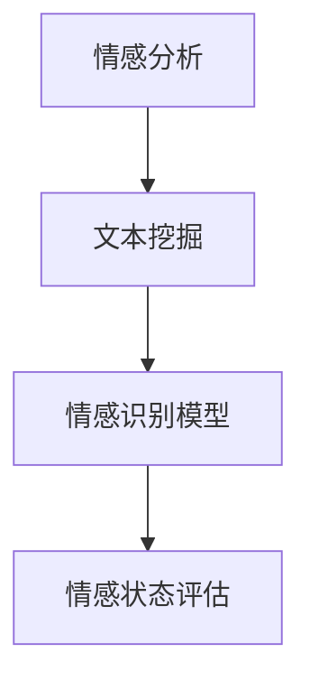

**ER实体关系图架构**

儿童 | 文本挖掘 | 情感识别模型

### 第3章 电子游戏对儿童发展的影响

##### 3.1 电子游戏对儿童行为的影响

**核心概念与联系**

游戏行为：指儿童在玩游戏时的行为表现。

认知发展：指个体在感知、记忆、思维等方面的成长过程。

行为习惯：指个体在日常生活中形成的行为模式。

**解析**

电子游戏作为一种互动性强的娱乐形式，可以激发儿童的认知发展，如提高反应速度、增强逻辑思维能力。然而，过度沉迷游戏可能导致不良行为习惯的形成。

**算法原理讲解**

算法流程图：

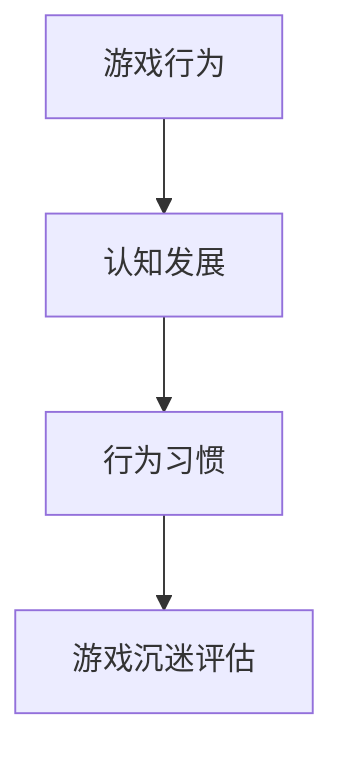

**ER实体关系图架构**

儿童 | 认知发展 | 行为习惯

##### 3.2 电子游戏对儿童心理发展的影响

**核心概念与联系**

心理发展：指个体在情感、性格、意志等方面的成长过程。

游戏成瘾：指个体过度沉迷于游戏，影响正常生活和学习。

情感表达：指个体在情感体验时，通过言语、行为等方式表达情感。

**解析**

电子游戏成瘾可能导致儿童心理发展受阻，如焦虑、抑郁等心理问题。同时，过度沉迷游戏也可能影响情感表达，导致人际关系问题。

**算法原理讲解**

算法流程图：

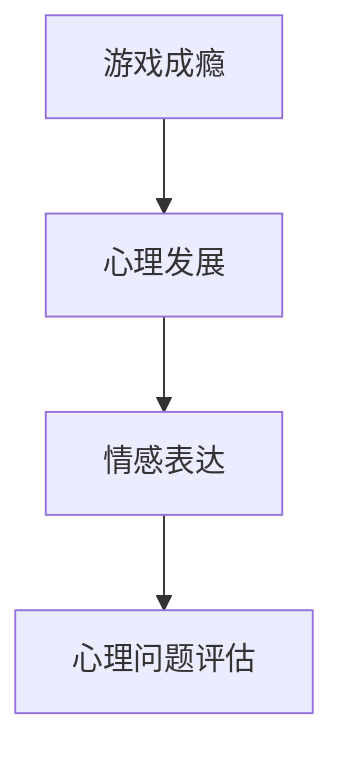

**ER实体关系图架构**

儿童 | 心理发展 | 情感表达

##### 3.3 电子游戏相关算法原理讲解

**核心概念与联系**

游戏行为分析：指通过算法分析儿童在游戏中的行为模式。

心理状态识别：指通过算法识别儿童在游戏中的心理状态。

**解析**

游戏行为分析算法可以监测儿童在游戏中的行为习惯，如游戏时长、游戏内容等，从而评估其游戏成瘾程度。心理状态识别算法则可以分析儿童在游戏中的情感表达，为家长和教师提供干预依据。

**算法原理讲解**

算法流程图：

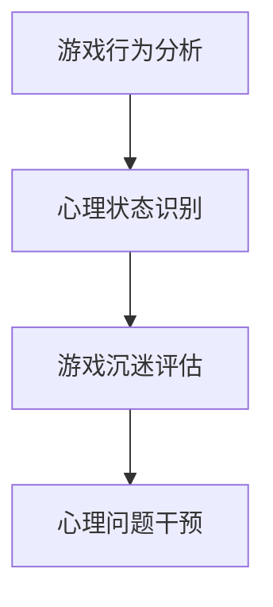

**ER实体关系图架构**

儿童 | 游戏行为分析 | 心理状态识别

### 第4章 社交媒体对儿童发展的影响

##### 4.1 社交媒体的使用模式

**核心概念与联系**

社交媒体：指通过互联网进行社交互动的平台。

使用模式：指个体在使用社交媒体时的行为模式。

信息传播：指信息在社会中的传播过程。

**解析**

社交媒体为儿童提供了丰富的社交渠道，使他们能够与更多的人互动。然而，过度使用社交媒体可能导致信息传播的紊乱，影响儿童的信息素养。

**算法原理讲解**

算法流程图：

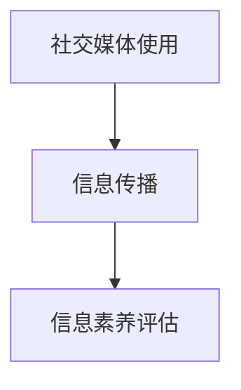

**ER实体关系图架构**

儿童 | 社交媒体使用 | 信息传播

##### 4.2 社交媒体对儿童社交能力的影响

**核心概念与联系**

社交能力：指个体在社交场合中的行为表现。

社交媒体：指通过互联网进行社交互动的平台。

人际关系：指个体在社会中建立的关系网络。

**解析**

社交媒体为儿童提供了新的社交渠道，使他们能够与更多的人互动。然而，过度依赖社交媒体可能导致现实社交能力的下降，影响人际关系。

**算法原理讲解**

算法流程图：

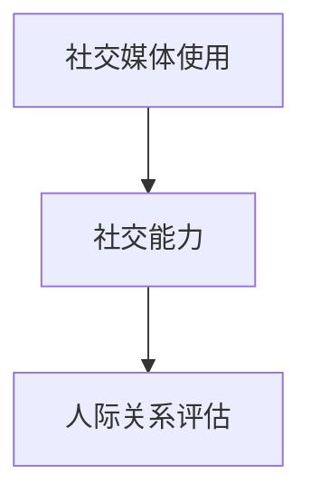

**ER实体关系图架构**

儿童 | 社交媒体使用 | 社交能力

##### 4.3 社交媒体相关算法原理讲解

**核心概念与联系**

社交行为分析：指通过算法分析儿童在社交媒体上的行为模式。

用户画像构建：指通过算法构建儿童在社交媒体上的用户画像。

**解析**

社交行为分析算法可以监测儿童在社交媒体上的行为模式，如发布内容、互动频率等，从而评估其社交能力。用户画像构建算法则可以分析儿童在社交媒体上的表现，为家长和教师提供干预依据。

**算法原理讲解**

算法流程图：

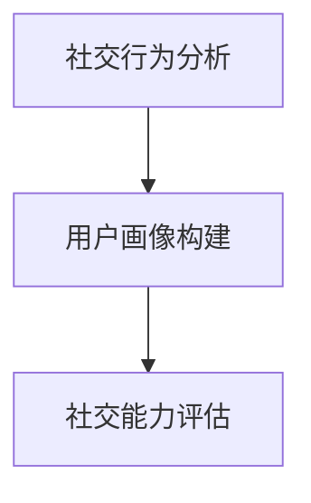

**ER实体关系图架构**

儿童 | 社交行为分析 | 用户画像构建

### 第5章 家长如何引导儿童合理使用科技

##### 5.1 家长角色的转变

**核心概念与联系**

家长角色：指家长在家庭中的角色定位。

科技引导：指家长在科技使用中的指导作用。

亲子关系：指家长与儿童之间的互动关系。

**解析**

随着科技的快速发展，家长的角色也在发生变化。他们不仅需要关注儿童的学习成绩，还需要关注儿童在科技环境中的成长。家长需要适应新的角色，成为儿童的科技引导者。

**算法原理讲解**

算法流程图：

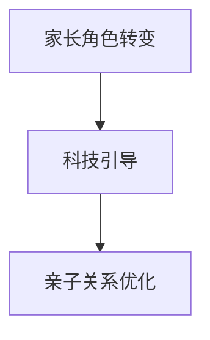

**ER实体关系图架构**

家长 | 科技引导 | 亲子关系

##### 5.2 制定合理的科技使用规则

**核心概念与联系**

科技使用规则：指家长为儿童制定的科技使用规范。

时间管理：指家长对儿童科技使用时间的合理安排。

行为规范：指家长对儿童科技使用行为的规范。

**解析**

制定合理的科技使用规则是家长引导儿童合理使用科技的重要手段。通过时间管理和行为规范，家长可以帮助儿童养成良好的科技使用习惯。

**算法原理讲解**

算法流程图：

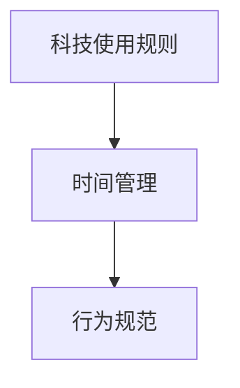

**ER实体关系图架构**

儿童 | 科技使用规则 | 时间管理

##### 5.3 家长教育策略相关算法原理讲解

**核心概念与联系**

家长教育策略：指家长在引导儿童科技使用时的策略和方法。

儿童行为预测：指通过算法预测儿童在科技使用中的行为。

教育效果评估：指通过算法评估家长教育策略的效果。

**解析**

家长教育策略相关算法可以帮助家长更好地理解和预测儿童在科技使用中的行为，从而调整教育策略，提高教育效果。

**算法原理讲解**

算法流程图：

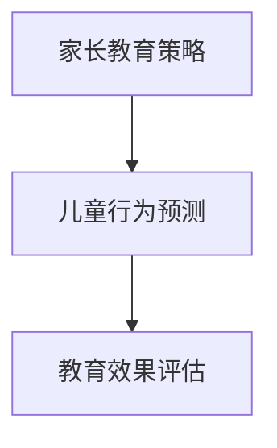

**ER实体关系图架构**

家长 | 教育策略 | 儿童行为预测

### 第6章 教师如何在教育中融入科技

##### 6.1 教师如何利用科技提高教学效果

**核心概念与联系**

科技融入教育：指将科技应用于教学过程。

教学方法：指教师在教学过程中采用的方法。

学习效果：指学生在学习过程中取得的成绩。

**解析**

教师可以利用科技手段，如在线教学平台、互动白板等，提高教学效果。这些科技工具不仅能够丰富教学手段，还能够提高学生的学习兴趣和参与度。

**算法原理讲解**

算法流程图：

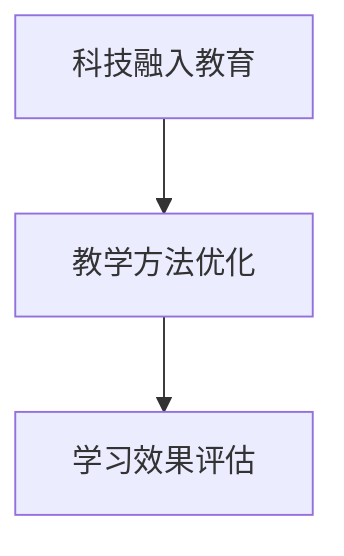

**ER实体关系图架构**

教师 | 教学方法 | 学习效果

##### 6.2 教师如何引导儿童参与科技活动

**核心概念与联系**

科技活动：指以科技为主题的各类活动。

儿童参与：指儿童在科技活动中的积极参与。

创新能力：指儿童在科技活动中展现的创新能力。

**解析**

教师可以通过组织科技活动，如编程比赛、机器人竞赛等，引导儿童积极参与科技活动，培养他们的创新能力。

**算法原理讲解**

算法流程图：

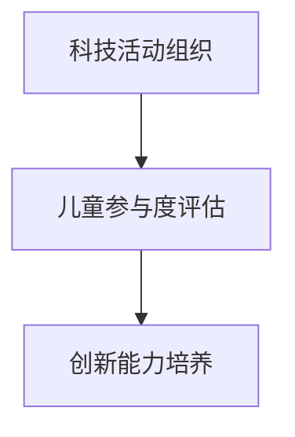

**ER实体关系图架构**

教师 | 科技活动 | 儿童参与

##### 6.3 教师教育策略相关算法原理讲解

**核心概念与联系**

教育策略优化：指通过算法优化教师的教育策略。

儿童学习效果分析：指通过算法分析儿童的学习效果。

教育干预：指通过算法提供的教育干预建议。

**解析**

教师教育策略相关算法可以帮助教师优化教育策略，提高教学效果。通过分析儿童的学习效果，算法可以为教师提供个性化的教育干预建议。

**算法原理讲解**

算法流程图：

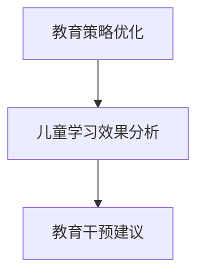

**ER实体关系图架构**

教师 | 教育策略 | 儿童学习效果

### 第7章 未来展望与挑战

##### 7.1 未来科技的发展趋势

**核心概念与联系**

未来科技：指未来可能出现的科技形态。

发展趋势：指科技发展的方向和趋势。

儿童成长：指儿童在未来的成长环境。

**解析**

随着科技的不断发展，未来可能出现更加智能化、个性化的科技产品。这些科技产品将如何影响儿童的发展，是未来研究的重要方向。

**算法原理讲解**

算法流程图：

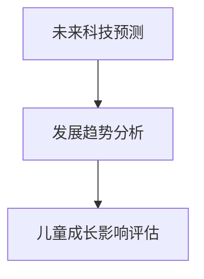

**ER实体关系图架构**

未来科技 | 发展趋势 | 儿童成长

##### 7.2 科技对儿童发展的潜在影响

**核心概念与联系**

科技影响：指科技对儿童发展的作用和影响。

潜在影响：指科技可能带来的潜在负面影响。

心理问题：指由于科技使用不当可能导致的心理问题。

**解析**

科技对儿童发展的潜在影响是一个需要关注的问题。例如，过度使用科技可能导致儿童的心理问题，如焦虑、抑郁等。

**算法原理讲解**

算法流程图：

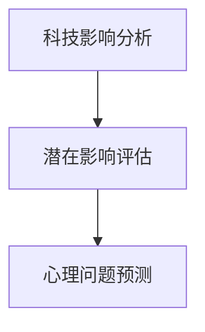

**ER实体关系图架构**

科技影响 | 潜在影响 | 心理问题

##### 7.3 面临的挑战与应对策略

**核心概念与联系**

挑战：指科技发展可能带来的挑战。

应对策略：指应对这些挑战的方法和策略。

可持续发展：指科技发展应遵循的可持续发展原则。

**解析**

在科技快速发展的背景下，我们需要关注科技对儿童发展的挑战，如数字成瘾、学习障碍等。同时，我们需要制定相应的应对策略，确保科技发展能够促进儿童的可持续发展。

**算法原理讲解**

算法流程图：

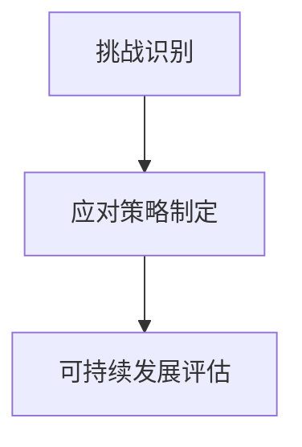

**ER实体关系图架构**

挑战 | 应对策略 | 可持续发展

### 总结与展望

本文从多个角度探讨了科技对儿童发展的影响，包括认知、情感、行为等方面。通过分析不同类型科技的具体作用，以及家长和教师应对策略，我们旨在为数字时代儿童的健康成长提供科学指导。

在未来的研究中，我们需要进一步关注科技发展的趋势和挑战，探索科技如何更好地服务于儿童的发展。同时，我们也需要关注家长和教师在引导儿童科技使用中的角色和作用，为他们提供更多的支持和指导。

作者：AI天才研究院/AI Genius Institute & 禅与计算机程序设计艺术 /Zen And The Art of Computer Programming

### 最佳实践 tips

1. **合理规划科技使用时间**：家长和教师应制定合理的科技使用时间表，确保儿童有足够的时间进行其他活动，如户外运动、社交互动等。

2. **注重科技使用环境的优化**：确保儿童在科技使用过程中有一个良好的环境，如减少电子产品的辐射、确保光线充足等。

3. **鼓励亲子互动**：家长应尽可能多地参与儿童的科技使用过程，通过互动提高亲子关系，同时引导儿童合理使用科技。

4. **关注儿童情感表达**：家长和教师应关注儿童在科技使用过程中的情感表达，及时发现问题并提供帮助。

5. **培养科技素养**：家长和教师应注重培养儿童的科技素养，包括科技安全意识、信息素养等。

### 小结

本文通过分析科技对儿童发展的多方面影响，为数字时代儿童的健康成长提供了科学指导。在未来的发展中，我们需要更加关注科技对儿童的影响，制定合理的引导策略，确保科技能够为儿童的发展带来积极的影响。

### 注意事项

1. **科技使用的适度性**：家长和教师应确保儿童科技使用的适度性，避免过度依赖科技产品。

2. **科技产品的选择**：家长和教师应选择适合儿童的科技产品，避免引入不适当的内容。

3. **家庭教育与学校教育的结合**：家长和教师应共同关注儿童的科技使用情况，确保家庭教育与学校教育的有机结合。

4. **科技使用的安全性**：家长和教师应确保儿童的科技使用安全，避免泄露个人信息。

### 拓展阅读

1. **《儿童心理学》**：了解儿童心理发展的基本原理，为引导儿童合理使用科技提供理论基础。

2. **《科技与儿童发展》**：探讨科技对儿童发展的具体影响，为制定科技使用策略提供参考。

3. **《家庭教育》**：关注家庭教育在儿童发展中的作用，为家长提供教育指导。

4. **《教师教育》**：探讨教师在教育中融入科技的方法和策略，为教师提供教育支持。

