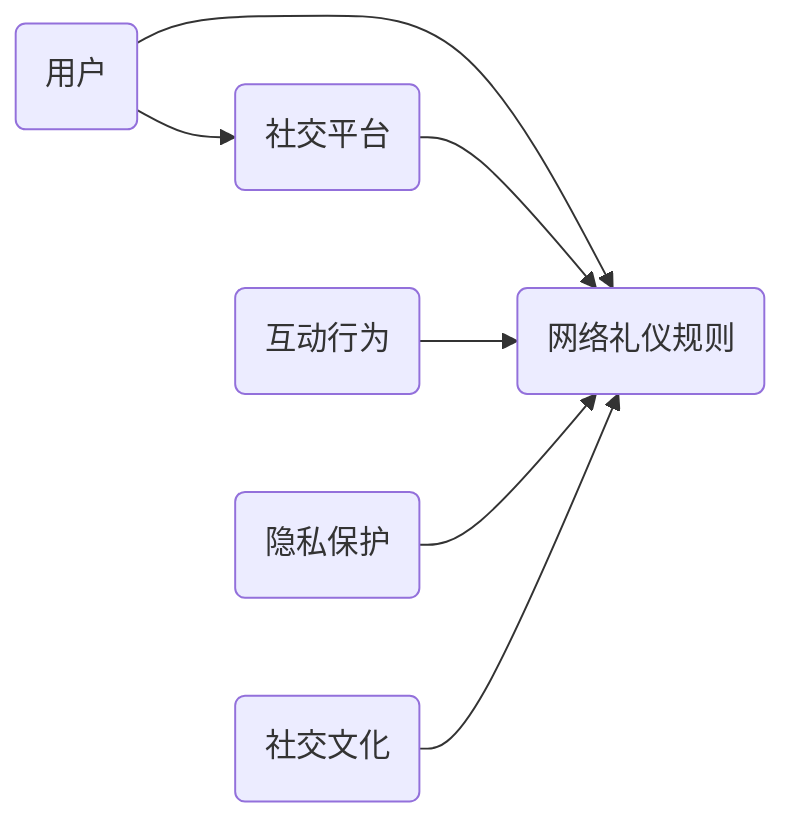

                 

### 关键词

- 数字时代
- 网络礼仪
- 社交文化
- 在线社交
- 隐私保护
- 数字素养
- 企业网络礼仪

### 摘要

本文旨在探讨数字时代下的网络礼仪，并构建一个健康的在线社交文化。通过详细分析网络礼仪的背景、重要性、核心要素，本文为构建健康的在线社交文化提供了理论和实践指导。文章涵盖在线社交礼仪、网络身份与隐私保护、社交平台礼仪、数字素养与网络礼仪教育、企业网络礼仪指南以及未来网络礼仪的展望，旨在为读者提供全面的理解和实用的建议。

### 第1章：网络礼仪的背景与重要性

#### 1.1 数字时代下的社交文化变迁

**概念术语说明**：
- **数字时代**：指以互联网和数字技术为核心的现代社会。
- **社交文化**：在特定社会背景下，人们进行社交互动的方式、习惯和规范。

**问题背景**：
随着互联网和数字技术的飞速发展，人们的社交方式发生了巨大变化。传统的面对面社交逐渐被线上社交所取代，这一变化不仅改变了人们的社交习惯，也对社交文化产生了深远影响。

**问题描述**：
数字时代下的社交文化变迁带来了诸多挑战，如网络礼仪的缺失、隐私保护问题、网络暴力和歧视现象等。如何适应数字时代的社交文化，构建健康的在线社交文化，成为亟待解决的问题。

**问题解决**：
首先，需要明确数字时代社交文化的重要性，认识到网络礼仪在构建健康在线社交文化中的关键作用。通过普及网络礼仪知识和加强网络礼仪教育，可以提高人们的网络素养，促进在线社交的和谐与高效。

**边界与外延**：
网络礼仪不仅涉及个人行为规范，还包括社交平台、企业网络环境等多个层面。因此，网络礼仪的构建需要从多个维度进行思考和实施。

**概念结构与核心要素组成**：
- **社交文化变迁**：传统社交文化向数字社交文化的转变。
- **网络礼仪**：在线社交中的行为规范，包括交流、互动、身份管理、隐私保护等方面。
- **健康在线社交文化**：一种以尊重、诚信、友善为核心的在线社交环境。

#### 1.2 网络礼仪的定义与核心要素

**核心概念原理**：
网络礼仪是指在网络社交环境中，个体和组织遵守的规范和准则，旨在促进沟通效率、提升社交和谐性、维护个人和网络形象。

**概念属性特征对比表格**：

| 特征 | 传统礼仪 | 网络礼仪 |
| ---- | ---- | ---- |
| **形式** | 面对面 | 文字、语音、视频 |
| **媒介** | 口语、书信 | 电子邮件、社交媒体、即时通讯 |
| **互动** | 瞬间反馈 | 延迟反馈 |
| **隐私** | 高度保护 | 难以控制 |

**ER实体关系图架构**：

#### 1.3 网络礼仪的重要性

**提升沟通效率**：
网络礼仪有助于规范在线交流，减少误解和冲突，提高沟通的准确性和效率。

**增强社交互动的和谐性**：
遵循网络礼仪可以促进在线社交的和谐性，减少网络暴力和歧视现象，营造一个友善的社交环境。

**塑造良好的个人和网络形象**：
良好的网络礼仪可以树立个人的专业形象，提升社交平台和企业的品牌价值。

#### 1.4 本章小结

本章介绍了数字时代下社交文化的变迁和网络礼仪的重要性。通过分析网络礼仪的定义和核心要素，我们认识到网络礼仪在构建健康在线社交文化中的关键作用。接下来，我们将深入探讨如何具体构建和践行网络礼仪。

### 第2章：在线社交礼仪

#### 2.1 在线交流的基本规则

**文字交流的礼仪**：

- 使用礼貌用语，如“请”、“谢谢”等。
- 保持简洁明了，避免冗长和复杂的句子。
- 避免使用缩写和表情符号，除非确保对方理解。
- 使用段落格式，提高可读性。

**视频通话的礼仪**：

- 确保网络连接稳定，避免频繁断线。
- 提前调试设备，如摄像头、麦克风等。
- 保持良好的仪表，穿着得体。
- 注意倾听对方，避免频繁打断。

**社交媒体的礼仪**：

- 遵守平台规则，避免发布违规内容。
- 适当使用表情符号和图片，增加趣味性。
- 回复评论和私信时，保持礼貌和尊重。
- 避免过度分享个人隐私。

#### 2.2 在线互动的礼仪

**评论和回复的礼仪**：

- 保持客观公正，避免人身攻击和情绪化。
- 避免重复评论，尊重他人的观点。
- 在回复中引用原文，增加交流的连贯性。

**赞和分享的礼仪**：

- 真诚表达赞许，避免虚假点赞。
- 分享有价值的内容，避免滥用分享功能。
- 注意分享的频率，避免过度打扰他人。

**私信和群聊的礼仪**：

- 遵守群聊规则，尊重群主的安排。
- 私信时，确保话题的适宜性和相关性。
- 回复私信时，及时回应，保持沟通的连贯性。

#### 2.3 在线冲突的处理

**冲突的原因和影响**：

- 冲突原因包括误解、沟通不畅、观点不同等。
- 冲突的影响可能包括关系破裂、信任缺失、团队氛围恶化等。

**冲突解决的策略**：

- 保持冷静，避免情绪化。
- 沟通是关键，尝试了解对方的观点。
- 寻求中立第三方的介入，进行调解。
- 聚焦问题本身，避免攻击对方。

**冲突预防和减少的策略**：

- 建立明确的交流规则和礼仪。
- 提高沟通技巧，减少误解和冲突。
- 定期组织团队建设活动，增进相互了解。

#### 2.4 本章小结

本章详细介绍了在线交流的基本规则、在线互动的礼仪以及在线冲突的处理策略。通过遵循这些礼仪和策略，我们可以构建一个和谐、高效的在线社交环境。

### 第3章：网络身份与隐私保护

#### 3.1 网络身份管理

**网络身份的多面性**：

- **个人身份**：包括姓名、职业、教育背景等基本信息。
- **虚拟身份**：在网络环境中使用的昵称、头像等。
- **专业身份**：在特定领域内的专业知识和能力。

**网络身份的管理技巧**：

- **保护真实身份**：避免在公共场合透露过多的个人信息。
- **维护虚拟身份**：保持良好的网络形象，避免使用侮辱性或贬低性的昵称。
- **更新身份信息**：定期更新个人资料，确保信息的准确性和时效性。

**身份盗用的防范**：

- **设置强密码**：使用复杂且不易被破解的密码。
- **启用双重身份验证**：增加账号的安全性。
- **警惕可疑链接和邮件**：避免点击来历不明的链接，防止信息泄露。

#### 3.2 隐私保护

**隐私权的概念**：

- **隐私权**：个人对自身信息的控制权，包括信息的收集、使用、存储和分享。

**隐私泄露的风险**：

- **信息泄露**：个人信息在网络中被未经授权的第三方获取。
- **身份盗用**：利用个人信息进行非法活动，如诈骗、恶意攻击等。

**隐私保护的措施**：

- **数据加密**：对敏感信息进行加密处理，确保信息的安全性。
- **权限管理**：合理设置信息访问权限，防止未授权访问。
- **定期备份**：备份重要数据，防止数据丢失。

#### 3.3 在线行为的自我监督

**自我认知的重要性**：

- 自我认知是指个体对自身心理状态、行为特征的认识和理解。
- 在网络环境中，自我认知有助于个体识别和调整不良行为。

**自我监督的方法**：

- **反思日记**：定期记录自己的网络行为，反思是否存在不当行为。
- **设定目标**：明确自己的网络行为目标，如减少负面评论、遵守隐私保护原则。
- **寻求反馈**：向信任的朋友或专业人士寻求关于网络行为的反馈和建议。

**遵守社会规范的意识**：

- **尊重他人**：在网络社交中尊重他人的观点和隐私。
- **遵守法律**：了解并遵守相关法律法规，防止违法行为。
- **传播正能量**：积极参与网络公益活动，传播正面信息。

#### 3.4 本章小结

本章讨论了网络身份管理和隐私保护的重要性。通过了解网络身份的多面性和管理技巧，我们可以有效防范身份盗用。同时，隐私保护的措施和在线行为的自我监督方法有助于构建一个安全、健康的网络环境。

### 第4章：网络社交平台礼仪

#### 4.1 社交平台类型与特点

**社交媒体平台的特点**：

- **微博、微信公众号**：以文本、图片、视频等形式进行信息传播和社交互动，具有广泛的受众和影响力。
- **Facebook、Instagram**：以个人关系网络为基础，提供丰富的社交功能和内容分享平台。
- **LinkedIn**：专业社交平台，主要面向职场人士，提供职业发展和人脉拓展功能。

**社交网络平台的发展趋势**：

- **移动化**：随着智能手机的普及，移动端社交应用成为主流。
- **智能化**：人工智能技术的应用，提高了平台的个性化推荐和用户体验。
- **去中心化**：区块链技术的引入，推动社交平台向去中心化方向发展。

#### 4.2 平台规则与礼仪

**平台规则的遵守**：

- **了解平台规则**：在注册和使用平台前，仔细阅读并理解平台的规则和政策。
- **遵守平台规定**：在发布内容和进行互动时，严格遵守平台的规定，避免违规行为。

**平台互动的礼仪**：

- **尊重他人**：在评论和回复中保持礼貌和尊重，避免攻击和侮辱他人。
- **真诚互动**：参与互动时，保持真诚和诚实，避免虚假评论和夸大宣传。

**平台内容的发布礼仪**：

- **内容适宜性**：发布的内容应符合平台的规定和公序良俗，避免敏感和违规内容。
- **版权意识**：尊重他人的知识产权，不侵犯他人版权，发布原创或经过授权的内容。

#### 4.3 平台争议与解决

**平台争议的类型**：

- **内容争议**：包括虚假信息、恶意评论、侵权行为等。
- **用户争议**：包括隐私侵犯、身份盗用、恶意攻击等。

**解决争议的方法**：

- **自我调节**：通过沟通和理解，自行解决争议。
- **平台调解**：利用平台的调解机制，如举报、申诉等。
- **法律途径**：对于严重的争议，可以通过法律途径进行解决。

**平台规范的完善**：

- **规则更新**：定期更新平台规则，以适应社会发展和用户需求。
- **用户教育**：加强用户教育，提高用户的网络素养和遵守规则的意识。

#### 4.4 本章小结

本章详细介绍了社交平台类型与特点、平台规则与礼仪以及平台争议与解决的方法。通过遵守平台规则和礼仪，我们可以构建一个健康、和谐的社交平台环境。

### 第5章：数字素养与网络礼仪教育

#### 5.1 数字素养的概念

**数字素养的内涵**：

- **信息素养**：获取、评估、使用数字信息的能力。
- **技术素养**：使用数字技术进行沟通、协作、创新的能力。
- **媒体素养**：理解、分析、批判媒体信息的能力。

**数字素养的重要性**：

- **适应数字时代**：数字素养是适应数字时代的基本能力，有助于个体在数字化环境中生存和发展。
- **提升竞争力**：数字素养是职场竞争力的重要组成部分，有助于提高工作效率和创新能力。
- **保障网络安全**：数字素养有助于个体识别和防范网络风险，保障个人和信息安全。

#### 5.2 网络礼仪教育的策略

**家庭教育的作用**：

- **树立榜样**：家长应以身作则，遵守网络礼仪，为子女树立良好榜样。
- **培养习惯**：通过日常生活中的点滴教育，培养子女良好的网络行为习惯。

**学校教育的实施**：

- **课程设置**：将网络礼仪教育纳入学校课程，系统教授网络礼仪知识和技能。
- **课外活动**：组织相关课外活动，如主题班会、演讲比赛等，增强学生的网络礼仪意识。

**社会教育的参与**：

- **公共宣传**：通过媒体、网络等渠道，广泛宣传网络礼仪的重要性和实践方法。
- **专业培训**：开展专业培训，提高社会各界对网络礼仪的认识和遵守程度。

#### 5.3 数字素养与网络礼仪教育的挑战与机遇

**教育资源的不平衡**：

- **城乡差距**：城市与农村之间、发达地区与欠发达地区之间的数字素养教育资源存在显著差距。
- **软硬件设施**：部分地区学校和教育机构缺乏必要的数字素养教育资源和设备。

**技术发展的迅速变化**：

- **更新迅速**：数字技术和网络应用不断更新迭代，教育内容和教学方法需要不断调整和优化。
- **适应性挑战**：个体在快速变化的环境中，需要不断学习和适应新的技术和应用。

**教育效果的评估**：

- **评估方法**：缺乏科学有效的评估方法和工具，难以准确评估教育效果。
- **反馈机制**：缺乏有效的反馈机制，难以及时了解和改进教育内容和教学方法。

**挑战与机遇的应对策略**：

- **均衡教育资源**：通过政策支持、资金投入等手段，缩小城乡和地区之间的教育资源差距。
- **持续教育培训**：加强教师的数字素养和网络礼仪培训，提高教育质量和效果。
- **创新教育方法**：运用现代教育技术和方法，提高教育互动性和效果。

#### 5.4 本章小结

本章探讨了数字素养与网络礼仪教育的重要性和策略。通过家庭教育、学校教育和社会教育的协同作用，可以有效提升个体的数字素养和网络礼仪水平，为构建健康在线社交文化奠定基础。

### 第6章：企业网络礼仪指南

#### 6.1 企业网络礼仪的重要性

**提升企业品牌形象**：

- 企业网络礼仪有助于树立专业、诚信的形象，提升品牌认知度和美誉度。

**促进团队沟通**：

- 遵守网络礼仪可以提高团队内部沟通的效率和和谐性，减少误解和冲突。

**管理网络风险**：

- 通过网络礼仪教育，可以提高员工对网络风险的识别和防范能力，降低企业信息泄露和网络安全事件的风险。

#### 6.2 企业网络礼仪规范

**企业内部沟通的礼仪**：

- **邮件礼仪**：使用正式语言，避免使用过于随意或非正式的表达方式。
- **即时通讯礼仪**：保持简洁明了，避免使用过于复杂的句子和术语。
- **视频会议礼仪**：确保网络连接稳定，提前调试设备，保持良好的仪表和倾听习惯。

**企业对外沟通的礼仪**：

- **客户沟通礼仪**：保持耐心和礼貌，尊重客户的需求和意见。
- **合作伙伴沟通礼仪**：建立互信关系，遵守承诺，确保沟通的及时性和有效性。

**企业社交媒体管理**：

- **内容发布规范**：发布符合企业价值观和形象的内容，避免敏感和负面信息。
- **互动礼仪**：积极回应用户评论和私信，保持友善和尊重。

#### 6.3 企业网络礼仪培训与实践

**培训内容的制定**：

- **网络礼仪基本知识**：包括网络礼仪的定义、重要性、基本规则等。
- **案例分析**：通过实际案例，分析网络礼仪的应用场景和效果。
- **实践演练**：模拟网络交流场景，进行实际操作和互动。

**培训效果的评估**：

- **问卷调查**：通过问卷调查了解员工对网络礼仪的认知和遵守程度。
- **行为观察**：观察员工在日常网络交流中的行为，评估网络礼仪的实践效果。

**实践案例分享**：

- **成功案例**：分享企业内部成功遵守网络礼仪的案例，激励员工学习和实践。
- **改进建议**：针对网络礼仪实践中的问题和不足，提出改进建议和措施。

#### 6.4 本章小结

本章详细介绍了企业网络礼仪的重要性、规范和实践。通过制定合理的培训内容和评估机制，企业可以提升员工的网络素养，构建一个健康、高效的内部和外部网络环境。

### 第7章：未来网络礼仪的展望

#### 7.1 网络礼仪的发展趋势

**新技术的融入**：

- **人工智能**：通过人工智能技术，可以更好地理解和分析网络行为，提高网络礼仪的智能性和适应性。
- **区块链**：区块链技术可以提高网络交易的透明度和安全性，为网络礼仪的执行提供技术保障。

**社交平台的变化**：

- **多元化**：社交平台将更加多元化和个性化，满足不同用户群体的需求。
- **智能化**：社交平台将采用更多智能化功能，如智能推荐、智能客服等，提升用户体验。

**文化多样性的影响**：

- **文化融合**：随着全球化的加深，不同文化在网络礼仪上的交流和融合将更加频繁。
- **文化差异**：不同文化背景下的网络礼仪差异将带来新的挑战，需要更加灵活和包容的网络礼仪规范。

#### 7.2 未来网络礼仪的挑战与对策

**网络暴力和歧视的应对**：

- **立法规范**：通过法律法规加强对网络暴力和歧视的打击和制裁。
- **平台监管**：社交平台应加强内容审核和用户管理，及时发现和处理不当行为。
- **教育宣传**：通过教育和宣传，提高用户对网络暴力和歧视的认识和防范意识。

**跨文化沟通的挑战**：

- **文化差异**：不同文化背景下，对网络礼仪的理解和执行可能存在差异，需要建立跨文化的沟通机制。
- **语言障碍**：多语言环境下的沟通可能面临语言障碍，需要开发更多语言支持工具。

**技术伦理与网络礼仪的平衡**：

- **伦理审查**：在新技术应用中，进行伦理审查，确保技术发展与伦理规范相协调。
- **用户教育**：通过用户教育，提高用户对技术伦理和网络礼仪的认识，促进技术应用的健康发展。

#### 7.3 网络礼仪的社会责任

**增强社会责任感**：

- **企业责任**：企业应履行社会责任，推动网络礼仪的实践和推广。
- **个人责任**：每个人应意识到自己在网络世界中的责任，遵守网络礼仪，维护网络环境的和谐。

**推动网络礼仪的普及**：

- **教育普及**：将网络礼仪教育纳入学校和社会教育体系，提高全民的网络素养。
- **宣传推广**：通过媒体、网络等渠道，广泛宣传网络礼仪的重要性和实践方法。

**构建健康的网络环境**：

- **政府监管**：政府应加强对网络环境的监管，推动网络礼仪的立法和执行。
- **社会共治**：社会各方面力量共同参与，共同构建健康的网络环境。

#### 7.4 本章小结

本章展望了未来网络礼仪的发展趋势、挑战与对策，以及网络礼仪的社会责任。通过技术创新、文化融合和社会共同努力，我们可以构建一个更加和谐、安全的网络环境，推动数字时代的健康发展。

