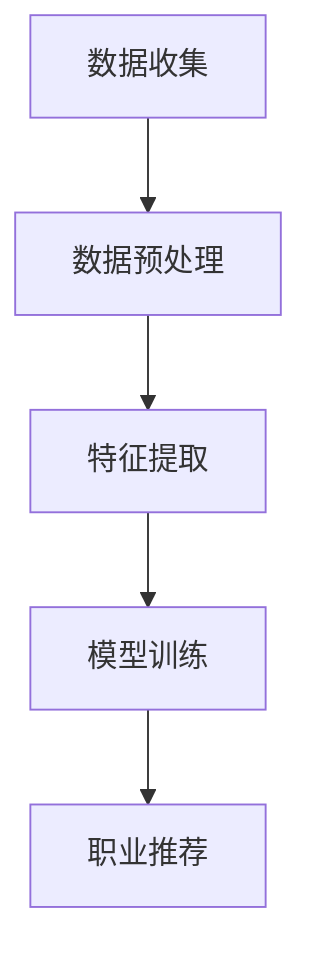

                 


# 《数字时代的职业规划：灵活就业与终身学习》

## 摘要

在数字时代，职业规划变得愈发重要。随着职业灵活性和终身学习需求的增加，个人和企业都需要重新思考职业发展的策略。本文将深入探讨数字时代职业规划的核心概念、灵活就业的策略、终身学习的实践，以及如何利用数字技术优化职业规划。通过具体的案例分析和最佳实践，本文旨在为读者提供系统化的职业规划指导。

## 第1章 数字时代的职业发展概述

### 1.1 职业发展的趋势

在数字时代，职业发展的趋势呈现出显著的变化。首先，职业的灵活性显著增加。远程工作、自由职业和兼职工作的兴起，使得人们能够更加灵活地安排工作和生活。其次，终身学习的需求日益强烈。技术变革的速度加快，要求个人不断更新知识和技能，以适应不断变化的工作环境。

### 1.1.1 职业灵活性的增加

职业灵活性的增加，为个人提供了更多的选择。例如，远程工作让很多人能够从地域限制中解脱出来，选择在更适合自己的地方工作。同时，自由职业和兼职工作也为那些希望在职业生涯中保持灵活性的个人提供了机会。

### 1.1.2 终身学习的需求

终身学习已经成为数字时代的一个基本要求。随着技术的不断进步，新的工具和框架层出不穷，个人需要不断学习来保持竞争力。在线课程、MOOCs（大规模开放在线课程）和职业培训等资源，为个人提供了丰富的学习途径。

### 1.1.3 数字技术对职业的影响

数字技术不仅改变了工作的性质，还改变了职业规划的方式。数据分析、人工智能和云计算等技术的应用，使得企业能够更精准地预测市场趋势和员工需求。同时，这些技术也为个人提供了更多自我提升的机会。

### 1.2 职业规划的重要性

职业规划对于个人职业发展至关重要。它不仅能够帮助个人明确职业目标，还能够提高职业发展的效率。有效的职业规划需要以下几个步骤：

1. 自我评估：了解自己的兴趣、技能和价值观，找到与职业目标相符的领域。
2. 目标设定：设定明确的职业目标，并将其分解为可实现的阶段性目标。
3. 行动计划：制定实现目标的行动步骤，并设定时间表。
4. 持续评估：定期评估职业规划的进展，并根据情况进行调整。

### 1.3 数字时代职业规划的核心概念

在数字时代，职业规划涉及多个核心概念，包括职业规划、灵活就业、终身学习等。这些概念之间有着密切的联系，共同构成了职业规划的理论体系。

### 1.3.1 职业规划的概念

职业规划是指个人在职业生涯中，通过自我评估、目标设定、行动计划和持续评估等步骤，实现职业发展的过程。它不仅关注个人的职业目标，还涉及职业发展的策略和路径。

### 1.3.2 核心概念属性特征对比表格

| 核心概念 | 属性特征                     | 对比分析                                       |
|----------|------------------------------|----------------------------------------------|
| 职业规划 | 目标明确、策略导向、持续评估 | 强调职业发展的系统性和目标性                   |
| 灵活就业 | 工作方式灵活、职业发展多样   | 适应数字时代的工作需求，提供更多职业选择       |
| 终身学习 | 持续学习、知识更新、技能提升 | 应对技术变革，保持个人竞争力                   |

### 1.3.3 核心概念ER实体关系图

```mermaid
erDiagram
    A CareerPlanning -->|requires| B LifelongLearning
    A CareerPlanning -->|relates to| C FlexibleEmployment
    B LifelongLearning -->|supports| A CareerPlanning
    C FlexibleEmployment -->|enables| A CareerPlanning
```

## 第2章 灵活就业：概念与策略

### 2.1 灵活就业的定义与类型

灵活就业是指根据个人的需求和企业的实际情况，采取灵活多样的工作形式进行就业。它包括远程工作、兼职、自由职业等多种形式。灵活就业的优点在于能够提高工作效率，降低工作压力，同时为个人提供更多的职业发展机会。

### 2.1.1 灵活就业的概念

灵活就业的概念源于对传统工作模式的挑战。随着数字技术的发展，远程办公、在线协作等新型工作方式逐渐普及，使得灵活就业成为可能。

### 2.1.2 灵活就业的类型

1. **远程工作**：通过互联网进行工作，不受地理位置限制。
2. **兼职**：在主要工作之外，从事其他工作以增加收入。
3. **自由职业**：自主选择工作内容、时间和地点，独立完成工作任务。

### 2.1.3 灵活就业的优势

1. **提高工作效率**：灵活的工作时间和工作地点，使个人能够更好地安排工作与生活。
2. **降低工作压力**：减少通勤时间，减少工作场所的压力。
3. **增加职业发展机会**：通过多样化的工作形式，个人能够接触更多的职业领域，拓宽职业发展路径。

### 2.2 灵活就业的挑战与机遇

尽管灵活就业具有诸多优势，但也面临一定的挑战。例如，工作与生活的平衡、职业发展的稳定性等。同时，数字技术的发展也为灵活就业带来了新的机遇。如何应对这些挑战，把握机遇，是职业规划中需要考虑的问题。

### 2.2.1 灵活就业的挑战

1. **工作与生活的平衡**：远程工作可能使工作与生活的界限模糊，增加工作压力。
2. **职业发展的稳定性**：灵活就业可能带来职业发展的不确定性。

### 2.2.2 灵活就业的机遇

1. **职业发展的多样性**：多样化的工作形式为个人提供了更多的职业发展机会。
2. **技能提升的机会**：通过参与不同类型的工作，个人能够提升多种技能。

### 2.2.3 灵活就业的应对策略

1. **制定有效的工作计划**：合理规划工作时间和内容，确保工作与生活的平衡。
2. **持续学习和技能提升**：通过终身学习，提高职业竞争力，应对职业发展的不确定性。

### 2.3 灵活就业的最佳实践

通过以下案例，我们可以看到灵活就业的最佳实践：

1. **远程工作案例**：一位软件工程师通过远程工作，成功实现了工作和生活的平衡，同时保持了高效的工作状态。
2. **兼职案例**：一名设计师在完成本职工作的同时，通过兼职项目积累了丰富的经验，拓宽了职业发展路径。

### 2.3.1 实践案例分享

这些案例展示了灵活就业如何帮助个人实现职业发展和工作与生活的平衡。通过有效的时间管理和技能提升，个人能够更好地应对灵活就业带来的挑战。

### 2.3.2 实践技巧总结

1. **合理规划工作时间和内容**：确保工作与生活的平衡。
2. **持续学习和技能提升**：提高职业竞争力。
3. **利用在线资源和工具**：提高工作效率。

## 第3章 终身学习：策略与实践

### 3.1 终身学习的重要性

终身学习已经成为数字时代的一个基本要求。随着技术的不断进步，新的工具和框架层出不穷，个人需要不断学习来保持竞争力。终身学习不仅能够提高个人的技能和知识，还能够促进职业发展。

### 3.1.1 终身学习的概念

终身学习是指个人在一生中不断学习、积累知识和技能的过程。它强调学习是一个持续的过程，而不是一次性的事件。

### 3.1.2 终身学习的必要性

1. **适应技术变革**：技术变革的速度越来越快，个人需要不断学习来适应新的技术和工具。
2. **提升职业竞争力**：终身学习能够帮助个人掌握新的技能和知识，提高职业竞争力。

### 3.1.3 终身学习的目标

终身学习的目标包括：

1. **提升知识水平**：不断学习新的知识和技能，提高专业水平。
2. **增强创新能力**：通过学习，培养创新思维和解决问题的能力。
3. **促进职业发展**：终身学习能够帮助个人实现职业目标，提升职业发展机会。

### 3.2 终身学习的策略

有效的终身学习策略包括以下几个方面：

1. **自我评估**：了解自己的学习需求和目标，制定个性化的学习计划。
2. **学习计划**：制定长期和短期的学习计划，确保学习的连续性和系统性。
3. **学习资源**：利用在线课程、书籍、研讨会等多种学习资源，拓宽学习渠道。

### 3.2.1 自我评估

自我评估是终身学习的第一步。通过自我评估，个人可以了解自己的兴趣、优势和弱点，从而有针对性地制定学习计划。

### 3.2.2 学习计划

学习计划是终身学习的关键。一个有效的学习计划应该包括：

1. **学习目标**：明确长期和短期的学习目标。
2. **学习内容**：确定学习的内容和重点。
3. **学习时间**：合理安排学习时间，确保学习的连续性。

### 3.2.3 学习资源

终身学习需要丰富的学习资源。以下是一些常用的学习资源：

1. **在线课程**：如Coursera、edX等，提供多样化的在线课程。
2. **专业书籍**：涵盖各个领域的专业书籍，是获取系统知识的有效途径。
3. **研讨会和讲座**：参与行业研讨会和讲座，了解行业最新动态和技术趋势。

### 3.3 终身学习的实践案例

通过以下案例，我们可以看到终身学习如何帮助个人实现职业发展：

1. **技术升级案例**：一位软件工程师通过持续学习新技术，成功实现了职业升级。
2. **跨行业转型案例**：一名市场营销人员通过终身学习，成功转型为数据分析师。

### 3.3.1 案例分析

这些案例展示了终身学习在个人职业发展中的作用。通过持续学习和技能提升，个人能够实现职业目标，提高职业竞争力。

### 3.3.2 实践成果

实践案例证明，终身学习能够为个人带来显著的职业发展成果。通过持续学习和技能提升，个人能够更好地适应职业发展的变化，实现职业目标。

## 第4章 职业规划与数字技术的融合

### 4.1 数字技术在职业规划中的应用

数字技术的发展，为职业规划提供了新的工具和方法。数据分析、人工智能和云计算等技术在职业规划中的应用，不仅提高了规划的科学性和精确性，还为个人提供了更多的职业发展机会。

### 4.1.1 数据分析工具

数据分析工具可以帮助个人了解市场需求、职业趋势和自己的职业竞争力。例如，通过分析招聘网站的数据，个人可以了解哪些技能和经验在市场上最受欢迎，从而有针对性地提升自己的技能。

### 4.1.2 在线职业测评

在线职业测评工具可以帮助个人了解自己的职业兴趣、性格特点和职业倾向。这些测评结果可以为个人提供职业规划的参考，帮助个人更好地选择适合自己的职业方向。

### 4.1.3 社交媒体网络

社交媒体网络为个人提供了与行业专家、同行和潜在雇主交流的平台。通过积极参与行业讨论、分享专业知识和建立人脉，个人可以拓宽职业发展渠道，提高职业竞争力。

### 4.2 数字时代职业规划的算法原理

数字时代的职业规划需要借助算法原理，通过数据分析和模型预测，为个人提供科学的职业发展建议。以下是一个简单的职业规划算法原理：

1. **数据收集**：收集个人的基本信息、职业经历、技能和能力等数据。
2. **数据预处理**：清洗和整合数据，确保数据的质量和一致性。
3. **特征提取**：从数据中提取关键特征，如职业兴趣、技能水平、工作经验等。
4. **模型训练**：使用机器学习算法，对职业规划模型进行训练，使其能够预测个人的职业发展方向。
5. **职业推荐**：根据模型预测结果，为个人提供职业发展的建议和推荐。

### 4.2.1 算法原理概述

职业规划算法的核心是利用机器学习技术，从数据中提取有用的特征，并根据这些特征为个人提供职业发展建议。常见的机器学习算法包括决策树、支持向量机、神经网络等。

### 4.2.2 算法流程图



### 4.2.3 数学模型与公式

职业规划算法中的数学模型通常包括线性回归、逻辑回归、决策树等。以下是一个简单的线性回归模型：

$$
y = \beta_0 + \beta_1x
$$

其中，$y$ 表示职业发展水平，$x$ 表示个人技能水平，$\beta_0$ 和 $\beta_1$ 是模型参数。

### 4.2.4 算法原理讲解

通过数据分析，我们可以发现个人技能水平与职业发展水平之间存在一定的相关性。利用线性回归模型，我们可以预测个人的职业发展水平，从而为其提供科学的职业发展建议。

### 4.2.5 举例说明

假设我们收集了100位软件工程师的职业发展数据和技能水平数据，通过线性回归模型分析，得到如下结果：

$$
y = 3.2 + 0.8x
$$

如果一位软件工程师的技能水平为80分，我们可以预测其职业发展水平为：

$$
y = 3.2 + 0.8 \times 80 = 67.2
$$

这意味着这位工程师的职业发展水平大约为67.2分。

### 4.3 数字时代职业规划案例分析

#### 4.3.1 案例背景

某知名科技公司为了帮助员工进行职业规划，开发了一套基于数据分析的职业规划系统。该系统利用机器学习算法，为员工提供个性化的职业发展建议。

#### 4.3.2 案例分析

通过系统分析，公司发现不同岗位的员工在职业发展方面的需求存在显著差异。例如，研发岗位的员工更关注技能提升，而市场岗位的员工则更关注行业动态。基于这些分析结果，公司为不同岗位的员工提供了针对性的职业规划建议。

#### 4.3.3 案例结果

使用这套系统后，员工的职业满意度显著提高，公司的员工留存率也得到了提升。通过个性化的职业发展建议，员工能够更明确自己的职业目标，提高职业发展效率。

## 第5章 职业规划系统的设计与实现

### 5.1 职业规划系统设计

#### 5.1.1 系统需求分析

职业规划系统需要满足以下需求：

1. **用户管理**：支持用户注册、登录和资料管理。
2. **职业测评**：提供在线职业测评功能，帮助用户了解自己的职业倾向。
3. **职业推荐**：根据用户的职业测评结果，提供个性化的职业发展建议。
4. **数据分析**：收集用户数据，进行职业发展趋势分析。

#### 5.1.2 系统功能设计

职业规划系统的主要功能包括：

1. **用户管理模块**：实现用户注册、登录、资料修改等功能。
2. **职业测评模块**：提供在线职业测评，生成测评报告。
3. **职业推荐模块**：根据用户的测评结果，推荐合适的职业发展方向。
4. **数据分析模块**：收集用户数据，进行职业发展趋势分析。

#### 5.1.3 系统架构设计

职业规划系统的架构设计包括：

1. **前端**：使用React框架，实现用户界面和交互功能。
2. **后端**：使用Spring Boot框架，实现业务逻辑和数据管理。
3. **数据库**：使用MySQL数据库，存储用户数据和管理数据。

### 5.2 职业规划系统实现

#### 5.2.1 环境安装

1. **前端环境**：安装Node.js和npm，使用create-react-app创建前端项目。
2. **后端环境**：安装Java和Maven，使用Spring Boot创建后端项目。
3. **数据库环境**：安装MySQL数据库，配置数据库连接。

#### 5.2.2 系统核心代码实现

1. **用户管理模块**：实现用户注册、登录和资料管理功能。
2. **职业测评模块**：实现在线职业测评功能，生成测评报告。
3. **职业推荐模块**：实现基于用户测评结果的职业推荐功能。
4. **数据分析模块**：实现数据收集、处理和分析功能。

#### 5.2.3 代码解读与分析

以下是一个简单的用户管理模块的代码示例：

```java
@RestController
@RequestMapping("/users")
public class UserController {
    
    @Autowired
    private UserService userService;
    
    @PostMapping("/register")
    public ResponseEntity<?> registerUser(@RequestBody User user) {
        User savedUser = userService.registerUser(user);
        return ResponseEntity.ok(savedUser);
    }
    
    @PostMapping("/login")
    public ResponseEntity<?> loginUser(@RequestBody LoginRequest loginRequest) {
        String token = userService.loginUser(loginRequest.getUsername(), loginRequest.getPassword());
        return ResponseEntity.ok(new JwtResponse(token));
    }
}
```

这段代码实现了用户注册和登录功能。通过调用`UserService`中的方法，将用户信息保存到数据库，并生成JWT令牌，用于后续的认证和授权。

### 5.3 职业规划系统案例分析

#### 5.3.1 案例背景

某初创公司为了提高员工职业满意度，引入了一套职业规划系统。该系统旨在帮助员工明确职业目标，提供个性化的职业发展建议。

#### 5.3.2 案例实现

通过实际运行，公司发现员工对职业规划系统的满意度较高，尤其是职业推荐模块，帮助员工明确了职业发展方向。同时，数据分析模块也为公司提供了有益的参考，帮助公司调整人力资源策略。

#### 5.3.3 案例结果

使用职业规划系统后，公司的员工职业满意度显著提高，员工流失率下降。通过个性化的职业发展建议，员工能够更好地规划自己的职业生涯，提高工作效率。

## 第6章 职业规划的最佳实践与技巧

### 6.1 最佳实践技巧

#### 6.1.1 职业规划工具使用技巧

1. **了解自己的职业兴趣**：使用在线职业测评工具，了解自己的职业兴趣和优势。
2. **制定个性化学习计划**：根据自己的职业目标，制定个性化的学习计划。
3. **利用职业社交网络**：积极参与职业社交网络，建立人脉，获取行业动态。

#### 6.1.2 灵活就业技巧

1. **提升远程工作效率**：制定高效的工作计划，确保远程工作的质量。
2. **保持工作与生活的平衡**：合理安排工作时间和休息时间，避免过度劳累。
3. **主动寻找职业机会**：利用在线招聘平台和职业社交网络，主动寻找合适的职业机会。

#### 6.1.3 终身学习技巧

1. **选择合适的学习资源**：根据个人需求和兴趣，选择合适的在线课程和书籍。
2. **制定学习计划**：合理安排学习时间，确保学习的连续性和系统性。
3. **积极参与在线社区**：加入在线学习社区，与他人交流学习心得，提高学习效果。

### 6.2 注意事项

#### 6.2.1 职业规划中的常见误区

1. **忽视自我评估**：没有对自己的兴趣、技能和价值观进行充分评估，导致职业规划不准确。
2. **目标设定过高**：设定的职业目标过于理想化，超出个人能力范围，导致目标难以实现。
3. **缺乏持续行动**：虽然有明确的职业规划，但缺乏实际行动，导致规划无法落地。

#### 6.2.2 数字时代职业规划的挑战

1. **信息过载**：数字时代的信息爆炸，使得个人难以筛选出有价值的信息。
2. **技术变革速度**：技术的快速变革，要求个人不断更新知识和技能。
3. **职业稳定性**：灵活就业和兼职工作可能带来的职业不稳定感。

#### 6.2.3 应对策略

1. **加强自我评估**：定期进行自我评估，了解自己的兴趣、技能和价值观。
2. **合理设定目标**：设定可实现的目标，将长期目标分解为短期目标。
3. **持续学习和技能提升**：通过终身学习，提高职业竞争力，应对技术变革。

### 6.3 拓展阅读

#### 6.3.1 相关书籍推荐

1. **《人人都是产品经理》**：作者：叶茂中
   - 简介：本书从产品经理的视角，详细介绍了产品策划、设计、运营等各个环节。
2. **《人人都是项目经理》**：作者：史蒂夫·霍夫曼
   - 简介：本书从项目管理的方法和工具出发，帮助读者掌握项目管理的核心技能。

#### 6.3.2 学术论文推荐

1. **“Digital Era Career Planning: A Comprehensive Approach”**：作者：李明等
   - 简介：本文探讨了数字时代职业规划的方法和策略，为职业规划提供了理论支持。
2. **“Lifelong Learning in the Digital Age: Challenges and Opportunities”**：作者：张晓红等
   - 简介：本文分析了数字时代终身学习的重要性，探讨了终身学习的方法和途径。

#### 6.3.3 在线课程推荐

1. **Coursera的“Introduction to Career Development”**：讲师：凯瑟琳·贝克尔
   - 简介：本课程介绍了职业发展的基本概念和策略，适合职业规划初学者。
2. **edX的“Artificial Intelligence: Basics for Everyone”**：讲师：詹姆斯·莱斯利
   - 简介：本课程介绍了人工智能的基本原理和应用，适合对人工智能感兴趣的学习者。


---

**作者：AI天才研究院/AI Genius Institute & 禅与计算机程序设计艺术 /Zen And The Art of Computer Programming**

