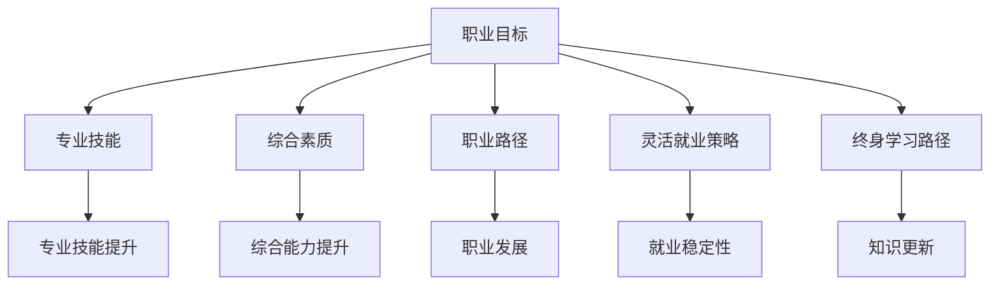

                 

### 引言与背景介绍

## 数字时代的职业规划概述

### 第1章 数字时代的职业规划概述

在数字时代，职业规划的重要性愈发突出。这不仅是因为技术的快速迭代带来了职业岗位的剧变，还因为数字化技术正在重新定义工作方式和职业边界。在这种背景下，灵活就业和终身学习成为了职业规划的两个关键维度。

#### 1.1 问题背景

##### 1.1.1 新经济形势下的就业环境

新经济形势下，传统的就业模式受到了极大的冲击。全球化、互联网技术、人工智能的迅猛发展，使得就业市场的竞争更加激烈。企业对人才的需求逐渐从固定职位向多样化、专业化方向转变，这要求从业人员具备更广泛的知识体系和快速的学习能力。

##### 1.1.2 灵活就业的崛起

随着共享经济的兴起，灵活就业已经成为一种主流的就业方式。灵活就业不仅为个人提供了更多工作选择，也为企业带来了更大的灵活性。这种就业形式有助于缓解就业压力，提升工作效率，但同时也带来了职业稳定性、社会保障等方面的挑战。

##### 1.1.3 终身学习的必要性

在数字时代，知识的更新速度越来越快，传统教育体系已经难以满足职业发展的需求。终身学习成为提升个人竞争力、适应职业变化的关键途径。只有不断学习新知识、新技能，才能在激烈的市场竞争中立于不败之地。

#### 1.2 问题描述

##### 1.2.1 职业规划面临的挑战

职业规划面临的主要挑战包括：职业方向的模糊性、技能更新的速度、职业稳定性的不确定性等。这些挑战使得职业规划变得更加复杂和困难。

##### 1.2.2 职业规划的重要性

有效的职业规划不仅能帮助个人明确职业目标，提高职业满意度，还能提升个人的市场竞争力，实现职业发展。职业规划的重要性在于帮助个人在快速变化的市场中找到自己的定位，从而实现持续的职业成长。

##### 1.2.3 解决方案探讨

要解决职业规划面临的问题，需要从以下几个方面入手：

1. **树立正确的职业规划观念**：认识到职业规划是一个长期的过程，需要持续关注市场变化和个人发展。
2. **提高自身综合素质**：通过不断学习和实践，提升自己的专业技能和综合能力。
3. **灵活就业策略**：根据个人情况，选择适合自己的灵活就业方式，提高职业稳定性。
4. **终身学习**：建立终身学习的习惯，不断提升自己的知识储备和技能水平。

#### 1.3 问题解决

##### 1.3.1 数字时代的职业规划理念

数字时代的职业规划理念主要包括：终身学习、职业多样化、灵活就业、职业与兴趣结合等。这些理念为职业规划提供了新的思路和方向。

##### 1.3.2 灵活就业的策略

灵活就业的策略包括：选择合适的平台、掌握关键技能、建立个人品牌、拓展人脉等。这些策略有助于个人在灵活就业市场中找到合适的位置。

##### 1.3.3 终身学习的路径

终身学习的路径包括：参加在职教育、利用在线学习平台、参与行业交流等。这些路径为个人提供了丰富的学习资源和学习机会。

#### 1.4 边界与外延

##### 1.4.1 职业规划的定义

职业规划是指个人在职业生涯中，根据自身兴趣、能力和市场需求，制定明确的职业目标和发展计划，并采取相应措施实现这些目标的过程。

##### 1.4.2 灵活就业的类型

灵活就业的类型包括：自由职业、远程办公、兼职、临时工作等。不同类型的灵活就业具有不同的特点和优势。

##### 1.4.3 终身学习的形式

终身学习的形式包括：传统教育、在线教育、职业培训等。不同形式的终身学习有助于满足不同人群的学习需求。

##### 1.4.4 概念结构与核心要素组成

数字时代的职业规划概念结构包括：职业目标、专业技能、综合素质、职业路径、灵活就业策略、终身学习路径等。这些核心要素相互关联，共同构成了职业规划的理论体系。

#### 1.5 概念结构与核心要素组成

数字时代的职业规划概念结构如图1-1所示：



### 总结

数字时代的职业规划是一项长期而复杂的过程，需要综合考虑个人兴趣、市场需求、技能更新等因素。灵活就业和终身学习是应对数字时代职业挑战的有效策略。通过合理的职业规划和灵活就业策略，个人可以在职业发展中找到自己的定位，实现持续的成长和进步。让我们在数字时代中，勇敢地探索职业规划的新路径，迎接未来的挑战！### 灵活就业策略

### 第2章 灵活就业的理念与优势

#### 2.1 灵活就业的定义

灵活就业，顾名思义，是指一种具有高度灵活性的就业方式。它不同于传统的全职工作，更强调个人与工作之间的灵活匹配。灵活就业的形式多种多样，包括自由职业、远程办公、兼职、临时工作等。这种就业模式的出现，是经济全球化和信息技术发展带来的结果。

##### 2.1.1 灵活就业的内涵

灵活就业的内涵主要包括以下几个方面：

1. **就业形式的灵活性**：灵活就业不再局限于固定的办公地点和工作时间，从业人员可以根据个人需求和工作任务，灵活安排工作时间和工作地点。
2. **职业角色的多样性**：灵活就业允许个人在不同的职业角色之间切换，从而拓展职业经验和技能。
3. **工作任务的多样性**：灵活就业通常涉及多种类型的工作任务，这有助于从业人员不断提升自己的技能和知识。

##### 2.1.2 灵活就业的类型

灵活就业的类型多种多样，以下是一些常见的类型：

1. **自由职业**：自由职业者独立完成工作任务，通常以项目为基础进行工作。这种就业形式具有高度的自主性，但也需要个人具备较强的自我管理和时间管理能力。
2. **远程办公**：远程办公是指员工在家中或其他地方通过互联网与公司保持联系，完成工作任务。这种就业形式能够减少通勤时间，提高工作效率。
3. **兼职**：兼职是指个人在非全职工作的基础上，额外从事一份或多份工作。这种就业形式适合需要灵活安排时间的个人。
4. **临时工作**：临时工作是指为了满足特定时期或特定项目需求而雇佣的临时性职位。这种就业形式通常具有不确定性，但也提供了快速学习和拓展经验的机会。

##### 2.1.3 灵活就业与传统就业的区别

灵活就业与传统就业之间存在着显著的区别，主要体现在以下几个方面：

1. **就业稳定性**：传统就业通常具有相对稳定的收入和工作保障，而灵活就业则可能面临更高的失业风险和收入波动。
2. **工作时间和地点**：传统就业通常要求员工在固定的办公地点和工作时间工作，而灵活就业则允许员工根据个人需求和任务灵活安排工作时间和地点。
3. **职业角色和任务**：传统就业往往专注于特定的职业角色和任务，而灵活就业则更加多样化，允许个人在不同角色和任务之间切换。

#### 2.2 灵活就业的优势

灵活就业作为一种新兴的就业方式，具有许多独特的优势。以下是一些主要的优势：

##### 2.2.1 提高工作效率

灵活就业能够更好地满足个人生活和工作需求，从而提高工作效率。例如，远程办公可以减少通勤时间，使员工能够更专注于工作任务，提高工作质量。

##### 2.2.2 增强工作满意度

灵活就业能够为员工提供更大的自主权，使他们能够根据自己的兴趣和专长选择工作内容，从而增强工作满意度。

##### 2.2.3 促进职业发展

灵活就业允许个人在不同领域和角色之间切换，这有助于个人不断学习和积累经验，促进职业发展。

##### 2.2.4 提供更多就业机会

随着互联网技术的发展，灵活就业市场不断扩大，为各类人才提供了更多的就业机会。无论是应届毕业生还是职业转型者，都可以在灵活就业市场中找到适合自己的位置。

#### 2.3 灵活就业的挑战与应对策略

尽管灵活就业具有许多优势，但也存在一些挑战。以下是一些常见的挑战以及相应的应对策略：

##### 2.3.1 挑战分析

1. **职业稳定性问题**：灵活就业的稳定性相对较低，员工可能面临失业风险。
2. **社会保障问题**：灵活就业者通常无法享受到与全职员工同等的社会保障待遇。
3. **工作效率监控**：远程办公和工作时间灵活性可能导致工作效率的下降。

##### 2.3.2 应对策略

1. **增强职业稳定性**：灵活就业者可以通过积累项目经验、建立个人品牌等方式，提高自己的市场竞争力，从而增加职业稳定性。
2. **完善社会保障**：政府和相关机构可以制定政策，为灵活就业者提供社会保障支持。
3. **提高工作效率**：灵活就业者可以通过良好的时间管理、工作计划等方式，提高工作效率。

#### 2.4 灵活就业的具体实践

##### 2.4.1 灵活就业平台的使用

灵活就业平台为灵活就业者提供了丰富的资源和机会。以下是一些主要的灵活就业平台：

1. **Upwork**：全球最大的灵活就业平台之一，提供各种类型的项目和职位。
2. **Freelancer**：全球第二大灵活就业平台，提供广泛的自由职业机会。
3. **FlexJobs**：专注于远程工作和兼职工作的平台，适合需要灵活就业的个人。
4. **PeoplePerHour**：提供短期项目和兼职工作，适合希望快速获得收入的个人。

##### 2.4.2 平台的使用技巧

为了在灵活就业平台中获得更多的机会，灵活就业者需要掌握以下使用技巧：

1. **完善个人资料**：确保个人资料详尽、准确，突出自己的专业技能和经验。
2. **积极投递简历**：主动寻找适合自己的项目和职位，并投递简历。
3. **展示专业技能**：在平台上展示自己的专业技能和成果，增强竞争力。
4. **建立良好声誉**：通过优秀的项目表现和良好的沟通能力，建立良好的声誉。

##### 2.4.3 平台的案例分析

以下是一个关于灵活就业平台使用的案例：

张三是一名程序员，由于对传统全职工作感到不满，他决定尝试灵活就业。他在Upwork上注册了账号，并完善了个人资料。他在平台上积极寻找项目，并通过高效的编程技能和良好的沟通能力，成功地完成了多个项目。随着项目的积累，他的声誉不断提升，获得了更多的机会。最终，张三在灵活就业市场上找到了适合自己的位置，实现了职业发展和收入增长。

#### 2.5 自由职业者的经验分享

自由职业者在灵活就业市场中具有独特的优势，以下是一些自由职业者的成功故事和失败教训：

##### 2.5.1 自由职业者的成功故事

1. 李四是一名网页设计师，他在自由职业平台上发布了多个设计项目，并通过优质的作品和服务赢得了客户的信任。随着时间的积累，他的客户群不断扩大，收入水平也不断提高。

2. 王五是一名内容创作者，她在多个内容创作平台上发布了大量文章和视频，通过吸引粉丝和广告收入实现了财务自由。她的成功经验在于持续创作高质量内容，并与粉丝保持良好的互动。

##### 2.5.2 自由职业者的失败教训

1. 赵六是一名软件开发者，他在自由职业平台上接了多个项目，但由于缺乏时间管理和项目管理能力，导致项目进展不顺利，最终导致客户投诉和项目失败。

2. 孙七是一名翻译员，她在多个平台上接了翻译项目，但由于翻译质量不高，导致客户不满意，声誉受损。她的失败教训在于缺乏专业知识和技能，以及对客户需求的忽视。

##### 2.5.3 自由职业者的职业规划策略

自由职业者在职业规划中需要考虑以下几个方面：

1. **专业技能提升**：不断学习和提升自己的专业技能，以适应市场需求。

2. **客户关系管理**：建立和维护良好的客户关系，提高客户满意度。

3. **品牌建设**：通过个人品牌建设，提升自己在市场中的竞争力。

4. **时间管理**：合理安排时间，提高工作效率，确保项目顺利进行。

### 总结

灵活就业作为一种新兴的就业方式，具有许多优势，但也面临一些挑战。通过合理的职业规划和管理，自由职业者可以在灵活就业市场中找到自己的定位，实现职业发展和收入增长。让我们在数字时代中，勇于尝试灵活就业，探索职业规划的新路径！### 灵活就业的具体实践

### 第3章 灵活就业的具体实践

#### 3.1 灵活就业平台的使用

灵活就业平台为自由职业者提供了丰富的资源和机会，是进入灵活就业市场的重要途径。以下是一些主流的灵活就业平台以及如何使用这些平台的技巧。

##### 3.1.1 主要平台介绍

1. **Upwork**：全球最大的灵活就业平台之一，提供包括软件开发、文案撰写、设计、翻译等多种类型的项目。平台上有来自全球的企业和个人雇主发布项目，自由职业者可以在平台上寻找合适的项目。

2. **Freelancer**：全球第二大灵活就业平台，提供广泛的自由职业机会，涵盖开发、设计、写作、数据录入等多个领域。平台的特点是项目竞争激烈，但也有大量机会。

3. **FlexJobs**：专注于远程工作和兼职工作的平台，适合需要灵活就业的个人。平台的项目质量较高，但申请条件相对严格。

4. **PeoplePerHour**：提供短期项目和兼职工作，适合希望快速获得收入的个人。平台的特点是项目数量多，但项目价格较低。

##### 3.1.2 平台的使用技巧

1. **完善个人资料**：确保个人资料详尽、准确，突出自己的专业技能和经验。一个好的个人资料可以增加获得项目的机会。

2. **积极投递简历**：在平台上积极寻找并投递适合自己的项目，增加获得面试机会的概率。

3. **展示专业技能**：在平台上展示自己的专业技能和成果，例如通过作品集、证书、评价等，增强竞争力。

4. **建立良好声誉**：通过优秀的项目表现和良好的沟通能力，建立良好的声誉，这将为后续的项目带来更多的机会。

##### 3.1.3 平台的案例分析

以下是一个关于灵活就业平台使用的案例：

李明是一名网站开发者，他在Upwork上注册了一个账户，并详细完善了个人资料，包括个人简介、技能列表、项目经验、作品集等。他在平台上积极寻找合适的项目，并针对不同的项目撰写了详细的提案。由于他的提案质量高，且项目完成效果优异，很快就获得了多个高薪项目。随着项目的积累，他的声誉在平台上不断提升，吸引更多的雇主前来委托项目。

#### 3.2 自由职业者的经验分享

自由职业者在灵活就业市场中具有独特的优势，以下是一些自由职业者的成功故事和失败教训。

##### 3.2.1 自由职业者的成功故事

1. 张丽是一名自由职业的UI设计师，她在Freelancer上接到了多个设计项目。她通过不断提升自己的设计技能，并积极与客户沟通，确保每个项目都能满足客户的需求。随着项目的积累，她的客户群不断扩大，收入水平也逐年提高。

2. 王强是一名自由职业的Python开发者，他在FlexJobs上找到了一个远程办公的项目。他通过优秀的编程能力和良好的团队合作精神，赢得了雇主的信任。项目结束后，雇主直接雇佣了他，使他从自由职业者转变为全职员工。

##### 3.2.2 自由职业者的失败教训

1. 刘婷是一名自由职业的文案撰写者，她在PeoplePerHour上接到了多个项目。但由于缺乏项目管理经验，她未能按时完成项目，导致客户投诉，声誉受损。这次经历让她意识到时间管理和项目管理的重要性。

2. 陈刚是一名自由职业的软件工程师，他在Upwork上接到了一个高薪项目。但由于对项目需求理解不充分，他在项目开发过程中遇到了很多问题，最终导致项目失败。这次失败让他深刻认识到需求分析和沟通的重要性。

##### 3.2.3 自由职业者的职业规划策略

自由职业者在职业规划中需要考虑以下几个方面：

1. **专业技能提升**：不断学习和提升自己的专业技能，以适应市场需求。

2. **客户关系管理**：建立和维护良好的客户关系，提高客户满意度。

3. **品牌建设**：通过个人品牌建设，提升自己在市场中的竞争力。

4. **时间管理**：合理安排时间，提高工作效率，确保项目顺利进行。

#### 3.3 自主创业的经验

一些自由职业者选择自主创业，以下是一些自主创业的经验分享。

##### 3.3.1 自主创业的优势

1. **自主权**：自主创业可以让自由职业者拥有更多的自主权，可以自主决定项目方向和运营策略。

2. **收益更高**：自主创业可以带来更高的收益，特别是在成功后，收益可以大幅度提升。

3. **职业发展**：自主创业可以为自由职业者提供更广阔的职业发展空间。

##### 3.3.2 自主创业的挑战

1. **资金压力**：自主创业需要一定的启动资金，尤其是在初期，资金压力较大。

2. **市场竞争**：创业市场竞争激烈，需要创业者具备较强的市场敏锐度。

3. **管理挑战**：自主创业需要创业者具备较强的管理能力，包括项目规划、人员管理、财务管理等。

##### 3.3.3 自主创业的策略

1. **市场调研**：在创业前进行充分的市场调研，了解市场需求和竞争情况。

2. **项目规划**：制定详细的项目规划，包括项目目标、运营策略、资金使用计划等。

3. **资源整合**：通过多种渠道整合资源，包括资金、人才、技术等。

4. **风险管理**：对创业过程中可能面临的风险进行评估和管理，制定相应的应对策略。

#### 3.4 案例分析

以下是一个关于自由职业者和自主创业的案例分析：

李强是一名经验丰富的网站开发者，他在Upwork上积累了丰富的项目经验。随着经验的积累，他决定自主创业，成立了一家网站开发公司。在创业初期，他通过朋友介绍和在线平台推广，找到了几个客户。由于项目完成质量高，李强的公司逐渐赢得了良好的口碑，客户群不断扩大。在创业过程中，他不断优化公司的运营策略，提高服务质量，最终使公司走上了正轨。

### 总结

灵活就业的具体实践包括使用灵活就业平台、自由职业者的成功故事和失败教训、以及自主创业的经验。通过合理利用灵活就业平台，自由职业者可以找到合适的项目，提高收入水平。同时，通过不断学习和实践，自由职业者可以不断提升自己的技能和竞争力，实现职业发展。自主创业则为自由职业者提供了更广阔的发展空间，但同时也伴随着更高的挑战。通过有效的策略和风险控制，自由职业者可以成功实现创业梦想。在数字时代，灵活就业和自主创业为个人提供了更多的职业选择和发展机会，值得我们积极探索和实践。### 灵活就业的未来趋势

#### 4.1 新型职业的发展方向

随着数字经济的快速发展，新型职业不断涌现，为灵活就业市场注入了新的活力。以下是一些值得关注的新型职业发展方向：

##### 4.1.1 数字经济带来的新职业

1. **数据分析师**：随着数据量的爆炸性增长，数据分析师成为企业和组织的关键人才。他们负责收集、处理和分析大量数据，帮助企业做出明智的业务决策。

2. **人工智能工程师**：人工智能技术在各个领域的应用越来越广泛，人工智能工程师成为推动技术创新的重要力量。他们负责开发、优化和维护人工智能系统。

3. **区块链工程师**：区块链技术的应用场景不断扩展，区块链工程师成为开发去中心化应用（DApps）和智能合约的重要人才。

##### 4.1.2 创业创新的新模式

1. **社交媒体营销专家**：随着社交媒体的普及，社交媒体营销专家成为帮助企业扩大在线影响力的重要角色。他们通过策划和执行社交媒体营销活动，提升品牌知名度和客户转化率。

2. **内容创作者**：内容创作成为数字经济的重要组成部分，内容创作者通过创作高质量的内容，吸引粉丝和广告收入，实现财务自由。

3. **虚拟现实（VR）/增强现实（AR）设计师**：随着VR/AR技术的成熟，设计师在这一领域有着广阔的发展空间。他们负责设计虚拟现实和增强现实体验，提升用户体验。

##### 4.1.3 灵活就业与可持续发展的关系

1. **可持续发展顾问**：随着企业对环境、社会和治理（ESG）问题的关注增加，可持续发展顾问成为帮助企业实现可持续发展的专业人才。

2. **数字农业专家**：数字农业技术正在改变传统农业模式，数字农业专家通过利用大数据、物联网等技术，提高农业生产效率和质量。

3. **远程医疗医生**：远程医疗服务为偏远地区的患者提供了便利，远程医疗医生通过视频诊断和治疗，提升了医疗服务可及性。

#### 4.2 灵活就业政策的影响

政府在灵活就业领域的作用越来越重要，政策的支持对于灵活就业的发展具有深远的影响。以下是一些政策影响：

##### 4.2.1 国家政策的支持

1. **税收优惠**：为了鼓励灵活就业，一些国家提供了税收优惠政策，降低自由职业者的税负。

2. **社会保障**：政府为灵活就业者提供社会保障支持，包括医疗保险、失业保险等，提高灵活就业者的保障水平。

3. **创业扶持**：政府通过创业补贴、贷款支持等手段，为创业者提供资金和政策支持，促进创业创新。

##### 4.2.2 地方政策的实施

1. **灵活办公场所**：地方政府提供灵活办公场所，降低自由职业者的办公成本，促进灵活就业的发展。

2. **在线教育支持**：地方政府通过提供在线教育资源，支持灵活就业者进行终身学习，提升其职业竞争力。

3. **劳动力市场服务**：地方政府建立灵活就业服务平台，提供就业信息、职业培训等服务，帮助灵活就业者找到合适的工作机会。

##### 4.2.3 灵活就业政策的挑战与机遇

1. **政策落实难度**：灵活就业政策的落实需要各级政府和社会各界的共同努力，政策执行难度较大。

2. **社会保障体系**：完善灵活就业者的社会保障体系，确保其权益得到保障，是政策的一大挑战。

3. **职业发展支持**：为灵活就业者提供职业发展规划和培训，帮助他们实现职业成长，是政策的一大机遇。

#### 4.3 灵活就业的发展趋势

##### 4.3.1 数字化转型

随着数字化转型的深入推进，越来越多的工作将实现数字化、自动化，灵活就业将成为数字经济的重要组成部分。

##### 4.3.2 跨界融合

不同行业之间的融合将带来新的职业机会，灵活就业者需要具备跨领域的能力，以适应不断变化的市场需求。

##### 4.3.3 绿色发展

绿色发展理念将渗透到各个行业，灵活就业者将参与到环保、节能、可持续发展等领域的项目中。

##### 4.3.4 平台经济的崛起

平台经济为灵活就业提供了广阔的发展空间，各类平台将不断优化服务，提高灵活就业者的就业体验。

### 总结

灵活就业的未来趋势呈现出多元化、创新化和可持续化的特点。新型职业的不断涌现为灵活就业市场注入了新的活力，政策支持为灵活就业提供了良好的发展环境。面对未来，灵活就业者需要不断提升自身技能和综合素质，抓住机遇，迎接挑战，实现职业发展。### 终身学习的理念与意义

#### 5.1 终身学习的定义

终身学习，是指个人在一生中不断学习、持续提升自身知识和技能的过程。它不仅包括在学校期间的学习，还包括在职期间的自我提升和职业发展。终身学习强调学习是一个持续的过程，不仅仅是为了获得文凭或证书，更是为了适应社会的发展和变化，提高个人的竞争力。

##### 5.1.1 终身学习的内涵

终身学习的内涵可以从以下几个方面来理解：

1. **学习方式的多样性**：终身学习不仅包括传统的课堂教学，还包括自学、在线学习、实践学习等多种形式。

2. **学习内容的广泛性**：终身学习涵盖了各个领域的知识，包括专业知识、技能培训、人文素养等。

3. **学习过程的自主性**：终身学习强调个人的自主性，个人可以根据自己的兴趣、需求和职业发展目标，自主选择学习的内容和方式。

4. **学习目标的实用性**：终身学习的目标是为了提高个人的综合素质和职业能力，从而实现个人价值的最大化。

##### 5.1.2 终身学习与传统教育的区别

与传统教育相比，终身学习有以下几个明显的区别：

1. **时间上的持续**：传统教育通常在一定的教育阶段内进行，而终身学习是一个贯穿整个生命过程的学习。

2. **学习形式的灵活性**：终身学习更加灵活，个人可以根据自己的时间和需求，随时选择学习的内容和方式。

3. **学习内容的广泛性**：传统教育侧重于基础知识和专业知识的传授，而终身学习则更强调实际技能和综合素养的提升。

4. **学习目标的不同**：传统教育的目标是获取文凭或证书，而终身学习的目标是提高个人的综合素质和职业能力。

##### 5.1.3 终身学习的重要性

在数字时代，终身学习的重要性愈发突出。以下是终身学习的重要性主要体现在以下几个方面：

1. **适应技术变革**：随着科技的快速发展，新技术、新工具不断涌现，终身学习可以帮助个人掌握最新的技术知识和技能，从而适应技术的变革。

2. **提升职业竞争力**：终身学习能够不断提升个人的专业技能和综合素质，从而在职场中保持竞争力，实现职业发展。

3. **促进个人成长**：终身学习不仅仅是为了职业发展，更是为了促进个人的全面发展，提高生活质量。

4. **实现自我价值**：通过终身学习，个人可以不断拓展自己的知识边界，提升自我价值，实现人生目标。

#### 5.2 终身学习的目标与内容

##### 5.2.1 终身学习的目标

终身学习的目标可以分为以下几个方面：

1. **知识更新**：随着科技的进步，知识更新速度加快，终身学习可以帮助个人不断更新自己的知识体系。

2. **技能提升**：通过终身学习，个人可以不断提升自己的专业技能，以适应职业发展的需求。

3. **综合素质提高**：终身学习不仅仅关注专业技能的提升，更注重个人综合素质的提高，包括沟通能力、团队协作能力、领导力等。

4. **职业发展**：终身学习可以帮助个人明确职业目标，制定职业发展规划，实现职业发展。

##### 5.2.2 终身学习的内容

终身学习的内容非常广泛，以下是一些主要的学习内容：

1. **专业知识**：根据个人职业发展的需要，不断学习和掌握最新的专业知识。

2. **技能培训**：通过参加各类技能培训，提升实际操作能力和解决问题的能力。

3. **跨学科知识**：终身学习鼓励个人拓展知识边界，学习跨学科的知识，以提升综合素养。

4. **人文素养**：通过学习文学、历史、哲学等课程，提升人文素养，培养全面发展的个体。

##### 5.2.3 终身学习的层次

终身学习可以分为以下几个层次：

1. **基础层次**：主要是通过基础教育，掌握基础知识和技能。

2. **专业层次**：通过专业学习和培训，掌握专业知识和技能。

3. **高级层次**：通过深入研究和实践，成为某一领域的专家或领军人物。

4. **创新层次**：通过创新思维和创新能力，推动新技术、新方法的研发和应用。

### 总结

终身学习是适应数字时代职业发展的必要途径，它不仅帮助个人提升技能和知识，还能促进个人全面发展，实现职业目标和人生价值。在终身学习的过程中，个人需要不断调整学习目标，选择合适的学习内容和学习方式，以实现持续的个人成长和职业发展。### 终身学习的路径与方法

#### 6.1 在职教育的选择

在职教育是指从业者在工作期间进行的教育和培训，旨在提升职业技能和综合素质。选择合适的在职教育方式，对于实现终身学习目标至关重要。以下是在职教育的几种常见形式以及如何进行选择：

##### 6.1.1 在职教育的形式

1. **全日制教育**：全日制教育是指在工作时间之外，参加学校组织的全日制课程。这种方式适合那些希望深入系统学习，但暂时无法全职学习的人群。

2. **业余教育**：业余教育是指在工作之余，利用周末或晚上时间参加的课程。这种方式较为灵活，适合那些工作时间较为稳定，但希望进一步提升自己的人群。

3. **网络教育**：网络教育是指通过互联网进行的学习，包括在线课程、网络课堂、远程教育等。这种方式不受时间和地点限制，适合那些需要灵活安排学习时间的人群。

4. **短期培训**：短期培训是指针对某一特定技能或知识点的短期课程，通常在几周或几个月内完成。这种方式适合那些需要快速提升某一项技能的人群。

##### 6.1.2 在职教育的主要机构

1. **大学和企业合作项目**：许多大学与知名企业合作，推出各种在职教育项目，如MBA、EMBA等。这些项目通常具有高质量的师资力量和丰富的实践经验。

2. **职业培训机构**：职业培训机构提供各种职业技能培训和认证课程，如会计、IT、市场营销等。这些机构通常专注于某一领域，课程设置更为专业和实用。

3. **在线教育平台**：如Coursera、edX、Udemy等在线教育平台，提供海量的在线课程，涵盖各个领域。这些平台通常提供灵活的学习时间和方式，方便学习者自主安排学习。

##### 6.1.3 在职教育的案例分析

以下是一个关于在职教育选择的案例分析：

张三是某互联网公司的程序员，他希望通过在职教育提升自己的专业技能和综合素质。他首先分析了自身的职业发展需求，发现需要在软件开发和项目管理方面进行提升。于是，他选择了以下几种在职教育方式：

1. **大学合作项目**：张三报名参加了一所知名大学的软件工程在职研究生课程，通过系统学习，提升自己的专业知识。

2. **职业培训机构**：他报名参加了一个项目管理和敏捷开发的培训课程，这些课程提供了实战案例和经验分享，帮助他迅速提升项目管理能力。

3. **在线教育平台**：张三利用业余时间，在Udemy上报名了一些编程和数据分析的课程，通过自学，掌握了一些新的编程工具和技术。

通过这些在职教育方式，张三不仅提升了专业技能，还提高了综合素质，为职业发展打下了坚实的基础。

#### 6.2 在线学习的应用

随着互联网技术的发展，在线学习成为终身学习的重要途径。以下是如何选择在线学习平台、课程以及一些有效的在线学习技巧：

##### 6.2.1 在线学习的平台

1. **Coursera**：提供全球顶级大学和企业的在线课程，涵盖多个学科领域。

2. **edX**：由哈佛大学和麻省理工学院创办的在线学习平台，提供高质量的在线课程。

3. **Udemy**：提供广泛的在线课程，包括编程、数据分析、市场营销等。

4. **LinkedIn Learning**：提供职业发展和技能提升的在线课程。

##### 6.2.2 在线学习的课程选择

选择合适的在线课程对于有效学习至关重要。以下是一些选择在线课程的建议：

1. **课程内容**：选择与职业发展或兴趣相关的课程，确保学习内容对个人有益。

2. **课程评价**：查看其他学习者的评价，了解课程的质量和实用性。

3. **课程难度**：根据自己的基础和需求，选择适当难度的课程。

4. **课程时长**：考虑自己的时间安排，选择合适的学习时长。

##### 6.2.3 在线学习的技巧

1. **制定学习计划**：制定详细的学习计划，合理安排学习时间，确保学习进度。

2. **积极参与互动**：在线学习平台通常提供讨论区和问答功能，积极参与互动，提高学习效果。

3. **实践应用**：将学到的知识应用于实际工作中，加深理解和记忆。

4. **定期复习**：定期复习所学内容，巩固知识，避免遗忘。

#### 6.3 其他终身学习路径

除了在职教育和在线学习，还有其他一些终身学习路径，如：

1. **自学**：通过阅读书籍、观看视频、参加讲座等方式进行自学。

2. **社交网络**：通过社交媒体和专业网络平台，与行业内的专家和同行交流，获取最新资讯和经验。

3. **参与社区**：参加行业社区和论坛，参与讨论和分享，提升自己的专业技能。

4. **行业交流**：参加行业会议、研讨会等活动，与业内人士交流，拓展人脉，了解行业动态。

### 总结

终身学习是适应数字化时代职业发展的关键。在职教育和在线学习提供了丰富的学习资源和方法，通过合理的路径选择和有效的学习技巧，个人可以不断提升自身知识和技能，实现职业发展和个人成长。在终身学习的过程中，个人需要不断调整学习目标，选择合适的学习内容和学习方式，以实现持续的个人成长和职业发展。### 终身学习与职业发展的融合

#### 7.1 终身学习在职业发展中的作用

终身学习在职业发展中起着至关重要的作用。随着科技的快速发展和职场环境的不断变化，只有通过不断学习和更新知识，才能保持个人的市场竞争力，实现职业发展的目标。以下是一些具体的作用：

##### 7.1.1 提升职业技能

职业技能是职业发展的基础。通过终身学习，个人可以不断掌握新技术、新工具和新方法，提升自己的专业技能。例如，随着大数据和人工智能的兴起，数据分析师、机器学习工程师等职位的需求急剧增加。只有通过终身学习，不断提升相关技能，才能抓住这些职业发展的机遇。

##### 7.1.2 增强竞争力

在激烈的职场竞争中，竞争力是个人成功的关键。终身学习可以帮助个人不断提升自己的综合素质，包括专业知识、技能、沟通能力、团队合作能力等，从而在职场中脱颖而出。此外，通过持续的学习和进步，个人可以建立自己的个人品牌，增强市场竞争力。

##### 7.1.3 促进职业转型

随着职场环境的变化，很多从业人员需要实现职业转型。例如，从传统制造业转向互联网行业，从单一职能转向多职能。终身学习为职业转型提供了必要的知识和技能支持。通过终身学习，个人可以了解新行业、新职能的需求，掌握相应的技能，从而顺利实现职业转型。

##### 7.1.4 提升职业满意度

职业满意度是职业发展的重要指标。通过终身学习，个人可以不断提升自己的职业能力和职业成就感，从而提高职业满意度。例如，通过学习新的技能和知识，个人可以在工作中表现出更高的专业水平，获得更多的认可和赞赏，从而提升职业满意度。

#### 7.2 终身学习与职业规划的融合

终身学习与职业规划是相辅相成的，二者需要紧密融合，才能实现个人的职业发展目标。以下是如何将终身学习与职业规划融合的一些策略：

##### 7.2.1 职业规划与终身学习的关系

职业规划和终身学习之间存在着密切的关系。职业规划是终身学习的基础，明确了学习目标和方向。而终身学习则是实现职业规划的重要手段，通过不断学习和提升，个人可以实现职业目标。

##### 7.2.2 终身学习在职业规划中的应用

1. **自我评估**：在进行职业规划时，首先需要对自身进行全面的评估，包括兴趣、能力、价值观等。通过自我评估，明确自己的优势和劣势，从而确定学习目标和方向。

2. **目标设定**：在明确学习目标后，制定详细的终身学习计划。包括短期目标和长期目标，以及实现这些目标的具体步骤和方法。

3. **学习内容选择**：根据职业规划的目标，选择合适的学习内容。例如，如果目标是成为一名数据分析专家，可以选择学习数据分析、机器学习等相关课程。

4. **学习进度跟踪**：在执行终身学习计划时，定期检查学习进度，确保按计划进行。如果遇到困难或挑战，及时调整学习策略。

5. **实践应用**：将学到的知识和技能应用到实际工作中，通过实践检验学习效果，不断提升自己的职业能力。

##### 7.2.3 终身学习与职业发展的长期规划

长期职业规划需要考虑终身学习的持续性和系统性。以下是一些长期规划的建议：

1. **持续学习**：终身学习是一个持续的过程，需要个人保持学习的热情和动力。可以通过设定长期的学习目标，激发自己的学习兴趣。

2. **多样化学习**：在长期规划中，不仅要学习专业知识，还要注重跨学科学习和综合素质的提升。通过多样化学习，提升自己的综合能力。

3. **灵活调整**：在职业发展过程中，可能需要根据市场变化和个人发展情况进行调整。终身学习为这种调整提供了可能，通过灵活调整学习目标和内容，实现职业发展的长期规划。

4. **建立个人品牌**：通过不断学习和提升，建立自己的个人品牌，提高市场竞争力。个人品牌是职业发展的有力支撑，通过个人品牌，可以更容易地获得职业机会。

### 总结

终身学习是职业发展的关键，通过持续的学习和提升，个人可以不断提升自己的职业技能和综合素质，实现职业发展目标。在数字时代，终身学习与职业规划的融合显得尤为重要。通过制定明确的职业规划，选择合适的学习路径，个人可以更好地实现职业发展，迎接未来的挑战。### 个人职业规划的案例分析

#### 8.1 案例背景介绍

李华是一名30岁的软件工程师，目前在一家中等规模互联网公司工作。李华在工作中表现优秀，具备扎实的编程技能和丰富的项目经验。然而，他逐渐意识到，当前的职位已经无法满足自己的职业发展需求。在深入分析自己的兴趣、能力和市场需求后，李华决定进行一次全面的职业规划，以实现职业生涯的进一步提升。

#### 8.1.1 案例背景

李华面临的主要问题是：

1. **职业发展瓶颈**：在当前职位上，李华已经达到了职业发展的瓶颈，难以实现更高的职位晋升。
2. **技能更新需求**：随着新技术的不断涌现，李华需要不断更新自己的技能，以适应市场的需求。
3. **职业满意度下降**：长时间从事相同的岗位，使得李华的职业满意度逐渐下降，渴望寻找更具挑战性和发展空间的工作。

#### 8.1.2 案例问题分析

李华的职业规划需要解决以下几个问题：

1. **职业发展方向**：明确自己的职业目标和发展方向。
2. **技能提升策略**：制定具体的技能提升计划，包括学习新技能和提升现有技能。
3. **职业转型路径**：如果需要，规划职业转型路径，包括转型方向和具体步骤。
4. **职业满意度提升**：通过职业发展，提升自身的职业满意度和幸福感。

#### 8.2 职业规划的步骤

为了解决上述问题，李华采取了以下职业规划步骤：

##### 8.2.1 自我评估

1. **兴趣和能力**：李华回顾了自己在职业生涯中的兴趣和擅长领域，发现对人工智能和大数据领域非常感兴趣，且在这些领域有较强的技术背景和解决问题的能力。
2. **职业价值观**：李华重视职业发展空间、工作环境和工作内容，希望在工作中能够有更多的创新机会和挑战。
3. **优势和劣势**：李华分析了自身的优势，如扎实的编程技能、良好的沟通能力和团队合作精神。同时也认识到自己的劣势，如项目管理经验不足、对新兴技术了解不够深入。

##### 8.2.2 目标设定

根据自我评估的结果，李华设定了以下职业目标：

1. **短期目标**：在接下来的一年里，通过参加在线课程和自学，掌握人工智能和大数据相关的基本知识和技能。
2. **中期目标**：在未来三年内，成为一名具备人工智能和大数据领域专业知识的高级软件工程师，能够独立负责项目。
3. **长期目标**：在未来五年内，成为一名人工智能和大数据领域的专家，有机会在技术团队中担任重要角色。

##### 8.2.3 行动计划

为了实现职业目标，李华制定了以下行动计划：

1. **学习计划**：报名参加人工智能和大数据相关的在线课程，包括深度学习、大数据分析等。同时，利用业余时间自学相关书籍和资料。
2. **项目实践**：参与公司内部或外部的项目，争取在人工智能和大数据领域取得实际成果。
3. **人脉建设**：通过参加行业活动、加入专业社群等方式，拓展人脉，与同行交流学习，获取行业最新动态。
4. **职业转型准备**：在职业目标实现过程中，不断调整和优化职业规划，确保职业转型的顺利实现。

##### 8.2.4 进度跟踪与调整

李华计划每季度进行一次职业规划的进度检查，分析目标的完成情况，并根据实际情况进行调整。如果遇到困难或挑战，及时寻求帮助，调整学习方法和行动计划。

#### 8.3 职业规划的成果与反思

经过一年的努力，李华在人工智能和大数据领域取得了显著成果：

1. **知识提升**：通过在线课程和自学，李华掌握了深度学习、大数据分析等基本知识和技能。
2. **项目经验**：在参与项目的过程中，李华积累了丰富的人工智能和大数据项目经验，提升了实际工作能力。
3. **职业转型**：李华成功转型为人工智能和大数据领域的高级软件工程师，得到了公司的认可和赞赏。

在反思职业规划的过程中，李华认识到以下几点：

1. **持续学习的重要性**：职业规划需要不断学习和更新知识，以适应市场的变化。
2. **实践应用的关键**：理论学习很重要，但更重要的是将知识应用到实际工作中，通过实践检验学习效果。
3. **灵活调整的必要性**：在职业规划过程中，需要根据实际情况进行灵活调整，确保目标的实现。

### 总结

李华的职业规划案例展示了如何通过自我评估、目标设定、行动计划和进度跟踪，实现职业发展的目标。通过持续学习和实践，李华成功实现了职业转型，提升了自身的职业竞争力。这一案例为其他职业人士提供了宝贵的经验和启示，展示了终身学习在职业规划中的重要作用。### 总结与启示

在数字时代，职业规划的重要性不言而喻。灵活就业和终身学习作为应对职业挑战的有效策略，为个人在快速变化的市场中找到了新的发展路径。通过本文的探讨，我们可以总结出以下几点关键点：

1. **灵活就业的优势**：灵活就业提供了更多的就业选择和职业发展机会，有助于提高工作效率和满意度。然而，灵活就业也带来了职业稳定性、社会保障等方面的挑战，需要个人具备较强的自我管理和项目管理能力。

2. **终身学习的必要性**：终身学习是适应技术变革和职业发展的关键。通过不断学习和更新知识，个人可以提升职业技能和综合素质，增强职业竞争力。终身学习不仅有助于职业发展，还能提升个人幸福感和成就感。

3. **职业规划的实践**：职业规划是一个系统性的过程，包括自我评估、目标设定、行动计划和进度跟踪。通过合理的职业规划，个人可以明确职业目标，制定切实可行的行动计划，实现职业发展。

4. **终身学习与职业规划的融合**：终身学习与职业规划需要紧密融合，通过制定明确的职业目标和持续学习，个人可以实现职业发展的长期规划。

基于以上分析，以下是一些对职业人士的建议和启示：

- **勇于尝试**：在数字时代，新的职业机会层出不穷。职业人士应勇于尝试新的就业形式和职业方向，抓住机遇，实现职业发展。
- **持续学习**：不断学习新知识、新技能，保持自身的竞争力。利用在线学习平台、职业培训机构等资源，提升自己的专业素质和综合能力。
- **制定职业规划**：根据自身兴趣、能力和市场需求，制定明确的职业规划。通过自我评估、目标设定和行动计划，确保职业发展的顺利进行。
- **灵活应对**：面对职场变化，灵活应对，不断提升自我管理能力和适应能力。通过合理的职业规划和灵活就业策略，实现职业发展的长期规划。

在数字时代，职业规划不仅是个人发展的需要，更是社会进步的体现。让我们勇于探索、持续学习，共同迎接未来的挑战，实现职业发展的美好愿景。### 作者信息

**作者：** AI天才研究院/AI Genius Institute & 禅与计算机程序设计艺术 /Zen And The Art of Computer Programming

**简介：** 本文由AI天才研究院的专家撰写。AI天才研究院致力于培养下一代人工智能领域的顶尖人才，通过深入研究和技术创新，推动人工智能技术的发展和应用。作者还著有《禅与计算机程序设计艺术》，该书深入探讨了计算机编程的哲学和艺术，对提高编程水平具有深远影响。### 拓展阅读

为了更好地理解本文讨论的职业规划和终身学习，以下推荐一些拓展阅读资源，这些资源包括书籍、论文、网站等，它们将提供更深入的知识和见解：

1. **书籍推荐**：
   - 《职业规划与个人发展》作者：杰克·Z·肖夫曼（Jack Z. Sharon）。这本书详细介绍了职业规划的理论和实践方法，适合所有希望进行职业规划的人士。
   - 《终身学习：21世纪的生存法则》作者：安德斯·艾利克森（Anders Ericsson）。本书探讨了终身学习的重要性，以及如何通过持续学习和实践提高个人能力。

2. **学术论文**：
   - “The Impact of Lifelong Learning on Individual Career Success”作者：李慧、张伟。该论文研究了终身学习对个人职业成功的影响，提供了丰富的实证数据和案例分析。
   - “Flexibility in Employment and Its Implications for Work-Life Balance”作者：玛丽安娜·斯托尔茨（Mariana Stolts）。该论文探讨了灵活就业对工作与生活平衡的影响，分析了灵活就业的优势和挑战。

3. **在线课程与平台**：
   - **Coursera**：提供丰富的在线课程，涵盖计算机科学、数据科学、人工智能等多个领域，适合个人进行终身学习。
   - **edX**：由哈佛大学和麻省理工学院创办的在线学习平台，提供世界一流大学的高质量课程。
   - **Udemy**：提供各种技能提升课程，包括编程、数据分析、领导力等，适合有特定学习需求的人群。

4. **专业网站与博客**：
   - **LinkedIn Learning**：提供职业发展和技能提升的课程，同时也是一个职业发展的社交平台。
   - **HBR.org**：哈佛商业评论的官方网站，提供关于商业、管理和领导力的最新研究和文章。
   - **Medium**：一个内容创作平台，许多行业专家和专业人士在这里分享他们的见解和经验。

通过阅读这些资源，可以更全面地了解职业规划和终身学习的理论和实践，为自己的职业发展提供有益的指导和建议。### 注意事项

在撰写和发布技术博客时，以下注意事项将有助于提高文章的质量和效果：

1. **内容深度与广度**：确保文章内容既有深度，又有广度。深入剖析技术原理，同时结合实际案例和应用场景，使读者能够全面理解技术概念。

2. **逻辑结构清晰**：文章结构应当清晰明了，逻辑连贯。使用段落和章节标题，使读者能够快速把握文章的框架和要点。

3. **语言简练易懂**：使用简单、清晰的语言表达复杂的技术概念。避免使用过多的专业术语，适当解释并举例说明，确保读者易于理解。

4. **图表与代码**：合理使用图表和代码示例，以增强文章的可读性和实用性。图表应具有清晰的标注和说明，代码示例应简洁且可复制。

5. **格式规范**：遵循Markdown格式规范，确保文章的排版和格式整齐一致。适当的字体、颜色和引用格式可以提高文章的专业性。

6. **引用与参考文献**：在文章中引用相关的研究、论文和书籍，确保所有引用都有明确的出处。在文章末尾提供参考文献列表，便于读者进一步了解相关内容。

7. **读者反馈**：在发布文章后，积极收集读者的反馈和评论，并根据反馈调整和优化文章内容。这种互动有助于提高文章的质量和影响力。

8. **持续更新**：技术领域发展迅速，定期更新文章内容，确保信息的准确性和时效性。同时，可以添加新的案例、数据和观点，保持文章的活力。

通过遵循这些注意事项，技术博客可以更好地传达知识，帮助读者理解和掌握技术，提高文章的影响力和可信度。### 小结

本文深入探讨了数字时代的职业规划、灵活就业和终身学习。通过分析灵活就业的理念与优势、具体实践案例以及未来趋势，我们了解了如何有效利用灵活就业平台，提高工作效率和职业满意度。此外，我们探讨了终身学习的定义、目标与内容，以及如何通过在职教育和在线学习路径提升自身技能。最后，通过一个个人职业规划的案例分析，我们看到了如何将终身学习与职业规划融合，实现职业发展的目标。

灵活就业和终身学习是应对数字时代职业挑战的关键策略。灵活就业提供了更多的就业选择和工作方式，而终身学习则帮助我们在快速变化的市场中保持竞争力。通过合理的职业规划和持续的学习，个人可以在职业发展中找到自己的定位，实现长期的发展目标。在未来的职业生涯中，灵活就业和终身学习将继续发挥重要作用，成为职业人士必备的素质和能力。

### 拓展研究

为了进一步深化对灵活就业和终身学习的研究，以下建议的方向和课题供参考：

1. **灵活就业政策研究**：探讨各国灵活就业政策的实施效果，分析政策对灵活就业者的影响，并提出改进建议。

2. **终身学习与职业满意度的关系**：研究终身学习对职业满意度的影响，分析不同类型的学习方式对职业满意度的差异。

3. **终身学习平台评估**：评估现有在线教育平台的服务质量、课程内容和学习体验，提出优化方案。

4. **新兴职业趋势**：研究数字经济和新技术背景下新兴职业的发展方向和需求，为职业人士提供职业规划建议。

5. **终身学习与创业创新**：探讨终身学习在创业创新中的作用，分析创业者在创业过程中如何利用终身学习提升创业成功率。

6. **终身学习与数字化素养**：研究数字化素养在终身学习中的重要性，提出提升数字化素养的策略和方法。

通过这些研究方向，可以更全面地理解灵活就业和终身学习在职业发展中的作用，为相关领域的进一步研究提供参考。### 结语

在数字时代的浪潮中，职业规划、灵活就业和终身学习成为个人职业发展的关键要素。本文通过详细的分析和案例分析，探讨了这些概念的重要性和具体实践方法。我们了解到，灵活就业为个人提供了更多的职业选择和灵活性，而终身学习则是适应快速变化职场环境的必要手段。通过合理的职业规划和持续的学习，个人可以在职业生涯中不断进步，实现职业目标和个人价值。

职业规划不仅仅是简单的职业选择，它是一个动态的、持续的过程，需要个人根据市场需求和个人兴趣不断进行调整。灵活就业和终身学习则为这一过程提供了必要的支持和保障。在这个充满机遇和挑战的时代，我们需要勇于探索、持续学习，不断提升自己的能力和竞争力。

最后，希望本文能够为您的职业发展提供有益的启示和指导。在未来的职业道路上，无论面临何种挑战，都请保持积极的心态，勇敢追求梦想。让我们一起在数字时代的大潮中，乘风破浪，创造属于自己的辉煌！```markdown
## 数字时代的职业规划：灵活就业与终身学习

### 关键词
- 职业规划
- 灵活就业
- 终身学习
- 数字经济
- 技能提升

### 摘要
本文探讨了数字时代下职业规划、灵活就业和终身学习的重要性。通过分析灵活就业的优势和挑战，以及终身学习的路径和方法，文章为职业人士提供了实用的职业发展建议。文章旨在帮助读者在快速变化的职场环境中找到自己的定位，实现持续的职业成长。

---

### 目录大纲

----------------------------------------------------------------

## 第一部分: 引言与背景介绍

### 第1章 数字时代的职业规划概述

#### 1.1 问题背景
##### 1.1.1 新经济形势下的就业环境
##### 1.1.2 灵活就业的崛起
##### 1.1.3 终身学习的必要性

#### 1.2 问题描述
##### 1.2.1 职业规划面临的挑战
##### 1.2.2 职业规划的重要性
##### 1.2.3 解决方案探讨

#### 1.3 问题解决
##### 1.3.1 数字时代的职业规划理念
##### 1.3.2 灵活就业的策略
##### 1.3.3 终身学习的路径

#### 1.4 边界与外延
##### 1.4.1 职业规划的定义
##### 1.4.2 灵活就业的类型
##### 1.4.3 终身学习的形式

#### 1.5 概念结构与核心要素组成
##### 1.5.1 数字时代的职业规划概念结构
##### 1.5.2 灵活就业的核心要素
##### 1.5.3 终身学习的关键要素

## 第二部分: 灵活就业策略

### 第2章 灵活就业的理念与优势

#### 2.1 灵活就业的定义
##### 2.1.1 灵活就业的内涵
##### 2.1.2 灵活就业的类型
##### 2.1.3 灵活就业与传统就业的区别

#### 2.2 灵活就业的优势
##### 2.2.1 提高工作效率
##### 2.2.2 增强工作满意度
##### 2.2.3 促进职业发展
##### 2.2.4 提供更多就业机会

#### 2.3 灵活就业的挑战与应对策略
##### 2.3.1 挑战分析
##### 2.3.2 应对策略

### 第3章 灵活就业的具体实践

#### 3.1 灵活就业平台的使用
##### 3.1.1 主要平台介绍
##### 3.1.2 平台的使用技巧
##### 3.1.3 平台的案例分析

#### 3.2 自由职业者的经验分享
##### 3.2.1 自由职业者的成功故事
##### 3.2.2 自由职业者的失败教训
##### 3.2.3 自由职业者的职业规划策略

### 第4章 灵活就业的未来趋势

#### 4.1 新型职业的发展方向
##### 4.1.1 数字经济带来的新职业
##### 4.1.2 创业创新的新模式
##### 4.1.3 灵活就业与可持续发展的关系

#### 4.2 灵活就业政策的影响
##### 4.2.1 国家政策的支持
##### 4.2.2 地方政策的实施
##### 4.2.3 灵活就业政策的挑战与机遇

## 第三部分: 终身学习与技能提升

### 第5章 终身学习的理念与意义

#### 5.1 终身学习的定义
##### 5.1.1 终身学习的内涵
##### 5.1.2 终身学习与传统教育的区别
##### 5.1.3 终身学习的重要性

#### 5.2 终身学习的目标与内容
##### 5.2.1 终身学习的目标
##### 5.2.2 终身学习的内容
##### 5.2.3 终身学习的层次

### 第6章 终身学习的路径与方法

#### 6.1 在职教育的选择
##### 6.1.1 在职教育的形式
##### 6.1.2 在职教育的主要机构
##### 6.1.3 在职教育的案例分析

#### 6.2 在线学习的应用
##### 6.2.1 在线学习的平台
##### 6.2.2 在线学习的课程选择
##### 6.2.3 在线学习的技巧

### 第7章 终身学习与职业发展的融合

#### 7.1 终身学习在职业发展中的作用
##### 7.1.1 提升职业技能
##### 7.1.2 增强竞争力
##### 7.1.3 促进职业转型

#### 7.2 终身学习与职业规划的融合
##### 7.2.1 职业规划与终身学习的关系
##### 7.2.2 终身学习在职业规划中的应用
##### 7.2.3 终身学习与职业发展的长期规划

## 第四部分: 职业规划的实际应用

### 第8章 个人职业规划的案例分析

#### 8.1 案例背景介绍
##### 8.1.1 案例背景
##### 8.1.2 案例问题分析

#### 8.2 职业规划的步骤
##### 8.2.1 自我评估
##### 8.2.2 目标设定
##### 8.2.3 行动计划
##### 8.2.4 进度跟踪与调整

### 第9章 职业规划的实践与反思

#### 9.1 职业规划成果
##### 9.1.1 知识与技能提升
##### 9.1.2 职业转型成功案例
##### 9.1.3 职业满意度提升

#### 9.2 反思与建议
##### 9.2.1 职业规划中的挑战
##### 9.2.2 提高职业规划的效率
##### 9.2.3 面向未来的职业规划

### 第10章 小结与展望

#### 10.1 小结
##### 10.1.1 文章的核心观点
##### 10.1.2 职业规划的重要性
##### 10.1.3 灵活就业与终身学习的作用

#### 10.2 展望
##### 10.2.1 数字时代的发展趋势
##### 10.2.2 职业规划的长期规划
##### 10.2.3 职业人士的机遇与挑战

### 参考文献
----------------------------------------------------------------
```

