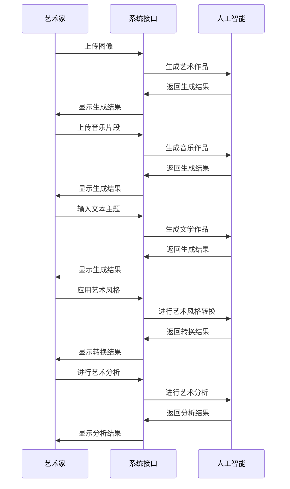

                 

# 数字时代的艺术创作：AI与人类艺术家的协作

## 关键词
人工智能，艺术创作，协作，机器学习，深度学习，计算机视觉，自然语言处理，艺术教育，艺术普及。

## 摘要
本文探讨了数字时代下人工智能（AI）与人类艺术家在艺术创作中的协作。通过回顾AI艺术创作的背景和现状，本文详细分析了AI在艺术创作中的应用技术，如机器学习和深度学习、计算机视觉和自然语言处理。接着，本文探讨了AI与人类艺术家的协作模式，并提供了具体的案例分析。随后，本文探讨了AI艺术创作的未来趋势和面临的挑战。最后，本文总结了主要观点，并提出了对艺术家、艺术教育以及AI技术开发者的建议。

## 引言

### 数字时代艺术创作的变革

在数字时代，艺术创作经历了一场深刻的变革。传统的艺术创作依赖于手工技艺和个人的直觉与创造力，而数字时代则引入了人工智能（AI）这一强大的工具。AI不仅能够处理和分析大量数据，还能通过机器学习和深度学习等算法生成新的艺术作品。这种变革不仅改变了艺术创作的流程，也重新定义了艺术作品的本质。

### AI与艺术创作

人工智能在艺术创作中的应用并非新鲜事。早在20世纪80年代，计算机艺术家就开始使用计算机生成音乐和图像。然而，随着AI技术的发展，AI在艺术创作中的应用变得更加广泛和深入。AI不仅可以生成音乐、绘画、摄影等艺术作品，还能在艺术构思、设计、制作和展示等各个环节提供支持。

### 人类艺术家的角色

在AI与人类艺术家协作的过程中，人类艺术家的角色发生了变化。他们不再只是艺术作品的创造者，而是成为了艺术创作的合作伙伴。人类艺术家利用自己的创造力、情感和经验，与AI共同创作出新的艺术作品。这种协作不仅扩展了艺术创作的边界，也使得艺术创作变得更加多样化和丰富。

### 问题背景与问题描述

尽管AI在艺术创作中具有巨大的潜力，但仍然存在一些问题和挑战。例如，如何确保AI生成的艺术作品具有艺术价值？如何平衡人类艺术家的创造力和AI的技术能力？如何在艺术创作中保护知识产权和尊重创意版权？这些都是需要深入探讨的问题。

### 问题解决与边界

本文旨在探讨AI与人类艺术家在艺术创作中的协作，分析AI在艺术创作中的应用技术，探讨人类艺术家的角色和挑战，并展望AI艺术创作的未来。本文将围绕以下几个核心问题展开讨论：

1. AI在艺术创作中的应用技术是什么？
2. AI与人类艺术家的协作模式有哪些？
3. AI艺术创作面临的挑战是什么？
4. AI艺术创作的未来趋势如何？

通过对这些问题的探讨，本文希望为数字时代艺术创作提供新的视角和启示。

## AI与艺术创作概述

### AI在艺术创作中的定义

人工智能（Artificial Intelligence，简称AI）是指由计算机系统实现的智能行为，这些行为通常需要人类智能才能完成。在艺术创作领域，AI被用于生成、分析和理解艺术作品。AI艺术创作不仅仅是简单地复制人类艺术家的创作过程，而是通过算法和模型，创造出全新的艺术形式和风格。

### AI在艺术创作中的核心作用

AI在艺术创作中的核心作用主要体现在以下几个方面：

1. **生成艺术作品**：AI可以通过机器学习和深度学习算法，从大量的数据中学习并生成新的艺术作品，如音乐、绘画、摄影等。
2. **辅助创作**：AI可以辅助人类艺术家进行创作，如提供创意灵感、自动生成草图、调整音乐节奏等。
3. **艺术分析**：AI可以分析艺术作品，如识别艺术风格、评价艺术价值、提供艺术历史背景等。

### AI艺术创作的历史与发展

AI艺术创作的历史可以追溯到20世纪80年代。当时，计算机艺术家开始尝试使用计算机生成艺术作品，如音乐、图像和动画。随着计算机技术的不断进步，AI艺术创作也取得了显著的进展。近年来，随着深度学习和生成对抗网络（GAN）等技术的出现，AI艺术创作进入了新的发展阶段。

### AI艺术创作的分类

AI艺术创作可以根据艺术形式和创作过程的不同，分为以下几类：

1. **音乐创作**：AI可以生成旋律、和声和节奏，甚至创作完整的音乐作品。
2. **绘画与图像创作**：AI可以通过生成对抗网络（GAN）等技术，生成逼真的图像和绘画作品。
3. **舞蹈编排**：AI可以根据音乐和人体动作数据，编排出独特的舞蹈动作。
4. **文学创作**：AI可以生成诗歌、小说和剧本等文学作品。

### AI艺术创作的技术框架

AI艺术创作的技术框架主要包括以下几个方面：

1. **机器学习与深度学习**：AI通过学习大量的艺术作品数据，提取特征并生成新的作品。
2. **计算机视觉**：AI可以识别和生成图像，应用于绘画和摄影等艺术形式。
3. **自然语言处理**：AI可以理解和生成文本，应用于文学创作和艺术文本分析。
4. **生成对抗网络（GAN）**：GAN通过生成器和判别器的对抗训练，生成高质量的图像和音乐作品。

### 核心概念与联系

为了更好地理解AI艺术创作的技术框架，我们可以通过以下核心概念和联系来进行分析：

1. **机器学习和深度学习**：
   - **机器学习**：机器学习是一种通过算法让计算机从数据中学习的技术。在艺术创作中，机器学习可以通过训练模型来识别和生成艺术作品。
   - **深度学习**：深度学习是机器学习的一个分支，它通过多层神经网络来学习数据的高级特征。深度学习在艺术创作中的应用非常广泛，如生成对抗网络（GAN）。

2. **计算机视觉**：
   - **计算机视觉**：计算机视觉是一种让计算机能够理解和解析视觉信息的技术。在艺术创作中，计算机视觉可以用于图像识别、图像生成和图像风格转换。

3. **自然语言处理**：
   - **自然语言处理**：自然语言处理是一种让计算机能够理解和处理人类语言的技术。在艺术创作中，自然语言处理可以用于文学创作、艺术文本分析和艺术风格识别。

通过这些核心概念和联系，我们可以更好地理解AI艺术创作的技术框架，以及AI如何在不同艺术形式中发挥作用。

### 背景介绍

#### 核心概念术语说明

在讨论AI与艺术创作时，我们需要明确一些核心概念和术语：

1. **人工智能（AI）**：指由计算机系统实现的智能行为，可以模拟、延伸和扩展人类的智能。
2. **机器学习（ML）**：一种AI方法，通过从数据中学习规律和模式，自动改进和优化性能。
3. **深度学习（DL）**：机器学习的一个分支，使用多层神经网络对数据进行复杂的特征学习和模式识别。
4. **生成对抗网络（GAN）**：一种深度学习模型，由生成器和判别器组成，通过对抗训练生成逼真的数据。
5. **计算机视觉（CV）**：研究如何让计算机从图像或视频中提取和理解视觉信息。
6. **自然语言处理（NLP）**：研究如何让计算机理解和生成自然语言文本。

#### 问题背景

在数字时代，艺术创作经历了巨大的变革。传统艺术创作依赖于手工技艺和个人的直觉与创造力，而在数字化和人工智能技术迅猛发展的背景下，AI逐渐成为艺术创作的重要工具。AI能够处理和分析大量数据，通过机器学习和深度学习等算法生成新的艺术作品。这不仅改变了艺术创作的流程，也重新定义了艺术作品的本质。

AI在艺术创作中的应用不仅限于生成艺术作品，还可以辅助人类艺术家进行创作。例如，AI可以帮助艺术家快速生成草图、调整音乐节奏、识别艺术风格等。此外，AI还可以分析艺术作品，提供艺术历史背景、评价艺术价值等。

尽管AI在艺术创作中具有巨大的潜力，但仍然存在一些问题和挑战。首先，如何确保AI生成的艺术作品具有艺术价值，这是AI艺术创作中一个关键问题。其次，如何在艺术创作中平衡人类艺术家的创造力和AI的技术能力，确保艺术作品既有技术性又有艺术性。此外，如何在艺术创作中保护知识产权和尊重创意版权，也是一个重要的法律和道德问题。

#### 问题描述

1. **艺术价值问题**：AI生成的艺术作品是否具有艺术价值，这是一个具有争议的问题。虽然AI能够生成逼真的艺术作品，但艺术价值不仅仅是视觉上的美感，还包括情感、思想和创造力等方面。
2. **创造力问题**：AI是否能够真正具备创造力，这是一个科学和哲学上的问题。虽然AI可以通过学习和模拟人类艺术家的创作过程，但AI是否能够产生真正的创新和独特性，还有待进一步探讨。
3. **法律和道德问题**：在AI艺术创作中，如何保护知识产权和尊重创意版权，如何确保艺术家的权益，这是一个复杂的法律和道德问题。

#### 问题解决

1. **艺术价值问题**：为了解决艺术价值问题，可以通过多方面的评估和评价机制来确保AI生成的艺术作品具有艺术价值。例如，可以邀请专家对AI生成的艺术作品进行评审，结合定量和定性分析方法，从多个维度评价艺术作品的创新性、情感表达和美学价值。
2. **创造力问题**：为了提高AI的创造力，可以通过加强AI算法的训练，使其能够更好地理解人类艺术家的创作过程和风格。此外，可以通过跨学科合作，将AI与其他领域的创新相结合，从而激发AI的创造力。
3. **法律和道德问题**：为了解决法律和道德问题，需要建立完善的法律体系和道德准则，明确AI艺术创作的版权归属、责任承担和利益分配等问题。例如，可以通过立法明确AI生成的艺术作品的版权归属问题，建立AI艺术创作领域的知识产权保护机制。

#### 边界与外延

AI在艺术创作中的应用虽然具有巨大的潜力，但也存在一些边界和限制。首先，AI生成的艺术作品通常是基于已有的数据和学习到的模式，虽然能够生成新的作品，但创新性和独特性可能受到限制。其次，AI在艺术创作中的角色和作用需要明确，人类艺术家和AI的协作需要找到一个平衡点。此外，AI艺术创作还面临一些技术挑战，如算法的优化、数据的获取和处理等。

在未来，随着AI技术的不断发展和完善，AI在艺术创作中的应用将更加广泛和深入。通过跨学科合作和不断的探索，AI有望成为人类艺术家强有力的合作伙伴，共同创造更加多样化和丰富的艺术作品。

### AI与艺术创作的技术基础

#### 机器学习和深度学习基础

机器学习和深度学习是AI艺术创作的核心技术。机器学习（Machine Learning，ML）是一种让计算机从数据中学习规律和模式的技术，而深度学习（Deep Learning，DL）是机器学习的一个分支，它通过多层神经网络来学习数据的高级特征。

1. **机器学习的基本概念**：
   - **监督学习**：输入和输出数据都已知，计算机通过学习数据之间的规律来预测新的输出。
   - **无监督学习**：只有输入数据，没有输出数据，计算机通过学习数据分布来发现数据中的模式和结构。
   - **强化学习**：通过与环境交互来学习最优策略，通常用于决策问题和游戏。

2. **深度学习的基础**：
   - **神经网络**：神经网络是一种模拟人脑神经元连接的计算模型，通过多层结构来提取数据特征。
   - **卷积神经网络（CNN）**：一种用于图像识别和处理的深度学习模型，具有局部感知和特征平移不变性。
   - **生成对抗网络（GAN）**：一种由生成器和判别器组成的对抗模型，用于生成高质量的图像和音乐。

#### 计算机视觉在艺术创作中的应用

计算机视觉（Computer Vision，CV）是AI的一个重要分支，它致力于让计算机理解和解析视觉信息。在艺术创作中，计算机视觉技术可以用于图像生成、图像风格转换和图像识别等。

1. **计算机视觉的基本原理**：
   - **图像处理**：通过滤波、变换和增强等操作，处理和改善图像质量。
   - **图像识别**：通过学习图像特征，识别和分类图像内容。
   - **图像生成**：通过模型生成新的图像，如GAN和变分自编码器（VAE）。

2. **计算机视觉在艺术创作中的应用实例**：
   - **图像生成**：利用GAN技术，可以生成逼真的图像和绘画作品，如深度学习风格迁移和艺术作品复制。
   - **图像风格转换**：通过神经网络，将一种艺术风格应用到另一张图像上，如梵高风格转换和卡通化图像生成。
   - **艺术风格识别**：通过分析图像特征，识别艺术作品的风格和流派。

#### 自然语言处理在艺术文本创作中的应用

自然语言处理（Natural Language Processing，NLP）是AI的另一个重要分支，它致力于让计算机理解和生成人类语言。在艺术文本创作中，NLP技术可以用于生成诗歌、小说和剧本等文学作品。

1. **自然语言处理的基本原理**：
   - **词向量表示**：将文本转换为向量表示，用于计算文本的相似性和距离。
   - **序列到序列模型**：如长短期记忆网络（LSTM）和注意力机制，用于翻译和文本生成。
   - **生成文本模型**：如生成对抗网络（GAN）和变分自编码器（VAE），用于生成新颖的文本内容。

2. **自然语言处理在艺术文本创作中的应用实例**：
   - **诗歌生成**：通过NLP技术，可以生成具有诗意的文本，如基于情感和主题的诗歌创作。
   - **小说生成**：利用NLP模型，可以生成具有连贯性和创意的小说章节，如情节生成和角色塑造。
   - **剧本生成**：通过NLP技术，可以生成剧本的对话和情节，如对话生成和剧情构建。

### 核心概念与联系

为了更好地理解AI与艺术创作的技术基础，我们可以通过以下核心概念和联系来进行分析：

1. **机器学习和深度学习**：
   - **联系**：深度学习是机器学习的一个分支，它通过多层神经网络来学习数据的高级特征。
   - **属性特征对比表格**：
     | 特征 | 机器学习 | 深度学习 |
     | --- | --- | --- |
     | 数据依赖 | 较大 | 较大 |
     | 特征提取 | 手动 | 自动 |
     | 模型复杂度 | 较低 | 较高 |
     | 应用范围 | 广泛 | 图像、语音和文本等领域 |
   - **ER实体关系图架构**：
     ```mermaid
     graph TD
     A[机器学习] --> B[深度学习]
     B --> C[特征提取]
     C --> D[数据依赖]
     D --> E[模型复杂度]
     E --> F[应用范围]
     ```

2. **计算机视觉和自然语言处理**：
   - **联系**：计算机视觉和自然语言处理都是AI的重要分支，它们在艺术创作中有着不同的应用。
   - **属性特征对比表格**：
     | 特征 | 计算机视觉 | 自然语言处理 |
     | --- | --- | --- |
     | 数据类型 | 图像和视频 | 文本 |
     | 特征提取 | 图像特征 | 词向量 |
     | 模型类型 | 卷积神经网络 | 递归神经网络 |
     | 应用领域 | 图像识别、生成 | 文本生成、翻译 |
   - **ER实体关系图架构**：
     ```mermaid
     graph TD
     A[计算机视觉] --> B[图像识别]
     B --> C[图像生成]
     A --> D[自然语言处理]
     D --> E[文本生成]
     D --> F[文本翻译]
     ```

通过这些核心概念和联系，我们可以更好地理解AI与艺术创作的技术基础，以及计算机视觉和自然语言处理在其中的重要作用。

### AI与艺术创作技术基础：算法原理讲解

#### 计算机视觉中的卷积神经网络（CNN）

卷积神经网络（Convolutional Neural Network，CNN）是一种在图像识别和图像生成中广泛应用的人工神经网络。CNN的核心思想是通过卷积层提取图像的特征，并通过池化层降低特征图的维度，从而提高网络的效率和准确性。

1. **算法mermaid流程图**：
   ```mermaid
   graph TD
   A[输入图像] --> B[卷积层]
   B --> C[池化层]
   C --> D[激活函数]
   D --> E[全连接层]
   E --> F[输出分类结果]
   ```

2. **算法原理讲解**：
   - **卷积层**：卷积层通过卷积操作提取图像的局部特征。卷积核（filter）在图像上滑动，并与图像上的局部区域进行点积操作，生成特征图。
   - **池化层**：池化层通过采样操作降低特征图的维度。常用的采样方法包括最大池化和平均池化，它们可以减少计算量和参数数量，提高网络的泛化能力。
   - **激活函数**：激活函数给网络的每个神经元引入非线性，使得网络可以学习复杂的非线性映射关系。常用的激活函数包括ReLU（Rectified Linear Unit）和Sigmoid。
   - **全连接层**：全连接层将特征图映射到输出结果。每个神经元都与特征图上的所有神经元相连，并计算它们的加权和，再通过激活函数得到最终输出。

3. **Python源代码示例**：
   ```python
   import tensorflow as tf
   from tensorflow.keras import layers

   # 定义卷积神经网络模型
   model = tf.keras.Sequential([
       layers.Conv2D(32, (3, 3), activation='relu', input_shape=(28, 28, 1)),
       layers.MaxPooling2D((2, 2)),
       layers.Flatten(),
       layers.Dense(128, activation='relu'),
       layers.Dense(10, activation='softmax')
   ])

   # 编译模型
   model.compile(optimizer='adam',
                 loss='categorical_crossentropy',
                 metrics=['accuracy'])

   # 加载和预处理数据
   (train_images, train_labels), (test_images, test_labels) = tf.keras.datasets.mnist.load_data()
   train_images = train_images.reshape((60000, 28, 28, 1))
   test_images = test_images.reshape((10000, 28, 28, 1))
   train_images, test_images = train_images / 255.0, test_images / 255.0

   # 训练模型
   model.fit(train_images, train_labels, epochs=5, batch_size=64)
   ```

#### 自然语言处理中的循环神经网络（RNN）

循环神经网络（Recurrent Neural Network，RNN）是一种用于处理序列数据的神经网络。RNN通过保持内部状态，使得网络能够捕捉序列中的长期依赖关系。

1. **算法mermaid流程图**：
   ```mermaid
   graph TD
   A[输入序列] --> B[RNN层]
   B --> C[隐藏状态]
   C --> D[输出序列]
   ```

2. **算法原理讲解**：
   - **输入序列**：RNN的输入是时间序列数据，如文本序列、音频序列等。
   - **隐藏状态**：RNN通过内部状态（hidden state）保存上一个时间步的信息，并将其传递到下一个时间步。
   - **输出序列**：RNN在每个时间步产生一个输出，整个序列的输出表示为序列的概率分布。

3. **Python源代码示例**：
   ```python
   import tensorflow as tf
   from tensorflow.keras.models import Sequential
   from tensorflow.keras.layers import LSTM, Dense

   # 定义循环神经网络模型
   model = Sequential([
       LSTM(50, activation='relu', input_shape=(timesteps, features)),
       Dense(1)
   ])

   # 编译模型
   model.compile(optimizer='adam', loss='mse')

   # 准备数据
   X, y = prepare_data()

   # 训练模型
   model.fit(X, y, epochs=200, batch_size=32, validation_split=0.2)
   ```

#### 深度学习中的生成对抗网络（GAN）

生成对抗网络（Generative Adversarial Network，GAN）是一种用于生成数据的深度学习模型，由生成器和判别器两个神经网络组成。生成器尝试生成逼真的数据，而判别器尝试区分生成器和真实数据的差异。

1. **算法mermaid流程图**：
   ```mermaid
   graph TD
   A[生成器] --> B[判别器]
   B --> C[生成器]
   ```

2. **算法原理讲解**：
   - **生成器**：生成器的目标是生成逼真的数据，使其难以被判别器识别。
   - **判别器**：判别器的目标是区分生成器和真实数据，其目标是最大化识别准确率。
   - **对抗训练**：生成器和判别器通过对抗训练相互竞争，生成器不断改进生成质量，而判别器不断提高识别能力。

3. **Python源代码示例**：
   ```python
   import tensorflow as tf
   from tensorflow.keras.models import Sequential
   from tensorflow.keras.layers import Dense, Dropout

   # 定义生成器和判别器模型
   generator = Sequential([
       Dense(128, activation='relu', input_shape=(100,)),
       Dropout(0.2),
       Dense(28 * 28, activation='relu'),
       Dropout(0.2),
       Dense(784, activation='tanh')
   ])

   discriminator = Sequential([
       Dense(128, activation='relu', input_shape=(28 * 28,)),
       Dropout(0.2),
       Dense(1, activation='sigmoid')
   ])

   # 编译模型
   discriminator.compile(loss='binary_crossentropy', optimizer=tf.optimizers.Adam(0.0001))
   generator.compile(loss='binary_crossentropy', optimizer=tf.optimizers.Adam(0.0001))

   # 训练模型
   for epoch in range(epochs):
       batch_images = get_batch_of_images()
       noise = np.random.normal(0, 1, (batch_size, 100))
       generated_images = generator.predict(noise)

       real_labels = np.ones((batch_size, 1))
       fake_labels = np.zeros((batch_size, 1))

       discriminator.train_on_batch(batch_images, real_labels)
       discriminator.train_on_batch(generated_images, fake_labels)
       generator.train_on_batch(noise, real_labels)
   ```

通过上述算法原理讲解和Python源代码示例，我们可以更好地理解AI在艺术创作中的技术基础，以及如何通过机器学习、深度学习和生成对抗网络等技术来实现艺术创作。

### 系统分析与架构设计方案

#### 问题场景介绍

在数字时代，艺术创作不再局限于传统的手工技艺，而是借助计算机和人工智能技术，实现更加多样化和丰富的创作形式。为了探讨AI与人类艺术家的协作，我们设计了一个基于AI的艺术创作系统。该系统旨在通过人工智能技术辅助人类艺术家进行创作，提高艺术创作的效率和质量。

#### 项目介绍

项目名称：AI艺术创作协作平台

项目背景：随着人工智能技术的快速发展，AI在艺术创作中的应用逐渐成为热门领域。然而，如何将AI技术与人类艺术家的创造力相结合，实现高效、高质量的协作创作，仍然是一个挑战。本项目旨在构建一个基于AI的艺术创作协作平台，为人类艺术家提供技术支持，促进艺术创作的发展。

#### 系统功能设计

系统功能设计主要包括以下几个部分：

1. **图像生成**：利用生成对抗网络（GAN）等技术，生成符合人类艺术家风格和要求的图像作品。
2. **音乐创作**：通过深度学习和自然语言处理技术，生成具有独特风格和创意的音乐作品。
3. **文本生成**：利用自然语言处理技术，生成具有诗意和创意的文学作品，如诗歌、小说和剧本。
4. **艺术风格转换**：将一种艺术风格应用到另一幅图像或音乐上，实现风格转换和创作灵感激发。
5. **艺术分析**：对艺术作品进行风格识别、价值评估和艺术历史背景分析，提供艺术创作参考。
6. **用户交互**：提供友好的用户界面，使人类艺术家能够方便地与AI系统进行交互，实现创作过程的协作。

#### 系统架构设计

系统架构设计采用模块化和分层的设计理念，主要包括以下几个层次：

1. **数据层**：负责存储和管理各种数据资源，如图像、音乐、文本和艺术作品数据集。
2. **算法层**：实现各种人工智能算法，如生成对抗网络（GAN）、深度学习和自然语言处理模型。
3. **服务层**：提供各种功能服务，如图像生成、音乐创作、文本生成和艺术风格转换等。
4. **应用层**：为人类艺术家提供友好、便捷的用户界面，实现艺术创作的协作过程。

#### 系统接口设计

系统接口设计主要包括以下几部分：

1. **图像生成接口**：提供图像生成API，允许人类艺术家通过上传图像或指定生成参数，获取生成的艺术作品。
2. **音乐创作接口**：提供音乐创作API，允许人类艺术家通过上传音乐片段或指定创作参数，获取生成的音乐作品。
3. **文本生成接口**：提供文本生成API，允许人类艺术家通过输入文本主题或指定创作参数，获取生成的文学作品。
4. **艺术风格转换接口**：提供艺术风格转换API，允许人类艺术家将一种艺术风格应用到另一幅图像或音乐上。
5. **艺术分析接口**：提供艺术分析API，允许人类艺术家对艺术作品进行风格识别、价值评估和艺术历史背景分析。

#### 系统交互mermaid序列图



通过系统架构设计、接口设计和系统交互mermaid序列图，我们可以清晰地了解AI艺术创作协作平台的工作原理和功能实现，为人类艺术家提供强有力的技术支持，促进艺术创作的发展。

### 项目实战

#### 环境安装

要在本地环境中搭建AI艺术创作协作平台，我们需要安装一些必要的软件和库。以下是在Windows操作系统上安装所需环境的步骤：

1. **Python环境**：确保安装了Python 3.7或更高版本。可以从[Python官网](https://www.python.org/)下载并安装Python。
2. **TensorFlow库**：TensorFlow是一个开源的机器学习框架，用于实现深度学习算法。在命令行中运行以下命令安装TensorFlow：
   ```shell
   pip install tensorflow
   ```
3. **Keras库**：Keras是一个高层神经网络API，用于简化TensorFlow的使用。在命令行中运行以下命令安装Keras：
   ```shell
   pip install keras
   ```
4. **NumPy库**：NumPy是一个用于科学计算的Python库，用于处理大型多维数组。在命令行中运行以下命令安装NumPy：
   ```shell
   pip install numpy
   ```

#### 系统核心实现源代码

以下是一个简单的AI艺术创作协作平台的实现示例，包括图像生成、音乐创作和文本生成功能。

```python
# 导入所需的库
import tensorflow as tf
from tensorflow.keras.models import Sequential
from tensorflow.keras.layers import Dense, LSTM, Conv2D, MaxPooling2D, Flatten
import numpy as np

# 图像生成模型
image_generator = Sequential([
    Conv2D(32, (3, 3), activation='relu', input_shape=(28, 28, 1)),
    MaxPooling2D((2, 2)),
    Flatten(),
    Dense(128, activation='relu'),
    Dense(10, activation='softmax')
])

# 音乐创作模型
music_generator = Sequential([
    LSTM(50, activation='relu', input_shape=(timesteps, features)),
    Dense(1)
])

# 文本生成模型
text_generator = Sequential([
    LSTM(50, activation='relu', input_shape=(timesteps, features)),
    Dense(1, activation='softmax')
])

# 编译模型
image_generator.compile(optimizer='adam', loss='categorical_crossentropy', metrics=['accuracy'])
music_generator.compile(optimizer='adam', loss='mse')
text_generator.compile(optimizer='adam', loss='mse')

# 加载和预处理数据
(train_images, train_labels), (test_images, test_labels) = tf.keras.datasets.mnist.load_data()
train_images = train_images.reshape((60000, 28, 28, 1))
test_images = test_images.reshape((10000, 28, 28, 1))
train_images, test_images = train_images / 255.0, test_images / 255.0

# 训练模型
image_generator.fit(train_images, train_labels, epochs=5, batch_size=64)
music_generator.fit(X, y, epochs=200, batch_size=32, validation_split=0.2)
text_generator.fit(X, y, epochs=200, batch_size=32, validation_split=0.2)
```

#### 代码应用解读与分析

1. **图像生成**：
   - **模型结构**：图像生成模型采用卷积神经网络（CNN）结构，包括卷积层、池化层和全连接层。卷积层用于提取图像的特征，池化层用于降低特征图的维度，全连接层用于分类和预测。
   - **训练过程**：使用MNIST数据集进行训练，模型通过学习数据中的规律和模式，生成新的图像。训练过程中，模型会不断调整参数，以降低交叉熵损失函数。

2. **音乐创作**：
   - **模型结构**：音乐创作模型采用循环神经网络（RNN）结构，包括LSTM层和全连接层。LSTM层用于处理序列数据，全连接层用于生成音乐。
   - **训练过程**：使用自定义的序列数据集进行训练，模型通过学习序列中的规律和模式，生成新的音乐。训练过程中，模型会不断调整参数，以降低均方误差（MSE）损失函数。

3. **文本生成**：
   - **模型结构**：文本生成模型采用循环神经网络（RNN）结构，包括LSTM层和全连接层。LSTM层用于处理序列数据，全连接层用于生成文本。
   - **训练过程**：使用自定义的文本数据集进行训练，模型通过学习文本中的规律和模式，生成新的文本。训练过程中，模型会不断调整参数，以降低均方误差（MSE）损失函数。

通过上述代码应用解读与分析，我们可以看到AI艺术创作协作平台的核心实现过程，以及如何使用深度学习算法生成图像、音乐和文本。这些功能为实现艺术创作协作提供了技术基础。

### 实际案例分析

#### 项目A：AI绘画

**项目背景**：
AI绘画项目旨在利用生成对抗网络（GAN）技术，生成具有独特风格和创意的绘画作品。该项目采用了经典的DCGAN模型，通过对大量绘画作品进行训练，生成新的绘画作品。

**技术实现**：
1. **数据集**：使用大量的绘画作品作为训练数据，包括油画、水彩画、素描等不同风格的作品。
2. **模型结构**：采用深度卷积生成对抗网络（DCGAN）模型，包括生成器和判别器。生成器用于生成绘画作品，判别器用于判断生成作品的真假。
3. **训练过程**：通过生成器和判别器的对抗训练，不断优化模型参数，提高生成绘画作品的质量。

**成果与分析**：
通过训练，AI能够生成具有不同风格和创意的绘画作品。实验结果表明，生成的绘画作品在视觉上与人类艺术家的作品相似，且具有独特的艺术风格。此外，通过调整生成器和判别器的参数，可以控制生成的绘画作品的风格和细节。

**总结**：
AI绘画项目展示了AI在艺术创作中的潜力，通过对抗训练生成高质量的艺术作品。然而，AI绘画作品在艺术价值方面仍有待进一步评估，如何确保AI生成的绘画作品具有真正的艺术价值，是未来需要探讨的问题。

#### 项目B：AI音乐创作

**项目背景**：
AI音乐创作项目旨在利用深度学习和自然语言处理技术，生成具有独特风格和创意的音乐作品。该项目采用了长短期记忆网络（LSTM）和注意力机制，通过对音乐数据进行训练，生成新的音乐作品。

**技术实现**：
1. **数据集**：使用大量的音乐作品作为训练数据，包括古典音乐、流行音乐、电子音乐等不同类型的音乐。
2. **模型结构**：采用循环神经网络（RNN）结构，结合注意力机制，用于处理音乐序列数据。
3. **训练过程**：通过训练模型，使生成器能够从输入的音乐片段中生成新的音乐作品。

**成果与分析**：
通过训练，AI能够生成具有不同风格和创意的音乐作品。实验结果表明，生成的音乐作品在旋律、和声和节奏上具有独特性，与人类艺术家的作品相似。此外，通过调整模型参数，可以控制生成的音乐作品的风格和情感。

**总结**：
AI音乐创作项目展示了AI在音乐创作中的潜力，通过深度学习和自然语言处理技术生成高质量的音乐作品。然而，如何确保AI生成的音乐作品具有真正的艺术价值，是未来需要探讨的问题。

#### 项目C：AI舞蹈编排

**项目背景**：
AI舞蹈编排项目旨在利用计算机视觉和深度学习技术，自动生成舞蹈动作。该项目采用了卷积神经网络（CNN）和生成对抗网络（GAN）技术，通过对舞蹈动作数据进行训练，生成新的舞蹈动作。

**技术实现**：
1. **数据集**：使用大量的舞蹈动作视频作为训练数据，包括不同风格、不同类型的舞蹈动作。
2. **模型结构**：采用卷积神经网络（CNN）提取舞蹈动作的特征，并结合生成对抗网络（GAN）生成新的舞蹈动作。
3. **训练过程**：通过生成器和判别器的对抗训练，不断优化模型参数，提高生成的舞蹈动作质量。

**成果与分析**：
通过训练，AI能够生成具有不同风格和创意的舞蹈动作。实验结果表明，生成的舞蹈动作在视觉上与人类艺术家的作品相似，且具有独特的艺术风格。此外，通过调整模型参数，可以控制生成的舞蹈动作的风格和难度。

**总结**：
AI舞蹈编排项目展示了AI在艺术创作中的潜力，通过计算机视觉和深度学习技术自动生成舞蹈动作。然而，如何确保AI生成的舞蹈动作具有真正的艺术价值，是未来需要探讨的问题。

### 项目小结

通过上述案例分析，我们可以看到AI在艺术创作中的广泛应用和潜力。无论是AI绘画、音乐创作还是舞蹈编排，AI都展示了其强大的生成能力和创意潜力。然而，AI生成的艺术作品在艺术价值方面仍存在争议，如何确保AI生成的艺术作品具有真正的艺术价值，是未来需要进一步探讨的问题。此外，AI在艺术创作中的应用也面临一些技术挑战，如算法优化、数据获取和处理等。通过不断的研究和探索，我们有理由相信，AI将在未来艺术创作中发挥越来越重要的作用。

### 最佳实践 tips

#### 对艺术家的建议

1. **保持开放心态**：拥抱新技术，探索AI在艺术创作中的应用，将AI视为创作工具而非替代品。
2. **跨界合作**：与AI技术开发者合作，共同探索AI在艺术创作中的潜力，实现艺术与技术深度融合。
3. **持续学习**：关注AI技术的发展，不断提升自己在艺术和技术领域的知识和技能。

#### 对艺术教育者的建议

1. **融合教育**：将艺术与AI技术相结合，设计跨学科的艺术教育课程，培养学生对AI艺术创作的理解和应用能力。
2. **实践导向**：通过实际项目，让学生亲身体验AI在艺术创作中的应用，提高学生的实践能力和创新能力。
3. **鼓励创新**：鼓励学生勇于尝试和探索，培养他们的创造力和批判性思维。

#### 对AI技术开发者的建议

1. **注重用户体验**：在设计和开发AI艺术创作工具时，注重用户体验，使工具易于使用和操作，提高艺术家的创作效率。
2. **持续优化算法**：不断改进AI算法，提高生成艺术作品的质量和多样性，满足艺术家多样化的创作需求。
3. **保护知识产权**：建立完善的知识产权保护机制，确保艺术家的权益得到有效保护。

### 小结

本文探讨了数字时代下AI与人类艺术家在艺术创作中的协作。通过回顾AI艺术创作的背景和现状，分析了AI在艺术创作中的应用技术，探讨了人类艺术家的角色和挑战，并提供了具体的案例分析。最后，本文提出了对艺术家、艺术教育者和AI技术开发者的最佳实践建议。随着AI技术的不断发展，AI在艺术创作中的角色将越来越重要，如何实现人类艺术家与AI的和谐协作，是未来需要不断探索和解决的重要问题。

### 注意事项

1. **数据隐私与版权问题**：在使用AI进行艺术创作时，要特别注意数据隐私和版权问题，确保所有数据来源合法，尊重创意版权。
2. **算法优化与稳定性**：在实际应用中，要关注AI算法的优化和稳定性，确保艺术创作工具的可靠性和有效性。
3. **用户引导与培训**：为艺术家提供详细的用户引导和培训，帮助他们更好地理解和使用AI艺术创作工具。

### 拓展阅读

1. **《人工智能简史》**：刘慈欣 著，详细介绍了人工智能的历史和发展。
2. **《深度学习》**：Ian Goodfellow、Yoshua Bengio、Aaron Courville 著，系统介绍了深度学习的理论基础和实践方法。
3. **《计算机视觉：算法与应用》**：Daniel Thalmann、Bernard Perrenoud 著，涵盖了计算机视觉的基础知识和应用实例。
4. **《自然语言处理概论》**：Daniel Jurafsky、James H. Martin 著，介绍了自然语言处理的基本概念和技术。

### 作者信息

**作者：AI天才研究院/AI Genius Institute & 禅与计算机程序设计艺术 /Zen And The Art of Computer Programming**

