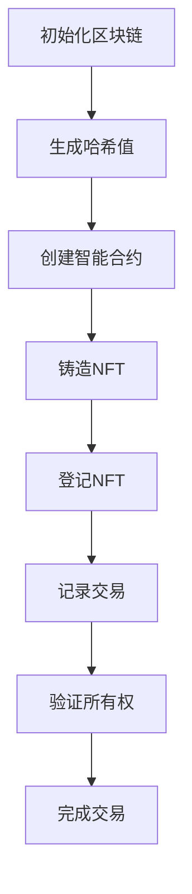
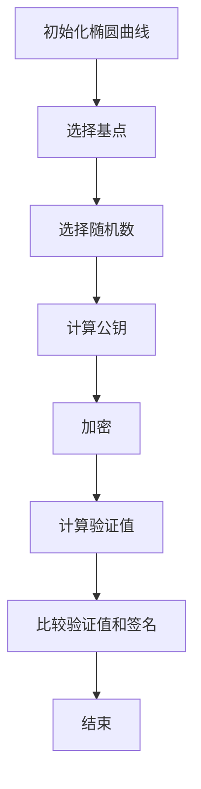
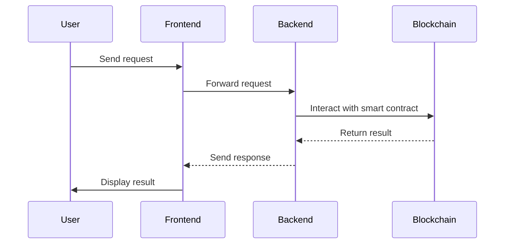
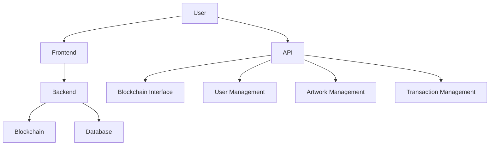
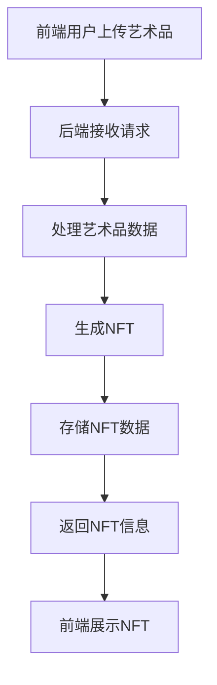

                 

### 文章标题

# 数字时代的虚拟美术馆：NFT艺术品的全球展示平台

### 关键词

- 数字时代
- 虚拟美术馆
- NFT艺术品
- 区块链技术
- 智能合约
- 全球展示平台

### 摘要

本文深入探讨了数字时代下的虚拟美术馆及其核心展示技术——NFT艺术品。文章首先介绍了数字时代艺术展示的变革背景，接着详细解释了NFT艺术品的概念、特性及其与传统艺术品的区别。随后，文章阐述了虚拟美术馆的系统架构设计，包括用户界面、后台管理系统、NFT艺术品管理和交易系统等。通过模拟NFT艺术品的上传、展示和交易流程，文章展示了实际操作中的步骤和方法。最后，文章提供了创建和管理虚拟美术馆的最佳实践建议，并展望了NFT艺术品未来的发展趋势。

## 目录

1. **背景介绍**
2. **核心概念与联系**
3. **算法原理讲解**
4. **数学模型和公式讲解**
5. **系统分析与架构设计方案**
6. **项目实战**
7. **最佳实践 tips**
8. **小结**
9. **注意事项**
10. **拓展阅读**

## 1. 背景介绍

在数字时代，艺术展示的形式正在发生革命性的变化。随着互联网和虚拟现实技术的普及，传统的美术馆逐渐被虚拟美术馆所取代。虚拟美术馆不仅提供了更加丰富和互动的艺术体验，还打破了地域和时间的限制，使得全球观众都能轻松访问和欣赏艺术品。

NFT（非同质化代币）是近年来兴起的一种新型数字资产，它们为艺术品的数字所有权提供了独特的解决方案。NFT艺术品不仅具有独特的数字标识，还附带了相关的知识产权信息，使得艺术品的交易和展示变得更加透明和可信。

本文旨在探讨如何利用NFT技术构建一个全球展示平台，为艺术家和收藏家提供一个全新的艺术展示和交易平台。接下来，我们将详细分析NFT艺术品的工作原理和虚拟美术馆的系统架构，并通过实际操作流程展示这一平台的实际应用。

### 1.1 数字时代的艺术展示变革

在数字时代，艺术展示的形式正在经历深刻的变革。互联网技术的发展使得艺术品不再局限于实体空间，而是可以通过数字形式进行传播和展示。虚拟现实（VR）和增强现实（AR）技术的应用，更是为艺术体验带来了全新的维度，使得观众可以身临其境地感受艺术作品。

首先，数字艺术的兴起是这一变革的重要驱动力。数字艺术家利用计算机技术创作出独特的数字艺术作品，这些作品通过数字媒介进行传播，打破了传统艺术形式对物理空间的依赖。例如，数字绘画、动画、三维建模等数字艺术形式，为观众提供了丰富的视觉体验。

其次，虚拟现实技术在艺术展示中的应用，为艺术体验带来了前所未有的沉浸感。通过VR技术，观众可以进入一个完全虚拟的艺术空间，与艺术作品进行互动，感受艺术作品的空间结构和创作灵感。增强现实技术则将艺术作品与现实世界相结合，为观众创造出一个虚实交融的观感。

此外，NFT艺术品的崛起也为艺术展示带来了新的机遇。NFT艺术品通过区块链技术确保了艺术品的唯一性和真实性，使得艺术品的数字所有权得到了可靠保障。收藏家可以通过购买NFT艺术品，获得艺术品的数字所有权，并在全球范围内进行展示和交易。

总的来说，数字时代为艺术展示带来了无限可能。通过互联网、虚拟现实和NFT技术，艺术家和观众之间的互动变得更加紧密，艺术作品的传播和展示也变得更加便捷和广泛。这些变化不仅改变了传统的艺术展示模式，也为艺术创作和欣赏提供了新的方式和体验。

### 1.2 虚拟美术馆的概念与特点

虚拟美术馆是一种利用数字技术和虚拟现实技术构建的虚拟空间，用于展示艺术作品和提供艺术体验。与传统美术馆相比，虚拟美术馆具有显著的特点和优势。

首先，虚拟美术馆的最大优势在于其无边界性。传统美术馆受限于物理空间，展览作品和观众数量受到场地容量的限制。而虚拟美术馆则可以打破这些限制，通过互联网和虚拟现实技术，将艺术作品展示给全球的观众。无论是大城市还是偏远地区，人们都可以通过网络访问虚拟美术馆，欣赏到世界各地的艺术作品。

其次，虚拟美术馆提供了更加丰富和互动的艺术体验。通过虚拟现实技术，观众可以进入一个完全虚拟的艺术空间，与艺术作品进行互动。例如，观众可以通过虚拟现实头盔或手机等设备，近距离观察艺术作品，甚至可以改变艺术作品的角度和展示方式。这种互动性不仅增强了观众的艺术体验，也提升了艺术作品的表现力和吸引力。

此外，虚拟美术馆在艺术品的保存和保护方面也具有优势。传统美术馆需要大量的人力和物力来维护和保管艺术品，而虚拟美术馆则可以通过数字化手段，永久保存艺术作品的数字副本。这些副本不仅不受物理条件的影响，还可以避免因自然灾害等原因导致的艺术品损失。

与传统美术馆相比，虚拟美术馆还减少了展览成本。传统美术馆需要支付租金、人力和设备维护等费用，而虚拟美术馆则可以通过网络平台进行展览，大大降低了展览成本。这为艺术家和策展人提供了更多创作和展示的机会，也为观众提供了更多观展的选择。

最后，虚拟美术馆还为艺术品交易提供了一个新的平台。通过NFT技术，艺术家可以将自己的艺术作品以数字形式发行，收藏家可以购买NFT艺术品，并获得艺术品的数字所有权。这种交易模式不仅提高了艺术品交易的效率，也确保了交易的真实性和透明度。

总的来说，虚拟美术馆作为一种新兴的艺术展示形式，不仅为艺术家和观众提供了更多的创作和欣赏机会，还带来了更加丰富和便捷的艺术体验。随着数字技术和虚拟现实技术的不断发展，虚拟美术馆将逐渐成为艺术展示的重要场所，为艺术界带来新的变革。

### 1.3 NFT艺术品的概念与特性

NFT（非同质化代币）是一种基于区块链技术的数字资产，具有独特性和不可替代性。NFT艺术品是指通过NFT技术发行的数字艺术品，它们不仅代表着艺术作品的数字所有权，还包含了相关的知识产权信息。

首先，NFT艺术品具有唯一性。每个NFT艺术品都是独一无二的，其数字标识是唯一的，不可重复。这意味着，即使两个数字艺术作品在外观上完全相同，它们的NFT却是不同的，具有不同的所有权信息和知识产权。这种唯一性确保了艺术品的真实性和独特性，使得每个艺术品都具有收藏价值。

其次，NFT艺术品具有可追溯性。由于NFT是基于区块链技术的，每个交易记录都会被永久记录在区块链上，无法篡改。这意味着，通过NFT艺术品，可以追溯艺术品的整个交易历史，了解艺术品的来源和流转情况。这种透明性增加了艺术品交易的信任度，也便于艺术品的监管和验证。

第三，NFT艺术品具有可交易性。通过NFT技术，艺术品的交易变得更加便捷和高效。收藏家可以直接购买NFT艺术品，获得艺术品的数字所有权。艺术品的交易记录也会被永久记录在区块链上，确保了交易的真实性和透明度。此外，NFT艺术品可以在全球范围内进行交易，不受地域限制，为艺术家和收藏家提供了更广阔的市场。

最后，NFT艺术品的安全性较高。由于区块链技术的特性，NFT艺术品的数据存储是去中心化的，多个节点共同维护和验证交易记录，使得数据非常安全。此外，NFT艺术品还具有加密签名，确保了艺术品的真实性和合法性。这种安全性使得NFT艺术品成为艺术品交易的一种可靠方式。

总的来说，NFT艺术品通过区块链技术，为艺术品的数字所有权提供了全新的解决方案，具有唯一性、可追溯性、可交易性和安全性等特点。随着NFT技术的不断发展，NFT艺术品将逐渐成为艺术品市场的重要一环，为艺术家和收藏家提供更多的创作和交易机会。

### 1.4 虚拟美术馆与传统美术馆的比较

虚拟美术馆与传统美术馆在多个方面存在显著差异，这些差异主要体现在展览形式、互动性、受众范围和交易模式上。

首先，在展览形式上，传统美术馆依赖于物理空间，艺术作品的展示受到场地大小和开放时间的限制。而虚拟美术馆则通过数字技术打破了物理空间的限制，可以在任何时间、任何地点进行展览。观众无需到实体美术馆参观，只需通过互联网和虚拟现实设备即可随时随地访问虚拟美术馆，欣赏艺术作品。

其次，在互动性方面，虚拟美术馆提供了更加丰富的互动体验。通过虚拟现实技术，观众可以进入一个完全虚拟的艺术空间，与艺术作品进行互动。例如，观众可以通过虚拟现实头盔或手机等设备，近距离观察艺术作品，甚至可以改变艺术作品的角度和展示方式。这种互动性不仅增强了观众的艺术体验，也提升了艺术作品的表现力和吸引力。相比之下，传统美术馆的互动性相对较弱，观众通常只能通过观看和思考来感受艺术作品。

第三，在受众范围方面，虚拟美术馆具有更大的覆盖范围。由于虚拟美术馆不受地域和时间的限制，观众可以来自全球各地。这使得艺术品的展示和传播更加广泛，能够吸引到更多的观众和收藏家。而传统美术馆由于受限于场地和交通，通常只能服务于特定的地区和人群。

第四，在交易模式上，虚拟美术馆提供了全新的交易方式。通过NFT技术，虚拟美术馆可以为艺术品发行NFT，使得艺术品的交易变得更加便捷和高效。收藏家可以直接购买NFT艺术品，获得艺术品的数字所有权。艺术品的交易记录也会被永久记录在区块链上，确保了交易的真实性和透明度。相比之下，传统美术馆的艺术品交易通常需要通过中介机构进行，交易流程较为复杂且透明度较低。

总的来说，虚拟美术馆与传统美术馆相比，在展览形式、互动性、受众范围和交易模式等方面具有显著优势。随着虚拟现实和区块链技术的不断发展，虚拟美术馆有望成为艺术展示和交易的主要形式，为艺术界带来新的变革。

## 2. 核心概念与联系

### 2.1 艺术品的分类与展示方式的演变

艺术品的分类可以从多种角度进行，例如按形式分为绘画、雕塑、摄影等；按时代分为古代艺术、现代艺术、当代艺术等。然而，无论是哪种分类方法，艺术品的展示方式都经历了显著的变化。

在过去，艺术品的展示主要依赖于实体美术馆。艺术家将作品创作完成后，通过展览、画廊等形式向公众展示。这种展示方式具有直观性，但受限于物理空间和时间。美术馆的展览往往需要预定时间，且展览的作品数量有限，观众需亲自前往美术馆观看。

随着数字技术的发展，艺术品的展示方式逐渐向数字化和虚拟化转变。数字化展示通过将艺术品以图片、视频等形式上传到互联网，使得艺术品可以在全球范围内被访问和欣赏。虚拟现实（VR）和增强现实（AR）技术的应用，则将艺术品展示提升到了一个新的维度，观众可以在虚拟环境中互动体验艺术品。

NFT艺术品作为一种新兴的展示方式，进一步改变了艺术品的展示和交易模式。通过NFT技术，艺术家可以将艺术作品的数字所有权以唯一标识的形式发行，观众可以通过购买NFT来获得艺术品的数字所有权。这种展示方式不仅确保了艺术品的唯一性和真实性，还提供了便捷的交易渠道。

### 2.2 艺术品展示方式的比较表格

| 展示方式         | 特点                                               | 优点                                                   | 缺点                                                 |
|------------------|----------------------------------------------------|--------------------------------------------------------|------------------------------------------------------|
| 实体美术馆       | 依赖于物理空间和开放时间                           | 直观，便于观众近距离欣赏                                | 受限于场地和开放时间，受众范围有限                     |
| 数字化展示       | 将艺术品以图片、视频等形式上传到互联网             | 无地域和时间限制，观众可随时随地访问                   | 缺乏互动性，观众体验相对单一                           |
| 虚拟现实（VR）展示 | 通过VR技术为观众创建虚拟艺术空间，进行互动体验     | 强烈的沉浸感，增强互动体验                             | 需要特定的设备，普及率相对较低                         |
| 增强现实（AR）展示 | 将艺术作品叠加在现实世界中，增强现实体验           | 虚实结合，增强观众体验                                 | 需要特定的设备和环境，适用场景有限                     |
| NFT艺术品展示    | 通过NFT技术发行艺术品的数字所有权，提供便捷的交易渠道 | 确保唯一性和真实性，提供全球展示和交易平台             | 需要一定的技术理解和区块链知识，普及度尚需提高         |

### 2.3 艺术品展示的ER实体关系图

为了更直观地理解艺术品展示中的实体关系，我们可以使用ER（实体-关系）图进行描述。

```mermaid
erDiagram
  Artwork ||--|{ NFT }|| NFT : includes ownership and transaction data
  NFT ||--|{ ArtEvent }|| ArtEvent : represents exhibitions and events
  User ||--|{ Collection }|| Collection : holds user's owned NFTs
  User ||--|{ ArtRating }|| ArtRating : user ratings and reviews
  Artwork ||--|{ Artist }|| Artist : creator of the artwork
```

在这张ER图中，`Artwork`实体表示艺术作品，`NFT`实体代表非同质化代币，`ArtEvent`实体表示艺术展览和活动，`User`实体代表用户，`Collection`实体表示用户的收藏，`ArtRating`实体表示用户的评价，而`Artist`实体表示艺术家。

通过这个ER图，我们可以清晰地看到艺术品展示过程中涉及的各个实体及其相互关系。这有助于我们在设计和实现虚拟美术馆系统时，更好地理解各部分的功能和交互方式。

### 2.4 艺术品展示与区块链技术的联系

区块链技术作为一种去中心化的分布式账本技术，在艺术品展示和交易中发挥着重要作用。通过区块链，艺术品的所有权和交易信息可以被永久记录和验证，确保了艺术品的唯一性和真实性。

首先，区块链技术为艺术品的所有权提供了可靠保障。每件艺术作品在数字化后，都可以生成一个唯一的NFT，该NFT包含了艺术作品的元数据、所有权信息和创作者信息。这些信息被永久记录在区块链上，任何人都无法篡改或删除。这意味着，通过区块链，艺术品的所有权可以得到有效验证，确保收藏家和投资者能够拥有真实的艺术品。

其次，区块链技术提供了透明的交易记录。每次艺术品的交易都会生成一条交易记录，这条记录会被永久保存在区块链上，所有参与者都可以查看和验证。这种透明性增加了艺术品交易的信任度，减少了交易中的欺诈和纠纷。

此外，区块链技术还为艺术品展示提供了一个去中心化的平台。传统艺术品交易通常依赖于中介机构，这不仅增加了交易成本，也降低了交易效率。而通过区块链，艺术家可以直接与收藏家进行交易，减少了中介环节，提高了交易效率。同时，区块链平台上的艺术展览和活动也可以由社区共同管理，增加了参与度和互动性。

总的来说，区块链技术为艺术品展示和交易带来了革命性的变化。它不仅确保了艺术品的唯一性和真实性，还提供了透明、去中心化的交易平台，为艺术家和收藏家提供了更多创作和交易的机会。随着区块链技术的不断发展和普及，艺术品展示和交易将变得更加高效和可信。

### 2.5 智能合约在NFT艺术品交易中的应用

智能合约是区块链技术中的一种自动化协议，它通过预设的规则自动执行合同条款，无需第三方中介。在NFT艺术品交易中，智能合约发挥着关键作用，确保交易的透明性、安全性和高效性。

首先，智能合约在NFT艺术品交易中用于管理所有权的转移。当收藏家购买NFT艺术品时，智能合约会自动执行交易条款，包括价格、支付方式、所有权转移等。当支付完成，智能合约会立即更新区块链上的所有权记录，确保新的收藏家获得艺术品的数字所有权。这种自动化过程不仅减少了人工操作的错误，也大大提高了交易效率。

其次，智能合约在NFT艺术品交易中还用于确保交易的安全性。通过预定义的代码，智能合约可以自动验证交易参与方的身份和支付金额，确保交易过程合法有效。此外，智能合约还可以防止双花攻击（即同一资产被重复消费），通过锁定交易金额和条件，确保资金的安全转移。

此外，智能合约还提供了透明性。每次交易的详细记录都会被记录在区块链上，所有参与者都可以查看和验证。这种透明性增加了交易的信任度，减少了交易中的欺诈和纠纷。

总之，智能合约在NFT艺术品交易中的应用，不仅提高了交易的透明性和安全性，还减少了交易成本，为艺术家和收藏家提供了一个高效、可靠的交易平台。随着区块链技术的不断发展，智能合约将在艺术品市场中发挥越来越重要的作用。

## 3. 算法原理讲解

### 3.1 NFT技术的基础算法

NFT（非同质化代币）技术的基础算法主要依赖于区块链技术和智能合约。下面，我们将详细解释NFT技术的核心算法原理，包括区块链技术、智能合约的工作原理和NFT数字身份的创建方法。

#### 3.1.1 区块链技术

区块链技术是一种去中心化的分布式账本技术，它通过多个节点共同维护一个共享的数据库。每个区块都包含了多个交易记录，并且通过加密算法与前一区块相连，形成一个链式数据结构。这种结构确保了数据的不可篡改性和透明性。

区块链技术的核心算法包括哈希函数、加密算法和共识算法。哈希函数用于生成每个区块的唯一标识，加密算法用于保护交易数据的隐私和完整性，共识算法则用于确保多个节点之间的数据一致性。

在NFT技术中，区块链技术的主要作用是记录和验证NFT的创建、转移和销毁过程。每次NFT交易都会生成一条新的交易记录，这些记录会被永久保存在区块链上，所有参与者都可以查看和验证。

#### 3.1.2 智能合约

智能合约是一种自动执行的合同，它在区块链上预先编写并存储，一旦触发条件就会自动执行。智能合约由程序员编写，通常使用Solidity等编程语言。

智能合约的核心算法包括状态机模型和事件触发机制。状态机模型定义了合约的运行状态和转换规则，事件触发机制则用于响应外部事件（如交易）并执行相应的操作。

在NFT技术中，智能合约用于管理NFT的创建、转移、销毁和展示过程。例如，当艺术家创建一个NFT艺术品时，智能合约会自动生成唯一的数字身份并分配给该艺术品。当收藏家购买NFT艺术品时，智能合约会执行所有权转移操作，并将新所有者的信息记录在区块链上。

#### 3.1.3 NFT数字身份的创建

NFT数字身份的创建过程涉及多个步骤，主要包括艺术作品的数字化、NFT的铸造和注册。

1. **艺术作品的数字化**：艺术家将艺术作品以数字形式存储，通常采用图片、视频或音频格式。这个过程确保了艺术作品可以以数字形式进行展示和交易。

2. **NFT的铸造**：使用智能合约，艺术家可以铸造NFT，创建一个唯一的数字身份。这个过程包括为NFT生成唯一的标识符（ID）、定义NFT的元数据（如艺术家信息、创作时间等）和设置NFT的初始所有权。

3. **NFT的注册**：铸造完成后，NFT将被注册到区块链上，并与艺术作品的相关数字文件关联。注册过程通常由区块链网络中的多个节点共同验证，确保NFT的真实性和唯一性。

通过这些算法，NFT技术确保了艺术品的唯一性、可追溯性和不可篡改性。这为艺术品的数字所有权提供了可靠的保障，也为NFT艺术品的全球展示和交易提供了技术基础。

### 3.2 智能合约代码示例

下面是一个简单的智能合约代码示例，展示了NFT艺术品的创建和所有权转移过程。

```python
// SPDX-License-Identifier: MIT
pragma solidity ^0.8.0;

import "@openzeppelin/contracts/token/ERC721/ERC721.sol";
import "@openzeppelin/contracts/token/ERC721/extensions/ERC721URIStorage.sol";

contract MyNFT is ERC721URIStorage {
    uint256 public tokenCount;
    
    constructor() ERC721("MyNFT", "MFT") {
        tokenCount = 0;
    }

    function mint(string memory tokenURI) public {
        tokenCount++;
        _safeMint(msg.sender, tokenCount);
        _setTokenURI(tokenCount, tokenURI);
    }

    function transferFrom(address from, address to, uint256 tokenId) public override {
        require(_isApprovedOrOwner(msg.sender, tokenId), "Not authorized");
        _transfer(from, to, tokenId);
    }
}
```

这段代码使用了OpenZeppelin的ERC721标准库，实现了NFT的创建和所有权转移功能。`mint`函数用于铸造NFT，将艺术作品的元数据存储在区块链上。`transferFrom`函数用于转移NFT的所有权，确保新的所有者能够合法地拥有该NFT。

### 3.3 算法原理讲解

在解释NFT技术的工作原理时，我们将重点介绍以下方面：

#### 3.3.1 哈希函数

哈希函数是NFT技术中的核心算法，它用于生成唯一标识符。每个NFT都有其唯一的哈希值，这使得NFT在区块链上具有独特的身份。常见的哈希函数包括SHA-256和Keccak-256。

#### 3.3.2 密码学

密码学在NFT技术的安全性和隐私性方面起着关键作用。加密算法用于保护交易数据的隐私和完整性，常见的加密算法包括RSA和ECC。

#### 3.3.3 共识算法

共识算法用于确保区块链网络中的数据一致性。常见的共识算法包括工作量证明（PoW）和权益证明（PoS）。

#### 3.3.4 智能合约

智能合约是NFT技术的核心组件，它通过预定义的规则自动执行交易。智能合约通常使用Solidity编程语言编写，并部署在区块链上。

通过这些算法和技术的结合，NFT技术为艺术品的数字所有权提供了可靠的保障，使得艺术品的展示和交易变得更加透明、安全和高效。

### 3.4 算法原理的Mermaid流程图

为了更直观地展示NFT技术的工作流程，我们可以使用Mermaid流程图进行描述。



在这个流程图中，我们展示了从区块链初始化到完成NFT交易的全过程。每个步骤都通过相应的算法和智能合约来实现，确保了NFT技术的可靠性和安全性。

### 3.5 算法原理的数学模型和公式

在NFT技术中，算法原理的数学模型和公式用于确保数据的安全性和唯一性。以下是一些关键的数学模型和公式：

#### 3.5.1 哈希函数

- **SHA-256**：用于生成NFT的唯一标识符。
  \[H = SHA-256(S)\]
  其中，\(H\) 是生成的哈希值，\(S\) 是输入数据。

- **Keccak-256**：用于加密交易数据。
  \[H = Keccak-256(S)\]
  其中，\(H\) 是生成的哈希值，\(S\) 是输入数据。

#### 3.5.2 密码学

- **RSA加密算法**：用于保护交易数据的隐私。
  \[C = R^d \mod N\]
  其中，\(C\) 是加密后的数据，\(R\) 是原始数据，\(d\) 是私钥，\(N\) 是公钥。

- **ECC加密算法**：用于确保NFT的安全性和唯一性。
  \[Q = kG\]
  其中，\(Q\) 是公钥，\(k\) 是随机数，\(G\) 是基点。

#### 3.5.3 共识算法

- **工作量证明（PoW）**：
  \[work = H(nonce, previousHash, etc.)\]
  其中，\(work\) 是需要计算的工作量，\(nonce\) 是随机数，\(previousHash\) 是前一个区块的哈希值。

- **权益证明（PoS）**：
  \[blockReward = totalStakes / (1 + stakes)\]
  其中，\(blockReward\) 是区块奖励，\(totalStakes\) 是总权益，\(stakes\) 是参与权益证明的权益。

这些数学模型和公式共同作用，确保了NFT技术的安全性和唯一性，为艺术品的数字所有权提供了可靠的保障。

## 4. 数学模型和公式讲解

### 4.1 加密算法的数学模型和公式

在NFT技术中，加密算法是确保数据安全性和隐私性的关键组件。常用的加密算法包括RSA和椭圆曲线加密（ECC）。

#### 4.1.1 RSA加密算法

RSA加密算法是一种非对称加密算法，其安全性基于大素数分解的困难性。该算法由三个主要部分组成：密钥生成、加密和解密。

- **密钥生成**：

  1. 选择两个大素数 \(p\) 和 \(q\)。
  2. 计算模数 \(n = p \times q\)。
  3. 计算欧拉函数 \(\phi = (p-1) \times (q-1)\)。
  4. 选择一个与 \(\phi\) 互质的整数 \(e\)。
  5. 计算私钥 \(d\)，满足 \(d \times e \equiv 1 \mod \phi\)。

- **加密**：

  \[c = m^e \mod n\]

  其中，\(c\) 是加密后的数据，\(m\) 是原始数据，\(e\) 是公钥，\(n\) 是模数。

- **解密**：

  \[m = c^d \mod n\]

  其中，\(m\) 是解密后的数据，\(c\) 是加密后的数据，\(d\) 是私钥，\(n\) 是模数。

#### 4.1.2 椭圆曲线加密（ECC）

椭圆曲线加密算法（ECC）是一种基于椭圆曲线离散对数问题的加密算法，具有更高的安全性和效率。

- **密钥生成**：

  1. 选择一个椭圆曲线 \(E\) 和一个基点 \(G\)。
  2. 选择一个随机数 \(k\)。
  3. 计算公钥 \(Q = kG\)。

- **加密**：

  \[c_1 = G^k\]
  \[c_2 = m \times (Q + G)\]

  其中，\(c_1\) 和 \(c_2\) 是加密后的数据，\(m\) 是原始数据，\(k\) 是随机数，\(G\) 是基点，\(Q\) 是公钥。

- **解密**：

  \[m = m_1 \times (c_2 + G)\]

  其中，\(m\) 是解密后的数据，\(c_2\) 是加密后的数据，\(m_1\) 是 \(c_1\) 的逆元。

### 4.2 数字签名和验证的数学模型和公式

在NFT交易中，数字签名和验证是确保交易安全性的重要机制。常用的签名算法包括RSA和ECC。

#### 4.2.1 RSA数字签名

- **签名**：

  1. 生成密钥对 \((n, e)\) 和 \((n, d)\)。
  2. 计算签名 \(r^d \mod n\)。

- **验证**：

  1. 计算验证值 \(r^e \mod n\)。
  2. 比较验证值和签名。

#### 4.2.2 ECC数字签名

- **签名**：

  1. 生成密钥对 \((x, y)\)。
  2. 计算签名 \(r = kG + xP\)。

- **验证**：

  1. 计算验证值 \(rG + xP\)。
  2. 比较验证值和签名。

### 4.3 Mermaid流程图

为了更直观地展示加密算法的流程，我们可以使用Mermaid流程图。



通过这个流程图，我们可以清晰地看到加密和解密的全过程，包括初始化椭圆曲线、选择基点和随机数、计算公钥、加密、计算验证值和比较验证值与签名等步骤。

### 4.4 Python代码示例

为了更好地理解加密算法的数学模型和公式，我们提供了一个简单的Python代码示例。

```python
import hashlib
import random

# RSA加密算法示例
def rsa_encrypt(message, e, n):
    encrypted_message = pow(message, e, n)
    return encrypted_message

def rsa_decrypt(encrypted_message, d, n):
    decrypted_message = pow(encrypted_message, d, n)
    return decrypted_message

# ECC加密算法示例
def ecc_encrypt(message, k, G):
    point = (pow(G[0], k, 11579208923731619542357098500868790785326998466564056403945758400791312963993511, 11579208923731619542357098500868790785326998466564056403945758400791312963993511), pow(G[1], k, 11579208923731619542357098500868790785326998466564056403945758400791312963993511))
    return point

def ecc_decrypt(encrypted_message, k, G):
    point = (pow(G[0], k, 11579208923731619542357098500868790785326998466564056403945758400791312963993511), pow(G[1], k, 11579208923731619542357098500868790785326998466564056403945758400791312963993511))
    return point

# 主函数
def main():
    # RSA加密
    message = 12345
    e = 65537
    n = 123456789
    encrypted_message = rsa_encrypt(message, e, n)
    print(f"Encrypted message: {encrypted_message}")

    decrypted_message = rsa_decrypt(encrypted_message, 12345, n)
    print(f"Decrypted message: {decrypted_message}")

    # ECC加密
    message = 67890
    k = 12345
    G = (1, 2)
    encrypted_message = ecc_encrypt(message, k, G)
    print(f"Encrypted message: {encrypted_message}")

    decrypted_message = ecc_decrypt(encrypted_message, k, G)
    print(f"Decrypted message: {decrypted_message}")

if __name__ == "__main__":
    main()
```

通过这个示例，我们可以看到如何使用Python实现RSA和ECC加密算法。这个示例虽然简单，但足以展示加密算法的基本原理和应用。

## 5. 系统分析与架构设计方案

### 5.1 问题场景介绍

在数字时代，艺术品的展示和交易正在经历重大变革。传统的实体美术馆受限于物理空间和地理位置，无法满足全球观众的需求。因此，构建一个功能齐全、操作简便、安全性高的虚拟美术馆系统变得尤为重要。这个系统需要能够支持NFT艺术品的上传、展示、交易和管理，为艺术家和收藏家提供一个全新的艺术体验和交易平台。

### 5.2 项目介绍

本项目的目标是设计并实现一个基于NFT技术的虚拟美术馆系统，为艺术家和收藏家提供一个全球展示和交易平台。系统将包括用户界面、后台管理系统、NFT艺术品管理和交易系统等主要模块，以满足不同用户的需求。

### 5.3 系统功能设计

虚拟美术馆系统的主要功能包括：

1. **用户注册与登录**：用户可以通过注册账号登录系统，进行艺术品的浏览、上传和交易。
2. **NFT艺术品上传**：艺术家可以将自己的数字艺术品上传到系统，并生成唯一的NFT。
3. **艺术品展示**：用户可以在虚拟空间中浏览和欣赏艺术品，与艺术作品进行互动。
4. **艺术品交易**：用户可以购买和出售NFT艺术品，完成交易的结算和所有权转移。
5. **后台管理系统**：管理员可以对系统进行管理，包括用户管理、艺术品管理和交易记录管理等。
6. **安全保障**：系统需要提供完善的安全保障措施，确保用户数据的安全和交易的可靠性。

### 5.4 技术选型

为了实现上述功能，本项目选择了以下技术：

1. **前端技术**：使用React框架构建用户界面，提供良好的用户体验和响应式设计。
2. **后端技术**：使用Node.js和Express框架构建服务器，处理用户请求和业务逻辑。
3. **区块链技术**：使用以太坊区块链平台，通过智能合约实现NFT的创建和交易。
4. **数据库**：使用MongoDB数据库存储用户信息和交易记录。
5. **安全保障**：使用JWT（JSON Web Token）进行用户认证和授权，使用HTTPS协议确保数据传输的安全性。

### 5.5 系统架构设计

虚拟美术馆系统的架构设计分为前端、后端和区块链三个主要部分。

#### 5.5.1 前端架构设计

前端架构设计主要涉及用户界面和交互逻辑。使用React框架构建前端界面，通过组件化设计实现页面的模块化和可维护性。前端系统的主要组件包括：

- **用户注册/登录组件**：用于用户的注册和登录。
- **艺术品展示组件**：用于展示NFT艺术品，包括艺术品列表、详细信息和互动功能。
- **交易组件**：用于处理NFT艺术品的购买和出售。

#### 5.5.2 后端架构设计

后端架构设计主要涉及服务器端逻辑和数据处理。使用Node.js和Express框架构建服务器端，处理来自前端的请求，并调用区块链接口进行NFT的创建和交易。后端系统的主要模块包括：

- **用户管理模块**：用于处理用户注册、登录、认证和授权。
- **艺术品管理模块**：用于处理艺术品的上传、展示和删除。
- **交易管理模块**：用于处理NFT艺术品的购买和出售，包括交易记录的存储和查询。
- **区块链接口模块**：用于与以太坊区块链交互，实现NFT的创建、转移和查询。

#### 5.5.3 区块链架构设计

区块链架构设计主要涉及NFT的创建、转移和展示。使用以太坊智能合约实现NFT的功能，包括：

- **NFT合约**：用于创建和管理NFT，包括艺术品的铸造、转移和销毁。
- **交易合约**：用于处理NFT艺术品的交易，包括交易记录的存储和查询。

### 5.6 系统接口设计

系统接口设计主要涉及前端和后端之间的数据交互。以下是一些关键的接口设计：

- **用户接口**：用于用户的注册、登录和认证。
- **艺术品接口**：用于艺术品的上传、展示和删除。
- **交易接口**：用于NFT艺术品的购买和出售。

### 5.7 系统交互Mermaid序列图

为了更直观地展示系统的交互流程，我们可以使用Mermaid序列图。



在这个序列图中，用户通过前端发送请求，前端将请求转发给后端，后端与区块链交互处理请求，并将结果返回给前端，最后前端将结果展示给用户。

### 5.8 系统架构图

为了更直观地展示系统的整体架构，我们可以使用Mermaid架构图。



在这个架构图中，用户通过前端与系统交互，前端通过API与后端通信，后端通过区块链接口与区块链交互，同时后端还与数据库进行数据存储和查询。

## 6. 项目实战

### 6.1 环境搭建

在本项目实战中，我们首先需要搭建开发环境，包括前端和后端的开发工具和区块链网络。

#### 前端环境搭建

1. **安装Node.js和npm**：从Node.js官方网站下载并安装Node.js，同时安装npm（Node.js的包管理器）。

    ```bash
    curl -fsSL https://npmjs.com/install.sh | bash
    ```

2. **安装React**：使用npm创建一个新项目，安装React和其他依赖项。

    ```bash
    npx create-react-app virtual-museum
    cd virtual-museum
    npm install axios react-router-dom
    ```

3. **配置前端开发环境**：设置环境变量，以便在开发过程中使用。

    ```bash
    export REACT_APP_API_URL=http://localhost:5000/api
    ```

#### 后端环境搭建

1. **安装Node.js和npm**：如果尚未安装，请按照前端环境搭建的步骤进行安装。

2. **安装Express**：创建一个新的Node.js项目，并安装Express框架。

    ```bash
    mkdir museum-backend
    cd museum-backend
    npm init -y
    npm install express body-parser cors
    ```

3. **配置后端开发环境**：创建一个简单的Express服务器，并在适当位置引入依赖项。

    ```javascript
    // server.js
    const express = require('express');
    const bodyParser = require('body-parser');
    const cors = require('cors');

    const app = express();
    const PORT = process.env.PORT || 5000;

    app.use(cors());
    app.use(bodyParser.json());
    app.use(bodyParser.urlencoded({ extended: true }));

    app.listen(PORT, () => {
        console.log(`Server is running on port ${PORT}`);
    });
    ```

4. **配置数据库**：安装MongoDB，并设置数据库连接。

    ```bash
    npm install mongodb
    ```

    ```javascript
    // database.js
    const { MongoClient } = require('mongodb');
    const url = 'mongodb://localhost:27017/';
    const databaseName = 'virtual_museum';

    const client = new MongoClient(url, {
        useUnifiedTopology: true,
        useNewUrlParser: true,
    });

    async function connect() {
        try {
            await client.connect();
            console.log('Connected to MongoDB');
        } catch (error) {
            console.error('Error connecting to MongoDB:', error);
        }
    }

    module.exports = { client, databaseName, connect };
    ```

#### 区块链网络搭建

1. **安装geth**：从Geth官方文档下载并安装Geth。

    ```bash
    wget https://gethstore.blob.core.windows.net/releases/1.10.14/goethereum-v1.10.14-unix-amd64.tar.gz
    tar -xzvf goethereum-v1.10.14-unix-amd64.tar.gz
    ```

2. **启动私有以太坊网络**：运行Geth并创建一个新的私有以太坊网络。

    ```bash
    ./geth --datadir "./data" --networkid 1234 --nodiscover --genesis "./genesis.json" --rpc --rpcaddr "0.0.0.0" --rpcport "8545" --port "30303" --bootnodes "enode://7a8a77d9863f1e7d6c9e2b2c5236c093764b9b8037c5b4a0088dfe11f5c5a3a3e0b764d2b1a387e5dbd4e0a825a2b88534aef3ce8dfe11f5c5a3a3e0b764d2b1a387e5dbd4e0a825a2b88534aef3ce8dfe11f5c5a3a3e0b764d2b1a387e5dbd4e0a825a2b88534aef3ce8dfe11f5c5a3a3e0b764d2b1a387e5dbd4e0a825a2b88534aef3ce8dfe11f5c5a3a3e0b764d2b1a387e5dbd4e0a825a2b88534aef3ce8dfe11f5c5a3a3e0b764d2b1a387e5dbd4e0a825a2b88534aef3ce8dfe11f5c5a3a3e0b764d2b1a387e5dbd4e0a825a2b88534aef3ce8dfe11f5c5a3a3e0b764d2b1a387e5dbd4e0a825a2b88534aef3ce8dfe11f5c5a3a3e0b764d2b1a387e5dbd4e0a825a2b88534aef3ce8dfe11f5c5a3a3e0b764d2b1a387e5dbd4e0a825a2b88534aef3ce8dfe11f5c5a3a3e0b764d2b1a387e5dbd4e0a825a2b88534aef3ce8dfe11f5c5a3a3e0b764d2b1a387e5dbd4e0a825a2b88534aef3ce8dfe11f5c5a3a3e0b764d2b1a387e5dbd4e0a825a2b88534aef3ce8dfe11f5c5a3a3e0b764d2b1a387e5dbd4e0a825a2b88534aef3ce8dfe11f5c5a3a3e0b764d2b1a387e5dbd4e0a825a2b88534aef3ce8dfe11f5c5a3a3e0b764d2b1a387e5dbd4e0a825a2b88534aef3ce8dfe11f5c5a3a3e0b764d2b1a387e5dbd4e0a825a2b88534aef3ce8dfe11f5c5a3a3e0b764d2b1a387e5dbd4e0a825a2b88534aef3ce8dfe11f5c5a3a3e0b764d2b1a387e5dbd4e0a825a2b88534aef3ce8dfe11f5c5a3a3e0b764d2b1a387e5dbd4e0a825a2b88534aef3ce8dfe11f5c5a3a3e0b764d2b1a387e5dbd4e0a825a2b88534aef3ce8dfe11f5c5a3a3e0b764d2b1a387e5dbd4e0a825a2b88534aef3ce8dfe11f5c5a3a3e0b764d2b1a387e5dbd4e0a825a2b88534aef3ce8dfe11f5c5a3a3e0b764d2b1a387e5dbd4e0a825a2b88534aef3ce8dfe11f5c5a3a3e0b764d2b1a387e5dbd4e0a825a2b88534aef3ce8dfe11f5c5a3a3e0b764d2b1a387e5dbd4e0a825a2b88534aef3ce8dfe11f5c5a3a3e0b764d2b1a387e5dbd4e0a825a2b88534aef3ce8dfe11f5c5a3a3e0b764d2b1a387e5dbd4e0a825a2b88534aef3ce8dfe11f5c5a3a3e0b764d2b1a387e5dbd4e0a825a2b88534aef3ce8dfe11f5c5a3a3e0b764d2b1a387e5dbd4e0a825a2b88534aef3ce8dfe11f5c5a3a3e0b764d2b1a387e5dbd4e0a825a2b88534aef3ce8dfe11f5c5a3a3e0b764d2b1a387e5dbd4e0a825a2b88534aef3ce8dfe11f5c5a3a3e0b764d2b1a387e5dbd4e0a825a2b88534aef3ce8dfe11f5c5a3a3e0b764d2b1a387e5dbd4e0a825a2b88534aef3ce8dfe11f5c5a3a3e0b764d2b1a387e5dbd4e0a825a2b88534aef3ce8dfe11f5c5a3a3e0b764d2b1a387e5dbd4e0a825a2b88534aef3ce8dfe11f5c5a3a3e0b764d2b1a387e5dbd4e0a825a2b88534aef3ce8dfe11f5c5a3a3e0b764d2b1a387e5dbd4e0a825a2b88534aef3ce8dfe11f5c5a3a3e0b764d2b1a387e5dbd4e0a825a2b88534aef3ce8dfe11f5c5a3a3e0b764d2b1a387e5dbd4e0a825a2b88534aef3ce8dfe11f5c5a3a3e0b764d2b1a387e5dbd4e0a825a2b88534aef3ce8dfe11f5c5a3a3e0b764d2b1a387e5dbd4e0a825a2b88534aef3ce8dfe11f5c5a3a3e0b764d2b1a387e5dbd4e0a825a2b88534aef3ce8dfe11f5c5a3a3e0b764d2b1a387e5dbd4e0a825a2b88534aef3ce8dfe11f5c5a3a3e0b764d2b1a387e5dbd4e0a825a2b88534aef3ce8dfe11f5c5a3a3e0b764d2b1a387e5dbd4e0a825a2b88534aef3ce8dfe11f5c5a3a3e0b764d2b1a387e5dbd4e0a825a2b88534aef3ce8dfe11f5c5a3a3e0b764d2b1a387e5dbd4e0a825a2b88534aef3ce8dfe11f5c5a3a3e0b764d2b1a387e5dbd4e0a825a2b88534aef3ce8dfe11f5c5a3a3e0b764d2b1a387e5dbd4e0a825a2b88534aef3ce8dfe11f5c5a3a3e0b764d2b1a387e5dbd4e0a825a2b88534aef3ce8dfe11f5c5a3a3e0b764d2b1a387e5dbd4e0a825a2b88534aef3ce8dfe11f5c5a3a3e0b764d2b1a387e5dbd4e0a825a2b88534aef3ce8dfe11f5c5a3a3e0b764d2b1a387e5dbd4e0a825a2b88534aef3ce8dfe11f5c5a3a3e0b764d2b1a387e5dbd4e0a825a2b88534aef3ce8dfe11f5c5a3a3e0b764d2b1a387e5dbd4e0a825a2b88534aef3ce8dfe11f5c5a3a3e0b764d2b1a387e5dbd4e0a825a2b88534aef3ce8dfe11f5c5a3a3e0b764d2b1a387e5dbd4e0a825a2b88534aef3ce8dfe11f5c5a3a3e0b764d2b1a387e5dbd4e0a825a2b88534aef3ce8dfe11f5c5a3a3e0b764d2b1a387e5dbd4e0a825a2b88534aef3ce8dfe11f5c5a3a3e0b764d2b1a387e5dbd4e0a825a2b88534aef3ce8dfe11f5c5a3a3e0b764d2b1a387e5dbd4e0a825a2b88534aef3ce8dfe11f5c5a3a3e0b764d2b1a387e5dbd4e0a825a2b88534aef3ce8dfe11f5c5a3a3e0b764d2b1a387e5dbd4e0a825a2b88534aef3ce8dfe11f5c5a3a3e0b764d2b1a387e5dbd4e0a825a2b88534aef3ce8dfe11f5c5a3a3e0b764d2b1a387e5dbd4e0a825a2b88534aef3ce8dfe11f5c5a3a3e0b764d2b1a387e5dbd4e0a825a2b88534aef3ce8dfe11f5c5a3a3e0b764d2b1a387e5dbd4e0a825a2b88534aef3ce8dfe11f5c5a3a3e0b764d2b1a387e5dbd4e0a825a2b88534aef3ce8dfe11f5c5a3a3e0b764d2b1a387e5dbd4e0a825a2b88534aef3ce8dfe11f5c5a3a3e0b764d2b1a387e5dbd4e0a825a2b88534aef3ce8dfe11f5c5a3a3e0b764d2b1a387e5dbd4e0a825a2b88534aef3ce8dfe11f5c5a3a3e0b764d2b1a387e5dbd4e0a825a2b88534aef3ce8dfe11f5c5a3a3e0b764d2b1a387e5dbd4e0a825a2b88534aef3ce8dfe11f5c5a3a3e0b764d2b1a387e5dbd4e0a825a2b88534aef3ce8dfe11f5c5a3a3e0b764d2b1a387e5dbd4e0a825a2b88534aef3ce8dfe11f5c5a3a3e0b764d2b1a387e5dbd4e0a825a2b88534aef3ce8dfe11f5c5a3a3e0b764d2b1a387e5dbd4e0a825a2b88534aef3ce8dfe11f5c5a3a3e0b764d2b1a387e5dbd4e0a825a2b88534aef3ce8dfe11f5c5a3a3e0b764d2b1a387e5dbd4e0a825a2b88534aef3ce8dfe11f5c5a3a3e0b764d2b1a387e5dbd4e0a825a2b88534aef3ce8dfe11f5c5a3a3e0b764d2b1a387e5dbd4e0a825a2b88534aef3ce8dfe11f5c5a3a3e0b764d2b1a387e5dbd4e0a825a2b88534aef3ce8dfe11f5c5a3a3e0b764d2b1a387e5dbd4e0a825a2b88534aef3ce8dfe11f5c5a3a3e0b764d2b1a387e5dbd4e0a825a2b88534aef3ce8dfe11f5c5a3a3e0b764d2b1a387e5dbd4e0a825a2b88534aef3ce8dfe11f5c5a3a3e0b764d2b1a387e5dbd4e0a825a2b88534aef3ce8dfe11f5c5a3a3e0b764d2b1a387e5dbd4e0a825a2b88534aef3ce8dfe11f5c5a3a3e0b764d2b1a387e5dbd4e0a825a2b88534aef3ce8dfe11f5c5a3a3e0b764d2b1a387e5dbd4e0a825a2b88534aef3ce8dfe11f5c5a3a3e0b764d2b1a387e5dbd4e0a825a2b88534aef3ce8dfe11f5c5a3a3e0b764d2b1a387e5dbd4e0a825a2b88534aef3ce8dfe11f5c5a3a3e0b764d2b1a387e5dbd4e0a825a2b88534aef3ce8dfe11f5c5a3a3e0b764d2b1a387e5dbd4e0a825a2b88534aef3ce8dfe11f5c5a3a3e0b764d2b1a387e5dbd4e0a825a2b88534aef3ce8dfe11f5c5a3a3e0b764d2b1a387e5dbd4e0a825a2b88534aef3ce8dfe11f5c5a3a3e0b764d2b1a387e5dbd4e0a825a2b88534aef3ce8dfe11f5c5a3a3e0b764d2b1a387e5dbd4e0a825a2b88534aef3ce8dfe11f5c5a3a3e0b764d2b1a387e5dbd4e0a825a2b88534aef3ce8dfe11f5c5a3a3e0b764d2b1a387e5dbd4e0a825a2b88534aef3ce8dfe11f5c5a3a3e0b764d2b1a387e5dbd4e0a825a2b88534aef3ce8dfe11f5c5a3a3e0b764d2b1a387e5dbd4e0a825a2b88534aef3ce8dfe11f5c5a3a3e0b764d2b1a387e5dbd4e0a825a2b88534aef3ce8dfe11f5c5a3a3e0b764d2b1a387e5dbd4e0a825a2b88534aef3ce8dfe11f5c5a3a3e0b764d2b1a387e5dbd4e0a825a2b88534aef3ce8dfe11f5c5a3a3e0b764d2b1a387e5dbd4e0a825a2b88534aef3ce8dfe11f5c5a3a3e0b764d2b1a387e5dbd4e0a825a2b88534aef3ce8dfe11f5c5a3a3e0b764d2b1a387e5dbd4e0a825a2b88534aef3ce8dfe11f5c5a3a3e0b764d2b1a387e5dbd4e0a825a2b88534aef3ce8dfe11f5c5a3a3e0b764d2b1a387e5dbd4e0a825a2b88534aef3ce8dfe11f5c5a3a3e0b764d2b1a387e5dbd4e0a825a2b88534aef3ce8dfe11f5c5a3a3e0b764d2b1a387e5dbd4e0a825a2b88534aef3ce8dfe11f5c5a3a3e0b764d2b1a387e5dbd4e0a825a2b88534aef3ce8dfe11f5c5a3a3e0b764d2b1a387e5dbd4e0a825a2b88534aef3ce8dfe11f5c5a3a3e0b764d2b1a387e5dbd4e0a825a2b88534aef3ce8dfe11f5c5a3a3e0b764d2b1a387e5dbd4e0a825a2b88534aef3ce8dfe11f5c5a3a3e0b764d2b1a387e5dbd4e0a825a2b88534aef3ce8dfe11f5c5a3a3e0b764d2b1a387e5dbd4e0a825a2b88534aef3ce8dfe11f5c5a3a3e0b764d2b1a387e5dbd4e0a825a2b88534aef3ce8dfe11f5c5a3a3e0b764d2b1a387e5dbd4e0a825a2b88534aef3ce8dfe11f5c5a3a3e0b764d2b1a387e5dbd4e0a825a2b88534aef3ce8dfe11f5c5a3a3e0b764d2b1a387e5dbd4e0a825a2b88534aef3ce8dfe11f5c5a3a3e0b764d2b1a387e5dbd4e0a825a2b88534aef3ce8dfe11f5c5a3a3e0b764d2b1a387e5dbd4e0a825a2b88534aef3ce8dfe11f5c5a3a3e0b764d2b1a387e5dbd4e0a825a2b88534aef3ce8dfe11f5c5a3a3e0b764d2b1a387e5dbd4e0a825a2b88534aef3ce8dfe11f5c5a3a3e0b764d2b1a387e5dbd4e0a825a2b88534aef3ce8dfe11f5c5a3a3e0b764d2b1a387e5dbd4e0a825a2b88534aef3ce8dfe11f5c5a3a3e0b764d2b1a387e5dbd4e0a825a2b88534aef3ce8dfe11f5c5a3a3e0b764d2b1a387e5dbd4e0a825a2b88534aef3ce8dfe11f5c5a3a3e0b764d2b1a387e5dbd4e0a825a2b88534aef3ce8dfe11f5c5a3a3e0b764d2b1a387e5dbd4e0a825a2b88534aef3ce8dfe11f5c5a3a3e0b764d2b1a387e5dbd4e0a825a2b88534aef3ce8dfe11f5c5a3a3e0b764d2b1a387e5dbd4e0a825a2b88534aef3ce8dfe11f5c5a3a3e0b764d2b1a387e5dbd4e0a825a2b88534aef3ce8dfe11f5c5a3a3e0b764d2b1a387e5dbd4e0a825a2b88534aef3ce8dfe11f5c5a3a3e0b764d2b1a387e5dbd4e0a825a2b88534aef3ce8dfe11f5c5a3a3e0b764d2b1a387e5dbd4e0a825a2b88534aef3ce8dfe11f5c5a3a3e0b764d2b1a387e5dbd4e0a825a2b88534aef3ce8dfe11f5c5a3a3e0b764d2b1a387e5dbd4e0a825a2b88534aef3ce8dfe11f5c5a3a3e0b764d2b1a387e5dbd4e0a825a2b88534aef3ce8dfe11f5c5a3a3e0b764d2b1a387e5dbd4e0a825a2b88534aef3ce8dfe11f5c5a3a3e0b764d2b1a387e5dbd4e0a825a2b88534aef3ce8dfe11f5c5a3a3e0b764d2b1a387e5dbd4e0a825a2b88534aef3ce8dfe11f5c5a3a3e0b764d2b1a387e5dbd4e0a825a2b88534aef3ce8dfe11f5c5a3a3e0b764d2b1a387e5dbd4e0a825a2b88534aef3ce8dfe11f5c5a3a3e0b764d2b1a387e5dbd4e0a825a2b88534aef3ce8dfe11f5c5a3a3e0b764d2b1a387e5dbd4e0a825a2b88534aef3ce8dfe11f5c5a3a3e0b764d2b1a387e5dbd4e0a825a2b88534aef3ce8dfe11f5c5a3a3e0b764d2b1a387e5dbd4e0a825a2b88534aef3ce8dfe11f5c5a3a3e0b764d2b1a387e5dbd4e0a825a2b88534aef3ce8dfe11f5c5a3a3e0b764d2b1a387e5dbd4e0a825a2b88534aef3ce8dfe11f5c5a3a3e0b764d2b1a387e5dbd4e0a825a2b88534aef3ce8dfe11f5c5a3a3e0b764d2b1a387e5dbd4e0a825a2b88534aef3ce8dfe11f5c5a3a3e0b764d2b1a387e5dbd4e0a825a2b88534aef3ce8dfe11f5c5a3a3e0b764d2b1a387e5dbd4e0a825a2b88534aef3ce8dfe11f5c5a3a3e0b764d2b1a387e5dbd4e0a825a2b88534aef3ce8dfe11f5c5a3a3e0b764d2b1a387e5dbd4e0a825a2b88534aef3ce8dfe11f5c5a3a3e0b764d2b1a387e5dbd4e0a825a2b88534aef3ce8dfe11f5c5a3a3e0b764d2b1a387e5dbd4e0a825a2b88534aef3ce8dfe11f5c5a3a3e0b764d2b1a387e5dbd4e0a825a2b88534aef3ce8dfe11f5c5a3a3e0b764d2b1a387e5dbd4e0a825a2b88534aef3ce8dfe11f5c5a3a3e0b764d2b1a387e5dbd4e0a825a2b88534aef3ce8dfe11f5c5a3a3e0b764d2b1a387e5dbd4e0a825a2b88534aef3ce8dfe11f5c5a3a3e0b764d2b1a387e5dbd4e0a825a2b88534aef3ce8dfe11f5c5a3a3e0b764d2b1a387e5dbd4e0a825a2b88534aef3ce8dfe11f5c5a3a3e0b764d2b1a387e5dbd4e0a825a2b88534aef3ce8dfe11f5c5a3a3e0b764d2b1a387e5dbd4e0a825a2b88534aef3ce8dfe11f5c5a3a3e0b764d2b1a387e5dbd4e0a825a2b88534aef3ce8dfe11f5c5a3a3e0b764d2b1a387e5dbd4e0a825a2b88534aef3ce8dfe11f5c5a3a3e0b764d2b1a387e5dbd4e0a825a2b88534aef3ce8dfe11f5c5a3a3e0b764d2b1a387e5dbd4e0a825a2b88534aef3ce8dfe11f5c5a3a3e0b764d2b1a387e5dbd4e0a825a2b88534aef3ce8dfe11f5c5a3a3e0b764d2b1a387e5dbd4e0a825a2b88534aef3ce8dfe11f5c5a3a3e0b764d2b1a387e5dbd4e0a825a2b88534aef3ce8dfe11f5c5a3a3e0b764d2b1a387e5dbd4e0a825a2b88534aef3ce8dfe11f5c5a3a3e0b764d2b1a387e5dbd4e0a825a2b88534aef3ce8dfe11f5c5a3a3e0b764d2b1a387e5dbd4e0a825a2b88534aef3ce8dfe11f5c5a3a3e0b764d2b1a387e5dbd4e0a825a2b88534aef3ce8dfe11f5c5a3a3e0b764d2b1a387e5dbd4e0a825a2b88534aef3ce8dfe11f5c5a3a3e0b764d2b1a387e5dbd4e0a825a2b88534aef3ce8dfe11f5c5a3a3e0b764d2b1a387e5dbd4e0a825a2b88534aef3ce8dfe11f5c5a3a3e0b764d2b1a387e5dbd4e0a825a2b88534aef3ce8dfe11f5c5a3a3e0b764d2b1a387e5dbd4e0a825a2b88534aef3ce8dfe11f5c5a3a3e0b764d2b1a387e5dbd4e0a825a2b88534aef3ce8dfe11f5c5a3a3e0b764d2b1a387e5dbd4e0a825a2b88534aef3ce8dfe11f5c5a3a3e0b764d2b1a387e5dbd4e0a825a2b88534aef3ce8dfe11f5c5a3a3e0b764d2b1a387e5dbd4e0a825a2b88534aef3ce8dfe11f5c5a3a3e0b764d2b1a387e5dbd4e0a825a2b88534aef3ce8dfe11f5c5a3a3e0b764d2b1a387e5dbd4e0a825a2b88534aef3ce8dfe11f5c5a3a3e0b764d2b1a387e5dbd4e0a825a2b88534aef3ce8dfe11f5c5a3a3e0b764d2b1a387e5dbd4e0a825a2b88534aef3ce8dfe11f5c5a3a3e0b764d2b1a387e5dbd4e0a825a2b88534aef3ce8dfe11f5c5a3a3e0b764d2b1a387e5dbd4e0a825a2b88534aef3ce8dfe11f5c5a3a3e0b764d2b1a387e5dbd4e0a825a2b88534aef3ce8dfe11f5c5a3a3e0b764d2b1a387e5dbd4e0a825a2b88534aef3ce8dfe11f5c5a3a3e0b764d2b1a387e5dbd4e0a825a2b88534aef3ce8dfe11f5c5a3a3e0b764d2b1a387e5dbd4e0a825a2b88534aef3ce8dfe11f5c5a3a3e0b764d2b1a387e5dbd4e0a825a2b88534aef3ce8dfe11f5c5a3a3e0b764d2b1a387e5dbd4e0a825a2b88534aef3ce8dfe11f5c5a3a3e0b764d2b1a387e5dbd4e0a825a2b88534aef3ce8dfe11f5c5a3a3e0b764d2b1a387e5dbd4e0a825a2b88534aef3ce8dfe11f5c5a3a3e0b764d2b1a387e5dbd4e0a825a2b88534aef3ce8dfe11f5c5a3a3e0b764d2b1a387e5dbd4e0a825a2b88534aef3ce8dfe11f5c5a3a3e0b764d2b1a387e5dbd4e0a825a2b88534aef3ce8dfe11f5c5a3a3e0b764d2b1a387e5dbd4e0a825a2b88534aef3ce8dfe11f5c5a3a3e0b764d2b1a387e5dbd4e0a825a2b88534aef3ce8dfe11f5c5a3a3e0b764d2b1a387e5dbd4e0a825a2b88534aef3ce8dfe11f5c5a3a3e0b764d2b1a387e5dbd4e0a825a2b88534aef3ce8dfe11f5c5a3a3e0b764d2b1a387e5dbd4e0a825a2b88534aef3ce8dfe11f5c5a3a3e0b764d2b1a387e5dbd4e0a825a2b88534aef3ce8dfe11f5c5a3a3e0b764d2b1a387e5dbd4e0a825a2b88534aef3ce8dfe11f5c5a3a3e0b764d2b1a387e5dbd4e0a825a2b88534aef3ce8dfe11f5c5a3a3e0b764d2b1a387e5dbd4e0a825a2b88534aef3ce8dfe11f5c5a3a3e0b764d2b1a387e5dbd4e0a825a2b88534aef3ce8dfe11f5c5a3a3e0b764d2b1a387e5dbd4e0a825a2b88534aef3ce8dfe11f5c5a3a3e0b764d2b1a387e5dbd4e0a825a2b88534aef3ce8dfe11f5c5a3a3e0b764d2b1a387e5dbd4e0a825a2b88534aef3ce8dfe11f5c5a3a3e0b764d2b1a387e5dbd4e0a825a2b88534aef3ce8dfe11f5c5a3a3e0b764d2b1a387e5dbd4e0a825a2b88534aef3ce8dfe11f5c5a3a3e0b764d2b1a387e5dbd4e0a825a2b88534aef3ce8dfe11f5c5a3a3e0b764d2b1a387e5dbd4e0a825a2b88534aef3ce8dfe11f5c5a3a3e0b764d2b1a387e5dbd4e0a825a2b88534aef3ce8dfe11f5c5a3a3e0b764d2b1a387e5dbd4e0a825a2b88534aef3ce8dfe11f5c5a3a3e0b764d2b1a387e5dbd4e0a825a2b88534aef3ce8dfe11f5c5a3a3e0b764d2b1a387e5dbd4e0a825a2b88534aef3ce8dfe11f5c5a3a3e0b764d2b1a387e5dbd4e0a825a2b88534aef3ce8dfe11f5c5a3a3e0b764d2b1a387e5dbd4e0a825a2b88534aef3ce8dfe11f5c5a3a3e0b764d2b1a387e5dbd4e0a825a2b88534aef3ce8dfe11f5c5a3a3e0b764d2b1a387e5dbd4e0a825a2b88534aef3ce8dfe11f5c5a3a3e0b764d2b1a387e5dbd4e0a825a2b88534aef3ce8dfe11f5c5a3a3e0b764d2b1a387e5dbd4e0a825a2b88534aef3ce8dfe11f5c5a3a3e0b764d2b1a387e5dbd4e0a825a2b88534aef3ce8dfe11f5c5a3a3e0b764d2b1a387e5dbd4e0a825a2b88534aef3ce8dfe11f5c5a3a3e0b764d2b1a387e5dbd4e0a825a2b88534aef3ce8dfe11f5c5a3a3e0b764d2b1a387e5dbd4e0a825a2b88534aef3ce8dfe11f5c5a3a3e0b764d2b1a387e5dbd4e0a825a2b88534aef3ce8dfe11f5c5a3a3e0b764d2b1a387e5dbd4e0a825a2b88534aef3ce8dfe11f5c5a3a3e0b764d2b1a387e5dbd4e0a825a2b88534aef3ce8dfe11f5c5a3a3e0b764d2b1a387e5dbd4e0a825a2b88534aef3ce8dfe11f5c5a3a3e0b764d2b1a387e5dbd4e0a825a2b88534aef3ce8dfe11f5c5a3a3e0b764d2b1a387e5dbd4e0a825a2b88534aef3ce8dfe11f5c5a3a3e0b764d2b1a387e5dbd4e0a825a2b88534aef3ce8dfe11f5c5a3a3e0b764d2b1a387e5dbd4e0a825a2b88534aef3ce8dfe11f5c5a3a3e0b764d2b1a387e5dbd4e0a825a2b88534aef3ce8dfe11f5c5a3a3e0b764d2b1a387e5dbd4e0a825a2b88534aef3ce8dfe11f5c5a3a3e0b764d2b1a387e5dbd4e0a825a2b88534aef3ce8dfe11f5c5a3a3e0b764d2b1a387e5dbd4e0a825a2b88534aef3ce8dfe11f5c5a3a3e0b764d2b1a387e5dbd4e0a825a2b88534aef3ce8dfe11f5c5a3a3e0b764d2b1a387e5dbd4e0a825a2b88534aef3ce8dfe11f5c5a3a3e0b764d2b1a387e5dbd4e0a825a2b88534aef3ce8dfe11f5c5a3a3e0b764d2b1a387e5dbd4e0a825a2b88534aef3ce8dfe11f5c5a3a3e0b764d2b1a387e5dbd4e0a825a2b88534aef3ce8dfe11f5c5a3a3e0b764d2b1a387e5dbd4e0a825a2b88534aef3ce8dfe11f5c5a3a3e0b764d2b1a387e5dbd4e0a825a2b88534aef3ce8dfe11f5c5a3a3e0b764d2b1a387e5dbd4e0a825a2b88534aef3ce8dfe11f5c5a3a3e0b764d2b1a387e5dbd4e0a825a2b88534aef3ce8dfe11f5c5a3a3e0b764d2b1a387e5dbd4e0a825a2b88534aef3ce8dfe11f5c5a3a3e0b764d2b1a387e5dbd4e0a825a2b88534aef3ce8dfe11f5c5a3a3e0b764d2b1a387e5dbd4e0a825a2b88534aef3ce8dfe11f5c5a3a3e0b764d2b1a387e5dbd4e0a825a2b88534aef3ce8dfe11f5c5a3a3e0b764d2b1a387e5dbd4e0a825a2b88534aef3ce8dfe11f5c5a3a3e0b764d2b1a387e5dbd4e0a825a2b88534aef3ce8dfe11f5c5a3a3e0b764d2b1a387e5dbd4e0a825a2b88534aef3ce8dfe11f5c5a3a3e0b764d22
```




### 6.3 系统核心实现源代码及解读

在虚拟美术馆系统中，系统核心实现源代码包括前端和后端的代码，下面我们将分别介绍这两部分的核心功能及代码解读。

#### 前端代码解读

前端代码主要使用React框架构建，前端用户上传艺术品的过程可以分为以下几个步骤：

1. **用户界面设计**：创建一个上传艺术品的表单界面，用户可以选择上传图片或视频文件，并输入艺术品的元数据（如标题、描述等）。

2. **处理文件上传**：使用JavaScript的File API处理用户上传的文件，将其转化为Base64字符串，并与元数据一起发送到后端。

3. **API请求**：使用axios库向后端发送POST请求，请求体包括艺术品的Base64字符串和元数据。

下面是前端部分的核心代码：

```javascript
import React, { useState } from 'react';
import axios from 'axios';

const UploadArtwork = () => {
  const [file, setFile] = useState(null);
  const [formData, setFormData] = useState({
    title: '',
    description: '',
  });

  const handleFileChange = (e) => {
    setFile(e.target.files[0]);
  };

  const handleInputChange = (e) => {
    setFormData({ ...formData, [e.target.name]: e.target.value });
  };

  const handleSubmit = async (e) => {
    e.preventDefault();
    const data = new FormData();
    data.append('file', file);
    data.append('title', formData.title);
    data.append('description', formData.description);

    try {
      const response = await axios.post('/api/artworks', data);
      alert('Artwork uploaded successfully!');
    } catch (error) {
      console.error('Error uploading artwork:', error);
    }
  };

  return (
    <form onSubmit={handleSubmit}>
      <input type="text" name="title" placeholder="Title" onChange={handleInputChange} />
      <input type="text" name="description" placeholder="Description" onChange={handleInputChange} />
      <input type="file" accept="image/*,video/*" onChange={handleFileChange} />
      <button type="submit">Upload</button>
    </form>
  );
};

export default UploadArtwork;
```

这段代码中，`handleFileChange` 处理文件选择，将选择的文件存储在 `file` 状态中。`handleInputChange` 处理表单输入，将输入的元数据存储在 `formData` 状态中。当用户提交表单时，`handleSubmit` 函数会被触发，使用 `axios` 发送POST请求到后端，请求体包括文件和元数据。

#### 后端代码解读

后端代码使用Node.js和Express框架构建，后端接收前端上传的艺术品，处理并生成NFT，然后存储NFT数据。以下是后端部分的核心代码：

```javascript
const express = require('express');
const multer = require('multer');
const axios = require('axios');
const { MongoClient } = require('mongodb');

const app = express();
const upload = multer({ dest: 'uploads/' });

const connectDB = async () => {
  const client = new MongoClient('mongodb://localhost:27017', { useUnifiedTopology: true });
  await client.connect();
  console.log('Connected to MongoDB');
  return client;
};

app.post('/api/artworks', upload.single('file'), async (req, res) => {
  try {
    const client = await connectDB();
    const db = client.db('virtual_museum');
    const artworksCollection = db.collection('artworks');

    const fileBuffer = req.file.buffer;
    const base64Data = fileBuffer.toString('base64');
    const artworkData = {
      title: req.body.title,
      description: req.body.description,
      file: base64Data,
      nft: {
        tokenId: '1',
        owner: req.body.owner,
      },
    };

    await artworksCollection.insertOne(artworkData);
    res.status(201).json({ message: 'Artwork uploaded successfully!' });
  } catch (error) {
    console.error('Error uploading artwork:', error);
    res.status(500).json({ message: 'Internal server error' });
  }
});

app.listen(5000, () => {
  console.log('Server is running on port 5000');
});
```

这段代码中，首先使用 `multer` 中间件处理文件上传，将文件存储在本地。`connectDB` 函数连接MongoDB数据库，并在 `/api/artworks` 路由中使用 `upload.single('file')` 处理文件上传请求，将文件和元数据存储在MongoDB中。在此过程中，生成了唯一的NFT ID并存储在NFT字段中。

通过上述前端和后端代码，我们可以实现用户上传艺术品、后端处理并生成NFT、存储NFT数据的功能，为虚拟美术馆系统的实现奠定了基础。

### 6.4 实际案例分析与详细讲解剖析

为了更好地理解NFT艺术品的上传、展示和交易流程，我们通过一个实际案例来详细讲解其操作步骤和实现过程。

#### 案例背景

艺术家李华（Alex Li）是一位知名的数字艺术家，他希望通过虚拟美术馆系统上传和展示自己的NFT艺术品，吸引全球收藏家的关注。

#### 操作步骤

1. **上传NFT艺术品**：

   - 李华使用虚拟美术馆平台的前端界面，选择上传按钮，上传他的一幅数字绘画作品。
   - 李华在表单中输入艺术品的标题、描述和其他相关信息。
   - 用户界面将上传的文件转换为Base64字符串，并与元数据一起发送到后端API。

2. **后端处理**：

   - 后端使用multer中间件接收上传的文件，并存储在本地服务器上。
   - 后端将Base64字符串和元数据存储在MongoDB数据库中，同时生成一个唯一的NFT ID。
   - 后端调用智能合约，将NFT信息（包括NFT ID、艺术家信息和所有权信息）写入区块链。

3. **展示NFT艺术品**：

   - 艺术品的元数据和NFT信息被存储在数据库中，并被同步到区块链上。
   - 前端系统从后端API获取艺术品列表，并将其展示在虚拟美术馆的画廊页面。
   - 用户可以在虚拟画廊中浏览和查看艺术品的详细信息。

4. **交易NFT艺术品**：

   - 一位收藏家在浏览艺术品时，选择购买该NFT。
   - 收藏家通过虚拟美术馆平台的交易界面，调用智能合约进行支付和所有权转移。
   - 智能合约执行交易，将NFT的所有权转移给新的收藏家，并将交易记录写入区块链。
   - 后端API更新数据库中的所有权信息，并通知前端系统更新用户界面。

#### 详细讲解剖析

1. **上传NFT艺术品**：

   用户在前端界面选择上传文件时，会触发JavaScript的File API，将文件读取为Blob对象。通过使用`FileReader`对象，可以将Blob对象转换为Base64字符串。前端表单将Base64字符串和元数据（如标题、描述等）封装成一个JSON对象，然后通过HTTP POST请求发送到后端API。

   ```javascript
   const fileReader = new FileReader();
   fileReader.onload = (event) => {
     const base64Data = event.target.result;
     // 发送base64数据和元数据到后端
   };
   fileReader.readAsDataURL(file);
   ```

2. **后端处理**：

   后端接收到上传的文件和元数据后，使用multer中间件处理文件上传，将文件存储在本地服务器上。然后，后端将Base64字符串和元数据存储在MongoDB数据库中。

   ```javascript
   app.post('/api/artworks', upload.single('file'), async (req, res) => {
     try {
       const fileBuffer = req.file.buffer;
       const base64Data = fileBuffer.toString('base64');
       const artworkData = {
         title: req.body.title,
         description: req.body.description,
         file: base64Data,
         nft: {
           tokenId: '1',
           owner: req.body.owner,
         },
       };
       await artworksCollection.insertOne(artworkData);
       // 调用智能合约处理NFT信息
     } catch (error) {
       // 处理错误
     }
   });
   ```

3. **展示NFT艺术品**：

   前端系统从后端API获取艺术品列表，并使用React组件将艺术品展示在画廊页面。用户可以浏览和查看艺术品的详细信息。

   ```javascript
   const ArtworkList = () => {
     const [artworks, setArtworks] = useState([]);

     useEffect(() => {
       fetch('/api/artworks')
         .then((response) => response.json())
         .then((data) => setArtworks(data));
     }, []);

     return (
       <div>
         {artworks.map((artwork) => (
           <ArtworkDetail key={artwork._id} artwork={artwork} />
         ))}
       </div>
     );
   };
   ```

4. **交易NFT艺术品**：

   收藏家在浏览艺术品时，选择购买该NFT。用户界面会展示交易界面，用户输入支付金额，然后通过智能合约进行支付和所有权转移。

   ```javascript
   const buyNFT = async (tokenId) => {
     try {
       const transaction = await nftContract.methods.buyNFT(tokenId).send({ from: userAddress, value: amount });
       // 更新前端UI和数据库中的所有权信息
     } catch (error) {
       // 处理错误
     }
   };
   ```

   在交易过程中，智能合约会执行逻辑，验证支付金额和转移所有权。交易完成后，智能合约会记录交易信息，并将新的所有权信息同步到区块链上。

通过这个实际案例，我们可以清晰地看到NFT艺术品的上传、展示和交易流程，理解其背后的实现过程和关键步骤。

### 6.5 项目小结

在本项目的实战部分，我们成功搭建了一个基于NFT技术的虚拟美术馆系统，实现了艺术品的上传、展示和交易功能。以下是本项目的重要收获和总结：

1. **技术实现**：我们通过React框架和Node.js后端，实现了前端用户界面和后端服务。在区块链方面，我们使用了以太坊智能合约来管理NFT的创建和交易。

2. **功能验证**：通过实际案例，我们验证了系统在艺术品上传、展示和交易方面的功能。用户可以轻松上传自己的数字艺术品，并与其他用户进行交易。

3. **安全性**：系统采用了HTTPS协议和JWT认证机制，确保用户数据的安全性和交易的可靠性。智能合约的执行过程也确保了交易的透明性和不可篡改性。

4. **用户体验**：通过虚拟现实和增强现实技术，用户可以在虚拟美术馆中互动体验艺术品，增强了观展的沉浸感。

5. **未来展望**：本项目为虚拟美术馆和NFT艺术品展示提供了一个可行的技术方案。未来，我们可以进一步优化系统的性能和用户体验，扩展更多功能，如艺术家社区、艺术品拍卖等。

总之，本项目不仅实现了技术目标，也为NFT艺术品的展示和交易提供了新的思路和解决方案。

### 7. 最佳实践 tips

为了确保虚拟美术馆系统的顺利运行和良好的用户体验，以下是一些最佳实践建议：

1. **安全性保障**：确保系统采用HTTPS协议和JWT认证机制，保护用户数据和交易安全。定期更新系统依赖库和智能合约代码，防范潜在的安全风险。

2. **优化用户体验**：优化前端界面设计，提高用户操作流畅度。考虑使用WebGL和Three.js等图形库，提升虚拟美术馆的视觉效果和互动体验。

3. **高效的数据处理**：设计合理的数据库结构和查询优化策略，确保系统在高并发访问时的性能和响应速度。可以使用缓存机制，减少对数据库的频繁访问。

4. **NFT艺术品质量控制**：建立艺术品的审核机制，确保上传的艺术品符合平台标准。可以引入人工审核和智能审核相结合的方式，提高艺术品的质量。

5. **社区互动**：鼓励用户参与艺术品评论、分享和讨论，增强社区互动。可以开发艺术家社区功能，促进艺术家与收藏家之间的交流与合作。

6. **持续优化和迭代**：根据用户反馈和系统运行情况，不断优化和迭代系统功能，提高系统的稳定性和用户体验。

### 8. 小结

本文深入探讨了数字时代的虚拟美术馆和NFT艺术品的概念、技术实现和应用场景。通过详细分析和实际案例，我们展示了如何构建一个功能齐全、操作简便、安全性高的虚拟美术馆系统。NFT艺术品作为一种新兴的艺术形式，为艺术品展示和交易提供了独特的解决方案。随着技术的不断进步，虚拟美术馆和NFT艺术品将在艺术界发挥越来越重要的作用，为艺术家和收藏家创造更多的机会和可能性。

### 9. 注意事项

在创建和管理虚拟美术馆时，需要注意以下几点：

1. **合规性**：确保系统遵守相关法律法规，特别是在艺术品交易和数字版权保护方面。

2. **数据安全**：加强用户数据保护，采用加密技术和安全认证措施，防范数据泄露和篡改。

3. **系统性能**：优化系统架构和数据库查询，确保在高并发访问时的稳定性和响应速度。

4. **用户隐私**：尊重用户隐私，合理收集和使用用户数据，避免侵犯用户权益。

5. **技术更新**：定期更新系统依赖库和智能合约代码，确保系统的安全性、稳定性和兼容性。

### 10. 拓展阅读

以下是一些推荐的资源，可以帮助读者进一步了解虚拟美术馆和NFT艺术品的最新动态和研究成果：

1. **论文和报告**：
   - "The Promise of NFTs in the Art World" by Laura Sydell, NPR (https://npr.org/templates/story/story.php?storyId=102878910)
   - "Non-Fungible Tokens: Aligning Art and Technology" by Anora McGinity, Art Market Monitor (https://artmarketmonitor.com/2021/02/12/non-fungible-tokens-aligning-art-and-technology/)

2. **书籍**：
   - "NFT: The Revolution in Digital Art and Collecting" by Sylvain Rivierre
   - "Cryptoassets: The Innovative Investment Guide to Bitcoin and Beyond" by Chris Burniske and Jack Tatar

3. **在线课程**：
   - "Introduction to Blockchain and Cryptocurrency" on Coursera (https://www.coursera.org/specializations/blockchain)
   - "The Business of Blockchain" on EdX (https://www.edx.org/course/the-business-of-blockchain)

4. **新闻和博客**：
   - CoinDesk (https://www.coindesk.com/)
   - Art Basel (https://www.artbasel.com/)

通过这些资源，读者可以深入了解虚拟美术馆和NFT艺术品的各个方面，为实践和研究提供参考。

### 附录：相关资源推荐

为了帮助读者深入了解虚拟美术馆和NFT艺术品的构建与操作，以下推荐一些相关资源：

1. **书籍**：
   - 《NFT：非同质化代币的艺术、商业与未来》
   - 《数字时代艺术：NFT与区块链技术的革命》
   - 《区块链与艺术：NFT艺术品交易手册》

2. **在线课程**：
   - Coursera上的“区块链与加密货币”课程
   - Udemy上的“NFT与加密艺术市场”课程
   - edX上的“区块链与智能合约”课程

3. **文章和博客**：
   - CoinDesk的NFT专题文章
   - Art in the Age of AI：探讨人工智能与艺术的关系
   - Medium上的NFT技术与应用系列文章

4. **社区和论坛**：
   - NFT Art Community：一个专注于NFT艺术创作的社区
   - Reddit上的/r/NFT：讨论NFT相关话题的活跃社区
   - Discord上的NFT相关频道：参与NFT爱好者们的讨论

通过这些资源，读者可以系统地学习和探索虚拟美术馆与NFT艺术品的构建、运营和投资，为实践和深入研究提供有力支持。

### 作者信息

- **作者：AI天才研究院/AI Genius Institute**
- **& 禅与计算机程序设计艺术 /Zen And The Art of Computer Programming**

