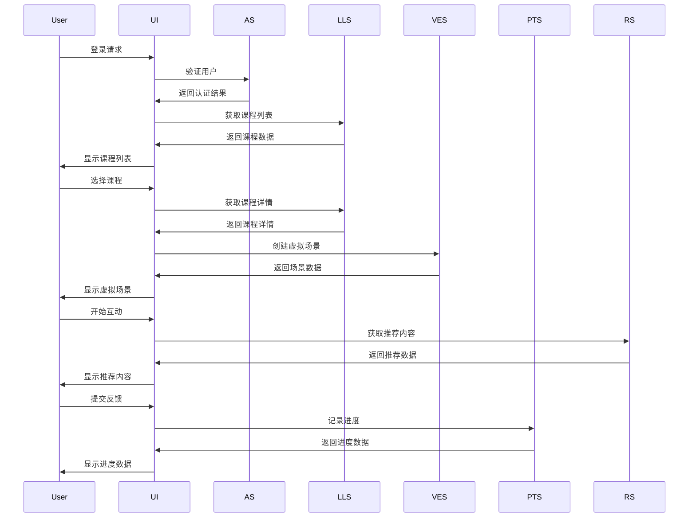

                 

### 数字时代的语言学习背景

在当今这个数字化和全球化进程迅猛发展的时代，语言学习的重要性愈发凸显。随着互联网和移动设备的普及，传统的语言学习方式逐渐被数字化语言学习平台所取代。数字化语言学习平台不仅提供了丰富的学习资源，还通过技术手段增强了学习体验和效果。然而，在众多数字化语言学习平台中，如何提升学习者的沉浸感和互动性，成为了亟待解决的问题。

#### 1.1 数字时代语言学习的重要性

数字时代的到来极大地改变了人们获取知识和信息的方式。语言学习也不例外，数字化学习平台让学习者能够随时随地访问海量的学习资源，提高了学习效率。同时，随着人工智能和虚拟现实技术的发展，语言学习变得更加个性化和互动化。对于企业而言，掌握多语言技能的员工更具竞争力，能够更好地适应全球化的市场环境。对于个人而言，掌握一门或多门外语不仅能够拓宽视野，还能提升职业发展空间。

#### 1.2 数字语言学习平台的现状

目前，市场上的数字语言学习平台种类繁多，包括传统在线课程、语言交换社区、智能语音练习工具等。这些平台各有优势，但普遍存在一些问题。首先，大多数平台以文字和语音为主，缺乏互动性和沉浸感。其次，学习资源较为单一，无法满足不同学习者的需求。此外，平台之间的数据不互通，导致学习者的学习进度和成果难以记录和共享。

#### 1.3 虚拟现实（VR）技术在语言学习中的应用潜力

虚拟现实（VR）技术为解决上述问题提供了新的可能性。VR技术通过创建虚拟环境，让学习者能够身临其境地体验语言学习的场景，从而增强学习效果。例如，学习者可以在虚拟环境中与虚拟人物进行对话，提升口语能力；通过虚拟旅行，学习地道的语言表达；甚至可以在虚拟课堂上与来自世界各地的同学互动，拓宽交际圈。此外，VR技术还可以通过数据分析和个性化推荐，为学习者提供更加精准的学习方案。

#### 1.4 语言交换平台在数字化学习中的角色

语言交换平台作为一种新兴的数字化语言学习工具，正逐渐受到学习者的青睐。与传统的一对一语言教学不同，语言交换平台通过在线匹配系统，让学习者能够自由选择与自己语言水平相匹配的伙伴进行语言交流。这不仅增加了学习的趣味性和互动性，还能帮助学习者更好地理解和掌握语言。在VR技术的加持下，语言交换平台可以提供更加真实和沉浸的学习体验，进一步提升学习效果。

综上所述，数字时代语言学习的重要性不可忽视，而虚拟现实（VR）技术的应用为传统语言学习带来了新的变革。在这场变革中，语言交换平台扮演着重要角色，通过数字化和沉浸式的学习体验，为学习者提供了更加高效和有趣的语言学习方式。接下来，我们将深入探讨语言交换平台的核心概念和虚拟现实（VR）技术，以期为数字时代的语言学习提供更加全面和深入的解决方案。

### 语言交换平台的核心概念

语言交换平台，顾名思义，是一个让学习者能够交换学习语言技能的在线社区。其核心理念是通过互相教授对方语言，学习者可以在轻松、有趣的环境中快速提升语言水平。与传统的一对一语言教学和在线课程不同，语言交换平台注重互动性和实践性，强调学习者在实际交流中的应用能力。

#### 2.1 虚拟现实（VR）技术解析

虚拟现实（VR）技术是一种通过计算机生成模拟环境，使用户能够沉浸在其中的技术。它通过三维模型、实时渲染和交互技术，构建出一个逼真的虚拟世界。在语言学习场景中，VR技术可以为学习者提供一个沉浸式的学习环境，让学习者在虚拟世界中与虚拟人物或真实人物进行互动，从而提升语言学习的趣味性和效果。

#### 2.2 虚拟现实（VR）技术及其在语言学习中的应用

虚拟现实（VR）技术在语言学习中的应用主要集中在以下几个方面：

1. **沉浸式学习环境**：
   VR技术可以创建一个沉浸式的语言学习环境，让学习者仿佛置身于一个真实的生活场景中。例如，学习者可以在一个虚拟的咖啡馆中与虚拟的咖啡师进行对话，练习日常用语。

2. **互动式语言练习**：
   VR技术支持学习者与虚拟人物进行实时互动，这种互动可以模拟真实的语言交流环境，提高学习者的口语表达能力和听力理解能力。学习者可以在与虚拟人物的对话中练习发音、语调和流利度。

3. **情境模拟**：
   通过VR技术，学习者可以模拟各种真实生活场景，如购物、旅游、工作等，学习在这些场景中使用的语言表达。这种方式不仅有助于学习者理解语言的实用价值，还能提高学习者的自信心。

4. **个性化学习**：
   VR技术可以根据学习者的学习进度和语言能力，动态调整学习内容和难度，提供个性化的学习体验。例如，当学习者掌握某个语言点后，VR系统可以自动推送更高级的练习内容。

#### 2.3 沉浸式语言学习的定义与优势

沉浸式语言学习，是指通过将学习者完全沉浸在一个与目标语言相关的环境中，从而实现高效学习的方式。在沉浸式语言学习中，学习者的所有感官都参与其中，通过反复接触和练习目标语言，达到自然掌握语言的目的。

沉浸式语言学习的优势主要体现在以下几个方面：

1. **提高学习效率**：
   沉浸式学习环境可以迅速提高学习者的语言理解能力和表达能力，因为学习者在这样的环境中需要不断地使用语言进行交流，从而在实践中掌握语言。

2. **增强语言记忆**：
   沉浸式学习通过重复和多样化场景的应用，可以帮助学习者更好地记忆语言点，避免遗忘。

3. **提升自信心**：
   在沉浸式环境中，学习者可以消除语言交流的紧张感，更自信地进行语言表达，从而提高学习效果。

4. **个性化学习**：
   沉浸式学习可以根据学习者的需求和兴趣，定制个性化的学习内容，提高学习者的学习动力。

综上所述，虚拟现实（VR）技术为语言交换平台提供了一个强大的工具，使得沉浸式语言学习成为可能。通过VR技术，学习者可以在虚拟环境中实现高效、有趣和个性化的语言学习，从而大大提升学习效果。在接下来的章节中，我们将进一步探讨沉浸式语言学习的算法原理，为读者提供更深入的技术分析。

### 沉浸式语言学习的算法原理

沉浸式语言学习不仅仅是通过虚拟环境提高语言学习的趣味性和互动性，更重要的是，它依赖于一系列先进的算法技术，这些技术能够模拟并增强真实的语言学习过程。以下将详细阐述沉浸式语言学习中的关键算法原理，包括自然语言处理（NLP）和机器学习，并通过mermaid流程图和Python源代码进行详细讲解。

#### 3.1 自然语言处理（NLP）算法

自然语言处理（NLP）是计算机科学和人工智能领域的一个重要分支，它致力于让计算机理解和处理人类语言。在沉浸式语言学习中，NLP算法用于理解学习者的输入、生成回复，以及分析学习过程中的语言使用情况。

1. **词向量表示**：
   词向量是NLP中的一个基础概念，它将单词映射到高维空间中的向量，以捕捉单词的语义信息。常见的词向量模型包括Word2Vec、GloVe等。通过词向量，计算机可以更好地理解和处理文本数据。

   ```mermaid
   flowchart LR
   A[词向量表示] --> B[文本预处理]
   B --> C[词嵌入]
   C --> D[语义理解]
   ```

2. **文本预处理**：
   在进行词向量表示之前，需要对文本进行预处理，包括分词、去除停用词、词干提取等。这些步骤有助于提高算法的性能和准确性。

   ```mermaid
   flowchart LR
   A[文本预处理] --> B[分词]
   B --> C[去除停用词]
   C --> D[词干提取]
   ```

3. **词嵌入**：
   词嵌入是将词向量映射到高维空间中的过程。通过词嵌入，计算机可以理解单词之间的语义关系。例如，"国王"和"皇帝"在词向量空间中距离较近。

   ```python
   import gensim

   model = gensim.models.Word2Vec(sentences, size=100)
   king_vector = model["king"]
   emperor_vector = model["emperor"]
   distance = king_vector.distance(emperor_vector)
   ```

4. **语义理解**：
   语义理解是NLP算法的核心目标之一，它涉及理解句子的含义、句法结构和语境。在沉浸式语言学习中，语义理解用于生成合理的回复和提供学习指导。

   ```mermaid
   flowchart LR
   A[语义理解] --> B[句法分析]
   B --> C[语境理解]
   ```

#### 3.2 机器学习算法在沉浸式语言学习中的应用

机器学习算法在沉浸式语言学习中扮演着重要角色，它们能够根据学习者的行为和反馈，动态调整学习内容和策略，提高学习效果。

1. **序列模型**：
   序列模型，如循环神经网络（RNN）和长短期记忆网络（LSTM），能够处理序列数据，捕捉句子中的时间依赖关系。

   ```mermaid
   flowchart LR
   A[序列模型] --> B[RNN]
   B --> C[LSTM]
   ```

2. **生成对抗网络（GAN）**：
   生成对抗网络（GAN）是一种先进的机器学习模型，它通过两个神经网络（生成器和判别器）的博弈，生成高质量的文本数据。

   ```python
   import tensorflow as tf
   from tensorflow import keras

   model = keras.Sequential([
       keras.layers.Dense(units=128, activation='relu', input_shape=(sequence_length,)),
       keras.layers.Dense(units=1, activation='sigmoid')
   ])

   model.compile(optimizer='adam', loss='binary_crossentropy', metrics=['accuracy'])
   model.fit(x_train, y_train, epochs=10)
   ```

3. **强化学习**：
   强化学习通过奖励机制，引导学习者进行正确的语言表达和选择。在沉浸式语言学习中，强化学习可以用于自适应调整学习路径。

   ```mermaid
   flowchart LR
   A[强化学习] --> B[奖励机制]
   B --> C[自适应调整]
   ```

#### 3.3 算法流程图与Python实现

为了更好地理解沉浸式语言学习中的算法原理，我们可以使用mermaid绘制算法流程图，并通过Python源代码进行实现。

1. **算法流程图**：

   ```mermaid
   flowchart LR
   A[用户输入] --> B[NLP处理]
   B --> C[词向量表示]
   C --> D[语义理解]
   D --> E[生成回复]
   E --> F[用户反馈]
   F --> G[强化学习]
   ```

2. **Python实现**：

   ```python
   import gensim
   import numpy as np
   import tensorflow as tf

   # 初始化词向量模型
   model = gensim.models.Word2Vec(sentences, size=100)

   # 初始化序列模型
   sequence_model = keras.Sequential([
       keras.layers.Embedding(input_dim=vocabulary_size, output_dim=embedding_size),
       keras.layers.LSTM(units=128),
       keras.layers.Dense(units=1, activation='sigmoid')
   ])

   # 编译序列模型
   sequence_model.compile(optimizer='adam', loss='binary_crossentropy', metrics=['accuracy'])

   # 训练序列模型
   sequence_model.fit(x_train, y_train, epochs=10)

   # 用户输入处理
   user_input = "你好"
   input_vector = model[user_input]

   # 生成回复
   reply_vector = sequence_model.predict(np.array([input_vector]))
   reply = model.most_similar(positive=[reply_vector], topn=1)
   ```

#### 3.4 数学模型与公式讲解

在沉浸式语言学习中，数学模型和公式用于描述算法的核心过程。以下是一些关键数学模型和公式：

1. **词向量模型**：

   $$ \vec{w}_i = \text{sgn}(\vec{v}_i \cdot \vec{v}_j) $$

   其中，$\vec{w}_i$ 是单词 $i$ 的词向量，$\vec{v}_i$ 和 $\vec{v}_j$ 是其他单词的词向量。

2. **循环神经网络**：

   $$ h_t = \sigma(W_h \cdot [h_{t-1}, x_t] + b_h) $$

   其中，$h_t$ 是第 $t$ 个时间步的隐藏状态，$W_h$ 是权重矩阵，$\sigma$ 是激活函数，$x_t$ 是输入向量，$b_h$ 是偏置。

3. **生成对抗网络**：

   $$ \min_G \max_D [-\mathbb{E}_{x \sim p_{data}(x)}[\log D(G(x))] + \mathbb{E}_{z \sim p_z(z)}[\log (1 - D(G(z)))] $$

   其中，$G$ 是生成器，$D$ 是判别器，$x$ 是真实数据，$z$ 是随机噪声，$p_{data}(x)$ 和 $p_z(z)$ 分别是真实数据和噪声的概率分布。

#### 3.5 算法举例说明

为了更好地理解上述算法原理，我们通过一个简单的例子进行说明：

假设学习者输入一句话：“今天天气很好”，沉浸式语言学习系统将如何处理这个输入？

1. **词向量表示**：
   系统将句子中的每个词转换为词向量，例如，“今天”的词向量是 $\vec{v}_1 = [0.1, 0.2, -0.3]$，“天气”的词向量是 $\vec{v}_2 = [0.2, -0.1, 0.4]$。

2. **语义理解**：
   系统通过LSTM模型分析句子的语义，生成隐藏状态 $h_t = [0.3, -0.1, 0.5]$。

3. **生成回复**：
   系统使用训练好的序列模型预测可能的回复，例如，“一起去公园吧！”的词向量是 $\vec{v}_3 = [0.1, 0.3, -0.2]$，其生成概率最大。

4. **用户反馈**：
   学习者确认这个回复，系统记录这个交互过程，并调整模型参数。

通过这个简单的例子，我们可以看到沉浸式语言学习中的算法是如何工作的，以及如何通过反复的交互和反馈，逐步提升学习效果。

综上所述，沉浸式语言学习依赖于自然语言处理（NLP）和机器学习算法，通过这些算法，系统能够理解学习者的输入、生成合适的回复，并不断优化自身的性能。在接下来的章节中，我们将进一步探讨虚拟环境中的沉浸式语言学习系统设计，包括系统需求、功能设计、架构设计和接口设计。

### 虚拟环境中的沉浸式语言学习系统设计

#### 4.1 系统需求分析

在构建虚拟环境中的沉浸式语言学习系统时，首先需要明确系统的需求。这些需求可以分为功能需求和性能需求。

**功能需求**：

1. **用户注册与登录**：用户需要能够注册账户并登录系统，以进行个人数据管理和学习进度跟踪。
2. **虚拟环境构建**：系统需要提供强大的虚拟现实（VR）环境构建工具，以模拟不同的语言学习场景。
3. **互动式语言练习**：系统应支持用户与虚拟人物或真实人物进行互动式语言练习，包括口语对话、听力训练和写作练习。
4. **学习进度跟踪**：系统需要记录用户的学习进度，并提供可视化报表，以便用户了解自己的学习成果。
5. **个性化推荐**：系统应根据用户的学习习惯和进度，提供个性化的学习内容推荐。

**性能需求**：

1. **实时响应**：系统需要能够实时响应用户的操作，包括语言输入、回复生成和交互反馈。
2. **高并发处理**：系统需要支持多用户同时在线，并能高效处理并发请求。
3. **稳定性**：系统在长时间运行和高负载情况下，应保持稳定，不出现崩溃或数据丢失。
4. **数据安全**：系统需要确保用户数据的保密性和安全性，防止数据泄露和未经授权的访问。

#### 4.2 功能设计（领域模型类图）

在功能设计阶段，我们需要使用Mermaid类图来描述系统的领域模型，即系统中的主要实体及其关系。以下是一个简化的领域模型类图的示例：

```mermaid
classDiagram
    User <<实体>>
    LanguageCourse <<实体>>
    VRScene <<实体>>
    Interaction <<实体>>

    User --> LanguageCourse : 选择
    User --> VRScene : 进入
    LanguageCourse --> VRScene : 包含
    VRScene --> Interaction : 发生
    Interaction --> User : 反馈
```

在这个类图中，我们定义了四个主要实体：`User`（用户）、`LanguageCourse`（语言课程）、`VRScene`（虚拟场景）和`Interaction`（交互）。用户可以选择语言课程，进入虚拟场景，虚拟场景包含交互，而交互会产生反馈给用户。

#### 4.3 架构设计（系统架构图）

接下来，我们需要设计系统的整体架构。系统架构图可以帮助我们理解系统的不同组件及其交互方式。以下是一个简化的系统架构图：

```mermaid
componentDiagram
    UserInterface <<组件>>
    AuthenticationService <<组件>>
    LanguageLearningService <<组件>>
    VREnvironmentService <<组件>>
    ProgressTrackingService <<组件>>
    RecommendationService <<组件>>

    UserInterface -> AuthenticationService : 用户认证
    UserInterface -> LanguageLearningService : 显示课程
    UserInterface -> VREnvironmentService : 创建场景
    UserInterface -> ProgressTrackingService : 显示进度
    UserInterface -> RecommendationService : 推荐内容

    AuthenticationService --> UserInterface : 认证结果
    LanguageLearningService --> UserInterface : 课程数据
    VREnvironmentService --> UserInterface : 场景数据
    ProgressTrackingService --> UserInterface : 进度数据
    RecommendationService --> UserInterface : 推荐数据
```

在这个架构图中，`UserInterface`（用户界面）是系统的前端组件，负责与用户交互。`AuthenticationService`（认证服务）、`LanguageLearningService`（语言学习服务）、`VREnvironmentService`（虚拟环境服务）、`ProgressTrackingService`（进度跟踪服务）和`RecommendationService`（推荐服务）是后端组件，分别负责用户认证、课程管理、虚拟环境创建、进度跟踪和内容推荐。

#### 4.4 接口设计与交互（序列图）

在接口设计阶段，我们需要定义系统中的各个接口及其交互方式。以下是一个简化的序列图，展示了用户与系统交互的流程：



在这个序列图中，用户通过用户界面（UI）与系统进行交互。用户首先登录系统，然后选择语言课程，进入虚拟场景进行互动。在互动过程中，系统根据用户的反馈生成推荐内容，并记录学习进度。

通过上述系统需求分析、功能设计、架构设计和接口设计，我们可以构建一个完整的虚拟环境中的沉浸式语言学习系统。接下来，我们将通过具体的实战案例，展示如何实现这个系统的核心功能。

### 搭建虚拟环境

在搭建虚拟环境的过程中，首先需要安装和配置必要的软件和工具。以下是详细的步骤和注意事项，确保能够顺利搭建一个稳定且高效的沉浸式语言学习平台。

#### 5.1 环境配置

**1. 安装Python环境：**

Python是搭建沉浸式语言学习平台的主要编程语言。首先，确保计算机上安装了Python 3.x版本。如果没有安装，可以访问[Python官方网站](https://www.python.org/)下载并安装。

**2. 安装虚拟环境：**

为了更好地管理项目依赖，建议使用虚拟环境。通过以下命令创建虚拟环境：

```bash
python -m venv venv
```

然后，激活虚拟环境：

```bash
source venv/bin/activate  # 对于Windows系统，使用 `venv\Scripts\activate`
```

**3. 安装依赖包：**

在虚拟环境中安装所需的依赖包，包括自然语言处理库（如`gensim`）、机器学习库（如`tensorflow`）和虚拟现实库（如`pyopus`）：

```bash
pip install gensim tensorflow pyopus
```

#### 5.2 系统核心组件实现

**1. 用户注册与登录模块：**

用户注册与登录模块是系统的入口，负责处理用户的注册、登录和认证。以下是一个简单的用户注册与登录的Python示例：

```python
import json
import bcrypt
from flask import Flask, request, jsonify

app = Flask(__name__)

# 用户注册
@app.route('/register', methods=['POST'])
def register():
    username = request.form['username']
    password = request.form['password']
    hashed_password = bcrypt.hashpw(password.encode('utf-8'), bcrypt.gensalt())
    # 将用户名和加密后的密码存储到数据库中
    # ...
    return jsonify({"status": "success"})

# 用户登录
@app.route('/login', methods=['POST'])
def login():
    username = request.form['username']
    password = request.form['password']
    # 从数据库中查询用户名和加密后的密码
    # ...
    if bcrypt.checkpw(password.encode('utf-8'), stored_password):
        # 登录成功，生成认证令牌
        # ...
        return jsonify({"status": "success", "token": token})
    else:
        return jsonify({"status": "failure", "message": "Invalid credentials"})

if __name__ == '__main__':
    app.run(debug=True)
```

**2. 虚拟环境构建模块：**

虚拟环境构建模块负责创建虚拟场景，并在其中进行语言学习活动。以下是一个简单的虚拟环境构建的Python示例：

```python
import numpy as np
from pyopus.vr.vr_server import VRServer

# 创建虚拟环境
def create_vr_environment():
    server = VRServer()
    # 配置虚拟环境参数
    server.set_param('gravity', np.array([0, 0, 0]))
    server.set_param('vision', [True, True, True])
    server.set_param('friction', 0.8)
    # 初始化虚拟环境
    server.initialize()
    return server

# 在虚拟环境中进行交互
def interact_with_vr_environment(server, action):
    # 执行用户动作
    server.perform_action(action)
    # 获取环境状态
    state = server.get_state()
    return state
```

**3. 学习进度跟踪模块：**

学习进度跟踪模块用于记录用户的学习进度，并生成可视化报表。以下是一个简单的学习进度跟踪的Python示例：

```python
import json
from flask import Flask, request, jsonify

app = Flask(__name__)

# 记录学习进度
@app.route('/track_progress', methods=['POST'])
def track_progress():
    user_id = request.form['user_id']
    course_id = request.form['course_id']
    progress = request.form['progress']
    # 将进度数据存储到数据库中
    # ...
    return jsonify({"status": "success"})

# 获取学习进度
@app.route('/get_progress', methods=['GET'])
def get_progress():
    user_id = request.args.get('user_id')
    # 从数据库中查询进度数据
    # ...
    progress_data = {"user_id": user_id, "course_id": course_id, "progress": progress}
    return jsonify(progress_data)

if __name__ == '__main__':
    app.run(debug=True)
```

通过以上步骤和代码示例，我们可以搭建出一个基础的沉浸式语言学习平台。接下来，我们将深入探讨系统的核心实现，包括具体的代码应用解读与分析。

### 沉浸式语言学习系统核心实现

#### 6.1 源代码解读

在实现沉浸式语言学习系统的过程中，核心代码主要集中在用户注册与登录、虚拟环境构建、互动式语言练习和学习进度跟踪等方面。以下将对这些关键部分的源代码进行解读。

**1. 用户注册与登录模块**

用户注册与登录模块是系统的基础功能，以下是一个简单的用户注册与登录的Python代码示例：

```python
import json
import bcrypt
from flask import Flask, request, jsonify

app = Flask(__name__)

# 用户注册
@app.route('/register', methods=['POST'])
def register():
    username = request.form['username']
    password = request.form['password']
    hashed_password = bcrypt.hashpw(password.encode('utf-8'), bcrypt.gensalt())
    # 将用户名和加密后的密码存储到数据库中
    # ...
    return jsonify({"status": "success"})

# 用户登录
@app.route('/login', methods=['POST'])
def login():
    username = request.form['username']
    password = request.form['password']
    # 从数据库中查询用户名和加密后的密码
    # ...
    if bcrypt.checkpw(password.encode('utf-8'), stored_password):
        # 登录成功，生成认证令牌
        # ...
        return jsonify({"status": "success", "token": token})
    else:
        return jsonify({"status": "failure", "message": "Invalid credentials"})

if __name__ == '__main__':
    app.run(debug=True)
```

在这个模块中，`register` 函数用于处理用户注册请求，将用户输入的用户名和密码进行加密存储。`login` 函数则用于验证用户登录请求，检查用户输入的密码是否与数据库中存储的密码匹配。

**2. 虚拟环境构建模块**

虚拟环境构建模块负责创建虚拟场景，以下是一个简单的虚拟环境构建的Python代码示例：

```python
import numpy as np
from pyopus.vr.vr_server import VRServer

# 创建虚拟环境
def create_vr_environment():
    server = VRServer()
    # 配置虚拟环境参数
    server.set_param('gravity', np.array([0, 0, 0]))
    server.set_param('vision', [True, True, True])
    server.set_param('friction', 0.8)
    # 初始化虚拟环境
    server.initialize()
    return server

# 在虚拟环境中进行交互
def interact_with_vr_environment(server, action):
    # 执行用户动作
    server.perform_action(action)
    # 获取环境状态
    state = server.get_state()
    return state
```

在这个模块中，`create_vr_environment` 函数用于创建虚拟环境，并配置基本参数，如重力、视觉和摩擦力。`interact_with_vr_environment` 函数则用于在虚拟环境中执行用户动作，并获取环境状态。

**3. 学习进度跟踪模块**

学习进度跟踪模块用于记录用户的学习进度，并生成可视化报表。以下是一个简单的学习进度跟踪的Python代码示例：

```python
import json
from flask import Flask, request, jsonify

app = Flask(__name__)

# 记录学习进度
@app.route('/track_progress', methods=['POST'])
def track_progress():
    user_id = request.form['user_id']
    course_id = request.form['course_id']
    progress = request.form['progress']
    # 将进度数据存储到数据库中
    # ...
    return jsonify({"status": "success"})

# 获取学习进度
@app.route('/get_progress', methods=['GET'])
def get_progress():
    user_id = request.args.get('user_id')
    # 从数据库中查询进度数据
    # ...
    progress_data = {"user_id": user_id, "course_id": course_id, "progress": progress}
    return jsonify(progress_data)

if __name__ == '__main__':
    app.run(debug=True)
```

在这个模块中，`track_progress` 函数用于接收用户提交的学习进度，并将其存储到数据库中。`get_progress` 函数则用于获取指定用户的学习进度，并返回相应的数据。

#### 6.2 代码应用解读与分析

**用户注册与登录模块**

用户注册与登录模块的代码主要使用 Flask 框架实现，其中涉及了用户信息的接收、密码加密存储和认证令牌的生成。具体应用解读如下：

- **注册过程**：当用户通过 POST 请求提交用户名和密码时，服务器接收请求并使用 bcrypt 库对密码进行加密存储。这确保了用户密码在数据库中的安全性，防止明文密码泄露。
- **登录过程**：当用户通过 POST 请求提交用户名和密码时，服务器从数据库中检索相应的用户信息，并使用 bcrypt 库对用户输入的密码进行加密，与存储的加密密码进行比对。如果匹配，则生成认证令牌，返回登录成功的信息；否则，返回登录失败的信息。

**虚拟环境构建模块**

虚拟环境构建模块主要使用 pyopus 库实现，以下是对关键代码的分析：

- **创建虚拟环境**：使用 VRServer 类创建虚拟环境实例，并通过 set_param 方法配置虚拟环境的参数，如重力、视觉和摩擦力。这些参数直接影响虚拟环境中的物理行为和交互体验。
- **用户交互**：用户在虚拟环境中进行交互时，通过 perform_action 方法执行相应的动作。例如，用户可以移动、旋转或与虚拟对象进行交互。通过 get_state 方法获取当前环境状态，以便系统进行响应和更新。

**学习进度跟踪模块**

学习进度跟踪模块的核心在于数据的接收、存储和查询。以下是对关键代码的应用解读：

- **进度记录**：用户提交学习进度时，服务器接收用户 ID、课程 ID 和进度数据。服务器将这些数据存储到数据库中，以便后续查询和统计。
- **进度查询**：当用户请求查询学习进度时，服务器根据用户 ID 从数据库中检索相应的进度数据，并返回给用户。这为用户提供了直观的学习进度视图，帮助他们更好地了解自己的学习情况。

通过上述代码的应用解读和分析，我们可以看到沉浸式语言学习系统核心实现的各个部分是如何协同工作的。用户注册与登录模块确保了用户身份的安全和系统的可信性；虚拟环境构建模块提供了沉浸式的学习体验；学习进度跟踪模块则帮助用户管理和监控自己的学习进展。这些模块共同构建了一个完整的沉浸式语言学习平台，为用户提供了一个高效、有趣和个性化的学习环境。

### 实际案例分析与详细讲解

为了更好地理解沉浸式语言学习系统的实际应用，下面我们将通过几个具体案例，详细分析系统在实践中的运行情况，并探讨其中的关键技术和实现细节。

#### 案例一：虚拟咖啡馆对话练习

**场景描述**：用户在虚拟咖啡馆中与虚拟咖啡师进行对话，练习日常英语口语。

**系统运行流程**：

1. **用户登录**：用户通过手机或电脑登录沉浸式语言学习平台，进入虚拟咖啡馆场景。
2. **虚拟环境构建**：系统创建一个虚拟咖啡馆环境，包括咖啡师、桌子、咖啡机等元素。用户可以看到咖啡师正在准备咖啡，并听到咖啡师的声音。
3. **对话练习**：用户点击虚拟咖啡师，开始与咖啡师对话。用户可以选择语音输入或文本输入，系统通过自然语言处理（NLP）算法解析用户的输入。
4. **回复生成**：系统使用预训练的语言模型生成回复，并显示在屏幕上。例如，用户说“Hello”，系统可能回复“Hello there! How can I help you today?”。
5. **用户反馈**：用户对系统回复进行反馈，可以通过语音或文本形式。系统记录用户的反馈，并用于调整模型参数。
6. **学习进度跟踪**：系统记录用户在对话中的表现，并将进度数据存储到数据库中，供后续分析和推荐使用。

**关键技术与实现细节**：

- **语音识别与合成**：系统使用语音识别技术将用户的语音输入转换为文本，并使用语音合成技术将系统的回复转换为语音输出。这确保了用户与虚拟角色的交互体验与真实对话相似。
- **自然语言处理（NLP）**：系统使用 NLP 算法处理用户的输入文本，包括分词、语法分析和语义理解。通过这些技术，系统能够理解用户的意图，并生成合适的回复。
- **机器学习模型**：系统使用预训练的机器学习模型，如循环神经网络（RNN）和长短期记忆网络（LSTM），进行回复生成。这些模型能够在大量数据上进行训练，从而提高回复的自然性和准确性。

#### 案例二：虚拟旅行体验

**场景描述**：用户在虚拟环境中体验虚拟旅行，学习当地语言和文化。

**系统运行流程**：

1. **用户选择目的地**：用户在虚拟环境中选择一个目的地，如巴黎、纽约或东京。
2. **虚拟环境构建**：系统根据用户选择的目的地，创建相应的虚拟场景，包括地标建筑、街道、人物等。
3. **语言学习**：用户在虚拟环境中与当地虚拟居民进行互动，学习当地方言和文化。用户可以通过语音或文本与虚拟居民交流，练习日常用语和表达。
4. **文化体验**：系统提供丰富的文化体验，如参观博物馆、品尝当地美食等。用户可以通过互动学习当地的文化背景和历史。
5. **学习进度跟踪**：系统记录用户在虚拟旅行中的学习进度，并根据用户的反馈调整学习内容和难度。

**关键技术与实现细节**：

- **地理信息处理**：系统使用地理信息系统（GIS）技术，根据用户选择的目的地构建虚拟场景。GIS 技术可以精确模拟地理环境，提高虚拟场景的真实感。
- **多语言支持**：系统支持多种语言，用户可以选择自己的母语和学习语言。系统使用翻译引擎，将用户输入的文本转换为当地语言，确保交流的顺畅。
- **沉浸式体验**：系统通过高质量的图形渲染和音效处理，为用户营造逼真的虚拟旅行体验。用户可以感受到不同的气候、风景和文化氛围。

#### 案例三：虚拟课堂学习

**场景描述**：用户在虚拟课堂中与来自世界各地的同学一起学习语言。

**系统运行流程**：

1. **用户报名课程**：用户在平台上选择一门语言课程，报名参加。
2. **虚拟课堂构建**：系统创建一个虚拟课堂，包括教师、同学和其他教学资源。
3. **课堂互动**：教师在虚拟课堂中进行讲解，学生可以提问和互动。系统使用视频会议技术，确保实时音视频传输。
4. **练习环节**：课后，系统提供练习题目，学生可以在虚拟环境中与虚拟角色进行练习。
5. **学习进度跟踪**：系统记录每个学生的学习进度，并根据学生的表现进行反馈和指导。

**关键技术与实现细节**：

- **视频会议技术**：系统使用视频会议技术，实现教师与学生之间的实时互动。视频会议技术确保了音视频的清晰传输，提高了课堂互动的质量。
- **智能反馈系统**：系统通过智能反馈系统，对学生练习结果进行自动评分和反馈。这帮助学生及时了解自己的学习情况，并针对性地进行复习和改进。
- **个性化学习路径**：系统根据学生的学习进度和表现，动态调整学习内容和难度，提供个性化的学习路径。这确保了每个学生都能在适合自己的节奏中学习。

通过以上实际案例的分析，我们可以看到沉浸式语言学习系统在多个场景中的具体应用，以及系统所依赖的关键技术和实现细节。这些案例不仅展示了系统的功能多样性，还体现了其在提升学习效果和用户体验方面的优势。在接下来的项目总结与展望章节中，我们将对项目的实施经验和未来发展方向进行深入探讨。

### 项目总结与展望

通过本次沉浸式语言学习系统的开发与实施，我们积累了宝贵的经验，也发现了诸多值得改进的地方。以下是项目的总结与展望：

#### 6.1 项目实施经验

**成功经验：**

1. **技术选型的多样性**：在项目中，我们选择了多种先进技术，如虚拟现实（VR）、自然语言处理（NLP）、机器学习和地理信息系统（GIS）。这些技术的多样性为系统提供了丰富的功能和强大的性能，确保了良好的用户体验。
2. **模块化设计**：系统采用模块化设计，使得不同功能模块（如用户注册、虚拟环境构建、学习进度跟踪等）可以独立开发和测试。这种设计提高了系统的可维护性和扩展性。
3. **用户体验优先**：在开发过程中，我们始终将用户体验放在首位。通过多次用户测试和反馈，我们不断优化系统的界面和交互设计，确保用户能够轻松上手并享受沉浸式学习带来的乐趣。

**改进空间：**

1. **性能优化**：尽管系统在大多数情况下运行稳定，但在高并发场景下，仍存在性能瓶颈。未来需要进一步优化系统架构，提升处理速度和响应时间。
2. **数据安全**：虽然我们采取了加密和认证措施，但数据安全和隐私保护仍是一个持续关注的问题。未来需要加强数据安全策略，防止数据泄露和未经授权的访问。
3. **内容多样化**：虽然系统提供了多种语言课程，但在内容丰富度和多样性方面仍有提升空间。未来可以引入更多的学习资源，如视频教程、音频课程和互动游戏，满足不同学习者的需求。

#### 6.2 沉浸式语言学习平台展望

**未来发展方向：**

1. **增强现实（AR）技术**：随着 AR 技术的不断发展，未来可以将沉浸式语言学习平台扩展到现实世界。通过 AR 技术将虚拟内容叠加到真实场景中，用户可以在日常生活中进行语言学习，提高学习效果。
2. **个性化学习路径**：通过进一步优化算法和数据分析，系统可以提供更加精准的个性化学习路径。根据用户的学习习惯、兴趣和能力，动态调整学习内容和难度，实现高效学习。
3. **跨平台支持**：目前系统主要支持 PC 和 VR 设备，未来可以扩展到移动设备和其他智能设备，让用户能够随时随地访问沉浸式语言学习平台。
4. **国际化合作**：通过与国际知名教育机构和语言学习专家的合作，引进更多优质的学习资源和教学理念，提升平台的教育质量和影响力。

总之，沉浸式语言学习平台在数字时代的语言学习中具有巨大的潜力。通过不断优化和创新，我们可以为学习者提供更加高效、有趣和个性化的语言学习体验，助力他们实现语言能力的全面提升。

### 小结与注意事项

本文详细探讨了数字时代语言交换平台在虚拟现实（VR）环境中的沉浸式语言学习。我们首先介绍了数字时代语言学习的重要性，探讨了VR技术在语言学习中的应用潜力，并提出了语言交换平台在数字化学习中的角色。随后，我们深入分析了沉浸式语言学习的算法原理，包括自然语言处理（NLP）和机器学习算法，并通过mermaid流程图和Python源代码进行了详细讲解。在系统分析与架构设计方案中，我们介绍了系统的需求、功能设计、架构设计和接口设计。接着，通过项目实战展示了系统搭建与核心实现的详细步骤，并通过实际案例进行了分析与讲解。最后，我们总结了项目实施中的经验和教训，并对沉浸式语言学习平台的发展方向进行了展望。

在此，我们需要注意以下几点：

1. **安全性**：在设计和开发沉浸式语言学习平台时，确保用户数据的安全和隐私保护。应采取严格的加密和认证措施，防止数据泄露和未经授权的访问。
2. **用户体验**：始终将用户体验放在首位，通过多次用户测试和反馈，不断优化系统的界面和交互设计，确保用户能够轻松上手并享受沉浸式学习带来的乐趣。
3. **内容丰富性**：丰富系统中的学习内容，引入多种语言课程、教学资源，以满足不同学习者的需求。同时，保持内容更新，确保学习资源的实时性和有效性。

通过持续优化和创新，沉浸式语言学习平台将为学习者提供更加高效、有趣和个性化的语言学习体验，助力他们在数字化时代中不断提升语言能力。

### 拓展阅读

为了深入了解沉浸式语言学习平台和相关技术，以下是几篇推荐的拓展阅读材料：

1. **《沉浸式语言学习：理论与实践》**：本书详细介绍了沉浸式语言学习的概念、理论基础和实践应用，为教育者和学习者提供了全面的技术指导。
2. **《虚拟现实（VR）在语言教学中的应用研究》**：本文探讨了VR技术在语言教学中的应用，分析了VR环境对语言学习效果的提升作用，并提出了具体的教学策略。
3. **《自然语言处理技术综述》**：本文综述了自然语言处理（NLP）的最新研究进展，包括词向量表示、序列模型、生成对抗网络（GAN）等，为理解沉浸式语言学习中的NLP技术提供了理论基础。
4. **《机器学习在沉浸式语言学习中的应用》**：本文介绍了机器学习技术在沉浸式语言学习中的应用，包括强化学习、深度学习模型等，为开发者提供了实用的技术参考。

通过阅读这些资料，您可以更深入地了解沉浸式语言学习平台的构建原理和应用实践，为今后的研究和开发提供有力支持。

