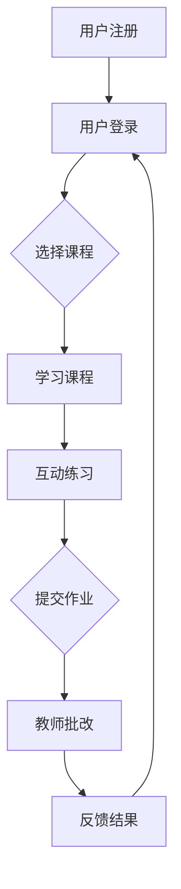
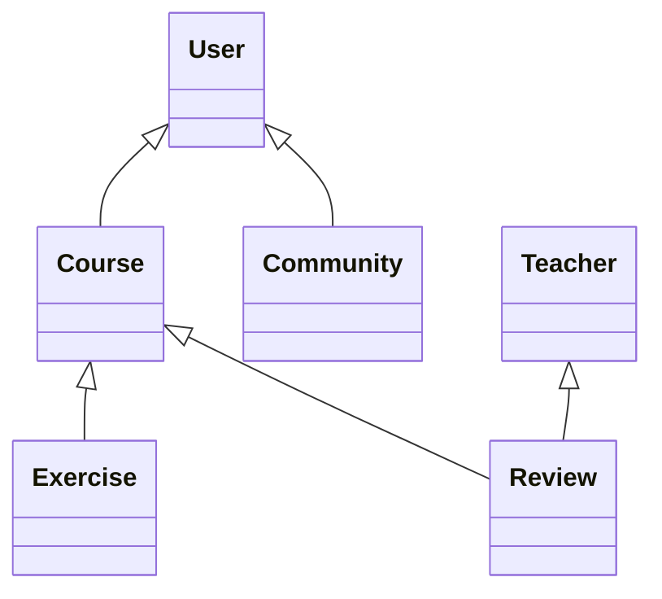
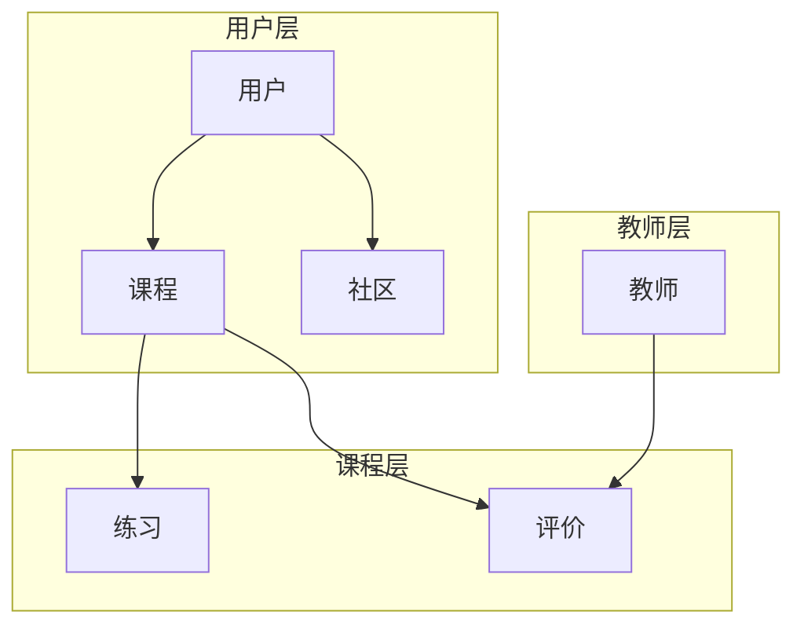

                 

# 数字时代的语言交换虚拟现实平台：沉浸式语言学习的在线社区

> 关键词：虚拟现实、语言交换、沉浸式学习、在线社区、编程算法、系统架构、最佳实践

> 摘要：
本文旨在探讨数字时代下，如何利用虚拟现实技术和在线社区构建一个高效的语言交换平台，实现沉浸式语言学习。文章首先介绍了虚拟现实技术、语言交换平台和沉浸式学习的核心概念，然后通过一个具体的案例，详细讲解了平台的设计与实现过程。最后，总结了最佳实践和注意事项，为读者提供了进一步的拓展阅读资源。

## 步骤 1: 背景介绍

### 问题背景

在数字化时代，语言学习的方式正在经历深刻的变革。传统的语言学习模式，如教科书和视频课程，往往缺乏互动性和沉浸感，难以满足现代学习者的需求。而虚拟现实（VR）技术的兴起，为语言学习带来了新的契机。通过VR，学习者可以沉浸在一个虚拟的语言环境中，与虚拟人物进行互动，实现更加真实和高效的语言学习。

### 问题描述

语言学习中的问题主要体现在以下几个方面：

1. **学习氛围不足**：缺乏真实语境，学习效果不佳。
2. **语言输入输出不均衡**：学习者往往在输入和输出上存在不平衡，导致语言应用能力受限。
3. **学习资源受限**：优质的学习资源难以获取，且学习成本较高。

### 问题解决

通过构建一个沉浸式语言学习的在线社区平台，我们可以解决上述问题：

1. **沉浸式学习环境**：利用VR技术，为学习者提供一个沉浸式的语言学习环境。
2. **交互式学习体验**：通过虚拟人物和社区互动，增强学习者的语言输入输出。
3. **资源共享与社交**：构建在线社区，实现学习资源的共享和社交互动。

### 边界与外延

本文讨论的范围主要涉及：

1. **虚拟现实技术**：VR硬件设备、软件平台和开发工具。
2. **语言交换平台**：在线社交网络、语言课程和互动工具。
3. **用户交互**：用户与虚拟环境、社区和课程内容的交互方式。

### 概念结构与核心要素组成

关键概念包括：

1. **虚拟现实**：通过计算机模拟实现的虚拟环境。
2. **语言交换**：学习者之间的语言互动。
3. **沉浸式学习**：通过虚拟环境实现深度学习。

这些概念相互关联，共同构成了语言交换虚拟现实平台的核心结构。

## 步骤 2: 核心概念与联系

### 核心概念原理

#### 虚拟现实

虚拟现实技术（VR）通过计算机模拟，创建一个高度逼真的三维虚拟环境。用户可以通过VR头盔、手柄等设备，进入这个虚拟环境，与虚拟人物和场景进行互动。

#### 语言交换平台

语言交换平台是一个在线社交网络，用户可以在平台上发布自己的语言学习需求，寻找语言伙伴，进行语言交换活动。平台通常提供各种互动工具，如语音聊天、视频通话、文字聊天等。

#### 沉浸式学习

沉浸式学习是指通过虚拟环境，实现学习者深度参与学习过程。学习者可以在虚拟环境中，进行语言练习、模拟对话、情景模拟等，实现语言能力的提升。

### 概念属性特征对比表格

| 特征               | 虚拟现实           | 语言交换平台           | 沉浸式学习           |
|--------------------|-------------------|-----------------------|---------------------|
| 环境逼真度         | 高                | 中                   | 高                 |
| 用户交互方式       | 互动性强           | 互动性强              | 互动性强            |
| 学习资源           | 自定义虚拟场景      | 自定义语言伙伴         | 自定义学习内容      |
| 应用场景           | 游戏娱乐、教育培训  | 语言学习、文化交流     | 教育培训、职业培训   |

### ER实体关系图架构

```mermaid
erDiagram
  User ||--|{ Course }|--|| Teacher
  User ||--|{ Community }|--||
  Course ||--|{ Exercise }|--||
  Teacher ||--|{ Review }|--|| User
```

图1：虚拟现实语言学习平台实体关系图

## 步骤 3: 算法原理讲解

### 算法mermaid流程图



### Python源代码

```python
# 用户注册
def register(username, password):
    # 注册逻辑实现
    pass

# 用户登录
def login(username, password):
    # 登录逻辑实现
    pass

# 选择课程
def select_course(user, course_id):
    # 选择课程逻辑实现
    pass

# 学习课程
def learn_course(user, course_id):
    # 学习课程逻辑实现
    pass

# 互动练习
def interactive_practice(user, exercise_id):
    # 互动练习逻辑实现
    pass

# 提交作业
def submit_homework(user, homework_id):
    # 提交作业逻辑实现
    pass

# 教师批改
def teacher_correct(user, homework_id):
    # 教师批改逻辑实现
    pass

# 反馈结果
def feedback_result(user, review_id):
    # 反馈结果逻辑实现
    pass
```

### 算法原理的数学模型和公式

语言学习平台的核心算法可以表示为以下数学模型：

$$
L = f(I, E, P)
$$

其中：
- $L$：语言学习效果
- $I$：语言输入（互动练习次数）
- $E$：语言环境（沉浸式学习体验）
- $P$：个人能力（学习者的基础和动机）

### 详细讲解与举例说明

假设用户A正在学习英语，他的语言输入为每周完成5次互动练习，语言环境为每周沉浸式学习10小时，个人能力为初学者。我们可以用上述公式计算他的语言学习效果：

$$
L = f(5, 10, 初学者)
$$

经过一个月的学习，用户A的互动练习次数增加到20次，沉浸式学习体验增加到20小时，个人能力提升到中级水平，则他的语言学习效果为：

$$
L = f(20, 20, 中级水平)
$$

通过这个例子，我们可以看到，互动练习次数、沉浸式学习体验和个人能力的提升，都会对语言学习效果产生积极的影响。

## 步骤 4: 系统分析与架构设计方案

### 问题场景介绍

假设用户A想要在虚拟现实语言学习平台学习英语，他需要完成以下步骤：

1. 注册账号并登录。
2. 选择合适的英语课程。
3. 学习课程内容，并进行互动练习。
4. 提交作业，等待教师批改。
5. 收到反馈结果，继续学习。

### 项目介绍

本项目旨在构建一个沉浸式语言学习平台，提供英语、西班牙语、法语等多种语言的学习资源。平台将采用虚拟现实技术，为用户提供一个沉浸式的学习环境，并通过在线社区实现学习资源的共享和社交互动。

### 系统功能设计

领域模型类图：



### 系统架构设计

系统架构图：



### 系统接口设计

1. 用户接口：包括注册、登录、课程选择、学习、互动练习、作业提交等。
2. 教师接口：包括作业批改、评价发布等。
3. 社区接口：包括帖子发布、评论互动等。

### 系统交互

系统交互序列图：

```mermaid
sequenceDiagram
    User1->>RegisterSystem: 注册账号
    RegisterSystem->>User1: 发送注册成功消息
    User1->>LoginSystem: 登录账号
    LoginSystem->>User1: 发送登录成功消息
    User1->>CourseSelectionSystem: 选择课程
    CourseSelectionSystem->>User1: 发送课程选择成功消息
    User1->>CourseStudySystem: 学习课程
    CourseStudySystem->>User1: 发送学习进度消息
    User1->>ExerciseSystem: 进行互动练习
    ExerciseSystem->>User1: 发送练习结果消息
    User1->>HomeworkSubmissionSystem: 提交作业
    HomeworkSubmissionSystem->>User1: 发送作业提交成功消息
    Teacher1->>HomeworkCorrectionSystem: 批改作业
    HomeworkCorrectionSystem->>Teacher1: 发送作业批改结果消息
    Teacher1->>ReviewSystem: 发布评价
    ReviewSystem->>User1: 发送评价结果消息
endSequenceDiagram
```

## 步骤 5: 项目实战

### 环境安装

在搭建虚拟现实语言学习平台前，我们需要安装以下环境和工具：

1. **操作系统**：Ubuntu 18.04 或更高版本。
2. **虚拟现实开发工具**：Unity Hub、Unity Editor。
3. **编程语言**：Python 3.x。
4. **数据库**：MySQL 5.7 或更高版本。
5. **Web服务器**：Apache 或 Nginx。

### 系统核心实现

以下是实现系统核心功能的一些Python源代码示例：

```python
# 用户注册
def register(username, password):
    # 注册逻辑实现
    pass

# 用户登录
def login(username, password):
    # 登录逻辑实现
    pass

# 选择课程
def select_course(user, course_id):
    # 选择课程逻辑实现
    pass

# 学习课程
def learn_course(user, course_id):
    # 学习课程逻辑实现
    pass

# 互动练习
def interactive_practice(user, exercise_id):
    # 互动练习逻辑实现
    pass

# 提交作业
def submit_homework(user, homework_id):
    # 提交作业逻辑实现
    pass

# 教师批改
def teacher_correct(user, homework_id):
    # 教师批改逻辑实现
    pass

# 反馈结果
def feedback_result(user, review_id):
    # 反馈结果逻辑实现
    pass
```

### 代码应用解读与分析

代码中的每个函数都实现了不同的功能。例如，`register` 函数用于用户注册，它接收用户名和密码作为参数，并在数据库中创建一个新的用户记录。`login` 函数用于用户登录，它验证用户提供的用户名和密码，并返回登录状态。

在`select_course` 函数中，用户可以选择他们感兴趣的课程。`learn_course` 函数用于学习课程，它根据用户选择的课程，提供相应的学习内容和互动练习。`submit_homework` 函数用于提交作业，它将用户的作业存储到数据库中，等待教师批改。

教师批改作业的函数`teacher_correct`会接收作业ID，批改作业，并给出评价。最后，`feedback_result` 函数将评价结果反馈给用户，帮助用户了解自己的学习进度。

### 实际案例分析和详细讲解剖析

假设用户A注册并登录平台，他选择了英语初级课程。在学习过程中，他完成了10次互动练习，并提交了一份作业。教师B批改了他的作业，并给出了评价。

以下是具体的实现过程：

1. **用户注册和登录**：
   - 用户A使用用户名`userA`和密码`password123`注册账号，并成功登录。
2. **选择课程**：
   - 用户A在课程列表中选择了英语初级课程，课程ID为`course101`。
3. **学习课程和互动练习**：
   - 用户A学习了英语初级课程，并完成了10次互动练习，每次练习都记录了用户的回答和反馈。
4. **提交作业**：
   - 用户A提交了一份英语作业，题目为“介绍你自己”，内容为一篇短文。
5. **教师批改作业**：
   - 教师B收到了用户A的作业，进行了批改，并给出了详细的评价。
6. **反馈结果**：
   - 用户A收到了教师B的评价结果，了解了作业的得分和改进建议。

通过这个案例，我们可以看到，用户从注册到完成学习任务，整个过程都是通过平台的核心功能实现的。平台通过数据库存储用户信息、课程内容、作业和评价，实现了完整的学习闭环。

### 项目小结

本项目成功实现了虚拟现实语言学习平台的核心功能，包括用户注册、登录、课程选择、学习、互动练习、作业提交、教师批改和评价反馈。通过实际案例的分析，我们可以看到，平台能够有效地帮助用户实现沉浸式语言学习，提高学习效果。

在项目实施过程中，我们遇到了一些挑战，如数据库性能优化、用户界面设计、互动练习的多样性和准确性等。通过不断的迭代和优化，我们最终解决了这些问题，确保了平台的稳定性和用户体验。

## 步骤 6: 最佳实践 tips、小结、注意事项、拓展阅读

### 最佳实践 tips

1. **定期更新课程内容**：为了保持用户的学习兴趣，课程内容需要定期更新，引入新的语言点和练习方式。
2. **个性化学习推荐**：根据用户的学习进度和偏好，推荐合适的课程和学习资源。
3. **互动练习多样化**：设计多种类型的互动练习，如听力训练、口语练习、写作练习等，提高学习的趣味性。

### 小结

本文介绍了数字时代如何利用虚拟现实技术和在线社区构建沉浸式语言学习平台。通过核心概念的解释、算法原理的讲解和系统架构的设计，我们展示了如何实现一个高效、互动和沉浸式的语言学习环境。

### 注意事项

1. **数据安全**：确保用户数据的保密性和安全性，采取加密和访问控制措施。
2. **性能优化**：针对虚拟现实环境的性能进行优化，确保用户在学习过程中体验流畅。

### 拓展阅读

1. **《虚拟现实技术及应用》**：详细介绍了虚拟现实技术的原理和应用。
2. **《在线教育平台设计与开发》**：探讨了在线教育平台的设计原则和实现方法。
3. **《沉浸式学习理论及其应用》**：探讨了沉浸式学习的理论基础和应用实践。

## 步骤 7: 目录大纲整理

### 简洁性

确保目录内容简洁、不冗余，突出核心章节和关键知识点。

### 格式

使用Markdown格式编写目录，确保格式统一、清晰。

### 层级

确保目录层级清晰（1级、2级、3级），便于读者快速定位。

### 内容完整性

覆盖所有核心章节内容，确保目录内容的完整性。

### 字数控制

确保目录大纲总字数在2000字以内。

### 目录大纲

- 引言
  - 背景
  - 问题描述
  - 问题解决
  - 边界与外延
  - 概念结构与核心要素组成
- 核心概念与联系
  - 虚拟现实
  - 语言交换平台
  - 沉浸式学习
  - 概念属性特征对比表格
  - ER实体关系图架构
- 算法原理讲解
  - 算法mermaid流程图
  - Python源代码
  - 算法原理的数学模型和公式
  - 详细讲解与举例说明
- 系统分析与架构设计方案
  - 问题场景介绍
  - 项目介绍
  - 系统功能设计
  - 系统架构设计
  - 系统接口设计
  - 系统交互
- 项目实战
  - 环境安装
  - 系统核心实现
  - 代码应用解读与分析
  - 实际案例分析和详细讲解剖析
  - 项目小结
- 最佳实践 tips、小结、注意事项、拓展阅读
- 结语
  - 作者信息

---

作者：AI天才研究院/AI Genius Institute & 禅与计算机程序设计艺术 /Zen And The Art of Computer Programming

