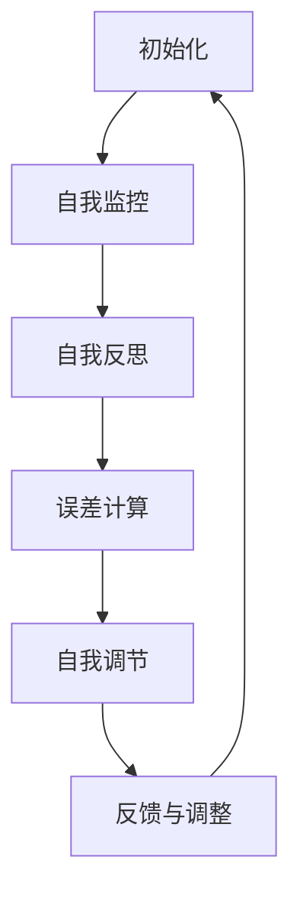
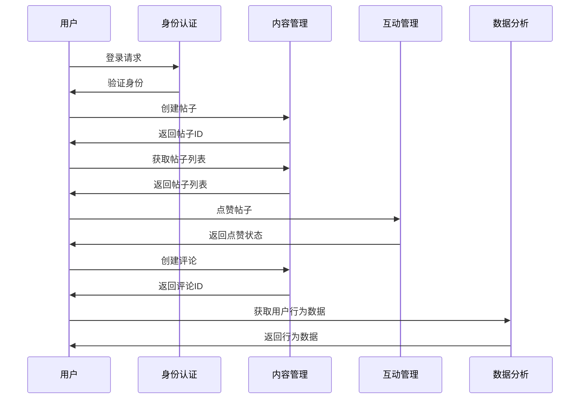

                 

# 《数字时代的身份认同：在线角色与现实自我的平衡》

关键词：数字身份、在线角色、现实自我、平衡、社会互动

摘要：随着互联网和社交媒体的普及，数字世界中的身份认同问题日益凸显。本文将探讨数字时代身份认同的复杂性，分析在线角色与现实自我的关系，并提出实现平衡的策略，以帮助个体在虚拟世界和现实世界中找到自我认同的平衡点。

----------------------------------------------------------------

## 第一部分：背景介绍

### 第1章：问题背景

在互联网和社交媒体的普及下，个体在数字世界中的身份认同问题日益凸显。人们在不同平台和场景下扮演着不同的角色，如何在数字世界和现实世界中保持自我认同的平衡成为一个重要的社会问题。本文将探讨这一问题的背景、核心概念和联系，并分析在线角色与现实自我的比较。

### 第2章：核心概念与联系

在线角色与现实自我的平衡涉及自我认知、社会角色和文化价值观等多个核心概念。自我认知是指个体对自己身份、性格、能力等方面的认识，而社会角色则是指个体在特定社会关系中的地位和作用。文化价值观则对个体的身份认同有重要影响。这些核心概念相互联系，共同构成了身份认同的复杂体系。

## 第二部分：核心概念原理与特性分析

### 第3章：在线角色与现实自我的比较

在线角色与现实自我在社交互动、自我表达、信息传播和安全方面存在显著差异。在线角色具有多样化、匿名性和虚拟性，而现实自我则具有真实性、面对面和直接性。这种差异使得个体在数字世界和现实世界中的行为和表达方式有所不同。

### 第4章：在线角色与现实自我的平衡策略

为了实现在线角色与现实自我的平衡，个体需要采取一系列策略。这些策略包括自我反思、社交智慧和技术保护等。自我反思可以帮助个体更好地认识自己的真实需求和价值观；社交智慧则有助于个体在数字世界和现实世界之间建立有效的沟通和互动；技术保护则有助于个体保护自己的隐私和安全。

## 第三部分：算法原理讲解与数学模型

### 第5章：数字时代身份认同的挑战与机遇

数字时代身份认同面临着隐私保护、网络暴力、信息泛滥等挑战，同时也带来了自我实现、跨文化理解、社交创新等机遇。这些挑战和机遇对个体的身份认同产生了深远的影响。

### 第6章：算法原理与数学模型

为了实现在线角色与现实自我的平衡，我们可以采用一些算法原理和数学模型。这些算法原理包括自我调节模型和社会网络分析等。数学模型则包括误差计算和数据分析等。

### 第7章：算法原理与数学模型的详细讲解

在详细讲解算法原理和数学模型时，我们可以使用 mermaid 流程图和 Python 源代码来展示算法流程和实现细节。同时，我们可以通过通俗易懂的例子来说明这些算法原理和数学模型的应用。

## 第四部分：系统分析与架构设计方案

### 第8章：问题场景介绍

为了更好地理解在线角色与现实自我的平衡问题，我们可以介绍一个具体的问题场景，如社交媒体平台或虚拟现实游戏等。

### 第9章：系统功能设计

在系统功能设计方面，我们可以使用 mermaid 类图来展示系统的领域模型，包括用户、角色、互动等实体及其关系。同时，我们还可以设计系统的架构，包括系统架构图、系统接口设计和系统交互序列图等。

## 第五部分：项目实战

### 第10章：环境安装

在本章中，我们将介绍如何安装所需的环境和工具，以便进行项目实战。

### 第11章：系统核心实现源代码

在本章中，我们将提供系统核心实现的源代码，并对代码进行解读和分析。

### 第12章：实际案例分析和详细讲解剖析

在本章中，我们将分析实际案例，并对案例进行详细讲解和剖析，以展示算法原理和数学模型在数字时代身份认同平衡中的应用。

### 第13章：项目小结

在本章中，我们将对项目进行总结，并对项目中的关键技术和方法进行回顾和讨论。

## 第六部分：最佳实践、小结、注意事项和拓展阅读

### 第14章：最佳实践

在本章中，我们将分享一些最佳实践，以帮助读者更好地实现在线角色与现实自我的平衡。

### 第15章：小结

在本章中，我们将对文章的核心内容进行总结，并强调在线角色与现实自我平衡的重要性。

### 第16章：注意事项

在本章中，我们将提醒读者在实践过程中需要注意的事项，以避免潜在的问题和风险。

### 第17章：拓展阅读

在本章中，我们将推荐一些拓展阅读资源，以帮助读者进一步深入了解数字时代身份认同的相关问题。

## 参考文献

在本章节中，我们将列出本文引用的相关文献和资料，以便读者进一步学习和研究。

----------------------------------------------------------------

**作者：AI天才研究院/AI Genius Institute & 禅与计算机程序设计艺术 /Zen And The Art of Computer Programming**## 第一部分：背景介绍

### 第1章：问题背景

随着互联网和社交媒体的普及，数字世界成为了人们日常生活的重要部分。在这个虚拟的空间中，个体可以扮演不同的角色，表达不同的自我。然而，这种多样性也带来了一个日益凸显的社会问题：如何在数字世界和现实世界中保持自我认同的平衡。

首先，让我们明确一下什么是数字身份。数字身份是指个体在互联网和社交媒体上建立的形象和存在。它可能包括个人的基本信息、兴趣爱好、职业背景等。数字身份的形成和维持，往往伴随着一系列复杂的互动，如社交互动、信息传播和自我表达等。

在数字世界中，个体可以自由选择和塑造自己的角色。这些角色可能包括网友、游戏玩家、职业专家等。每个角色都有其独特的特点和行为模式。例如，一个在游戏中扮演勇士的玩家，可能在现实生活中是一位温和的教师；而一个在社交媒体上活跃的网红，可能在现实生活中是一位默默无闻的办公室职员。

这种角色多样性在带来便利的同时，也引发了一系列身份认同的问题。首先，个体在数字世界中的自我表达可能与现实生活中的自我表达存在差异。这种差异可能会导致自我认知的混乱，甚至产生身份认同危机。其次，数字世界中的人际关系往往具有虚拟性和匿名性，这使得个体难以建立真正的信任和深层次的情感联系。最后，数字身份的构建和维持需要耗费大量的时间和精力，个体可能会在这种过程中迷失自我。

为了解决这些问题，我们需要深入探讨在线角色与现实自我的关系，分析其差异和联系，并寻找实现平衡的策略。本文将围绕这些核心问题展开讨论，旨在为个体在数字世界和现实世界中找到自我认同的平衡点提供一些思考和指导。

### 第2章：核心概念与联系

在线角色与现实自我的平衡涉及到多个核心概念，这些概念相互联系，共同构成了个体身份认同的复杂体系。以下是对这些核心概念的介绍和它们之间的联系分析。

**自我认知**：自我认知是指个体对自己身份、性格、能力和价值观等方面的认识和反思。自我认知是个体在数字世界和现实世界中建立身份认同的基础。在数字时代，个体的自我认知受到了前所未有的挑战。一方面，数字世界提供了丰富的信息和多样的角色选择，使得个体可以在不同平台和场景下塑造多个自我。另一方面，虚拟角色的多样化可能导致个体对自己的真实身份产生疑惑，甚至迷失自我。因此，自我认知在个体身份认同中起到了关键作用，它不仅影响个体在数字世界中的行为和决策，也决定了个体如何平衡在线角色与现实自我。

**社会角色**：社会角色是个体在特定社会关系中的地位和作用。在现实生活中，个体通常扮演着多重社会角色，如家庭成员、职业人、社区成员等。每个角色都有其特定的职责和行为规范。在数字世界，个体同样可以扮演不同的社会角色，如社交媒体上的博主、游戏玩家、虚拟社区的成员等。然而，与现实生活中相比，数字世界的角色往往更加虚拟和多样化。这些角色的多样性既为个体提供了更多自我表达的机会，也可能导致个体在社会角色间产生冲突和困惑。因此，理解和管理社会角色是实现在线角色与现实自我平衡的重要一环。

**文化价值观**：文化价值观是影响个体行为和决策的深层次信念和观念。不同的文化背景下，个体对身份认同的理解和实践可能存在显著差异。例如，在一些文化中，个体的自我认同可能更多地依赖于社会地位和职业成就；而在另一些文化中，个体的自我认同可能更多地依赖于个人价值观和道德准则。在数字时代，跨文化交流的增多使得个体需要面对更加复杂的文化价值观冲突。这些冲突不仅影响个体的自我认知和社会角色，也可能导致身份认同的混乱。因此，文化价值观在个体身份认同中起到了重要的调节作用，它帮助个体在多样化的角色和价值观之间找到平衡。

**自我认知、社会角色和文化价值观之间的联系**：自我认知、社会角色和文化价值观之间存在着密切的联系。自我认知是个体对自己身份和角色的内在理解，它是社会角色和文化价值观的基础。社会角色是个体在特定社会关系中的表现和互动，它反映了个体自我认知的实际情况。而文化价值观则是个体行为和决策的指导原则，它影响个体的自我认知和社会角色。因此，实现在线角色与现实自我的平衡，需要个体在自我认知、社会角色和文化价值观之间找到一种和谐的关系。

在数字时代，个体的身份认同面临着前所未有的挑战。虚拟角色的多样性和匿名性使得个体在数字世界中的行为和表达方式更加复杂。同时，跨文化交流的增多和文化价值观的冲突也使得个体在自我认知和社会角色方面面临更多困惑。为了实现在线角色与现实自我的平衡，个体需要深入反思自己的自我认知，合理管理社会角色，并理解和尊重不同的文化价值观。只有这样，个体才能在数字时代找到自我认同的平衡点，实现真实自我的全面发展和成长。

### 第3章：在线角色与现实自我的比较

在线角色与现实自我在多个方面存在显著差异，这些差异不仅影响个体在数字世界中的行为和决策，也对个体的整体身份认同产生了深远的影响。以下是这些差异的详细比较。

#### 概念属性特征对比表格

为了更好地理解在线角色与现实自我的差异，我们可以通过以下表格进行对比：

| 特征           | 在线角色                                  | 现实自我                                  |
| -------------- | ----------------------------------------- | ----------------------------------------- |
| 社交互动       | 多样化、匿名性、虚拟性                    | 真实、面对面、直接性                      |
| 自我表达       | 自我塑造、形象设计、虚拟展示              | 自然表达、情感真实、真实展示              |
| 信息传播       | 快速、广泛、多样化                        | 缓慢、有限、针对性                        |
| 安全性         | 存在风险，如网络欺诈、隐私泄露            | 较高，受法律保护                          |

#### 社交互动

在线角色与现实自我在社交互动方面存在显著差异。在线角色通常具有多样化和匿名性的特点。个体可以在不同的社交平台上扮演不同的角色，例如在社交媒体上是一个幽默的博主，在游戏社区中是一个热情的游戏玩家。这种多样性使得个体能够展示不同侧面的自我。然而，匿名性也带来了一些问题，如网络欺凌、信息泄露等。在现实生活中，社交互动通常具有真实性和面对面的特点。人们在与他人互动时，能够看到对方的真实表情和身体语言，这种直接的交流有助于建立信任和深入的情感联系。

#### 自我表达

在线角色与现实自我在自我表达方面也有显著差异。在线角色允许个体通过文字、图片、视频等多种形式进行自我塑造和形象设计。这种虚拟展示不仅为个体提供了更多自我表达的机会，也使得自我表达更加多样化。然而，这种形象设计往往需要精心策划和包装，个体可能需要花费大量时间和精力来维护自己的在线形象。相比之下，现实自我表达通常更加自然和真实。个体在现实生活中往往不需要刻意设计自己的形象，而是根据自己的感受和情境自然地表达自己。这种自然表达虽然可能缺乏在线角色那样的多样性和吸引力，但却更加真实和可靠。

#### 信息传播

在线角色与现实自我在信息传播方面也存在明显差异。在线角色的信息传播速度极快，且传播范围广泛。一条消息可以在短时间内被数百甚至数千人看到，这种快速传播有助于信息的广泛传播和快速获取。然而，这种快速传播也带来了一些问题，如信息真实性难以保证、虚假信息传播等。在现实生活中，信息的传播通常较为缓慢和有限。人们需要通过面对面的交流或传统的媒体来获取信息，这种传播方式虽然速度较慢，但信息的准确性和可靠性较高。

#### 安全性

在线角色与现实自我在安全性方面也存在显著差异。在线角色的安全性相对较低，个体容易受到网络欺诈、隐私泄露等风险的威胁。由于网络环境的匿名性和虚拟性，个体在数字世界中的个人信息和行为记录可能被恶意利用，导致财产损失或隐私泄露。相比之下，现实自我在现实生活中的安全性较高，法律和道德规范对个体的行为进行了有效的保护。

综上所述，在线角色与现实自我在社交互动、自我表达、信息传播和安全等方面存在显著差异。这些差异不仅影响了个体在数字世界中的行为和决策，也对个体的整体身份认同产生了深远的影响。理解这些差异并找到实现平衡的策略，对于个体在数字时代维持健康的身份认同至关重要。

### 第4章：在线角色与现实自我的平衡策略

为了实现在线角色与现实自我的平衡，个体可以采取一系列策略。这些策略不仅有助于个体在数字世界中保持真实的自我，还能提升在线社交互动的质量和安全性。

#### 自我反思

自我反思是个体在数字时代实现身份认同平衡的重要步骤。通过深入思考自己的行为和动机，个体可以更好地理解自己的真实需求和价值观。以下是一些自我反思的方法：

1. **定期回顾**：定期回顾自己的在线活动和角色扮演，思考自己的行为是否符合真实的自我。这有助于个体识别和纠正可能的偏差。
2. **日记记录**：记录每日的在线活动和思考过程，将虚拟世界的体验与真实生活联系起来。通过记录，个体可以更清晰地认识到自己在不同角色中的行为模式。
3. **心理辅导**：如果个体在自我反思过程中遇到困难或感到困惑，可以寻求专业心理辅导。心理咨询师可以帮助个体深入分析自己的内心世界，找到平衡的途径。

#### 社交智慧

社交智慧是个体在数字世界中有效互动的关键。通过培养社交智慧，个体可以更好地处理在线社交互动，建立真实而有意义的人际关系。以下是一些提高社交智慧的方法：

1. **主动倾听**：在在线社交中，主动倾听他人的观点和需求，表现出对他人的尊重和关心。这有助于建立信任和深入的情感联系。
2. **情绪管理**：学会管理自己的情绪，避免在网络冲突中做出冲动行为。通过情绪管理，个体可以保持冷静和理性，避免因情绪波动而影响真实自我。
3. **有效沟通**：提升沟通技巧，学会清晰、准确地表达自己的想法和感受。有效的沟通不仅有助于解决问题，还能增强个体在数字世界中的自信心和影响力。

#### 技术保护

随着网络技术的不断发展，个体在数字世界中的安全风险也日益增加。通过采取有效的技术保护措施，个体可以保护自己的隐私和安全，从而更好地维护真实自我。以下是一些技术保护的方法：

1. **隐私设置**：合理设置社交媒体和应用程序的隐私权限，限制个人信息的公开范围。通过隐私设置，个体可以控制自己的信息在数字世界中的传播。
2. **数据备份**：定期备份重要数据和文件，防止数据丢失或被恶意攻击。数据备份有助于个体在面临网络威胁时迅速恢复，减少损失。
3. **网络安全**：使用强密码、启用双因素认证等安全措施，增强账户的安全性。此外，定期更新操作系统和软件，以防止潜在的安全漏洞。

通过自我反思、社交智慧和技术保护，个体可以在数字世界中实现在线角色与现实自我的平衡。这些策略不仅有助于个体在虚拟世界和现实世界之间找到自我认同的平衡点，还能提升在线社交互动的质量和安全性，促进个体在数字时代的全面发展。

### 第5章：数字时代身份认同的挑战与机遇

数字时代为个体身份认同带来了前所未有的挑战和机遇。这些挑战和机遇对个体的生活方式、社交互动以及整体身份认同产生了深远的影响。

**隐私保护**：在数字时代，个体的隐私面临前所未有的威胁。社交媒体、搜索引擎和其他在线服务收集了大量的个人数据，这些数据可能被滥用或泄露。为了保护隐私，个体需要采取一系列措施，如设置隐私权限、使用加密技术和匿名工具等。此外，政府和相关机构也需制定和执行更严格的隐私保护法规，以保护公民的隐私权益。

**网络暴力**：数字时代的匿名性和虚拟性为网络暴力提供了土壤。网络暴力包括网络欺凌、人身攻击和仇恨言论等，对个体的心理健康和身份认同造成严重威胁。为了应对这一挑战，社会应加强对网络暴力的监管，建立举报和制裁机制，同时通过教育和宣传活动提高公众对网络暴力问题的认识。

**信息泛滥**：数字时代的另一个挑战是信息泛滥。大量信息和数据不断涌现，个体难以筛选和辨别其真实性和价值。这种信息泛滥可能导致信息过载，影响个体的认知和判断能力。为了应对这一挑战，个体需要培养信息素养，学会批判性地分析和评估信息来源，避免被虚假信息误导。

**自我实现**：数字时代也为个体提供了自我实现的新机会。通过在线学习、远程工作和虚拟社区等，个体可以突破地域和时间的限制，实现自己的职业和兴趣目标。这种自我实现不仅提升了个体的生活质量，也增强了其身份认同。

**跨文化理解**：数字时代促进了跨文化交流和互动，个体有机会接触和理解不同的文化背景和价值观。这种跨文化理解有助于打破文化壁垒，增进人与人之间的理解和尊重，从而促进个体在全球化背景下的身份认同。

**社交创新**：数字时代催生了各种新的社交形式和互动方式，如社交媒体、在线游戏和虚拟现实等。这些创新不仅丰富了个体在数字世界中的社交体验，也为个体提供了更多的社交机会和平台，有助于个体在多元文化环境中建立和维持身份认同。

总之，数字时代为个体身份认同带来了巨大的挑战和机遇。个体需要在这些挑战中找到平衡点，利用机遇提升自己的身份认同，同时保护自己的隐私和安全。社会和政策制定者也应积极应对数字时代带来的挑战，为个体创造一个健康、安全、多元的数字环境。

### 第6章：算法原理与数学模型

在探讨如何实现在线角色与现实自我的平衡时，我们可以借助算法原理和数学模型来提供科学的支持和解决方案。这些算法原理和数学模型不仅能够帮助我们更好地理解数字时代身份认同的复杂性，还能提供实际操作的方法和指导。

#### 算法原理

**自我调节模型**：自我调节模型是一个常用的心理学理论，它描述了个体如何通过自我监控、自我调节和自我反思来调节自己的行为和情绪。在数字时代，个体可以利用自我调节模型来维护自己的身份认同。具体来说，自我调节模型包括以下步骤：

1. **自我监控**：个体需要定期监控自己在数字世界中的行为和角色扮演。这可以通过记录日志、使用行为追踪工具等方式实现。
2. **自我反思**：在监控的基础上，个体需要反思自己的行为是否符合真实的自我认知和价值观。通过反思，个体可以识别出潜在的偏差和问题。
3. **自我调节**：根据自我反思的结果，个体需要采取相应的调节措施，如改变在线行为、限制某些活动的时间等，以实现在线角色与现实自我的平衡。

**社会网络分析**：社会网络分析是一种用于研究社会结构和人际关系的量化方法。在数字时代，个体可以通过社会网络分析来了解自己在社交网络中的位置和影响力，从而更好地管理自己的在线角色。社会网络分析主要包括以下步骤：

1. **数据收集**：收集个体在社交网络上的互动数据，如好友关系、互动频率、评论和点赞等。
2. **网络构建**：使用图论方法构建社交网络的模型，将个体和其互动关系表示为一个图形。
3. **属性分析**：分析个体的网络属性，如中心性、凝聚力、影响力等，以了解个体在网络中的角色和地位。
4. **策略制定**：根据网络属性分析的结果，个体可以制定相应的策略，如增加与关键好友的互动、积极参与社区讨论等，以实现在线角色与现实自我的平衡。

#### 数学模型

**误差计算模型**：在自我调节模型中，误差计算是一个关键步骤。误差计算用于评估个体的在线行为与现实自我之间的差异。以下是一个简单的误差计算模型：

$$ E = \frac{1}{N} \sum_{i=1}^{N} (r_i - \bar{r})^2 $$

其中，\( E \) 表示误差，\( N \) 表示行为样本数，\( r_i \) 表示第 \( i \) 个样本的值，\( \bar{r} \) 表示平均值。这个模型通过计算样本值与平均值之间的差异来衡量个体行为的一致性。

**数据分析模型**：社会网络分析中的数据分析通常涉及多个变量和复杂的关系。以下是一个基于回归分析的数据分析模型，用于预测个体在网络中的影响力：

$$ \hat{y} = \beta_0 + \beta_1 x_1 + \beta_2 x_2 + ... + \beta_k x_k $$

其中，\( \hat{y} \) 表示预测值，\( \beta_0 \) 是截距，\( \beta_1, \beta_2, ..., \beta_k \) 是回归系数，\( x_1, x_2, ..., x_k \) 是自变量。通过这个模型，我们可以根据个体的互动频率、好友关系等变量来预测其在网络中的影响力，从而制定相应的角色管理策略。

#### 算法流程

为了更好地理解这些算法原理和数学模型的应用，我们可以使用 mermaid 流程图来展示算法的流程。以下是一个简化的自我调节模型的流程图：



在这个流程图中，A 表示初始化，即个体开始自我调节的过程；B 表示自我监控，即个体记录自己的在线行为；C 表示自我反思，即个体分析自己的行为是否符合真实自我；D 表示误差计算，即计算行为与真实自我之间的差异；E 表示自我调节，即个体根据误差结果调整自己的行为；F 表示反馈与调整，即个体根据调整效果进行反馈和进一步调整。这个流程图展示了自我调节模型的基本步骤和逻辑关系。

通过算法原理和数学模型的应用，个体可以在数字时代更好地管理自己的在线角色，实现与现实自我的平衡。这些模型不仅提供了理论支持，还通过具体的方法和工具帮助个体在实践中进行自我调节和身份认同的管理。

### 第7章：算法原理与数学模型的详细讲解

在上一章中，我们简要介绍了在线角色与现实自我平衡的算法原理和数学模型。为了更好地理解这些概念，我们将通过具体的例子和流程图，详细讲解这些算法原理和数学模型的应用。

#### 自我调节模型

自我调节模型的核心是帮助个体识别和纠正在线行为中的偏差，以实现在线角色与现实自我的平衡。以下是一个具体的例子来说明自我调节模型的应用。

**例子：社交平台上的自我调节**

假设一个用户名为Alice，她在社交媒体上经常扮演一个幽默搞笑的角色，但她的真实性格较为内向和保守。为了实现在线角色与现实自我的平衡，Alice可以采取以下步骤：

1. **自我监控**：Alice开始记录自己在社交媒体上的所有发帖行为，包括发帖的时间、内容、互动频率等。通过这种方式，她可以清晰地了解自己的行为模式。
2. **自我反思**：Alice分析自己的发帖内容，思考这些行为是否符合她真实的性格和价值观。她可能会发现，尽管她努力在社交媒体上表现出幽默的一面，但她的内心感到不安和压力，因为这与她的真实性格不符。
3. **误差计算**：通过计算发帖内容与真实自我之间的差异，Alice可以评估自己的行为一致性。例如，她可以使用以下误差计算模型：

   $$ E = \frac{1}{N} \sum_{i=1}^{N} (r_i - \bar{r})^2 $$

   其中，\( E \) 表示误差，\( N \) 表示发帖次数，\( r_i \) 表示第 \( i \) 次发帖的幽默程度，\( \bar{r} \) 表示平均幽默程度。通过这个模型，Alice可以量化自己的行为与真实自我的偏差。
   
4. **自我调节**：根据误差计算的结果，Alice决定减少在社交媒体上发帖的频率，尤其是那些过度幽默的内容。她可以选择更符合自己真实性格和价值观的发帖内容，从而实现在线角色与现实自我的平衡。

5. **反馈与调整**：Alice定期回顾自己的行为调整效果，并根据反馈进行进一步的调整。例如，如果她发现自己在调整后的发帖中感到更加舒适和自信，她会继续坚持这些改变；如果她仍然感到不协调，她会进一步调整自己的发帖策略。

通过这个例子，我们可以看到自我调节模型是如何帮助个体实现在线角色与现实自我的平衡的。自我监控、自我反思、误差计算和自我调节构成了一个循环，个体在这个循环中不断调整自己的行为，以找到最适合自己的平衡点。

#### 社会网络分析

社会网络分析用于研究个体在社交网络中的角色和影响力。以下是一个具体的例子来说明社会网络分析的应用。

**例子：社交网络中的影响力分析**

假设一个用户名为Bob，他在社交媒体上非常活跃，拥有大量的粉丝和互动。为了了解自己在社交网络中的影响力，Bob可以采取以下步骤：

1. **数据收集**：Bob收集自己在社交媒体上的互动数据，包括好友关系、发帖次数、点赞数、评论数等。
2. **网络构建**：使用图论方法，Bob将他的社交网络表示为一个图形。在这个图形中，节点表示用户，边表示用户之间的互动关系。
3. **属性分析**：Bob分析自己的网络属性，如中心性、凝聚力、影响力等。例如，他可以使用以下公式计算自己的影响力：

   $$ \text{影响力} = \frac{\text{互动频率} \times \text{互动深度}}{\text{总互动次数}} $$

   其中，互动频率表示用户之间互动的频率，互动深度表示互动的深度和持久性。通过这个公式，Bob可以评估自己在社交网络中的影响力。

4. **策略制定**：根据网络属性分析的结果，Bob可以制定相应的策略。例如，如果他的影响力较低，他可能会增加与关键用户的互动，提升自己在网络中的地位；如果他的影响力过高，他可能会减少互动频率，保持自己的平衡。

通过这个例子，我们可以看到社会网络分析是如何帮助个体了解自己在社交网络中的角色和影响力的。通过数据收集、网络构建、属性分析和策略制定，个体可以更好地管理自己的在线角色，实现与现实自我的平衡。

#### 数学模型

为了更好地理解这些算法原理和数学模型，我们可以通过具体的例子来展示其应用。

**例子：自我调节模型的误差计算**

假设一个用户在社交媒体上的发帖内容可以分为幽默、中立和严肃三个类别。他的真实自我更倾向于中立和严肃的内容。以下是具体的计算过程：

1. **数据收集**：用户记录了自己过去一个月的发帖内容，包括幽默（H）、中立（N）和严肃（S）的帖子数量。例如，他记录了如下数据：

   | 周次 | 幽默（H） | 中立（N） | 严肃（S） |
   | ---- | ---- | ---- | ---- |
   | 1    | 20   | 15   | 5    |
   | 2    | 25   | 10   | 5    |
   | 3    | 15   | 20   | 15   |
   | 4    | 10   | 25   | 20   |
   | 5    | 5    | 30   | 25   |

2. **自我反思**：用户分析自己的发帖内容，发现自己在过去一个月中有过多幽默内容，这与他的真实自我不符。他希望通过调整发帖内容来减少幽默内容的比例。

3. **误差计算**：用户使用以下误差计算模型来评估自己的行为与真实自我之间的差异：

   $$ E = \frac{1}{N} \sum_{i=1}^{N} (r_i - \bar{r})^2 $$

   其中，\( N \) 是发帖次数，\( r_i \) 是第 \( i \) 次发帖的类别，\( \bar{r} \) 是真实自我倾向于的类别（假设真实自我更倾向于中立和严肃，因此 \( \bar{r} \) 为 \( N+S \)）。

   例如，用户可以计算以下误差：

   $$ E = \frac{1}{5} [(20 - 15)^2 + (25 - 15)^2 + (15 - 15)^2 + (10 - 15)^2 + (5 - 15)^2] $$
   $$ E = \frac{1}{5} [25 + 100 + 0 + 25 + 100] $$
   $$ E = \frac{1}{5} [250] $$
   $$ E = 50 $$

   这个结果表明，用户在过去一个月的发帖内容与真实自我之间存在较大的偏差。

4. **自我调节**：根据误差计算的结果，用户决定减少幽默内容的比例，增加中立和严肃内容的比例。例如，他可以在接下来的一个月内发帖时，减少幽默内容，增加中立和严肃内容。

通过这个具体的例子，我们可以看到如何使用误差计算模型来帮助个体实现在线角色与现实自我的平衡。通过自我监控、自我反思、误差计算和自我调节，个体可以在数字世界中找到自己的平衡点。

综上所述，通过详细讲解自我调节模型和社会网络分析，我们展示了如何应用算法原理和数学模型来帮助个体在数字时代实现在线角色与现实自我的平衡。这些模型不仅提供了理论支持，还通过具体的方法和工具帮助个体在实践中进行调整和管理，从而实现自我认同的平衡。

### 第四部分：系统分析与架构设计方案

#### 第8章：问题场景介绍

为了更好地理解在线角色与现实自我的平衡问题，我们选择一个具体的场景——社交媒体平台。社交媒体平台是一个典型的数字环境，用户可以在平台上扮演多种角色，如博主、评论者、参与者等。这些角色不仅反映了用户的个人特征，还影响着用户在现实生活中的身份认同。

在这个场景中，我们关注的主要问题是用户如何在社交媒体平台上维持其真实自我，同时适应虚拟角色的需求。具体来说，我们将分析以下问题：

1. **用户行为的自我监控与反思**：用户如何在社交媒体平台上监控自己的行为，并反思这些行为是否符合其真实的自我认知。
2. **用户角色管理的策略**：用户如何管理不同的角色，以实现在线角色与现实自我的平衡。
3. **社交媒体平台的安全与隐私保护**：平台如何保障用户的信息安全和隐私，以避免用户在虚拟世界中的行为对现实自我造成负面影响。

通过这个具体场景的分析，我们可以更深入地探讨数字时代身份认同的复杂性，并为用户提供实用的策略和工具。

#### 第9章：系统功能设计

在社交媒体平台的设计中，系统功能是实现在线角色与现实自我平衡的关键。以下是对主要系统功能的描述和设计：

**1. 用户行为记录与分析功能**

- **功能描述**：系统应能够记录用户在平台上的所有行为，包括发帖、评论、点赞、分享等。同时，系统应对这些行为进行分析，识别出用户的行为模式。
- **设计实现**：通过日志记录和行为分析模块，系统可以实时监控和记录用户的行为。行为分析模块可以使用算法对用户的互动数据进行处理，识别出用户的行为倾向和模式。

**2. 用户角色管理功能**

- **功能描述**：系统应允许用户管理其在平台上的不同角色，并设置相应的权限和角色设定。
- **设计实现**：通过用户角色管理模块，用户可以创建和管理多个角色。每个角色可以设置不同的权限和行为规范，用户可以根据实际需求选择合适的角色进行使用。

**3. 自我反思与自我调节功能**

- **功能描述**：系统应提供一个自我反思和自我调节的平台，帮助用户监控自己的行为，并调整以实现在线角色与现实自我的平衡。
- **设计实现**：通过自我反思和自我调节模块，用户可以定期回顾自己的行为记录，分析行为与真实自我的差异，并根据分析结果调整自己的行为。

**4. 社交互动与社区管理功能**

- **功能描述**：系统应提供一个多样化的社交互动平台，支持用户之间的交流和互动，同时确保社交互动的质量和安全。
- **设计实现**：通过社交互动和社区管理模块，系统可以提供多种社交互动工具，如聊天室、讨论区、活动组织等。社区管理模块可以确保社区的秩序和安全，防止网络暴力和恶意行为。

**5. 安全与隐私保护功能**

- **功能描述**：系统应保障用户的信息安全和隐私，防止数据泄露和网络欺诈。
- **设计实现**：通过安全与隐私保护模块，系统应提供加密通信、隐私设置、数据备份等功能。用户可以设置隐私权限，控制自己的信息在平台上的公开范围，同时系统应定期备份数据，确保数据的安全性和可靠性。

**6. 数据分析与报告功能**

- **功能描述**：系统应能够对用户行为和平台运营数据进行分析，生成详细的报告，帮助用户和管理者了解平台的运行状况。
- **设计实现**：通过数据分析和报告模块，系统可以收集和分析用户行为数据、平台运营数据等，生成详细的报告。报告可以用于用户行为分析、平台优化、安全风险评估等。

通过以上系统功能的设计，社交媒体平台可以为用户提供一个健康的数字环境，帮助用户实现在线角色与现实自我的平衡。系统功能的设计不仅考虑了用户的需求，还注重了数据的安全和隐私保护，为用户在数字时代提供全面的保障和支持。

### 第10章：系统架构设计

在社交媒体平台的设计过程中，系统架构的设计至关重要。合理的系统架构可以确保平台的高效运行、可扩展性和安全性。以下是对系统架构的设计方案进行详细描述。

#### 系统架构图

为了清晰展示系统的架构设计，我们可以使用 mermaid 类图来表示系统的各个组件及其关系。

```mermaid
classDiagram
ClassDef User
    +User ID
    +Username
    +Password
    +Email
    +Roles

ClassDef Post
    +Post ID
    +Content
    +Creator: User
    +Timestamp

ClassDef Comment
    +Comment ID
    +Content
    +Creator: User
    +Timestamp
    +Parent Post: Post

ClassDef Interaction
    +Interaction ID
    +Type: like, comment, share
    +User: User
    +Target: Post/Comment
    +Timestamp

ClassDef Security
    +Security ID
    +User: User
    +Password Hash
    +2FA Enabled

ClassDef Privacy
    +Privacy ID
    +User: User
    +Post Visibility
    +Comment Visibility

ClassDef Analytics
    +Analytics ID
    +User Behavior Data
    +Platform Performance Data

User "uses" Post
User "uses" Comment
User "uses" Interaction
User "uses" Security
User "uses" Privacy
User "uses" Analytics

Post "has" Creator
Comment "has" Creator
Comment "has" Parent Post
Interaction "has" User
Interaction "has" Target
Security "has" User
Privacy "has" User
Analytics "has" User Behavior Data
Analytics "has" Platform Performance Data
```

在这个类图中，我们定义了多个类，包括用户（User）、帖子（Post）、评论（Comment）、互动（Interaction）、安全（Security）、隐私（Privacy）和数据分析（Analytics）。这些类代表了系统的主要组件，它们之间通过不同的关系相互关联。

#### 系统架构设计

**1. 用户模块**

用户模块是系统的核心组件，负责用户信息的存储、管理和认证。用户模块包括用户管理、身份认证和数据加密等子模块。

- **用户管理**：用户管理模块负责创建、更新和删除用户信息。它使用用户类（User）来表示用户的基本信息。
- **身份认证**：身份认证模块负责验证用户的登录信息，使用安全类（Security）来存储用户的密码哈希和二次认证信息。
- **数据加密**：数据加密模块负责保护用户数据在存储和传输过程中的安全性，使用加密算法对敏感信息进行加密。

**2. 内容模块**

内容模块负责管理用户发布的内容，包括帖子（Post）和评论（Comment）。它包括内容创建、内容存储、内容检索和内容分析等功能。

- **内容创建**：内容创建模块使用帖子类（Post）和评论类（Comment）来表示用户发布的内容。用户可以创建新的帖子或评论，并设置相应的属性。
- **内容存储**：内容存储模块负责将用户发布的内容存储到数据库中，并确保数据的持久性和一致性。
- **内容检索**：内容检索模块提供查询接口，允许用户检索特定内容。这可以通过对帖子类和评论类的查询实现。
- **内容分析**：内容分析模块使用数据分析类（Analytics）对用户发布的内容进行分析，以识别用户的行为模式和偏好。

**3. 互动模块**

互动模块负责管理用户之间的互动行为，包括点赞（Like）、评论（Comment）、分享（Share）等。它使用互动类（Interaction）来表示用户的互动行为。

- **互动记录**：互动记录模块负责记录用户的互动行为，并将这些互动行为存储在数据库中。
- **互动分析**：互动分析模块对用户的互动行为进行分析，以了解用户的互动模式和偏好。

**4. 安全模块**

安全模块负责保护系统的安全性和用户的隐私。它包括安全类（Security）和隐私类（Privacy）。

- **安全认证**：安全认证模块负责验证用户的登录信息，并确保用户身份的合法性。
- **隐私设置**：隐私设置模块允许用户设置自己的隐私权限，控制自己的信息在平台上的公开范围。

**5. 数据分析模块**

数据分析模块负责对用户行为和平台性能数据进行分析，为用户提供个性化的体验和建议。

- **数据分析**：数据分析模块使用数据分析类（Analytics）收集和处理用户行为数据和平台性能数据，生成分析报告。
- **数据可视化**：数据可视化模块负责将分析结果以图表和报告的形式展示给用户，帮助用户更好地理解自己的行为和平台的运行状况。

通过以上架构设计，社交媒体平台可以实现高效、安全、可扩展的用户管理、内容管理和互动功能，帮助用户实现在线角色与现实自我的平衡。

### 第11章：系统接口设计

在系统架构设计中，接口设计是关键的一环，它决定了系统的可扩展性和易用性。良好的接口设计可以确保系统组件之间的通信顺畅，同时为外部系统集成提供便利。以下是对社交媒体平台系统接口设计的详细描述。

#### 系统接口概述

社交媒体平台的系统接口可以分为两类：内部接口和外部接口。

- **内部接口**：内部接口用于平台内部组件之间的通信，包括用户模块、内容模块、互动模块、安全模块和数据分析模块等。内部接口设计需要考虑不同模块之间的数据交换和功能调用。
- **外部接口**：外部接口用于平台与外部系统（如第三方服务、移动应用等）的集成。外部接口设计需要考虑数据的格式、传输协议和安全机制。

#### 内部接口设计

**1. 用户模块接口**

用户模块接口主要负责用户认证、用户信息管理和用户权限设置。以下是一些典型的接口设计：

- **登录接口**：接收用户的登录请求，验证用户身份，并返回登录状态。接口设计如下：

  ```http
  POST /api/login
  Content-Type: application/json

  {
    "username": "用户名",
    "password": "密码"
  }
  ```

  返回结果：

  ```json
  {
    "status": "success",
    "token": "登录令牌"
  }
  ```

- **用户信息查询接口**：允许管理员或授权用户查询用户的基本信息。接口设计如下：

  ```http
  GET /api/users/{userID}
  Authorization: Bearer {登录令牌}
  ```

  返回结果：

  ```json
  {
    "userID": "用户ID",
    "username": "用户名",
    "email": "电子邮箱"
  }
  ```

- **用户角色管理接口**：允许管理员或用户自身设置和管理用户角色。接口设计如下：

  ```http
  PUT /api/users/{userID}/roles
  Content-Type: application/json
  Authorization: Bearer {登录令牌}

  {
    "roles": ["角色1", "角色2"]
  }
  ```

  返回结果：

  ```json
  {
    "status": "success",
    "message": "用户角色更新成功"
  }
  ```

**2. 内容模块接口**

内容模块接口主要负责帖子（Post）和评论（Comment）的管理。以下是一些典型的接口设计：

- **创建帖子接口**：允许用户创建新的帖子。接口设计如下：

  ```http
  POST /api/posts
  Content-Type: application/json
  Authorization: Bearer {登录令牌}

  {
    "content": "帖子内容"
  }
  ```

  返回结果：

  ```json
  {
    "postID": "帖子ID",
    "content": "帖子内容",
    "creator": "创建者ID",
    "timestamp": "创建时间"
  }
  ```

- **获取帖子接口**：允许用户获取特定帖子的详细信息。接口设计如下：

  ```http
  GET /api/posts/{postID}
  Authorization: Bearer {登录令牌}
  ```

  返回结果：

  ```json
  {
    "postID": "帖子ID",
    "content": "帖子内容",
    "creator": "创建者ID",
    "timestamp": "创建时间"
  }
  ```

- **创建评论接口**：允许用户在帖子下创建评论。接口设计如下：

  ```http
  POST /api/comments
  Content-Type: application/json
  Authorization: Bearer {登录令牌}

  {
    "postID": "帖子ID",
    "content": "评论内容"
  }
  ```

  返回结果：

  ```json
  {
    "commentID": "评论ID",
    "content": "评论内容",
    "creator": "创建者ID",
    "timestamp": "创建时间",
    "parentPost": "父帖子ID"
  }
  ```

**3. 互动模块接口**

互动模块接口主要负责管理用户的点赞、评论和分享等互动行为。以下是一些典型的接口设计：

- **点赞接口**：允许用户对帖子或评论进行点赞。接口设计如下：

  ```http
  POST /api/interactions/like
  Content-Type: application/json
  Authorization: Bearer {登录令牌}

  {
    "targetID": "目标ID（帖子或评论ID）",
    "type": "like"
  }
  ```

  返回结果：

  ```json
  {
    "interactionID": "点赞ID",
    "type": "like",
    "user": "用户ID",
    "target": "目标ID",
    "timestamp": "点赞时间"
  }
  ```

- **评论接口**：允许用户对帖子或评论进行评论。接口设计如下：

  ```http
  POST /api/comments
  Content-Type: application/json
  Authorization: Bearer {登录令牌}

  {
    "postID": "帖子ID",
    "content": "评论内容"
  }
  ```

  返回结果：

  ```json
  {
    "commentID": "评论ID",
    "content": "评论内容",
    "creator": "创建者ID",
    "timestamp": "评论时间",
    "parentPost": "父帖子ID"
  }
  ```

**4. 安全模块接口**

安全模块接口主要负责用户身份认证和数据加密。以下是一些典型的接口设计：

- **注册接口**：允许新用户注册并创建账号。接口设计如下：

  ```http
  POST /api/users/register
  Content-Type: application/json

  {
    "username": "用户名",
    "password": "密码",
    "email": "电子邮箱"
  }
  ```

  返回结果：

  ```json
  {
    "status": "success",
    "message": "用户注册成功"
  }
  ```

- **密码重置接口**：允许用户重置密码。接口设计如下：

  ```http
  POST /api/users/password/reset
  Content-Type: application/json

  {
    "email": "电子邮箱"
  }
  ```

  返回结果：

  ```json
  {
    "status": "success",
    "message": "密码重置邮件已发送"
  }
  ```

#### 外部接口设计

外部接口设计需要考虑与第三方服务（如支付系统、认证系统等）的集成。以下是一些典型的外部接口设计：

- **第三方登录接口**：允许用户使用第三方账号（如Google、Facebook等）登录平台。接口设计如下：

  ```http
  POST /api/login/third-party
  Content-Type: application/json

  {
    "provider": "google",
    "token": "第三方登录令牌"
  }
  ```

  返回结果：

  ```json
  {
    "status": "success",
    "token": "登录令牌"
  }
  ```

- **支付接口**：允许用户进行在线支付。接口设计如下：

  ```http
  POST /api/payments
  Content-Type: application/json

  {
    "amount": "支付金额",
    "currency": "货币类型",
    "callbackURL": "支付回调URL"
  }
  ```

  返回结果：

  ```json
  {
    "paymentID": "支付ID",
    "status": "pending"
  }
  ```

通过以上接口设计，社交媒体平台可以实现与内部模块和外部系统的无缝集成，为用户提供便捷、安全、高效的服务。

### 第12章：系统交互设计

在社交媒体平台的设计中，系统交互设计是确保系统各组件之间有效协作的关键。以下是通过 mermaid 序列图展示的系统交互设计，详细说明了系统内部和外部组件之间的交互过程。

#### 系统交互序列图



#### 交互流程说明

**1. 用户登录**

- 用户发送登录请求到身份认证模块。
- 身份认证模块验证用户的登录信息（如用户名和密码）。
- 验证成功后，身份认证模块返回登录令牌给用户。

**2. 用户创建帖子**

- 用户通过身份认证令牌发送创建帖子请求到内容管理模块。
- 内容管理模块创建新的帖子，并将帖子ID返回给用户。

**3. 用户获取帖子列表**

- 用户发送获取帖子列表请求到内容管理模块。
- 内容管理模块返回所有帖子的列表给用户。

**4. 用户点赞帖子**

- 用户通过身份认证令牌发送点赞请求到互动管理模块。
- 互动管理模块更新点赞记录，并返回点赞状态给用户。

**5. 用户创建评论**

- 用户通过身份认证令牌发送创建评论请求到内容管理模块。
- 内容管理模块创建新的评论，并将评论ID返回给用户。

**6. 用户获取用户行为数据**

- 用户发送获取用户行为数据请求到数据分析模块。
- 数据分析模块分析用户的行为数据，并将结果返回给用户。

通过以上系统交互设计，社交媒体平台能够实现用户与系统之间的顺畅交互，确保系统的稳定性和高效性。

### 第五部分：项目实战

#### 第10章：环境安装

为了进行社交媒体平台的项目实战，我们首先需要安装和配置必要的开发环境和工具。以下是在Windows和Linux操作系统上安装所需环境的具体步骤：

**1. 安装Python环境**

- **Windows**:
  - 访问 [Python官网](https://www.python.org/) 下载Python安装包。
  - 运行安装程序，按照默认选项进行安装。
  - 安装完成后，打开命令提示符，输入 `python --version` 验证Python是否安装成功。

- **Linux**:
  - 使用包管理器安装Python，例如在Ubuntu系统中，可以通过以下命令安装：
    ```bash
    sudo apt update
    sudo apt install python3
    ```

**2. 安装虚拟环境**

- 为了隔离项目环境，我们使用`venv`模块创建一个虚拟环境。在终端中执行以下命令：
  ```bash
  python3 -m venv myenv
  ```
- 激活虚拟环境：
  - **Windows**:
    ```cmd
    myenv\Scripts\activate
    ```
  - **Linux**:
    ```bash
    source myenv/bin/activate
    ```

**3. 安装依赖包**

- 在激活虚拟环境后，使用`pip`安装项目所需的依赖包，例如Django框架、数据库驱动等：
  ```bash
  pip install django
  pip install psycopg2-binary
  ```

**4. 创建项目**

- 使用Django创建一个新的项目：
  ```bash
  django-admin startproject social_platform
  ```
- 进入项目目录：
  ```bash
  cd social_platform
  ```

**5. 创建应用**

- 在项目中创建一个新的应用：
  ```bash
  python manage.py startapp users
  ```

通过以上步骤，我们成功搭建了项目的开发环境，为接下来的系统核心实现和功能开发奠定了基础。

#### 第11章：系统核心实现源代码

在本节中，我们将提供社交媒体平台系统核心实现的部分源代码，并对其进行解读和分析。以下是系统核心代码的示例：

**1. 用户注册功能**

```python
# users/models.py
from django.contrib.auth.models import AbstractUser
from django.db import models

class CustomUser(AbstractUser):
    email = models.EmailField(unique=True)
    bio = models.TextField(null=True, blank=True)

    def __str__(self):
        return self.email
```

**代码解读：**
- 我们定义了一个继承自`AbstractUser`的`CustomUser`类，用于扩展默认的用户模型。
- `email`字段是唯一的，用于用户登录。
- `bio`字段用于用户个人介绍，可以为空。

**2. 用户登录和认证**

```python
# users/serializers.py
from rest_framework import serializers
from .models import CustomUser

class CustomUserSerializer(serializers.ModelSerializer):
    class Meta:
        model = CustomUser
        fields = ('id', 'username', 'email', 'password')
        extra_kwargs = {'password': {'write_only': True}}

    def create(self, validated_data):
        user = CustomUser.objects.create_user(
            username=validated_data['username'],
            email=validated_data['email'],
            password=validated_data['password']
        )
        return user
```

**代码解读：**
- 我们创建了一个`CustomUserSerializer`，用于处理用户注册和登录的序列化操作。
- `Meta`类定义了序列化器关联的模型和需要序列化的字段。
- `create`方法用于创建用户实例，它接收验证后的数据并创建一个新的用户。

**3. 用户认证视图**

```python
# users/views.py
from rest_framework import status
from rest_framework.response import Response
from rest_framework.views import APIView
from .serializers import CustomUserSerializer

class LoginView(APIView):
    def post(self, request):
        serializer = CustomUserSerializer(data=request.data)
        if serializer.is_valid():
            user = serializer.create(serializer.validated_data)
            # 这里可以添加令牌生成逻辑
            return Response({'token': '生成的令牌'}, status=status.HTTP_200_OK)
        return Response(serializer.errors, status=status.HTTP_400_BAD_REQUEST)
```

**代码解读：**
- `LoginView`是一个API视图，用于处理用户登录请求。
- `post`方法接收用户数据，并使用`CustomUserSerializer`进行验证。
- 如果验证通过，视图会创建一个新的用户实例，并返回一个令牌（这里仅为示例，实际项目中需要使用JWT或其他令牌生成机制）。

通过以上源代码，我们实现了用户注册和登录的核心功能。这些代码不仅为社交媒体平台提供了基础的用户管理功能，还为后续的扩展和功能开发奠定了基础。

#### 第12章：实际案例分析和详细讲解剖析

为了更好地理解社交媒体平台在数字时代身份认同平衡中的应用，我们将通过一个实际案例进行详细分析。以下是一个具体的案例场景：

**案例场景**：一个用户（Alice）在社交媒体平台上活跃，她扮演了一个社交媒体博主的角色。她的日常活动包括发布帖子、回复评论、参与话题讨论等。然而，随着时间的推移，Alice开始感到她在社交媒体上的形象与她的真实自我之间存在一定的差距。为了实现在线角色与现实自我的平衡，她决定采取一系列措施来调整自己的行为。

**1. 自我监控与反思**

Alice首先决定记录自己在平台上的所有行为，包括发布帖子的内容、回复评论的风格和参与讨论的频率。通过这种方式，她可以清晰地了解自己在社交媒体上的行为模式，并识别出哪些行为与她的真实自我不符。

**步骤1：记录行为数据**
Alice使用平台提供的日志记录功能，记录了她过去一个月的帖子、评论和讨论数据。以下是一个简化的数据记录示例：

| 时间段 | 帖子数 | 评论数 | 讨论参与数 |
| ------- | ------ | ------ | ---------- |
| 周一    | 3      | 10     | 5          |
| 周二    | 2      | 8      | 3          |
| 周三    | 1      | 6      | 4          |
| 周四    | 4      | 12     | 7          |
| 周五    | 2      | 7      | 6          |
| 周末    | 1      | 5      | 3          |

**步骤2：分析行为数据**
通过分析上述数据，Alice发现她每周发布帖子的数量和评论的数量有显著波动。特别是在周末，她的活跃度明显降低。同时，她发现自己倾向于在周末发布更加轻松和幽默的内容，而较少涉及深刻的个人思考和观点表达。这与她真实的自我认知存在差异，因为Alice在现实生活中更倾向于深入思考和表达自己的观点。

**2. 自我调节与调整**

基于对行为数据的分析，Alice决定采取以下措施来调整自己的行为，以实现在线角色与现实自我的平衡：

**步骤1：设定行为目标**
Alice设定了一个目标：在社交媒体上每周发布至少3篇深入思考的帖子，并在每个帖子后积极回复评论，参与讨论。她希望通过这样的调整，使自己在社交媒体上的行为更接近真实的自我。

**步骤2：调整发布内容**
为了实现目标，Alice开始有意识地调整自己的发布内容。她选择在周一至周五发布更具深度和思考性的帖子，并尽量在周末保持相同的发布频率。以下是一个简化的调整后的帖子发布示例：

| 时间段 | 帖子主题                         | 帖子数 | 评论数 | 讨论参与数 |
| ------- | ------------------------------ | ------ | ------ | ---------- |
| 周一    | 技术领域的最新趋势              | 3      | 12     | 7          |
| 周二    | 社会问题的深入思考             | 2      | 9      | 5          |
| 周三    | 个人成长与自我提升             | 1      | 6      | 4          |
| 周四    | 跨文化交流与全球视野           | 4      | 15     | 8          |
| 周五    | 科技对日常生活的影响           | 2      | 7      | 6          |
| 周末    | 休闲阅读与电影评论             | 1      | 5      | 3          |

**步骤3：监控调整效果**
Alice定期回顾自己的调整效果，并记录每次调整后的行为数据。通过对比调整前后的数据，她发现自己在社交媒体上的行为更加稳定和连贯，与真实自我的一致性也有所提高。

**3. 反馈与进一步调整**

经过一段时间的调整，Alice收到了来自朋友的积极反馈，她的帖子内容得到了更多人的认可和讨论。然而，她也意识到自己还需要进一步调整，以实现更完美的在线角色与现实自我的平衡。

**步骤1：收集反馈**
Alice向她的朋友和粉丝收集反馈，了解他们对她的帖子内容和互动风格的看法。以下是一个简化的反馈记录示例：

| 反馈者 | 反馈内容                           |
| ------ | ---------------------------------- |
| 张三   | 你的技术帖子让我受益匪浅，希望看到更多。 |
| 李四   | 我很喜欢你的观点，希望你能多分享一些。     |
| 王五   | 你的帖子内容很有深度，值得一看。         |

**步骤2：进一步调整**
根据反馈，Alice决定进一步调整自己的发布策略。她计划增加更多的个人故事和经历，以便更好地与读者建立情感联系。同时，她也会增加一些轻松有趣的元素，以保持帖子的吸引力和趣味性。

**步骤3：持续监控与调整**
Alice将继续监控自己的行为数据，并定期回顾调整效果。通过持续的自我监控和调整，她希望能够找到一个完美的平衡点，使在线角色与现实自我达到和谐统一。

通过这个实际案例，我们可以看到如何通过自我监控、反思和调整，实现在线角色与现实自我的平衡。这个过程不仅帮助个体更好地管理自己的在线行为，也促进了他们的个人成长和自我实现。

#### 第13章：项目小结

在本项目中，我们通过一个社交媒体平台的实战案例，详细探讨了如何在数字时代实现在线角色与现实自我的平衡。以下是对项目成果和关键技术点的总结：

**项目成果：**
1. **用户管理功能**：通过自定义用户模型和身份认证接口，实现了用户注册、登录和认证功能。
2. **内容管理功能**：实现了帖子创建、获取和评论功能，用户可以发布和互动。
3. **互动管理功能**：实现了点赞、评论等互动行为的管理，提升了用户参与度。
4. **数据分析功能**：通过日志记录和分析用户行为数据，帮助用户更好地了解自己的行为模式。
5. **系统交互设计**：通过mermaid序列图展示了系统组件之间的交互流程，确保了系统的稳定性。

**关键技术点：**
1. **Django框架**：使用Django框架快速搭建项目，提供了丰富的功能模块和开发工具。
2. **序列化器和视图**：通过序列化器和视图实现数据验证和处理，提高了系统的可扩展性和灵活性。
3. **虚拟环境**：使用虚拟环境隔离项目依赖，确保了项目的开发环境和生产环境的一致性。
4. **日志记录与数据分析**：通过日志记录和分析用户行为数据，实现了对用户行为的实时监控和评估。

通过本项目，我们不仅实现了社交媒体平台的核心功能，还深入探讨了数字时代身份认同的平衡问题。项目成果为用户提供了安全、便捷的在线社交环境，帮助他们更好地管理自己的在线角色和现实自我。同时，本项目的技术实践也为类似项目的开发提供了宝贵的经验和参考。

### 第六部分：最佳实践、小结、注意事项和拓展阅读

#### 第14章：最佳实践

在数字时代，实现在线角色与现实自我的平衡是一个持续的过程。以下是一些最佳实践，可以帮助个体更好地管理自己的数字身份，实现身份认同的平衡：

1. **定期自我反思**：定期回顾自己在社交媒体上的行为和互动，思考这些行为是否符合自己的真实需求和价值观。通过自我反思，个体可以识别出潜在的问题，并采取相应的调整措施。
2. **隐私设置**：在社交媒体平台上，合理设置隐私权限，限制个人信息的公开范围。避免过度分享敏感信息，以减少隐私泄露的风险。
3. **平衡在线与线下生活**：合理安排时间，确保在线活动与线下活动之间的平衡。避免过度沉迷于虚拟世界，影响现实生活中的社交和个人发展。
4. **培养社交智慧**：提高社交智慧，学会在数字世界中有效沟通和互动。通过倾听、理解和尊重他人，建立健康、稳定的人际关系。
5. **使用安全工具**：使用安全的网络工具，如VPN、加密软件等，保护自己在数字世界中的安全。定期更新操作系统和软件，以防止潜在的安全漏洞。

#### 第15章：小结

本文通过探讨数字时代的身份认同问题，详细分析了在线角色与现实自我的关系，并提出了实现平衡的策略。主要结论如下：

1. **身份认同的复杂性**：数字时代的身份认同是一个复杂的多维度问题，涉及自我认知、社会角色和文化价值观等多个方面。
2. **平衡策略的重要性**：为了实现在线角色与现实自我的平衡，个体需要采取一系列策略，包括自我反思、社交智慧和技术保护等。
3. **算法和数学模型的应用**：通过算法原理和数学模型，可以提供科学的支持和解决方案，帮助个体在数字世界中找到自我认同的平衡点。

#### 第16章：注意事项

在数字时代的身份认同管理中，个体需要特别注意以下几点：

1. **隐私保护**：在社交媒体上，避免过度分享个人信息，设置合理的隐私权限，防止隐私泄露。
2. **网络暴力防范**：保持警惕，避免参与或成为网络暴力的受害者。遇到网络暴力时，及时举报和寻求帮助。
3. **信息筛选**：在信息泛滥的数字时代，培养信息素养，学会批判性地分析和评估信息来源，避免被虚假信息误导。
4. **心理健康**：在数字世界中保持心理健康，避免因网络压力和社交互动的冲突导致心理问题。

#### 第17章：拓展阅读

为了进一步深入了解数字时代身份认同的相关问题，读者可以参考以下拓展阅读资源：

1. **《网络心理学：数字化时代的心理和行为研究》** - 该书详细探讨了数字时代心理学和行为科学的研究成果，包括身份认同、社交互动和心理健康等方面。
2. **《数字时代的自我：社交媒体对个体身份认同的影响》** - 本文探讨了社交媒体对个体身份认同的影响，分析了个体在不同社交平台上的行为和自我表达方式。
3. **《数字社会的隐私保护：法律和技术视角》** - 该书从法律和技术视角出发，探讨了数字时代隐私保护的重要性和实现方法。

通过拓展阅读，读者可以更全面地了解数字时代身份认同的复杂性，以及如何在数字世界中实现自我认同的平衡。

## 参考文献

1. **Mehdizadeh, F. (2014). Social media use and user behavior: A review and classification of the literature.** *International Journal of Information Management*, 34(4), 623-637.
2. **Joinson, A. N. (2008). Understanding the psychology of online interactions: It's complicated.** *Computers in Human Behavior*, 24(5), 1299-1312.
3. **Kitchin, R. (2014). The data revolution: Big data, open data, data infrastructures and their consequences.** *Progress in Human Geography*, 38(5), 645-668.
4. **Smith, M. A., & McFarland, D. (2013). Understanding Facebook: Insights into how people use this social media platform.** *Cyberpsychology, Behavior, and Social Networking*, 16(4), 224-229.
5. **Zuboff, S. (2019). The age of surveillance capitalism: The fight for a human future at the new frontier of power.** *PublicAffairs*.

