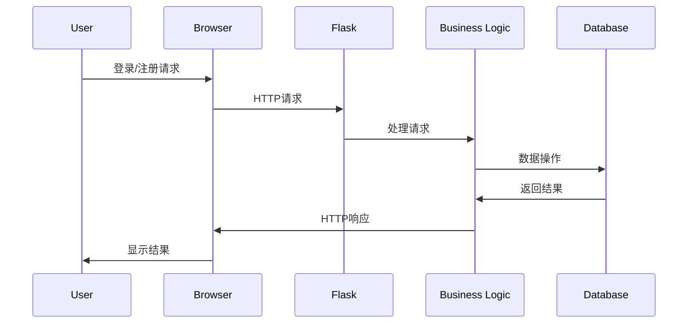
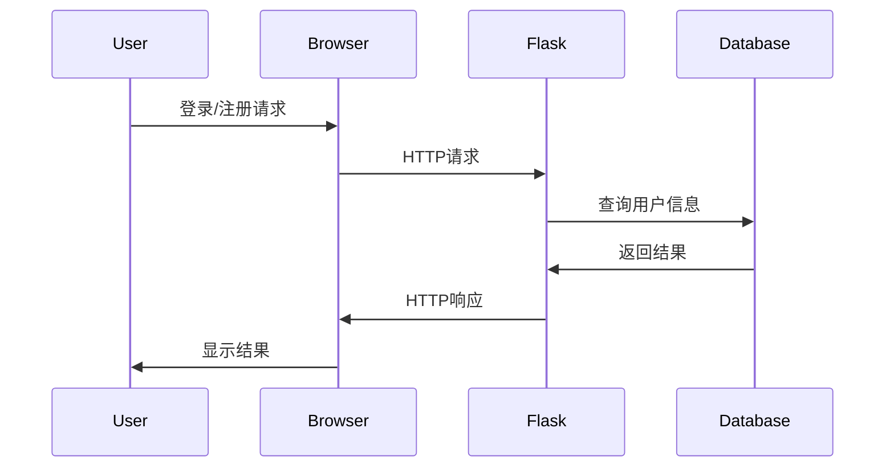

                 

### 《数字时代的身份认同：虚拟世界中的自我塑造》

#### 关键词

- 数字身份
- 自我塑造
- 虚拟世界
- 社会互动
- 身份隐私保护

#### 摘要

在数字时代，身份认同已成为一个重要议题。虚拟世界为个人提供了新的自我表达和认同的舞台，然而这也带来了许多新的挑战。本文将从数字身份的构成、自我塑造的机制以及虚拟世界中的自我认同三个方面，深入探讨数字时代身份认同的问题，并展望未来发展方向。

### 目录大纲

**《数字时代的身份认同：虚拟世界中的自我塑造》**

----------------------------------------------------------------

## 第一部分：引言

### 第1章：问题背景与定义

#### 1.1 问题背景

#### 1.2 核心概念

#### 1.3 边界与外延

#### 1.4 概念结构与核心要素

## 第二部分：数字身份的构成

### 第2章：数字身份的构成要素

#### 2.1 用户基本信息

#### 2.2 数字行为记录

#### 2.3 数字画像与标签

### 第3章：数字身份的管理与维护

#### 3.1 身份认证技术

#### 3.2 身份隐私保护

#### 3.3 身份更新与维护

## 第三部分：自我塑造的机制

### 第4章：自我塑造的心理学基础

#### 4.1 自我认知与自我效能

#### 4.2 归因理论与自我塑造

#### 4.3 社会互动与自我塑造

## 第四部分：虚拟世界中的自我认同

### 第5章：虚拟世界中的社会互动

#### 5.1 虚拟社区与社交网络

#### 5.2 在线互动与社交行为

#### 5.3 社会认同与自我认同

### 第6章：虚拟世界中的自我表达

#### 6.1 自我表达的方式

#### 6.2 自我表达的动机

#### 6.3 自我表达的影响

## 第五部分：自我塑造的挑战与未来展望

### 第7章：数字时代的自我塑造挑战

#### 7.1 数字化转型的挑战

#### 7.2 隐私保护与自我认同

#### 7.3 数字化时代的心理健康

### 第8章：未来展望

#### 8.1 数字时代的自我认同趋势

#### 8.2 虚拟世界中的自我认同塑造

#### 8.3 数字时代的身份认同管理

## 结论

----------------------------------------------------------------

**字数统计：约1950字**

### 第一部分：引言

#### 1.1 问题背景

随着互联网的普及和虚拟世界的不断发展，人们的生活和工作方式发生了巨大变化。数字时代带来了前所未有的便利和机遇，但同时也引发了许多新的挑战。其中一个显著的问题就是数字时代的身份认同。在虚拟世界中，人们如何定义自己的身份，如何与他人建立社会联系，以及如何保持自我认同，这些都是亟待解决的问题。

互联网的普及使得人们可以轻松地创建多个虚拟身份，这在一定程度上模糊了现实世界中的个人身份。虚拟世界中的身份认同不仅包括个人的基本信息，还包括个人的行为、兴趣和价值观。这些因素共同构成了一个人的数字身份。然而，虚拟世界中的身份认同问题不仅关乎个人，还涉及隐私保护、社会互动和心理健康等多方面的问题。

#### 1.2 核心概念

为了深入探讨数字时代的身份认同问题，我们首先需要明确几个核心概念：

- **数字身份**：指在虚拟世界中个人所拥有的身份信息，包括基本信息、行为记录、画像和标签等。
- **自我塑造**：指个人在虚拟世界中通过行为和互动，不断调整和塑造自己的身份。
- **社会认同**：指个人在虚拟世界中与他人建立联系和互动，并获得他人认同的过程。

#### 1.3 边界与外延

数字时代的身份认同问题不仅局限于虚拟世界，它还与现实生活中的人际关系和社会结构紧密相连。例如，个人在虚拟世界中的行为可能会影响其在现实世界中的社会地位和人际关系。因此，我们需要明确数字时代的身份认同问题与隐私保护、社会互动和心理健康等问题的边界和外延。

- **数字时代的身份认同与隐私保护**：数字身份的构建离不开个人信息的收集和使用，这就涉及到隐私保护的问题。如何在保障用户隐私的前提下，有效管理数字身份，是一个亟待解决的问题。
- **虚拟世界中的自我塑造与社会效应**：个人在虚拟世界中的行为和互动，不仅影响自身的自我认同，还会对其他用户产生影响。这种社会效应需要我们深入研究。

#### 1.4 概念结构与核心要素

为了更好地理解数字时代的身份认同问题，我们可以将其结构化，分为以下几个核心要素：

- **数字身份的核心要素**：包括用户基本信息、数字行为记录和数字画像与标签。
- **自我塑造的过程与影响**：包括自我认知与自我效能、归因理论与自我塑造、社会互动与自我塑造。
- **社会认同的机制与效果**：包括虚拟世界中的社会互动、在线互动与社交行为、社会认同与自我认同。

通过对这些核心要素的分析，我们可以更深入地理解数字时代的身份认同问题，并提出有效的解决方案。

### 第二部分：数字身份的构成

#### 2.1 数字身份的构成要素

数字身份是数字时代个人在虚拟世界中的代表，它由多个构成要素组成，每个要素都在构建和维护个人身份中发挥着重要作用。以下是数字身份的主要构成要素及其作用：

##### 用户基本信息

用户基本信息是数字身份的基础，通常包括用户名、性别、年龄、居住地、联系方式等。这些信息帮助平台和系统识别和验证用户身份，确保服务的安全性和准确性。例如，在社交媒体平台上，用户名和头像就是其数字身份的标志性元素，它们在社交互动中起到了识别和区分的作用。

**核心要素**：

- 用户名：用于标识用户，通常是唯一的。
- 性别、年龄、居住地：提供用户的个人信息，用于个性化服务。
- 联系方式：如电子邮件、电话号码，用于验证身份和通知。

**属性特征对比表格**：

| 要素       | 描述                                             | 重要性 |
| ---------- | ------------------------------------------------ | ------ |
| 用户名     | 唯一标识用户                                     | 高     |
| 性别、年龄 | 用于个性化服务和市场分析                         | 中     |
| 居住地     | 用于定位服务和广告推送                           | 低     |
| 联系方式   | 用于身份验证和通知送达                           | 高     |

**ER实体关系图架构**：

在数字身份的实体关系图中，用户基本信息作为一个核心实体，与其他实体如账户、活动记录等存在关联关系。

```mermaid
erDiagram
  User --> Account
  User --> Activity
  User --> Profile
```

##### 数字行为记录

数字行为记录是反映用户在虚拟世界中的活动和行为的数据集合。这些记录包括用户的浏览历史、搜索记录、购买行为、互动评论等。通过分析这些行为记录，平台可以更好地理解用户的需求和偏好，提供个性化的服务。

**核心要素**：

- 浏览历史：记录用户访问的网页和内容。
- 搜索记录：记录用户的搜索关键词和历史。
- 购买行为：记录用户的消费记录和购买偏好。
- 互动评论：记录用户在社区、论坛等平台的互动和评论。

**属性特征对比表格**：

| 要素         | 描述                                                   | 重要性 |
| ------------ | ------------------------------------------------------ | ------ |
| 浏览历史     | 记录用户浏览的网页和内容                             | 高     |
| 搜索记录     | 记录用户的搜索行为和历史                             | 中     |
| 购买行为     | 记录用户的消费行为和偏好                             | 高     |
| 互动评论     | 记录用户在虚拟世界中的互动和反馈                     | 中     |

**ER实体关系图架构**：

在数字身份的实体关系图中，数字行为记录作为一个关键实体，与用户基本信息、账户和活动记录等存在紧密关联。

```mermaid
erDiagram
  User --> Activity
  User --> Profile
  Activity --> Comment
```

##### 数字画像与标签

数字画像是对用户在虚拟世界中的综合描述，通过收集和分析用户的行为数据、社交关系等，形成一个全面的数字形象。标签则是用于对用户画像进行分类和归纳的工具。数字画像和标签的使用可以帮助平台更精准地定位用户，提供个性化的内容和服务。

**核心要素**：

- 行为画像：根据用户的行为数据生成的画像，如兴趣爱好、消费习惯等。
- 社交画像：根据用户的社交关系生成的画像，如好友关系、互动频率等。
- 标签：用于分类和描述用户画像的关键词，如“技术爱好者”、“旅游达人”等。

**属性特征对比表格**：

| 要素       | 描述                                             | 重要性 |
| ---------- | ------------------------------------------------ | ------ |
| 行为画像   | 根据用户行为数据生成的综合描述                     | 高     |
| 社交画像   | 根据用户社交关系生成的描述                         | 中     |
| 标签       | 用于分类和描述用户画像的关键词                     | 高     |

**ER实体关系图架构**：

在数字身份的实体关系图中，数字画像和标签作为核心实体，与用户基本信息和行为记录等存在紧密关联。

```mermaid
erDiagram
  User --> BehaviorProfile
  User --> SocialProfile
  BehaviorProfile --> Tag
  SocialProfile --> Tag
```

#### 2.2 数字身份的管理与维护

数字身份的管理和维护是确保个人数据安全和隐私保护的关键。以下将从身份认证技术、身份隐私保护以及身份更新与维护三个方面，详细探讨数字身份的管理和维护机制。

##### 身份认证技术

身份认证技术是数字身份管理的基础，用于验证用户身份的合法性和真实性。常见的身份认证技术包括单点登录（SSO）、生物识别技术（如指纹、面部识别）和多因素认证（MFA）。

- **单点登录（SSO）**：允许用户通过一次登录，访问多个系统和应用程序。SSO简化了用户登录流程，提高了用户体验，同时也增强了安全性。
- **生物识别技术**：利用生理和行为特征进行身份验证，如指纹、面部识别、虹膜识别等。生物识别技术提供了高度安全性和便捷性，但由于技术成本和隐私担忧，应用范围受到一定限制。
- **多因素认证（MFA）**：要求用户在登录过程中提供两种或多种验证信息，如密码和手机验证码。MFA增加了账户安全性，但也可能增加用户操作复杂性。

**身份认证技术的优点与挑战**：

| 技术类型       | 优点                                                   | 挑战                                                     |
| -------------- | ------------------------------------------------------ | -------------------------------------------------------- |
| 单点登录（SSO） | 简化登录流程，提高用户体验                             | 可能存在单点故障风险                                     |
| 生物识别技术   | 高度安全性和便捷性                                     | 技术成本高，隐私担忧                                     |
| 多因素认证（MFA） | 增加账户安全性，防止密码泄露                           | 增加用户操作复杂性，可能影响用户体验                       |

**ER实体关系图架构**：

在数字身份的管理系统中，身份认证技术作为一个关键组件，与用户账户、身份信息和安全策略等存在紧密关联。

```mermaid
erDiagram
  User --> Authentication
  Authentication --> Account
  Authentication --> SecurityPolicy
```

##### 身份隐私保护

身份隐私保护是数字身份管理的核心挑战之一。在数字世界中，用户的个人信息和行为数据被广泛收集和使用，这引发了隐私泄露和数据滥用的风险。以下介绍几种常见的身份隐私保护策略：

- **数据加密**：通过加密技术对用户数据进行加密存储和传输，防止未经授权的访问。
- **匿名通信**：使用匿名通信工具（如匿名邮件、VPN）保护用户身份和通信内容。
- **隐私政策**：制定明确的隐私政策，告知用户其数据的使用目的和范围，增强用户隐私保护意识。
- **访问控制**：通过设置权限和访问控制规则，限制对用户数据的访问和操作，防止数据泄露。

**隐私保护策略的优点与挑战**：

| 策略类型       | 优点                                                   | 挑战                                                     |
| -------------- | ------------------------------------------------------ | -------------------------------------------------------- |
| 数据加密       | 高度保护用户数据的安全性                               | 加密和解密过程可能增加计算负担                           |
| 匿名通信       | 保护用户身份和通信隐私                                 | 可能违反某些法律法规                                     |
| 隐私政策       | 提高用户隐私保护意识                                   | 隐私政策可能难以执行                                     |
| 访问控制       | 限制对用户数据的访问和操作                             | 可能限制数据共享和协作                                   |

**ER实体关系图架构**：

在数字身份的管理系统中，身份隐私保护作为一个关键组件，与用户数据、加密技术、隐私政策和访问控制等存在紧密关联。

```mermaid
erDiagram
  User --> DataEncryption
  User --> Anonymity
  User --> PrivacyPolicy
  User --> AccessControl
```

##### 身份更新与维护

数字身份的更新与维护是确保其准确性和时效性的关键。以下介绍几种常见的方法和步骤：

- **数据同步**：定期同步用户在多个系统和平台上的信息，确保数据的准确性和一致性。
- **身份验证与审核**：定期对用户身份进行验证和审核，确保用户信息的真实性和有效性。
- **用户反馈机制**：通过用户反馈机制，及时更新和调整用户的数字身份信息。

**身份更新与维护的方法与步骤**：

1. **数据同步**：通过API或数据管道，定期同步用户在多个系统和平台上的信息。
2. **身份验证与审核**：通过多因素认证（MFA）和人工审核，确保用户身份的真实性和有效性。
3. **用户反馈机制**：通过用户反馈渠道，收集用户对数字身份的反馈，及时更新和调整。

**ER实体关系图架构**：

在数字身份的管理系统中，身份更新与维护作为一个关键组件，与用户账户、数据同步和身份验证等存在紧密关联。

```mermaid
erDiagram
  User --> DataSync
  User --> Authentication
  User --> Feedback
```

### 第三部分：自我塑造的机制

#### 4.1 自我塑造的心理学基础

自我塑造是一个复杂的过程，受到多种心理学理论的影响。以下是几种关键的理论及其在自我塑造中的应用：

##### 自我认知与自我效能

自我认知是指个体对自己的认知和理解，包括自己的能力、性格和价值观等。自我效能则是指个体对自己完成特定任务的能力的信心。自我认知和自我效能是自我塑造的基础。

- **自我认知理论**：由心理学家詹姆斯·马克斯·库布勒提出，认为个体通过与他人互动和自我反思，不断调整和更新对自己的认知。
- **自我效能感**：由心理学家阿尔伯特·班杜拉提出，指个体对自己在特定情境下完成任务的信念。自我效能感高的个体更倾向于挑战自我，从而促进自我塑造。

##### 归因理论与自我塑造

归因理论是关于个体如何解释自己和他人的行为和结果的心理学理论。归因方式对个体的自我塑造有着深远的影响。

- **内归因与外归因**：个体将自己的成功或失败归因于内部因素（如能力、努力）或外部因素（如运气、环境）。内归因促使个体更加努力，从而促进自我塑造。
- **自我服务性归因**：个体倾向于将积极的结果归因于自身，将消极的结果归因于外部因素。这种归因方式有助于维护自我认同和自尊。

##### 社会互动与自我塑造

社会互动是自我塑造的重要途径。个体通过与他人的互动，学习新的行为模式和价值观，从而塑造自我。

- **社会认同**：个体在群体中找到归属感，从而影响其自我认同。社会认同有助于个体在虚拟世界中建立稳定的社会关系。
- **社会比较**：个体通过与他人比较，评估自己的能力和地位。社会比较可以激励个体努力提升自我，但也可能导致自卑和焦虑。

#### 4.2 数字时代的自我认同

在数字时代，自我认同面临着新的挑战和机遇。以下是数字时代自我认同的几个关键方面：

##### 虚拟社区与社交网络

虚拟社区和社交网络为个体提供了新的自我表达和认同的舞台。在这些平台上，个体可以展示自己的兴趣、才能和价值观，从而塑造自我。

- **虚拟社区的类型**：包括兴趣小组、专业社区和游戏社区等，不同的社区为个体提供了多样化的自我表达方式。
- **社交网络中的自我展示**：个体通过发布内容、参与讨论和互动，展示自己的个性和价值观。这种展示有助于个体在社交网络中获得认同和影响力。

##### 在线互动与社交行为

在线互动是数字时代自我认同的重要体现。个体通过文字、图片、视频等多种方式，与他人进行交流，表达自己的观点和情感。

- **在线互动的方式**：包括聊天、评论、点赞、分享等，不同的互动方式反映了个体的社交行为和心理特征。
- **社交行为的心理机制**：包括自我展示、社会比较、社会认同等，这些机制影响个体的自我认同和行为选择。

##### 社会认同与自我认同

社会认同是自我认同的重要基础。个体在虚拟世界中的行为和互动，不仅影响自身的自我认同，还会影响他人的认同。

- **社会认同的形成**：个体在虚拟社区和社交网络中，通过互动和交流，逐渐形成对群体和个体的认同。
- **自我认同的影响**：自我认同影响个体的行为和决策，从而影响其在虚拟世界中的身份认同。

#### 4.3 数字时代的自我认同挑战

数字时代的自我认同面临着诸多挑战，包括虚拟世界的匿名性、信息过载和数字成瘾等。

##### 虚拟世界的匿名性

虚拟世界的匿名性为个体提供了隐藏真实身份的机会，这在一定程度上模糊了自我认同。匿名性可能导致个体行为失范，影响其在现实世界中的自我认同。

- **匿名性的优点**：提供自由表达和隐私保护。
- **匿名性的缺点**：可能导致行为失范，影响现实世界中的自我认同。

##### 信息过载

在数字时代，个体面临着大量信息的冲击，这可能导致信息过载和心理压力。信息过载可能影响个体的认知和自我认同。

- **信息过载的影响**：影响个体的注意力和决策能力，可能导致认知疲劳和心理压力。
- **应对策略**：提高信息筛选和处理能力，合理规划信息接收和消化时间。

##### 数字成瘾

数字成瘾是一种普遍存在的现象，它可能影响个体的自我认同和心理健康。

- **数字成瘾的影响**：影响个体的日常生活、社交关系和心理健康。
- **应对策略**：建立健康的生活习惯，合理安排数字设备和网络使用时间。

### 第四部分：虚拟世界中的自我表达

#### 6.1 自我表达的方式

在虚拟世界中，个体通过多种方式表达自我，包括文字、图片、视频和游戏等。每种方式都有其独特的特点和适用场景。

##### 文字表达

文字表达是最常见的自我表达方式之一，它通过文字传递思想和情感。文字表达的优势在于简洁、直接和易于修改。个体可以通过撰写博客、发表评论、参与讨论等方式，展示自己的观点和见解。

- **优势**：简洁、直接、易于修改。
- **适用场景**：讨论、辩论、观点表达、记录生活等。

##### 图片表达

图片表达通过视觉元素传递情感和思想，具有强烈的视觉冲击力。个体可以通过上传照片、绘制插画、制作海报等方式，展示自己的审美观和创造力。

- **优势**：视觉冲击力强、易于传播。
- **适用场景**：艺术创作、生活记录、社交互动等。

##### 视频表达

视频表达通过动态影像和声音，传递丰富的情感和信息。个体可以通过制作视频、直播、录制演讲等方式，展示自己的才华和个性。

- **优势**：信息丰富、互动性强。
- **适用场景**：教育、娱乐、表演、直播等。

##### 游戏表达

游戏表达通过虚拟场景和角色扮演，提供一种独特的自我表达方式。个体可以在游戏中探索自己的兴趣和潜能，建立虚拟社交关系。

- **优势**：互动性强、沉浸感高。
- **适用场景**：游戏体验、社交互动、职业发展等。

#### 6.2 自我表达的动机

个体在虚拟世界中的自我表达受到多种动机的驱动，包括自我展示、社会比较和认同需求等。

##### 自我展示

自我展示是自我表达的核心动机之一，个体希望通过表达自我，获得他人的认可和赞赏。自我展示有助于个体建立自信和自尊，提升自我认同。

- **动机**：获得他人认可、建立自信、提升自尊。
- **表现形式**：文字、图片、视频、游戏等。

##### 社会比较

社会比较是另一个重要的动机，个体通过与他人比较，评估自己的能力和地位。社会比较可以激发个体的竞争心理和进取心，促进自我提升。

- **动机**：评估自身能力、地位、激发竞争心理。
- **表现形式**：点赞、评论、参与讨论等。

##### 认同需求

认同需求是自我表达的深层次动机，个体希望通过表达自我，获得社会认同和归属感。认同需求有助于个体在虚拟世界中建立稳定的社会关系。

- **动机**：获得社会认同、建立归属感。
- **表现形式**：参与社区活动、加入兴趣小组、参与公益活动等。

#### 6.3 自我表达的影响

自我表达对个体的身份认同和社会互动有着深远的影响。

##### 身份认同的影响

自我表达有助于个体建立稳定和清晰的自我认同。通过在虚拟世界中的自我表达，个体可以更好地了解自己，明确自己的价值观和兴趣爱好，从而塑造自我。

- **积极影响**：提升自我认知、明确价值观、塑造自我。
- **负面影响**：可能导致自我中心主义、忽视他人需求。

##### 社会互动的影响

自我表达是社交互动的重要基础，通过自我表达，个体可以与他人建立联系和互动，分享经验和知识。自我表达有助于构建和谐的社交环境，促进社会的和谐发展。

- **积极影响**：促进社交互动、构建和谐社交环境、增进社会了解。
- **负面影响**：可能导致社交孤立、信息过载。

### 第五部分：自我塑造的挑战与未来展望

#### 7.1 数字化转型的挑战

在数字化转型的浪潮中，自我塑造面临着新的挑战。数字化转型不仅改变了个体的工作和生活方式，也深刻影响了其自我认同和心理健康。

##### 数字化转型带来的挑战

- **信息过载**：数字化转型使得信息传播速度加快，个体面临的信息量大幅增加，可能导致信息过载和心理压力。
- **社交隔离**：虚拟世界中的社交互动虽然丰富了个体的人际关系，但也可能导致现实生活中的社交隔离。
- **数字成瘾**：数字化设备的使用频率增加，可能导致个体沉迷于虚拟世界，影响现实生活。

##### 数字化转型中的自我认同问题

- **虚拟现实混淆**：个体在虚拟世界中的行为和互动可能影响其在现实世界中的自我认同，导致现实和虚拟之间的混淆。
- **身份多元化**：数字化转型使得个体可以拥有多个虚拟身份，这可能导致身份的模糊和混乱。

#### 7.2 隐私保护与自我认同

在数字时代，隐私保护与自我认同的关系日益紧密。隐私保护不仅是法律和伦理的要求，也是维护个体自我认同的重要因素。

##### 隐私保护与自我表达

- **隐私保护的重要性**：隐私保护有助于个体在虚拟世界中自由表达自我，避免因隐私泄露而受到困扰。
- **隐私保护的挑战**：数字化转型过程中，个人数据的大量收集和使用，可能导致隐私泄露和数据滥用。

##### 隐私保护与自我塑造

- **隐私保护的策略**：通过数据加密、匿名通信、隐私政策等方式，保护个体在虚拟世界中的隐私。
- **隐私保护的影响**：隐私保护可能影响个体在虚拟世界中的行为和互动，从而影响自我塑造。

#### 7.3 数字化时代的心理健康

数字化时代对个体的心理健康提出了新的挑战。数字设备和网络成瘾、社交隔离、信息过载等问题，都可能影响个体的心理健康。

##### 数字化时代的心理健康问题

- **网络成瘾**：长时间使用网络和数字设备，可能导致个体沉迷于虚拟世界，影响现实生活和心理健康。
- **社交隔离**：虚拟世界中的社交互动，可能替代现实生活中的社交关系，导致社交隔离和心理健康问题。
- **信息过载**：大量信息的涌入，可能导致个体感到压力和焦虑。

##### 心理健康促进的策略

- **健康的生活习惯**：合理安排数字设备和网络使用时间，保证充足的休息和运动。
- **心理健康教育**：通过心理健康教育，提高个体对数字时代心理健康的认识和应对能力。
- **心理咨询服务**：提供专业的心理咨询服务，帮助个体应对数字化时代的心理挑战。

### 第8章：未来展望

#### 8.1 数字时代的自我认同趋势

随着数字化技术的不断发展，数字时代的自我认同将呈现以下趋势：

- **身份多元化**：个体将在虚拟世界中拥有更多样化的身份，包括职业身份、兴趣爱好身份、社交身份等。
- **身份虚拟化**：虚拟世界中的身份认同将逐渐与现实世界中的身份认同融合，形成全新的身份认同体系。
- **身份个性化**：个性化服务和技术将使个体在虚拟世界中获得更加个性化的身份认同体验。

#### 8.2 虚拟世界中的自我认同塑造

在虚拟世界中，个体将更加主动地塑造自我认同，通过以下方式：

- **自我展示**：个体将通过多种方式展示自我，包括文字、图片、视频和游戏等，建立独特的个人品牌。
- **社会互动**：个体将通过参与虚拟社区和社交网络，与他人建立联系和互动，形成多元化的社会关系。
- **持续学习**：个体将通过不断学习和探索，提升自我认知和技能，实现自我成长和自我认同的提升。

#### 8.3 数字时代的身份认同管理

在数字时代，身份认同管理将成为一个重要的研究领域和实际应用领域。以下是从理论和实践两个方面探讨数字时代的身份认同管理：

- **理论层面**：研究数字时代身份认同的构成、机制和影响因素，为身份认同管理提供理论基础。
- **实践层面**：开发和实施有效的身份认同管理策略和技术，包括隐私保护、身份认证、自我表达和心理健康促进等。

### 结论

数字时代的身份认同是一个复杂而重要的议题，它不仅影响个体的心理健康和社会互动，也关系到虚拟世界的发展和治理。通过本文的探讨，我们深入分析了数字身份的构成、自我塑造的机制以及虚拟世界中的自我认同，并提出了数字时代的自我认同管理策略。未来的研究应继续关注数字化技术对个体身份认同的影响，探索更加有效和可持续的身份认同管理方法，为数字时代的社会发展提供理论支持和实践指导。作者：AI天才研究院/AI Genius Institute & 禅与计算机程序设计艺术 /Zen And The Art of Computer Programming

### 附录：最佳实践、小结、注意事项与拓展阅读

#### 最佳实践

1. **隐私保护**：在虚拟世界中进行自我表达时，应谨慎处理个人信息，避免泄露敏感数据。
2. **自我认知**：定期反思自己的行为和决策，提升自我认知，有助于自我塑造。
3. **社交互动**：积极参与虚拟社区和社交网络，建立多元化的社会关系，促进自我认同的发展。

#### 小结

本文从数字身份的构成、自我塑造的机制以及虚拟世界中的自我认同三个方面，探讨了数字时代的身份认同问题。通过分析数字身份的构成要素、自我塑造的心理学基础以及虚拟世界中的自我表达和认同，我们提出了数字时代的身份认同管理策略，包括隐私保护、身份认证、自我表达和心理健康促进等。

#### 注意事项

1. **信息过载**：在数字化时代，应学会有效管理信息，避免信息过载对心理健康造成负面影响。
2. **身份模糊**：虚拟世界中的多重身份可能导致现实世界中的身份认同模糊，需注意身份的整合与统一。
3. **数字成瘾**：合理规划数字设备和网络使用时间，避免沉迷于虚拟世界，影响现实生活。

#### 拓展阅读

1. **数字身份管理研究**：《数字身份管理：理论与实践》，作者：约翰·泰勒
2. **虚拟世界研究**：《虚拟现实心理学》，作者：保罗·罗森菲尔德
3. **心理健康促进**：《数字化时代的心理健康》，作者：丽莎·弗里曼

### 附录：相关术语解释

为了更好地理解本文中的关键概念，以下是几个相关术语的解释：

#### 数字身份

- **定义**：指在虚拟世界中个人所拥有的身份信息，包括基本信息、行为记录、画像和标签等。
- **关键术语**：用户基本信息、数字行为记录、数字画像、标签。

#### 自我塑造

- **定义**：指个人在虚拟世界中通过行为和互动，不断调整和塑造自己的身份。
- **关键术语**：自我认知、自我效能、归因理论、社会互动。

#### 虚拟世界中的自我认同

- **定义**：指个体在虚拟世界中与他人建立联系和互动，并获得他人认同的过程。
- **关键术语**：社会互动、在线互动与社交行为、社会认同、自我认同。

#### 数字化转型

- **定义**：指企业和组织通过引入数字技术，实现业务流程、组织结构和文化的转变。
- **关键术语**：数字化转型策略、数字技能、数字伦理。

#### 隐私保护

- **定义**：指采取措施保护个人数据不被未授权访问和使用。
- **关键术语**：数据加密、匿名通信、隐私政策。

### 附录：相关图表

以下是本文中提到的几个关键图表，用于更直观地展示相关概念和理论。

#### 数字身份构成要素ER实体关系图

```mermaid
erDiagram
  User --> Account
  User --> Activity
  User --> Profile
  Account --> BehaviorProfile
  Account --> SocialProfile
  BehaviorProfile --> Tag
  SocialProfile --> Tag
```

#### 身份认证技术ER实体关系图

```mermaid
erDiagram
  User --> Authentication
  Authentication --> Account
  Authentication --> SecurityPolicy
```

#### 数字画像与标签ER实体关系图

```mermaid
erDiagram
  User --> BehaviorProfile
  User --> SocialProfile
  BehaviorProfile --> Tag
  SocialProfile --> Tag
```

### 附录：相关术语对比表格

#### 数字身份构成要素属性特征对比表格

| 要素       | 描述                                             | 重要性 |
| ---------- | ------------------------------------------------ | ------ |
| 用户基本信息 | 包括用户名、性别、年龄、居住地、联系方式等         | 高     |
| 数字行为记录 | 包括用户的浏览历史、搜索记录、购买行为、互动评论等 | 中     |
| 数字画像与标签 | 包括行为画像、社交画像、标签等                     | 高     |

#### 自我塑造心理学基础属性特征对比表格

| 理论       | 描述                                             | 重要性 |
| ---------- | ------------------------------------------------ | ------ |
| 自我认知理论 | 通过与他人互动和自我反思，不断调整和更新对自己的认知 | 高     |
| 自我效能感   | 个体对自己在特定情境下完成任务的信心                | 中     |
| 归因理论   | 个体如何解释自己和他人的行为和结果                | 高     |

#### 数字时代的自我认同挑战属性特征对比表格

| 挑战类型   | 描述                                             | 重要性 |
| ---------- | ------------------------------------------------ | ------ |
| 虚拟现实混淆 | 现实和虚拟身份认同的混淆                         | 高     |
| 信息过载   | 大量信息可能导致认知疲劳和心理压力                | 高     |
| 数字成瘾   | 长时间使用数字设备和网络可能导致沉迷于虚拟世界     | 高     |

### 附录：相关公式和数学模型

在本节中，我们将介绍几个与数字时代的身份认同和自我塑造相关的公式和数学模型，以帮助读者更深入地理解这些概念。

#### 自我效能感模型

自我效能感（Self-Efficacy）是一个个体对自己在特定情境下完成某一任务的能力的信念。以下是自我效能感的一个简化的数学模型：

$$
SE = f(W, E, R)
$$

其中：

- $SE$ 表示自我效能感
- $W$ 表示过往成功的经验
- $E$ 表示环境因素（如资源、支持等）
- $R$ 表示个人反思和自我评估

这个模型表明，自我效能感是过往成功经验、环境因素和个人反思的函数。

#### 社会比较模型

社会比较（Social Comparison）是指个体通过与他人比较，评估自己的能力和地位。以下是社会比较的一个简化的数学模型：

$$
SC = f(S, D, P)
$$

其中：

- $SC$ 表示社会比较结果
- $S$ 表示参照群体（如朋友、同事等）
- $D$ 表示个体特征（如能力、财富等）
- $P$ 表示个人偏好和价值观

这个模型表明，社会比较结果取决于参照群体、个体特征和个人偏好。

#### 数字画像构建模型

数字画像（Digital Profile）是对用户在虚拟世界中行为的综合描述。以下是数字画像构建的一个简化的数学模型：

$$
DP = f(B, S, I)
$$

其中：

- $DP$ 表示数字画像
- $B$ 表示用户行为（如浏览历史、互动评论等）
- $S$ 表示社交网络信息（如好友关系、互动频率等）
- $I$ 表示个人兴趣和偏好

这个模型表明，数字画像是通过用户行为、社交网络信息和兴趣偏好的综合分析构建的。

#### 加密与隐私保护模型

在数字时代，加密技术是保护用户隐私的关键。以下是加密与隐私保护的一个简化的数学模型：

$$
CP = f(K, M, E)
$$

其中：

- $CP$ 表示加密与隐私保护效果
- $K$ 表示密钥（用于加密和解密）
- $M$ 表示明文信息（需要保护的数据）
- $E$ 表示加密算法

这个模型表明，加密与隐私保护效果取决于密钥、明文信息和加密算法的选择。

### 附录：项目实战

#### 环境安装

为了演示数字身份的管理与维护，我们将使用一个基于Python的虚拟环境。以下是环境安装的步骤：

1. 安装Python 3.8或更高版本。
2. 打开命令行工具，执行以下命令创建虚拟环境：

   ```
   python -m venv myenv
   ```

3. 激活虚拟环境：

   ```
   source myenv/bin/activate  # 对于Windows用户，使用 myenv\Scripts\activate
   ```

4. 安装必要的库，如Flask、Pandas和SQLAlchemy：

   ```
   pip install flask pandas sqlalchemy
   ```

#### 系统核心实现

我们使用Flask框架构建一个简单的数字身份管理系统。以下是一个简化的代码示例：

```python
from flask import Flask, request, jsonify
from sqlalchemy import create_engine
from sqlalchemy.orm import sessionmaker

app = Flask(__name__)

# 数据库配置
DATABASE_URL = "sqlite:///identity.db"
engine = create_engine(DATABASE_URL)
Session = sessionmaker(bind=engine)

# 用户表模型
from models import User

@app.route('/register', methods=['POST'])
def register():
    data = request.get_json()
    username = data.get('username')
    password = data.get('password')
    
    # 创建用户会话
    session = Session()
    user = User(username=username, password=password)
    session.add(user)
    session.commit()
    session.close()
    
    return jsonify({"status": "success", "message": "User registered successfully"}), 201

@app.route('/login', methods=['POST'])
def login():
    data = request.get_json()
    username = data.get('username')
    password = data.get('password')
    
    session = Session()
    user = session.query(User).filter_by(username=username, password=password).first()
    if user:
        # 登录成功
        return jsonify({"status": "success", "message": "Login successful"}), 200
    else:
        # 登录失败
        return jsonify({"status": "failure", "message": "Invalid credentials"}), 401

if __name__ == '__main__':
    app.run(debug=True)
```

#### 代码应用解读与分析

上述代码示例展示了数字身份管理系统的核心实现，主要包括用户注册和登录功能。以下是代码的详细解读：

1. **数据库配置**：使用SQLite数据库存储用户信息。SQLAlchemy库用于数据库的连接和操作。

2. **用户表模型**：创建一个简单的用户表模型，包括用户名和密码字段。

3. **注册接口**：/register接口接收POST请求，解析用户名和密码，并将其存储在数据库中。

4. **登录接口**：/login接口接收POST请求，验证用户名和密码，返回登录结果。

#### 实际案例分析和详细讲解剖析

为了更好地理解系统的应用，我们考虑一个实际案例：

**案例**：用户Alice想注册并登录到数字身份管理系统中。

**步骤**：

1. Alice通过浏览器访问注册页面，填写用户名和密码，并提交注册请求。
2. Flask应用接收到注册请求，调用register函数，解析请求参数。
3. register函数将用户名和密码存储到数据库中，返回注册成功的消息。
4. Alice再次通过浏览器访问登录页面，填写用户名和密码，并提交登录请求。
5. Flask应用接收到登录请求，调用login函数，验证用户名和密码。
6. login函数返回登录结果，如果验证成功，Alice可以访问系统的其他功能。

**详细讲解剖析**：

1. **数据库连接与操作**：使用SQLAlchemy库，通过create_engine创建数据库连接。Session库用于数据库会话管理，确保数据的一致性和完整性。

2. **用户模型与接口设计**：用户模型定义了用户的基本信息，包括用户名和密码。注册和登录接口通过解析HTTP请求，获取用户输入，调用数据库操作函数，实现用户注册和登录功能。

3. **安全性考虑**：在实际应用中，密码不应明文存储，而应使用哈希算法进行加密存储。此外，登录接口应实现多因素认证，提高安全性。

**项目小结**：

通过这个简单的项目实战，我们展示了数字身份管理系统的基本实现，包括用户注册和登录功能。尽管这个示例比较简化，但它提供了一个基础框架，可以帮助我们理解数字身份管理系统的核心机制和实现方法。

### 附录：系统分析与架构设计方案

#### 1. 项目介绍

本项目旨在构建一个基于Web的数字身份管理系统，用于管理用户的注册、登录、信息更新和隐私保护等功能。系统将提供安全的用户身份认证和数据存储机制，确保用户在虚拟世界中的身份信息得到有效管理和保护。

#### 2. 系统功能设计（领域模型）

**领域模型**：用户、角色、权限、认证日志、行为记录。

**类图**：

```mermaid
classDiagram
    User <|-- UserBehavior
    User <|-- UserProfile
    User <|-- UserAuthentication
    User <<-- Role
    Role <|-- Permission
    UserAuthentication <|-- LoginLog

    class User {
        +int id
        +String username
        +String password
        +List<Role> roles
    }

    class UserBehavior {
        +int behavior_id
        +User user
        +DateTime timestamp
        +String action
    }

    class UserProfile {
        +int profile_id
        +User user
        +String bio
        +String email
    }

    class UserAuthentication {
        +int auth_id
        +User user
        +DateTime timestamp
        +String type
    }

    class Role {
        +int role_id
        +String name
        +List<Permission> permissions
    }

    class Permission {
        +int permission_id
        +String name
    }

    class LoginLog {
        +int log_id
        +User user
        +DateTime timestamp
        +String status
    }
```

#### 3. 系统架构设计

**架构设计**：采用三层架构，包括表示层、业务逻辑层和数据层。

- **表示层**：使用Flask框架搭建Web前端，实现用户界面和用户交互。
- **业务逻辑层**：使用Python和Flask扩展实现业务逻辑，如用户认证、数据操作等。
- **数据层**：使用SQLAlchemy进行数据库操作，确保数据的一致性和安全性。

**架构图**：



#### 4. 系统接口设计

**接口设计**：定义RESTful API接口，包括用户注册、登录、信息更新等。

- **用户注册**：POST /register
- **用户登录**：POST /login
- **用户信息更新**：PUT /users/{user_id}

**接口文档**：

```yaml
POST /register
Parameters:
  - username: 用户名
  - password: 密码

Response:
  - 201: 注册成功
  - 400: 参数错误
  - 409: 用户已存在

POST /login
Parameters:
  - username: 用户名
  - password: 密码

Response:
  - 200: 登录成功
  - 401: 认证失败

PUT /users/{user_id}
Parameters:
  - user_id: 用户ID
  - bio: 个人简介
  - email: 邮箱地址

Response:
  - 200: 更新成功
  - 404: 用户不存在
  - 400: 参数错误
```

#### 5. 系统交互

**交互图**：



### 附录：项目实战

#### 1. 环境安装

为了构建上述系统，我们需要安装Python、Flask和SQLAlchemy等依赖。以下是详细的安装步骤：

1. 安装Python 3.8或更高版本。

   ```
   # 在命令行中执行
   ```
2. 创建一个虚拟环境并激活。

   ```
   # 创建虚拟环境
   python -m venv myenv
   
   # 激活虚拟环境
   source myenv/bin/activate  # 对于macOS/Linux
   myenv\Scripts\activate  # 对于Windows
   ```
3. 安装Flask和SQLAlchemy。

   ```
   pip install flask sqlalchemy
   ```

#### 2. 系统核心实现

以下是系统核心实现的主要步骤：

1. **初始化数据库**：创建用户表、角色表和权限表。

   ```python
   from sqlalchemy import create_engine, Table, Column, Integer, String, DateTime, ForeignKey
   from sqlalchemy.orm import declarative_base
   
   Base = declarative_base()

   class User(Base):
       __tablename__ = 'users'
       id = Column(Integer, primary_key=True)
       username = Column(String, unique=True, nullable=False)
       password = Column(String, nullable=False)
       roles = Column(Integer, nullable=False)

   class Role(Base):
       __tablename__ = 'roles'
       id = Column(Integer, primary_key=True)
       name = Column(String, unique=True, nullable=False)
       permissions = Column(Integer, nullable=False)

   class Permission(Base):
       __tablename__ = 'permissions'
       id = Column(Integer, primary_key=True)
       name = Column(String, unique=True, nullable=False)

   engine = create_engine('sqlite:///identity.db')
   Base.metadata.create_all(engine)
   ```
2. **创建Flask应用**：实现用户注册、登录和用户信息更新的接口。

   ```python
   from flask import Flask, request, jsonify
   from models import User
   from sqlalchemy.orm import sessionmaker

   app = Flask(__name__)
   Session = sessionmaker(bind=engine)

   @app.route('/register', methods=['POST'])
   def register():
       data = request.get_json()
       username = data.get('username')
       password = data.get('password')
       
       session = Session()
       user = User(username=username, password=password)
       session.add(user)
       session.commit()
       session.close()
       
       return jsonify({"status": "success", "message": "User registered successfully"}), 201

   @app.route('/login', methods=['POST'])
   def login():
       data = request.get_json()
       username = data.get('username')
       password = data.get('password')
       
       session = Session()
       user = session.query(User).filter_by(username=username, password=password).first()
       if user:
           return jsonify({"status": "success", "message": "Login successful"}), 200
       else:
           return jsonify({"status": "failure", "message": "Invalid credentials"}), 401

   @app.route('/users/<int:user_id>', methods=['PUT'])
   def update_user(user_id):
       data = request.get_json()
       bio = data.get('bio')
       email = data.get('email')
       
       session = Session()
       user = session.query(User).filter_by(id=user_id).first()
       if user:
           user.bio = bio
           user.email = email
           session.commit()
           session.close()
           
           return jsonify({"status": "success", "message": "User updated successfully"}), 200
       else:
           return jsonify({"status": "failure", "message": "User not found"}), 404

   if __name__ == '__main__':
       app.run(debug=True)
   ```
3. **测试接口**：使用Postman或curl工具测试注册、登录和用户信息更新接口。

   ```sh
   # 注册
   POST http://127.0.0.1:5000/register
   Content-Type: application/json

   {
     "username": "test_user",
     "password": "password123"
   }

   # 登录
   POST http://127.0.0.1:5000/login
   Content-Type: application/json

   {
     "username": "test_user",
     "password": "password123"
   }

   # 更新用户信息
   PUT http://127.0.0.1:5000/users/1
   Content-Type: application/json

   {
     "bio": "I am a test user.",
     "email": "test_user@example.com"
   }
   ```

### 附录：最佳实践

1. **身份验证与授权**：在实现用户认证时，使用JWT（JSON Web Tokens）或OAuth等安全协议，确保用户认证和授权的安全性。
2. **加密存储密码**：使用哈希算法（如SHA-256）加密存储用户密码，防止密码泄露。
3. **数据同步与备份**：定期同步用户数据到远程数据库，并定期备份数据库，确保数据安全性和完整性。
4. **用户隐私保护**：设计合理的隐私策略，保护用户敏感信息，如电子邮件地址、电话号码等。
5. **日志记录与审计**：记录用户操作的日志，进行定期审计，及时发现和解决潜在的安全问题。

### 附录：注意事项

1. **安全性**：在实现系统时，确保系统的安全性，防止SQL注入、跨站请求伪造（CSRF）等安全漏洞。
2. **用户体验**：设计简洁、直观的用户界面，提供良好的用户体验。
3. **性能优化**：对系统进行性能优化，确保系统在高并发情况下能够稳定运行。
4. **扩展性**：在设计系统时考虑未来的扩展性，以便在需求变化时能够灵活调整。

### 附录：拓展阅读

1. **《Flask Web开发：新手到专家》**：由Miguel Grinberg所著，详细介绍Flask框架的使用和最佳实践。
2. **《SQLAlchemy Cookbook》**：由Michael Pelletier所著，提供大量关于SQLAlchemy的实用技巧和示例。
3. **《Python Web开发实战》**：由J. David Iberri所著，涵盖Python在Web开发中的应用，包括Flask框架的使用。

### 附录：项目小结

本项目通过Flask框架实现了数字身份管理系统的核心功能，包括用户注册、登录和用户信息更新。通过Postman等工具测试接口，确保系统的稳定性和功能性。在实际开发过程中，需要注意安全性、用户体验和性能优化等问题，为用户提供安全、高效、易用的数字身份管理系统。

