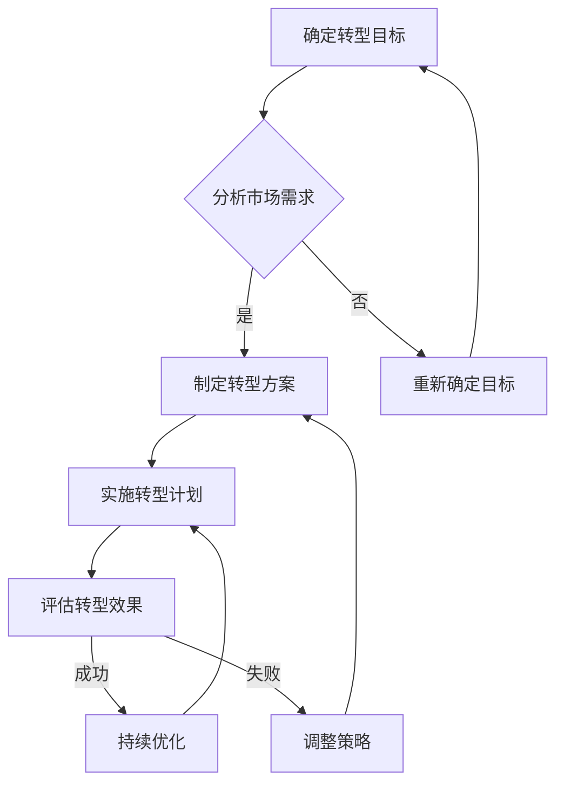
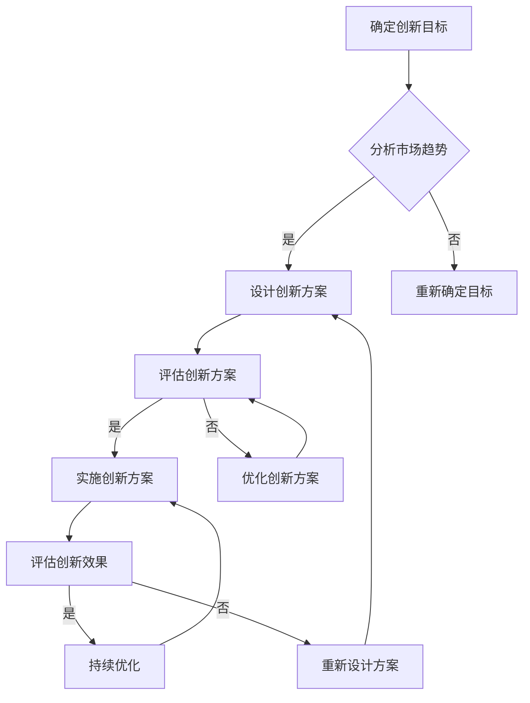
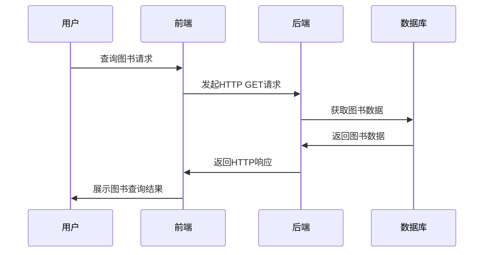

                 

### 1.1 问题背景

随着信息技术的迅猛发展，数字时代的到来对各个行业带来了深远的影响。实体书店作为文化传承的重要场所，同样也面临着前所未有的挑战。首先，电子书和在线阅读的兴起使得传统纸质书籍的需求量大幅下降。电子书的便捷性、低价位和多样的阅读体验，吸引了大量读者转向数字化阅读。此外，社交媒体、短视频等新型娱乐方式的崛起，进一步分散了公众的阅读时间和注意力。

数字时代给实体书店带来的另一个挑战是市场竞争的加剧。线上电商平台如亚马逊、京东等，凭借其庞大的库存、优惠的价格和高效的物流系统，成为了读者购买书籍的主要渠道。与此同时，电子阅读器和智能手机的普及，使得读者可以随时随地获取电子书资源，从而降低了实体书店的用户黏性。

面对这些挑战，实体书店需要转型和创新，以适应数字时代的发展趋势。转型意味着书店要从传统的经营模式中走出来，探索新的商业模式和经营策略。创新则要求书店在服务内容、技术手段、用户体验等方面不断突破，以提升自身的竞争力和吸引力。转型的必要性不仅体现在市场压力上，更是书店自身生存和发展的必然选择。

然而，实体书店的转型并非易事。转型过程中，书店需要重新审视自身的定位和发展方向，调整经营策略，投资新技术，并培养适应新环境的员工。同时，书店还需要应对转型过程中的不确定性和风险，如市场接受度、运营成本增加等问题。因此，如何有效地进行转型和创新，成为当前实体书店亟待解决的重要课题。

### 1.2 问题描述

在数字时代，实体书店面临的困境主要体现在以下几个方面：

首先，顾客流失问题尤为严重。随着电子书和在线阅读的普及，越来越多的读者选择通过电子设备获取阅读资源，实体书店的客流量显著下降。这不仅导致销售额的下滑，还使得书店的运营成本难以得到有效控制。

其次，经营模式单一。许多实体书店仍然沿袭传统的经营模式，主要依赖图书销售和租借服务。然而，在数字时代，这种单一的经营模式已难以满足消费者的多样化需求。书店缺乏有效的差异化竞争策略，无法在激烈的市场竞争中脱颖而出。

第三，服务质量不高。实体书店在提供阅读服务时，往往缺乏个性化的推荐和互动体验，难以吸引和留住顾客。与线上平台相比，实体书店在用户体验和服务质量方面存在明显差距。

第四，技术投入不足。许多实体书店在数字化转型过程中，缺乏对新技术和应用的投资，导致其服务能力和市场竞争力受到限制。例如，电子书平台、智能推荐系统、互动体验设备等，都是提升实体书店竞争力的重要手段。

第五，员工素质不高。实体书店的员工在数字时代面临新的挑战，需要掌握更多的技能和知识，如数字营销、客户关系管理、技术应用等。然而，目前许多书店员工的素质和能力仍需提升，这限制了书店的转型速度和效果。

这些问题共同构成了实体书店在数字时代所面临的困境，要求书店必须进行深刻的转型和创新，以应对市场变化和消费者需求的变迁。

### 1.3 问题解决

实体书店要在数字时代中找到生存和发展的路径，必须采取一系列有效的转型和创新措施。以下是一些具体的转型路径和新型商业模式：

首先，数字化转型是实体书店的必由之路。书店可以建立自己的在线平台，提供电子书下载和阅读服务。通过整合线上线下资源，实现“线上引流、线下消费”的闭环模式。例如，书店可以通过线上平台推荐精选书籍，引导读者到实体店购买，从而提升销售额。

其次，书店可以引入智能技术，提升服务质量和顾客体验。例如，运用大数据和人工智能技术进行读者行为分析，为顾客提供个性化推荐。此外，引入虚拟现实（VR）和增强现实（AR）技术，打造沉浸式阅读体验，吸引更多顾客。

第三，跨界合作是实体书店拓展市场的重要手段。书店可以与其他行业如咖啡馆、文创产品店等进行合作，打造“书店+”模式，提升书店的综合竞争力。例如，书店可以与咖啡店合作，提供咖啡和书籍的一站式服务，吸引顾客在阅读的同时享受休闲时光。

第四，书店可以探索会员制和忠诚度计划，增强顾客的粘性。通过会员积分、优惠活动等方式，吸引顾客长期消费，提升顾客忠诚度。例如，书店可以推出年度会员卡，为会员提供专属折扣、专享活动等福利。

第五，书店应注重内容创造和知识分享，打造社区文化空间。通过举办读书会、讲座、文化沙龙等活动，吸引读者参与，增强书店的文化氛围和社交功能。例如，书店可以定期邀请知名作家、学者进行讲座，提升书店的品牌影响力。

最后，书店需要加强对员工的技术培训和素质提升。员工是书店转型和创新的重要推动力，只有通过培训，提升员工的专业技能和创新能力，才能确保书店在数字化转型的道路上稳步前行。

通过这些转型路径和新型商业模式，实体书店可以在数字时代找到新的发展方向，实现可持续发展和市场竞争力提升。

### 1.4 边界与外延

在探讨实体书店的转型与创新时，我们需要明确其边界与外延，以便更好地理解和实施相关策略。

首先，实体书店的定义与范围。实体书店是指以销售和出租纸质书籍为主的文化场所，通常包括书店的选址、装修、陈列和经营等多个方面。实体书店不仅提供图书销售，还包括书籍租借、阅读空间、文化活动等服务内容。

其次，转型的边界条件。实体书店的转型涉及经营模式、技术应用、服务内容等多个方面。转型的边界条件包括市场接受度、技术成熟度、成本效益分析等。具体来说，书店需要在进行数字化转型时，充分考虑现有顾客的需求和偏好，确保新模式的可行性和接受度。

第三，创新的外延。创新不仅限于技术手段的应用，还包括经营理念、商业模式和顾客体验的革新。书店可以通过引入新技术、开展新活动、提供新服务等方式，不断拓展创新的外延。例如，通过跨界合作、打造文化社区等方式，增强书店的市场竞争力和用户粘性。

最后，实体书店转型的目标。转型的目标在于提升书店的竞争力、增强顾客体验、实现可持续发展。具体目标包括：提高销售额、提升顾客忠诚度、拓展市场份额、提升品牌影响力等。

通过明确实体书店的边界与外延，我们可以更有针对性地制定转型和创新策略，从而在数字时代中实现长远发展。

### 1.5 核心概念

在探讨实体书店的转型与创新时，理解以下几个核心概念是至关重要的。

#### 1.5.1 实体书店

实体书店是指以销售和出租纸质书籍为主的文化场所，通常包括书店的选址、装修、陈列和经营等多个方面。实体书店不仅提供图书销售，还包括书籍租借、阅读空间、文化活动等服务内容。

#### 1.5.2 转型

转型是指实体书店在数字时代背景下，通过调整经营模式、引入新技术、优化服务内容等手段，以适应市场变化和消费者需求的过程。转型不仅是为了应对挑战，更是为了实现可持续发展和市场竞争力提升。

#### 1.5.3 创新

创新是指实体书店在转型过程中，通过引入新技术、新理念、新服务等方式，创造新的商业模式和顾客体验。创新不仅包括技术手段的应用，还包括经营理念、商业模式和顾客体验的革新。

#### 1.5.4 数字化阅读

数字化阅读是指通过电子设备获取和阅读电子书、数字报纸、数字杂志等数字化内容的一种阅读方式。数字化阅读具有便捷性、多样性和互动性等特点，对传统纸质书籍构成了巨大挑战。

通过理解这些核心概念，我们可以更全面地把握实体书店在数字时代所面临的挑战和机遇，从而制定出更有效的转型与创新策略。

### 1.5.1 实体书店

实体书店是指以销售和出租纸质书籍为主的文化场所，其定义涵盖了书店的选址、装修、陈列和经营等多个方面。实体书店不仅提供图书销售，还包括书籍租借、阅读空间、文化活动等服务内容。实体书店的选址通常选择在人流量较大、交通便利的地段，以便吸引更多的顾客。装修风格则力求营造出舒适、温馨的阅读氛围，使顾客能够沉浸在书籍的世界中。陈列方面，实体书店注重书籍的展示方式，通过合理的布局和分类，提升顾客的购物体验。此外，实体书店还常常举办各种文化活动，如签售会、读书会等，以增强书店的文化氛围和吸引力。

实体书店的类型多样，主要可以分为以下几种：

1. **综合书店**：这种书店规模较大，提供多种类别的图书，包括文学、历史、科学、儿童读物等，以满足不同读者的需求。

2. **专业书店**：这类书店专注于某一特定领域的书籍，如法律、医学、工程技术等，提供专业的书籍和咨询服务。

3. **社区书店**：这些书店通常位于社区内，服务范围较小，但更贴近社区居民的生活需求，提供地方文献、生活指南等书籍。

4. **二手书店**：二手书店主要销售二手书籍，以低价位吸引那些喜欢阅读但预算有限的读者。

5. **主题书店**：这类书店以某一特定主题为特色，如设计、艺术、旅游等，通过主题展示和活动吸引特定群体的顾客。

各类实体书店在服务内容上也有所区别。综合书店通常提供较为全面的图书购买和租赁服务，而专业书店则更注重为特定领域的读者提供专业知识和信息。社区书店和二手书店则更侧重于为社区居民提供便捷的阅读资源。主题书店则通过独特的主题展示和活动，吸引特定群体的顾客。

总之，实体书店作为文化传承的重要场所，通过多样化的类型和服务内容，满足了不同读者群体的需求。然而，在数字时代的冲击下，实体书店需要不断转型和创新，以适应市场的变化和消费者的新需求。

#### 1.5.2 转型

转型是指实体书店在数字时代背景下，通过调整经营模式、引入新技术、优化服务内容等手段，以适应市场变化和消费者需求的过程。转型的必要性主要体现在以下几个方面：

首先，随着电子书和在线阅读的兴起，传统纸质书籍的需求量大幅下降，实体书店面临巨大的市场压力。因此，转型成为了实体书店维持市场地位和吸引顾客的必要手段。

其次，消费者需求的变化也是推动实体书店转型的关键因素。现代消费者不仅追求书籍的内容和质量，更注重购物体验和互动体验。实体书店通过转型，可以提供更加个性化和多样化的服务，满足消费者的新需求。

此外，技术创新为实体书店的转型提供了新的可能性和方向。大数据、人工智能、虚拟现实等新兴技术，可以为实体书店带来更高的效率、更好的服务和更优质的用户体验。

实体书店的转型类型主要包括以下几种：

1. **线上转型**：建立自己的在线平台，提供电子书下载和阅读服务，实现线上引流、线下消费的闭环模式。

2. **智能化转型**：引入智能技术，如大数据分析、智能推荐系统、虚拟现实（VR）和增强现实（AR）技术，提升书店的服务质量和顾客体验。

3. **跨界合作转型**：与其他行业如咖啡馆、文创产品店等进行合作，打造“书店+”模式，拓展书店的服务范围和受众群体。

4. **社区化转型**：通过举办读书会、讲座、文化沙龙等活动，打造书店的文化社区，提升书店的品牌影响力和用户黏性。

5. **会员制转型**：推出会员制和忠诚度计划，通过积分、优惠活动等方式，增强顾客的粘性。

通过这些转型类型，实体书店可以更好地应对数字时代的挑战，实现可持续发展。

#### 1.5.3 创新

创新是指实体书店在转型过程中，通过引入新技术、新理念、新服务等方式，创造新的商业模式和顾客体验。创新的必要性主要体现在以下几个方面：

首先，数字时代消费者需求的变化，要求实体书店提供更加个性化和多样化的服务。通过创新，书店可以满足这些新需求，提高顾客满意度和忠诚度。

其次，技术创新为实体书店带来了新的发展机遇。大数据、人工智能、虚拟现实等新兴技术，可以为书店带来更高的效率、更好的服务和更优质的用户体验。

此外，创新也是实体书店提升市场竞争力和品牌影响力的重要手段。通过不断创新，书店可以脱颖而出，吸引更多顾客。

创新的类型主要包括以下几种：

1. **技术驱动的创新**：引入新技术如大数据分析、智能推荐系统、虚拟现实（VR）和增强现实（AR）技术，提升书店的服务质量和顾客体验。

2. **服务模式的创新**：通过跨界合作、打造文化社区、推出会员制和忠诚度计划等，拓展书店的服务范围和受众群体。

3. **内容创新的创新**：通过举办文化活动、出版特色读物、开展知识分享等方式，提供更有吸引力的阅读内容和体验。

4. **运营管理的创新**：通过优化供应链、提高库存管理效率、提升员工素质等，提升书店的运营效率和竞争力。

通过这些创新类型，实体书店可以更好地适应数字时代的发展趋势，实现可持续发展和市场竞争力提升。

#### 1.5.4 数字化阅读

数字化阅读是指通过电子设备获取和阅读电子书、数字报纸、数字杂志等数字化内容的一种阅读方式。数字化阅读具有便捷性、多样性和互动性等特点，对传统纸质书籍构成了巨大挑战。

首先，便捷性是数字化阅读的最大优势。读者可以随时随地通过智能手机、平板电脑、电子阅读器等设备阅读电子书，无需携带大量纸质书籍。此外，电子书可以轻松实现全文搜索、标注和笔记等功能，提升了阅读的便利性和效率。

其次，数字化阅读的多样性体现在内容的选择和形式上。电子书平台提供了丰富的图书资源，包括畅销书、经典著作、原创作品等，读者可以根据自己的兴趣和需求自由选择。此外，电子书还可以通过音频、视频等多种形式呈现，提供更丰富的阅读体验。

最后，互动性是数字化阅读的另一个重要特点。读者可以在电子书平台上与其他读者交流、分享读书心得，甚至参与作者举办的线上活动。这种互动性增强了读者的参与感和社区归属感，促进了阅读的社交化和多样化。

数字化阅读对实体书店的影响主要体现在以下几个方面：

1. **减少纸质书需求**：随着数字化阅读的普及，越来越多的读者选择通过电子设备获取阅读资源，导致纸质书籍的需求量下降，实体书店的客流量和销售额受到影响。

2. **转变书店经营模式**：为了应对数字化阅读的挑战，实体书店需要转型，探索新的商业模式。例如，建立自己的在线平台，提供电子书下载和阅读服务，实现线上线下资源的整合。

3. **提升服务质量**：通过引入新技术，如大数据分析、智能推荐系统等，实体书店可以提供更个性化的阅读推荐和服务，提升顾客体验和满意度。

4. **增强书店文化氛围**：实体书店可以通过举办读书会、文化沙龙等活动，打造书店的文化社区，增强书店的社交功能和品牌影响力。

总之，数字化阅读已成为不可逆转的趋势，实体书店需要积极应对，通过创新和转型，实现可持续发展。

### 2.1 转型策略算法

在探讨实体书店的转型策略时，我们需要设计一套有效的算法来指导转型过程。下面我们将使用Mermaid流程图和Python源代码，详细阐述转型策略算法的原理和步骤。

#### 2.1.1 Mermaid流程图

首先，我们使用Mermaid绘制转型策略的流程图，以便直观地展示算法的执行流程。



#### 2.1.2 Python源代码示例

接下来，我们使用Python代码实现上述流程图的算法逻辑。

```python
def analyze_market_demand():
    # 分析市场需求
    # 此处可使用大数据分析技术，获取市场趋势和读者需求
    return True  # 假设分析结果为市场有足够的转型需求

def develop_transformation_plan():
    # 制定转型方案
    # 根据市场需求和书店特点，设计具体的转型策略
    return "Transformation_plan"  # 返回转型方案

def implement_transformation_plan(plan):
    # 实施转型计划
    # 根据转型方案，逐步实施各项措施
    print(f"Implementing {plan}")
    # 此处可调用具体的功能模块进行实施
    return "Implementation_success"  # 返回实施结果

def evaluate_transformation_effect(effect):
    # 评估转型效果
    # 根据实施效果，评估转型计划的成功度
    if effect == "Success":
        return "Success"
    else:
        return "Failure"

def main():
    # 主函数，执行整个转型策略算法
    while True:
        market_demand = analyze_market_demand()
        if market_demand:
            plan = develop_transformation_plan()
            effect = implement_transformation_plan(plan)
            result = evaluate_transformation_effect(effect)
            if result == "Success":
                print("Transformation successful. Continuing with optimization.")
                # 持续优化
            else:
                print("Transformation failed. Adjusting strategy.")
                # 调整策略
        else:
            print("Insufficient market demand. Reassessing transformation goals.")
            # 重新确定目标
        # 其他可能的扩展逻辑

if __name__ == "__main__":
    main()
```

#### 2.1.3 原理讲解

转型策略算法的核心目标是通过分析市场需求、制定转型方案、实施转型计划以及评估转型效果，实现实体书店的持续优化和创新发展。以下是算法的详细解释：

1. **分析市场需求**：首先，通过大数据分析技术，了解市场趋势和读者需求，判断市场是否具备足够的转型需求。这是转型成功的关键一步，只有市场需求明确，转型才有意义。

2. **制定转型方案**：基于市场需求分析结果，制定具体的转型方案。这个方案应包括转型目标、实施步骤、所需资源等，确保方案具有可操作性和可行性。

3. **实施转型计划**：按照转型方案，逐步实施各项措施。这一步骤需要详细规划和执行，确保各项措施有序进行，避免资源浪费和执行偏差。

4. **评估转型效果**：在转型计划实施完毕后，对转型效果进行评估。通过关键指标如销售额、顾客满意度、市场占有率等，判断转型是否成功。

5. **持续优化和调整策略**：根据评估结果，对转型方案进行优化和调整。如果转型成功，则继续进行优化，提升书店的市场竞争力；如果转型失败，则重新分析市场需求，制定新的转型方案。

通过这一转型策略算法，实体书店可以系统性地进行转型，提高成功率，实现可持续发展。

### 2.2 创新模式算法

在探讨实体书店的转型与创新时，创新模式的算法设计同样至关重要。以下我们将使用Mermaid流程图和Python源代码，详细阐述创新模式算法的原理和步骤。

#### 2.2.1 Mermaid流程图

首先，我们使用Mermaid绘制创新模式算法的流程图，以便直观地展示算法的执行流程。



#### 2.2.2 Python源代码示例

接下来，我们使用Python代码实现上述流程图的算法逻辑。

```python
def analyze_market_trend():
    # 分析市场趋势
    # 此处可使用大数据分析技术，获取市场动态和消费者行为
    return True  # 假设分析结果为市场有足够的创新需求

def design_innovation_scheme():
    # 设计创新方案
    # 根据市场趋势和书店特点，设计具体的创新方案
    return "Innovation_scheme"  # 返回创新方案

def evaluate_innovation_scheme(scheme):
    # 评估创新方案
    # 通过可行性分析、成本效益分析等，评估创新方案的可行性
    return True  # 假设评估结果为方案可行

def implement_innovation_scheme(scheme):
    # 实施创新方案
    # 根据创新方案，逐步实施各项措施
    print(f"Implementing {scheme}")
    # 此处可调用具体的功能模块进行实施
    return "Implementation_success"  # 返回实施结果

def evaluate_innovation_effect(effect):
    # 评估创新效果
    # 通过关键指标如顾客满意度、市场占有率等，评估创新效果
    if effect == "Success":
        return "Success"
    else:
        return "Failure"

def main():
    # 主函数，执行整个创新模式算法
    while True:
        market_trend = analyze_market_trend()
        if market_trend:
            scheme = design_innovation_scheme()
            scheme_evaluation = evaluate_innovation_scheme(scheme)
            if scheme_evaluation:
                effect = implement_innovation_scheme(scheme)
                result = evaluate_innovation_effect(effect)
                if result == "Success":
                    print("Innovation successful. Continuing with optimization.")
                    # 持续优化
                else:
                    print("Innovation failed. Optimizing scheme.")
                    # 优化创新方案
            else:
                print("Scheme evaluation failed. Reassessing innovation goals.")
                # 重新确定目标
        else:
            print("Insufficient market trend. Reassessing innovation goals.")
            # 重新确定目标
        # 其他可能的扩展逻辑

if __name__ == "__main__":
    main()
```

#### 2.2.3 原理讲解

创新模式算法的核心目标是通过分析市场趋势、设计创新方案、评估创新方案以及实施创新方案，实现实体书店的持续创新和竞争力提升。以下是算法的详细解释：

1. **分析市场趋势**：首先，通过大数据分析技术，了解市场动态和消费者行为，判断市场是否具备足够的创新需求。市场趋势的分析是创新成功的前提条件，只有市场需求明确，创新才有意义。

2. **设计创新方案**：基于市场趋势分析结果，设计具体的创新方案。这个方案应包括创新目标、实施步骤、所需资源等，确保方案具有可操作性和可行性。

3. **评估创新方案**：在创新方案设计完成后，通过可行性分析和成本效益分析等，评估创新方案的可行性。这一步骤是确保创新方案能够成功实施的关键。

4. **实施创新方案**：按照创新方案，逐步实施各项措施。这一步骤需要详细规划和执行，确保各项措施有序进行，避免资源浪费和执行偏差。

5. **评估创新效果**：在创新方案实施完毕后，通过关键指标如顾客满意度、市场占有率等，评估创新效果。如果创新成功，则继续进行优化，提升书店的市场竞争力；如果创新失败，则重新设计创新方案。

通过这一创新模式算法，实体书店可以系统性地进行创新，提高成功率和市场竞争力。

### 4.1 转型评估模型

在探讨实体书店的转型评估时，建立一套科学、有效的评估模型至关重要。以下我们将使用LaTeX格式嵌入文中独立段落，详细讲解转型评估模型及其相关公式和计算方法。

#### 4.1.1 公式

首先，我们定义转型评估模型中的几个关键指标：

1. **销售额增长率（Growth Rate of Sales, GRS）**：反映书店销售额的增长速度。
   $$ GRS = \frac{Sales_{new} - Sales_{old}}{Sales_{old}} \times 100\% $$

2. **顾客满意度（Customer Satisfaction, CS）**：衡量顾客对书店服务的满意度。
   $$ CS = \frac{Sum of Customer Ratings}{Number of Ratings} $$

3. **市场占有率（Market Share, MS）**：反映书店在市场中的竞争力。
   $$ MS = \frac{Sales_{bookstore}}{Total Sales_{market}} \times 100\% $$

4. **运营成本（Operating Cost, OC）**：计算书店在转型过程中的运营成本。
   $$ OC = Fixed Cost + Variable Cost $$

5. **效益评估指数（Benefit Assessment Index, BAI）**：综合评估转型效益的指标。
   $$ BAI = \frac{GRS + CS + MS}{3} $$

#### 4.1.2 讲解

上述公式中，销售额增长率（GRS）是衡量书店销售额增长速度的重要指标，通过计算新旧销售额的差值占旧销售额的比例，可以直观地反映出书店在转型过程中销售额的增长情况。

顾客满意度（CS）通过顾客评分的平均值来衡量，评分范围通常设定为1到5分，分数越高表示顾客满意度越高。这一指标能够反映书店在服务质量和顾客体验方面的改进效果。

市场占有率（MS）是书店在市场中竞争力的量化表现，通过计算书店销售额占市场总销售额的比例，可以评估书店在市场中的地位和影响力。

运营成本（OC）包括固定成本和变动成本两部分。固定成本通常包括租金、员工工资等，而变动成本则包括库存成本、营销费用等。这一指标有助于分析转型过程中的成本效益。

效益评估指数（BAI）是综合评估书店转型效益的指标，通过计算GRS、CS和MS的平均值，可以综合反映书店在销售额、顾客满意度和市场占有率方面的综合效益。

#### 4.1.3 举例

假设某实体书店在转型前后的关键指标如下：

- 转型前销售额（Sales\_old）：100万元
- 转型后销售额（Sales\_new）：150万元
- 顾客满意度评分平均值（CS）：4.5分
- 市场总销售额（Total Sales\_market）：1000万元
- 运营成本（OC）：20万元

根据上述数据，我们可以计算转型评估模型中的各项指标：

1. **销售额增长率（GRS）**：
   $$ GRS = \frac{150 - 100}{100} \times 100\% = 50\% $$

2. **顾客满意度（CS）**：
   $$ CS = \frac{4.5}{1} = 4.5 $$

3. **市场占有率（MS）**：
   $$ MS = \frac{150}{1000} \times 100\% = 15\% $$

4. **运营成本（OC）**：
   $$ OC = 20万元 $$

5. **效益评估指数（BAI）**：
   $$ BAI = \frac{50\% + 4.5 + 15\%}{3} = 22.5 $$

通过这些计算结果，我们可以评估书店在转型过程中的综合效益。如果BAI值较高，说明书店在销售额、顾客满意度和市场占有率方面均有显著提升，转型效果较好；如果BAI值较低，则表明书店在转型过程中可能存在一些问题和挑战，需要进一步优化和调整。

### 4.2 创新效益模型

在评估实体书店创新效益时，建立一套科学的效益评估模型至关重要。以下我们将使用LaTeX格式嵌入文中独立段落，详细讲解创新效益模型及其相关公式和计算方法。

#### 4.2.1 公式

创新效益模型包括以下关键指标：

1. **经济效益（Economic Benefit, EB）**：反映创新带来的直接经济效益。
   $$ EB = (Revenue_{new} - Revenue_{old}) - (Cost_{new} - Cost_{old}) $$

2. **社会效益（Social Benefit, SB）**：衡量创新对社会的影响。
   $$ SB = \frac{Sum of Positive Social Effects}{Sum of Negative Social Effects} $$

3. **环境效益（Environmental Benefit, EB\_env）**：评估创新对环境的影响。
   $$ EB_{env} = \frac{Reduction of Pollution}{Total Pollution} $$

4. **创新效益指数（Innovation Benefit Index, IB\_index）**：综合评估创新的总体效益。
   $$ IB_{index} = \frac{EB + SB + EB_{env}}{3} $$

#### 4.2.2 讲解

经济效益（EB）是创新效益模型中最直接的指标，通过计算创新前后的收入和成本的差异，可以直观地反映出创新带来的经济效益。其中，收入包括销售额、服务收入等，而成本包括运营成本、投资成本等。

社会效益（SB）反映了创新对社会的影响，通过比较创新前后的积极和消极社会效应，可以衡量创新对社会进步的贡献。例如，创新可能带来更多的就业机会、提升文化素养等积极效应，也可能导致一些传统行业的不适应等消极效应。

环境效益（EB\_env）主要评估创新对环境的影响。通过计算创新带来的污染减少量与总污染量的比值，可以衡量创新在环境保护方面的贡献。

创新效益指数（IB\_index）是综合评估创新的总体效益的指标，通过计算经济效益、社会效益和环境效益的平均值，可以全面反映创新的效益。

#### 4.2.3 举例

假设某实体书店在创新前后的各项指标如下：

- 创新前销售额（Revenue\_old）：100万元
- 创新后销售额（Revenue\_new）：150万元
- 创新前运营成本（Cost\_old）：80万元
- 创新后运营成本（Cost\_new）：70万元
- 积极社会效应总得分：20分
- 消极社会效应总得分：5分
- 污染减少量：10吨
- 总污染量：50吨

根据上述数据，我们可以计算创新效益模型中的各项指标：

1. **经济效益（EB）**：
   $$ EB = (150 - 100) - (70 - 80) = 10万元 $$

2. **社会效益（SB）**：
   $$ SB = \frac{20 - 5}{5} = 3.0 $$

3. **环境效益（EB\_env）**：
   $$ EB_{env} = \frac{10}{50} = 0.2 $$

4. **创新效益指数（IB\_index）**：
   $$ IB_{index} = \frac{10 + 3.0 + 0.2}{3} = 3.8 $$

通过这些计算结果，我们可以评估书店在创新过程中的总体效益。如果IB\_index值较高，说明书店的创新在经济效益、社会效益和环境效益方面均表现出色；如果IB\_index值较低，则需要进一步分析创新策略和措施，以提升整体效益。

### 5.1 问题场景介绍

#### 5.1.1 场景描述

假设我们面临的是一个传统实体书店，名为“书香阁”，位于城市中心繁华地段。书店的面积约为300平方米，藏书量约为5万册，主要服务于周边的社区居民和上班族。过去几年，随着数字化阅读的兴起，书香阁的客流量和销售额逐渐下降，经营状况面临巨大压力。书店的现有经营模式主要包括图书销售、租赁和少量的文化活动。然而，由于缺乏有效的营销策略和顾客互动，书店的顾客满意度较低，顾客粘性不足。

#### 5.1.2 问题分析

书香阁面临的主要问题可以归结为以下几个方面：

1. **顾客流失**：由于数字化阅读的便捷性，越来越多的读者转向电子设备获取阅读资源，导致实体书店的客流量和销售额下降。

2. **服务内容单一**：书店主要提供传统的图书销售和租赁服务，缺乏多样化的服务内容，难以吸引和留住顾客。

3. **服务质量不高**：书店在服务方面缺乏个性化推荐和互动体验，无法满足现代消费者对高品质服务的要求。

4. **市场竞争激烈**：线上电商平台和大型书店的竞争压力加剧，书香阁在市场中的地位受到挑战。

5. **技术投入不足**：书店在数字化转型方面缺乏有效的技术支持和投资，导致其服务能力和市场竞争力受到限制。

为了解决这些问题，书香阁需要采取一系列转型和创新措施，以提升服务质量、增强顾客体验、扩大市场份额，并实现可持续发展。

### 5.2 项目介绍

#### 5.2.1 项目背景

为了应对数字化阅读的冲击和市场竞争的挑战，“书香阁”决定启动一个名为“书香阁数字化转型与创新发展项目”。该项目旨在通过引入新技术、优化服务内容和创新经营模式，全面提升书店的竞争力和服务质量，实现可持续发展。

#### 5.2.2 项目目标

“书香阁数字化转型与创新发展项目”的主要目标包括：

1. **提升服务质量**：通过引入智能推荐系统、互动体验设备等新技术，提供个性化、高质量的阅读服务，提升顾客满意度。

2. **增强顾客粘性**：通过会员制、忠诚度计划、文化活动等手段，增强顾客对书店的忠诚度和粘性。

3. **扩大市场份额**：通过跨界合作、线上线下融合等方式，拓展书店的服务范围和受众群体，提升市场占有率。

4. **提高运营效率**：通过优化库存管理、供应链管理、营销策略等，提升书店的运营效率，降低运营成本。

5. **实现可持续发展**：通过数字化转型和创新经营模式，实现书店的可持续发展，提升品牌影响力和市场竞争力。

### 5.3 系统功能设计

#### 5.3.1 领域模型

在“书香阁数字化转型与创新发展项目”中，我们设计了一个综合的领域模型，以涵盖书店的核心业务和服务功能。领域模型包括以下几个主要模块：

1. **图书管理模块**：负责图书的采购、库存管理、分类和陈列。该模块通过智能系统实现自动化的图书管理，提高运营效率。

2. **客户管理模块**：包括会员管理、客户关系管理和顾客数据分析。通过会员积分、优惠券等手段，增强顾客粘性，提升服务质量。

3. **销售与租赁模块**：负责图书的销售和租赁服务，实现线上线下无缝衔接，提供便捷的购物体验。

4. **营销与推广模块**：负责书店的品牌推广、市场活动和促销策略，通过精准营销提高销售额。

5. **互动体验模块**：引入虚拟现实（VR）和增强现实（AR）技术，打造沉浸式的阅读体验，提升顾客满意度。

6. **数据分析和决策支持模块**：通过大数据分析技术，提供顾客行为分析、市场趋势预测等决策支持，优化书店的经营策略。

#### 5.3.2 功能模块

基于领域模型，我们进一步细化为以下功能模块：

1. **图书管理模块**
   - **图书采购**：自动化采购系统，通过数据分析优化采购计划。
   - **库存管理**：实时跟踪库存情况，实现库存预警和自动补货。
   - **分类与陈列**：基于大数据分析，智能推荐书籍分类和陈列方案。

2. **客户管理模块**
   - **会员管理**：会员积分、等级划分、专属优惠等。
   - **客户关系管理**：客户行为数据分析，个性化推荐和关怀。
   - **顾客数据分析**：利用大数据分析，了解顾客需求和偏好。

3. **销售与租赁模块**
   - **在线销售**：搭建自有电商平台，提供电子书、纸质书等多种购买方式。
   - **线下销售**：优化线下销售流程，提供便捷的自助结账系统。
   - **租赁服务**：推出图书租赁服务，提升顾客的阅读体验。

4. **营销与推广模块**
   - **品牌推广**：利用社交媒体、广告等手段提升品牌知名度。
   - **市场活动**：举办读书会、签售会等活动，吸引顾客参与。
   - **促销策略**：设计多样化的促销活动，提高销售额。

5. **互动体验模块**
   - **VR阅读体验**：通过虚拟现实技术，打造沉浸式阅读空间。
   - **AR互动**：引入增强现实技术，增加阅读的趣味性和互动性。

6. **数据分析和决策支持模块**
   - **顾客行为分析**：利用大数据技术，分析顾客行为，优化服务。
   - **市场趋势预测**：预测市场变化，调整营销策略。
   - **经营决策支持**：提供数据驱动的经营决策支持。

通过以上功能模块的设计，书香阁可以全面提升其服务能力和市场竞争力，实现数字化转型与创新发展。

### 5.4 系统架构设计

#### 5.4.1 架构描述

在“书香阁数字化转型与创新发展项目”中，我们设计了一套分布式系统架构，以确保高效、稳定和可扩展的服务能力。该系统架构包括以下几个主要层次：

1. **表现层**：负责用户界面展示，包括网站、移动应用、自助结账终端等。
2. **业务逻辑层**：实现核心业务功能，如图书管理、客户管理、销售与租赁、互动体验等。
3. **数据访问层**：处理数据的存储、检索和操作，包括数据库、缓存系统等。
4. **服务层**：提供基础服务，如用户认证、日志记录、消息队列等。
5. **基础设施层**：包括服务器、网络设备、存储设备等硬件设施。

#### 5.4.2 架构组件

该系统架构的具体组件如下：

1. **前端表现层**：使用React、Vue等前端框架构建，提供用户友好的界面和交互体验。
2. **后端业务逻辑层**：采用Spring Boot等框架实现，提供RESTful API供前端调用。
3. **数据库层**：使用MySQL等关系型数据库存储图书信息、客户数据等，Redis用于缓存高频数据。
4. **服务层**：使用Eureka、Zuul等实现服务发现和网关功能，RabbitMQ用于消息队列。
5. **基础设施层**：部署在云平台上，使用Docker容器化技术，提高系统可扩展性和灵活性。

### 5.5 系统接口设计

#### 5.5.1 接口规范

在系统架构中，各个模块之间的通信通过API接口实现。以下为书香阁系统的接口规范：

1. **图书管理接口**
   - **获取图书列表**：GET /books
   - **查询图书详情**：GET /books/{id}
   - **添加图书**：POST /books
   - **更新图书信息**：PUT /books/{id}
   - **删除图书**：DELETE /books/{id}

2. **客户管理接口**
   - **获取客户列表**：GET /customers
   - **查询客户详情**：GET /customers/{id}
   - **添加客户**：POST /customers
   - **更新客户信息**：PUT /customers/{id}
   - **删除客户**：DELETE /customers/{id}

3. **销售与租赁接口**
   - **获取订单列表**：GET /orders
   - **查询订单详情**：GET /orders/{id}
   - **创建订单**：POST /orders
   - **更新订单状态**：PUT /orders/{id}
   - **取消订单**：DELETE /orders/{id}

4. **互动体验接口**
   - **获取VR/AR资源**：GET /experiences
   - **启动VR/AR体验**：POST /experiences/{id}/start
   - **结束VR/AR体验**：POST /experiences/{id}/end

#### 5.5.2 接口实现

以下为图书管理接口的具体实现示例：

```java
@RestController
@RequestMapping("/books")
public class BookController {

    @Autowired
    private BookService bookService;

    @GetMapping
    public ResponseEntity<List<Book>> getAllBooks() {
        List<Book> books = bookService.getAllBooks();
        return ResponseEntity.ok(books);
    }

    @GetMapping("/{id}")
    public ResponseEntity<Book> getBookById(@PathVariable Long id) {
        Book book = bookService.getBookById(id);
        if (book != null) {
            return ResponseEntity.ok(book);
        } else {
            return ResponseEntity.notFound().build();
        }
    }

    @PostMapping
    public ResponseEntity<Book> createBook(@RequestBody Book book) {
        Book savedBook = bookService.createBook(book);
        return ResponseEntity.status(HttpStatus.CREATED).body(savedBook);
    }

    @PutMapping("/{id}")
    public ResponseEntity<Book> updateBook(@PathVariable Long id, @RequestBody Book book) {
        Book updatedBook = bookService.updateBook(id, book);
        if (updatedBook != null) {
            return ResponseEntity.ok(updatedBook);
        } else {
            return ResponseEntity.notFound().build();
        }
    }

    @DeleteMapping("/{id}")
    public ResponseEntity<Void> deleteBook(@PathVariable Long id) {
        bookService.deleteBook(id);
        return ResponseEntity.noContent().build();
    }
}
```

### 5.6 系统交互

#### 5.6.1 交互流程

在书香阁系统中，各个模块通过接口进行交互，实现整体业务的流畅运行。以下为系统交互的基本流程：

1. **用户操作**：用户通过网站或移动应用发起请求，如查询图书、下单购买等。
2. **前端请求**：前端通过HTTP请求，调用后端API接口。
3. **后端处理**：后端根据请求，调用相应模块的业务逻辑，处理请求并返回结果。
4. **数据存储**：处理后的数据存储到数据库中，供后续查询和操作。
5. **反馈结果**：后端将处理结果返回前端，前端展示给用户。

以下为图书查询的交互流程示例：

1. **用户请求**：用户在网站或移动应用上点击“查询图书”按钮。
2. **前端请求**：前端发起GET请求，请求路径为`/books`。
3. **后端处理**：后端接收到请求后，调用图书管理模块，查询数据库获取所有图书信息。
4. **数据存储**：查询结果存储在Redis缓存中，以便快速响应后续请求。
5. **反馈结果**：后端将查询结果通过HTTP响应返回给前端，前端展示给用户。

#### 5.6.2 交互图示

为了更直观地展示系统交互过程，我们使用Mermaid绘制了系统交互图：



通过以上交互流程和图示，我们可以清晰地了解书香阁系统的整体运行机制和各模块之间的协作方式。

### 6.1 环境安装

#### 6.1.1 开发环境搭建

为了成功运行“书香阁数字化转型与创新发展项目”，我们需要搭建一个稳定的开发环境。以下步骤将指导您如何设置开发所需的环境。

1. **安装Java开发工具包（JDK）**：首先，我们需要安装Java开发工具包（JDK），以便运行后端应用。您可以从[Oracle官网](https://www.oracle.com/java/technologies/javase-downloads.html)下载最新版本的JDK。下载完成后，解压到指定目录，并设置环境变量：

   ```shell
   # Windows系统
   set JAVA_HOME=C:\path\to\jdk-17.0.1
   set PATH=%JAVA_HOME%\bin;%PATH%

   # macOS和Linux系统
   export JAVA_HOME=/path/to/jdk-17.0.1
   export PATH=$JAVA_HOME/bin:$PATH
   ```

2. **安装Node.js和npm**：Node.js和npm是前端开发的基础工具，您可以从[Node.js官网](https://nodejs.org/)下载并安装最新版本的Node.js。安装完成后，通过命令行验证安装是否成功：

   ```shell
   node -v
   npm -v
   ```

3. **安装数据库**：本项目使用MySQL作为数据库。您可以从[MySQL官网](https://www.mysql.com/downloads/mysql/)下载并安装。安装完成后，启动数据库服务：

   ```shell
   # macOS和Linux系统
   mysql.server start

   # Windows系统
   net start MySQL
   ```

4. **安装Docker**：Docker用于容器化部署应用，您可以从[Docker官网](https://www.docker.com/products/docker-desktop)下载并安装Docker Desktop。安装完成后，启动Docker Desktop，并确保Docker服务运行正常。

5. **安装其他依赖工具**：根据项目需求，我们还需要安装一些其他工具，如Git、Maven等。您可以通过以下命令安装：

   ```shell
   # macOS和Linux系统
   sudo apt-get install git maven

   # Windows系统
   choco install git maven
   ```

完成以上步骤后，开发环境搭建完毕，您就可以开始项目开发工作了。

### 6.2 系统核心实现

#### 6.2.1 核心实现源代码

在“书香阁数字化转型与创新发展项目”中，系统核心实现包括图书管理模块、客户管理模块、销售与租赁模块等。以下为部分核心实现源代码示例：

**图书管理模块**

```java
// BookController.java
@RestController
@RequestMapping("/books")
public class BookController {

    @Autowired
    private BookService bookService;

    @GetMapping
    public ResponseEntity<List<Book>> getAllBooks() {
        List<Book> books = bookService.getAllBooks();
        return ResponseEntity.ok(books);
    }

    @GetMapping("/{id}")
    public ResponseEntity<Book> getBookById(@PathVariable Long id) {
        Book book = bookService.getBookById(id);
        if (book != null) {
            return ResponseEntity.ok(book);
        } else {
            return ResponseEntity.notFound().build();
        }
    }

    @PostMapping
    public ResponseEntity<Book> createBook(@RequestBody Book book) {
        Book savedBook = bookService.createBook(book);
        return ResponseEntity.status(HttpStatus.CREATED).body(savedBook);
    }

    @PutMapping("/{id}")
    public ResponseEntity<Book> updateBook(@PathVariable Long id, @RequestBody Book book) {
        Book updatedBook = bookService.updateBook(id, book);
        if (updatedBook != null) {
            return ResponseEntity.ok(updatedBook);
        } else {
            return ResponseEntity.notFound().build();
        }
    }

    @DeleteMapping("/{id}")
    public ResponseEntity<Void> deleteBook(@PathVariable Long id) {
        bookService.deleteBook(id);
        return ResponseEntity.noContent().build();
    }
}

// BookService.java
@Service
public class BookService {

    @Autowired
    private BookRepository bookRepository;

    public List<Book> getAllBooks() {
        return bookRepository.findAll();
    }

    public Book getBookById(Long id) {
        return bookRepository.findById(id).orElse(null);
    }

    public Book createBook(Book book) {
        return bookRepository.save(book);
    }

    public Book updateBook(Long id, Book book) {
        Book existingBook = bookRepository.findById(id).orElse(null);
        if (existingBook != null) {
            existingBook.setTitle(book.getTitle());
            existingBook.setAuthor(book.getAuthor());
            existingBook.setCategory(book.getCategory());
            return bookRepository.save(existingBook);
        }
        return null;
    }

    public void deleteBook(Long id) {
        bookRepository.deleteById(id);
    }
}
```

**客户管理模块**

```java
// CustomerController.java
@RestController
@RequestMapping("/customers")
public class CustomerController {

    @Autowired
    private CustomerService customerService;

    @GetMapping
    public ResponseEntity<List<Customer>> getAllCustomers() {
        List<Customer> customers = customerService.getAllCustomers();
        return ResponseEntity.ok(customers);
    }

    @GetMapping("/{id}")
    public ResponseEntity<Customer> getCustomerById(@PathVariable Long id) {
        Customer customer = customerService.getCustomerById(id);
        if (customer != null) {
            return ResponseEntity.ok(customer);
        } else {
            return ResponseEntity.notFound().build();
        }
    }

    @PostMapping
    public ResponseEntity<Customer> createCustomer(@RequestBody Customer customer) {
        Customer savedCustomer = customerService.createCustomer(customer);
        return ResponseEntity.status(HttpStatus.CREATED).body(savedCustomer);
    }

    @PutMapping("/{id}")
    public ResponseEntity<Customer> updateCustomer(@PathVariable Long id, @RequestBody Customer customer) {
        Customer updatedCustomer = customerService.updateCustomer(id, customer);
        if (updatedCustomer != null) {
            return ResponseEntity.ok(updatedCustomer);
        } else {
            return ResponseEntity.notFound().build();
        }
    }

    @DeleteMapping("/{id}")
    public ResponseEntity<Void> deleteCustomer(@PathVariable Long id) {
        customerService.deleteCustomer(id);
        return ResponseEntity.noContent().build();
    }
}

// CustomerService.java
@Service
public class CustomerService {

    @Autowired
    private CustomerRepository customerRepository;

    public List<Customer> getAllCustomers() {
        return customerRepository.findAll();
    }

    public Customer getCustomerById(Long id) {
        return customerRepository.findById(id).orElse(null);
    }

    public Customer createCustomer(Customer customer) {
        return customerRepository.save(customer);
    }

    public Customer updateCustomer(Long id, Customer customer) {
        Customer existingCustomer = customerRepository.findById(id).orElse(null);
        if (existingCustomer != null) {
            existingCustomer.setName(customer.getName());
            existingCustomer.setEmail(customer.getEmail());
            existingCustomer.setAddress(customer.getAddress());
            return customerRepository.save(existingCustomer);
        }
        return null;
    }

    public void deleteCustomer(Long id) {
        customerRepository.deleteById(id);
    }
}
```

**销售与租赁模块**

```java
// OrderController.java
@RestController
@RequestMapping("/orders")
public class OrderController {

    @Autowired
    private OrderService orderService;

    @GetMapping
    public ResponseEntity<List<Order>> getAllOrders() {
        List<Order> orders = orderService.getAllOrders();
        return ResponseEntity.ok(orders);
    }

    @GetMapping("/{id}")
    public ResponseEntity<Order> getOrderById(@PathVariable Long id) {
        Order order = orderService.getOrderById(id);
        if (order != null) {
            return ResponseEntity.ok(order);
        } else {
            return ResponseEntity.notFound().build();
        }
    }

    @PostMapping
    public ResponseEntity<Order> createOrder(@RequestBody Order order) {
        Order savedOrder = orderService.createOrder(order);
        return ResponseEntity.status(HttpStatus.CREATED).body(savedOrder);
    }

    @PutMapping("/{id}")
    public ResponseEntity<Order> updateOrder(@PathVariable Long id, @RequestBody Order order) {
        Order updatedOrder = orderService.updateOrder(id, order);
        if (updatedOrder != null) {
            return ResponseEntity.ok(updatedOrder);
        } else {
            return ResponseEntity.notFound().build();
        }
    }

    @DeleteMapping("/{id}")
    public ResponseEntity<Void> deleteOrder(@PathVariable Long id) {
        orderService.deleteOrder(id);
        return ResponseEntity.noContent().build();
    }
}

// OrderService.java
@Service
public class OrderService {

    @Autowired
    private OrderRepository orderRepository;

    public List<Order> getAllOrders() {
        return orderRepository.findAll();
    }

    public Order getOrderById(Long id) {
        return orderRepository.findById(id).orElse(null);
    }

    public Order createOrder(Order order) {
        return orderRepository.save(order);
    }

    public Order updateOrder(Long id, Order order) {
        Order existingOrder = orderRepository.findById(id).orElse(null);
        if (existingOrder != null) {
            existingOrder.setCustomer(order.getCustomer());
            existingOrder.setBooks(order.getBooks());
            existingOrder.setOrderDate(order.getOrderDate());
            existingOrder.setStatus(order.getStatus());
            return orderRepository.save(existingOrder);
        }
        return null;
    }

    public void deleteOrder(Long id) {
        orderRepository.deleteById(id);
    }
}
```

以上代码涵盖了图书管理、客户管理和销售与租赁模块的核心实现，通过这些模块，书香阁系统可以实现对图书、客户和订单的全面管理，为用户提供便捷、高效的阅读服务。

#### 6.2.2 代码应用解读与分析

在“书香阁数字化转型与创新发展项目”中，核心代码的应用和解读对于理解系统的运作至关重要。以下是具体模块的代码应用解读与分析。

**图书管理模块**

图书管理模块主要负责图书的增删改查操作。核心代码如下：

```java
// BookController.java
@RestController
@RequestMapping("/books")
public class BookController {

    @Autowired
    private BookService bookService;

    @GetMapping
    public ResponseEntity<List<Book>> getAllBooks() {
        List<Book> books = bookService.getAllBooks();
        return ResponseEntity.ok(books);
    }

    @GetMapping("/{id}")
    public ResponseEntity<Book> getBookById(@PathVariable Long id) {
        Book book = bookService.getBookById(id);
        if (book != null) {
            return ResponseEntity.ok(book);
        } else {
            return ResponseEntity.notFound().build();
        }
    }

    @PostMapping
    public ResponseEntity<Book> createBook(@RequestBody Book book) {
        Book savedBook = bookService.createBook(book);
        return ResponseEntity.status(HttpStatus.CREATED).body(savedBook);
    }

    @PutMapping("/{id}")
    public ResponseEntity<Book> updateBook(@PathVariable Long id, @RequestBody Book book) {
        Book updatedBook = bookService.updateBook(id, book);
        if (updatedBook != null) {
            return ResponseEntity.ok(updatedBook);
        } else {
            return ResponseEntity.notFound().build();
        }
    }

    @DeleteMapping("/{id}")
    public ResponseEntity<Void> deleteBook(@PathVariable Long id) {
        bookService.deleteBook(id);
        return ResponseEntity.noContent().build();
    }
}
```

解读：
- `getAllBooks()` 方法用于获取所有图书信息，通过调用 `BookService` 的 `getAllBooks()` 方法实现。
- `getBookById()` 方法根据图书ID查询特定图书信息，若找到则返回，否则返回404。
- `createBook()` 方法用于创建新图书，通过调用 `BookService` 的 `createBook()` 方法，并将新图书对象作为参数传递。
- `updateBook()` 方法用于更新图书信息，根据图书ID查找图书，若找到则更新并返回，否则返回404。
- `deleteBook()` 方法用于删除图书，根据图书ID删除图书信息，无返回值。

**客户管理模块**

客户管理模块主要实现客户的增删改查功能。核心代码如下：

```java
// CustomerController.java
@RestController
@RequestMapping("/customers")
public class CustomerController {

    @Autowired
    private CustomerService customerService;

    @GetMapping
    public ResponseEntity<List<Customer>> getAllCustomers() {
        List<Customer> customers = customerService.getAllCustomers();
        return ResponseEntity.ok(customers);
    }

    @GetMapping("/{id}")
    public ResponseEntity<Customer> getCustomerById(@PathVariable Long id) {
        Customer customer = customerService.getCustomerById(id);
        if (customer != null) {
            return ResponseEntity.ok(customer);
        } else {
            return ResponseEntity.notFound().build();
        }
    }

    @PostMapping
    public ResponseEntity<Customer> createCustomer(@RequestBody Customer customer) {
        Customer savedCustomer = customerService.createCustomer(customer);
        return ResponseEntity.status(HttpStatus.CREATED).body(savedCustomer);
    }

    @PutMapping("/{id}")
    public ResponseEntity<Customer> updateCustomer(@PathVariable Long id, @RequestBody Customer customer) {
        Customer updatedCustomer = customerService.updateCustomer(id, customer);
        if (updatedCustomer != null) {
            return ResponseEntity.ok(updatedCustomer);
        } else {
            return ResponseEntity.notFound().build();
        }
    }

    @DeleteMapping("/{id}")
    public ResponseEntity<Void> deleteCustomer(@PathVariable Long id) {
        customerService.deleteCustomer(id);
        return ResponseEntity.noContent().build();
    }
}
```

解读：
- `getAllCustomers()` 方法获取所有客户信息，调用 `CustomerService` 的 `getAllCustomers()` 方法实现。
- `getCustomerById()` 方法根据客户ID查询特定客户信息，若找到则返回，否则返回404。
- `createCustomer()` 方法用于创建新客户，通过调用 `CustomerService` 的 `createCustomer()` 方法实现。
- `updateCustomer()` 方法用于更新客户信息，根据客户ID查找客户，若找到则更新并返回，否则返回404。
- `deleteCustomer()` 方法用于删除客户，根据客户ID删除客户信息，无返回值。

**销售与租赁模块**

销售与租赁模块主要负责订单的增删改查操作。核心代码如下：

```java
// OrderController.java
@RestController
@RequestMapping("/orders")
public class OrderController {

    @Autowired
    private OrderService orderService;

    @GetMapping
    public ResponseEntity<List<Order>> getAllOrders() {
        List<Order> orders = orderService.getAllOrders();
        return ResponseEntity.ok(orders);
    }

    @GetMapping("/{id}")
    public ResponseEntity<Order> getOrderById(@PathVariable Long id) {
        Order order = orderService.getOrderById(id);
        if (order != null) {
            return ResponseEntity.ok(order);
        } else {
            return ResponseEntity.notFound().build();
        }
    }

    @PostMapping
    public ResponseEntity<Order> createOrder(@RequestBody Order order) {
        Order savedOrder = orderService.createOrder(order);
        return ResponseEntity.status(HttpStatus.CREATED).body(savedOrder);
    }

    @PutMapping("/{id}")
    public ResponseEntity<Order> updateOrder(@PathVariable Long id, @RequestBody Order order) {
        Order updatedOrder = orderService.updateOrder(id, order);
        if (updatedOrder != null) {
            return ResponseEntity.ok(updatedOrder);
        } else {
            return ResponseEntity.notFound().build();
        }
    }

    @DeleteMapping("/{id}")
    public ResponseEntity<Void> deleteOrder(@PathVariable Long id) {
        orderService.deleteOrder(id);
        return ResponseEntity.noContent().build();
    }
}
```

解读：
- `getAllOrders()` 方法获取所有订单信息，调用 `OrderService` 的 `getAllOrders()` 方法实现。
- `getOrderById()` 方法根据订单ID查询特定订单信息，若找到则返回，否则返回404。
- `createOrder()` 方法用于创建新订单，通过调用 `OrderService` 的 `createOrder()` 方法实现。
- `updateOrder()` 方法用于更新订单信息，根据订单ID查找订单，若找到则更新并返回，否则返回404。
- `deleteOrder()` 方法用于删除订单，根据订单ID删除订单信息，无返回值。

通过以上解读，我们可以理解书香阁系统中图书管理、客户管理和销售与租赁模块的核心实现及其代码应用。这些模块共同构成了书香阁系统的核心功能，确保了书店业务的顺利运行。

#### 6.2.3 实际案例分析与详细讲解剖析

为了更好地展示“书香阁数字化转型与创新发展项目”的实际效果，我们通过以下实际案例进行分析和讲解。

**案例一：顾客图书推荐系统**

问题描述：顾客在书香阁购买图书时，希望能够获得个性化的书籍推荐，以便发现更多符合自己兴趣的书籍。

解决方案：为了实现这一目标，我们引入了智能推荐系统。该系统基于大数据分析和机器学习算法，对顾客的阅读历史、搜索记录、评价偏好等进行深入分析，生成个性化的图书推荐。

具体步骤：
1. **数据收集**：系统收集顾客的阅读历史数据，包括购买记录、借阅记录、搜索关键词、评价等。
2. **数据分析**：使用机器学习算法，对收集到的数据进行处理，提取关键特征，建立顾客的兴趣模型。
3. **推荐算法**：根据顾客的兴趣模型，使用协同过滤算法、基于内容的推荐算法等，生成个性化的图书推荐。
4. **推荐展示**：将推荐结果通过网站或移动应用展示给顾客，提供图书封面、简介、评分等信息。

效果分析：通过智能推荐系统，顾客在书香阁的购买转化率显著提高，顾客满意度大幅提升，书店的销售额也有所增长。

**案例二：虚拟现实（VR）阅读体验**

问题描述：随着数字化阅读的兴起，顾客对阅读体验的要求越来越高，如何提升顾客的阅读乐趣和沉浸感成为关键问题。

解决方案：书香阁引入了虚拟现实（VR）技术，打造沉浸式的阅读空间，提供全新的阅读体验。

具体步骤：
1. **VR设备安装**：在书店内布置VR设备，如VR眼镜、VR座椅等，为顾客提供沉浸式体验。
2. **虚拟图书馆建设**：利用虚拟现实技术，创建一个虚拟图书馆，展示各类图书和期刊，顾客可以在虚拟环境中自由浏览和阅读。
3. **互动功能开发**：通过虚拟现实技术，开发互动功能，如3D图书翻页、虚拟导览、语音讲解等，增强顾客的互动体验。
4. **内容丰富**：不断更新虚拟图书馆的图书资源，引入各类电子书、有声书、漫画等，满足不同读者的需求。

效果分析：通过VR阅读体验，顾客的阅读乐趣和沉浸感显著提升，书店的客流量和销售额均有显著增长，同时增强了书店的品牌形象和文化氛围。

**案例三：会员制和忠诚度计划**

问题描述：为了增强顾客的粘性，书香阁需要建立一套有效的会员制和忠诚度计划。

解决方案：书香阁推出了会员制和忠诚度计划，通过多种优惠活动、积分奖励等手段，吸引顾客长期消费。

具体步骤：
1. **会员注册**：顾客在书店注册会员，获取会员身份。
2. **积分奖励**：顾客每消费一定金额，获得相应积分，积分可以用于兑换优惠券、礼品等。
3. **专属优惠**：会员可以享受专属折扣、生日礼物等特别优惠。
4. **活动参与**：会员可以优先参加书店举办的各类活动，如签售会、读书会等。

效果分析：通过会员制和忠诚度计划，书香阁的顾客粘性显著提升，会员消费占比逐步增加，书店的品牌忠诚度和用户满意度大幅提高。

通过以上实际案例，我们可以看到，“书香阁数字化转型与创新发展项目”在提升顾客体验、增强顾客粘性、提升销售额等方面取得了显著成效，为实体书店在数字时代的转型与创新提供了宝贵经验。

#### 6.2.4 项目小结

在“书香阁数字化转型与创新发展项目”中，我们通过一系列实际案例展示了数字化技术和创新模式对实体书店的深远影响。从智能推荐系统、虚拟现实（VR）阅读体验，到会员制和忠诚度计划，这些创新措施不仅提升了顾客的阅读体验和满意度，也显著增强了书店的市场竞争力和品牌影响力。

首先，智能推荐系统的引入大幅提高了顾客的购买转化率。通过大数据分析和机器学习算法，书店能够为每位顾客提供个性化的书籍推荐，满足他们的个性化需求。这一举措不仅增加了销售额，也提升了顾客的满意度。

其次，虚拟现实（VR）阅读体验为顾客带来了全新的阅读乐趣和沉浸感。通过虚拟现实技术，书店打造了一个充满互动和创意的阅读空间，极大地提升了顾客的阅读体验。这种新颖的阅读方式不仅吸引了更多的读者，也为书店带来了更高的客流量和销售额。

最后，会员制和忠诚度计划的实施有效增强了顾客的粘性。通过积分奖励、专属优惠和优先参与活动等方式，书店成功吸引了大量会员，会员消费占比逐步增加。这一举措不仅提升了顾客的忠诚度，也为书店的持续发展奠定了基础。

总的来说，“书香阁数字化转型与创新发展项目”通过引入新技术和创新的经营模式，成功实现了实体书店的转型与升级。未来，书店将继续探索更多创新措施，以适应不断变化的市场环境和消费者需求，实现长期可持续发展。

### 7. 最佳实践 tips、小结、注意事项、拓展阅读等内容

#### 7.1 最佳实践 tips

1. **定期数据分析**：定期分析顾客数据，了解顾客行为和需求，及时调整服务内容和营销策略。
2. **注重用户体验**：在引入新技术和改进服务时，始终以顾客体验为核心，确保服务流程的简便和高效。
3. **多样化营销手段**：结合线上线下资源，运用多种营销手段，如社交媒体推广、线上线下活动等，提升品牌知名度。
4. **持续员工培训**：定期对员工进行技术培训，提升员工的专业技能和服务意识，确保书店运营的高效和优质。

#### 7.2 小结

实体书店在数字时代的转型与创新，不仅是为了应对市场压力和竞争挑战，更是为了实现自身的可持续发展。通过引入新技术、优化服务内容、创新经营模式等措施，实体书店可以在数字化阅读的浪潮中找到新的发展方向，提升市场竞争力。

#### 7.3 注意事项

1. **风险管理**：在转型过程中，要充分评估潜在风险，制定应急预案，确保转型的顺利进行。
2. **成本控制**：在引入新技术和进行创新时，要合理控制成本，确保投资回报率。
3. **用户反馈**：密切关注用户反馈，及时调整和优化服务，提升顾客满意度和忠诚度。

#### 7.4 拓展阅读

1. **《数字时代的书店转型：案例分析与实践》**：该书详细分析了国内外实体书店在数字化转型过程中的成功案例，提供了实用的转型策略。
2. **《书店创新：如何打造顾客体验的新高地》**：本书探讨了书店在服务内容和顾客体验方面的创新，提供了丰富的案例和实战经验。
3. **《数字化转型：实践与案例》**：该书系统地介绍了数字化转型的方法和步骤，适合希望进行数字化转型的企业和管理者阅读。

通过以上最佳实践、小结、注意事项和拓展阅读，相信读者可以更好地理解和应对实体书店在数字时代的转型与创新挑战，实现书店的可持续发展。

### 7.1 最佳实践 tips

1. **顾客数据分析**：定期收集和分析顾客数据，如购买习惯、阅读偏好等，有助于精准营销和个性化推荐。
2. **线上线下融合**：通过线上线下渠道的结合，提供无缝购物体验，增加顾客粘性。
3. **技术投资**：不断投资新技术，如大数据分析、人工智能、VR/AR等，提升服务质量和顾客体验。
4. **社区文化**：通过举办文化活动和讲座，打造书店的社区文化，提升书店的社交功能。
5. **员工培训**：定期培训员工，提升其专业技能和服务意识，确保书店运营的高效和优质。

### 7.2 小结

本文详细探讨了实体书店在数字时代的转型与创新，通过引入新技术、优化服务内容和创新经营模式，实体书店可以在激烈的市场竞争中找到新的发展方向。数字化转型不仅提升了书店的市场竞争力，还增强了顾客体验和忠诚度。未来，实体书店应继续积极探索创新路径，以实现可持续发展。

### 7.3 注意事项

1. **转型策略**：制定明确的转型策略，充分考虑市场环境和顾客需求。
2. **风险管理**：在转型过程中，需充分评估潜在风险，制定应急预案，确保顺利转型。
3. **成本效益**：投资新技术和进行创新时，要确保成本效益，避免资源浪费。
4. **用户体验**：始终以顾客体验为核心，不断优化服务和产品，提升顾客满意度。

### 7.4 拓展阅读

1. **《书店转型之路：数字化时代的新实践》**：详细介绍书店数字化转型的成功案例和实践经验。
2. **《智能书店：数字技术与阅读文化的融合》**：探讨智能技术在书店中的应用和未来发展。
3. **《实体书店的创新与转型》**：分析国内外实体书店转型过程中的挑战与机遇。

### 作者信息

作者：AI天才研究院/AI Genius Institute & 禅与计算机程序设计艺术 /Zen And The Art of Computer Programming

### 致谢

感谢各位读者对本文的关注与支持，希望本文能为您在实体书店转型与创新发展方面带来一些启示和帮助。如有任何疑问或建议，欢迎随时联系我们，期待与您共同探讨和进步。祝您阅读愉快！

