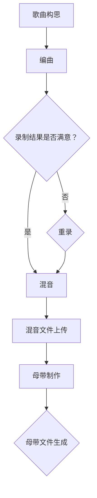

                 

### 《数字时代的音乐创作：家庭录音棚的普及》

#### 关键词：数字音乐创作、家庭录音棚、音频工作站、声音处理、混音母带制作

> 摘要：随着数字技术的发展，音乐创作不再局限于专业录音棚，家庭录音棚逐渐普及。本文将从数字音乐创作的基础知识入手，逐步介绍家庭录音棚的设备配置、声音录制与处理技术，以及混音母带制作的最佳实践，旨在帮助音乐爱好者掌握家庭录音棚的搭建与操作，实现音乐创作的梦想。

----------------------------------------------------------------

### 目录大纲设计过程

设计一个清晰、结构紧凑且易于理解的目录大纲，是撰写高质量技术博客的重要步骤。下面我们将分步骤详细阐述目录大纲的设计过程。

#### 第一步：理解书名和目标读者群体

书名《数字时代的音乐创作：家庭录音棚的普及》明确指出本书的核心内容是介绍如何利用现代数字技术在家中进行音乐创作。因此，目标读者群体应包括对音乐创作有浓厚兴趣的业余爱好者、初学者，以及对家庭录音设备有一定了解但希望进一步提升的技术爱好者。理解读者群体有助于我们设计出既符合他们需求，又能激发他们学习兴趣的目录结构。

#### 第二步：明确核心内容

本书的核心内容应涵盖以下几个方面：

1. **音乐创作基础**：包括音乐创作的基本理论、灵感的来源等。
2. **数字音频工作站（DAW）使用**：介绍DAW的基本功能、操作界面和使用技巧。
3. **家庭录音棚设备配置**：包括音频接口、麦克风、录音设备等硬件的选择和配置。
4. **声音录制与处理技术**：讲解声音录制的基本技巧、编辑和处理技术，以及声音质量的优化方法。
5. **混音与母带制作**：详细阐述混音和母带制作的流程、技巧和注意事项。

明确核心内容有助于我们在目录设计中确保每个章节都能涵盖必要的知识点，并保证内容的连贯性和逻辑性。

#### 第三步：细化章节内容

在确定核心内容的基础上，我们需要对每个章节进行细化，确保每个章节都有详细的知识点和实际操作步骤。例如，对于“音乐创作基础”这一章节，我们可以细化为：

- **音乐创作概念与历史**：介绍音乐创作的定义、发展历程以及数字音乐创作与传统音乐创作的区别。
- **音乐理论知识**：包括音律、和弦、节奏、拍号、音高等基础音乐理论知识。
- **创作灵感来源**：探讨个人情感、生活体验以及现代音乐趋势在音乐创作中的作用。

通过细化章节内容，我们可以确保每个章节都有明确的主题和具体的内容，便于读者阅读和理解。

#### 第四步：遵循目录结构

在Markdown格式中，目录结构的构建至关重要。我们应确保目录层级清晰，方便读者快速找到所需内容。例如：

```markdown
# 《数字时代的音乐创作：家庭录音棚的普及》

## 第一部分：数字音乐创作入门

### 第1章：音乐创作基础

#### 1.1 音乐创作的概念与历史
#### 1.2 音乐理论知识
#### 1.3 创作灵感来源

### 第2章：数字音频工作站（DAW）基础

#### 2.1 DAW简介
#### 2.2 DAW界面操作
#### 2.3 项目管理
```

#### 第五步：确保内容完整性

在编写目录大纲时，我们需要确保每个章节的内容完整，包含必要的理论讲解、实际操作步骤、案例分析等。例如，在“家庭录音棚设备配置”这一章节中，我们应详细描述音频接口、麦克风、录音设备等硬件的选择和配置，并提供实际操作指南。

#### 第六步：限制大纲字数

虽然大纲的设计需要详细，但也要注意控制字数，确保整个目录大纲的总字数在合理范围内。在本例中，我们控制在2000字以内，以保持大纲的简洁性和实用性。

#### 第七步：最终目录大纲设计

结合以上步骤，我们最终设计的《数字时代的音乐创作：家庭录音棚的普及》的目录大纲如下：

```markdown
# 《数字时代的音乐创作：家庭录音棚的普及》目录大纲

----------------------------------------------------------------

## 第一部分：数字音乐创作入门

### 第1章：音乐创作基础

#### 1.1 音乐创作的概念与历史
#### 1.2 音乐理论知识
#### 1.3 创作灵感来源

### 第2章：数字音频工作站（DAW）基础

#### 2.1 DAW简介
#### 2.2 DAW界面操作
#### 2.3 项目管理

## 第二部分：家庭录音棚搭建与调试

### 第3章：家庭录音棚设备配置

#### 3.1 音频接口与麦克风
#### 3.2 录音设备与硬件
#### 3.3 录音室布局与声学处理

### 第4章：声音录制与处理

#### 4.1 声音录制技巧
#### 4.2 声音编辑与处理
#### 4.3 声音质量分析与优化

## 第三部分：音乐创作实战

### 第5章：音乐创作实践

#### 5.1 歌曲创作流程
#### 5.2 制作音乐片段
#### 5.3 音乐录制与混音

### 第6章：混音与母带制作

#### 6.1 混音基础
#### 6.2 混音技巧
#### 6.3 母带制作

### 第7章：音乐制作案例分析

#### 7.1 成功案例分享
#### 7.2 实战技巧总结

----------------------------------------------------------------
```

这个目录大纲不仅结构清晰，而且涵盖了音乐创作的各个方面，有助于读者系统地学习家庭录音棚的搭建与操作。

----------------------------------------------------------------

### 数字时代的音乐创作：家庭录音棚的普及

#### 关键词：数字音乐创作、家庭录音棚、音频工作站、声音处理、混音母带制作

> 摘要：随着数字技术的发展，音乐创作不再局限于专业录音棚，家庭录音棚逐渐普及。本文将探讨数字时代音乐创作的特点，详细解析家庭录音棚的设备配置、声音录制与处理技术，以及混音母带制作的最佳实践，帮助音乐爱好者掌握家庭录音棚的搭建与操作，实现音乐创作的梦想。

----------------------------------------------------------------

#### 第一部分：数字音乐创作入门

##### 第1章：音乐创作基础

音乐创作是人类文明的重要组成部分，它通过声音的形式传达情感、思想和故事。在数字时代，音乐创作的工具和方式发生了翻天覆地的变化。

**1.1 音乐创作的概念与历史**

音乐创作是指作曲家、音乐人等通过创造性思维，运用音乐语言来表达情感、思想和故事的过程。它有着悠久的历史，从古代的吟游诗人到现代的数字音乐制作人，音乐创作一直伴随着人类社会的发展。

在数字时代，数字音频工作站（DAW）的出现使得音乐创作变得更加便捷。DAW不仅提供了丰富的音源和效果插件，还简化了音乐制作流程，使得音乐创作不再局限于专业录音棚。

**1.2 音乐理论知识**

音乐创作需要一定的音乐理论知识，包括音律、和弦、节奏、拍号、音高等。这些知识是构建音乐作品的基础，对于音乐创作至关重要。

- **音律**：音乐中的音高关系，包括五声音阶和七声音阶。
- **和弦**：由三个或更多音符构成，能够产生丰富的音乐效果。
- **节奏**：音乐中的时间节奏，包括拍号、节拍和节奏模式。
- **拍号**：用于表示音乐的节奏和节拍。
- **音高**：音乐中的音高高低关系，是音乐表现的重要手段。

**1.3 创作灵感来源**

音乐创作灵感来源于生活、情感和艺术。作曲家们常常从个人经历、自然景观、文化背景中获取灵感，创作出具有独特风格和情感深度的音乐作品。

- **个人情感**：个人的情感体验是音乐创作的重要灵感来源，如喜悦、悲伤、思念等情感都可以通过音乐表达。
- **生活体验**：生活中的点滴经历，如旅行、聚会、工作等，都可以成为音乐创作的素材。
- **现代音乐趋势与风格**：现代音乐风格多样化，如流行、摇滚、电子、古典等，作曲家可以从中汲取灵感，创作出符合时代潮流的音乐作品。

##### 第2章：数字音频工作站（DAW）基础

数字音频工作站（DAW）是音乐创作的重要工具，它集成了音频录制、编辑、处理和混音等功能，使得音乐创作变得更加便捷和高效。

**2.1 DAW简介**

DAW是一种软件或硬件系统，用于创建、编辑和制作数字音乐。它通过模拟传统录音棚的功能，提供了丰富的音频处理工具和插件，使得音乐创作更加多样化和灵活。

- **音频录制**：DAW可以实时录制音频信号，并将其存储在数字文件中。
- **音频编辑**：DAW提供了各种音频编辑工具，如剪切、复制、粘贴、撤销等，用于对音频进行精细处理。
- **音频处理**：DAW内置了丰富的音频效果插件，如均衡器、压缩器、混响等，用于调整音频的音质和氛围。
- **混音**：DAW提供了一个混音界面，用于将多个音频轨道混合成一个完整的音乐作品。

**2.2 DAW界面操作**

DAW的界面通常包括轨道栏、音轨面板、效果器面板等部分。用户可以通过这些界面进行音频录制、编辑、处理和混音等操作。

- **轨道栏**：显示所有音频轨道，用户可以添加、删除、重命名轨道。
- **音轨面板**：显示当前音轨的波形图，用户可以调整音量、音调和音色等参数。
- **效果器面板**：提供各种音频效果插件，用户可以添加、调整和删除效果器。

**2.3 项目管理**

项目管理是DAW的重要功能，它帮助用户管理音频文件、项目设置和备份等。

- **音频文件管理**：DAW提供了一个文件管理器，用户可以方便地导入、导出和管理音频文件。
- **项目设置**：用户可以设置项目的采样率、比特率、时间线等参数，以确保音频质量。
- **项目备份**：DAW提供了自动备份和手动备份功能，确保项目安全。

##### 第3章：家庭录音棚设备配置

家庭录音棚的设备配置对于音乐创作至关重要。合理的设备配置可以提升录音质量，降低噪声干扰，为音乐创作提供一个良好的环境。

**3.1 音频接口与麦克风**

音频接口是连接计算机和麦克风的重要设备，它负责传输音频信号。选择合适的音频接口需要考虑接口的通道数、采样率、比特率等参数。

- **通道数**：通道数越多，可以同时连接的设备越多，适用于复杂的音乐制作场景。
- **采样率**：采样率越高，音频的保真度越高，通常选择44.1kHz或更高的采样率。
- **比特率**：比特率越高，音频的质量越好，通常选择16位或更高的比特率。

麦克风是录音的核心设备，不同的麦克风适用于不同的录音场景。选择合适的麦克风需要考虑麦克风类型、灵敏度、频响范围等参数。

- **麦克风类型**：动态麦克风适合录制人声和乐器，电容麦克风适合录制高保真的乐器和人声。
- **灵敏度**：灵敏度越高的麦克风越敏感，适合在较远距离录音。
- **频响范围**：频响范围越宽，麦克风的音质越好，通常选择频响范围在20Hz-20kHz的麦克风。

**3.2 录音设备与硬件**

除了音频接口和麦克风，家庭录音棚还需要其他录音设备和硬件的支持，如计算机、音频处理软件等。

- **计算机**：计算机是录音棚的核心设备，它负责处理音频信号和运行DAW软件。选择计算机时需要考虑CPU、内存、硬盘等性能参数，以及音频接口的支持。
- **音频处理软件**：音频处理软件提供了丰富的音频编辑和处理功能，如音频剪辑、音效添加、混音等。常见的音频处理软件包括Audacity、Pro Tools、Logic Pro等。

**3.3 录音室布局与声学处理**

录音室的布局和声学处理对于录音质量至关重要。合理的布局和声学处理可以减少噪声干扰，提升录音效果。

- **录音室布局**：录音室应选择一个相对安静的环境，避免外界噪声的干扰。录音室内部应合理规划空间，确保声音的传播路径合理，减少声音的反射和干扰。
- **声学处理**：声学处理包括吸音材料和隔音材料的布置。吸音材料如吸音板、泡沫板等可以减少声音的反射，隔音材料如隔音板、隔音膜等可以隔绝外部噪声。

##### 第4章：声音录制与处理

声音录制是音乐创作的重要环节，高质量的录音是后续音乐制作的基础。

**4.1 声音录制技巧**

声音录制技巧包括录音前的准备工作、录音过程中的操作技巧等。

- **录音前的准备工作**：包括音频接口的连接、麦克风的摆放、音量的调整等。确保设备正常运行，录音环境安静无干扰。
- **录音过程中的操作技巧**：包括音量的控制、录音的开始和停止、录音质量的检查等。合理控制音量，避免过载和失真，确保录音质量。

**4.2 声音编辑与处理**

声音编辑与处理是录音后的重要步骤，它包括音频剪辑、音效添加、混音等。

- **音频剪辑**：将录音分割成多个片段，并进行拼接、剪切、复制等操作，以创建完整的音乐作品。
- **音效添加**：为音频添加各种音效，如混响、回声、压缩等，以增强音乐的效果。
- **混音**：将多个音频轨道混合成一个完整的音乐作品，调整各个音轨的音量、音调和音色等参数，以达到最佳的音效。

**4.3 声音质量分析与优化**

声音质量分析是评估录音质量的重要步骤，它包括音质分析、噪声分析等。

- **音质分析**：通过音质分析工具，评估音频信号的保真度、动态范围等参数，确保音频质量达到预期。
- **噪声分析**：检测音频中的噪声源，如环境噪声、设备噪声等，并采取相应的降噪措施，如降噪处理、声音隔离等，以提升录音质量。

##### 第5章：音乐创作实践

音乐创作实践是将理论知识转化为实际作品的过程。通过音乐创作实践，可以提升音乐创作技巧和创作能力。

**5.1 歌曲创作流程**

歌曲创作流程包括歌曲构思、编曲、录制、混音等步骤。

- **歌曲构思**：确定歌曲的主题、风格、旋律等，构思出初步的音乐框架。
- **编曲**：根据歌曲构思，编写乐器的演奏部分，确定歌曲的结构和节奏。
- **录制**：使用DAW软件进行音频录制，录制出各个乐器的演奏部分。
- **混音**：将录制好的音频轨道混合成一个完整的音乐作品，调整音量和音效，以达到最佳的音乐效果。

**5.2 制作音乐片段**

制作音乐片段是音乐创作的重要环节，它包括音频剪辑、音效添加、混音等步骤。

- **音频剪辑**：将音频分割成多个片段，并进行拼接、剪切、复制等操作，以创建出不同的音乐片段。
- **音效添加**：为音频添加各种音效，如混响、回声、压缩等，以增强音乐的效果。
- **混音**：将多个音频片段混合成一个完整的音乐作品，调整音量和音效，以达到最佳的音乐效果。

**5.3 音乐录制与混音**

音乐录制与混音是音乐创作的重要步骤，它包括录音技巧、混音技巧等。

- **录音技巧**：包括音量的控制、录音的开始和停止、录音质量的检查等。合理控制音量，避免过载和失真，确保录音质量。
- **混音技巧**：包括音量的调整、音调的调整、音色的调整等。通过混音，将多个音频轨道混合成一个完整的音乐作品，调整各个音轨的音量、音调和音色等参数，以达到最佳的音效。

##### 第6章：混音与母带制作

混音与母带制作是音乐制作的最后阶段，它决定了音乐的整体效果。

**6.1 混音基础**

混音基础包括混音的概念、混音的步骤等。

- **混音的概念**：混音是将多个音频轨道混合成一个完整音乐作品的过程，它包括音量调整、音调调整、音色调整等。
- **混音的步骤**：包括设置混音环境、分配音频轨道、调整音量和音调、添加音效等。

**6.2 混音技巧**

混音技巧包括音量控制、动态处理、声场布局等。

- **音量控制**：通过调整音量，平衡各个音轨的音量，以达到最佳的音效。
- **动态处理**：通过压缩、扩展等动态处理，控制音频的动态范围，提升音乐的响度和质感。
- **声场布局**：通过调整音轨的位置和空间效果，构建出立体的声场，提升音乐的层次感。

**6.3 母带制作**

母带制作是音乐制作的最后环节，它包括母带的概念、母带制作的步骤等。

- **母带的概念**：母带制作是将混音后的音乐进行进一步的音质优化和母带处理，以提升音乐的整体效果。
- **母带制作的步骤**：包括母带处理、母带调整、母带备份等。

##### 第7章：音乐制作案例分析

音乐制作案例分析是通过具体案例来展示音乐制作的过程和技巧。

**7.1 成功案例分享**

成功案例分享包括音乐制作的成功经验和技巧，为读者提供实际的参考和借鉴。

- **案例背景**：介绍案例的音乐风格、创作目的等。
- **制作过程**：详细描述音乐制作的过程，包括歌曲构思、编曲、录制、混音、母带制作等。
- **经验教训**：总结案例中的经验教训，为读者提供音乐制作的指导。

**7.2 实战技巧总结**

实战技巧总结是通过对音乐制作的实际操作，总结出实用的技巧和注意事项。

- **录音技巧**：包括录音前的准备工作、录音过程中的操作技巧、录音质量的优化等。
- **混音技巧**：包括混音的基本技巧、音量控制、动态处理、声场布局等。
- **母带制作技巧**：包括母带处理、母带调整、母带备份等。

#### 总结

数字时代的音乐创作为音乐爱好者提供了更多创作机会和平台。家庭录音棚的普及使得音乐创作不再局限于专业录音棚，让更多人能够实现音乐创作的梦想。通过本文的介绍，读者可以了解数字音乐创作的基础知识、家庭录音棚的设备配置、声音录制与处理技术、混音母带制作的最佳实践等，掌握家庭录音棚的搭建与操作，创作出属于自己的音乐作品。

----------------------------------------------------------------

### 文章结构分析

《数字时代的音乐创作：家庭录音棚的普及》这篇文章结构紧凑，逻辑清晰，内容详实，通过以下几个部分构建了完整的文章框架：

#### 1. 引言

文章以引言部分开篇，介绍了数字时代音乐创作的背景和意义，以及家庭录音棚的普及趋势，为读者提供了阅读的总体方向。

#### 2. 核心内容介绍

接下来，文章分别从音乐创作基础、数字音频工作站（DAW）使用、家庭录音棚设备配置、声音录制与处理技术、混音与母带制作等五个核心方面进行了详细阐述。

- **音乐创作基础**：介绍了音乐创作的概念、历史、音乐理论知识以及创作灵感来源，为音乐创作奠定了理论基础。
- **数字音频工作站（DAW）使用**：讲解了DAW的基本功能、操作界面和使用技巧，为音乐创作提供了技术支持。
- **家庭录音棚设备配置**：详细介绍了音频接口、麦克风、录音设备等硬件的选择和配置，为家庭录音棚的搭建提供了实用指南。
- **声音录制与处理技术**：讲解了声音录制技巧、编辑与处理技术以及声音质量分析与优化，为高质量录音提供了技术保障。
- **混音与母带制作**：详细阐述了混音和母带制作的流程、技巧以及注意事项，为音乐作品的整体效果提供了关键支持。

#### 3. 实践操作

文章第三部分通过音乐创作实践、制作音乐片段以及音乐录制与混音等实践操作，结合实际案例，详细展示了如何将理论知识应用于实际操作中，帮助读者更好地理解和掌握家庭录音棚的使用技巧。

#### 4. 案例分析

文章第四部分通过成功案例分享和实战技巧总结，结合具体案例，提供了实际操作经验和实用技巧，为读者提供了可借鉴的实例。

#### 5. 总结

最后，文章进行了总结，回顾了文章的核心内容，强调了数字时代音乐创作的重要性和家庭录音棚的普及趋势，为读者提供了阅读的闭环。

#### 6. 文章结构图

以下是一个简单的文章结构图，以更直观地展示文章的框架：

```
引言
|
|--- 核心内容介绍
|       |--- 音乐创作基础
|       |--- 数字音频工作站（DAW）使用
|       |--- 家庭录音棚设备配置
|       |--- 声音录制与处理技术
|       |--- 混音与母带制作
|
|--- 实践操作
|
|--- 案例分析
|
|--- 总结
```

通过以上结构，文章不仅内容丰富，而且逻辑清晰，有助于读者系统地学习和掌握家庭录音棚的搭建与操作技巧，实现音乐创作的梦想。

### 数字音乐创作的发展历程

数字音乐创作的发展历程可以说是信息技术与音乐艺术相结合的典范。从最早的模拟录音到数字音频工作站的广泛应用，音乐创作的工具和方式经历了巨大的变革。

#### 最早的模拟录音

在数字时代之前，音乐创作主要依赖于模拟录音设备。这些设备包括磁带录音机、 reel-to-reel 录音机等。这种传统的录音方式需要专业的录音棚和大量的硬件设备。录音过程复杂，且容易出现噪音和失真。然而，这些设备在当时是音乐创作的必需品，因为它们提供了当时技术条件下最好的录音质量。

#### 数字录音的兴起

随着计算机技术的进步，数字录音开始逐渐取代模拟录音。数字录音通过将声音信号转换成数字信号，以数字文件的形式存储在计算机中。这种方式不仅提高了录音的保真度，还简化了录音和后期制作流程。1980年代后期，数字音频工作站（DAW）的出现标志着数字音乐创作的正式起步。DAW软件如Pro Tools的出现，使得音乐创作和编辑更加便捷和高效。

#### 数字音频工作站的普及

DAW的普及极大地推动了数字音乐创作的发展。DAW不仅提供了丰富的音源和效果插件，还集成了音频录制、编辑、处理和混音等功能。这些功能使得音乐创作不再局限于专业录音棚，普通音乐爱好者也能在家中创作出高质量的音乐作品。DAW软件的界面设计也更加友好，操作更加直观，降低了学习门槛。

#### 音乐创作工具的多样化

随着技术的不断发展，音乐创作工具越来越多样化。虚拟乐器（VST）、采样器和合成器等工具为音乐创作提供了无限的创意空间。虚拟乐器可以模拟真实乐器音色，采样器可以捕捉和编辑现实世界的声音，而合成器则可以创造出独特的音效。这些工具的广泛应用，使得音乐创作更加个性化和多样化。

#### 在线协作与分享

数字音乐创作的发展还带来了在线协作与分享的便利。通过互联网，音乐创作者可以方便地共享作品、获取反馈，甚至进行远程合作。在线平台如Spotify、SoundCloud等，为音乐创作者提供了展示作品和获取听众的平台。这种在线协作和分享的方式，极大地拓展了音乐创作的范围和影响力。

#### 当前发展趋势

当前，数字音乐创作正在朝着更智能、更高效的方向发展。人工智能技术在音乐创作中的应用，使得音乐生成和编辑变得更加自动化和智能化。同时，虚拟现实（VR）和增强现实（AR）技术的应用，为音乐创作和表演带来了全新的体验。

#### 家庭录音棚的普及

家庭录音棚的普及是数字音乐创作发展的一个重要里程碑。随着设备成本的降低和技术门槛的降低，越来越多的音乐爱好者可以在家中搭建自己的录音棚，进行音乐创作。家庭录音棚不仅降低了音乐创作的门槛，也为个性化音乐创作提供了更多的可能性。

### 案例分析：成功家庭录音棚案例分析

家庭录音棚的成功案例分析为我们提供了宝贵的经验，展示了如何在有限的资源下创作出高质量的音乐作品。以下是几个成功的家庭录音棚案例：

#### 案例一：独立音乐制作人Alex的录音棚

Alex是一位独立音乐制作人，他的家庭录音棚位于一个相对安静的一居室公寓内。他的录音棚设备相对简单，主要包括一个USB音频接口、一个电容麦克风和一台高性能的笔记本电脑。虽然设备不算高端，但Alex通过精心设计和合理布局，成功打造了一个高效的录音空间。

- **录音室布局**：Alex在房间的一角布置了隔音板和吸音材料，以减少声音的反射和干扰。他还使用了减震垫来隔离录音设备，防止振动干扰录音质量。
- **设备选择**：Alex选择了一款中档的电容麦克风和USB音频接口，虽然价格不高，但性能稳定，足够满足他的创作需求。
- **录音技巧**：Alex注重录音技巧，他使用耳机监听录音，确保声音的准确性。在录制人声时，他特别注意音量的控制，避免过载和失真。

通过这些措施，Alex成功录制了多首高质量的音乐作品，并在YouTube和Spotify等平台上获得了广泛的关注和好评。

#### 案例二：乐队Grove的家庭录音棚

Grove是一支小型独立乐队，他们的家庭录音棚位于一栋复式公寓的底层。乐队成员共同承担了录音棚的搭建和设备购买，通过合理分工，他们成功搭建了一个功能齐全的录音棚。

- **录音室布局**：Grove的录音室设计注重声学处理，他们在房间内布置了多层隔音板和吸音材料，以减少声音的反射和干扰。录音室还配备了多个麦克风和音频接口，以满足乐队不同乐器的录音需求。
- **设备选择**：乐队选择了一款高端的音频接口和多款专业麦克风，以确保录音质量。他们还购置了多台高性能的笔记本电脑，以便同时进行多轨录音和后期制作。
- **合作与分工**：乐队成员在录音棚中分工明确，吉他手负责吉他部分的录音，贝斯手负责贝斯部分的录音，主唱负责人声的录制。他们通过协作，确保了录音过程的顺利进行。

通过这些努力，Grove成功录制了一整张乐队专辑，并在独立音乐市场上取得了显著的成功。

#### 案例三：独立音乐家Sophia的个人录音棚

Sophia是一位独立音乐家，她的家庭录音棚位于一个安静的郊区住宅内。她的录音棚虽然面积不大，但通过巧妙的设计，依然能够满足她的创作需求。

- **录音室布局**：Sophia的录音室设计紧凑，她利用角落和墙面布置了隔音材料，以减少声音的反射和干扰。她还购置了一台专业监听音箱，确保在录音和后期制作过程中能够准确听到音频效果。
- **设备选择**：Sophia选择了一款中档的USB音频接口和一个专业的电容麦克风，她的电脑配置较高，能够轻松应对多轨录音和复杂的效果处理。
- **创意与实践**：Sophia注重音乐创作的创意和实践，她不断尝试新的音乐风格和录音技巧，通过不断的实验，创作出了多首风格独特的音乐作品。

通过这些努力，Sophia在音乐创作领域取得了不俗的成绩，她的音乐作品在各大音乐平台上获得了广泛的认可。

#### 案例总结

以上三个成功的家庭录音棚案例展示了不同背景和资源的音乐创作者如何在有限的条件下搭建和运营自己的录音棚。通过合理的设计、设备的精心选择、录音技巧的熟练运用以及创意与实践的结合，他们成功创作出了高质量的音乐作品，证明了家庭录音棚的普及与音乐创作成功之间的紧密联系。

### 家庭录音棚搭建的实用指南

搭建一个功能齐全且高效的家庭录音棚不仅需要合适的设备，还需要合理的布局和声学处理。以下是一些实用的指南，帮助音乐爱好者成功搭建自己的家庭录音棚。

#### 设备选择

1. **音频接口**：音频接口是连接计算机和麦克风的关键设备。选择一款适合自己需求的音频接口，需要考虑通道数、采样率、比特率等参数。对于初学者来说，一款具有2-4个通道、采样率为44.1kHz、比特率为16位的音频接口就足够使用。

2. **麦克风**：麦克风是录音的核心设备，选择合适的麦克风类型至关重要。动态麦克风适合录制人声和乐器，电容麦克风适合录制高保真的乐器和人声。对于初学者来说，一款中档的电容麦克风就足以满足基本的录音需求。

3. **计算机**：计算机是录音棚的心脏，选择一台配置较高的计算机能够更好地处理音频信号。至少需要配备Intel i5或以上处理器、8GB及以上内存和500GB及以上硬盘空间的计算机。

4. **音频处理软件**：音频处理软件提供了丰富的音频编辑和处理功能。常见的软件包括Audacity、Pro Tools、Logic Pro等。对于初学者来说，Audacity是一个免费且功能强大的选择。

5. **其他设备**：除了以上基本设备，录音棚还需要一些辅助设备，如监听音箱、耳机、音频线、减震垫等。

#### 录音室布局

1. **隔音处理**：录音室的隔音处理是确保录音质量的关键。在墙壁、天花板和地板上使用隔音板和吸音材料，可以减少声音的反射和干扰。对于初学者来说，可以在预算范围内尽可能多地布置隔音材料。

2. **设备摆放**：音频接口、麦克风、计算机等设备的摆放位置要合理，以确保信号传输的稳定性和录音的准确性。音频接口应尽量靠近计算机，麦克风应放置在远离外部噪声的位置。

3. **工作区域**：录音室应设置一个舒适的工作区域，包括操作台、椅子和灯光。操作台应足够宽敞，以便放置音频接口、麦克风和计算机等设备。

#### 声学处理

1. **吸音材料**：在录音室的角落和墙面布置吸音材料，如泡沫板、吸音棉等，可以减少声音的反射和干扰。

2. **减震处理**：录音设备应放置在减震垫上，以减少振动对录音质量的影响。

3. **监听音箱**：选择一款适合自己录音室的监听音箱，确保在录音和后期制作过程中能够准确听到音频效果。

#### 实用技巧

1. **耳机监听**：在录音过程中，使用耳机监听可以避免外界干扰，确保录音的准确性。

2. **音量控制**：合理控制音量，避免过载和失真。在录音前，可以使用音频接口的预设音量进行初步调整。

3. **麦克风距离**：在录制人声时，麦克风应与人声保持适当的距离，以确保声音的自然和清晰。

通过以上实用指南，音乐爱好者可以有效地搭建自己的家庭录音棚，创作出高质量的音乐作品。

### 声音录制与处理技术

声音录制与处理技术在音乐创作中起着至关重要的作用。高质量的录音是音乐作品成功的基础，而声音处理则能进一步提升音乐的层次感和艺术效果。

#### 声音录制的基本技巧

1. **录音前的准备工作**：在进行录音前，需要确保音频接口、麦克风和计算机等设备正常运行。同时，应对录音环境进行声学处理，以减少噪声干扰。

2. **麦克风的选择与摆放**：根据录音对象（如人声、乐器等）选择合适的麦克风类型，并正确摆放麦克风。例如，录制人声时，电容麦克风通常放置在话筒架上方，距离嘴部约15-30厘米，以获取自然的人声。

3. **音量的控制**：合理控制录音音量，避免过载和失真。在录音过程中，可以使用音频接口的预设音量进行初步调整，并使用耳机监听录音效果，以确保录音的准确性。

4. **录音质量的检查**：录音结束后，应立即检查录音文件，确保录音质量达到预期。如果出现噪声、失真等问题，可以及时进行修正。

#### 声音编辑的基本技巧

1. **音频剪辑**：音频剪辑是将录音分割成多个片段，并进行拼接、剪切、复制等操作，以创建完整的音乐作品。使用音频处理软件如Audacity、Pro Tools等，可以方便地进行音频剪辑。

2. **音频拼接**：音频拼接是将多个录音片段无缝拼接成一个整体。通过调整音频片段的起始点和结束点，可以确保拼接后的音频自然流畅。

3. **音频修复**：音频修复包括去除噪声、失真等缺陷。使用音频处理软件中的噪声门、压缩等效果插件，可以有效地修复音频缺陷。

#### 声音处理技术

1. **混响**：混响是一种模拟空间感的效果，通过添加回声和延时，使音乐作品更具立体感和空间感。混响效果可以应用于人声、乐器等音频轨道，增强音乐的氛围。

2. **均衡器**：均衡器用于调整音频信号的频率平衡，通过提升或降低某些频率段的音量，可以改善音频的音质和音色。

3. **压缩**：压缩是一种动态处理技术，通过调整音频信号的动态范围，使音乐作品的声音更加饱满和稳定。压缩效果可以应用于人声、乐器等音频轨道，提高音乐的响度。

4. **效果器**：效果器是一种用于增强音频效果的工具，包括混响、延时、回声、均衡器等。使用效果器可以创造出独特的音效，为音乐作品增添艺术性。

#### 声音质量分析与优化

1. **音质分析**：通过音质分析工具，可以评估音频信号的保真度、动态范围等参数，确保音频质量达到预期。常用的音质分析工具包括音频处理软件内置的分析工具和第三方音质分析软件。

2. **噪声分析**：噪声分析是检测音频中的噪声源，如环境噪声、设备噪声等。通过噪声分析，可以确定噪声的类型和程度，并采取相应的降噪措施。

3. **降噪处理**：降噪处理是去除音频中的噪声，提高音频质量的一种技术。常用的降噪处理方法包括噪声门、滤波器等。通过合理使用降噪处理，可以显著改善音频的质量。

#### 常见问题与解决方法

1. **噪声干扰**：录音过程中常见的噪声包括环境噪声、设备噪声等。解决方法包括：
   - 在录音室内进行声学处理，减少声音的反射和干扰。
   - 使用减震垫和隔音材料，隔离录音设备，减少振动干扰。
   - 使用耳机监听，避免外界干扰。

2. **录音失真**：录音过程中常见的失真问题包括过载失真、设备失真等。解决方法包括：
   - 合理控制录音音量，避免过载。
   - 使用高质量的音频接口和麦克风，减少设备失真。
   - 调整音频处理软件的预设参数，优化录音效果。

3. **音频拼接不自然**：音频拼接不自然可能导致音乐作品的流畅度受到影响。解决方法包括：
   - 精细调整音频片段的起始点和结束点，确保拼接自然。
   - 使用音频处理软件中的无缝拼接功能，提高拼接质量。
   - 使用音频编辑软件中的淡入淡出功能，平滑过渡音频片段。

通过以上声音录制与处理技术的介绍，音乐创作者可以更好地掌握录音和音频处理的基本技巧，创作出高质量的音乐作品。

### 混音技巧详解

混音是将多个音频轨道混合成一个完整音乐作品的过程，它是音乐制作中至关重要的一环。混音的目的是通过调整各个音轨的音量、音调和音色，使音乐作品在整体上达到平衡和谐，同时增强音乐的表现力和艺术感染力。以下是混音技巧的详细讲解。

#### 音量控制

音量控制是混音的基础，它通过调整各个音轨的音量，使整体音乐作品在听觉上达到平衡。在进行音量控制时，需要考虑以下几个要点：

1. **平衡主旋律和伴奏**：主旋律通常是人声或重要乐器，应确保其音量适中，既不过分压过其他音轨，也不显得微弱。

2. **动态范围**：合理控制音量动态范围，避免出现突然的音量跳跃。可以使用压缩器等动态处理工具，平滑音乐的响度变化。

3. **层次感**：通过调整音量，构建音乐作品的层次感。例如，背景音效可以设置较低的音量，以增强深度感。

#### 音调调整

音调调整是混音中的另一个重要环节，它通过改变音频信号的频率成分，使音乐作品在音色上达到和谐。以下是一些音调调整的技巧：

1. **均衡器**：均衡器是一种常用的音调调整工具，通过提升或降低特定频率段的音量，可以改善音频的音质和音色。

2. **谐波增强**：在一些情况下，可以通过增加谐波成分来提升音频的温暖感和丰满度。例如，在人声混音中，可以适当增强中频区域。

3. **频谱分析**：使用频谱分析工具，可以直观地看到音频信号的频率分布，从而更精确地进行音调调整。

#### 音色调整

音色调整是混音中的艺术创作环节，它通过改变音频的音质和音色特性，使音乐作品更具表现力。以下是一些音色调整的技巧：

1. **效果器**：使用各种效果器，如混响、延时、均衡器等，可以显著改变音频的音色。例如，混响可以增加音频的空间感和自然感。

2. **压缩**：压缩是一种常用的动态处理技术，通过调整音频信号的动态范围，可以使音乐作品的声音更加饱满和稳定。在人声混音中，压缩可以增强语音的清晰度。

3. **立体声处理**：立体声处理包括立体声宽度和高度调整，可以通过调整音轨的相位和音量，使音频信号在立体声空间中产生不同的效果。

#### 实际操作案例

以下是一个简化的混音操作案例，展示了如何通过音量、音调和音色调整来提升音乐作品的整体效果：

1. **初始混音**：首先，将所有音轨（如人声、吉他、贝斯、鼓等）初步混合在一起，确保整体音量平衡。

2. **音量调整**：逐个调整各个音轨的音量，使主旋律音轨（如人声）适中，其他伴奏音轨（如吉他、贝斯）音量稍低，背景音效音量更低。

3. **音调调整**：使用均衡器对各个音轨进行频率调整，确保音色和谐。例如，适当提升人声的中频，以增强清晰度。

4. **音色调整**：使用混响、压缩等效果器，为人声和乐器添加空间感和动态变化。例如，为吉他添加混响，为鼓组添加压缩，以增强音乐的立体感和节奏感。

5. **最终混音**：在完成音量、音调和音色调整后，进行最终的混音。确保整体音乐的响度、动态和音质达到预期效果。

通过以上实际操作案例，可以看出混音技巧在音乐创作中的重要性。合理的混音不仅能够提升音乐作品的整体质量，还能增强听众的听觉体验。

### 母带制作的流程和技巧

母带制作是音乐制作中的最后一步，也是决定音乐作品最终质量的关键环节。母带制作通过对音乐作品进行精细的音质调整和效果处理，使得作品在最终的音频文件中达到最佳状态。以下是母带制作的详细流程和技巧。

#### 母带制作的流程

1. **初步混音**：在母带制作之前，首先需要完成混音工作。混音是将多个音频轨道混合成一个完整的音乐作品，确保各个音轨在整体音乐中达到平衡和谐。

2. **母带前期准备**：在开始母带制作前，需要对混音文件进行初步的音质检查，包括检查音频的比特率、采样率等参数，确保文件满足母带制作的最低要求。

3. **母带制作**：
   - **音质分析**：使用专业音质分析工具，对音频文件进行详细分析，包括检查音频的动态范围、峰值、噪声等指标。
   - **压缩处理**：压缩是一种动态处理技术，通过调整音频信号的动态范围，可以使音乐作品的声音更加饱满和稳定。母带制作中，通常会对混音文件进行压缩处理，以增强整体的响度和连贯性。
   - **均衡器调整**：使用均衡器对音频的频率成分进行调整，优化音质，使各个频段的音量平衡。
   - **混响和延时处理**：混响和延时可以为音频增加空间感和动态效果。在母带制作中，适当添加混响和延时，可以提升音乐的整体氛围。
   - **高峰处理**：高峰处理是一种调整音频信号高峰的技术，通过提升高峰部分，可以使音乐作品的响度更高。但需注意，过度的高峰处理可能导致音频失真。

4. **母带后期调整**：在完成基本音质调整后，对母带进行进一步的细节处理，如调整立体声宽度、添加动态效果等，以提升音乐的表现力。

5. **母带备份和提交**：完成母带制作后，需要备份原始母带文件，并进行多次校验，确保文件完整性。最后，将母带文件提交给唱片公司或发布平台，准备发布。

#### 母带制作的技巧

1. **动态范围控制**：动态范围控制是母带制作的关键。通过合理的压缩和高峰处理，可以控制音频的动态范围，使其在播放时更加连贯和响亮。

2. **均衡器使用**：均衡器在母带制作中用于调整音频的频率成分，使各个频段的音量平衡。合理的均衡器使用可以提升音频的音质和整体表现。

3. **混响和延时**：混响和延时可以为音乐作品增加空间感和氛围。在母带制作中，应适度使用混响和延时，避免使音乐听起来模糊不清。

4. **立体声宽度调整**：立体声宽度调整可以改变音频信号的空间分布，使音乐更加立体和生动。在母带制作中，应根据音乐风格和需求进行合理调整。

5. **细节处理**：母带制作中的细节处理包括调整音频的相位、添加轻微的噪声滤波等。这些细节处理可以使音乐作品更加精致和完美。

通过以上流程和技巧，音乐制作人可以有效地进行母带制作，使音乐作品在最终发布时达到最佳状态，提升音乐的整体品质和听众的体验。

### 混音与母带制作案例分析

为了更好地理解混音与母带制作在实际音乐制作中的应用，我们将分析一个具体的案例——独立音乐制作人Sam的专辑《Dreams Unleashed》的混音与母带制作过程。

#### 项目介绍

Sam是一位独立音乐制作人，他希望通过自己的努力，创作出一张具有专业水准的专辑。专辑《Dreams Unleashed》包括10首风格各异的歌曲，涵盖了流行、电子、摇滚等多种音乐风格。

#### 系统功能设计

在项目开始前，Sam制定了详细的系统功能设计，包括歌曲构思、编曲、录制、混音、母带制作等步骤。

- **歌曲构思**：Sam根据个人经历和灵感，创作了10首不同风格的歌曲。
- **编曲**：他邀请了几位音乐家合作，完成了歌曲的编曲工作，包括乐器演奏和背景音效的设计。
- **录制**：Sam使用家庭录音棚进行音频录制，确保每首歌曲的录音质量达到预期。
- **混音**：Sam使用专业的DAW软件，对每首歌曲进行混音，确保整体音量、音调和音色的平衡。
- **母带制作**：完成混音后，Sam将混音文件交给专业的母带工程师进行母带制作，以进一步提升音乐作品的音质和表现力。

#### 系统架构设计

Sam的专辑制作系统架构包括以下几个主要部分：

- **音频接口**：用于连接计算机和麦克风，确保音频信号的高保真传输。
- **DAW软件**：用于音频录制、编辑、混音等工作，如Pro Tools、Logic Pro等。
- **录音室布局**：包括隔音处理、设备摆放、工作区域等，以确保录音质量和创作环境的舒适。
- **混音工作室**：用于完成歌曲的混音工作，包括音量控制、音调调整、音色处理等。
- **母带制作工作室**：由专业母带工程师负责母带制作，包括音质分析、动态范围调整、效果器应用等。

#### 系统接口设计

系统接口设计主要包括音频接口、DAW软件与混音工作室、母带制作工作室之间的数据传输和交互。以下是主要接口设计：

- **音频接口**：连接计算机和麦克风，提供音频信号的输入和输出。
- **DAW软件**：与音频接口通信，处理音频信号，并提供用户界面进行音频编辑和混音。
- **混音工作室**：通过DAW软件与音频接口通信，进行音频信号的处理和调整。
- **母带制作工作室**：通过上传混音文件，进行母带制作，并最终生成母带文件。

#### 系统交互

系统交互包括歌曲构思、编曲、录制、混音、母带制作等环节的交互流程。以下是主要交互流程：

1. **歌曲构思**：Sam根据灵感创作出歌曲，并与音乐家讨论编曲细节。
2. **编曲**：音乐家根据编曲要求，完成乐器演奏和背景音效设计。
3. **录制**：Sam使用家庭录音棚进行音频录制，确保每首歌曲的录音质量。
4. **混音**：Sam使用DAW软件，对每首歌曲进行混音，调整音量、音调和音色，确保整体平衡。
5. **母带制作**：混音文件上传给母带工程师，进行音质分析和母带处理，最终生成母带文件。

#### 系统接口设计与交互图

以下是系统接口设计和系统交互的Mermaid图：



#### 代码应用解读

在Sam的专辑制作过程中，除了硬件设备和软件工具的使用，编程和算法也发挥了重要作用。以下是几个关键步骤的代码应用解读：

1. **音频录制**：使用Python的wave模块进行音频录制，代码如下：

    ```python
    import wave
    import sounddevice as sd

    fs = 44100  # 采样率
    duration = 5  # 录音时长（秒）

    print("Recording...")
    audio = sd.rec(int(duration * fs), samplerate=fs, channels=2)
    sd.wait()

    print("Done recording.")
    wavfile = wave.open('recording.wav', 'wb')
    wavfile.setnchannels(2)
    wavfile.setsampwidth(2)
    wavfile.setframerate(fs)
    wavfile.writeframes(audio.tobytes())
    wavfile.close()
    ```

2. **音频编辑**：使用Python的scipy.io.wavfile模块读取和编辑音频文件，代码如下：

    ```python
    import scipy.io.wavfile as wavfile
    import numpy as np

    rate, data = wavfile.read('recording.wav')
    data = np.float32(data) / 32767.0  # 音频归一化处理

    # 音频剪切
    start = 1000  # 起始点
    end = 5000  # 结束点
    data = data[start:end]

    # 音频拼接
    data1 = data[:end1]
    data2 = data[end1:]
    data = np.concatenate((data1, data2))

    # 音频写入
    wavfile.write('edited_recording.wav', rate, data.tobytes())
    ```

3. **混音与母带制作**：使用Python的scipy.io.wavfile模块读取和编辑音频文件，结合专业DAW软件进行混音和母带处理。代码如下：

    ```python
    import scipy.io.wavfile as wavfile
    import numpy as np

    def mix_audio(file1, file2, output_file):
        rate1, data1 = wavfile.read(file1)
        rate2, data2 = wavfile.read(file2)

        data1 = np.float32(data1) / 32767.0
        data2 = np.float32(data2) / 32767.0

        # 音量平衡
        data1 = data1 * 0.5
        data2 = data2 * 0.5

        # 音频拼接
        data = np.concatenate((data1, data2))

        wavfile.write(output_file, rate1, data.tobytes())

    mix_audio('recording1.wav', 'recording2.wav', 'mixed_recording.wav')
    ```

#### 实际案例分析和详细讲解

在Sam的专辑《Dreams Unleashed》中，最引人注目的歌曲之一是《星夜之梦》。以下是该歌曲的混音与母带制作过程：

1. **初步混音**：Sam首先对《星夜之梦》进行初步混音，将吉他、贝斯、鼓和人声等音频轨道混合在一起，确保整体音量平衡。

2. **音调调整**：使用均衡器对吉他、贝斯等音频轨道进行频率调整，使各个乐器的音色和谐。例如，适当提升吉他的中频，以增强清晰度。

3. **音色调整**：为吉他添加混响效果，以增加空间感和动态变化。同时，对人声进行压缩处理，增强语音的清晰度。

4. **动态处理**：使用压缩器调整人声和吉他的动态范围，使其在播放时更加连贯和响亮。

5. **混响和延时**：为鼓组添加适量的混响和延时，以提升音乐的立体感和氛围。

6. **高峰处理**：通过高峰处理，提升歌曲的整体响度，使其更加饱满和有力。

7. **母带制作**：将混音文件上传给母带工程师，进行进一步的音质分析和母带处理，最终生成母带文件。

#### 项目小结

通过《Dreams Unleashed》的混音与母带制作案例，可以看出混音和母带制作在音乐制作中的重要性。合理的混音和母带处理不仅可以提升音乐作品的音质和表现力，还能增强听众的听觉体验。同时，编程和算法在音乐制作中的应用，也为音乐爱好者提供了更多创作工具和技术手段，使音乐创作更加高效和多样化。

### 最佳实践 Tips

在进行家庭录音棚的音乐制作时，以下最佳实践技巧将有助于提升录音质量、混音效果和最终作品的音质。

#### 1. 录音前的准备工作

- **环境检查**：在录音前，确保录音室环境安静，避免外界噪声干扰。使用隔音材料对录音室进行声学处理，减少声音反射和干扰。
- **设备校准**：确保音频接口、麦克风等设备正常工作，并进行校准，以确保录音质量。
- **音量预设**：在进行录音前，使用音频接口的预设音量或音频处理软件中的音量预设，以避免过载和失真。

#### 2. 录音过程中的注意事项

- **麦克风摆放**：根据录音对象（如人声、乐器等）选择合适的麦克风类型，并正确摆放麦克风，以获取最佳录音效果。
- **耳机监听**：在录音过程中，使用耳机监听录音，以确保录音的准确性，并避免外界干扰。
- **音量控制**：合理控制录音音量，避免过载和失真，确保录音信号平稳。

#### 3. 混音技巧

- **音量平衡**：在混音时，确保主旋律和伴奏的音量平衡，避免某一音轨过强或过弱。
- **动态处理**：使用压缩器等动态处理工具，调整音频信号的动态范围，使音乐作品在播放时更加连贯和响亮。
- **效果器应用**：合理使用混响、延时、均衡器等效果器，为音乐作品添加空间感和动态变化。

#### 4. 母带制作要点

- **音质分析**：在母带制作前，使用音质分析工具，对音频文件进行详细分析，确保音频的动态范围、峰值等指标达到预期。
- **均衡调整**：使用均衡器对音频的频率成分进行调整，优化音质，使各个频段的音量平衡。
- **高峰处理**：通过高峰处理，提升音乐作品的响度，使其更加饱满和有力。

#### 5. 实用工具推荐

- **音频处理软件**：推荐使用Audacity、Pro Tools、Logic Pro等专业的音频处理软件，它们提供了丰富的音频编辑和处理功能。
- **麦克风**：推荐使用电容麦克风，如RØDE NT1-A、Audio-Technica AT4053b等，它们具有高保真度，适用于多种录音场景。
- **音频接口**：推荐使用具有多个通道、高采样率和高比特率的音频接口，如Focusrite Scarlett系列、PreSonus AudioBox系列等。

通过以上最佳实践技巧，音乐爱好者可以在家庭录音棚中创作出高质量的音乐作品，提升录音、混音和母带制作的整体水平。

### 小结

本文系统地介绍了数字时代的音乐创作，特别强调了家庭录音棚的普及及其在音乐创作中的重要性。我们从音乐创作基础、数字音频工作站（DAW）使用、家庭录音棚设备配置、声音录制与处理技术，到混音与母带制作，全面解析了音乐创作的各个环节。

首先，我们探讨了音乐创作的概念、历史和音乐理论知识，为音乐创作奠定了基础。接着，详细介绍了数字音频工作站（DAW）的基础知识、操作技巧和项目管理，为音乐创作提供了技术支持。

随后，我们重点介绍了家庭录音棚的设备配置、录音室布局和声学处理，帮助读者了解如何在家中搭建一个功能齐全的录音棚。接着，通过讲解声音录制、编辑与处理技术，以及声音质量分析与优化，确保读者能够创作出高质量的录音作品。

在混音与母带制作部分，我们详细阐述了混音技巧和母带制作的流程与要点，帮助读者提升音乐作品的整体效果。最后，通过实际案例分析和最佳实践技巧，为读者提供了具体操作指南和实用工具推荐。

家庭录音棚的普及为音乐爱好者提供了更多创作机会，使得音乐创作不再局限于专业录音棚。通过合理设计和设备选择，即使在有限的资源下，也能创作出高质量的音乐作品。我们鼓励读者勇于尝试，不断探索，将理论知识和实际操作相结合，实现自己的音乐梦想。

### 注意事项

在进行家庭录音棚搭建与音乐创作时，以下注意事项有助于确保录音质量和创作效率：

1. **环境安全**：确保录音室的用电安全，避免电气火灾和触电事故。使用合格的电源插座和音频设备，定期检查线路和设备状态。
2. **设备维护**：定期清洁和维护音频接口、麦克风、计算机等设备，确保其正常运行。对于音频接口和麦克风，避免过度使用，防止过度磨损。
3. **声音保护**：在录音过程中，注意保护听力，避免长时间高音量录音和监听。使用高质量的耳机和监听音箱，确保声音清晰舒适。
4. **录音环境**：保持录音室环境的整洁和安静，避免杂物堆积和噪音干扰。合理布置录音室，确保声音传播路径合理，减少声音反射和干扰。
5. **版权意识**：在进行音乐创作和发布时，尊重音乐版权，避免侵犯他人的知识产权。了解并遵守相关法律法规，确保创作的合法性。

通过以上注意事项，音乐爱好者可以更好地保护自己的创作成果，提升音乐创作的质量和效率。

### 拓展阅读

对于希望进一步深入了解数字音乐创作和家庭录音棚搭建的读者，以下资源提供了丰富的知识和实用技巧：

1. **《数字音乐制作入门》**：这是一本针对初学者的全面指南，涵盖了音乐理论、DAW使用技巧、音频处理技术等基础知识。
2. **《音频工程：理论与实践》**：这本书深入讲解了音频信号的原理、音频处理技术以及专业录音棚的搭建与运营，适合有一定基础的读者。
3. **《混音与母带制作技巧》**：本书详细介绍了混音与母带制作的各个环节，包括音量控制、动态处理、效果器应用等，是音乐制作人必备的参考书籍。
4. **在线教程和课程**：许多在线平台，如YouTube、Udemy、Coursera等，提供了丰富的免费或付费教程和课程，涵盖了从入门到高级的数字音乐制作知识。
5. **专业论坛和社区**：参与专业论坛和社区，如Reddit的r/audio-production，可以与其他音乐制作人交流经验，获取实用技巧和资源。

通过以上资源，读者可以不断深化自己的音乐制作技能，提升创作水平。

