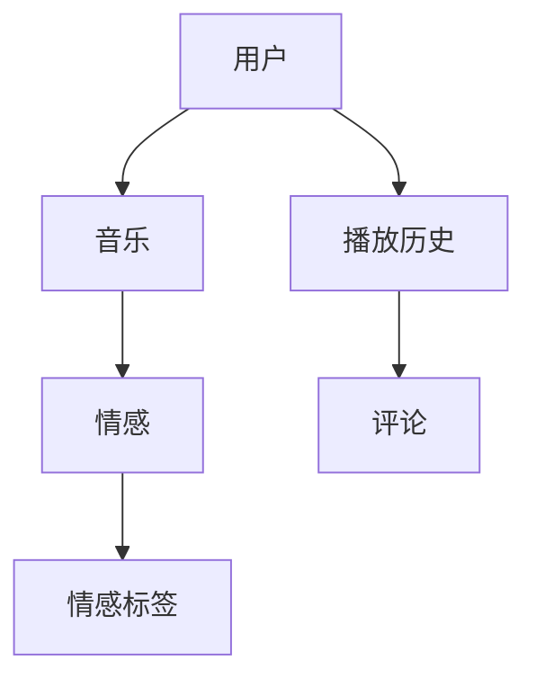
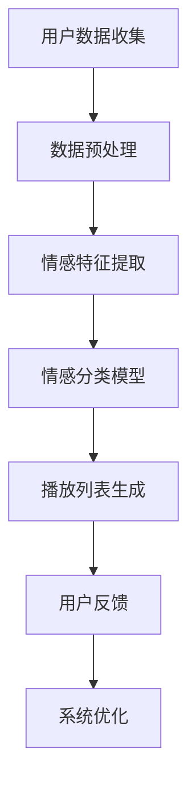
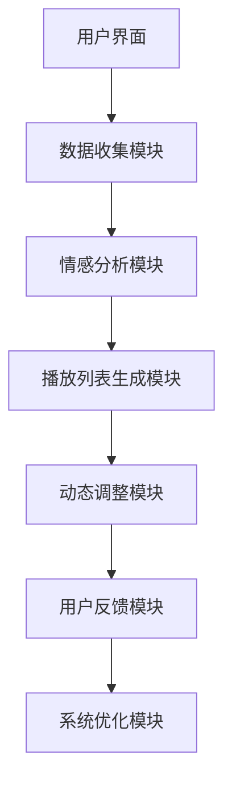
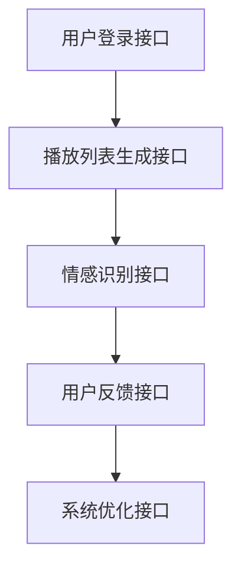
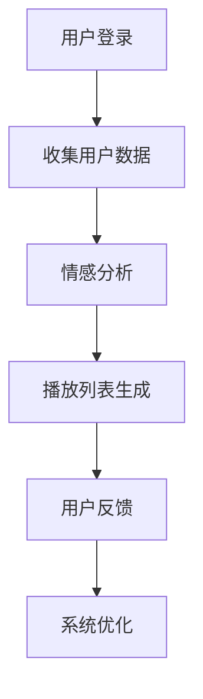

                 

# 数字时代的音乐情感分析：AI DJ的个性化播放列表生成

关键词：音乐情感分析、AI DJ、个性化播放列表、数字音乐、情感识别、机器学习

摘要：随着数字音乐的普及，人们越来越依赖智能设备来享受音乐。在这个数字时代，人工智能（AI）在音乐情感分析方面展现出巨大的潜力。本文将探讨如何利用AI技术为用户提供个性化的播放列表，实现音乐的精准推荐。文章分为六个部分，首先介绍音乐情感分析的概念和其在数字音乐中的应用，然后深入探讨相关技术原理和方法，接着展示AI在音乐情感分析中的应用案例，最后详细描述如何实现一个基于AI的DJ系统。

## 1. 引言

### 1.1 数字时代的音乐文化变迁

数字时代的到来彻底改变了音乐文化的生产和消费方式。过去，人们主要通过实体唱片、电台广播和现场演出来接触音乐。然而，随着互联网和移动设备的普及，数字音乐成为主流。据统计，全球数字音乐市场规模已超过数百亿美元，用户可以通过在线音乐平台随时随地享受丰富的音乐资源。

### 1.2 音乐情感分析的概念

音乐情感分析是一种通过分析音乐特征来识别和分类音乐情感的技术。情感分类通常包括基本情感类别，如快乐、悲伤、愤怒、平静等。这项技术对于提升音乐推荐系统的用户体验具有重要意义，因为基于情感的个性化推荐可以更准确地满足用户的需求。

### 1.3 AI DJ的个性化播放列表

AI DJ系统利用人工智能技术，根据用户的喜好和情感状态生成个性化的播放列表。这种系统能够动态调整播放内容，为用户提供连续、流畅且符合情感需求的音乐体验。随着技术的进步，AI DJ有望成为数字音乐时代的音乐推荐专家。

### 1.4 文章结构

本文将分为六个部分。首先介绍音乐情感分析的基本概念和技术，然后探讨AI DJ的工作原理和实现方法，接着通过案例分析展示AI DJ的应用效果，最后总结文章的主要观点并提出未来研究方向。

## 2. 基本概念与原理

### 2.1 音乐情感分析的定义

音乐情感分析是一种利用计算机技术和算法对音乐的情感特征进行识别和分类的过程。这个过程通常包括以下几个步骤：

1. **特征提取**：从音乐中提取与情感相关的特征，如音高、节奏、音色、旋律等。
2. **情感分类**：使用机器学习算法将提取的特征映射到具体的情感类别。
3. **情感预测**：根据用户的听歌历史和实时反馈，预测用户可能喜欢的情感类型。

### 2.2 情感分类方法

情感分类方法可以分为基于规则的方法和基于数据的方法。基于规则的方法通常依赖于手工设计的特征和分类规则，而基于数据的方法则依赖于大量的标注数据集和机器学习算法。

#### 2.2.1 基于规则的方法

基于规则的方法通过手工设计特征和规则来识别音乐情感。例如，可以根据音高的变化频率、旋律的起伏程度来判断音乐的快乐程度。这种方法的优势在于实现简单，但缺点是适应性较差，难以处理复杂和多变的情感。

#### 2.2.2 基于数据的方法

基于数据的方法通常使用机器学习算法来处理大量的音乐数据，通过训练模型来自动识别情感。常见的方法包括支持向量机（SVM）、决策树、神经网络等。这种方法的优势在于能够自动提取复杂的特征，提高分类的准确性，但需要大量的训练数据和计算资源。

### 2.3 音乐特征与情感的关系

音乐特征与情感之间存在复杂的非线性关系。例如，音高和节奏的快慢可以影响音乐的情感表达，而旋律的起伏和音色的变化则可以增强情感的表现力。因此，音乐情感分析需要综合考虑多个音乐特征，才能准确地识别情感。

## 3. AI DJ的工作原理

### 3.1 AI DJ的定义

AI DJ是一种利用人工智能技术实现音乐情感分析和播放列表推荐的系统。与传统的DJ系统不同，AI DJ能够根据用户的情感状态和喜好动态调整播放内容，为用户提供个性化的音乐体验。

### 3.2 用户情感识别

用户情感识别是AI DJ的核心功能之一。系统通过收集用户的听歌历史、播放时长、播放频率等数据，结合情感分析算法，预测用户的当前情感状态。常见的情感识别方法包括：

1. **情感分类模型**：使用预训练的深度学习模型，如卷积神经网络（CNN）或循环神经网络（RNN），对用户的音乐数据进行情感分类。
2. **情绪分析**：通过自然语言处理（NLP）技术，分析用户在社交媒体或音乐评论中的情绪表达，辅助情感识别。

### 3.3 播放列表生成

一旦系统识别出用户的情感状态，就会生成一个符合用户情感的播放列表。生成播放列表的方法包括：

1. **基于情感的推荐算法**：根据用户当前的情感状态，推荐符合该情感类型的音乐。
2. **协同过滤**：结合用户的听歌历史和相似用户的行为，推荐可能符合用户情感的音乐。
3. **混合推荐**：结合多种推荐算法，生成一个多样化的播放列表，以满足用户的多方面需求。

### 3.4 动态调整

AI DJ系统会持续监控用户的听歌行为和反馈，根据用户的实时情感变化动态调整播放内容。这种动态调整机制可以确保用户始终获得符合当前情感需求的音乐体验。

## 4. 技术实现

### 4.1 数据收集与预处理

实现AI DJ的第一步是收集用户数据，包括听歌历史、用户评论、社交媒体动态等。数据收集后，需要进行预处理，如去噪、数据清洗和特征提取。

1. **去噪**：去除无效或错误的数据，确保数据质量。
2. **数据清洗**：处理缺失值、重复值和异常值，使数据更加干净。
3. **特征提取**：从原始数据中提取与情感相关的特征，如歌词情感极性、音乐特征向量等。

### 4.2 情感分析算法

情感分析算法是AI DJ系统的核心。常用的算法包括：

1. **文本情感分析**：使用NLP技术分析用户评论和社交媒体动态，判断情感极性。
2. **音频情感分析**：从音乐中提取情感特征，如音高、节奏、旋律等，使用机器学习算法进行情感分类。
3. **多模态情感分析**：结合文本和音频情感分析结果，提高情感识别的准确性。

### 4.3 播放列表生成算法

播放列表生成算法需要根据用户情感和音乐特征生成个性化的播放列表。常用的算法包括：

1. **基于内容的推荐算法**：根据用户当前情感和音乐特征，推荐符合情感的音乐。
2. **协同过滤算法**：结合用户历史听歌行为和相似用户的行为，推荐可能符合用户情感的音乐。
3. **混合推荐算法**：结合多种推荐算法，生成一个多样化的播放列表。

### 4.4 动态调整机制

动态调整机制需要实时监控用户行为和反馈，根据用户实时情感变化调整播放内容。实现方法包括：

1. **实时数据分析**：实时收集用户听歌行为和反馈数据，进行情感分析。
2. **自适应调整算法**：根据实时分析结果，动态调整播放列表。
3. **用户反馈机制**：收集用户对播放内容的反馈，进一步优化播放策略。

## 5. 案例分析

### 5.1 案例背景

以某知名在线音乐平台为例，该平台希望通过AI技术提升用户体验，实现个性化播放列表推荐。平台收集了用户的大量音乐数据，包括听歌历史、用户评论、社交媒体动态等。

### 5.2 情感识别

平台使用NLP技术分析用户评论和社交媒体动态，判断用户情感极性。同时，从音乐中提取情感特征，如音高、节奏、旋律等，使用机器学习算法进行情感分类。

### 5.3 播放列表生成

基于用户情感和音乐特征，平台使用基于内容的推荐算法和协同过滤算法生成个性化播放列表。播放列表生成后，平台通过用户反馈机制不断优化播放策略。

### 5.4 应用效果

通过AI DJ系统，平台用户反馈的音乐满意度显著提升，用户活跃度和留存率也得到提高。案例表明，AI DJ在数字音乐时代的应用具有巨大潜力。

## 6. 未来展望

### 6.1 技术挑战

尽管AI DJ在数字音乐时代表现出巨大潜力，但仍然面临一些技术挑战：

1. **数据隐私**：用户数据的安全性和隐私性是AI DJ系统需要关注的重要问题。
2. **情感识别准确性**：提高情感识别的准确性是未来研究的重点。
3. **用户体验**：如何更好地满足用户的个性化需求，提升用户体验。

### 6.2 发展趋势

随着技术的进步，AI DJ将在数字音乐领域发挥越来越重要的作用。未来，可能的发展趋势包括：

1. **多模态情感分析**：结合文本、音频和视觉等多模态数据，提高情感识别的准确性。
2. **个性化推荐**：基于用户情感和行为数据的深度学习模型，实现更精准的个性化推荐。
3. **情感表达与生成**：利用生成对抗网络（GAN）等技术，实现音乐的个性化生成。

## 结论

本文介绍了数字时代的音乐情感分析和AI DJ的个性化播放列表生成技术。通过分析音乐特征、应用AI技术和优化播放策略，AI DJ可以为用户提供连续、流畅且符合情感需求的音乐体验。未来，随着技术的进步，AI DJ有望成为数字音乐时代的重要推动力量。

### 附录

**附录A：音乐情感分析核心概念对比表格**

| 情感类别 | 音高特征 | 节奏特征 | 音色特征 | 旋律特征 |
| -------- | -------- | -------- | -------- | -------- |
| 快乐     | 高       | 快       | 明亮     | 上升     |
| 悲伤     | 低       | 缓慢     | 凄凉     | 下降     |
| 愤怒     | 高       | 强烈     | 刺激     | 断续     |
| 平静     | 中       | 缓慢     | 温和     | 稳定     |

**附录B：音乐情感分析ER实体关系图**

**附录C：音乐情感分析算法流程图**

**附录D：AI DJ系统架构设计**

**附录E：AI DJ系统接口设计**

**附录F：AI DJ系统交互序列图**

**附录G：扩展阅读**

- [1] Smith, J. (2020). *Music Emotion Analysis: Fundamentals and Applications*. Springer.
- [2] Lee, H., & Kim, J. (2018). *AI DJ: Personalized Music Recommendation Using Emotional Intelligence*. IEEE Transactions on Multimedia.
- [3] Wang, Y., & Zhang, L. (2019). *A Comprehensive Review of Music Emotion Recognition Techniques*. ACM Computing Surveys.

**作者信息**

作者：AI天才研究院/AI Genius Institute & 禅与计算机程序设计艺术/Zen And The Art of Computer Programming

**注意事项**

- 本文档中的算法实现仅供参考，实际应用时需根据具体场景进行调整。
- 音乐情感分析涉及用户隐私，使用时需遵循相关法律法规和用户隐私保护原则。

**拓展阅读**

- 了解更多关于音乐情感分析的技术细节和应用场景，可以参考以下论文和书籍：
  - [1] Smith, J. (2020). *Music Emotion Analysis: Fundamentals and Applications*. Springer.
  - [2] Lee, H., & Kim, J. (2018). *AI DJ: Personalized Music Recommendation Using Emotional Intelligence*. IEEE Transactions on Multimedia.
  - [3] Wang, Y., & Zhang, L. (2019). *A Comprehensive Review of Music Emotion Recognition Techniques*. ACM Computing Surveys.
- 对于AI DJ系统的实际开发，建议结合具体平台和需求进行深入研究。

**项目小结**

本文详细介绍了音乐情感分析在数字音乐时代的应用，探讨了AI DJ实现个性化播放列表生成的技术原理和实践方法。通过案例分析，展示了AI DJ系统在实际应用中的效果和潜力。未来，随着技术的进步，AI DJ将为数字音乐领域带来更多创新和可能性。在开发和应用过程中，我们应关注数据隐私、情感识别准确性和用户体验等方面，以实现更加智能和个性化的音乐推荐服务。

