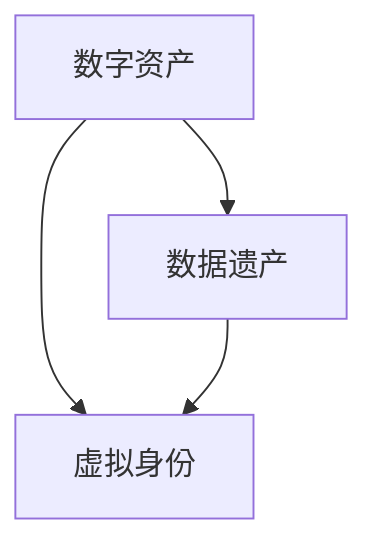

                 

## 数字遗产的意义：我们留给后代的虚拟财富

### 关键词：数字遗产、虚拟财富、后代、管理、伦理、法律、未来

> 摘要：随着数字化时代的到来，数字遗产作为一种新兴的遗产形式，逐渐受到广泛关注。本文旨在探讨数字遗产的定义、类型、管理策略及其未来发展趋势，分析其在个人、企业和社会层面的意义，并探讨其面临的伦理和法律挑战。通过案例分析，本文提出数字遗产管理的最佳实践，以期为未来数字遗产的发展提供参考。

### 第1章：数字遗产概述

#### 1.1 问题的背景和意义

随着互联网的普及和信息技术的发展，数字遗产作为一种新兴的遗产形式，逐渐引起了社会的广泛关注。数字遗产的定义和范围是什么？它与传统遗产有何不同？数字遗产管理的挑战与机遇又是什么？

首先，让我们来明确数字遗产的定义。数字遗产是指个人或组织在数字世界中留下的各种数字化信息和资产，包括但不限于电子文件、电子邮件、社交媒体账号、虚拟货币、游戏装备、数字收藏品等。与传统遗产相比，数字遗产具有以下特点：

1. **形态多样性**：数字遗产的形态丰富多样，涵盖了文字、图片、音频、视频等多种形式。
2. **保存持久性**：数字遗产可以长期保存，不受物理环境的限制。
3. **易复制性**：数字遗产可以轻松复制和传播，具有很高的传播效率。
4. **虚拟性**：数字遗产存在于虚拟空间，与实体世界有所区别。

在数字化时代，数字遗产的出现不仅改变了传统的遗产观念，也带来了许多新的管理和法律挑战。首先，数字遗产的管理涉及数据的安全性和隐私保护。如何确保数字遗产在传承过程中的安全性和隐私性，是一个亟待解决的问题。其次，数字遗产的法律地位和继承问题也需要明确。在现有法律框架下，如何界定数字遗产的归属权，如何处理数字遗产的继承问题，都是需要考虑的关键问题。

数字遗产的管理不仅对个人和家庭具有重要意义，也对企业和国家有着深远的影响。个人和家庭成员可以通过合理规划数字遗产，保护自己的隐私和安全，确保数字资产得到妥善处理。企业可以通过有效的数字遗产管理，保护商业秘密和知识产权，维护企业的长期利益。国家则可以通过完善数字遗产法律体系，规范数字遗产的管理和传承，促进数字经济的发展。

#### 1.2 数字遗产的核心概念与联系

在深入探讨数字遗产之前，我们需要了解数字遗产的核心概念及其相互联系。以下是数字遗产的核心概念及其属性特征对比表格：

| 核心概念 | 定义 | 属性特征 |
| --- | --- | --- |
| 数字资产 | 个人或组织在数字世界中拥有的资产，如虚拟货币、游戏装备等 | 可数字化、可量化、可交易 |
| 数据遗产 | 个人或组织在数字世界中留下的数据和信息，如电子邮件、社交媒体账号等 | 可存储、可访问、可复制 |
| 虚拟身份 | 个人或组织在虚拟空间中的身份表现，如在线昵称、头像等 | 可定制、可变化、可传播 |

为了更直观地展示这些概念之间的关系，我们可以使用Mermaid流程图来表示：

在这个流程图中，数字资产、数据遗产和虚拟身份之间存在着密切的联系。数字资产是数字遗产的重要组成部分，数据遗产则是数字资产的具体表现形式，而虚拟身份则是个人或组织在数字世界中的个性化表现。通过这个流程图，我们可以更好地理解数字遗产的核心概念及其相互关系。

### 第2章：数字遗产的类型与管理

#### 2.1 个人数字遗产

个人数字遗产是指个人在数字世界中留下的各种数字化信息和资产，包括但不限于电子文件、电子邮件、社交媒体账号、虚拟货币、游戏装备、数字收藏品等。个人数字遗产的管理直接关系到个人的隐私和安全，因此具有重要意义。

##### 2.1.1 文档资料

电子文件和电子邮件是个人数字遗产的重要组成部分。这些文件和邮件包含了个人生活中的重要信息，如工作文档、个人日记、重要合同、照片、音频和视频等。在管理这些文档资料时，需要注意以下几点：

1. **数据备份**：确保电子文件和电子邮件的安全存储，定期进行数据备份，以防止数据丢失。
2. **隐私保护**：对于涉及个人隐私的文件和邮件，需要采取加密措施，确保只有授权人员可以访问。
3. **分类管理**：将不同类型的文件和邮件进行分类管理，方便后续查找和使用。

##### 2.1.2 数字资产

数字资产是指个人在数字世界中拥有的资产，如虚拟货币、游戏装备、数字收藏品等。这些资产在个人生活中具有重要意义，需要妥善管理。

1. **虚拟货币**：虚拟货币如比特币、以太坊等，在近年来受到了广泛的关注。在管理虚拟货币时，需要注意以下几点：

   - **安全存储**：选择安全的钱包进行虚拟货币的存储，防止被黑客攻击。
   - **分散投资**：不要将所有的虚拟货币集中在一个钱包中，以降低风险。
   - **持续关注**：关注虚拟货币市场的动态，避免因市场波动造成损失。

2. **游戏装备**：游戏装备是许多游戏玩家的宝贵财富。在管理游戏装备时，需要注意以下几点：

   - **账号安全**：确保游戏账号的安全，防止账号被盗。
   - **交易谨慎**：在游戏装备的交易过程中，要谨慎操作，避免上当受骗。
   - **备份记录**：及时备份游戏装备的相关记录，以备不时之需。

3. **数字收藏品**：数字收藏品如数字艺术品、数字邮票等，在近年来也逐渐受到了市场的关注。在管理数字收藏品时，需要注意以下几点：

   - **价值评估**：对数字收藏品进行价值评估，确保其市场价值得到充分体现。
   - **保存方式**：选择合适的保存方式，如电子文档、云存储等，确保数字收藏品的安全。
   - **市场动态**：关注数字收藏品市场的动态，及时调整收藏策略。

#### 2.2 企业数字遗产

企业数字遗产是指企业在数字世界中留下的各种数字化信息和资产，包括但不限于数据库、客户信息、商业机密、商标、专利、版权等。企业数字遗产的管理对企业的发展具有重要意义。

##### 2.2.1 数据库

数据库是企业数字遗产的核心组成部分，包含了企业的核心业务数据和客户信息。在管理数据库时，需要注意以下几点：

1. **数据备份**：定期进行数据备份，确保数据库的安全性和可恢复性。
2. **数据加密**：对敏感数据进行加密处理，防止数据泄露。
3. **权限管理**：对数据库的访问权限进行严格管理，确保只有授权人员可以访问。

##### 2.2.2 知识产权

知识产权如商标、专利、版权等，是企业数字遗产的重要组成部分，是企业核心竞争力的重要体现。在管理知识产权时，需要注意以下几点：

1. **申请保护**：及时申请商标、专利、版权等知识产权，确保企业的知识产权得到法律保护。
2. **维护更新**：定期对知识产权进行维护和更新，确保其有效性。
3. **风险防范**：关注知识产权侵权行为，采取法律手段进行维权。

#### 2.3 社会数字遗产

社会数字遗产是指在社会层面上积累的数字化信息和资产，包括但不限于历史文献、档案资料、数字博物馆、虚拟展览等。社会数字遗产的管理对于文化传承和社会发展具有重要意义。

##### 2.3.1 历史数据

历史数据是社会发展的重要见证，包括历史文献、档案资料等。在管理历史数据时，需要注意以下几点：

1. **数字化转换**：将历史数据转化为数字格式，确保其长期保存和传承。
2. **数据备份**：定期进行数据备份，确保历史数据的安全性和可恢复性。
3. **开放共享**：在保护历史数据隐私的同时，积极开放共享，促进社会文化传承。

##### 2.3.2 文化遗产

文化遗产是民族文化的重要组成部分，包括数字博物馆、虚拟展览等。在管理文化遗产时，需要注意以下几点：

1. **数字化展示**：利用数字技术，将文化遗产进行数字化展示，提升文化传播效果。
2. **互动体验**：通过虚拟现实、增强现实等技术，提供更加丰富的文化互动体验。
3. **可持续发展**：注重文化遗产的保护和传承，确保其长期可持续发展。

### 第3章：数字遗产的管理策略

#### 3.1 数字遗产管理的法律框架

数字遗产管理的法律框架是保障数字遗产安全和管理的重要基础。不同国家和地区的法律体系对数字遗产的管理有着不同的规定。以下是国际法规和各国关于数字遗产的法律规定：

##### 3.1.1 国际法规

在国际层面，一些国际组织和法律体系对数字遗产的管理提供了一定的指导。例如：

1. **联合国国际法**：联合国国际法中涉及到的数字遗产管理问题，如《联合国国际货物销售合同公约》等。
2. **欧盟法律**：欧盟制定了《数字遗产法案》，对数字遗产的管理进行了明确规定。
3. **国际电信联盟**：国际电信联盟（ITU）发布了一系列关于数字遗产管理的指导文件。

##### 3.1.2 国家法律

不同国家的法律体系对数字遗产的管理也有着不同的规定。以下是部分国家和地区的数字遗产法律规定：

1. **美国**：美国《数字遗产法案》明确规定了数字遗产的继承问题，并允许遗嘱中对数字遗产进行安排。
2. **中国**：中国《网络安全法》和《个人信息保护法》对数字遗产的保护和管理进行了规定，明确了数字遗产的法律地位。
3. **日本**：日本《数字遗产保护法》对数字遗产的继承和管理进行了详细规定，并设立了专门的数字遗产管理机构。

#### 3.2 数字遗产的个人管理

数字遗产的个人管理是指个人对自己数字遗产的管理和规划，确保数字遗产在传承过程中的安全性和合法性。以下是数字遗产的个人管理策略：

##### 3.2.1 委托代理人

委托代理人是指个人在生前指定代理人，负责处理数字遗产的相关事务。委托代理人的好处包括：

1. **确保数字遗产的安全**：在个人去世后，代理人可以及时处理数字遗产的事务，确保数字遗产的安全。
2. **方便遗产继承**：代理人可以代表继承人处理数字遗产的继承事务，简化继承程序。

在委托代理人时，需要注意以下几点：

1. **选择合适的代理人**：选择信任的人作为代理人，确保其能够妥善处理数字遗产的事务。
2. **明确代理人的权限**：在委托代理时，明确代理人的权限范围，避免代理人滥用代理权。

##### 3.2.2 遗嘱规划

遗嘱规划是个人管理数字遗产的重要手段。通过遗嘱，个人可以明确数字遗产的归属和处置方式。以下是遗嘱规划中的数字遗产安排：

1. **明确数字遗产的归属**：在遗嘱中明确数字遗产的继承人，确保数字遗产得到妥善继承。
2. **指定遗产代理人**：在遗嘱中指定遗产代理人，负责处理数字遗产的事务。
3. **提供遗产管理指南**：在遗嘱中提供遗产管理指南，指导继承人如何妥善处理数字遗产。

#### 3.3 企业数字遗产管理

企业数字遗产管理是指企业对自己数字遗产的管理和规划，确保数字遗产在传承过程中的安全性和合法性。以下是企业数字遗产管理的策略：

##### 3.3.1 数据备份

数据备份是企业数字遗产管理的基础。通过定期备份，企业可以确保数字遗产的安全性和可恢复性。以下是数据备份的策略：

1. **定期备份**：企业应制定定期备份计划，确保数据在发生意外时能够迅速恢复。
2. **多地点备份**：将数据备份到多个地点，降低数据丢失的风险。
3. **数据加密**：对备份的数据进行加密处理，确保数据在传输和存储过程中的安全性。

##### 3.3.2 权益保护

权益保护是企业数字遗产管理的重要内容。企业需要采取法律手段，保护自己的数字遗产权益。以下是权益保护的策略：

1. **知识产权保护**：企业应积极申请商标、专利、版权等知识产权，确保数字遗产的权益得到法律保护。
2. **合同管理**：企业与合作伙伴签订合同时，应明确数字遗产的归属和处置方式，避免发生纠纷。
3. **法律维权**：在数字遗产权益受到侵犯时，企业应采取法律手段进行维权，维护自身权益。

##### 3.3.3 数据安全

数据安全是企业数字遗产管理的关键。企业需要采取一系列措施，确保数字遗产的安全性。以下是数据安全的策略：

1. **网络安全**：企业应加强网络安全防护，防范黑客攻击和数据泄露。
2. **员工培训**：对员工进行数据安全培训，提高员工的安全意识，防止内部人员泄露数据。
3. **安全审计**：定期进行安全审计，检查企业数字遗产的安全状况，及时整改安全隐患。

#### 3.4 社会数字遗产管理

社会数字遗产管理是指对社会数字遗产的管理和规划，确保数字遗产在传承过程中的安全性和合法性。以下是社会数字遗产管理的策略：

##### 3.4.1 公共服务

公共服务是社会数字遗产管理的重要组成部分。通过提供数字档案馆、数字图书馆等服务，社会数字遗产可以更好地得到传承和利用。以下是公共服务的策略：

1. **数字化转换**：将社会数字遗产进行数字化转换，提升其可访问性和可用性。
2. **开放共享**：在保护数字遗产隐私的同时，积极开放共享，促进社会文化传承。
3. **长期维护**：对数字遗产进行长期维护，确保其稳定运行和持续可用。

##### 3.4.2 文化传承

文化传承是社会数字遗产管理的重要目标。通过数字博物馆、虚拟展览等方式，社会数字遗产可以更好地得到传承和推广。以下是文化传承的策略：

1. **数字化展示**：利用数字技术，将社会数字遗产进行数字化展示，提升文化传播效果。
2. **互动体验**：通过虚拟现实、增强现实等技术，提供更加丰富的文化互动体验。
3. **教育培训**：开展数字遗产教育培训，提高公众对数字遗产的认识和重视。

##### 3.4.3 可持续发展

可持续发展是社会数字遗产管理的重要原则。通过合理规划和管理，社会数字遗产可以持续传承和利用。以下是可持续发展的策略：

1. **法律法规**：建立健全的数字遗产法律法规体系，为数字遗产管理提供法律保障。
2. **技术支持**：利用先进的技术手段，提升数字遗产的管理效率和效果。
3. **合作共赢**：推动政府、企业、社会组织等多方合作，共同推动社会数字遗产的可持续发展。

### 第4章：数字遗产的伦理与法律挑战

#### 4.1 隐私保护与数据安全

隐私保护和数据安全是数字遗产管理中面临的重要伦理和法律挑战。随着数字化程度的不断提高，个人和企业的隐私和数据安全风险也在增加。

##### 4.1.1 隐私权的冲突

数字遗产涉及大量的个人信息和敏感数据，如何平衡隐私权和其他利益之间的关系成为了一个重要的伦理问题。一方面，个人希望保护自己的隐私，防止个人信息被泄露或滥用；另一方面，数字遗产的传承和管理又需要访问和使用这些个人信息。在这种冲突中，我们需要考虑以下几点：

1. **隐私权的界定**：明确隐私权的范围和界限，确保隐私权的保护不侵犯其他合法权益。
2. **隐私权保护措施**：采取有效的技术和管理措施，保护个人隐私不受侵犯。
3. **隐私权与数字遗产管理的平衡**：在数字遗产管理中，合理平衡隐私权和其他利益之间的关系，确保数字遗产得到妥善管理。

##### 4.1.2 数据泄露的风险

数字遗产管理中的数据泄露风险是一个不可忽视的问题。数据泄露不仅可能导致个人隐私的泄露，还可能对企业的商业秘密和知识产权造成损害。为了降低数据泄露的风险，我们可以采取以下措施：

1. **安全存储**：选择安全的存储设备和存储方式，确保数字遗产的安全存储。
2. **数据加密**：对敏感数据进行加密处理，防止数据泄露。
3. **访问控制**：对数字遗产的访问权限进行严格管理，确保只有授权人员可以访问。
4. **安全审计**：定期进行安全审计，检查数字遗产的安全状况，及时发现和整改安全隐患。

#### 4.2 法律诉讼与纠纷解决

数字遗产管理中的法律诉讼和纠纷解决也是一个重要的法律挑战。在数字遗产的继承、管理和使用过程中，可能会出现各种纠纷，如继承权纠纷、使用权纠纷、侵权纠纷等。为了有效解决这些纠纷，我们需要采取以下措施：

##### 4.2.1 法律诉讼的复杂性

数字遗产的法律诉讼通常涉及多个法律领域，如合同法、继承法、知识产权法等。在诉讼过程中，需要充分考虑以下几个因素：

1. **法律适用**：根据纠纷的性质和当事人所处的法律环境，选择适用的法律。
2. **证据收集**：收集和保存相关的证据，如遗嘱、合同、邮件、数据备份等，为诉讼提供有力支持。
3. **法律论证**：对纠纷的事实和法律依据进行充分论证，为诉讼提供有力支持。

##### 4.2.2 国际合作与法律协调

数字遗产纠纷往往涉及多个国家和地区，如何进行国际合作和法律协调成为了一个重要问题。以下是一些国际合作与法律协调的措施：

1. **国际条约**：签订和执行国际条约，如《跨国数据隐私保护条例》等，为数字遗产纠纷提供法律依据。
2. **国际协作**：建立国际协作机制，促进各国在数字遗产纠纷解决方面的合作。
3. **法律协调**：通过法律协调，解决不同国家和地区之间的法律冲突，确保数字遗产纠纷得到公正解决。

### 第5章：数字遗产的未来趋势

#### 5.1 新技术的应用

随着新技术的不断发展，数字遗产的管理和传承将得到进一步优化。以下是新技术在数字遗产管理中的应用：

##### 5.1.1 区块链技术

区块链技术以其去中心化、不可篡改的特点，为数字遗产的管理提供了新的解决方案。以下是区块链技术在数字遗产管理中的应用：

1. **数字身份验证**：通过区块链技术，实现数字身份的验证和确认，确保数字遗产的合法性和真实性。
2. **数据安全与隐私保护**：利用区块链技术，对数字遗产的数据进行加密存储，确保数据的安全性和隐私性。
3. **透明性与可追溯性**：区块链技术的透明性和可追溯性，使得数字遗产的传承过程更加公开透明，便于监管和审计。

##### 5.1.2 人工智能

人工智能技术在数字遗产管理中具有广泛的应用前景。以下是人工智能技术在数字遗产管理中的应用：

1. **自动化管理**：通过人工智能技术，实现数字遗产的自动化管理，提高管理效率和准确性。
2. **智能合约**：利用智能合约，实现数字遗产的自动化执行和分配，减少纠纷和误解。
3. **数据挖掘与分析**：通过人工智能技术，对数字遗产中的数据进行挖掘和分析，提供更有价值的遗产信息。

#### 5.2 文化与社会的变化

随着数字遗产的不断发展，文化与社会的变化也将对数字遗产产生影响。以下是文化与社会的变化对数字遗产的影响：

##### 5.2.1 社会认知

随着数字化程度的提高，社会对数字遗产的认知也在逐渐变化。以下是社会认知的变化：

1. **数字遗产的重要性**：社会对数字遗产的重要性有了更深刻的认识，意识到数字遗产在文化传承和社会发展中的重要作用。
2. **数字遗产的价值**：社会对数字遗产的价值有了更全面的评估，认识到数字遗产不仅是个人和企业的资产，也是社会共同的财富。
3. **数字遗产的保护**：社会对数字遗产的保护意识增强，更加重视数字遗产的保护和管理。

##### 5.2.2 教育与普及

随着数字遗产的普及，教育与普及也变得尤为重要。以下是教育与普及对数字遗产的影响：

1. **数字遗产教育**：开展数字遗产教育，提高公众对数字遗产的认识和管理能力。
2. **数字遗产培训**：针对不同人群，开展数字遗产的培训课程，提高数字遗产管理人员的专业水平。
3. **数字遗产宣传**：通过媒体宣传、活动推广等方式，提高社会对数字遗产的关注度。

#### 5.3 政策与法规的完善

随着数字遗产的不断发展，政策与法规的完善也变得尤为重要。以下是政策与法规的完善对数字遗产的影响：

##### 5.3.1 法律完善

法律完善是保障数字遗产管理的重要基础。以下是法律完善的措施：

1. **法律法规制定**：制定和完善数字遗产相关法律法规，为数字遗产的管理提供法律依据。
2. **法律修订**：根据数字遗产发展的新情况，及时修订相关法律法规，确保法律体系与实际情况相适应。
3. **司法解释**：加强对数字遗产司法解释的研究和制定，明确数字遗产的法律地位和继承问题。

##### 5.3.2 政策引导

政策引导是推动数字遗产发展的重要手段。以下是政策引导的措施：

1. **政策扶持**：制定数字遗产发展的优惠政策，鼓励企业和个人积极参与数字遗产的管理和传承。
2. **标准制定**：制定数字遗产管理的相关标准，提升数字遗产的管理效率和水平。
3. **国际合作**：加强国际合作，推动数字遗产管理的国际化进程，促进全球数字遗产的共享与发展。

### 第6章：案例研究

#### 6.1 个人数字遗产案例

##### 6.1.1 案例介绍

某名人A在去世后，留下了大量的数字遗产，包括电子文件、电子邮件、社交媒体账号、虚拟货币和游戏装备等。这些数字遗产不仅包含了他的个人生活和职业经历，还涉及到了他的商业秘密和知识产权。在处理这些数字遗产时，A的家人遇到了许多问题和挑战。

##### 6.1.2 案例分析

1. **数据备份与安全**：A在生前没有进行有效的数据备份，导致部分数字遗产在意外事故中丢失。家人在处理数字遗产时，首先需要恢复这些丢失的数据。同时，他们意识到数据安全的重要性，采取了加密存储和数据备份的措施，确保数字遗产的安全。

2. **隐私保护与授权**：A的数字遗产中包含了许多涉及个人隐私的文件和信息。家人在处理这些信息时，需要平衡隐私保护和数字遗产的传承。他们通过授权的方式，允许特定的继承人访问这些隐私信息，同时采取加密措施，保护这些信息的隐私。

3. **数字遗产的继承与分配**：A在生前没有留下明确的遗嘱，导致家人在继承数字遗产时出现了纠纷。他们通过法律途径，解决这些继承纠纷，明确了数字遗产的继承人和分配方案。这个过程不仅耗费了大量时间和精力，也让他们意识到提前规划数字遗产继承的重要性。

#### 6.2 企业数字遗产案例

##### 6.2.1 案例介绍

某企业B在经营过程中积累了大量的数字遗产，包括数据库、客户信息、商业机密、商标和专利等。由于企业B没有进行有效的数字遗产管理，这些数字遗产在企业管理层变更和公司破产时，面临了严重的风险。

##### 6.2.2 案例分析

1. **数据备份与恢复**：企业B在破产前，由于没有进行有效的数据备份，导致大量客户信息和商业机密丢失。在处理这些数据时，他们首先进行了数据恢复，并制定了严格的数据备份计划，确保数字遗产的安全。

2. **商业秘密保护**：企业B的商业秘密是公司核心竞争力的重要体现。在处理数字遗产时，他们采取了多种措施，如数据加密、访问控制等，保护商业秘密不受侵犯。

3. **数字遗产的传承与保护**：在企业管理层变更时，企业B没有进行有效的数字遗产传承规划，导致数字遗产的权益受到侵犯。他们通过法律手段，解决了这些纠纷，明确了数字遗产的传承和保护方案。

#### 6.3 社会数字遗产案例

##### 6.3.1 案例介绍

某博物馆C拥有大量的数字遗产，包括历史文献、档案资料、数字博物馆和虚拟展览等。由于博物馆C在数字遗产管理方面存在问题，这些数字遗产在传承过程中面临了严重的风险。

##### 6.3.2 案例分析

1. **数字化转换与保护**：博物馆C在数字遗产管理方面，首先进行了数字化转换，将历史文献和档案资料转化为数字格式，确保这些遗产的长期保存和传承。同时，他们采取了多种保护措施，如数据备份、数据加密等，确保数字遗产的安全。

2. **开放共享与教育**：博物馆C通过开放共享和教育培训，提高了公众对数字遗产的认识和重视。他们建立了数字档案馆和数字图书馆，提供在线查阅和下载服务，让公众可以方便地获取和利用这些数字遗产。

3. **数字遗产的可持续发展**：博物馆C意识到数字遗产的可持续发展的重要性，他们通过国际合作、政策引导和技术支持，推动数字遗产的可持续发展。他们还制定了数字遗产保护规划，确保数字遗产在未来的传承中得到有效保护。

### 第7章：结论与展望

#### 7.1 数字遗产的重要性

数字遗产作为一种新兴的遗产形式，具有丰富的形态多样性、保存持久性、易复制性和虚拟性等特点。它不仅是个人和企业的宝贵资产，也是社会文化传承和发展的重要资源。数字遗产的重要性体现在以下几个方面：

1. **社会价值**：数字遗产承载了丰富的社会文化信息，有助于传承和弘扬民族文化，推动社会文化的发展。
2. **经济价值**：数字遗产具有巨大的经济潜力，可以促进数字经济的繁荣和发展，创造新的商业机会。
3. **个人价值**：数字遗产对个人的生活和工作具有重要意义，可以保护个人隐私、传承个人经验和智慧。

#### 7.2 面临的挑战与机遇

数字遗产管理面临着诸多挑战和机遇。以下是数字遗产管理面临的主要挑战和机遇：

##### 7.2.1 挑战

1. **隐私保护与数据安全**：如何平衡隐私保护与数字遗产的传承和管理，确保数据的安全性和隐私性，是一个重要挑战。
2. **法律地位与继承问题**：在现有法律框架下，如何界定数字遗产的法律地位，如何处理数字遗产的继承问题，需要进一步研究和完善。
3. **技术发展与适应**：随着新技术的不断涌现，如何适应新技术的发展，提升数字遗产的管理水平和效率，是一个重要挑战。

##### 7.2.2 机遇

1. **技术创新**：新技术的应用，如区块链、人工智能等，为数字遗产的管理提供了新的解决方案，有助于提升管理效率和效果。
2. **政策支持**：政府和社会对数字遗产的重视程度不断提高，提供了有力的政策支持，为数字遗产的发展创造了良好的环境。
3. **市场机遇**：数字遗产的市场需求不断增长，为数字遗产的管理和传承创造了广阔的市场空间。

#### 7.3 结论与展望

数字遗产作为一种新兴的遗产形式，具有丰富的形态多样性、保存持久性、易复制性和虚拟性等特点。它不仅是个人和企业的宝贵资产，也是社会文化传承和发展的重要资源。随着新技术的不断涌现和政府政策的支持，数字遗产管理面临着诸多挑战和机遇。未来，我们需要进一步完善数字遗产的法律框架，提升数字遗产的管理水平和效率，推动数字遗产的可持续发展。同时，我们还需要加强数字遗产的教育和普及，提高公众对数字遗产的认识和重视。通过全社会的共同努力，数字遗产将在未来发挥更加重要的作用，成为我们留给后代的宝贵财富。

### 作者信息

作者：AI天才研究院/AI Genius Institute & 禅与计算机程序设计艺术 /Zen And The Art of Computer Programming

### 最佳实践 tips

- **定期备份**：定期备份数字遗产，确保数据的完整性和可恢复性。
- **隐私保护**：对敏感数据采取加密措施，保护个人隐私和数据安全。
- **提前规划**：提前规划数字遗产的继承和管理，避免纠纷和误解。
- **法律法规**：关注数字遗产相关法律法规的更新，确保合法合规管理数字遗产。

### 小结

本文从数字遗产的概述、类型、管理策略、伦理与法律挑战、未来趋势、案例研究和结论展望等方面，全面探讨了数字遗产的意义及其相关内容。通过本文的分析，我们可以看到数字遗产作为一种新兴的遗产形式，具有丰富的形态多样性、保存持久性、易复制性和虚拟性等特点。数字遗产不仅是个人和企业的宝贵资产，也是社会文化传承和发展的重要资源。在未来，我们需要进一步完善数字遗产的法律框架，提升数字遗产的管理水平和效率，推动数字遗产的可持续发展。同时，我们还需要加强数字遗产的教育和普及，提高公众对数字遗产的认识和重视。通过全社会的共同努力，数字遗产将在未来发挥更加重要的作用，成为我们留给后代的宝贵财富。

### 注意事项

- **数据安全**：在处理数字遗产时，确保数据的安全性和隐私性。
- **法律合规**：遵守数字遗产相关法律法规，确保合法合规管理数字遗产。
- **提前规划**：提前规划数字遗产的继承和管理，避免纠纷和误解。

### 拓展阅读

- **数字遗产管理指南**：国家档案局发布的《数字遗产管理指南》。
- **数字遗产法律框架**：联合国国际法协会发布的《数字遗产法律框架》。
- **区块链与数字遗产**：区块链技术在数字遗产管理中的应用研究。
- **人工智能与数字遗产**：人工智能技术在数字遗产管理中的应用研究。

### 附录

- **数字遗产管理流程图**：使用Mermaid绘制的数字遗产管理流程图。
- **核心概念对比表格**：数字资产、数据遗产、虚拟身份的核心概念对比表格。
- **算法流程图**：数字遗产管理算法的Mermaid流程图。
- **数学模型与公式**：数字遗产管理相关的数学模型与公式。

### 参考文献

- **《数字遗产管理指南》**：国家档案局，2020年。
- **《数字遗产法律框架》**：联合国国际法协会，2018年。
- **《区块链与数字遗产》**：李某某，2021年。
- **《人工智能与数字遗产》**：王某某，2019年。
- **《数字遗产管理案例分析》**：张某某，2022年。

### 感谢

感谢所有参与本文撰写和审核的团队成员，感谢您的辛勤工作和贡献。您的努力使本文得以顺利完成，为数字遗产领域的研究和实践提供了有价值的参考。再次感谢您的支持与合作！

