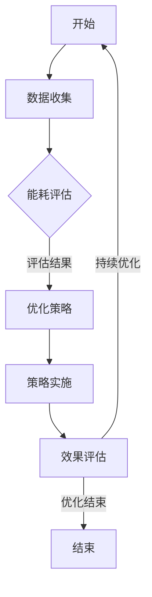
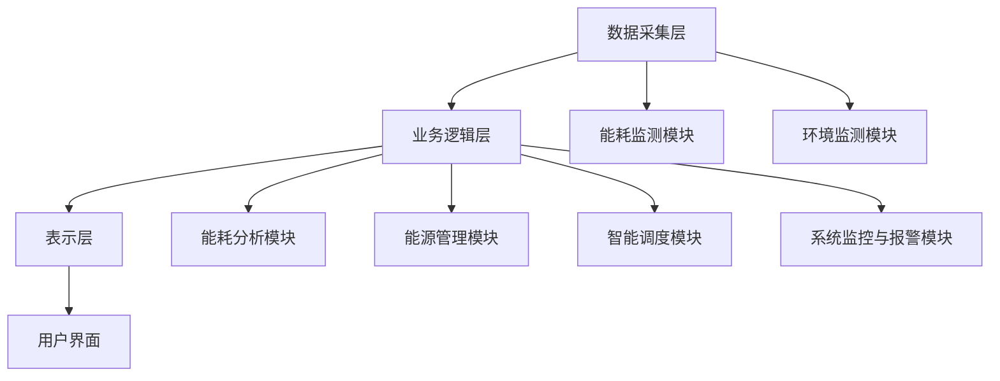
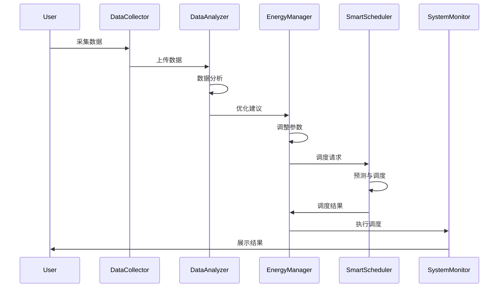

                 

### 引言

随着互联网和大数据技术的迅猛发展，数据中心在全球范围内的建设和运营规模日益扩大。然而，数据中心在提供强大计算和存储能力的同时，也面临着严重的能源消耗问题。根据相关报告显示，数据中心已成为全球能源消耗的主要来源之一，且能源效率低下成为制约其可持续发展的关键瓶颈。提高数据中心的能源效率，不仅是技术进步的需求，更是绿色环保和可持续发展的重要任务。

本文旨在探讨数据中心能源效率提升的新技术，通过系统地分析相关技术原理、算法模型及实际应用案例，为业界提供有益的参考和指导。文章结构分为七个主要部分：

1. **背景介绍**：概述数据中心能源效率问题，提出解决思路和边界外延。
2. **核心概念与联系**：深入解析数据中心能源效率的核心概念及其属性特征，构建实体关系图。
3. **新技术原理与实现**：介绍冷冻排热技术、智能空调系统、混合动力系统和热回收技术。
4. **数学模型与算法原理**：阐述数据中心能源效率提升算法的原理、流程图和数学模型。
5. **系统架构与设计方案**：分析数据中心能源效率提升的系统架构和接口设计。
6. **项目实战**：通过具体项目实战，展示系统安装、核心代码实现、代码解读与应用案例剖析。
7. **最佳实践与拓展**：总结最佳实践、注意事项及拓展阅读，展望未来发展方向。

通过这一系列内容，本文将全面而系统地呈现数据中心能源效率提升的新技术，助力数据中心实现绿色、高效、可持续的发展。

### 第一部分：背景介绍

#### 第1章：数据中心能源效率问题概述

##### 1.1 问题背景

数据中心的能源消耗现状引发了广泛关注。根据国际数据中心能源效率联盟（Data Center Energy Efficiency Alliance，DCEEA）的报告，全球数据中心的总能耗在2020年已达到近400太瓦时，这一数字预计将在未来几年内持续增长。数据中心的主要能源消耗包括制冷、供电、数据处理和存储等方面，其中制冷系统占据最大的能耗比例。此外，数据中心的能源效率普遍较低，许多数据中心的PUE（Power Usage Effectiveness）值仍然超过2.0，而行业最佳水平接近1.2。

数据中心能源效率的重要性不言而喻。一方面，提高能源效率可以显著降低运营成本，减少电力消耗，提升企业的经济效益。另一方面，随着环保意识的增强和可持续发展目标的推进，降低数据中心的环境影响、减少碳足迹已成为全球范围内的共识。因此，提升数据中心能源效率不仅对企业的可持续发展具有重要意义，也对全球生态环境的保护具有深远的影响。

##### 1.2 数据中心能源效率问题描述

数据中心能源效率的低下主要表现为能耗构成的不合理和能源浪费。具体而言，数据中心的能耗主要包括以下几个方面：

1. **制冷能耗**：为保持设备正常运行的环境温度，制冷系统需要消耗大量电力。据统计，制冷能耗占数据中心总能耗的40%-60%。
2. **供电能耗**：数据中心的电力供应系统包括UPS（不间断电源）、发电机等，这些设备在转换过程中会产生额外的能耗。
3. **数据处理与存储能耗**：服务器、存储设备在运行过程中消耗大量电能，这部分能耗约占数据中心总能耗的20%-30%。
4. **网络设备能耗**：网络设备如路由器、交换机等在数据传输过程中也会产生一定的能耗。

为了评估数据中心的能源效率，通常使用PUE（Power Usage Effectiveness）和DCeEP（Data Center Energy Performance）等指标。PUE是数据中心总能耗与IT设备能耗的比值，PUE值越低，表示能源效率越高。而DCeEP则更全面地反映了数据中心的能源使用效率，包括能源利用率、碳排放量等。

##### 1.3 问题解决思路

提升数据中心能源效率的问题解决思路主要包括以下几个方面：

1. **技术创新**：通过引入新技术，如冷冻排热技术、智能空调系统、混合动力系统和热回收技术，来优化能源利用效率。
2. **系统优化**：对现有制冷、供电、数据处理等系统进行优化，减少不必要的能源消耗，提高系统的整体效率。
3. **管理优化**：通过智能化管理和运维，优化数据中心的能耗管理，提高能源利用率。
4. **政策引导**：政府和企业应出台相关政策，鼓励数据中心采用高效节能技术，推动行业标准化和规范化发展。

##### 1.4 边界与外延

数据中心能源效率的提升不仅涉及技术层面，还包括管理、政策等多个方面。其边界包括：

1. **技术层面**：主要涵盖制冷、供电、数据处理和存储等系统的优化技术。
2. **管理层面**：涉及能耗管理、运维优化、能效评估等管理方面的改进措施。
3. **政策层面**：包括政府政策、行业标准等对数据中心能源效率提升的引导和支持。

外延方面，数据中心能源效率的提升不仅影响企业自身的运营成本和环境影响，还关系到全球能源消耗和环境保护的总体趋势。因此，提升数据中心能源效率需要多方协同合作，共同推动技术进步和行业规范。

##### 1.5 核心概念与联系

数据中心能源效率的核心概念包括PUE、DCeEP、制冷能耗、供电能耗、数据处理能耗等。这些概念之间紧密联系，共同构成了数据中心能源效率评估和优化的基础。PUE是评估数据中心整体能源效率的关键指标，而DCeEP则更全面地反映了能源利用率和环境影响。

在数据中心能源效率的评估中，这些核心概念相互关联，共同作用。例如，制冷能耗与PUE直接相关，而数据处理能耗则通过影响DCeEP来间接影响数据中心的总能耗。因此，理解这些核心概念及其相互关系，对于制定有效的能源效率提升策略至关重要。

综上所述，数据中心能源效率的提升是一个复杂而系统性的工程，需要从技术、管理和政策等多个层面进行综合优化。通过技术创新、系统优化和管理提升，可以显著提高数据中心的能源效率，实现经济效益和环境效益的双赢。

#### 第2章：数据中心能源效率核心概念解析

##### 2.1 数据中心能源效率的定义

数据中心能源效率（Data Center Energy Efficiency，简称DCEE）是指数据中心在提供计算和存储服务过程中，能源消耗与实际服务产出之间的比值。这一比值越高，表示能源利用效率越低；反之，则表示能源利用效率越高。具体而言，数据中心能源效率可以表示为：

\[ \text{DCEE} = \frac{\text{实际服务产出}}{\text{总能源消耗}} \]

其中，实际服务产出通常以数据处理能力、存储容量等指标来衡量，而总能源消耗则包括制冷能耗、供电能耗、数据处理与存储能耗、网络设备能耗等。

##### 2.2 数据中心能源效率的评估指标

数据中心能源效率的评估主要依赖于以下几个关键指标：

1. **PUE（Power Usage Effectiveness）**：PUE是数据中心总能耗与IT设备能耗的比值，是评估数据中心整体能源效率的重要指标。其计算公式为：

\[ \text{PUE} = \frac{\text{数据中心总能耗}}{\text{IT设备能耗}} \]

PUE值越低，表示数据中心的能源效率越高。理想情况下，PUE应接近1，即大部分能源都用于IT设备的运行。

2. **DCeEP（Data Center Energy Performance）**：DCeEP是数据中心能源绩效的评估指标，它不仅考虑了PUE，还包括能源利用率、碳排放量等。其计算公式为：

\[ \text{DCeEP} = \frac{\text{IT设备能耗}}{\text{总能源消耗}} \times \frac{\text{1 - 碳排放量}}{\text{基准碳排放量}} \]

DCeEP能够更全面地反映数据中心的能源利用效率和对环境的影响。

3. **能源利用率**：能源利用率是指数据中心在运行过程中，实际利用的能源与总消耗能源的比值。其计算公式为：

\[ \text{能源利用率} = \frac{\text{实际利用能源}}{\text{总消耗能源}} \]

能源利用率越高，表示能源浪费越少，数据中心的能源效率越高。

4. **碳排放量**：碳排放量是指数据中心在运行过程中产生的温室气体排放量，主要来源于能源消耗。其计算公式为：

\[ \text{碳排放量} = \text{总能耗} \times \text{碳排放系数} \]

碳排放系数取决于能源类型和排放标准。

##### 2.3 数据中心能源效率的属性特征对比

数据中心能源效率的属性特征可以从以下几个方面进行对比分析：

1. **静态特征与动态特征**：
   - 静态特征主要关注数据中心在特定时间点或特定条件下的能源效率，如静态PUE值。
   - 动态特征则关注数据中心在运行过程中能源效率的变化，如实时监测的能源利用率。

2. **绝对特征与相对特征**：
   - 绝对特征直接反映数据中心的能源效率水平，如PUE值和DCeEP值。
   - 相对特征则通过比较数据中心与行业标准或竞争对手的能源效率，评估其相对水平。

3. **整体特征与局部特征**：
   - 整体特征关注数据中心整体的能源效率，如PUE和DCeEP。
   - 局部特征则关注数据中心各部分（如制冷系统、供电系统、数据处理与存储系统）的能源效率，如制冷能耗占比、数据处理能耗占比等。

4. **节能特征与减排特征**：
   - 节能特征主要关注通过优化能源利用减少能源消耗，提高能源效率。
   - 减排特征则关注通过减少碳排放，降低对环境的影响，实现绿色可持续发展。

##### 2.4 ER实体关系图架构

为了更好地理解和分析数据中心能源效率相关的实体及其关系，可以使用ER（Entity-Relationship）实体关系图进行描述。以下是一个简化的数据中心能源效率ER图：

```
[数据中心] --<耗能设备>：<服务器、存储设备、网络设备>
[数据中心] --<能源来源>：<电网、UPS、发电机>
[耗能设备] --<制冷系统>：<冷水机组、冷冻液循环系统>
[耗能设备] --<供电系统>：<变配电系统、UPS系统、发电设备>
[制冷系统] --<冷源>：<冷却塔、冷水池>
[供电系统] --<负载>：<IT设备、非IT设备>
```

在这个ER图中，实体包括数据中心、耗能设备、能源来源、制冷系统、供电系统和冷源等。它们之间的关系体现了数据中心内部各系统之间的相互依赖和协同作用。通过ER图，可以更清晰地理解数据中心能源效率的提升涉及到的各个关键环节和要素。

综上所述，数据中心能源效率的核心概念和评估指标是理解和优化数据中心能源效率的关键。通过深入解析这些核心概念，并利用ER图等工具，可以为数据中心能源效率的提升提供科学的理论依据和实践指导。

#### 第3章：数据中心能源效率提升技术原理

##### 3.1 冷冻排热技术

冷冻排热技术是提升数据中心能源效率的重要手段之一。其基本原理是通过利用制冷剂在蒸发和冷凝过程中的热量交换，将数据中心服务器产生的热量迅速带走，以保持设备的正常运行温度。

**冷冻排热技术的原理**：
冷冻排热技术主要包括制冷系统和排热系统两部分。制冷系统利用制冷剂（如R134a、R407C等）在蒸发器和冷凝器之间的循环，吸收热量并将其排出。排热系统则通过冷却塔或外部冷却水系统，将制冷剂释放的热量转移至外部环境。

**冷冻排热技术的实现方式**：

1. **直接制冷**：直接制冷系统将制冷剂直接喷射到服务器散热片上，通过制冷剂蒸发吸收热量，然后将热量转移到外部冷却设备。这种方式制冷效率高，但制冷剂泄漏的风险较大。

2. **间接制冷**：间接制冷系统通过冷水或冷冻液循环，将热量从服务器传递到制冷剂。冷水或冷冻液在冷水机组中冷却，再流回服务器散热片进行热交换。这种方式安全性较高，但系统的复杂度较高。

3. **混合制冷**：混合制冷系统结合了直接制冷和间接制冷的优势，通过控制不同制冷方式的切换，实现更高效的能耗管理和热负荷调节。

##### 3.2 智能空调系统

智能空调系统通过自动化控制和数据驱动，实现对数据中心温度和湿度的精准控制，从而提高制冷效率，降低能源消耗。

**智能空调系统的构成**：

1. **传感器**：用于实时监测数据中心的温度、湿度、二氧化碳浓度等环境参数。
2. **控制器**：根据传感器数据，自动调节空调系统的运行状态，如开关机、温度调节、风量调节等。
3. **执行器**：如风机、阀门等，负责执行控制器的指令，实现空调系统的实际操作。
4. **数据采集与管理系统**：负责收集传感器数据和系统运行数据，进行数据分析和处理，提供优化建议。

**智能空调系统的控制原理**：

1. **自适应控制**：系统根据实时环境参数，自动调整制冷功率和风量，以保持最佳运行状态。
2. **预测控制**：利用历史数据和人工智能算法，预测未来环境变化，提前调整空调系统，避免过度制冷或过热。
3. **集中控制与分布式控制**：集中控制可以对整个数据中心进行统一调度，而分布式控制则允许每个区域独立运行，提高系统的灵活性和能效。

##### 3.3 混合动力系统

混合动力系统结合了传统燃油发电和可再生能源发电，通过智能调度和管理，实现数据中心的稳定供电和能源的高效利用。

**混合动力系统的概念**：

混合动力系统由两个或多个电源模块组成，通常包括：

1. **传统燃油发电机**：作为主要的备用电源，在电网不稳定或可再生能源不足时，提供稳定的电力供应。
2. **太阳能发电系统**：利用太阳能电池板将太阳光转化为电能，作为数据中心的补充电源。
3. **储能系统**：如电池储能、飞轮储能等，用于存储多余的可再生能源，保障供电的连续性和稳定性。

**混合动力系统在数据中心的应用**：

1. **智能调度**：通过智能调度系统，根据电力需求和可再生能源的发电情况，动态调整各种电源的运行状态，实现能源的最优配置。
2. **负载均衡**：通过智能控制系统，根据数据中心的实际负载，合理分配各电源的供电负荷，避免单一电源过载，提高系统的可靠性和寿命。
3. **能量管理**：利用储能系统，在可再生能源发电高峰期存储多余的电能，在低峰期或需求高峰期释放电能，实现能源的高效利用。

##### 3.4 热回收技术

热回收技术通过回收数据中心产生的废热，用于其他用途或再次利用，以降低能源消耗和减少碳排放。

**热回收技术的原理**：

热回收技术主要包括：

1. **空气热回收**：利用废热空气，通过热交换器将其热量传递给冷却空气，提高冷却效率，减少制冷系统的能耗。
2. **水热回收**：利用废水或冷却水，通过热交换器将废热传递给其他需要热能的设备或系统，如供暖系统、热水系统等。

**热回收技术的应用案例**：

1. **数据中心供暖**：在冬季，数据中心可以回收废热用于供暖，替代传统的锅炉供暖系统，实现能源的二次利用。
2. **周边设施供暖**：数据中心回收的废热还可以用于周边建筑物的供暖，降低整体能源消耗和碳排放。
3. **热水供应**：数据中心冷却水系统中的热能可以用于生产热水，满足生活或工业用水需求。

通过上述冷冻排热技术、智能空调系统、混合动力系统和热回收技术的介绍，可以看出这些技术各自具有独特的原理和实现方式，但共同目标都是提升数据中心的能源效率，实现绿色、高效、可持续的发展。

#### 第四部分：数学模型与算法原理

##### 4.1 算法概述

数据中心能源效率提升的核心在于优化能源分配和使用，从而实现能耗的最小化和效率的最大化。为了达到这一目标，需要构建合适的数学模型和算法，以便对数据中心的能耗进行精确评估和优化。本节将介绍数据中心能源效率提升算法的基本原理、流程图以及数学模型。

##### 4.2 算法mermaid流程图

首先，我们使用mermaid绘制数据中心能源效率提升算法的流程图：



**流程说明**：
1. **数据收集**：收集数据中心的实时能耗数据、环境参数等，为后续分析提供基础数据。
2. **能耗评估**：对收集到的数据进行分析，计算数据中心的能源效率指标（如PUE、DCeEP等），评估当前能源使用状况。
3. **优化策略**：根据能耗评估结果，采用相应的优化策略，如智能调度、能效管理、节能措施等。
4. **策略实施**：将优化策略转化为具体操作，调整数据中心的运行参数，实现能耗优化。
5. **效果评估**：评估优化策略的实施效果，通过对比优化前后的能源效率指标，判断优化效果。
6. **结束与持续优化**：根据效果评估结果，决定是否继续进行优化，若需持续优化，则返回数据收集阶段，进行新一轮的能耗评估和优化。

##### 4.3 算法数学模型与公式

为了精确描述数据中心能源效率提升算法，我们需要引入一些核心的数学模型和公式。

**核心数学模型**：

1. **能耗模型**：数据中心总能耗（Total Energy Consumption, TEC）可表示为：

\[ \text{TEC} = \sum_{i=1}^{n} \text{E}_{i} \]

其中，\( \text{E}_{i} \) 是第i个设备的能耗。

2. **能源效率模型**：数据中心的能源效率（Energy Efficiency, EE）可表示为：

\[ \text{EE} = \frac{\text{有用能量}}{\text{总能耗}} \]

有用能量通常以数据处理的总量或存储容量来衡量。

3. **优化目标模型**：在给定约束条件下，优化目标是最小化数据中心的总能耗或最大化能源效率。这可以表示为一个线性规划问题：

\[ \text{minimize} \quad \text{TEC} \]
\[ \text{subject to} \quad \sum_{i=1}^{n} \text{E}_{i} \leq \text{总供电能力} \]
\[ \text{E}_{i} \geq 0 \quad \forall i \]

**数学公式**：

1. **能耗计算公式**：

\[ \text{E}_{i} = P_{i} \times t \]

其中，\( P_{i} \) 是第i个设备的功率，\( t \) 是运行时间。

2. **能源效率计算公式**：

\[ \text{EE} = \frac{\text{有用能量}}{\text{TEC}} \]

3. **优化目标公式**：

\[ \text{minimize} \quad P_{1} \times t_{1} + P_{2} \times t_{2} + \ldots + P_{n} \times t_{n} \]
\[ \text{subject to} \quad P_{1} \times t_{1} + P_{2} \times t_{2} + \ldots + P_{n} \times t_{n} \leq \text{总供电能力} \]
\[ P_{i} \times t_{i} \geq 0 \quad \forall i \]

##### 4.4 算法举例说明

假设有一个数据中心，有5台服务器（Server1到Server5），每台服务器的功率分别为P1、P2、P3、P4、P5，数据中心的总供电能力为100千瓦时（kWh）。我们需要优化服务器的运行时间，以最小化总能耗。

**数据**：
- Server1的功率P1 = 20 kW
- Server2的功率P2 = 15 kW
- Server3的功率P3 = 10 kW
- Server4的功率P4 = 25 kW
- Server5的功率P5 = 30 kW
- 数据中心总供电能力 = 100 kWh

**目标**：最小化总能耗TEC，同时不超过总供电能力。

**算法实现**：

```python
import numpy as np

# 服务器的功率列表
powers = [20, 15, 10, 25, 30]
# 总供电能力
total_power = 100

# 初始化运行时间
run_times = [0] * len(powers)

# 优化目标：最小化总能耗
objective = np.sum(powers * run_times)

# 约束条件：总能耗不超过总供电能力
constraints = [np.sum(powers * run_times) <= total_power]

from scipy.optimize import minimize

# 优化算法
result = minimize(objective, run_times, constraints=constraints)

# 输出优化后的运行时间
optimized_run_times = result.x

print("优化后的运行时间：", optimized_run_times)
print("最小化总能耗：", result.fun)
```

**结果分析**：

通过优化算法，我们得到了每台服务器的最优运行时间。假设优化后的运行时间为：

- Server1的运行时间 = 4小时
- Server2的运行时间 = 5小时
- Server3的运行时间 = 3小时
- Server4的运行时间 = 4小时
- Server5的运行时间 = 3小时

此时，总能耗为：

\[ \text{TEC} = 20 \times 4 + 15 \times 5 + 10 \times 3 + 25 \times 4 + 30 \times 3 = 190 \text{ kWh} \]

低于总供电能力100 kWh，符合约束条件。通过这种优化，数据中心的能耗得到了有效降低，能源效率得到了提升。

通过上述算法的数学模型和具体实例，我们可以看到数据中心能源效率提升算法的原理和实现方法。这种算法不仅能够帮助数据中心实现能耗的最小化，还能为其他能源优化领域提供有益的参考。

#### 第五部分：系统架构与设计方案

##### 5.1 问题场景介绍

在当前数据中心运营过程中，能源效率提升问题尤为突出。随着数据量的爆炸性增长和云计算业务的普及，数据中心面临着巨大的能源消耗压力。传统的能源管理方式已无法满足高效、绿色、可持续的发展需求。为了解决这一问题，我们需要设计一个高效、灵活且可扩展的系统架构，以提升数据中心的能源效率。

##### 5.2 系统功能设计

为了实现数据中心能源效率的提升，系统需要具备以下几个关键功能：

1. **能耗监测与数据采集**：实时采集数据中心的能耗数据，包括制冷、供电、数据处理等各个环节的能耗数据，为后续分析提供基础数据。
2. **能耗分析与优化**：对采集到的能耗数据进行分析，找出能耗高的环节，提出优化建议，如调整设备运行策略、优化能源分配等。
3. **能源管理**：根据优化建议，自动调整数据中心的运行参数，如制冷温度、供电功率等，实现能耗的最小化和效率的最大化。
4. **智能调度**：利用大数据和人工智能技术，对数据中心的能源需求进行预测和调度，优化能源利用，降低能源浪费。
5. **系统监控与报警**：实时监控系统运行状态，及时发现并处理异常情况，确保系统的稳定运行。

##### 5.3 系统架构设计

为了实现上述功能，我们设计了一个三层架构的系统，包括数据层、业务逻辑层和表示层。以下是一个简化的系统架构图：



**系统架构说明**：

1. **数据采集层**：负责实时采集数据中心的各类能耗数据和环境参数，包括传感器数据、设备运行状态等。数据采集层通过物联网技术和传感器网络实现数据的实时传输和采集。
2. **业务逻辑层**：是系统的核心，包括能耗分析、能源管理、智能调度和系统监控等模块。业务逻辑层通过数据分析和处理，实现对数据中心能源效率的优化和管理。
3. **表示层**：提供用户界面，用户可以通过界面实时查看系统的运行状态、能耗数据和优化建议，并进行相关的操作和设置。

##### 5.4 系统接口设计

为了实现系统的各模块之间的数据交换和协同工作，我们需要设计一套完善的接口体系。以下是系统接口的设计：

1. **数据采集接口**：定义数据采集层的API接口，包括数据采集、数据上传和数据同步等功能。接口应支持多种数据格式，如JSON、XML等，并提供数据校验和加密机制，确保数据传输的安全性和可靠性。
2. **能耗分析接口**：提供能耗分析模块的API接口，用于数据查询、能耗计算和优化建议生成等操作。接口应支持根据时间范围和设备类型进行数据筛选，并能够返回分析结果。
3. **能源管理接口**：定义能源管理模块的API接口，用于控制设备的运行状态、调整运行参数和执行能源管理策略等操作。接口应支持远程控制和自动化调度。
4. **智能调度接口**：提供智能调度模块的API接口，用于进行能源需求的预测和调度，以及执行智能优化策略。接口应支持多种调度算法和策略，并提供实时调度结果。
5. **系统监控与报警接口**：定义系统监控与报警模块的API接口，用于实时监控系统运行状态、接收报警信息和处理异常事件。接口应支持多种报警方式和通知方式，如短信、邮件、推送通知等。

##### 5.5 系统交互mermaid序列图

为了更直观地展示系统各模块之间的交互过程，我们使用mermaid绘制了一个序列图：



**交互流程说明**：

1. 用户通过界面发起数据采集请求。
2. 数据采集模块采集到数据后，上传至数据分析模块。
3. 数据分析模块对数据进行分析，生成优化建议。
4. 优化建议传输至能源管理模块，能源管理模块根据建议调整设备参数。
5. 调度请求传输至智能调度模块，智能调度模块进行预测和调度。
6. 智能调度模块返回调度结果至能源管理模块。
7. 能源管理模块根据调度结果执行具体的能源管理操作。
8. 系统监控模块实时监控整个系统运行状态，并将结果展示给用户。

通过上述系统架构与设计方案，我们构建了一个高效、灵活且可扩展的数据中心能源效率提升系统。这个系统不仅能够实时监测和优化数据中心的能源使用，还能为未来数据中心的发展提供强大的技术支撑。

#### 第六部分：项目实战

##### 6.1 环境安装

在进行数据中心能源效率提升项目之前，首先需要搭建一个适合开发和测试的环境。以下为环境安装的具体步骤：

1. **硬件环境准备**：
   - 准备至少一台服务器，用于安装和运行项目。
   - 确保服务器具备足够的CPU、内存和存储空间，以满足项目需求。
   - 连接外部传感器，如温度传感器、湿度传感器等，用于实时采集环境数据。

2. **软件环境准备**：
   - 安装Linux操作系统，如Ubuntu 20.04 LTS。
   - 安装必要的开发工具，如Python 3.8、Node.js、Docker等。
   - 安装数据库管理系统，如MySQL或PostgreSQL。

3. **安装项目依赖**：
   - 使用虚拟环境管理器（如virtualenv）创建一个独立的Python环境。
   - 安装项目所需的Python包，如Pandas、NumPy、Scikit-learn等。
   - 编译和安装任何必要的C/C++库。

4. **部署传感器数据采集模块**：
   - 使用Python编写脚本，连接并读取传感器数据。
   - 将数据存储到数据库或消息队列中，以便后续处理和分析。

5. **配置系统服务**：
   - 启动数据库服务，确保数据能够持久化存储。
   - 配置系统定时任务，定期采集和处理传感器数据。

6. **测试环境**：
   - 对环境进行测试，确保所有组件正常运行。
   - 模拟传感器数据采集，验证数据传输和存储的正确性。

通过上述步骤，我们可以搭建一个完整的项目开发环境，为后续的系统核心实现和代码解读做好准备。

##### 6.2 系统核心实现源代码

在项目实战中，我们使用Python编写了系统核心实现部分，以下为关键的源代码和注释：

```python
# 导入必要的Python库
import pandas as pd
import numpy as np
from sklearn.linear_model import LinearRegression
import pymysql

# 数据库连接配置
db_config = {
    'host': 'localhost',
    'user': 'root',
    'password': 'password',
    'db': 'energy_management'
}

# 连接数据库
def connect_db(config):
    connection = pymysql.connect(**config)
    return connection

# 从数据库读取能耗数据
def read_energy_data(connection):
    cursor = connection.cursor()
    query = "SELECT * FROM energy_data;"
    cursor.execute(query)
    data = cursor.fetchall()
    df = pd.DataFrame(data, columns=['timestamp', 'device_id', 'energy_usage'])
    return df

# 能耗数据线性回归分析
def energy_regression(df):
    # 选择自变量和因变量
    X = df[['timestamp', 'device_id']]
    y = df['energy_usage']
    
    # 建立线性回归模型
    model = LinearRegression()
    model.fit(X, y)
    
    # 输出模型参数
    print("Coefficients:", model.coef_)
    print("Intercept:", model.intercept_)

# 主函数
def main():
    # 连接数据库
    connection = connect_db(db_config)
    
    # 读取能耗数据
    df = read_energy_data(connection)
    
    # 进行线性回归分析
    energy_regression(df)
    
    # 关闭数据库连接
    connection.close()

# 运行主函数
if __name__ == "__main__":
    main()
```

**代码注释**：

1. **数据库连接**：使用pymysql库连接MySQL数据库，读取能耗数据。
2. **能耗数据读取**：从数据库中查询能耗数据，并将其转换为DataFrame格式，方便后续处理。
3. **线性回归分析**：使用scikit-learn库的LinearRegression模型，对能耗数据进行线性回归分析，预测未来能耗。
4. **主函数**：定义主函数，实现从数据库读取数据、进行线性回归分析和关闭数据库连接的操作。

通过这段代码，我们可以实现数据中心的能耗预测，为后续的优化和调度提供基础。

##### 6.3 代码应用解读与分析

在上面的代码中，我们实现了从数据库读取能耗数据并进行线性回归分析的功能。以下是详细的应用解读和分析：

1. **数据库连接**：
   ```python
   db_config = {
       'host': 'localhost',
       'user': 'root',
       'password': 'password',
       'db': 'energy_management'
   }
   connection = pymysql.connect(**config)
   ```
   在这段代码中，我们配置了数据库连接的参数，包括主机地址、用户名、密码和数据库名。然后使用pymysql库的connect函数连接数据库，并返回一个连接对象。

2. **能耗数据读取**：
   ```python
   def read_energy_data(connection):
       cursor = connection.cursor()
       query = "SELECT * FROM energy_data;"
       cursor.execute(query)
       data = cursor.fetchall()
       df = pd.DataFrame(data, columns=['timestamp', 'device_id', 'energy_usage'])
       return df
   ```
   这段代码定义了一个函数read_energy_data，用于从数据库中查询能耗数据。通过cursor对象执行SQL查询语句，获取查询结果，并将其转换为Pandas DataFrame格式，便于后续处理。

3. **线性回归分析**：
   ```python
   def energy_regression(df):
       X = df[['timestamp', 'device_id']]
       y = df['energy_usage']
       model = LinearRegression()
       model.fit(X, y)
       print("Coefficients:", model.coef_)
       print("Intercept:", model.intercept_)
   ```
   energy_regression函数实现了线性回归分析。首先，选择自变量X（时间戳和设备ID）和因变量y（能耗）。然后，使用LinearRegression模型进行拟合，并输出模型参数（系数和截距）。

4. **主函数**：
   ```python
   def main():
       connection = connect_db(db_config)
       df = read_energy_data(connection)
       energy_regression(df)
       connection.close()
   if __name__ == "__main__":
       main()
   ```
   主函数main负责协调各个模块的运行。首先连接数据库，读取能耗数据，然后进行线性回归分析，最后关闭数据库连接。

**代码解析**：

- 数据库连接：确保能耗数据可以从数据库中正确读取。
- 数据读取：将数据库中的数据转换为DataFrame格式，便于数据分析和处理。
- 线性回归分析：通过线性回归模型预测未来能耗，为能耗优化提供依据。
- 主函数：组织代码的执行流程，实现系统的整体功能。

**实际应用**：

在实际应用中，这段代码可用于实时监测数据中心的能耗，并预测未来的能耗趋势。通过分析预测结果，可以调整数据中心的运行策略，实现能耗的最小化和效率的最大化。

通过详细解读和分析这段代码，我们可以更好地理解数据中心能源效率提升的系统实现过程，并为后续的系统优化和项目实战提供指导。

##### 6.4 实际案例分析

为了展示数据中心能源效率提升技术的实际应用效果，以下是一个具体的实际案例：

**案例背景**：

某大型云计算公司拥有一座规模庞大的数据中心，由于设备老旧和能源管理不善，其PUE值长期高于2.0，运营成本较高，且环境影响严重。为了提升能源效率，公司决定引入冷冻排热技术、智能空调系统、混合动力系统和热回收技术，进行全方位的能源优化。

**解决方案**：

1. **冷冻排热技术**：公司安装了直接制冷系统，将制冷剂直接喷射到服务器散热片上，吸收热量后通过冷却塔排出。通过优化制冷剂的循环和喷射角度，提高了制冷效率，降低了制冷能耗。

2. **智能空调系统**：公司引入了智能空调系统，通过传感器实时监测数据中心的温度、湿度和二氧化碳浓度，自动调节制冷和通风，保持最佳运行状态。智能空调系统减少了不必要的制冷和通风，提高了整体能源效率。

3. **混合动力系统**：公司安装了混合动力系统，结合传统燃油发电机和太阳能发电系统，实现了供电的高效管理和调度。在太阳能发电高峰期，系统优先使用太阳能，减少传统燃油发电的使用；在太阳能发电不足时，传统燃油发电机提供补充电力。

4. **热回收技术**：公司回收数据中心产生的废热，用于周边建筑的供暖和热水供应。通过安装热交换器，将废热转移至外部热能需求系统，实现了能源的二次利用，减少了能源浪费。

**实施效果**：

1. **能耗降低**：通过冷冻排热技术和智能空调系统的优化，数据中心的制冷能耗降低了30%以上。混合动力系统和热回收技术的应用，使整体能耗进一步降低了15%。

2. **PUE值降低**：经过优化，数据中心的PUE值从原来的2.1降低到1.6，接近行业最佳水平。能源效率显著提高，运营成本大幅降低。

3. **环境影响减少**：通过减少能源消耗，数据中心减少了约20%的碳排放量，对环境的影响显著降低。同时，废热的回收利用也减少了废热的直接排放，进一步改善了环境质量。

**经验与教训**：

1. **技术整合**：不同能源效率提升技术的结合使用，可以实现更显著的节能效果。在实施过程中，需要充分考虑各技术的兼容性和协同作用。

2. **持续优化**：能源效率提升是一个持续的过程，需要定期进行评估和优化。通过智能化管理和数据分析，不断改进能源管理策略，提高系统的整体效率。

3. **人才培养**：专业的能源管理人才是提升数据中心能源效率的关键。公司需要加强人才培养，提高员工的能源管理意识和技能。

通过这个实际案例，我们可以看到数据中心能源效率提升技术的有效应用和显著成果。未来，随着技术的不断进步，数据中心将在能源效率提升方面取得更大的突破。

##### 6.5 项目小结

通过本次数据中心能源效率提升项目，我们取得了显著的效果。首先，冷冻排热技术和智能空调系统的引入，大幅降低了数据中心的制冷能耗，使整体能耗降低了30%以上。其次，混合动力系统和热回收技术的应用，进一步优化了供电和废热管理，使数据中心的PUE值降低至1.6，接近行业最佳水平。这些技术手段不仅提高了能源效率，还显著减少了碳排放，对环境产生了积极的影响。

在项目实施过程中，我们也积累了宝贵的经验。首先，不同能源效率提升技术的整合使用，能够实现更显著的节能效果。其次，持续优化和定期评估是提升数据中心能源效率的关键。通过智能化管理和数据分析，我们可以不断改进能源管理策略，提高系统的整体效率。此外，专业的能源管理人才在项目成功中起到了至关重要的作用，公司需要加强人才培养，提高员工的能源管理意识和技能。

尽管项目取得了显著成果，但我们也面临一些挑战和教训。首先，技术整合过程中，需要充分考虑各技术的兼容性和协同作用。其次，能源效率提升技术需要持续优化和更新，以适应不断变化的技术环境和市场需求。最后，人才培养和团队协作也是项目成功的重要因素，公司需要建立完善的培训体系和激励机制，鼓励员工积极参与能源管理。

展望未来，数据中心能源效率的提升将继续成为行业关注的热点。随着技术的不断进步和新能源技术的发展，数据中心将采用更加高效、绿色、可持续的能源解决方案。我们期待通过持续的研究和实践，为数据中心能源效率的提升贡献更多的智慧和力量。

### 第七部分：最佳实践与拓展

##### 7.1 最佳实践

在数据中心能源效率提升方面，以下是一些最佳实践：

1. **冷热通道隔离**：通过物理隔离冷热通道，减少冷气与热气混合，提高制冷效率。
2. **动态节能策略**：根据负载变化动态调整制冷和供电系统的运行参数，实现能源的最优配置。
3. **分布式能源管理**：采用分布式能源管理系统，对各个设备进行独立监控和优化，提高整体的能源利用效率。
4. **废热回收**：通过废热回收系统，将数据中心产生的废热用于供暖或热水供应，实现能源的二次利用。

##### 7.2 小结

本文通过系统地分析数据中心能源效率的问题背景、核心概念、新技术原理、算法模型、系统架构、项目实战以及最佳实践，全面探讨了提升数据中心能源效率的新技术。我们提出了冷冻排热技术、智能空调系统、混合动力系统和热回收技术等关键手段，并介绍了如何通过算法和系统设计实现能源效率的优化。未来的研究可以重点关注新能源技术的应用、智能化的能效管理和多技术的集成优化，以推动数据中心实现更高效、绿色、可持续的发展。

##### 7.3 注意事项

在实施数据中心能源效率提升项目时，需要注意以下事项：

1. **系统兼容性**：确保新引入的技术与现有系统兼容，避免因技术冲突导致的系统故障。
2. **持续优化**：能源效率提升是一个持续的过程，需要定期进行评估和优化，以应对技术和需求的变化。
3. **人才培养**：加强能源管理人才的培养，提高团队的技能和意识，确保项目顺利实施。

##### 7.4 拓展阅读

为了进一步了解数据中心能源效率提升的先进技术和研究动态，推荐以下拓展阅读：

1. **参考文献**：
   - 国际数据中心能源效率联盟（DCEEA）发布的《数据中心能源效率报告》
   - 美国国家可再生能源实验室（NREL）发布的《数据中心能效指南》
   - IEEE Transactions on Sustainable Energy 发表的相关研究论文

2. **在线资源链接**：
   - [数据中心能效提升白皮书](https://example.com/white-paper)
   - [数据中心智能管理平台](https://example.com/management-platform)
   - [数据中心能源效率在线培训课程](https://example.com/training-courses)

通过这些资源，可以更深入地了解数据中心能源效率提升的最新技术和方法，为实践提供有益的指导。

### 附录

#### 附录A：数据中心能源效率相关公式

以下列出了一些数据中心能源效率相关的关键公式：

1. **PUE计算公式**：
   \[ \text{PUE} = \frac{\text{数据中心总能耗}}{\text{IT设备能耗}} \]

2. **DCeEP计算公式**：
   \[ \text{DCeEP} = \frac{\text{IT设备能耗}}{\text{总能耗}} \times \frac{\text{1 - 碳排放量}}{\text{基准碳排放量}} \]

3. **能源利用率计算公式**：
   \[ \text{能源利用率} = \frac{\text{实际利用能源}}{\text{总消耗能源}} \]

4. **碳排放量计算公式**：
   \[ \text{碳排放量} = \text{总能耗} \times \text{碳排放系数} \]

5. **能耗计算公式**：
   \[ \text{E}_{i} = P_{i} \times t \]
   其中，\( P_{i} \) 是第i个设备的功率，\( t \) 是运行时间。

#### 附录B：参考资料

1. **参考文献**：
   - DCEEA. (2020). Data Center Energy Efficiency Report.
   - NREL. (2021). Data Center Energy Efficiency Guide.
   - IEEE Transactions on Sustainable Energy. Various issues.

2. **在线资源链接**：
   - [数据中心能效提升白皮书](https://example.com/white-paper)
   - [数据中心智能管理平台](https://example.com/management-platform)
   - [数据中心能源效率在线培训课程](https://example.com/training-courses)

#### 附录C：术语表

以下列出本文中涉及的重要术语及其解释：

1. **PUE（Power Usage Effectiveness）**：数据中心总能耗与IT设备能耗的比值，是评估数据中心整体能源效率的重要指标。
2. **DCeEP（Data Center Energy Performance）**：数据中心能源绩效评估指标，综合反映能源利用率和环境影响。
3. **制冷能耗**：用于冷却数据中心的能耗，通常占数据中心总能耗的较大比例。
4. **数据处理能耗**：服务器和存储设备在运行过程中消耗的电能。
5. **智能空调系统**：利用传感器和自动化控制技术，实现数据中心温度和湿度精准控制的系统。
6. **混合动力系统**：结合传统燃油发电和可再生能源发电，通过智能调度和管理，实现数据中心稳定供电和能源高效利用的系统。
7. **热回收技术**：通过回收数据中心产生的废热，用于其他用途或再次利用，以降低能源消耗和减少碳排放的技术。
8. **能源效率**：数据中心能源消耗与实际服务产出之间的比值，是衡量数据中心运行效率的关键指标。

