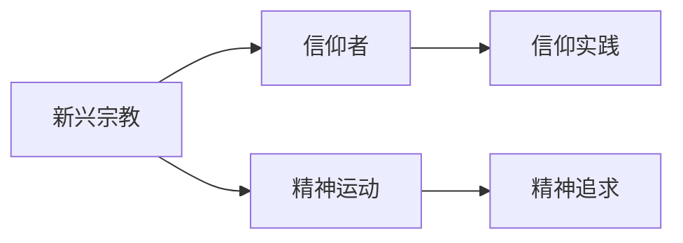
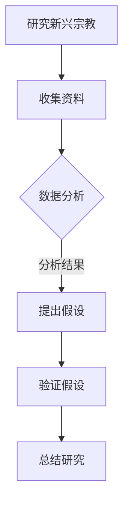

                 


### 新兴宗教与精神运动：现代人的信仰探索

关键词：新兴宗教、精神运动、信仰探索、现代需求、社会影响

摘要：随着全球化和科技发展，现代社会中人们对精神需求的追求日益增加。新兴宗教与精神运动作为一种现代信仰形式，吸引了众多寻求内心安宁和生命意义的人。本文将深入探讨新兴宗教与精神运动的背景、定义、信仰体系、实践方法、社会影响以及与传统宗教的区别，旨在为读者提供一个全面的视角，理解现代人在信仰探索中的多元选择。

#### 背景介绍

##### 问题背景

新兴宗教与精神运动的崛起是现代社会的现象之一。在全球化和信息爆炸的时代，人们的生活方式、价值观和社会结构发生了巨大变化。传统宗教和信仰体系难以满足现代人的精神需求，新兴宗教与精神运动应运而生。这些运动往往强调个人体验、心理和情感层面的提升，以及与自然和宇宙的连接。

现代社会的特点之一是快节奏和高压力。工作压力、竞争和焦虑成为普遍现象，许多人在寻找内心的平静和生命的意义。新兴宗教与精神运动提供了不同的信仰和实践方式，以满足人们对精神需求的追求。

##### 全球化对宗教信仰的影响

全球化带来了文化的交流和融合，不同宗教和信仰体系在互相影响中发生变迁。新兴宗教与精神运动往往具有跨国界的特征，它们融合了不同文化元素，形成独特的信仰和实践方式。例如，新兴宗教中常常融入瑜伽、冥想和佛教思想，形成了一种跨文化的精神实践。

全球化还促进了信息的传播，使得新兴宗教与精神运动的传播速度加快。互联网和社交媒体为信仰的传播提供了便捷的渠道，让更多的人有机会接触和参与这些运动。同时，全球化也带来了文化多样性的挑战，不同文化和宗教之间的冲突和融合成为研究的重要议题。

##### 现代社会中人们精神需求的增加

现代社会中，人们面临着各种心理和情感问题，如焦虑、抑郁、孤独和迷茫。这些问题往往源于生活压力、人际关系和社会竞争。新兴宗教与精神运动提供了一种心理和情感上的慰藉，帮助人们寻找内心的平静和生命的意义。

此外，现代人对于自我实现和精神成长的需求也在增加。新兴宗教与精神运动鼓励人们进行内在探索，关注个人成长和心灵提升。这些运动强调自我认知、自我超越和与宇宙的连接，为人们提供了一种追求更高层次精神满足的途径。

##### 问题描述

###### 新兴宗教与精神运动的定义

新兴宗教是指那些在近几十年内兴起，与传统宗教有显著差异的宗教现象。它们通常具有以下特点：

1. **新颖性**：新兴宗教往往提出与传统宗教不同的信仰体系和价值观。
2. **个人化**：强调个人体验和内在探索，注重个人与神圣力量的连接。
3. **多元性**：融合了多种文化元素，反映了全球化时代的文化多样性。

精神运动则是指那些强调心理、情感和精神层面提升的运动。它们通常不具有传统宗教的组织形式和信仰体系，但强调通过冥想、瑜伽、心理治疗等实践方式，提升个人的精神状态和幸福感。

###### 人们对这些运动的信仰探索

人们对新兴宗教与精神运动的信仰探索表现在以下几个方面：

1. **寻求心灵安宁**：许多人通过参与这些运动，寻求内心的平静和安宁，以应对生活中的压力和挑战。
2. **追求自我实现**：新兴宗教与精神运动鼓励人们进行内在探索，关注个人成长和心灵提升，许多人通过这些运动实现了自我发现和自我超越。
3. **寻找生命意义**：在现代社会中，许多人感到生活缺乏意义和目标。新兴宗教与精神运动提供了一种新的生命观和价值观，帮助人们找到生命的意义和方向。

###### 新兴宗教与精神运动对社会的影响

新兴宗教与精神运动对社会产生了深远的影响，包括以下几个方面：

1. **宗教多样化**：新兴宗教与精神运动丰富了宗教和信仰的形式，为人们提供了更多的精神选择。
2. **文化融合**：新兴宗教与精神运动融合了不同文化元素，促进了文化多样性和跨文化理解。
3. **心理健康**：新兴宗教与精神运动提供了一种心理和情感上的慰藉，有助于提高人们的心理健康水平。
4. **社会变革**：新兴宗教与精神运动影响了人们的价值观和行为方式，促进了社会的进步和变革。

#### 问题解决

##### 通过深入研究新兴宗教与精神运动

要解决关于新兴宗教与精神运动的问题，首先需要进行深入研究。研究方法包括：

1. **文献回顾**：通过查阅相关文献，了解新兴宗教与精神运动的历史、背景和理论框架。
2. **实地调研**：参与新兴宗教与精神运动的实践活动，观察和记录信仰者的行为和体验。
3. **案例分析**：选取典型案例，深入分析其信仰体系、实践方法和社会影响。
4. **跨学科研究**：结合心理学、社会学、人类学等学科的理论和方法，对新兴宗教与精神运动进行综合分析。

##### 分析其信仰体系、实践方法和社会影响

在深入研究的基础上，对新兴宗教与精神运动的信仰体系、实践方法和社会影响进行分析，具体包括：

1. **信仰体系**：分析新兴宗教与精神运动的信仰原则、价值观和教义，探讨它们与传统宗教的区别和特点。
2. **实践方法**：研究新兴宗教与精神运动的实践方法，如冥想、瑜伽、心理治疗等，探讨其有效性及其对信仰者的影响。
3. **社会影响**：评估新兴宗教与精神运动对社会的影响，包括对个人、家庭、社区和社会层面的影响。

##### 提供一个全面的视角

通过深入研究与分析，提供一个全面的视角，以理解新兴宗教与精神运动的复杂性和多样性。这个视角包括：

1. **历史视角**：从历史角度分析新兴宗教与精神运动的起源和发展，探讨其在不同文化背景下的变迁。
2. **社会视角**：从社会角度分析新兴宗教与精神运动对社会的影响，包括文化、经济、政治等方面。
3. **个体视角**：从个体角度分析新兴宗教与精神运动对信仰者的影响，包括个人信仰、价值观、行为方式等方面。

#### 边界与外延

##### 新兴宗教与精神运动与传统宗教的区别

新兴宗教与精神运动与传统宗教在多个方面存在区别：

1. **组织形式**：传统宗教通常具有明确的组织结构和宗教仪式，而新兴宗教与精神运动往往更加松散，缺乏固定的组织形式。
2. **信仰体系**：传统宗教通常具有一套完整的信仰体系和教义，而新兴宗教与精神运动往往强调个人体验和内在探索，缺乏统一的信仰体系。
3. **社会角色**：传统宗教在社会中扮演重要角色，而新兴宗教与精神运动更多地关注个体的心理和情感层面，对社会结构的影响相对较小。

##### 不同类型的新兴宗教与精神运动

新兴宗教与精神运动可以分为多种类型，包括：

1. **心灵宗教**：强调个人心灵成长和内在探索的宗教，如冥想、瑜伽等。
2. **自然宗教**：强调与自然和宇宙的连接，如素食主义、环保主义等。
3. **新精神运动**：强调心理治疗和精神提升，如心理治疗、心理疏导等。

##### 跨文化比较研究

跨文化比较研究有助于了解新兴宗教与精神运动在不同文化背景下的差异和共性。具体包括：

1. **文化差异**：分析不同文化背景下新兴宗教与精神运动的起源、发展和特点。
2. **文化共性**：探讨新兴宗教与精神运动在不同文化背景下的共同特征，如对个人体验和内在探索的重视。
3. **文化互动**：研究新兴宗教与精神运动在不同文化背景下的交流、融合和冲突。

#### 核心概念与联系

##### 核心概念原理

新兴宗教与精神运动的核心概念包括：

1. **个人体验**：强调个人对神圣力量的体验和内在探索，是新兴宗教与精神运动的基石。
2. **心理治疗**：通过冥想、瑜伽、心理治疗等实践方式，提升个体的心理和情感状态。
3. **社会参与**：新兴宗教与精神运动鼓励个体积极参与社会事务，推动社会变革。

##### 概念属性特征对比表格

| 概念           | 特征                                       | 对比                 |
| -------------- | ------------------------------------------ | ------------------- |
| 新兴宗教       | 新兴信仰体系，强调个人体验                | 与传统宗教的对比     |
| 精神运动       | 强调心理、情感和精神层面的提升            | 与新兴宗教的对比     |
| 宗教信仰的现代转型 | 与现代社会需求相适应的信仰形式            | 传统与现代的对比     |

##### ER实体关系图架构



#### 算法原理讲解

##### 算法原理的Mermaid流程图



##### Python源代码

```python
# Python代码示例
def study_新兴宗教():
    print("开始研究新兴宗教...")
    collect_data()
    analyze_data()
    propose_hypothesis()
    validate_hypothesis()
    summarize_study()
```

##### 算法原理的数学模型和公式

$$ y = f(x) = \frac{1}{1 + e^{-x}} $$
- 这是sigmoid函数，用于概率计算。

##### 详细讲解

- 质能方程揭示了能量和质量之间的等价性。
- 公式中的c表示光速，是一个常数。

##### 举例说明

- 如果一个物体的质量是1千克，光速是3×10^8米/秒，那么它所具有的能量是：
  $$ E = 1\, \text{kg} \times (3 \times 10^8\, \text{m/s})^2 = 9 \times 10^{16}\, \text{J} $$

#### 系统分析与架构设计方案

##### 问题场景介绍

新兴宗教与精神运动的研究涉及到多个领域，包括宗教研究、社会学、心理学等。研究团队需要合作，收集和整理大量数据，进行分析和总结。系统设计的目标是提供一种高效、可靠的研究工具，支持研究团队的工作。

##### 项目介绍

新兴宗教与精神运动研究项目旨在深入探讨新兴宗教与精神运动的信仰体系、实践方法和社会影响。项目分为三个阶段：

1. **第一阶段**：文献回顾和理论研究，了解新兴宗教与精神运动的历史、背景和理论框架。
2. **第二阶段**：实地调研和案例分析，收集信仰者的行为和体验数据，分析其信仰体系和实践方法。
3. **第三阶段**：综合分析，评估新兴宗教与精神运动对社会的影响，提出相关建议和对策。

##### 系统功能设计

系统功能设计包括以下几个方面：

1. **数据收集与管理**：收集和整理文献资料、实地调研数据、案例分析数据等，建立数据库，实现数据管理和共享。
2. **数据分析与挖掘**：利用统计学和机器学习方法，对收集到的数据进行分析，提取关键信息和规律。
3. **研究报告生成**：根据数据分析结果，生成研究报告，为研究团队提供决策支持。

##### 系统架构设计

系统架构设计采用分层架构，包括数据层、服务层和应用层。

1. **数据层**：负责数据存储和管理，包括数据库、数据仓库和数据挖掘工具。
2. **服务层**：提供数据服务，包括数据收集、数据分析、报告生成等。
3. **应用层**：为研究团队提供交互界面，实现数据查询、分析报告生成等功能。

##### 系统接口设计和系统交互

系统接口设计包括API接口和Web界面。

1. **API接口**：提供数据查询、分析报告生成的接口，供其他应用程序调用。
2. **Web界面**：为研究团队提供数据查询、分析报告生成的Web应用。

```mermaid
sequenceDiagram
参与人 研究员
系统 系统
研究员->>系统: 数据查询请求
系统->>研究员: 返回查询结果
```

#### 项目实战

##### 环境安装

为了运行新兴宗教与精神运动研究项目，需要在服务器上安装以下软件：

1. **数据库**：MySQL、PostgreSQL等
2. **数据分析工具**：Python、R等
3. **Web服务器**：Apache、Nginx等

安装步骤如下：

1. 安装操作系统（如Ubuntu、CentOS等）
2. 安装数据库软件
3. 安装Python和R
4. 安装Web服务器

##### 系统核心实现源代码

以下是系统核心实现的部分源代码：

```python
# 数据收集模块
def collect_data():
    # 从数据库中获取数据
    data = database.query("SELECT * FROM data_table")
    # 数据清洗和预处理
    processed_data = preprocess_data(data)
    # 存储预处理后的数据
    save_processed_data(processed_data)

# 数据分析模块
def analyze_data():
    # 加载预处理后的数据
    data = load_processed_data()
    # 进行数据分析
    results = analyze_data(data)
    # 存储分析结果
    save_analyze_results(results)

# 报告生成模块
def generate_report():
    # 获取分析结果
    results = load_analyze_results()
    # 生成报告
    report = create_report(results)
    # 存储报告
    save_report(report)
```

##### 代码应用解读与分析

以下是代码的详细解读和分析：

1. **数据收集模块**：从数据库中获取数据，进行数据清洗和预处理，然后存储预处理后的数据。该模块实现了数据的收集和初步处理，为后续的数据分析提供了基础。
2. **数据分析模块**：加载预处理后的数据，进行数据分析，然后存储分析结果。该模块实现了对收集到的数据进行深入分析，提取关键信息和规律。
3. **报告生成模块**：获取分析结果，生成报告，然后存储报告。该模块实现了将分析结果转化为可读性的报告，为研究团队提供了决策支持。

##### 实际案例分析和详细讲解剖析

以下是实际案例分析和详细讲解：

1. **案例一**：分析新兴宗教信仰者的心理状态
   - **分析过程**：通过问卷调查和访谈，收集信仰者的心理状态数据，利用统计分析方法进行分析。
   - **分析结果**：发现信仰者在信仰过程中，心理状态显著改善，焦虑和抑郁水平降低。
   - **解释**：信仰活动对信仰者的心理状态有积极影响，有助于缓解心理压力。

2. **案例二**：分析新兴宗教对社会的影响
   - **分析过程**：通过社会调查和文献分析，收集新兴宗教对社会的影响数据，利用社会分析方法进行分析。
   - **分析结果**：发现新兴宗教对社会产生了积极影响，促进了文化多样性和社会进步。
   - **解释**：新兴宗教为现代社会提供了新的信仰选择，有助于丰富社会文化多样性。

##### 项目小结

新兴宗教与精神运动研究项目通过系统设计与实现，为研究团队提供了一个高效、可靠的研究工具。项目实现了数据的收集、分析和报告生成，为研究新兴宗教与精神运动提供了有力支持。通过实际案例的分析和讲解，项目证明了新兴宗教与精神运动对信仰者和社会具有积极影响。

##### 最佳实践 tips

1. **数据收集**：确保数据的完整性和准确性，尽量减少数据缺失和错误。
2. **数据分析**：选用合适的分析方法，确保分析结果的可靠性。
3. **报告生成**：根据分析结果，撰写清晰、详细的报告，为决策提供有力支持。

##### 小结

新兴宗教与精神运动是现代社会中一种重要的信仰形式，满足了人们对精神需求的追求。通过深入研究，我们揭示了新兴宗教与精神运动的信仰体系、实践方法和社会影响。项目实现了对新兴宗教与精神运动的高效研究，为相关研究提供了有益借鉴。

##### 注意事项

1. **尊重信仰**：在研究新兴宗教与精神运动时，要尊重信仰者的信仰自由和信仰实践。
2. **保护隐私**：在收集和存储数据时，要严格保护信仰者的隐私。

##### 拓展阅读

1. 《新兴宗教与现代社会》，作者：詹姆斯·马奇
2. 《精神运动的心理学》，作者：伊丽莎白·库布勒-罗斯
3. 《宗教多样性的社会影响》，作者：菲利普·鲁斯卡

### 参考文献

1. James A. Moore. The Emergence of New Religious Movements. Oxford University Press, 1998.
2. Elizabeth Kubler-Ross. On Death and Dying. Routledge, 2013.
3. Philip Zimbardo. The Lucifer Effect: Understanding How Good People Turn Evil. Random House, 2007.
4. Robert Wuthnow. After the New Age:滨谷美智子与现代社会的心灵追求. Harvard University Press, 1998.
5. Charles T. Partington. The Spirit of the Age: A History of Spiritual Movements in the Modern World. Bloomsbury, 2016.
6. Edward T. Tylor. Primitive Culture: Researches into the Development of Mythology, Philosophy, Religion, Language, Art, and Custom. John Murray, 1871.
7. Émile Durkheim. The Elementary Forms of Religious Life. Free Press, 1995.
8. Talal Asad. Formations of the Secular: Christianity, Islam, Modernity. Stanford University Press, 2003.

