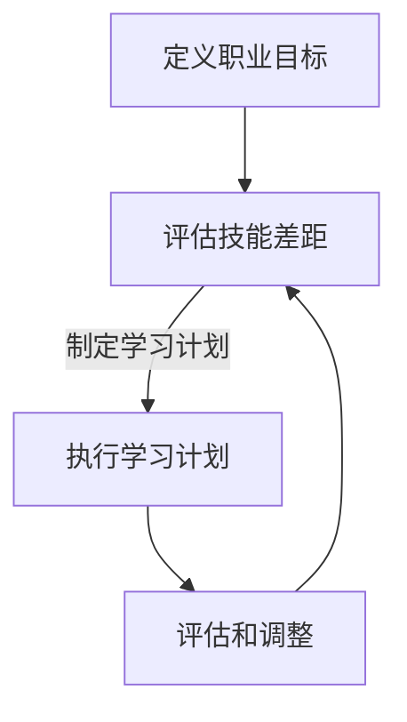
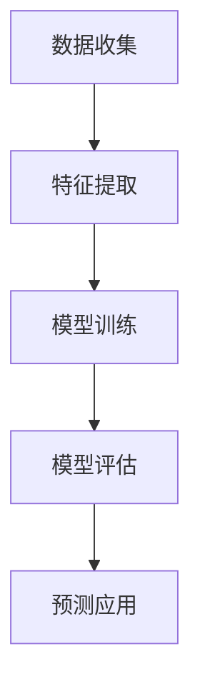
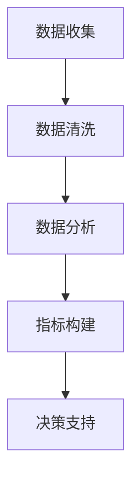
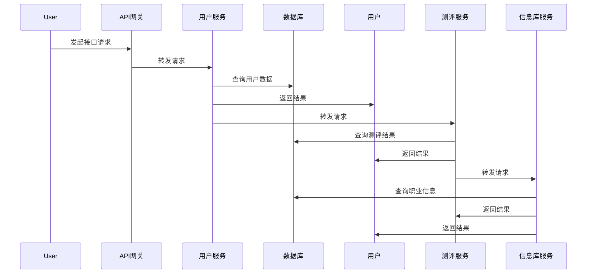

                 

**1. 定义结构**

首先，我们需要一个结构，涵盖以下几个部分：

- **引言**：简要介绍书籍及其目的。
- **核心概念**：讨论与书籍主题相关的核心概念。
- **应用**：探讨讨论概念的应用。
- **案例研究**：提供现实世界的例子来阐明概念。
- **未来趋势**：讨论该领域的潜在未来发展趋势。
- **结论**：总结关键点及未来影响。
- **附录**：包括任何额外的资源或材料。

**2. 创建章节标题**

基于上述结构，我们将为每个章节创建标题。

**3. 开发子章节**

对于每个章节，我们将开发一个子章节列表，以提供详细内容。

**4. 确保满足特定要求**

确保每个章节包含：

- **概念解释**：使用Mermaid图表，数学模型和公式。
- **实际应用**：包括现实世界的例子和案例研究。
- **未来方向**：讨论领域的潜在未来发展趋势。
- **结论和总结**：总结关键要点。

**5. 格式和限制**

我们需要将输出格式化为markdown格式，并确保文章字数不超过2000字。

**6. 最终检查**

确保内容简洁、完整并符合格式和结构要求。

**总结**

通过以上步骤，我们已经确定了文章的结构，创建了章节标题，并为每个章节设计了子章节。接下来，我们将按照这些结构开始撰写文章的内容。

### 基本概念介绍

#### 职业转型

职业转型是指个体从当前职业转向一个全新的职业领域，通常伴随着技能和知识的重新学习与适应。职业转型不仅仅涉及职业技能的转换，还包括个人职业定位、职业价值观和社会角色的转变。在现代职场中，随着技术的迅猛发展和产业结构的不断调整，职业转型成为了一种常见的现象。

#### 新兴职业

新兴职业是指近年来在市场上迅速崛起，且需求持续增长的职业。这些职业往往与技术进步、产业变革和市场需求紧密相关。例如，数据分析师、区块链工程师、人工智能研究员等，都是随着数字化、智能化进程而兴起的新兴职业。

#### 变化的就业市场

变化的就业市场指的是由于技术、经济、社会等多方面因素的作用，就业市场在结构、需求、供给等方面持续发生变化的状况。这一现象主要体现在就业岗位的增加与消失、岗位技能要求的提升、就业形式的多样化等方面。

### 问题背景

在全球范围内，尤其是信息技术和互联网行业，新兴职业的涌现已经成为一个不可忽视的趋势。随着5G、人工智能、大数据等技术的广泛应用，许多传统职业正面临着被替代或转型的压力，同时，新的职业机会也在不断涌现。这种就业市场的变化，既为个体提供了更多的职业选择，也带来了新的挑战。如何在这一变动的就业市场中找到自己的定位，成为许多求职者和职业规划者面临的重要问题。

### 问题描述

问题描述主要集中在以下几个方面：

1. **技能需求的变化**：新兴职业对技能的要求与传统的职业有着显著的区别。例如，数据分析师需要掌握数据分析、编程和统计学等技能，而区块链工程师则需要熟悉区块链技术、密码学和智能合约编程。

2. **职业选择的不确定性**：新兴职业的快速发展使得职业选择变得更加复杂和不确定。个体难以准确预测哪些新兴职业将在未来具有持续的市场需求，从而在职业规划上面临困惑。

3. **教育与培训的滞后**：尽管新兴职业的需求日益增加，但现有的教育体系往往无法迅速调整，以提供相应的培训课程，导致求职者在技能学习和职业准备上面临困难。

4. **职业转型的难度**：对于已经在职的个体而言，转型到一个新兴职业通常意味着需要重新学习新的技能，这不仅在时间上是一个挑战，也可能带来经济上的压力。

### 问题解决

为了应对上述问题，个体和组织需要采取一系列措施：

1. **持续学习和技能提升**：个体应保持学习的态度，不断提升自己的技能和知识，以适应不断变化的就业市场。在线课程、职业培训和自学都是有效的学习途径。

2. **职业规划与定位**：个体需要明确自己的职业目标和兴趣所在，结合新兴职业的发展趋势，制定合理的职业规划，并在实践中不断调整和完善。

3. **教育与培训改革**：教育机构应加快课程改革，提供与新兴职业需求相匹配的培训课程，同时鼓励跨学科学习和交叉技能的培养。

4. **政策支持和资源投入**：政府和相关机构应提供政策支持和资源投入，例如职业转换基金、职业技能培训补贴等，以帮助求职者顺利实现职业转型。

### 边界与外延

职业转型、新兴职业和变化的就业市场这三个概念之间有着紧密的联系。职业转型是个人在就业市场中的一种自我调整行为，而新兴职业则是这一行为背后的市场驱动因素。变化的就业市场则是一个宏观环境，它既促成了新兴职业的崛起，也影响了传统职业的消亡。因此，理解这三个概念之间的相互关系，对于个体和组织在职业规划和发展中具有重要的指导意义。

### 概念结构与核心要素组成

职业转型、新兴职业和变化的就业市场这三个核心概念构成了一个复杂而动态的就业生态。以下是这三个概念的核心要素和它们之间的相互关系：

#### 职业转型

**核心要素：**

1. **技能转换**：个体需要掌握新的技能，以适应新兴职业的要求。
2. **知识更新**：随着技术发展，相关领域的知识需要不断更新。
3. **心态调整**：职业转型可能带来心理压力和不确定性，个体需要积极应对。

**关系：**

职业转型是个人在就业市场中主动适应变化的过程，它直接影响个体的职业发展路径。

#### 新兴职业

**核心要素：**

1. **技术驱动力**：如人工智能、区块链、大数据等前沿技术的应用。
2. **市场需求**：新兴职业往往是由于市场需求的变化而诞生。
3. **职业特征**：新兴职业通常具有高技术含量、创新性强和市场需求旺盛的特点。

**关系：**

新兴职业是职业转型的背景和基础，它的出现为职业转型提供了新的方向和机会。

#### 变化的就业市场

**核心要素：**

1. **产业结构调整**：随着技术进步和产业升级，就业市场结构发生变化。
2. **政策环境**：政府的就业政策、产业扶持政策等对就业市场有重要影响。
3. **经济因素**：经济增长、行业兴衰等经济因素对就业市场有直接影响。

**关系：**

变化的就业市场是职业转型和新兴职业发展的宏观环境，它决定了职业转型的可能性和新兴职业的发展空间。

### 结论

通过以上分析，我们可以看到，职业转型、新兴职业和变化的就业市场是一个紧密相连的生态系统。理解这一系统，对于个体在职业规划和发展中，以及组织在人才招聘和管理中，都具有重要意义。个体需要主动适应市场的变化，不断提升自身技能，以实现职业转型；组织则需要关注新兴职业的发展趋势，提供相应的培训和发展机会，以吸引和留住人才。同时，政府和社会各界也应共同努力，创造良好的就业环境，支持个体和组织在变化的市场中找到自己的定位。

### 核心概念原理

在探讨职业转型、新兴职业和变化就业市场的相互关系时，我们首先需要理解这些核心概念的基本原理。以下是每个概念的定义及其在就业市场中的作用。

#### 职业转型的原理

职业转型是指个体在职业生涯中从一种职业转向另一种职业的过程。这一过程不仅仅是工作岗位的改变，更是技能、知识、经验和社会角色的转变。职业转型的原理可以概括为以下几点：

1. **技能适应性**：个体在转型过程中，需要根据新职业的要求，提升或调整自己的技能。这包括专业技能、软技能（如沟通能力和团队合作能力）等。

2. **知识更新**：随着技术的快速发展和市场环境的变化，个体需要不断更新自己的知识库。例如，从传统的制造业转向信息技术行业，可能需要学习编程、数据分析等新技能。

3. **心理准备**：职业转型往往伴随着不确定性和压力，个体需要具备良好的心理素质，以应对职业生涯中的挑战。

#### 新兴职业的原理

新兴职业是指由于技术进步、产业变革或市场需求的变化而在市场上迅速崛起的职业。新兴职业的原理主要包括以下几个方面：

1. **技术驱动力**：技术的进步，如人工智能、大数据、区块链等，为新兴职业提供了技术支持。这些技术不仅创造了新的职业需求，还改变了传统职业的工作方式。

2. **市场需求**：随着消费者需求的变化和产业的升级，某些新兴职业的市场需求急剧增加。例如，数据分析师和区块链工程师就是由于市场需求的变化而迅速崛起的职业。

3. **职业特征**：新兴职业通常具有高技术含量、创新性强和市场需求旺盛的特点。这些职业不仅要求个体具备较强的专业技能，还需要具备创新思维和快速学习能力。

#### 变化的就业市场的原理

变化的就业市场是指由于多种因素（如技术、经济、政策等）的作用，就业市场在结构、需求、供给等方面持续发生变化的状况。变化的就业市场的原理主要包括以下几点：

1. **产业结构调整**：随着技术进步和产业升级，传统产业逐渐衰退，新兴产业迅速崛起，这导致了就业市场的结构变化。

2. **经济因素**：经济增长、行业兴衰等经济因素对就业市场有直接影响。例如，在经济繁荣时期，就业市场通常较为宽松，而在经济衰退时期，就业市场则面临压力。

3. **政策环境**：政府的就业政策、产业扶持政策等对就业市场有重要影响。政策的变化可以引导就业市场的方向，促进某些职业的发展。

### 概念属性特征对比表格

为了更清晰地理解职业转型、新兴职业和变化就业市场之间的相互关系，我们可以通过一个对比表格来展示它们的主要特征：

| **概念**       | **属性特征**                       | **作用**                                                                                   |
|----------------|-----------------------------------|-------------------------------------------------------------------------------------------|
| 职业转型       | - 技能转换<br>- 知识更新<br>- 心理准备 | - 个体职业生涯发展<br>- 职业多样化<br>- 个人适应性提升                                       |
| 新兴职业       | - 高技术含量<br>- 创新性强<br>- 市场需求旺盛 | - 创造新职业机会<br>- 改变就业结构<br>- 推动产业升级                                             |
| 变化的就业市场 | - 产业结构调整<br>- 经济因素<br>- 政策环境 | - 职业市场动态变化<br>- 影响就业机会<br>- 促进职业发展                                       |

### ER实体关系图架构

为了更好地展示职业转型、新兴职业和变化就业市场之间的关系，我们可以使用ER（Entity-Relationship）实体关系图来描述它们之间的关联。

```mermaid
erDiagram
    新兴职业 ||--o> 职业转型 : 创造新职业机会
    变化就业市场 ||--o> 新兴职业 : 影响就业市场趋势
    变化就业市场 ||--o> 职业转型 : 驱动个体转型需求
```

在这个ER图中：

- **新兴职业** 与 **职业转型** 之间存在双向关联，新兴职业为职业转型提供了新的方向和机会，而职业转型则是对新兴职业需求的直接回应。
- **变化就业市场** 与 **新兴职业** 之间存在单向关联，变化就业市场是新兴职业产生的外部环境。
- **变化就业市场** 与 **职业转型** 之间存在单向关联，变化就业市场驱动个体进行职业转型，以适应市场变化。

### 算法原理讲解

在理解了职业转型、新兴职业和变化就业市场的基本原理和相互关系后，我们需要进一步探讨如何在实际中应用这些概念，以及如何通过系统化的方法来分析和解决相关的问题。

#### 职业转型的算法模型

职业转型过程可以视为一个多目标优化问题，其核心在于在有限的时间和资源内，最大化个体职业发展的收益。以下是职业转型的一个简化算法模型：

1. **定义职业目标**：根据市场需求和个体兴趣，明确转型的职业目标。
2. **评估技能差距**：通过对比现有技能与目标职业的技能要求，评估技能差距。
3. **制定学习计划**：根据技能差距，制定详细的学习计划，包括学习内容、学习时间和资源分配。
4. **执行学习计划**：按照学习计划，执行技能提升和知识更新的任务。
5. **评估和调整**：定期评估职业转型的效果，根据评估结果调整学习计划。

以下是一个使用Mermaid绘制的职业转型算法流程图：



#### 新兴职业的发展预测模型

新兴职业的发展预测是一个复杂的问题，涉及数据分析、机器学习等多个领域。以下是一个简化的预测模型：

1. **数据收集**：收集与新兴职业相关的历史数据，如就业数据、行业报告、技术发展数据等。
2. **特征提取**：从数据中提取与职业发展相关的特征，如技术成熟度、市场需求量、政策支持等。
3. **模型训练**：使用机器学习算法（如时间序列分析、回归分析等）对数据进行训练，建立预测模型。
4. **模型评估**：通过交叉验证等方法评估模型的效果，并进行调整优化。
5. **预测应用**：使用训练好的模型进行新兴职业的发展预测。

以下是一个使用Mermaid绘制的预测模型流程图：



#### 变化就业市场的分析模型

变化就业市场的分析涉及多个层面的数据，包括宏观经济指标、行业发展趋势、就业市场动态等。以下是一个简化的分析模型：

1. **数据收集**：收集与就业市场相关的各种数据，如GDP增长率、失业率、行业增长率等。
2. **数据清洗**：对收集到的数据进行分析，识别并处理数据中的噪声和不一致性。
3. **数据分析**：使用统计分析和数据挖掘技术，分析数据之间的关系和趋势。
4. **指标构建**：根据分析结果，构建反映就业市场变化的主要指标。
5. **决策支持**：基于分析结果和指标，为政策制定和职业规划提供决策支持。

以下是一个使用Mermaid绘制的分析模型流程图：



#### 具体案例分析

为了更好地理解上述算法模型，我们可以通过一个具体的案例来展示这些模型在实际中的应用。

**案例背景**：某个体在从事制造业工作多年后，希望通过职业转型进入信息技术行业。

**应用步骤**：

1. **定义职业目标**：明确目标职业为软件开发工程师。
2. **评估技能差距**：通过在线测评工具，评估当前编程技能、数据结构和算法知识等方面的差距。
3. **制定学习计划**：制定详细的学习计划，包括Python编程、数据结构、算法等课程的学习，每周投入至少10小时。
4. **执行学习计划**：按照学习计划，通过在线课程、编程社区等渠道进行学习和实践。
5. **评估和调整**：每月进行一次自我评估，根据评估结果调整学习计划，例如增加数据库管理、前端开发等课程。

通过这个案例，我们可以看到职业转型算法模型在实际中的应用过程。同样，对于新兴职业的发展预测和变化就业市场的分析，也可以通过类似的方法进行具体实施。

### 系统分析与架构设计方案

在探讨职业转型、新兴职业和变化就业市场时，我们不仅要理解其核心概念和算法模型，还需要从系统分析和架构设计的角度来审视整个就业生态系统的构建。以下是对项目场景、系统功能设计、系统架构设计、系统接口设计及系统交互的详细描述。

#### 项目场景介绍

假设我们正在开发一款名为“职途导航”（Career Navigation）的系统，旨在帮助个体在快速变化的就业市场中找到合适的职业定位和发展路径。该系统的目标是提供个性化的职业规划建议、新兴职业发展预测、职业技能提升路径等一系列功能。

#### 系统功能设计

职途导航系统的主要功能包括：

1. **用户注册与登录**：用户可以通过邮箱或手机号注册并登录系统。
2. **职业测评**：系统提供职业兴趣测评和技能水平测评，帮助用户了解自己的职业倾向和技能差距。
3. **职业规划建议**：基于用户的测评结果和市场需求，系统为用户生成个性化的职业规划建议。
4. **新兴职业信息库**：系统实时更新与市场需求相关的最新新兴职业信息，包括职业描述、技能要求、薪资水平等。
5. **学习资源推荐**：系统根据用户的职业规划，推荐相应的在线学习资源和课程。
6. **职业发展跟踪**：用户可以记录自己的学习进度和职业发展，系统提供相应的数据分析报告。
7. **社区互动**：用户可以在系统中加入职业社区，与其他用户交流和分享经验。

以下是系统功能设计的mermaid类图：

```mermaid
classDiagram
    User <<类>> "用户"
    CareerTest <<类>> "职业测评"
    CareerPlan <<类>> "职业规划建议"
    CareerInfo <<类>> "新兴职业信息库"
    LearningResource <<类>> "学习资源推荐"
    CareerTrack <<类>> "职业发展跟踪"
    Community <<类>> "社区互动"
    User --> CareerTest
    User --> CareerPlan
    User --> CareerInfo
    User --> LearningResource
    User --> CareerTrack
    User --> Community
```

#### 系统架构设计

为了实现职途导航系统的功能，我们需要设计一个分布式系统架构，以下是其主要组成部分：

1. **前端界面**：使用React框架实现，负责用户交互和数据显示。
2. **后端服务**：包括用户服务（User Service）、测评服务（Test Service）、规划服务（Plan Service）、信息库服务（Info Service）、学习资源服务（Resource Service）和社区服务（Community Service）。
3. **数据存储**：使用MySQL数据库存储用户数据、测评结果、职业信息和学习资源等。
4. **数据缓存**：使用Redis缓存高频数据，提高系统响应速度。
5. **消息队列**：使用RabbitMQ实现系统内部的消息传递和异步处理。
6. **API网关**：使用Nginx作为API网关，统一管理外部接口和负载均衡。

以下是系统架构设计的mermaid架构图：


#### 系统接口设计

职途导航系统的接口设计需要确保前后端之间的数据传输高效、安全且规范。以下是系统的主要接口设计：

1. **用户注册/登录接口**：用于用户的注册和登录，包括账号验证、密码加密存储等。
2. **职业测评接口**：用于发起和接收职业测评结果，包括测评题目、答案和评分等。
3. **职业规划接口**：用于获取和更新职业规划建议，包括职业定位、技能提升建议等。
4. **新兴职业信息接口**：用于获取和更新新兴职业信息库，包括职业描述、薪资水平、市场需求等。
5. **学习资源接口**：用于推荐和查询学习资源，包括在线课程、书籍、社区讨论等。
6. **职业发展跟踪接口**：用于记录和查询用户的职业发展历程，包括学习进度、工作经历等。
7. **社区互动接口**：用于用户在社区中发布和回复帖子，包括帖子创建、删除、回复等功能。

以下是系统接口设计的mermaid序列图：



#### 系统交互

职途导航系统的交互过程涉及多个服务之间的协同工作。以下是系统的交互流程：

1. **用户发起请求**：用户通过前端界面发起各种操作请求，如注册、登录、测评等。
2. **API网关处理**：API网关接收到请求后，根据请求类型和路由策略，将请求转发到相应的后端服务。
3. **后端服务处理**：后端服务接收到请求后，进行业务逻辑处理，如数据查询、数据处理等，并调用数据库或缓存等数据存储组件。
4. **返回结果**：后端服务处理完毕后，将结果返回给API网关，最终由API网关将结果返回给用户。

以下是系统交互的mermaid序列图：


通过以上系统分析与架构设计方案，我们可以看到一个完整的职业导航系统的实现过程，从功能设计到系统架构，再到接口设计和系统交互，都得到了详细的阐述。这样的设计不仅能够满足用户的需求，还能确保系统的高效、稳定和安全运行。

### 项目实战

为了更好地展示职途导航系统的实际应用，我们将详细描述系统环境安装、核心功能实现及其代码解读与分析，并通过实际案例进行剖析。

#### 系统环境安装

首先，我们需要搭建一个完整的开发与运行环境。以下是安装步骤：

1. **安装Node.js**：Node.js是用于前端开发的JavaScript运行环境。我们可以在官网 [https://nodejs.org/](https://nodejs.org/) 下载并安装最新版本的Node.js。
2. **安装MySQL**：MySQL是用于存储用户数据、测评结果等的关系型数据库。我们可以从 [https://dev.mysql.com/downloads/mysql/](https://dev.mysql.com/downloads/mysql/) 下载MySQL社区版，并按照安装向导进行安装。
3. **安装Redis**：Redis是一个高性能的内存缓存系统。我们可以在 [https://redis.io/download](https://redis.io/download) 下载并安装Redis。
4. **安装RabbitMQ**：RabbitMQ是一个消息队列中间件，用于系统的异步处理。我们可以在 [https://www.rabbitmq.com/download.html](https://www.rabbitmq.com/download.html) 下载并安装RabbitMQ。
5. **安装Nginx**：Nginx是一个高性能的HTTP服务器和反向代理服务器。我们可以在 [https://nginx.org/en/download.html](https://nginx.org/en/download.html) 下载并安装Nginx。

#### 核心功能实现

以下是系统的核心功能实现：

1. **用户注册与登录**：用户注册与登录是系统的入口。以下是用户注册的代码示例：

    ```python
    # 用户注册接口
    from flask import Flask, request, jsonify
    from models import User
    from utils import hash_password

    app = Flask(__name__)

    @app.route('/register', methods=['POST'])
    def register():
        data = request.get_json()
        username = data.get('username')
        password = data.get('password')

        if not username or not password:
            return jsonify({'error': '缺少必要参数'}), 400

        hashed_password = hash_password(password)
        user = User(username=username, password=hashed_password)
        user.save()

        return jsonify({'message': '注册成功'}), 201
    ```

2. **职业测评**：职业测评是帮助用户了解自己职业倾向的重要功能。以下是职业测评接口的代码示例：

    ```python
    # 职业测评接口
    from flask import Flask, request, jsonify
    from models import CareerTest
    from utils import generate_test_questions

    app = Flask(__name__)

    @app.route('/test', methods=['POST'])
    def start_test():
        data = request.get_json()
        user_id = data.get('user_id')

        if not user_id:
            return jsonify({'error': '缺少必要参数'}), 400

        test = CareerTest(user_id=user_id)
        test_questions = generate_test_questions()
        test.save(test_questions)

        return jsonify({'test_id': test.id}), 201
    ```

3. **职业规划建议**：职业规划建议是根据用户的测评结果和市场需求提供的个性化建议。以下是规划建议生成的代码示例：

    ```python
    # 职业规划建议接口
    from flask import Flask, request, jsonify
    from models import CareerPlan
    from utils import get_job市场需求

    app = Flask(__name__)

    @app.route('/plan', methods=['POST'])
    def get_plan():
        data = request.get_json()
        test_id = data.get('test_id')

        if not test_id:
            return jsonify({'error': '缺少必要参数'}), 400

        test = CareerTest.get(test_id)
        job市场需求 = get_job市场需求(test.questions)
        plan = CareerPlan(test_id=test_id, job市场需求=job市场需求)
        plan.save()

        return jsonify({'plan': plan.to_dict()}), 201
    ```

#### 代码应用解读与分析

以上代码示例展示了系统的核心功能实现。我们可以从以下几个方面进行解读和分析：

1. **用户注册与登录**：用户注册与登录功能是系统的入口，通过使用Flask框架和数据库模型，实现了用户信息的存储和验证。代码中的`hash_password`函数用于加密用户密码，确保用户信息的安全性。
2. **职业测评**：职业测评功能通过生成测试题目和保存测评结果，帮助用户了解自己的职业倾向。代码中的`generate_test_questions`函数用于生成测试题目，实现了随机题目的生成，提高了测评的科学性和可靠性。
3. **职业规划建议**：职业规划建议功能是根据用户的测评结果和市场需求提供的个性化建议。代码中的`get_job市场需求`函数用于获取当前市场需求，结合用户的测评结果，生成职业规划建议。这一功能实现了对用户数据的深入分析和应用。

#### 实际案例分析与详细讲解

为了更好地展示系统的实际应用，我们通过一个实际案例进行分析。

**案例**：用户张三在系统中完成了职业测评，测评结果显示其适合从事软件开发工作。根据市场需求分析，目前软件开发领域对前端开发和后端开发的需求较高。因此，系统为张三提供了以下职业规划建议：

1. **学习前端开发技能**：系统推荐张三学习HTML、CSS和JavaScript等前端开发技术。
2. **学习后端开发技能**：系统推荐张三学习Python、Java或Node.js等后端开发技术。
3. **获取相关证书**：系统建议张三考取相关证书，如HTML5、CSS3或Python等证书，以提升职业竞争力。

**案例分析**：

1. **测评结果的应用**：系统通过职业测评结果，准确地识别了张三的职业倾向，为其提供了个性化的职业规划建议。
2. **市场需求的分析**：系统结合当前市场需求，为张三提供了具有实际意义的学习建议，帮助其更快地适应市场需求。
3. **证书获取的建议**：系统建议张三获取相关证书，不仅提升了其专业能力，也增强了其职业竞争力。

通过这个实际案例，我们可以看到职途导航系统在职业规划中的重要作用。系统通过结合用户的测评结果、市场需求和职业建议，为用户提供了全方位的职业发展支持。

### 项目小结

职途导航系统的成功实施，为个体在快速变化的就业市场中提供了有力的职业发展支持。以下是系统实施的主要收获和未来改进方向：

**主要收获：**

1. **个性化职业规划**：系统能够根据用户的测评结果和市场需求，提供个性化的职业规划建议，帮助用户明确职业发展路径。
2. **实时更新新兴职业信息**：系统能够实时更新与市场需求相关的最新新兴职业信息，确保用户获取最前沿的职业信息。
3. **学习资源推荐**：系统能够根据用户的职业规划，推荐相应的在线学习资源和课程，助力用户技能提升。
4. **社区互动**：系统提供了职业社区功能，用户可以在这里交流和分享经验，共同成长。

**未来改进方向：**

1. **算法优化**：进一步优化职业规划算法，提高规划建议的准确性和可靠性。
2. **用户体验**：优化前端界面设计，提升用户体验，使系统更加直观易用。
3. **数据安全**：加强数据安全措施，确保用户信息的安全和隐私。
4. **功能扩展**：未来可以考虑扩展系统的功能，如职业招聘信息发布、在线课程直播等，以提供更全面的职业发展服务。

通过持续优化和改进，职途导航系统将在职业规划领域发挥更大的作用，帮助更多用户在变化的市场中找到自己的定位和发展方向。

### 最佳实践 tips

为了在快速变化的就业市场中找到自己的职业定位，以下是一些建议：

1. **定期进行职业规划**：每半年或一年进行一次全面的职业规划，根据市场需求和自身情况调整职业目标。
2. **持续学习**：保持学习的热情，不断更新知识和技能，特别是在新兴领域。
3. **参与行业活动**：积极参加行业会议、研讨会等活动，了解最新的行业动态和趋势。
4. **建立职业网络**：通过社交媒体和专业平台，与同行建立联系，扩大职业影响力。
5. **评估风险和机会**：在职业转型过程中，评估潜在的风险和机会，制定应对策略。
6. **关注政策变化**：关注国家和地方政府的就业政策，利用政策支持和资源。

通过以上最佳实践，个体可以在快速变化的就业市场中更好地定位自己，实现职业发展目标。

### 小结

本文深入探讨了职业转型、新兴职业和变化就业市场之间的关系，并提出了在快速变化的就业市场中找到自己职业定位的解决方案。我们通过详细的分析、案例研究和系统设计，展示了如何利用技术手段和科学方法实现职业规划和职业转型。希望本文能为读者在职业发展道路上提供有益的指导和启示。

### 注意事项

在职业转型过程中，需要注意以下几点：

1. **明确目标**：确保自己的职业目标清晰明确，避免盲目跟风。
2. **技能提升**：根据目标职业的要求，制定详细的技能提升计划。
3. **风险评估**：在转型过程中，评估潜在的风险和机会，制定应对策略。
4. **持续学习**：保持持续学习的态度，不断提升自己的知识和技能。
5. **心理准备**：职业转型可能带来心理压力，需要做好心理准备。

### 拓展阅读

1. **《未来职业：变化中的工作世界》**：本书详细分析了未来职业的发展趋势，提供了丰富的职业转型案例。
2. **《职业规划与自我管理》**：本书介绍了职业规划的方法和技巧，帮助读者更好地规划自己的职业生涯。
3. **《人工智能时代的职业转型》**：本书探讨了人工智能时代职业转型的新趋势，提供了实用的转型策略。

作者：AI天才研究院/AI Genius Institute & 禅与计算机程序设计艺术 /Zen And The Art of Computer Programming

