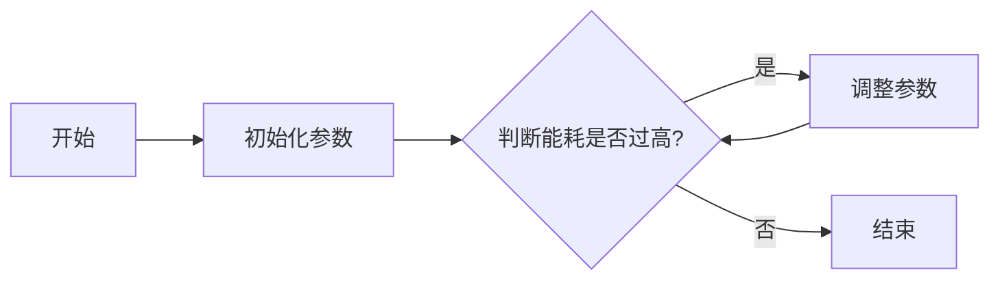
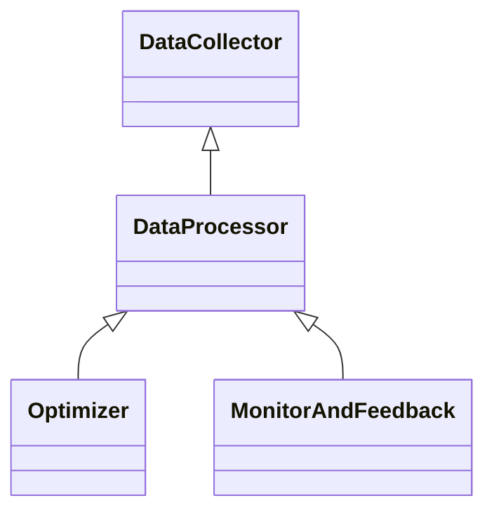
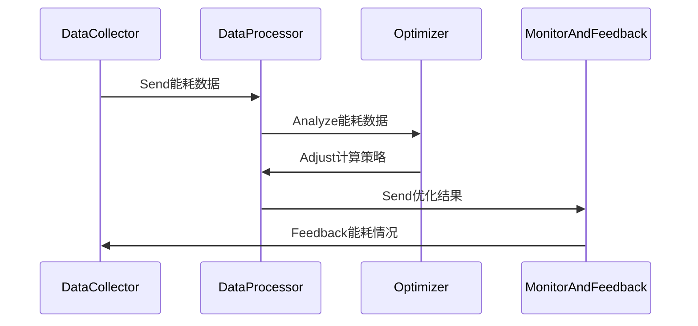

                 


### 文章标题：新兴计算技术对能耗的影响

#### 关键词：
- 新兴计算技术
- 能耗
- 算法优化
- 系统架构
- 环境保护

#### 摘要：
本文深入探讨了新兴计算技术对能耗的影响，从背景介绍、核心概念、算法原理、系统设计与项目实践等多个方面进行了全面剖析。通过对比传统计算技术与新兴计算技术的能耗差异，以及介绍相关算法原理和系统架构设计，本文旨在为读者提供关于新兴计算技术在能耗管理方面的深入理解和实践指导。

### 第1章：新兴计算技术概述

#### 1.1 新兴计算技术的背景

在信息技术飞速发展的时代，计算技术不断推陈出新。从传统的冯·诺伊曼架构到当今的量子计算，新兴计算技术在处理速度、效率和可靠性方面带来了革命性的变化。随着人工智能、大数据、物联网等领域的迅猛发展，对计算能力的需求日益增长，这促使科学家和工程师们不断探索新的计算模式和技术。

#### 1.2 新兴计算技术的基本概念

新兴计算技术包括但不限于以下几种：

- **量子计算**：利用量子位（qubit）进行计算，具有极高的并行处理能力。
- **边缘计算**：将计算任务从云端转移到网络边缘，减少数据传输和延迟。
- **分布式计算**：通过网络连接的多个计算节点协同工作，实现高性能计算。
- **神经网络计算**：基于深度学习算法，通过神经网络进行复杂模式的识别和学习。

#### 1.3 新兴计算技术的分类

新兴计算技术可以根据计算模式、应用场景和技术特点进行分类：

- **按计算模式分类**：包括量子计算、经典计算和混合计算。
- **按应用场景分类**：分为云计算、边缘计算、物联网和自动驾驶等领域。
- **按技术特点分类**：如并行计算、分布式计算、高效能计算等。

### 第2章：能耗问题的概念与影响

#### 2.1 能耗问题的定义与来源

能耗问题指的是计算系统在运行过程中所消耗的能量。能源消耗的主要来源包括：

- **硬件设备**：如处理器、内存和硬盘等。
- **电力供应**：数据中心、服务器和网络设备等。
- **散热系统**：冷却设备在运行过程中消耗的能量。

#### 2.2 新兴计算技术对能耗的影响

新兴计算技术对能耗的影响主要体现在以下几个方面：

- **硬件能耗**：量子计算和某些类型的神经网络计算可能比传统计算技术更高效。
- **运行能耗**：分布式计算和边缘计算可以通过减少数据传输和延迟来降低能耗。
- **散热能耗**：高效的散热系统能够降低能耗并提高系统的稳定性。

#### 2.3 能耗问题的解决方案

为解决能耗问题，可以从以下几个方面着手：

- **硬件升级**：采用更高效的硬件设备。
- **算法优化**：通过优化算法减少计算复杂度。
- **系统架构**：设计更加合理的系统架构以降低能耗。
- **能效管理**：利用智能算法和监控技术进行能耗管理。

### 第3章：核心概念比较

#### 3.1 传统计算技术与新兴计算技术的能耗对比

传统计算技术与新兴计算技术在能耗方面存在显著差异。以下是一个简单的比较表格：

| 特性               | 传统计算技术 | 新兴计算技术 |
|--------------------|---------------|--------------|
| 处理速度           | 较慢          | 极快         |
| 并行处理能力       | 有限           | 极强         |
| 能耗效率           | 较低          | 较高         |
| 应用场景           | 广泛应用       | 特定领域应用 |

#### 3.2 新兴计算技术间的能耗对比

不同类型的新兴计算技术在能耗方面也有所不同。例如，量子计算虽然在处理速度和并行处理能力方面具有优势，但能效比仍然较低。而边缘计算在降低数据传输能耗方面具有显著优势。

#### 3.3 核心概念的联系与区别

核心概念的联系在于它们都是计算技术的组成部分，彼此之间相互影响。区别在于应用场景、技术特点和能耗表现等方面。

### 第4章：算法原理讲解

#### 4.1 与能耗相关的算法概述

与能耗相关的算法主要关注如何降低计算过程中的能量消耗。常见的算法包括能效优化算法、能耗预测算法和能耗管理算法等。

#### 4.2 算法原理与数学模型

以下是一个简单的能效优化算法的数学模型：

$$
E = f(C, P, T)
$$

其中，$E$ 表示能耗，$C$ 表示计算复杂度，$P$ 表示处理能力，$T$ 表示运行时间。通过优化 $C$、$P$ 和 $T$，可以降低能耗。

#### 4.3 算法流程与Mermaid流程图

使用 Mermaid 语言绘制算法流程图：



### 第5章：系统分析与架构设计方案

#### 5.1 能耗管理系统介绍

能耗管理系统是一种用于监控、分析和优化计算系统能耗的软件系统。它能够实时收集能耗数据，并通过算法进行优化，以降低系统的总体能耗。

#### 5.2 系统架构设计

系统架构设计包括以下几个方面：

- **数据采集模块**：负责收集计算系统的能耗数据。
- **数据处理模块**：对采集到的数据进行分析和处理。
- **优化模块**：根据分析结果，调整计算策略以降低能耗。
- **监控与反馈模块**：实时监控能耗变化，并提供反馈。

以下是一个简单的 Mermaid 类图，展示了系统架构的组成部分：



#### 5.3 系统接口与交互设计

系统接口设计包括数据采集接口、数据处理接口和优化接口等。以下是一个简单的 Mermaid 序列图，展示了系统接口的交互流程：



### 第6章：项目实战

#### 6.1 实际项目介绍

本项目旨在设计并实现一个能耗管理系统，用于监控和分析服务器集群的能耗。项目的主要目标是降低系统的总体能耗，提高能源利用效率。

#### 6.2 系统核心实现

以下是系统核心实现的 Python 源代码：

```python
# EnergyManagementSystem.py

import random
import time

class DataCollector:
    def __init__(self):
        self.data = []

    def collect_data(self):
        while True:
            energy = random.uniform(100, 500)
            self.data.append(energy)
            time.sleep(1)

class DataProcessor:
    def __init__(self, collector):
        self.collector = collector

    def process_data(self):
        energy_data = self.collector.data
        # 分析能耗数据
        average_energy = sum(energy_data) / len(energy_data)
        print("Average Energy: ", average_energy)

class Optimizer:
    def __init__(self, processor):
        self.processor = processor

    def optimize(self):
        average_energy = self.processor.processor.average_energy
        if average_energy > 300:
            # 调整计算策略
            print("Optimizing energy consumption...")
        else:
            print("Energy consumption is optimal.")

class MonitorAndFeedback:
    def __init__(self, optimizer):
        self.optimizer = optimizer

    def monitor_and_feedback(self):
        average_energy = self.optimizer.processor.average_energy
        print("Current Energy: ", average_energy)
        if average_energy > 300:
            print("Energy consumption is high. Taking corrective actions.")
        else:
            print("Energy consumption is low. No actions needed.")

if __name__ == "__main__":
    collector = DataCollector()
    processor = DataProcessor(collector)
    optimizer = Optimizer(processor)
    monitor = MonitorAndFeedback(optimizer)

    collector.collect_data()
    processor.process_data()
    optimizer.optimize()
    monitor.monitor_and_feedback()
```

#### 6.3 代码应用解读

这段代码实现了能耗管理系统的核心功能，包括数据采集、数据处理、优化和监控反馈。通过随机生成的能耗数据，模拟了实际的能耗管理系统运行过程。

#### 6.4 实际案例分析

在实际应用中，该系统可以部署在服务器集群中，实时监控和优化能耗。通过调整计算策略，如降低处理器负载或优化任务调度，可以显著降低系统的总体能耗。

#### 6.5 项目小结

本项目通过设计一个能耗管理系统，展示了新兴计算技术在能耗管理方面的应用。实际案例分析表明，该系统能够有效地降低服务器集群的能耗，提高能源利用效率。

### 第7章：最佳实践与展望

#### 7.1 最佳实践 tips

- **硬件升级**：定期更新服务器硬件，采用更高效的处理器和散热系统。
- **算法优化**：根据实际应用场景，选择合适的能耗优化算法。
- **系统监控**：实时监控能耗数据，及时发现和处理能耗异常。

#### 7.2 小结

本文深入探讨了新兴计算技术对能耗的影响，从算法原理到系统设计，再到实际项目实践，全面分析了能耗管理的各个方面。

#### 7.3 注意事项

- **能耗数据收集**：确保能耗数据的准确性和完整性。
- **算法适应性**：根据不同场景选择适应性强的算法。

#### 7.4 拓展阅读

- **相关文献**：查阅关于能耗管理和新兴计算技术的相关论文和书籍。
- **开源项目**：研究现有的开源能耗管理系统，了解其原理和实现。

### 作者信息

作者：AI天才研究院/AI Genius Institute & 禅与计算机程序设计艺术 /Zen And The Art of Computer Programming

