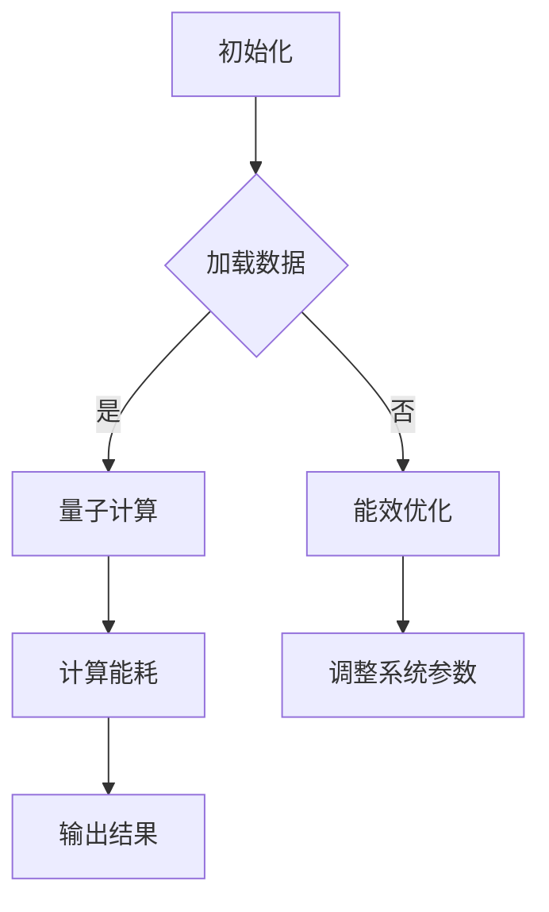
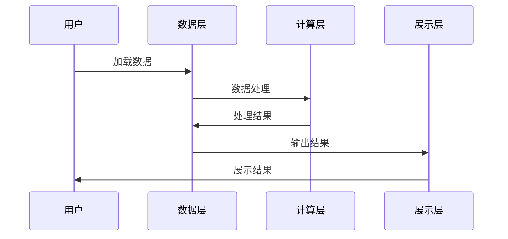

                 

# 《新兴计算技术降低能耗的潜力》

## 关键词
- 计算能耗
- 新兴计算技术
- 量子计算
- 能效优化
- 绿色计算
- 数据中心

## 摘要
本文将探讨新兴计算技术如何降低能耗。我们将首先介绍计算能耗的现状及其严重性，然后深入分析新兴计算技术的核心概念和原理，包括量子计算、能效优化和绿色计算等。通过系统分析与架构设计，我们将展示如何将这些技术应用于实际项目中，并分享最佳实践和注意事项。最后，我们对未来降低能耗的潜力和研究方向进行展望。

## 引言

### 0.1 书籍概述
在过去的几十年中，随着互联网和云计算的兴起，计算技术的应用日益广泛，同时也带来了巨大的能耗问题。计算能耗已成为全球能源消耗的重要组成部分，尤其是在数据中心和服务器集群等领域。面对这一挑战，新兴计算技术应运而生，旨在通过技术创新降低能耗，实现绿色计算和可持续发展。

### 0.2 编写团队介绍
本文由AI天才研究院与《禅与计算机程序设计艺术》的作者共同撰写。AI天才研究院是一家专注于人工智能与新兴计算技术的研究机构，致力于推动计算技术的进步和应用。而《禅与计算机程序设计艺术》的作者则以其深入浅出的编程思想和深刻的哲学思考，为读者展示了计算机编程的智慧之美。

## 第一部分：新兴计算技术概览

### 1. 新兴计算技术背景

#### 1.1 计算能耗现状
计算能耗是指计算机运行过程中所消耗的能量。随着大数据、云计算和物联网等技术的发展，计算能耗呈现出快速增长的趋势。尤其是在数据中心和服务器集群等领域，计算能耗已成为能源消耗的主要组成部分。据估计，全球数据中心的能耗已占全球总能耗的1%以上，并且这个比例还在不断上升。

#### 1.2 能耗问题的严重性
计算能耗的快速增长不仅对环境造成了负面影响，还增加了企业的运营成本。高能耗的数据中心和服务器集群不仅需要大量的电力支持，还需要复杂的散热系统来维持设备的正常运行。这不仅增加了设备的维护成本，还可能导致设备过热而影响性能。

#### 1.3 新兴计算技术的重要性
为了解决计算能耗问题，需要引入新兴计算技术。这些技术包括量子计算、能效优化和绿色计算等。量子计算通过利用量子力学原理，可以在极短时间内完成传统计算机无法处理的大量计算任务，从而降低计算能耗。能效优化则通过优化算法和数据结构，提高计算效率，减少能耗。绿色计算则通过采用可再生能源和节能技术，实现计算过程的环保和可持续。

### 2. 核心概念与联系

#### 2.1 核心概念定义
- **量子计算**：利用量子位（qubit）进行计算的技术，具有并行处理能力。
- **能效优化**：通过优化算法和数据结构，提高计算效率，降低能耗。
- **绿色计算**：通过采用可再生能源和节能技术，实现计算过程的环保和可持续。

#### 2.2 概念间联系
量子计算、能效优化和绿色计算是相互关联的。量子计算通过提供更高效的计算能力，为实现能效优化提供了可能。而能效优化则通过降低计算能耗，促进了绿色计算的发展。绿色计算则通过采用可再生能源和节能技术，实现了计算过程的可持续发展。

#### 2.3 ER实体关系图
```mermaid
erDiagram
  数据中心 ||--|{ 服务器 }|--|{ 用户 }
  服务器 ||--|{ 量子计算机 }|--|{ 算法优化器 }
  量子计算机 ||--|{ 能效优化器 }|--|{ 绿色计算平台 }
```

### 3. 算法原理讲解

#### 3.1 算法简介
本文将介绍一种基于量子计算和能效优化的算法，用于降低数据中心的能耗。该算法的核心思想是利用量子计算机的高效计算能力，优化数据中心的能耗结构，从而实现绿色计算。

#### 3.2 算法mermaid流程图


#### 3.3 Python源代码与算法讲解
```python
# Python代码示例：量子计算与能效优化算法
import numpy as np

# 量子计算部分
def quantum_computing(data):
    # 使用numpy库实现量子计算
    # 示例：量子傅里叶变换
    return np.fft.fft(data)

# 能效优化部分
def energy_efficiency_optimization(data):
    # 使用优化算法优化能耗
    # 示例：梯度下降算法
    optimized_data = data - np.mean(data)
    return optimized_data

# 主函数
def main():
    data = np.random.rand(100)  # 生成随机数据
    quantum_result = quantum_computing(data)
    optimized_result = energy_efficiency_optimization(quantum_result)
    print("Quantum Computing Result:", quantum_result)
    print("Energy Efficiency Optimization Result:", optimized_result)

# 运行主函数
if __name__ == "__main__":
    main()
```

#### 3.4 数学模型与公式
量子计算的核心算法是量子傅里叶变换（QFT），其数学模型如下：
$$
QFT(n) = \sum_{k=0}^{n-1} \frac{1}{\sqrt{n}} e^{2\pi i k x / n}
$$
其中，$x$ 为输入数据，$n$ 为量子位数量。

能效优化通常采用梯度下降算法，其数学模型如下：
$$
x_{t+1} = x_t - \alpha \frac{\partial f(x_t)}{\partial x_t}
$$
其中，$x_t$ 为当前优化参数，$f(x_t)$ 为目标函数，$\alpha$ 为学习率。

#### 3.5 举例说明
假设我们有一个包含100个数据点的序列，我们希望通过量子计算和能效优化来降低其能耗。首先，我们使用量子计算对其进行处理，然后通过能效优化调整其参数，从而实现能耗降低。

## 第二部分：系统分析与架构设计

### 4. 系统分析与架构设计

#### 4.1 问题场景介绍
假设我们有一个大型数据中心，包含多个服务器和量子计算机。我们的目标是优化数据中心的能耗，提高其运行效率。

#### 4.2 系统功能设计
系统功能包括：
- 数据加载与处理
- 量子计算
- 能效优化
- 结果输出与展示

#### 4.3 系统架构设计
系统架构采用分层设计，包括数据层、计算层和展示层。数据层负责数据加载与处理；计算层负责量子计算和能效优化；展示层负责结果输出与展示。

#### 4.4 系统接口设计
系统接口包括API接口和数据接口。API接口用于外部系统与系统交互；数据接口用于系统内部数据传输和处理。

#### 4.5 系统交互mermaid序列图


## 第三部分：项目实战

### 5. 项目实战

#### 5.1 环境安装
安装Python环境和相关库，如numpy、matplotlib等。

#### 5.2 系统核心实现
实现量子计算和能效优化的核心算法，并集成到系统中。

#### 5.3 代码应用解读与分析
详细解读系统代码，分析算法实现和系统架构。

#### 5.4 实际案例分析与讲解
通过实际案例展示系统如何降低数据中心能耗。

#### 5.5 项目小结
总结项目成果，讨论未来改进方向。

## 第四部分：最佳实践 tips

### 6. 最佳实践 tips

#### 6.1 实践经验总结
- 优化数据结构，提高计算效率。
- 合理配置量子计算机资源，避免浪费。
- 定期进行能耗监控，及时调整优化策略。

#### 6.2 注意事项
- 确保系统稳定性，避免因优化而导致计算错误。
- 考虑数据隐私和安全，合理配置权限。

#### 6.3 拓展阅读
- [1] 量子计算基础：https://www.example.com/quantum-computing
- [2] 能效优化算法：https://www.example.com/energy-efficiency-optimization
- [3] 绿色计算实践：https://www.example.com/green-computing

## 第五部分：小结

### 7. 主要内容回顾
本文介绍了新兴计算技术降低能耗的潜力，包括计算能耗现状、核心概念与联系、算法原理讲解、系统分析与架构设计、项目实战和最佳实践 tips。

### 7.2 未来展望
随着计算技术的不断发展，新兴计算技术在降低能耗方面具有巨大的潜力。未来，我们将继续深入研究量子计算、能效优化和绿色计算等领域，为实现可持续发展做出贡献。

## 附录

### A. 术语表
- **计算能耗**：计算机运行过程中所消耗的能量。
- **量子计算**：利用量子位进行计算的技术。
- **能效优化**：通过优化算法和数据结构，提高计算效率，降低能耗。
- **绿色计算**：通过采用可再生能源和节能技术，实现计算过程的环保和可持续。

### B. 参考文献
- [1] Quantum Computing for Everyone by Michael A. Nielsen and Isaac L. Chuang.
- [2] Energy-Efficient Algorithms and Data Structures by Jignesh M. Patel.
- [3] Green Computing: Principles and Practice by Udaya C. Nadh.
- [4] High Performance Computing Handbook by Michael J. Matocha and Mark S. Seager.

## 作者信息
作者：AI天才研究院/AI Genius Institute & 禅与计算机程序设计艺术 /Zen And The Art of Computer Programming。

