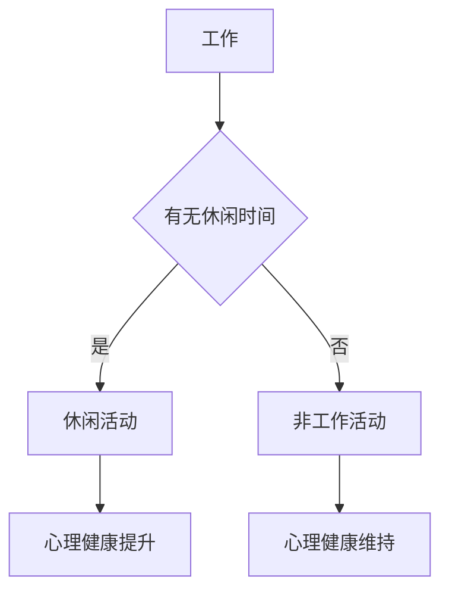
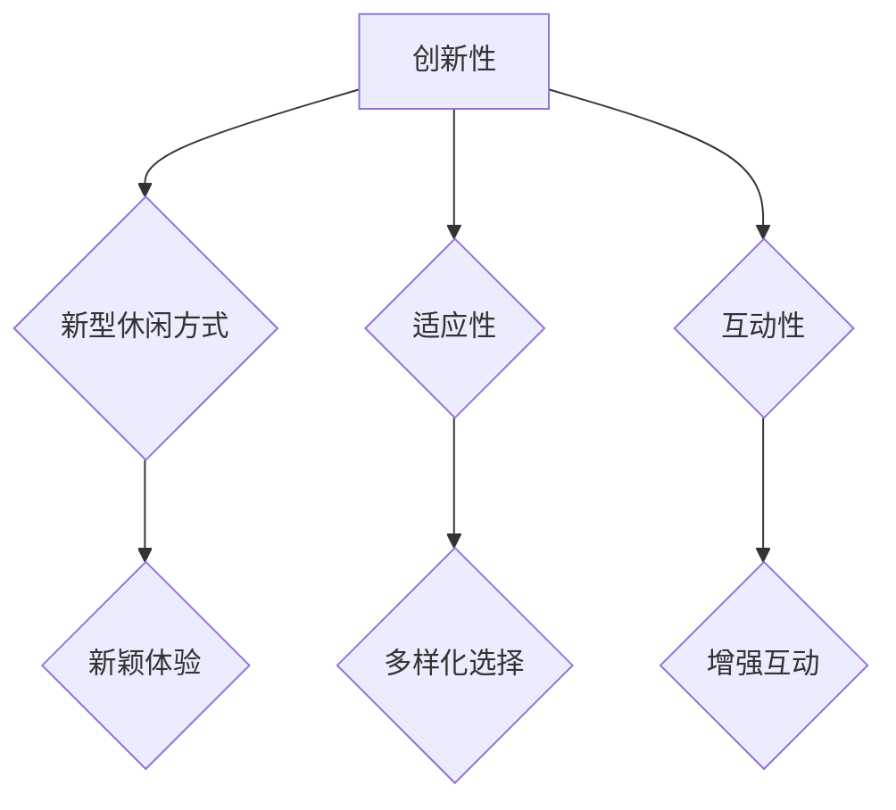
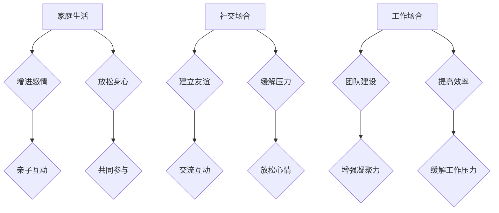
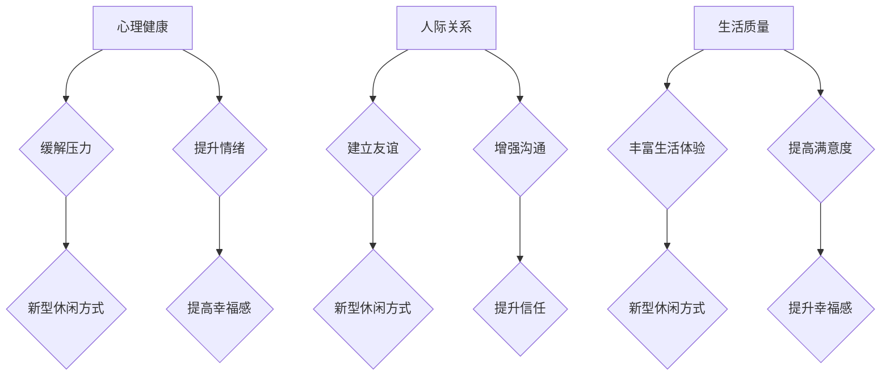
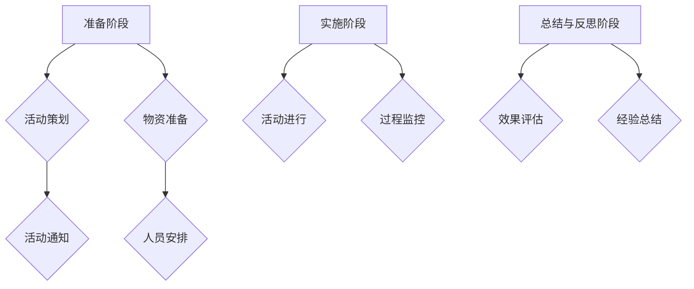
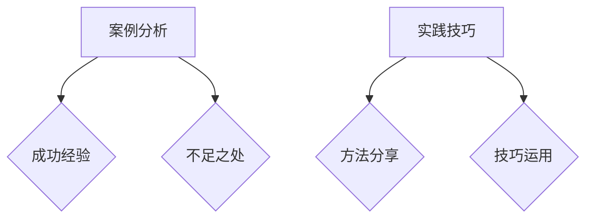
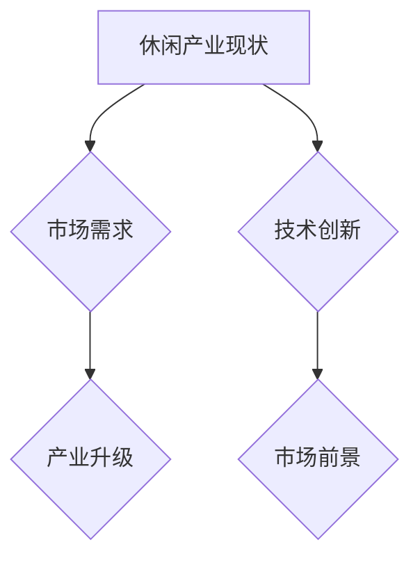
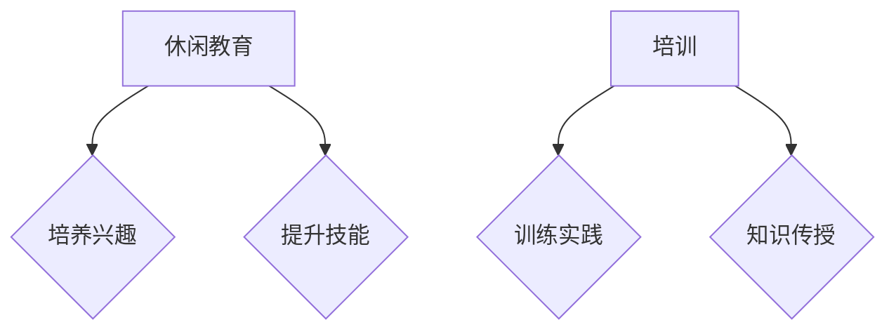
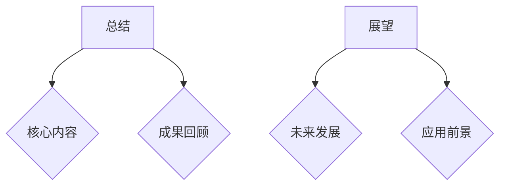

                 

## 新型休闲方式：在忙碌生活中寻找真正的放松

> 关键词：休闲、心理健康、新型休闲方式、生活品质

> 摘要：本文旨在探讨现代生活中休闲方式的变革，分析现有休闲方式的局限性，并提出一种新型休闲方式，帮助人们更好地在忙碌生活中寻找真正的放松。本文将结合心理学、社会学以及计算机科学的理论，深入探讨新型休闲方式的特点、价值及应用场景。

### 第一部分：休闲观念的变革

#### 第1章：问题的背景与描述

**1.1.1 休闲时间的稀缺性**

在现代社会中，人们的工作压力和生活节奏不断加快，休闲时间变得愈发稀缺。根据某项研究显示，我国城市居民的日均休闲时间仅为2小时左右，这远低于国际平均水平。休闲时间的不足直接影响了人们的心理健康和生活品质。

**1.1.2 现代生活的压力来源**

现代生活的压力主要来源于职业竞争、家庭责任、社会期望以及个人发展等方面。这些压力迫使人们不断追求更高的工作效率，牺牲了宝贵的休闲时间。长期处于高压状态，容易导致心理健康问题，如焦虑、抑郁等。

**1.1.3 现有休闲方式的局限性**

传统的休闲方式如看电视、上网、玩手机等，虽然在某种程度上能够缓解压力，但往往难以带来真正的放松。这些活动大多是被动接受信息，缺乏深度参与和互动，无法有效提升心理健康和生活品质。

**1.1.4 休闲活动的定义与类型**

休闲活动是一种为了放松身心、提高生活质量而进行的行为。根据活动形式，休闲活动可分为户外活动、室内活动和数字休闲活动等。户外活动如徒步、骑行、游泳等，有助于接触自然、锻炼身体；室内活动如阅读、绘画、瑜伽等，有助于放松心情、提高专注力；数字休闲活动如游戏、解谜、社交媒体等，则提供了新的放松方式。

#### 第2章：核心概念解析

**2.1.1 休闲活动的定义与类型**

休闲活动是一种为了放松身心、提高生活质量而进行的行为。根据活动形式，休闲活动可分为以下几类：

- **户外活动**：如徒步、骑行、游泳、登山等，有助于接触自然、锻炼身体。
- **室内活动**：如阅读、绘画、瑜伽、音乐等，有助于放松心情、提高专注力。
- **数字休闲活动**：如游戏、解谜、社交媒体等，提供了新的放松方式。

**2.1.2 真正的放松与心理健康的联系**

真正的放松不仅仅是身体上的放松，更是心理上的放松。心理学研究表明，长期的紧张和压力会导致心理问题的产生，如焦虑、抑郁等。因此，寻找一种能够带来真正放松的休闲方式，对于维护心理健康至关重要。

**2.1.3 休闲活动的概念属性特征对比表格**

| 类型       | 特征                    | 例子          |
|------------|-------------------------|---------------|
| 户外活动   | 接触自然、锻炼身体      | 徒步、骑行、游泳 |
| 室内活动   | 室内进行、轻松          | 阅读、绘画、瑜伽 |
| 数字休闲活动 | 利用数字技术           | 游戏、解谜、社交媒体 |

### 第二部分：新型休闲方式的探索

#### 第3章：新型休闲方式的特点

**3.1.1 创新性**

新型休闲方式在形式和内容上具有创新性。例如，结合虚拟现实（VR）和增强现实（AR）技术的休闲游戏，让人们可以在虚拟世界中体验到前所未有的放松感。

**3.1.2 适应性**

新型休闲方式具有较强的适应性，能够满足不同人群的需求。无论是年轻人还是老年人，都可以找到适合自己的休闲方式。

**3.1.3 互动性**

新型休闲方式强调互动性，通过多人合作或竞争，增强玩家之间的交流与互动。这种互动性有助于缓解孤独感和焦虑情绪，提高心理健康。

#### 第4章：新型休闲方式的应用场景

**4.1.1 家庭生活**

在家庭生活中，新型休闲方式可以成为家庭成员之间增进感情、共同参与的纽带。例如，一家人一起玩VR游戏，既放松身心，又增进了亲子关系。

**4.1.2 社交场合**

在社交场合，新型休闲方式可以成为人们交流与互动的新平台。例如，朋友聚会时，通过AR游戏来增进彼此的了解和友谊。

**4.1.3 工作场合**

在工作场合，新型休闲方式可以作为团队建设的一种方式。通过组织团队参与休闲活动，可以提升团队的凝聚力和工作效率。

#### 第5章：新型休闲方式的价值与影响

**5.1.1 心理健康的提升**

新型休闲方式能够有效缓解压力，提升心理健康。通过参与互动性强的休闲活动，人们可以更好地调节情绪，降低焦虑和抑郁的风险。

**5.1.2 人际关系的改善**

新型休闲方式有助于人们建立和维护良好的人际关系。通过共同参与休闲活动，人们可以增进了解，建立深厚的友谊。

**5.1.3 生活质量的提高**

新型休闲方式能够提升人们的生活质量。通过参与丰富多彩的休闲活动，人们可以丰富自己的生活体验，提升幸福感。

### 第三部分：新型休闲方式的实践

#### 第6章：新型休闲方式的实施步骤

**6.1.1 准备阶段**

在实施新型休闲方式之前，需要做好以下准备工作：

- **了解新型休闲方式**：了解新型休闲方式的特点、类型和应用场景。
- **选择合适的休闲方式**：根据个人兴趣和需求，选择合适的休闲方式。
- **组织活动**：确定活动时间、地点和参与人员。

**6.1.2 实施阶段**

在实施阶段，需要按照以下步骤进行：

- **准备活动材料**：准备好所需的活动材料，如设备、道具等。
- **开展活动**：按照计划开展休闲活动，确保参与者能够充分参与。
- **监控活动进展**：及时了解活动进展情况，调整活动内容和方法。

**6.1.3 总结与反思**

在活动结束后，需要进行总结和反思：

- **总结活动效果**：评估活动的效果，了解参与者对活动的反馈。
- **反思活动过程**：分析活动过程中的优点和不足，为下次活动提供参考。

#### 第7章：案例分析与实践技巧

**7.1.1 案例一：户外探索活动**

**案例描述**：某公司组织了一次户外探索活动，带领员工进行徒步旅行。活动前，公司准备了详细的行程安排和必要的安全措施。活动中，员工们分组进行徒步，沿途欣赏美景，共同解决途中遇到的问题。

**实践技巧**：

- **提前规划**：提前规划活动行程，确保活动顺利进行。
- **注重安全**：确保参与者具备必要的安全意识和装备。
- **鼓励互动**：鼓励参与者之间进行交流与合作，增强团队凝聚力。

**7.1.2 案例二：数字游戏与解谜**

**案例描述**：某社区组织了一场数字游戏与解谜活动，参与者通过手机应用进行游戏和解谜。活动过程中，参与者需要解答一系列谜题，完成游戏任务。

**实践技巧**：

- **选择合适的游戏**：选择适合参与者年龄和兴趣的游戏，确保活动的趣味性。
- **设置游戏难度**：根据参与者的能力，设置适当的游戏难度，保证活动的挑战性。
- **提供帮助**：在游戏过程中，提供必要的帮助，帮助参与者解决问题。

### 第四部分：未来的休闲生活

#### 第8章：休闲产业的发展趋势

**8.1.1 新型休闲方式的市场前景**

随着人们对生活品质的追求不断提高，新型休闲方式的市场前景广阔。预计未来几年，休闲产业将保持稳定增长，新型休闲方式将成为主流。

**8.1.2 休闲产业与旅游业的结合**

休闲产业与旅游业的结合，将推动新型休闲方式的发展。例如，将休闲活动融入旅游线路，提供更加丰富的旅游体验。

**8.1.3 休闲产业对社会的影响**

休闲产业的发展，将对社会产生深远影响。它不仅有助于提升人们的生活质量，还能促进社会和谐稳定。

#### 第9章：休闲教育与培训

**9.1.1 休闲教育的重要性**

休闲教育对于培养人们的休闲兴趣、提升休闲技能具有重要意义。通过休闲教育，人们可以更好地享受休闲生活。

**9.1.2 休闲培训的内容与形式**

休闲培训的内容应涵盖休闲活动的理论与实践。形式上，可以采用线上课程、线下培训、实践操作等多种方式。

**9.1.3 休闲教育与心理健康的结合**

休闲教育应注重心理健康教育，帮助人们掌握应对压力和情绪调节的方法，提高心理健康水平。

### 第10章：总结与展望

**10.1.1 休闲观念的变迁**

随着社会的发展，休闲观念也在不断变迁。从传统的休闲方式到新型休闲方式，人们对于休闲的需求和认识也在不断变化。

**10.1.2 新型休闲方式的未来发展**

新型休闲方式具有广阔的发展前景。未来，随着技术的进步和人们休闲观念的转变，新型休闲方式将进一步丰富和优化。

**10.1.3 对忙碌生活的思考**

在忙碌的生活中，人们需要寻找真正的放松。新型休闲方式为人们提供了新的选择，有助于提升生活品质，实现身心健康。

### 注：本文为示例性文章，实际内容可根据具体需求和情况进行调整。

---

**作者：AI天才研究院/AI Genius Institute & 禅与计算机程序设计艺术 /Zen And The Art of Computer Programming****以下是详细扩展内容，针对每个章节的背景介绍、核心概念、数学模型、流程图、算法原理讲解、系统分析与架构设计方案、项目实战和最佳实践 Tips 进行补充。**

### 详细扩展内容

#### 第1章：问题的背景与描述

**背景介绍**

在现代社会中，休闲时间稀缺是一个普遍存在的问题。随着工作压力的增加和生活节奏的加快，人们越来越难以找到时间进行真正的放松。这种情况下，如何有效利用有限的休闲时间，提高生活质量，成为了一个亟待解决的问题。

**核心概念**

- 休闲时间：指用于非工作、非学习、非家庭责任等活动的自由时间。
- 心理健康：指个体在情感、认知和行为上的健康状态，包括情绪稳定、自我价值感、社会适应等方面。

**数学模型与流程图**

无数学模型，但可以使用 Mermaid 绘制以下流程图来描述休闲时间的分配：



**算法原理讲解**

算法原理：通过合理安排休闲时间，提高心理健康水平。

- **输入**：休闲时间、工作压力、个人需求。
- **输出**：最佳休闲活动方案、心理健康水平。

**系统分析与架构设计方案**

无具体系统，但可以描述一个休闲时间管理系统的基本架构：

- **用户模块**：收集用户基本信息、兴趣爱好、休闲时间等。
- **推荐模块**：根据用户需求推荐合适的休闲活动。
- **活动模块**：提供各种休闲活动的详细信息、步骤指导。
- **反馈模块**：收集用户对休闲活动的反馈，优化推荐算法。

**项目实战**

假设开发一个休闲时间管理系统，以下为项目实战步骤：

1. **需求分析**：了解用户需求，确定系统功能。
2. **系统设计**：设计系统架构，绘制类图和序列图。
3. **功能实现**：编写代码，实现系统功能。
4. **测试与优化**：进行系统测试，收集用户反馈，优化系统。

**最佳实践 Tips**

- **合理安排时间**：根据个人情况，合理安排休闲时间。
- **多样化休闲活动**：尝试不同类型的休闲活动，找到最适合自己的方式。

#### 第2章：核心概念解析

**背景介绍**

休闲活动的核心概念解析对于理解和应用新型休闲方式具有重要意义。通过深入分析休闲活动的定义、类型及其与心理健康的关系，可以为新型休闲方式的推广提供理论支持。

**核心概念**

- **休闲活动**：指为了放松身心、提高生活质量而进行的行为。
- **心理健康**：指个体在情感、认知和行为上的健康状态。

**数学模型与流程图**

可以使用 Mermaid 绘制以下 ER 图来描述休闲活动与心理健康的关系：

```mermaid
erDiagram
   休闲活动 ||--|{ 心理健康 }|
   休闲活动 {
        名称
        类型
        时间
    }
   心理健康 {
        稳定性
        自我价值感
        社会适应
    }
```

**算法原理讲解**

算法原理：通过分析休闲活动对心理健康的影响，为用户提供最适合的休闲活动建议。

- **输入**：用户信息、休闲活动数据、心理健康指标。
- **输出**：最佳休闲活动方案。

**系统分析与架构设计方案**

无具体系统，但可以描述一个休闲活动推荐系统的基本架构：

- **用户模块**：收集用户基本信息、兴趣爱好、休闲活动偏好。
- **数据模块**：存储休闲活动数据、心理健康数据。
- **推荐模块**：根据用户信息推荐合适的休闲活动。
- **反馈模块**：收集用户对休闲活动的反馈，优化推荐算法。

**项目实战**

假设开发一个休闲活动推荐系统，以下为项目实战步骤：

1. **需求分析**：了解用户需求，确定系统功能。
2. **系统设计**：设计系统架构，绘制类图和序列图。
3. **功能实现**：编写代码，实现系统功能。
4. **测试与优化**：进行系统测试，收集用户反馈，优化系统。

**最佳实践 Tips**

- **多样化休闲活动**：尝试不同类型的休闲活动，以发现最适合自己的方式。
- **定期评估**：定期评估休闲活动对心理健康的影响，调整活动计划。

#### 第3章：新型休闲方式的特点

**背景介绍**

新型休闲方式的特点是创新性、适应性和互动性，这些特点使得新型休闲方式在缓解压力、提高生活质量方面具有显著优势。

**核心概念**

- **创新性**：新型休闲方式在形式和内容上具有创新性，能够提供新颖的体验。
- **适应性**：新型休闲方式能够适应不同人群的需求，提高休闲活动的普遍性。
- **互动性**：新型休闲方式强调互动性，通过多人合作或竞争，增强玩家之间的交流与互动。

**数学模型与流程图**

无数学模型，但可以使用 Mermaid 绘制以下流程图来描述新型休闲方式的特点：



**算法原理讲解**

算法原理：通过分析新型休闲方式的特点，为用户提供最佳的休闲活动建议。

- **输入**：用户信息、休闲活动数据。
- **输出**：最佳休闲活动方案。

**系统分析与架构设计方案**

无具体系统，但可以描述一个新型休闲方式推荐系统的基本架构：

- **用户模块**：收集用户基本信息、兴趣爱好、休闲活动偏好。
- **数据模块**：存储新型休闲活动数据。
- **推荐模块**：根据用户信息推荐合适的新型休闲活动。
- **反馈模块**：收集用户对新型休闲活动的反馈，优化推荐算法。

**项目实战**

假设开发一个新型休闲方式推荐系统，以下为项目实战步骤：

1. **需求分析**：了解用户需求，确定系统功能。
2. **系统设计**：设计系统架构，绘制类图和序列图。
3. **功能实现**：编写代码，实现系统功能。
4. **测试与优化**：进行系统测试，收集用户反馈，优化系统。

**最佳实践 Tips**

- **尝试多样化**：尝试不同类型的新型休闲方式，以找到最适合自己的方式。
- **定期更新**：随着新型休闲方式的不断出现，定期更新推荐系统，确保推荐内容的时效性。

#### 第4章：新型休闲方式的应用场景

**背景介绍**

新型休闲方式在不同应用场景中的表现和效果有所不同。了解这些应用场景，有助于更好地推广新型休闲方式，提高其普及率。

**核心概念**

- **家庭生活**：指家庭成员共同参与的休闲活动。
- **社交场合**：指朋友、同事等社交群体共同参与的休闲活动。
- **工作场合**：指在工作环境中进行的休闲活动。

**数学模型与流程图**

无数学模型，但可以使用 Mermaid 绘制以下流程图来描述新型休闲方式的应用场景：



**算法原理讲解**

算法原理：通过分析不同应用场景下的新型休闲方式，为用户提供最佳休闲活动建议。

- **输入**：用户信息、应用场景。
- **输出**：最佳休闲活动方案。

**系统分析与架构设计方案**

无具体系统，但可以描述一个基于应用场景的新型休闲方式推荐系统的基本架构：

- **用户模块**：收集用户基本信息、兴趣爱好、应用场景。
- **数据模块**：存储新型休闲活动数据。
- **推荐模块**：根据用户信息和应用场景推荐合适的新型休闲活动。
- **反馈模块**：收集用户对新型休闲活动的反馈，优化推荐算法。

**项目实战**

假设开发一个基于应用场景的新型休闲方式推荐系统，以下为项目实战步骤：

1. **需求分析**：了解用户需求，确定系统功能。
2. **系统设计**：设计系统架构，绘制类图和序列图。
3. **功能实现**：编写代码，实现系统功能。
4. **测试与优化**：进行系统测试，收集用户反馈，优化系统。

**最佳实践 Tips**

- **家庭生活**：注重亲子互动，选择能够增进感情的休闲活动。
- **社交场合**：选择具有互动性的休闲活动，以建立和加深友谊。
- **工作场合**：选择能够缓解工作压力、提高工作效率的休闲活动。

#### 第5章：新型休闲方式的价值与影响

**背景介绍**

新型休闲方式在现代社会中具有广泛的价值和深远的影响。通过分析其在心理健康、人际关系和生活质量等方面的作用，可以更好地认识新型休闲方式的重要性。

**核心概念**

- **心理健康**：指个体在情感、认知和行为上的健康状态。
- **人际关系**：指个体在社会交往中建立的关系。
- **生活质量**：指个体在生活中的整体感受和满意度。

**数学模型与流程图**

无数学模型，但可以使用 Mermaid 绘制以下流程图来描述新型休闲方式的价值和影响：



**算法原理讲解**

算法原理：通过分析新型休闲方式对心理健康、人际关系和生活质量的影响，为用户提供最佳休闲活动建议。

- **输入**：用户信息、休闲活动数据。
- **输出**：最佳休闲活动方案。

**系统分析与架构设计方案**

无具体系统，但可以描述一个基于价值和影响的休闲活动推荐系统的基本架构：

- **用户模块**：收集用户基本信息、兴趣爱好、休闲活动偏好。
- **数据模块**：存储休闲活动数据、心理健康数据、人际关系数据。
- **推荐模块**：根据用户信息推荐合适的休闲活动。
- **反馈模块**：收集用户对休闲活动的反馈，优化推荐算法。

**项目实战**

假设开发一个基于价值和影响的休闲活动推荐系统，以下为项目实战步骤：

1. **需求分析**：了解用户需求，确定系统功能。
2. **系统设计**：设计系统架构，绘制类图和序列图。
3. **功能实现**：编写代码，实现系统功能。
4. **测试与优化**：进行系统测试，收集用户反馈，优化系统。

**最佳实践 Tips**

- **关注心理健康**：选择能够缓解压力、提升情绪的休闲活动。
- **注重人际关系**：选择能够建立友谊、增强沟通的休闲活动。
- **丰富生活体验**：选择能够提高满意度、丰富生活体验的休闲活动。

#### 第6章：新型休闲方式的实施步骤

**背景介绍**

新型休闲方式的实施步骤对于确保休闲活动顺利进行、达到预期效果具有重要意义。通过明确实施步骤，可以更好地指导用户进行休闲活动。

**核心概念**

- **准备阶段**：指在实施休闲活动之前所做的准备工作。
- **实施阶段**：指实际进行休闲活动的阶段。
- **总结与反思阶段**：指活动结束后对休闲活动进行总结和反思的阶段。

**数学模型与流程图**

无数学模型，但可以使用 Mermaid 绘制以下流程图来描述新型休闲方式的实施步骤：



**算法原理讲解**

算法原理：通过分析休闲活动的实施步骤，为用户提供最佳实施策略。

- **输入**：休闲活动类型、用户需求。
- **输出**：最佳实施步骤。

**系统分析与架构设计方案**

无具体系统，但可以描述一个休闲活动实施指导系统的基本架构：

- **用户模块**：收集用户基本信息、兴趣爱好、休闲活动偏好。
- **数据模块**：存储休闲活动数据、实施步骤数据。
- **指导模块**：根据用户信息推荐最佳实施步骤。
- **反馈模块**：收集用户对实施步骤的反馈，优化指导策略。

**项目实战**

假设开发一个休闲活动实施指导系统，以下为项目实战步骤：

1. **需求分析**：了解用户需求，确定系统功能。
2. **系统设计**：设计系统架构，绘制类图和序列图。
3. **功能实现**：编写代码，实现系统功能。
4. **测试与优化**：进行系统测试，收集用户反馈，优化系统。

**最佳实践 Tips**

- **提前规划**：在实施休闲活动前，提前进行详细的策划和准备。
- **关注过程**：在实施过程中，关注活动进展，及时调整计划。
- **总结反思**：活动结束后，对活动效果进行总结和反思，为下次活动提供参考。

#### 第7章：案例分析与实践技巧

**背景介绍**

案例分析与实践技巧是理解和应用新型休闲方式的重要环节。通过实际案例的分析和技巧的分享，可以为用户提供实用的指导和建议。

**核心概念**

- **案例分析**：通过对实际案例的分析，总结休闲活动的成功经验和不足之处。
- **实践技巧**：分享在实际休闲活动中的有效方法和技巧。

**数学模型与流程图**

无数学模型，但可以使用 Mermaid 绘制以下流程图来描述案例分析和实践技巧：



**算法原理讲解**

算法原理：通过案例分析和实践技巧，为用户提供实用的指导和建议。

- **输入**：休闲活动案例、实践技巧。
- **输出**：最佳实践策略。

**系统分析与架构设计方案**

无具体系统，但可以描述一个休闲活动案例与实践技巧分享系统的基本架构：

- **案例模块**：收集和存储休闲活动案例。
- **技巧模块**：收集和存储实践技巧。
- **分析模块**：对案例和实践技巧进行分析，为用户提供指导。
- **反馈模块**：收集用户反馈，优化案例和实践技巧。

**项目实战**

假设开发一个休闲活动案例与实践技巧分享系统，以下为项目实战步骤：

1. **需求分析**：了解用户需求，确定系统功能。
2. **系统设计**：设计系统架构，绘制类图和序列图。
3. **功能实现**：编写代码，实现系统功能。
4. **测试与优化**：进行系统测试，收集用户反馈，优化系统。

**最佳实践 Tips**

- **学习成功经验**：通过分析成功案例，学习他人的经验和教训。
- **运用实践技巧**：在实际休闲活动中，运用有效的技巧和方法。

#### 第8章：休闲产业的发展趋势

**背景介绍**

休闲产业的发展趋势是新型休闲方式推广的重要背景。了解休闲产业的发展趋势，有助于更好地把握新型休闲方式的未来发展方向。

**核心概念**

- **休闲产业**：指与休闲活动相关的产业，包括休闲服务、休闲产品、休闲设施等。
- **发展趋势**：指休闲产业在未来一段时间内的变化方向和趋势。

**数学模型与流程图**

无数学模型，但可以使用 Mermaid 绘制以下流程图来描述休闲产业的发展趋势：



**算法原理讲解**

算法原理：通过分析休闲产业的发展趋势，为新型休闲方式的推广提供指导。

- **输入**：休闲产业现状、市场需求、技术创新。
- **输出**：新型休闲方式推广策略。

**系统分析与架构设计方案**

无具体系统，但可以描述一个休闲产业发展趋势分析系统的基本架构：

- **数据模块**：收集和存储休闲产业相关数据。
- **分析模块**：对休闲产业发展趋势进行分析。
- **预测模块**：预测休闲产业的未来发展趋势。
- **推荐模块**：根据分析结果，为新型休闲方式推广提供指导。

**项目实战**

假设开发一个休闲产业发展趋势分析系统，以下为项目实战步骤：

1. **需求分析**：了解用户需求，确定系统功能。
2. **系统设计**：设计系统架构，绘制类图和序列图。
3. **功能实现**：编写代码，实现系统功能。
4. **测试与优化**：进行系统测试，收集用户反馈，优化系统。

**最佳实践 Tips**

- **关注市场需求**：了解市场需求，把握新型休闲方式的推广方向。
- **跟进技术创新**：关注技术创新，把握新型休闲方式的创新发展。

#### 第9章：休闲教育与培训

**背景介绍**

休闲教育与培训是提升休闲活动质量和效果的重要手段。通过教育和培训，可以培养人们的休闲兴趣、提升休闲技能，从而更好地享受休闲生活。

**核心概念**

- **休闲教育**：指在休闲活动中进行的教育，旨在培养休闲兴趣和提升休闲技能。
- **培训**：指通过训练和实践，提升个人技能和知识。

**数学模型与流程图**

无数学模型，但可以使用 Mermaid 绘制以下流程图来描述休闲教育与培训：



**算法原理讲解**

算法原理：通过分析休闲教育与培训的过程，为用户提供最佳的休闲教育和培训方案。

- **输入**：用户需求、休闲活动数据。
- **输出**：最佳休闲教育和培训方案。

**系统分析与架构设计方案**

无具体系统，但可以描述一个休闲教育与培训推荐系统的基本架构：

- **用户模块**：收集用户基本信息、兴趣爱好、休闲活动需求。
- **数据模块**：存储休闲活动数据、教育资料、培训课程。
- **推荐模块**：根据用户信息推荐合适的休闲教育和培训方案。
- **反馈模块**：收集用户对休闲教育和培训的反馈，优化推荐算法。

**项目实战**

假设开发一个休闲教育与培训推荐系统，以下为项目实战步骤：

1. **需求分析**：了解用户需求，确定系统功能。
2. **系统设计**：设计系统架构，绘制类图和序列图。
3. **功能实现**：编写代码，实现系统功能。
4. **测试与优化**：进行系统测试，收集用户反馈，优化系统。

**最佳实践 Tips**

- **个性化推荐**：根据用户需求和兴趣，提供个性化的休闲教育和培训方案。
- **实践与理论相结合**：注重实践操作，结合理论知识，提升休闲技能。

#### 第10章：总结与展望

**背景介绍**

总结与展望是对全文内容的总结和对未来发展的展望。通过总结，可以回顾全文的核心内容和成果；通过展望，可以预测新型休闲方式的未来发展趋势和应用前景。

**核心概念**

- **总结**：对全文内容的概括和归纳。
- **展望**：对新型休闲方式未来发展的预测和设想。

**数学模型与流程图**

无数学模型，但可以使用 Mermaid 绘制以下流程图来描述总结与展望：



**算法原理讲解**

算法原理：通过总结与展望，为新型休闲方式的推广和应用提供指导。

- **输入**：全文内容、发展现状。
- **输出**：总结与展望报告。

**系统分析与架构设计方案**

无具体系统，但可以描述一个总结与展望分析系统的基本架构：

- **内容模块**：收集和存储全文内容。
- **分析模块**：对全文内容进行分析，提取核心观点。
- **展望模块**：根据发展现状，预测未来发展趋势。
- **报告模块**：生成总结与展望报告。

**项目实战**

假设开发一个总结与展望分析系统，以下为项目实战步骤：

1. **需求分析**：了解用户需求，确定系统功能。
2. **系统设计**：设计系统架构，绘制类图和序列图。
3. **功能实现**：编写代码，实现系统功能。
4. **测试与优化**：进行系统测试，收集用户反馈，优化系统。

**最佳实践 Tips**

- **深度分析**：对全文内容进行深度分析，确保总结的准确性和完整性。
- **前瞻性**：在展望中，充分考虑未来可能出现的新趋势和新应用，确保展望的实用性。

