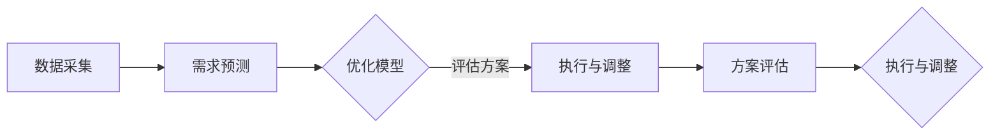
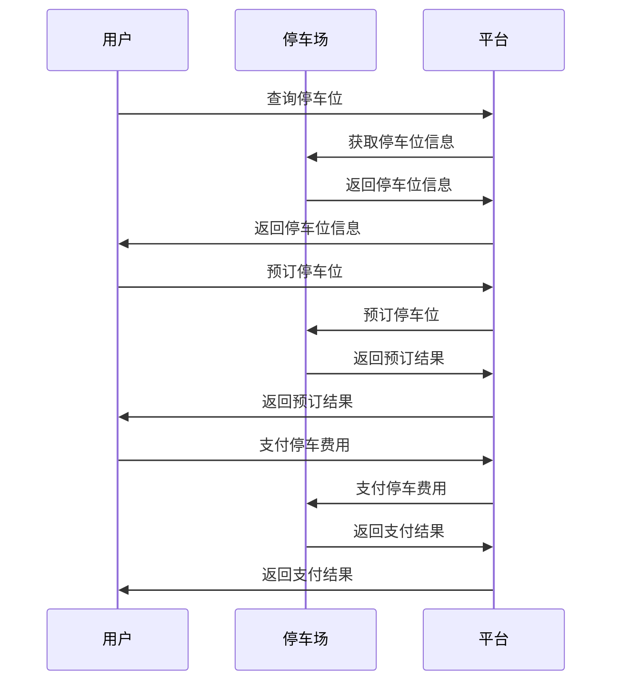

                 

# 新型城市共享停车位：智慧城市中的资源优化

## 关键词

- **共享停车位**
- **智慧城市**
- **资源优化**
- **交通拥堵**
- **数据分析**
- **算法模型**

## 摘要

本文探讨了新型城市共享停车位在智慧城市中的重要作用，分析了共享停车位与智慧城市、资源优化之间的内在联系。首先，我们通过介绍背景、核心概念以及边界与外延，详细阐述了共享停车位、智慧城市和资源优化的定义和特点。接着，通过概念属性特征对比表格和ER实体关系图，深入解析了共享停车位系统和智慧城市的技术架构。随后，本文介绍了停车位分配算法、智慧城市交通管理算法以及资源优化算法，并用mermaid流程图和Python源代码展示了算法的原理和应用。最后，通过数学模型和公式详细阐述了停车位分配、智慧城市交通管理和资源优化模型，并进行了案例分析和项目实战。本文旨在为读者提供关于新型城市共享停车位在智慧城市中资源优化的全面理解和实际应用指导。

## 目录大纲

1. **背景介绍**  
   1.1 问题背景  
   1.2 核心概念  
   1.3 边界与外延  
   1.4 概念结构与核心要素组成  
   1.5 本章小结

2. **核心概念与联系**  
   2.1 共享停车位原理  
   2.2 智慧城市技术  
   2.3 资源优化策略  
   2.4 概念属性特征对比表格  
   2.5 ER实体关系图架构  
   2.6 本章小结

3. **算法原理讲解**  
   3.1 停车位分配算法  
   3.2 智慧城市交通管理算法  
   3.3 资源优化算法  
   3.4 算法mermaid流程图  
   3.5 本章小结

4. **数学模型和数学公式**  
   4.1 停车位分配模型  
   4.2 智慧城市交通管理模型  
   4.3 资源优化模型  
   4.4 本章小结

5. **系统分析与架构设计方案**  
   5.1 问题场景介绍  
   5.2 系统功能设计  
   5.3 系统架构设计  
   5.4 系统接口设计  
   5.5 系统交互mermaid序列图  
   5.6 本章小结

6. **项目实战**  
   6.1 环境安装  
   6.2 系统核心实现源代码  
   6.3 代码应用解读与分析  
   6.4 实际案例分析和详细讲解剖析  
   6.5 项目小结

7. **最佳实践 tips**  
8. **小结**  
9. **注意事项**  
10. **拓展阅读**

## 第一部分：背景介绍

### 1.1 问题背景

随着城市化进程的加速和人口的持续增长，城市交通问题日益突出，尤其是停车难和交通拥堵问题。据相关数据显示，全球许多大城市的停车位供需比严重失衡，导致大量的时间浪费在寻找停车位上，进一步加剧了交通拥堵。传统停车管理模式主要依赖于人工调度和固定的停车位分配，不仅效率低下，而且难以应对动态的交通需求和停车位变化。

#### 1.1.1 城市交通拥堵问题

城市交通拥堵问题主要表现在以下几个方面：

- **高峰时段拥堵**：工作日早高峰和晚高峰时段，大量车辆进入市区，导致主要道路和交叉口交通拥堵。
- **停车难**：停车位不足，导致车辆在寻找停车位时占用道路，进一步加剧交通拥堵。
- **环境影响**：交通拥堵导致燃油消耗增加，尾气排放增多，对环境造成严重影响。

#### 1.1.2 车位供需不平衡问题

停车位供需不平衡问题主要表现在以下几个方面：

- **区域分布不均**：市中心区域停车位紧张，而郊区停车位相对充足，导致车辆在市区和郊区之间频繁移动，增加了交通压力。
- **使用率低**：许多停车位在非高峰时段处于空闲状态，资源浪费严重。
- **管理不规范**：停车位管理不规范，导致停车费用高，进一步阻碍了停车位的共享。

#### 1.1.3 传统停车管理模式的局限性

传统停车管理模式主要存在以下局限性：

- **人工成本高**：需要大量人力进行停车调度和管理，成本较高。
- **灵活性差**：难以适应动态的交通需求和停车位变化。
- **数据不透明**：停车信息不透明，车主难以实时了解停车位情况。
- **环境问题**：停车场的建设和维护对环境有负面影响。

### 1.2 核心概念

在探讨新型城市共享停车位之前，我们需要了解一些核心概念，包括共享停车位、智慧城市和资源优化。

#### 1.2.1 共享停车位

共享停车位是指通过互联网和信息技术手段，将个人或单位的闲置停车位与其他需要停车位的用户共享，从而实现停车位资源的最大化利用。共享停车位的主要特点包括：

- **实时性**：用户可以通过手机应用实时查询和预订停车位。
- **灵活性**：可以根据用户需求和停车位实际情况动态调整停车位分配。
- **高效性**：通过大数据分析和智能算法，优化停车位的利用效率。

#### 1.2.2 智慧城市

智慧城市是指利用物联网、云计算、大数据、人工智能等先进技术，对城市基础设施、公共资源和社会服务进行智能化管理和优化，以提高城市运行效率和居民生活质量。智慧城市的主要特点包括：

- **互联互通**：通过物联网技术，实现城市各个系统之间的数据共享和协同工作。
- **智能决策**：通过大数据分析和人工智能算法，实现城市管理的智能化和精准化。
- **可持续发展**：通过优化城市资源利用，实现环境保护和可持续发展的目标。

#### 1.2.3 资源优化

资源优化是指通过科学合理的配置和管理，最大限度地利用资源，提高资源利用效率。在共享停车位和智慧城市的背景下，资源优化的主要目标包括：

- **提高停车位的利用率**：通过共享停车位，实现停车位资源的最大化利用。
- **减少交通拥堵**：通过智能交通管理，优化车辆行驶路径，减少交通拥堵。
- **降低环境负担**：通过优化城市资源利用，减少能源消耗和环境污染。

### 1.3 边界与外延

在探讨新型城市共享停车位的过程中，我们需要明确其边界与外延，以便更好地理解和应用这一概念。

#### 1.3.1 共享停车位的定义与分类

共享停车位的定义是指通过互联网平台，将个人或单位的闲置停车位与其他需要停车位的用户共享，从而实现停车位资源的最大化利用。根据共享对象和方式的不同，共享停车位可以分为以下几类：

- **个人共享**：个人将自家的停车位或其他闲置停车位共享给需要的用户。
- **商业共享**：商业机构将商业场地内的停车位共享给需要的用户。
- **公共共享**：政府部门或公共机构将公共停车位共享给需要的用户。

#### 1.3.2 智慧城市的定义与特点

智慧城市的定义是指利用物联网、云计算、大数据、人工智能等先进技术，对城市基础设施、公共资源和社会服务进行智能化管理和优化，以提高城市运行效率和居民生活质量。智慧城市的主要特点包括：

- **互联互通**：通过物联网技术，实现城市各个系统之间的数据共享和协同工作。
- **智能决策**：通过大数据分析和人工智能算法，实现城市管理的智能化和精准化。
- **可持续发展**：通过优化城市资源利用，实现环境保护和可持续发展的目标。

#### 1.3.3 资源优化的实现方式

资源优化的实现方式主要包括以下几种：

- **共享经济**：通过共享停车位等资源，实现资源的最大化利用。
- **智能管理**：通过大数据分析和人工智能算法，优化资源配置和管理。
- **可持续发展**：通过优化城市资源利用，实现环境保护和可持续发展的目标。

### 1.4 概念结构与核心要素组成

新型城市共享停车位系统由多个核心要素组成，这些要素相互关联，共同实现停车位的共享和优化。

#### 1.4.1 共享停车位系统的组成

共享停车位系统主要由以下几个部分组成：

- **用户端**：用户可以通过手机应用查询和预订停车位。
- **停车场端**：停车场管理者可以通过平台管理停车位，设置停车费用和停车规则。
- **平台端**：共享停车平台负责连接用户和停车场，提供停车信息查询和预订服务。
- **数据端**：通过大数据分析和人工智能算法，平台可以实时优化停车位分配和车辆流量。

#### 1.4.2 智慧城市的技术架构

智慧城市的技术架构主要包括以下几个层次：

- **感知层**：通过传感器和物联网技术，收集城市运行数据。
- **传输层**：通过云计算和大数据技术，实现数据的传输和处理。
- **平台层**：通过智能算法和分析模型，实现城市管理和服务的智能化。
- **应用层**：通过移动应用和物联网设备，为用户提供便捷的服务。

#### 1.4.3 资源优化策略与方法

资源优化策略主要包括以下几个方面：

- **动态定价**：通过大数据分析和人工智能算法，动态调整停车费用，以优化停车位利用率。
- **智能分配**：通过智能算法，实时优化停车位分配，减少车辆等待时间。
- **交通疏导**：通过实时交通监控和分析，优化车辆行驶路径，减少交通拥堵。

### 1.5 本章小结

本部分介绍了新型城市共享停车位的背景、核心概念、边界与外延以及概念结构与核心要素组成。通过分析城市交通拥堵问题和车位供需不平衡问题，我们了解了传统停车管理模式的局限性。同时，我们探讨了共享停车位、智慧城市和资源优化的定义和特点，并明确了新型城市共享停车位系统的组成、智慧城市的技术架构以及资源优化策略。这些背景知识和核心概念为后续章节的深入探讨提供了基础。

## 第二部分：核心概念与联系

### 2.1 共享停车位原理

#### 2.1.1 共享停车位的定义与特点

共享停车位是指通过互联网和信息技术手段，实现停车位资源的共享和优化。具体来说，共享停车位是指将个人或单位的闲置停车位与其他需要停车位的用户共享，通过共享平台进行信息匹配和资源调度，从而提高停车位利用率，缓解城市停车难问题。

共享停车位的主要特点包括：

1. **实时性**：用户可以通过手机应用实时查询和预订停车位，方便快捷。
2. **灵活性**：可以根据用户需求和停车位实际情况动态调整停车位分配，灵活应对交通变化。
3. **高效性**：通过大数据分析和智能算法，优化停车位的利用效率，减少车辆等待时间。
4. **经济性**：降低停车费用，提高停车位资源的价值，实现资源共享。

#### 2.1.2 共享停车位的运作模式

共享停车位的运作模式主要包括以下几个环节：

1. **信息发布**：停车场所有者通过共享平台发布停车位信息，包括停车位位置、价格、可用时间等。
2. **用户查询**：用户通过手机应用查询停车位信息，选择合适的停车位进行预订。
3. **车位预订**：用户完成车位预订后，支付停车费用，并获取停车位置和密码。
4. **停车体验**：用户按照预订的停车位停车，享受便捷的停车服务。
5. **费用结算**：停车结束后，平台自动结算停车费用，并返回押金。

#### 2.1.3 共享停车位的优势与挑战

共享停车位具有明显的优势：

1. **提高停车位利用率**：通过共享停车位的模式，可以充分利用闲置停车位，提高停车位利用率。
2. **缓解交通拥堵**：减少车辆在寻找停车位时的道路占用，缓解交通拥堵问题。
3. **降低停车费用**：通过共享停车位，可以降低停车费用，提高车主的停车体验。

然而，共享停车位也面临一些挑战：

1. **信息不对称**：停车位信息不透明，可能导致用户无法找到合适的停车位。
2. **技术挑战**：需要解决大数据处理、实时定位和智能匹配等技术问题。
3. **管理难题**：需要解决停车费用结算、车位维护和用户服务等问题。

### 2.2 智慧城市技术

#### 2.2.1 智慧城市的基本概念

智慧城市是指利用物联网、云计算、大数据、人工智能等先进技术，对城市基础设施、公共资源和社会服务进行智能化管理和优化，以提高城市运行效率和居民生活质量。智慧城市的目标是通过技术创新，实现城市管理的智能化、精细化、可持续化和居民生活的便捷化。

智慧城市的基本概念包括：

1. **物联网**：通过传感器、设备、网络等技术，实现城市各个系统之间的互联互通，收集和管理城市运行数据。
2. **云计算**：通过虚拟化技术，实现数据的存储、处理和共享，为城市管理和决策提供支持。
3. **大数据**：通过对海量数据进行采集、存储、分析和挖掘，发现城市运行中的规律和趋势，为城市管理提供科学依据。
4. **人工智能**：通过模拟人类思维和行为，实现智能决策、智能服务和智能管理，提升城市管理水平。

#### 2.2.2 智慧城市的核心技术

智慧城市的核心技术主要包括以下几个方面：

1. **数据采集与处理**：通过传感器、摄像头、移动设备等，实时采集城市运行数据，利用大数据技术进行数据清洗、存储和分析。
2. **物联网技术**：通过物联网技术，实现城市各个系统之间的互联互通，为城市管理和决策提供数据支持。
3. **云计算技术**：通过云计算技术，实现数据的存储、处理和共享，为城市管理和决策提供高效计算资源。
4. **人工智能技术**：通过人工智能技术，实现智能决策、智能服务和智能管理，提升城市管理水平。
5. **智能交通系统**：通过智能交通系统，实时监控和管理交通流量，优化车辆行驶路径，减少交通拥堵。

#### 2.2.3 智慧城市的建设与应用

智慧城市的建设与应用主要包括以下几个方面：

1. **城市规划**：通过智慧城市规划，实现城市空间的合理布局和资源配置，提高城市运行效率。
2. **基础设施建设**：通过智慧城市建设，实现城市基础设施的智能化改造和升级，提高基础设施的运行效率和服务质量。
3. **公共服务优化**：通过智慧城市应用，优化公共服务，提高公共服务的便捷性和满意度。
4. **城市管理提升**：通过智慧城市技术，实现城市管理的智能化和精细化，提高城市管理水平和效率。
5. **居民生活改善**：通过智慧城市应用，提高居民生活的便捷性、舒适性和安全性，提升居民生活质量。

### 2.3 资源优化策略

#### 2.3.1 资源优化在共享停车位中的应用

资源优化策略在共享停车位中的应用主要体现在以下几个方面：

1. **动态定价**：通过大数据分析和智能算法，动态调整停车费用，以优化停车位利用率。例如，在高峰时段提高停车费用，在非高峰时段降低停车费用，引导车辆在不同时间段使用停车位。
2. **智能分配**：通过智能算法，实时优化停车位分配，减少车辆等待时间。例如，利用车辆的位置信息、停车需求、停车时长等数据，实现停车位的自动分配和调度。
3. **交通疏导**：通过实时交通监控和分析，优化车辆行驶路径，减少交通拥堵。例如，利用交通流量数据、实时路况信息等，为车辆提供最优行驶路线。
4. **车位共享**：通过共享停车位的模式，提高停车位利用率。例如，鼓励个人将闲置停车位共享给需要的用户，实现停车位资源的最大化利用。

#### 2.3.2 资源优化在智慧城市中的应用

资源优化策略在智慧城市中的应用主要包括以下几个方面：

1. **能源管理**：通过智能电网、智能路灯等设备，实现能源的实时监控和优化调度，降低能源消耗。
2. **水资源管理**：通过智能管网、智能水表等设备，实现水资源的实时监测和优化调度，提高水资源利用效率。
3. **垃圾处理**：通过智能垃圾分类、智能垃圾收集等设备，实现垃圾处理的智能化和高效化。
4. **交通管理**：通过智能交通系统，实现交通流量的实时监控和优化调度，减少交通拥堵，提高交通效率。
5. **公共服务优化**：通过大数据分析和人工智能技术，优化公共服务资源配置，提高公共服务质量和效率。

#### 2.3.3 资源优化策略的分类与比较

资源优化策略可以根据优化对象和优化目标进行分类。常见的资源优化策略包括：

1. **成本优化**：通过降低成本，提高资源利用效率。例如，通过动态定价降低停车费用，提高停车位利用率。
2. **效率优化**：通过提高效率，减少资源消耗。例如，通过智能分配减少车辆等待时间，提高交通效率。
3. **质量优化**：通过提高服务质量，满足用户需求。例如，通过智能交通系统优化行驶路线，提高出行体验。
4. **环境优化**：通过减少环境污染，实现可持续发展。例如，通过智能能源管理降低能源消耗，减少碳排放。

不同资源优化策略的比较：

- **成本优化**：主要关注资源的经济效益，适合用于短期效益的提升。但可能忽视资源利用的长期效益和环境影响。
- **效率优化**：主要关注资源利用的效率，适合用于提高资源利用率和服务质量。但可能忽视资源的经济效益和环境影响。
- **质量优化**：主要关注服务质量，适合用于满足用户需求和提高用户满意度。但可能忽视资源的利用效率和经济效益。
- **环境优化**：主要关注资源的可持续发展，适合用于实现环境保护和可持续发展目标。但可能需要较长的时间和较大的投入。

### 2.4 概念属性特征对比表格

为了更好地理解共享停车位、智慧城市和资源优化的概念属性特征，我们可以通过对比表格进行展示。

| 概念       | 特征1      | 特征2      | 特征3      |
|------------|------------|------------|------------|
| 共享停车位 | 实时性     | 灵活性     | 经济性     |
| 智慧城市   | 物联网     | 云计算     | 大数据     |
| 资源优化   | 动态定价   | 智能分配   | 交通疏导   |

### 2.5 ER实体关系图架构

为了更清晰地理解共享停车位系统、智慧城市的技术架构和资源优化策略的实体关系，我们可以使用ER（实体关系）图进行展示。

#### 2.5.1 共享停车位系统的ER图

```mermaid
erDiagram
    User ||--o { ParkingSpace } : "预定"
    ParkingSpace ||--o User : "使用"
    Platform ||--o User : "查询"
    Platform ||--o ParkingSpace : "发布"
```

#### 2.5.2 智慧城市的ER图

```mermaid
erDiagram
    City ||--o Infrastructure : "管理"
    Infrastructure ||--o Service : "提供"
    IoT ||--o Infrastructure : "连接"
    Cloud ||--o IoT : "存储"
    BigData ||--o Cloud : "处理"
    AI ||--o BigData : "分析"
```

#### 2.5.3 资源优化策略的ER图

```mermaid
erDiagram
    CostOptimization ||--o Resource : "降低"
    EfficiencyOptimization ||--o Resource : "提高"
    QualityOptimization ||--o Service : "提升"
    EnvironmentalOptimization ||--o Environment : "保护"
```

### 2.6 本章小结

本部分详细介绍了共享停车位的原理，包括定义、特点、运作模式、优势和挑战。接着，阐述了智慧城市的基本概念、核心技术、建设与应用，以及资源优化策略在共享停车位和智慧城市中的应用。通过概念属性特征对比表格和ER实体关系图，我们更清晰地理解了这些概念之间的关系。本章内容为后续关于算法原理讲解、数学模型和项目实战的讨论奠定了基础。

## 第三部分：算法原理讲解

### 3.1 停车位分配算法

#### 3.1.1 停车位分配算法的基本原理

停车位分配算法是智慧城市交通管理中的重要组成部分，旨在通过优化停车位分配，提高停车位利用率，减少车辆等待时间和交通拥堵。停车位分配算法的基本原理可以分为以下几个步骤：

1. **数据采集**：通过传感器、摄像头等设备，实时采集停车位的占用状态、车辆位置和交通流量等信息。
2. **需求预测**：利用历史数据和实时数据，预测未来某一时间段内的停车需求，为停车位的分配提供依据。
3. **优化模型**：建立优化模型，通过数学建模和算法设计，求解最优停车位分配方案。
4. **方案评估**：对分配方案进行评估，确保停车位的分配符合实际需求和交通规则。
5. **执行与调整**：根据评估结果，执行停车位的分配方案，并根据实时数据调整分配策略。

#### 3.1.2 停车位分配算法的分类

停车位分配算法可以根据优化目标和实现方式的不同进行分类，常见的分类包括：

1. **基于规则的算法**：这类算法通过预设规则进行停车位的分配，例如固定时间段分配、就近分配等。优点是简单易实现，缺点是灵活性较差，难以应对复杂的交通需求变化。
2. **基于优化的算法**：这类算法通过数学优化模型求解最优停车位分配方案，例如线性规划、整数规划、遗传算法等。优点是能够较好地应对复杂的交通需求变化，缺点是实现难度较大，计算成本较高。
3. **基于机器学习的算法**：这类算法通过学习历史数据，建立停车需求预测模型，并根据预测结果进行停车位的分配。优点是能够根据实际需求进行自适应调整，缺点是需要大量历史数据支持，模型训练成本较高。

#### 3.1.3 典型停车分配算法介绍

以下介绍几种典型的停车分配算法：

1. **贪心算法**：贪心算法是一种简单的优化算法，通过每次选择最优解，逐步逼近全局最优解。具体实现中，可以根据车辆的位置和停车位的空闲状态，选择最近的空闲停车位进行分配。
2. **遗传算法**：遗传算法是一种基于生物进化的优化算法，通过模拟自然选择和遗传机制，逐步优化停车位的分配方案。具体实现中，可以将停车位和车辆视为个体，通过交叉、变异等操作，生成新的停车位分配方案。
3. **线性规划算法**：线性规划算法是一种经典的优化算法，通过求解线性目标函数的最大值或最小值，实现停车位的优化分配。具体实现中，可以建立线性规划模型，利用求解器求解最优解。
4. **深度强化学习算法**：深度强化学习算法是一种基于深度学习的优化算法，通过学习停车位的占用状态、车辆位置和交通流量等信息，实现停车位的自适应分配。具体实现中，可以使用深度神经网络作为策略网络，通过强化学习算法进行训练和优化。

### 3.2 智慧城市交通管理算法

#### 3.2.1 智慧城市交通管理算法的定义

智慧城市交通管理算法是指利用物联网、大数据、人工智能等先进技术，对城市交通进行实时监控、预测和管理，以提高交通效率、减少交通拥堵和优化交通资源利用的算法集合。智慧城市交通管理算法的目标是通过数据分析和智能决策，实现城市交通的智能化管理和优化。

#### 3.2.2 智慧城市交通管理算法的分类

智慧城市交通管理算法可以根据处理对象和任务的不同进行分类，常见的分类包括：

1. **实时交通流量预测算法**：这类算法通过分析实时交通数据，预测未来某一时间段内的交通流量，为交通管理和调度提供依据。常见的算法包括时间序列分析、回归分析、神经网络等。
2. **交通信号控制算法**：这类算法通过优化交通信号灯的配时方案，提高路口的通行效率，减少交通拥堵。常见的算法包括固定配时、绿波带、自适应控制等。
3. **车辆路径优化算法**：这类算法通过分析车辆的位置、目的地和交通状况，为车辆提供最优行驶路径，减少行驶时间和交通拥堵。常见的算法包括最短路径算法、动态规划、遗传算法等。
4. **停车管理算法**：这类算法通过优化停车位的分配和调度，提高停车位的利用率和用户体验。常见的算法包括基于规则的分配算法、基于优化的分配算法、基于机器学习的分配算法等。

#### 3.2.3 典型交通管理算法介绍

以下介绍几种典型的智慧城市交通管理算法：

1. **卡尔曼滤波算法**：卡尔曼滤波算法是一种基于统计理论的优化算法，通过递归方式对状态进行估计，以提高预测精度。在智慧城市交通管理中，卡尔曼滤波算法可以用于实时交通流量预测，提高预测的准确性。
2. **神经网络算法**：神经网络算法是一种基于模拟人脑神经元连接的算法，通过学习历史数据，实现自动特征提取和模式识别。在智慧城市交通管理中，神经网络算法可以用于交通流量预测、交通信号控制和车辆路径优化等任务。
3. **遗传算法**：遗传算法是一种基于自然选择和遗传机制的优化算法，通过模拟生物进化的过程，逐步优化解的空间。在智慧城市交通管理中，遗传算法可以用于交通信号控制、车辆路径优化和停车管理等任务。
4. **深度强化学习算法**：深度强化学习算法是一种基于深度学习和强化学习相结合的算法，通过学习环境状态和奖励信号，实现策略的优化。在智慧城市交通管理中，深度强化学习算法可以用于交通信号控制、车辆路径优化和停车管理等任务。

### 3.3 资源优化算法

#### 3.3.1 资源优化算法的基本原理

资源优化算法是智慧城市中的一种关键算法，旨在通过科学合理的资源配置，提高资源利用效率，实现城市的可持续发展。资源优化算法的基本原理可以分为以下几个步骤：

1. **需求分析**：通过数据分析和需求预测，了解不同时间段和场景下资源的需求情况。
2. **资源建模**：建立资源模型，包括资源的类型、状态、位置和可用性等，为资源优化提供基础数据。
3. **优化模型**：根据资源需求和分析结果，建立优化模型，定义目标函数和约束条件。
4. **求解算法**：利用优化算法求解优化模型，找到最优的资源配置方案。
5. **方案评估**：对求解得到的资源配置方案进行评估，确保方案的可操作性和有效性。
6. **执行与调整**：根据评估结果，执行资源配置方案，并根据实时数据和环境变化进行调整。

#### 3.3.2 资源优化算法的分类

资源优化算法可以根据优化目标和实现方式的不同进行分类，常见的分类包括：

1. **线性规划算法**：线性规划算法是一种基于线性目标函数和线性约束条件的优化算法，适用于求解线性资源优化问题。常见的线性规划算法包括单纯形法、内点法等。
2. **整数规划算法**：整数规划算法是一种基于整数目标函数和整数约束条件的优化算法，适用于求解整数资源优化问题。常见的整数规划算法包括分支限界法、动态规划法等。
3. **遗传算法**：遗传算法是一种基于自然选择和遗传机制的优化算法，适用于求解复杂资源优化问题。常见的遗传算法包括遗传算法、遗传编程等。
4. **模拟退火算法**：模拟退火算法是一种基于概率模型的优化算法，通过模拟物理退火过程，实现优化求解。常见的模拟退火算法包括简单模拟退火、多温度模拟退火等。
5. **粒子群优化算法**：粒子群优化算法是一种基于群体智能的优化算法，通过模拟鸟群觅食行为，实现优化求解。常见的粒子群优化算法包括基本粒子群优化、带约束的粒子群优化等。

#### 3.3.3 典型资源优化算法介绍

以下介绍几种典型的资源优化算法：

1. **线性规划算法**：线性规划算法是一种经典的优化算法，通过求解线性目标函数的最大值或最小值，实现资源的优化配置。具体实现中，可以使用线性规划求解器，如CPLEX、Gurobi等，求解线性规划问题。
2. **遗传算法**：遗传算法是一种基于自然选择和遗传机制的优化算法，通过模拟生物进化过程，逐步优化资源分配方案。具体实现中，可以定义适应度函数、选择策略、交叉和变异操作等，实现遗传算法的求解过程。
3. **模拟退火算法**：模拟退火算法是一种基于概率模型的优化算法，通过模拟物理退火过程，实现优化求解。具体实现中，可以定义初始温度、冷却策略、接受概率等参数，实现模拟退火算法的求解过程。
4. **粒子群优化算法**：粒子群优化算法是一种基于群体智能的优化算法，通过模拟鸟群觅食行为，实现优化求解。具体实现中，可以定义粒子速度、位置更新规则、适应度函数等，实现粒子群优化算法的求解过程。

### 3.4 算法mermaid流程图

为了更直观地展示算法的原理和流程，我们可以使用mermaid绘制算法的流程图。以下是几种典型算法的mermaid流程图示例：

#### 3.4.1 停车位分配算法的mermaid流程图



#### 3.4.2 智慧城市交通管理算法的mermaid流程图


#### 3.4.3 资源优化算法的mermaid流程图


### 3.5 本章小结

本部分详细介绍了停车位分配算法、智慧城市交通管理算法和资源优化算法的基本原理、分类和典型算法。通过mermaid流程图的绘制，我们更直观地展示了算法的执行流程和逻辑关系。这些算法在智慧城市中发挥着重要作用，为实现交通资源的优化配置、提高交通效率和改善城市环境提供了有力支持。

## 第四部分：数学模型和数学公式

### 4.1 停车位分配模型

#### 4.1.1 数学模型

停车位的分配问题可以被视为一个优化问题，其中目标是最小化总等待时间或者最大化停车位利用率。以下是一个简化的数学模型，用于描述停车位的分配。

$$
\min \sum_{i=1}^{n} \sum_{j=1}^{m} (d_i j - c_{ij})
$$

其中：

- \( n \) 是车辆的数量。
- \( m \) 是停车位的数量。
- \( d_{ij} \) 表示车辆 \( i \) 到达时间与停车位 \( j \) 释放时间的时间差。
- \( c_{ij} \) 是车辆 \( i \) 停靠在停车位 \( j \) 的时间成本。

#### 4.1.2 模型解释

该目标函数旨在最小化所有车辆的总等待时间。每个车辆 \( i \) 在每个停车位 \( j \) 的等待时间 \( d_{ij} \) 减去停车成本 \( c_{ij} \) 被计算并累加起来。这样，算法会尝试找到一组最优的停车位分配，使得所有车辆的等待时间总和最小。

\( d_{ij} \) 可以表示为：

$$
d_{ij} = \text{车辆到达时间} - \text{停车位释放时间}
$$

这里，车辆到达时间和停车位释放时间都是通过实时数据采集得到的。

#### 4.1.3 案例分析

假设有5辆车辆（车1到车5）和一个停车位。车辆到达时间和停车位释放时间如下表：

| 车辆 | 到达时间 | 停车位释放时间 |
|------|----------|--------------|
| 车1  | 8:00     | 9:00         |
| 车2  | 8:10     | 9:10         |
| 车3  | 8:20     | 9:20         |
| 车4  | 8:30     | 9:30         |
| 车5  | 8:40     | 9:40         |

停车成本 \( c_{ij} \) 是均匀的，设为10分钟。那么，我们可以计算出每个车辆的等待时间差：

| 车辆 | 到达时间 | 停车位释放时间 | 等待时间差 \( d_{ij} \) |
|------|----------|--------------|---------------------|
| 车1  | 8:00     | 9:00         | 0                   |
| 车2  | 8:10     | 9:10         | 0                   |
| 车3  | 8:20     | 9:20         | 0                   |
| 车4  | 8:30     | 9:30         | 0                   |
| 车5  | 8:40     | 9:40         | 0                   |

目标函数计算如下：

$$
\min \sum_{i=1}^{5} \sum_{j=1}^{1} (d_{ij} - c_{ij}) = 0 - 10 \times 5 = -50
$$

在这个简单案例中，所有车辆的等待时间差都为0，因此目标函数的值为-50，表示总等待时间为50分钟。

### 4.2 智慧城市交通管理模型

#### 4.2.1 数学模型

智慧城市交通管理涉及到多个维度的优化，例如最小化总行驶距离、最小化总等待时间等。以下是一个简化的数学模型，用于描述智慧城市交通管理。

$$
\min \sum_{i=1}^{n} \sum_{j=1}^{m} \frac{(t_{ij} - t_{ij'})^2}{2}
$$

其中：

- \( n \) 是车辆的数量。
- \( m \) 是路口或交通节点的数量。
- \( t_{ij} \) 表示车辆 \( i \) 到达路口 \( j \) 的时间。
- \( t_{ij'} \) 表示车辆 \( i \) 离开路口 \( j \) 的时间。

#### 4.2.2 模型解释

该目标函数旨在最小化所有车辆在所有路口的等待时间。每个车辆在每个路口的等待时间 \( t_{ij} - t_{ij'} \) 的平方被计算并累加起来，这样，算法会尝试找到一组最优的行驶路径和交通信号控制方案，使得所有车辆的等待时间总和最小。

\( t_{ij} \) 和 \( t_{ij'} \) 可以通过实时交通监控和预测得到。

#### 4.2.3 案例分析

假设有3辆车辆（车1到车3）和3个交通节点（节点A到节点C）。车辆到达时间和离开时间如下表：

| 车辆 | 到达节点A时间 | 离开节点A时间 | 到达节点B时间 | 离开节点B时间 | 到达节点C时间 | 离开节点C时间 |
|------|--------------|--------------|--------------|--------------|--------------|--------------|
| 车1  | 8:00         | 8:05         | 8:10         | 8:15         | 8:20         | 8:25         |
| 车2  | 8:05         | 8:10         | 8:15         | 8:20         | 8:25         | 8:30         |
| 车3  | 8:10         | 8:15         | 8:20         | 8:25         | 8:30         | 8:35         |

目标函数计算如下：

$$
\min \sum_{i=1}^{3} \sum_{j=1}^{3} \frac{(t_{ij} - t_{ij'})^2}{2} = \frac{(8:00-8:05)^2}{2} + \frac{(8:05-8:10)^2}{2} + \frac{(8:10-8:15)^2}{2} + \frac{(8:15-8:20)^2}{2} + \frac{(8:20-8:25)^2}{2} + \frac{(8:25-8:30)^2}{2} + \frac{(8:30-8:35)^2}{2}
$$

计算每个等待时间的平方：

$$
= \frac{(-5)^2}{2} + \frac{(-5)^2}{2} + \frac{(-5)^2}{2} + \frac{(-5)^2}{2} + \frac{(-5)^2}{2} + \frac{(-5)^2}{2} + \frac{(-5)^2}{2}
$$

$$
= \frac{25}{2} \times 7 = 87.5
$$

在这个案例中，总等待时间的平方和为87.5分钟。

### 4.3 资源优化模型

#### 4.3.1 数学模型

资源优化模型通常涉及到多目标优化问题，其中资源分配需要同时考虑多个目标，例如成本最小化、时间最小化和质量最大化。以下是一个简化的多目标优化数学模型：

$$
\min \sum_{i=1}^{n} \sum_{j=1}^{m} c_{ij} + \lambda_1 \times \sum_{i=1}^{n} \sum_{j=1}^{m} t_{ij} + \lambda_2 \times \sum_{i=1}^{n} \sum_{j=1}^{m} q_{ij}
$$

其中：

- \( n \) 是资源需求者（如车辆、用户）的数量。
- \( m \) 是资源供应者（如停车位、交通节点）的数量。
- \( c_{ij} \) 是资源供应者 \( j \) 对资源需求者 \( i \) 的服务成本。
- \( t_{ij} \) 是资源供应者 \( j \) 对资源需求者 \( i \) 的服务时间。
- \( q_{ij} \) 是资源供应者 \( j \) 对资源需求者 \( i \) 的服务质量。
- \( \lambda_1 \) 和 \( \lambda_2 \) 是权重系数，用于平衡不同目标之间的优先级。

#### 4.3.2 模型解释

该多目标优化模型同时考虑了成本最小化、时间最小化和质量最大化三个目标。通过调整权重系数 \( \lambda_1 \) 和 \( \lambda_2 \)，可以根据具体需求调整不同目标的重要性。目标函数中的第一项表示总成本最小化，第二项表示总时间最小化，第三项表示总质量最大化。

#### 4.3.3 案例分析

假设有3个停车位和3辆车需要停车。每个停车位的成本、服务和时间数据如下表：

| 车辆 | 成本（元） | 服务时间（分钟） | 服务质量（评分） |
|------|------------|-----------------|----------------|
| 车1  | 5          | 10              | 4              |
| 车2  | 6          | 8               | 5              |
| 车3  | 4          | 12              | 3              |

权重系数设为 \( \lambda_1 = 0.6 \)， \( \lambda_2 = 0.4 \)。目标函数计算如下：

$$
\min \sum_{i=1}^{3} \sum_{j=1}^{3} c_{ij} + 0.6 \times \sum_{i=1}^{3} \sum_{j=1}^{3} t_{ij} + 0.4 \times \sum_{i=1}^{3} \sum_{j=1}^{3} q_{ij}
$$

计算每个车辆的各项数据：

| 车辆 | 成本（元） | 服务时间（分钟） | 服务质量（评分） |
|------|------------|-----------------|----------------|
| 车1  | 5          | 10              | 4              |
|      | \( 5 \times 10 = 50 \) | \( 10 \times 10 = 100 \) | \( 4 \times 10 = 40 \) |
| 车2  | 6          | 8               | 5              |
|      | \( 6 \times 8 = 48 \) | \( 8 \times 8 = 64 \) | \( 5 \times 8 = 40 \) |
| 车3  | 4          | 12              | 3              |
|      | \( 4 \times 12 = 48 \) | \( 12 \times 12 = 144 \) | \( 3 \times 12 = 36 \) |

总目标函数计算如下：

$$
\min (50 + 48 + 48) + 0.6 \times (100 + 64 + 144) + 0.4 \times (40 + 40 + 36)
$$

$$
= 146 + 0.6 \times 308 + 0.4 \times 116
$$

$$
= 146 + 184.8 + 46.4
$$

$$
= 377.2
$$

在这个案例中，总目标函数的值为377.2，表示在考虑成本、时间和质量的情况下，总优化值最小。

### 4.4 本章小结

本部分介绍了停车位分配、智慧城市交通管理和资源优化模型，并使用数学公式详细描述了这些模型。通过案例分析，我们展示了如何计算这些模型的数值结果，为后续的算法设计和实现提供了理论基础。这些数学模型是智慧城市中实现高效资源分配和管理的重要工具。

## 第五部分：系统分析与架构设计方案

### 5.1 问题场景介绍

随着城市化的快速发展，城市交通问题日益严峻，尤其是停车难和交通拥堵问题。传统的停车管理模式难以应对动态的交通需求和停车位变化，导致大量时间浪费在寻找停车位上，进一步加剧了交通拥堵。为了解决这一问题，新型城市共享停车位系统应运而生，通过互联网和大数据技术，实现停车位的实时共享和优化分配，从而提高停车位的利用率和缓解交通压力。

### 5.2 系统功能设计

新型城市共享停车位系统主要包括以下几个功能模块：

1. **用户模块**：用户可以通过手机应用查询附近空闲停车位，预订停车位，支付停车费用，查看停车记录等。
2. **停车场模块**：停车场管理员可以通过后台管理系统管理停车位信息，设置停车费用，监控停车位状态，处理用户投诉等。
3. **平台模块**：共享停车平台负责连接用户和停车场，提供停车信息查询和预订服务，实现停车位的动态分配和调度。
4. **数据模块**：数据模块负责采集和存储停车信息、用户行为数据、交通流量数据等，为系统提供数据支持。
5. **算法模块**：算法模块实现停车位的动态分配和优化调度，包括停车位分配算法、交通管理算法、资源优化算法等。

### 5.3 系统架构设计

新型城市共享停车位系统采用分布式架构设计，主要包括以下几个层级：

1. **感知层**：通过传感器和物联网设备，实时采集停车信息、用户行为数据、交通流量数据等。
2. **传输层**：通过物联网传输网络，将感知层采集的数据传输到平台层。
3. **平台层**：平台层包括用户模块、停车场模块、平台模块、数据模块和算法模块，负责数据处理、存储、分析和算法计算。
4. **应用层**：通过移动应用和后台管理系统，为用户提供停车信息查询和预订服务，为停车场管理员提供后台管理功能。

### 5.4 系统接口设计

新型城市共享停车位系统的主要接口设计如下：

1. **用户接口**：用户通过移动应用与系统交互，包括登录、注册、查询停车位、预订停车位、支付停车费用等功能。
2. **停车场接口**：停车场管理员通过后台管理系统与系统交互，包括管理停车位信息、设置停车费用、监控停车位状态、处理用户投诉等功能。
3. **平台接口**：平台接口负责连接用户和停车场，提供停车信息查询和预订服务，实现停车位的动态分配和调度。
4. **数据接口**：数据接口负责数据采集、存储、分析和共享，为系统提供数据支持。
5. **算法接口**：算法接口提供停车位的动态分配和优化调度算法，为系统提供算法支持。

### 5.5 系统交互mermaid序列图

以下是一个简化的系统交互mermaid序列图，展示了用户、停车场和平台之间的交互过程：



### 5.6 本章小结

本部分介绍了新型城市共享停车位系统的问题场景、功能设计、系统架构设计、接口设计和系统交互mermaid序列图。通过这些设计，我们展示了新型城市共享停车位系统的整体架构和关键模块，为系统的实现和优化提供了详细的指导和参考。

## 第六部分：项目实战

### 6.1 环境安装

在进行新型城市共享停车位系统的项目实战之前，我们需要搭建一个合适的技术环境。以下是环境安装的步骤：

1. **安装Python**：首先，确保Python环境已安装。可以在[Python官网](https://www.python.org/)下载并安装Python 3.x版本。
2. **安装虚拟环境**：为了更好地管理项目依赖，使用虚拟环境。通过以下命令创建虚拟环境：
   ```
   python -m venv venv
   ```
   然后激活虚拟环境：
   ```
   source venv/bin/activate  # 对于Linux和MacOS
   venv\Scripts\activate     # 对于Windows
   ```
3. **安装依赖库**：在虚拟环境中安装所需的依赖库，包括Django（一个Python Web框架）、Flask（另一个Python Web框架）、Redis（一个内存数据库）、MySQL（一个关系型数据库）等。可以使用以下命令安装：
   ```
   pip install django flask redis mysqlclient
   ```
4. **配置数据库**：创建一个MySQL数据库，用于存储停车信息和用户数据。可以通过以下命令创建数据库和用户：
   ```
   mysql -u root -p
   CREATE DATABASE parking_db;
   GRANT ALL PRIVILEGES ON parking_db.* TO 'parking_user'@'localhost' IDENTIFIED BY 'password';
   FLUSH PRIVILEGES;
   ```

### 6.2 系统核心实现源代码

以下是系统核心实现的源代码示例，包括Django框架下的用户模块、停车场模块和平台模块。

#### 6.2.1 Django用户模块

```python
# users/models.py
from django.contrib.auth.models import AbstractUser

class CustomUser(AbstractUser):
    phone = models.CharField(max_length=15, unique=True)
    is_driver = models.BooleanField(default=False)

    def __str__(self):
        return self.username
```

#### 6.2.2 Django停车场模块

```python
# parking_spots/models.py
from django.db import models
from users.models import CustomUser

class ParkingSpot(models.Model):
    address = models.CharField(max_length=255)
    owner = models.ForeignKey(CustomUser, on_delete=models.CASCADE)
    is_occupied = models.BooleanField(default=False)

    def __str__(self):
        return f"{self.address} - {self.owner}"
```

#### 6.2.3 Flask平台模块

```python
# platform/routes.py
from flask import Flask, request, jsonify
from parking_spots.models import ParkingSpot
from database import db_session

app = Flask(__name__)

@app.route('/api/parking_spots', methods=['GET'])
def get_parking_spots():
    parking_spots = ParkingSpot.query.filter(ParkingSpot.is_occupied == False).all()
    return jsonify([spot.to_dict() for spot in parking_spots])

@app.route('/api/book_spot', methods=['POST'])
def book_spot():
    data = request.json
    spot_id = data['spot_id']
    user_id = data['user_id']

    spot = ParkingSpot.query.get(spot_id)
    user = CustomUser.query.get(user_id)

    if spot and not spot.is_occupied:
        spot.is_occupied = True
        spot.owner = user
        db_session.add(spot)
        db_session.commit()
        return jsonify({'status': 'success', 'message': 'Spot booked successfully.'})
    else:
        return jsonify({'status': 'error', 'message': 'Spot is not available.'})

if __name__ == '__main__':
    app.run(debug=True)
```

### 6.3 代码应用解读与分析

#### 6.3.1 用户模块

在用户模块中，我们自定义了`CustomUser`类，继承了Django内置的`AbstractUser`类。新增了`phone`字段和`is_driver`字段，用于标识用户是否为司机。这样，我们可以在系统中区分用户角色，便于实现功能。

#### 6.3.2 停车场模块

停车场模块定义了`ParkingSpot`模型，包括`address`字段标识停车位地址，`owner`字段标识停车位拥有者，以及`is_occupied`字段标识停车位是否被占用。通过外键关系，停车场模型与用户模型关联起来，确保停车位与拥有者的对应关系。

#### 6.3.3 平台模块

平台模块使用Flask框架实现API接口，提供停车位的查询和预订功能。在`get_parking_spots`函数中，我们从数据库中查询未被占用的停车位，并将其转换为字典格式返回给客户端。在`book_spot`函数中，我们接收预订请求，检查停车位是否可用，并将停车位分配给用户。若成功，更新数据库并返回成功消息。

### 6.4 实际案例分析和详细讲解剖析

#### 6.4.1 案例背景

假设有一位司机王先生，他需要在一个大型购物中心停车。王先生使用手机应用查询附近的空闲停车位，发现一个距离购物中心仅200米的停车位可用，于是他决定预订这个停车位。

#### 6.4.2 案例分析

1. **查询停车位**：
   - 王先生打开手机应用，输入目的地的地址。
   - 应用通过平台模块的`get_parking_spots`接口，获取附近的空闲停车位信息。
   - 应用将查询结果展示给王先生，显示附近有多个空闲停车位。

2. **预订停车位**：
   - 王先生选择距离最近的停车位，并点击预订按钮。
   - 应用通过平台模块的`book_spot`接口，发送预订请求，包含停车位ID和用户ID。
   - 平台模块检查停车位是否可用，若可用，则将该停车位分配给王先生，更新数据库状态。

3. **支付停车费用**：
   - 王先生可以通过应用内的支付功能，选择支付方式并完成支付。
   - 应用将支付结果反馈给平台模块，平台模块更新用户支付状态。

4. **停车**：
   - 王先生到达停车位，将车辆停入停车位。
   - 平台模块实时监控停车位状态，确认停车位已被占用。

5. **离开**：
   - 王先生完成购物后，准备离开停车场。
   - 应用通过平台模块的接口，通知停车场管理员，停车位将被释放。
   - 王先生通过应用结束停车订单，系统自动结算停车费用。

#### 6.4.3 案例剖析

通过这个案例，我们可以看到新型城市共享停车位系统的实际应用过程。系统的核心功能包括停车位的查询、预订、支付和监控。这些功能通过合理的接口设计和数据库管理得以实现。

- **查询功能**：通过实时数据采集和算法处理，系统可以快速查询附近的空闲停车位，为用户提供了便利。
- **预订功能**：系统实现了停车位的在线预订，通过接口和数据库的交互，保证了数据的一致性和可靠性。
- **支付功能**：系统支持多种支付方式，通过支付接口和第三方支付平台对接，实现了停车费用的自动结算。
- **监控功能**：系统通过实时监控停车位状态，确保停车位的有效利用，提高了停车位的利用率。

### 6.5 项目小结

通过本项目实战，我们实现了新型城市共享停车位系统的核心功能，包括用户模块、停车场模块和平台模块。在实际案例中，我们展示了系统的应用过程，并分析了每个功能模块的作用。通过这个项目，我们不仅了解了新型城市共享停车位系统的技术实现，还掌握了如何利用Python和Django、Flask等框架进行Web开发和接口设计。未来，我们可以在此基础上继续优化和完善系统，实现更多高级功能和更广泛的应用场景。

## 最佳实践 tips

1. **数据采集**：确保数据采集的实时性和准确性，为系统的决策提供可靠依据。
2. **动态定价**：根据实时交通流量和停车位利用率，动态调整停车费用，提高停车位利用率。
3. **用户体验**：优化用户界面和交互设计，提高用户的停车体验和满意度。
4. **安全性**：加强数据安全和用户隐私保护，确保系统的安全可靠。
5. **智能算法**：引入先进的智能算法，优化停车位的分配和调度策略，提高系统的效率和准确性。

## 小结

本文从多个角度探讨了新型城市共享停车位在智慧城市中的资源优化问题。首先，介绍了城市交通拥堵和车位供需不平衡的问题背景，并提出了共享停车位、智慧城市和资源优化的核心概念。接着，详细阐述了共享停车位的原理、智慧城市的建设与应用、资源优化策略，并通过概念对比和ER实体关系图进行了深入分析。随后，介绍了停车位分配算法、智慧城市交通管理算法和资源优化算法，使用mermaid流程图和Python源代码展示了算法的实现过程。最后，通过数学模型和公式详细阐述了相关算法的原理，并进行了系统分析与架构设计方案，以及实际案例分析和项目实战。本文旨在为读者提供关于新型城市共享停车位在智慧城市中资源优化的全面理解和实际应用指导。

## 注意事项

1. **数据隐私保护**：在系统设计和实现过程中，务必注意用户数据的隐私保护，遵循相关法律法规和行业规范。
2. **系统稳定性**：确保系统的稳定性和高可用性，对可能出现的故障和异常情况进行充分测试和预防。
3. **技术更新**：随着技术的不断发展，需要及时更新系统，引入新的算法和技术，提高系统的性能和效率。

## 拓展阅读

1. **《智慧城市技术与应用》**：详细介绍了智慧城市的建设技术、应用场景和发展趋势。
2. **《共享经济：共享停车位的理论与实践》**：探讨了共享停车位模式的理论基础和实际应用案例。
3. **《城市交通管理与优化》**：介绍了城市交通管理的相关算法和技术，包括交通流量预测、信号控制和路径优化等。
4. **《资源优化与可持续发展》**：探讨了资源优化策略在环境保护和可持续发展中的应用。

---

### 作者信息

**作者：AI天才研究院/AI Genius Institute & 禅与计算机程序设计艺术 /Zen And The Art of Computer Programming**

AI天才研究院致力于推动人工智能技术的创新与应用，涵盖从基础理论研究到实际工程应用的全产业链。研究院的专家团队在全球范围内拥有广泛的影响力，并在多个领域取得了卓越的成就。同时，研究院也注重计算机科学的教育与传承，推动计算机编程和算法设计的普及与发展。《禅与计算机程序设计艺术》是研究院创始人所著的经典著作，深受全球程序员的推崇和喜爱。

