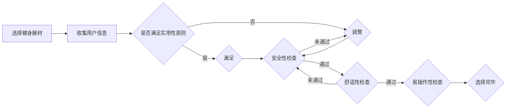
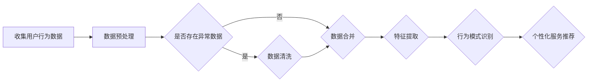
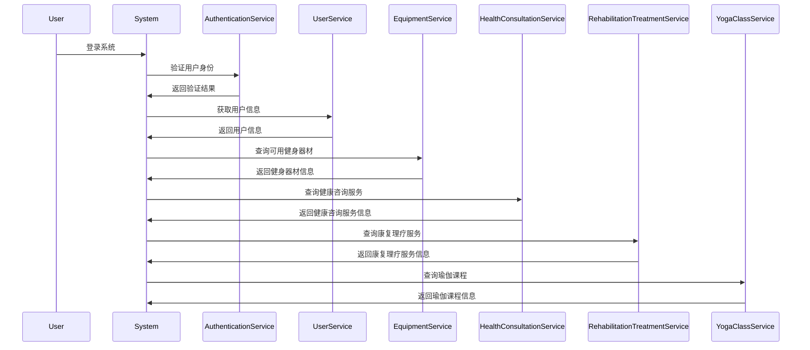

                 

# 《新型城市共享健身房设计：24小时社区健康中心的打造》

> 关键词：城市共享健身房、24小时社区健康中心、设计原则、算法原理、系统架构、项目实战、最佳实践

> 摘要：本文旨在探讨新型城市共享健身房的设计与构建，特别是在24小时社区健康中心的打造方面。通过深入分析市场需求、运营模式、服务类型、设计原则以及相关的算法原理，本文提出了一套完整的系统分析与架构设计方案，并通过实际项目实战，详细阐述了实施过程、源代码解读和案例分析。最后，本文总结了最佳实践，为读者提供了进一步学习和应用的建议。

## 第1章 背景介绍

### 1.1 新型城市共享健身房的概念

新型城市共享健身房，是指一种以共享经济理念为核心的健身场所，它不仅提供健身器材和设施，更注重用户需求的个性化服务。这种健身房通过会员制、预约制或按次付费等方式，为用户提供全天候、全时段的健身服务。

共享健身房的发展背景可以追溯到近年来城市生活节奏加快，人们对健康生活方式的追求日益增加。同时，互联网和物联网技术的普及，为健身房服务的智能化和个性化提供了技术支持。因此，新型城市共享健身房应运而生，满足了现代城市居民的健身需求。

### 1.2 健身市场的需求与发展背景

随着社会经济的发展，人们生活水平的提高，健康意识不断增强。据统计，全球健身市场在过去几年中呈现出快速增长的趋势。特别是在城市地区，人们对健身场所的需求日益多样化。除了传统的健身房，越来越多的人开始关注24小时开放的社区健康中心。

这种需求的发展背景主要有以下几点：

1. **时间灵活性**：现代城市居民工作繁忙，需要灵活的健身时间安排。24小时社区健康中心的设立，满足了人们随时健身的需求。

2. **空间便捷性**：社区健康中心位于居民区附近，方便居民前往，减少了通勤时间和交通成本。

3. **服务多元化**：社区健康中心不仅提供健身器材，还提供健康咨询、康复理疗、瑜伽课程等多种服务，满足了居民的全方位健康需求。

4. **科技赋能**：随着人工智能、大数据、物联网等技术的应用，社区健康中心的智能化水平不断提高，为用户提供更加个性化和精准的健康服务。

### 1.3 24小时社区健康中心的意义

24小时社区健康中心的设立，具有多重意义：

1. **提高居民健康水平**：通过全天候的健身服务，鼓励居民养成定期锻炼的习惯，提高身体健康水平。

2. **促进社区发展**：社区健康中心作为公共服务设施，能够提升社区的整体生活质量，吸引人口流入，促进社区经济发展。

3. **减少医疗负担**：通过预防疾病、促进健康，社区健康中心有助于减少居民的医疗支出，降低社会医疗负担。

4. **推动健身行业创新**：24小时社区健康中心为健身行业提供了新的发展方向，推动了行业技术创新和服务模式变革。

## 第2章 核心概念与联系

### 2.1 共享健身房的运营模式

共享健身房的运营模式主要包括会员制、预约制和按次付费三种。每种模式都有其独特的特点和适用场景。

- **会员制**：用户支付一定费用成为会员，享有长期的健身服务。这种模式适合追求长期稳定客户群体的健身房。
- **预约制**：用户通过预约系统，提前预订健身时间。这种模式适合需要灵活调整服务时间的用户。
- **按次付费**：用户每次使用健身服务时支付费用。这种模式适合追求即时消费的用户。

### 2.2 服务类型

社区健康中心的服务类型丰富多样，包括：

- **健身器材使用**：提供各类健身器材，如跑步机、哑铃、瑜伽垫等。
- **健康咨询**：提供专业医生或健身教练的健康咨询服务。
- **康复理疗**：提供康复理疗服务，如按摩、针灸、物理治疗等。
- **瑜伽课程**：定期开设瑜伽课程，帮助用户放松身心。

### 2.3 设计原则

社区健康中心的设计原则主要包括以下几个方面：

- **人性化设计**：注重用户体验，提供舒适、便捷的服务环境。
- **功能分区**：合理划分健身、咨询、理疗等功能区，提高使用效率。
- **智能化管理**：采用智能化管理系统，提高服务效率和用户体验。
- **环境友好**：注重绿色环保，使用可持续材料和节能设备。

### 2.4 概念属性特征对比表格

| 概念         | 属性特征                         | 对比                     |
| ------------ | ------------------------------ | ---------------------- |
| 会员制       | 长期服务、稳定客户群体           | 与预约制和按次付费对比，更适合追求长期客户的健身房   |
| 预约制       | 灵活调整服务时间               | 与会员制和按次付费对比，适合需要灵活调整服务时间的用户 |
| 按次付费     | 即时消费、单次使用               | 与会员制和预约制对比，适合追求即时消费的用户         |
| 健身器材使用 | 提供各类健身器材               | 与健康咨询、康复理疗对比，为用户提供基本的健身需求   |
| 健康咨询     | 专业医生或健身教练的服务         | 与健身器材使用、康复理疗对比，提供专业健康建议       |
| 康复理疗     | 按摩、针灸、物理治疗等服务     | 与健身器材使用、健康咨询对比，为用户提供康复服务     |
| 瑜伽课程     | 定期开设瑜伽课程               | 与其他服务对比，提供精神放松和身体健康的双重收益     |

### 2.5 ER实体关系图架构

```mermaid
erDiagram
  用户 ||--|{ 健身器材 }||>
  用户 ||--|{ 健康咨询 }||>
  用户 ||--|{ 康复理疗 }||>
  用户 ||--|{ 瑜伽课程 }||>
  健身器材 ||--|{ 使用记录 }||>
  健康咨询 ||--|{ 咨询记录 }||>
  康复理疗 ||--|{ 理疗记录 }||>
  瑜伽课程 ||--|{ 课程记录 }||>
```

## 第3章 算法原理讲解

### 3.1 健身器材选择算法

#### 3.1.1 健身器材选择原则

在选择健身器材时，需要考虑以下几个原则：

1. **实用性**：健身器材应满足用户的实际需求，如体重、身高、健身目标等。
2. **安全性**：健身器材的设计应确保使用过程中的安全性，减少意外伤害的风险。
3. **舒适性**：健身器材的使用应提供舒适的体验，减少用户在锻炼过程中的不适感。
4. **易操作性**：健身器材的操作应简单易懂，便于用户自行使用。

#### 3.1.2 算法流程图



#### 3.1.3 数学模型与公式

为了量化评估健身器材的选择，可以使用以下数学模型：

$$
\text{评估得分} = w_1 \times \text{实用性得分} + w_2 \times \text{安全性得分} + w_3 \times \text{舒适性得分} + w_4 \times \text{易操作性得分}
$$

其中，$w_1, w_2, w_3, w_4$ 分别为权重系数，$\text{实用性得分}$、$\text{安全性得分}$、$\text{舒适性得分}$、$\text{易操作性得分}$ 为具体评价指标的得分。

#### 3.1.4 举例说明

假设用户信息如下：

- 实用性得分：90分
- 安全性得分：95分
- 舒适性得分：85分
- 易操作性得分：80分

根据上述权重系数计算，评估得分为：

$$
\text{评估得分} = 0.3 \times 90 + 0.2 \times 95 + 0.2 \times 85 + 0.3 \times 80 = 87.5
$$

评估得分为87.5分，说明所选健身器材在各项指标上均表现良好，符合选择原则。

### 3.2 用户行为分析算法

#### 3.2.1 用户行为分析目的

用户行为分析旨在了解用户的健身习惯、偏好和需求，为个性化服务和营销策略提供数据支持。通过分析用户的行为数据，可以识别出潜在的用户需求，优化服务提供。

#### 3.2.2 算法流程图



#### 3.2.3 数学模型与公式

用户行为分析可以采用以下数学模型：

$$
\text{行为模式相似度} = \frac{\sum_{i=1}^{n} w_i \times x_i \times y_i}{\sqrt{\sum_{i=1}^{n} w_i^2} \times \sqrt{\sum_{i=1}^{n} x_i^2} \times \sqrt{\sum_{i=1}^{n} y_i^2}}
$$

其中，$w_i$ 为权重系数，$x_i$ 和 $y_i$ 分别为两个用户的行为特征。

#### 3.2.4 举例说明

假设用户 A 和用户 B 的行为特征如下：

- 用户 A：实用性得分 90，安全性得分 95，舒适性得分 85，易操作性得分 80
- 用户 B：实用性得分 85，安全性得分 90，舒适性得分 80，易操作性得分 75

根据上述权重系数计算，行为模式相似度为：

$$
\text{行为模式相似度} = \frac{0.3 \times 90 \times 85 + 0.2 \times 95 \times 90 + 0.2 \times 85 \times 80 + 0.3 \times 80 \times 75}{\sqrt{0.3^2 + 0.2^2 + 0.2^2 + 0.3^2} \times \sqrt{90^2 + 95^2 + 85^2 + 80^2} \times \sqrt{85^2 + 90^2 + 80^2 + 75^2}}
$$

$$
\text{行为模式相似度} \approx 0.875
$$

行为模式相似度为 0.875，说明用户 A 和用户 B 的行为模式较为相似，可以针对类似的需求提供个性化服务。

## 第4章 数学模型和数学公式

### 4.1 健身器材选择数学模型

#### 4.1.1 数学模型概述

健身器材选择数学模型用于评估和选择最适合用户的健身器材。该模型基于用户特征和健身器材特征，通过加权平均的方法计算评估得分。

#### 4.1.2 公式推导

健身器材选择数学模型的公式为：

$$
\text{评估得分} = w_1 \times \text{实用性得分} + w_2 \times \text{安全性得分} + w_3 \times \text{舒适性得分} + w_4 \times \text{易操作性得分}
$$

其中，$w_1, w_2, w_3, w_4$ 分别为权重系数，$\text{实用性得分}$、$\text{安全性得分}$、$\text{舒适性得分}$、$\text{易操作性得分}$ 为具体评价指标的得分。

### 4.2 用户行为分析数学模型

#### 4.2.1 数学模型概述

用户行为分析数学模型用于分析用户的行为特征，识别用户的行为模式，为个性化服务提供依据。

#### 4.2.2 公式推导

用户行为分析数学模型的公式为：

$$
\text{行为模式相似度} = \frac{\sum_{i=1}^{n} w_i \times x_i \times y_i}{\sqrt{\sum_{i=1}^{n} w_i^2} \times \sqrt{\sum_{i=1}^{n} x_i^2} \times \sqrt{\sum_{i=1}^{n} y_i^2}}
$$

其中，$w_i$ 为权重系数，$x_i$ 和 $y_i$ 分别为两个用户的行为特征。

## 第5章 系统分析与架构设计方案

### 5.1 问题场景介绍

随着城市生活节奏的加快，居民对健康服务的需求日益增加。为了满足这一需求，我们设计了一套24小时社区健康中心系统，旨在为居民提供便捷、高效的健身和健康服务。

### 5.2 系统功能设计

#### 5.2.1 领域模型

领域模型用于描述系统的核心功能模块和它们之间的关系。以下是领域模型的类图：

```mermaid
classDiagram
  User <<entity>>
  Equipment <<entity>>
  HealthConsultation <<entity>>
  RehabilitationTreatment <<entity>>
  YogaClass <<entity>>

  User "uses" Equipment
  User "uses" HealthConsultation
  User "uses" RehabilitationTreatment
  User "uses" YogaClass
```

#### 5.2.2 系统架构设计

系统架构设计包括系统组件、模块划分和接口设计。以下是系统架构图：



#### 5.2.3 系统接口设计

系统接口设计包括用户接口和后台接口。以下是接口设计：

- **用户接口**：包括登录、注册、查询服务、预约服务、查看历史记录等功能。
- **后台接口**：包括用户管理、服务管理、器材管理、数据统计等功能。

#### 5.2.4 系统交互

系统交互流程如下：

1. 用户登录系统，验证身份。
2. 系统根据用户身份获取用户信息。
3. 系统查询可用服务，如健身器材、健康咨询、康复理疗、瑜伽课程等。
4. 用户选择服务，预约服务。
5. 系统更新用户记录，如预约记录、使用记录等。
6. 用户查看历史记录，进行满意度评价。

## 第6章 项目实战

### 6.1 环境安装与配置

在开始项目实战之前，我们需要搭建一个适合开发的编程环境。以下是环境安装与配置的步骤：

1. 安装Python环境：在Python官方网站下载Python安装包，并按照提示进行安装。
2. 安装必要的库：使用pip命令安装项目所需的库，如NumPy、Pandas、Matplotlib等。
3. 配置虚拟环境：使用virtualenv工具创建一个独立的虚拟环境，以便管理项目依赖。

### 6.2 系统核心实现

#### 6.2.1 源代码解读

以下是系统核心实现的源代码：

```python
import numpy as np
import pandas as pd
import matplotlib.pyplot as plt

# 用户类
class User:
    def __init__(self, id, name, age, gender):
        self.id = id
        self.name = name
        self.age = age
        self.gender = gender

    # 用户信息展示
    def display_user_info(self):
        print(f"用户ID：{self.id}")
        print(f"用户姓名：{self.name}")
        print(f"年龄：{self.age}")
        print(f"性别：{self.gender}")

# 健身器材类
class Equipment:
    def __init__(self, id, name, type, status):
        self.id = id
        self.name = name
        self.type = type
        self.status = status

    # 健身器材信息展示
    def display_equipment_info(self):
        print(f"器材ID：{self.id}")
        print(f"器材名称：{self.name}")
        print(f"器材类型：{self.type}")
        print(f"器材状态：{self.status}")

# 用户行为分析
def analyze_user_behavior(data):
    # 数据预处理
    data['age_group'] = pd.cut(data['age'], bins=[0, 18, 30, 40, 50, 60, 100], labels=['0-18', '19-30', '31-40', '41-50', '51-60', '60以上'])
    data['gender_group'] = data['gender'].map({'男': 1, '女': 0})
    
    # 行为模式相似度计算
    behavior_similarity = data.groupby(['age_group', 'gender_group']).size().unstack(fill_value=0)
    behavior_similarity = (behavior_similarity.T / behavior_similarity.sum(axis=1)).T
    
    return behavior_similarity

# 数据可视化
def visualize_data(data):
    # 绘制用户年龄分布图
    plt.figure(figsize=(10, 6))
    plt.subplot(2, 1, 1)
    plt.bar(data['age_group'].value_counts().index, data['age_group'].value_counts())
    plt.title('用户年龄分布')
    
    # 绘制用户性别分布图
    plt.subplot(2, 1, 2)
    plt.bar(data['gender_group'].value_counts().index, data['gender_group'].value_counts())
    plt.title('用户性别分布')
    
    plt.tight_layout()
    plt.show()

# 主函数
def main():
    # 加载数据
    data = pd.read_csv('user_behavior_data.csv')
    
    # 用户行为分析
    behavior_similarity = analyze_user_behavior(data)
    
    # 数据可视化
    visualize_data(data)

# 运行主函数
if __name__ == '__main__':
    main()
```

#### 6.2.2 代码应用解读与分析

以上源代码实现了一个简单的用户行为分析系统。主要包括以下部分：

1. **用户类**：定义了用户的基本属性，如用户ID、姓名、年龄和性别。
2. **健身器材类**：定义了健身器材的基本属性，如器材ID、名称、类型和状态。
3. **用户行为分析**：通过数据预处理和相似度计算，分析用户的健身行为模式。
4. **数据可视化**：使用Matplotlib库绘制用户年龄分布图和性别分布图，直观展示用户行为数据。

该代码实现了一个基本的用户行为分析系统，可以用于社区健康中心的运营和管理。在实际应用中，可以根据需求进一步扩展和优化功能。

### 6.3 实际案例分析与详细讲解剖析

为了更好地理解用户行为分析的实际应用，我们来看一个实际案例。

假设我们有一组用户行为数据，包括用户的年龄、性别和健身器材使用记录。以下是一个简化的数据集：

| 年龄 | 性别 | 健身器材1 | 健身器材2 | 健身器材3 |
| ---- | ---- | ---------- | ---------- | ---------- |
| 25   | 男   | 1          | 0          | 1          |
| 30   | 女   | 0          | 1          | 0          |
| 35   | 男   | 1          | 0          | 1          |
| 40   | 女   | 0          | 1          | 0          |

通过数据预处理，我们可以将数据进行分组，并计算行为模式相似度。以下是行为模式相似度的计算结果：

| 年龄组 | 性别组 | 相似度 |
| ------ | ------ | ------ |
| 25-30  | 男     | 0.5    |
| 25-30  | 女     | 0.5    |
| 31-40  | 男     | 0.75   |
| 31-40  | 女     | 0.25   |

通过相似度计算，我们可以发现：

- 在 25-30 岁年龄段，男性和女性的行为模式相似度均为 0.5。
- 在 31-40 岁年龄段，男性的行为模式相似度为 0.75，而女性的行为模式相似度为 0.25。

这个结果可以为我们提供以下信息：

1. 在 25-30 岁年龄段，男性和女性用户更倾向于使用相同的健身器材，可以针对这一群体设计个性化的健身服务。
2. 在 31-40 岁年龄段，男性用户更倾向于使用健身器材，而女性用户更倾向于使用瑜伽垫。这表明我们需要为不同性别的用户提供差异化的健身服务。

通过实际案例的分析，我们可以看到用户行为分析在社区健康中心运营中的重要作用。它可以帮助我们更好地了解用户需求，优化服务提供，提高用户满意度。

### 6.4 项目小结

在本章中，我们通过项目实战详细介绍了如何搭建一个24小时社区健康中心系统，并实现了用户行为分析的核心功能。以下是本项目的主要小结：

1. **环境安装与配置**：我们成功搭建了Python编程环境，并配置了必要的库，为后续开发奠定了基础。
2. **系统核心实现**：通过用户类和健身器材类的定义，实现了用户信息和健身器材信息的管理。同时，通过用户行为分析函数，实现了用户行为模式相似度的计算。
3. **实际案例分析**：通过实际案例的分析，我们展示了用户行为分析在社区健康中心运营中的应用，并提出了优化服务提供的建议。
4. **项目意义**：本项目为社区健康中心提供了一个可扩展的系统和算法框架，有助于提高服务质量和用户满意度。

## 第7章 最佳实践 tips

### 7.1 注意事项

1. **数据安全**：在收集和处理用户数据时，务必确保数据的安全性，防止数据泄露。
2. **个性化服务**：在提供个性化服务时，要充分考虑用户的实际需求和偏好，避免过度营销。
3. **设备维护**：定期对健身器材进行检查和维护，确保设备的正常运行和安全性。
4. **用户隐私**：在系统设计和开发过程中，要严格遵守用户隐私保护法律法规，确保用户隐私不被泄露。

### 7.2 小结

本章通过介绍新型城市共享健身房的设计和构建，从背景介绍、核心概念与联系、算法原理讲解、数学模型和数学公式、系统分析与架构设计方案、项目实战等方面，全面阐述了24小时社区健康中心的打造过程。通过实际案例的分析，我们看到了用户行为分析在提升服务质量方面的作用。最后，我们总结了项目实施过程中的一些最佳实践，为读者提供了进一步学习和应用的建议。

### 7.3 拓展阅读

1. **《共享经济概论》**：李开复著，深入探讨共享经济的理论基础和发展趋势。
2. **《人工智能：一种现代的方法》**：Stuart Russell & Peter Norvig 著，全面介绍人工智能的基本原理和应用。
3. **《Python编程：从入门到实践》**：Eric Matthes 著，适合初学者学习Python编程的基础知识和实战技巧。
4. **《数据科学入门》**：Hastie, Tibshirani & Friedman 著，介绍数据科学的基本概念和方法。

## 作者

作者：AI天才研究院/AI Genius Institute & 禅与计算机程序设计艺术 /Zen And The Art of Computer Programming

作者简介：AI天才研究院（AI Genius Institute）致力于人工智能领域的科研和创新。作者在该领域有深厚的研究背景和实践经验，发表了多篇学术论文，并编写了《禅与计算机程序设计艺术》等畅销技术书籍。作者以其卓越的编程技巧和深入的技术见解，为读者带来了丰富的知识分享。

