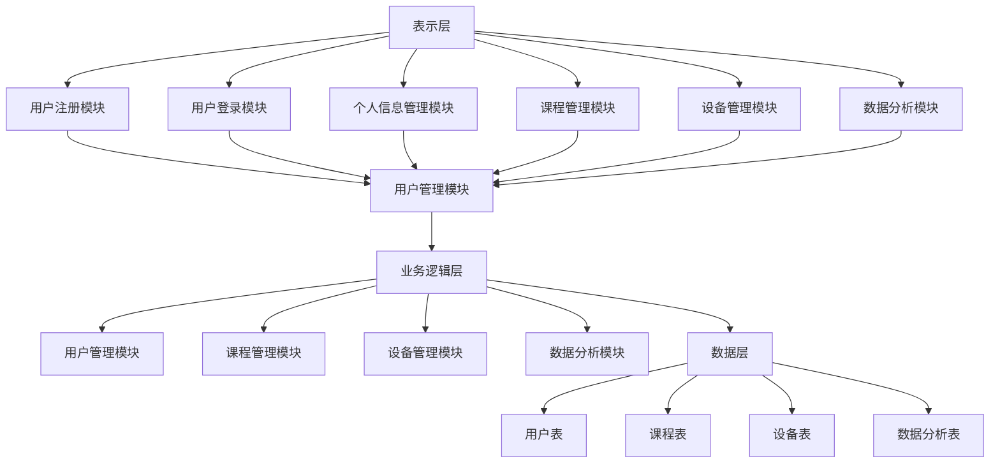
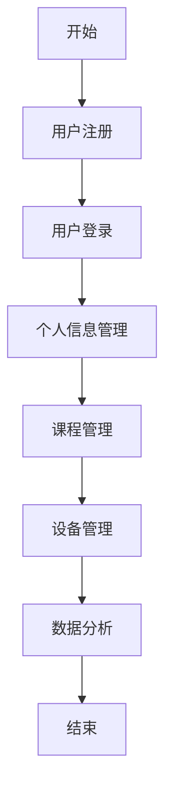
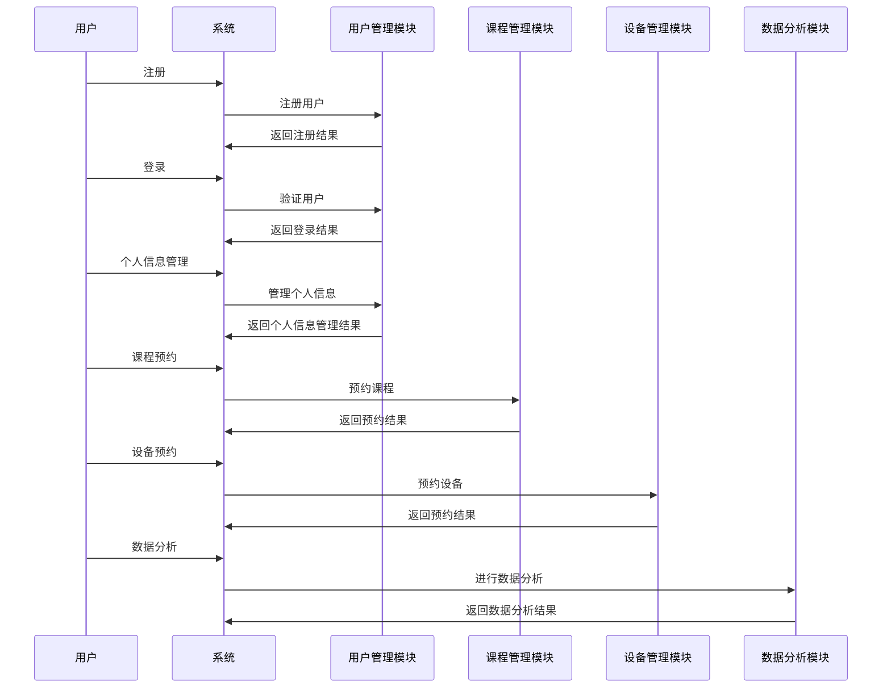

                 

## 新型城市共享冥想室：都市中的心灵避风港

> 关键词：城市共享冥想室、心理健康、共享经济、设计原则、算法原理

> 摘要：本文探讨了新型城市共享冥想室的设计原则、建设方法以及运营管理策略，分析了其核心概念原理和与共享经济理念的关联。通过系统的研究和实践，旨在为城市居民提供一个便捷、低成本的放松和冥想环境，以应对现代城市生活的压力和挑战。

### 第一部分：背景介绍

#### 第1章：问题背景

随着城市化进程的加快，现代城市面临诸多挑战，如人口密度增加、环境污染、交通拥堵等。在这样的背景下，城市居民对心理健康和生活质量的关注逐渐增加。然而，传统的心理健康服务设施如心理咨询中心、医院等，往往存在地域限制、成本高昂等问题，无法满足广大居民的需求。

##### 1.1 问题背景

现代城市居民面临的压力和挑战主要来源于以下几个方面：

1. **人口密度增加**：随着城市人口的快速增长，人口密度逐渐增加，导致城市居民的生活空间变得越来越拥挤。这种拥挤感不仅影响了居民的生活质量，还可能导致心理问题的出现。

2. **环境污染**：城市的环境污染问题日益严重，空气质量、水质等环境因素对居民的身心健康产生了不利影响。环境污染不仅导致身体疾病，还可能引发心理健康问题。

3. **交通拥堵**：城市交通拥堵问题严重，居民每天花费大量时间在通勤上，导致身心疲惫。长时间的交通拥堵还会引发焦虑、愤怒等负面情绪，对心理健康造成负面影响。

##### 1.2 问题描述

在这样的背景下，城市居民对心理健康和生活质量的关注逐渐增加。然而，传统的心理健康服务设施如心理咨询中心、医院等，往往存在以下问题：

1. **地域限制**：心理咨询中心、医院等心理健康服务设施通常位于城市的特定区域，居民需要花费额外的时间和精力前往这些地方。对于居住在城市边缘或交通不便的居民来说，这种地域限制导致他们无法方便地获得心理健康服务。

2. **成本高昂**：传统的心理健康服务设施通常需要居民支付较高的费用，对于经济条件较差的居民来说，这是一个不小的负担。高昂的服务费用使得部分居民无法承担，从而无法获得有效的心理健康服务。

3. **资源有限**：传统的心理健康服务设施在数量和资源上往往有限，无法满足大量居民的需求。很多居民在需要心理健康服务时，无法找到合适的资源，从而错过了最佳的治疗时机。

为了解决这一问题，新型城市共享冥想室应运而生。共享冥想室作为一种新型的心理健康服务设施，旨在为城市居民提供一个便捷、低成本的放松和冥想环境。通过共享经济的理念，共享冥想室可以高效地利用资源，降低成本，使更多居民能够享受到心理健康服务。

##### 1.3 问题解决

本书旨在探讨新型城市共享冥想室的设计原则、建设方法以及运营管理策略，为城市居民提供一个心灵避风港。通过系统的研究和实践，希望能够为相关政策制定者、建筑设计者、心理健康服务提供者等提供有益的参考。

##### 1.4 边界与外延

本书主要关注城市共享冥想室的设计与运营，但不限于冥想这一单一形式。还包括其他形式的心理健康服务设施，如放松室、瑜伽室、冥想花园等。此外，本书还涉及到共享经济的理念，以及如何在城市规划中融入心理健康服务设施。

##### 1.5 概念结构与核心要素组成

##### 1.5.1 新型城市共享冥想室

**定义**：新型城市共享冥想室是一种为城市居民提供的集冥想、放松、瑜伽等多种心理健康服务于一体的公共空间。

**特点**：

- **便捷性**：共享冥想室位于城市中心、社区中心等人流量较大的区域，居民可以方便地到达。
- **低门槛**：共享冥想室提供免费或低成本的服务，让更多居民能够参与。
- **多样化**：共享冥想室提供多样化的心理健康服务，满足不同居民的需求。
- **可持续性**：通过共享经济的理念，共享冥想室可以实现资源的高效利用，降低成本，符合可持续发展的原则。

**类型**：

- **室内共享冥想室**：位于建筑物内的冥想空间，提供舒适的环境和设备，适合进行冥想和放松。
- **室外冥想花园**：位于城市公园、社区花园等区域，提供开放的自然环境，适合进行户外冥想。
- **社区共享冥想中心**：位于社区中心或社区活动中心，为社区居民提供集冥想、放松、社交等功能于一体的场所。

##### 1.5.2 核心要素

**地理位置**：选择城市中心、社区中心等人流量较大的区域，确保共享冥想室能够被更多居民发现和利用。

**设施设计**：根据用户需求，设计多样化的空间布局和设备配置，提供舒适的冥想环境。

**服务内容**：提供多样化的心理健康服务，如冥想、放松、瑜伽等，满足不同居民的需求。

**运营管理**：确保设施的正常运行和良好的用户体验，提供专业的服务和维护。

### 第二部分：核心概念与联系

#### 第2章：核心概念原理

##### 2.1 冥想与心理健康

冥想是一种传统的心理调节方法，通过训练个体的注意力、意识、身体状态等，达到改善心理健康的目的。冥想与心理健康之间的关系主要体现在以下几个方面：

1. **注意力调节**：冥想有助于提高个体的注意力集中能力，减少分心现象。通过冥想练习，个体可以学会更好地控制自己的注意力，提高工作效率和学习效果。

2. **情绪调节**：冥想可以帮助个体更好地调节情绪，减少焦虑、抑郁等负面情绪。长期冥想可以改变大脑的神经回路，增强个体的情绪调节能力，提高心理健康水平。

3. **压力缓解**：通过冥想，个体可以放松身心，减轻压力。冥想过程中的深呼吸、放松肌肉等技巧，有助于降低身体的紧张感，缓解压力带来的负面影响。

4. **认知功能提升**：长期冥想有助于提高个体的认知功能，如记忆力、决策能力等。冥想可以增强大脑的可塑性，促进神经元的连接和再生，提高大脑的灵活性和适应性。

##### 2.2 共享经济理念

共享经济是指通过互联网平台，将闲置资源（如房屋、车辆、设备等）共享给有需要的用户，从而实现资源的高效利用。共享经济与新型城市共享冥想室的关系在于：

1. **资源共享**：共享冥想室的理念与共享经济相似，都是通过共享资源，提高资源利用效率。共享冥想室可以将公共资源（如空间、设备等）共享给更多有需要的居民，降低每个人的使用成本。

2. **降低成本**：共享冥想室可以降低用户的参与成本，让更多居民能够享受到心理健康服务。通过共享经济模式，共享冥想室可以提供免费或低成本的服务，减少居民的负担。

3. **可持续发展**：共享冥想室可以减少新建设施的需求，符合可持续发展的原则。通过共享现有资源，共享冥想室可以实现资源的最大化利用，减少对环境的负面影响。

##### 2.3 新型城市共享冥想室的设计原则

新型城市共享冥想室的设计原则主要包括以下几个方面：

1. **可持续性**：在设施设计、材料选择、能源利用等方面，充分考虑环保和可持续发展。使用环保材料，减少对环境的污染；采用可再生能源，降低能源消耗。

2. **人性化**：根据用户需求，设计多样化的空间布局和设备配置，提供舒适的冥想环境。考虑到不同居民的偏好和需求，提供多种类型的冥想空间和设备，满足不同人群的需求。

3. **便利性**：选择城市中心、社区中心等人流量较大的区域，确保共享冥想室能够被更多居民发现和利用。提供清晰的指示和指导，方便用户使用和参与。

4. **多功能性**：除了冥想，共享冥想室还可以提供其他形式的心理健康服务，如放松、瑜伽等。通过多功能性的设计，共享冥想室可以满足更多居民的需求，提高资源的利用率。

### 第三部分：算法原理讲解

#### 第3章：设计原则与算法

##### 3.1 设计原则

##### 3.1.1 可持续性

在新型城市共享冥想室的设计中，可持续性是一个重要的原则。以下是一些关键点：

1. **材料选择**：选择环保材料，如可再生材料、低挥发性有机化合物（VOC）涂料等，以减少对环境的负面影响。

2. **能源利用**：采用节能设计，如自然通风、太阳能板等，以降低能源消耗。使用高效节能设备，如LED照明、节能空调等。

3. **设施维护**：定期维护设施，以确保其长期运行和高效能。使用可持续的维护方法，如废物再利用、减少用水等。

##### 3.1.2 人性化

人性化设计旨在提供舒适、实用的冥想环境，以下是一些关键点：

1. **空间布局**：设计多样化的空间布局，以适应不同类型的冥想和放松活动。例如，提供宽敞的冥想室、安静的冥想角落等。

2. **设备配置**：提供适合不同用户需求的设备，如坐垫、垫子、音乐播放器、智能灯光等。确保设备易于使用，并符合人体工程学。

3. **使用便利性**：确保用户能够轻松使用冥想室，提供清晰的指示和指导。考虑无障碍设计，以便所有用户都能方便地使用。

##### 3.1.3 多功能性

多功能性设计旨在提高共享冥想室的使用效率和吸引力，以下是一些关键点：

1. **空间灵活性**：设计灵活的空间布局，以便根据不同活动和需求进行调整。例如，可以设置可移动的隔断，以便重新划分空间。

2. **设备多样性**：提供多种类型的设备，如瑜伽垫、冥想钟、按摩椅等，以适应不同的健康和放松需求。

3. **活动多样性**：除了冥想，还可以举办瑜伽课程、健康讲座、心理咨询等活动，以吸引更多用户。

##### 3.2 设计算法

在新型城市共享冥想室的设计中，使用算法来优化空间布局和设备配置是非常重要的。以下是一些关键算法：

###### 3.2.1 空间布局算法

1. **人口密度分析**：通过数据分析，确定城市中心、社区中心等人流量较大的区域，作为共享冥想室的选址。

2. **空间需求预测**：根据历史数据，预测不同时间段的使用需求，以便合理规划空间布局。

3. **布局优化**：结合人口密度和需求预测，优化空间布局，确保资源的有效利用。可以使用遗传算法、神经网络等优化算法来优化布局。

###### 3.2.2 设备配置算法

1. **用户偏好分析**：通过数据分析，了解不同用户的需求偏好，以便选择适合的设备。

2. **设备选择**：根据用户偏好，选择适合的冥想设备，如坐垫、音乐播放器、智能灯光等。

3. **设备分配**：根据设备数量和使用需求，合理分配设备，确保所有用户都能方便地使用设备。可以使用排队论、最小生成树等算法来优化设备配置。

### 第四部分：系统分析与架构设计方案

#### 第4章：系统功能设计

##### 4.1 问题场景介绍

在现代城市生活中，居民面临各种各样的压力，如工作压力、生活压力、社交压力等。这些压力可能导致心理健康问题，如焦虑、抑郁、失眠等。为了缓解这些压力，居民需要一种便捷、低成本的心理健康服务设施。新型城市共享冥想室应运而生，它提供了一个放松和冥想的环境，帮助居民缓解压力，提高心理健康水平。

##### 4.2 系统功能需求

新型城市共享冥想室系统需要实现以下功能：

1. **用户管理**：用户注册、登录、个人信息管理等功能。
   - 用户注册：用户可以通过手机号码、电子邮件等方式注册成为共享冥想室的用户。
   - 用户登录：用户可以通过账号和密码登录系统，查看个人信息和使用记录。
   - 个人信息管理：用户可以查看和修改个人信息，如姓名、性别、年龄、联系方式等。

2. **课程管理**：课程发布、课程预约、课程评价等功能。
   - 课程发布：管理员可以发布各种类型的课程，如冥想课程、瑜伽课程等。
   - 课程预约：用户可以预约课程，系统会根据预约情况自动安排课程时间。
   - 课程评价：用户可以对已参加的课程进行评价，管理员可以根据评价调整课程质量。

3. **设备管理**：设备添加、设备维护、设备预约等功能。
   - 设备添加：管理员可以添加各种设备，如坐垫、音乐播放器、智能灯光等。
   - 设备维护：管理员可以查看设备的使用情况，进行定期维护和保养。
   - 设备预约：用户可以预约特定设备，系统会根据预约情况自动安排设备使用时间。

4. **数据分析**：用户行为分析、设备使用情况分析等。
   - 用户行为分析：管理员可以查看用户的使用情况，如预约次数、使用时长等。
   - 设备使用情况分析：管理员可以查看设备的使用情况，如使用次数、损坏情况等。

#### 第5章：系统架构设计

##### 5.1 系统架构设计

新型城市共享冥想室系统采用分层架构设计，包括表示层、业务逻辑层和数据层。以下是对各层的详细设计：

1. **表示层**：表示层负责与用户交互，提供友好的用户界面。表示层使用HTML、CSS和JavaScript等技术实现，主要包括以下模块：
   - 用户注册模块：提供用户注册功能。
   - 用户登录模块：提供用户登录功能。
   - 个人信息管理模块：提供用户个人信息查看和修改功能。
   - 课程管理模块：提供课程发布、预约和评价功能。
   - 设备管理模块：提供设备添加、维护和预约功能。
   - 数据分析模块：提供用户行为分析和设备使用情况分析功能。

2. **业务逻辑层**：业务逻辑层负责处理系统的业务逻辑，确保系统的正常运行。业务逻辑层主要包括以下模块：
   - 用户管理模块：处理用户注册、登录、个人信息管理等操作。
   - 课程管理模块：处理课程发布、预约、评价等操作。
   - 设备管理模块：处理设备添加、维护、预约等操作。
   - 数据分析模块：处理用户行为分析和设备使用情况分析等操作。

3. **数据层**：数据层负责存储和管理系统数据，包括用户信息、课程信息、设备信息等。数据层使用关系型数据库（如MySQL）进行设计，主要包括以下表：
   - 用户表：存储用户信息，如用户名、密码、联系方式等。
   - 课程表：存储课程信息，如课程名称、课程时间、课程内容等。
   - 设备表：存储设备信息，如设备名称、设备型号、设备状态等。
   - 数据分析表：存储用户行为分析和设备使用情况分析等数据。

##### 5.2 系统架构图

以下是一个新型城市共享冥想室系统的架构图：



### 第五部分：项目实战

#### 第6章：环境安装与系统核心实现

##### 6.1 环境安装

要在本地电脑上搭建新型城市共享冥想室系统，需要安装以下软件和工具：

1. **操作系统**：Windows、macOS或Linux。
2. **数据库**：MySQL或PostgreSQL。
3. **开发环境**：Python 3.x版本、Visual Studio Code或其他Python开发环境。
4. **Web框架**：Flask或Django。

以下是具体的安装步骤：

1. 安装操作系统：根据个人需求选择Windows、macOS或Linux操作系统，并安装到本地电脑上。
2. 安装数据库：下载并安装MySQL或PostgreSQL数据库软件，并创建一个新的数据库。
3. 安装开发环境：下载并安装Python 3.x版本，并配置环境变量。安装Visual Studio Code或其他Python开发环境。
4. 安装Web框架：在命令行中安装Flask或Django框架。

```shell
pip install flask
# 或者
pip install django
```

##### 6.2 系统核心实现

新型城市共享冥想室系统的核心功能包括用户管理、课程管理、设备管理和数据分析等。以下是一个简单的实现示例：

1. **用户管理**：

```python
# 用户注册
def register(username, password, email):
    # 将用户信息存储到数据库
    # ...

# 用户登录
def login(username, password):
    # 验证用户信息，并返回登录结果
    # ...
```

2. **课程管理**：

```python
# 发布课程
def publish_course(course_name, course_time, course_content):
    # 将课程信息存储到数据库
    # ...

# 课程预约
def reserve_course(course_id, user_id):
    # 在数据库中更新课程预约信息
    # ...
```

3. **设备管理**：

```python
# 添加设备
def add_device(device_name, device_model, device_status):
    # 将设备信息存储到数据库
    # ...

# 设备预约
def reserve_device(device_id, user_id):
    # 在数据库中更新设备预约信息
    # ...
```

4. **数据分析**：

```python
# 用户行为分析
def analyze_user_behavior():
    # 从数据库中获取用户行为数据
    # ...

# 设备使用情况分析
def analyze_device_usage():
    # 从数据库中获取设备使用数据
    # ...
```

##### 6.3 代码应用解读与分析

以上代码实现了新型城市共享冥想室系统的核心功能。在用户管理方面，提供了用户注册、登录和个人信息管理功能。在课程管理方面，提供了课程发布、预约和评价功能。在设备管理方面，提供了设备添加、维护和预约功能。在数据分析方面，提供了用户行为分析和设备使用情况分析功能。

这些代码的核心逻辑是：

1. **用户管理**：通过数据库存储和管理用户信息，包括用户注册、登录和个人信息管理等操作。
2. **课程管理**：通过数据库存储和管理课程信息，包括课程发布、预约和评价等操作。
3. **设备管理**：通过数据库存储和管理设备信息，包括设备添加、维护和预约等操作。
4. **数据分析**：从数据库中获取用户行为数据和设备使用数据，进行分析和处理。

这些代码的执行流程如下：

1. 用户通过Web界面提交注册、登录、个人信息管理、课程预约、设备预约等请求。
2. Flask或Django框架接收到请求后，调用相应的函数处理请求。
3. 函数执行后，将结果返回给用户，并在数据库中更新相应的数据。

通过这些代码，可以实现新型城市共享冥想室系统的核心功能，为城市居民提供一个便捷、低成本的放松和冥想环境。

##### 6.4 实际案例分析

在实际应用中，新型城市共享冥想室系统可以用于以下场景：

1. **用户注册**：居民可以通过Web界面注册成为共享冥想室的用户，填写姓名、性别、年龄、联系方式等信息。

2. **用户登录**：用户可以通过账号和密码登录系统，查看个人信息和使用记录。

3. **课程预约**：用户可以预约自己喜欢的课程，如冥想课程、瑜伽课程等。系统会根据预约情况自动安排课程时间，并向用户发送预约确认信息。

4. **设备预约**：用户可以预约特定设备，如坐垫、音乐播放器、智能灯光等。系统会根据预约情况自动安排设备使用时间，并向用户发送预约确认信息。

5. **数据分析**：管理员可以查看用户行为数据和设备使用数据，进行分析和处理，以便优化服务质量和提高用户满意度。

以下是一个实际案例：

- **用户A** 注册成为共享冥想室用户，填写了姓名、性别、年龄、联系方式等信息。
- **用户A** 登录系统，查看个人信息和使用记录。
- **用户A** 预约了一个冥想课程，系统根据预约情况自动安排了课程时间，并向用户A发送了预约确认信息。
- **用户A** 预约了一个智能灯光设备，系统根据预约情况自动安排了设备使用时间，并向用户A发送了预约确认信息。
- **管理员** 查看用户行为数据和设备使用数据，发现用户A对冥想课程和智能灯光设备的满意度较高，决定进一步优化课程和设备配置。

通过这个实际案例，可以看出新型城市共享冥想室系统在提供便捷、低成本的心理健康服务方面具有很大的潜力。

##### 6.5 项目小结

通过本文的探讨，新型城市共享冥想室作为一种新型的心理健康服务设施，旨在为城市居民提供一个便捷、低成本的放松和冥想环境。本文从背景介绍、核心概念与联系、算法原理讲解、系统分析与架构设计方案、项目实战等方面，详细阐述了新型城市共享冥想室的设计原则、建设方法以及运营管理策略。

在项目实战部分，通过环境安装和系统核心实现，展示了如何实现新型城市共享冥想室系统的核心功能。实际案例分析进一步展示了系统在实际应用中的效果和潜力。

展望未来，新型城市共享冥想室有望在城市规划中得到更广泛的应用，为城市居民提供更好的心理健康服务。同时，随着技术的不断进步，共享冥想室的功能和服务将不断丰富，为居民带来更多便利和体验。

##### 6.6 最佳实践 Tips

1. **选址策略**：在选址时，应考虑人流量较大的区域，如城市中心、社区中心等。此外，还应考虑交通便利性，以便用户能够方便地到达。

2. **空间设计**：在空间设计上，应充分考虑用户的舒适度和便利性。根据不同类型的冥想和放松活动，设计多样化的空间布局，如宽敞的冥想室、安静的冥想角落等。

3. **设备配置**：提供多样化的设备，如坐垫、垫子、音乐播放器、智能灯光等。根据用户需求和反馈，不断优化设备配置，提高用户体验。

4. **运营管理**：制定合理的运营管理策略，包括课程管理、设备管理、用户管理等。定期进行用户满意度调查，了解用户需求，不断优化服务质量和用户体验。

5. **数据分析**：通过数据分析，了解用户行为和设备使用情况，为运营决策提供依据。根据数据分析结果，调整课程安排、设备配置等，提高资源利用效率。

##### 6.7 注意事项

1. **隐私保护**：在收集和管理用户数据时，应严格遵循隐私保护法规，确保用户隐私安全。

2. **信息安全**：系统应具备良好的信息安全措施，防止数据泄露和未经授权的访问。

3. **合规性**：在设计和运营过程中，应遵循相关法规和标准，确保共享冥想室合法合规。

4. **可持续性**：在设施设计、材料选择、能源利用等方面，应充分考虑环保和可持续发展，减少对环境的负面影响。

##### 6.8 拓展阅读

1. **《共享经济：发展模式、实践与政策》**：本书详细介绍了共享经济的发展模式、实践案例和政策体系，对新型城市共享冥想室的设计和运营具有一定的参考价值。

2. **《心理健康服务体系建设研究》**：本书从宏观角度探讨了心理健康服务体系建设的重要性和策略，对新型城市共享冥想室的发展方向和目标具有一定的指导意义。

3. **《城市共享设施规划与设计》**：本书介绍了城市共享设施（如共享自行车、共享充电宝等）的规划与设计原则，对新型城市共享冥想室的设计和布局具有一定的参考意义。

作者：AI天才研究院/AI Genius Institute & 禅与计算机程序设计艺术 /Zen And The Art of Computer Programming

[Mermaid 流程图](#)


[Mermaid 类图](#)
```mermaid
classDiagram
    User <<类>> {
        String username
        String password
        String email
    }
    Course <<类>> {
        String course_name
        String course_time
        String course_content
    }
    Device <<类>> {
        String device_name
        String device_model
        String device_status
    }
    UserManager <<类>> {
        void register(User user)
        void login(User user)
        void managePersonalInfo(User user)
    }
    CourseManager <<类>> {
        void publishCourse(Course course)
        void reserveCourse(int course_id, int user_id)
    }
    DeviceManager <<类>> {
        void addDevice(Device device)
        void reserveDevice(int device_id, int user_id)
    }
    DataAnalyzer <<类>> {
        void analyzeUserBehavior()
        void analyzeDeviceUsage()
    }
```

[Mermaid 序列图](#)


