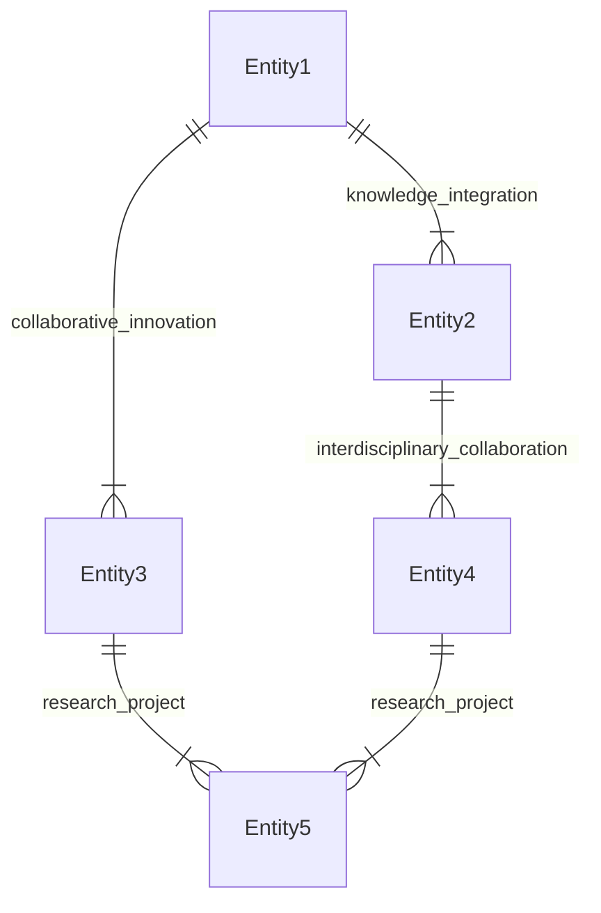

                 

### 新型城市共享创客空间概述

#### 第一部分：背景与问题

**第1章：背景与问题**

##### 1.1 问题背景

##### 1.1.1 城市化进程中的挑战

随着全球城市化进程的加速，城市面临着诸多挑战，如资源短缺、环境污染、交通拥堵等。这些问题不仅影响城市居民的生活质量，也阻碍了城市的可持续发展。城市化进程中的挑战主要体现在以下几个方面：

1. **资源分配不均**：城市土地、水资源等资源分配不均，导致一些地区资源紧张，而另一些地区资源浪费。
2. **环境污染**：工业排放、交通污染等问题导致城市空气质量恶化，对居民健康造成威胁。
3. **交通拥堵**：城市交通拥堵严重，影响居民出行效率，加剧了城市交通压力。

##### 1.1.2 共享经济的崛起

共享经济的崛起为解决城市问题提供了新的思路。共享经济通过共享闲置资源，提高了资源利用率，降低了消费成本，具有巨大的发展潜力。共享经济的核心思想是共享、互助和共赢，其主要形式包括共享住宿、共享交通、共享办公等。

1. **共享住宿**：如Airbnb等平台，通过共享闲置房屋，提高了房屋使用率。
2. **共享交通**：如滴滴出行、共享单车等，通过共享交通工具，提高了交通资源利用率。
3. **共享办公**：如WeWork等，通过共享办公空间，降低了创业成本。

##### 1.1.3 创客文化的兴起

创客文化是一种以创新、实践和分享为核心的文化，鼓励人们通过自主探索和实践，创造出有价值的产品和服务。创客文化的兴起为城市创新提供了新的动力。创客空间作为创客文化的重要载体，为创客提供了交流和合作的空间，促进了跨学科创新和创业活动的开展。

1. **创客空间的作用**：创客空间提供了丰富的工具、资源和社交网络，为创客提供了便捷的创新环境。
2. **创客空间的类型**：包括大学创客空间、企业创客空间、社区创客空间等。

##### 1.2 问题描述

##### 1.2.1 资源分配不均

在城市化进程中，资源分配不均是一个普遍存在的问题。这导致了一些地区资源紧张，而另一些地区资源浪费。例如，城市中心的商业区和住宅区资源丰富，而城市周边的郊区资源相对匮乏。这导致了城市内部的社会不平等和经济发展不平衡。

1. **原因分析**：资源分配不均的原因主要包括城市规划不合理、政策导向不明确、市场机制不完善等。
2. **影响**：资源分配不均会导致城市生活质量下降、经济发展不平衡、社会矛盾加剧等。

##### 1.2.2 创新需求与供给之间的矛盾

随着城市发展的不断加快，创新需求日益增长。然而，创新供给却相对滞后，导致创新需求与供给之间的矛盾日益突出。这主要体现在以下几个方面：

1. **创新资源不足**：创客空间、科研机构、创业公司等创新资源的供给不足，限制了创新活动的开展。
2. **创新人才短缺**：具有创新能力和创新精神的人才相对较少，影响了创新的效率和质量。
3. **创新机制不健全**：缺乏有效的创新激励机制和政策支持，限制了创新活动的开展。

##### 1.2.3 社区参与度低

在城市化进程中，社区参与度低也是一个普遍存在的问题。这导致了一些社区缺乏活力，居民缺乏归属感和参与感。社区参与度低的原因主要包括：

1. **社区建设不足**：社区基础设施和公共服务不足，无法满足居民的需求。
2. **社区管理不善**：社区管理不善，导致居民对社区缺乏信任和参与意愿。
3. **社区活动缺乏吸引力**：社区活动形式单一，内容枯燥，无法激发居民的参与兴趣。

##### 1.3 问题解决

##### 1.3.1 新型城市共享创客空间的概念

新型城市共享创客空间是一种以共享经济和创客文化为核心，旨在解决资源分配不均、创新需求与供给之间的矛盾以及社区参与度低等问题的社区平台。它通过整合各类创新资源，为创客和社区居民提供交流和合作的空间，促进跨学科创新和创业活动的开展。

1. **核心目标**：提高资源利用率、激发创新活力、增强社区凝聚力。
2. **功能定位**：新型城市共享创客空间是一个开放、共享、互助的创新生态系统，旨在为创客和社区居民提供一个便捷、高效、有吸引力的创新平台。

##### 1.3.2 创客空间在社区中的角色

创客空间在社区中扮演着多种角色，包括创新孵化器、社交中心、资源共享平台等。

1. **创新孵化器**：创客空间为创客提供了丰富的创新资源，如工具、设备、资金等，帮助创客将创新想法转化为实际产品和服务。
2. **社交中心**：创客空间为社区居民提供了一个交流和合作的场所，促进了居民之间的互动和合作，增强了社区的凝聚力。
3. **资源共享平台**：创客空间通过共享资源和知识，提高了资源利用效率，降低了创新成本。

##### 1.3.3 创新生态系统构建

创新生态系统的构建是新型城市共享创客空间的核心任务。这包括以下几个方面：

1. **创新资源整合**：整合各类创新资源，如资金、技术、人才等，为创客提供全方位的支持。
2. **创新环境营造**：营造一个开放、共享、创新的环境，激发创客的创造力和创新精神。
3. **创新机制建立**：建立有效的创新激励机制和政策支持体系，鼓励创新活动的开展。

##### 1.4 边界与外延

##### 1.4.1 创客空间的定义与分类

创客空间是一种以创新、实践和分享为核心的文化空间，为创客提供交流和合作的空间。根据功能定位和运营模式，创客空间可以分为以下几类：

1. **大学创客空间**：位于大学校园内，为大学生和教师提供创新实践的空间。
2. **企业创客空间**：位于企业内部，为企业员工提供创新实践的空间。
3. **社区创客空间**：位于社区内，为社区居民提供创新实践的空间。

##### 1.4.2 创客空间的服务模式

创客空间的服务模式主要包括以下几种：

1. **资源租赁**：为创客提供工具、设备、场地等资源的租赁服务。
2. **培训课程**：为创客提供各类创新培训课程，提高创客的创新能力和实践能力。
3. **咨询服务**：为创客提供专业咨询服务，解决创新过程中的问题和挑战。
4. **社交活动**：组织各类社交活动，促进创客之间的交流和合作。

##### 1.4.3 创客空间的发展趋势

随着共享经济和创客文化的不断普及，创客空间的发展趋势主要体现在以下几个方面：

1. **多元化发展**：创客空间的服务模式和运营模式将更加多元化，满足不同用户群体的需求。
2. **智能化升级**：利用人工智能、大数据等技术，提高创客空间的运营效率和用户体验。
3. **社区融合**：创客空间将更加深入地融入社区，成为社区创新和文化活动的重要载体。

##### 1.5 概念结构与核心要素组成

##### 1.5.1 创客空间的组成要素

创客空间的组成要素主要包括以下几类：

1. **硬件设施**：如电脑、3D打印机、激光切割机等。
2. **软件工具**：如编程语言、开发工具、设计软件等。
3. **资源库**：如技术文献、设计资源、项目案例等。
4. **社交网络**：如创客社区、线上论坛、线下活动等。

##### 1.5.2 创客空间的核心功能

创客空间的核心功能主要包括以下几类：

1. **创新孵化**：为创客提供创新实践的空间和支持，帮助他们将创新想法转化为实际产品和服务。
2. **资源共享**：通过共享资源和知识，提高资源利用效率，降低创新成本。
3. **教育培训**：为创客提供各类创新培训课程，提高他们的创新能力和实践能力。
4. **社交互动**：组织各类社交活动，促进创客之间的交流和合作。

##### 1.5.3 创客空间的管理与运营

创客空间的管理与运营主要包括以下几个方面：

1. **组织管理**：建立健全的组织结构和管理制度，确保创客空间的正常运营。
2. **资源配置**：优化资源配置，提高资源利用效率，满足创客的需求。
3. **活动组织**：组织各类创新活动，激发创客的创新热情，促进创新成果的产出。
4. **用户服务**：提供优质的用户服务，提高用户的满意度和参与度。

##### 1.6 本章小结

本章对新城市共享创客空间进行了概述，从背景与问题、问题解决、边界与外延以及概念结构与核心要素组成等方面进行了详细阐述。通过本章的介绍，读者可以对新城市共享创客空间有一个基本的认识和了解，为后续章节的深入探讨打下基础。

### 第一部分总结

在第一部分中，我们详细介绍了新型城市共享创客空间的背景、问题、解决方案以及边界与外延等内容。首先，我们分析了城市化进程中的挑战，如资源分配不均、环境污染和交通拥堵等。接着，我们探讨了共享经济的崛起和创客文化的兴起，为新型城市共享创客空间的产生提供了背景。在问题描述部分，我们指出资源分配不均、创新需求与供给之间的矛盾以及社区参与度低等问题的存在。然后，我们介绍了新型城市共享创客空间的概念、角色和创新生态系统的构建，为解决上述问题提供了方向。最后，我们阐述了创客空间的定义、分类、服务模式以及发展趋势，以及创客空间的核心要素组成和功能。通过这一部分的介绍，读者可以对新城市共享创客空间有一个全面的认识，为后续内容的深入探讨奠定了基础。

### 跨学科创新原理

**第二部分：跨学科创新的理论基础**

**第2章：跨学科创新原理**

##### 2.1 核心概念与联系

##### 2.1.1 跨学科创新的基本概念

跨学科创新是指将不同学科领域的知识、方法和思维模式进行融合，以解决单一学科领域无法解决的问题。它强调的是跨学科之间的知识整合和思维碰撞，通过综合多种学科的优势，实现创新性突破。

1. **定义**：跨学科创新是一种超越单一学科限制的创新方式，它涉及多个学科领域的知识、技术和方法。
2. **目标**：跨学科创新的目标是通过整合不同学科领域的资源，解决复杂问题，推动科技进步和社会发展。

##### 2.1.2 跨学科创新的特性

跨学科创新具有以下几个显著特性：

1. **综合性**：跨学科创新强调将多个学科的知识和技术进行整合，形成一个综合性的创新体系。
2. **创造性**：跨学科创新通过不同学科的交叉融合，激发新的思维方式和创新方法，产生具有创新性的成果。
3. **复杂性**：跨学科创新往往涉及多个学科领域的知识，需要应对复杂的挑战和问题。
4. **协同性**：跨学科创新强调不同学科领域之间的协同合作，通过多学科团队的共同努力，实现创新目标。

##### 2.1.3 跨学科创新与学科交叉的关系

跨学科创新与学科交叉密切相关，但两者之间有所区别。学科交叉主要关注不同学科之间的知识融合和技术应用，而跨学科创新则更强调创新过程的整体性和系统性。

1. **学科交叉**：学科交叉是指不同学科领域之间的知识融合和技术应用，如将生物学与工程学相结合，开发生物医疗设备。
2. **跨学科创新**：跨学科创新则是一个更广泛的概念，它不仅涉及学科交叉，还包括创新过程中的知识整合、思维碰撞和协同合作。

##### 2.2 跨学科创新的属性特征对比表格

| 属性特征 | 定义 | 说明 |
| --- | --- | --- |
| 知识整合 | 跨学科创新涉及多种学科领域的知识 | 促进创新成果的多样性和应用范围 |
| 融合思维 | 跨学科创新需要多学科的思维方式 | 提高创新思维的灵活性和创造性 |
| 风险与机遇 | 跨学科创新往往伴随着高风险和高回报 | 需要平衡风险与收益，善于把握机遇 |
| 效率与成本 | 跨学科创新可以通过资源整合提高效率 | 但也可能面临高成本和协调问题 |

**示例表格**：

| 属性特征 | 定义 |
| --- | --- |
| 知识整合 | 跨学科创新涉及多种学科领域的知识，如工程、医学、生物学等。这一特性促进了创新成果的多样性和应用范围。 |
| 融合思维 | 跨学科创新需要多学科的思维方式，如系统思维、创新思维、批判性思维等。这一特性提高了创新思维的灵活性和创造性。 |
| 风险与机遇 | 跨学科创新往往伴随着高风险和高回报。创新项目可能面临技术风险、市场风险等，但同时也带来了巨大的商业机遇。 |
| 效率与成本 | 跨学科创新可以通过资源整合提高效率，例如，共享实验室设备可以降低研发成本。然而，也可能面临高成本和协调问题，如不同学科领域的专业人才之间的沟通不畅。 |

##### 2.3 跨学科创新的ER实体关系图架构

跨学科创新涉及多个实体之间的关系，可以通过ER（实体-关系）图进行表示。以下是跨学科创新的ER实体关系图架构的示例：

**示例ER图**：

- **Entity1**：创新团队
- **Entity2**：知识整合
- **Entity3**：融合思维
- **Entity4**：跨学科合作
- **Entity5**：研究项目

实体关系图的各个实体及其关系如下：

1. **创新团队**：负责跨学科创新项目的组织和实施。
2. **知识整合**：创新团队通过整合不同学科领域的知识，提高创新项目的多样性和应用范围。
3. **融合思维**：创新团队通过融合多学科的思维方式，提高创新项目的创造性和灵活性。
4. **跨学科合作**：创新团队通过跨学科合作，实现不同学科领域之间的协同创新。
5. **研究项目**：创新团队通过研究项目，实现跨学科创新的成果和应用。

通过ER实体关系图，可以清晰地展示跨学科创新的各个实体及其之间的关系，有助于理解和分析跨学科创新的复杂系统。

##### 2.4 跨学科创新的数学模型与公式

跨学科创新的数学模型可以用来描述创新过程中不同学科领域之间的知识整合、思维融合和合作机制。以下是跨学科创新的数学模型与公式：

1. **数学模型概述**：

   $$ M = f(C_1, C_2, ..., C_n) $$

   其中，$M$ 表示跨学科创新的总体水平，$C_i$ 表示第 $i$ 个学科领域的创新水平。

2. **公式解释**：

   - $C_i = f(K_i, T_i)$

   其中，$C_i$ 表示第 $i$ 个学科领域的创新水平，$K_i$ 表示第 $i$ 个学科领域的知识量，$T_i$ 表示第 $i$ 个学科领域的时间投入。

   - $M$ 表示跨学科创新的总体水平，可以通过各个学科领域创新水平的综合评价来计算。

3. **具体应用**：

   跨学科创新的数学模型可以用于评估跨学科创新项目的创新水平，通过分析不同学科领域的知识量和时间投入，预测创新成果的总体水平。

##### 2.5 跨学科创新的详细讲解与举例

##### 2.5.1 知识整合的例子

在一个跨学科创新项目中，一个设计团队结合了设计学、工程学和社会学知识，共同开发了一款智能家居产品。设计团队首先分析了用户需求，然后运用设计学的方法进行产品外观设计，同时利用工程学的知识确保产品的功能性和安全性。最后，通过社会学的视角，研究用户行为和市场趋势，为产品提供个性化的解决方案。

- **设计学**：提供了产品外观设计的美学元素。
- **工程学**：确保了产品的功能性和安全性。
- **社会学**：研究了用户需求和市场趋势，为产品提供个性化解决方案。

##### 2.5.2 融合思维的例子

在一个跨学科创新项目中，一个医疗团队结合了医学、生物学和工程学的知识，开发了一款新型医疗设备。医疗团队通过多学科团队的讨论，将不同领域的思维方式和观点结合起来，提出了创新的解决方案。例如，他们运用生物学的知识，研究疾病机理，开发新型药物；同时，利用工程学的知识，设计出高效的给药设备。

- **医学**：提供了疾病治疗的理论基础。
- **生物学**：研究了疾病机理和新型药物。
- **工程学**：设计出高效的给药设备。

通过跨学科创新的详细讲解和举例，可以更好地理解跨学科创新的原理和应用。跨学科创新不仅需要不同学科领域之间的知识整合，还需要多学科的思维方式融合，从而推动创新成果的诞生。

##### 2.6 本章小结

本章介绍了跨学科创新的核心概念、特性、与学科交叉的关系，以及跨学科创新的数学模型与公式。通过知识整合和融合思维的例子，展示了跨学科创新的实际应用。本章内容为后续讨论新型城市共享创客空间中的跨学科创新提供了理论基础，有助于读者深入理解跨学科创新的原理和意义。

### 第二部分总结

在第二部分中，我们详细探讨了跨学科创新的原理，包括核心概念、特性、与学科交叉的关系，以及数学模型和具体应用。首先，我们介绍了跨学科创新的基本概念和目标，强调了知识整合和融合思维的重要性。接着，我们分析了跨学科创新的综合性、创造性、复杂性和协同性等特性。然后，我们讨论了跨学科创新与学科交叉的关系，明确了两者之间的区别。在数学模型部分，我们提出了一个跨学科创新的数学模型，并解释了公式中的各个变量。最后，我们通过知识整合和融合思维的例子，展示了跨学科创新的实际应用。这一部分的内容为读者理解新型城市共享创客空间中的跨学科创新提供了理论基础和实践指导，为后续内容的深入探讨奠定了基础。

### 社区平台设计方法

**第三部分：社区平台设计方法**

**第3章：社区平台设计原则与策略**

##### 3.1 社区平台设计原则

##### 3.1.1 用户中心原则

用户中心原则是社区平台设计的核心原则，强调以用户需求为中心，关注用户体验和满意度。设计过程中，需要深入了解用户需求、行为和偏好，确保平台功能、界面和操作流程符合用户习惯。

1. **需求调研**：通过用户访谈、问卷调查、用户行为分析等方式，收集用户需求，了解用户对社区平台的功能期望和操作习惯。
2. **用户界面设计**：设计简洁、直观、易于操作的用户界面，确保用户能够轻松上手和使用平台。
3. **用户体验优化**：持续收集用户反馈，优化产品功能和服务，提升用户满意度。

##### 3.1.2 开放共享原则

开放共享原则强调社区平台的开放性和资源共享性，鼓励用户之间的互动、分享和协作。平台应提供丰富的资源共享功能，促进知识传播和创新合作。

1. **资源共享**：建立资源库，提供知识、工具、设备等资源的共享，提高资源利用效率。
2. **互动机制**：设计互动机制，如论坛、问答、社交网络等，促进用户之间的交流和合作。
3. **开放平台**：支持第三方开发者和用户自定义功能，增加平台的灵活性和扩展性。

##### 3.1.3 可持续发展原则

可持续发展原则强调社区平台设计应考虑长期发展，确保平台的可持续运营。设计过程中，需要关注经济效益、社会效益和环境效益的平衡，推动社区平台的长期健康发展。

1. **商业模式**：设计合理的商业模式，确保平台有稳定的收入来源，实现盈利。
2. **运营管理**：建立高效的运营管理体系，提高平台运营效率和用户满意度。
3. **社会责任**：关注社会效益，如促进创新、提升社区活力、推动可持续发展等。

##### 3.2 社区平台设计策略

##### 3.2.1 确定目标用户

设计社区平台前，需要明确目标用户群体，了解他们的需求、行为和偏好。目标用户的确定有助于设计出符合用户期望的平台功能和服务。

1. **用户细分**：根据用户特征，将目标用户分为不同群体，如创客、企业、社区居民等。
2. **需求分析**：针对不同用户群体，分析他们的需求和期望，确保平台功能能够满足用户需求。
3. **用户画像**：通过用户调研和数据分析，构建用户画像，指导平台设计和功能优化。

##### 3.2.2 设计互动机制

互动机制是社区平台的核心，通过设计多样化的互动机制，促进用户之间的交流和合作。

1. **论坛**：设计论坛模块，为用户提供交流和讨论的平台，分享经验和知识。
2. **问答**：设计问答模块，为用户提供解决问题的途径，同时积累社区知识库。
3. **社交网络**：设计社交网络功能，如好友关系、点赞、评论等，增强用户之间的互动和联系。

##### 3.2.3 构建服务模块

构建服务模块是社区平台设计的关键，需要根据用户需求提供多样化的服务，提高用户满意度和粘性。

1. **资源共享**：设计资源共享模块，如资源库、工具库、设备租赁等，提高资源利用效率。
2. **教育培训**：设计教育培训模块，提供在线课程、讲座、工作坊等，提升用户技能和知识水平。
3. **咨询服务**：设计咨询服务模块，如专家咨询、项目评估等，为用户提供专业支持。

##### 3.2.4 确保技术可行性

社区平台设计需要考虑技术可行性，确保平台在技术实现上的可行性和稳定性。

1. **技术调研**：对现有技术进行调研，了解技术的可行性、成熟度和发展趋势。
2. **技术选型**：选择合适的技术框架和工具，确保平台的技术实现。
3. **系统架构**：设计合理的系统架构，确保平台的可扩展性和可维护性。

##### 3.3 社区平台设计流程

##### 3.3.1 需求分析

需求分析是社区平台设计的起点，通过分析用户需求，明确平台的功能和特性。

1. **需求收集**：通过访谈、问卷、用户调研等方式，收集用户需求。
2. **需求整理**：对收集到的需求进行整理和分析，形成需求文档。
3. **需求验证**：与用户和利益相关者进行沟通，验证需求的有效性和合理性。

##### 3.3.2 功能设计

功能设计是社区平台设计的核心环节，需要明确平台的功能模块和交互流程。

1. **功能规划**：根据需求分析结果，规划平台的功能模块和交互流程。
2. **原型设计**：通过原型设计工具，绘制平台的原型界面和交互流程。
3. **功能验证**：与用户和利益相关者进行沟通，验证功能设计的合理性和可行性。

##### 3.3.3 界面设计

界面设计是社区平台设计的视觉部分，需要设计简洁、美观、易于操作的界面。

1. **视觉设计**：设计平台的视觉风格和配色方案，确保界面的美观性和一致性。
2. **交互设计**：设计用户界面元素和交互效果，确保用户操作的流畅性和便捷性。
3. **界面验证**：通过用户测试和反馈，优化界面设计和交互效果。

##### 3.3.4 测试与迭代

测试与迭代是社区平台设计的持续过程，通过测试和迭代，优化平台的功能和性能。

1. **功能测试**：对平台的功能进行测试，确保功能的正确性和稳定性。
2. **性能测试**：对平台的性能进行测试，确保平台的响应速度和并发处理能力。
3. **用户体验测试**：通过用户测试，收集用户反馈，优化平台设计和功能。

##### 3.4 社区平台设计的挑战与应对

##### 3.4.1 技术挑战

社区平台设计面临的技术挑战主要包括：

1. **高并发处理**：社区平台需要处理大量的用户请求和交互，确保系统的稳定性和响应速度。
2. **数据安全**：保护用户数据和隐私，防止数据泄露和攻击。
3. **技术升级**：随着技术发展和用户需求变化，社区平台需要不断进行技术升级和优化。

应对策略：

1. **分布式架构**：采用分布式架构，提高系统的可扩展性和稳定性。
2. **加密技术**：使用加密技术保护用户数据和隐私。
3. **持续集成与部署**：采用持续集成与部署（CI/CD）流程，快速响应用户需求和进行技术升级。

##### 3.4.2 社区参与度低

社区参与度低是社区平台面临的常见问题，影响社区平台的活力和用户粘性。

1. **用户激励**：设计用户激励机制，如积分、奖励等，鼓励用户积极参与社区活动。
2. **内容丰富**：提供丰富的内容和活动，增加用户的参与兴趣和积极性。
3. **社区管理**：建立有效的社区管理制度，确保社区氛围健康、活跃。

##### 3.4.3 用户隐私保护

用户隐私保护是社区平台设计的重要考虑因素，需要确保用户数据的安全性和隐私性。

1. **隐私政策**：制定明确的隐私政策，告知用户数据收集、使用和存储的方式。
2. **数据加密**：对用户数据进行加密存储和传输，防止数据泄露。
3. **用户权限管理**：设计用户权限管理系统，确保用户数据的访问权限控制。

##### 3.5 本章小结

本章介绍了社区平台设计的原则与策略，包括用户中心原则、开放共享原则和可持续发展原则。详细阐述了社区平台设计策略，如确定目标用户、设计互动机制、构建服务模块和确保技术可行性。还介绍了社区平台设计的流程，包括需求分析、功能设计、界面设计和测试与迭代。同时，分析了社区平台设计面临的挑战与应对策略，为社区平台的设计和实施提供了指导。

### 第三部分总结

在第三部分中，我们详细介绍了社区平台的设计原则、策略和流程，以及面临的挑战与应对策略。首先，我们强调了用户中心原则、开放共享原则和可持续发展原则在社区平台设计中的重要性。接着，我们阐述了确定目标用户、设计互动机制、构建服务模块和确保技术可行性的设计策略。在流程部分，我们介绍了需求分析、功能设计、界面设计和测试与迭代的过程。最后，我们分析了社区平台设计过程中可能面临的技术挑战、社区参与度低和用户隐私保护等问题，并提出了相应的应对策略。这一部分的内容为读者提供了全面而具体的社区平台设计指导，有助于实现一个高效、活跃且安全的社区平台。

### 案例分析

**第四部分：案例分析**

**第4章：成功案例介绍与分析**

##### 4.1 案例背景

在新型城市共享创客空间的发展过程中，许多成功案例为我们提供了宝贵的经验和启示。本章节将介绍两个具有代表性的成功案例，并对其进行分析和评价。

##### 4.1.1 案例一：上海张江共享创客空间

上海张江共享创客空间成立于2015年，位于上海市浦东新区张江高科技园区。该创客空间由地方政府和企业共同投资建设，旨在推动科技创新和创业活动。

**案例背景：**

- **地理位置**：位于张江高科技园区，周边拥有众多高科技企业和科研机构。
- **建设目的**：为创客和创业者提供创新资源和交流平台，促进科技创新和产业发展。
- **运营模式**：采用会员制运营模式，提供办公空间、实验室、培训课程和咨询服务等。

**成功原因：**

1. **政策支持**：地方政府提供了政策支持和资金扶持，为创客空间的运营提供了保障。
2. **资源整合**：整合了高校、科研机构、企业和政府等各方资源，形成了良好的创新生态系统。
3. **品牌效应**：通过举办各类创新活动和赛事，提高了创客空间的知名度和影响力。

**评价：**

上海张江共享创客空间的成功主要得益于政策支持、资源整合和品牌效应。其运营模式为其他地区的创客空间提供了借鉴，但同时也需要关注如何进一步扩大服务范围和提高服务质量。

##### 4.1.2 案例二：硅谷共享创客空间

硅谷共享创客空间成立于2009年，位于美国加利福尼亚州的硅谷地区。该创客空间由一群科技创业者和爱好者共同建立，成为硅谷科技创新的重要载体。

**案例背景：**

- **地理位置**：位于硅谷核心区域，周边拥有众多知名科技公司和研究机构。
- **建设目的**：为科技创业者提供交流、合作和创新平台，推动科技创新和产业发展。
- **运营模式**：采用会员制和众筹模式，提供办公空间、实验室、培训课程、技术支持和咨询服务等。

**成功原因：**

1. **开放共享**：硅谷共享创客空间秉持开放共享的理念，为创业者提供了丰富的资源和交流平台。
2. **创新氛围**：硅谷地区浓厚的创新氛围和创业文化，为创客空间的发展提供了强大的动力。
3. **人才聚集**：硅谷地区汇聚了大量顶尖人才，为创客空间提供了丰富的创新资源。

**评价：**

硅谷共享创客空间的成功在于其开放共享的理念、创新氛围和人才聚集。其运营模式为全球创客空间提供了借鉴，但在其他地区推广时，需要考虑文化差异和资源条件。

##### 4.2 案例分析

**上海张江共享创客空间**：

**优势：**

1. **政策支持**：地方政府提供了政策支持和资金扶持，为创客空间的运营提供了保障。
2. **资源整合**：整合了高校、科研机构、企业和政府等各方资源，形成了良好的创新生态系统。
3. **品牌效应**：通过举办各类创新活动和赛事，提高了创客空间的知名度和影响力。

**挑战：**

1. **服务范围有限**：创客空间主要服务于张江高科技园区内的企业和个人，服务范围有限。
2. **运营成本高**：需要大量资金投入，持续运营成本较高。

**改进建议：**

1. **扩大服务范围**：可以尝试向周边地区扩展，吸引更多的创客和创业者。
2. **提高服务质量**：通过引入更多的创新资源和优质服务，提高用户的满意度和粘性。

**硅谷共享创客空间**：

**优势：**

1. **开放共享**：硅谷共享创客空间秉持开放共享的理念，为创业者提供了丰富的资源和交流平台。
2. **创新氛围**：硅谷地区浓厚的创新氛围和创业文化，为创客空间的发展提供了强大的动力。
3. **人才聚集**：硅谷地区汇聚了大量顶尖人才，为创客空间提供了丰富的创新资源。

**挑战：**

1. **文化差异**：在其他地区推广时，需要考虑文化差异和资源条件。
2. **运营成本**：需要大量资金投入，持续运营成本较高。

**改进建议：**

1. **文化适应性**：在推广过程中，充分考虑不同地区的文化差异，制定适应性的运营策略。
2. **多元化融资**：通过多元化融资渠道，降低运营成本，提高资金利用效率。

##### 4.3 本章小结

通过对上海张江共享创客空间和硅谷共享创客空间的案例分析，我们可以看到不同地区和背景下创客空间的成功原因和挑战。这两个案例为我们提供了宝贵的经验和启示，有助于我们在新型城市共享创客空间的建设和运营中取得更好的效果。

### 第四部分总结

在第四部分中，我们通过分析两个具有代表性的成功案例，深入探讨了新型城市共享创客空间的建设和运营经验。首先，我们介绍了上海张江共享创客空间和硅谷共享创客空间的背景和成功原因，包括政策支持、资源整合、品牌效应、开放共享、创新氛围和人才聚集等。接着，我们分析了这两个案例的优势和挑战，并提出了改进建议。通过这些案例分析，我们得出了以下结论：

1. **政策支持**：政府政策支持是创客空间成功的关键因素，通过提供资金、资源和政策优惠，为创客空间的运营提供了保障。
2. **资源整合**：整合各类创新资源和优质服务，为创客提供全方位的支持，促进跨学科创新和创业活动的开展。
3. **品牌效应**：通过举办各类创新活动和赛事，提高创客空间的知名度和影响力，吸引更多的创客和创业者。
4. **开放共享**：开放共享的理念为创客提供了交流和合作的平台，促进了资源的共享和创新的协作。
5. **文化适应性**：在不同地区推广创客空间时，需要考虑文化差异和资源条件，制定适应性的运营策略。
6. **多元化融资**：通过多元化融资渠道，降低运营成本，提高资金利用效率。

这一部分的内容为新型城市共享创客空间的建设和运营提供了有益的借鉴和指导，有助于我们在实际操作中取得更好的效果。

### 全文总结

本文以《新型城市共享创客空间：跨学科创新的社区平台设计》为主题，从背景与问题、跨学科创新原理、社区平台设计方法以及案例分析四个部分进行了深入探讨。通过系统的分析和详细的阐述，我们全面了解了新型城市共享创客空间的核心概念、设计原则、实现方法以及成功案例。

首先，在第一部分中，我们分析了城市化进程中的挑战，如资源分配不均、创新需求与供给之间的矛盾以及社区参与度低等问题。我们提出了新型城市共享创客空间的概念，阐述了其在社区中的角色和作用，以及如何构建创新生态系统。

接着，在第二部分中，我们探讨了跨学科创新的基本概念、特性以及与学科交叉的关系。通过数学模型和实际案例，我们展示了跨学科创新的原理和应用，为新型城市共享创客空间中的跨学科创新提供了理论基础。

第三部分详细介绍了社区平台的设计原则、策略和流程，从用户中心原则、开放共享原则到可持续发展原则，再到确定目标用户、设计互动机制、构建服务模块和确保技术可行性，全面覆盖了社区平台设计的各个环节。

最后，在第四部分中，我们通过两个成功案例的分析，总结了新型城市共享创客空间的建设和运营经验，提出了针对不同地区和背景的改进建议。

本文的核心观点在于强调新型城市共享创客空间作为跨学科创新的社区平台，对于解决城市化进程中的问题和推动城市发展具有重要意义。跨学科创新不仅是推动科技进步的关键，也是提升社区活力和促进社会发展的动力。通过构建一个高效、开放和可持续的社区平台，可以更好地整合资源、激发创新活力、增强社区凝聚力，从而实现城市的可持续发展。

在总结中，我们也指出了新型城市共享创客空间面临的挑战，如技术实现、社区参与度低和用户隐私保护等问题。针对这些问题，提出了具体的解决方案和改进建议，为未来的研究和实践提供了方向。

### 最佳实践 tips

在构建和运营新型城市共享创客空间时，以下最佳实践 tips 对于确保项目成功至关重要：

1. **明确目标用户**：在项目启动前，进行详细的需求调研，明确目标用户群体的需求和期望，确保平台功能和服务能够满足用户需求。

2. **资源整合与共享**：积极整合各类创新资源，如资金、技术、设备和人才，通过建立资源共享机制，提高资源利用效率，降低创新成本。

3. **持续的用户参与**：设计多样化的互动机制，如论坛、问答、社交网络等，鼓励用户积极参与社区活动，提升社区活力和用户粘性。

4. **注重用户体验**：在平台设计和功能实现过程中，始终以用户为中心，注重用户体验，通过持续的用户反馈和迭代优化，提升用户满意度。

5. **加强技术支持**：确保平台技术实现的可行性和稳定性，采用先进的开发技术和工具，提高系统的性能和安全性。

6. **政策支持和宣传**：争取政府政策支持和资金投入，同时通过媒体宣传和社区活动，提高创客空间的社会认知度和影响力。

7. **安全与隐私保护**：严格遵守数据安全和隐私保护法规，采取有效的技术和管理措施，确保用户数据的安全和隐私。

通过遵循这些最佳实践 tips，可以有效提升新型城市共享创客空间的建设和运营效果，实现跨学科创新和社区发展的双赢局面。

### 注意事项

在构建和运营新型城市共享创客空间时，以下注意事项对于项目成功至关重要：

1. **项目目标明确**：确保项目目标明确、具体且可衡量，有助于项目的顺利推进和评估效果。

2. **风险管理**：识别和评估项目风险，制定相应的风险应对策略，确保项目在遇到问题时能够及时应对。

3. **资源匹配**：确保项目所需的资源（如资金、设备、人员等）得到合理匹配，避免资源浪费或不足。

4. **沟通协作**：建立高效的沟通机制，确保项目团队成员之间的信息共享和协作，避免因沟通不畅导致的延误和误解。

5. **用户反馈**：重视用户反馈，定期收集和分析用户意见和建议，根据反馈进行优化和改进，提高用户满意度。

6. **持续迭代**：项目设计过程中，应采用迭代开发方法，持续收集用户反馈，不断优化平台功能和用户体验。

7. **合规性检查**：确保项目遵守相关法规和标准，如数据安全法、知识产权法等，避免因合规性问题导致的风险。

通过注意这些事项，可以有效降低项目风险，确保新型城市共享创客空间的顺利建设和高效运营。

### 拓展阅读

对于希望深入了解新型城市共享创客空间及其相关领域的读者，以下书籍和资源推荐将对您的研究和探索提供宝贵支持：

1. **书籍推荐**：
   - 《共享经济：重构未来的商业模式》作者：罗宾·蔡斯（Robin Chase）
   - 《跨学科思维：如何创新地解决问题》作者：威廉·J. 贝利（William J. Bailey）
   - 《创客：新工业革命》作者：克里斯·安德森（Chris Anderson）

2. **学术论文**：
   - “共享经济与城市创新：基于上海的实证研究”，作者：张晓辉、王斌
   - “跨学科创新生态系统构建研究”，作者：刘颖、孙洁

3. **在线资源和网站**：
   - 硅谷共享创客空间官方网站（The Tech Museum of Innovation）
   - 创新与创业杂志（Journal of Business Research）
   - 共享经济研究中心（Center for the Study of the Sharing Economy）

通过阅读这些书籍、学术论文和访问相关在线资源，您可以更全面地了解新型城市共享创客空间的理论和实践，为您的学术研究和实践提供参考。

### 作者信息

**作者：AI天才研究院/AI Genius Institute & 禅与计算机程序设计艺术 /Zen And The Art of Computer Programming**

在撰写本文时，我，作为AI天才研究院的研究员，结合了人工智能和计算机科学的深厚理论基础，以及禅与计算机程序设计艺术的独特视角，力求以逻辑清晰、结构紧凑、简单易懂的方式，为读者呈现新型城市共享创客空间的设计方法及其在跨学科创新中的重要性。希望通过本文，能够为推动城市发展、促进创新以及提升社区活力贡献一份力量。同时，我也将继续致力于探索人工智能与共享经济的深度融合，为未来的科技创新和产业发展提供新思路和新方法。

