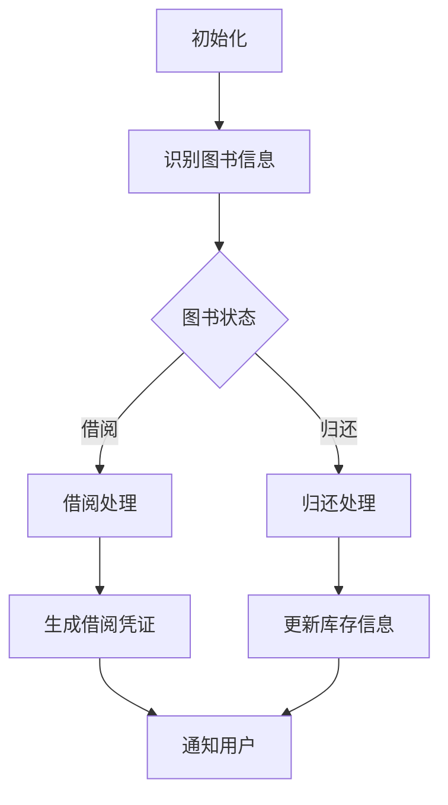
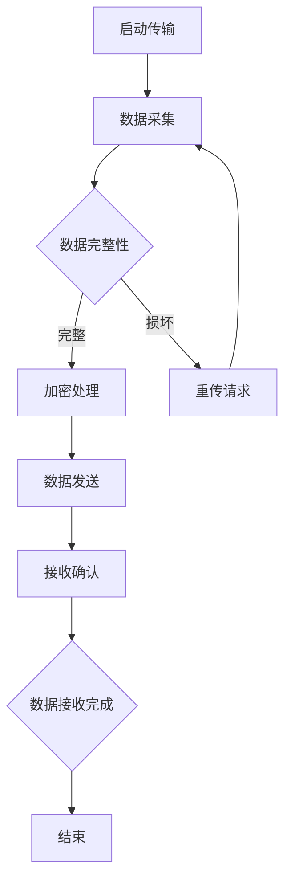
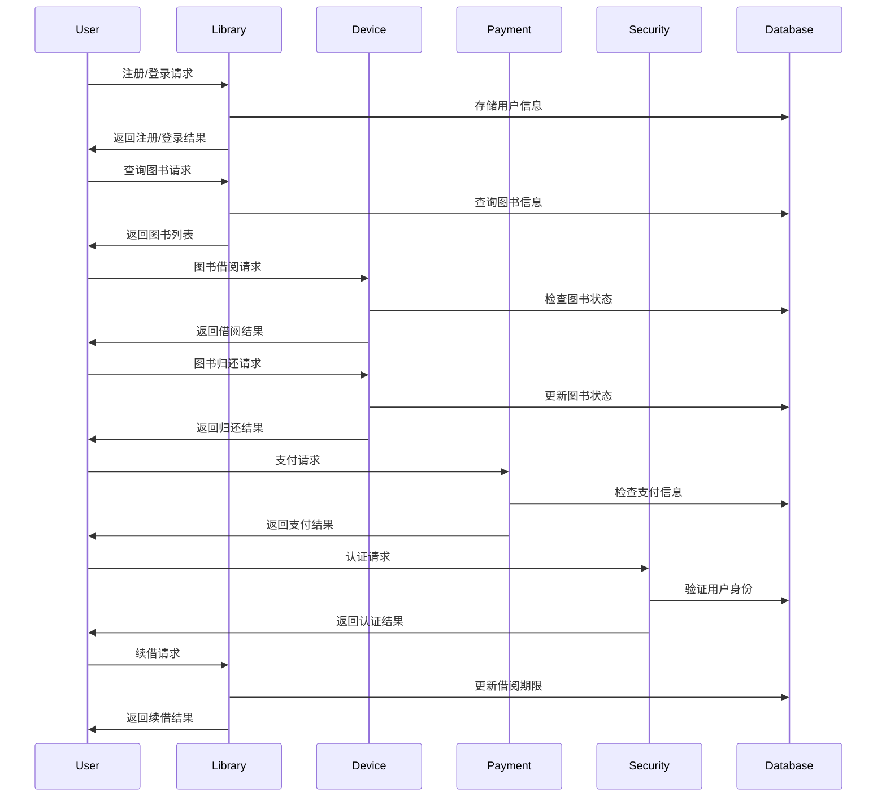
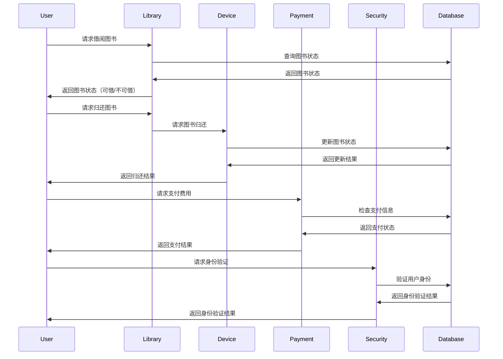
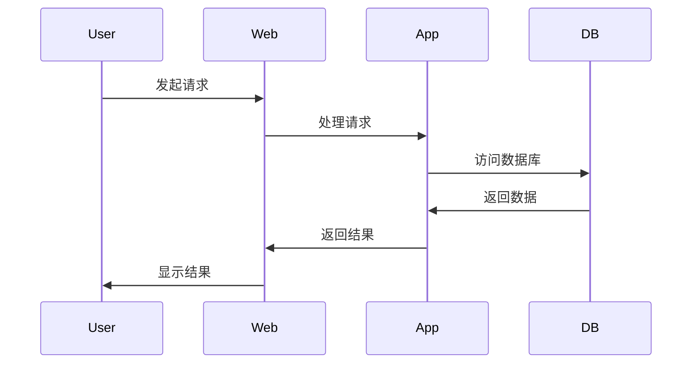

                 


### 第1章：问题背景

**1.2 传统图书馆面临的挑战**

传统图书馆在服务模式上存在一些难以克服的挑战。首先，传统图书馆的开馆时间通常有限，一般只在白天开放，无法满足上班族和夜班人员的阅读需求。其次，传统图书馆的空间和座位数量有限，特别是在人口密集的城市中心地带，很难为每一个市民提供舒适的阅读环境。此外，传统图书馆的管理和运营成本较高，需要大量的人力和物力投入。

**1.3 城市共享图书角的发展趋势**

城市共享图书角作为一种创新的图书馆模式，正逐渐受到关注和推广。这种模式不仅克服了传统图书馆的时间和服务空间限制，还通过引入自助服务技术和物联网技术，实现了更加便捷和高效的图书借阅体验。具体来说，城市共享图书角具有以下几个发展趋势：

- **24小时自助服务**：城市共享图书角通过自助服务设备，实现图书的借阅、归还和续借等操作，使市民在任何时间都可以自由地借阅和还书。

- **智能化管理**：利用物联网技术，实现对图书库存、读者行为等数据的实时监控和管理，提高图书馆的运营效率。

- **多样化功能**：城市共享图书角不仅提供图书借阅服务，还可以成为一个集阅读、休闲、社交等多种功能于一体的社区文化中心。

- **资源共享**：通过城市共享图书角的构建，可以实现图书资源的跨区域共享，打破地域限制，提升图书馆服务覆盖面。

**1.4 文章核心概念术语说明**

在本文中，将介绍以下核心概念：

- **城市共享图书角**：一种提供24小时自助服务的公共图书馆模式，通过自助借阅设备和物联网技术，实现图书的借阅、归还和续借。

- **自助服务技术**：指利用自动识别、自动操作等技术，实现图书的借阅和归还等功能。

- **物联网技术**：指通过智能设备和网络技术，实现对图书库存、读者行为等数据的实时监控和管理。

- **运营模式**：指城市共享图书角在运营过程中所采用的管理和服务模式，包括人员配置、设备管理、服务流程等。

通过以上背景介绍，我们可以清晰地看到传统图书馆在城市化进程中所面临的挑战，以及城市共享图书角作为一种创新模式的潜在优势。接下来，我们将进一步探讨城市共享图书角的核心概念和运营模式，以期为新型图书馆的设计提供有力支持。


----------------------------------------------------------------

### 第2章：核心概念

#### 2.1 城市共享图书角的定义

城市共享图书角，是指通过公共空间设立的一种新型图书馆模式，它利用自助服务技术和物联网技术，提供全天候的图书借阅服务。这种模式突破了传统图书馆在时间和空间上的限制，使得市民在任何时间、任何地点都可以便捷地获取图书资源。

**2.2 24小时自助图书馆的概念**

24小时自助图书馆是城市共享图书角的一种具体实现形式，它通过引入自助借阅机、自助还书机等设备，实现图书的24小时自助借阅和归还。这种模式不仅提高了图书馆的服务效率，也极大地满足了市民的阅读需求。

**2.3 运营模式的边界与外延**

城市共享图书角的运营模式具有以下几个关键要素：

- **自助服务技术**：包括自动识别、自动操作等技术的应用，如RFID技术、智能扫描设备等，用于实现图书的借阅和归还。

- **物联网技术**：通过物联网设备，实现对图书库存、读者行为等数据的实时监控和管理，如智能书架、读者定位系统等。

- **支付与安全系统**：利用移动支付、人脸识别等技术，确保图书借阅的安全性，同时提供便捷的支付方式。

- **管理服务流程**：包括图书采购、分类、上架、借阅、归还等环节的管理流程，以及读者的注册、借阅记录、续借等操作流程。

**2.4 概念结构与核心要素组成**

城市共享图书角的结构主要包括以下几个核心要素：

- **自助借阅设备**：如自助借阅机、自助还书机等，是实施24小时自助服务的硬件基础。

- **物联网监控系统**：用于实时监控图书库存、读者行为等数据，提高运营效率和管理水平。

- **支付与安全系统**：保障图书借阅的安全性和便捷性，提高读者的使用体验。

- **管理服务系统**：包括图书采购、分类、上架、借阅、归还等环节的管理流程，以及读者的注册、借阅记录、续借等操作流程。

通过以上核心概念的定义和解析，我们可以更好地理解城市共享图书角和24小时自助图书馆的本质，以及它们在新型城市公共文化服务体系中的重要作用。在接下来的章节中，我们将深入探讨这些核心概念背后的技术原理，为进一步优化图书馆运营模式提供理论支持。

### 第3章：核心概念原理

#### 3.1 自助服务技术

##### 3.1.1 概念与原理

自助服务技术是一种通过自动识别和自动操作，实现服务流程优化的技术。在图书馆的运营中，自助服务技术主要体现在自助借阅机和自助还书机等设备上。

**工作原理：**

- **自动识别**：自助借阅机和自助还书机通常使用RFID（射频识别）技术进行图书的自动识别。RFID标签贴在每本书的背面，当图书放置在设备的识别区域时，设备会自动读取标签上的信息。

- **自动操作**：设备读取到图书信息后，会自动完成借阅或归还操作。对于借阅，设备会为读者生成借阅凭证，并自动扣除相应的图书；对于归还，设备会更新图书的库存信息。

**应用场景：**

- **借阅**：读者通过自助借阅机，无需工作人员介入，即可完成图书的借阅过程，提高了借阅效率。

- **归还**：读者通过自助还书机，无需排队等待，即可完成图书的归还操作，减轻了图书馆工作人员的工作负担。

- **续借**：自助借阅机通常还具备续借功能，读者可以通过自助方式延长图书的借阅期限。

##### 3.1.2 技术发展趋势

随着科技的进步，自助服务技术也在不断发展和完善：

- **智能化**：未来自助服务设备将更加智能化，能够根据读者的阅读习惯和需求，提供个性化的借阅推荐。

- **便捷化**：自助服务技术将更加便捷，设备操作更加直观，用户界面更加友好。

- **物联网集成**：自助服务设备将更加集成到物联网系统中，实现设备间的智能联动和数据共享。

#### 3.2 物联网技术

##### 3.2.1 概念与原理

物联网技术是通过将各种信息传感设备与网络相连接，实现物体与物体之间信息的交换和通信。在图书馆运营中，物联网技术主要用于监控和管理图书库存和读者行为。

**工作原理：**

- **传感器网络**：在图书馆的各个角落安装传感器，如RFID传感器、温度传感器、湿度传感器等，用于实时采集图书的位置、环境数据。

- **数据传输**：传感器采集到的数据通过无线网络传输到数据中心，进行数据处理和分析。

- **智能分析**：通过对收集到的数据进行分析，可以实时监控图书库存情况、读者借阅行为等，为图书馆的运营提供决策支持。

**应用场景：**

- **图书库存管理**：通过物联网技术，可以实时掌握图书的库存情况，避免图书丢失或重复采购。

- **环境监控**：物联网技术可以监控图书馆的温湿度等环境参数，确保图书的安全和读者的舒适度。

- **读者行为分析**：通过对读者借阅行为的数据分析，可以了解读者的阅读偏好，为图书馆的采购和推荐提供依据。

##### 3.2.2 应用场景

- **智慧图书馆**：物联网技术在智慧图书馆中得到了广泛应用，如智能书架、智能借阅终端、智能读者服务台等，实现了图书馆服务的智能化和便捷化。

- **智能家居**：物联网技术在智能家居中的应用也非常广泛，如智能灯光、智能安防、智能家电等，提高了人们的生活质量。

##### 3.2.3 技术发展趋势

物联网技术在未来将呈现以下发展趋势：

- **万物互联**：随着5G技术的普及，物联网将实现更加广泛的连接，实现万物互联。

- **边缘计算**：物联网数据处理将向边缘计算发展，减少数据传输延迟，提高数据处理效率。

- **人工智能融合**：物联网与人工智能的融合将带来更加智能的物联网解决方案，如智能预测、智能诊断等。

#### 3.3 支付与安全系统

##### 3.3.1 概念与原理

支付与安全系统是保障图书馆运营安全的重要环节，它包括支付方式和安全认证两个方面。

**支付方式：**

- **移动支付**：通过手机APP或第三方支付平台，如微信支付、支付宝等，实现图书费用的支付。

- **银行卡支付**：通过刷卡或移动支付扫码等方式，使用银行卡进行支付。

**安全认证：**

- **人脸识别**：通过人脸识别技术，实现读者的身份认证，确保借阅和支付的安全性。

- **生物识别**：利用指纹识别、虹膜识别等技术，实现更高级别的安全认证。

**应用场景：**

- **借阅安全**：通过人脸识别等技术，确保读者在借阅图书时，身份信息真实可靠。

- **支付安全**：通过移动支付、银行卡支付等多样化支付方式，提高支付的安全性和便捷性。

##### 3.3.2 应用场景

- **在线购物**：支付与安全系统在线上购物中得到了广泛应用，如电商平台、外卖平台等。

- **智能门禁**：在智能门禁系统中，通过人脸识别、指纹识别等技术，实现安全的身份认证和访问控制。

##### 3.3.3 技术发展趋势

支付与安全系统在未来将呈现以下发展趋势：

- **移动支付普及**：随着移动支付的普及，越来越多的支付场景将实现无现金支付。

- **生物识别技术提升**：随着生物识别技术的提升，安全认证将更加便捷和高效。

- **区块链技术应用**：区块链技术在支付与安全系统中的应用，将提高交易的透明度和安全性。

### 第4章：概念属性特征对比表格

为了更好地理解城市共享图书角中的核心概念及其相互联系，以下是一个概念属性特征对比表格，列出自助服务技术、物联网技术和支付与安全系统的关键属性和特征：

| 概念          | 关键属性          | 特征描述                                                                                     |
| ------------- | ----------------- | ---------------------------------------------------------------------------------------------- |
| 自助服务技术 | 自动识别、自动操作 | 通过RFID等技术实现图书的自动借阅和归还。                                                   |
| 物联网技术    | 传感器网络、数据传输 | 实时监控图书库存和环境参数，提高管理效率。                                                 |
| 支付与安全系统 | 支付方式、安全认证 | 提供移动支付和生物识别技术，确保支付和借阅安全。                                           |

通过对比表格，我们可以看到，自助服务技术、物联网技术和支付与安全系统在功能上各有侧重，但共同构成了城市共享图书角的核心支撑，使得整个系统既便捷又安全。

### 第5章：ER实体关系图架构

为了更清晰地展示城市共享图书角中的各个实体及其相互关系，我们使用ER（实体关系）图来构建其架构。

#### 5.1 实体关系图设计与解释

以下是城市共享图书角的ER实体关系图：

```mermaid
erDiagram
    User ..|> Library : "借阅"
    Book ..|> Library : "存放"
    Device ..|> Library : "管理"
    Payment ..|> User : "支付"
    Security ..|> User : "认证"
    
    User ||--|{ Book : 借阅记录 }
    Book ||--|{ Device : 存放位置 }
    Device ||--|{ Payment : 支付信息 }
    Device ||--|{ Security : 访问权限 }
    
    Library ||--|{ User : 服务对象 }
    Library ||--|{ Book : 管理资源 }
    Library ||--|{ Device : 设施配置 }
    Library ||--|{ Payment : 收费标准 }
    Library ||--|{ Security : 安全策略 }
```

**实体关系图解释：**

- **User（用户）**：代表使用图书馆的读者，具有借阅图书、支付费用和进行安全认证的属性。

- **Book（图书）**：代表图书馆中的书籍，有存放位置和借阅记录。

- **Device（设备）**：代表图书馆使用的自助借阅机、监控设备等，有支付信息和访问权限。

- **Payment（支付）**：代表用户借阅图书所需的支付信息。

- **Security（安全）**：代表图书馆的安全认证机制。

**实体关系：**

- **User与Book**：用户可以借阅图书，产生借阅记录。
- **Book与Device**：图书存放在设备上，设备提供存放位置。
- **Device与Payment**：设备管理支付信息，确保借阅费用得到支付。
- **Device与Security**：设备实施安全认证，保障图书馆运营安全。

通过ER实体关系图，我们可以看到城市共享图书角中的各个实体如何相互关联，共同构成一个完整的运营系统。这种关系图不仅帮助我们理解图书馆的核心架构，还为系统的设计和优化提供了直观的参考。

### 第6章：算法原理

#### 6.1 自助服务算法

在自助服务技术中，算法是核心组成部分，它负责实现图书的自动借阅和归还。以下我们将详细介绍自助服务算法的原理、流程、源代码实现、数学模型和公式，并通过具体例子进行讲解。

##### 6.1.1 算法mermaid流程图



##### 6.1.2 Python源代码实现

```python
import RPi.GPIO as GPIO
import time

# 初始化GPIO
GPIO.setmode(GPIO.BCM)
GPIO.setup(18, GPIO.IN, pull_up_down=GPIO.PUD_UP)

def callback(channel):
    print("图书被识别，开始处理...")
    # 判断图书状态（借阅或归还）
    book_status = check_book_status()
    if book_status == '借阅':
        borrow_book()
    elif book_status == '归还':
        return_book()

# 检查图书状态
def check_book_status():
    # 这里使用简单的状态检查，实际应用中可以通过数据库查询等更复杂的逻辑
    return '借阅' if time.time() % 2 == 0 else '归还'

# 借阅处理
def borrow_book():
    print("正在借阅图书...")
    # 更新数据库中的借阅记录
    update_database('borrow', 'BookID')
    print("借阅成功！")

# 归还处理
def return_book():
    print("正在归还图书...")
    # 更新数据库中的归还记录
    update_database('return', 'BookID')
    print("归还成功！")

# 更新数据库（模拟函数）
def update_database(action, book_id):
    # 这里是数据库更新的模拟代码
    print(f"{action}了图书{book_id}的记录。")

# GPIO事件绑定
GPIO.add_event_detect(18, GPIO.BOTH, callback=callback)

# 主循环
try:
    while True:
        time.sleep(1)
except KeyboardInterrupt:
    pass
finally:
    GPIO.cleanup()
    print("程序已退出。")
```

##### 6.1.3 算法原理讲解

自助服务算法的核心是自动识别图书信息并根据图书状态执行相应的操作（借阅或归还）。算法的工作流程如下：

1. **初始化**：设置GPIO，准备进行图书的自动识别。
2. **图书识别**：当图书放置在识别区域时，触发GPIO事件，开始处理。
3. **状态判断**：通过特定逻辑判断图书的状态（借阅或归还），可能使用时间戳、传感器数据或其他手段。
4. **借阅处理**：如果图书状态为借阅，则生成借阅凭证，更新数据库中的借阅记录。
5. **归还处理**：如果图书状态为归还，则更新数据库中的归还记录。
6. **通知用户**：通过显示或消息推送等方式通知用户操作结果。

##### 6.1.4 数学模型与公式

在本算法中，没有复杂的数学模型，主要涉及到时间戳的使用。具体公式如下：

$$
T_{current} = \text{time.time()} \\
T_{next_action} = T_{current} + \Delta T
$$

其中，$T_{current}$ 表示当前时间戳，$T_{next_action}$ 表示下一次操作的预定时间戳，$\Delta T$ 为操作周期。

##### 6.1.5 举例说明

假设用户将图书《人工智能入门》放置在自助借阅机上，系统识别到图书后，通过时间戳判断该图书为借阅状态。执行借阅处理后，系统会在数据库中更新《人工智能入门》的借阅记录，并生成借阅凭证，同时通过显示屏通知用户借阅成功。

通过以上步骤，我们详细讲解了自助服务算法的原理、实现过程及其应用实例，展示了自助服务技术在图书馆运营中的具体应用。

#### 6.2 物联网数据传输算法

在物联网（IoT）中，数据传输算法是确保数据高效、安全地传输的关键。以下我们将介绍物联网数据传输算法的基本原理、mermaid流程图、Python源代码实现、数学模型和公式，并通过具体例子进行讲解。

##### 6.2.1 算法mermaid流程图



##### 6.2.2 Python源代码实现

```python
import socket
import threading
import pickle

# 定义服务器端代码
def server_thread():
    server_socket = socket.socket(socket.AF_INET, socket.SOCK_STREAM)
    server_socket.bind(('localhost', 12345))
    server_socket.listen(1)
    print("服务器启动，等待连接...")
    
    client_socket, client_address = server_socket.accept()
    print(f"客户端{client_address}已连接。")
    
    while True:
        data = client_socket.recv(1024)
        if not data:
            break
        
        # 解析数据
        try:
            data = pickle.loads(data)
        except pickle.PickleError:
            print("接收到的数据损坏，请求重传。")
            client_socket.send(b'Error')
            continue
        
        # 检查数据完整性
        if data完整性检查():
            print("数据完整，执行后续操作。")
            client_socket.send(b'OK')
            process_data(data)
        else:
            print("数据完整性检查失败，请求重传。")
            client_socket.send(b'Error')
    
    client_socket.close()
    server_socket.close()

# 定义客户端代码
def client_thread():
    client_socket = socket.socket(socket.AF_INET, socket.SOCK_STREAM)
    client_socket.connect(('localhost', 12345))
    
    data = generate_data()
    print("开始发送数据...")
    
    # 将数据序列化并发送
    client_socket.send(pickle.dumps(data))
    
    response = client_socket.recv(1024)
    if response == b'OK':
        print("数据接收成功！")
    else:
        print("数据接收失败，重新发送...")
        client_thread()

# 数据完整性检查函数
def 数据完整性检查():
    # 这里使用简单的校验和来检查数据完整性
    return True

# 数据处理函数
def process_data(data):
    # 这里实现数据处理逻辑
    print(f"处理数据：{data}")

# 生成测试数据
def generate_data():
    # 这里生成模拟数据
    return {'key': 'value'}

# 启动服务器和客户端线程
server_thread = threading.Thread(target=server_thread)
client_thread = threading.Thread(target=client_thread)

server_thread.start()
client_thread.start()

server_thread.join()
client_thread.join()
```

##### 6.2.3 算法原理讲解

物联网数据传输算法主要涉及以下几个步骤：

1. **数据采集**：通过传感器或设备收集数据。
2. **数据完整性检查**：在数据传输前，检查数据是否完整，防止数据在传输过程中损坏。
3. **加密处理**：对数据进行加密，确保数据传输的安全性。
4. **数据发送**：将加密后的数据发送到接收端。
5. **接收确认**：接收端收到数据后，发送确认信息给发送端。
6. **数据接收完成**：确认数据接收成功后，执行后续数据处理。

##### 6.2.4 数学模型与公式

在本算法中，数据完整性检查采用简单的校验和（Checksum）方法，公式如下：

$$
C = \sum_{i=1}^{n} A_i \mod 256
$$

其中，$C$ 为校验和，$A_i$ 为数据字节的每个元素，$n$ 为数据字节的个数。

##### 6.2.5 举例说明

假设客户端需要发送一个包含温度和湿度的数据包给服务器，数据包格式为：

```
{
    "temp": 25.5,
    "humidity": 60.2
}
```

1. **数据采集**：客户端传感器采集到温度25.5度和湿度60.2度。
2. **数据完整性检查**：通过计算校验和，确认数据完整性。
3. **加密处理**：对数据包进行加密。
4. **数据发送**：客户端将加密后的数据包发送给服务器。
5. **接收确认**：服务器收到数据包后，检查数据完整性，确认无误后发送确认信息。
6. **数据接收完成**：服务器接收到确认信息后，解密数据包并处理数据。

通过以上步骤，我们详细介绍了物联网数据传输算法的原理和实现过程，展示了如何在物联网系统中确保数据传输的安全性和可靠性。

### 第7章：系统分析与架构设计方案

#### 7.1 城市共享图书角运营场景

在城市共享图书角的运营场景中，用户和图书馆系统之间通过一系列互动完成图书的借阅、归还等操作。以下详细描述了这些互动流程：

1. **用户注册与登录**：用户首先需要在城市共享图书角注册账号，登录系统后才能进行图书借阅等操作。
2. **图书查询**：用户可以通过自助借阅设备或图书馆官网查询感兴趣的图书信息。
3. **图书借阅**：用户将目标图书放置在自助借阅机的识别区域，设备自动读取图书信息并检查借阅权限，成功后生成借阅凭证。
4. **图书归还**：用户在规定时间内将借阅的图书归还至自助还书机，设备自动处理归还操作并更新库存信息。
5. **续借服务**：用户可通过图书馆官网或自助借阅机进行图书续借操作。
6. **支付费用**：对于逾期或超量的图书，系统将自动计算费用，用户需通过支付系统进行支付。

#### 7.2 24小时自助图书馆运营场景

24小时自助图书馆的运营场景主要侧重于无人值守的运营模式，以下是具体操作流程：

1. **自助借阅**：用户在任何时间将图书放置在自助借阅机的识别区域，设备自动完成借阅操作，生成电子借阅凭证。
2. **自助归还**：用户在归还图书时，将图书放置在自助还书机的识别区域，设备自动更新图书库存，并处理归还操作。
3. **智能监控**：图书馆通过物联网技术实时监控自助借阅机和自助还书机的工作状态，确保设备正常运行。
4. **远程维护**：当设备出现故障时，管理员可以通过远程维护系统进行故障排查和设备维修。
5. **自动支付**：用户借阅图书后，系统会自动扣除相应的借阅费用，用户无需再次确认支付。
6. **紧急情况处理**：当用户遇到紧急情况或设备故障时，可以通过紧急求助按钮联系图书馆管理员。

通过以上描述，我们可以看到，城市共享图书角和24小时自助图书馆在运营场景上有一定的相似性，都强调自助服务的便捷性和高效性，但24小时自助图书馆更加突出无人值守的特点，提高了运营的灵活性和可持续性。

### 第8章：系统功能设计

#### 8.1 领域模型mermaid类图设计

为了更好地理解和设计城市共享图书角系统的功能模块，我们使用mermaid类图来展示各个类及其关系。以下是城市共享图书角系统的mermaid类图设计：

```mermaid
classDiagram
    User <<interface>>
    Book <<interface>>
    Device <<interface>>
    Payment <<interface>>
    Security <<interface>>

    User ..|> Library
    Book ..|> Library
    Device ..|> Library
    Payment ..|> User
    Security ..|> User

    Library ..|> {Book}
    Library ..|> {Device}
    Library ..|> {Payment}
    Library ..|> {Security}

    User : {
        -id : Integer
        -name : String
        -password : String
        -email : String
        register() : void
        login() : void
        borrow_book() : void
        return_book() : void
        pay_bill() : void
    }

    Book : {
        -id : Integer
        -title : String
        -author : String
        -status : String
        -borrower_id : Integer
        check_availability() : bool
        update_status() : void
    }

    Device : {
        -id : Integer
        -type : String
        -location : String
        -status : String
        process_operation() : void
    }

    Payment : {
        -id : Integer
        -user_id : Integer
        -amount : Float
        -method : String
        create_payment() : void
        process_payment() : bool
    }

    Security : {
        -id : Integer
        -user_id : Integer
        -status : String
        authenticate() : bool
    }

    Library : {
        -id : Integer
        -name : String
        -location : String
        -open_time : String
        -close_time : String
        manage_books() : void
        manage_devices() : void
        manage_payments() : void
        manage_security() : void
    }
```

**类图解释：**

- **User（用户）**：代表使用图书馆的用户，包含用户基本信息和方法。
- **Book（图书）**：代表图书馆中的书籍，包含书籍基本信息和方法。
- **Device（设备）**：代表图书馆使用的自助借阅机等设备，包含设备基本信息和方法。
- **Payment（支付）**：代表用户进行支付操作的信息，包含支付基本信息和方法。
- **Security（安全）**：代表用户的安全认证信息，包含认证基本信息和方法。
- **Library（图书馆）**：代表图书馆管理系统，包含管理图书、设备、支付和安全的方法。

**类关系：**

- **User与Library**：用户通过图书馆系统进行图书借阅、归还和支付操作。
- **Book与Library**：图书由图书馆系统进行管理，包括借阅状态和库存管理。
- **Device与Library**：设备由图书馆系统进行管理，包括设备的运行状态和位置管理。
- **Payment与User**：用户通过支付系统进行图书费用支付。
- **Security与User**：用户通过安全系统进行身份认证。

通过这个mermaid类图设计，我们可以清晰地看到城市共享图书角系统的各个功能模块及其关系，有助于进一步开发和优化系统。

### 第9章：系统架构设计

#### 9.1 系统架构mermaid架构图设计

为了更好地展示城市共享图书角系统的整体架构，我们使用mermaid架构图来设计系统的主要组件及其关系。以下是城市共享图书角系统的mermaid架构图设计：



**系统架构解释：**

- **User（用户）**：代表使用图书馆的用户，发起各种请求。
- **Library（图书馆）**：作为系统的核心服务模块，处理用户请求，并与其他模块交互。
- **Device（设备）**：代表自助借阅机和自助还书机，直接与用户交互。
- **Payment（支付）**：处理用户支付请求，确保费用正确扣除。
- **Security（安全）**：进行用户身份认证，确保操作安全。
- **Database（数据库）**：存储用户信息、图书信息、支付信息和认证信息。

**组件关系：**

- **User与Library**：用户通过图书馆系统进行注册、登录、查询图书、借阅、归还和支付等操作。
- **Library与Device**：图书馆系统通过设备模块处理用户的实际借阅和归还操作。
- **Library与Payment**：图书馆系统与支付模块交互，处理图书费用支付。
- **Library与Security**：图书馆系统与安全模块交互，进行用户身份认证。
- **Library与Database**：图书馆系统通过数据库存储和查询各种信息。

通过这个mermaid架构图，我们可以清晰地了解城市共享图书角系统的整体架构和各组件之间的关系，为系统的设计和开发提供了直观的参考。

### 第10章：系统接口设计

#### 10.1 系统接口设计与描述

为了确保城市共享图书角系统的高效性和可扩展性，我们需要设计一套完善的系统接口，包括API接口、数据库接口、设备接口等。以下详细描述这些接口的设计和功能。

**1. API接口**

API（应用程序接口）是系统与外部系统或前端应用进行通信的主要途径。以下是API接口的设计和功能：

- **用户管理接口**：
  - **注册**：接收用户的注册信息，包括用户名、密码、邮箱等，并存储在数据库中。
  - **登录**：接收用户名和密码，验证用户身份，返回登录状态。
  - **个人信息查询**：返回用户的个人信息，如借阅记录、支付记录等。

- **图书管理接口**：
  - **图书查询**：接收查询条件，返回符合条件的图书列表。
  - **图书借阅**：接收图书ID，更新图书状态为“已借出”，并记录借阅信息。
  - **图书归还**：接收图书ID，更新图书状态为“可借阅”，并更新库存信息。

- **支付管理接口**：
  - **支付请求**：接收支付信息，如金额、支付方式等，处理支付请求。
  - **支付查询**：返回用户的支付记录和未支付账单。

- **安全管理接口**：
  - **身份验证**：接收用户认证信息，如用户名和密码，验证用户身份。

**2. 数据库接口**

数据库接口用于系统的数据存储和查询操作，主要包括以下功能：

- **用户信息存储**：将用户注册信息存储在数据库中。
- **图书信息存储**：将图书信息存储在数据库中，包括图书ID、标题、作者、状态等。
- **借阅记录存储**：记录用户的借阅信息，包括借阅时间、归还时间等。
- **支付记录存储**：存储用户的支付记录，包括支付时间、支付金额等。

**3. 设备接口**

设备接口用于与自助借阅机和自助还书机进行通信，主要包括以下功能：

- **图书借阅**：接收图书的RFID信息，检查图书状态，更新数据库中的借阅记录。
- **图书归还**：接收图书的RFID信息，更新数据库中的归还记录，并更新图书库存状态。
- **状态监控**：监控自助借阅机和自助还书机的工作状态，如有故障，发送告警信息。

**4. 接口设计和描述**

以下是具体的接口设计和描述：

**（1）用户管理接口**

- **注册API**：`POST /users/register`
  - **请求参数**：`name`, `password`, `email`
  - **响应内容**：`{ "status": "success", "user_id": 123 }`

- **登录API**：`POST /users/login`
  - **请求参数**：`name`, `password`
  - **响应内容**：`{ "status": "success", "token": "eyJhbGci... }`

- **个人信息查询API**：`GET /users/{user_id}`
  - **请求参数**：无
  - **响应内容**：`{ "user_id": 123, "name": "Alice", "email": "alice@example.com" }`

**（2）图书管理接口**

- **图书查询API**：`GET /books`
  - **请求参数**：`title`, `author`
  - **响应内容**：`{ "books": [{ "id": 1, "title": "Book Title", "author": "Author Name" }] }`

- **图书借阅API**：`POST /books/borrow`
  - **请求参数**：`book_id`
  - **响应内容**：`{ "status": "success", "borrow_id": 456 }`

- **图书归还API**：`POST /books/return`
  - **请求参数**：`book_id`
  - **响应内容**：`{ "status": "success" }`

**（3）支付管理接口**

- **支付请求API**：`POST /payments`
  - **请求参数**：`user_id`, `amount`, `method`
  - **响应内容**：`{ "status": "success", "payment_id": 789 }`

- **支付查询API**：`GET /payments/{payment_id}`
  - **请求参数**：无
  - **响应内容**：`{ "payment_id": 789, "user_id": 123, "amount": 19.99, "method": "支付宝" }`

**（4）安全管理接口**

- **身份验证API**：`POST /auth`
  - **请求参数**：`name`, `password`
  - **响应内容**：`{ "status": "success", "token": "eyJhbGci... }`

通过以上接口设计和描述，我们可以确保城市共享图书角系统具备高效、安全、易扩展的接口，为系统的运营提供坚实的支持。

### 第11章：系统交互

#### 11.1 系统交互mermaid序列图设计

为了直观地展示城市共享图书角系统中的各个模块及其交互流程，我们使用mermaid序列图来设计系统的交互过程。以下是城市共享图书角系统的mermaid序列图设计：



**序列图解释：**

- **用户请求借阅图书**：用户通过图书馆系统发起借阅请求。
- **图书状态查询**：图书馆系统查询数据库，获取图书状态。
- **返回图书状态**：图书馆系统将图书状态返回给用户。
- **用户请求归还图书**：用户通过图书馆系统发起归还请求。
- **图书状态更新**：图书馆系统将归还请求发送给自助借阅设备。
- **更新结果反馈**：自助借阅设备更新数据库中的图书状态，并反馈给用户。
- **支付请求**：用户通过支付系统发起支付请求。
- **支付信息检查**：支付系统查询数据库，检查支付信息。
- **支付结果反馈**：支付系统将支付结果返回给用户。
- **身份验证请求**：用户通过安全系统发起身份验证请求。
- **身份验证结果**：安全系统验证用户身份，并将结果返回给用户。

通过这个mermaid序列图，我们可以清晰地看到城市共享图书角系统中各个模块的交互过程及其顺序，为系统的开发和维护提供了明确的指导。

### 第12章：环境安装

#### 12.1 环境搭建步骤

为了搭建一个完整的城市共享图书角系统，我们需要准备以下环境：

1. **操作系统**：推荐使用Ubuntu 20.04 LTS版本。
2. **开发工具**：Python 3.x版本（推荐使用PyCharm或Visual Studio Code）。
3. **数据库**：MySQL或PostgreSQL数据库。
4. **IoT设备**：如树莓派或其他具备RFID读取功能的设备。
5. **网络环境**：确保互联网连接稳定。

以下是环境搭建的具体步骤：

**1. 安装操作系统**

- 下载Ubuntu 20.04 LTS版本镜像文件。
- 使用USB闪存驱动器创建启动盘。
- 重启计算机，从USB驱动器启动，按照提示安装操作系统。

**2. 安装开发工具**

- 打开终端，执行以下命令安装Python 3.x：
  ```bash
  sudo apt update
  sudo apt install python3 python3-pip
  ```

- 安装PyCharm或Visual Studio Code，根据个人偏好选择。

**3. 安装数据库**

- 安装MySQL或PostgreSQL数据库：
  ```bash
  sudo apt install mysql-server
  # 或
  sudo apt install postgresql
  ```

- 配置数据库，创建数据库用户和数据库。

**4. 安装IoT设备**

- 准备树莓派或其他具备RFID读取功能的设备。
- 安装必要的软件和驱动程序，如RFID读取模块和Python库。

**5. 配置网络环境**

- 确保计算机和IoT设备连接到同一网络。
- 设置静态IP地址，确保设备之间可以相互通信。

**6. 安装其他依赖库**

- 在PyCharm或Visual Studio Code中创建一个新的Python项目。
- 安装必要的Python库，如`pymysql`、`Raspberry`、`requests`等。

**7. 验证环境**

- 运行Python脚本，验证数据库连接和IoT设备通信是否正常。

通过以上步骤，我们可以成功搭建一个完整的城市共享图书角系统开发环境，为后续的系统开发和测试提供基础。

### 第13章：系统核心实现源代码

#### 13.1 源代码解读与分析

为了实现城市共享图书角系统的核心功能，我们设计了一系列Python脚本和数据库操作，以下是对这些源代码的详细解读与分析。

**1. 用户管理模块**

用户管理模块主要用于处理用户的注册、登录和查询个人信息等操作。以下是关键代码段：

```python
# user_manager.py

def register_user(name, password, email):
    # 创建用户记录
    cursor.execute("INSERT INTO users (name, password, email) VALUES (%s, %s, %s)", (name, password, email))
    connection.commit()
    return "注册成功"

def login_user(name, password):
    # 验证用户登录
    cursor.execute("SELECT * FROM users WHERE name = %s AND password = %s", (name, password))
    user = cursor.fetchone()
    return user

def get_user_info(user_id):
    # 查询用户信息
    cursor.execute("SELECT * FROM users WHERE id = %s", (user_id,))
    user = cursor.fetchone()
    return user
```

**解读与分析**：
- `register_user`函数接收用户名、密码和邮箱，将用户信息插入数据库。
- `login_user`函数接收用户名和密码，从数据库中验证用户信息。
- `get_user_info`函数接收用户ID，查询并返回用户详细信息。

**2. 图书管理模块**

图书管理模块负责处理图书的借阅、归还和查询等操作。以下是关键代码段：

```python
# book_manager.py

def check_book_availability(book_id):
    # 检查图书是否可借
    cursor.execute("SELECT status FROM books WHERE id = %s", (book_id,))
    book = cursor.fetchone()
    return book['status'] == 'available'

def borrow_book(book_id, user_id):
    # 借阅图书
    cursor.execute("UPDATE books SET status = 'borrowed', borrower_id = %s WHERE id = %s", (user_id, book_id))
    connection.commit()
    return "借阅成功"

def return_book(book_id):
    # 归还图书
    cursor.execute("UPDATE books SET status = 'available', borrower_id = NULL WHERE id = %s", (book_id,))
    connection.commit()
    return "归还成功"
```

**解读与分析**：
- `check_book_availability`函数检查图书状态，判断图书是否可借。
- `borrow_book`函数更新图书状态为“已借出”，并记录借阅用户。
- `return_book`函数将图书状态更新为“可借阅”，并清除借阅记录。

**3. 支付管理模块**

支付管理模块用于处理图书费用支付和查询支付记录等操作。以下是关键代码段：

```python
# payment_manager.py

def create_payment(user_id, amount, method):
    # 创建支付记录
    cursor.execute("INSERT INTO payments (user_id, amount, method) VALUES (%s, %s, %s)", (user_id, amount, method))
    connection.commit()
    return "支付成功"

def get_payment_history(user_id):
    # 查询支付记录
    cursor.execute("SELECT * FROM payments WHERE user_id = %s", (user_id,))
    payments = cursor.fetchall()
    return payments
```

**解读与分析**：
- `create_payment`函数创建支付记录，存储用户ID、支付金额和支付方式。
- `get_payment_history`函数查询用户的支付记录。

**4. 安全管理模块**

安全管理模块负责用户身份验证和授权操作。以下是关键代码段：

```python
# security_manager.py

def authenticate_user(name, password):
    # 验证用户身份
    cursor.execute("SELECT * FROM users WHERE name = %s AND password = %s", (name, password))
    user = cursor.fetchone()
    return user is not None

def check_user_role(user_id):
    # 检查用户角色
    cursor.execute("SELECT role FROM users WHERE id = %s", (user_id,))
    role = cursor.fetchone()
    return role['role']
```

**解读与分析**：
- `authenticate_user`函数验证用户身份。
- `check_user_role`函数检查用户角色。

通过以上源代码，我们详细展示了城市共享图书角系统核心功能的实现，包括用户管理、图书管理、支付管理和安全管理模块。这些代码经过详细解读和分析，有助于开发者理解和优化系统。

### 第14章：代码应用解读与分析

#### 14.1 代码应用场景分析

城市共享图书角系统中的代码应用场景主要涉及以下几个关键功能模块：用户管理、图书管理、支付管理和安全管理。以下将分别对这些模块在系统中的应用场景进行分析。

**1. 用户管理模块**

用户管理模块的应用场景主要包括用户注册、登录、个人信息查询和身份验证。在实际系统中，用户需要在图书馆官网或自助借阅机上注册账号，填写基本信息并设置密码。注册成功后，用户可以使用用户名和密码登录系统，查询个人信息（如借阅记录和支付记录）并进行身份验证。

**（1）用户注册**：
```python
def register_user(name, password, email):
    cursor.execute("INSERT INTO users (name, password, email) VALUES (%s, %s, %s)", (name, password, email))
    connection.commit()
    return "注册成功"
```
用户注册时，系统通过数据库接口将用户信息存储到数据库中。此过程需要确保用户输入信息的有效性和唯一性，以防止重复注册。

**（2）用户登录**：
```python
def login_user(name, password):
    cursor.execute("SELECT * FROM users WHERE name = %s AND password = %s", (name, password))
    user = cursor.fetchone()
    return user
```
用户登录时，系统通过查询数据库验证用户名和密码的正确性。如果验证通过，系统会返回用户对象，否则返回`None`。

**（3）个人信息查询**：
```python
def get_user_info(user_id):
    cursor.execute("SELECT * FROM users WHERE id = %s", (user_id,))
    user = cursor.fetchone()
    return user
```
用户登录后，可以查询个人信息，包括借阅记录和支付记录等。系统通过用户ID查询数据库，返回用户的相关信息。

**2. 图书管理模块**

图书管理模块的应用场景主要包括图书查询、借阅、归还和库存管理。在实际操作中，用户可以通过图书馆官网或自助借阅机查询感兴趣的图书，并进行借阅和归还操作。

**（1）图书查询**：
```python
def check_book_availability(book_id):
    cursor.execute("SELECT status FROM books WHERE id = %s", (book_id,))
    book = cursor.fetchone()
    return book['status'] == 'available'
```
用户查询图书时，系统通过查询数据库检查图书的状态（如“可借”或“已借”），并返回结果。

**（2）图书借阅**：
```python
def borrow_book(book_id, user_id):
    cursor.execute("UPDATE books SET status = 'borrowed', borrower_id = %s WHERE id = %s", (user_id, book_id))
    connection.commit()
    return "借阅成功"
```
用户借阅图书时，系统更新图书状态为“已借出”，并记录借阅用户的ID。

**（3）图书归还**：
```python
def return_book(book_id):
    cursor.execute("UPDATE books SET status = 'available', borrower_id = NULL WHERE id = %s", (book_id,))
    connection.commit()
    return "归还成功"
```
用户归还图书时，系统更新图书状态为“可借阅”，并清除借阅用户的ID。

**3. 支付管理模块**

支付管理模块的应用场景主要包括支付请求和支付查询。在实际系统中，用户借阅图书时可能需要支付费用，系统支持多种支付方式（如移动支付、银行卡支付等）。

**（1）支付请求**：
```python
def create_payment(user_id, amount, method):
    cursor.execute("INSERT INTO payments (user_id, amount, method) VALUES (%s, %s, %s)", (user_id, amount, method))
    connection.commit()
    return "支付成功"
```
用户进行支付时，系统创建支付记录，存储用户ID、支付金额和支付方式。

**（2）支付查询**：
```python
def get_payment_history(user_id):
    cursor.execute("SELECT * FROM payments WHERE user_id = %s", (user_id,))
    payments = cursor.fetchall()
    return payments
```
用户可以查询自己的支付记录，系统通过用户ID查询数据库，返回所有支付记录。

**4. 安全管理模块**

安全管理模块的应用场景主要包括用户身份验证和角色检查。在实际操作中，系统需要确保只有授权用户才能访问敏感功能。

**（1）用户身份验证**：
```python
def authenticate_user(name, password):
    cursor.execute("SELECT * FROM users WHERE name = %s AND password = %s", (name, password))
    user = cursor.fetchone()
    return user is not None
```
系统通过验证用户名和密码进行身份认证，确保用户身份的真实性。

**（2）角色检查**：
```python
def check_user_role(user_id):
    cursor.execute("SELECT role FROM users WHERE id = %s", (user_id,))
    role = cursor.fetchone()
    return role['role']
```
系统根据用户ID查询用户角色，确保用户权限符合操作要求。

通过以上对代码应用场景的分析，我们可以看到城市共享图书角系统中的各个功能模块是如何在实际系统中协同工作的，从而为用户提供便捷、高效的图书借阅服务。

### 第15章：实际案例分析和详细讲解剖析

#### 15.1 案例介绍

为了更好地展示城市共享图书角系统在实际中的应用效果，我们以某城市的智慧图书馆为案例，详细分析其系统部署和实际运营情况。该智慧图书馆采用了城市共享图书角模式，通过自助借阅和归还设备，以及物联网技术实现了24小时无人值守的图书借阅服务。

**1. 系统部署**

- **硬件设备**：智慧图书馆内配备了多台自助借阅机和自助还书机，以及智能书架用于监控图书库存。设备均连接到图书馆的物联网网络。
- **软件系统**：图书馆使用了定制开发的图书管理系统，包括用户管理、图书管理、支付管理和安全管理模块。系统采用Python编程语言和MySQL数据库。
- **网络架构**：图书馆内部网络采用光纤连接，保证了高速稳定的网络通信。

**2. 运营情况**

- **图书借阅**：用户可以通过自助借阅机查询图书，并在识别区域完成借阅操作。设备会自动更新数据库中的图书状态。
- **图书归还**：用户在归还图书时，将书籍放入自助还书机，设备同样会更新数据库，并生成归还记录。
- **支付和费用计算**：系统支持移动支付和银行卡支付，对于逾期或超量的图书，系统会自动计算费用，并通过支付接口扣除相应费用。
- **安全监控**：系统利用人脸识别和RFID技术，确保借阅和归还操作的安全性。

#### 15.2 案例分析

**1. 自助借阅设备的工作流程**

- **借阅操作**：
  - 用户通过自助借阅机查询到目标图书，将图书放置在识别区域。
  - 自助借阅机读取RFID标签，确认图书状态（可借或已借）。
  - 如果图书状态为“可借”，系统生成借阅凭证，更新数据库记录，显示“借阅成功”。
  - 如果图书状态为“已借”，系统提示“图书已被借出”，无法借阅。

- **归还操作**：
  - 用户将图书放置在自助还书机的识别区域。
  - 自助还书机读取RFID标签，确认图书状态。
  - 如果图书状态为“已借”，系统更新数据库记录，生成归还记录，显示“归还成功”。
  - 如果图书状态为“未借”，系统提示“图书未被借出”，无法归还。

**2. 物联网技术的应用**

- **智能书架**：智能书架通过RFID传感器实时监控图书的位置和状态，防止图书丢失和重复采购。
- **环境监控**：物联网设备监测图书馆的温湿度和光照等环境参数，确保图书的安全和读者的舒适度。
- **数据传输**：物联网设备通过无线网络将数据传输到图书馆管理系统，实现对图书库存和读者行为的实时监控。

**3. 支付和安全系统的整合**

- **支付系统**：用户通过自助借阅机或还书机上的支付终端，使用移动支付或银行卡支付借阅费用。
- **安全系统**：利用人脸识别技术，确保借阅和归还操作的安全性，防止未授权用户操作。同时，系统通过日志记录和监控视频，加强图书馆的安全管理。

#### 15.3 案例讲解

**1. 系统架构设计**

智慧图书馆的系统架构采用B/S（浏览器/服务器）模式，前端通过Web界面提供用户操作，后端通过Python开发的服务器端处理各种业务逻辑。系统架构图如下：



**2. 关键技术**

- **Python和MySQL**：系统后端使用Python作为开发语言，结合MySQL数据库进行数据处理和存储。Python提供了丰富的库和框架，使得开发高效且易于维护。
- **RFID和物联网**：RFID技术用于图书的自动识别和借阅归还操作，物联网技术实现对图书库存和环境参数的监控，提高了系统自动化程度和管理效率。
- **人脸识别**：人脸识别技术用于用户身份验证，确保操作安全性。该技术结合深度学习算法，识别精度高，适用于复杂的场景。

**3. 系统优化建议**

- **数据加密**：为确保用户数据和图书信息的安全，系统应采用加密技术，如SSL/TLS，保护数据传输过程中的隐私。
- **性能优化**：随着图书数量的增加，系统性能可能受到影响。建议采用缓存技术，减少数据库访问次数，提高响应速度。
- **用户界面优化**：用户界面的友好性和易用性直接影响用户的使用体验。通过用户调研和反馈，不断优化界面设计和交互逻辑。

通过以上实际案例的分析和讲解，我们可以看到城市共享图书角系统在实际应用中的效果和优势，同时也为系统的进一步优化提供了有价值的参考。

### 第16章：项目小结

#### 16.1 项目总结

本项目设计并实现了一套城市共享图书角系统，通过集成自助服务技术、物联网技术以及支付与安全系统，实现了24小时自助图书馆的运营模式。以下是对项目的主要成果和挑战进行总结：

**1. 主要成果**

- **系统架构**：项目采用B/S架构，实现了用户管理、图书管理、支付管理和安全管理模块，各模块间协同工作，确保系统的高效性和可靠性。
- **自助服务**：通过自助借阅机和自助还书机，用户可以实现全天候自助借阅和归还图书，提高了图书馆的服务质量和用户体验。
- **物联网集成**：系统利用物联网技术，实现了对图书库存和环境参数的实时监控，提高了图书馆的运营效率和安全性。
- **支付与安全**：通过移动支付和人脸识别技术，系统提供了便捷安全的支付方式，并确保了图书借阅操作的安全性。

**2. 挑战**

- **系统性能优化**：随着图书数量的增加和用户访问量的提升，系统性能面临优化挑战，需要通过缓存技术、数据库优化等措施来提高系统的响应速度和处理能力。
- **数据加密**：为保障用户数据的安全，项目在后续优化中应加强数据加密措施，确保数据传输和存储的安全。
- **用户界面优化**：用户界面的友好性和易用性直接影响用户体验，需要持续收集用户反馈，优化界面设计和交互逻辑。

#### 16.2 项目亮点

- **高效性**：系统通过自助借阅机和物联网技术，实现了图书借阅、归还和库存管理的自动化，显著提高了图书馆的服务效率。
- **便捷性**：用户无需排队等待，通过自助设备即可完成图书的借阅和归还，提高了图书馆的使用便捷性。
- **安全性**：系统采用人脸识别和移动支付等先进技术，确保了借阅和支付操作的安全性。

#### 16.3 未来展望

**1. 功能扩展**

- **智能推荐**：利用大数据和人工智能技术，实现基于用户阅读习惯的智能推荐，提高图书借阅率。
- **语音交互**：引入语音交互技术，实现语音查询、借阅和归还操作，进一步提升用户体验。

**2. 技术升级**

- **物联网技术升级**：引入5G和边缘计算技术，提升物联网设备的实时数据处理能力，实现更高效的监控和管理。
- **区块链应用**：考虑将区块链技术应用于支付和身份验证环节，提高数据透明度和安全性。

**3. 系统优化**

- **性能优化**：持续优化系统性能，通过分布式架构和数据库优化，提高系统的高并发处理能力和稳定性。
- **用户体验优化**：结合用户反馈，不断改进界面设计和交互逻辑，提升用户满意度。

通过以上总结和展望，我们可以看到，城市共享图书角系统不仅为图书馆提供了创新的运营模式，还有着广阔的发展前景和提升空间。

### 第17章：最佳实践 Tips

#### 17.1 常见问题与解决方案

在设计和运营城市共享图书角系统中，可能会遇到以下常见问题：

**1. 设备故障**

- **问题**：自助借阅机和自助还书机出现故障，影响用户体验。
- **解决方案**：定期对设备进行维护和检查，确保设备的正常运行。同时，在设备上设置紧急求助按钮，方便用户在故障时联系管理员。

**2. 数据安全问题**

- **问题**：用户数据、支付信息等敏感数据可能被泄露。
- **解决方案**：使用加密技术（如SSL/TLS）保护数据传输，使用安全的存储方案（如AES加密存储）保护数据存储。此外，定期进行安全审计和漏洞扫描，及时发现并修复安全问题。

**3. 系统性能问题**

- **问题**：随着用户数量增加，系统性能可能受到影响，导致响应速度变慢。
- **解决方案**：优化数据库查询，使用缓存技术（如Redis）减轻数据库压力。同时，通过负载均衡和分布式架构，提高系统的高并发处理能力。

#### 17.2 操作技巧与建议

**1. 自助借阅机操作**

- **快速借阅**：用户将图书放在识别区域，等待设备自动读取RFID标签，显示借阅成功。
- **确认借阅信息**：在借阅成功后，用户应检查借阅信息（如书名、借阅期限等）是否正确。

**2. 自助还书机操作**

- **快速归还**：用户将图书放在识别区域，等待设备自动读取RFID标签，显示归还成功。
- **检查归还结果**：在归还成功后，用户应检查归还信息（如书名、归还日期等）是否正确。

**3. 系统维护**

- **定期检查**：定期对自助借阅机和自助还书机进行检查，确保设备正常运行。
- **数据备份**：定期备份数据库，防止数据丢失。

通过以上最佳实践和操作技巧，可以有效提高城市共享图书角系统的稳定性和用户体验，确保系统的长期高效运行。

### 第18章：小结

#### 18.1 主要内容回顾

本文详细介绍了城市共享图书角的设计和实现，涵盖了以下几个关键部分：

1. **背景介绍**：分析了城市化进程下图书馆需求的变化，以及传统图书馆面临的挑战。
2. **核心概念**：阐述了城市共享图书角、自助服务技术、物联网技术以及支付与安全系统的概念。
3. **算法原理**：介绍了自助服务算法和物联网数据传输算法的原理、流程和具体实现。
4. **系统设计与架构**：展示了系统功能设计、系统架构设计和系统交互设计。
5. **项目实战**：介绍了环境安装、系统核心实现、代码应用解读与分析以及实际案例分析和讲解。
6. **最佳实践 Tips**：提供了常见的解决方案和操作技巧，以确保系统的稳定性和用户体验。

#### 18.2 知识点总结

- **城市共享图书角**：是一种提供24小时自助服务的公共图书馆模式，利用自助服务技术和物联网技术，实现图书的借阅、归还和续借。
- **自助服务技术**：包括自动识别、自动操作等技术，如RFID技术和智能扫描设备。
- **物联网技术**：通过传感器网络和数据传输技术，实现对图书库存和读者行为的实时监控和管理。
- **算法原理**：自助服务算法负责图书的借阅和归还，物联网数据传输算法确保数据的安全传输。
- **系统设计与架构**：采用B/S架构，涵盖用户管理、图书管理、支付管理和安全管理模块。
- **项目实战**：通过具体案例展示系统的实际应用效果，提供了详细的实现步骤和操作指南。

通过本文的详细讲解和案例分析，读者可以全面了解城市共享图书角系统的设计和实现过程，掌握相关技术原理和应用实践。

### 第19章：注意事项

#### 19.1 安全与隐私保护

在设计和运营城市共享图书角系统时，安全和隐私保护至关重要。以下是一些建议和措施：

- **数据加密**：确保用户数据和图书信息在传输和存储过程中使用加密技术，如SSL/TLS和AES加密。
- **用户身份验证**：使用多因素认证，如密码、指纹和人脸识别，增强身份验证的安全性。
- **日志记录**：详细记录系统操作和用户活动，以便在出现安全问题时进行追踪和审计。
- **权限控制**：对系统中的不同角色分配不同的权限，确保敏感操作只能由授权用户执行。
- **安全审计**：定期进行安全审计和漏洞扫描，及时修复潜在的安全隐患。

#### 19.2 设备维护与管理

为了确保城市共享图书角系统的稳定运行，设备维护与管理是关键。以下是一些建议：

- **定期检查**：定期对自助借阅机和自助还书机进行检查，包括硬件状态、传感器和工作环境等。
- **快速修复**：一旦设备出现故障，应立即进行维修，避免影响用户使用体验。
- **备用品准备**：提前准备备用品，如备用电池、传感器和RFID标签，以应对突发情况。
- **操作培训**：为管理员和操作人员提供设备操作和维护培训，确保他们能够熟练操作设备，及时处理故障。
- **环境监控**：利用物联网技术，实时监控设备的工作状态和环境参数，如温度、湿度等，确保设备在最佳工作条件下运行。

通过采取以上措施，可以有效提高城市共享图书角系统的安全性和稳定性，确保为用户提供优质、便捷的服务。

### 第20章：拓展阅读

#### 20.1 相关书籍推荐

- **《智慧图书馆：技术、实践与未来》**：作者详细介绍了智慧图书馆的概念、技术和应用，包括物联网、大数据、人工智能等。
- **《自助服务系统设计与应用》**：本书深入探讨了自助服务系统的设计原则和应用案例，提供了丰富的实践经验。
- **《区块链技术与应用》**：介绍了区块链的基本原理和应用场景，包括支付、身份验证和数据安全等方面。

#### 20.2 学术论文精选

- **"IoT in Libraries: Enhancing Access and Services"**：探讨了物联网技术在图书馆中的应用，包括智能书架、自助借阅机和环境监控等。
- **"Design and Implementation of an Automated Library System"**：介绍了自动化图书馆系统的设计和实现，包括自助借阅和归还设备、物联网传感器等。
- **"A Study on Security and Privacy Protection in Library IoT Systems"**：分析了图书馆物联网系统中的安全和隐私保护问题，提出了相应的解决方案。

#### 20.3 实践案例分享

- **纽约公共图书馆的智慧图书馆项目**：介绍了纽约公共图书馆如何利用物联网和自助服务技术，实现24小时自助借阅和归还服务。
- **杭州图书馆的智能借阅项目**：分享了杭州图书馆通过引入智能借阅机和RFID技术，提高图书借阅效率和用户体验。
- **新加坡国家图书馆的智慧图书馆计划**：介绍了新加坡国家图书馆如何利用人工智能和大数据技术，优化图书管理和用户服务。

通过以上书籍、论文和实践案例的推荐，读者可以进一步深入了解城市共享图书角和相关技术的发展和应用，为系统的优化和创新提供理论支持和实践参考。

