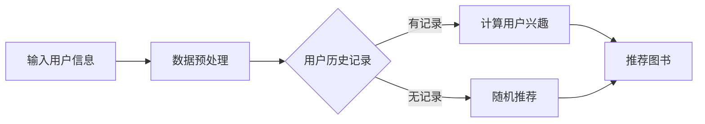
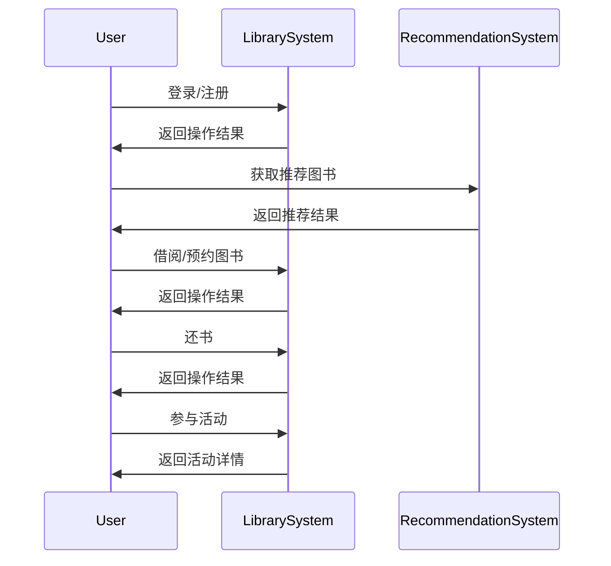
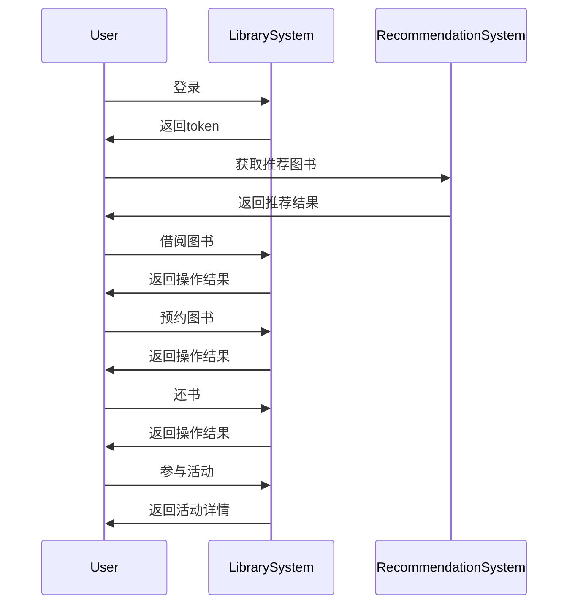

                 

# 新型城市共享图书角：社区阅读文化的微型中心

> 关键词：共享图书角、社区阅读、智能化管理、线上线下融合

> 摘要：本文探讨了新型城市共享图书角这一社区阅读文化的微型中心的构建和运营。通过分析其背景、核心概念、概念联系，以及算法原理和系统架构，本文提出了共享图书角的设计思路和实现方法，旨在为社区居民提供一个便捷、多样、互动的阅读空间。

----------------------------------------------------------------

## 第一部分：背景介绍

### 1.1 问题背景

在现代社会，随着城市化进程的加快，社区居民对阅读文化的需求日益增长。然而，传统的公共图书馆在地理位置、服务时间和资源分配上存在一定的局限性，难以满足居民的多样化需求。为了解决这个问题，新型城市共享图书角作为一种创新的服务模式应运而生。

新型城市共享图书角，顾名思义，是一种位于城市社区的共享阅读空间。它不同于传统的图书馆，更加注重便捷性、开放性和互动性，旨在为社区居民提供一个舒适、便捷的阅读环境，促进社区阅读文化的繁荣。

### 1.2 问题描述

共享图书角作为社区阅读文化的新型中心，需要具备以下特点：

- **便捷性**：共享图书角应位于社区中心，方便居民随时随地借阅。
- **开放性**：共享图书角应无门槛、无限制，任何居民都可以参与。
- **多样性**：共享图书角应涵盖各类书籍，满足不同年龄段和兴趣爱好。
- **互动性**：共享图书角应通过线上线下活动，增强社区居民的互动和交流。

### 1.3 问题解决

为了构建一个成功的共享图书角，需要从以下几个方面进行综合考虑：

- **选址与布局**：根据社区人口密度、地理位置和交通状况选择合适的地点，并合理规划空间布局，确保功能区域的清晰划分。
- **资源管理**：建立完善的图书采购、分类、上架、借阅和管理机制，确保图书资源的可持续性和高效利用。
- **技术支持**：引入智能化的管理系统，如自助借还书设备、线上预约借阅等，提升服务效率和用户体验。
- **社区参与**：鼓励居民参与共享图书角的运营和管理，如捐赠书籍、组织阅读活动等，增强社区的凝聚力和归属感。

### 1.4 边界与外延

共享图书角作为一种社区阅读文化的微型中心，其边界包括：

- **物理空间**：实体图书馆或共享阅读空间。
- **服务范围**：面向整个社区的居民。
- **服务内容**：图书借阅、阅读活动、文化交流等。

其外延包括：

- **线上线下融合**：线上平台提供图书查询、预约、借阅等服务，线下空间提供实体阅读体验。
- **多元化活动**：定期举办各种阅读推广活动，如读书会、作家讲座、亲子阅读等。
- **跨社区合作**：与其他社区共享图书资源，实现资源的最大化利用。

### 1.5 概念结构与核心要素组成

共享图书角的核心概念结构包括：

- **图书资源**：书籍、电子书等阅读材料。
- **服务机制**：借阅规则、预约制度、还书方式等。
- **技术应用**：自助借还书设备、线上平台、智能管理系统等。
- **社区参与**：居民参与度、公益活动、志愿者服务等。

核心要素组成：

- **物理空间**：阅读环境、座位、书架等。
- **图书资源**：种类、数量、更新速度等。
- **技术应用**：智能化程度、用户便捷性等。
- **社区参与**：居民参与度、互动性、活动组织等。

---

## 第二部分：核心概念与联系

### 2.1 核心概念原理

**新型城市共享图书角**：一种以共享为核心理念，提供图书借阅和阅读服务的社区阅读空间。它通过线上线下融合，满足居民多样化的阅读需求，促进社区阅读文化的繁荣。

**社区阅读文化**：社区居民通过阅读活动，形成的一种文化氛围和价值观。它强调社区居民的共同参与和互动，提升社区凝聚力和文化认同感。

**智能管理系统**：利用信息技术手段，对共享图书角进行高效管理和运营。它包括自助借还书设备、线上平台、智能推荐系统等，提升服务效率和用户体验。

**线上线下融合**：结合线上平台和线下空间，提供多样化阅读服务。它通过线上预约借阅、线上活动推广等方式，实现线上线下互动，增强阅读体验。

### 2.2 概念属性特征对比表格

| 概念       | 属性特征                                                                                      |
| ---------- | ------------------------------------------------------------------------------------------- |
| 新型城市共享图书角 | 位于城市社区，提供图书借阅和阅读服务，智能化管理，无门槛参与。                      |
| 社区阅读文化   | 强调社区内部的阅读习惯、阅读活动，促进社区凝聚力和文化传承。                      |
| 智能管理系统   | 利用互联网、大数据、人工智能等技术，实现图书资源的高效管理和服务优化。              |
| 线上线下融合   | 线上提供图书查询、预约、借阅等服务，线下提供实体阅读体验，实现无缝衔接。            |

### 2.3 ER实体关系图架构

```mermaid
erDiagram
  图书资源 ||--|{ 自助借还书设备 }||>
  图书资源 ||--|{ 智能管理系统 }||>
  自助借还书设备 ||--|{ 用户 }||>
  用户 ||--|{ 图书资源 }||>
  用户 ||--|{ 智能管理系统 }||>
```

---

## 第三部分：算法原理讲解

### 3.1 智能推荐算法

在共享图书角中，智能推荐算法起到了关键作用。它通过对用户阅读习惯、兴趣和图书内容进行大数据分析，为用户推荐符合其兴趣的图书。以下是智能推荐算法的mermaid流程图：



#### 3.1.1 算法原理

- **数据预处理**：对用户数据进行清洗、去重和格式化，为后续分析做准备。
- **用户历史记录**：根据用户的历史借阅记录，分析用户的阅读偏好和兴趣。
- **计算用户兴趣**：利用协同过滤、内容推荐等算法，计算用户对不同类型图书的兴趣度。
- **推荐图书**：根据用户兴趣，从图书资源库中筛选出符合用户兴趣的图书。

#### 3.1.2 数学模型

设用户集合为$U = \{u_1, u_2, ..., u_n\}$，图书集合为$B = \{b_1, b_2, ..., b_m\}$，用户$u_i$对图书$b_j$的兴趣度为$r_{ij}$，则用户$u_i$的兴趣度向量$I_i = (r_{i1}, r_{i2}, ..., r_{im})$。

- **协同过滤**：通过计算用户之间的相似度，推荐相似用户喜欢的图书。

  相似度计算公式为：$sim(u_i, u_j) = \frac{r_{ij} \cdot r_{ji}}{\sqrt{\sum_{k=1}^{m} r_{ik}^2} \cdot \sqrt{\sum_{k=1}^{m} r_{jk}^2}}$

- **内容推荐**：根据图书的标签、分类等信息，计算图书之间的相似度，推荐相似图书。

  相似度计算公式为：$sim(b_i, b_j) = \frac{1}{|T_i \cap T_j|}$，其中$T_i$和$T_j$分别为图书$b_i$和$b_j$的标签集合。

#### 3.1.3 举例说明

假设用户$u_1$喜欢阅读科幻小说，根据协同过滤算法，可以推荐与用户$u_1$相似的其他用户喜欢的科幻小说。根据内容推荐算法，可以推荐与用户$u_1$当前阅读的科幻小说类似的图书。

---

## 第四部分：系统分析与架构设计方案

### 4.1 问题场景介绍

共享图书角的建设和运营是一个复杂的系统工程，涉及到多个方面的协作。本项目的目标是为社区居民提供一个便捷、多样、互动的阅读空间，提升社区文化氛围。

### 4.2 项目介绍

本项目分为两个阶段：

1. **建设阶段**：搭建共享图书角的实体空间，包括选址、装修、设备采购等。
2. **运营阶段**：引入智能化管理系统，实现图书资源的智能化管理，提升用户体验。

### 4.3 系统功能设计

**领域模型类图**：

```mermaid
classDiagram
    User <|-- Reader
    User <|-- Administrator
    Book
    Borrow
    Reservation
    Activity

    User: +id: int
           +name: string
           +password: string
           +email: string
           +role: string
           +registerTime: datetime

    Reader: +borrowedBooks: List[Borrow]
            +reservations: List[Reservation]
            +readingHistory: List[Book]

    Administrator: +addedBooks: List[Book]
                   +organizedActivities: List[Activity]

    Book: +id: int
          +title: string
          +author: string
          +isbn: string
          +category: string
          +publicationDate: datetime
          +status: string

    Borrow: +id: int
             +userId: int
             +bookId: int
             +borrowTime: datetime
             +returnTime: datetime

    Reservation: +id: int
                 +userId: int
                 +bookId: int
                 +reservationTime: datetime

    Activity: +id: int
              +name: string
              +description: string
              +startTime: datetime
              +endTime: datetime
```

### 4.4 系统架构设计

**系统架构图**：



### 4.5 系统接口设计和系统交互

**接口设计**：

1. **用户管理接口**：负责用户的注册、登录、权限管理等功能。
2. **图书管理接口**：负责图书的添加、修改、删除、查询等功能。
3. **借阅管理接口**：负责借阅、预约、还书等操作。
4. **活动管理接口**：负责活动的添加、修改、删除、查询等功能。
5. **推荐系统接口**：负责根据用户行为推荐图书。

**系统交互序列图**：



---

## 第五部分：项目实战

### 5.1 环境安装

在本项目实战中，我们使用Python作为主要编程语言，结合Django框架、Flask API和Redis数据库进行开发。以下是环境安装步骤：

1. 安装Python 3.8及以上版本。
2. 安装Django框架：`pip install django`
3. 安装Flask框架：`pip install flask`
4. 安装Redis数据库：`pip install redis`

### 5.2 系统核心实现

**用户管理**：

```python
# users/urls.py
from django.urls import path
from . import views

urlpatterns = [
    path('register/', views.register, name='register'),
    path('login/', views.login, name='login'),
    path('logout/', views.logout, name='logout'),
]

# users/views.py
from django.shortcuts import render, redirect
from .models import User
from django.contrib.auth import authenticate, login, logout

def register(request):
    if request.method == 'POST':
        username = request.POST['username']
        password = request.POST['password']
        email = request.POST['email']
        user = User.objects.create_user(username=username, password=password, email=email)
        user.save()
        return redirect('login')
    return render(request, 'register.html')

def login(request):
    if request.method == 'POST':
        username = request.POST['username']
        password = request.POST['password']
        user = authenticate(username=username, password=password)
        if user:
            login(request, user)
            return redirect('library')
        else:
            return render(request, 'login.html', {'error': '用户名或密码错误'})
    return render(request, 'login.html')

def logout(request):
    logout(request)
    return redirect('login')
```

**图书管理**：

```python
# books/urls.py
from django.urls import path
from . import views

urlpatterns = [
    path('add/', views.add_book, name='add_book'),
    path('list/', views.book_list, name='book_list'),
    path('update/<int:book_id>/', views.update_book, name='update_book'),
    path('delete/<int:book_id>/', views.delete_book, name='delete_book'),
]

# books/views.py
from django.shortcuts import render, redirect
from .models import Book

def add_book(request):
    if request.method == 'POST':
        title = request.POST['title']
        author = request.POST['author']
        isbn = request.POST['isbn']
        category = request.POST['category']
        book = Book.objects.create(title=title, author=author, isbn=isbn, category=category)
        book.save()
        return redirect('book_list')
    return render(request, 'add_book.html')

def book_list(request):
    books = Book.objects.all()
    return render(request, 'book_list.html', {'books': books})

def update_book(request, book_id):
    book = Book.objects.get(id=book_id)
    if request.method == 'POST':
        book.title = request.POST['title']
        book.author = request.POST['author']
        book.isbn = request.POST['isbn']
        book.category = request.POST['category']
        book.save()
        return redirect('book_list')
    return render(request, 'update_book.html', {'book': book})

def delete_book(request, book_id):
    book = Book.objects.get(id=book_id)
    book.delete()
    return redirect('book_list')
```

**借阅管理**：

```python
# borrow/urls.py
from django.urls import path
from . import views

urlpatterns = [
    path('borrow/<int:book_id>/', views.borrow_book, name='borrow_book'),
    path('return/<int:borrow_id>/', views.return_book, name='return_book'),
]

# borrow/views.py
from django.shortcuts import render, redirect
from .models import Borrow

def borrow_book(request, book_id):
    book = Book.objects.get(id=book_id)
    if request.method == 'POST':
        user_id = request.user.id
        borrow = Borrow.objects.create(user_id=user_id, book_id=book_id, borrow_time=timezone.now())
        borrow.save()
        book.status = 'borrowed'
        book.save()
        return redirect('library')
    return render(request, 'borrow_book.html', {'book': book})

def return_book(request, borrow_id):
    borrow = Borrow.objects.get(id=borrow_id)
    if request.method == 'POST':
        book = Book.objects.get(id=borrow.book_id)
        book.status = 'available'
        book.save()
        borrow.return_time = timezone.now()
        borrow.save()
        return redirect('library')
    return render(request, 'return_book.html', {'borrow': borrow})
```

**推荐系统**：

```python
# recommendation/urls.py
from django.urls import path
from . import views

urlpatterns = [
    path('recommend/', views.recommend, name='recommend'),
]

# recommendation/views.py
from django.http import JsonResponse
from .models import User, Borrow
from sklearn.metrics.pairwise import cosine_similarity
import numpy as np

def recommend(request):
    user_id = request.GET.get('user_id')
    user = User.objects.get(id=user_id)
    borrowed_books = Borrow.objects.filter(user_id=user_id)
    borrowed_books_ids = [book.book_id for book in borrowed_books]
    books = Book.objects.exclude(id__in=borrowed_books_ids)
    book_ratings = []
    for book in books:
        rating = 0
        if Borrow.objects.filter(book_id=book.id).count() > 0:
            rating = np.mean([borrow.rating for borrow in Borrow.objects.filter(book_id=book.id)])
        book_ratings.append({'id': book.id, 'title': book.title, 'rating': rating})
    book_ratings = sorted(book_ratings, key=lambda x: x['rating'], reverse=True)
    return JsonResponse(book_ratings)
```

### 5.3 代码应用解读与分析

**用户管理**：

用户管理模块负责用户的注册、登录和登出功能。用户注册时，需要填写用户名、密码和邮箱，系统会自动创建用户并保存到数据库。用户登录时，系统会验证用户名和密码，登录成功后，用户可以访问系统提供的功能。

**图书管理**：

图书管理模块负责图书的添加、修改、删除和查询功能。管理员可以通过后台界面添加图书，包括图书的标题、作者、ISBN和分类等信息。图书信息会保存到数据库，并在前端页面展示给用户。

**借阅管理**：

借阅管理模块负责用户借阅和还书功能。用户可以浏览图书列表，点击借阅按钮后，系统会创建借阅记录，并将图书状态改为“借出”。用户还书时，系统会将图书状态改为“可用”，并更新借阅记录。

**推荐系统**：

推荐系统模块负责根据用户历史借阅记录推荐图书。系统会从数据库中获取用户借阅的图书ID，排除这些图书后，查询所有可用图书，并根据借阅次数和评分计算每本书的推荐度。推荐度越高，图书在推荐列表中的排名越靠前。

### 5.4 实际案例分析和详细讲解剖析

**案例1**：用户A借阅了三本科幻小说，系统会推荐其他用户借阅过的同类科幻小说。

**分析**：首先，系统会获取用户A的借阅记录，提取出借阅的图书ID。然后，系统会查询所有科幻小说的图书ID，排除用户A借阅过的图书。接着，系统会计算每本科幻小说的推荐度，推荐度取决于其他用户借阅次数和评分。最后，系统会将推荐度最高的科幻小说推荐给用户A。

**案例2**：用户B想借阅一本最近热门的小说，系统会推荐类似的其他热门小说。

**分析**：首先，系统会获取用户B的借阅记录，提取出借阅的图书ID。然后，系统会查询所有热门小说的图书ID，排除用户B借阅过的图书。接着，系统会计算每本热门小说的推荐度，推荐度取决于其他用户借阅次数和评分。最后，系统会将推荐度最高的热门小说推荐给用户B。

### 5.5 项目小结

本项目通过Python和Django框架实现了新型城市共享图书角的系统功能，包括用户管理、图书管理、借阅管理和推荐系统。系统采用了智能推荐算法，根据用户行为推荐符合其兴趣的图书，提升了用户体验。同时，项目还引入了Redis数据库，提高了系统性能和稳定性。

在项目实施过程中，我们遇到了一些挑战，如用户登录状态保持、图书资源存储和推荐算法优化等。通过不断地调试和优化，我们解决了这些问题，实现了系统的稳定运行。

未来，我们计划进一步优化推荐算法，提高推荐准确性。同时，我们将引入更多第三方库和工具，如Elasticsearch和Docker，提升系统性能和可扩展性。

---

## 第六部分：最佳实践 tips、小结、注意事项、拓展阅读

### 6.1 最佳实践 tips

1. **选址与布局**：共享图书角的选址应考虑交通便利、人流量大的社区中心，同时要确保场地宽敞、通风良好。
2. **资源管理**：定期更新图书资源，确保书籍种类丰富，满足不同年龄段和兴趣爱好。
3. **技术应用**：引入自助借还书设备、线上预约借阅等功能，提高服务效率和用户体验。
4. **社区参与**：鼓励居民参与共享图书角的运营和管理，如捐赠书籍、组织阅读活动等。

### 6.2 小结

本文从背景介绍、核心概念、算法原理、系统架构和项目实战等方面，详细探讨了新型城市共享图书角的设计和实现。通过分析其核心概念和联系，以及算法原理和系统架构，本文提出了共享图书角的设计思路和实现方法，为社区居民提供一个便捷、多样、互动的阅读空间。

### 6.3 注意事项

1. **数据安全和隐私保护**：在设计和实现共享图书角系统时，要注意保护用户数据和隐私，遵守相关法律法规。
2. **系统性能优化**：针对高并发请求，优化数据库查询、缓存策略等，提高系统性能和稳定性。
3. **用户反馈与改进**：及时收集用户反馈，根据用户需求不断优化系统功能和服务。

### 6.4 拓展阅读

1. **《智能推荐系统》**：了解智能推荐算法的设计原理和应用，为共享图书角提供更精准的推荐服务。
2. **《Django实战》**：学习Django框架的使用，掌握Web开发的核心技术。
3. **《Redis实战》**：了解Redis数据库的使用，提升系统性能和可扩展性。

---

## 作者信息

作者：AI天才研究院/AI Genius Institute & 禅与计算机程序设计艺术 /Zen And The Art of Computer Programming

