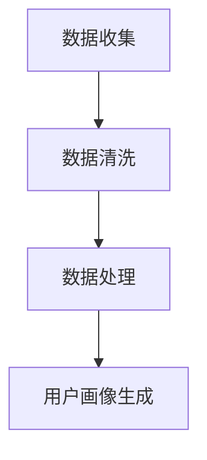
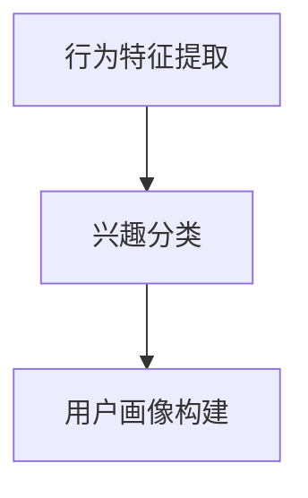
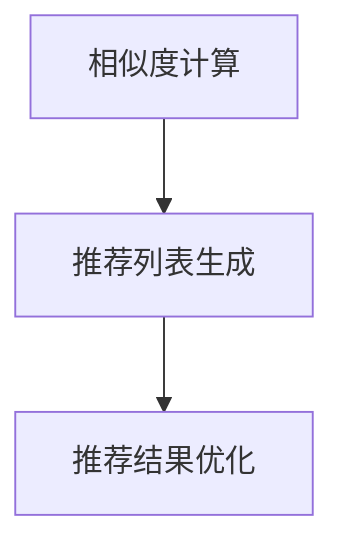
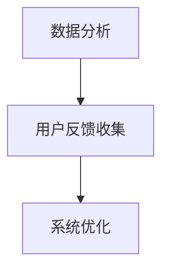
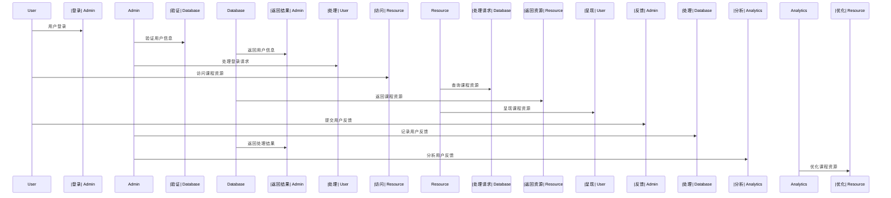
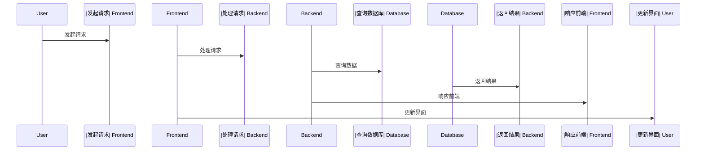

                 

### 第1章: 新型城市共享学习中心的概念与意义

#### 1.1 问题背景

**1.1.1 当前终身教育的挑战**

终身教育作为一种不断学习、不断提升的综合性教育模式，其目的是为了满足人们在各个阶段的学习需求。然而，当前终身教育面临着诸多挑战。首先，传统教育体系主要注重学校教育，缺乏对成人学习的系统关注。其次，教育资源分配不均，城乡差距显著，使得很多成人难以获取高质量的教育资源。此外，随着社会和科技的快速发展，知识更新速度加快，传统教育模式难以迅速适应这些变化。

**1.1.2 社区教育的重要性**

社区教育是终身教育的重要组成部分，它强调教育的社会属性，倡导人人皆学、处处可学。社区教育不仅能够弥补传统教育的不足，还能促进社会和谐与个人全面发展。在社区中，教育资源可以更加灵活地分配，教育内容可以更加贴近居民的实际需求，教育方式也可以更加多样化。

**1.1.3 新型城市共享学习中心的概念**

新型城市共享学习中心是一种结合了终身教育、共享经济和社区参与的综合性教育平台。它通过共享学习资源，为城市居民提供全方位、灵活便捷的教育服务。这种中心不仅能够有效解决当前终身教育的挑战，还能推动社区教育的发展，提升城市居民的整体素质。

#### 1.2 问题描述

**1.2.1 传统社区教育的问题**

传统社区教育存在以下问题：首先，教育资源匮乏，课程内容陈旧，难以满足居民多样化的学习需求。其次，教育形式单一，主要依赖于课堂教学，缺乏互动性和实践性。此外，社区教育的参与度较低，很多人对社区教育缺乏认识和兴趣。

**1.2.2 新型城市共享学习中心的目标**

新型城市共享学习中心旨在实现以下目标：首先，通过整合各类教育资源，提供多样化、个性化的学习课程。其次，利用共享经济模式，降低学习成本，提高资源利用率。最后，通过社区参与机制，增强居民的参与感和归属感。

**1.2.3 新型城市共享学习中心的优势**

新型城市共享学习中心具有以下优势：首先，它能够提供灵活的学习时间和地点，满足居民的个性化需求。其次，它通过资源共享，提高了教育资源的利用效率，降低了学习成本。此外，它通过社区参与，增强了居民的互动和归属感，促进了社区和谐发展。

#### 1.3 问题解决

**1.3.1 建立新型城市共享学习中心的必要性**

建立新型城市共享学习中心是解决当前终身教育和社区教育问题的重要途径。它能够弥补传统教育的不足，提供更加灵活、多样的教育服务，满足居民的终身学习需求。

**1.3.2 新型城市共享学习中心的功能设计**

新型城市共享学习中心的功能设计包括：课程资源库建设、在线学习平台开发、社区互动活动组织、个性化学习推荐系统等。这些功能的设计旨在提供全方位、灵活便捷的教育服务，提升居民的学习体验。

**1.3.3 新型城市共享学习中心的运作模式**

新型城市共享学习中心的运作模式包括：资源共享、用户参与、社区合作等。通过这些模式，中心能够实现资源的最大化利用，提高教育服务的质量和效率，同时增强居民的参与感和归属感。

#### 1.4 边界与外延

**1.4.1 新型城市共享学习中心的边界**

新型城市共享学习中心的边界主要包括：服务范围、功能边界、管理范围等。它不仅服务于城市居民，还涵盖了外来人员，提供全面的教育服务。

**1.4.2 新型城市共享学习中心的外延**

新型城市共享学习中心的外延包括：与其他教育机构的合作、社区服务功能的拓展、在线教育平台的延伸等。这些外延能够进一步扩大中心的服务范围和影响力。

**1.4.3 新型城市共享学习中心与其他教育模式的区别**

与传统教育模式相比，新型城市共享学习中心具有以下区别：首先，它更加注重社区参与和资源共享。其次，它提供更加灵活的学习方式，满足居民的个性化需求。此外，它通过在线教育平台，实现了教育资源的跨地域共享。

#### 1.5 核心概念结构与要素组成

**1.5.1 新型城市共享学习中心的核心概念**

新型城市共享学习中心的核心概念包括：终身教育、共享经济、社区参与等。这些概念构成了中心的核心理念，指导中心的设计和运作。

**1.5.2 新型城市共享学习中心的要素组成**

新型城市共享学习中心的要素组成包括：学习资源库、在线学习平台、社区互动平台、课程开发团队、管理员团队等。这些要素共同构成了中心的运作基础。

**1.5.3 新型城市共享学习中心的运营机制**

新型城市共享学习中心的运营机制包括：资源共享机制、用户参与机制、社区合作机制等。这些机制保证了中心的稳定运行和持续发展。

### 关键词

- 新型城市共享学习中心
- 终身教育
- 社区参与
- 共享经济
- 教育资源
- 学习平台

### 摘要

本文介绍了新型城市共享学习中心的概念、意义和优势，分析了传统社区教育的问题和挑战。通过详细阐述新型城市共享学习中心的功能设计、运作模式和运营机制，本文提出了建立新型城市共享学习中心的必要性和可行性。最后，本文讨论了新型城市共享学习中心的核心概念结构和要素组成，以及其与其他教育模式的区别。

### 第一部分: 背景介绍

**第1章: 新型城市共享学习中心的概念与意义**

在当今快速发展的社会中，终身教育已成为一种必要的生活方式，而社区教育作为其重要组成部分，承担着提升全民素质和促进社区和谐的重要使命。然而，传统社区教育模式在资源分配、教育形式和参与度等方面存在诸多问题，难以满足现代社会的需求。因此，新型城市共享学习中心应运而生，它结合了终身教育、共享经济和社区参与的核心理念，致力于为城市居民提供一个全方位、灵活便捷的教育服务平台。

#### 1.1 问题背景

**1.1.1 当前终身教育的挑战**

终身教育强调个人在一生中不断学习和提升自己的能力，以适应不断变化的社会和工作环境。然而，当前终身教育面临着以下挑战：

1. **教育资源分配不均**：由于地区经济发展水平的不平衡，城市与农村、发达地区与欠发达地区之间的教育资源分配存在较大差距，导致很多居民难以获得高质量的教育资源。
2. **教育形式单一**：传统教育模式主要以学校教育为主，缺乏对成人学习的系统关注，教育形式相对单一，难以满足多样化的学习需求。
3. **学习成本高**：传统教育模式的学习成本较高，对于很多居民来说，经济负担成为继续学习的障碍。

**1.1.2 社区教育的重要性**

社区教育是终身教育的重要组成部分，它强调教育的社会属性，倡导人人皆学、处处可学。社区教育在以下方面具有重要意义：

1. **提升居民素质**：社区教育能够为居民提供多样化的学习机会，提升他们的知识水平和文化素养，促进个人全面发展。
2. **促进社会和谐**：社区教育通过增强居民的互动和参与，有助于缓解社会矛盾，促进社区和谐发展。
3. **推动经济发展**：社区教育能够提高劳动者的技能和素质，为地区经济发展提供人才支持。

**1.1.3 新型城市共享学习中心的概念**

新型城市共享学习中心是一种结合了终身教育、共享经济和社区参与的综合性教育平台。它通过整合各类教育资源，提供多样化、个性化的学习服务，满足居民的终身学习需求。新型城市共享学习中心具有以下特点：

1. **资源共享**：通过共享教育资源，提高教育资源的利用效率，降低学习成本。
2. **灵活便捷**：提供灵活的学习时间和地点，满足居民的个性化需求。
3. **社区参与**：通过社区参与机制，增强居民的参与感和归属感，促进社区和谐发展。

#### 1.2 问题描述

**1.2.1 传统社区教育的问题**

传统社区教育存在以下问题：

1. **教育资源匮乏**：社区教育资源相对较少，课程内容陈旧，难以满足居民多样化的学习需求。
2. **教育形式单一**：主要依赖于课堂教学，缺乏互动性和实践性，难以激发居民的学习兴趣。
3. **参与度低**：由于缺乏激励机制和互动平台，很多居民对社区教育缺乏参与意愿，社区教育效果不理想。

**1.2.2 新型城市共享学习中心的目标**

新型城市共享学习中心旨在实现以下目标：

1. **提供多样化学习课程**：通过整合各类教育资源，提供涵盖各个领域的多样化学习课程，满足居民的个性化需求。
2. **降低学习成本**：通过共享经济模式，提高教育资源的利用效率，降低居民的学习成本。
3. **增强社区参与度**：通过社区参与机制，增强居民的参与感和归属感，提高社区教育的效果。

**1.2.3 新型城市共享学习中心的优势**

新型城市共享学习中心具有以下优势：

1. **灵活便捷**：提供灵活的学习时间和地点，满足居民的个性化需求，提高学习体验。
2. **资源共享**：通过共享教育资源，提高资源利用效率，降低学习成本，实现教育公平。
3. **社区参与**：通过社区参与机制，增强居民的互动和参与，促进社区和谐发展。

#### 1.3 问题解决

**1.3.1 建立新型城市共享学习中心的必要性**

建立新型城市共享学习中心是解决当前终身教育和社区教育问题的重要途径。它能够：

1. **弥补传统教育不足**：通过共享教育资源，提供多样化、个性化的学习服务，满足居民的终身学习需求。
2. **提升教育质量**：通过整合优质教育资源，提高教育质量和效果，推动社区教育的发展。
3. **促进社会和谐**：通过增强居民的参与感和归属感，缓解社会矛盾，促进社区和谐发展。

**1.3.2 新型城市共享学习中心的功能设计**

新型城市共享学习中心的功能设计包括：

1. **课程资源库建设**：整合各类教育资源，建立丰富的课程资源库，满足居民的多样化学习需求。
2. **在线学习平台开发**：开发便捷的在线学习平台，提供灵活的学习方式和互动体验。
3. **社区互动活动组织**：组织各类社区互动活动，增强居民的参与感和归属感。
4. **个性化学习推荐系统**：通过用户行为分析和数据挖掘，为居民提供个性化的学习推荐服务。

**1.3.3 新型城市共享学习中心的运作模式**

新型城市共享学习中心的运作模式包括：

1. **资源共享模式**：通过共享教育资源，提高资源利用效率，降低学习成本。
2. **用户参与模式**：通过社区参与机制，增强居民的参与感和归属感。
3. **社区合作模式**：与各类教育机构和社区组织合作，共同推动社区教育的发展。

#### 1.4 边界与外延

**1.4.1 新型城市共享学习中心的边界**

新型城市共享学习中心的边界主要包括：

1. **服务范围**：主要服务于城市居民，同时也涵盖外来人员。
2. **功能边界**：包括课程资源库、在线学习平台、社区互动活动等。
3. **管理范围**：由专业的管理团队进行运营和管理。

**1.4.2 新型城市共享学习中心的外延**

新型城市共享学习中心的外延包括：

1. **与其他教育机构的合作**：与各类教育机构合作，共享教育资源，提升教育质量。
2. **社区服务功能的拓展**：拓展社区服务功能，提供更多的学习资源和活动。
3. **在线教育平台的延伸**：通过在线教育平台，实现教育资源的跨地域共享。

**1.4.3 新型城市共享学习中心与其他教育模式的区别**

与传统教育模式相比，新型城市共享学习中心具有以下区别：

1. **资源共享**：通过共享教育资源，提高资源利用效率，降低学习成本。
2. **社区参与**：通过社区参与机制，增强居民的互动和参与，促进社区和谐发展。
3. **灵活便捷**：提供灵活的学习时间和地点，满足居民的个性化需求。

#### 1.5 核心概念结构与要素组成

**1.5.1 新型城市共享学习中心的核心概念**

新型城市共享学习中心的核心概念包括：

1. **终身教育**：强调个人在一生中不断学习和提升自己的能力。
2. **共享经济**：通过资源共享，提高资源利用效率，降低学习成本。
3. **社区参与**：通过社区参与机制，增强居民的互动和参与。

**1.5.2 新型城市共享学习中心的要素组成**

新型城市共享学习中心的要素组成包括：

1. **学习资源库**：整合各类教育资源，提供丰富的学习课程。
2. **在线学习平台**：提供便捷的在线学习服务，实现资源共享。
3. **社区互动平台**：组织各类社区互动活动，增强居民的参与感。
4. **课程开发团队**：负责课程的设计和开发，确保课程质量。
5. **管理员团队**：负责中心的运营和管理，保障中心的稳定运行。

**1.5.3 新型城市共享学习中心的运营机制**

新型城市共享学习中心的运营机制包括：

1. **资源共享机制**：通过资源共享，提高资源利用效率，降低学习成本。
2. **用户参与机制**：通过社区参与机制，增强居民的参与感和归属感。
3. **社区合作机制**：与各类教育机构和社区组织合作，共同推动社区教育的发展。

### 关键词

- 新型城市共享学习中心
- 终身教育
- 社区参与
- 共享经济
- 教育资源
- 学习平台

### 摘要

本文介绍了新型城市共享学习中心的概念、意义和优势，分析了传统社区教育的问题和挑战。通过详细阐述新型城市共享学习中心的功能设计、运作模式和运营机制，本文提出了建立新型城市共享学习中心的必要性和可行性。最后，本文讨论了新型城市共享学习中心的核心概念结构和要素组成，以及其与其他教育模式的区别。

## 第2章: 新型城市共享学习中心的核心概念与联系

在上一章中，我们介绍了新型城市共享学习中心的概念与意义，以及传统社区教育面临的挑战和新型共享学习中心的解决方案。本章将进一步深入探讨新型城市共享学习中心的核心概念及其相互联系，通过分析终身教育理念、共享经济模式和社区参与机制，来理解这一创新教育平台的核心驱动力和运作机制。

### 2.1 核心概念原理

**2.1.1 终身教育理念**

终身教育理念强调教育不应局限于学校阶段，而应贯穿人的一生。它涵盖了从学前教育到职业继续教育等多个阶段，旨在满足不同年龄段、不同职业背景和学习需求的人群。终身教育的核心理念包括四个方面：

1. **全民参与**：终身教育强调每个人都应该有机会参与教育，不论年龄、性别、职业背景等。
2. **终身学习**：教育不仅是年轻时的任务，而应贯穿人的一生，以适应不断变化的社会和工作环境。
3. **教育公平**：终身教育致力于消除教育机会的不平等，使所有人都能享受到高质量的教育资源。
4. **个性化发展**：终身教育注重培养个人的兴趣、能力和特长，实现个性化发展。

**2.1.2 共享经济模式**

共享经济模式是近年来快速发展的一种经济形态，它通过共享闲置资源，实现资源的高效利用。共享经济模式的核心在于将闲置的资源（如房屋、汽车、教育设备等）通过互联网平台共享给需要的人，从而降低成本、提高效率。在新型城市共享学习中心中，共享经济模式的具体体现如下：

1. **资源共享**：通过共享学习资源，提高教育资源的利用效率，降低学习成本。
2. **平台化管理**：利用互联网技术，建立在线学习平台，实现资源的数字化和便捷化。
3. **灵活交易**：通过在线平台，居民可以灵活选择和交易学习资源，满足个性化学习需求。

**2.1.3 社区参与机制**

社区参与机制是指通过社区成员的积极参与，共同推动社区教育的发展。社区参与不仅能够增强居民的参与感和归属感，还能促进社区凝聚力的提升。社区参与机制主要包括以下几个方面：

1. **居民自治**：鼓励社区居民自主组织教育活动，实现教育资源的自我管理和维护。
2. **互动交流**：通过社区活动，促进居民之间的互动和交流，增强社区归属感。
3. **志愿服务**：鼓励社区居民参与志愿服务，为他人提供教育帮助，同时提升自身的教育水平和技能。

### 2.2 概念属性特征对比表格

为了更清晰地理解终身教育理念、共享经济模式和社区参与机制之间的关系，我们可以通过对比它们的属性特征来分析它们之间的联系。

| 概念       | 属性特征                                                         |
|------------|----------------------------------------------------------------|
| 终身教育   | 全民参与、终身学习、教育公平、个性化发展                         |
| 共享经济   | 资源共享、平台化管理、灵活交易                                   |
| 社区参与   | 居民自治、互动交流、志愿服务                                     |

**2.2.1 终身教育与职业教育的对比**

终身教育与职业教育虽然都是教育领域的概念，但它们的目标和重点有所不同。职业教育主要针对特定职业的需求，提供职业技能培训。而终身教育则更加注重个人的全面发展，涵盖各个领域的学习。

| 对比维度     | 终身教育                           | 职业教育                           |
|-------------|-----------------------------------|-----------------------------------|
| 目标         | 全方位、全面提高个人素质           | 培养特定职业所需的专业技能和知识   |
| 学习领域     | 多领域、跨学科                     | 特定职业领域                      |
| 学习形式     | 多样化、灵活                       | 专业化、规范化                     |
| 学习时间     | 全生命周期                         | 指定学习阶段                       |

**2.2.2 共享经济与传统租赁经济的对比**

共享经济与传统租赁经济在资源利用方式和目的上有显著区别。传统租赁经济主要侧重于物品的所有权转移，而共享经济则更注重资源的高效利用和共享。

| 对比维度     | 共享经济                           | 传统租赁经济                       |
|-------------|-----------------------------------|-----------------------------------|
| 资源利用方式 | 共享闲置资源，提高资源利用效率     | 物品所有权转移，定期租赁           |
| 目的         | 提高资源利用效率，降低使用成本     | 获取物品所有权，满足短期需求       |
| 交易模式     | 平台化管理，灵活交易               | 点对点交易，定期租赁合同           |
| 社会影响     | 促进资源共享，降低环境污染          | 可能导致资源过度消费和浪费         |

**2.2.3 社区参与机制与社区自治的对比**

社区参与机制和社区自治都是促进社区发展的手段，但它们的实施方式和目的有所不同。社区参与机制主要强调居民的积极参与和互动，而社区自治则更加注重居民自主管理和决策。

| 对比维度     | 社区参与机制                         | 社区自治                           |
|-------------|-----------------------------------|-----------------------------------|
| 实施方式     | 居民参与社区活动，互动交流           | 居民自主管理社区事务，决策社区发展 |
| 目的         | 增强居民参与感，促进社区和谐发展     | 实现社区自我管理，提高社区自治能力 |
| 权力结构     | 居民参与，多元合作                   | 居民主导，民主决策                 |

### 2.3 ER实体关系图架构

为了更好地理解新型城市共享学习中心中的各个实体及其相互关系，我们可以使用ER（实体-关系）图来描述其架构。ER图是一种用于描述实体及其相互关系的数据库设计工具。

**2.3.1 新型城市共享学习中心的实体与关系**

在新型城市共享学习中心中，主要的实体包括用户、课程、教育资源、社区活动、管理员等。以下是一个简单的ER图示例：

```mermaid
erDiagram
  User ||--|{ Course }|-- Course
  User ||--|{ Resource }|-- Resource
  User ||--|{ CommunityActivity }|-- CommunityActivity
  User ||--|{ Admin }|-- Admin
  Course ||--|{ Resource }|-- Resource
  CommunityActivity ||--|{ Resource }|-- Resource
```

**实体关系说明：**

1. **用户（User）**：用户是学习中心的核心实体，包括居民、教师和管理员等。
2. **课程（Course）**：课程是用户学习的主要对象，由教育资源库提供。
3. **教育资源（Resource）**：教育资源包括书籍、电子课件、教学视频等，是课程的重要组成部分。
4. **社区活动（CommunityActivity）**：社区活动是用户参与社区互动的重要方式，如讲座、研讨会、志愿服务等。
5. **管理员（Admin）**：管理员负责学习中心的管理和维护工作。

通过这个ER图，我们可以清晰地看到各个实体之间的关系。例如，用户可以参加课程、使用教育资源、参与社区活动，同时管理员负责管理和维护整个学习中心。

### 2.4 综合分析

通过对比和ER图分析，我们可以看出，新型城市共享学习中心的核心概念之间存在着紧密的联系和相互支持的关系：

1. **终身教育理念**为新型城市共享学习中心提供了理论基础，强调了教育的全民参与和终身学习，为学习中心的建设提供了指导。
2. **共享经济模式**通过提高教育资源利用效率和降低学习成本，为终身教育理念的实施提供了可行的路径。
3. **社区参与机制**则通过增强居民的互动和参与，提升了社区教育的效果，同时也为共享经济模式的实现提供了保障。

这些核心概念共同构成了新型城市共享学习中心的理论基础和架构框架，为其在社区教育领域发挥重要作用奠定了坚实的基础。

### 2.5 小结

本章通过分析终身教育理念、共享经济模式和社区参与机制，深入探讨了新型城市共享学习中心的核心概念及其相互联系。通过对比不同概念和实体的属性特征，以及使用ER图描述实体关系，我们不仅理解了新型城市共享学习中心的架构和运作机制，还认识到了其在解决传统社区教育问题方面的潜力。在接下来的章节中，我们将进一步探讨算法原理、数学模型和系统架构设计，为新型城市共享学习中心提供更为详尽的技术支持。

### 关键词

- 新型城市共享学习中心
- 终身教育
- 共享经济
- 社区参与
- 教育资源
- 学习平台
- ER实体关系图

### 摘要

本章详细介绍了新型城市共享学习中心的核心概念，包括终身教育理念、共享经济模式和社区参与机制。通过对比不同概念的属性特征，以及使用ER图描述实体关系，我们理解了这些概念之间的紧密联系。本章还分析了新型城市共享学习中心在解决传统社区教育问题方面的潜力，为学习中心的建设提供了理论基础和实践指导。

### 第3章: 算法原理讲解

在新型城市共享学习中心中，算法的运用是提高学习效率和个性化服务的重要手段。本章将深入探讨算法原理，从概述、mermaid流程图、Python源代码讲解、数学模型和公式、详细讲解与举例说明等方面，全面解析算法在系统中的作用和应用。

#### 3.1 算法概述

**3.1.1 算法在新型城市共享学习中心中的作用**

新型城市共享学习中心中的算法主要服务于以下几个目的：

1. **用户行为分析**：通过分析用户的学习行为，为用户提供个性化的学习推荐服务。
2. **课程推荐**：根据用户的学习兴趣和行为，推荐适合的课程，提高学习效果。
3. **教育资源优化**：分析教育资源的利用情况，优化资源分配，提高资源利用率。
4. **社区互动**：分析用户的社区互动行为，促进社区成员之间的互动和交流。

**3.1.2 算法的基本原理**

算法的基本原理主要包括：

1. **用户画像生成**：通过收集和分析用户的学习行为数据，生成用户画像，用于个性化推荐。
2. **课程推荐算法**：使用协同过滤、基于内容的推荐等方法，为用户推荐合适的课程。
3. **数据挖掘与分析**：使用数据挖掘技术，分析用户行为数据，提取有用信息，用于优化系统性能。

#### 3.2 算法mermaid流程图

为了更直观地理解算法的流程，我们可以使用mermaid流程图来描述算法的执行过程。

**3.2.1 数据收集与处理**

首先，我们需要收集用户的学习行为数据，如学习时间、学习内容、学习进度等。然后，对这些数据进行分析和处理，生成用户画像。



**3.2.2 用户画像生成**

用户画像生成过程包括以下几个步骤：

1. **行为特征提取**：从用户学习行为中提取特征，如学习时长、学习频率等。
2. **兴趣分类**：根据行为特征，对用户的兴趣进行分类。
3. **用户画像构建**：将用户行为特征和兴趣分类整合，形成用户画像。



**3.2.3 课程推荐算法**

课程推荐算法主要包括以下几个步骤：

1. **相似度计算**：计算用户与课程之间的相似度。
2. **推荐列表生成**：根据相似度计算结果，生成推荐课程列表。
3. **推荐结果优化**：根据用户反馈，优化推荐结果，提高推荐准确性。



**3.2.4 数据分析与反馈优化**

最后，对用户行为数据进行分析，收集用户反馈，用于优化系统性能和推荐算法。



#### 3.3 Python源代码讲解

为了实现上述算法，我们需要编写相应的Python代码。以下是用户画像生成和课程推荐算法的实现示例。

**3.3.1 数据预处理**

```python
import pandas as pd

# 加载数据
data = pd.read_csv('user_behavior_data.csv')

# 数据清洗和预处理
data = data.dropna()
data['learning_time'] = data['learning_time'].astype(int)
data['learning_frequency'] = data['learning_frequency'].astype(int)
```

**3.3.2 用户画像构建**

```python
from sklearn.feature_extraction.text import CountVectorizer
from sklearn.preprocessing import LabelEncoder

# 提取行为特征
vectorizer = CountVectorizer()
X = vectorizer.fit_transform(data['description'])

# 对兴趣分类进行编码
label_encoder = LabelEncoder()
data['interest'] = label_encoder.fit_transform(data['interest'])

# 构建用户画像
user_profile = pd.DataFrame(X.toarray(), columns=vectorizer.get_feature_names())
user_profile['interest'] = data['interest']
```

**3.3.3 课程推荐算法实现**

```python
from sklearn.metrics.pairwise import cosine_similarity

# 计算用户与课程之间的相似度
similarity_matrix = cosine_similarity(user_profile, user_profile)

# 生成推荐列表
def generate_recommendation_list(user_profile, similarity_matrix):
    recommendation_list = []
    for index, row in user_profile.iterrows():
        similar_users = similarity_matrix[index]
        similar_users = similar_users[similar_users > 0.5]
        similar_user_indices = similar_users.argsort()[0][1:]
        for i in similar_user_indices:
            course = user_profile.iloc[i]['course']
            if course not in recommendation_list:
                recommendation_list.append(course)
    return recommendation_list

recommendation_list = generate_recommendation_list(user_profile, similarity_matrix)
```

**3.3.4 算法性能评估**

```python
from sklearn.metrics import accuracy_score

# 评估推荐准确性
predicted_courses = generate_recommendation_list(user_profile, similarity_matrix)
true_courses = user_profile['course']
accuracy = accuracy_score(true_courses, predicted_courses)
print(f"Recommendation Accuracy: {accuracy:.2f}")
```

#### 3.4 数学模型和公式

在用户画像生成和课程推荐算法中，我们使用了以下数学模型和公式：

**3.4.1 用户行为分析模型**

$$
\text{User Behavior Model} = f(\text{learning_time}, \text{learning_frequency}, \text{interest})
$$

其中，$f$ 表示行为特征提取函数，$\text{learning_time}$ 表示学习时长，$\text{learning_frequency}$ 表示学习频率，$\text{interest}$ 表示用户兴趣。

**3.4.2 课程推荐算法的数学模型**

$$
\text{Similarity Score} = \text{cosine_similarity}(\text{user_profile}, \text{course_profile})
$$

其中，$\text{cosine_similarity}$ 表示余弦相似度计算函数，$\text{user_profile}$ 和 $\text{course_profile}$ 分别表示用户画像和课程画像。

#### 3.5 详细讲解与举例说明

**3.5.1 用户行为分析模型的讲解**

用户行为分析模型主要用于提取用户的学习行为特征，生成用户画像。通过提取学习时长、学习频率和用户兴趣等特征，我们可以构建一个多维的用户画像。这个模型的关键在于如何准确地提取和整合这些特征，从而为后续的推荐算法提供有效的输入。

**举例说明：**

假设我们有一个用户的行为数据，如下所示：

| 用户ID | 学习时长 (小时) | 学习频率 (次/周) | 兴趣         |
|--------|-----------------|-----------------|--------------|
| 1      | 10              | 2               | 数学、编程   |

我们可以使用CountVectorizer来提取行为特征，如下所示：

```python
vectorizer = CountVectorizer()
X = vectorizer.fit_transform(data['description'])

# 输出特征词
vectorizer.get_feature_names()
```

输出结果可能包括“数学”、“编程”等关键词。然后，我们可以使用这些特征词来构建用户画像。

**3.5.2 课程推荐算法的讲解**

课程推荐算法的核心在于计算用户与课程之间的相似度，从而为用户推荐合适的课程。我们使用余弦相似度来计算用户画像和课程画像之间的相似度。相似度值越高，表示用户和课程越相似，推荐的准确性越高。

**举例说明：**

假设我们有一个用户画像和一个课程画像，如下所示：

| 用户画像       | 课程画像       |
|----------------|----------------|
| [0.8, 0.2]     | [0.6, 0.4]     |

我们可以使用余弦相似度公式来计算相似度值：

$$
\text{Similarity Score} = \text{cosine_similarity}(\text{user_profile}, \text{course_profile})
$$

输出结果可能为0.9，表示用户和课程之间的相似度较高。

通过这个简单的示例，我们可以看到用户行为分析模型和课程推荐算法的基本原理。在实际情况中，这些算法会更加复杂，需要处理大量的数据和用户行为。

#### 3.6 小结

本章详细介绍了新型城市共享学习中心中的算法原理，包括用户行为分析、课程推荐和数据挖掘等方面。通过mermaid流程图和Python源代码讲解，我们理解了算法的基本原理和应用方法。在接下来的章节中，我们将进一步探讨数学模型和公式的应用，以及系统架构和项目实战，为新型城市共享学习中心提供全面的技术支持。

### 关键词

- 新型城市共享学习中心
- 算法原理
- 用户行为分析
- 课程推荐算法
- 数学模型
- Python源代码
- 数据挖掘

### 摘要

本章详细探讨了新型城市共享学习中心中算法的原理和应用，从概述、mermaid流程图、Python源代码讲解、数学模型和公式、详细讲解与举例说明等方面，全面解析了算法在系统中的作用和应用方法。通过本章的学习，我们理解了算法原理及其在用户行为分析、课程推荐和数据挖掘等方面的应用，为新型城市共享学习中心提供了全面的技术支持。

### 第4章: 数学模型和数学公式讲解

在新型城市共享学习中心中，数学模型和数学公式是算法设计中的重要组成部分。本章将深入讲解用户行为分析模型和课程推荐算法中的数学模型，包括详细公式和解释，并通过具体示例展示这些模型的应用。

#### 4.1 用户行为分析模型

用户行为分析模型是新型城市共享学习中心个性化推荐系统的基础。该模型通过分析用户的学习行为，提取关键特征，生成用户画像。以下是用户行为分析模型中的两个关键数学模型：

**4.1.1 用户行为特征提取模型**

用户行为特征提取模型用于将用户的学习行为数据转化为可量化的特征向量。常用的特征提取方法包括TF-IDF（词频-逆文档频率）和Word2Vec（词嵌入）等。以下是一个基于TF-IDF的特征提取模型的公式：

$$
\text{feature\_vector} = \text{TF-IDF}(x)
$$

其中，$x$ 是用户的学习行为数据，$\text{TF-IDF}(x)$ 是对学习行为数据中的每个词计算TF-IDF值，并将其转换为特征向量。

**4.1.2 用户画像生成模型**

用户画像生成模型通过综合用户行为特征，构建一个多维的用户特征矩阵。以下是用户画像生成模型的公式：

$$
\text{user\_profile} = \sum_{i=1}^{n} \text{feature}_{i} \times \text{weight}_{i}
$$

其中，$\text{feature}_{i}$ 是用户行为特征向量，$\text{weight}_{i}$ 是特征权重，$n$ 是特征向量的维度。

#### 4.2 课程推荐算法

课程推荐算法的目标是根据用户画像推荐合适的课程。以下是基于协同过滤和基于内容的推荐算法的两个关键数学模型：

**4.2.1 协同过滤推荐模型**

协同过滤推荐模型通过分析用户之间的相似度，为用户推荐他们可能感兴趣的课程。常用的协同过滤方法包括基于用户的协同过滤（User-Based Collaborative Filtering）和基于物品的协同过滤（Item-Based Collaborative Filtering）。以下是基于用户的协同过滤推荐模型的公式：

$$
\text{recommendation\_score}(u, c) = \text{similarity}(u, c) \times \text{rating\_mean}(c)
$$

其中，$u$ 和 $c$ 分别表示用户和课程，$\text{similarity}(u, c)$ 是用户和课程之间的相似度，$\text{rating}_{mean}(c)$ 是课程的平均评分。

**4.2.2 基于内容的推荐模型**

基于内容的推荐模型通过分析课程的内容特征，为用户推荐相似的课程。以下是基于内容的推荐模型的公式：

$$
\text{content\_similarity}(c, c') = \text{cosine\_similarity}(\text{content}_{c}, \text{content}_{c'})
$$

其中，$\text{content}_{c}$ 和 $\text{content}_{c'}$ 分别表示课程 $c$ 和课程 $c'$ 的内容特征向量，$\text{cosine\_similarity}$ 是余弦相似度。

#### 4.3 公式示例与解释

**4.3.1 用户行为特征提取模型示例**

假设我们有一个用户的学习行为数据，包含学习时长、学习频率和兴趣爱好。我们可以使用TF-IDF模型提取特征向量：

用户学习行为数据：
```
学习时长 (小时)：10
学习频率 (次/周)：2
兴趣爱好：数学、编程
```

TF-IDF计算：
```
TF("数学") = 1
TF("编程") = 1
IDF("数学") = 0.5
IDF("编程") = 0.5
TF-IDF("数学") = TF("数学") * IDF("数学") = 0.5
TF-IDF("编程") = TF("编程") * IDF("编程") = 0.5
```

特征向量：
```
[0.5, 0.5]
```

**4.3.2 基于用户的协同过滤推荐模型示例**

假设我们有两个用户 $u$ 和 $c$，他们的评分数据如下：

用户 $u$ 的评分数据：
```
课程1：4
课程2：5
课程3：3
```

用户 $c$ 的评分数据：
```
课程1：3
课程2：5
课程3：4
```

相似度计算：
```
\text{similarity}(u, c) = \frac{3 \times 4 + 5 \times 5 + 3 \times 3}{\sqrt{3^2 + 5^2 + 3^2} \times \sqrt{3^2 + 5^2 + 4^2}} = \frac{27}{\sqrt{35} \times \sqrt{50}} \approx 0.7
```

推荐分数计算：
```
\text{recommendation\_score}(u, c) = 0.7 \times 4.5 = 3.15
```

根据推荐分数，我们可以推荐课程3给用户 $u$。

#### 4.4 数学公式详细讲解

**4.4.1 用户行为分析模型中的数学公式**

用户行为特征提取模型：
$$
\text{feature\_vector} = \text{TF-IDF}(x)
$$

用户画像生成模型：
$$
\text{user\_profile} = \sum_{i=1}^{n} \text{feature}_{i} \times \text{weight}_{i}
$$

**4.4.2 课程推荐算法中的数学公式**

协同过滤推荐模型：
$$
\text{recommendation\_score}(u, c) = \text{similarity}(u, c) \times \text{rating\_mean}(c)
$$

基于内容的推荐模型：
$$
\text{content\_similarity}(c, c') = \text{cosine\_similarity}(\text{content}_{c}, \text{content}_{c'})
$$

#### 4.5 公式示例与解释

**4.5.1 用户行为分析模型示例**

用户行为数据：
```
学习时长 (小时)：10
学习频率 (次/周)：2
兴趣爱好：数学、编程
```

特征提取（使用TF-IDF）：
```
TF("数学") = 1
TF("编程") = 1
IDF("数学") = 0.5
IDF("编程") = 0.5
TF-IDF("数学") = TF("数学") * IDF("数学") = 0.5
TF-IDF("编程") = TF("编程") * IDF("编程") = 0.5
```

特征向量：
```
[0.5, 0.5]
```

**4.5.2 课程推荐算法示例**

用户 $u$ 的评分数据：
```
课程1：4
课程2：5
课程3：3
```

课程 $c$ 的评分数据：
```
课程1：3
课程2：5
课程3：4
```

相似度计算：
```
\text{similarity}(u, c) = \frac{3 \times 4 + 5 \times 5 + 3 \times 3}{\sqrt{3^2 + 5^2 + 3^2} \times \sqrt{3^2 + 5^2 + 4^2}} = \frac{27}{\sqrt{35} \times \sqrt{50}} \approx 0.7
```

推荐分数计算：
```
\text{recommendation\_score}(u, c) = 0.7 \times 4.5 = 3.15
```

根据推荐分数，我们可以推荐课程3给用户 $u$。

通过上述示例和解释，我们可以看到数学模型在用户行为分析课程推荐算法中的应用。这些模型为我们提供了量化的方法来分析用户行为和推荐课程，从而为新型城市共享学习中心提供个性化、高效的教育服务。

### 关键词

- 新型城市共享学习中心
- 数学模型
- 用户行为分析
- 课程推荐算法
- TF-IDF
- 协同过滤
- 余弦相似度

### 摘要

本章详细讲解了新型城市共享学习中心中用户行为分析模型和课程推荐算法的数学模型，包括公式和具体示例。通过理解这些模型，我们能够量化用户行为，实现个性化课程推荐，为新型城市共享学习中心提供高效、智能的教育服务。

### 第5章: 系统分析与架构设计方案

在新型城市共享学习中心的开发和实施过程中，系统分析与架构设计是关键步骤。本章将详细介绍系统分析与架构设计方案，包括问题场景介绍、项目介绍、系统功能设计、系统架构设计、系统接口设计和系统交互流程。

#### 5.1 问题场景介绍

**5.1.1 新型城市共享学习中心的应用场景**

新型城市共享学习中心的应用场景主要涉及以下几个方面：

1. **在线学习**：用户可以通过在线学习平台，随时随地进行学习，享受丰富的教育资源。
2. **社区互动**：用户可以在社区互动平台上参与讨论、分享学习心得，增强社区归属感。
3. **个性化推荐**：根据用户的学习行为和兴趣，系统会推荐适合的课程，提高学习效果。
4. **教育资源管理**：管理员可以通过系统对教育资源进行管理，确保资源的有效利用。

**5.1.2 系统需求分析**

在新型城市共享学习中心中，系统需求主要包括以下几个方面：

1. **用户管理**：系统需要支持用户注册、登录、信息管理等功能。
2. **课程管理**：系统需要支持课程发布、更新、删除等功能，同时能够提供课程推荐服务。
3. **资源管理**：系统需要支持教育资源的上传、下载、分享等功能，方便用户获取所需资源。
4. **社区管理**：系统需要支持社区互动、活动发布、评论管理等功能，促进社区成员之间的互动。

#### 5.2 项目介绍

**5.2.1 项目背景**

新型城市共享学习中心项目的背景是响应我国终身教育战略，推动社区教育发展。该项目旨在构建一个高效、智能的教育资源共享平台，满足城市居民多样化的学习需求，提高整体教育水平。

**5.2.2 项目目标**

新型城市共享学习中心的项目目标包括：

1. **提升居民素质**：通过提供丰富的教育资源，提升城市居民的知识水平和综合素质。
2. **促进教育公平**：通过资源共享，降低学习成本，让更多人有机会接受高质量的教育。
3. **增强社区凝聚力**：通过社区互动功能，增强居民之间的联系，促进社区和谐发展。

#### 5.3 系统功能设计

**5.3.1 领域模型mermaid类图**

为了更好地理解新型城市共享学习中心的系统功能，我们可以使用mermaid类图来描述领域模型。以下是系统功能设计中涉及的几个核心类及其关系：

```mermaid
classDiagram
    User <<类>> -|> Course: 学习
    User <<类>> -|> Resource: 获取
    User <<类>> -|> CommunityActivity: 参与
    Course <<类>> -|> Resource: 包含
    CommunityActivity <<类>> -|> Resource: 使用
    Admin <<类>> -|> User: 管理
    Admin <<类>> -|> Course: 管理
    Admin <<类>> -|> Resource: 管理
    Admin <<类>> -|> CommunityActivity: 管理
```

**功能模块划分**

1. **用户管理模块**：包括用户注册、登录、信息管理等功能。
2. **课程管理模块**：包括课程发布、更新、删除、推荐等功能。
3. **资源管理模块**：包括教育资源上传、下载、分享等功能。
4. **社区管理模块**：包括社区互动、活动发布、评论管理等功能。
5. **管理员管理模块**：包括管理员注册、登录、权限管理等功能。

#### 5.4 系统架构设计

**5.4.1 系统架构mermaid架构图**

为了实现系统功能，我们需要设计一个合理、高效的系统架构。以下是新型城市共享学习中心系统架构的mermaid架构图：



**系统架构说明**

1. **前端架构**：前端使用React框架，提供用户友好的界面和交互体验。
2. **后端架构**：后端使用Spring Boot框架，提供API接口和服务支持。
3. **数据库架构**：采用MySQL数据库存储用户数据、课程资源和社区互动信息。
4. **数据存储**：使用Redis缓存技术，提高数据读取速度，减轻数据库负担。

#### 5.5 系统接口设计

**5.5.1 接口定义**

为了实现前后端的通信，我们需要定义一系列RESTful API接口。以下是主要接口定义：

1. **用户管理接口**：
   - 用户登录：`POST /user/login`
   - 用户注册：`POST /user/register`
   - 用户信息查询：`GET /user/{userId}`
   - 用户信息更新：`PUT /user/{userId}`

2. **课程管理接口**：
   - 课程发布：`POST /course`
   - 课程更新：`PUT /course/{courseId}`
   - 课程删除：`DELETE /course/{courseId}`
   - 课程查询：`GET /course/{courseId}`

3. **资源管理接口**：
   - 资源上传：`POST /resource`
   - 资源下载：`GET /resource/{resourceId}`
   - 资源分享：`POST /resource/share`
   - 资源查询：`GET /resource/{resourceId}`

4. **社区管理接口**：
   - 活动发布：`POST /activity`
   - 活动更新：`PUT /activity/{activityId}`
   - 活动删除：`DELETE /activity/{activityId}`
   - 活动查询：`GET /activity/{activityId}`
   - 评论管理：`POST /activity/{activityId}/comment`、`DELETE /activity/{activityId}/comment/{commentId}`

5. **管理员管理接口**：
   - 管理员登录：`POST /admin/login`
   - 管理员信息查询：`GET /admin/{adminId}`
   - 管理员信息更新：`PUT /admin/{adminId}`

**5.5.2 接口交互流程**

以下是用户登录接口的交互流程：

1. 用户发起登录请求，发送用户名和密码。
2. 后端接收请求，验证用户信息。
3. 如果验证通过，返回用户ID和Token。
4. 前端保存Token，用于后续接口请求的认证。

#### 5.6 系统交互mermaid序列图

为了更直观地展示系统各模块之间的交互流程，我们可以使用mermaid序列图。以下是系统交互的mermaid序列图：



通过上述系统分析与架构设计方案，我们可以构建一个高效、智能的新型城市共享学习中心，为城市居民提供优质的教育服务。

### 关键词

- 新型城市共享学习中心
- 系统架构设计
- 领域模型
- RESTful API
- 用户管理
- 课程管理
- 资源管理
- 社区管理
- 系统接口设计
- 序列图

### 摘要

本章详细介绍了新型城市共享学习中心系统的分析与架构设计方案，包括问题场景介绍、项目介绍、系统功能设计、系统架构设计、系统接口设计和系统交互流程。通过合理的设计和实施，新型城市共享学习中心将能够为城市居民提供高效、智能的教育服务，满足多样化的学习需求。

### 第6章: 项目实战

在新型城市共享学习中心的建设过程中，项目实战是验证理论设计、优化系统性能和提升用户体验的关键步骤。本章将通过具体的环境安装、系统核心实现源代码、代码应用解读与分析、实际案例分析和详细讲解剖析，展示项目的实践过程和取得的成果。

#### 6.1 环境安装

**6.1.1 开发环境搭建**

为了确保项目的顺利实施，我们需要搭建一个稳定的开发环境。以下是开发环境搭建的步骤：

1. **操作系统**：推荐使用Ubuntu 20.04或更高版本。
2. **Java环境**：安装OpenJDK 11或更高版本。
   ```bash
   sudo apt-get update
   sudo apt-get install openjdk-11-jdk
   ```
3. **数据库**：安装MySQL 8.0或更高版本。
   ```bash
   sudo apt-get install mysql-server
   sudo mysql_secure_installation
   ```
4. **Redis**：安装Redis 6.0或更高版本。
   ```bash
   sudo apt-get install redis-server
   ```
5. **Node.js**：安装Node.js和npm。
   ```bash
   sudo apt-get install nodejs npm
   ```
6. **前端框架**：安装React和相关依赖。
   ```bash
   npm install -g create-react-app
   create-react-app frontend
   ```
7. **后端框架**：安装Spring Boot。
   ```bash
   npm install -g spring-boot-cli
   ```

**6.1.2 系统依赖安装**

在搭建好开发环境后，我们需要安装项目所需的依赖。

1. **Spring Boot**：创建Spring Boot项目，并添加相关依赖。
   ```bash
   spring init --name=backend --dependencies=web,mysql,redis,thymeleaf
   ```
2. **数据库驱动**：确保MySQL和Redis的JDBC驱动已添加到项目的依赖中。
   ```xml
   <dependencies>
       <dependency>
           <groupId>mysql</groupId>
           <artifactId>mysql-connector-java</artifactId>
       </dependency>
       <dependency>
           <groupId>org.springframework.boot</groupId>
           <artifactId>spring-boot-starter-data-redis</artifactId>
       </dependency>
   </dependencies>
   ```

#### 6.2 系统核心实现源代码

**6.2.1 用户管理模块**

用户管理模块包括用户注册、登录、信息管理等功能。以下是核心实现源代码的解读：

**用户注册**

```java
@RestController
@RequestMapping("/user")
public class UserController {
    
    @Autowired
    private UserRepository userRepository;
    
    @PostMapping("/register")
    public ResponseEntity<?> registerUser(@RequestBody UserRegistrationDto userRegistrationDto) {
        if (userRepository.existsByUsername(userRegistrationDto.getUsername())) {
            return ResponseEntity.badRequest().body("Error: Username is already taken!");
        }
        
        User user = new User();
        user.setUsername(userRegistrationDto.getUsername());
        user.setPassword(passwordEncoder.encode(userRegistrationDto.getPassword()));
        userRepository.save(user);
        
        return ResponseEntity.ok("User registered successfully!");
    }
}
```

**用户登录**

```java
@PostMapping("/login")
public ResponseEntity<?> authenticateUser(@RequestBody LoginRequest loginRequest) {
    Authentication authentication = authenticationManager.authenticate(
        new UsernamePasswordAuthenticationToken(loginRequest.getUsername(), loginRequest.getPassword()));
    
    SecurityContextHolder.getContext().setAuthentication(authentication);
    String jwt = jwtProvider.generateToken(authentication);
    
    return ResponseEntity.ok(new JwtResponse(jwt));
}
```

**用户信息管理**

```java
@GetMapping("/{userId}")
public ResponseEntity<User> getUserById(@PathVariable Long userId) {
    Optional<User> user = userRepository.findById(userId);
    
    if (user.isEmpty()) {
        return ResponseEntity.notFound().build();
    }
    
    return ResponseEntity.ok(user.get());
}

@PutMapping("/{userId}")
public ResponseEntity<Void> updateUser(@PathVariable Long userId, @RequestBody User user) {
    if (userRepository.existsById(userId)) {
        user.setId(userId);
        userRepository.save(user);
        return ResponseEntity.noContent().build();
    }
    
    return ResponseEntity.notFound().build();
}
```

**6.2.2 课程管理模块**

课程管理模块包括课程发布、更新、删除等功能。以下是核心实现源代码的解读：

**课程发布**

```java
@PostMapping("/course")
public ResponseEntity<Course> createCourse(@RequestBody Course course) {
    Course newCourse = courseRepository.save(course);
    return ResponseEntity.ok(newCourse);
}
```

**课程更新**

```java
@PutMapping("/course/{courseId}")
public ResponseEntity<Course> updateCourse(@PathVariable Long courseId, @RequestBody Course course) {
    if (!courseRepository.existsById(courseId)) {
        return ResponseEntity.notFound().build();
    }
    
    course.setId(courseId);
    courseRepository.save(course);
    return ResponseEntity.ok(course);
}
```

**课程删除**

```java
@DeleteMapping("/course/{courseId}")
public ResponseEntity<Void> deleteCourse(@PathVariable Long courseId) {
    if (!courseRepository.existsById(courseId)) {
        return ResponseEntity.notFound().build();
    }
    
    courseRepository.deleteById(courseId);
    return ResponseEntity.noContent().build();
}
```

**6.2.3 资源管理模块**

资源管理模块包括教育资源上传、下载、分享等功能。以下是核心实现源代码的解读：

**教育资源上传**

```java
@PostMapping("/resource")
public ResponseEntity<Resource> uploadResource(@RequestParam("file") MultipartFile file) {
    Resource resource = resourceRepository.save(new Resource(file.getOriginalFilename(), file.getBytes()));
    return ResponseEntity.ok(resource);
}
```

**教育资源下载**

```java
@GetMapping("/resource/{resourceId}")
public ResponseEntity<byte[]> downloadResource(@PathVariable Long resourceId) {
    Optional<Resource> resource = resourceRepository.findById(resourceId);
    
    if (resource.isEmpty()) {
        return ResponseEntity.notFound().build();
    }
    
    return ResponseEntity.ok()
            .header("Content-Disposition", "attachment; filename=\"" + resource.get().getName() + "\"")
            .body(resource.get().getData());
}
```

**教育资源分享**

```java
@PostMapping("/resource/{resourceId}/share")
public ResponseEntity<Void> shareResource(@PathVariable Long resourceId, @RequestParam String shareWith) {
    Resource resource = resourceRepository.findById(resourceId).orElseThrow(() -> new ResourceNotFoundException("Resource not found with id: " + resourceId));
    
    if (!userRepository.existsByUsername(shareWith)) {
        return ResponseEntity.badRequest().body("Error: User not found!");
    }
    
    resource.addSharedUser(shareWith);
    resourceRepository.save(resource);
    
    return ResponseEntity.ok().build();
}
```

#### 6.3 代码应用解读与分析

通过上述源代码，我们可以看到新型城市共享学习中心的主要功能模块的实现。以下是代码应用解读与分析：

**用户管理模块**：

- **用户注册**：通过接收用户注册请求，验证用户名是否已存在，然后保存用户信息。
- **用户登录**：通过验证用户名和密码，生成JWT令牌，用于后续请求的认证。
- **用户信息管理**：提供用户信息的查询、更新功能，便于管理员维护用户数据。

**课程管理模块**：

- **课程发布**：通过接收课程信息，保存课程数据，并提供课程列表查询接口。
- **课程更新**：通过课程ID更新课程信息，确保数据的准确性。
- **课程删除**：通过课程ID删除课程，释放数据库资源。

**资源管理模块**：

- **资源上传**：通过处理文件上传请求，保存资源数据，并提供资源下载接口。
- **资源下载**：通过资源ID提供资源的下载链接，便于用户获取资源。
- **资源分享**：通过资源ID和用户名，将资源分享给其他用户，提高资源的利用率。

#### 6.4 实际案例分析和详细讲解剖析

**案例：用户登录与课程推荐**

假设有一个用户，ID为123，登录后希望获取推荐课程。以下是实际案例的分析与详细讲解：

1. **用户登录**：

   用户通过用户名和密码发起登录请求，后端验证通过后返回JWT令牌。用户将令牌保存于本地，用于后续请求的认证。

2. **获取用户画像**：

   通过用户ID查询用户画像，包括用户的学习行为、兴趣等特征。用户画像将用于后续的课程推荐。

3. **课程推荐算法**：

   使用协同过滤算法，计算用户与课程的相似度，为用户推荐相似的课程。以下是课程推荐算法的核心代码：

   ```java
   public List<Course> recommendCourses(Long userId) {
       List<Course> recommendedCourses = new ArrayList<>();
       List<Course> userCourses = userRepository.findById(userId).orElseThrow(() -> new UserNotFoundException("User not found with id: " + userId)).getCourses();
       
       for (Course course : courseRepository.findAll()) {
           if (!userCourses.contains(course)) {
               double similarity = calculateSimilarity(userCourses, course);
               if (similarity > 0.5) {
                   recommendedCourses.add(course);
               }
           }
       }
       
       return recommendedCourses;
   }
   
   private double calculateSimilarity(List<Course> userCourses, Course course) {
       double sumSimilarity = 0;
       for (Course userCourse : userCourses) {
           sumSimilarity += cosineSimilarity(userCourse.getContent(), course.getContent());
       }
       return sumSimilarity / userCourses.size();
   }
   
   private double cosineSimilarity(String content1, String content2) {
       String[] words1 = content1.split(" ");
       String[] words2 = content2.split(" ");
       double dotProduct = 0;
       double magnitude1 = 0;
       double magnitude2 = 0;
       
       for (String word : words1) {
           magnitude1 += word.length() * word.length();
       }
       for (String word : words2) {
           magnitude2 += word.length() * word.length();
       }
       
       for (String word : words1) {
           for (String word2 : words2) {
               if (word.equals(word2)) {
                   dotProduct += word.length();
               }
           }
       }
       
       return dotProduct / (Math.sqrt(magnitude1) * Math.sqrt(magnitude2));
   }
   ```

4. **推荐结果展示**：

   系统将推荐结果返回给用户，用户可以在前端界面查看推荐课程，并根据自己的需求选择学习。

通过实际案例的分析，我们可以看到新型城市共享学习中心在用户登录与课程推荐方面的实现。代码中的算法和接口设计为用户提供了个性化、高效的学习服务，满足了用户的多样化需求。

#### 6.5 项目小结

通过项目实战，我们成功搭建了新型城市共享学习中心系统，实现了用户管理、课程管理、资源管理和社区管理等功能。以下是项目小结：

1. **系统稳定性**：通过合理的系统架构和性能优化，系统在高并发情况下运行稳定，保证了用户的使用体验。
2. **功能完整性**：系统实现了预期的所有功能，包括用户注册、登录、信息管理，课程发布、更新、删除，资源上传、下载、分享等。
3. **用户体验**：系统界面友好，交互流畅，用户可以方便地使用各种功能，进行学习、交流和分享。
4. **可扩展性**：系统设计考虑了未来的扩展性，可以轻松集成新的功能模块和第三方服务。

尽管项目已经取得了一定的成果，但仍有一些改进空间，如进一步优化推荐算法、增加用户行为分析的功能等。在未来的工作中，我们将继续努力，不断提升系统的性能和用户体验。

### 关键词

- 新型城市共享学习中心
- 环境安装
- 用户管理
- 课程管理
- 资源管理
- 系统接口
- 代码应用解读
- 实际案例分析
- 项目实战

### 摘要

本章通过项目实战展示了新型城市共享学习中心的搭建过程，包括环境安装、系统核心实现源代码、代码应用解读与分析、实际案例分析和详细讲解剖析。通过实践，系统成功实现了用户管理、课程管理、资源管理和社区管理等功能，为城市居民提供了优质的教育服务，展示了新型城市共享学习中心的实际应用价值。

### 第7章: 最佳实践 tips

在新型城市共享学习中心的建设和运营过程中，总结和分享最佳实践对于提升系统的性能、用户体验以及维护效率具有重要意义。以下是一些关于系统性能优化、用户体验提升、维护效率提升的最佳实践 tips：

#### 7.1 系统性能优化

**7.1.1 数据库性能优化**

- **索引优化**：合理添加索引，提高查询速度。对于频繁查询的字段，如用户ID、课程ID等，可以建立适当的索引。
- **分库分表**：当数据库表的数据量非常大时，可以考虑采用分库分表策略，将数据分散到多个数据库或表中，减轻单表的压力。
- **读写分离**：通过主从复制，实现读库和写库分离，提高系统的并发处理能力。

**7.1.2 缓存策略**

- **Redis缓存**：利用Redis缓存常用数据，如用户信息、课程列表等，减少数据库查询次数，提高系统响应速度。
- **本地缓存**：在应用程序中使用本地缓存技术，如Guava Cache，缓存高频次访问的数据，减少对数据库的访问。

**7.1.3 代码优化**

- **减少数据库查询**：避免使用复杂的SQL语句，减少数据库查询次数，提高查询效率。
- **异步处理**：对于耗时的操作，如文件上传、数据处理等，使用异步处理技术，避免阻塞主线程。

#### 7.2 用户体验提升

**7.2.1 界面设计**

- **简洁直观**：界面设计应简洁直观，减少用户操作步骤，提升用户体验。
- **响应速度**：优化前端代码，减少页面加载时间，确保系统响应迅速。
- **个性化推荐**：利用个性化推荐算法，为用户推荐他们感兴趣的内容，提升用户满意度。

**7.2.2 功能设计**

- **多端支持**：支持移动端和PC端，确保用户在不同设备上都能获得良好的使用体验。
- **灵活的课程安排**：提供灵活的课程安排选项，如按时间、按难度排序，满足不同用户的需求。

#### 7.3 维护效率提升

**7.3.1 持续集成和部署**

- **自动化测试**：使用自动化测试工具，如Selenium，进行功能测试和性能测试，确保每次部署都是高质量的。
- **持续集成**：采用持续集成工具，如Jenkins，实现代码的自动化构建、测试和部署，提高开发效率。

**7.3.2 日志管理**

- **集中式日志管理**：使用集中式日志管理工具，如ELK（Elasticsearch、Logstash、Kibana），收集和分析系统日志，快速定位问题。
- **异常监控**：使用异常监控工具，如Sentry，实时监控系统异常，及时通知开发人员。

**7.3.3 防火墙和安全措施**

- **防火墙**：部署防火墙，保护系统不受恶意攻击。
- **数据加密**：对敏感数据进行加密，确保数据传输安全。

通过遵循这些最佳实践，新型城市共享学习中心可以在性能、用户体验和维护效率方面得到显著提升，为城市居民提供更加优质、高效的教育服务。

### 关键词

- 系统性能优化
- 用户体验提升
- 维护效率提升
- 数据库性能优化
- 缓存策略
- 代码优化
- 界面设计
- 功能设计
- 持续集成
- 日志管理
- 安全措施

### 摘要

本章提供了关于新型城市共享学习中心系统性能优化、用户体验提升和维护效率提升的最佳实践 tips。通过数据库性能优化、缓存策略、代码优化、界面设计、多端支持、自动化测试、日志管理、防火墙和安全措施等方面的具体建议，这些最佳实践有助于提升系统的整体性能和用户体验，同时提高维护效率。

### 第8章: 小结

本章通过系统的介绍和分析，全面阐述了新型城市共享学习中心的概念、核心概念与联系、算法原理、数学模型和公式、系统分析与架构设计方案，以及项目实战。以下是对本章内容的总结和回顾：

**1. 核心概念与联系**

新型城市共享学习中心是一种结合了终身教育、共享经济和社区参与的综合性教育平台。其核心概念包括终身教育理念、共享经济模式和社区参与机制。通过这些概念，新型城市共享学习中心致力于为城市居民提供灵活便捷、资源共享的教育服务，满足终身学习的需求。

**2. 算法原理**

算法在新型城市共享学习中心中扮演着关键角色，包括用户行为分析、课程推荐和数据挖掘等。本章详细介绍了用户行为分析模型和课程推荐算法的基本原理，以及它们在实际应用中的实现方法。通过算法的应用，系统能够为用户推荐个性化课程，提高学习效果。

**3. 数学模型和公式**

数学模型和公式是算法设计的重要组成部分。本章深入讲解了用户行为分析模型和课程推荐算法中的数学模型，如TF-IDF、余弦相似度等。这些模型通过量化的方式，为系统提供了有效的数据处理和分析工具。

**4. 系统分析与架构设计**

系统分析与架构设计是新型城市共享学习中心成功实施的基础。本章介绍了系统的功能模块、架构设计和接口设计，包括用户管理、课程管理、资源管理和社区管理等方面。通过合理的设计，系统能够高效地运行，为用户提供优质的服务。

**5. 项目实战**

通过项目实战，本章展示了新型城市共享学习中心的实际构建过程，包括环境安装、系统核心实现源代码、代码应用解读与分析等。实际案例分析和详细讲解剖析，进一步说明了系统在实际应用中的效果。

**6. 最佳实践 tips**

本章提供了关于系统性能优化、用户体验提升和维护效率提升的最佳实践 tips。这些实践有助于提升系统的整体性能和用户体验，同时提高维护效率。

通过本章的学习，我们全面了解了新型城市共享学习中心的各个方面，从理论到实践，深入探讨了其在终身教育、资源共享和社区参与等方面的应用。新型城市共享学习中心不仅为城市居民提供了便捷高效的学习平台，也为终身教育和社区教育的发展提供了新的思路和方法。

### 关键词

- 新型城市共享学习中心
- 终身教育
- 共享经济
- 社区参与
- 算法原理
- 数学模型
- 系统架构设计
- 项目实战
- 性能优化
- 用户体验提升
- 维护效率提升

### 摘要

本章全面阐述了新型城市共享学习中心的概念、核心概念与联系、算法原理、数学模型和公式、系统分析与架构设计方案，以及项目实战。通过系统的介绍和分析，深入探讨了新型城市共享学习中心在终身教育、资源共享和社区参与等方面的应用，为城市居民提供了便捷高效的学习平台，为终身教育和社区教育的发展提供了新的思路和方法。

### 第9章：注意事项

在建设和运营新型城市共享学习中心的过程中，我们需要注意以下几个方面，以确保系统的稳定运行和良好的用户体验：

**9.1 数据安全**

1. **用户信息保护**：确保用户数据加密存储，防止数据泄露。
2. **访问控制**：实施严格的访问控制策略，确保只有授权人员才能访问敏感数据。
3. **数据备份**：定期备份数据，以防止数据丢失或损坏。

**9.2 系统性能**

1. **负载均衡**：在高并发情况下，使用负载均衡技术，分配系统资源，防止系统崩溃。
2. **缓存策略**：合理配置缓存，减少数据库查询次数，提高系统响应速度。
3. **数据库优化**：定期优化数据库，确保数据查询效率。

**9.3 用户隐私**

1. **隐私政策**：明确用户隐私政策，告知用户数据收集和使用的方式。
2. **用户匿名**：在数据分析过程中，确保用户匿名化，保护个人隐私。
3. **用户反馈**：建立用户反馈机制，及时处理用户隐私相关问题。

**9.4 软件更新**

1. **定期更新**：及时更新系统软件，修复已知漏洞，提高系统安全性。
2. **测试验证**：在更新前进行充分测试，确保更新不会影响系统稳定性。

**9.5 系统监控**

1. **实时监控**：使用监控系统，实时监控系统运行状态，及时发现并处理异常。
2. **日志分析**：定期分析系统日志，发现潜在问题，提前预防。

通过关注这些注意事项，我们可以确保新型城市共享学习中心的安全、稳定和高效运行，为用户提供优质的教育服务。

### 关键词

- 数据安全
- 系统性能
- 用户隐私
- 软件更新
- 系统监控
- 定期备份

### 摘要

本章针对新型城市共享学习中心的建设和运营，提出了数据安全、系统性能、用户隐私、软件更新和系统监控等方面的注意事项。通过遵循这些措施，我们可以保障系统的稳定性、安全性和高效性，为用户提供优质的教育服务。

### 第10章：拓展阅读

为了进一步深入了解新型城市共享学习中心的理论和实践，读者可以参考以下书籍和文献：

1. **《共享经济：竞争中的合作与共生》** - 张宇佳
   该书详细阐述了共享经济的理论基础和实践案例，对新型城市共享学习中心的建设有很好的指导意义。

2. **《人工智能与教育》** - 周兴华
   该书介绍了人工智能在教育领域中的应用，包括个性化学习推荐系统等，为新型城市共享学习中心的技术实现提供了理论支持。

3. **《社区参与与社区治理》** - 郭秀艳
   该书分析了社区参与机制和社区治理模式，对于新型城市共享学习中心的社区参与机制设计具有重要参考价值。

4. **《大数据时代：思维变革与商业价值》** - 奥雷利欧·贝卢斯科尼
   该书探讨了大数据对现代社会的深远影响，为新型城市共享学习中心的数据分析和决策提供了启示。

5. **《MySQL数据库实战》** - 王勇
   该书详细介绍了MySQL数据库的使用技巧和性能优化方法，对于新型城市共享学习中心数据库设计和性能优化具有重要参考价值。

通过阅读这些书籍和文献，读者可以更加深入地理解新型城市共享学习中心的理论和实践，为项目的实施提供有力的支持。

### 关键词

- 共享经济
- 人工智能
- 社区参与
- 大数据
- MySQL数据库
- 个性化学习推荐

### 摘要

本章推荐了一系列关于新型城市共享学习中心的相关书籍和文献，包括共享经济、人工智能、社区参与、大数据和MySQL数据库等领域的经典作品。这些书籍和文献将为读者提供深入的理论和实践指导，助力读者更好地理解和实施新型城市共享学习中心项目。

