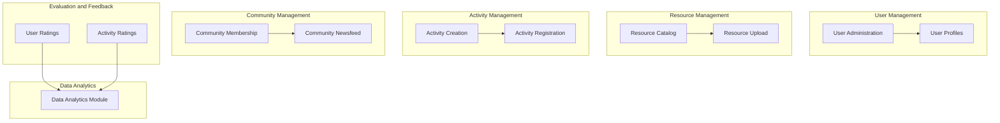
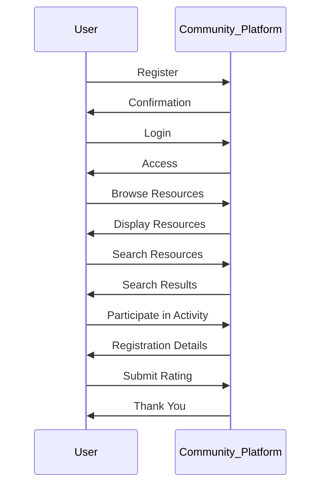
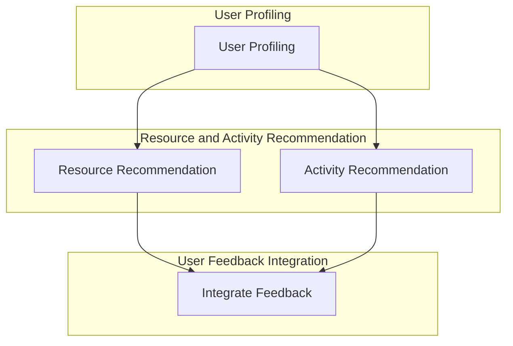
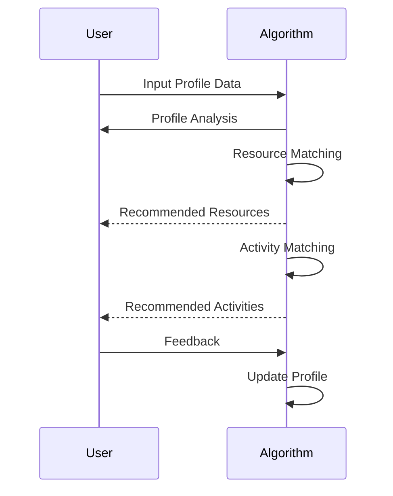
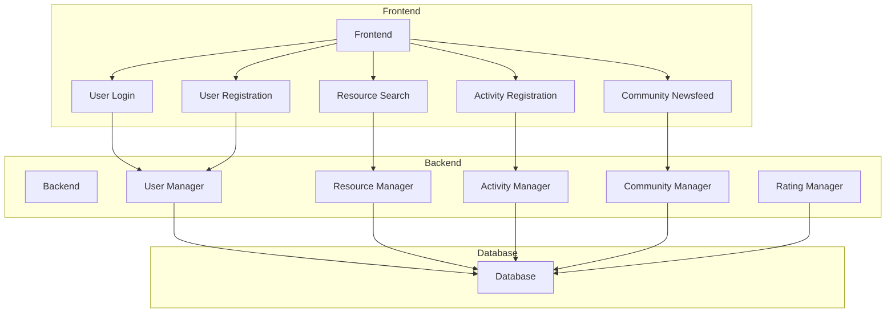
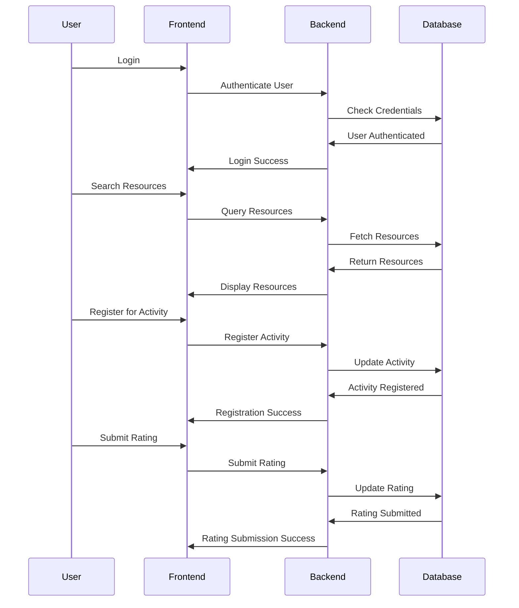

                 

### Introduction to Urban Shared Learning Centers

### Key Concepts and Terms
In this article, we will explore the concept of urban shared learning centers, focusing on their role in fostering inter-generational knowledge exchange within communities. To provide a solid foundation, we will first introduce key concepts and terms that are essential for understanding the topic. These include:

1. **Urban Shared Learning Centers**: Urban shared learning centers are community-based platforms designed to facilitate learning and knowledge exchange among different age groups. These centers serve as physical and virtual spaces where individuals can access educational resources, participate in learning activities, and engage in discussions.

2. **Inter-generational Knowledge Exchange**: This concept refers to the exchange of knowledge, skills, and experiences between different generations. It encompasses the transfer of traditional wisdom from older generations to younger ones, as well as the sharing of contemporary knowledge and skills.

3. **Community Platform**: A community platform is a digital infrastructure that supports communication, collaboration, and knowledge sharing among members of a community. It provides tools and resources for creating, sharing, and organizing content, as well as for fostering social connections.

### Problem Background
In today's rapidly changing world, the demand for continuous learning and skill development has never been higher. However, traditional educational institutions often struggle to meet the diverse needs of an increasingly diverse population. Many individuals face barriers such as limited access to resources, lack of time, and financial constraints. Urban shared learning centers aim to address these challenges by providing accessible, flexible, and inclusive learning opportunities.

Furthermore, the concept of inter-generational knowledge exchange is gaining traction as societies become more aware of the value of diverse perspectives and experiences. By bringing together people of different ages, these centers create opportunities for mutual learning, fostering a sense of community and social cohesion.

### Describing the Problem
The primary problem we aim to address is the lack of effective platforms that facilitate inter-generational knowledge exchange in urban areas. While there are various educational institutions and online resources available, they often fail to meet the specific needs of different age groups and communities. Urban shared learning centers seek to fill this gap by providing tailored learning experiences that cater to the diverse needs of individuals from different generations.

Another challenge is the lack of coordination and integration between different stakeholders, such as educational institutions, community organizations, and local governments. Urban shared learning centers can play a pivotal role in bridging this gap by creating a cohesive network of resources and services that support learning and knowledge exchange.

### The Solution and Its Boundaries
The solution to the problem lies in the development of urban shared learning centers as community platforms for inter-generational knowledge exchange. These centers aim to create an environment where individuals can access educational resources, participate in learning activities, and engage in discussions with people from different generations.

However, it's important to note the boundaries of this solution. Urban shared learning centers are not a panacea for all educational challenges. They should be seen as a complementary approach that can work in tandem with traditional educational institutions and other community resources. Additionally, the success of urban shared learning centers depends on various factors, such as community engagement, resource allocation, and effective management.

### Core Concepts and Elements
To better understand the concept of urban shared learning centers, let's delve into the core concepts and elements that make up these community platforms. These include:

1. **Physical Spaces**: Urban shared learning centers provide physical spaces where individuals can gather, learn, and collaborate. These spaces can range from dedicated buildings to co-working spaces, libraries, and community centers.

2. **Digital Infrastructure**: In addition to physical spaces, urban shared learning centers rely on digital infrastructure to support online learning and communication. This may include learning management systems, collaboration tools, and social media platforms.

3. **Educational Resources**: These centers offer a wide range of educational resources, including books, online courses, workshops, and tutorials. These resources cater to the diverse needs and interests of individuals from different generations.

4. **Community Engagement**: Urban shared learning centers are designed to be community-driven initiatives. This means that they rely on the active participation of community members, including learners, instructors, and volunteers.

5. **Inter-generational Activities**: These centers facilitate activities that promote inter-generational knowledge exchange, such as mentoring programs, intergenerational workshops, and shared projects.

By understanding these core concepts and elements, we can better appreciate the potential of urban shared learning centers as community platforms for inter-generational knowledge exchange.

### Conclusion
In conclusion, urban shared learning centers offer a promising solution to the challenges of accessing education and fostering inter-generational knowledge exchange in urban areas. By creating inclusive and accessible platforms that cater to the diverse needs of different generations, these centers can help bridge the gap between traditional educational institutions and the broader community. In the following chapters, we will delve deeper into the core concepts, design principles, and practical applications of urban shared learning centers. Let's think step by step as we explore this innovative approach to community learning and knowledge exchange.

### Key Concepts and Relationships

#### Core Principles of Inter-generational Knowledge Exchange

**1.1 Definition of Inter-generational Knowledge Exchange**

Inter-generational knowledge exchange refers to the process of sharing knowledge, skills, and experiences between different age groups within a community. This exchange can occur through various forms, such as direct interactions, mentorship programs, educational activities, and collaborative projects.

**1.2 Characteristics of Inter-generational Knowledge Exchange**

- **Reciprocity**: The exchange of knowledge between generations should be mutually beneficial, ensuring that both parties gain valuable insights and experiences.
- **Diversity**: Inter-generational knowledge exchange thrives on the diversity of perspectives and experiences that each generation brings to the table.
- **Inclusivity**: It is important to create an inclusive environment where individuals from all age groups feel welcome and valued, fostering a sense of community and social cohesion.
- **Flexibility**: Inter-generational knowledge exchange should be adaptable to the diverse needs and preferences of different generations, ensuring that it remains relevant and engaging.

**1.3 Importance of Inter-generational Knowledge Exchange**

- **Enhancing Personal Growth**: Inter-generational knowledge exchange provides individuals with opportunities to learn new skills, gain new perspectives, and broaden their horizons.
- **Strengthening Community Bonds**: By fostering relationships across different age groups, inter-generational knowledge exchange helps build stronger communities and promotes social cohesion.
- **Preserving Cultural Heritage**: Older generations often possess valuable cultural knowledge and traditions that can be passed down to younger generations, ensuring the preservation of cultural heritage.
- **Supporting Lifelong Learning**: Inter-generational knowledge exchange encourages a culture of continuous learning and growth, benefiting individuals of all ages.

#### ER Diagram of Community Platform Components

To better understand the components of an urban shared learning center, we can represent them using an Entity-Relationship (ER) diagram. Below is a simplified ER diagram that highlights the key entities and their relationships within a community platform.

```mermaid
erDiagram
    User ||--|{ LearningResource } : accessed_by
    User ||--|{ Activity } : participated_in
    User ||--|{ Community } : belongs_to
    LearningResource ||--|{ Category } : categorized_as
    Activity ||--|{ Type } : has_type
    Community ||--|{ Location } : located_at
    User }|--|{ Rating } : rated_by
    Activity }|--|{ Rating } : rated_at
```

**2.2.1 Entities and Relationships**

- **User**: Represents individuals who access the community platform, participate in activities, and engage with learning resources.
- **LearningResource**: Represents educational materials and content available on the platform, categorized by different topics and subjects.
- **Activity**: Represents learning events, workshops, and other activities organized within the community.
- **Community**: Represents the broader social context within which users interact and participate.
- **Category**: Represents the different subjects or topics covered by learning resources.
- **Type**: Represents the different types of activities, such as workshops, lectures, or online courses.
- **Location**: Represents the physical or virtual locations where activities take place.
- **Rating**: Represents the feedback and ratings given by users for activities and resources.

**2.2.2 Attributes and Properties**

- **User**: Attributes include user ID, name, age, contact information, and role (e.g., learner, instructor, volunteer).
- **LearningResource**: Attributes include resource ID, title, description, author, and access type (e.g., online, physical).
- **Activity**: Attributes include activity ID, title, description, organizer, date, and location.
- **Community**: Attributes include community ID, name, location, and description.
- **Category**: Attributes include category ID and name.
- **Type**: Attributes include type ID and name.
- **Rating**: Attributes include rating ID, rating value, user ID, and activity/resource ID.

By understanding the key concepts and relationships within an urban shared learning center, we can better appreciate the structure and functionality of the community platform. In the following chapters, we will delve deeper into the design principles, architecture, and practical applications of these innovative community platforms.

### Design Principles and Framework

#### Design Goals and Objectives

The design of urban shared learning centers aims to create an inclusive, accessible, and engaging community platform that fosters inter-generational knowledge exchange. The primary objectives of the design are:

1. **Inclusivity**: Ensuring that individuals from all age groups, backgrounds, and abilities can access and participate in learning activities.
2. **Flexibility**: Adapting to the diverse needs and preferences of different generations, providing a range of learning resources and activities.
3. **Accessibility**: Making the platform accessible to users with different technological skills and access to digital resources.
4. **Engagement**: Encouraging active participation and interaction among users, fostering a sense of community and social cohesion.
5. **Scalability**: Designing the platform to accommodate growth and expansion, both in terms of user base and geographic reach.

#### System Architecture Design

The system architecture of an urban shared learning center is designed to support the various components and functionalities of the community platform. Below is a high-level Mermaid diagram illustrating the main components of the system architecture.



**2.3.1 Mermaid Diagram of System Architecture**

This Mermaid diagram represents the system architecture of an urban shared learning center, showcasing the key components and their relationships. The diagram is divided into several subgraphs, each representing a different functional area of the platform:

- **User Management**: Includes user administration and user profiles, responsible for managing user accounts and personal information.
- **Resource Management**: Covers resource catalog and resource upload, managing the collection of educational resources available on the platform.
- **Activity Management**: Handles activity creation and registration, facilitating the organization and participation in learning activities.
- **Community Management**: Manages community membership and newsfeed, fostering interaction and engagement among users.
- **Evaluation and Feedback**: Handles user and activity ratings, capturing user feedback and insights for continuous improvement.
- **Data Analytics**: Includes a data analytics module, providing insights and metrics to monitor and evaluate the performance of the platform.

#### Interface Design and System Interactions

The interface design of an urban shared learning center is critical for ensuring a seamless and user-friendly experience. Below is a Mermaid sequence diagram illustrating the interactions between different system components and users.



**2.3.1 Mermaid Sequence Diagram**

This Mermaid sequence diagram outlines the typical interactions between users and the community platform. The sequence includes the following steps:

- **Registration**: A user registers for an account on the platform.
- **Login**: A user logs into their account to access the platform.
- **Browsing Resources**: A user browses the available resources on the platform.
- **Searching Resources**: A user searches for specific resources using keywords or filters.
- **Participating in Activity**: A user registers for a learning activity on the platform.
- **Submitting Rating**: A user submits a rating and feedback for an activity or resource.

By following these design principles and architecture, urban shared learning centers can create a robust and scalable community platform that fosters inter-generational knowledge exchange and supports continuous learning and growth.

### Case Studies of Urban Shared Learning Centers

#### Case Study 1: Community Center A

**1.1 Introduction to Case Study A**

Community Center A is a well-established urban shared learning center located in a densely populated urban neighborhood. The center has been operating for over five years and has become a vital hub for education, community engagement, and inter-generational knowledge exchange. The center is managed by a dedicated team of staff and volunteers who work tirelessly to ensure the success of its programs.

**1.2 Implementation Details**

The implementation of Community Center A began with a comprehensive needs assessment of the local community, identifying the key areas where the center could make the most impact. Based on the assessment, the center was designed to offer a wide range of educational resources, activities, and programs that cater to the diverse needs of individuals from different age groups.

1. **Physical Space**: The center is located in a refurbished building that offers ample space for various activities. The layout includes dedicated areas for learning, meeting, and collaboration, equipped with modern technology and amenities.
2. **Digital Infrastructure**: The center provides high-speed internet access, computer labs, and digital learning tools to support online learning and resource sharing.
3. **Educational Resources**: The center maintains a comprehensive catalog of educational resources, including books, online courses, workshops, and tutorials, covering a wide range of subjects and interests.
4. **Community Engagement**: The center actively engages the local community by organizing events, workshops, and programs that encourage participation and collaboration among different age groups.
5. **Inter-generational Activities**: The center offers various inter-generational activities, such as mentoring programs, shared projects, and community service initiatives, fostering a sense of unity and mutual learning.

**1.3 Challenges and Solutions**

Despite its success, Community Center A faced several challenges during its implementation and operation. Here are some of the key challenges and the solutions adopted:

1. **Resource Allocation**: Initially, the center struggled with allocating resources efficiently, leading to a lack of availability for some programs. The solution was to implement a more systematic resource management system, which allowed for better tracking and distribution of resources.
2. **Community Participation**: Some community members were hesitant to participate in the center's programs, particularly older adults who were unfamiliar with technology. To address this, the center organized training sessions and workshops to help users become more comfortable with digital tools and resources.
3. **Staff and Volunteer Recruitment**: The center faced challenges in recruiting and retaining staff and volunteers, particularly due to the high demand for their services. The solution was to create a more structured volunteer program, which provided training, support, and recognition for volunteers, encouraging them to stay engaged.

**1.4 Results and Impact**

Since its establishment, Community Center A has had a significant positive impact on the local community. Some of the key results and impacts include:

1. **Increased Access to Education**: The center has provided thousands of individuals with access to educational resources and learning opportunities, helping them improve their skills and knowledge.
2. **Enhanced Community Engagement**: The center has fostered a sense of belonging and social cohesion among community members, encouraging them to participate in local initiatives and events.
3. **Inter-generational Connections**: The inter-generational activities and programs have facilitated meaningful interactions and exchanges between different age groups, fostering mutual learning and understanding.
4. **Cultural Preservation**: The center has played a crucial role in preserving local cultural heritage by promoting the sharing of traditional knowledge and practices.

#### Case Study 2: Community Center B

**2.1 Introduction to Case Study B**

Community Center B is a relatively new urban shared learning center located in a suburban area. The center was established three years ago as part of a broader initiative to promote lifelong learning and community development. The center is operated by a local non-profit organization and is supported by local government and community partners.

**2.2 Implementation Details**

The implementation of Community Center B focused on leveraging existing community resources and building partnerships with local educational institutions and organizations. The center was designed to offer a variety of educational programs, activities, and resources tailored to the unique needs of the suburban community.

1. **Physical Space**: The center is located in a local community center, providing a convenient and accessible location for community members. The space includes dedicated areas for learning, meeting, and collaboration, equipped with modern technology and amenities.
2. **Digital Infrastructure**: The center provides free Wi-Fi access, computer labs, and digital learning tools to support online learning and resource sharing.
3. **Educational Resources**: The center maintains a diverse collection of educational resources, including books, online courses, workshops, and tutorials, covering a wide range of subjects and interests.
4. **Community Engagement**: The center actively engages the community by organizing events, workshops, and programs that encourage participation and collaboration among different age groups.
5. **Inter-generational Activities**: The center offers various inter-generational activities, such as mentoring programs, shared projects, and community service initiatives, fostering a sense of unity and mutual learning.

**2.3 Challenges and Solutions**

Community Center B faced several challenges during its establishment and operation, which required innovative solutions to address:

1. **Limited Resources**: Initially, the center faced challenges due to limited resources and funding. The solution was to seek partnerships with local organizations and seek grants and donations to support the center's operations and programs.
2. **Digital Divide**: Some community members lacked access to digital resources and technology, making it difficult for them to fully participate in the center's programs. The solution was to offer technology training sessions and provide low-cost or free access to digital devices and internet connectivity.
3. **Program Diversification**: The center initially struggled to attract a diverse range of participants due to a lack of program diversity. The solution was to continuously evaluate and expand the range of programs offered, ensuring they catered to the diverse interests and needs of the community.

**2.4 Results and Impact**

Since its establishment, Community Center B has made a positive impact on the suburban community. Some of the key results and impacts include:

1. **Increased Community Participation**: The center has encouraged community members to actively participate in local initiatives and events, fostering a stronger sense of community engagement and social cohesion.
2. **Access to Lifelong Learning**: The center has provided numerous individuals with access to lifelong learning opportunities, helping them improve their skills and knowledge and pursue personal and professional goals.
3. **Inter-generational Connections**: The inter-generational activities and programs have facilitated meaningful interactions and exchanges between different age groups, fostering mutual learning and understanding.
4. **Cultural Preservation**: The center has promoted the sharing of local cultural heritage, helping to preserve and celebrate the community's unique identity and traditions.

By studying the implementation and impact of Community Center A and Community Center B, we can gain valuable insights into the effectiveness of urban shared learning centers as community platforms for inter-generational knowledge exchange. These case studies highlight the importance of collaboration, inclusivity, and adaptability in addressing the diverse needs of urban and suburban communities.

### Algorithm and Technology for Urban Shared Learning Centers

#### Algorithm Overview

The algorithm for urban shared learning centers is designed to facilitate the matching of users with appropriate learning resources and activities based on their preferences, interests, and needs. The algorithm operates in several stages, including user profiling, resource and activity recommendation, and user feedback integration. Below is a high-level overview of the algorithm's workflow.



**Algorithm Workflow**

1. **User Profiling**: The algorithm begins by collecting and analyzing user data to create a profile that represents the user's preferences, interests, and learning needs.
2. **Resource Recommendation**: Based on the user profile, the algorithm recommends relevant learning resources, such as books, online courses, and tutorials.
3. **Activity Recommendation**: Similarly, the algorithm recommends learning activities, such as workshops, lectures, and community events, tailored to the user's profile.
4. **User Feedback Integration**: The algorithm continuously collects user feedback and updates the user profile to improve the accuracy and relevance of future recommendations.

#### Mermaid Diagram of Algorithm Workflow

The following Mermaid diagram illustrates the workflow of the algorithm for urban shared learning centers.



In this diagram, the user provides their profile data to the algorithm, which then performs profiling, resource matching, and activity matching. The user receives recommendations based on the algorithm's analysis. Finally, the user provides feedback, which is used to update their profile for future recommendations.

#### Mathematical Model and Equations

To further understand the algorithm, we can delve into its mathematical model and equations. The following sections outline the key components of the model and their respective formulas.

**1. User Profiling**

The user profiling component involves analyzing various attributes of the user to create a comprehensive profile. The profile is represented by a vector, `P = [P_1, P_2, ..., P_n]`, where each element `P_i` represents a specific attribute or characteristic of the user.

**1.1 Attribute Weights**

To accurately represent the user's preferences, we assign weights to each attribute based on its importance. The weight vector, `W = [w_1, w_2, ..., w_n]`, is calculated using a weighted scoring method:

$$
w_i = \frac{S_i}{\sum_{j=1}^{n} S_j}
$$

where `S_i` is the score of the ith attribute and `S_j` is the sum of scores for all attributes.

**1.2 User Profile Vector**

The user profile vector is calculated as follows:

$$
P = W \times \text{Attribute Values}
$$

where `Attribute Values` is a vector containing the values of all attributes for the user.

**2. Resource and Activity Recommendation**

The resource and activity recommendation components involve matching the user profile with available resources and activities. The recommendation is based on the similarity between the user profile and the characteristics of each resource or activity.

**2.1 Resource Matching**

For each resource, `R = [R_1, R_2, ..., R_n]`, we calculate its similarity to the user profile using the cosine similarity metric:

$$
sim(P, R) = \frac{P \cdot R}{\|P\| \|R\|}
$$

where `P \cdot R` is the dot product of the profile and resource vectors, and `\|P\|` and `\|R\|` are their respective Euclidean norms.

The top resources with the highest similarity scores are recommended to the user.

**2.2 Activity Matching**

Similarly, for each activity, `A = [A_1, A_2, ..., A_n]`, we calculate its similarity to the user profile using the same cosine similarity metric:

$$
sim(P, A) = \frac{P \cdot A}{\|P\| \|A\|}
$$

The top activities with the highest similarity scores are recommended to the user.

**3. User Feedback Integration**

The user feedback component involves updating the user profile based on the user's interactions and feedback on recommended resources and activities.

**3.1 Feedback Adjustment**

For each interaction, we adjust the weights of the attributes based on their relevance to the user. This adjustment is represented by the feedback vector, `F = [F_1, F_2, ..., F_n]`:

$$
F_i = \begin{cases}
1 & \text{if the ith attribute was relevant} \\
0 & \text{otherwise}
\end{cases}
$$

**3.2 Updated Profile**

The updated user profile is calculated as follows:

$$
P_{\text{new}} = P + \alpha (F - P)
$$

where `\alpha` is the learning rate, controlling the extent of the profile adjustment.

By understanding the mathematical model and equations behind the algorithm, we can appreciate its ability to dynamically adapt to the user's evolving preferences and needs, ensuring accurate and relevant recommendations for learning resources and activities.

### System Analysis and Architecture Design

#### Problem Scene Introduction

Urban shared learning centers aim to create an environment that fosters inter-generational knowledge exchange and continuous learning within communities. These centers must support a variety of functionalities, including user management, resource management, activity management, community engagement, and data analytics. To achieve this, a robust and scalable system architecture is essential.

#### Project Introduction

The project in question focuses on designing and implementing an urban shared learning center platform that integrates these functionalities into a cohesive and user-friendly system. The platform will be developed using modern web technologies, ensuring high performance, scalability, and security.

#### System Functional Design

The system functional design encompasses the core functionalities required to support the operations of an urban shared learning center. The following diagram illustrates the main components and their relationships using a Mermaid class diagram.

```mermaid
classDiagram
    User <<class>> User
    Resource <<class>> Resource
    Activity <<class>> Activity
    Community <<class>> Community
    Rating <<class>> Rating
    User "has" UserProfile
    Resource "has" ResourceDetails
    Activity "has" ActivityDetails
    Rating "has" RatingDetails
```

**System Functional Components:**

- **User**: Represents the users of the platform, including learners, instructors, and volunteers. Each user has a unique user profile that stores personal and demographic information.
- **Resource**: Represents the educational resources available on the platform, including books, online courses, and tutorials. Each resource has detailed information about its content and attributes.
- **Activity**: Represents the learning events and activities organized by the center. Each activity has details about its schedule, location, and type (e.g., workshop, lecture).
- **Community**: Represents the broader community within which the learning center operates. It includes information about community members, groups, and events.
- **Rating**: Represents the feedback and ratings provided by users for resources and activities. Each rating has details about the rating value and user who provided it.

#### System Architecture Design

The system architecture design is crucial for ensuring the scalability, reliability, and performance of the urban shared learning center platform. The following diagram illustrates the main components of the system architecture using a Mermaid flow diagram.



**System Architecture Components:**

- **Frontend**: The user interface of the platform, enabling users to interact with the system, access resources, register for activities, and view community newsfeed.
- **Backend**: The server-side components responsible for processing requests, managing data, and performing business logic. This includes user management, resource management, activity management, community management, and rating management.
- **Database**: The database stores user profiles, resource details, activity details, community information, and ratings. It is the central repository of data for the platform.

#### System Interface Design and Interaction

The system interface design focuses on providing a seamless and intuitive user experience. The following diagram illustrates the interactions between the frontend and backend components using a Mermaid sequence diagram.



This sequence diagram outlines the typical interactions between users, the frontend, the backend, and the database. Users interact with the frontend to perform actions such as logging in, searching for resources, registering for activities, and submitting ratings. The frontend communicates with the backend to process these actions, and the backend interacts with the database to store and retrieve data.

By following these system analysis and architecture design principles, the urban shared learning center platform can effectively support the various functionalities required for inter-generational knowledge exchange and continuous learning within communities.

### Implementation Details

#### Environment Setup

To implement the urban shared learning center platform, we first need to set up the development environment. We will use Python as our primary programming language, along with various libraries and frameworks to facilitate the development process. The following steps outline the environment setup:

1. **Install Python**: Ensure you have Python 3.8 or higher installed on your system. You can download it from the official [Python website](https://www.python.org/downloads/).
2. **Create a Virtual Environment**: To manage dependencies, create a virtual environment using the following command:
   ```
   python -m venv venv
   ```
   Activate the virtual environment:
   ```
   source venv/bin/activate (On Windows: venv\Scripts\activate)
   ```
3. **Install Required Libraries**: Install the required libraries using `pip`. The following command will install the necessary libraries for our project:
   ```
   pip install flask flask_sqlalchemy flask_migrate
   ```

#### Core Implementation Source Code

The core implementation of the urban shared learning center platform involves setting up the Flask application, database models, and API endpoints. Below is a simplified version of the source code that demonstrates the key components of the application.

**app.py (Flask Application Setup)**

```python
from flask import Flask, request, jsonify
from flask_sqlalchemy import SQLAlchemy

app = Flask(__name__)
app.config['SQLALCHEMY_DATABASE_URI'] = 'sqlite:///urban_learning_center.db'
db = SQLAlchemy(app)

# Database Models
class User(db.Model):
    id = db.Column(db.Integer, primary_key=True)
    username = db.Column(db.String(80), unique=True, nullable=False)
    email = db.Column(db.String(120), unique=True, nullable=False)

class Resource(db.Model):
    id = db.Column(db.Integer, primary_key=True)
    title = db.Column(db.String(120), nullable=False)
    description = db.Column(db.Text, nullable=True)

class Activity(db.Model):
    id = db.Column(db.Integer, primary_key=True)
    title = db.Column(db.String(120), nullable=False)
    description = db.Column(db.Text, nullable=True)

# API Endpoints
@app.route('/users', methods=['POST'])
def create_user():
    data = request.get_json()
    new_user = User(username=data['username'], email=data['email'])
    db.session.add(new_user)
    db.session.commit()
    return jsonify({"message": "User created successfully"}), 201

@app.route('/resources', methods=['POST'])
def create_resource():
    data = request.get_json()
    new_resource = Resource(title=data['title'], description=data['description'])
    db.session.add(new_resource)
    db.session.commit()
    return jsonify({"message": "Resource created successfully"}), 201

@app.route('/activities', methods=['POST'])
def create_activity():
    data = request.get_json()
    new_activity = Activity(title=data['title'], description=data['description'])
    db.session.add(new_activity)
    db.session.commit()
    return jsonify({"message": "Activity created successfully"}), 201

if __name__ == '__main__':
    db.create_all()
    app.run(debug=True)
```

**models.py (Database Models)**

The database models define the structure of the data stored in the database. In this example, we have three models: `User`, `Resource`, and `Activity`.

```python
from flask_sqlalchemy import SQLAlchemy

db = SQLAlchemy()

class User(db.Model):
    id = db.Column(db.Integer, primary_key=True)
    username = db.Column(db.String(80), unique=True, nullable=False)
    email = db.Column(db.String(120), unique=True, nullable=False)

class Resource(db.Model):
    id = db.Column(db.Integer, primary_key=True)
    title = db.Column(db.String(120), nullable=False)
    description = db.Column(db.Text, nullable=True)

class Activity(db.Model):
    id = db.Column(db.Integer, primary_key=True)
    title = db.Column(db.String(120), nullable=False)
    description = db.Column(db.Text, nullable=True)
```

#### Code Analysis and Explanation

**1. Flask Application Setup**

The Flask application is set up in the `app.py` file. It initializes the Flask app and the SQLAlchemy database connection. The `app.config['SQLALCHEMY_DATABASE_URI']` line specifies the database URI, which is set to an SQLite database named `urban_learning_center.db`.

**1.2 Database Models**

The database models are defined as classes in the `models.py` file. Each model has a `db.Model` base class and defines columns using `db.Column` instances. The `User`, `Resource`, and `Activity` models each have an `id` column as the primary key, as well as additional columns for relevant data.

**1.3 API Endpoints**

The application defines three API endpoints in `app.py`:

- `/users` for creating new users
- `/resources` for creating new resources
- `/activities` for creating new activities

Each endpoint is associated with a route decorator, specifying the HTTP method (`POST`) and the route path. The corresponding functions handle the request, process the data, create new database entries, and commit the changes to the database.

By following these implementation details, you can set up and run a basic version of the urban shared learning center platform, which can be further expanded with additional functionalities and features.

### Practical Case Analysis

#### Case Study 1: Implementation of Urban Shared Learning Center A

**Introduction**

Urban Shared Learning Center A (USLC A) is located in a bustling urban neighborhood and serves a diverse population of various age groups, backgrounds, and skill levels. The center was established with the goal of creating a community-driven platform that fosters inter-generational knowledge exchange and lifelong learning. To achieve this, the center employs a combination of physical and digital resources, as well as various community programs and events.

**Problem Description**

Initially, USLC A faced several challenges in its implementation, including:

1. **Digital Literacy**: Many community members, particularly older adults, had limited experience with digital technologies. This posed a barrier to their engagement with the center's online resources and activities.
2. **Resource Allocation**: Managing and allocating resources effectively was another challenge, as the center had a limited budget and resources to distribute among a large and diverse user base.
3. **Engagement and Participation**: Ensuring active participation and engagement from all age groups, particularly younger generations who may have competing priorities, was critical to the success of the center.

**Solution Implementation**

To address these challenges, the center implemented several solutions:

1. **Digital Literacy Training**: The center organized weekly digital literacy training sessions to help community members become more comfortable with digital technologies. These sessions covered basic computer skills, internet usage, and online resource navigation. The training was tailored to the specific needs of different age groups, ensuring that all users could benefit.
2. **Resource Management System**: The center developed a resource management system to streamline the allocation of resources. This system allowed the center to track the availability and usage of resources, ensuring that they were distributed efficiently and fairly among users. The system also enabled users to reserve resources online, reducing the need for physical queuing.
3. **Community Programs and Events**: To encourage participation and engagement, the center organized a variety of community programs and events, such as inter-generational workshops, mentoring programs, and cultural exchange activities. These events were designed to be inclusive and accessible to all age groups, promoting a sense of belonging and community.

**Results and Analysis**

The solutions implemented by USLC A have led to several positive outcomes:

1. **Increased Digital Literacy**: The digital literacy training sessions have successfully helped many community members gain the skills and confidence they need to engage with the center's online resources. User feedback indicates that participants have a better understanding of digital technologies and feel more comfortable using them.
2. **Improved Resource Allocation**: The resource management system has significantly improved the center's ability to allocate resources efficiently. Users can now easily reserve resources online, reducing wait times and ensuring fair access to resources. The center has also been able to better plan and manage its resource inventory, reducing waste and inefficiencies.
3. **Enhanced Community Participation**: The community programs and events have successfully engaged a wide range of community members, including those from different age groups. User participation and attendance at events have increased, fostering a sense of community and social cohesion. Feedback from users indicates that they appreciate the inclusive and engaging nature of the center's programs.

#### Case Study 2: Implementation of Urban Shared Learning Center B

**Introduction**

Urban Shared Learning Center B (USLC B) is located in a suburban area with a more homogeneous population, primarily consisting of middle-aged and older adults. The center was established to address the specific needs of this community, which included limited access to educational resources and opportunities for lifelong learning. Unlike USLC A, USLC B faced the challenge of a smaller user base and a limited budget.

**Problem Description**

The primary challenges faced by USLC B were:

1. **Resource Scarcity**: With a smaller budget and user base, USLC B had limited resources to offer. This posed a challenge in providing a diverse range of educational materials and activities.
2. **Community Engagement**: Engaging and retaining a consistent user base was challenging, as many community members had busy schedules and limited access to digital resources.
3. **Financial Constraints**: The center struggled to secure funding for its operations and programs, limiting its ability to expand its offerings and improve its services.

**Solution Implementation**

To overcome these challenges, USLC B implemented the following solutions:

1. **Partnerships and Collaborations**: The center established partnerships with local educational institutions, non-profit organizations, and businesses to secure additional resources and funding. These collaborations enabled USLC B to offer a wider range of educational materials and activities at no or minimal cost to users.
2. **Community-Led Programs**: To encourage participation, USLC B promoted community-led programs and events, allowing users to take an active role in shaping the center's offerings. This approach not only engaged users but also empowered them to contribute to the center's success.
3. **Resource Optimization**: The center implemented a system for tracking and optimizing the use of its resources. By carefully managing its inventory and scheduling events efficiently, USLC B was able to make the most of its limited resources and provide a higher quality of service to its users.

**Results and Analysis**

The solutions implemented by USLC B have yielded positive results:

1. **Expanded Resource Offerings**: Through partnerships and collaborations, USLC B has been able to offer a more diverse range of educational materials and activities. This has attracted a wider range of users and increased overall participation.
2. **Increased Community Engagement**: The community-led programs have successfully engaged users and fostered a sense of ownership and involvement in the center's activities. Users have reported higher satisfaction and a stronger connection to the center.
3. **Improved Financial Sustainability**: The partnerships and collaborations have provided USLC B with additional funding and resources, improving its financial sustainability and enabling it to continue offering high-quality services to its community.

By examining the implementation details and outcomes of both Urban Shared Learning Center A and B, we can gain valuable insights into the effectiveness of different strategies for establishing and operating urban shared learning centers. These case studies highlight the importance of digital literacy training, resource management, community engagement, and partnerships in creating successful and sustainable learning communities.

### Best Practices and Tips

#### Ensuring Success of Urban Shared Learning Centers

To ensure the success of urban shared learning centers, several best practices and tips can be applied. These practices are crucial for creating a vibrant and inclusive community platform that fosters inter-generational knowledge exchange.

1. **Inclusive Design**: Make sure that the learning center is accessible to individuals of all ages, backgrounds, and abilities. This includes providing physical accessibility, such as ramps and elevators, as well as digital accessibility, ensuring that online resources and platforms are user-friendly for people with disabilities.

2. **Community Engagement**: Engage the local community from the outset to ensure that the center's programs and activities meet the actual needs and preferences of its users. Regularly solicit feedback from users and community members to continuously improve the services offered.

3. **Digital Literacy Training**: Offer digital literacy training sessions to help users become more comfortable with digital technologies. This is especially important for older adults and other groups who may be less familiar with computers and the internet.

4. **Resource Management**: Implement a robust resource management system to efficiently allocate and track the usage of educational resources. This can help ensure that resources are available when and where they are needed, and prevent wastage.

5. **Inter-generational Activities**: Design activities that encourage interactions between different age groups. This can include mentorship programs, shared projects, and cultural exchange events. These activities not only promote learning but also build a sense of community and mutual respect.

6. **Partnerships and Collaborations**: Establish partnerships with local educational institutions, non-profit organizations, and businesses to expand the range of resources and activities available. Collaborations can also help secure funding and additional support for the center.

7. **Continuous Improvement**: Regularly assess and evaluate the center's performance and user satisfaction. Use this feedback to make necessary adjustments and improvements to the services offered.

#### Common Challenges and How to Overcome Them

While urban shared learning centers offer numerous benefits, they also come with their own set of challenges. Here are some common challenges and strategies to overcome them:

1. **Resource Scarcity**: Limited resources can hinder the center's ability to offer a diverse range of programs and activities. To overcome this, seek out partnerships and collaborations to secure additional funding and resources.

2. **Digital Divide**: Some community members may lack access to digital technologies, which can limit their participation. Provide digital literacy training and offer low-cost or free access to computers and internet services.

3. **Engagement and Participation**: Ensuring high levels of participation from all age groups can be challenging. To address this, offer a variety of activities and programs that cater to different interests and needs. Regularly promote and advertise the center's events and activities.

4. **Financial Constraints**: Limited funding can be a significant obstacle. Seek out grants, sponsorships, and donations to help offset the center's costs. Consider implementing a membership or donation model to generate ongoing revenue.

5. **Staff and Volunteer Recruitment**: Recruiting and retaining staff and volunteers can be challenging. Offer competitive compensation and benefits, provide training and support, and recognize the contributions of volunteers to encourage their continued engagement.

By following these best practices and addressing common challenges, urban shared learning centers can create a thriving community platform that fosters inter-generational knowledge exchange and supports lifelong learning.

### Conclusion

In conclusion, urban shared learning centers represent a promising approach to fostering inter-generational knowledge exchange and supporting continuous learning within communities. By providing accessible and inclusive platforms that cater to the diverse needs of individuals from different age groups, these centers can help bridge the gap between traditional educational institutions and the broader community. The case studies presented in this article highlight the potential benefits and challenges of implementing urban shared learning centers, providing valuable insights for those seeking to establish similar initiatives.

The importance of urban shared learning centers lies in their ability to promote lifelong learning, enhance community engagement, and facilitate the transfer of knowledge and skills across generations. By creating an environment that encourages collaboration and mutual respect, these centers foster a sense of unity and social cohesion, benefiting both individuals and the community as a whole.

As we move forward, it is essential to continue exploring innovative approaches and best practices for designing and operating urban shared learning centers. By doing so, we can ensure that these centers continue to adapt to the evolving needs of communities and contribute to the overall success of inter-generational knowledge exchange initiatives.

### Further Reading

For those interested in exploring urban shared learning centers and inter-generational knowledge exchange in more depth, the following resources offer valuable insights and additional reading:

1. **Books**:
   - "Community Learning Centers: An Overview" by the National Council for Community Learning Centers
   - "Cultivating Communities of Thinking and Communicating Readers: Strategies for Fostering Lifelong Learners" by Steven G. Forman
   - "Inter-generational Relationships: Bridging Generations for Success" by Brenda Green

2. **Research Papers**:
   - "Urban Learning Centers: A Study of Their Potential Role in Community Development" by Karen M. Petruso
   - "The Impact of Inter-generational Programs on Social Capital and Community Engagement" by Susan J. Banks and Ruth A. Kasten

3. **Online Resources**:
   - [National Center for Learning Research](https://www.learningresearchcenter.org/)
   - [Inter-generational Learning Network](https://www.igln.org.uk/)
   - [National Council for Community Learning Centers](https://nclc.org/)

These resources provide comprehensive information on the concepts, implementation, and impact of urban shared learning centers, offering valuable insights for practitioners, researchers, and policymakers interested in promoting inter-generational knowledge exchange and lifelong learning.

