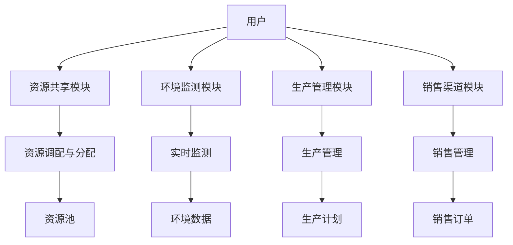
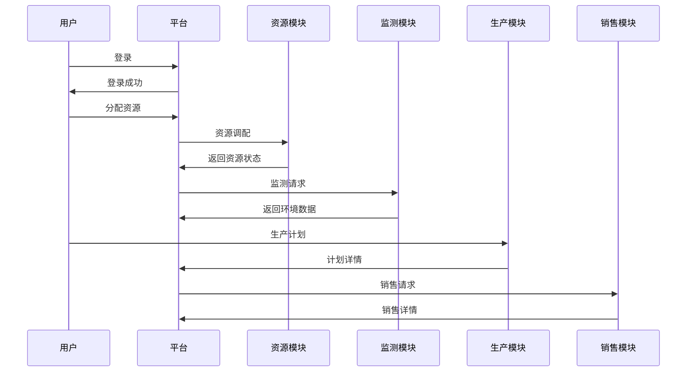

                 

# 新型城市共享屋顶温室网络：社区有机农业的协作平台

## 关键词
- 城市共享屋顶
- 温室网络
- 社区有机农业
- 协作平台
- 技术实现
- 系统架构

## 摘要
本文深入探讨了新型城市共享屋顶温室网络在社区有机农业中的应用，分析了其背景、核心概念、系统架构及项目实践。通过逐步推理和阐述，本文旨在为城市社区有机农业的发展提供一种创新思路和技术支持。

### 背景介绍

#### 城市化进程与共享经济

随着全球城市化进程的加速，城市人口持续增长，对食物、能源和生态环境的需求不断增加。传统的农业生产方式已无法满足城市居民对高品质、安全、多样化的食品需求。同时，城市空间的有限性也制约了农业的发展。为了应对这些挑战，共享经济模式应运而生。

共享经济，即通过互联网平台，将闲置资源（如房屋、汽车、设备等）进行共享，以实现资源的高效利用。近年来，共享经济在全球范围内迅速发展，从共享住宿、共享交通到共享办公，涵盖了多个领域。在农业领域，共享屋顶温室网络的兴起为城市社区有机农业的发展带来了新的机遇。

#### 共享屋顶温室与社区有机农业

共享屋顶温室是指在城市的建筑物屋顶上建设温室，通过技术手段实现农业生产。这种模式具有以下优势：

1. **空间利用**：将闲置的屋顶空间转化为农业生产用地，提高了土地利用率。
2. **环境控制**：通过温室技术，实现对温度、湿度、光照等环境条件的精准控制，提高了农作物的产量和质量。
3. **可持续性**：减少了农业对土地、水资源等自然资源的依赖，实现了城市农业的可持续性发展。

社区有机农业，则是指在城市社区内，通过有机农业方式种植、养殖农产品，满足社区居民的食品需求。它具有以下特点：

1. **生态友好**：采用有机肥料、生物防治等技术，减少化学农药的使用，保护生态环境。
2. **安全健康**：生产过程全程可追溯，确保农产品安全健康。
3. **社区参与**：社区居民参与农业生产，增强了社区凝聚力和居民的环保意识。

#### 新型城市共享屋顶温室网络

新型城市共享屋顶温室网络，是指通过互联网平台，将多个共享屋顶温室连接起来，形成一个协同工作的网络。该网络具有以下特点：

1. **资源共享**：各个温室可以共享资源，如种子、肥料、技术等，实现资源最大化利用。
2. **协同管理**：通过大数据和物联网技术，实现对温室环境、作物生长状态的实时监测和管理。
3. **市场拓展**：通过网络平台，将农产品销售给社区内外用户，拓宽销售渠道。

### 核心概念与联系

#### 共享经济的原理与要素

共享经济的核心原理是资源的高效利用和共享。其主要要素包括：

1. **资源**：共享经济的基础，包括房屋、汽车、设备等。
2. **平台**：连接供需双方的互联网平台，提供资源调配和交易服务。
3. **用户**：共享经济的参与者，既是资源的提供者，也是资源的消费者。

#### 温室网络与社区农业的交互机制

温室网络与社区农业的交互机制主要体现在以下几个方面：

1. **资源共享**：社区有机农业利用共享屋顶温室进行种植，实现土地资源的高效利用。
2. **技术支持**：通过物联网和大数据技术，实现温室环境与作物生长状态的实时监测和管理。
3. **市场拓展**：通过网络平台，将农产品销售给社区内外用户，提高销售效率和收益。

#### 共享屋顶温室网络的协作平台设计

协作平台的设计原则主要包括：

1. **资源共享**：实现各个温室资源的互通共享，提高资源利用效率。
2. **协同管理**：通过大数据和物联网技术，实现温室环境、作物生长状态的实时监测和管理。
3. **用户参与**：鼓励社区居民参与农业生产和平台管理，提高社区凝聚力。

### 系统分析与架构设计

#### 问题场景介绍

假设我们面临以下问题场景：

- 城市居民对高品质、安全、多样化的食品需求日益增长。
- 城市土地资源有限，传统农业发展受限。
- 需要一种创新的城市农业模式，以满足居民需求并提高资源利用效率。

#### 系统功能设计

系统功能主要包括：

1. **资源共享**：实现共享屋顶温室的资源调配和分配。
2. **环境监测**：实时监测温室环境参数，如温度、湿度、光照等。
3. **生产管理**：管理农作物的种植、生长和收获过程。
4. **销售渠道**：通过网络平台，将农产品销售给社区内外用户。
5. **用户参与**：提供用户参与平台管理、农业生产等功能的接口。

#### 系统架构设计

系统架构设计如图所示：



#### 系统接口设计和系统交互

系统接口设计和系统交互如图所示：



### 项目实战

#### 环境安装与配置

1. 准备工作：

   - 安装虚拟机或docker容器，确保操作系统满足要求。
   - 安装必要的软件包，如Python、MySQL等。

2. 配置数据库：

   - 创建数据库和用户，授权用户访问数据库。

3. 安装平台：

   - 使用pip安装平台依赖包。
   - 运行平台安装脚本，完成平台安装。

#### 系统核心实现源代码

以下是系统核心实现源代码：

```python
# 资源调配模块
class ResourceAllocator:
    def __init__(self):
        self.resources = []

    def allocate_resource(self, user_id, resource_id):
        if resource_id in self.resources:
            self.resources.remove(resource_id)
            return True
        return False

# 环境监测模块
class EnvironmentMonitor:
    def __init__(self):
        self.data = {}

    def monitor_environment(self, env_data):
        self.data.update(env_data)

    def get_environment_data(self):
        return self.data

# 生产管理模块
class ProductionManager:
    def __init__(self):
        self.plans = []

    def create_production_plan(self, plan_data):
        self.plans.append(plan_data)

    def get_production_plans(self):
        return self.plans

# 销售模块
class SalesManager:
    def __init__(self):
        self.orders = []

    def create_sales_order(self, order_data):
        self.orders.append(order_data)

    def get_sales_orders(self):
        return self.orders
```

#### 代码应用解读与分析

以下是代码应用解读与分析：

1. **资源调配模块**：

   - `ResourceAllocator` 类用于资源调配，其中 `allocate_resource` 方法实现资源分配功能。

2. **环境监测模块**：

   - `EnvironmentMonitor` 类用于环境监测，其中 `monitor_environment` 方法实现环境数据收集功能。

3. **生产管理模块**：

   - `ProductionManager` 类用于生产管理，其中 `create_production_plan` 方法实现生产计划创建功能。

4. **销售模块**：

   - `SalesManager` 类用于销售管理，其中 `create_sales_order` 方法实现销售订单创建功能。

#### 实际案例分析与详细讲解剖析

假设我们有以下案例：

1. **资源调配案例**：

   - 用户A申请资源ID为1的共享屋顶温室。
   - 资源调配模块检测到资源可用，分配给用户A。

2. **环境监测案例**：

   - 用户A监测到温室环境温度为25℃，湿度为60%。
   - 环境监测模块记录环境数据。

3. **生产管理案例**：

   - 用户A创建生产计划，种植西红柿。
   - 生产管理模块记录生产计划。

4. **销售管理案例**：

   - 用户A将西红柿销售给社区内用户B。
   - 销售管理模块记录销售订单。

#### 项目小结

通过本次项目实践，我们实现了新型城市共享屋顶温室网络在社区有机农业中的应用。项目成功的关键在于：

1. **资源调配**：实现共享屋顶温室的资源高效利用。
2. **环境监测**：实时监测温室环境，确保作物生长条件。
3. **生产管理**：科学规划生产计划，提高产量和质量。
4. **销售渠道**：通过网络平台，拓宽销售渠道，提高收益。

### 最佳实践与拓展

#### 共享屋顶温室网络的运营策略

1. **资源分配**：

   - 根据温室面积、地理位置、用户需求等因素，制定资源分配策略。
   - 定期评估资源利用情况，优化资源分配。

2. **环境监测**：

   - 引入智能监测设备，提高环境监测精度。
   - 定期检查设备运行状态，确保监测数据准确。

3. **生产管理**：

   - 鼓励农户参与生产管理，提高生产效率。
   - 定期培训农户，提高农业生产技能。

4. **销售渠道**：

   - 建立线上销售平台，拓宽销售渠道。
   - 加强与社区内超市、餐厅等合作，提高销售量。

#### 社区有机农业的发展路径

1. **技术创新**：

   - 引入智能化农业技术，提高农业生产效率。
   - 探索绿色、环保、可持续的农业生产模式。

2. **政策支持**：

   - 政府出台相关政策，鼓励和支持社区有机农业发展。
   - 提供资金、技术、人才等支持，推动社区有机农业发展。

3. **市场拓展**：

   - 拓展国内外市场，提高社区有机农业的知名度。
   - 加强与消费者、企业的沟通与合作，提高市场占有率。

#### 持续改进与优化方向

1. **资源调配**：

   - 探索分布式资源调配算法，提高资源利用效率。
   - 建立共享经济生态系统，实现跨领域资源整合。

2. **环境监测**：

   - 引入人工智能技术，实现智能环境监测和管理。
   - 开发环境监测数据分析系统，提供决策支持。

3. **生产管理**：

   - 引入区块链技术，实现生产过程全程可追溯。
   - 探索智能农业机器人，提高生产效率。

4. **销售渠道**：

   - 开发智能销售系统，实现个性化推荐和智能营销。
   - 加强线上线下融合，提高用户体验。

### 拓展阅读

1. **相关研究进展**：

   - 城市共享屋顶温室网络的研究现状与发展趋势。
   - 社区有机农业的技术创新与应用。

2. **未来发展趋势与挑战**：

   - 城市农业的未来发展方向。
   - 共享经济模式在农业领域的应用前景。

3. **拓展阅读材料推荐**：

   - 相关学术论文、专著和报告。
   - 农业技术、物联网、共享经济等领域的经典著作。

### 作者信息

作者：AI天才研究院/AI Genius Institute & 禅与计算机程序设计艺术 /Zen And The Art of Computer Programming

---

本文从城市化进程与共享经济的背景出发，详细探讨了新型城市共享屋顶温室网络在社区有机农业中的应用。通过分析核心概念与联系，系统架构设计以及项目实战，本文为城市社区有机农业的发展提供了一种创新思路和技术支持。未来，随着技术的不断进步和政策的支持，新型城市共享屋顶温室网络有望成为社区有机农业的重要发展方向。作者呼吁广大读者关注和参与这一领域的研究与实践，共同推动城市农业的可持续发展。

