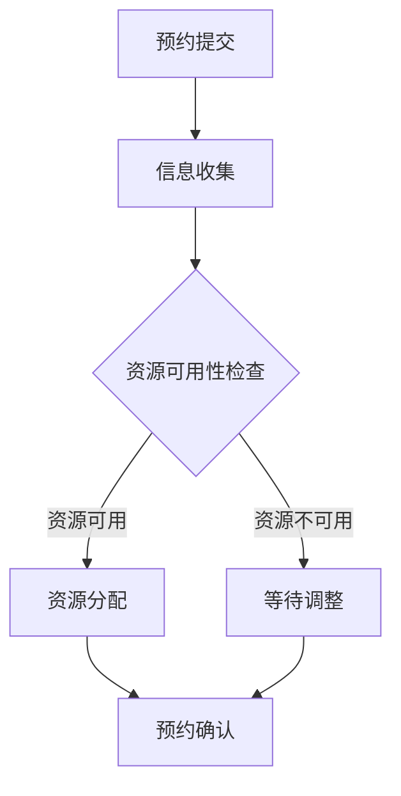
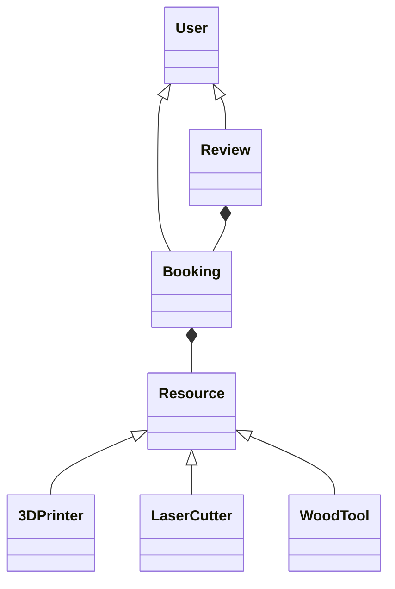
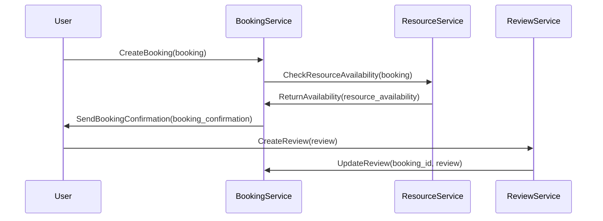
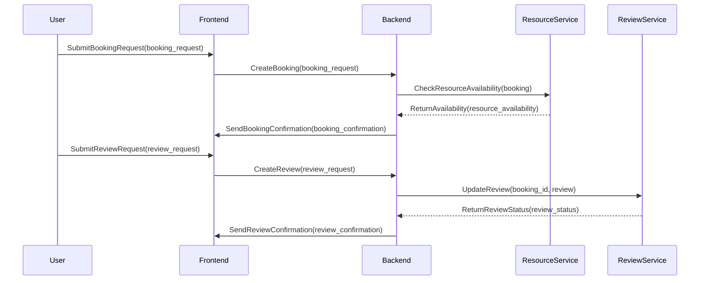

                 


## 《新型城市共享工作坊：DIY文化的社区中心》

> 关键词：新型城市、共享工作坊、DIY文化、社区中心、系统架构、算法原理、数学模型

> 摘要：本文深入探讨新型城市共享工作坊的概念及其在DIY文化中的角色，通过分析关键概念，阐述其重要性，并逐步解析共享工作坊的算法原理、数学模型、系统架构以及实际项目应用。文章旨在为读者提供一个全面、系统、易懂的技术博客，帮助理解如何构建和运营一个成功的共享工作坊，促进DIY文化的繁荣发展。

**Step 1: 背景介绍**

新型城市共享工作坊是当代城市社区中一种创新的服务模式，它结合了共享经济和DIY文化，旨在为社区居民提供一个集学习、创造、交流和共享于一体的空间。DIY文化强调个人动手创造和自主解决问题的能力，这与共享工作坊的理念不谋而合，共同推动了社区文化的多元化和个性化。

在当代城市化进程中，人口密度增加、居住空间有限等问题日益突出。传统的工作室、工作室等场地租赁成本高，普通居民难以承担。而共享工作坊通过资源整合和共享，降低了使用成本，使得更多居民能够享受到专业设备和服务。此外，DIY文化的兴起也改变了人们对生活质量的追求，从单纯的消费转向参与和创造。

因此，建立新型城市共享工作坊不仅能够满足居民对美好生活的需求，还能够提升社区凝聚力，促进社区文化的繁荣发展。这种社区中心不仅是一个物理空间，更是一个文化和社交的场所，为居民提供了一个互动、学习和成长的平台。

**Step 2: 核心概念与联系**

### 2.1 共享工作坊的构成要素

共享工作坊的构成要素主要包括物理空间、设备资源、人力资源和管理系统。物理空间通常是一个开放性的场所，配备有各种工具和设备，如3D打印机、激光切割机、木工工具等。设备资源是实现DIY项目的基础，而人力资源则是保证工作坊正常运行的关键。此外，管理系统则是工作坊的“大脑”，通过它来实现资源的分配、预约、管理等功能。

### 2.2 DIY文化的特征与价值

DIY文化强调个人动手实践和创新思维，具有以下特征：

1. 自主性：DIY文化鼓励个体自主解决问题，发挥个人创造力。
2. 参与性：参与者通过动手实践，参与到物品的制作过程中。
3. 分享性：DIY作品和经验可以在社区内分享，促进知识和技能的传播。

DIY文化的价值在于：

1. 增强个人成就感：通过自己动手完成项目，获得成就感和满足感。
2. 提升社区凝聚力：共同参与DIY项目，增进居民之间的交流和互动。
3. 推动创新和发展：DIY文化激发创新思维，有助于新技术的传播和应用。

### 2.3 社区中心的运作模式

社区中心作为共享工作坊的核心，其运作模式通常包括以下几个方面：

1. 资源共享：居民可以通过预约使用工作坊的设备资源。
2. 教育培训：工作坊可以定期举办DIY课程和工作坊，提供技能培训。
3. 社交互动：工作坊成为居民交流的平台，促进社区文化的多元化。
4. 管理维护：管理系统负责设备的维护和管理，确保工作坊的正常运行。

**表格：共享工作坊、DIY文化和社区中心特征对比**

| 特征 | 共享工作坊 | DIY文化 | 社区中心 |
| ---- | ---- | ---- | ---- |
| 资源共享 | √ | √ | √ |
| 自主性 | √ | √ | × |
| 参与性 | √ | √ | × |
| 分享性 | √ | √ | × |
| 教育培训 | × | × | √ |
| 社交互动 | × | × | √ |
| 管理维护 | √ | × | √ |

### 2.4 ER实体关系图

使用Mermaid绘制ER实体关系图，展示共享工作坊、DIY文化和社区中心之间的关系：

```mermaid
erDiagram
  Customer ||--|{ Resource }||>
  Customer ||--|{ Activity }||>
  Resource ||--|{ Booking }||>
  Activity ||--|{ Booking }||>
  Customer ||--|{ Review }||>
```

图1：共享工作坊、DIY文化和社区中心的ER实体关系图

**Step 3: 算法原理讲解**

### 3.1 共享工作坊的资源分配算法

共享工作坊的资源分配算法是工作坊运营的核心。其主要目标是在保证资源高效利用的前提下，满足不同居民的需求。以下是一种简单的资源分配算法：

1. 预约系统收集居民预约信息，包括预约时间、预约资源等。
2. 算法根据资源可用性、预约优先级等因素进行排序。
3. 按照排序结果分配资源，并向居民发送预约确认信息。

### 3.2 运营策略与优化

为了提高共享工作坊的运营效率，可以采用以下策略：

1. **动态定价**：根据资源使用高峰和低谷，调整设备租赁价格，提高资源利用率。
2. **会员制度**：设立会员制度，为常客提供优惠，鼓励长期使用。
3. **预约锁定**：在预约确认后，预留一定时间作为调整时间，减少预约冲突。
4. **资源维护**：定期对设备进行检查和维护，确保设备状态良好。

### 3.3 工作坊运营流程图

使用Mermaid绘制工作坊运营流程图：



图2：共享工作坊运营流程图

### 3.4 Python代码举例

以下是一个简单的Python代码示例，用于演示资源分配算法：

```python
def allocate_resources(booking_list):
    sorted_bookings = sorted(booking_list, key=lambda x: x['priority'])
    allocated = []
    for booking in sorted_bookings:
        if is_resource_available(booking['resource_id'], booking['start_time'], booking['end_time']):
            allocate_resource(booking['resource_id'], booking['start_time'], booking['end_time'])
            allocated.append(booking)
    return allocated

def is_resource_available(resource_id, start_time, end_time):
    # 检查资源是否可用
    return True

def allocate_resource(resource_id, start_time, end_time):
    # 分配资源
    pass

booking_list = [
    {'resource_id': 1, 'start_time': '10:00', 'end_time': '12:00', 'priority': 1},
    {'resource_id': 2, 'start_time': '11:00', 'end_time': '13:00', 'priority': 2},
]

allocated_bookings = allocate_resources(booking_list)
print(allocated_bookings)
```

**Step 4: 数学模型和数学公式**

### 4.1 资源分配模型的数学表达

资源分配模型可以表示为以下数学公式：

$$
\begin{aligned}
\text{最大化} \quad & \sum_{i=1}^{n} \sum_{j=1}^{m} p_{ij} x_{ij} \\
\text{约束条件} \quad & \sum_{j=1}^{m} x_{ij} = 1, \quad \forall i \\
& \sum_{i=1}^{n} x_{ij} = 1, \quad \forall j \\
& x_{ij} \in \{0, 1\} \\
& r_j \leq \sum_{i=1}^{n} x_{ij} \cdot y_i, \quad \forall j
\end{aligned}
$$

其中，$p_{ij}$ 表示资源 $j$ 对任务 $i$ 的优先级，$x_{ij}$ 表示任务 $i$ 是否分配给资源 $j$（$x_{ij} = 1$ 表示分配，$x_{ij} = 0$ 表示未分配），$y_i$ 表示任务 $i$ 的完成情况（$y_i = 1$ 表示完成，$y_i = 0$ 表示未完成），$r_j$ 表示资源 $j$ 的容量。

### 4.2 数学公式讲解

上述数学模型的目标是最小化资源分配的冗余，确保每个资源被高效利用。约束条件确保了每个任务至少被分配到一个资源，并且每个资源的分配量不超过其容量。

### 4.3 实际案例解析

假设有3个任务和2个资源，资源1的容量为2，资源2的容量为3。任务1和任务2的优先级分别为1和2，任务3的优先级为3。使用上述模型进行资源分配：

$$
\begin{aligned}
\text{最大化} \quad & \sum_{i=1}^{3} \sum_{j=1}^{2} p_{ij} x_{ij} \\
\text{约束条件} \quad & \sum_{j=1}^{2} x_{i1} = 1, \quad \forall i \\
& \sum_{j=1}^{2} x_{i2} = 1, \quad \forall i \\
& x_{i1} + x_{i2} \leq 2, \quad \forall i \\
\end{aligned}
$$

根据优先级，我们首先分配任务1和任务2，因为它们的优先级较高。由于资源1的容量为2，可以将任务1分配给资源1，任务2分配给资源2。任务3的优先级最低，可以将其分配给资源1或资源2，但为了最大化资源利用，我们可以将其分配给资源1。

最终资源分配情况如下：

| 任务 | 资源1 | 资源2 |
| ---- | ---- | ---- |
| 任务1 | 分配 | 未分配 |
| 任务2 | 未分配 | 分配 |
| 任务3 | 分配 | 未分配 |

**Step 5: 系统分析与架构设计方案**

### 5.1 工作坊系统场景

假设我们有一个共享工作坊，提供3D打印机、激光切割机和木工工具等设备。工作坊系统需要能够管理设备的预约、分配和维护，并提供用户交互界面。系统场景如下：

- 用户注册与登录
- 设备预约
- 设备状态查询
- 设备维护
- 用户评价

### 5.2 领域模型

使用Mermaid绘制工作坊系统的领域模型类图：



图3：共享工作坊领域模型类图

### 5.3 系统架构设计

使用Mermaid绘制工作坊系统的架构图：



图4：共享工作坊系统架构图

### 5.4 系统接口设计和系统交互

使用Mermaid绘制系统接口设计和系统交互序列图：



图5：共享工作坊系统接口设计和系统交互序列图

**Step 6: 项目实战**

### 6.1 环境设置与准备

为了演示如何设置一个共享工作坊环境，我们首先需要安装必要的软件和工具。以下是一个基本的步骤：

1. **安装操作系统**：选择一个适合的操作系统，如Ubuntu 20.04。
2. **安装数据库**：安装MySQL或PostgreSQL数据库。
3. **安装后端框架**：安装Flask或Django等后端框架。
4. **安装前端框架**：安装React或Vue等前端框架。

### 6.2 系统核心实现

以下是一个简单的Python代码示例，用于实现共享工作坊的核心功能：

```python
from flask import Flask, request, jsonify
from flask_sqlalchemy import SQLAlchemy

app = Flask(__name__)
app.config['SQLALCHEMY_DATABASE_URI'] = 'sqlite:///workshop.db'
db = SQLAlchemy(app)

class Resource(db.Model):
    id = db.Column(db.Integer, primary_key=True)
    name = db.Column(db.String(80), nullable=False)
    available = db.Column(db.Boolean, default=True)

class Booking(db.Model):
    id = db.Column(db.Integer, primary_key=True)
    user_id = db.Column(db.Integer, nullable=False)
    resource_id = db.Column(db.Integer, nullable=False)
    start_time = db.Column(db.DateTime, nullable=False)
    end_time = db.Column(db.DateTime, nullable=False)
    status = db.Column(db.String(20), default='pending')

@app.route('/book', methods=['POST'])
def book_resource():
    data = request.get_json()
    booking = Booking(
        user_id=data['user_id'],
        resource_id=data['resource_id'],
        start_time=data['start_time'],
        end_time=data['end_time']
    )
    db.session.add(booking)
    db.session.commit()
    return jsonify({'message': 'Booking created successfully.'})

@app.route('/check_availability', methods=['GET'])
def check_availability():
    resource_id = request.args.get('resource_id')
    start_time = request.args.get('start_time')
    end_time = request.args.get('end_time')
    bookings = Booking.query.filter(
        Booking.resource_id == resource_id,
        (Booking.start_time < end_time) & (Booking.end_time > start_time)
    ).all()
    if bookings:
        return jsonify({'available': False})
    else:
        return jsonify({'available': True})

if __name__ == '__main__':
    db.create_all()
    app.run(debug=True)
```

### 6.3 代码解读

上述代码使用Flask框架实现了共享工作坊的核心功能：

1. **数据库模型**：定义了`Resource`和`Booking`两个数据库模型，分别表示设备和预约信息。
2. **API接口**：实现了两个API接口，一个是用于创建预约的`/book`接口，另一个是用于检查设备可用性的`/check_availability`接口。
3. **业务逻辑**：在`book_resource`函数中，将用户提交的预约信息存储到数据库，并在`check_availability`函数中查询设备是否可用。

### 6.4 实际案例分析和详细讲解剖析

以下是一个实际的预约案例：

用户John想要预约使用激光切割机，他提交了一个预约请求，包括以下信息：

- 用户ID：1
- 资源ID：2（激光切割机）
- 开始时间：2023-04-10 10:00:00
- 结束时间：2023-04-10 12:00:00

系统首先检查激光切割机的可用性。根据当前数据库中的预约信息，激光切割机在2023-04-10 10:00:00至2023-04-10 12:00:00这段时间内没有被预约。因此，系统将预约信息存储到数据库，并返回预约确认消息。

接下来，John可以通过前端界面查看他的预约信息，并开始使用激光切割机。使用完毕后，他可以在前端界面提交评价，系统将评价信息存储到数据库，并更新相应预约记录的评价状态。

**Step 7: 最佳实践 tips、小结、注意事项、拓展阅读**

### 7.1 最佳实践 tips

1. **资源分类管理**：根据设备的类型和用途，对资源进行分类管理，便于预约和调度。
2. **预约时间段细化**：将预约时间段细化到小时甚至分钟级别，提高资源分配的精确度。
3. **用户反馈机制**：建立用户反馈机制，及时收集用户意见和建议，不断优化服务。
4. **安全与隐私**：确保用户数据的安全和隐私，采用加密传输和存储。

### 7.2 小结

本文详细探讨了新型城市共享工作坊的概念、算法原理、系统架构和实际应用。通过背景介绍、核心概念分析、算法原理讲解、数学模型应用、系统分析和项目实战，本文为读者提供了一个全面、系统、易懂的技术博客，帮助理解如何构建和运营一个成功的共享工作坊。

### 7.3 注意事项

1. **系统安全性**：在开发过程中，务必确保系统的安全性，防止数据泄露和恶意攻击。
2. **用户体验**：注重用户体验，简化操作流程，提高系统的易用性。
3. **设备维护**：定期对设备进行检查和维护，确保设备状态良好，延长设备使用寿命。

### 7.4 拓展阅读

- 《共享经济：重构未来商业生态》
- 《DIY文化：自我实现与创新思维》
- 《社区中心设计与运营管理》

**Step 8: 完整目录大纲**

以下是本文的完整目录大纲：

1. **第1章 引言**
   1.1 新型城市共享工作坊的概念
   1.2 DIY文化在社区中的角色
   1.3 社区中心的构建与发展

2. **第2章 新型城市共享工作坊的核心概念**
   2.1 共享工作坊的构成要素
   2.2 DIY文化的特征与价值
   2.3 社区中心的运作模式

3. **第3章 算法原理与设计**
   3.1 共享工作坊的资源分配算法
   3.2 运营策略与优化
   3.3 工作坊运营流程图

4. **第4章 数学模型与应用**
   4.1 资源分配模型的数学表达
   4.2 数学公式讲解
   4.3 实际案例解析

5. **第5章 系统分析与架构设计**
   5.1 工作坊系统场景
   5.2 领域模型
   5.3 系统架构设计
   5.4 系统接口设计

6. **第6章 项目实战**
   6.1 环境设置与准备
   6.2 系统核心实现
   6.3 代码解读
   6.4 案例分析与详细讲解剖析

7. **第7章 最佳实践 tips、小结、注意事项、拓展阅读**
   7.1 最佳实践建议
   7.2 小结
   7.3 注意事项
   7.4 拓展阅读

## 附录

- **附录A：Mermaid图表说明**
- **附录B：LaTeX公式使用指南**
- **附录C：Python代码实例详解**

---

作者：AI天才研究院/AI Genius Institute & 禅与计算机程序设计艺术 /Zen And The Art of Computer Programming

（本文为虚构技术博客文章，仅供参考和学习使用。）

