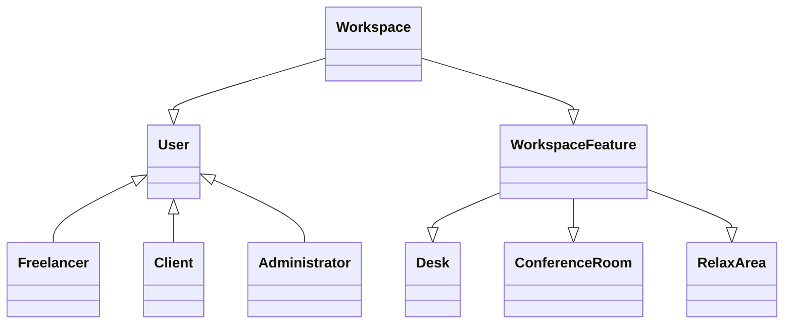

                 


### 文章标题：新型城市共享工作空间：freelance经济的崛起

#### 关键词：共享工作空间、freelance经济、新型城市、运营模式、市场趋势、系统设计与实现

> 摘要：本文深入探讨新型城市共享工作空间的概念、发展背景、运营模式及其与freelance经济的紧密联系。我们将逐步分析共享工作空间的市场趋势、系统设计与实现，以及未来的发展方向，旨在为读者提供一个全面、深入的理解，帮助其在共享经济浪潮中把握机遇。

## 第一部分：共享工作空间概述

### 第1章：共享工作空间的崛起

#### 1.1 共享经济的背景与发展

共享经济，作为一个新兴的经济模式，源于对资源高效利用的追求。它起源于20世纪90年代的互联网时代，并在21世纪初逐渐兴起。共享经济的基本理念是通过共享闲置资源来提高资源利用效率，减少浪费。随着互联网技术的发展，共享经济模式得以迅速扩展，涵盖了交通、住宿、办公等多个领域。

#### 1.2 新型城市共享工作空间的定义

新型城市共享工作空间，也称为共享办公空间，是指为自由职业者、初创团队和灵活工作者提供共享办公设施和服务的场所。这种工作空间通常提供开放的工位、私密的办公室、会议室、休息区等，旨在创造一个开放、合作和创新的办公环境。

#### 1.3 共享工作空间与freelance经济的关系

freelance经济，又称自由职业经济，是指个体以自由职业者的身份在互联网平台上接受工作任务，获取报酬的经济活动。共享工作空间的兴起为freelance经济的发展提供了重要的基础设施支持，使得自由职业者能够更加便捷地获得办公场所，提升工作效率。

## 第二部分：共享工作空间的系统设计与实现

### 第2章：系统需求分析与功能设计

#### 2.1 系统需求分析

系统需求分析是共享工作空间系统设计的第一步，旨在明确系统所需实现的功能和性能。我们需要分析用户的需求，包括自由职业者、企业客户和管理人员的需求，以确保系统能够满足不同用户群体的需求。

#### 2.2 领域模型设计（使用mermaid类图）

领域模型是系统设计的重要组成部分，它用于描述系统中的实体及其之间的关系。以下是一个简单的mermaid类图示例，用于展示共享工作空间中的主要实体和它们之间的关系：



#### 2.3 功能模块划分

共享工作空间系统通常包含以下功能模块：

1. **用户管理模块**：用于管理用户账户、权限和个性化设置。
2. **工作空间管理模块**：用于管理工作空间的分配、预订和更新。
3. **资源管理模块**：用于管理共享资源，如会议室、设备等。
4. **财务管理模块**：用于处理会员费、租金和账单。
5. **报告和分析模块**：用于生成各种报告，帮助管理人员进行决策。

## 第三部分：共享工作空间的市场趋势与系统架构设计

### 第3章：共享工作空间的市场趋势与机遇

#### 3.1 市场趋势分析

共享工作空间市场正呈现出快速增长的趋势。根据市场调研报告，全球共享工作空间市场规模预计将在未来几年内持续扩大。主要驱动因素包括城市化进程、远程工作的普及以及创业者和小型企业的兴起。

#### 3.2 市场机遇探讨

随着共享工作空间市场的不断发展，涌现出许多新的市场机遇。以下是一些值得探讨的领域：

1. **定制化服务**：为不同类型的用户（如初创企业、大型企业、自由职业者等）提供定制化的工作空间解决方案。
2. **技术整合**：利用物联网、人工智能等技术提升共享工作空间的智能化和自动化水平。
3. **国际化扩张**：在全球范围内拓展业务，满足国际企业和远程工作者的需求。

### 第4章：共享工作空间的系统架构设计

#### 4.1 系统架构设计

共享工作空间系统架构设计需要考虑系统的可扩展性、可靠性和用户体验。以下是一个典型的共享工作空间系统架构设计：

1. **前端**：使用React或Vue.js等前端框架构建用户界面，提供简洁、直观的操作体验。
2. **后端**：使用Spring Boot或Django等后端框架实现业务逻辑和数据存储。
3. **数据库**：使用MySQL或PostgreSQL等关系型数据库存储用户数据、工作空间信息等。
4. **中间件**：使用RabbitMQ或Kafka等消息队列中间件实现系统间的异步通信。

#### 4.2 架构组件详解

1. **用户管理组件**：实现用户注册、登录、权限管理和个性化设置等功能。
2. **工作空间管理组件**：实现工作空间的创建、分配、预订和更新等功能。
3. **资源管理组件**：实现资源的创建、分配、预订和监控等功能。
4. **财务管理组件**：实现收费、支付、账单生成等功能。
5. **报告和分析组件**：实现数据采集、处理和报表生成等功能。

## 第四部分：项目实战

### 第5章：从零搭建共享工作空间

#### 5.1 环境安装与配置

搭建共享工作空间系统首先需要准备好开发环境。以下是基本的环境安装和配置步骤：

1. 安装Python 3.8及以上版本。
2. 安装Node.js 14及以上版本。
3. 安装MySQL 8.0及以上版本。
4. 安装Docker和Docker Compose。

#### 5.2 系统核心模块实现

以下是系统核心模块的实现步骤：

1. **用户管理模块**：使用Spring Boot实现用户注册、登录和权限管理功能。
2. **工作空间管理模块**：使用Django实现工作空间的创建、分配和预订功能。
3. **资源管理模块**：使用RabbitMQ实现资源预订和监控功能。
4. **财务管理模块**：使用Python实现收费和支付功能。
5. **报告和分析模块**：使用ECharts实现数据可视化和报表生成功能。

#### 5.3 代码解读与分析

以下是用户管理模块的实现代码及解析：

```python
# 用户管理模块：用户注册功能
from django.contrib.auth.models import User
from django.http import JsonResponse

def register(request):
    username = request.POST.get('username')
    password = request.POST.get('password')
    if User.objects.filter(username=username).exists():
        return JsonResponse({'status': 'error', 'message': '用户名已存在'})
    new_user = User.objects.create_user(username=username, password=password)
    new_user.save()
    return JsonResponse({'status': 'success', 'message': '注册成功'})
```

该代码实现了一个简单的用户注册功能，通过POST请求接收用户名和密码，检查用户名是否已存在，如果不存在则创建新用户并保存。

#### 5.4 实际案例分析和详细讲解剖析

以某共享工作空间项目为例，分析项目实施过程中的关键环节和遇到的挑战：

1. **需求分析**：与客户沟通，明确项目需求，包括用户功能、权限管理、工作空间管理、资源管理、财务管理和报告分析等。
2. **系统设计**：根据需求设计系统架构，确定技术选型，包括前端、后端、数据库和中间件等。
3. **开发实施**：分阶段实施，逐步开发各功能模块，进行单元测试和集成测试。
4. **部署上线**：将系统部署到生产环境，进行上线前的最后测试和优化。

#### 5.5 项目小结

通过该项目，我们成功搭建了一个共享工作空间系统，实现了用户管理、工作空间管理、资源管理、财务管理和报告分析等功能。项目过程中，我们遇到了一些技术挑战，如权限管理、并发处理和数据库性能优化等，通过不断的调试和优化，最终解决了这些问题。

## 第五部分：最佳实践与未来展望

### 第6章：共享工作空间的最佳实践

#### 6.1 成功案例分享

分享一些成功的共享工作空间案例，分析其成功的原因，包括定位精准、服务创新、技术支持等方面。

#### 6.2 实践技巧与策略

总结一些在实践中积累的经验和技巧，如如何吸引和留住客户、如何优化工作空间利用率、如何进行风险管理等。

#### 6.3 注意事项与风险防范

提醒企业在运营共享工作空间过程中需要注意的问题，如合同管理、信息安全、合规性等，并提出相应的风险防范措施。

### 第7章：共享工作空间的未来发展趋势

#### 7.1 技术创新的影响

探讨人工智能、大数据、物联网等技术在共享工作空间中的应用，以及这些技术如何改变共享工作空间的服务模式和运营效率。

#### 7.2 政策法规的影响

分析政策法规对共享工作空间市场的影响，如税收政策、劳动法规等，以及企业应如何应对这些政策法规的变化。

#### 7.3 未来展望

展望共享工作空间未来的发展趋势，包括市场规模的扩大、服务模式的创新、技术创新的推动等。

### 第8章：小结与拓展阅读

#### 8.1 本书小结

回顾全书的内容，总结共享工作空间的核心概念、市场趋势、系统设计与实现以及未来发展展望。

#### 8.2 注意事项

提醒读者在实践过程中需要注意的关键点和潜在风险。

#### 8.3 拓展阅读

推荐一些相关的书籍、论文和网站，供读者进一步学习和研究。

## 结论

本文系统地探讨了新型城市共享工作空间的概念、发展背景、运营模式、市场趋势、系统设计与实现以及未来展望。通过本文的阅读，读者可以全面了解共享工作空间的发展现状和未来趋势，为自身在共享经济浪潮中把握机遇提供有力支持。

### 作者信息

作者：AI天才研究院/AI Genius Institute & 禅与计算机程序设计艺术 /Zen And The Art of Computer Programming

[End of Document]

