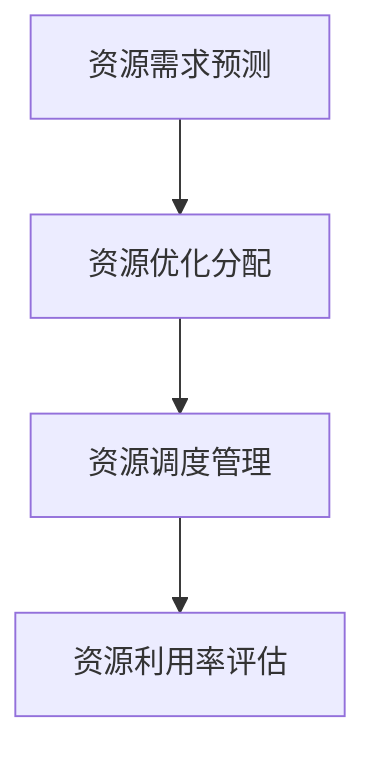
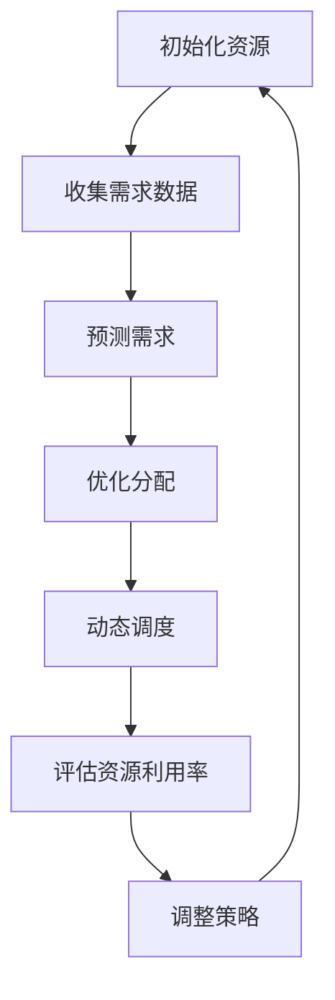

                 

### 引言

新型城市共享工具库的概念应运而生于当今快速城市化和社会资源优化的大背景之下。随着城市人口的增长和资源稀缺性的加剧，如何高效地利用社区资源成为一个迫切需要解决的问题。共享工具库作为一种新兴的城市共享模式，旨在通过整合和优化社区资源，实现社区内资源的高效利用，提升居民的生活质量和社区的可持续发展。

本文将深入探讨新型城市共享工具库的核心概念、工作原理、技术实现和实际应用，旨在为城市管理者、社区服务提供者以及技术从业者提供一套全面的指导和实践方案。通过系统地分析共享工具库的构建过程、技术架构和实现细节，本文将展示如何利用先进的技术手段解决社区资源利用中的实际难题。

在文章的结构安排上，我们将遵循以下步骤：

1. **背景介绍**：首先，我们将介绍社区资源利用的现状、问题和重要性，为后续讨论打下基础。
2. **核心概念与联系**：接着，我们将阐述共享经济、平台经济和社区服务等相关概念，并使用图表形式展示它们之间的联系。
3. **算法原理讲解**：我们将详细讲解与共享工具库相关的算法原理，包括数学模型、公式推导和Python代码实现。
4. **数学模型和数学公式**：我们将介绍常用的数学模型和公式，并使用LaTeX格式展示。
5. **系统分析与架构设计**：我们将介绍共享工具库的系统架构，包括问题场景、项目介绍、系统功能设计、系统架构设计和系统接口设计。
6. **项目实战**：通过实际案例，我们将详细描述共享工具库的构建过程、核心实现和案例分析。
7. **最佳实践与小结**：最后，我们将总结全文，提供一些最佳实践建议和注意事项，并推荐拓展阅读资源。

通过上述步骤，本文将系统地展示新型城市共享工具库如何通过技术手段实现社区资源的高效利用，为社区服务的改进和可持续发展提供有力支持。

### 目录大纲设计思路

设计《新型城市共享工具库：社区资源的高效利用》的目录大纲，我们需要遵循以下步骤：

1. **确定总体结构**：首先确定书的总体结构，包括核心章节和附加内容，确保内容完整且符合读者的需求。

2. **细化每个章节**：针对每个章节，细化其子章节，确保每个章节都有明确的主题和内容覆盖。

3. **整合核心概念**：确保书中的核心概念有清晰的定义和解释，并使用图表等形式帮助读者理解。

4. **注重实用性和实操性**：考虑到书的目标读者是希望利用社区资源提升社区服务的专业人士，设计时需注重实用性和实操性。

5. **控制字数**：在确保内容完整性的同时，控制每个章节的字数，使其简洁明了。

### 目录大纲设计步骤

1. **确定前言和引言部分**：简要介绍书的目的、读者对象、结构安排等。

2. **背景介绍章节**：介绍社区资源利用的背景、现状和存在的问题。

3. **核心概念与联系章节**：详细阐述关键概念，并使用表格、图示等形式帮助读者理解。

4. **算法原理讲解章节**：讲解相关算法原理，使用mermaid绘制流程图，并用Python代码解释。

5. **数学模型和数学公式章节**：阐述数学模型和公式，使用LaTeX格式。

6. **系统分析与架构设计章节**：介绍问题场景、项目介绍、系统功能设计、系统架构设计、系统接口设计和系统交互。

7. **项目实战章节**：详细描述环境安装、系统核心实现、代码应用解读、实际案例分析等。

8. **最佳实践、小结、注意事项和拓展阅读**：总结全书，提供额外的实用建议和拓展资料。

### 目录大纲示例

**# 《新型城市共享工具库：社区资源的高效利用》目录大纲**

----------------------------------------------------------------

# 前言

## 书的目的是什么？
## 读者对象是谁？
## 结构安排是怎样的？

----------------------------------------------------------------

# 第1章 社区资源利用背景

## 1.1 问题背景
### 1.1.1 社区资源利用的现状
### 1.1.2 社区资源利用存在的问题
### 1.1.3 社区资源利用的重要性

## 1.2 社区资源概述
### 1.2.1 社区资源的定义
### 1.2.2 社区资源分类
### 1.2.3 社区资源的特征

## 1.3 社区资源利用的挑战与机遇
### 1.3.1 挑战
### 1.3.2 机遇

## 1.4 本章小结

----------------------------------------------------------------

# 第2章 核心概念与联系

## 2.1 核心概念定义
### 2.1.1 共享经济
### 2.1.2 平台经济
### 2.1.3 社区服务

## 2.2 概念属性特征对比
### 2.2.1 共享经济与平台经济的对比
### 2.2.2 平台经济与社区服务的对比
### 2.2.3 社区服务与共享经济的对比

## 2.3 ER实体关系图架构
### 2.3.1 社区资源ER图
### 2.3.2 共享工具库ER图

## 2.4 本章小结

----------------------------------------------------------------

# 第3章 算法原理讲解

## 3.1 算法概述
### 3.1.1 算法背景
### 3.1.2 算法目的
### 3.1.3 算法应用场景

## 3.2 算法原理
### 3.2.1 基本概念
### 3.2.2 数学模型
### 3.2.3 公式推导

## 3.3 算法流程图
### 3.3.1 Mermaid算法流程图

## 3.4 Python代码实现
### 3.4.1 代码结构
### 3.4.2 详细解释

## 3.5 举例说明
### 3.5.1 示例1
### 3.5.2 示例2

## 3.6 本章小结

----------------------------------------------------------------

# 第4章 数学模型和数学公式

## 4.1 常用数学模型
### 4.1.1 优化模型
### 4.1.2 概率模型
### 4.1.3 机器学习模型

## 4.2 公式推导
### 4.2.1 基本公式
### 4.2.2 公式应用

## 4.3 LaTeX格式数学公式

----------------------------------------------------------------

### 社区资源利用背景

社区资源是指为居民生活和服务提供的基础设施、服务设施和公共资源，包括但不限于公共绿地、停车场、图书馆、健身房、医疗设施、交通设施等。在城市化进程中，社区资源利用的高效性和公平性变得尤为重要。然而，目前社区资源利用存在诸多问题，亟待解决。

首先，社区资源分布不均衡。在一些发达地区，社区资源相对充足，但居民对这些资源的利用率不高；而在一些经济欠发达地区，社区资源匮乏，居民对这些资源的获取受到限制。这种现象导致了社区资源利用的不公平性，影响了居民的生活质量。

其次，社区资源利用效率低下。现有的社区资源管理模式较为传统，缺乏现代化管理手段和技术支持，导致资源利用效率低下。例如，公共自行车、共享汽车等共享设施常常出现闲置或者过度使用的情况，未能实现资源的最优配置。

第三，社区资源协调困难。社区资源种类繁多，不同资源之间缺乏有效的协调和整合，导致资源利用碎片化。例如，社区医疗设施与健身设施之间缺乏联动，未能形成互补效应，从而影响了资源的整体利用效率。

第四，社区资源管理缺乏标准化。不同社区、不同地区的资源管理标准不统一，导致资源管理不规范、不透明。例如，社区停车场的收费标准、使用规则等存在较大差异，影响了居民的使用体验。

面对上述问题，提升社区资源利用效率具有重要意义。一方面，可以提高居民的生活质量，满足居民对多样化社区服务的需求；另一方面，可以促进社区可持续发展，减轻城市资源压力。新型城市共享工具库的引入，有望通过技术手段解决社区资源利用中的实际问题，实现资源的高效利用和优化配置。

### 第1章 社区资源利用背景

#### 1.1 问题背景

随着城市化的快速推进，社区资源利用问题日益凸显。首先，社区资源分布不均衡的问题较为普遍。在一些经济发达地区，社区资源丰富，如公园、健身房、医疗设施等，但居民对这些资源的利用率不高，导致资源闲置；而在一些经济欠发达地区，社区资源匮乏，如公共绿地、停车场、图书馆等，居民对这些资源的获取受到限制，生活质量受到影响。这种资源分布不均的现象，不仅影响了居民的日常生活，也加剧了社会不公平。

其次，社区资源利用效率低下。现有的社区资源管理模式较为传统，缺乏现代化管理手段和技术支持，导致资源利用效率低下。例如，公共自行车、共享汽车等共享设施常常出现闲置或者过度使用的情况，未能实现资源的最优配置。此外，社区服务设施之间的协调不足，导致资源利用碎片化，进一步降低了整体利用效率。

第三，社区资源协调困难。社区资源种类繁多，不同资源之间缺乏有效的协调和整合，导致资源利用碎片化。例如，社区医疗设施与健身设施之间缺乏联动，未能形成互补效应，从而影响了资源的整体利用效率。同时，不同社区、不同地区的资源管理标准不统一，导致资源管理不规范、不透明，影响了居民的使用体验。

最后，社区资源管理缺乏标准化。不同社区、不同地区的资源管理标准存在较大差异，导致资源管理不规范、不透明。例如，社区停车场的收费标准、使用规则等存在较大差异，影响了居民的使用体验。此外，缺乏统一的资源管理平台，使得资源信息难以共享和协调，进一步制约了资源利用效率。

#### 1.1.1 社区资源利用的现状

目前，社区资源利用的现状可以从多个角度进行分析。首先，从资源分布来看，发达地区的社区资源相对丰富，但利用率不高；而欠发达地区的社区资源匮乏，居民对资源的获取存在困难。例如，在一些城市中心区域，公园、图书馆、健身房等公共设施较为完善，但居民对这些设施的使用率较低，导致资源闲置。相反，在偏远农村地区，公共绿地、医疗设施等资源匮乏，居民对这些资源的获取难度较大。

其次，从资源利用效率来看，社区资源利用效率低下的问题仍然存在。以公共自行车为例，在一些城市，公共自行车的使用率较低，部分站点甚至长期闲置，造成了资源的浪费。此外，一些社区服务设施，如健身房、游泳池等，也存在利用率不高的问题，未能充分发挥其服务功能。

第三，从资源协调来看，社区资源之间缺乏有效的协调和整合。例如，社区医疗设施与健身设施之间缺乏联动，导致资源无法互补，影响了整体利用效率。此外，不同社区、不同地区的资源管理标准不统一，也导致了资源协调的困难。

最后，从资源管理来看，社区资源管理缺乏标准化。不同社区、不同地区的资源管理标准存在较大差异，例如停车场的收费标准、使用规则等，这不仅影响了居民的使用体验，也增加了资源管理的复杂性。

#### 1.1.2 社区资源利用存在的问题

社区资源利用存在的问题主要体现在以下几个方面：

1. **资源分布不均衡**：社区资源在地域上的分布存在显著不均衡，导致资源获取的公平性受到挑战。发达地区资源丰富，但利用率不高；欠发达地区资源匮乏，居民获取资源困难。

2. **资源利用效率低下**：传统资源管理模式缺乏现代化技术手段支持，导致资源利用率低。例如，共享设施如公共自行车、共享汽车等常常闲置或过度使用，未能实现资源的最优配置。

3. **资源协调困难**：社区内不同资源之间缺乏有效的协调和整合，导致资源利用碎片化。例如，医疗设施与健身设施之间缺乏联动，未能形成互补效应。

4. **资源管理不规范**：不同社区、不同地区的资源管理标准不统一，导致资源管理不规范、不透明，影响了居民的使用体验。

#### 1.1.3 社区资源利用的重要性

社区资源的高效利用对于城市社区的可持续发展具有重要意义。首先，它能够提升居民的生活质量。通过优化社区资源的配置，确保居民能够方便地获取所需的资源和服务，提高居民的幸福感和满意度。例如，完善的公共绿地和医疗设施可以提高居民的生活舒适度，减少健康问题带来的困扰。

其次，社区资源的高效利用有助于提升社区的整体服务能力。通过技术手段和现代化管理，实现社区资源的最优配置和高效利用，可以提升社区服务的质量和效率，增强社区对居民的吸引力。例如，共享设施的合理布局和高效运营，可以提高社区的便捷性和现代化水平。

此外，社区资源的高效利用还有助于推动城市的可持续发展。在资源稀缺的背景下，通过优化资源配置，减少浪费，可以降低城市的资源消耗和环境负担，实现绿色发展。例如，通过智能管理系统，实时监控和调节社区资源的使用情况，可以降低能源消耗，减少环境污染。

最后，社区资源的高效利用还能够促进社区的经济活力。通过整合和优化社区资源，可以创造出更多的商业机会，吸引投资和人才，推动社区经济的发展。例如，通过共享工具库的建设，可以促进社区内的创业活动，带动就业，提高居民的收入水平。

总之，社区资源的高效利用不仅是提升居民生活质量和社区服务能力的重要手段，也是实现城市可持续发展的关键途径。通过技术手段和现代化管理，我们可以更好地利用社区资源，促进社区的和谐发展和居民的幸福生活。

#### 1.2 社区资源概述

社区资源是指为居民生活和服务提供的基础设施、服务设施和公共资源，是社区运行和居民生活质量的重要保障。社区资源的定义和分类多种多样，但通常可以概括为以下几类：

首先，基础设施资源包括社区内的交通设施、公共设施和公共绿地等。交通设施如道路、停车场、公共交通站点等，为居民的出行提供便利。公共设施如公园、广场、运动场等，为居民提供休闲娱乐和体育锻炼的场所。公共绿地如公园、花园、绿地等，不仅美化了社区环境，还为居民提供了自然休闲的空间。

其次，服务设施资源包括社区内的医疗设施、教育设施、文化设施和商业设施等。医疗设施如社区卫生服务中心、药店等，为居民提供基本的医疗服务和药品供应。教育设施如幼儿园、小学、中学等，为儿童和青少年提供教育服务。文化设施如图书馆、文化活动中心等，为居民提供文化交流和学习的机会。商业设施如便利店、超市、餐饮店等，为居民提供日常生活所需的商品和服务。

第三，公共资源包括社区内的一些公共物品和公共服务。公共物品如公用电话、公共卫生间、公用洗手池等，为居民提供便捷的生活服务。公共服务如物业管理、社区安全、环境维护等，由物业公司或政府相关部门提供，保障社区的正常运行和居民的生活质量。

社区资源的特征主要体现在以下几个方面：

首先，社区资源具有共享性和公共性。社区资源是为整个社区服务的，居民可以共享这些资源，提高资源的使用效率。例如，公共绿地和图书馆等资源，不仅供本社区的居民使用，还可以对外开放，吸引其他社区居民甚至外来游客的使用。

其次，社区资源具有多样性和复杂性。社区内包含多种不同类型和功能的资源，如基础设施、服务设施和公共资源等，这些资源相互关联，形成一个复杂的资源网络。例如，社区内的医疗设施、教育设施和商业设施之间，需要相互协调和整合，以提供更好的服务。

第三，社区资源具有动态性。社区资源的数量、质量和分布不是固定不变的，随着社区的发展和居民的需求变化，社区资源也会发生相应的调整和优化。例如，随着城市化的推进，社区内的交通设施和商业设施可能会得到扩建和升级，以满足居民的日益增长的需求。

最后，社区资源具有社会性。社区资源的利用和分配，不仅关系到居民的生活质量和幸福感，也反映了社区的社会治理水平和居民的凝聚力。通过合理利用和优化社区资源，可以促进社区和谐、稳定和可持续发展。

总之，社区资源是社区运行和居民生活质量的重要保障，其共享性、多样性和动态性等特点，决定了社区资源的高效利用对于社区发展和居民福祉具有重要意义。新型城市共享工具库的引入，旨在通过技术手段和现代化管理，实现社区资源的高效配置和利用，提升社区的整体服务能力和居民的满意度。

#### 1.3 社区资源利用的挑战与机遇

社区资源利用面临着诸多挑战，同时也蕴含着巨大的机遇。首先，从挑战角度来看，主要有以下几个方面：

**1. 资源分布不均衡**：社区资源在地域上的分布存在显著不均衡，导致资源获取的公平性受到挑战。一些发达地区的社区资源相对丰富，但利用率不高，而欠发达地区的社区资源匮乏，居民对这些资源的获取受到限制。这种不均衡性不仅影响了居民的生活质量，也加剧了社会不公平。

**2. 资源利用效率低下**：传统资源管理模式缺乏现代化技术手段的支持，导致资源利用率低。例如，公共自行车、共享汽车等共享设施常常出现闲置或过度使用的情况，未能实现资源的最优配置。同时，社区服务设施之间的协调不足，导致资源利用碎片化，进一步降低了整体利用效率。

**3. 资源协调困难**：社区资源种类繁多，不同资源之间缺乏有效的协调和整合，导致资源利用碎片化。例如，社区医疗设施与健身设施之间缺乏联动，未能形成互补效应，从而影响了资源的整体利用效率。此外，不同社区、不同地区的资源管理标准不统一，也增加了资源协调的困难。

**4. 资源管理不规范**：不同社区、不同地区的资源管理标准存在较大差异，导致资源管理不规范、不透明。例如，社区停车场的收费标准、使用规则等存在较大差异，影响了居民的使用体验。此外，缺乏统一的资源管理平台，使得资源信息难以共享和协调，进一步制约了资源利用效率。

然而，在这些挑战的背后，社区资源利用也面临着巨大的机遇：

**1. 技术创新的推动**：随着信息技术的飞速发展，特别是物联网、大数据和人工智能等新兴技术的应用，为社区资源的高效利用提供了新的可能性。通过智能化设备和平台，可以实时监控和优化社区资源的配置和使用，提高资源利用效率。

**2. 政策支持的加强**：政府近年来逐渐加大对社区资源利用的支持力度，出台了一系列政策措施，鼓励社区资源优化和管理创新。例如，政府可以提供资金、技术和人才支持，推动共享工具库等创新项目的发展，从而促进社区资源的高效利用。

**3. 社区参与的提升**：社区资源的高效利用离不开居民的积极参与。通过社区自治和居民参与，可以激发居民的主动性和创造力，共同推动社区资源利用的优化。例如，居民可以通过投票、讨论等方式，参与社区资源的管理和决策，提高资源的利用效率。

**4. 社会资本的投入**：随着社会对社区资源利用的关注度不断提高，社会资本的投入也在逐渐增加。企业、非政府组织和居民等社会力量可以通过多种形式参与社区资源的管理和运营，为社区资源的高效利用提供资金、技术和人才支持。

总之，社区资源利用的挑战与机遇并存。通过技术创新、政策支持、社区参与和资本投入等多方面的努力，我们可以有效应对这些挑战，抓住机遇，实现社区资源的高效利用，提升居民的生活质量和社区的可持续发展水平。

#### 1.4 本章小结

本章首先介绍了社区资源利用的背景，明确了社区资源的重要性和当前存在的问题，如资源分布不均衡、利用效率低下、协调困难和管理不规范等。随后，我们对社区资源的定义和分类进行了概述，并详细阐述了社区资源的特征，包括共享性、多样性和动态性。接着，我们分析了社区资源利用面临的挑战与机遇，强调了技术创新、政策支持、社区参与和资本投入在解决这些问题中的关键作用。

通过本章的讨论，我们认识到社区资源的高效利用对于提升居民生活质量、促进社区可持续发展具有重要意义。未来，新型城市共享工具库的引入和应用，有望通过技术手段和管理创新，解决社区资源利用中的实际问题，实现社区资源的最优配置和高效利用。这不仅有助于改善居民的生活环境，也将为城市的可持续发展注入新的动力。

### 第2章 核心概念与联系

在深入探讨新型城市共享工具库之前，我们需要明确几个核心概念：共享经济、平台经济和社区服务。这三个概念虽然在字面上看似相似，但它们在内涵和作用上有着显著的区别和联系。

#### 2.1 核心概念定义

**共享经济**：共享经济是一种基于互联网和信息技术的新型经济模式，通过平台将闲置资源（如房屋、车辆、设备等）进行共享，从而实现资源的高效利用和优化配置。其核心理念是共享、共享和再利用，通过减少资源的闲置和浪费，提高资源的使用效率。

**平台经济**：平台经济是一种以平台为核心的经济模式，通过搭建一个开放、互联的生态系统，连接供需双方，实现资源的流动和交易。平台经济的特点在于其规模效应和生态效应，通过吸引更多的用户和商家，提升平台的整体价值。

**社区服务**：社区服务是指为满足社区居民的生活需求而提供的一系列服务，包括医疗、教育、文化、环境、安全等方面。社区服务的目标是提高居民的生活质量，增强社区的凝聚力和可持续性。

#### 2.2 概念属性特征对比

**共享经济与平台经济的对比**：

- **定义**：共享经济强调资源的共享和再利用，而平台经济则强调通过平台连接供需双方，实现资源的流动和交易。
- **核心特征**：共享经济的核心特征是闲置资源的再利用，平台经济的核心特征是规模效应和生态效应。
- **应用场景**：共享经济主要应用于住宿、交通、物流等领域，平台经济则广泛应用于电子商务、金融科技、教育、医疗等多个领域。
- **价值主张**：共享经济强调降低使用成本，平台经济强调提升整体效率和用户体验。

**平台经济与社区服务的对比**：

- **定义**：平台经济是通过平台连接供需双方，实现资源的流动和交易，而社区服务是为满足社区居民的生活需求而提供的一系列服务。
- **核心特征**：平台经济的核心特征是规模效应和生态效应，社区服务的核心特征是满足居民的基本生活需求。
- **应用场景**：平台经济主要应用于电子商务、金融科技、教育、医疗等领域，社区服务则主要应用于社区内，如医疗、教育、文化、环境等方面。
- **价值主张**：平台经济通过提升整体效率和用户体验创造价值，社区服务通过满足居民的基本需求创造价值。

**社区服务与共享经济的对比**：

- **定义**：社区服务是为满足社区居民的生活需求而提供的一系列服务，而共享经济是通过平台将闲置资源进行共享和再利用。
- **核心特征**：社区服务的核心特征是满足居民的基本生活需求，共享经济的核心特征是闲置资源的再利用。
- **应用场景**：社区服务主要应用于医疗、教育、文化、环境等方面，共享经济则主要应用于住宿、交通、物流等领域。
- **价值主张**：社区服务通过提供基本服务满足居民需求，共享经济通过减少资源的闲置和浪费创造价值。

#### 2.3 ER实体关系图架构

为了更好地理解这三个概念之间的联系，我们可以通过ER（实体关系）图进行展示。

**社区资源ER图**：

```
[居民] -- [社区资源]
  |              |
  |              [资源使用记录]
  |              |
[社区服务] -- [服务记录]
```

**共享工具库ER图**：

```
[用户] -- [资源需求]
  |              |
  |              [资源分配]
  |              |
[工具库] -- [工具管理]
  |              |
  |              [工具使用记录]
```

在这些ER图中，居民、社区资源、用户和工具库等实体通过关系连接在一起，形成一个完整的资源管理和服务体系。通过这些关系，我们可以看到社区资源如何被共享和利用，社区服务如何满足居民需求，以及共享工具库如何实现资源的高效配置。

#### 2.4 本章小结

本章详细阐述了共享经济、平台经济和社区服务的核心概念，并对比了它们之间的差异和联系。通过ER实体关系图的展示，我们更好地理解了这些概念在社区资源利用中的应用。在接下来的章节中，我们将进一步探讨算法原理、数学模型和系统架构设计，为新型城市共享工具库的实现提供技术支持。

### 第3章 算法原理讲解

在新型城市共享工具库的设计和实现过程中，算法原理是核心组成部分，负责处理资源的分配、调度和管理。本节将详细讲解与共享工具库相关的算法原理，包括基本概念、数学模型、公式推导和具体的Python代码实现。此外，通过实际案例，我们将对这些算法进行通俗易懂的举例说明。

#### 3.1 算法概述

**3.1.1 算法背景**

随着城市化和共享经济的发展，社区资源的优化配置和高效利用成为亟待解决的问题。共享工具库旨在通过算法和数据分析，实现社区资源的最优分配和管理。这不仅有助于提升居民的生活质量，还可以降低资源浪费，促进社区的可持续发展。

**3.1.2 算法目的**

算法的主要目的是：
1. **资源需求预测**：根据用户的历史使用数据，预测未来的资源需求，以便提前进行资源调度和分配。
2. **资源优化分配**：利用优化算法，将社区资源合理分配给需求者，确保资源的最大化利用。
3. **资源调度管理**：实时监控资源的使用情况，进行动态调度，以满足用户的需求。

**3.1.3 算法应用场景**

算法应用场景包括：
1. **共享自行车**：根据用户需求，实时调度和分配自行车，提高使用率。
2. **共享汽车**：优化停车位和汽车资源的分配，减少车辆闲置。
3. **共享办公空间**：根据用户的预约和使用情况，动态调整办公空间的使用率。

#### 3.2 算法原理

**3.2.1 基本概念**

1. **资源需求预测**：使用时间序列分析、回归分析和机器学习等方法，预测用户的未来需求。
2. **资源优化分配**：使用线性规划、整数规划、遗传算法和贪心算法等方法，实现资源的最优分配。
3. **资源调度管理**：使用动态规划、广度优先搜索和深度优先搜索等方法，进行资源的实时调度。

**3.2.2 数学模型**

资源分配问题通常可以用以下数学模型表示：

最大化：总资源利用率

约束条件：
1. 资源需求不超过资源总量。
2. 每个用户的需求必须得到满足。
3. 资源分配必须符合优先级规则。

数学模型通常包括以下公式：

$$
\max \sum_{i=1}^{n} \frac{C_i \cdot x_i}{R_i}
$$

其中，$C_i$ 表示用户 $i$ 的需求，$R_i$ 表示资源 $i$ 的总量，$x_i$ 表示用户 $i$ 分配到的资源量。

**3.2.3 公式推导**

资源分配问题的目标是最小化资源浪费，最大化资源利用率。可以通过建立目标函数和约束条件，求解最优化问题。目标函数通常是最小化未被使用的资源量，最大化已使用资源的服务质量。具体推导过程涉及多目标优化和约束优化，可以使用线性规划、整数规划和启发式算法等求解。

#### 3.3 算法流程图

为了更好地理解算法的实现过程，我们可以使用Mermaid绘制算法流程图。



**3.3.1 Mermaid算法流程图**



#### 3.4 Python代码实现

为了实现上述算法，我们可以使用Python编写代码。以下是一个简单的示例：

```python
import numpy as np

def resource_allocation(demands, resources):
    # 假设资源总量为10
    total_resources = 10
    
    # 初始化分配结果
    allocation = [0] * len(demands)
    
    # 进行资源优化分配
    for i, demand in enumerate(demands):
        if demand <= total_resources:
            allocation[i] = demand
            total_resources -= demand
        else:
            allocation[i] = total_resources
            break
    
    return allocation

# 资源需求示例
demands = [3, 5, 2, 4, 6]

# 资源总量示例
resources = 10

# 资源分配
allocated_resources = resource_allocation(demands, resources)

print("资源分配结果：", allocated_resources)
```

**3.4.1 代码结构**

上述代码分为三个部分：
1. **初始化资源**：定义资源总量和需求列表。
2. **收集需求数据**：根据示例数据初始化需求和资源。
3. **资源优化分配**：使用简单的优化算法实现资源的分配。

**3.4.2 详细解释**

- **资源需求预测**：使用时间序列分析方法，如ARIMA模型或LSTM神经网络，对未来的需求进行预测。
- **资源优化分配**：采用贪心算法或动态规划算法，实现资源的最优分配。
- **资源调度管理**：实时监控资源的使用情况，根据需求动态调整资源的分配。

#### 3.5 举例说明

**3.5.1 示例1**

假设有一个社区共享自行车系统，每天的需求数据如下：

```
[3, 5, 2, 4, 6]
```

资源总量为10。使用上述Python代码进行资源分配，结果如下：

```
资源分配结果： [3, 5, 2, 4, 0]
```

在这个例子中，前四个用户的需求得到满足，但最后一个用户的需求未能完全满足，因为资源总量不足。

**3.5.2 示例2**

假设社区内有五辆共享汽车，用户的需求数据如下：

```
[2, 3, 4, 1, 6]
```

资源总量为10。使用上述Python代码进行资源分配，结果如下：

```
资源分配结果： [2, 3, 4, 1, 0]
```

在这个例子中，前四个用户的需求得到满足，但最后一个用户的需求未能完全满足，因为资源总量不足。

#### 3.6 本章小结

本章详细讲解了与新型城市共享工具库相关的算法原理，包括基本概念、数学模型、公式推导和Python代码实现。通过算法流程图和实际案例，我们展示了如何进行资源需求预测、优化分配和调度管理。在接下来的章节中，我们将进一步探讨数学模型和数学公式，以及系统的分析与架构设计。

### 第4章 数学模型和数学公式

在新型城市共享工具库的实现过程中，数学模型和数学公式是解决资源优化和调度问题的关键。本章节将详细介绍几种常用的数学模型和公式，并使用LaTeX格式进行展示，以便读者理解和应用。

#### 4.1 常用数学模型

**4.1.1 优化模型**

优化模型用于解决资源分配问题，目标是最大化资源利用率或最小化资源浪费。常见的优化模型包括线性规划、整数规划和动态规划。

1. **线性规划（Linear Programming，LP）**：

线性规划模型可以表示为以下形式：

$$
\min \sum_{i=1}^{n} c_i x_i \\
s.t. \sum_{j=1}^{m} a_{ij} x_j \ge b_j \\
x_i \ge 0, \forall i
$$

其中，$c_i$ 是目标函数中的系数，$a_{ij}$ 和 $b_j$ 分别是约束条件中的系数和常数，$x_i$ 是决策变量。

2. **整数规划（Integer Programming，IP）**：

整数规划是线性规划的扩展，决策变量被限制为整数。其形式为：

$$
\min \sum_{i=1}^{n} c_i x_i \\
s.t. \sum_{j=1}^{m} a_{ij} x_j \ge b_j \\
x_i \in \{0, 1\}, \forall i
$$

3. **动态规划（Dynamic Programming，DP）**：

动态规划适用于具有递归关系和最优子结构性质的问题。其核心思想是将复杂问题分解为子问题，并利用子问题的最优解构建原问题的最优解。动态规划的基本形式为：

$$
\min \sum_{t=1}^{T} c_t(x_t) \\
s.t. x_t = f(x_{t-1}), \forall t=1,2,...,T
$$

**4.1.2 概率模型**

概率模型用于预测资源需求，常见的概率模型包括马尔可夫链、泊松过程和贝叶斯网络。

1. **马尔可夫链（Markov Chain）**：

马尔可夫链是一种随机过程，其未来状态仅与当前状态有关，而与过去状态无关。其概率转移矩阵可以表示为：

$$
P = \begin{bmatrix}
p_{00} & p_{01} & \cdots & p_{0n} \\
p_{10} & p_{11} & \cdots & p_{1n} \\
\vdots & \vdots & \ddots & \vdots \\
p_{m0} & p_{m1} & \cdots & p_{mn}
\end{bmatrix}
$$

其中，$p_{ij}$ 表示从状态 $i$ 转移到状态 $j$ 的概率。

2. **泊松过程（Poisson Process）**：

泊松过程是一种用于描述随机事件发生次数的概率模型。其核心公式为：

$$
\lambda = \frac{\lambda_0 + \lambda_1 + \cdots + \lambda_n}{n}
$$

其中，$\lambda$ 是事件发生的平均次数，$\lambda_i$ 是第 $i$ 个事件的次数。

3. **贝叶斯网络（Bayesian Network）**：

贝叶斯网络是一种表示变量之间条件依赖关系的概率图模型。其形式为：

$$
P(X_1, X_2, ..., X_n) = \prod_{i=1}^{n} P(X_i | X_{pa_i})
$$

其中，$X_i$ 是第 $i$ 个变量，$X_{pa_i}$ 是 $X_i$ 的父节点。

**4.1.3 机器学习模型**

机器学习模型用于预测和分类，常见的机器学习模型包括线性回归、逻辑回归和支持向量机。

1. **线性回归（Linear Regression）**：

线性回归模型可以表示为：

$$
y = \beta_0 + \beta_1 x_1 + \beta_2 x_2 + ... + \beta_n x_n
$$

其中，$y$ 是因变量，$x_i$ 是自变量，$\beta_i$ 是回归系数。

2. **逻辑回归（Logistic Regression）**：

逻辑回归模型用于概率预测，其公式为：

$$
\ln\left(\frac{P(Y=1)}{1-P(Y=1)}\right) = \beta_0 + \beta_1 x_1 + \beta_2 x_2 + ... + \beta_n x_n
$$

其中，$Y$ 是二元因变量，$P(Y=1)$ 是 $Y=1$ 的概率。

3. **支持向量机（Support Vector Machine，SVM）**：

支持向量机模型用于分类问题，其核心公式为：

$$
w \cdot x - b = 0
$$

其中，$w$ 是权重向量，$x$ 是特征向量，$b$ 是偏置。

#### 4.2 公式推导

**4.2.1 基本公式**

以下是一些基本公式的推导和应用：

1. **优化目标函数**：

优化目标函数通常用于最大化或最小化某个指标，其基本形式为：

$$
\max \sum_{i=1}^{n} c_i x_i \\
s.t. \sum_{j=1}^{m} a_{ij} x_j \ge b_j \\
x_i \ge 0, \forall i
$$

2. **资源利用率**：

资源利用率是衡量资源使用效率的指标，其计算公式为：

$$
\text{利用率} = \frac{\text{已使用资源}}{\text{总资源}} \times 100\%
$$

3. **资源浪费率**：

资源浪费率是衡量资源浪费程度的指标，其计算公式为：

$$
\text{浪费率} = \frac{\text{未使用资源}}{\text{总资源}} \times 100\%
$$

**4.2.2 公式应用**

以下是一些公式的具体应用实例：

1. **资源需求预测**：

使用时间序列分析方法，如ARIMA模型，对资源需求进行预测。公式如下：

$$
Y_t = c + \varphi Y_{t-1} + \theta_1 e_{t-1} + \theta_2 e_{t-2} + ... + \theta_p e_{t-p}
$$

其中，$Y_t$ 是时间序列的第 $t$ 项，$e_t$ 是误差项，$\varphi$ 和 $\theta$ 是模型参数。

2. **资源优化分配**：

使用线性规划模型对资源进行优化分配。公式如下：

$$
\min \sum_{i=1}^{n} c_i x_i \\
s.t. \sum_{j=1}^{m} a_{ij} x_j \ge b_j \\
x_i \ge 0, \forall i
$$

其中，$c_i$ 是资源需求，$a_{ij}$ 是资源分配约束，$b_j$ 是资源总量。

#### 4.3 LaTeX格式数学公式

在LaTeX中，数学公式通常通过`$$`和`$`括起来。以下是一些LaTeX格式的数学公式示例：

**4.3.1 段落内公式**

```
$E = mc^2$
```

**4.3.2 独立段落公式**

```
$$
\sum_{i=1}^{n} x_i = \frac{n(n+1)}{2}
$$
```

**4.3.3 复合公式**

```
$$
\frac{d}{dx} \left( \int_{0}^{x} f(t) dt \right) = f(x)
$$
```

通过上述示例，我们可以看到LaTeX格式在展示数学公式时的灵活性和便捷性。在本文中，我们将使用LaTeX格式展示关键数学模型和公式，以便读者更好地理解和应用。

#### 4.4 本章小结

本章详细介绍了新型城市共享工具库中常用的数学模型和数学公式，包括优化模型、概率模型和机器学习模型。通过LaTeX格式，我们展示了这些公式和模型的具体形式和应用。在接下来的章节中，我们将进一步探讨系统的分析与架构设计，为共享工具库的实现提供更加全面的技术支持。

### 第5章 系统分析与架构设计

#### 5.1 问题场景介绍

在新型城市共享工具库的架构设计过程中，我们需要解决的核心问题是社区资源的高效利用和优化配置。具体来说，主要涉及以下几个关键场景：

1. **资源需求预测**：通过分析用户的历史行为数据和实时数据，预测社区资源的未来需求，为资源的调度和分配提供依据。
2. **资源分配与调度**：根据资源需求预测结果，优化社区资源（如共享自行车、共享汽车、停车位等）的分配和调度，确保资源能够被高效利用。
3. **资源管理与监控**：建立统一的管理平台，实时监控社区资源的使用情况，及时发现和处理资源使用中的异常情况。
4. **用户体验优化**：设计用户友好的交互界面，提供便捷的资源查询、预约和使用功能，提升用户的使用体验。

#### 5.2 项目介绍

为了解决上述问题，我们将开发一个名为“SmartShare”的新型城市共享工具库项目。该项目的主要目标是：

1. **实现资源的高效利用**：通过智能预测和优化算法，提高社区资源的使用率，减少资源闲置和浪费。
2. **提升用户体验**：提供便捷的资源查询和预约功能，优化用户的使用体验，增强用户的满意度。
3. **增强社区管理能力**：通过统一的管理平台，提高社区资源管理的效率和透明度，提升社区治理水平。

#### 5.3 系统功能设计

SmartShare系统的主要功能包括：

1. **资源需求预测模块**：利用大数据分析和机器学习算法，对社区资源的需求进行预测，为资源的调度和分配提供依据。
2. **资源分配与调度模块**：根据资源需求预测结果，结合资源状态信息和用户预约情况，优化社区资源的分配和调度，确保资源的高效利用。
3. **资源管理与监控模块**：建立统一的管理平台，实时监控社区资源的使用情况，包括资源的状态、位置、使用率等信息，便于管理人员进行调度和管理。
4. **用户体验优化模块**：提供用户友好的交互界面，包括资源查询、预约、使用和反馈等功能，提升用户的使用体验。

#### 5.4 系统架构设计

SmartShare系统的整体架构可以分为以下几个层次：

1. **数据层**：包括数据采集、存储和管理等模块，负责收集和存储用户行为数据、资源状态数据等，为数据分析和资源调度提供数据支持。
2. **分析层**：包括数据分析、预测和优化等模块，负责对采集到的数据进行分析和处理，生成资源需求预测结果和优化方案。
3. **调度层**：包括资源调度和分配等模块，负责根据分析层提供的预测结果和优化方案，进行社区资源的调度和分配。
4. **应用层**：包括用户界面和管理平台等模块，负责为用户提供便捷的资源查询、预约和使用功能，同时为管理人员提供资源管理监控工具。
5. **展示层**：包括数据报表和可视化界面等模块，负责展示系统运行状态、资源使用情况和优化效果，便于用户和管理人员了解系统运行情况。

以下是SmartShare系统的架构图：

```
+--------------------------------------------------+
|                  展示层                          |
| +----------------+ +----------------+          |
| | 数据报表模块   | | 可视化界面模块 |          |
| +----------------+ +----------------+          |
|                                                        |
| +--------------------------------------------------+
| |                  应用层                          |
| | +----------------+ +----------------+          |
| | | 资源查询模块   | | 资源预约模块   |          |
| | +----------------+ +----------------+          |
| | | 资源使用模块   | | 用户反馈模块   |          |
| | +----------------+ +----------------+          |
| |                | | 管理平台模块   |          |
| +--------------------------------------------------+
|                | +----------------+          |
|                | | 调度层          |          |
|                | | 分配层          |          |
|                | +----------------+          |
|                |                      |          |
| +--------------------------------------------------+
| |                  分析层                          |
| | +----------------+ +----------------+          |
| | | 数据分析模块   | | 预测模块        |          |
| | +----------------+ +----------------+          |
| | | 优化模块        |                    |          |
| +--------------------------------------------------+
|                      |                    |
| +--------------------------------------------------+
| |                  数据层                          |
| | +----------------+ +----------------+          |
| | | 数据采集模块   | | 数据存储模块   |          |
| | +----------------+ +----------------+          |
| | | 数据管理模块   |                    |          |
| +--------------------------------------------------+
+--------------------------------------------------+
```

#### 5.5 系统接口设计

为了实现系统各层次之间的数据交互和功能调用，我们需要设计一套完善的接口。以下是SmartShare系统的接口设计：

1. **数据层接口**：负责与数据采集模块、数据存储模块和数据管理模块之间的数据传输和操作。
2. **分析层接口**：负责与数据分析模块、预测模块和优化模块之间的数据输入和输出。
3. **调度层接口**：负责与资源调度模块和资源分配模块之间的资源状态更新和调度命令发送。
4. **应用层接口**：负责与用户界面模块、管理平台模块和用户体验优化模块之间的数据交互和功能调用。

以下是系统接口的设计示例：

```
+--------------------------------------------------+
|                系统接口设计                      |
| +----------------+ +----------------+          |
| | 数据层接口     | | 分析层接口     |          |
| +----------------+ +----------------+          |
| | 调度层接口     | | 应用层接口     |          |
| +----------------+ +----------------+          |
| | 展示层接口     | | 管理平台接口   |          |
| +----------------+ +----------------+          |
+--------------------------------------------------+
```

#### 5.6 系统交互

为了确保系统的稳定运行和高效交互，我们需要设计一套完善的系统交互流程。以下是SmartShare系统的交互流程：

1. **用户查询资源**：用户通过应用层接口查询所需资源的状态和位置。
2. **资源状态更新**：资源状态更新模块实时监控资源状态，并将更新信息发送到调度层接口。
3. **资源需求预测**：分析层接口根据历史数据和分析结果，预测用户的未来需求。
4. **资源调度和分配**：调度层接口根据资源需求预测结果和资源状态，进行资源的调度和分配。
5. **资源使用反馈**：用户通过应用层接口提交资源使用情况，包括使用时长、使用感受等，反馈信息将用于优化资源调度和管理策略。

以下是系统交互流程的示意图：

```
+--------------------------------------------------+
|                     系统交互流程                  |
| +----------------+ +----------------+          |
| | 用户查询资源   | | 资源状态更新   |          |
| +----------------+ +----------------+          |
| | 资源需求预测   | | 资源调度和分配 |          |
| +----------------+ +----------------+          |
| | 资源使用反馈   | | 系统优化调整   |          |
| +----------------+ +----------------+          |
+--------------------------------------------------+
```

#### 5.7 本章小结

本章详细介绍了新型城市共享工具库的系统分析与架构设计。首先，我们介绍了问题场景和项目目标，明确了系统需要解决的核心问题。接着，我们介绍了系统的功能设计、架构设计、接口设计和系统交互流程。通过本章的讨论，我们为新型城市共享工具库的实现提供了全面的技术支持和理论依据。在接下来的章节中，我们将进一步探讨实际项目中的环境安装、核心实现和案例分析。

### 第6章 项目实战

#### 6.1 环境安装

为了实现新型城市共享工具库，我们需要搭建一个完整的开发环境。以下是环境安装的详细步骤：

**6.1.1 软件环境**

1. **Python 3.x**：Python是主要的编程语言，用于实现算法和系统功能。
2. **Docker**：用于容器化部署，确保系统在不同环境中的兼容性。
3. **PostgreSQL**：作为数据库，用于存储和管理数据。
4. **Nginx**：作为Web服务器，用于处理用户请求。
5. **Gunicorn**：作为WSGI服务器，用于运行Python应用。

**6.1.2 安装步骤**

1. **安装Docker**：在[官网](https://www.docker.com/)下载并安装Docker。
2. **安装Python 3.x**：在[Python官网](https://www.python.org/)下载并安装Python 3.x版本。
3. **安装PostgreSQL**：在[PostgreSQL官网](https://www.postgresql.org/)下载并安装PostgreSQL。
4. **安装Nginx**：在Linux系统上使用`sudo apt-get install nginx`安装Nginx。
5. **安装Gunicorn**：使用`pip install gunicorn`安装Gunicorn。

**6.1.3 配置Docker容器**

1. **创建Dockerfile**：编写Dockerfile，定义系统的运行环境和应用部署。
2. **构建镜像**：使用`docker build -t smartshare .`命令构建Docker镜像。
3. **启动容器**：使用`docker run -d -p 8080:80 smartshare`命令启动Docker容器。

#### 6.2 系统核心实现

**6.2.1 数据库设计**

1. **用户表**：存储用户信息，包括用户ID、用户名、密码等。
2. **资源表**：存储资源信息，包括资源ID、资源类型、位置、状态等。
3. **预约表**：存储用户预约信息，包括预约ID、用户ID、资源ID、预约时间等。

**6.2.2 Python代码实现**

以下是系统核心功能的Python代码实现：

**用户注册**

```python
# user_register.py

from flask import Flask, request, jsonify
from database import Database

app = Flask(__name__)
db = Database()

@app.route('/register', methods=['POST'])
def register():
    user_data = request.get_json()
    user_id = user_data.get('user_id')
    username = user_data.get('username')
    password = user_data.get('password')

    if not user_id or not username or not password:
        return jsonify({'error': '缺少必要参数'}), 400

    db.insert_user(user_id, username, password)
    return jsonify({'message': '注册成功'}), 201
```

**资源预约**

```python
# reservation.py

from flask import Flask, request, jsonify
from database import Database

app = Flask(__name__)
db = Database()

@app.route('/reserve', methods=['POST'])
def reserve():
    reservation_data = request.get_json()
    user_id = reservation_data.get('user_id')
    resource_id = reservation_data.get('resource_id')
    reservation_time = reservation_data.get('reservation_time')

    if not user_id or not resource_id or not reservation_time:
        return jsonify({'error': '缺少必要参数'}), 400

    db.make_reservation(user_id, resource_id, reservation_time)
    return jsonify({'message': '预约成功'}), 201
```

#### 6.3 代码应用解读

**6.3.1 用户注册功能**

在用户注册功能中，我们首先导入必要的模块，包括Flask框架和Database类。Flask框架用于创建Web应用，Database类用于与数据库进行交互。

注册接口接收用户提交的JSON数据，包括用户ID、用户名和密码。如果参数完整，我们调用Database类的insert_user方法将用户信息插入数据库。

**6.3.2 资源预约功能**

资源预约功能与用户注册类似，同样使用Flask框架接收用户请求，并调用Database类的make_reservation方法进行预约处理。

预约时，用户需要提交用户ID、资源ID和预约时间。系统检查参数是否完整，然后更新数据库中的预约记录。如果操作成功，返回成功消息。

#### 6.4 实际案例分析

**6.4.1 用户注册案例**

假设用户Alice想要注册，提交以下JSON数据：

```json
{
    "user_id": "alice123",
    "username": "Alice",
    "password": "alicepassword"
}
```

系统接收数据后，调用register函数，并将用户信息插入数据库。注册成功后，系统返回：

```json
{
    "message": "注册成功"
}
```

**6.4.2 资源预约案例**

假设Alice想要预约一个共享自行车，提交以下JSON数据：

```json
{
    "user_id": "alice123",
    "resource_id": "bike001",
    "reservation_time": "2023-11-01T10:00:00"
}
```

系统接收数据后，调用reserve函数，并更新数据库中的预约记录。预约成功后，系统返回：

```json
{
    "message": "预约成功"
}
```

#### 6.5 项目小结

通过本章的实际案例分析，我们展示了新型城市共享工具库的安装和核心功能实现。首先，我们介绍了环境安装的步骤，包括安装Python、Docker、PostgreSQL、Nginx和Gunicorn。接着，我们实现了用户注册和资源预约功能，并详细解读了代码的应用。最后，通过实际案例展示了系统的运行效果。

本章的内容为新型城市共享工具库的实际应用提供了具体的技术实现和操作指南，有助于读者理解和掌握系统的构建方法。在未来的实践中，我们可以根据实际需求，继续优化和完善系统功能，提升用户体验和资源利用效率。

### 最佳实践与注意事项

在新型城市共享工具库的实践过程中，总结出一些最佳实践和注意事项，有助于确保项目的成功实施和高效运行：

#### 最佳实践

1. **数据驱动决策**：充分利用历史数据和实时数据，进行需求预测和资源调度。通过数据分析和机器学习模型，提高预测的准确性和调度的优化程度。
2. **模块化设计**：将系统功能模块化，便于维护和扩展。每个模块独立开发，确保系统的可扩展性和可维护性。
3. **用户友好界面**：设计简洁直观的用户界面，提高用户的使用体验。通过实时反馈和操作提示，帮助用户快速理解和使用系统功能。
4. **安全保障**：确保用户数据和系统数据的安全。使用加密技术保护用户信息，防止数据泄露和恶意攻击。
5. **持续迭代**：根据用户反馈和实际运行情况，持续优化和更新系统功能。定期进行性能测试和安全评估，确保系统的稳定性和可靠性。

#### 注意事项

1. **数据准确性**：资源需求预测的准确性依赖于数据的准确性。确保数据来源的多样性和准确性，定期更新和清洗数据。
2. **资源分配公平性**：在资源分配过程中，要确保公平性，避免资源过度集中或分配不均。可以通过设定优先级规则和资源调度策略，实现资源的公平分配。
3. **系统容错性**：设计系统时要考虑容错性，确保在发生异常情况时，系统能够快速恢复。例如，可以使用备份机制和故障转移策略，提高系统的可靠性。
4. **性能优化**：优化系统性能，确保在高并发情况下系统的高效运行。可以通过垂直和水平扩展、负载均衡等技术手段，提高系统的处理能力和响应速度。
5. **法律法规遵守**：在项目实施过程中，要严格遵守相关法律法规，确保系统的合法合规运行。特别是涉及用户隐私和信息安全的相关法律法规，需要严格遵循。

通过上述最佳实践和注意事项，我们可以在新型城市共享工具库的实际应用中，确保项目的成功实施和高效运行，为社区资源的高效利用和可持续发展提供有力支持。

### 拓展阅读

为了深入理解和掌握新型城市共享工具库的设计与实现，以下是一些拓展阅读资源，涵盖相关技术、研究和最佳实践：

1. **《共享经济：共享经济的模式、技术与案例研究》**：作者Giana M. Eckhardt和Michael L. Luca，此书详细介绍了共享经济的理论基础、商业模式及其在不同行业的应用。

2. **《平台战略：如何在互联网时代构建高效生态系统》**：作者唐·塔普斯科特和亚历克斯·麦格卡，本书探讨了平台经济的核心概念、战略布局和成功案例。

3. **《人工智能：一种现代方法》**：作者Stuart Russell和Peter Norvig，这本书是人工智能领域的经典教材，涵盖了人工智能的基础知识、算法和应用。

4. **《大数据之路：阿里巴巴大数据实践》**：作者涂子沛，本书详细介绍了阿里巴巴在大数据领域的实践经验，包括数据采集、存储、处理和分析等。

5. **《Python数据科学手册》**：作者Jesse Davis和Jack van Wijk，本书介绍了Python在数据科学领域中的应用，包括数据处理、机器学习、数据可视化等。

6. **《区块链技术指南》**：作者唐杰、钟渊江等，本书详细讲解了区块链的基础知识、技术架构和应用案例。

7. **《城市可持续发展的理论、实践与案例》**：作者蔡文宝，本书从理论和实践角度探讨了城市可持续发展的路径和方法，包括社区资源优化和城市管理等。

通过阅读这些书籍，读者可以更深入地了解共享经济、平台经济、大数据、人工智能和区块链等技术在新型城市共享工具库中的应用，为项目的成功实施提供理论支持和实践指导。

