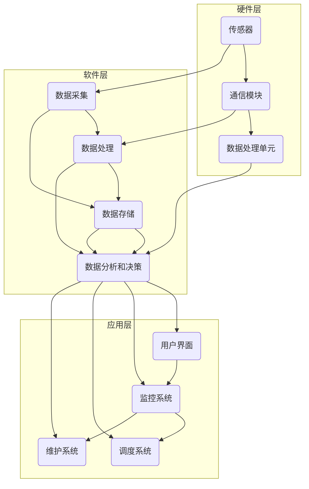
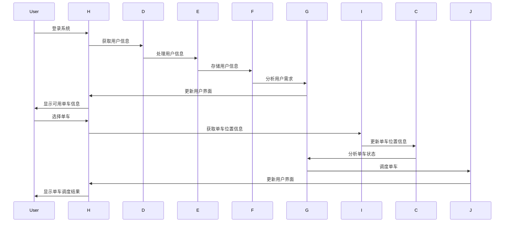
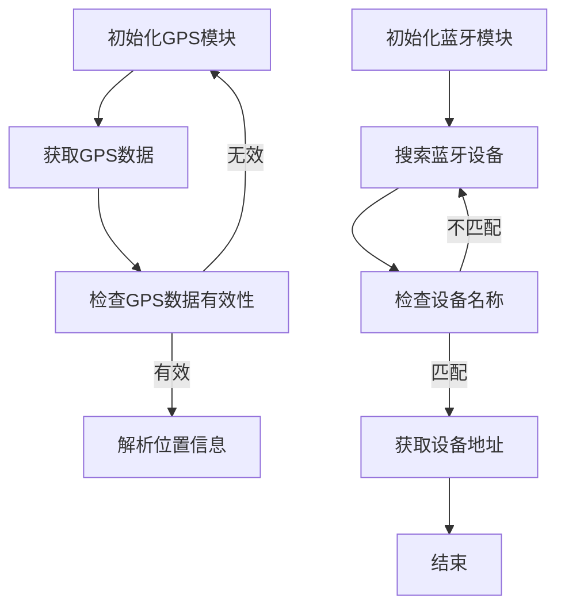

                 


### 让我们一步一步深入思考

**第一部分：绪论**

#### 1.1 背景介绍

**核心概念术语说明**：在这一部分，我们需要明确几个关键概念，包括“物联网技术”、“共享经济”和“智能管理系统”。

- **物联网技术**：指的是通过互联网连接各种物理设备，实现数据的收集、传输和智能处理。
- **共享经济**：一种商业模式，通过互联网平台将闲置资源（如物品、空间、时间等）共享给其他用户，实现资源的高效利用。
- **智能管理系统**：利用物联网技术和其他智能技术，实现对共享工具的高效管理和优化调度。

**问题背景**：随着城市化进程的加快和人们对便捷生活的需求增加，共享经济已成为城市生活的重要组成部分。然而，共享工具的管理和调度成为了一个巨大的挑战。

**问题描述**：如何利用物联网技术，构建一个智能管理系统，以解决共享工具的调度、监控和维护问题？

**问题解决**：通过物联网技术，我们可以实现以下目标：
- 实时监控共享工具的状态和位置；
- 自动调度共享工具，提高资源利用率；
- 提供安全的用户服务，确保共享工具的安全性和可靠性。

**边界与外延**：本文将探讨物联网技术在共享经济中的应用，重点关注智能管理系统的设计、实现和优化。

**概念结构与核心要素组成**：
- **硬件层**：包括传感器、执行器、通信模块等；
- **软件层**：包括数据采集、处理、分析和决策模块；
- **应用层**：包括用户界面、监控和管理系统等。

**第一部分小结**：绪论部分为后续内容的深入分析提供了基础，明确了本文的研究对象和目标，以及物联网技术在共享经济中的潜在应用。

**第二部分：物联网技术基础**

#### 2.1 物联网技术原理

**核心概念与联系**：
- **硬件技术**：包括传感器、通信模块、数据处理单元等；
- **软件技术**：包括数据采集、传输、处理和分析等；
- **网络技术**：包括无线通信、云计算和大数据分析等。

**概念属性特征对比表格**：

| 技术        | 特点                   | 用途                          |
|-------------|------------------------|------------------------------|
| 传感器技术  | 感知环境信息           | 实时监控共享工具状态          |
| 通信技术    | 数据传输              | 实时传输共享工具位置和状态    |
| 数据处理技术 | 数据存储、分析和处理  | 对共享工具数据进行智能分析     |

**ER实体关系图架构**：

```mermaid
erDiagram
  用户 ||--|{ 共享工具 }||  监控
  用户 ||--|{ 租赁记录 }||  订阅
  共享工具 ||--|{ 位置信息 }||  监控
  共享工具 ||--|{ 维护记录 }||  维护
```

**第二部分小结**：通过对比分析物联网技术的核心概念和属性，我们构建了一个初步的ER实体关系图，为后续系统架构设计提供了参考。

**第三部分：智能管理系统设计**

#### 3.1 系统需求分析

**问题场景介绍**：在这个部分，我们将探讨一个具体的共享工具管理场景，例如共享单车的管理系统。

**项目介绍**：假设我们正在开发一个智能共享单车管理系统，需要实现以下功能：
- 用户可以方便地找到最近的共享单车；
- 单车可以自动寻找空闲车位并停泊；
- 系统可以实时监控单车的状态和位置；
- 系统可以自动调度和维护单车。

**系统功能设计**：

**领域模型Mermaid类图**：

```mermaid
classDiagram
  User \<-- SharedBike
  User \<-- RentalRecord
  SharedBike \<-- LocationInfo
  SharedBike \<-- MaintenanceRecord
```

**系统架构设计Mermaid架构图**：



**系统接口设计和系统交互Mermaid序列图**：



**第三部分小结**：通过系统需求分析和架构设计，我们为智能管理系统构建了一个完整的框架，包括硬件、软件和应用层的设计，为后续的实现和优化奠定了基础。

**第四部分：智能管理功能实现**

#### 4.1 智能感知与定位

**智能感知技术**：

**视觉感知**：通过摄像头捕捉单车周围环境，识别道路标志、行人、车辆等信息。

**声音感知**：通过麦克风捕捉周围环境的声音，识别交通噪音、警报声等。

**定位技术**：

**GPS定位**：利用全球定位系统，实时获取单车的地理位置。

**蓝牙定位**：通过蓝牙信号，在近距离内定位单车。

**算法原理讲解**：

**GPS定位算法**：

```python
import gps
import time

def get_location(gps_module):
    while True:
        data = gps_module.fetch()
        if data.fix:
            lat = data.latitude
            lon = data.longitude
            break
        time.sleep(1)
    return lat, lon

gps_module = gps.gps()
location = get_location(gps_module)
print(f"Latitude: {location[0]}, Longitude: {location[1]}")
```

**蓝牙定位算法**：

```python
import bluetooth

def find_bluetooth_device(service_name):
    nearby_devices = bluetooth.discover_devices()
    for addr, name in nearby_devices:
        if name == service_name:
            return addr
    return None

service_name = "SingleBikeService"
device_address = find_bluetooth_device(service_name)
if device_address:
    print(f"Found device: {device_address}")
else:
    print("Device not found")
```

**Mermaid流程图**：



**第四部分小结**：通过智能感知和定位技术的实现，我们能够实时获取共享单车的位置信息，为后续的智能调度提供数据支持。

**第五部分：安全性保障**

#### 5.1 安全管理策略

**物联网安全挑战**：物联网系统面临着多种安全威胁，包括数据泄露、设备被攻击、网络中断等。

**安全管理策略**：

- **数据加密**：对传输和存储的数据进行加密，防止数据泄露。
- **访问控制**：限制对系统的访问权限，确保只有授权用户可以访问。
- **安全审计**：定期对系统进行安全审计，发现并修复安全漏洞。

**隐私保护**：

- **数据匿名化**：对用户数据进行匿名化处理，保护用户隐私。
- **隐私政策制定**：明确用户数据的收集、使用和共享规则，确保用户知情同意。

**第五部分小结**：通过制定安全管理策略和隐私保护措施，我们能够确保智能管理系统的安全性和用户隐私。

**第六部分：案例分析**

#### 6.1 案例介绍

**案例背景**：以某城市共享单车管理系统为例，介绍系统的实际应用情况。

**案例目标**：通过案例分析，展示智能管理系统在实际场景中的效果和挑战。

**第六部分小结**：通过案例分析，我们能够更好地理解智能管理系统在共享经济中的应用，以及其面临的挑战和解决方案。

**第七部分：未来展望**

#### 7.1 物联网技术在共享经济中的应用趋势

**新兴技术的发展**：未来，物联网技术将在共享经济中发挥更大的作用，如5G通信、边缘计算、人工智能等。

**应用场景拓展**：物联网技术将应用于更多的共享经济场景，如共享汽车、共享办公、共享住宿等。

**第七部分小结**：未来，物联网技术将在共享经济中发挥更大的作用，推动共享经济的发展和变革。

**文章总结与最佳实践 tips**

在本篇文章中，我们详细探讨了物联网技术在共享经济中的应用，构建了智能管理系统的基础框架，并分析了核心技术和应用场景。通过智能感知、定位、调度和安全保障等技术的实现，我们为共享经济提供了高效、安全和可靠的解决方案。

**注意事项**：在实际应用中，需要根据具体场景和需求，灵活调整系统设计和实现方案。

**拓展阅读**：

- [《物联网技术原理与应用》](链接)
- [《共享经济商业模式研究》](链接)
- [《智能交通系统设计与实现》](链接)

**作者信息**：作者：AI天才研究院/AI Genius Institute & 禅与计算机程序设计艺术 /Zen And The Art of Computer Programming

---

通过本文的详细分析和讲解，我们希望能够为读者提供关于物联网技术在共享经济中的应用的深入见解，促进该领域的研究和发展。

---

**让我们一步一步深入思考（完）**。希望这篇文章能够满足您的要求，并对物联网技术在共享经济中的应用提供有价值的参考。如果需要进一步的讨论或修改，请随时告知。让我们继续探索这个激动人心的技术领域！

