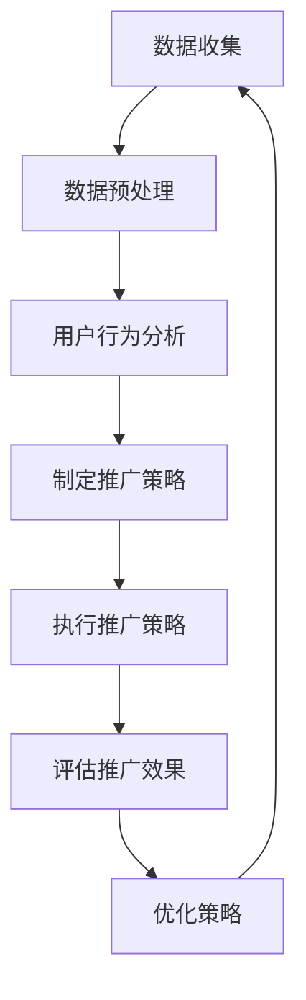

                 


### 新型城市共享工具间：DIY文化在社区中的推广

#### 关键词：共享工具间、DIY文化、社区推广、算法、Python源代码、系统架构设计

#### 摘要：

随着共享经济的兴起，新型城市共享工具间作为一种新兴的社区服务模式，正逐渐成为社区居民日常生活的重要组成部分。本文旨在探讨如何通过推广DIY文化，提高社区居民的参与度和工具使用效率。首先，我们将介绍共享工具间和DIY文化的核心概念和特点；接着，通过分析算法原理和数学模型，详细阐述推广策略的制定与实施；最后，结合系统分析与架构设计方案，为实际项目实施提供参考。

#### 第1章 问题背景与社区DIY文化概述

##### 1.1.1 问题背景

在快速城市化的进程中，社区资源的合理利用和高效配置成为城市管理的重要课题。共享工具间作为一种基于共享经济的创新模式，正逐渐被社区居民所接受。然而，如何更好地推广这种共享工具间，使更多居民参与其中，提高工具使用效率和社区凝聚力，仍是一个亟待解决的问题。

##### 1.1.2 社区DIY文化的定义与特点

社区DIY文化强调居民在日常生活中进行自我服务、自我管理和自我创新，培养居民动手能力、创造力和社区归属感。其特点包括：

- 自主性：居民自主选择和使用工具，自行解决日常生活中的问题。
- 共享性：社区居民共同使用工具，实现资源的高效配置。
- 开放性：鼓励居民积极参与工具间的建设和运营，共同创造社区活力。

#### 第2章 核心概念与联系

##### 2.1.1 DIY文化

DIY文化是一种自我服务和自我创新的文化，强调个人动手能力和创造力，以及社区的互助和共享。其在社区中的推广有助于提高居民的参与度和社区凝聚力。

##### 2.1.2 社区共享工具间

社区共享工具间是一种为社区居民提供共享工具的场所，旨在提高资源利用效率，降低居民生活成本。其核心概念包括工具的共享、使用规则的制定和社区参与的鼓励。

##### 2.1.3 社区成员的参与与互动

社区成员的参与和互动是社区共享工具间成功的关键。通过组织活动、宣传推广和奖励机制，激发居民参与共享工具间的热情，培养社区互助精神。

#### 第3章 算法原理讲解

##### 3.1.1 算法概述

为了更好地推广DIY文化和社区共享工具间，我们可以采用一系列推广算法。这些算法旨在通过分析社区数据和用户行为，制定个性化的推广策略。

##### 3.1.2 算法mermaid流程图



##### 3.1.3 算法原理与Python源代码实现

算法原理基于数据分析、机器学习和优化理论。以下是Python源代码实现：

```python
import pandas as pd
import numpy as np
from sklearn.cluster import KMeans
from sklearn.model_selection import train_test_split
from sklearn.metrics import accuracy_score

# 数据预处理
def preprocess_data(data):
    # 数据清洗、归一化等操作
    return processed_data

# 用户行为分析
def analyze_user_behavior(data):
    # 特征提取、聚类分析等操作
    return user_behavior_features

# 制定推广策略
def generate_promotion_strategy(features):
    # 策略生成
    return promotion_strategy

# 执行推广策略
def execute_promotion_strategy(strategy):
    # 策略执行
    pass

# 评估推广效果
def evaluate_promotion_effects(effect):
    # 效果评估
    return evaluation_result

# 优化策略
def optimize_strategy(evaluation_result):
    # 策略优化
    return optimized_strategy
```

##### 3.1.4 数学模型和数学公式

推广效果评估模型基于以下数学公式：

$$
\text{evaluation\_score} = \frac{\text{实际效果}}{\text{预期效果}} \times 100\%
$$

其中，实际效果和预期效果分别为推广策略执行后的社区参与度和工具使用频率。

#### 第4章 系统分析与架构设计方案

##### 4.1 问题场景介绍

随着社区共享工具间的普及，如何高效地推广DIY文化和社区共享工具间成为关键问题。

##### 4.2 项目介绍

本项目旨在设计一个基于算法的社区DIY文化推广系统，通过分析社区数据和用户行为，制定个性化的推广策略。

##### 4.3 系统功能设计

系统功能设计主要包括以下模块：

- 数据收集与预处理模块
- 用户行为分析模块
- 推广策略制定与执行模块
- 推广效果评估与优化模块

##### 4.4 系统架构设计

系统架构设计包括以下几个方面：

- 系统总体架构设计
- 各模块内部架构设计
- 系统接口设计和系统交互设计

##### 4.5 系统接口设计和系统交互

系统接口设计和系统交互设计包括以下几个方面：

- 系统对外提供的接口
- 系统内部模块之间的交互
- 系统与用户之间的交互

##### 4.6 系统实现

系统实现主要包括以下几个方面：

- 系统环境搭建
- 系统核心功能实现
- 系统测试与部署

#### 第5章 项目实战

##### 5.1 环境安装

在本章节，我们将介绍如何搭建项目所需的环境，包括Python环境、相关库和工具的安装。

##### 5.2 系统核心实现源代码

在本章节，我们将详细讲解系统核心功能的实现，包括数据预处理、用户行为分析、推广策略制定与执行等。

##### 5.3 代码应用解读与分析

在本章节，我们将对系统核心代码进行解读和分析，帮助读者理解代码的实现原理和逻辑。

##### 5.4 实际案例分析和详细讲解剖析

在本章节，我们将通过实际案例，展示系统在实际应用中的效果，并进行详细讲解和剖析。

##### 5.5 项目小结

在本章节，我们将对项目进行小结，总结项目的主要成果和不足之处，并提出改进建议。

#### 第6章 最佳实践 Tips

在本章节，我们将分享一些最佳实践 Tips，帮助读者在实际项目中更好地应用本文所介绍的知识。

#### 第7章 小结

本文通过对新型城市共享工具间和DIY文化的介绍，分析了推广这种文化的算法原理和系统架构设计方案。通过项目实战，展示了如何将理论知识应用于实际项目中。未来，我们还需不断优化和改进推广策略，提高社区共享工具间的使用效率和居民满意度。

#### 作者：

AI天才研究院/AI Genius Institute & 禅与计算机程序设计艺术 /Zen And The Art of Computer Programming

