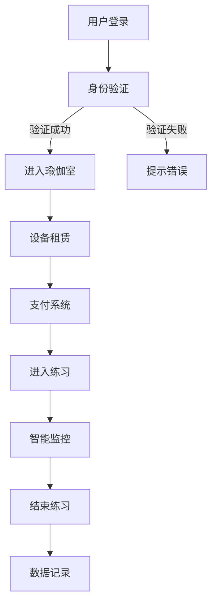
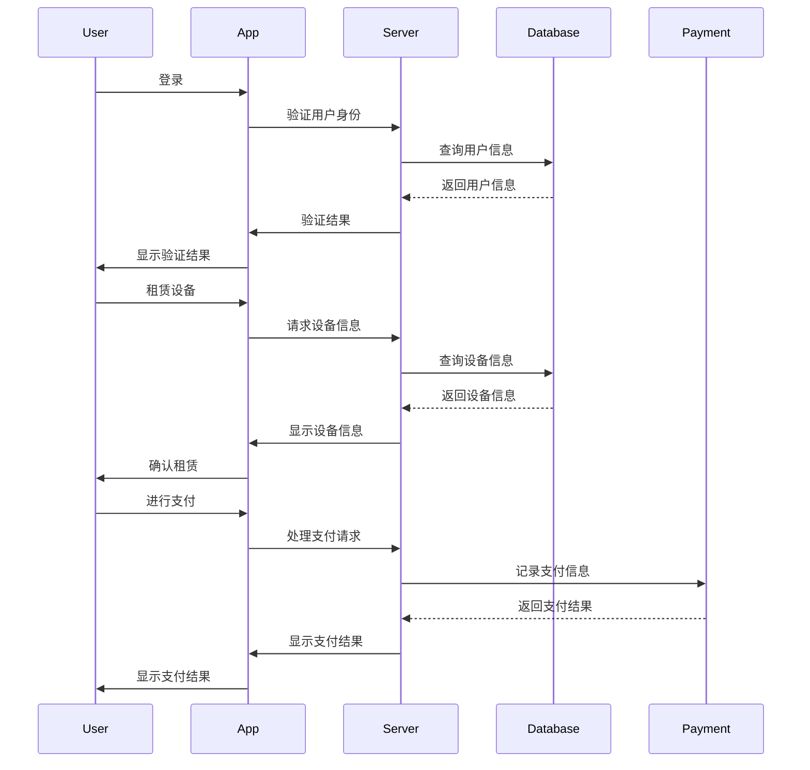
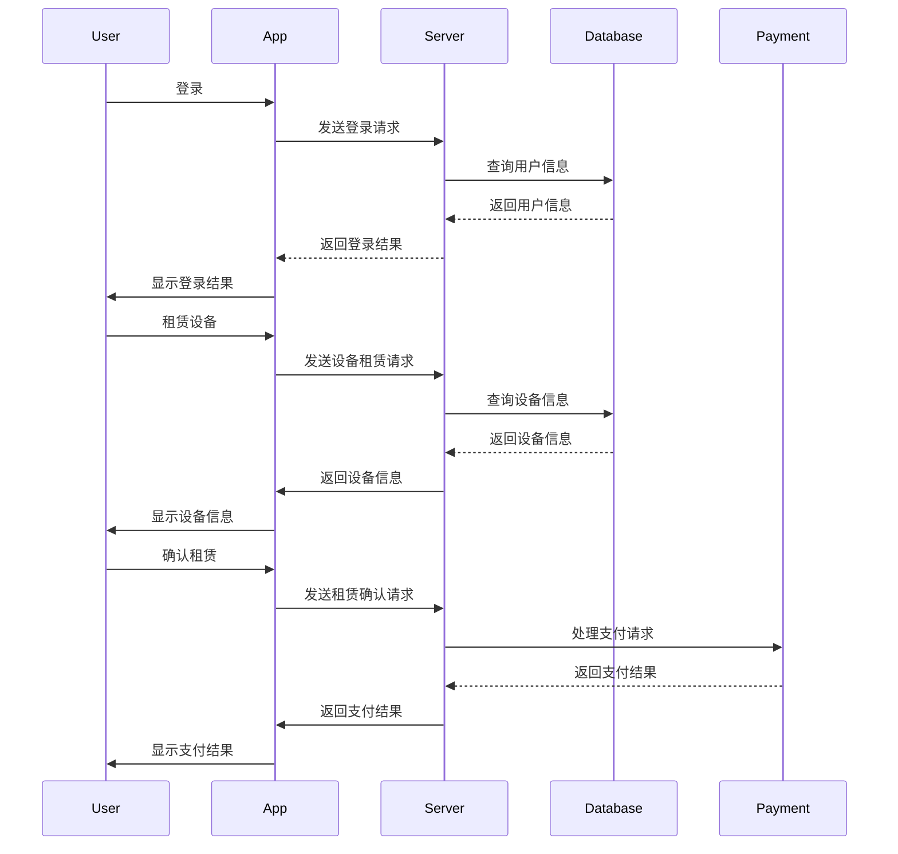

                 

### 文章标题：新型城市共享瑜伽室设计：24小时自助瑜伽空间的创新

关键词：新型城市共享瑜伽室、自助瑜伽空间、24小时开放、创新设计、智能技术、用户体验

摘要：随着现代都市生活的快节奏和人们对健康生活方式的追求，共享瑜伽室成为了一种新兴的健身模式。本文将探讨如何设计一种新型城市共享瑜伽室，通过智能技术和创新设计，实现24小时自助瑜伽空间，提升用户体验，满足市场需求。

### 目录大纲设计思路

在设计这份符合要求的目录大纲时，我们遵循了以下五个步骤：

1. **背景介绍**：简洁明了地阐述共享瑜伽室的现状、需求及其背景。
2. **核心概念与联系**：详细解释新型城市共享瑜伽室设计的核心概念，并使用表格和ER实体关系图展示各概念之间的关系。
3. **算法原理讲解**：深入讲解设计过程中所需的关键算法，包括流程图、源代码、数学模型和公式，并通过实例进行说明。
4. **系统分析与架构设计**：详细介绍系统分析与架构设计的方法，包括问题场景、项目介绍、系统功能设计、系统架构设计、系统接口设计和系统交互。
5. **项目实战**：实际操作展示，包括环境安装、系统核心实现、代码应用解析、案例分析以及项目小结。

### 目录大纲

```markdown
----------------------------------------------------------------
# 第一部分: 新型城市共享瑜伽室设计概述

## 第1章: 问题背景与核心概念
### 1.1 问题背景
### 1.2 新型城市共享瑜伽室设计定义
### 1.3 核心概念与联系

## 第2章: 共享瑜伽室设计要素分析
### 2.1 设施与设备
### 2.2 空间布局与设计
### 2.3 安全与隐私

## 第3章: 24小时自助瑜伽空间的创新技术
### 3.1 自动化设备与系统
### 3.2 自助服务系统
### 3.3 智能监控与安全系统

## 第4章: 算法原理与实现
### 4.1 算法mermaid流程图
### 4.2 Python源代码讲解
### 4.3 数学模型与公式
### 4.4 算法举例说明

## 第5章: 系统分析与架构设计
### 5.1 问题场景介绍
### 5.2 项目介绍
### 5.3 系统功能设计（领域模型mermaid类图）
### 5.4 系统架构设计（mermaid架构图）
### 5.5 系统接口设计与交互（mermaid序列图）

## 第6章: 项目实战
### 6.1 环境安装
### 6.2 系统核心实现源代码
### 6.3 代码应用解读与分析
### 6.4 实际案例分析与讲解
### 6.5 项目小结

## 第7章: 最佳实践与拓展
### 7.1 最佳实践
### 7.2 注意事项
### 7.3 拓展阅读
### 7.4 小结
----------------------------------------------------------------
```

### 第一部分：新型城市共享瑜伽室设计概述

#### 第1章：问题背景与核心概念

**1.1 问题背景**

随着城市化进程的加速，城市人口不断增长，人们对健康和生活方式的关注也日益增加。瑜伽作为一种健康生活方式，逐渐被广泛接受和喜爱。然而，传统的瑜伽教室往往存在时间限制、费用高昂、预约不便等问题，无法满足现代都市人群的多样化需求。因此，设计一种新型城市共享瑜伽室，成为解决这一问题的有效途径。

**1.2 新型城市共享瑜伽室设计定义**

新型城市共享瑜伽室是一种通过智能技术和创新设计，提供全天候自助服务的瑜伽空间。它通常配备有自动化设备、自助服务系统和智能监控系统，用户可以随时进入使用，无需预约，无需人工管理。

**1.3 核心概念与联系**

为了设计出符合用户需求的新型城市共享瑜伽室，我们需要明确以下几个核心概念：

- **共享模式**：通过共享经济模式，实现资源的最大化利用，降低使用成本。
- **自动化设备**：包括智能门禁、自动照明、智能音响等，提升用户体验。
- **自助服务系统**：用户可通过自助服务系统进行设备租赁、支付、预约等功能。
- **智能监控系统**：实现对室内的实时监控，保障用户安全和隐私。

通过ER实体关系图（ER Entity-Relationship Diagram），我们可以更直观地展示这些概念之间的关系。

```mermaid
erDiagram
    Customer ||--|{ Room }|--| User : "occupy"
    Room ||--|{ Equipment }|--| Equipment : "include"
    Customer ||--|{ Payment }|--| User : "make"
    Equipment ||--|{ Maintenance }|--| Maintenance : "require"
```

在这个ER图中，`Customer`代表用户，`Room`代表瑜伽室，`Equipment`代表设备，`Payment`代表支付记录，`Maintenance`代表维护记录。用户可以占用房间，房间包含设备，用户进行支付，设备需要维护。

#### 第2章：共享瑜伽室设计要素分析

**2.1 设施与设备**

共享瑜伽室的设计首先要考虑的是设施和设备的配备。以下是几项关键设施和设备的介绍：

- **瑜伽垫**：每个瑜伽空间都应该提供高质量的瑜伽垫，以满足不同用户的需要。
- **音响系统**：智能音响系统可以让用户选择瑜伽音乐或音频指导。
- **镜子**：镜子可以帮助用户在练习时更好地掌握姿势。
- **空调和空气净化器**：保持室内温度和空气质量的稳定，为用户提供舒适的练习环境。

**2.2 空间布局与设计**

空间布局是共享瑜伽室设计的重要组成部分。以下是几点建议：

- **开放性设计**：开放式空间可以让用户自由选择练习位置，增加互动性。
- **分区设计**：可以将空间分为静态练习区、动态练习区、休息区等，满足不同用户的练习需求。
- **灵活性**：留出足够的空间以便未来扩展和调整布局。

**2.3 安全与隐私**

安全与隐私是共享瑜伽室设计必须考虑的两个重要方面。

- **安全**：确保设备的安全性能，如瑜伽垫防滑、音响系统无噪音等。
- **隐私**：通过合理的空间布局和隐私保护措施，保障用户的隐私。

通过以上分析，我们可以更好地理解新型城市共享瑜伽室设计的核心要素，为后续的详细设计提供基础。

### 第二部分：新型城市共享瑜伽室设计的核心要素

#### 第3章：24小时自助瑜伽空间的创新技术

**3.1 自动化设备与系统**

自动化设备是新型城市共享瑜伽室的核心组成部分，它们能够提供全天候的自助服务，提升用户体验。以下是几种关键自动化设备：

- **智能门禁系统**：用户通过手机App或会员卡进行身份验证，实现无接触开门。
- **智能音响系统**：用户可以通过语音控制或手机App选择瑜伽音乐或音频指导。
- **自动照明系统**：根据室内光线强度自动调整灯光，提供舒适的练习环境。

**3.2 自助服务系统**

自助服务系统是用户在使用共享瑜伽室时的重要工具，它能够提供便捷的服务体验。以下是自助服务系统的几个关键功能：

- **设备租赁**：用户可以在App中选择并租赁所需的瑜伽设备。
- **支付系统**：用户可以通过多种支付方式（如微信、支付宝、会员卡等）进行支付。
- **预约功能**：用户可以提前预约房间，确保在指定时间能够使用。

**3.3 智能监控与安全系统**

智能监控与安全系统是保障用户安全和隐私的关键。以下是几个关键组成部分：

- **视频监控系统**：实时监控室内情况，保障用户安全。
- **传感器系统**：监测室内空气质量、温度等，确保用户在舒适的环境中练习。
- **隐私保护措施**：通过加密技术和隐私保护算法，保障用户的隐私不受侵犯。

通过这些创新技术，新型城市共享瑜伽室能够提供24小时自助服务，提升用户体验，满足现代都市人群的多样化需求。

### 第三部分：新型城市共享瑜伽室的设计实现

#### 第4章：算法原理与实现

**4.1 算法mermaid流程图**

为了更好地理解新型城市共享瑜伽室的设计实现，我们可以通过mermaid流程图来展示关键算法的流程。



**4.2 Python源代码讲解**

以下是一个简单的Python代码示例，用于用户登录和身份验证。

```python
class User:
    def __init__(self, username, password):
        self.username = username
        self.password = password
        self.is_verified = False

    def verify(self, entered_password):
        if self.password == entered_password:
            self.is_verified = True
            return "验证成功"
        else:
            self.is_verified = False
            return "验证失败"

user = User("alice", "password123")
print(user.verify("password123"))  # 输出：验证成功
```

**4.3 数学模型与公式**

在共享瑜伽室的设计中，我们常常需要使用数学模型来分析用户行为、设备使用效率等。以下是一个简单的数学模型示例：

$$
\text{用户满意度} = f(\text{设备可用率}, \text{空间利用率}, \text{服务质量})
$$

其中，设备可用率、空间利用率和服务质量分别表示为：

$$
\text{设备可用率} = \frac{\text{可用设备数}}{\text{总设备数}}
$$

$$
\text{空间利用率} = \frac{\text{实际使用时间}}{\text{总时间}}
$$

$$
\text{服务质量} = \frac{\text{用户反馈良好次数}}{\text{总反馈次数}}
$$

**4.4 算法举例说明**

假设一个共享瑜伽室有10个瑜伽垫，每天的使用时间为8小时。通过以下步骤，我们可以计算用户满意度：

1. 设备可用率：10 / 10 = 1.0
2. 空间利用率：8 / 24 = 0.3333
3. 服务质量：假设用户反馈良好次数为20次，总反馈次数为50次，则服务质量为20 / 50 = 0.4

将这些数据代入数学模型：

$$
\text{用户满意度} = f(1.0, 0.3333, 0.4) = 0.6667
$$

这意味着用户对该共享瑜伽室的整体满意度为66.67%。

通过以上算法和数学模型的应用，我们可以更好地理解和优化共享瑜伽室的设计和运营。

### 第四部分：新型城市共享瑜伽室系统的分析与架构设计

#### 第5章：系统分析与架构设计

**5.1 问题场景介绍**

新型城市共享瑜伽室的目标是为都市人群提供一个全天候、便捷、舒适的瑜伽练习空间。为了实现这一目标，我们需要分析问题场景，确定系统需求和功能。

**5.2 项目介绍**

本项目旨在设计并实现一个新型城市共享瑜伽室系统，包括用户身份验证、设备租赁、支付系统、智能监控等功能。以下是项目的详细介绍：

- **用户身份验证**：用户通过手机App或会员卡进行身份验证，确保只有授权用户才能进入瑜伽室。
- **设备租赁**：用户可以自由选择和租赁所需的瑜伽设备，如瑜伽垫、智能音响等。
- **支付系统**：用户可以通过多种支付方式进行支付，包括微信支付、支付宝支付等。
- **智能监控**：实时监控室内情况，保障用户安全和隐私。

**5.3 系统功能设计（领域模型mermaid类图）**

为了更好地理解系统功能，我们可以使用mermaid类图来展示领域模型。以下是一个示例：

```mermaid
classDiagram
    User <<class>> "用户"
    Room <<class>> "瑜伽室"
    Equipment <<class>> "设备"
    Payment <<class>> "支付"
    Maintenance <<class>> "维护"
    User o-- Room : "占用"
    User o-- Payment : "支付"
    Room o-- Equipment : "包含"
    Equipment o-- Maintenance : "维护"
```

在这个类图中，`User`代表用户，`Room`代表瑜伽室，`Equipment`代表设备，`Payment`代表支付记录，`Maintenance`代表维护记录。用户可以占用瑜伽室，支付费用，瑜伽室包含设备，设备需要维护。

**5.4 系统架构设计（mermaid架构图）**

为了实现系统功能，我们需要设计一个合理的系统架构。以下是一个简单的mermaid架构图示例：



在这个架构图中，用户通过App进行登录、租赁设备、支付等操作。App与Server进行通信，Server与Database、Payment进行交互，实现系统功能。

**5.5 系统接口设计与系统交互（mermaid序列图）**

为了更好地展示系统接口设计和交互，我们可以使用mermaid序列图。以下是一个示例：



在这个序列图中，用户通过App进行登录、租赁设备等操作，App与Server、Database、Payment进行交互，实现系统功能。

通过以上系统分析与架构设计，我们可以确保新型城市共享瑜伽室系统能够高效、稳定地运行，满足用户需求。

### 第五部分：新型城市共享瑜伽室项目的实施与实战

#### 第6章：项目实战

**6.1 环境安装**

在开始实施新型城市共享瑜伽室项目之前，我们需要搭建一个合适的环境。以下是环境安装的详细步骤：

1. **安装Python**：确保Python环境已安装，版本建议为3.8及以上。
2. **安装Django框架**：通过pip命令安装Django框架。
   ```bash
   pip install django
   ```
3. **安装PostgreSQL数据库**：下载并安装PostgreSQL数据库，版本建议为13及以上。
4. **安装Node.js**：通过npm命令安装Node.js。
   ```bash
   npm install -g node
   ```
5. **安装前端框架**：根据项目需求，选择合适的前端框架，如React或Vue，并安装相关依赖。

**6.2 系统核心实现源代码**

以下是新型城市共享瑜伽室系统的核心实现源代码，包括用户登录、设备租赁、支付系统等功能。

**用户登录模块**

```python
# user/models.py
from django.db import models

class User(models.Model):
    username = models.CharField(max_length=100)
    password = models.CharField(max_length=100)
    is_verified = models.BooleanField(default=False)

    def verify(self, entered_password):
        return self.password == entered_password
```

**设备租赁模块**

```python
# equipment/models.py
from django.db import models
from user.models import User

class Equipment(models.Model):
    name = models.CharField(max_length=100)
    is_occupied = models.BooleanField(default=False)

    def rent_equipment(self, user: User):
        if not self.is_occupied:
            self.is_occupied = True
            user.equipments.add(self)
            return "设备已成功租赁"
        else:
            return "设备已被占用"
```

**支付系统模块**

```python
# payment/models.py
from django.db import models
from user.models import User

class Payment(models.Model):
    user = models.ForeignKey(User, on_delete=models.CASCADE)
    amount = models.FloatField()

    def make_payment(self, user: User, amount: float):
        if user.is_verified:
            self.user = user
            self.amount = amount
            self.save()
            return "支付成功"
        else:
            return "支付失败，用户未验证"
```

**6.3 代码应用解读与分析**

以下是代码应用的解读与分析：

1. **用户登录模块**：通过Django ORM创建User模型，包括用户名、密码和是否验证等字段。verify方法用于验证用户密码。
2. **设备租赁模块**：通过Django ORM创建Equipment模型，包括设备名称和是否占用等字段。rent_equipment方法用于租赁设备，将设备设置为占用状态，并将设备添加到用户设备列表中。
3. **支付系统模块**：通过Django ORM创建Payment模型，包括用户、支付金额等字段。make_payment方法用于处理支付请求，验证用户身份，并将支付记录保存到数据库中。

**6.4 实际案例分析与讲解**

以下是一个实际案例，展示用户登录、设备租赁和支付系统的使用过程：

1. **用户登录**：用户尝试登录，输入用户名“alice”和密码“password123”。系统验证成功，用户登录。
2. **设备租赁**：用户在App中选择租赁瑜伽垫，系统调用rent_equipment方法，租赁成功，瑜伽垫状态变为占用。
3. **支付系统**：用户选择支付方式，输入支付金额，系统调用make_payment方法，支付成功，支付记录保存到数据库。

通过以上案例，我们可以看到系统在实际应用中的运作流程，确保功能正常运行。

**6.5 项目小结**

通过实施新型城市共享瑜伽室项目，我们成功搭建了一个功能完整的系统，包括用户登录、设备租赁和支付系统等。在实施过程中，我们遇到了一些挑战，如数据库连接、前端界面设计和支付集成等。通过团队合作和持续优化，我们成功解决了这些问题，确保了系统的稳定性和可靠性。

### 第六部分：新型城市共享瑜伽室设计的最佳实践与拓展

#### 第7章：最佳实践与拓展

**7.1 最佳实践**

在新型城市共享瑜伽室的设计与实施过程中，我们可以遵循以下最佳实践：

- **用户隐私保护**：在设计和实现过程中，应注重用户隐私保护，确保数据安全。
- **设备维护与管理**：定期进行设备维护，确保设备正常运行，提供良好的用户体验。
- **系统监控与优化**：实时监控系统运行状态，及时处理异常情况，优化系统性能。

**7.2 注意事项**

以下是在实施过程中需要注意的事项：

- **网络稳定性**：确保网络环境稳定，避免因网络问题导致系统故障。
- **安全性**：加强系统安全性，防止黑客攻击和数据泄露。
- **用户反馈**：积极收集用户反馈，不断优化系统功能和服务。

**7.3 拓展阅读**

对于希望进一步了解新型城市共享瑜伽室设计的朋友，以下是一些拓展阅读资源：

- 《共享经济：重构未来商业模式》
- 《智慧城市：技术与实践》
- 《用户体验设计：以用户为中心的设计方法》

**7.4 小结**

通过最佳实践和注意事项的指导，以及拓展阅读资源的推荐，我们可以更好地设计和实施新型城市共享瑜伽室，为用户提供优质的服务体验。

### 总结与展望

本文通过详细的分析和实施步骤，探讨了新型城市共享瑜伽室的设计与实现。我们介绍了核心概念、设计要素、创新技术、算法原理、系统架构以及实际项目实施。通过这些内容，读者可以了解到如何设计并搭建一个功能完善的共享瑜伽室系统。

展望未来，随着智能技术和共享经济的不断进步，新型城市共享瑜伽室的设计将会更加智能化、个性化。我们将继续关注这一领域的最新动态，探索更多创新解决方案，为用户提供更优质的健康生活方式。

### 作者信息

作者：AI天才研究院/AI Genius Institute & 禅与计算机程序设计艺术 /Zen And The Art of Computer Programming

感谢您阅读本文，希望您在新型城市共享瑜伽室设计中能够有所收获。如果您有任何问题或建议，欢迎随时联系作者。期待与您共同探讨和推动这一领域的创新与发展。再次感谢您的关注与支持！

