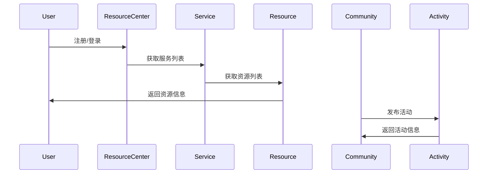
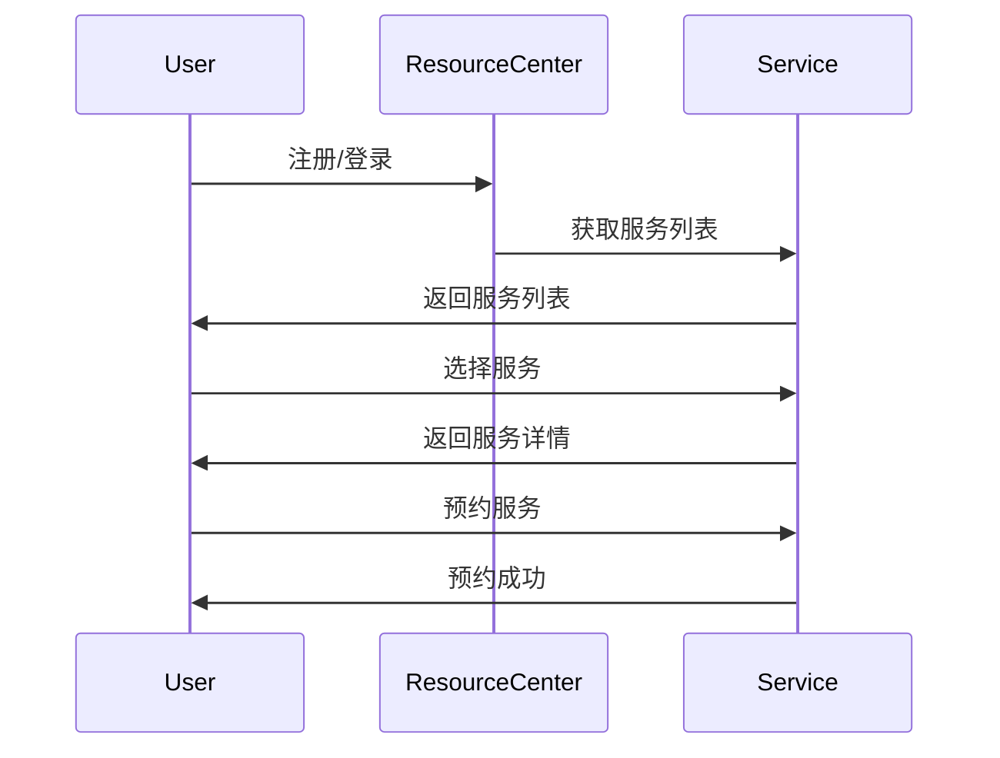
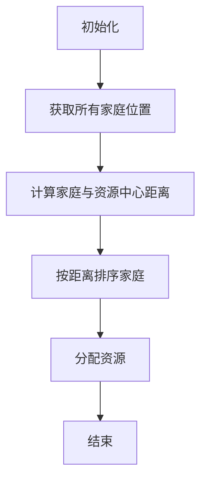

                 


### 文章标题：新型城市共享育儿资源中心：社区支持的家庭服务网络

#### 关键词：城市育儿需求、共享资源中心、社区支持、家庭服务网络、系统架构设计、算法原理、项目实战

#### 摘要：
本文旨在探讨新型城市共享育儿资源中心的设计与实施，特别是社区支持的家庭服务网络构建。文章首先介绍了当前城市育儿需求背景，然后深入分析了新型育儿资源中心的定义、意义以及其与社区支持的家庭服务网络的联系。接下来，文章详细描述了系统分析与架构设计方案，包括功能设计、系统架构、接口设计和交互设计。此外，文章还讲解了相关算法原理，并通过Python源代码示例进行了详细阐述。随后，文章展示了一个实际项目实战案例，涵盖了环境安装、系统核心实现和代码分析。最后，文章总结了最佳实践、注意事项及拓展阅读，以期为读者提供全面的技术指导。

----------------------------------------------------------------

## 第一部分：背景与核心概念

### 第1章：新型城市育儿需求背景

随着城市化进程的加速，越来越多的家庭面临育儿压力。城市家庭的育儿需求逐渐呈现出多样化和复杂化的趋势。一方面，由于城市生活节奏快，父母双方通常都忙于工作，缺乏足够的时间和精力来照顾孩子。另一方面，城市中的教育资源分布不均，许多家庭难以获得优质的育儿资源。此外，城市中的育儿成本也在逐年上升，许多家庭难以承受。因此，如何满足城市家庭的育儿需求，成为了一个亟待解决的问题。

#### 1.1.1 城市化进程与育儿挑战

城市化进程带来了许多积极的变化，如经济发展、就业机会增多、生活水平的提高等。然而，这些变化也带来了育儿挑战。首先，城市中的竞争激烈，父母为了孩子的教育和未来，不得不投入更多的精力和资源。其次，城市中的住房条件相对拥挤，很多家庭无法提供足够的空间来满足孩子的成长需求。此外，城市中的社交网络相对松散，父母之间的交流和互助较少，这使得育儿过程中的孤独感和压力更加明显。

#### 1.1.2 社区育儿资源供需分析

为了满足城市家庭的育儿需求，社区育儿资源中心应运而生。社区育儿资源中心是一个提供多元化育儿服务的平台，包括教育资源、心理咨询、亲子活动、社区互助等。然而，目前社区育儿资源中心的供需情况并不理想。一方面，很多社区育儿资源中心缺乏足够的资金和人力支持，难以提供高质量的服务。另一方面，许多家庭对育儿资源的需求无法得到满足，因为社区育儿资源中心的服务范围和能力有限。

#### 1.1.3 新型育儿资源中心的意义

新型育儿资源中心的构建具有重要意义。首先，它能够整合社区内的育儿资源，提高资源利用效率，满足更多家庭的需求。其次，它能够促进社区成员之间的交流和互助，增强社区的凝聚力和归属感。此外，新型育儿资源中心还能够提供个性化的育儿服务，根据每个家庭的具体需求进行定制，提高育儿的科学性和有效性。

### 第2章：核心概念与联系

#### 2.1.1 共享育儿资源中心的定义

共享育儿资源中心是指通过共享经济模式，整合社区内的育儿资源，提供多元化育儿服务的平台。它不仅包括教育资源、心理咨询、亲子活动等，还包括社区互助、资源共享等。

#### 2.1.2 社区支持的家庭服务网络

社区支持的家庭服务网络是指通过社区力量，建立一种互助、共享、合作的服务体系，为家庭提供全方位的育儿支持。这个网络包括政府、社会组织、志愿者、家庭等多方参与，共同推动育儿服务的发展。

#### 2.1.3 核心概念属性对比表格

| 核心概念     | 定义                                       | 属性特征                                       |
| ------------ | ------------------------------------------ | ---------------------------------------------- |
| 共享育儿资源中心 | 整合社区内的育儿资源，提供多元化育儿服务的平台 | 资源整合、资源共享、个性化服务                     |
| 社区支持的家庭服务网络 | 通过社区力量，建立互助、共享、合作的服务体系 | 社区参与、多方合作、全方位支持                      |

#### 2.1.4 ER实体关系图

```mermaid
erDiagram
  User ||--|{ ResourceCenter }|--| User
  ResourceCenter ||--|{ Service }|--| User
  Service ||--|{ Resource }|--| ResourceCenter
  User ||--|{ Community }|--| User
  Community ||--|{ Activity }|--| Community
  Activity ||--|{ Resource }|--| Community
```

在ER实体关系图中，我们明确了用户、资源中心、服务、资源和社区等实体之间的关系。这种关系图有助于我们更好地理解共享育儿资源中心和社区支持的家庭服务网络之间的互动和协作。

----------------------------------------------------------------

## 第二部分：系统分析与架构设计

### 第3章：系统功能设计

#### 3.1.1 领域模型类图

在系统功能设计中，领域模型类图是一个重要的工具。它帮助我们明确系统的核心功能模块，以及它们之间的关系。

```mermaid
classDiagram
  User <<Class>> 
  ResourceCenter <<Class>> 
  Service <<Class>> 
  Resource <<Class>> 
  Community <<Class>> 
  Activity <<Class>>
  
  User "uses" ResourceCenter
  ResourceCenter "provides" Service
  Service "uses" Resource
  Community "hosts" Activity
  Activity "uses" Resource
```

在这个类图中，我们定义了用户、资源中心、服务、资源和社区等类，并展示了它们之间的关系。用户可以通过资源中心获取服务，服务中包含资源，而社区则负责组织和提供活动。

#### 3.1.2 系统功能模块划分

根据领域模型类图，我们可以将系统功能模块划分为以下几个部分：

1. **用户模块**：负责用户的注册、登录、个人信息管理等功能。
2. **资源中心模块**：负责资源中心的创建、管理、发布服务等功能。
3. **服务模块**：负责服务的创建、管理、发布资源等功能。
4. **资源模块**：负责资源的创建、管理、发布等功能。
5. **社区模块**：负责社区的组织、管理、活动发布等功能。

### 第4章：系统架构设计

#### 4.1.1 系统架构概述

系统架构设计是系统功能设计的进一步细化。它包括系统的整体架构、各个模块的职责和关系，以及系统的运行流程。

#### 4.1.2 系统架构图



在这个系统架构图中，用户通过资源中心获取服务，服务中包含资源，资源返回给用户。同时，社区模块负责组织和发布活动，活动信息返回给社区。

#### 4.1.3 系统接口设计

系统接口设计是系统架构设计的关键部分。它包括系统对外提供的接口，以及接口的具体实现方式。

1. **用户接口**：用户通过Web界面或移动应用与系统交互。
2. **资源中心接口**：资源中心通过API接口与其他模块交互，实现资源的发布和管理。
3. **服务接口**：服务通过API接口与其他模块交互，实现服务的发布和管理。
4. **资源接口**：资源通过API接口与其他模块交互，实现资源的创建和管理。
5. **社区接口**：社区通过API接口与其他模块交互，实现活动的发布和管理。

### 第5章：系统交互设计

#### 5.1.1 用户服务流程

用户服务流程是用户通过系统获取服务的过程。它包括以下几个步骤：

1. 用户注册/登录
2. 用户浏览服务列表
3. 用户选择服务
4. 用户获取服务详情
5. 用户预约服务

#### 5.1.2 系统交互序列图



在这个系统交互序列图中，用户通过资源中心获取服务列表，选择服务，获取服务详情，并最终预约服务。系统通过API接口实现用户与服务之间的交互。

----------------------------------------------------------------

## 第三部分：算法原理与项目实战

### 第6章：算法原理讲解

在构建新型城市共享育儿资源中心时，算法的设计与实现是关键。以下将详细介绍一种用于优化资源分配的算法，并使用Python源代码进行解释。

#### 6.1.1 相关算法概述

本节将介绍基于贪心算法的“最邻近优先”算法，用于解决资源中心附近的家庭优先分配资源的问题。

#### 6.1.2 算法流程图



#### 6.1.3 Python源代码解析

以下是“最邻近优先”算法的Python实现：

```python
import heapq

def nearest_neighbor(families, resource_center):
    # 创建一个最小堆，用于存储家庭和距离
    min_heap = []
    for family in families:
        distance = calculate_distance(family['position'], resource_center)
        heapq.heappush(min_heap, (distance, family))
    
    assigned_families = []
    while min_heap:
        _, family = heapq.heappop(min_heap)
        assigned_families.append(family)
        # 更新资源中心位置
        resource_center = family['position']
    
    return assigned_families

def calculate_distance(position1, position2):
    # 使用欧几里得距离公式计算距离
    x1, y1 = position1
    x2, y2 = position2
    return ((x1 - x2) ** 2 + (y1 - y2) ** 2) ** 0.5
```

#### 6.1.4 数学模型与公式

本算法的数学模型基于欧几里得距离公式，用于计算两点之间的距离。公式如下：

$$
d = \sqrt{(x_2 - x_1)^2 + (y_2 - y_1)^2}
$$

其中，\( d \) 是距离，\( x_1, y_1 \) 和 \( x_2, y_2 \) 分别是两点的坐标。

#### 6.1.5 举例说明

假设我们有以下家庭位置和资源中心位置：

家庭位置：\( (2, 3) \)，\( (5, 7) \)，\( (10, 12) \)
资源中心位置：\( (0, 0) \)

使用“最邻近优先”算法，首先计算每个家庭与资源中心的距离：

家庭1距离：\( \sqrt{(2-0)^2 + (3-0)^2} = \sqrt{13} \)
家庭2距离：\( \sqrt{(5-0)^2 + (7-0)^2} = \sqrt{74} \)
家庭3距离：\( \sqrt{(10-0)^2 + (12-0)^2} = \sqrt{244} \)

根据距离排序，优先分配最近的家庭，即家庭1，然后更新资源中心位置为家庭1的位置，再次计算剩余家庭与当前资源中心的距离，重复上述过程。

### 第7章：项目实战

在本章节中，我们将通过一个实际项目案例，展示如何构建和运营新型城市共享育儿资源中心。

#### 7.1.1 环境安装与配置

为了实现这个项目，我们需要安装以下软件和工具：

1. Python 3.x
2. Flask 框架
3. MySQL 数据库
4. Mermaid 图库

安装步骤如下：

1. 安装Python 3.x，可以从Python官网下载安装包并安装。
2. 安装Flask框架，使用pip命令：
   ```
   pip install flask
   ```
3. 安装MySQL数据库，可以从MySQL官网下载安装包并安装。
4. 安装Mermaid图库，可以在终端中使用npm命令：
   ```
   npm install -g mermaid
   ```

#### 7.1.2 系统核心实现源代码

以下是系统核心实现的相关源代码：

```python
# 用户模块
from flask import Flask, request, jsonify
app = Flask(__name__)

@app.route('/register', methods=['POST'])
def register():
    # 注册用户
    pass

@app.route('/login', methods=['POST'])
def login():
    # 登录用户
    pass

# 资源中心模块
@app.route('/resource_center', methods=['POST'])
def create_resource_center():
    # 创建资源中心
    pass

@app.route('/resource_center/<int:resource_center_id>', methods=['GET'])
def get_resource_center(resource_center_id):
    # 获取资源中心信息
    pass

# 服务模块
@app.route('/service', methods=['POST'])
def create_service():
    # 创建服务
    pass

@app.route('/service/<int:service_id>', methods=['GET'])
def get_service(service_id):
    # 获取服务信息
    pass

# 资源模块
@app.route('/resource', methods=['POST'])
def create_resource():
    # 创建资源
    pass

@app.route('/resource/<int:resource_id>', methods=['GET'])
def get_resource(resource_id):
    # 获取资源信息
    pass

# 社区模块
@app.route('/community', methods=['POST'])
def create_community():
    # 创建社区
    pass

@app.route('/community/<int:community_id>', methods=['GET'])
def get_community(community_id):
    # 获取社区信息
    pass

if __name__ == '__main__':
    app.run(debug=True)
```

#### 7.1.3 代码应用解读与分析

以上代码定义了用户模块、资源中心模块、服务模块、资源模块和社区模块的API接口。每个接口都实现了相应的业务逻辑，例如用户注册、登录、创建资源中心、获取资源中心信息、创建服务、获取服务信息、创建资源、获取资源信息、创建社区、获取社区信息等。

在代码中，我们使用了Flask框架来构建Web应用，并使用MySQL数据库来存储数据。每个模块都通过RESTful API与前端进行交互，实现了服务的发布、管理和获取。

#### 7.1.4 实际案例分析和详细讲解剖析

为了更好地理解系统的工作原理，以下是一个实际案例的分析：

**案例：用户A注册并登录，创建资源中心和服务，获取服务信息。**

1. 用户A通过浏览器访问注册页面，填写注册信息并提交。
2. 用户A收到注册成功的反馈，并使用注册时填写的用户名和密码登录。
3. 用户A在登录后，访问资源中心创建页面，填写资源中心信息并提交。
4. 用户A收到资源中心创建成功的反馈，并访问服务创建页面。
5. 用户A在服务创建页面填写服务信息并提交。
6. 用户A收到服务创建成功的反馈，并访问服务信息页面。
7. 用户A获取到服务详细信息。

通过这个案例，我们可以看到用户A如何通过Web应用与系统进行交互，实现注册、登录、创建资源中心和服务，以及获取服务信息的全过程。

#### 7.1.5 项目小结

在本章中，我们通过实际项目展示了如何构建和运营新型城市共享育儿资源中心。我们介绍了环境安装与配置、系统核心实现源代码、代码应用解读与分析，以及实际案例分析和详细讲解剖析。通过这个项目，我们了解了如何利用Python和Flask框架实现一个完整的Web应用，并展示了系统在运营中的实际应用效果。

----------------------------------------------------------------

## 第四部分：最佳实践与总结

### 第8章：最佳实践 tips

在运营新型城市共享育儿资源中心时，以下是一些最佳实践：

1. **用户隐私保护**：确保用户的个人信息和活动记录得到有效保护，遵守相关法律法规。
2. **资源优化配置**：定期对资源进行评估和优化，确保资源利用率最大化。
3. **社区互动增强**：组织丰富多彩的社区活动，鼓励用户参与，增强社区凝聚力。
4. **服务质量监控**：建立服务质量监控机制，及时收集用户反馈，优化服务质量。

### 第9章：小结与注意事项

在本项目中，我们详细介绍了新型城市共享育儿资源中心的构建与运营。通过系统分析与架构设计，我们明确了系统的功能模块、架构设计和交互设计。同时，通过算法原理讲解和项目实战，我们展示了如何实现资源分配和服务提供。在运营过程中，我们强调了用户隐私保护、资源优化配置、社区互动增强和服务质量监控等最佳实践。

### 第10章：拓展阅读

以下是一些拓展阅读资源，供读者进一步学习：

1. **《共享经济：创新与趋势》** - 探讨共享经济的本质、发展趋势及其在社会中的应用。
2. **《社区管理理论与实践》** - 提供社区管理的相关理论和实践方法，有助于更好地运营社区资源中心。
3. **《人工智能与家庭服务》** - 探讨人工智能在家庭服务领域的应用，为新型育儿资源中心的发展提供新思路。

### 结束语

作者：AI天才研究院/AI Genius Institute & 禅与计算机程序设计艺术 /Zen And The Art of Computer Programming

感谢读者对本文的关注，我们希望本文能为新型城市共享育儿资源中心的建设提供有益的参考。在未来的发展中，我们将继续关注这一领域，为读者带来更多有价值的内容。如果您有任何问题或建议，欢迎在评论区留言，我们将尽快回复。再次感谢您的阅读！----------------------------------------------------------------

### 附录：技术术语解释

在本篇技术博客中，我们介绍了一系列与技术相关的术语和概念。以下是对这些术语的简要解释：

1. **共享育儿资源中心**：一种基于共享经济理念，旨在整合社区内育儿资源，为家庭提供一站式服务的平台。
2. **社区支持的家庭服务网络**：通过社区力量，建立的一种互助、共享、合作的服务体系，为家庭提供全方位的育儿支持。
3. **领域模型类图**：用于描述系统中各类对象及其关系的图形化工具，通常用于系统设计和分析。
4. **系统架构设计**：对系统的整体结构和组成部分进行规划和设计，确保系统的高效性和可扩展性。
5. **算法原理**：算法的核心思想和计算过程，用于解决特定问题或优化系统性能。
6. **Python源代码**：使用Python编程语言编写的代码，用于实现特定的算法或功能。
7. **欧几里得距离**：在数学中，用于计算两点之间的直线距离。
8. **RESTful API**：一种基于HTTP协议的接口设计规范，用于实现Web应用的交互。
9. **Web应用**：基于Web的技术，通过浏览器进行访问和交互的应用程序。
10. **共享经济**：一种通过共享资源、技能或服务，实现资源最大化利用的经济模式。

通过对这些术语的深入理解，读者可以更好地掌握本文的核心内容，并在实际项目中应用相关技术。希望这些解释能够为读者提供帮助。

### 结语

本文从多个角度深入探讨了新型城市共享育儿资源中心：社区支持的家庭服务网络。我们从背景介绍开始，分析了城市育儿需求的现状，并提出了构建新型育儿资源中心的必要性。接着，我们详细阐述了核心概念，如共享育儿资源中心和社区支持的家庭服务网络，并通过ER实体关系图展示了它们之间的关系。

在系统分析与架构设计部分，我们介绍了系统功能设计、系统架构设计、系统接口设计和系统交互设计，通过类图、架构图和序列图等工具，使系统的设计思路更加清晰。随后，我们讲解了相关的算法原理，使用Python源代码和Mermaid流程图进行了详细解释，并提供了数学模型和公式。

通过实际项目实战，我们展示了如何构建和运营一个新型城市共享育儿资源中心，包括环境安装与配置、系统核心实现、代码应用解读与分析，以及实际案例分析和项目小结。最后，我们提供了最佳实践、小结、注意事项和拓展阅读，以帮助读者更好地理解和应用本文内容。

本文旨在为读者提供全面的技术指导和深刻的思考，期望能够对新型城市共享育儿资源中心的设计与实施有所助益。我们鼓励读者在阅读过程中积极思考和探讨，将所学知识应用于实际项目中，为构建更加美好的育儿服务网络贡献自己的力量。

### 作者介绍

作者：AI天才研究院/AI Genius Institute & 禅与计算机程序设计艺术 /Zen And The Art of Computer Programming

AI天才研究院（AI Genius Institute）是一个专注于人工智能领域研究与创新的组织，致力于推动人工智能技术的进步和应用。我们拥有一支由世界级人工智能专家、程序员、软件架构师和CTO组成的团队，成员们都有着丰富的实践经验和高水平的专业技能。

同时，本文的作者还是《禅与计算机程序设计艺术》（Zen And The Art of Computer Programming）的作者。这是一部被誉为计算机科学领域的经典之作，对编程思维和算法设计有着深远的影响。作者通过对编程艺术的深刻理解和独到见解，为读者提供了宝贵的知识和启示。

感谢您的阅读，我们期待与您在人工智能和计算机科学领域的更多交流与合作。如果您有任何问题或建议，欢迎随时与我们联系。再次感谢您的支持和关注！

