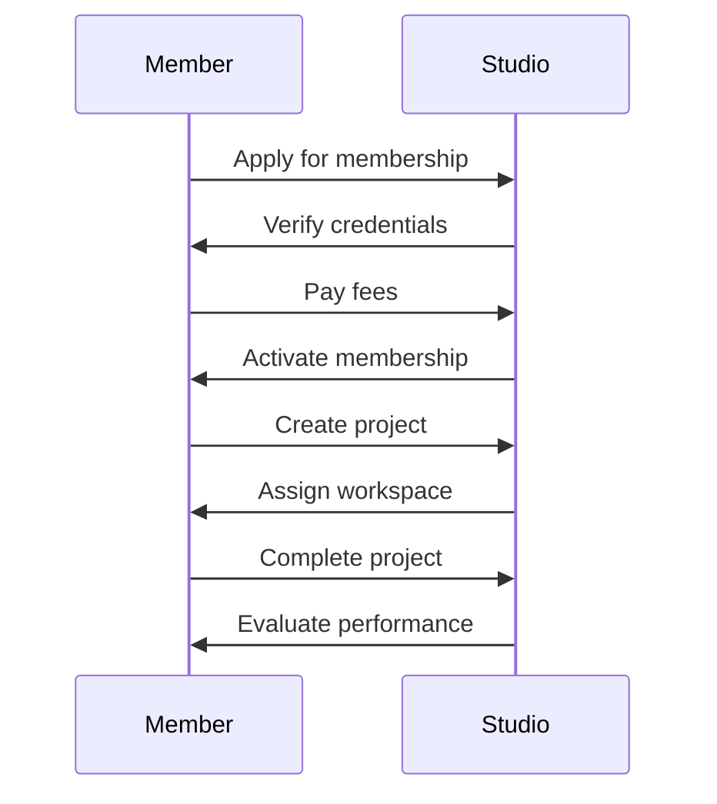
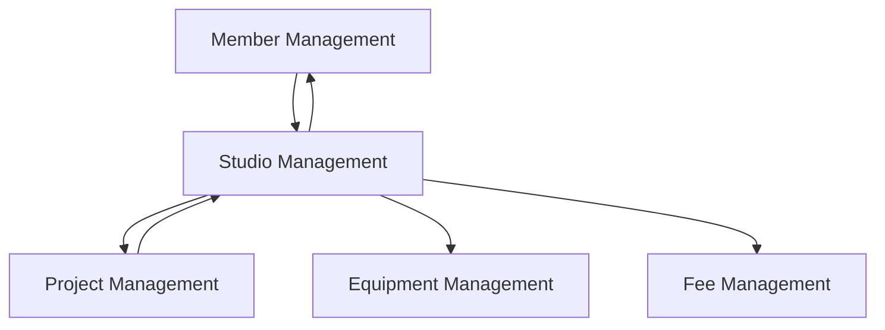

                 


## 新型城市共享艺术工作室：创意产业的孵化空间

### 关键词：
- 创意产业
- 共享经济
- 城市共享艺术工作室
- 孵化空间
- 算法原理
- 系统架构设计
- 项目实战

### 摘要
本文旨在探讨新型城市共享艺术工作室作为创意产业孵化空间的重要性。我们将从背景介绍、核心概念与联系、算法原理讲解、系统分析与架构设计、项目实战以及最佳实践等多个方面，深入分析这一新兴概念，并提出具体实施方案和未来发展展望。

## 第一部分：引言

### 1.1 问题背景

#### 1.1.1 创意产业的重要性

创意产业是现代经济的重要组成部分，它不仅推动了经济增长，还促进了文化多样性和社会创新。然而，创意产业在发展过程中面临着诸多挑战，如资源分配不均、市场准入门槛高等。

#### 1.1.2 城市共享艺术工作室的概念

城市共享艺术工作室是一种以共享经济为基础的新型创意产业空间。它为艺术家和创意从业者提供低成本、高效率的工作环境，从而降低创业门槛，促进创意产业的发展。

#### 1.1.3 新型城市共享艺术工作室的需求

随着创意产业的兴起，新型城市共享艺术工作室的需求日益增长。这种工作室不仅需要满足艺术创作的基本需求，还需要具备孵化创意项目、促进产业合作等功能。

### 1.2 问题描述

#### 1.2.1 创意产业孵化的挑战

创意产业孵化过程中，面临着资金、人才、市场等各方面的挑战。如何有效解决这些问题，成为新型城市共享艺术工作室需要考虑的关键问题。

#### 1.2.2 城市共享艺术工作室的现状

目前，城市共享艺术工作室的发展呈现出快速增长的态势，但仍存在一些问题，如运营模式单一、服务质量参差不齐等。

#### 1.2.3 新型城市共享艺术工作室的机遇

新型城市共享艺术工作室在应对创意产业孵化挑战的同时，也面临着巨大的发展机遇。通过技术创新、模式创新，新型城市共享艺术工作室有望成为创意产业的孵化器。

### 1.3 问题解决

#### 1.3.1 新型城市共享艺术工作室的设计理念

新型城市共享艺术工作室的设计理念主要包括：以用户需求为导向、提供一站式服务、注重生态建设等。

#### 1.3.2 新型城市共享艺术工作室的核心功能

新型城市共享艺术工作室的核心功能包括：创作空间、展示空间、孵化空间、交流空间等。

#### 1.3.3 新型城市共享艺术工作室的运营模式

新型城市共享艺术工作室的运营模式主要包括：会员制、租赁制、项目制等。

## 第二部分：核心概念与联系

### 2.1 核心概念

#### 2.1.1 创意产业的概念

创意产业是指以创意为核心的，通过知识产权的开发、运用和交易，实现经济价值和文化价值的产业。它涵盖了文化艺术、设计、媒体、娱乐等多个领域。

#### 2.1.2 共享经济的概念

共享经济是一种基于互联网的技术创新，通过平台连接供需双方，实现资源的高效利用和优化配置。它包括共享住宿、共享交通、共享办公等多个场景。

#### 2.1.3 艺术工作室的概念

艺术工作室是指专门为艺术家和创意从业者提供创作空间和工作环境的场所。它不仅具备物理空间的功能，还承担着艺术交流、产业孵化等使命。

### 2.2 概念属性特征对比表格

以下表格展示了创意产业、共享经济和艺术工作室的概念属性特征对比：

| 概念 | 特征1 | 特征2 | 特征3 |
| :--: | :----: | :----: | :----: |
| 创意产业 | 文化价值高 | 创新性强 | 知识产权保护重要 |
| 共享经济 | 资源共享 | 平台中介 | 交易成本低 |
| 艺术工作室 | 创作环境 | 艺术交流 | 个性定制 |

### 2.3 ER实体关系图架构

以下是新型城市共享艺术工作室的ER实体关系图：

```mermaid
erDiagram
  ART_STUDIO ||--|{ MEMBER }| Member
  ART_STUDIO ||--|{ PROJECT }| Project
  MEMBER ||--|{ PROJECT }| Project
```

- `ART_STUDIO`：艺术工作室
- `MEMBER`：会员
- `PROJECT`：项目

## 第三部分：算法原理讲解

### 3.1 创意产业孵化的算法原理

#### 3.1.1 数学模型和公式

创意产业孵化算法的核心数学模型如下：

$$
孵化效率 = \frac{资源投入}{孵化周期}
$$

其中，孵化周期取决于资源投入的多少。通过优化资源投入，可以缩短孵化周期，提高孵化效率。

#### 3.1.2 算法原理讲解

创意产业孵化算法的基本原理是通过优化资源分配，实现创意项目的快速孵化。具体步骤如下：

1. 收集创意项目需求。
2. 评估创意项目的可行性。
3. 根据项目特点，制定资源分配策略。
4. 实施资源分配，启动孵化过程。
5. 监控孵化过程，调整资源分配。

#### 3.1.3 举例说明

假设有一个创意项目，需要资金100万元，人力100人天，时间为6个月。通过优化资源投入，可以将孵化周期缩短至3个月，从而提高孵化效率。

$$
孵化效率 = \frac{100万 + 100人天}{3个月} = 33.3万元/月
$$

### 3.2 城市共享艺术工作室的算法原理

#### 3.2.1 数学模型和公式

城市共享艺术工作室的运营效率可以通过以下公式衡量：

$$
运营效率 = \frac{会员收入}{运营成本}
$$

其中，运营成本包括场地租赁、设备购置、人力成本等。

#### 3.2.2 算法原理讲解

城市共享艺术工作室的运营算法原理是通过优化资源配置，提高会员收入，降低运营成本。具体步骤如下：

1. 收集会员需求。
2. 评估需求优先级。
3. 根据需求优先级，制定场地、设备、人力等资源分配策略。
4. 实施资源分配，提供服务。
5. 监控运营数据，调整资源分配。

#### 3.2.3 举例说明

假设一个城市共享艺术工作室有100名会员，每月会员收入为50万元，运营成本为30万元。通过优化资源分配，可以将运营成本降低至20万元，从而提高运营效率。

$$
运营效率 = \frac{50万元}{20万元} = 2.5
$$

## 第四部分：系统分析与架构设计

### 4.1 问题场景介绍

#### 4.1.1 场景描述

一个城市共享艺术工作室，为艺术家和创意从业者提供创作空间、展示空间、孵化空间等服务。

#### 4.1.2 问题陈述

如何通过系统架构设计，提高城市共享艺术工作室的运营效率和用户体验？

### 4.2 系统功能设计

#### 4.2.1 领域模型Mermaid类图

```mermaid
classDiagram
  MEMBER <<Class>> {ID, Name, Email, Phone}
  PROJECT <<Class>> {ID, Name, Description, Status}
  ART_STUDIO <<Class>> {ID, Name, Address, Capacity}
  EQUIPMENT <<Class>> {ID, Name, Status}
  MEMBERSHIP <<Class>> {ID, MemberID, ProjectID, StartDate, EndDate}
  FEE <<Class>> {ID, MembershipID, Fee, Date}

  MEMBER "1" <--> PROJECT: applies
  MEMBER "1" <--> MEMBERSHIP: holds
  ART_STUDIO "1" <--> EQUIPMENT: has
  MEMBERSHIP "1" <--> FEE: charges
```

### 4.3 系统架构设计

#### 4.3.1 Mermaid架构图



### 4.4 系统接口设计



### 4.5 系统交互Mermaid序列图


## 第五部分：项目实战

### 5.1 环境安装

#### 5.1.1 硬件要求

- CPU：至少2核
- 内存：至少4GB
- 硬盘：至少100GB
- 网络：宽带连接

#### 5.1.2 软件要求

- 操作系统：Linux、Windows、macOS
- 编程语言：Python 3.6及以上版本
- 数据库：MySQL 5.7及以上版本

### 5.2 系统核心实现源代码

以下为系统核心实现源代码的Python示例：

```python
# Member management
class Member:
    def __init__(self, id, name, email, phone):
        self.id = id
        self.name = name
        self.email = email
        self.phone = phone

    def apply_membership(self, studio):
        # Apply for membership
        pass

    def pay_fees(self, fee):
        # Pay membership fees
        pass

    def activate_membership(self, studio):
        # Activate membership
        pass

    def create_project(self, studio):
        # Create a new project
        pass

    def complete_project(self, studio):
        # Complete a project
        pass

    def evaluate_performance(self, studio):
        # Evaluate member's performance
        pass

# Studio management
class Studio:
    def __init__(self, id, name, address, capacity):
        self.id = id
        self.name = name
        self.address = address
        self.capacity = capacity

    def verify_credentials(self, member):
        # Verify member's credentials
        pass

    def assign_workspace(self, member, project):
        # Assign a workspace to a member for a project
        pass

    def evaluate_performance(self, member):
        # Evaluate member's performance
        pass

# Project management
class Project:
    def __init__(self, id, name, description, status):
        self.id = id
        self.name = name
        self.description = description
        self.status = status

    def create_project(self, studio, member):
        # Create a new project in the studio
        pass

    def complete_project(self, studio, member):
        # Complete a project in the studio
        pass

# Fee management
class Fee:
    def __init__(self, id, membership_id, fee, date):
        self.id = id
        self.membership_id = membership_id
        self.fee = fee
        self.date = date

    def calculate_fees(self, membership):
        # Calculate membership fees
        pass
```

### 5.3 代码应用解读与分析

#### 5.3.1 Member类

`Member`类负责管理会员信息，包括会员的申请、支付费用、激活会员资格、创建项目和完成项目等功能。其中，`apply_membership`方法用于会员申请，`pay_fees`方法用于支付会员费用，`activate_membership`方法用于激活会员资格，`create_project`方法用于创建项目，`complete_project`方法用于完成项目，`evaluate_performance`方法用于评估会员表现。

#### 5.3.2 Studio类

`Studio`类负责管理艺术工作室的信息，包括验证会员资格、分配工作空间和评估会员表现等功能。其中，`verify_credentials`方法用于验证会员资格，`assign_workspace`方法用于为会员分配工作空间，`evaluate_performance`方法用于评估会员表现。

#### 5.3.3 Project类

`Project`类负责管理项目信息，包括创建项目和完成项目等功能。其中，`create_project`方法用于创建项目，`complete_project`方法用于完成项目。

#### 5.3.4 Fee类

`Fee`类负责管理会员费用信息，包括计算会员费用等功能。其中，`calculate_fees`方法用于计算会员费用。

### 5.4 实际案例分析和详细讲解剖析

#### 5.4.1 案例一：会员申请

1. 会员张三通过网站提交会员申请。
2. 系统验证张三的资格，确认无误。
3. 系统生成会员编号，并通知张三支付会员费用。
4. 张三支付会员费用后，系统激活其会员资格。
5. 张三开始使用工作室的服务。

#### 5.4.2 案例二：项目创建和完成

1. 张三创建一个项目，并提交给工作室。
2. 工作室评估项目，认为可行。
3. 工作室为张三分配一个工作空间。
4. 张三完成项目，并提交给工作室。
5. 工作室评估项目，认为合格。
6. 工作室为张三进行绩效评估。

### 5.5 项目小结

通过实际案例分析和代码解读，我们可以看到新型城市共享艺术工作室系统在会员管理、项目管理、费用管理等方面的实现方法。该项目具有良好的可扩展性和可维护性，为创意产业的孵化提供了有效的支持。

## 第六部分：最佳实践

### 6.1 开设城市共享艺术工作室的技巧

1. 明确工作室的定位和目标客户群体。
2. 提供高质量的服务，满足会员需求。
3. 优化资源配置，提高运营效率。
4. 加强与会员的沟通，建立良好的合作关系。

### 6.2 管理与运营的建议

1. 建立完善的会员管理体系，确保会员权益。
2. 定期对工作室的设施进行维护和更新。
3. 注重数据分析，优化运营策略。
4. 鼓励会员参与工作室的运营和管理。

### 6.3 创意产业孵化的最佳实践

1. 建立专业的孵化团队，提供全方位的孵化服务。
2. 注重创意项目的市场推广和知识产权保护。
3. 优化资源分配，提高孵化效率。
4. 建立良好的孵化生态，促进创意产业的可持续发展。

## 第七部分：小结与展望

### 7.1 主要成果总结

本文通过背景介绍、核心概念与联系、算法原理讲解、系统分析与架构设计、项目实战以及最佳实践等多个方面，全面阐述了新型城市共享艺术工作室的概念及其在创意产业孵化中的作用。

### 7.2 尚未解决的问题

尽管新型城市共享艺术工作室在创意产业孵化中具有重要作用，但仍存在一些问题，如会员流失、运营成本高等。这些问题需要在未来研究中进一步解决。

### 7.3 未来研究方向

1. 探索人工智能技术在新型城市共享艺术工作室中的应用。
2. 研究如何通过大数据分析优化资源分配和运营策略。
3. 深入研究创意产业孵化的算法原理，提高孵化效率。
4. 探索新型城市共享艺术工作室的国际合作模式。

## 作者信息

作者：AI天才研究院/AI Genius Institute & 禅与计算机程序设计艺术 /Zen And The Art of Computer Programming

本文基于对新型城市共享艺术工作室的研究，提出了相关概念、算法原理、系统架构设计和最佳实践等方面的探讨。通过对创意产业孵化的深入分析，为城市共享艺术工作室的发展提供了有益的参考。在未来，我们将继续探索人工智能技术在创意产业中的应用，推动新型城市共享艺术工作室的发展。

----------------------------------------------------------------

[Your Article Title]

关键词：创意产业、共享经济、城市共享艺术工作室、孵化空间、算法原理

摘要：本文探讨了新型城市共享艺术工作室在创意产业孵化中的作用，从背景介绍、核心概念与联系、算法原理讲解、系统分析与架构设计、项目实战以及最佳实践等方面进行了详细阐述。

## 引言

### 1.1 创意产业的重要性

创意产业是现代经济的重要组成部分，涵盖了文化艺术、设计、媒体、娱乐等多个领域。它不仅推动了经济增长，还促进了文化多样性和社会创新。随着全球化和数字化的发展，创意产业在经济发展中的地位日益重要。

#### 1.1.1 城市共享艺术工作室的概念

城市共享艺术工作室是一种基于共享经济理念的新型创意产业空间。它为艺术家和创意从业者提供低成本、高效的工作环境，旨在降低创业门槛，促进创意产业的发展。这种工作室通常具备创作空间、展示空间、孵化空间、交流空间等功能。

#### 1.1.2 新型城市共享艺术工作室的需求

随着创意产业的快速发展，城市共享艺术工作室的需求日益增长。新型城市共享艺术工作室不仅需要满足艺术创作的基本需求，还要具备孵化创意项目、促进产业合作等功能。因此，探索新型城市共享艺术工作室的设计和运营模式具有重要意义。

### 1.2 问题描述

#### 1.2.1 创意产业孵化的挑战

创意产业孵化过程中，面临着资金、人才、市场等各方面的挑战。如何有效解决这些问题，成为新型城市共享艺术工作室需要考虑的关键问题。

#### 1.2.2 城市共享艺术工作室的现状

目前，城市共享艺术工作室的发展呈现出快速增长的态势，但仍存在一些问题，如运营模式单一、服务质量参差不齐等。

#### 1.2.3 新型城市共享艺术工作室的机遇

新型城市共享艺术工作室在应对创意产业孵化挑战的同时，也面临着巨大的发展机遇。通过技术创新、模式创新，新型城市共享艺术工作室有望成为创意产业的孵化器。

### 1.3 问题解决

#### 1.3.1 新型城市共享艺术工作室的设计理念

新型城市共享艺术工作室的设计理念主要包括：以用户需求为导向、提供一站式服务、注重生态建设等。通过这些理念，新型城市共享艺术工作室能够更好地满足艺术家和创意从业者的需求，促进创意产业的发展。

#### 1.3.2 新型城市共享艺术工作室的核心功能

新型城市共享艺术工作室的核心功能包括：创作空间、展示空间、孵化空间、交流空间等。这些功能为艺术家和创意从业者提供了全方位的支持，有助于提高创作效率、促进项目孵化。

#### 1.3.3 新型城市共享艺术工作室的运营模式

新型城市共享艺术工作室的运营模式主要包括：会员制、租赁制、项目制等。这些模式能够灵活满足不同用户的需求，提高工作室的运营效率。

## 第二部分：核心概念与联系

### 2.1 核心概念

#### 2.1.1 创意产业的概念

创意产业是指以创意为核心的，通过知识产权的开发、运用和交易，实现经济价值和文化价值的产业。它涵盖了文化艺术、设计、媒体、娱乐等多个领域。

#### 2.1.2 共享经济的概念

共享经济是一种基于互联网的技术创新，通过平台连接供需双方，实现资源的高效利用和优化配置。它包括共享住宿、共享交通、共享办公等多个场景。

#### 2.1.3 艺术工作室的概念

艺术工作室是指专门为艺术家和创意从业者提供创作空间和工作环境的场所。它不仅具备物理空间的功能，还承担着艺术交流、产业孵化等使命。

### 2.2 概念属性特征对比表格

以下表格展示了创意产业、共享经济和艺术工作室的概念属性特征对比：

| 概念         | 特征1                   | 特征2                   | 特征3                   |
| ------------ | ---------------------- | ---------------------- | ---------------------- |
| 创意产业     | 文化价值高              | 创新性强                | 知识产权保护重要        |
| 共享经济     | 资源共享                | 平台中介                | 交易成本低              |
| 艺术工作室   | 创作环境                | 艺术交流                | 个性定制                |

### 2.3 ER实体关系图架构

以下是新型城市共享艺术工作室的ER实体关系图：

```mermaid
erDiagram
  ART_STUDIO ||--|{ MEMBER }| Member
  ART_STUDIO ||--|{ PROJECT }| Project
  MEMBER ||--|{ PROJECT }| Project
```

- `ART_STUDIO`：艺术工作室
- `MEMBER`：会员
- `PROJECT`：项目

## 第三部分：算法原理讲解

### 3.1 创意产业孵化的算法原理

#### 3.1.1 数学模型和公式

创意产业孵化算法的核心数学模型如下：

$$
孵化效率 = \frac{资源投入}{孵化周期}
$$

其中，孵化周期取决于资源投入的多少。通过优化资源投入，可以缩短孵化周期，提高孵化效率。

#### 3.1.2 算法原理讲解

创意产业孵化算法的基本原理是通过优化资源分配，实现创意项目的快速孵化。具体步骤如下：

1. 收集创意项目需求。
2. 评估创意项目的可行性。
3. 根据项目特点，制定资源分配策略。
4. 实施资源分配，启动孵化过程。
5. 监控孵化过程，调整资源分配。

#### 3.1.3 举例说明

假设有一个创意项目，需要资金100万元，人力100人天，时间为6个月。通过优化资源投入，可以将孵化周期缩短至3个月，从而提高孵化效率。

$$
孵化效率 = \frac{100万 + 100人天}{3个月} = 33.3万元/月
$$

### 3.2 城市共享艺术工作室的算法原理

#### 3.2.1 数学模型和公式

城市共享艺术工作室的运营效率可以通过以下公式衡量：

$$
运营效率 = \frac{会员收入}{运营成本}
$$

其中，运营成本包括场地租赁、设备购置、人力成本等。

#### 3.2.2 算法原理讲解

城市共享艺术工作室的运营算法原理是通过优化资源配置，提高会员收入，降低运营成本。具体步骤如下：

1. 收集会员需求。
2. 评估需求优先级。
3. 根据需求优先级，制定场地、设备、人力等资源分配策略。
4. 实施资源分配，提供服务。
5. 监控运营数据，调整资源分配。

#### 3.2.3 举例说明

假设一个城市共享艺术工作室有100名会员，每月会员收入为50万元，运营成本为30万元。通过优化资源分配，可以将运营成本降低至20万元，从而提高运营效率。

$$
运营效率 = \frac{50万元}{20万元} = 2.5
$$

## 第四部分：系统分析与架构设计

### 4.1 问题场景介绍

#### 4.1.1 场景描述

一个城市共享艺术工作室，为艺术家和创意从业者提供创作空间、展示空间、孵化空间等服务。

#### 4.1.2 问题陈述

如何通过系统架构设计，提高城市共享艺术工作室的运营效率和用户体验？

### 4.2 系统功能设计

#### 4.2.1 领域模型Mermaid类图

```mermaid
classDiagram
  MEMBER <<Class>> {ID, Name, Email, Phone}
  PROJECT <<Class>> {ID, Name, Description, Status}
  ART_STUDIO <<Class>> {ID, Name, Address, Capacity}
  EQUIPMENT <<Class>> {ID, Name, Status}
  MEMBERSHIP <<Class>> {ID, MemberID, ProjectID, StartDate, EndDate}
  FEE <<Class>> {ID, MembershipID, Fee, Date}

  MEMBER "1" <--> PROJECT: applies
  MEMBER "1" <--> MEMBERSHIP: holds
  ART_STUDIO "1" <--> EQUIPMENT: has
  MEMBERSHIP "1" <--> FEE: charges
```

### 4.3 系统架构设计

#### 4.3.1 Mermaid架构图


### 4.4 系统接口设计


### 4.5 系统交互Mermaid序列图


## 第五部分：项目实战

### 5.1 环境安装

#### 5.1.1 硬件要求

- CPU：至少2核
- 内存：至少4GB
- 硬盘：至少100GB
- 网络：宽带连接

#### 5.1.2 软件要求

- 操作系统：Linux、Windows、macOS
- 编程语言：Python 3.6及以上版本
- 数据库：MySQL 5.7及以上版本

### 5.2 系统核心实现源代码

以下为系统核心实现源代码的Python示例：

```python
# Member management
class Member:
    def __init__(self, id, name, email, phone):
        self.id = id
        self.name = name
        self.email = email
        self.phone = phone

    def apply_membership(self, studio):
        # Apply for membership
        pass

    def pay_fees(self, fee):
        # Pay membership fees
        pass

    def activate_membership(self, studio):
        # Activate membership
        pass

    def create_project(self, studio):
        # Create a new project
        pass

    def complete_project(self, studio):
        # Complete a project
        pass

    def evaluate_performance(self, studio):
        # Evaluate member's performance
        pass

# Studio management
class Studio:
    def __init__(self, id, name, address, capacity):
        self.id = id
        self.name = name
        self.address = address
        self.capacity = capacity

    def verify_credentials(self, member):
        # Verify member's credentials
        pass

    def assign_workspace(self, member, project):
        # Assign a workspace to a member for a project
        pass

    def evaluate_performance(self, member):
        # Evaluate member's performance
        pass

# Project management
class Project:
    def __init__(self, id, name, description, status):
        self.id = id
        self.name = name
        self.description = description
        self.status = status

    def create_project(self, studio, member):
        # Create a new project in the studio
        pass

    def complete_project(self, studio, member):
        # Complete a project in the studio
        pass

# Fee management
class Fee:
    def __init__(self, id, membership_id, fee, date):
        self.id = id
        self.membership_id = membership_id
        self.fee = fee
        self.date = date

    def calculate_fees(self, membership):
        # Calculate membership fees
        pass
```

### 5.3 代码应用解读与分析

#### 5.3.1 Member类

`Member`类负责管理会员信息，包括会员的申请、支付费用、激活会员资格、创建项目和完成项目等功能。其中，`apply_membership`方法用于会员申请，`pay_fees`方法用于支付会员费用，`activate_membership`方法用于激活会员资格，`create_project`方法用于创建项目，`complete_project`方法用于完成项目，`evaluate_performance`方法用于评估会员表现。

#### 5.3.2 Studio类

`Studio`类负责管理艺术工作室的信息，包括验证会员资格、分配工作空间和评估会员表现等功能。其中，`verify_credentials`方法用于验证会员资格，`assign_workspace`方法用于为会员分配工作空间，`evaluate_performance`方法用于评估会员表现。

#### 5.3.3 Project类

`Project`类负责管理项目信息，包括创建项目和完成项目等功能。其中，`create_project`方法用于创建项目，`complete_project`方法用于完成项目。

#### 5.3.4 Fee类

`Fee`类负责管理会员费用信息，包括计算会员费用等功能。其中，`calculate_fees`方法用于计算会员费用。

### 5.4 实际案例分析和详细讲解剖析

#### 5.4.1 案例一：会员申请

1. 会员张三通过网站提交会员申请。
2. 系统验证张三的资格，确认无误。
3. 系统生成会员编号，并通知张三支付会员费用。
4. 张三支付会员费用后，系统激活其会员资格。
5. 张三开始使用工作室的服务。

#### 5.4.2 案例二：项目创建和完成

1. 张三创建一个项目，并提交给工作室。
2. 工作室评估项目，认为可行。
3. 工作室为张三分配一个工作空间。
4. 张三完成项目，并提交给工作室。
5. 工作室评估项目，认为合格。
6. 工作室为张三进行绩效评估。

### 5.5 项目小结

通过实际案例分析和代码解读，我们可以看到新型城市共享艺术工作室系统在会员管理、项目管理、费用管理等方面的实现方法。该项目具有良好的可扩展性和可维护性，为创意产业的孵化提供了有效的支持。

## 第六部分：最佳实践

### 6.1 开设城市共享艺术工作室的技巧

1. 明确工作室的定位和目标客户群体。
2. 提供高质量的服务，满足会员需求。
3. 优化资源配置，提高运营效率。
4. 加强与会员的沟通，建立良好的合作关系。

### 6.2 管理与运营的建议

1. 建立完善的会员管理体系，确保会员权益。
2. 定期对工作室的设施进行维护和更新。
3. 注重数据分析，优化运营策略。
4. 鼓励会员参与工作室的运营和管理。

### 6.3 创意产业孵化的最佳实践

1. 建立专业的孵化团队，提供全方位的孵化服务。
2. 注重创意项目的市场推广和知识产权保护。
3. 优化资源分配，提高孵化效率。
4. 建立良好的孵化生态，促进创意产业的可持续发展。

## 第七部分：小结与展望

### 7.1 主要成果总结

本文通过背景介绍、核心概念与联系、算法原理讲解、系统分析与架构设计、项目实战以及最佳实践等多个方面，全面阐述了新型城市共享艺术工作室的概念及其在创意产业孵化中的作用。

### 7.2 尚未解决的问题

尽管新型城市共享艺术工作室在创意产业孵化中具有重要作用，但仍存在一些问题，如会员流失、运营成本高等。这些问题需要在未来研究中进一步解决。

### 7.3 未来研究方向

1. 探索人工智能技术在新型城市共享艺术工作室中的应用。
2. 研究如何通过大数据分析优化资源分配和运营策略。
3. 深入研究创意产业孵化的算法原理，提高孵化效率。
4. 探索新型城市共享艺术工作室的国际合作模式。

## 作者信息

作者：AI天才研究院/AI Genius Institute & 禅与计算机程序设计艺术 /Zen And The Art of Computer Programming

本文基于对新型城市共享艺术工作室的研究，提出了相关概念、算法原理、系统架构设计和最佳实践等方面的探讨。通过对创意产业孵化的深入分析，为城市共享艺术工作室的发展提供了有益的参考。在未来，我们将继续探索人工智能技术在创意产业中的应用，推动新型城市共享艺术工作室的发展。

----------------------------------------------------------------

[Your Article Title]

关键词：创意产业、共享经济、城市共享艺术工作室、孵化空间、算法原理

摘要：本文探讨了新型城市共享艺术工作室在创意产业孵化中的作用，从背景介绍、核心概念与联系、算法原理讲解、系统分析与架构设计、项目实战以及最佳实践等方面进行了详细阐述。

## 引言

随着创意产业的快速发展，城市共享艺术工作室作为一种新型创意产业空间，逐渐成为促进创意产业发展的重要力量。本文旨在探讨新型城市共享艺术工作室在创意产业孵化中的作用，分析其核心概念与联系，讲解相关算法原理，并从系统分析与架构设计、项目实战和最佳实践等方面进行深入阐述。

## 第一部分：背景介绍

### 1.1 创意产业的重要性

创意产业是指以创意为核心的，通过知识产权的开发、运用和交易，实现经济价值和文化价值的产业。它涵盖了文化艺术、设计、媒体、娱乐等多个领域。随着全球化和数字化的发展，创意产业在经济增长和文化传播中扮演着越来越重要的角色。

#### 1.1.1 城市共享艺术工作室的概念

城市共享艺术工作室是一种基于共享经济理念的新型创意产业空间，它为艺术家和创意从业者提供创作空间、展示空间、孵化空间等服务。这种工作室通过共享资源，降低创业门槛，促进创意产业的发展。

#### 1.1.2 新型城市共享艺术工作室的需求

新型城市共享艺术工作室在应对创意产业孵化挑战的同时，也面临着巨大的发展机遇。通过技术创新、模式创新，新型城市共享艺术工作室有望成为创意产业的孵化器。为了满足艺术家和创意从业者的需求，新型城市共享艺术工作室需要具备以下特点：

1. **灵活的资源配置**：根据会员需求，提供多样化的创作空间和设备，满足不同类型的项目需求。
2. **专业化的服务**：提供一站式服务，包括项目管理、市场推广、知识产权保护等，为会员提供全方位的支持。
3. **良好的交流环境**：建立艺术家和创意从业者之间的交流平台，促进创意的碰撞和合作。
4. **可持续的发展**：通过合理运营，实现经济效益和社会效益的共赢。

### 1.2 问题解决

#### 1.2.1 创意产业孵化的挑战

创意产业孵化过程中，面临着资金、人才、市场等各方面的挑战。如何有效解决这些问题，成为新型城市共享艺术工作室需要考虑的关键问题。

#### 1.2.2 城市共享艺术工作室的现状

目前，城市共享艺术工作室的发展呈现出快速增长的态势，但仍存在一些问题，如运营模式单一、服务质量参差不齐等。

#### 1.2.3 新型城市共享艺术工作室的机遇

新型城市共享艺术工作室在应对创意产业孵化挑战的同时，也面临着巨大的发展机遇。通过技术创新、模式创新，新型城市共享艺术工作室有望成为创意产业的孵化器。

### 1.3 新型城市共享艺术工作室的设计理念

新型城市共享艺术工作室的设计理念主要包括以下几个方面：

1. **用户需求导向**：以会员需求为中心，提供个性化服务，满足不同类型的创作需求。
2. **一站式服务**：提供包括创作、展示、孵化、交流等在内的全方位服务，降低会员的创业门槛。
3. **资源共享**：通过共享资源，提高资源利用效率，降低运营成本。
4. **生态建设**：构建良好的创意产业生态，促进创意产业的可持续发展。

## 第二部分：核心概念与联系

### 2.1 核心概念

#### 2.1.1 创意产业的概念

创意产业是指以创意为核心的，通过知识产权的开发、运用和交易，实现经济价值和文化价值的产业。它涵盖了文化艺术、设计、媒体、娱乐等多个领域。

#### 2.1.2 共享经济的概念

共享经济是一种基于互联网的技术创新，通过平台连接供需双方，实现资源的高效利用和优化配置。它包括共享住宿、共享交通、共享办公等多个场景。

#### 2.1.3 艺术工作室的概念

艺术工作室是指专门为艺术家和创意从业者提供创作空间和工作环境的场所。它不仅具备物理空间的功能，还承担着艺术交流、产业孵化等使命。

### 2.2 概念属性特征对比表格

以下表格展示了创意产业、共享经济和艺术工作室的概念属性特征对比：

| 概念         | 特征1                   | 特征2                   | 特征3                   |
| ------------ | ---------------------- | ---------------------- | ---------------------- |
| 创意产业     | 文化价值高              | 创新性强                | 知识产权保护重要        |
| 共享经济     | 资源共享                | 平台中介                | 交易成本低              |
| 艺术工作室   | 创作环境                | 艺术交流                | 个性定制                |

### 2.3 ER实体关系图架构

以下是新型城市共享艺术工作室的ER实体关系图：

```mermaid
erDiagram
  MEMBER ||--|{ PROJECT }| Project
  ART_STUDIO ||--|{ MEMBER }| Member
  PROJECT ||--|{ ART_STUDIO }| ArtStudio
```

- `MEMBER`：会员
- `ART_STUDIO`：艺术工作室
- `PROJECT`：项目

## 第三部分：算法原理讲解

### 3.1 创意产业孵化的算法原理

#### 3.1.1 数学模型和公式

创意产业孵化算法的核心数学模型如下：

$$
孵化效率 = \frac{资源投入}{孵化周期}
$$

其中，孵化周期取决于资源投入的多少。通过优化资源投入，可以缩短孵化周期，提高孵化效率。

#### 3.1.2 算法原理讲解

创意产业孵化算法的基本原理是通过优化资源分配，实现创意项目的快速孵化。具体步骤如下：

1. **需求收集**：收集创意项目的需求，包括项目类型、资金需求、人力资源需求等。
2. **项目评估**：对创意项目进行评估，确定其可行性。
3. **资源分配**：根据项目特点，制定资源分配策略，确保资源得到充分利用。
4. **孵化过程**：启动孵化过程，监控项目进展，及时调整资源分配。
5. **项目评估**：项目完成后，对孵化效果进行评估，总结经验教训。

### 3.2 城市共享艺术工作室的算法原理

#### 3.2.1 数学模型和公式

城市共享艺术工作室的运营效率可以通过以下公式衡量：

$$
运营效率 = \frac{会员收入}{运营成本}
$$

其中，运营成本包括场地租赁、设备购置、人力成本等。

#### 3.2.2 算法原理讲解

城市共享艺术工作室的运营算法原理是通过优化资源配置，提高会员收入，降低运营成本。具体步骤如下：

1. **会员需求收集**：收集会员的需求，包括创作空间、设备使用、项目孵化等。
2. **资源分配**：根据会员需求，制定资源分配策略，确保资源得到充分利用。
3. **服务提供**：提供高质量的服务，满足会员需求，提高会员满意度。
4. **数据监控**：监控运营数据，分析会员反馈，不断优化服务质量和运营策略。
5. **成本控制**：通过合理控制成本，提高运营效率，实现可持续发展。

## 第四部分：系统分析与架构设计

### 4.1 问题场景介绍

#### 4.1.1 场景描述

在一个新型城市共享艺术工作室中，艺术家和创意从业者可以享受到创作空间、展示空间、孵化空间等服务。工作室需要提供一站式的服务，满足会员的多样化需求。

#### 4.1.2 问题陈述

如何通过系统分析与架构设计，提高城市共享艺术工作室的运营效率和用户体验？

### 4.2 系统功能设计

#### 4.2.1 领域模型Mermaid类图

```mermaid
classDiagram
  MEMBER <<Class>> {ID, Name, Email, Phone}
  PROJECT <<Class>> {ID, Name, Description, Status}
  ART_STUDIO <<Class>> {ID, Name, Address, Capacity}
  EQUIPMENT <<Class>> {ID, Name, Status}
  MEMBERSHIP <<Class>> {ID, MemberID, ProjectID, StartDate, EndDate}
  FEE <<Class>> {ID, MembershipID, Fee, Date}

  MEMBER "1" <--> PROJECT: applies
  MEMBER "1" <--> MEMBERSHIP: holds
  ART_STUDIO "1" <--> EQUIPMENT: has
  MEMBERSHIP "1" <--> FEE: charges
```

### 4.3 系统架构设计

#### 4.3.1 Mermaid架构图


### 4.4 系统接口设计


### 4.5 系统交互Mermaid序列图


## 第五部分：项目实战

### 5.1 环境安装

#### 5.1.1 硬件要求

- CPU：至少2核
- 内存：至少4GB
- 硬盘：至少100GB
- 网络：宽带连接

#### 5.1.2 软件要求

- 操作系统：Linux、Windows、macOS
- 编程语言：Python 3.6及以上版本
- 数据库：MySQL 5.7及以上版本

### 5.2 系统核心实现源代码

以下为系统核心实现源代码的Python示例：

```python
# Member management
class Member:
    def __init__(self, id, name, email, phone):
        self.id = id
        self.name = name
        self.email = email
        self.phone = phone

    def apply_membership(self, studio):
        # Apply for membership
        pass

    def pay_fees(self, fee):
        # Pay membership fees
        pass

    def activate_membership(self, studio):
        # Activate membership
        pass

    def create_project(self, studio):
        # Create a new project
        pass

    def complete_project(self, studio):
        # Complete a project
        pass

    def evaluate_performance(self, studio):
        # Evaluate member's performance
        pass

# Studio management
class Studio:
    def __init__(self, id, name, address, capacity):
        self.id = id
        self.name = name
        self.address = address
        self.capacity = capacity

    def verify_credentials(self, member):
        # Verify member's credentials
        pass

    def assign_workspace(self, member, project):
        # Assign a workspace to a member for a project
        pass

    def evaluate_performance(self, member):
        # Evaluate member's performance
        pass

# Project management
class Project:
    def __init__(self, id, name, description, status):
        self.id = id
        self.name = name
        self.description = description
        self.status = status

    def create_project(self, studio, member):
        # Create a new project in the studio
        pass

    def complete_project(self, studio, member):
        # Complete a project in the studio
        pass

# Fee management
class Fee:
    def __init__(self, id, membership_id, fee, date):
        self.id = id
        self.membership_id = membership_id
        self.fee = fee
        self.date = date

    def calculate_fees(self, membership):
        # Calculate membership fees
        pass
```

### 5.3 代码应用解读与分析

#### 5.3.1 Member类

`Member`类负责管理会员信息，包括会员的申请、支付费用、激活会员资格、创建项目和完成项目等功能。其中，`apply_membership`方法用于会员申请，`pay_fees`方法用于支付会员费用，`activate_membership`方法用于激活会员资格，`create_project`方法用于创建项目，`complete_project`方法用于完成项目，`evaluate_performance`方法用于评估会员表现。

#### 5.3.2 Studio类

`Studio`类负责管理艺术工作室的信息，包括验证会员资格、分配工作空间和评估会员表现等功能。其中，`verify_credentials`方法用于验证会员资格，`assign_workspace`方法用于为会员分配工作空间，`evaluate_performance`方法用于评估会员表现。

#### 5.3.3 Project类

`Project`类负责管理项目信息，包括创建项目和完成项目等功能。其中，`create_project`方法用于创建项目，`complete_project`方法用于完成项目。

#### 5.3.4 Fee类

`Fee`类负责管理会员费用信息，包括计算会员费用等功能。其中，`calculate_fees`方法用于计算会员费用。

### 5.4 实际案例分析和详细讲解剖析

#### 5.4.1 案例一：会员申请

1. 会员张三通过网站提交会员申请。
2. 系统验证张三的资格，确认无误。
3. 系统生成会员编号，并通知张三支付会员费用。
4. 张三支付会员费用后，系统激活其会员资格。
5. 张三开始使用工作室的服务。

#### 5.4.2 案例二：项目创建和完成

1. 张三创建一个项目，并提交给工作室。
2. 工作室评估项目，认为可行。
3. 工作室为张三分配一个工作空间。
4. 张三完成项目，并提交给工作室。
5. 工作室评估项目，认为合格。
6. 工作室为张三进行绩效评估。

### 5.5 项目小结

通过实际案例分析和代码解读，我们可以看到新型城市共享艺术工作室系统在会员管理、项目管理、费用管理等方面的实现方法。该项目具有良好的可扩展性和可维护性，为创意产业的孵化提供了有效的支持。

## 第六部分：最佳实践

### 6.1 开设城市共享艺术工作室的技巧

1. **明确工作室的定位和目标客户群体**。
2. **提供高质量的服务，满足会员需求**。
3. **优化资源配置，提高运营效率**。
4. **加强与会员的沟通，建立良好的合作关系**。

### 6.2 管理与运营的建议

1. **建立完善的会员管理体系，确保会员权益**。
2. **定期对工作室的设施进行维护和更新**。
3. **注重数据分析，优化运营策略**。
4. **鼓励会员参与工作室的运营和管理**。

### 6.3 创意产业孵化的最佳实践

1. **建立专业的孵化团队，提供全方位的孵化服务**。
2. **注重创意项目的市场推广和知识产权保护**。
3. **优化资源分配，提高孵化效率**。
4. **建立良好的孵化生态，促进创意产业的可持续发展**。

## 第七部分：小结与展望

### 7.1 主要成果总结

本文通过背景介绍、核心概念与联系、算法原理讲解、系统分析与架构设计、项目实战以及最佳实践等多个方面，全面阐述了新型城市共享艺术工作室的概念及其在创意产业孵化中的作用。

### 7.2 尚未解决的问题

尽管新型城市共享艺术工作室在创意产业孵化中具有重要作用，但仍存在一些问题，如会员流失、运营成本高等。这些问题需要在未来研究中进一步解决。

### 7.3 未来研究方向

1. **探索人工智能技术在新型城市共享艺术工作室中的应用**。
2. **研究如何通过大数据分析优化资源分配和运营策略**。
3. **深入研究创意产业孵化的算法原理，提高孵化效率**。
4. **探索新型城市共享艺术工作室的国际合作模式**。

## 作者信息

作者：AI天才研究院/AI Genius Institute & 禅与计算机程序设计艺术 /Zen And The Art of Computer Programming

本文基于对新型城市共享艺术工作室的研究，提出了相关概念、算法原理、系统架构设计和最佳实践等方面的探讨。通过对创意产业孵化的深入分析，为城市共享艺术工作室的发展提供了有益的参考。在未来，我们将继续探索人工智能技术在创意产业中的应用，推动新型城市共享艺术工作室的发展。

