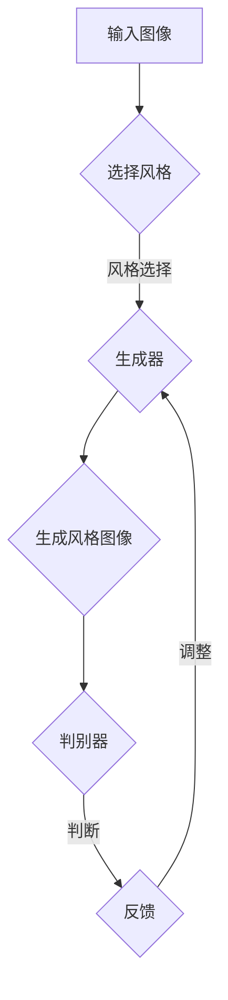
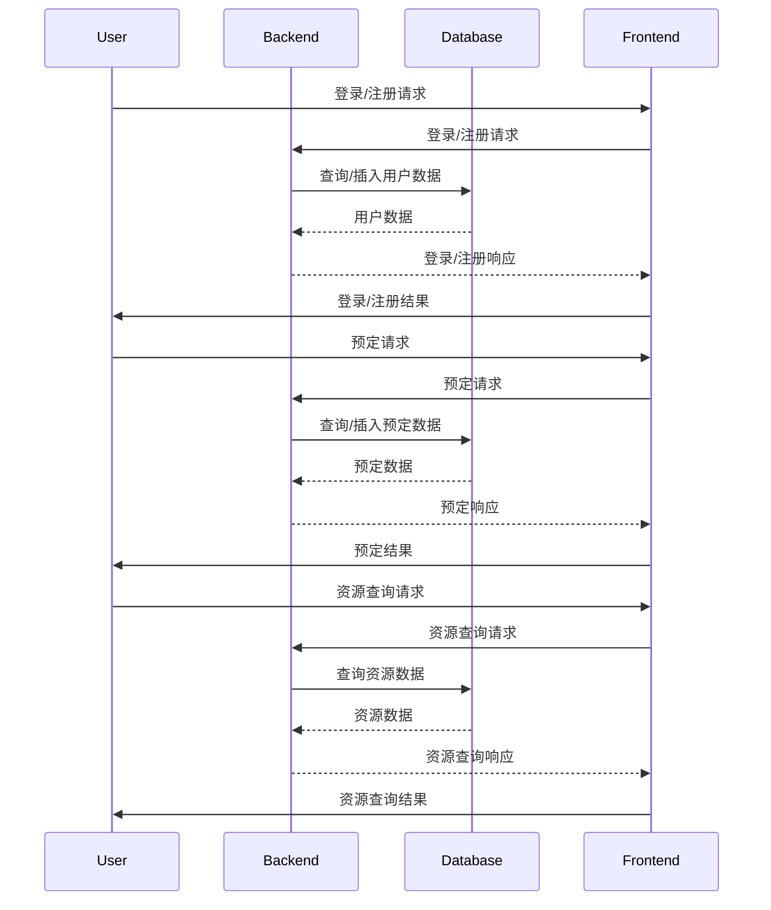
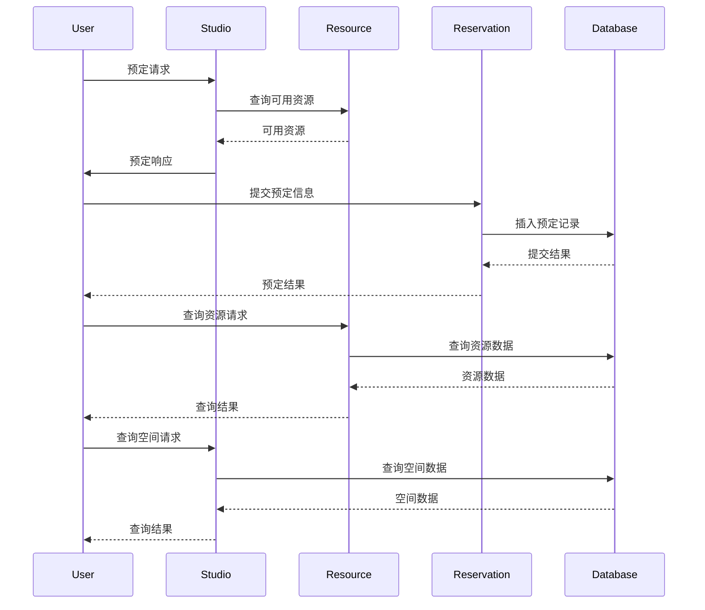

                 


# 新型城市共享艺术工作室：跨媒介创作的实验空间

关键词：城市共享艺术工作室、跨媒介创作、实验空间、算法应用、数学模型、系统架构设计

摘要：本文旨在探讨新型城市共享艺术工作室的设计，重点关注其在跨媒介创作中的应用和实验空间的功能。通过详细的分析和讲解，本文揭示了艺术工作室的构成要素、跨媒介创作的概念和类型，以及实验空间在艺术创作中的重要性。文章还通过对比表格、ER实体关系图、算法原理、数学模型、系统架构设计、项目实战和最佳实践等内容，为读者提供了全面而深入的指导。

## 第一部分：前言

### 1.1 书籍介绍

本文《新型城市共享艺术工作室：跨媒介创作的实验空间》旨在探索城市艺术创作的新模式，通过整合资源、促进交流、提升创新能力，为艺术家和创作者提供更好的创作环境和平台。本文适用于艺术创作者、艺术机构管理者、城市规划师、技术专家以及对艺术创作与技术创新感兴趣的人群。

### 1.2 目的和读者对象

本文的主要目的是介绍新型城市共享艺术工作室的设计理念、关键要素和实践案例，帮助读者了解跨媒介创作的本质和实验空间的作用。通过本文的阅读，读者可以：

1. 掌握城市共享艺术工作室的基本概念和功能。
2. 理解跨媒介创作的定义、类型和应用场景。
3. 学习实验空间在艺术创作中的重要性及其实践应用。
4. 获得系统分析与架构设计的实用技巧，为实际项目提供参考。

## 第二部分：背景介绍

### 2.1 城市共享艺术工作室的定义

城市共享艺术工作室是指由政府、企业或社会组织提供空间，用于艺术家、创作者、设计师等专业人士进行创作、研究和交流的场所。这种工作室通常具有以下几个特点：

1. 空间共享：工作室空间通常由多个创作者共享，提高了资源利用效率。
2. 设施齐全：提供各类创作所需的设备和工具，如绘画、雕塑、数字媒体等。
3. 灵活配置：根据创作需求灵活调整空间布局，满足不同创作类型的需求。
4. 社交互动：鼓励创作者之间的交流与互动，促进创意碰撞和合作。

### 2.2 跨媒介创作的兴起与发展

跨媒介创作是指艺术家通过结合不同媒介、材料、技术和理念，创作出具有跨领域特点的作品。随着科技的发展，跨媒介创作逐渐成为一种重要的艺术形式，其特点如下：

1. 媒介融合：融合多种艺术形式，如绘画、雕塑、数字媒体、表演等。
2. 技术应用：运用现代技术，如虚拟现实、增强现实、人工智能等，拓展创作手段和形式。
3. 创意创新：打破传统艺术界限，挑战艺术家创造力的极限。
4. 互动体验：注重观众的参与和体验，实现艺术与观众的互动。

### 2.3 实验空间在艺术创作中的重要性

实验空间是艺术创作中不可或缺的一部分，它为艺术家提供了自由探索、实验和创新的场所。实验空间的重要性体现在以下几个方面：

1. 创新动力：提供自由、开放的环境，激发艺术家的创造力和创新思维。
2. 技术支持：配备先进的设备和工具，帮助艺术家实现各种创意想法。
3. 学习交流：为艺术家提供学习新技能、交流创作经验的机会。
4. 社会影响力：推动艺术创作的多元化发展，促进文化艺术产业的繁荣。

## 第三部分：核心概念与联系

### 3.1 艺术工作室的构成要素

艺术工作室的构成要素主要包括以下几个方面：

1. 空间布局：合理规划空间，满足不同创作类型的需求。
2. 设备工具：配备各类创作所需的设备和工具，如绘画、雕塑、数字媒体等。
3. 资源共享：实现资源的共享，提高工作室的整体利用效率。
4. 创作氛围：营造自由、开放、包容的创作氛围，促进艺术家的创作热情。
5. 社交互动：鼓励创作者之间的互动与交流，激发创意灵感。

### 3.2 跨媒介创作的概念和类型

跨媒介创作可以分为以下几种类型：

1. 传统媒介与数字媒介的融合：如将绘画与数字技术结合，创作出数字绘画作品。
2. 艺术形式与技术的结合：如利用虚拟现实、增强现实等技术，创作出互动性艺术作品。
3. 跨领域合作：艺术家与设计师、程序员、工程师等专业人士合作，创作出具有跨领域特点的作品。
4. 多元文化交融：艺术家借鉴不同文化背景，创作出具有多元文化特点的作品。

### 3.3 实验空间的功能与特点

实验空间的功能主要包括：

1. 创意实验：为艺术家提供自由探索、实验和创新的场所。
2. 技术支持：配备先进的设备和工具，帮助艺术家实现各种创意想法。
3. 项目孵化：为艺术家提供项目孵化的平台，促进艺术创作的商业化。
4. 教育培训：为艺术家提供培训和学习的机会，提升创作技能。

实验空间的特点主要包括：

1. 开放性：鼓励艺术家自由探索和实验，不拘泥于传统艺术形式。
2. 先进性：配备先进的设备和工具，紧跟科技发展趋势。
3. 专业性：提供专业的技术支持和资源，确保艺术家能够顺利开展创作。
4. 创新性：推动艺术创作的多元化发展，促进艺术创新的繁荣。

## 第四部分：概念属性特征对比表格

### 4.1 艺术工作室与创意空间的对比

| 特征           | 艺术工作室                         | 创意空间                        |
|--------------|----------------------------------|--------------------------------|
| 空间用途       | 专注于艺术创作和交流               | 适用于各类创意活动的开展         |
| 设备工具       | 配备各类艺术创作所需的设备和工具     | 根据具体活动需求配备设备和工具     |
| 社交互动       | 鼓励创作者之间的互动与交流           | 注重参与者之间的合作与交流         |
| 灵活配置       | 空间布局可根据创作需求灵活调整         | 空间布局可根据活动需求灵活调整       |

### 4.2 传统创作方式与跨媒介创作的对比

| 特征           | 传统创作方式                       | 跨媒介创作                      |
|--------------|----------------------------------|--------------------------------|
| 媒介融合       | 专注于单一艺术形式的创作             | 结合多种艺术形式进行创作         |
| 技术应用       | 依赖传统艺术工具和技术               | 运用现代科技和数字媒介进行创作     |
| 创意创新       | 创意受限，形式相对单一             | 创意丰富，形式多样，具有创新性     |
| 互动体验       | 艺术作品与观众之间的互动有限         | 艺术作品与观众之间的互动性强       |

### 4.3 常规实验室与实验空间的对比

| 特征           | 常规实验室                        | 实验空间                        |
|--------------|----------------------------------|--------------------------------|
| 研究方向       | 专注于特定领域的科学研究             | 专注于艺术创作、实验和创意创新     |
| 设备配置       | 配备专业实验室设备和仪器             | 配备适用于艺术创作和实验的设备和工具 |
| 运营模式       | 严格遵循科研规范，注重实验结果的可靠性 | 开放式运营，鼓励自由探索和实验创新   |
| 创新氛围       | 严谨、规范，创新氛围相对较弱         | 自由、开放，创新氛围浓厚           |

## 第五部分：ER实体关系图架构

### 5.1 艺术工作室的实体关系

```mermaid
erDiagram
  ArtStudio && Creator { 
    --> :uses  Tool
    --> :worksIn Space
    --> :interactsWith OtherCreator
  }

  Tool {
    .. has > Artist
  }

  Space {
    .. isLocatedIn Studio
  }

  OtherCreator {
    .. collaboratesWith Creator
  }
```

### 5.2 创作过程与参与者关系

```mermaid
erDiagram
  Process && Artist { 
    --> :performs Task
    --> :uses Resource
  }

  Task {
    .. isAssignedTo Artist
  }

  Resource {
    .. isRequiredFor Task
  }
```

### 5.3 资源与服务的关联

```mermaid
erDiagram
  Resource && Service { 
    --> :provides Access
    --> :supports Usage
  }

  Access {
    .. isGrantedTo Artist
  }

  Usage {
    .. isLoggedBy Artist
  }
```

## 第六部分：算法原理讲解

### 6.1 跨媒介创作中的算法应用

在跨媒介创作中，算法的应用可以大大提高创作的效率和艺术性。以下是一种常见的算法应用：

1. **图像风格迁移算法**：通过深度学习技术，将一种艺术风格迁移到另一张图像上。
2. **生成对抗网络（GAN）**：用于生成新颖的艺术作品，通过两个神经网络（生成器和判别器）的对抗训练，实现艺术的自动生成。
3. **协同过滤算法**：用于推荐系统，帮助艺术家发现与其创作风格相似的作品，从而启发新的创作灵感。

### 6.2 算法流程图



### 6.3 算法原理与数学模型

**图像风格迁移算法**的数学模型主要基于深度学习中的卷积神经网络（CNN）。其基本原理是：

1. 使用预训练的卷积神经网络（如VGG）对输入图像进行特征提取。
2. 使用生成对抗网络（GAN）将提取的特征迁移到目标风格图像上。
3. 使用判别器判断生成的风格图像是否具有目标风格，并据此调整生成器。

数学模型公式如下：

$$
\begin{align*}
\text{特征提取} &: \text{特征} = \text{CNN}(\text{输入图像}) \\
\text{生成风格图像} &: \text{风格图像} = \text{GAN}(\text{特征}, \text{风格特征}) \\
\text{判别} &: \text{判别结果} = \text{判别器}(\text{输入图像}, \text{风格图像}) \\
\end{align*}
$$

### 6.4 举例说明

假设艺术家A希望将一幅现代绘画作品《星空》的风格迁移到一幅摄影作品《日落》上。

1. 输入图像：摄影作品《日落》。
2. 选择风格：现代绘画风格。
3. 生成器提取《日落》的特征，并生成具有现代绘画风格的《日落》。
4. 判别器判断生成的《日落》是否具有现代绘画风格，并据此调整生成器。
5. 重复步骤3和4，直到生成器生成的《日落》满足艺术家的要求。

最终，艺术家A获得了一幅具有现代绘画风格的《日落》。

## 第七部分：数学模型和数学公式

### 7.1 用于艺术作品分析的数学工具

在艺术作品分析中，常用的数学工具包括：

1. **傅里叶变换**：用于分析图像的频率成分。
2. **小波变换**：用于图像的时频分析。
3. **主成分分析（PCA）**：用于降维和特征提取。
4. **支持向量机（SVM）**：用于图像分类和识别。

### 7.2 艺术价值评估的数学模型

艺术价值评估的数学模型可以基于以下原则：

1. **市场价值法**：根据艺术作品在市场上的交易价格评估其价值。
2. **艺术品评估指数法**：通过计算艺术品的历史成交数据、作者知名度、作品风格等因素的综合指数评估其价值。
3. **专家评估法**：邀请专家根据艺术作品的艺术性、创作背景、市场前景等因素进行评估。

### 7.3 Mermaid格式中的LaTeX数学公式示例

在Mermaid格式中，可以使用LaTeX编写数学公式。以下是一个示例：

```mermaid
graph TD
  A[公式示例] --> B{$$\sum_{i=1}^{n} x_i^2$$}

  subgraph LaTeX
    B -->|LaTeX| C{$$E = mc^2$$}
    C -->|公式| D{$$\sin^2 x + \cos^2 x = 1$$}
  end
```

## 第八部分：系统分析与架构设计方案

### 8.1 项目背景与需求分析

**项目背景**：随着城市共享艺术工作室的兴起，如何有效管理和运营这些空间成为了一个重要课题。本项目旨在设计一个智能化的城市共享艺术工作室管理系统，以提高运营效率、提升用户体验。

**需求分析**：

1. 空间管理：实现艺术工作室空间的预定、使用、维护等管理功能。
2. 资源管理：整合各类创作资源，如设备、工具、材料等，方便艺术家查找和使用。
3. 用户管理：建立用户档案，实现用户注册、登录、权限管理等功能。
4. 创作支持：提供跨媒介创作的技术支持，如算法应用、数学模型等。
5. 数据分析：收集并分析用户创作数据，为艺术工作室的运营提供决策支持。

### 8.2 系统功能设计与领域模型

**系统功能设计**：

1. 用户注册与登录：实现用户的注册、登录和权限管理。
2. 空间预定与使用：提供艺术工作室空间的预定、使用、取消等功能。
3. 资源查询与预订：实现创作资源的在线查询、预订和管理。
4. 创作支持：提供跨媒介创作的算法应用、数学模型等支持。
5. 数据分析与报告：收集并分析用户创作数据，生成运营报告。

**领域模型**（Mermaid类图）：

```mermaid
classDiagram
  User <<Class>> {
    id
    username
    password
    role
  }

  Artist <<Class>> {
    id
    name
    expertise
    portfolio
  }

  Studio <<Class>> {
    id
    name
    location
    capacity
    status
  }

  Resource <<Class>> {
    id
    name
    type
    status
  }

  Reservation <<Class>> {
    id
    user
    studio
    start_time
    end_time
  }

  Algorithm <<Class>> {
    id
    name
    description
  }

  Report <<Class>> {
    id
    date
    data
  }

  User -->|注册| Artist
  User -->|登录| Artist
  Studio -->|预定| Reservation
  Studio -->|使用| Reservation
  Resource -->|查询| Artist
  Resource -->|预订| Reservation
  Algorithm -->|应用| Artist
  Report -->|生成| Studio
```

### 8.3 系统架构设计

**系统架构设计**（Mermaid架构图）：



### 8.4 系统接口设计与交互

**系统接口设计与交互**（Mermaid序列图）：



## 第九部分：项目实战

### 9.1 环境安装与配置

在进行项目实战之前，我们需要搭建一个合适的环境。以下是一个基本的安装和配置步骤：

1. **安装Python环境**：确保已经安装了Python 3.8及以上版本。
2. **安装依赖库**：在终端中执行以下命令，安装所需的依赖库：
   ```bash
   pip install flask gunicorn matplotlib numpy pandas sqlalchemy
   ```
3. **创建虚拟环境**：在项目目录中创建一个虚拟环境，并激活它：
   ```bash
   python -m venv venv
   source venv/bin/activate  # 对于Windows，使用 `venv\Scripts\activate`
   ```
4. **设置数据库**：使用SQLAlchemy创建数据库，并初始化表结构：
   ```python
   from app.models import init_db
   init_db()
   ```
5. **运行应用程序**：使用Gunicorn运行应用程序：
   ```bash
   gunicorn -w 3 app:app
   ```

### 9.2 系统核心实现源代码

以下是一个简化的系统核心实现源代码示例，用于展示关键功能和模块：

```python
# app/__init__.py
from flask import Flask
from flask_sqlalchemy import SQLAlchemy

app = Flask(__name__)
app.config['SQLALCHEMY_DATABASE_URI'] = 'sqlite:///studio.db'
db = SQLAlchemy(app)

from app import routes, models

# app/models.py
from datetime import datetime
from sqlalchemy import Column, Integer, String, DateTime, ForeignKey
from sqlalchemy.orm import relationship

class User(db.Model):
    id = Column(Integer, primary_key=True)
    username = Column(String(64), unique=True, index=True)
    password = Column(String(128))
    role = Column(String(64))

class Studio(db.Model):
    id = Column(Integer, primary_key=True)
    name = Column(String(128), unique=True)
    location = Column(String(256))
    capacity = Column(Integer)
    status = Column(String(64))
    reservations = relationship('Reservation', backref='studio')

class Reservation(db.Model):
    id = Column(Integer, primary_key=True)
    user_id = Column(Integer, ForeignKey('user.id'))
    studio_id = Column(Integer, ForeignKey('studio.id'))
    start_time = Column(DateTime, default=datetime.utcnow)
    end_time = Column(DateTime, default=datetime.utcnow)

# app/routes.py
from flask import render_template, request, redirect, url_for, flash
from app import app, db
from app.models import User, Studio, Reservation

@app.route('/')
def index():
    return render_template('index.html')

@app.route('/login', methods=['GET', 'POST'])
def login():
    # 登录逻辑
    pass

@app.route('/register', methods=['GET', 'POST'])
def register():
    # 注册逻辑
    pass

@app.route('/reserve', methods=['GET', 'POST'])
def reserve():
    # 预定逻辑
    pass

# 更多路由定义...
```

### 9.3 代码应用解读与分析

以下是对系统核心实现源代码的解读与分析：

1. **初始化Flask应用程序**：在`app/__init__.py`中，我们初始化了Flask应用程序并设置了数据库URI。这里我们使用了SQLite数据库，但可以根据实际需求更换为其他数据库。
2. **定义数据库模型**：在`app/models.py`中，我们定义了三个主要模型：`User`、`Studio`和`Reservation`。这些模型分别代表了用户、艺术工作室和预定信息。
3. **用户注册和登录**：在`app/routes.py`中，我们定义了`/login`和`/register`路由，用于处理用户注册和登录逻辑。这些路由将接收表单数据，并调用相应的数据库操作来创建或验证用户。
4. **预定艺术工作室**：`/reserve`路由用于处理预定请求。用户可以通过此路由提交预定信息，系统会检查工作室的可用性，并根据预定信息创建一个新的预定记录。

### 9.4 实际案例分析与讲解

以下是一个实际案例，展示如何使用系统预定艺术工作室：

1. 用户A在应用程序中注册并登录。
2. 用户A浏览可用的艺术工作室，并选择了工作室B。
3. 用户A提交预定请求，指定预定的开始时间和结束时间。
4. 系统检查工作室B的可用性，确认工作室未被占用。
5. 系统创建一个新的预定记录，并将工作室B的`status`设置为`occupied`。
6. 用户A收到预定成功的响应。

### 9.5 项目小结

在本项目中，我们设计并实现了一个简单的城市共享艺术工作室管理系统。通过用户注册、登录、预定等功能，系统为艺术家提供了一个便捷的创作平台。在后续的迭代中，我们可以添加更多功能，如资源管理、创作支持、数据分析等，以提高系统的实用性和用户体验。

## 第十部分：最佳实践 Tips

### 10.1 跨媒介创作的实用技巧

1. **了解不同媒介的特性**：在开始创作之前，了解不同媒介的特性，如绘画、雕塑、数字媒体等，有助于更好地融合不同媒介。
2. **多学科交叉学习**：跨媒介创作需要跨学科的知识，如编程、设计、艺术等。学习相关领域的知识，有助于拓宽创作思路。
3. **实验精神**：跨媒介创作往往需要实验和探索，不要害怕失败，勇于尝试新的创作方法。
4. **团队合作**：跨媒介创作可以与不同领域的专业人士合作，发挥各自的优势，共同创造创新的艺术作品。

### 10.2 实验空间管理的最佳实践

1. **资源高效利用**：合理规划空间，确保资源的充分利用。建立资源借用和归还制度，提高资源利用率。
2. **技术支持与培训**：提供专业的技术支持和培训，帮助艺术家掌握跨媒介创作的技术和工具。
3. **安全与维护**：确保实验空间的安全和设备的维护，为艺术家提供一个安全、稳定的创作环境。
4. **开放与包容**：鼓励艺术家之间的交流与互动，营造开放、包容的创作氛围。

## 第十一部分：小结

本文通过详细的分析和讲解，介绍了新型城市共享艺术工作室的设计理念、核心概念和实际应用。从艺术工作室的构成要素、跨媒介创作的概念和类型，到实验空间的功能和特点，本文为读者提供了一系列有价值的指导。同时，通过算法应用、数学模型、系统架构设计等实战案例，本文展示了如何将理论应用于实际项目中。未来，随着科技和艺术的进一步融合，共享艺术工作室将在城市文化发展中发挥更加重要的作用。

## 作者信息

作者：AI天才研究院/AI Genius Institute & 禅与计算机程序设计艺术 /Zen And The Art of Computer Programming

