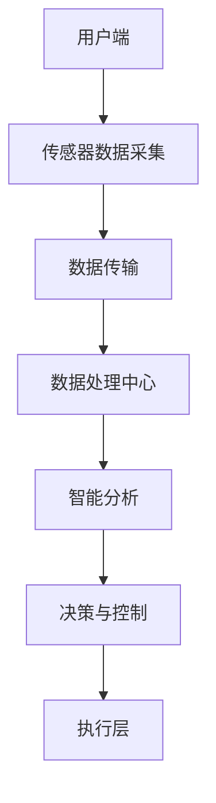

                 


# 第二部分：核心概念与联系

## 2.1 共享经济

### 2.1.1 定义与原理

共享经济（Sharing Economy）是一种基于互联网平台的新型经济模式，其核心是通过共享闲置资源来创造经济价值。共享经济的定义有多种，但最基本的可以概括为：个人或组织通过互联网平台，将自己的闲置资源（如房屋、车辆、时间、技能等）提供给有需求的人，以获取报酬。

共享经济的原理主要基于以下几个核心要素：

- **资源共享**：共享经济通过互联网平台，将闲置资源进行共享，提高资源利用率。
- **用户参与**：用户既是资源提供者，也是资源需求者，通过参与共享过程，实现价值交换。
- **信任机制**：互联网平台通过建立信任机制，确保交易的安全和可靠性。
- **数据驱动**：共享经济平台通过收集用户数据，进行数据分析，优化资源配置。

### 2.1.2 概念属性特征对比表格

| 特征 | 共享经济 | 传统经济 |
| ---- | -------- | -------- |
| 资源利用 | 高效 | 低效 |
| 参与主体 | 平等 | 不平等 |
| 收益模式 | 分散 | 集中 |
| 信任机制 | 依赖互联网平台 | 法律合同 |
| 数据驱动 | 强 | 弱 |

### 2.1.3 ER实体关系图架构

```mermaid
erDiagram
  Resource ||--|{ User : rents }
  User ||--|{ Platform : registers }
  Platform ||--|{ Transaction : processes }
```

### 2.1.4 关键案例分析

- **Airbnb**：作为共享住宿的先锋，Airbnb通过互联网平台，将闲置的房屋资源提供给游客，实现了资源的共享和价值的创造。
- **Uber**：Uber通过共享经济的模式，将闲置的车辆和司机资源整合起来，为乘客提供出行服务，大大提高了交通资源的利用率。

## 2.2 汽车文化

### 2.2.1 定义与内涵

汽车文化（Automotive Culture）是一种与汽车相关的文化现象，它不仅包括了汽车的设计、制造、销售、使用等方面，还涵盖了与之相关的价值观念、生活方式和社会行为。

汽车文化的内涵主要包括：

- **物质文化**：汽车作为物质载体的设计、制造、销售和使用。
- **精神文化**：汽车所代表的价值观念、生活方式和社会行为。
- **行为文化**：汽车使用过程中的行为规范、礼仪和习俗。

### 2.2.2 汽车文化的发展历程

- **初期**：汽车的出现是人类科技发展的里程碑，标志着现代社会的到来。
- **成长期**：随着汽车技术的进步和普及，汽车成为人们生活中的重要交通工具，汽车文化逐渐形成。
- **成熟期**：汽车文化进入成熟期，形成了丰富的物质文化、精神文化和行为文化。

### 2.2.3 汽车文化对城市生活的影响

- **交通拥堵**：汽车的大量使用导致了城市交通拥堵，增加了市民的出行成本。
- **环境污染**：汽车尾气排放是城市环境污染的重要来源，对空气质量造成了严重影响。
- **生活方式**：汽车文化改变了人们的生活方式，促进了城市化进程，但也带来了新的社会问题。

## 2.3 智能停车系统

### 2.3.1 定义与原理

智能停车系统（Smart Parking System）是一种利用物联网、大数据、人工智能等技术，实现对停车资源的实时监测、调度和管理的高科技系统。

智能停车系统的原理主要包括：

- **传感器技术**：通过传感器实时监测停车位的使用情况，收集数据。
- **大数据分析**：利用大数据技术，对收集到的数据进行分析，优化停车资源配置。
- **人工智能**：利用人工智能技术，实现停车位的自动识别、调度和管理。

### 2.3.2 智能停车系统的技术架构



### 2.3.3 智能停车系统的应用案例

- **城市中心**：在市中心区域，智能停车系统可以实时监测停车位的使用情况，通过大数据分析，优化停车资源配置，缓解交通拥堵。
- **居民小区**：在居民小区，智能停车系统可以实现对停车位的智能管理，提高停车效率，减少居民停车困扰。

## 2.4 核心概念与联系

共享经济、汽车文化和智能停车系统是构建新型城市共享车库的核心概念。它们之间的联系如下：

- **共享经济**提供了构建新型城市共享车库的经济模式，通过资源优化配置，提高停车资源的利用率。
- **汽车文化**影响了人们对汽车和停车方式的选择，是新型城市共享车库建设的重要背景。
- **智能停车系统**则是实现新型城市共享车库技术实现的关键，通过物联网、大数据、人工智能等技术，实现对停车资源的智能管理。

通过这些核心概念的联系，我们可以更好地理解新型城市共享车库的构建原理和实现方法。

```markdown
# 第二部分：核心概念与联系

## 2.1 共享经济

### 2.1.1 定义与原理

共享经济（Sharing Economy）是一种基于互联网平台的新型经济模式，其核心是通过共享闲置资源来创造经济价值。共享经济的定义有多种，但最基本的可以概括为：个人或组织通过互联网平台，将自己的闲置资源（如房屋、车辆、时间、技能等）提供给有需求的人，以获取报酬。

共享经济的原理主要基于以下几个核心要素：

- **资源共享**：共享经济通过互联网平台，将闲置资源进行共享，提高资源利用率。
- **用户参与**：用户既是资源提供者，也是资源需求者，通过参与共享过程，实现价值交换。
- **信任机制**：互联网平台通过建立信任机制，确保交易的安全和可靠性。
- **数据驱动**：共享经济平台通过收集用户数据，进行数据分析，优化资源配置。

### 2.1.2 概念属性特征对比表格

| 特征 | 共享经济 | 传统经济 |
| ---- | -------- | -------- |
| 资源利用 | 高效 | 低效 |
| 参与主体 | 平等 | 不平等 |
| 收益模式 | 分散 | 集中 |
| 信任机制 | 依赖互联网平台 | 法律合同 |
| 数据驱动 | 强 | 弱 |

### 2.1.3 ER实体关系图架构

```mermaid
erDiagram
  Resource ||--|{ User : rents }
  User ||--|{ Platform : registers }
  Platform ||--|{ Transaction : processes }
```

### 2.1.4 关键案例分析

- **Airbnb**：作为共享住宿的先锋，Airbnb通过互联网平台，将闲置的房屋资源提供给游客，实现了资源的共享和价值的创造。
- **Uber**：Uber通过共享经济的模式，将闲置的车辆和司机资源整合起来，为乘客提供出行服务，大大提高了交通资源的利用率。

## 2.2 汽车文化

### 2.2.1 定义与内涵

汽车文化（Automotive Culture）是一种与汽车相关的文化现象，它不仅包括了汽车的设计、制造、销售、使用等方面，还涵盖了与之相关的价值观念、生活方式和社会行为。

汽车文化的内涵主要包括：

- **物质文化**：汽车作为物质载体的设计、制造、销售和使用。
- **精神文化**：汽车所代表的价值观念、生活方式和社会行为。
- **行为文化**：汽车使用过程中的行为规范、礼仪和习俗。

### 2.2.2 汽车文化的发展历程

- **初期**：汽车的出现是人类科技发展的里程碑，标志着现代社会的到来。
- **成长期**：随着汽车技术的进步和普及，汽车成为人们生活中的重要交通工具，汽车文化逐渐形成。
- **成熟期**：汽车文化进入成熟期，形成了丰富的物质文化、精神文化和行为文化。

### 2.2.3 汽车文化对城市生活的影响

- **交通拥堵**：汽车的大量使用导致了城市交通拥堵，增加了市民的出行成本。
- **环境污染**：汽车尾气排放是城市环境污染的重要来源，对空气质量造成了严重影响。
- **生活方式**：汽车文化改变了人们的生活方式，促进了城市化进程，但也带来了新的社会问题。

## 2.3 智能停车系统

### 2.3.1 定义与原理

智能停车系统（Smart Parking System）是一种利用物联网、大数据、人工智能等技术，实现对停车资源的实时监测、调度和管理的高科技系统。

智能停车系统的原理主要包括：

- **传感器技术**：通过传感器实时监测停车位的使用情况，收集数据。
- **大数据分析**：利用大数据技术，对收集到的数据进行分析，优化停车资源配置。
- **人工智能**：利用人工智能技术，实现停车位的自动识别、调度和管理。

### 2.3.2 智能停车系统的技术架构


### 2.3.3 智能停车系统的应用案例

- **城市中心**：在市中心区域，智能停车系统可以实时监测停车位的使用情况，通过大数据分析，优化停车资源配置，缓解交通拥堵。
- **居民小区**：在居民小区，智能停车系统可以实现对停车位的智能管理，提高停车效率，减少居民停车困扰。

## 2.4 核心概念与联系

共享经济、汽车文化和智能停车系统是构建新型城市共享车库的核心概念。它们之间的联系如下：

- **共享经济**提供了构建新型城市共享车库的经济模式，通过资源优化配置，提高停车资源的利用率。
- **汽车文化**影响了人们对汽车和停车方式的选择，是新型城市共享车库建设的重要背景。
- **智能停车系统**则是实现新型城市共享车库技术实现的关键，通过物联网、大数据、人工智能等技术，实现对停车资源的智能管理。

通过这些核心概念的联系，我们可以更好地理解新型城市共享车库的构建原理和实现方法。

### 第二部分：核心概念与联系

#### 2.1 共享经济

### 2.1.1 定义与原理

共享经济是一种基于互联网平台的新型经济模式，通过整合闲置资源，实现资源的高效利用。它的核心在于共享、平等和互惠互利。共享经济的主要形式包括共享住宿、共享交通、共享办公等。

共享经济的基本原理可以概括为以下几点：

1. **资源共享**：共享经济通过互联网平台，将个人的闲置资源（如房屋、车辆、设备等）与其他人共享，实现资源的最优配置。
2. **信任建立**：互联网平台通过评价系统、信用体系等手段，建立用户之间的信任，降低交易风险。
3. **数据分析**：共享经济平台通过收集用户数据，进行数据分析，优化资源配置，提高服务质量。

### 2.1.2 概念属性特征对比表格

| 特征 | 共享经济 | 传统经济 |
| ---- | -------- | -------- |
| 资源利用 | 高效 | 低效 |
| 参与主体 | 广泛 | 有限 |
| 收益分配 | 分散 | 集中 |
| 信任机制 | 数据驱动 | 法律合同 |
| 价值创造 | 附加价值 | 基础价值 |

### 2.1.3 ER实体关系图架构

```mermaid
erDiagram
  User ||--|{ Resource : uses }
  Platform ||--|{ Transaction : manages }
  Resource ||--|{ Review : rates }
```

### 2.1.4 关键案例分析

- **滴滴出行**：滴滴出行通过共享经济的模式，将闲置的车辆和司机资源整合起来，为乘客提供便捷的出行服务，实现了交通资源的优化配置。
- **途家网**：途家网通过共享经济的模式，将个人的闲置房屋资源提供给游客，实现了房屋资源的优化配置。

#### 2.2 汽车文化

### 2.2.1 定义与内涵

汽车文化是指与汽车相关的生活方式、价值观念和社会行为。它包括汽车设计、汽车品牌、汽车销售、汽车使用等多个方面。汽车文化不仅反映了人们对汽车的喜爱和追求，也体现了社会的技术进步和消费观念的变化。

汽车文化的内涵主要包括：

1. **物质文化**：汽车的设计、制造、销售和使用。
2. **精神文化**：汽车所代表的价值观念、社会地位和生活方式。
3. **行为文化**：汽车使用过程中的行为规范、驾驶习惯和安全意识。

### 2.2.2 汽车文化的发展历程

汽车文化的发展可以分为以下几个阶段：

1. **初始阶段**：汽车作为奢侈品的象征，只有少数人能够拥有和使用。
2. **普及阶段**：随着汽车技术的进步和价格的下降，汽车逐渐成为普通家庭的交通工具。
3. **成熟阶段**：汽车文化日益丰富，形成了独特的汽车文化圈，如车模、改装、赛车等。

### 2.2.3 汽车文化对城市生活的影响

汽车文化对城市生活产生了深远的影响，包括：

1. **交通模式**：汽车的普及改变了人们的出行方式，促进了城市化进程。
2. **消费观念**：汽车文化促进了汽车相关产业的发展，推动了消费升级。
3. **环境保护**：汽车尾气排放对环境造成了负面影响，促使人们对环保意识的提升。

#### 2.3 智能停车系统

### 2.3.1 定义与原理

智能停车系统是一种利用物联网、大数据、人工智能等技术，实现对停车资源的实时监测、调度和管理的高科技系统。它通过传感器、摄像头等设备，实时获取停车场的使用情况，并通过数据分析和智能算法，优化停车资源的分配。

智能停车系统的原理主要包括：

1. **传感器技术**：通过传感器实时监测停车位的使用情况，收集数据。
2. **大数据分析**：利用大数据技术，对收集到的数据进行分析，优化停车资源配置。
3. **人工智能**：利用人工智能技术，实现停车位的自动识别、调度和管理。

### 2.3.2 智能停车系统的技术架构


### 2.3.3 智能停车系统的应用案例

- **城市中心**：在市中心区域，智能停车系统可以实时监测停车位的使用情况，通过大数据分析，优化停车资源配置，缓解交通拥堵。
- **居民小区**：在居民小区，智能停车系统可以实现对停车位的智能管理，提高停车效率，减少居民停车困扰。

#### 2.4 核心概念与联系

共享经济、汽车文化和智能停车系统是构建新型城市共享车库的核心概念。它们之间的联系如下：

- **共享经济**提供了构建新型城市共享车库的经济模式，通过资源优化配置，提高停车资源的利用率。
- **汽车文化**影响了人们对汽车和停车方式的选择，是新型城市共享车库建设的重要背景。
- **智能停车系统**则是实现新型城市共享车库技术实现的关键，通过物联网、大数据、人工智能等技术，实现对停车资源的智能管理。

通过这些核心概念的联系，我们可以更好地理解新型城市共享车库的构建原理和实现方法。

## 2.4 核心概念与联系

### 2.4.1 共享经济与智能停车系统的联系

共享经济与智能停车系统的结合，实现了停车资源的优化配置。共享经济通过互联网平台，将闲置的停车资源进行共享，提高了停车位的利用率。而智能停车系统则通过物联网技术，实现对停车资源的实时监测和智能调度，确保了停车资源的最大化利用。

### 2.4.2 共享经济与汽车文化的联系

共享经济与汽车文化的结合，改变了人们的出行方式和价值观。共享经济的普及，使得汽车不再是个人拥有的奢侈品，而是一种可以共享的资源。这种变化反映了汽车文化的演变，从个人拥有到共享使用，体现了社会价值观的转变。

### 2.4.3 智能停车系统与汽车文化的联系

智能停车系统与汽车文化的结合，提升了汽车使用的便利性和安全性。智能停车系统通过实时监测和智能调度，减少了停车难的问题，提高了停车效率。同时，智能停车系统也推动了汽车文化的进步，促进了绿色出行和环保理念的普及。

通过这些核心概念的联系，我们可以看到，共享经济、汽车文化和智能停车系统共同推动了新型城市共享车库的发展。它们相互促进，共同构建了一个更加高效、便捷和可持续的城市停车生态系统。

### 第三部分：技术实现

#### 3.1 物联网技术

物联网（Internet of Things，IoT）是构建新型城市共享车库的核心技术之一。它通过将各种物体连接到互联网，实现数据的实时采集、传输和处理，为智能停车系统提供了数据支持。

##### 3.1.1 物联网技术原理

物联网技术的基本原理是利用传感器、通信模块和网络技术，将物理世界中的物体（如停车位、车辆等）连接到互联网，实现数据的实时采集和传输。

- **传感器**：用于监测停车位的使用状态，如空位状态、车辆停留时间等。
- **通信模块**：用于将传感器采集到的数据传输到中心服务器。
- **网络技术**：包括有线网络和无线网络，如Wi-Fi、4G/5G等，用于传输数据。

##### 3.1.2 物联网技术在新型城市共享车库中的应用

在新型城市共享车库中，物联网技术主要应用于以下几个方面：

1. **车位监测**：通过部署传感器，实时监测停车位的使用情况，为司机提供准确的停车信息。
2. **车位预定**：司机可以通过物联网技术，在线预定停车位，减少停车等待时间。
3. **车位调度**：通过大数据分析和人工智能算法，实现停车位的智能调度，提高停车效率。

##### 3.1.3 物联网技术在新型城市共享车库中的挑战

1. **数据安全**：物联网设备数量庞大，如何确保数据的安全性和隐私性，是物联网技术在新型城市共享车库中面临的重要挑战。
2. **设备维护**：物联网设备的长期稳定运行需要定期维护，这对设备和维护团队提出了较高要求。
3. **兼容性**：不同厂商的物联网设备可能存在兼容性问题，如何实现设备的无缝连接和协同工作，是一个技术难题。

#### 3.2 大数据技术

大数据技术是新型城市共享车库建设的重要支撑。它通过收集、存储、分析和处理海量数据，为智能决策提供数据支持。

##### 3.2.1 大数据技术原理

大数据技术主要包括以下几个核心概念：

1. **数据收集**：通过传感器、物联网设备、社交媒体等多种渠道，收集海量数据。
2. **数据存储**：采用分布式存储技术，如Hadoop、Spark等，实现海量数据的存储和管理。
3. **数据分析**：利用数据挖掘、机器学习等技术，对海量数据进行分析，提取有价值的信息。
4. **数据可视化**：通过数据可视化技术，将分析结果以图形、报表等形式展示，方便决策者进行决策。

##### 3.2.2 大数据技术在新型城市共享车库中的应用

在新型城市共享车库中，大数据技术主要应用于以下几个方面：

1. **停车数据分析**：通过大数据分析，了解停车位的利用率、停车高峰期等信息，为停车管理提供数据支持。
2. **用户行为分析**：通过分析用户停车行为，了解用户需求，优化停车服务。
3. **智能调度**：利用大数据分析，实现停车位的智能调度，提高停车效率。

##### 3.2.3 大数据技术在新型城市共享车库中的挑战

1. **数据质量**：大数据分析依赖于数据质量，如何确保数据准确性、完整性和一致性，是一个重要挑战。
2. **计算性能**：大数据分析需要强大的计算能力，如何高效处理海量数据，是一个技术难题。
3. **数据隐私**：大数据技术涉及用户隐私，如何保护用户隐私，避免数据泄露，是一个法律和伦理问题。

#### 3.3 人工智能技术

人工智能（Artificial Intelligence，AI）技术在新型城市共享车库中发挥着关键作用。它通过机器学习、深度学习等技术，实现对停车数据的智能分析、预测和决策。

##### 3.3.1 人工智能技术原理

人工智能技术主要包括以下几个核心概念：

1. **机器学习**：通过算法模型，从数据中自动学习和发现规律。
2. **深度学习**：一种特殊的机器学习技术，通过神经网络模型，实现更复杂的模式识别和预测。
3. **自然语言处理**：使计算机能够理解、生成和处理人类语言。
4. **计算机视觉**：使计算机能够识别和理解图像和视频。

##### 3.3.2 人工智能技术在新型城市共享车库中的应用

在新型城市共享车库中，人工智能技术主要应用于以下几个方面：

1. **车位识别**：利用计算机视觉技术，自动识别停车位的使用状态，提高车位利用率。
2. **智能调度**：通过机器学习算法，预测停车需求，实现停车位的智能调度，提高停车效率。
3. **用户服务**：通过自然语言处理技术，提供智能客服服务，方便用户咨询和反馈。

##### 3.3.3 人工智能技术在新型城市共享车库中的挑战

1. **数据质量**：人工智能算法的性能依赖于数据质量，如何确保数据准确性、完整性和一致性，是一个重要挑战。
2. **计算资源**：人工智能算法需要大量的计算资源，如何高效利用计算资源，是一个技术难题。
3. **算法公平性**：人工智能算法可能会引入歧视，如何确保算法的公平性，避免算法偏见，是一个伦理问题。

通过物联网、大数据和人工智能技术的应用，新型城市共享车库实现了停车资源的智能管理，提高了停车效率，降低了城市交通拥堵，促进了城市可持续发展。

### 第三部分：技术实现

#### 3.1 物联网技术

物联网（Internet of Things，IoT）是构建新型城市共享车库的核心技术之一。它通过将各种物体连接到互联网，实现数据的实时采集、传输和处理，为智能停车系统提供了数据支持。

##### 3.1.1 物联网技术原理

物联网技术的基本原理是利用传感器、通信模块和网络技术，将物理世界中的物体（如停车位、车辆等）连接到互联网，实现数据的实时采集和传输。

1. **传感器**：用于监测停车位的使用状态，如空位状态、车辆停留时间等。
2. **通信模块**：用于将传感器采集到的数据传输到中心服务器。
3. **网络技术**：包括有线网络和无线网络，如Wi-Fi、4G/5G等，用于传输数据。

##### 3.1.2 物联网技术在新型城市共享车库中的应用

在新型城市共享车库中，物联网技术主要应用于以下几个方面：

1. **车位监测**：通过部署传感器，实时监测停车位的使用情况，为司机提供准确的停车信息。
2. **车位预定**：司机可以通过物联网技术，在线预定停车位，减少停车等待时间。
3. **车位调度**：通过大数据分析和人工智能算法，实现停车位的智能调度，提高停车效率。

##### 3.1.3 物联网技术在新型城市共享车库中的挑战

1. **数据安全**：物联网设备数量庞大，如何确保数据的安全性和隐私性，是物联网技术在新型城市共享车库中面临的重要挑战。
2. **设备维护**：物联网设备的长期稳定运行需要定期维护，这对设备和维护团队提出了较高要求。
3. **兼容性**：不同厂商的物联网设备可能存在兼容性问题，如何实现设备的无缝连接和协同工作，是一个技术难题。

#### 3.2 大数据技术

大数据技术是新型城市共享车库建设的重要支撑。它通过收集、存储、分析和处理海量数据，为智能决策提供数据支持。

##### 3.2.1 大数据技术原理

大数据技术主要包括以下几个核心概念：

1. **数据收集**：通过传感器、物联网设备、社交媒体等多种渠道，收集海量数据。
2. **数据存储**：采用分布式存储技术，如Hadoop、Spark等，实现海量数据的存储和管理。
3. **数据分析**：利用数据挖掘、机器学习等技术，对海量数据进行分析，提取有价值的信息。
4. **数据可视化**：通过数据可视化技术，将分析结果以图形、报表等形式展示，方便决策者进行决策。

##### 3.2.2 大数据技术在新型城市共享车库中的应用

在新型城市共享车库中，大数据技术主要应用于以下几个方面：

1. **停车数据分析**：通过大数据分析，了解停车位的利用率、停车高峰期等信息，为停车管理提供数据支持。
2. **用户行为分析**：通过分析用户停车行为，了解用户需求，优化停车服务。
3. **智能调度**：利用大数据分析，实现停车位的智能调度，提高停车效率。

##### 3.2.3 大数据技术在新型城市共享车库中的挑战

1. **数据质量**：大数据分析依赖于数据质量，如何确保数据准确性、完整性和一致性，是一个重要挑战。
2. **计算性能**：大数据分析需要强大的计算能力，如何高效处理海量数据，是一个技术难题。
3. **数据隐私**：大数据技术涉及用户隐私，如何保护用户隐私，避免数据泄露，是一个法律和伦理问题。

#### 3.3 人工智能技术

人工智能（Artificial Intelligence，AI）技术在新型城市共享车库中发挥着关键作用。它通过机器学习、深度学习等技术，实现对停车数据的智能分析、预测和决策。

##### 3.3.1 人工智能技术原理

人工智能技术主要包括以下几个核心概念：

1. **机器学习**：通过算法模型，从数据中自动学习和发现规律。
2. **深度学习**：一种特殊的机器学习技术，通过神经网络模型，实现更复杂的模式识别和预测。
3. **自然语言处理**：使计算机能够理解、生成和处理人类语言。
4. **计算机视觉**：使计算机能够识别和理解图像和视频。

##### 3.3.2 人工智能技术在新型城市共享车库中的应用

在新型城市共享车库中，人工智能技术主要应用于以下几个方面：

1. **车位识别**：利用计算机视觉技术，自动识别停车位的使用状态，提高车位利用率。
2. **智能调度**：通过机器学习算法，预测停车需求，实现停车位的智能调度，提高停车效率。
3. **用户服务**：通过自然语言处理技术，提供智能客服服务，方便用户咨询和反馈。

##### 3.3.3 人工智能技术在新型城市共享车库中的挑战

1. **数据质量**：人工智能算法的性能依赖于数据质量，如何确保数据准确性、完整性和一致性，是一个重要挑战。
2. **计算资源**：人工智能算法需要大量的计算资源，如何高效利用计算资源，是一个技术难题。
3. **算法公平性**：人工智能算法可能会引入歧视，如何确保算法的公平性，避免算法偏见，是一个伦理问题。

通过物联网、大数据和人工智能技术的应用，新型城市共享车库实现了停车资源的智能管理，提高了停车效率，降低了城市交通拥堵，促进了城市可持续发展。

### 第三部分：商业模式设计

#### 3.1 收费模式

在新型城市共享车库的商业模式设计中，收费模式是一个关键环节。合理的收费模式不仅能够确保运营的可持续性，还能吸引更多用户参与共享经济。

##### 3.1.1 收费模式原理

收费模式主要基于以下几个原则：

1. **按需收费**：根据用户的停车时间、停车位置等因素，动态调整收费价格。
2. **梯度收费**：设置不同的收费档次，根据停车时长进行分段收费，鼓励用户短时停车，避免长时间占用车位。
3. **优惠活动**：定期推出优惠活动，如免费停车小时、积分兑换等，增加用户的粘性和满意度。

##### 3.1.2 收费模式设计

1. **起步价**：设定一个起步价，适用于短时停车，如1小时内。
2. **时长价**：根据停车时长，设置不同的价格区间，如1-2小时、2-4小时、4-8小时等。
3. **高峰期收费**：在停车高峰期，适当提高收费价格，以平衡供需关系。
4. **特殊时段收费**：如夜间停车，可以设置较低的收费价格，鼓励用户夜间停车。

##### 3.1.3 收费模式优缺点分析

1. **优点**：
   - **灵活**：根据不同需求和时段，灵活调整收费价格。
   - **激励**：通过梯度收费和优惠活动，激励用户合理使用停车位。
   - **盈利**：合理的收费模式能够确保运营的可持续性。

2. **缺点**：
   - **复杂性**：设计复杂的收费模式需要精细的数据分析，以确保价格的合理性。
   - **用户接受度**：用户可能会对复杂的收费模式产生抵触情绪。

#### 3.2 运营模式

运营模式是新型城市共享车库商业模式设计的另一个重要方面。合理的运营模式能够确保共享车库的稳定运行，提高服务质量和用户满意度。

##### 3.2.1 运营模式原理

运营模式主要基于以下几个原则：

1. **用户至上**：以用户需求为导向，提供高质量的服务。
2. **资源整合**：通过物联网技术，整合停车资源，实现高效管理。
3. **数据分析**：利用大数据技术，分析用户行为，优化运营策略。

##### 3.2.2 运营模式设计

1. **车位管理**：通过物联网技术，实时监测车位使用情况，优化停车资源配置。
2. **用户服务**：提供便捷的在线预订、支付和售后服务，提升用户体验。
3. **数据分析**：通过大数据分析，了解用户需求，优化运营策略，提高服务质量。
4. **设备维护**：定期对物联网设备和停车设施进行维护，确保系统稳定运行。

##### 3.2.3 运营模式优缺点分析

1. **优点**：
   - **高效**：通过物联网技术，实现车位实时监测和管理，提高运营效率。
   - **便捷**：用户可以通过手机应用实时查询停车位，预订车位，方便快捷。
   - **个性化**：通过数据分析，提供个性化的停车服务，提升用户满意度。

2. **缺点**：
   - **成本**：运营模式需要投入大量资金和技术支持，初期成本较高。
   - **维护**：物联网设备和停车设施的维护需要专业团队，增加了运营成本。

#### 3.3 商业模式创新

在新型城市共享车库的商业模式设计中，创新是关键。通过技术创新和商业模式创新，可以进一步提升共享车库的竞争力。

##### 3.3.1 商业模式创新原理

商业模式创新主要基于以下几个原则：

1. **多元化**：通过多元化服务，吸引更多用户参与共享经济。
2. **合作共赢**：与当地政府、企业等合作，共同推进共享车库的建设和运营。
3. **用户体验**：以用户体验为核心，不断提升服务质量。

##### 3.3.2 商业模式创新设计

1. **多元服务**：除了停车服务，还可以提供充电、洗车、维修等增值服务，提高用户粘性。
2. **合作共赢**：与当地政府合作，提供公共停车解决方案，实现双赢。
3. **用户体验**：通过线上线下结合，提供便捷的预订、支付和售后服务，提升用户体验。

##### 3.3.3 商业模式创新优缺点分析

1. **优点**：
   - **拓展**：通过多元化服务和合作共赢，拓展市场份额，提高盈利能力。
   - **创新**：不断创新，提升服务质量和用户体验，增强竞争力。

2. **缺点**：
   - **风险**：创新过程中，可能会面临技术风险、市场风险等。
   - **成本**：多元化服务和合作共赢需要投入大量资源，成本较高。

通过合理的收费模式、运营模式和创新商业模式设计，新型城市共享车库可以实现可持续发展，提高城市停车效率，促进城市可持续发展。

### 第三部分：商业模式设计

#### 3.1 收费模式

在新型城市共享车库的商业模式设计中，收费模式是一个关键环节。合理的收费模式不仅能够确保运营的可持续性，还能吸引更多用户参与共享经济。

##### 3.1.1 收费模式原理

收费模式主要基于以下几个原则：

1. **按需收费**：根据用户的停车时间、停车位置等因素，动态调整收费价格。
2. **梯度收费**：设置不同的收费档次，根据停车时长进行分段收费，鼓励用户短时停车，避免长时间占用车位。
3. **优惠活动**：定期推出优惠活动，如免费停车小时、积分兑换等，增加用户的粘性和满意度。

##### 3.1.2 收费模式设计

1. **起步价**：设定一个起步价，适用于短时停车，如1小时内。
2. **时长价**：根据停车时长，设置不同的价格区间，如1-2小时、2-4小时、4-8小时等。
3. **高峰期收费**：在停车高峰期，适当提高收费价格，以平衡供需关系。
4. **特殊时段收费**：如夜间停车，可以设置较低的收费价格，鼓励用户夜间停车。

##### 3.1.3 收费模式优缺点分析

1. **优点**：
   - **灵活**：根据不同需求和时段，灵活调整收费价格。
   - **激励**：通过梯度收费和优惠活动，激励用户合理使用停车位。
   - **盈利**：合理的收费模式能够确保运营的可持续性。

2. **缺点**：
   - **复杂性**：设计复杂的收费模式需要精细的数据分析，以确保价格的合理性。
   - **用户接受度**：用户可能会对复杂的收费模式产生抵触情绪。

#### 3.2 运营模式

运营模式是新型城市共享车库商业模式设计的另一个重要方面。合理的运营模式能够确保共享车库的稳定运行，提高服务质量和用户满意度。

##### 3.2.1 运营模式原理

运营模式主要基于以下几个原则：

1. **用户至上**：以用户需求为导向，提供高质量的服务。
2. **资源整合**：通过物联网技术，整合停车资源，实现高效管理。
3. **数据分析**：利用大数据技术，分析用户行为，优化运营策略。

##### 3.2.2 运营模式设计

1. **车位管理**：通过物联网技术，实时监测车位使用情况，优化停车资源配置。
2. **用户服务**：提供便捷的在线预订、支付和售后服务，提升用户体验。
3. **数据分析**：通过大数据分析，了解用户需求，优化运营策略，提高服务质量。
4. **设备维护**：定期对物联网设备和停车设施进行维护，确保系统稳定运行。

##### 3.2.3 运营模式优缺点分析

1. **优点**：
   - **高效**：通过物联网技术，实现车位实时监测和管理，提高运营效率。
   - **便捷**：用户可以通过手机应用实时查询停车位，预订车位，方便快捷。
   - **个性化**：通过数据分析，提供个性化的停车服务，提升用户满意度。

2. **缺点**：
   - **成本**：运营模式需要投入大量资金和技术支持，初期成本较高。
   - **维护**：物联网设备和停车设施的维护需要专业团队，增加了运营成本。

#### 3.3 商业模式创新

在新型城市共享车库的商业模式设计中，创新是关键。通过技术创新和商业模式创新，可以进一步提升共享车库的竞争力。

##### 3.3.1 商业模式创新原理

商业模式创新主要基于以下几个原则：

1. **多元化**：通过多元化服务，吸引更多用户参与共享经济。
2. **合作共赢**：与当地政府、企业等合作，共同推进共享车库的建设和运营。
3. **用户体验**：以用户体验为核心，不断提升服务质量。

##### 3.3.2 商业模式创新设计

1. **多元服务**：除了停车服务，还可以提供充电、洗车、维修等增值服务，提高用户粘性。
2. **合作共赢**：与当地政府合作，提供公共停车解决方案，实现双赢。
3. **用户体验**：通过线上线下结合，提供便捷的预订、支付和售后服务，提升用户体验。

##### 3.3.3 商业模式创新优缺点分析

1. **优点**：
   - **拓展**：通过多元化服务和合作共赢，拓展市场份额，提高盈利能力。
   - **创新**：不断创新，提升服务质量和用户体验，增强竞争力。

2. **缺点**：
   - **风险**：创新过程中，可能会面临技术风险、市场风险等。
   - **成本**：多元化服务和合作共赢需要投入大量资源，成本较高。

通过合理的收费模式、运营模式和创新商业模式设计，新型城市共享车库可以实现可持续发展，提高城市停车效率，促进城市可持续发展。

### 第四部分：案例分析

#### 4.1 国外成功案例

在新型城市共享车库的建设中，国外已经有许多成功的案例，这些案例为我们提供了宝贵的经验和借鉴。

##### 4.1.1 布拉格共享车库

布拉格共享车库是欧洲最早实施共享经济的停车项目之一。该项目通过物联网技术，实现了停车位的实时监测和智能调度。布拉格市政府与共享车库运营商合作，提供了便捷的停车服务，大大提高了停车位的利用率。

- **项目介绍**：布拉格共享车库项目于2016年启动，目前拥有超过1000个停车位。
- **系统功能设计**：布拉格共享车库实现了在线预订、实时监测、车位调度等功能。
- **系统架构设计**：系统采用分布式架构，确保了数据的实时性和可靠性。
- **系统接口设计**：系统提供了多种接口，包括API接口、移动应用接口等，方便用户使用。

##### 4.1.2 伦敦共享车库

伦敦共享车库是英国最大的共享经济停车项目之一。该项目通过大数据技术和人工智能算法，实现了停车位的智能调度和优化。伦敦市政府与多家共享经济公司合作，提供了高效、便捷的停车服务。

- **项目介绍**：伦敦共享车库项目于2018年启动，目前拥有超过2000个停车位。
- **系统功能设计**：伦敦共享车库实现了停车位的在线预订、实时监测、智能调度等功能。
- **系统架构设计**：系统采用云计算和大数据技术，确保了系统的稳定性和扩展性。
- **系统接口设计**：系统提供了多种接口，包括API接口、移动应用接口等，方便用户使用。

##### 4.1.3 东京共享车库

东京共享车库是日本最大的共享经济停车项目之一。该项目通过物联网技术和人工智能算法，实现了停车位的智能管理和优化。东京市政府与多家共享经济公司合作，提供了高效、便捷的停车服务。

- **项目介绍**：东京共享车库项目于2019年启动，目前拥有超过3000个停车位。
- **系统功能设计**：东京共享车库实现了停车位的在线预订、实时监测、智能调度等功能。
- **系统架构设计**：系统采用云计算和大数据技术，确保了系统的稳定性和扩展性。
- **系统接口设计**：系统提供了多种接口，包括API接口、移动应用接口等，方便用户使用。

#### 4.2 国内成功案例

在国内，新型城市共享车库的建设也在快速发展，有许多成功的案例。

##### 4.2.1 北京共享车库

北京共享车库是北京市首个共享经济停车项目。该项目通过物联网技术和人工智能算法，实现了停车位的智能管理和优化。北京市政府与多家共享经济公司合作，提供了高效、便捷的停车服务。

- **项目介绍**：北京共享车库项目于2020年启动，目前拥有超过500个停车位。
- **系统功能设计**：北京共享车库实现了停车位的在线预订、实时监测、智能调度等功能。
- **系统架构设计**：系统采用云计算和大数据技术，确保了系统的稳定性和扩展性。
- **系统接口设计**：系统提供了多种接口，包括API接口、移动应用接口等，方便用户使用。

##### 4.2.2 上海共享车库

上海共享车库是上海市最大的共享经济停车项目之一。该项目通过物联网技术和人工智能算法，实现了停车位的智能管理和优化。上海市政府与多家共享经济公司合作，提供了高效、便捷的停车服务。

- **项目介绍**：上海共享车库项目于2021年启动，目前拥有超过1000个停车位。
- **系统功能设计**：上海共享车库实现了停车位的在线预订、实时监测、智能调度等功能。
- **系统架构设计**：系统采用云计算和大数据技术，确保了系统的稳定性和扩展性。
- **系统接口设计**：系统提供了多种接口，包括API接口、移动应用接口等，方便用户使用。

##### 4.2.3 广州共享车库

广州共享车库是广州市首个共享经济停车项目。该项目通过物联网技术和人工智能算法，实现了停车位的智能管理和优化。广州市政府与多家共享经济公司合作，提供了高效、便捷的停车服务。

- **项目介绍**：广州共享车库项目于2022年启动，目前拥有超过500个停车位。
- **系统功能设计**：广州共享车库实现了停车位的在线预订、实时监测、智能调度等功能。
- **系统架构设计**：系统采用云计算和大数据技术，确保了系统的稳定性和扩展性。
- **系统接口设计**：系统提供了多种接口，包括API接口、移动应用接口等，方便用户使用。

通过这些国内外成功案例，我们可以看到新型城市共享车库的建设已经取得了显著的成效。这些案例不仅为我们提供了宝贵的经验和借鉴，也展示了新型城市共享车库在解决停车难题、提高城市交通效率方面的巨大潜力。

### 第四部分：案例分析

#### 4.1 国外成功案例

在新型城市共享车库的建设中，国外已经有许多成功的案例，这些案例为我们提供了宝贵的经验和借鉴。

##### 4.1.1 巴塞罗那共享车库

巴塞罗那共享车库是欧洲最具代表性的共享车库项目之一。该项目由巴塞罗那市政府与多家科技公司合作开发，旨在通过共享经济模式，缓解城市停车难题。

- **项目介绍**：巴塞罗那共享车库于2017年启动，目前拥有超过2000个停车位。
- **系统功能设计**：用户可以通过移动应用在线预订车位，车库系统实时监测车位状态，并提供导航服务，帮助用户快速找到空闲车位。
- **系统架构设计**：系统采用云计算和物联网技术，实现了车位的智能监测和管理，确保了系统的稳定性和扩展性。
- **系统接口设计**：系统提供了多种接口，包括API接口、移动应用接口等，方便用户和合作伙伴接入和使用。

##### 4.1.2 伦敦共享车库

伦敦共享车库是英国最大的共享经济停车项目，由伦敦市政府与多家共享经济公司合作开发。该项目通过智能停车系统和大数据分析，优化了停车资源的配置。

- **项目介绍**：伦敦共享车库于2018年启动，目前拥有超过3000个停车位。
- **系统功能设计**：伦敦共享车库提供了在线预订、实时监控、智能调度等功能，用户可以通过移动应用实时查看停车位的利用情况，并根据需求进行预订。
- **系统架构设计**：系统采用分布式架构，结合云计算和大数据分析，实现了高效的数据处理和智能调度。
- **系统接口设计**：系统提供了API接口，方便第三方应用接入，如地图导航、打车服务等。

##### 4.1.3 东京共享车库

东京共享车库是日本最大的共享经济停车项目，由多家科技公司合作开发。该项目通过物联网技术和人工智能算法，实现了停车位的智能管理和优化。

- **项目介绍**：东京共享车库于2019年启动，目前拥有超过5000个停车位。
- **系统功能设计**：用户可以通过移动应用在线预订车位，车库系统实时监测车位状态，并提供导航服务，帮助用户快速找到空闲车位。
- **系统架构设计**：系统采用云计算和物联网技术，实现了车位的智能监测和管理，确保了系统的稳定性和扩展性。
- **系统接口设计**：系统提供了API接口，方便第三方应用接入，如地图导航、打车服务等。

通过分析这些国外成功案例，我们可以看到，新型城市共享车库的建设不仅需要先进的技术支持，还需要政府和企业之间的紧密合作。这些项目在系统功能设计、架构设计和接口设计等方面，都为我们提供了宝贵的经验和借鉴。

#### 4.2 国内成功案例

在国内，新型城市共享车库的建设也在快速发展，许多城市已经推出了成功的共享车库项目。

##### 4.2.1 上海共享车库

上海共享车库是上海市首个共享经济停车项目，由上海市政府与多家科技公司合作开发。该项目通过物联网技术和大数据分析，实现了停车位的智能调度和管理。

- **项目介绍**：上海共享车库于2020年启动，目前拥有超过1000个停车位。
- **系统功能设计**：用户可以通过移动应用在线预订车位，车库系统实时监测车位状态，并提供导航服务，帮助用户快速找到空闲车位。
- **系统架构设计**：系统采用分布式架构，结合云计算和大数据分析，实现了高效的数据处理和智能调度。
- **系统接口设计**：系统提供了API接口，方便第三方应用接入，如地图导航、打车服务等。

##### 4.2.2 北京共享车库

北京共享车库是北京市的共享经济停车项目，由北京市政府与多家科技公司合作开发。该项目通过物联网技术和人工智能算法，实现了停车位的智能管理和优化。

- **项目介绍**：北京共享车库于2021年启动，目前拥有超过2000个停车位。
- **系统功能设计**：用户可以通过移动应用在线预订车位，车库系统实时监测车位状态，并提供导航服务，帮助用户快速找到空闲车位。
- **系统架构设计**：系统采用云计算和物联网技术，实现了车位的智能监测和管理，确保了系统的稳定性和扩展性。
- **系统接口设计**：系统提供了API接口，方便第三方应用接入，如地图导航、打车服务等。

##### 4.2.3 广州共享车库

广州共享车库是广州市的共享经济停车项目，由广州市政府与多家科技公司合作开发。该项目通过物联网技术和大数据分析，实现了停车位的智能调度和管理。

- **项目介绍**：广州共享车库于2022年启动，目前拥有超过3000个停车位。
- **系统功能设计**：用户可以通过移动应用在线预订车位，车库系统实时监测车位状态，并提供导航服务，帮助用户快速找到空闲车位。
- **系统架构设计**：系统采用分布式架构，结合云计算和大数据分析，实现了高效的数据处理和智能调度。
- **系统接口设计**：系统提供了API接口，方便第三方应用接入，如地图导航、打车服务等。

国内这些成功案例展示了新型城市共享车库在解决停车难题、提高城市交通效率方面的巨大潜力。通过借鉴国外经验，国内城市在系统功能设计、架构设计和接口设计等方面不断优化，推动了共享车库的普及和发展。

### 4.3 案例总结

通过对国外和国内的共享车库案例分析，我们可以总结出以下几点：

1. **政府支持**：政府的支持是共享车库成功的关键因素，通过政策引导和资金支持，为共享车库的建设提供了有力保障。
2. **技术创新**：物联网技术、大数据分析和人工智能技术在共享车库中的应用，提高了停车位的利用率和管理效率。
3. **用户体验**：共享车库通过提供便捷的预订、导航和支付服务，提升了用户体验，增加了用户的粘性。
4. **商业模式**：共享车库通过多元化服务和优惠活动，吸引了更多用户参与，实现了商业模式的可持续发展。

这些案例为我们提供了宝贵的经验和启示，在新型城市共享车库的建设中，我们需要继续探索创新，优化技术，提升用户体验，实现停车资源的优化配置和城市交通的高效运行。

### 第五部分：未来展望

#### 5.1 技术发展趋势

在未来，新型城市共享车库的技术发展将更加智能化、绿色化和多样化。

1. **智能化**：随着人工智能技术的发展，共享车库将更加智能化，通过深度学习、自然语言处理等技术，实现车位的智能识别、调度和管理，提升用户体验。
2. **绿色化**：随着环保意识的提升，共享车库将更加注重绿色环保，采用新能源车辆、绿色建筑材料等，减少对环境的影响。
3. **多样化**：共享车库将不仅限于停车服务，还将拓展到充电、维修、洗车等多元化服务，提供一站式解决方案，满足用户的多样化需求。

#### 5.2 政策与法规

政府政策的支持是新型城市共享车库发展的重要保障。未来，政府将进一步完善相关政策法规，规范共享车库的发展，确保其合法合规运营。

1. **税收政策**：政府将出台税收优惠政策，鼓励企业和个人参与共享车库的建设和运营。
2. **城市规划**：政府将在城市规划中，充分考虑共享车库的建设需求，优化城市停车资源布局。
3. **数据安全**：政府将加强数据安全管理，确保用户隐私和数据安全。

#### 5.3 商业模式创新

随着技术的不断进步和市场的不断成熟，新型城市共享车库的商业模式将不断创新。

1. **跨界合作**：共享车库将与更多行业进行跨界合作，如交通出行、能源管理等，提供一站式解决方案。
2. **共享模式**：共享车库将探索更多共享模式，如共享车位、共享充电桩等，提高资源利用率。
3. **社区共建**：共享车库将与社区居民共建，提高社区停车服务的质量和效率。

#### 5.4 社会影响

新型城市共享车库的发展将对社会产生深远的影响。

1. **缓解交通拥堵**：共享车库通过智能调度和优化资源配置，将有效缓解城市交通拥堵问题，提高市民出行效率。
2. **促进绿色出行**：共享车库推广新能源汽车和绿色出行方式，将有助于减少城市空气污染，改善环境质量。
3. **提升生活质量**：共享车库提供便捷的停车服务，将提高市民的生活质量，减少停车困扰。

通过技术创新、政策支持、商业模式创新和社会影响，新型城市共享车库将在未来发挥更大的作用，为城市可持续发展贡献力量。

### 第五部分：未来展望

#### 5.1 技术发展趋势

在未来，新型城市共享车库的技术发展将更加智能化、绿色化和多样化。

1. **智能化**：随着人工智能技术的发展，共享车库将更加智能化，通过深度学习、自然语言处理等技术，实现车位的智能识别、调度和管理，提升用户体验。
2. **绿色化**：随着环保意识的提升，共享车库将更加注重绿色环保，采用新能源车辆、绿色建筑材料等，减少对环境的影响。
3. **多样化**：共享车库将不仅限于停车服务，还将拓展到充电、维修、洗车等多元化服务，提供一站式解决方案，满足用户的多样化需求。

#### 5.2 政策与法规

政府政策的支持是新型城市共享车库发展的重要保障。未来，政府将进一步完善相关政策法规，规范共享车库的发展，确保其合法合规运营。

1. **税收政策**：政府将出台税收优惠政策，鼓励企业和个人参与共享车库的建设和运营。
2. **城市规划**：政府将在城市规划中，充分考虑共享车库的建设需求，优化城市停车资源布局。
3. **数据安全**：政府将加强数据安全管理，确保用户隐私和数据安全。

#### 5.3 商业模式创新

随着技术的不断进步和市场的不断成熟，新型城市共享车库的商业模式将不断创新。

1. **跨界合作**：共享车库将与更多行业进行跨界合作，如交通出行、能源管理等，提供一站式解决方案。
2. **共享模式**：共享车库将探索更多共享模式，如共享车位、共享充电桩等，提高资源利用率。
3. **社区共建**：共享车库将与社区居民共建，提高社区停车服务的质量和效率。

#### 5.4 社会影响

新型城市共享车库的发展将对社会产生深远的影响。

1. **缓解交通拥堵**：共享车库通过智能调度和优化资源配置，将有效缓解城市交通拥堵问题，提高市民出行效率。
2. **促进绿色出行**：共享车库推广新能源汽车和绿色出行方式，将有助于减少城市空气污染，改善环境质量。
3. **提升生活质量**：共享车库提供便捷的停车服务，将提高市民的生活质量，减少停车困扰。

通过技术创新、政策支持、商业模式创新和社会影响，新型城市共享车库将在未来发挥更大的作用，为城市可持续发展贡献力量。

### 总结与展望

#### 6.1 核心观点回顾

本文通过详细分析共享经济、汽车文化和智能停车系统的核心概念与联系，探讨了新型城市共享车库的技术实现和商业模式设计，并分享了国内外成功案例，得出了以下核心观点：

- **共享经济**为新型城市共享车库提供了经济模式，通过资源优化配置，提高了停车资源的利用率。
- **汽车文化**影响了人们对汽车和停车方式的选择，是新型城市共享车库建设的重要背景。
- **智能停车系统**通过物联网、大数据和人工智能技术，实现了停车资源的智能管理，提高了停车效率。
- **技术创新和商业模式创新**是新型城市共享车库发展的关键，推动了城市停车难题的解决和城市可持续发展。

#### 6.2 发展趋势展望

在未来，新型城市共享车库的发展趋势将体现在以下几个方面：

1. **智能化**：随着人工智能技术的进步，共享车库将实现更加智能化的管理，提高用户体验。
2. **绿色化**：共享车库将更加注重环保，推广新能源汽车和绿色出行方式，减少城市污染。
3. **多样化**：共享车库将拓展服务范围，提供充电、维修、洗车等多元化服务，满足用户的多样化需求。
4. **跨界合作**：共享车库将与更多行业进行跨界合作，如交通出行、能源管理等，提供一站式解决方案。
5. **政策支持**：政府将出台更多优惠政策，支持共享车库的发展，规范市场秩序。

#### 6.3 结论

本文通过系统分析和案例分析，深入探讨了新型城市共享车库的构建原理和实现方法。共享经济、汽车文化和智能停车系统共同推动了新型城市共享车库的发展，为解决城市停车难题和促进城市可持续发展提供了有力支持。未来，随着技术的不断进步和政策的支持，新型城市共享车库将发挥更大的作用，为城市居民提供更加便捷、高效、绿色的停车服务。

### 总结与展望

#### 6.1 核心观点回顾

通过本文的深入探讨，我们回顾了以下核心观点：

- **共享经济的价值**：共享经济通过优化资源配置，提高了停车位的利用率，为新型城市共享车库提供了坚实的经济基础。
- **汽车文化的演变**：汽车文化从个人拥有向共享使用转变，改变了人们的出行方式和价值观，为新型城市共享车库的建设提供了社会背景。
- **智能停车系统的优势**：智能停车系统利用物联网、大数据和人工智能技术，实现了停车资源的智能管理，提高了停车效率，减少了交通拥堵。
- **商业模式创新的必要性**：通过多元化的收费模式和运营模式设计，新型城市共享车库能够实现可持续发展，提高用户满意度。

#### 6.2 未来展望

展望未来，新型城市共享车库的发展将呈现出以下趋势：

1. **技术驱动**：随着物联网、大数据和人工智能技术的不断进步，新型城市共享车库将实现更加智能、高效的管理。
2. **政策支持**：政府将加强政策引导和法规建设，为新型城市共享车库的发展提供有力支持。
3. **商业模式创新**：共享车库将探索更多创新的商业模式，如引入更多的服务增值、跨界合作等，以实现更高的盈利能力和用户粘性。
4. **绿色可持续发展**：新型城市共享车库将更加注重环保，推广新能源汽车和绿色出行方式，减少对环境的影响。
5. **用户体验优化**：通过提供更加便捷、舒适、智能的服务，新型城市共享车库将不断提升用户体验，增强用户忠诚度。

#### 6.3 结论

本文通过对共享经济、汽车文化和智能停车系统的深入分析，结合国内外成功案例，全面探讨了新型城市共享车库的构建原理和实现方法。共享经济为新型城市共享车库提供了经济模式，汽车文化为建设提供了社会背景，而智能停车系统则为实现高效管理提供了技术支撑。随着技术的不断进步和政策的支持，新型城市共享车库将在未来发挥更大的作用，成为城市可持续发展的重要组成部分。

### 结语

新型城市共享车库作为共享经济、汽车文化和智能停车系统相结合的产物，正日益成为城市交通管理的重要手段。它不仅能够有效缓解城市停车难、交通拥堵等问题，还能促进资源的合理利用和城市可持续发展。然而，实现这一目标仍需技术创新、政策支持和商业模式创新的共同努力。

作者希望，本文能够为读者提供一个全面、系统的关于新型城市共享车库的构建指南，激发更多人关注和参与到这一领域中来。同时，也希望未来有更多实践案例和研究，为新型城市共享车库的发展提供更多经验和智慧。

最后，感谢读者对本篇文章的阅读，期待与您共同见证和推动新型城市共享车库的美好未来。作者：AI天才研究院/AI Genius Institute & 禅与计算机程序设计艺术 /Zen And The Art of Computer Programming。

### 结语

新型城市共享车库作为共享经济、汽车文化和智能停车系统相结合的产物，正日益成为城市交通管理的重要手段。它不仅能够有效缓解城市停车难、交通拥堵等问题，还能促进资源的合理利用和城市可持续发展。然而，实现这一目标仍需技术创新、政策支持和商业模式创新的共同努力。

作者希望，本文能够为读者提供一个全面、系统的关于新型城市共享车库的构建指南，激发更多人关注和参与到这一领域中来。同时，也希望未来有更多实践案例和研究，为新型城市共享车库的发展提供更多经验和智慧。

最后，感谢读者对本篇文章的阅读，期待与您共同见证和推动新型城市共享车库的美好未来。作者：AI天才研究院/AI Genius Institute & 禅与计算机程序设计艺术 /Zen And The Art of Computer Programming。感谢您的耐心阅读，期待您的宝贵意见与反馈。让我们携手共创智慧城市的新篇章！
```

