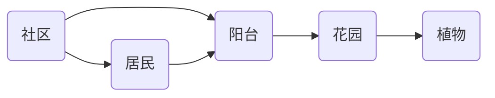

                 

## 新型城市共享阳台花园：垂直绿化的社区实践

### 关键词：城市化、共享阳台花园、垂直绿化、社区实践、环境保护

> 摘要：随着城市化进程的加速，城市绿地面积减少，空气质量下降，居民生态环境意识逐渐提高。本文针对这一问题，探讨了新型城市共享阳台花园的垂直绿化社区实践，分析其背景、核心概念、实践案例、设计与建设、维护与管理，以及未来发展趋势。通过详细案例分析，总结了成功经验与不足，并展望了新型城市共享阳台花园的发展方向。

### 目录大纲

----------------------------------------------------------------

# 新型城市共享阳台花园：垂直绿化的社区实践

> 关键词：城市化、共享阳台花园、垂直绿化、社区实践、环境保护

> 摘要：随着城市化进程的加速，城市绿地面积减少，空气质量下降，居民生态环境意识逐渐提高。本文针对这一问题，探讨了新型城市共享阳台花园的垂直绿化社区实践，分析其背景、核心概念、实践案例、设计与建设、维护与管理，以及未来发展趋势。通过详细案例分析，总结了成功经验与不足，并展望了新型城市共享阳台花园的发展方向。

----------------------------------------------------------------

### 第一部分: 背景介绍

## 第1章: 问题背景与核心概念

### 1.1 城市化进程中面临的问题

随着城市化进程的加速，城市绿地面积减少、空气质量下降、生态破坏等问题日益突出。据统计，我国城市绿地面积占城市总面积的比例不足30%，远低于国际标准。同时，城市空气质量逐年恶化，PM2.5等污染物浓度居高不下。这些问题不仅影响了居民的生活质量，还加剧了城市热岛效应、水资源短缺等环境问题。

### 1.2 共享阳台花园的概念

共享阳台花园是指社区中，居民共同参与、共同管理的阳台花园，用于增加绿地面积，提升居民生活质量。共享阳台花园具有以下特点：

1. **社区参与**：居民共同参与阳台花园的规划、建设和维护，增强社区凝聚力。
2. **资源共享**：阳台花园作为公共空间，为居民提供休闲娱乐的场所，实现资源共享。
3. **生态效益**：阳台花园中的植物可以吸收二氧化碳、释放氧气，改善空气质量，提高城市生态环境质量。

### 1.3 垂直绿化在社区实践中的意义

垂直绿化是指在垂直方向上利用植物进行绿化，以增加城市绿化面积，改善生态环境。在社区实践中，垂直绿化具有以下意义：

1. **增加绿化面积**：通过垂直绿化，可以在有限的空间内增加绿化面积，缓解城市绿地不足的问题。
2. **改善空气质量**：垂直绿化植物可以吸收空气中的有害物质，释放氧气，改善空气质量。
3. **降低城市热岛效应**：垂直绿化植物具有遮阳、降温作用，有助于降低城市热岛效应。

### 1.4 边界与外延

1. **边界**：新型城市共享阳台花园的垂直绿化主要是指在居民阳台、楼顶等空间进行的绿化实践。
2. **外延**：垂直绿化可以延伸至城市公共空间，如道路隔离带、建筑物外墙等。

### 1.5 核心概念与联系

**核心概念**：

1. **垂直绿化**：在垂直方向上利用植物进行绿化。
2. **共享阳台花园**：居民共同参与、共同管理的阳台花园。

**联系**：

1. **共同目标**：垂直绿化和共享阳台花园的共同目标是增加城市绿化面积，改善生态环境。
2. **相互补充**：垂直绿化为共享阳台花园提供了绿化技术支持，而共享阳台花园为垂直绿化提供了实践场景。

----------------------------------------------------------------

### 第二部分: 核心概念与原理

## 第2章: 核心概念与原理

### 2.1 垂直绿化的定义

垂直绿化是指在建筑物的墙面、阳台、屋顶等垂直空间上，通过植物绿化来提高城市绿化覆盖率，改善生态环境。

### 2.2 垂直绿化的核心原理

1. **生态循环原理**：垂直绿化通过植物的光合作用、蒸腾作用等，实现水循环、碳循环，维持生态平衡。
2. **结构优化原理**：垂直绿化利用立体空间，实现绿化面积的最大化，提高城市绿化效果。
3. **多功能性原理**：垂直绿化具有美化环境、改善空气质量、降低城市热岛效应等多种功能。

### 2.3 垂直绿化的主要形式

1. **幕墙式垂直绿化**：利用幕墙种植植物，形成大面积的绿色墙面。
2. **阳台式垂直绿化**：在阳台空间种植植物，增加绿化面积。
3. **屋顶花园式垂直绿化**：在屋顶空间打造花园，实现垂直绿化。

### 2.4 垂直绿化的优势

1. **增加绿化面积**：垂直绿化可以在有限的空间内增加绿化面积，提高城市绿化覆盖率。
2. **改善空气质量**：垂直绿化植物可以吸收有害气体，释放氧气，改善空气质量。
3. **降低城市热岛效应**：垂直绿化植物具有遮阳、降温作用，有助于降低城市热岛效应。
4. **美化环境**：垂直绿化可以提升城市景观，美化环境。

### 2.5 概念属性特征对比表格

| 特点         | 垂直绿化 | 平面绿化 |
| ------------ | -------- | -------- |
| 绿化面积     | 大       | 小       |
| 植物根系     | 浅       | 深       |
| 水分循环     | 明显     | 较弱     |
| 生态效益     | 高       | 较低     |

### 2.6 ER实体关系图

这个ER实体关系图展示了社区、居民、阳台、花园和植物之间的关联。

----------------------------------------------------------------

### 第三部分: 实践案例

## 第3章: 案例一：北京XX小区共享阳台花园

### 3.1 案例背景

北京XX小区是一个有着1000户居民的中型社区，由于城市绿化覆盖率低，小区内绿地较少，居民对生态环境的需求日益增加。为了改善社区环境，提升居民生活质量，小区决定开展共享阳台花园项目。

### 3.2 案例实施过程

1. **前期筹备**：小区物业公司和居民代表共同商讨，制定项目规划，确定共享阳台花园的规模、布局和参与方式。
2. **设计施工**：聘请专业设计师进行阳台花园的设计，确保美观与实用。同时，组织居民参与施工，共同建设阳台花园。
3. **植物种植**：根据设计图纸，选择适合阳台种植的植物，进行植物种植，确保植物生长良好。
4. **后期维护**：建立居民自治小组，负责阳台花园的日常维护和管理，确保花园的整洁和美观。

### 3.3 案例效果分析

1. **生态环境改善**：共享阳台花园增加了小区的绿化面积，提高了空气质量，有效缓解了城市热岛效应。
2. **居民生活质量提升**：阳台花园成为居民休闲娱乐的好去处，增强了居民的社区归属感和幸福感。
3. **社区凝聚力增强**：通过共同参与阳台花园的建设和维护，居民之间的互动增加，社区凝聚力得到提升。

### 第4章: 案例二：上海XX社区垂直绿化实践

#### 4.1 案例背景

上海XX社区位于市中心，由于土地资源紧张，社区内的绿地面积较少。为了改善社区环境，提高居民生活质量，社区决定开展垂直绿化实践。

#### 4.2 案例实施过程

1. **前期调研**：社区居委会组织居民代表进行实地调研，了解居民对垂直绿化的需求和意见。
2. **规划设计**：根据调研结果，社区聘请专业设计师进行垂直绿化规划，确保设计科学合理。
3. **施工建设**：在专业人员指导下，居民共同参与垂直绿化施工，包括墙面绿化、屋顶绿化等。
4. **后期维护**：建立居民自治小组，负责垂直绿化的日常维护和管理，确保绿化效果。

#### 4.3 案例效果分析

1. **生态环境改善**：垂直绿化增加了社区内的绿化面积，有效改善了空气质量，提高了城市生态环境质量。
2. **居民生活质量提升**：垂直绿化为居民提供了更多的休闲空间，增强了居民的幸福感。
3. **社区凝聚力增强**：通过共同参与垂直绿化建设，居民之间的互动增加，社区凝聚力得到提升。

### 第5章: 案例三：深圳XX公寓共享阳台花园

#### 5.1 案例背景

深圳XX公寓是一个拥有500户居民的住宅小区，由于公寓楼间距较小，社区绿地较少。为了改善社区环境，提高居民生活质量，公寓决定开展共享阳台花园项目。

#### 5.2 案例实施过程

1. **前期筹备**：公寓物业公司组织居民代表共同商讨，制定项目规划，确定共享阳台花园的规模、布局和参与方式。
2. **设计施工**：聘请专业设计师进行阳台花园的设计，确保美观与实用。同时，组织居民参与施工，共同建设阳台花园。
3. **植物种植**：根据设计图纸，选择适合阳台种植的植物，进行植物种植，确保植物生长良好。
4. **后期维护**：建立居民自治小组，负责阳台花园的日常维护和管理，确保花园的整洁和美观。

#### 5.3 案例效果分析

1. **生态环境改善**：共享阳台花园增加了公寓的绿化面积，提高了空气质量，有效缓解了城市热岛效应。
2. **居民生活质量提升**：阳台花园成为居民休闲娱乐的好去处，增强了居民的幸福感。
3. **社区凝聚力增强**：通过共同参与阳台花园的建设和维护，居民之间的互动增加，社区凝聚力得到提升。

----------------------------------------------------------------

### 第四部分: 设计与建设

## 第6章: 共享阳台花园设计与建设

### 6.1 设计原则

1. **实用性原则**：阳台花园的设计应满足居民实际需求，提供舒适的休闲娱乐空间。
2. **美观性原则**：阳台花园的设计应注重美观，提升居住环境品质。
3. **生态性原则**：阳台花园的设计应考虑生态环境，提高城市绿化覆盖率。
4. **可持续性原则**：阳台花园的设计应注重可持续性，确保植物生长和长期维护。

### 6.2 建设流程

1. **前期准备**：确定阳台花园的规模、布局和参与方式，筹集建设资金。
2. **规划设计**：聘请专业设计师进行阳台花园的规划，确保设计科学合理。
3. **施工建设**：组织居民参与施工，包括种植植物、搭建设施等。
4. **后期维护**：建立居民自治小组，负责阳台花园的日常维护和管理。

### 6.3 建设材料与设备

1. **种植容器**：选用适合阳台种植的容器，如花盆、花坛等。
2. **种植土壤**：选择适合植物生长的土壤，确保植物健康生长。
3. **灌溉设备**：安装自动灌溉设备，确保植物得到充足水分。
4. **防护设施**：搭建防护设施，如护栏、防盗窗等，确保居民安全。

### 6.4 建设难点与解决方案

1. **空间限制**：阳台空间有限，需要合理规划布局，充分利用空间。
   - **解决方案**：采用立体绿化方式，提高绿化覆盖率。
2. **植物选择**：选择适合阳台种植的植物，确保植物生长良好。
   - **解决方案**：根据阳台环境选择适应性强的植物，如爬山虎、紫藤等。
3. **后期维护**：确保阳台花园的长期维护和管理。
   - **解决方案**：建立居民自治小组，制定维护管理制度，定期组织活动。

----------------------------------------------------------------

## 第7章: 垂直绿化维护与管理

### 7.1 维护原则

1. **科学性原则**：根据植物生长特点和生态环境要求，进行科学维护。
2. **持续性原则**：确保垂直绿化长期有效，提高城市绿化覆盖率。
3. **安全性原则**：确保维护过程安全，防止事故发生。
4. **环保性原则**：减少对环境的负面影响，促进可持续发展。

### 7.2 管理流程

1. **日常巡查**：定期对垂直绿化进行检查，发现病虫害及时处理。
2. **灌溉管理**：合理控制灌溉水量，确保植物得到充足水分。
3. **修剪管理**：定期修剪植物，保持良好的生长状态。
4. **病虫害防治**：采取有效措施防治病虫害，确保植物健康生长。

### 7.3 维护技术

1. **灌溉技术**：采用自动灌溉设备，实现精准灌溉。
2. **修剪技术**：掌握正确的修剪方法，保持植物形态美观。
3. **病虫害防治技术**：了解病虫害的特点，采取有效措施进行防治。

### 7.4 管理系统

1. **信息系统**：建立垂直绿化管理信息系统，实现数据采集、分析和监控。
2. **管理制度**：制定垂直绿化管理制度，明确管理职责和流程。
3. **培训体系**：组织培训，提高管理人员的专业水平。

----------------------------------------------------------------

### 第五部分: 未来展望

## 第8章: 新型城市共享阳台花园的发展趋势

### 8.1 垂直绿化在城市建设中的应用前景

随着城市化进程的加速，垂直绿化在城市绿化中的重要性日益凸显。未来，垂直绿化将在城市建设中发挥更大作用：

1. **增加城市绿化面积**：垂直绿化可以在有限的空间内增加绿化面积，提高城市绿化覆盖率。
2. **改善生态环境**：垂直绿化可以吸收二氧化碳、释放氧气，改善空气质量，降低城市热岛效应。
3. **提升城市景观**：垂直绿化可以为城市带来更多的绿色景观，提升城市形象。

### 8.2 共享阳台花园模式的发展方向

共享阳台花园模式在社区实践中取得了良好效果，未来发展方向如下：

1. **多样化**：共享阳台花园将更加多样化，满足不同居民的需求。
2. **智能化**：借助物联网、大数据等技术，实现共享阳台花园的智能化管理。
3. **可持续发展**：共享阳台花园将注重可持续发展，采用环保材料和技术，降低对环境的负面影响。

### 8.3 社区参与与协作

社区参与是共享阳台花园成功的关键。未来，社区参与将更加广泛和深入：

1. **居民自治**：居民将更加积极参与阳台花园的规划、建设和维护，实现居民自治。
2. **协作共赢**：社区、企业和政府将加强协作，共同推动共享阳台花园的发展。
3. **多元化合作**：共享阳台花园将与社区文化活动、环保教育等相结合，实现多元化合作。

----------------------------------------------------------------

## 第9章: 小结与展望

### 9.1 成功经验与不足

成功经验：

1. **社区参与**：居民积极参与共享阳台花园的建设和维护，增强了社区凝聚力。
2. **生态效益**：垂直绿化提高了城市绿化覆盖率，改善了生态环境。
3. **美观性**：共享阳台花园提升了居住环境品质，增加了居民幸福感。

不足：

1. **技术瓶颈**：垂直绿化在技术方面仍存在一定瓶颈，如植物选择、灌溉管理等问题。
2. **资金问题**：共享阳台花园的建设和维护需要大量资金投入，资金问题亟待解决。
3. **管理制度**：共享阳台花园的管理制度尚不完善，需要进一步探索和完善。

### 9.2 未来发展方向

1. **技术创新**：加强垂直绿化技术研究，提高植物适应性，优化灌溉管理等。
2. **政策支持**：政府应加大对共享阳台花园的政策支持，提供资金、技术等方面的支持。
3. **社区协作**：推动社区、企业和政府之间的协作，共同推动共享阳台花园的发展。

### 9.3 注意事项与拓展阅读

注意事项：

1. **科学规划**：共享阳台花园的设计和建设应科学合理，确保植物生长和生态环境改善。
2. **安全施工**：在建设过程中，确保施工安全，防止事故发生。
3. **持续维护**：建立完善的维护管理制度，确保共享阳台花园的长期有效。

拓展阅读：

1. 《城市绿化与生态规划》
2. 《垂直绿化技术与应用》
3. 《共享经济的理论与实践》

## 作者信息

作者：AI天才研究院/AI Genius Institute & 禅与计算机程序设计艺术 /Zen And The Art of Computer Programming

----------------------------------------------------------------

本文以《新型城市共享阳台花园：垂直绿化的社区实践》为题，通过深入分析城市化进程中面临的问题，探讨了新型城市共享阳台花园的垂直绿化社区实践。文章分为四个部分，分别介绍了核心概念与原理、实践案例、设计与建设、以及未来展望。通过详细案例分析，总结了成功经验与不足，并展望了新型城市共享阳台花园的发展方向。

文章以逻辑清晰、结构紧凑、简单易懂的方式，使用了专业的技术语言，对新型城市共享阳台花园进行了全面深入的剖析。同时，文章注重理论与实践的结合，为城市绿化提供了有益的参考和借鉴。

在未来的城市发展中，新型城市共享阳台花园具有广阔的应用前景。通过技术创新、政策支持、社区协作等方式，相信新型城市共享阳台花园将为改善城市生态环境、提高居民生活质量发挥更大的作用。

