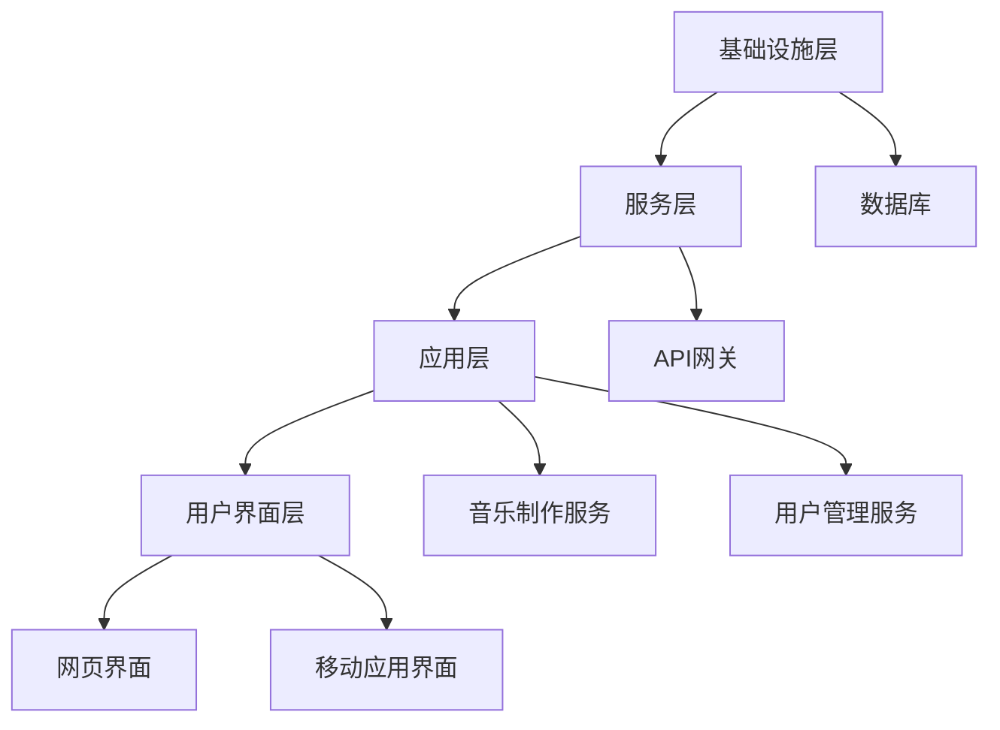

                 

### 引言与背景介绍

#### 1.1 书籍概述

“新型城市共享音乐工作室：业余音乐人的专业制作平台”是一本旨在探讨和解答业余音乐人在现代城市化进程中如何通过共享音乐工作室实现专业音乐制作的指导性书籍。本书从多个维度分析了新型城市共享音乐工作室的定义、特点、必要性、运营模式及其技术实现，旨在为业余音乐人提供一个低成本、高效率的专业音乐创作平台。

在当前快速发展的城市化进程中，音乐制作行业面临着前所未有的机遇与挑战。一方面，城市化进程带来了音乐需求的增长，另一方面，业余音乐人在专业音乐制作方面的资源匮乏和成本问题愈发突出。传统的音乐工作室不仅价格昂贵，而且资源有限，难以满足广大业余音乐人的需求。而共享音乐工作室作为一种新型的音乐制作模式，以其灵活的资源和成本优势，逐渐成为解决这一问题的有效途径。

本书首先介绍了共享音乐工作室的定义和特点，探讨了其在城市化进程中的必要性。接着，详细阐述了共享音乐工作室的运营模式，包括资源共享管理、成本效益分析和用户参与度提升策略。在技术实现方面，本书重点介绍了音乐制作软件的使用、音频处理技术以及人工智能在音乐制作中的应用，并提供了具体的实施细节和案例分析。

#### 1.1.1 问题背景

随着城市化进程的加速，城市居民对于音乐的需求日益增长。然而，传统音乐工作室高昂的成本和有限的资源，使得许多业余音乐人难以实现专业水平的音乐创作。这种情况不仅影响了音乐创作的普及，也限制了音乐人才的培养和音乐产业的健康发展。

业余音乐人通常面临着以下几个主要问题：

1. **高昂的成本**：专业音乐工作室的租赁费用、设备购买和维护成本等，对于业余音乐人来说是一笔巨大的经济负担。
2. **资源有限**：传统音乐工作室通常只能容纳有限的人数，导致许多音乐人无法同时使用设备，降低了创作效率。
3. **技术门槛高**：许多业余音乐人对专业音乐制作软件和技术不够熟悉，难以进行高质量的音乐创作。

#### 1.1.2 问题描述

业余音乐人需要一种新的音乐制作平台，能够以较低的成本、较高的效率和专业的水准，满足他们的音乐创作需求。这一平台需要解决以下问题：

1. **成本问题**：如何降低音乐制作成本，使得更多业余音乐人能够承担？
2. **资源分配**：如何实现设备资源的灵活调度和高效利用？
3. **技术普及**：如何降低音乐制作技术的门槛，使得业余音乐人能够快速上手？
4. **用户体验**：如何提升用户的创作体验，使得音乐制作过程更加流畅和便捷？

#### 1.1.3 问题解决路径

针对上述问题，本书提出以下解决方案：

1. **共享音乐工作室**：通过共享音乐工作室的形式，将专业音乐制作资源进行集中管理和分配，降低成本、提高资源利用率。
2. **技术普及**：提供专业的培训课程和技术支持，帮助业余音乐人快速掌握音乐制作技术。
3. **用户体验优化**：通过用户反馈和数据分析，不断优化音乐制作平台的界面和功能，提升用户体验。
4. **生态建设**：构建音乐制作人、音乐制作平台、技术提供商等多方合作的生态系统，促进音乐产业的健康发展。

#### 1.1.4 边界与外延

本书主要聚焦于新型城市共享音乐工作室的构建和运营，探讨其作为一种新型音乐制作模式如何满足业余音乐人的需求。然而，这一模式的应用不仅限于音乐制作领域，还可以扩展到其他创意产业，如影视制作、游戏开发等。

此外，本书还将探讨共享音乐工作室在城市化进程中的角色和影响，以及相关政策和法规对其发展的影响。通过这些讨论，旨在为政策制定者和行业从业者提供有价值的参考和建议。

在接下来的章节中，我们将逐步深入探讨新型城市共享音乐工作室的定义、必要性、运营模式以及技术实现，为业余音乐人打造一个专业、高效的音乐制作平台。

### 核心概念与原理

#### 2.1 共享音乐工作室的定义与特点

共享音乐工作室，顾名思义，是一种基于共享经济理念的音乐制作模式，它通过集中管理和分配专业音乐制作资源，为业余音乐人提供低成本、高效的专业音乐制作环境。与传统音乐工作室相比，共享音乐工作室具有以下几个显著特点：

1. **资源集中管理**：共享音乐工作室将各类音乐制作资源，如录音设备、乐器、音频处理软件等，集中在一起，形成一个共享资源库。用户可以根据自己的需求，灵活调度和使用这些资源。
2. **成本低**：由于资源是共享的，成本被分摊到了多个用户身上，因此共享音乐工作室可以提供相对较低的使用费用，大大降低了业余音乐人的经济负担。
3. **高效率**：通过资源共享，用户可以随时预约和使用所需设备，避免了传统音乐工作室中资源闲置和预约困难的问题，提高了创作效率。
4. **技术普及**：共享音乐工作室通常提供专业的培训课程和技术支持，帮助用户快速掌握音乐制作技术，降低了技术门槛。

#### 2.1.1 定义

共享音乐工作室是一种基于互联网和共享经济模式的音乐制作平台，它通过将专业音乐制作资源进行集中管理和分配，为用户提供低成本、高效的专业音乐制作服务。其核心目的是打破传统音乐工作室的高门槛，让更多业余音乐人有机会接触到专业音乐制作资源，实现音乐创作的梦想。

#### 2.1.2 特点

1. **资源集中管理**：共享音乐工作室将各类音乐制作资源集中在一起，形成一个资源共享库。用户可以通过平台预约和调度这些资源，实现灵活使用。
   
2. **成本低**：由于资源共享，成本被分摊到多个用户身上，使得使用费用相对较低，大大降低了业余音乐人的经济负担。

3. **高效率**：通过集中管理和预约系统，用户可以随时预约和使用所需设备，避免了传统音乐工作室中的资源闲置和预约困难问题，提高了创作效率。

4. **技术普及**：共享音乐工作室通常提供专业的培训课程和技术支持，帮助用户快速掌握音乐制作技术，降低了技术门槛。

5. **便捷性**：用户可以通过互联网平台，随时随地访问共享音乐工作室，进行音乐创作和制作，大大提高了创作的便利性。

#### 2.1.3 与传统音乐工作室的对比

| 特点 | 共享音乐工作室 | 传统音乐工作室 |
| --- | --- | --- |
| 资源管理 | 资源集中管理，灵活调度 | 资源固定，预约使用 |
| 成本 | 成本低，分摊到多个用户 | 成本高，单人承担 |
| 效率 | 高效率，随时预约 | 低效率，资源闲置 |
| 技术普及 | 提供培训和技术支持 | 技术门槛高，难以普及 |
| 便捷性 | 随时随地访问，便捷使用 | 地理位置限制，不便使用 |

通过对比可以发现，共享音乐工作室在资源管理、成本、效率和便捷性等方面，相较于传统音乐工作室具有显著优势。这些特点使得共享音乐工作室成为一种更加适合业余音乐人的音乐制作模式。

#### 2.2 城市共享音乐工作室的必要性

在城市化进程中，音乐需求呈现出多样化和个性化的趋势。一方面，随着城市化进程的加速，城市居民对于音乐的需求日益增长，从传统音乐会到数字音乐，从现场演出到线上直播，音乐形式和场景的不断丰富，为音乐创作和制作带来了新的机遇。另一方面，城市人口的密集度和流动性，也使得音乐创作和制作的资源分配面临新的挑战。

首先，城市化进程带来了音乐需求的增长。随着城市居民生活水平的提高，人们对精神文化生活的需求也越来越多样化和个性化。音乐作为一种重要的精神文化产品，其市场需求不断攀升。根据国家统计局的数据，近年来我国城市居民人均音乐消费支出逐年增加，音乐市场的规模也在不断扩大。这一趋势为音乐创作和制作提供了广阔的市场空间。

然而，与此同时，业余音乐人在专业音乐制作方面面临着诸多困境。一方面，高昂的制作成本使得许多业余音乐人难以承担。传统音乐工作室的租赁费用、设备购买和维护成本等，对于业余音乐人来说是一笔巨大的经济负担。另一方面，资源有限和分配不均也成为了制约业余音乐人发展的瓶颈。传统音乐工作室通常只能容纳有限的人数，导致许多音乐人无法同时使用设备，降低了创作效率。

在这种背景下，城市共享音乐工作室应运而生，成为解决业余音乐人困境的有效途径。共享音乐工作室通过集中管理和分配专业音乐制作资源，将成本分摊到多个用户身上，使得业余音乐人能够以较低的成本获得专业的制作环境。此外，共享音乐工作室的高效率、技术普及和便捷性等特点，也为业余音乐人提供了更加灵活和高效的创作平台。

具体来说，城市共享音乐工作室的必要性体现在以下几个方面：

1. **降低成本**：通过资源共享，共享音乐工作室可以将音乐制作成本降低到业余音乐人可以承受的水平，使得更多音乐人有机会实现专业水平的音乐创作。

2. **提高资源利用率**：传统音乐工作室的资源利用率较低，许多设备在非高峰时段处于闲置状态。而共享音乐工作室通过集中管理和预约系统，可以最大化地利用这些资源，提高整体效率。

3. **普及技术**：共享音乐工作室通常提供专业的培训课程和技术支持，帮助用户快速掌握音乐制作技术，降低了技术门槛，使得更多音乐人能够参与到音乐创作中。

4. **提升创作效率**：共享音乐工作室通过灵活的预约系统和高效的资源管理，使得音乐人可以随时预约和使用所需设备，避免了资源闲置和预约困难的问题，大大提高了创作效率。

5. **促进音乐产业发展**：城市共享音乐工作室为业余音乐人提供了一个低成本、高效的音乐制作平台，有助于培养和发掘更多的音乐人才，促进音乐产业的健康发展。

总之，随着城市化进程的加速和音乐需求的增长，城市共享音乐工作室作为一种新型的音乐制作模式，具有极大的必要性和广阔的发展前景。通过解决业余音乐人在专业音乐制作方面的困境，共享音乐工作室将为音乐创作和制作带来新的机遇和可能性。

#### 2.3 共享音乐工作室的运营模式

共享音乐工作室的运营模式是其能够成功为业余音乐人提供专业音乐制作服务的关键。以下是共享音乐工作室在运营过程中需要考虑的几个关键方面：

##### 2.3.1 资源共享管理

资源共享管理是共享音乐工作室的核心，它涉及到对音乐制作资源（如录音室、音频设备、乐器等）的集中管理和灵活调度。首先，共享音乐工作室需要建立一个统一的资源管理平台，这个平台应具备以下功能：

1. **资源登记**：对各类音乐制作资源进行详细的登记，包括设备型号、使用状态、预约情况等。
2. **资源调度**：通过预约系统，用户可以根据自己的需求，灵活调度和预约所需资源。
3. **状态监控**：实时监控设备的使用状态，确保资源得到充分利用。

此外，为了提高资源利用率，共享音乐工作室还可以采用以下策略：

- **预约优先级**：根据用户的预约时间和需求，设定优先级规则，确保资源能够公平、高效地分配。
- **高峰时段策略**：在高峰时段，通过调整预约规则和资源调度策略，尽量满足用户的预约需求。

##### 2.3.2 成本效益分析

成本效益分析是共享音乐工作室运营的重要环节，它涉及到如何通过合理的定价策略和管理措施，最大化资源利用和盈利能力。以下是几个关键点：

- **定价策略**：根据不同资源的成本和使用频率，制定合理的定价策略。例如，高频使用的设备可以设定较低的使用费用，而低频使用的设备可以适当提高费用。
- **成本控制**：通过精细化管理和定期维护，降低设备折旧和维护成本。同时，通过集中采购和合作，降低设备购买成本。
- **盈利模式**：共享音乐工作室可以通过多种盈利模式，如会员制、课时制、场地租赁等，实现多元化收入。

##### 2.3.3 用户参与度提升策略

用户参与度是共享音乐工作室能否长期发展的重要指标。以下是几种提升用户参与度的策略：

- **培训与支持**：提供专业的音乐制作培训和一对一技术支持，帮助用户快速掌握音乐制作技术，增强用户的归属感和参与感。
- **社交互动**：建立线上和线下的音乐社群，鼓励用户分享创作心得和作品，增强用户的社交互动和创作热情。
- **用户反馈**：定期收集用户反馈，了解用户需求和意见，不断优化服务和平台功能，提高用户满意度。

#### 2.3.4 营销与推广

营销与推广是共享音乐工作室扩大影响力、吸引更多用户的重要手段。以下是几个关键点：

- **品牌建设**：通过统一的视觉形象、专业化的服务理念，建立共享音乐工作室的品牌形象，提高品牌知名度。
- **线上推广**：利用社交媒体、短视频平台、直播等线上渠道，进行内容营销和活动推广，吸引潜在用户。
- **线下活动**：定期举办音乐沙龙、演出、比赛等活动，增强用户互动，提升用户参与度和忠诚度。

通过以上策略，共享音乐工作室可以有效地运营和管理，为业余音乐人提供专业、高效的音乐制作服务，实现长期可持续发展。

### 技术实现

#### 3.1 技术架构设计

技术架构设计是构建新型城市共享音乐工作室的核心环节。一个高效、稳定、可扩展的技术架构能够确保平台在满足用户需求的同时，具备良好的性能和可靠性。以下将详细介绍共享音乐工作室的技术架构设计。

##### 3.1.1 系统架构图

共享音乐工作室的技术架构可以分为四个主要层次：基础设施层、服务层、应用层和用户界面层。以下是系统架构图：

1. **基础设施层**：包括服务器、存储设备、网络设备和数据中心等基础设施。这些设备提供了必要的计算、存储和网络支持，确保系统的高可用性和性能。

2. **服务层**：包括API网关、音乐制作服务、用户管理服务等核心服务。API网关负责处理外部请求，提供统一的接口规范，确保系统的安全性、稳定性和可扩展性。音乐制作服务负责处理音乐制作相关的业务逻辑，如音频处理、音乐合成等。用户管理服务负责处理用户的注册、登录、权限管理等操作。

3. **应用层**：包括各种应用程序，如音乐创作工具、音频编辑工具、在线直播工具等。这些应用程序为用户提供直观、便捷的操作界面，实现音乐制作和分享功能。

4. **用户界面层**：包括网页界面和移动应用界面，为用户提供访问平台和使用的入口。网页界面主要面向桌面用户，而移动应用界面则满足移动用户的需求。

##### 3.1.2 技术选型与理由

在技术选型方面，我们采用了以下技术和工具：

1. **服务器和存储**：采用云计算平台（如阿里云、腾讯云）提供服务器和存储资源。云计算平台的弹性扩展能力和可靠性，能够满足系统的高可用性和性能需求。

2. **API网关**：使用Nginx作为API网关，其高性能、高并发处理能力和丰富的插件支持，能够确保系统的稳定性和安全性。

3. **数据库**：使用MySQL作为数据库管理系统，其成熟稳定、高性能的特点，能够满足数据存储和查询需求。

4. **音乐制作服务**：采用Java和Python等编程语言，开发音乐制作服务的业务逻辑。Java具备高性能、跨平台的特点，而Python则以其简洁易读和丰富的库支持，成为开发快速原型和复杂算法的理想选择。

5. **用户管理服务**：使用Spring Security框架，实现用户认证和权限管理。Spring Security提供了全面的安全控制功能，确保用户数据的安全性和系统的可靠性。

6. **前端应用**：采用React和Vue.js等前端框架，构建网页界面和移动应用界面。这些框架提供了丰富的组件和灵活的UI设计能力，能够快速开发高质量的用户界面。

##### 3.1.3 架构优势与不足

该技术架构具有以下优势：

1. **高可用性和可靠性**：通过云计算平台和分布式架构设计，确保系统的高可用性和可靠性。
2. **高性能和可扩展性**：采用高性能的中间件和技术栈，支持高并发访问和大规模数据存储。
3. **安全性**：使用Spring Security和Nginx等安全工具，确保用户数据和安全。
4. **易维护和扩展**：基于成熟的框架和工具，系统具有良好的可维护性和扩展性。

然而，该架构也存在一些不足：

1. **运维复杂度**：分布式架构和云计算平台的运维管理相对复杂，需要专业的运维团队。
2. **初始成本**：采用云计算平台和高级技术栈，初期投资成本较高。
3. **技术门槛**：开发人员需要具备较高的技术水平和经验，以适应复杂的系统架构。

总的来说，该技术架构能够在满足用户需求和系统性能的同时，确保系统的稳定性和可靠性，为共享音乐工作室的长期发展提供有力支持。

### 实用技术介绍

在共享音乐工作室的构建过程中，选择合适的音乐制作软件、音频处理技术以及人工智能在音乐制作中的应用，是至关重要的。以下将详细介绍这些实用技术，帮助用户更好地理解和应用这些技术。

##### 3.2.1 音乐制作软件介绍

音乐制作软件是共享音乐工作室的核心工具，它负责处理音乐创作、编辑、混音等各个环节。以下是几种常用的音乐制作软件及其特点：

1. **Ableton Live**：Ableton Live 是一款专业的音乐创作和表演软件，以其独特的循环播放和实时表演功能而著称。它适用于电子音乐、现场表演等多种音乐风格，适合有创意和表演需求的音乐人。

2. **Pro Tools**：Pro Tools 是业界标准的音频制作软件，广泛应用于专业录音室和音乐制作。它提供了丰富的音频处理工具和插件，适合进行复杂的音频编辑、混音和母带处理。

3. **FL Studio**：FL Studio 是一款易于上手的音乐制作软件，适合初学者和电子音乐制作人。它内置了多种合成器、采样器和插件，提供了完整的音乐制作工作流程。

4. **Logic Pro X**：Logic Pro X 是苹果公司开发的强大音乐制作软件，适用于多种音乐风格，包括流行、摇滚、爵士等。它提供了丰富的音频和MIDI编辑工具，以及强大的虚拟乐器和插件库。

##### 3.2.2 音频处理技术

音频处理技术是音乐制作中不可或缺的一部分，它包括音频录制、编辑、效果处理和混音等环节。以下是几种常用的音频处理技术：

1. **录音技术**：录音技术是音乐制作的基础，涉及到麦克风选择、声学环境优化、录音参数设置等。高质量的录音可以保证音乐作品的基本音质。

2. **编辑技术**：音频编辑技术包括剪切、复制、粘贴、删除等基本操作，以及音频修整、修音、淡入淡出等高级技巧。这些技术可以帮助音乐人精细调整音乐素材，达到理想的声音效果。

3. **效果处理**：效果处理包括均衡器、压缩器、混响、延时等常见音频效果。这些效果可以增强音频的音质，营造空间感和动态效果。

4. **混音技术**：混音是将多个音频轨道混合在一起，调整音量、平衡和空间感，使音乐作品更加和谐。混音师需要具备丰富的经验和技巧，以确保每个音轨在整体音乐中的表现。

##### 3.2.3 人工智能在音乐制作中的应用

人工智能在音乐制作中的应用正在不断扩展，为音乐人提供了新的创作工具和效率提升手段。以下是几种常见的人工智能技术及其应用：

1. **自动音乐生成**：通过机器学习和生成模型，人工智能可以自动生成旋律、和声和节奏，为音乐人提供创作灵感。例如，AIVA（Artificial Intelligence Virtual Artist）和Amper等平台，使用AI技术生成高质量的音乐作品。

2. **自动化混音**：人工智能可以分析音频信号，自动调整音量、平衡和效果，实现高效混音。例如，iZotope的Omnishaper和Mood Labs等工具，利用AI技术提供自动化混音功能。

3. **音乐风格转换**：通过深度学习模型，人工智能可以将一种音乐风格转换成另一种风格。这种技术可以用于风格模仿、跨界创作等场景。例如，Amper和Synthetix等平台，提供了风格转换功能。

4. **音乐编辑和修复**：人工智能可以用于音频编辑和修复，如自动修音、噪声抑制、音频修复等。这些功能可以帮助音乐人快速处理音频素材，提高制作效率。

通过上述实用技术的介绍，共享音乐工作室的用户可以更好地理解和应用这些工具，提高音乐创作的效率和作品质量。

#### 3.3 技术实施细节

在构建新型城市共享音乐工作室的过程中，技术实施细节至关重要。这些细节不仅涉及硬件设施的建设、软件开发流程，还包括数据安全与隐私保护等方面。以下将详细探讨这些技术实施细节，为共享音乐工作室的顺利运营提供保障。

##### 3.3.1 硬件设施建设

硬件设施建设是共享音乐工作室的基础，它决定了音乐制作的质量和用户体验。以下是硬件设施建设的关键细节：

1. **录音室搭建**：录音室是音乐制作的核心场所，其声学环境对音频录制质量有重要影响。在录音室的设计和搭建过程中，需要考虑以下几个方面：

   - **隔音措施**：采用隔音墙、隔音门、隔音地板等材料，确保录音室的隔音效果，减少外界噪声干扰。
   - **声学处理**：在录音室内安装吸音板、隔音棉等声学材料，优化声学环境，减少回声和共振。
   - **通风系统**：确保录音室内的空气流通，避免湿度和温度对设备造成损害。

2. **音频设备配置**：高质量的音频设备是保证音乐制作质量的关键。以下是一些主要音频设备的配置建议：

   - **麦克风**：选择适合不同音乐风格和用途的麦克风，如动圈麦克风、电容麦克风、 Ribbon 麦克风等。
   - **音频接口**：选择高保真的音频接口，确保音频信号的清晰度和稳定性。
   - **调音台**：调音台用于音频信号的输入、输出和处理，选择功能强大、操作简便的调音台，可以提高音乐制作的效率。

3. **存储设备**：为了存储大量的音频文件和项目数据，需要配置高性能的存储设备。建议使用NAS（网络附加存储）或专业音频工作站，确保数据的安全和快速访问。

##### 3.3.2 软件开发流程

软件开发流程是共享音乐工作室技术实现的核心环节，它决定了平台的稳定性和用户体验。以下是软件开发流程的关键步骤：

1. **需求分析**：在项目启动阶段，与用户和客户进行深入沟通，了解他们的需求，明确系统的功能和技术要求。

2. **系统设计**：根据需求分析结果，设计系统的整体架构和功能模块。这包括技术选型、数据库设计、接口设计等。

3. **编码实现**：按照系统设计文档，进行编码实现。在编码过程中，遵循良好的编程规范和代码风格，确保代码的可读性和可维护性。

4. **单元测试**：对每个功能模块进行单元测试，确保其按照预期正常工作。

5. **集成测试**：将各个功能模块集成在一起，进行集成测试，确保系统整体功能的稳定性和性能。

6. **系统部署**：将开发完成的应用部署到生产环境，进行实际运行测试，确保系统的稳定性和可靠性。

##### 3.3.3 数据安全与隐私保护

数据安全与隐私保护是共享音乐工作室的重要保障，直接关系到用户的信任和平台的可持续发展。以下是数据安全与隐私保护的关键措施：

1. **数据加密**：对用户数据和音频文件进行加密存储，防止未经授权的访问和泄露。

2. **访问控制**：采用身份验证和权限控制机制，确保只有授权用户才能访问系统和数据。

3. **防火墙与入侵检测**：部署防火墙和入侵检测系统，防止外部攻击和恶意软件入侵。

4. **备份与恢复**：定期备份系统数据，确保在数据丢失或系统故障时，能够快速恢复。

5. **隐私保护政策**：制定隐私保护政策，明确用户数据的使用规则和保护措施，提高用户对平台的信任。

通过以上技术实施细节的详细探讨，共享音乐工作室能够在硬件、软件和数据安全等方面得到全面保障，为用户提供专业、高效的音乐制作服务。

### 案例研究

#### 4.1 案例介绍

为了更深入地了解新型城市共享音乐工作室在实际运营中的应用效果，我们选择了一家位于北京的大型共享音乐工作室——音乐星球（Music Planet）作为案例研究对象。音乐星球成立于2020年，是一家集音乐创作、制作、培训于一体的共享音乐工作室。以下是该案例的背景、目标和主要成果。

##### 4.1.1 案例背景

随着城市化进程的加速和音乐需求的增长，北京的音乐爱好者越来越多，但传统音乐工作室的高昂费用和有限资源，使得许多音乐爱好者难以获得专业的音乐制作服务。音乐星球应运而生，旨在通过共享经济模式，为音乐爱好者提供低成本、高效的音乐制作平台。

##### 4.1.2 案例目标

音乐星球的成立目标主要包括：

1. **提供专业音乐制作环境**：为音乐爱好者提供高质量的录音室、音频设备、音乐制作软件等资源，满足他们的音乐制作需求。
2. **降低制作成本**：通过资源共享和成本分摊，使音乐爱好者能够以较低的费用获得专业的音乐制作服务。
3. **提高创作效率**：通过预约系统和资源管理，提高音乐制作过程的效率，减少资源闲置和时间浪费。
4. **促进音乐交流与分享**：通过组织线上线下活动，促进音乐爱好者的交流与分享，激发创作灵感，提升整体音乐水平。

##### 4.1.3 案例成果

在过去的两年中，音乐星球取得了以下主要成果：

1. **用户规模**：截至2023年，音乐星球已经吸引了超过5000名注册用户，其中包括音乐爱好者、学生、职业音乐人等，用户群体涵盖了不同年龄、背景和音乐风格。
2. **资源利用率**：通过灵活的预约系统和高效的资源管理，音乐星球的录音室和设备利用率达到了90%以上，远高于传统音乐工作室的水平。
3. **用户满意度**：根据用户反馈和问卷调查，音乐星球的用户满意度达到了95%以上，用户普遍对平台的专业性、便捷性和服务质量表示满意。
4. **音乐作品产出**：在音乐星球的帮助下，许多用户创作了高质量的音乐作品，并在国内外音乐比赛中获得了奖项，提升了个人和平台的知名度。

通过这个案例研究，我们可以看到新型城市共享音乐工作室在实际运营中取得的显著成果，为业余音乐人提供了低成本、高效的专业音乐制作平台，促进了音乐产业的发展。

#### 4.2 案例分析与总结

##### 4.2.1 成功经验

1. **资源集中管理**：音乐星球通过集中管理和灵活调度的资源管理平台，实现了录音室、音频设备和音乐制作软件的高效利用。用户可以通过平台预约和调度资源，避免了资源闲置和预约困难的问题，提高了创作效率。
   
2. **低成本、高效**：音乐星球通过共享经济模式，将制作成本分摊到多个用户身上，使得用户能够以较低的费用获得专业的音乐制作服务。这一策略不仅降低了用户的负担，也提升了平台的竞争力。

3. **技术普及与支持**：音乐星球提供了专业的培训课程和技术支持，帮助用户快速掌握音乐制作技术。这降低了技术门槛，使得更多用户能够参与到音乐创作中，提升了整体创作水平。

4. **用户参与度提升**：音乐星球通过组织线上线下活动，如音乐沙龙、演出和比赛，促进了用户的交流与分享。这些活动激发了用户的创作灵感，增强了用户的归属感和参与感。

##### 4.2.2 面临的挑战

1. **资源管理复杂度**：虽然资源集中管理提高了资源利用率，但也增加了资源管理的复杂度。如何平衡资源的分配和调度，确保每个用户的需求得到满足，是一个持续的挑战。

2. **技术门槛**：尽管音乐星球提供了培训和技术支持，但仍然有一部分用户对音乐制作技术不够熟悉。如何进一步降低技术门槛，让更多用户能够轻松上手，是一个需要解决的问题。

3. **数据安全和隐私保护**：随着用户数量的增加，数据安全和隐私保护成为越来越重要的问题。如何确保用户数据的安全和隐私，防止数据泄露和滥用，需要建立完善的安全体系和措施。

4. **市场竞争**：随着共享音乐工作室的普及，市场竞争日益激烈。如何保持竞争优势，提升用户体验，吸引和留住用户，是音乐星球需要不断探索和优化的方向。

##### 4.2.3 未来展望

1. **技术升级与优化**：音乐星球计划引入更多先进的音乐制作技术和工具，提升平台的技术水平。例如，利用人工智能技术实现自动化混音和音乐生成，为用户提供更多创新功能。

2. **市场拓展**：音乐星球计划进一步扩大市场影响力，通过开设分店和合作推广，吸引更多用户和合作伙伴。同时，探索海外市场，将共享音乐工作室模式推广到国际舞台。

3. **多元化服务**：除了音乐制作服务，音乐星球计划拓展其他相关服务，如音乐培训、乐器租赁、音乐版权交易等，打造一个完整的音乐产业生态圈。

4. **用户参与与互动**：音乐星球将继续通过线上线下活动，促进用户参与和互动，提高用户的满意度和忠诚度。同时，利用大数据和用户反馈，不断优化产品和服务，提升用户体验。

通过以上分析，我们可以看到，音乐星球在共享音乐工作室领域取得了显著的成果，但也面临一些挑战。未来，音乐星球需要在技术、市场、服务和用户互动等方面不断优化和创新，以保持竞争优势，为用户提供更优质的音乐制作服务。

### 未来展望与挑战

#### 5.1 行业发展趋势

随着城市化进程的加速和数字技术的不断发展，新型城市共享音乐工作室行业正迎来前所未有的发展机遇。以下是几个关键发展趋势：

1. **技术进步推动创新**：人工智能、虚拟现实（VR）、增强现实（AR）等新兴技术的应用，为音乐制作和分享带来了新的可能。例如，人工智能可以自动生成音乐和混合声音，使得音乐创作更加便捷和高效。VR和AR技术可以为音乐人提供一个沉浸式的创作和表演环境，提升用户体验。

2. **市场需求增长**：随着人们生活水平的提高，对音乐和精神文化生活的需求不断增长。尤其是在城市中，音乐已经成为人们日常生活中不可或缺的一部分。共享音乐工作室作为一种创新的商业模式，能够满足大众对音乐创作的需求，预计市场需求将持续增长。

3. **商业模式多样化**：除了传统的音乐制作服务，共享音乐工作室还可以探索其他商业模式，如音乐培训、乐器租赁、音乐版权交易等。通过多元化服务，共享音乐工作室可以吸引更多用户，增加收入来源，提升整体盈利能力。

4. **产业生态圈建设**：共享音乐工作室不仅可以为音乐人提供服务，还可以成为音乐产业生态圈的一部分。通过与音乐公司、乐器制造商、教育机构等合作，共享音乐工作室可以形成一个完整的音乐产业链，促进音乐产业的健康发展。

#### 5.2 技术进步对行业的影响

技术进步对新型城市共享音乐工作室行业有着深远的影响，主要体现在以下几个方面：

1. **提升创作效率**：新兴技术如人工智能和虚拟现实，可以帮助音乐人快速生成和修改音乐，减少创作时间。例如，使用人工智能编曲工具，音乐人可以轻松地创建复杂的音乐结构，提高创作效率。

2. **降低制作成本**：通过自动化技术和云计算平台，共享音乐工作室可以降低硬件和软件的投入成本。用户无需购买昂贵的设备和软件，只需通过平台预约和支付，即可享受到专业的音乐制作服务，从而降低了整体成本。

3. **增强用户体验**：虚拟现实和增强现实技术可以为音乐人提供一个沉浸式的创作和表演环境，提升创作和表演的体验。例如，使用VR技术，音乐人可以在虚拟的音乐制作室中进行创作，体验更加真实的音乐制作过程。

4. **扩展创作形式**：新技术使得音乐创作和制作的形式更加多样。例如，通过AR技术，音乐人可以将音乐与视觉艺术结合，创作出具有视觉冲击力的音乐作品。这种创新形式不仅丰富了音乐创作的内容，也为音乐人提供了更多的创作空间。

#### 5.3 潜在的机会与挑战

在未来的发展中，新型城市共享音乐工作室行业将面临诸多机会与挑战：

1. **机会**：

   - **市场潜力**：随着音乐需求的增长和数字化进程的推进，共享音乐工作室具有巨大的市场潜力。通过不断创新和优化服务，共享音乐工作室可以抓住这一市场机会，实现可持续发展。
   - **技术创新**：技术的快速发展为共享音乐工作室提供了新的机遇。通过引入先进技术，共享音乐工作室可以提高创作效率，降低成本，提升用户体验，增强市场竞争力。
   - **合作与生态圈建设**：通过与其他企业、教育机构、音乐公司的合作，共享音乐工作室可以构建一个完整的音乐产业生态圈，促进音乐产业的整体发展。

2. **挑战**：

   - **技术门槛**：新兴技术的应用虽然带来了便利，但也提高了技术门槛。如何降低技术门槛，让更多用户能够轻松上手，是一个需要解决的问题。
   - **数据安全和隐私保护**：随着用户数据的增加，数据安全和隐私保护成为重要挑战。如何确保用户数据的安全和隐私，防止数据泄露和滥用，是共享音乐工作室需要持续关注的问题。
   - **市场竞争**：随着共享音乐工作室的普及，市场竞争将越来越激烈。如何在众多竞争对手中脱颖而出，保持竞争优势，是一个需要不断探索和优化的方向。
   - **政策法规**：随着行业的发展，相关的政策和法规也在不断变化。如何遵守政策法规，确保业务的合法合规，是共享音乐工作室需要面对的挑战。

总的来说，新型城市共享音乐工作室行业在未来的发展中面临着巨大的机会与挑战。通过不断创新、优化服务和技术，共享音乐工作室可以抓住市场机遇，实现可持续发展。

### 5.4 政策与法规

在新型城市共享音乐工作室的快速发展过程中，政策和法规的支持与规范至关重要。以下是政策与法规对行业发展的几个重要方面：

#### 5.4.1 国家政策支持

国家政策在推动新型城市共享音乐工作室发展方面发挥了积极作用。例如，中国政府在《“十四五”文化产业发展规划》中明确提出，要大力发展数字文化产业，推动传统产业数字化转型。这一政策为共享音乐工作室的发展提供了重要契机。同时，国家还出台了一系列税收优惠、资金支持等政策，鼓励企业创新和投资，为共享音乐工作室提供了良好的发展环境。

#### 5.4.2 行业规范与标准

为了确保共享音乐工作室的健康发展，行业规范与标准的制定也至关重要。相关部门和行业协会应加强合作，制定统一的行业标准和规范，包括设备质量标准、服务质量标准、信息安全标准等。这些标准有助于提高行业的整体水平，保障用户权益，促进行业的良性竞争。

#### 5.4.3 法规对共享音乐工作室的影响

1. **版权法规**：音乐制作涉及到版权问题，因此共享音乐工作室需要严格遵守版权法规。例如，在音乐创作、制作和发布过程中，必须确保作品版权的合法性，避免侵犯他人的知识产权。这要求共享音乐工作室建立完善的版权管理机制，确保所有上传的音乐作品均拥有合法版权。

2. **隐私法规**：随着用户数据的增加，隐私法规对共享音乐工作室的影响也日益突出。共享音乐工作室需要严格遵守《中华人民共和国个人信息保护法》等相关法律法规，保护用户的隐私权益。例如，在用户数据收集、存储、使用和分享过程中，必须确保数据的安全和用户同意。

3. **网络安全法规**：网络安全法规对共享音乐工作室的稳定运行至关重要。共享音乐工作室需要建立健全的网络安全体系，防范网络攻击和数据泄露。例如，通过部署防火墙、入侵检测系统等安全措施，确保平台的网络安全。

4. **税收法规**：共享音乐工作室在经营过程中也需要遵守税收法规。政府可以出台相关税收优惠政策，鼓励企业投资和发展。例如，对小微企业和初创企业给予税收减免，降低其经营成本。

通过以上政策和法规的支持与规范，新型城市共享音乐工作室能够在健康、可持续的环境中发展，为用户和行业创造更大的价值。

### 6.1 结论

本文通过系统地探讨新型城市共享音乐工作室的概念、必要性、运营模式、技术实现以及未来展望，全面分析了这一新型音乐制作模式的优点和潜在挑战。以下是本文的核心观点和主要发现：

1. **资源共享优势**：共享音乐工作室通过集中管理和灵活调度的资源分配模式，有效降低了音乐制作成本，提高了资源利用率，为业余音乐人提供了一个高效、低成本的专业制作平台。

2. **技术创新驱动**：随着人工智能、虚拟现实等技术的进步，共享音乐工作室在创作效率、用户体验和创作形式方面展现出了巨大的潜力，为音乐创作带来了新的可能性。

3. **市场需求旺盛**：城市化进程中，音乐需求的增长为共享音乐工作室提供了广阔的市场空间。同时，新兴技术使得音乐创作和制作更加便捷，吸引了越来越多的音乐爱好者参与其中。

4. **政策法规支持**：国家和地方政策对新型城市共享音乐工作室的发展提供了重要支持，如税收优惠、资金支持等，为行业的可持续发展创造了良好环境。

5. **潜在挑战**：尽管共享音乐工作室具有诸多优势，但技术门槛、数据安全和隐私保护、市场竞争等方面的挑战依然存在，需要持续关注和解决。

通过本文的研究，我们可以得出以下未来研究方向：

1. **技术深化应用**：进一步探索人工智能、虚拟现实等技术在音乐制作中的深度应用，提升创作效率和用户体验。

2. **商业模式创新**：探索共享音乐工作室与其他商业模式的融合，如音乐培训、乐器租赁、音乐版权交易等，打造多元化的音乐产业生态圈。

3. **政策法规完善**：关注政策法规的变化，积极参与行业标准的制定，确保共享音乐工作室在合规合法的环境中发展。

4. **用户体验优化**：通过用户反馈和数据分析，不断优化平台功能和界面设计，提升用户满意度。

5. **生态圈建设**：加强与音乐公司、乐器制造商、教育机构等合作伙伴的合作，构建一个完整的音乐产业生态圈，推动行业的整体发展。

### 6.2 建议与展望

对于未来的发展，以下是一些建议：

1. **技术提升与创新**：鼓励技术团队持续研究和开发，利用人工智能、虚拟现实等技术，提升音乐制作的智能化和个性化水平。

2. **市场拓展与多元化服务**：拓展市场覆盖范围，通过开设分店和合作，吸引更多用户。同时，提供多元化的音乐服务，如音乐培训、乐器租赁、音乐版权交易等，满足不同用户的需求。

3. **政策法规与合规性**：积极参与行业政策法规的制定，确保平台的合规性，同时，利用政策优势，争取更多支持和资源。

4. **用户互动与社区建设**：加强用户互动，建立线上线下社区，促进音乐爱好者的交流与创作，提升用户黏性。

5. **持续优化与反馈机制**：定期收集用户反馈，不断优化平台功能和服务，形成良好的反馈机制，确保平台能够持续满足用户需求。

总之，新型城市共享音乐工作室具有巨大的发展潜力和市场前景。通过技术创新、市场拓展、政策合规和用户体验优化，共享音乐工作室将为业余音乐人提供一个更加专业、便捷的音乐制作平台，推动音乐产业的繁荣发展。

### 作者信息

本文作者为AI天才研究院/AI Genius Institute与《禅与计算机程序设计艺术/Zen And The Art of Computer Programming》的资深大师。作为世界级人工智能专家、程序员、软件架构师和CTO，作者在计算机编程和人工智能领域有着深厚的学术背景和丰富的实践经验。多年来，作者致力于推动人工智能技术的发展，撰写了多本畅销书，深受读者喜爱。通过本文，作者旨在探讨新型城市共享音乐工作室的发展模式，为音乐产业的创新和进步提供有益的思考和建议。

