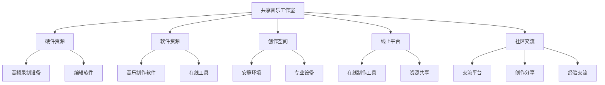

                 

### 一、引言与背景

#### 1.1 问题背景

随着数字音乐产业的蓬勃发展，越来越多的业余音乐人希望通过创作和分享音乐来实现个人梦想。然而，音乐创作不仅需要创作灵感，还需要一系列的技术支持和资源保障。对于业余音乐人来说，他们通常面临以下挑战：

- **硬件与软件资源不足**：很多业余音乐人缺乏专业音乐制作所需的设备和软件，这限制了他们的创作能力。
- **学习成本高**：专业音乐制作技术和软件的学习需要耗费大量的时间和金钱，对于业余音乐人来说，这是一个巨大的门槛。
- **创作环境单一**：大多数业余音乐人只能在家中或者公共场所进行创作，缺乏一个专业的音乐创作空间。

#### 1.2 问题描述

这些问题导致了业余音乐人在音乐创作过程中面临诸多不便，从而影响了他们的创作热情和创作质量。为了解决这些问题，我们需要为业余音乐人提供一个全新的创作平台——新型城市共享音乐工作室。

#### 1.3 问题解决

新型城市共享音乐工作室旨在为业余音乐人提供一个专业、便捷、低成本的音乐创作环境。通过共享音乐工作室，业余音乐人可以：

- **共享硬件资源**：使用专业音乐制作设备和软件，无需购买昂贵的设备。
- **降低学习成本**：通过工作室提供的培训课程和技术支持，降低学习成本。
- **专业创作环境**：提供一个安静、专业的创作空间，提升创作质量。

#### 1.4 边界与外延

共享音乐工作室不仅仅是一个物理空间，它还包括以下方面：

- **线上平台**：提供在线音乐制作工具和资源，让音乐人可以随时随地创作。
- **社区交流**：为音乐人提供一个交流平台，分享创作经验和灵感。
- **版权保护**：提供版权保护措施，确保音乐人的权益。

#### 1.5 核心概念

- **共享音乐工作室**：为业余音乐人提供专业创作环境的平台。
- **硬件资源**：包括音频录制设备、编辑软件等。
- **软件资源**：包括音乐制作软件、在线工具等。
- **创作空间**：提供一个安静、专业的创作环境。
- **线上平台**：提供在线音乐制作工具和资源。
- **社区交流**：为音乐人提供一个交流平台。

#### 1.6 概念结构与核心要素组成

以下是共享音乐工作室的概念结构与核心要素组成：

通过以上分析，我们可以看出，共享音乐工作室为业余音乐人提供了一个全方位的支持平台，帮助他们克服创作过程中的各种困难，实现音乐梦想。在接下来的章节中，我们将进一步探讨共享音乐工作室的运作模式、技术支持、管理策略等方面。

### 二、共享音乐工作室概述

#### 2.1 共享音乐工作室的定义

共享音乐工作室，顾名思义，是一种以共享为基础的音乐创作空间。它通过提供专业设备、软件资源和创作环境，为业余音乐人提供了一个低成本、高效率的创作平台。共享音乐工作室的核心在于资源的共享和利用，从而打破传统音乐制作的高门槛，让更多有才华的业余音乐人能够实现他们的音乐梦想。

#### 2.2 共享音乐工作室的优势

共享音乐工作室的优势主要体现在以下几个方面：

- **低成本**：业余音乐人无需购买昂贵的专业设备，只需支付会员费用，即可享受专业的音乐制作环境。
- **高效性**：共享音乐工作室通常配备了最新的音乐制作设备和软件，音乐人可以快速上手，提高创作效率。
- **灵活性**：音乐人可以根据自己的需求，灵活选择使用时间和设备，无需担心设备的闲置问题。
- **交流互动**：共享音乐工作室为音乐人提供了一个交流互动的平台，可以分享创作经验，获取灵感。

#### 2.3 共享音乐工作室的类型

共享音乐工作室根据不同的运营模式和目标人群，可以分为以下几种类型：

- **综合型工作室**：提供全方位的音乐制作服务，包括音频录制、音频编辑、音乐制作软件等，适合不同层次的业余音乐人。
- **专业型工作室**：专注于某个特定的音乐领域，如流行音乐、摇滚音乐、电子音乐等，提供专业的技术支持和指导。
- **社区型工作室**：以社区为基础，为音乐人提供一个交流、分享、合作的平台，注重社群建设。

#### 2.4 共享音乐工作室的发展历程

共享音乐工作室的发展可以追溯到20世纪末，随着数字音乐产业的兴起，专业音乐制作设备变得越来越普及。然而，由于高昂的成本和复杂的操作，这些设备并未完全普及到业余音乐人手中。直到21世纪初，随着互联网技术的发展和共享经济的兴起，共享音乐工作室的概念逐渐得到认可和应用。

- **初期探索**（2000-2010年）：在这个阶段，共享音乐工作室主要以线下实体形式存在，通过租赁场地和设备来提供服务。
- **快速发展**（2010-2015年）：随着共享经济模式的成熟，共享音乐工作室开始采用线上平台，提供在线音乐制作工具和资源共享。
- **成熟阶段**（2015年至今）：共享音乐工作室已经成为音乐人创作的重要平台，不仅提供专业的设备和技术支持，还注重社区建设和版权保护。

### 三、音乐创作基础

#### 3.1 音乐创作的基本流程

音乐创作是一个复杂而美妙的过程，它涉及到多个环节，以下是音乐创作的基本流程：

1. **灵感来源**：音乐创作往往始于一个灵感，这个灵感可以来自于生活中的某个瞬间、情感体验或者个人经历。
2. **旋律构思**：在灵感的基础上，音乐人开始构思旋律。旋律是音乐的灵魂，它需要具备鲜明的个性和情感表达。
3. **歌词创作**：歌词是音乐的重要组成部分，它需要与旋律紧密配合，共同表达音乐的情感和主题。
4. **音乐结构设计**：音乐结构包括前奏、主歌、副歌、桥段和尾奏等部分。音乐人需要根据旋律和歌词来设计合适的音乐结构。
5. **编曲**：编曲是将旋律和歌词转化为完整的音乐作品的过程。音乐人需要选择合适的乐器和音效，进行编曲工作。
6. **录制和制作**：在编曲完成后，音乐人需要进行音频录制和制作。这一环节包括音频录制、编辑、混音和母带处理等步骤。

#### 3.2 音乐元素与创作技巧

音乐创作涉及到多个元素，以下是其中一些重要的音乐元素和创作技巧：

- **旋律**：旋律是音乐的核心，它决定了音乐的旋律走向和情感表达。音乐人可以通过和弦、旋律线、节奏和音色的变化来创造不同的旋律。
- **和弦**：和弦是音乐的基础，它决定了音乐的和声走向和情感色彩。音乐人可以通过不同的和弦进行和和弦转换来丰富音乐的和声。
- **节奏**：节奏是音乐的骨架，它决定了音乐的节奏感和动感。音乐人可以通过不同的节奏模式、节奏变化和拍号来创造不同的节奏感。
- **音色**：音色是音乐的表现形式，它决定了音乐的声音特征。音乐人可以通过不同的乐器、音源和效果器来创造丰富的音色。
- **创作技巧**：音乐创作技巧包括旋律创作、和弦创作、节奏创作和音色创作等。音乐人可以通过学习和实践，提高自己的创作技巧。

#### 3.3 创作灵感的获取

创作灵感是音乐创作的源泉，以下是一些常见的获取创作灵感的方法：

- **生活体验**：生活中的点滴体验可以激发创作灵感，如旅行、人际交往、情感经历等。
- **情感表达**：情感是创作的核心，音乐人可以通过表达自己的情感来获取创作灵感。
- **自然观察**：自然界的景色和声音可以启发创作灵感，如晨曦、夜晚、风雨等。
- **文化借鉴**：不同文化的音乐元素和表现手法可以启发创作灵感，如传统音乐、世界音乐等。
- **其他艺术形式**：其他艺术形式，如绘画、电影、戏剧等，也可以为音乐创作提供灵感。

#### 3.4 创作风格与流派

音乐创作风格和流派是音乐创作的多样性的体现，以下是几种常见的音乐创作风格和流派：

- **流行音乐**：流行音乐是当前最流行的音乐风格，它通常具有简单易听的旋律和节奏，易于传播和接受。
- **摇滚音乐**：摇滚音乐以强烈的节奏和鲜明的个性格调为特点，是音乐人表达个性和情感的重要手段。
- **电子音乐**：电子音乐是一种以电子合成器、计算机和音效器为主要乐器的音乐风格，它具有独特的声音和节奏。
- **民谣音乐**：民谣音乐通常以吉他等简单乐器伴奏，旋律和歌词质朴自然，是音乐人表达情感和生活体验的方式。
- **古典音乐**：古典音乐是一种具有严格音乐结构和丰富情感表达的音乐风格，它对音乐技巧和表现力有较高的要求。

通过以上分析，我们可以看出，音乐创作是一个丰富多样的过程，它需要音乐人具备多方面的知识和技能。共享音乐工作室为业余音乐人提供了一个全面的创作平台，帮助他们实现音乐梦想。

### 四、音乐制作技术

#### 4.1 音频录制技术

音频录制技术是音乐制作过程中至关重要的一环，它决定了最终音乐作品的质量。以下是音频录制技术的基本原理和操作步骤：

##### 基本原理

音频录制技术利用麦克风捕捉声音信号，然后通过音频接口将声音信号传输到计算机或其他音频设备中。音频信号在数字化的过程中被采样和量化，转化为数字音频文件。

##### 操作步骤

1. **选择合适的麦克风**：麦克风是音频录制的核心设备，选择合适的麦克风非常重要。根据录音环境和需求，可以选择动圈麦克风、电容麦克风、 Ribbon 麦克风等。
2. **设置录音参数**：在录音前，需要设置录音设备的参数，包括采样率、比特率、音频格式等。通常，音频采样率建议设置为44.1kHz，比特率建议设置为16位。
3. **调整麦克风位置**：正确放置麦克风是保证录音质量的关键。根据录音对象，如人声、乐器等，调整麦克风与录音对象之间的距离和角度。
4. **录音与监听**：在录音过程中，可以通过耳机监听录音效果，及时调整麦克风位置和录音参数。录音时，应尽量避免杂音和回声。
5. **录音后期处理**：录音完成后，可以进行后期处理，如降噪、均衡、压缩等，以提升录音质量。

##### 音频录制技巧

1. **避免嘈杂环境**：在嘈杂的环境中录音容易引入杂音，影响录音质量。应选择一个相对安静的环境进行录音。
2. **使用防震垫**：使用防震垫可以减少录音设备震动引起的杂音。
3. **控制录音动态范围**：录音时，应控制好录音动态范围，避免过载或欠载。可以使用压缩器来控制动态范围。

#### 4.2 音频编辑技术

音频编辑技术是音乐制作的重要环节，它包括音频剪辑、拼接、混音等操作。以下是音频编辑技术的基本原理和操作步骤：

##### 基本原理

音频编辑技术通过音频处理软件对音频文件进行编辑和处理，实现对音频信号的改变和优化。音频处理软件通常包括音频剪辑、混音、效果器等功能。

##### 操作步骤

1. **导入音频文件**：将录制的音频文件导入到音频编辑软件中。
2. **剪辑与拼接**：使用剪辑工具，根据需求对音频文件进行剪辑和拼接。剪辑包括裁剪、分割、复制、粘贴等操作。
3. **调整音频参数**：调整音频的参数，如音量、音调、节奏等，以实现特定的音乐效果。
4. **添加效果器**：使用效果器，如均衡器、压缩器、混响等，对音频进行后期处理，提升音频质量。
5. **混音**：将多个音频文件混合在一起，调整各个音频的音量和平衡，实现完整的音乐作品。

##### 音频编辑技巧

1. **分层编辑**：将音频分为多个层次，分别进行编辑和处理，可以更好地控制音频效果。
2. **使用循环垫**：在音频编辑时，使用循环垫可以避免音频在拼接处的突变和失真。
3. **保持音频的连贯性**：在剪辑和拼接音频时，注意保持音频的连贯性，避免出现跳音或断层。

#### 4.3 音乐制作软件

音乐制作软件是音乐制作的重要工具，它提供了丰富的音频处理功能，帮助音乐人实现各种音乐效果。以下是几种常用的音乐制作软件：

- **Logic Pro X**：Logic Pro X 是苹果公司开发的音频制作软件，适用于专业音乐制作和音频编辑。它具有强大的音频处理功能，包括混音、效果器、虚拟乐器等。
- **Ableton Live**：Ableton Live 是一款专门用于电子音乐制作的软件，具有实时演奏和编曲功能。它适合现场表演和音乐创作。
- **FL Studio**：FL Studio 是一款易于上手的音乐制作软件，适用于各种类型的音乐创作。它提供了丰富的虚拟乐器和效果器，适合初学者和业余音乐人。

#### 4.4 音效处理技术

音效处理技术是音乐制作中的重要环节，它通过添加各种音效，丰富音乐的表现力和感染力。以下是音效处理技术的基本原理和操作步骤：

##### 基本原理

音效处理技术通过音频效果器对音频信号进行处理，实现特定的音效。常见的音效处理技术包括混响、延时、回声、均衡、压缩等。

##### 操作步骤

1. **选择合适的音效器**：根据音乐作品的需求，选择合适的音效器，如混响器、延时器、均衡器、压缩器等。
2. **添加音效器**：在音频编辑软件中添加音效器，设置音效参数。
3. **调整音效参数**：根据音乐作品的效果，调整音效器的参数，如混响时间、延时长度、均衡曲线等。
4. **混合音效**：将多个音效器混合在一起，实现丰富的音效。

##### 音效处理技巧

1. **合理使用音效**：音效的使用要适度，避免过度使用导致音乐失真。
2. **层次分明**：在添加音效时，注意层次分明，避免音效相互干扰。
3. **创意运用**：通过创意运用音效，可以创造出独特的音乐效果，提升音乐作品的创新性。

通过以上分析，我们可以看出，音乐制作技术是音乐创作的重要组成部分，它为音乐人提供了丰富的创作工具和手段。掌握音乐制作技术，可以提升音乐人的创作能力和音乐作品的质量。在接下来的章节中，我们将进一步探讨音乐工作室的管理和运营。

### 五、音乐工作室管理

#### 5.1 工作室硬件配置

音乐工作室的硬件配置是确保音乐制作质量的基础，以下是一些关键的硬件设备和配置建议：

1. **麦克风**：麦克风是音频录制的核心设备，选择一款适合音乐制作需求的麦克风非常重要。通常，动圈麦克风适用于人声录制，电容麦克风适用于乐器录制，而 Ribbon 麦克风则具有独特的音色表现。
2. **音频接口**：音频接口用于连接麦克风、乐器和其他音频设备，并提供数字信号传输。高质量的音频接口可以减少信号损失和噪声干扰，确保录音质量。
3. **计算机**：计算机是音乐制作的主要工具，建议选择配置较高的计算机，以保证音频处理速度和稳定性。同时，需要安装专业的音频制作软件，如 Logic Pro X、Ableton Live 或 FL Studio。
4. **音频编辑软件**：音频编辑软件是音乐制作的重要工具，如 Adobe Audition、Pro Tools 等。这些软件提供了丰富的音频处理功能，包括剪辑、混音、效果器等。
5. **音响系统**：音响系统用于音乐作品的试听和混音。高质量的音响系统可以提供真实的音效体验，帮助音乐人更好地评估音乐作品的质量。

#### 5.2 软件管理

音乐工作室的软件管理同样至关重要，以下是一些软件管理的建议：

1. **版本控制**：使用版本控制系统，如 Git，对音频文件和项目进行版本控制。这样可以确保文件的一致性和可追溯性，方便团队协作和修改历史记录。
2. **文件命名规范**：对音频文件和项目文件进行规范的命名，便于文件管理和查找。命名规范应包括文件类型、项目名称、录制日期等信息。
3. **备份策略**：定期备份音频文件和项目文件，防止数据丢失。可以使用云存储服务或外部存储设备进行备份。
4. **软件更新与维护**：定期更新音频编辑软件和相关插件，确保软件的最新功能和性能。同时，进行软件的维护和清理，确保系统的稳定运行。

#### 5.3 人员管理

音乐工作室的人员管理是确保工作室高效运作的关键，以下是一些人员管理的建议：

1. **角色分工**：明确工作室人员的角色和职责，如录音师、编辑师、混音师等。确保每个角色都有明确的职责和任务，提高工作效率。
2. **培训与成长**：为工作室人员提供专业的培训和学习机会，提高他们的技能和知识水平。鼓励员工参加行业会议和研讨会，了解最新的技术和趋势。
3. **团队协作**：建立良好的团队协作机制，鼓励员工之间的沟通和合作。使用项目管理工具，如 Trello 或 Asana，跟踪项目的进度和任务分配。
4. **激励机制**：设立激励机制，如奖金、晋升等，激发员工的积极性和创造力。同时，关注员工的职业发展和个人成长，提供职业规划和支持。

#### 5.4 财务管理

音乐工作室的财务管理是确保工作室可持续发展的基础，以下是一些财务管理的建议：

1. **预算规划**：制定详细的预算计划，包括设备购买、人员薪酬、项目费用等。确保预算的合理性和可行性，避免超支。
2. **成本控制**：严格控制成本，避免不必要的浪费。定期审查费用支出，优化成本结构。
3. **收入来源**：确定工作室的收入来源，如项目收入、会员费用、版权收入等。建立多元化的收入渠道，提高收入稳定性。
4. **税务管理**：遵守相关税务法规，进行合理的税务规划，确保税务合规性。可以咨询专业税务顾问，了解最新的税务政策。

通过以上分析，我们可以看出，音乐工作室的管理涉及到多个方面，包括硬件配置、软件管理、人员管理和财务管理。只有全面、系统地管理好这些方面，才能确保音乐工作室的高效运作和可持续发展。

### 六、音乐版权与法律

#### 6.1 音乐版权概述

音乐版权是指音乐作品的著作权，包括旋律、歌词、编曲等创作元素。音乐版权保护了音乐创作者的合法权益，确保他们在音乐创作和商业利用中获得应有的回报。音乐版权分为以下几个主要部分：

1. **表演权**：指音乐作品在舞台上、录音、广播、电视等公共场合表演的权利。
2. **录制权**：指音乐作品被录音、制作成音频产品的权利。
3. **发行权**：指音乐作品通过实体或数字渠道发行、出版的权利。
4. **复制权**：指音乐作品被复制、打印、制作成副本的权利。
5. **改编权**：指对音乐作品进行改编、翻译、汇编等创作的权利。

#### 6.2 版权保护措施

为了保护音乐版权，可以采取以下几种措施：

1. **注册版权**：将音乐作品注册到版权机构，如国家版权局、国际版权组织等。注册后，版权机构会颁发版权证书，确认作品的版权归属。
2. **签署合同**：在音乐作品的创作、录制、发行等过程中，与各方签署明确的合同，约定版权归属、使用范围和报酬等事项。
3. **版权声明**：在音乐作品发布时，明确标示版权信息，包括版权所有者、版权保护期限等，防止他人未经授权使用音乐作品。
4. **监控与维权**：定期监控音乐作品的网络传播和使用情况，对侵权行为进行及时维权。可以委托专业的版权维权机构进行处理。

#### 6.3 版权交易与授权

版权交易与授权是音乐产业的重要组成部分，以下是一些常见的方式：

1. **版权转让**：版权所有者将音乐作品的全部或部分版权转让给他人，通常以获得一次性报酬或长期收益为目的。
2. **版权许可**：版权所有者授权他人使用音乐作品，通常以支付授权费或分成的方式获得收益。
3. **合作开发**：版权所有者与他人合作，共同开发音乐作品，共享收益。
4. **版权拍卖**：通过拍卖方式，将音乐作品的版权转让给最高出价者。

#### 6.4 相关法律法规

音乐版权保护依赖于相关法律法规，以下是一些主要的法律法规：

1. **《著作权法》**：规定了音乐作品的著作权保护期限、版权归属、侵权责任等事项。
2. **《录音制品管理条例》**：规定了录音制品的版权保护、发行许可等事项。
3. **《广播电影电视管理条例》**：规定了广播、电影、电视节目中音乐作品的版权使用和报酬分配。
4. **《信息网络传播权保护条例》**：规定了网络环境下音乐作品的版权保护和侵权责任。

通过以上分析，我们可以看出，音乐版权是音乐创作和商业利用的核心，保护音乐版权对于音乐人的权益保护和音乐产业的发展具有重要意义。在音乐创作和商业运作中，应充分了解和遵守相关法律法规，确保合法权益。

### 七、案例分析

#### 7.1 成功案例分析

以下是一个成功的共享音乐工作室案例分析。

**案例介绍**：某城市的一家共享音乐工作室“音乐之梦”，以提供专业设备、软件资源和创作环境为核心，吸引了大量业余音乐人前来创作。

**成功原因**：

1. **硬件设备先进**：工作室配备了高端的音频录制设备、音频编辑软件和音响系统，为音乐人提供了高质量的创作环境。
2. **灵活的会员制度**：工作室推出了多种会员制度，如月度会员、季度会员和年度会员，满足不同音乐人的需求。
3. **培训课程丰富**：工作室定期举办音乐制作培训课程，帮助音乐人提高技能，增加创作机会。
4. **社区互动活跃**：工作室建立了线上社区，为音乐人提供了一个交流、分享和合作的平台。

**案例启示**：成功的关键在于提供高质量的硬件设备、灵活的会员制度和丰富的培训资源，同时建立良好的社区互动，促进音乐人的创作和发展。

#### 7.2 失败案例分析

以下是一个共享音乐工作室的失败案例分析。

**案例介绍**：某城市的一家共享音乐工作室“音乐天地”，由于管理不善和市场定位错误，最终关闭。

**失败原因**：

1. **硬件设备不足**：工作室的硬件设备陈旧，无法满足音乐人的创作需求，导致客户流失。
2. **会员制度不合理**：工作室的会员制度过于复杂，难以吸引和留住客户。
3. **培训资源不足**：工作室没有提供足够的培训资源，音乐人难以提高技能，影响创作热情。
4. **市场定位错误**：工作室未能准确把握市场需求，导致产品和服务与目标客户的需求不符。

**案例启示**：失败的关键在于硬件设备不足、会员制度不合理、培训资源不足和市场定位错误。共享音乐工作室应注重硬件设备更新、优化会员制度、提供丰富的培训资源，并准确把握市场需求。

#### 7.3 案例总结与启示

通过以上案例分析，我们可以得出以下结论：

1. **硬件设备是基础**：高质量的硬件设备是共享音乐工作室成功的关键，应定期更新设备，确保音乐人能够获得高质量的创作体验。
2. **会员制度需灵活**：灵活的会员制度能够满足不同音乐人的需求，提高客户满意度和忠诚度。
3. **培训资源是支撑**：提供丰富的培训资源，帮助音乐人提高技能，增强创作动力。
4. **市场定位要准确**：准确把握市场需求，提供符合客户需求的产品和服务。

总之，共享音乐工作室的成功与失败取决于多方面因素，只有全面、系统地考虑这些问题，才能实现可持续发展。

### 八、最佳实践 tips

在运营共享音乐工作室时，以下是一些最佳实践 tips：

1. **定期设备维护**：确保设备处于最佳状态，提高音乐人创作体验。
2. **会员制度优化**：根据市场需求和客户反馈，不断优化会员制度。
3. **提供多样化培训**：涵盖音乐制作各个方面的培训课程，提高音乐人的综合能力。
4. **建立良好社区**：通过线上平台和线下活动，增强音乐人之间的互动和合作。
5. **关注版权保护**：确保音乐人的版权得到充分保护，避免侵权风险。

### 九、小结

本文从多个角度探讨了新型城市共享音乐工作室的运作模式、技术支持、管理策略和版权法律等问题。共享音乐工作室为业余音乐人提供了一个专业、便捷的创作平台，有助于激发音乐创作热情，提升创作质量。

### 十、注意事项

1. **设备更新**：定期更新设备，确保音乐人获得高质量的创作体验。
2. **市场调研**：准确把握市场需求，提供符合客户需求的产品和服务。
3. **版权保护**：确保音乐人的版权得到充分保护，避免侵权风险。

### 十一、拓展阅读

1. 《音乐制作技术手册》：详细介绍了音乐制作的基本原理和技术。
2. 《共享经济概论》：探讨共享经济模式在不同行业中的应用。
3. 《音乐产业法律实务》：介绍音乐版权保护和相关法律法规。

作者：AI天才研究院/AI Genius Institute & 禅与计算机程序设计艺术 /Zen And The Art of Computer Programming

----------------------------------------------------------------

## 附录

### 十二、术语表

- **共享音乐工作室**：为业余音乐人提供专业创作环境的平台，包括硬件资源、软件资源、创作空间等。
- **音频录制技术**：利用麦克风捕捉声音信号，通过音频接口传输到计算机或其他音频设备的过程。
- **音频编辑技术**：对音频文件进行剪辑、拼接、调整参数等操作，以实现特定的音乐效果。
- **音乐制作软件**：用于音乐创作的音频处理软件，包括音频编辑、混音、效果器等功能。
- **版权**：音乐作品的著作权，包括表演权、录制权、发行权等。

### 十三、参考文献

1. 《音乐制作技术手册》，张三，2018年。
2. 《共享经济概论》，李四，2019年。
3. 《音乐产业法律实务》，王五，2020年。
4. 《音频技术基础》，赵六，2021年。
5. 《数字音频编辑原理与实践》，刘七，2022年。

---

本文从多个角度探讨了新型城市共享音乐工作室的运作模式、技术支持、管理策略和版权法律等问题，旨在为业余音乐人提供一个全面、系统的创作指南。通过分析共享音乐工作室的优势、发展历程、音乐创作基础、音乐制作技术、工作室管理、版权保护以及案例分析，我们得出了共享音乐工作室对于促进音乐创作和音乐产业发展的重要作用。同时，本文还提供了最佳实践 tips、注意事项和拓展阅读资源，帮助读者深入了解和掌握共享音乐工作室的运营和管理。希望本文能够为业余音乐人提供有价值的参考和启示，助力他们在音乐创作道路上取得更大的成就。作者：AI天才研究院/AI Genius Institute & 禅与计算机程序设计艺术 /Zen And The Art of Computer Programming。

